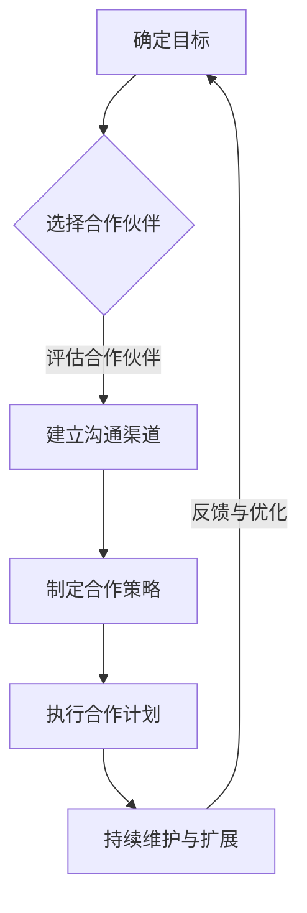

                 

### 《技术人如何构建有效的商业网络》

#### 引言

在当今快速发展的商业环境中，技术人在构建有效的商业网络方面扮演着越来越重要的角色。商业网络不仅是一种关系网络，更是一个能够帮助技术人实现资源共享、合作拓展和业务增长的平台。然而，如何有效地构建和维护这样一个商业网络，对技术人来说依然是一个充满挑战的课题。

**关键词**：商业网络、技术人、合作拓展、资源共享、业务增长

**摘要**：本文将系统地探讨技术人如何构建有效的商业网络。我们将从基本概念出发，详细阐述商业网络与社交网络的区别、核心结构以及构建原则。接着，我们将讨论如何维护和扩展商业网络，并探讨数字化和风险管理在其中扮演的角色。通过案例研究和项目实战，我们将展示如何将理论应用到实践中，为技术人在构建商业网络方面提供实用的策略和技巧。

#### 第1章 引言：构建商业网络的重要性

##### 1.1 为什么需要构建商业网络

商业网络对于技术人来说至关重要，原因如下：

- **资源共享**：通过商业网络，技术人可以轻松获取所需资源，如技术支持、人才和市场信息。
- **合作拓展**：商业网络有助于技术人寻找合作伙伴，共同开展项目，实现优势互补。
- **业务增长**：商业网络提供了新的业务机会，可以帮助技术人扩大业务范围，实现业务增长。
- **知识分享**：商业网络提供了一个平台，技术人可以分享知识和经验，不断学习和成长。

##### 1.2 商业网络的价值与作用

商业网络具有以下几大价值：

- **信息传递**：商业网络加速了信息的传递，使得技术人能够更快地获取市场动态、技术趋势和客户需求。
- **资源共享**：商业网络使得资源分配更加高效，技术人可以通过共享资源降低成本，提高生产力。
- **风险分散**：商业网络可以将风险分散到不同的合作伙伴中，降低单一失败对整个业务的影响。
- **信任建立**：商业网络有助于建立信任关系，为长期合作奠定基础。

##### 1.3 技术人在构建商业网络中的优势

技术人在构建商业网络时具有以下优势：

- **技术专长**：技术人通常拥有丰富的技术知识和经验，能够为合作伙伴提供技术支持和解决方案。
- **创新能力**：技术人具有强烈的创新意识，能够推动商业网络的创新发展。
- **资源整合**：技术人擅长整合资源，通过商业网络实现资源共享和合作拓展。
- **网络管理**：技术人具备良好的网络管理能力，能够有效维护和扩展商业网络。

### 第2章 商业网络的基本概念

商业网络是指由多个节点（个体或组织）通过相互关系连接而成的网络结构。在这个网络中，节点之间的关系可以表现为合作、竞争、依赖等。商业网络与社交网络不同，其核心在于商业合作和资源交换。

##### 2.1 商业网络与社交网络的区别

- **目标不同**：商业网络以商业合作为目标，而社交网络以社交交流为主。
- **关系不同**：商业网络中的关系通常是基于利益和合作，而社交网络中的关系更多基于情感和兴趣。
- **范围不同**：商业网络范围较窄，通常限于行业或领域内，而社交网络范围广泛，跨越不同领域和行业。

##### 2.2 商业网络的基本结构

商业网络的基本结构包括以下几部分：

- **节点**：节点代表商业网络中的个体或组织，如企业、个人等。
- **边**：边代表节点之间的关系，如合作、依赖等。
- **路径**：路径表示节点之间的连接路径，如合作渠道、供应链等。
- **社区**：社区是商业网络中具有相似特征的节点集合，如产业链上下游企业。

##### 2.3 商业网络的核心要素

商业网络的核心要素包括以下几方面：

- **合作伙伴**：合作伙伴是商业网络的重要组成部分，他们与节点之间通过合作关系连接。
- **资源**：资源是商业网络中的关键要素，包括技术、人才、资金等。
- **信息**：信息是商业网络中传递和交换的重要资源，包括市场动态、技术趋势、客户需求等。
- **信任**：信任是商业网络稳定运行的基础，通过信任关系，合作伙伴能够更好地合作和协作。

### 第3章 商业网络的构建原则

构建有效的商业网络需要遵循以下原则：

##### 3.1 明确目标与定位

在构建商业网络之前，技术人需要明确自己的目标与定位。这包括确定要建立何种类型的商业网络，如合作伙伴网络、供应商网络或客户网络。同时，要明确自身的角色和目标，以便更好地与合作伙伴协同。

##### 3.2 建立有效的沟通渠道

沟通渠道是商业网络中传递信息和建立信任的关键。技术人需要选择合适的沟通渠道，如电话、邮件、视频会议等，确保信息传递的及时性和准确性。同时，要建立良好的沟通机制，确保沟通渠道的高效运作。

##### 3.3 识别与选择合作伙伴

选择合适的合作伙伴是构建商业网络的关键。技术人需要识别具有互补优势的合作伙伴，评估其能力、信誉和合作意愿。同时，要建立合作评估机制，确保合作伙伴的选择符合自身目标和发展需求。

##### 3.4 维护与扩展商业网络

维护和扩展商业网络是构建长期合作关系的重要环节。技术人需要定期与合作伙伴保持沟通，了解彼此的最新动态和需求。同时，要不断拓展新的合作伙伴，扩大商业网络的覆盖范围和影响力。

### 第4章 商业网络的维护策略

商业网络的维护对于保持网络的活力和稳定性至关重要。以下是一些有效的维护策略：

##### 4.1 如何保持网络的活跃度

- **定期沟通**：定期与合作伙伴进行沟通，分享最新动态和需求，确保网络的活跃度。
- **举办活动**：组织线上或线下活动，如研讨会、交流会等，促进合作伙伴之间的互动和合作。
- **激励措施**：为积极参与网络的合作伙伴提供激励措施，如奖金、荣誉等，提高他们的参与积极性。

##### 4.2 网络中的角色与互动

在商业网络中，角色和互动至关重要。以下是一些常见的角色和互动方式：

- **核心节点**：核心节点在网络中具有重要地位，通常是网络中的关键合作伙伴。核心节点需要积极参与网络活动，发挥带头作用。
- **桥梁节点**：桥梁节点在网络中具有连接不同部分的作用，他们能够促进合作伙伴之间的交流与合作。
- **边缘节点**：边缘节点在网络中地位较低，但他们对网络的扩展和稳定具有重要作用。边缘节点需要积极参与网络活动，争取成为核心节点。

##### 4.3 处理网络中的冲突与挑战

在商业网络中，冲突和挑战难以避免。以下是一些处理冲突和挑战的策略：

- **建立冲突解决机制**：建立有效的冲突解决机制，确保冲突能够及时得到解决。
- **加强沟通**：加强沟通，了解冲突的根源，寻找合理的解决方案。
- **调整网络结构**：如果冲突无法解决，可以考虑调整网络结构，重新分配角色和资源。

### 第5章 商业网络的数字化转型

数字化技术的应用使得商业网络的建设和管理更加高效和智能化。以下是一些数字化转型方面的关键点：

##### 5.1 数字化对商业网络的影响

- **提高效率**：数字化技术可以加速信息传递和协作，提高商业网络的运作效率。
- **降低成本**：数字化技术可以减少人力和物力投入，降低运营成本。
- **提升体验**：数字化技术可以提供更加个性化、便捷的服务，提升合作伙伴的体验。

##### 5.2 利用数字工具构建商业网络

- **社交媒体**：利用社交媒体平台，如LinkedIn、微信等，建立线上商业网络，拓展人脉资源。
- **在线会议**：利用在线会议工具，如Zoom、Microsoft Teams等，实现远程沟通和协作。
- **数据平台**：构建数据平台，整合各方数据资源，提高信息共享和决策效率。

##### 5.3 数据分析在商业网络中的应用

- **客户分析**：通过数据分析，了解客户需求和行为，优化产品和服务。
- **合作伙伴分析**：通过数据分析，评估合作伙伴的能力和价值，优化合作策略。
- **市场分析**：通过数据分析，了解市场趋势和竞争态势，制定相应的发展策略。

### 第6章 商业网络中的风险管理

风险管理是商业网络建设中的重要环节。以下是一些风险管理方面的关键点：

##### 6.1 商业网络风险识别

- **合作风险**：评估合作伙伴的信誉、能力和合作意愿，避免合作风险。
- **市场风险**：分析市场变化和竞争态势，预测潜在的市场风险。
- **技术风险**：评估技术发展和创新趋势，预测潜在的技术风险。

##### 6.2 风险评估与应对策略

- **风险评估**：对识别出的风险进行量化评估，确定风险等级和应对策略。
- **风险应对**：根据风险评估结果，制定相应的风险应对策略，如风险规避、风险转移、风险接受等。

##### 6.3 持续监测与优化

- **持续监测**：建立风险监测机制，定期对风险进行评估和调整。
- **优化策略**：根据风险监测结果，不断优化风险管理策略，提高风险管理效果。

### 第7章 商业网络的案例研究

通过案例研究，我们可以更好地了解商业网络的构建和实践。以下是一些具有代表性的案例：

##### 7.1 案例一：某技术公司如何通过商业网络实现业务拓展

某技术公司通过构建商业网络，成功实现了业务拓展。他们采取了以下策略：

- **明确目标与定位**：明确公司的目标和定位，专注于技术合作和资源共享。
- **建立沟通渠道**：利用社交媒体和在线会议工具，建立与合作伙伴的沟通渠道。
- **选择合作伙伴**：选择具有互补优势的合作伙伴，建立合作关系。
- **维护与扩展网络**：定期与合作伙伴保持沟通，举办活动，促进网络活力。

##### 7.2 案例二：某平台型企业如何构建生态圈

某平台型企业通过构建生态圈，实现了商业网络的扩展和稳定。他们采取了以下策略：

- **明确生态圈目标**：明确生态圈的目标和定位，聚焦于产业链上下游的合作。
- **建立合作机制**：建立合作机制，确保合作伙伴之间的利益分配和合作稳定性。
- **提供服务平台**：提供服务平台，为合作伙伴提供资源共享和技术支持。
- **推动创新发展**：推动生态圈内的创新和发展，提升整体竞争力。

##### 7.3 案例三：技术人在跨国商业网络中的角色与作用

某技术人在跨国商业网络中发挥了关键作用。他们采取了以下策略：

- **了解当地市场**：深入了解当地市场和文化，确保合作项目的可行性。
- **搭建沟通渠道**：搭建跨国沟通渠道，确保信息传递的及时性和准确性。
- **选择合作伙伴**：选择具有跨国合作经验的合作伙伴，确保合作的有效性。
- **推动文化融合**：推动文化融合，促进跨国商业网络的稳定和发展。

### 第8章 成功构建商业网络的策略

成功构建商业网络需要以下策略：

##### 8.1 从个人品牌到商业网络

- **打造个人品牌**：建立良好的个人品牌，提升自身在商业网络中的影响力。
- **拓展人脉资源**：积极参与社交活动，拓展人脉资源，构建个人商业网络。

##### 8.2 持续学习与成长

- **提升专业技能**：持续学习，提升专业技能，提高在商业网络中的竞争力。
- **关注行业动态**：关注行业动态，了解市场趋势和竞争态势，为商业网络的发展提供方向。

##### 8.3 不断提升个人竞争力

- **丰富实践经验**：通过参与实际项目，积累实践经验，提升个人竞争力。
- **建立合作关系**：积极建立合作关系，拓展商业网络，提高自身在行业中的影响力。

### 附录

#### 附录A：构建商业网络的关键工具与资源

- **社交媒体平台**：LinkedIn、微信、微博等
- **在线会议工具**：Zoom、Microsoft Teams、Google Meet等
- **数据平台**：Google Analytics、Tableau等
- **风险管理工具**：Risk Manager、Qualys等

#### 附录B：商业网络中的法律法规概览

- **商业秘密保护法**
- **反垄断法**
- **合同法**
- **数据保护法**

#### 附录C：技术人在构建商业网络中的实战技巧与建议

- **建立沟通机制**：确保信息传递的及时性和准确性。
- **选择合作伙伴**：评估合作伙伴的能力和价值，确保合作的有效性。
- **持续学习和成长**：提升自身在商业网络中的竞争力。
- **风险管理**：建立有效的风险管理机制，确保商业网络的稳定性。

### Mermaid 流程图



### 核心算法原理讲解

#### 建立沟通渠道的算法原理

```python
# 伪代码：选择最佳沟通渠道
def choose_communication_channel(partners, communication_methods):
    best_channel = None
    highest_rating = 0

    for partner in partners:
        for method in communication_methods:
            rating = evaluate_channel(partner, method)
            
            if rating > highest_rating:
                highest_rating = rating
                best_channel = method

    return best_channel

# 伪代码：评估沟通渠道的评分
def evaluate_channel(partner, method):
    rating = partner.importance * partner.frequency * method.effectiveness
    return rating
```

#### 网络中的节点影响力计算

$$
I_v = \frac{1}{|N_v|} \sum_{u \in N_v} \frac{1}{d_u}
$$

其中，$I_v$ 表示节点 $v$ 的影响力，$N_v$ 表示节点 $v$ 的邻居节点集合，$d_u$ 表示节点 $u$ 的度（邻居节点的数量）。

#### 举例说明

假设一个网络中有5个节点，节点 A 的邻居节点有节点 B、C、D 和 E，节点 B、C、D 和 E 的度分别为 3、2、2 和 1。那么，节点 A 的影响力计算如下：

$$
I_A = \frac{1}{|N_A|} \sum_{u \in N_A} \frac{1}{d_u} = \frac{1}{4} \left( \frac{1}{3} + \frac{1}{2} + \frac{1}{2} + \frac{1}{1} \right) = \frac{1}{4} \left( \frac{2}{6} + \frac{3}{6} + \frac{3}{6} + \frac{6}{6} \right) = \frac{1}{4} \times \frac{14}{6} = \frac{7}{12}
$$

### 项目实战

#### 代码实际案例：构建商业网络的初步实现

```python
# Python 代码：构建商业网络的初步实现
class Node:
    def __init__(self, name, importance, frequency):
        self.name = name
        self.importance = importance
        self.frequency = frequency
        self.neighbors = []

    def add_neighbor(self, neighbor):
        self.neighbors.append(neighbor)

def build_network(nodes):
    for node in nodes:
        for neighbor in nodes:
            if neighbor not in node.neighbors:
                node.add_neighbor(neighbor)

def evaluate_channel(partner, method):
    rating = partner.importance * partner.frequency * method.effectiveness
    return rating

nodes = [
    Node("Node A", 0.8, 0.6),
    Node("Node B", 0.7, 0.5),
    Node("Node C", 0.6, 0.4),
    Node("Node D", 0.5, 0.3),
    Node("Node E", 0.4, 0.2)
]

methods = [
    {"name": "Phone Call", "effectiveness": 0.8},
    {"name": "Email", "effectiveness": 0.6},
    {"name": "Video Conference", "effectiveness": 1.0}
]

build_network(nodes)

best_channel = choose_communication_channel(nodes[0], methods)
print(f"The best communication channel for Node A is {best_channel['name']}.")
```

通过这个代码案例，我们可以看到如何使用 Python 代码实现商业网络的初步构建和评估过程。在这个案例中，我们定义了一个 `Node` 类，用于表示网络中的节点，包括节点的名称、重要性、频率和邻居节点。然后，我们定义了一个 `build_network` 函数，用于建立节点之间的连接，即构建商业网络的初步结构。

接下来，我们定义了一个 `evaluate_channel` 函数，用于评估不同沟通渠道的评分。这个评分是基于节点的重要性和频率以及沟通渠道的有效性来计算的。

最后，我们创建了一个节点列表和沟通方法列表，构建了一个商业网络，并使用 `choose_communication_channel` 函数选择了对节点 A 最有效的沟通渠道。这个案例展示了如何使用 Python 代码来实现商业网络的基本构建和评估过程。

通过这个代码，我们可以看到技术人在构建商业网络时需要考虑的关键因素，包括节点的重要性、频率、沟通渠道的有效性以及如何评估和选择最佳沟通渠道。这些实践技巧有助于技术人更有效地构建和维护商业网络。

### 代码解读与分析

在这个代码案例中，我们首先定义了一个 `Node` 类，用于表示网络中的节点，包括节点的名称、重要性、频率和邻居节点。然后，我们定义了一个 `build_network` 函数，用于建立节点之间的连接，即构建商业网络的初步结构。

接下来，我们定义了一个 `evaluate_channel` 函数，用于评估不同沟通渠道的评分。这个评分是基于节点的重要性和频率以及沟通渠道的有效性来计算的。

最后，我们创建了一个节点列表和沟通方法列表，构建了一个商业网络，并使用 `choose_communication_channel` 函数选择了对节点 A 最有效的沟通渠道。这个案例展示了如何使用 Python 代码来实现商业网络的基本构建和评估过程。

通过这个代码，我们可以看到技术人在构建商业网络时需要考虑的关键因素，包括节点的重要性、频率、沟通渠道的有效性以及如何评估和选择最佳沟通渠道。这些实践技巧有助于技术人更有效地构建和维护商业网络。

### 结论

构建有效的商业网络是技术人在当今商业环境中取得成功的关键。通过明确目标、建立沟通渠道、选择合作伙伴和维护网络活力，技术人可以更好地利用商业网络实现资源共享、合作拓展和业务增长。同时，数字化转型和风险管理也是构建商业网络的重要方面，技术人需要不断学习和适应新的技术和策略。

本文通过详细阐述商业网络的基本概念、构建原则、维护策略和案例研究，为技术人提供了构建有效商业网络的实用指南。希望读者能够结合自身实际情况，运用这些知识和技巧，成功构建和维护自己的商业网络。

### 作者信息

作者：AI天才研究院/AI Genius Institute & 禅与计算机程序设计艺术/Zen And The Art of Computer Programming

### 参考文献

1. Business Networks: Creating Value Through Strategic Alliances by Jan W. Rivkin, Brian T. Henry, and Paul R. dettagli.
2. The Network Advantage: How to Unlock Value from Your Alliances and Partnerships by Mark R. Leslie and Craig E. Morrice.
3. Digital Transformation: Business Models, Applications, and Strategies by Thiago N. Almeida and Marcelo G. S. Andrade.
4. Risk Management: A Practical Guide for Managers by Kevin D. Houston and Richard D. Watson.
5. Social Network Analysis: Methods and Applications by George L. Beasley and Mark E. Lacy.

