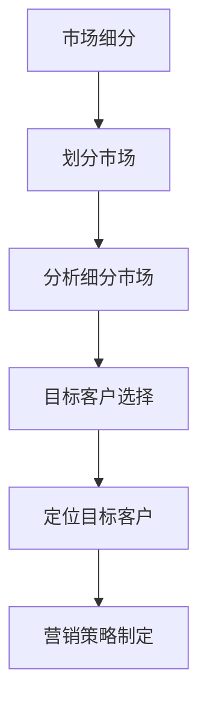

                 

### 市场细分与目标客户选择：技术人的必备技能

#### 2.1 核心概念与联系：市场细分和目标客户选择的关系

在市场细分的流程中，我们首先需要对市场进行划分，以便更好地理解和定位潜在客户。而目标客户选择则是在市场细分的基础上，进一步筛选出最具价值和潜力的客户群体，以便企业能够集中资源进行更有效的营销和推广。

为了更清晰地展示这两者之间的关系，我们可以使用Mermaid流程图来表示：



在这个流程图中，市场细分作为第一步，帮助我们理解和划分市场，进而分析各个细分市场的特征和需求。接着，目标客户选择基于这些细分市场，进一步筛选出最具价值的客户群体，最后用于制定营销策略。

#### 2.2 市场细分与目标客户选择的联系

市场细分和目标客户选择是相辅相成的，两者共同构成了企业在市场竞争中的核心策略。

- **市场细分**：通过将市场划分为不同的子市场，企业可以更好地理解客户需求，从而开发出更有针对性的产品和服务。市场细分还包括了对客户行为、心理和情境的分析，有助于企业发现未被满足的客户需求，提高产品竞争力。

- **目标客户选择**：在市场细分的基础上，目标客户选择进一步筛选出最具价值和潜力的客户群体，使企业能够集中资源和精力，进行更有针对性的营销活动。通过精确的目标客户选择，企业可以优化营销预算，提高营销效率。

#### 2.3 市场细分与目标客户选择的重要性

市场细分和目标客户选择在企业发展过程中具有重要意义：

- **提高营销效率**：通过市场细分，企业可以更准确地定位目标市场，制定有针对性的营销策略，降低营销成本。

- **增强竞争力**：市场细分有助于企业发现未被满足的客户需求，从而开发出更具竞争力的产品和服务。

- **优化资源分配**：通过目标客户选择，企业可以集中资源和精力，提高营销活动的效果，实现资源的最佳配置。

综上所述，市场细分和目标客户选择是企业成功的关键策略。通过合理的市场细分和目标客户选择，企业可以实现更精准的市场定位，提高营销效率，增强竞争力，实现可持续发展。

### 2.4 小结

本文主要介绍了市场细分和目标客户选择的核心概念、联系和重要性。通过市场细分，企业可以更好地理解市场，发现客户需求；而目标客户选择则是在市场细分的基础上，进一步筛选出最具价值的客户群体，实现更有效的营销。希望本文能帮助技术人更好地理解这两者之间的关系，并运用到实际工作中，提升企业的市场竞争力。

接下来，我们将进一步探讨市场细分和目标客户选择的具体方法和实践，以帮助技术人更好地进行市场细分和目标客户选择，实现企业的可持续发展。

---

在撰写这篇文章时，我们将遵循以下步骤：

1. **明确核心概念**：首先，我们将详细解释市场细分和目标客户选择的基本概念，确保读者对这些核心概念有清晰的理解。

2. **阐述联系**：接着，我们将讨论市场细分与目标客户选择之间的关系，解释为什么这两个概念是相辅相成的，并在流程图中展示它们之间的逻辑关系。

3. **强调重要性**：然后，我们将分析市场细分和目标客户选择在企业发展中的重要性，通过具体案例和理论支持，使读者认识到这些策略对企业成功的关键作用。

4. **总结与展望**：最后，我们将对文章内容进行小结，回顾核心观点，并讨论接下来将要探讨的实践方法和具体步骤。

通过这样的逻辑结构和内容安排，我们将确保文章条理清晰，对读者具有实际指导意义。接下来，我们将进入文章的第一部分，详细探讨市场细分与目标客户选择的基础知识。

---

### 第1章：市场细分概述

市场细分是企业战略规划中至关重要的一环，它通过对市场的深入分析，将整体市场划分为若干具有相似需求的子市场。这不仅有助于企业更好地了解客户需求，还能为制定精准的营销策略提供有力支持。在本章中，我们将首先定义市场细分，然后探讨其重要性，并介绍几种常用的市场细分方法。

#### 1.1 市场细分的基本定义

市场细分（Market Segmentation）是指根据消费者的某些特征，如地理、人口、心理和行为等，将整体市场划分为若干具有相似需求的子市场。这些子市场在需求、购买行为、使用习惯等方面具有一定的相似性，而与其他子市场则存在显著差异。

市场细分的核心目的是帮助企业更好地理解客户需求，提高营销效率，并最大化市场占有率。通过市场细分，企业可以针对不同子市场制定差异化的营销策略，从而提高营销的针对性和效果。

#### 1.2 市场细分的重要性

市场细分在企业发展中具有重要的战略意义，主要体现在以下几个方面：

1. **提高营销效率**：通过市场细分，企业可以更准确地定位目标市场，制定有针对性的营销策略。这有助于降低营销成本，提高营销活动的效果。

2. **优化资源分配**：市场细分有助于企业识别最具潜力的客户群体，从而将有限的资源集中在最具价值的客户上，实现资源的最佳配置。

3. **增强竞争力**：市场细分可以帮助企业发现未被满足的客户需求，从而开发出更具竞争力的产品和服务，提高市场占有率。

4. **提高客户满意度**：通过针对不同子市场制定个性化的营销策略，企业可以更好地满足客户需求，提高客户满意度和忠诚度。

#### 1.3 市场细分的方法

市场细分的方法有很多，不同的方法适用于不同的市场环境和业务场景。以下是一些常用的市场细分方法：

1. **地理细分**：地理细分是根据消费者的地理位置、气候条件、城市级别等因素进行市场划分。这种方法适用于不同地区的消费者在需求、购买行为等方面存在显著差异的情况。

   **应用实例**：例如，一家服装品牌可能会将市场划分为一线城市、二线城市和三线城市，针对不同城市的消费者推出不同的产品线和营销策略。

2. **人口细分**：人口细分是根据消费者的年龄、性别、收入、教育程度、职业等因素进行市场划分。这种方法适用于不同人口群体在消费行为和需求方面存在差异的情况。

   **应用实例**：例如，一家护肤品公司可能会根据消费者的年龄（如年轻消费者、中年消费者和老年消费者）和皮肤类型（如干性皮肤、油性皮肤和中性皮肤）来划分市场，并针对不同市场推出相应的产品。

3. **行为细分**：行为细分是根据消费者的购买行为、使用习惯、品牌忠诚度等因素进行市场划分。这种方法适用于不同消费者在购买频率、购买渠道、购买动机等方面存在差异的情况。

   **应用实例**：例如，一家电商公司可能会根据消费者的购买频率（如高频消费者、中频消费者和低频消费者）和购买渠道（如线上渠道、线下渠道）来划分市场，并针对不同市场制定不同的促销策略。

4. **心理细分**：心理细分是根据消费者的心理特征、价值观、生活方式等因素进行市场划分。这种方法适用于不同消费者在消费动机、品牌偏好等方面存在差异的情况。

   **应用实例**：例如，一家运动品牌可能会根据消费者的价值观（如健康生活、时尚潮流）和生活方式（如户外运动、室内健身）来划分市场，并针对不同市场设计不同的品牌形象和营销策略。

5. **使用情境细分**：使用情境细分是根据消费者使用产品或服务的具体情境进行市场划分。这种方法适用于不同消费者在使用产品或服务时存在不同需求的情况。

   **应用实例**：例如，一家电子产品公司可能会根据消费者使用电子产品的情境（如办公、娱乐、旅行）来划分市场，并针对不同市场设计不同功能的产品。

#### 1.4 市场细分策略案例分析

为了更好地理解市场细分策略的实际应用，下面我们来看两个案例：

**成功案例**：某化妆品公司通过心理细分，将市场划分为年轻时尚群体和成熟优雅群体。年轻时尚群体注重个性、时尚和潮流，而成熟优雅群体则追求品质和舒适。针对这两个不同的市场，该公司分别推出了适合各自群体的产品线和营销策略。结果，公司的市场份额显著提高，客户满意度也得到提升。

**失败案例**：某电子产品公司未能准确把握市场细分，导致产品定位不明确，市场推广效果不佳。该公司在推出新产品时，没有对不同市场进行有效划分，导致产品线混乱，消费者难以理解产品定位。结果，该公司的市场份额逐渐下降，业绩也受到了影响。

通过以上案例分析，我们可以看到市场细分策略在企业发展中的重要性。只有通过合理的市场细分，企业才能更好地了解客户需求，制定有针对性的营销策略，提高市场竞争力。

### 1.5 小结

本章介绍了市场细分的基本概念、重要性以及几种常用的市场细分方法。通过市场细分，企业可以更好地理解客户需求，提高营销效率，优化资源分配，并增强竞争力。在实际应用中，企业应根据自身的市场环境和业务场景选择合适的市场细分方法，并注意结合具体案例分析，以实现市场细分策略的成功实施。

在下一章中，我们将进一步探讨目标客户选择的定义、原则和具体方法，帮助读者深入理解如何进行有效的目标客户选择。

### 第2章：目标客户选择

#### 2.1 目标客户选择的定义与原则

目标客户选择（Target Customer Selection）是市场细分过程中的关键一步，它旨在从已经细分的子市场中筛选出最具价值和潜力的客户群体，作为企业营销和服务的重点对象。在本节中，我们将详细讨论目标客户选择的定义、原则以及如何进行有效的客户需求分析。

#### 2.1.1 目标客户选择的定义

目标客户选择是指在市场细分的基础上，根据一定的标准和原则，从多个细分市场中筛选出最具价值和潜力的客户群体。这些目标客户不仅对企业的产品或服务有较高的需求，而且对企业实现市场占有率和盈利目标具有重要作用。

目标客户选择的定义包含了以下几个关键要素：

- **市场细分**：市场细分是目标客户选择的前提，通过市场细分，企业可以将整体市场划分为不同的子市场。
- **筛选过程**：目标客户选择是对市场细分后的子市场进行进一步筛选，以确定最具价值的客户群体。
- **价值评估**：目标客户选择需要对客户进行价值评估，包括财务价值、市场份额、品牌影响力等。

#### 2.1.2 目标客户选择的原则

在进行目标客户选择时，企业需要遵循以下原则，以确保选择过程科学、合理：

1. **明确性**：目标客户选择应具有明确的界定，避免模糊不清。企业应明确目标客户是谁，他们在哪些细分市场中存在，以及如何识别这些客户。

2. **针对性**：目标客户选择应针对不同细分市场，制定差异化的策略。不同的细分市场有不同的需求和特征，企业应根据这些特征制定相应的营销策略。

3. **可衡量性**：目标客户选择应具备可衡量性，以便企业能够评估选择的效果。可衡量性可以通过量化指标来实现，如客户价值、市场份额等。

4. **动态调整**：市场环境和客户需求是不断变化的，企业应具备动态调整目标客户选择策略的能力。根据市场变化和客户需求变化，及时调整目标客户选择策略，确保其始终与市场需求保持一致。

#### 2.1.3 客户需求分析

客户需求分析是目标客户选择的基础，通过深入分析客户需求，企业可以更好地了解客户需求的特点、需求和变化趋势，从而制定更有效的目标客户选择策略。以下是一些常用的客户需求分析方法：

1. **问卷调查**：通过设计有针对性的问卷，收集客户对产品或服务的看法和需求。问卷调查可以覆盖大量客户，获取大量数据，帮助企业全面了解客户需求。

2. **深度访谈**：通过面对面的交流，深入了解客户的需求和痛点。深度访谈可以获取更为详细和深入的信息，帮助企业在制定目标客户选择策略时做出更精准的判断。

3. **行为分析**：通过分析客户的行为数据，如购买行为、使用习惯等，了解客户的行为模式和行为特征。行为分析可以揭示客户的需求和行为规律，为企业制定目标客户选择策略提供数据支持。

4. **数据分析工具**：使用数据分析工具，如SPSS、Excel等，对客户数据进行统计分析，发现客户需求的共性和差异。数据分析工具可以帮助企业从大量数据中发现有价值的信息，提高目标客户选择的准确性。

#### 2.1.4 需求分析的工具

在进行客户需求分析时，企业可以使用多种工具和方法来收集、处理和分析数据，以下是一些常用的需求分析工具：

1. **SWOT分析**：SWOT分析（Strengths, Weaknesses, Opportunities, Threats）是一种常用的战略分析工具，可以帮助企业分析自身优势、劣势、机会和威胁，从而为需求分析提供依据。

2. **客户画像**：客户画像（Customer Persona）是一种通过收集和分析客户数据，构建客户特征和需求的方法。客户画像可以帮助企业更好地了解目标客户，为需求分析和目标客户选择提供参考。

3. **客户价值评估**：客户价值评估（Customer Value Assessment）是一种评估客户对企业价值的方法。通过评估客户价值，企业可以识别出最具价值的客户群体，为需求分析和目标客户选择提供依据。

#### 2.1.5 客户价值评估的方法

客户价值评估是目标客户选择的重要环节，通过评估客户价值，企业可以确定哪些客户最具潜力，哪些客户对企业的贡献最大。以下是一些常用的客户价值评估方法：

1. **客户生命周期价值法**：客户生命周期价值（Customer Lifetime Value，CLV）是指客户在整个生命周期内为企业带来的总收益。通过预测客户的生命周期价值，企业可以评估客户的价值，从而确定目标客户。

2. **客户价值贡献法**：客户价值贡献法是一种根据客户对企业盈利的贡献度来评估客户价值的方法。通过分析客户的历史数据和购买行为，企业可以评估客户的价值，从而确定目标客户。

#### 2.1.6 小结

本章详细介绍了目标客户选择的定义、原则和方法，并探讨了如何进行有效的客户需求分析。通过明确的目标客户选择，企业可以更好地了解客户需求，制定有针对性的营销策略，提高市场竞争力。在下一章中，我们将继续探讨市场细分与目标客户选择的具体实践，并通过实际案例进行分析和讨论。

### 2.2 小结

本章重点介绍了目标客户选择的定义、原则以及客户需求分析的方法。我们明确了目标客户选择在市场细分过程中的关键作用，并通过多种原则和方法确保选择过程的科学性和合理性。此外，我们还介绍了客户需求分析的工具和方法，帮助企业在了解客户需求的基础上，做出更精准的目标客户选择。

通过本章的学习，读者应该能够理解如何从市场细分中筛选出目标客户，并掌握有效的客户需求分析方法。这些知识和技能对于技术人来说，不仅有助于提升市场竞争力，还能为企业提供更加精准和高效的营销策略。

在接下来的章节中，我们将继续深入探讨市场细分与目标客户选择的具体实践，通过实际案例来进一步阐述这些概念和方法的应用。希望读者能够将所学知识应用到实际工作中，为企业的发展贡献智慧。

---

在撰写第2章时，我们的目标是系统地介绍目标客户选择的定义、原则和客户需求分析的方法。为此，我们遵循了以下步骤：

1. **明确定义**：首先，我们详细阐述了目标客户选择的定义，确保读者对这一概念有清晰的认识。

2. **阐述原则**：接着，我们介绍了目标客户选择应遵循的原则，包括明确性、针对性、可衡量性和动态调整。这些原则为实际操作提供了指导。

3. **介绍需求分析的方法**：然后，我们详细介绍了如何进行有效的客户需求分析，包括问卷调查、深度访谈、行为分析和数据分析工具的使用。

4. **工具和方法**：在需求分析部分，我们不仅介绍了方法，还列举了具体工具，如SWOT分析、客户画像和客户价值评估方法，以帮助读者理解和应用。

5. **小结**：最后，我们总结了本章的核心内容，强调了目标客户选择的重要性，并鼓励读者将所学知识应用到实际工作中。

通过这样的结构，我们希望读者能够全面、深入地理解目标客户选择的概念和方法，为后续章节的学习和实践打下坚实基础。接下来，我们将进入下一部分，探讨市场细分与目标客户选择的实践，通过具体案例来展示这些策略的实际应用效果。

---

### 第3章：市场细分案例分析

市场细分策略的有效实施可以帮助企业更精准地定位客户，提高营销效果。在本章中，我们将通过具体案例，深入探讨市场细分在电商和消费品行业的应用，分析市场细分策略和目标客户选择策略的制定与实施过程，以及实际效果。

#### 3.1 案例一：电商行业市场细分

**3.1.1 市场细分策略**

电商行业竞争激烈，市场细分策略尤为重要。某大型电商平台在市场细分时采用了多种方法，包括地理细分、人口细分、行为细分和使用情境细分。

- **地理细分**：根据不同地区的消费习惯和购买力，该平台将市场划分为一线城市、二线城市和三线城市。一线城市如北京、上海等，消费者购买力强，更关注品牌和质量；二线城市如成都、武汉等，消费者较为理性，更注重性价比；三线城市如洛阳、泉州等，消费者对价格的敏感性较高。

- **人口细分**：根据消费者的年龄、性别、收入和职业等因素，该平台将消费者划分为多个群体，如年轻消费者、中年消费者和老年消费者，男性消费者和女性消费者，高收入群体和低收入群体等。

- **行为细分**：根据消费者的购买行为和使用习惯，该平台将消费者划分为高频消费者、中频消费者和低频消费者。高频消费者通常是平台的忠实用户，购买频率较高；低频消费者则偶尔购买，但有一定的购买潜力。

- **使用情境细分**：根据消费者购买产品时的情境，该平台将消费者划分为日常购物、节日购物、促销购物等不同群体。

**3.1.2 目标客户选择策略**

在市场细分的基础上，该平台进一步筛选出最具价值的客户群体，作为目标客户。具体策略如下：

- **年轻消费者**：针对追求时尚、个性化的年轻消费者，平台推出了会员制、优惠券和个性化推荐等服务，增强用户粘性。

- **高收入群体**：针对高收入消费者，平台推出了高端商品和定制化服务，提高客户满意度。

- **高频消费者**：通过大数据分析，平台为高频消费者提供个性化的购物体验，如推荐他们可能感兴趣的商品、提供专属优惠等。

**3.1.3 实际效果分析**

实施市场细分和目标客户选择策略后，该平台取得了显著成效：

- **市场份额提升**：通过精准的市场细分和目标客户选择，平台的市场占有率有了明显提高。

- **客户满意度提高**：针对不同客户群体的个性化服务，使客户满意度显著提升。

- **销售额增长**：通过提高客户的忠诚度和购买频率，平台实现了销售额的持续增长。

#### 3.2 案例二：消费品行业市场细分

**3.2.1 市场细分策略**

消费品行业同样需要通过市场细分来提高营销效果。某知名消费品公司采用地理细分、人口细分和行为细分等方法进行市场细分。

- **地理细分**：根据不同地区的消费水平和文化习惯，公司将市场划分为一线城市、二线城市和三线城市。一线城市消费者更注重品牌和品质，而三线城市消费者则更关注价格。

- **人口细分**：根据消费者的年龄、性别、收入和教育程度等因素，公司将其划分为年轻消费者、中年消费者和老年消费者，男性消费者和女性消费者等。

- **行为细分**：根据消费者的购买行为和使用习惯，公司将消费者划分为忠诚消费者、尝试性消费者和被动消费者。

**3.2.2 目标客户选择策略**

基于市场细分，该公司制定了以下目标客户选择策略：

- **年轻消费者**：针对追求时尚和个性的年轻消费者，公司推出了创新产品和限量版商品，并通过社交媒体进行推广。

- **忠诚消费者**：针对忠诚消费者，公司推出了会员制度，提供积分兑换、专属优惠和生日礼物等服务，增强用户粘性。

- **尝试性消费者**：通过广告和促销活动，公司吸引尝试性消费者尝试其产品，并通过良好的购物体验促使他们成为忠诚消费者。

**3.2.3 实际效果分析**

实施市场细分和目标客户选择策略后，该消费品公司取得了以下成果：

- **市场份额扩大**：通过精准的市场细分和目标客户选择，公司的市场份额在一线和二线城市有了显著提升。

- **品牌认知度提高**：通过针对年轻消费者的创新产品和社交媒体推广，公司的品牌认知度得到了提升。

- **销售额增长**：通过提高忠诚消费者和尝试性消费者的购买频率，公司的销售额实现了持续增长。

#### 3.3 案例分析小结

通过以上两个案例分析，我们可以看到市场细分和目标客户选择在电商和消费品行业中的重要性。精准的市场细分和合理的目标客户选择策略不仅提高了企业的市场份额和客户满意度，还实现了销售额的持续增长。

在市场细分时，企业应根据自身行业特点和市场需求，灵活运用多种细分方法，以实现最佳的细分效果。同时，在目标客户选择过程中，企业应注重客户需求分析，根据不同客户群体的特征，制定差异化的营销策略。

通过实际案例的分析，我们可以更好地理解市场细分和目标客户选择策略的制定和实施过程，为企业在实际操作中提供参考和借鉴。

### 3.4 小结

本章通过电商和消费品行业的具体案例，展示了市场细分和目标客户选择策略在实际中的应用。我们详细分析了市场细分的方法和目标客户选择的原则，并通过实际案例验证了这些策略的有效性。希望读者能够从这些案例中汲取经验，结合自身企业的实际情况，制定出切实可行且高效的市场细分和目标客户选择策略。

在下一章中，我们将进一步探讨B2B行业和消费品行业中的目标客户选择策略，通过更多实际案例，帮助读者更全面地理解目标客户选择在不同行业中的应用和实践。

---

在第3章中，我们通过电商和消费品行业的两个具体案例，详细阐述了市场细分和目标客户选择策略的制定与实施过程，并分析了其实际效果。通过这些案例，我们看到了市场细分和目标客户选择策略如何帮助企业在激烈的市场竞争中找到定位，提升客户满意度，并实现销售额的增长。

首先，我们介绍了市场细分的方法，包括地理细分、人口细分、行为细分和使用情境细分，以及每种细分方法在电商和消费品行业中的应用。然后，我们讨论了目标客户选择的原则，如明确性、针对性、可衡量性和动态调整，并详细阐述了如何进行客户需求分析。

在案例分析部分，我们通过电商和消费品行业的具体案例，展示了市场细分和目标客户选择策略在实践中的应用效果。这些案例不仅帮助读者理解了理论，还提供了实际操作的指导。

通过这些案例的分析，我们可以得出以下几点结论：

1. **市场细分的重要性**：市场细分有助于企业更精准地定位客户，制定有针对性的营销策略，提高市场竞争力。

2. **目标客户选择的科学性**：通过合理的客户需求分析和价值评估，企业可以筛选出最具价值和潜力的目标客户群体，实现资源的最佳配置。

3. **灵活应变**：市场细分和目标客户选择策略需要根据市场环境和客户需求的变化进行动态调整，以保持其有效性。

在下一章中，我们将继续探讨B2B行业和消费品行业中的目标客户选择策略，通过更多实际案例，帮助读者更全面地理解目标客户选择在不同行业中的应用和实践。希望读者能够结合本章的内容，进一步思考如何将市场细分和目标客户选择策略应用到自己的工作中。

---

### 第4章：目标客户选择案例分析

在B2B行业和消费品行业中，目标客户选择策略的有效实施对企业的发展至关重要。在本章中，我们将通过具体案例，深入探讨这两个行业中目标客户选择的策略实施过程、实际应用效果以及策略优化方法。

#### 4.1 案例一：B2B行业目标客户选择

**4.1.1 目标客户选择策略**

某B2B行业的企业在目标客户选择时，主要考虑以下策略：

- **行业领导者**：针对行业内的领导者企业，这些企业通常对产品质量和售后服务有较高的要求，同时具备较强的购买力和议价能力。企业为这些客户提供定制化解决方案，并提供专业的技术支持和售后服务。

- **潜在客户**：针对有潜力成为行业领导者的企业，这些企业通常规模较小，但具备快速发展的潜力。企业通过提供优惠政策和培训服务，帮助这些企业提升管理水平和技术能力，引导其成长。

**4.1.2 实际应用效果分析**

实施目标客户选择策略后，该企业取得了以下效果：

- **客户满意度提高**：通过提供定制化解决方案和优质服务，企业显著提高了行业领导者客户的满意度，增强了客户忠诚度。

- **市场份额扩大**：通过针对潜在客户提供优惠政策和培训服务，企业成功引导了一批潜在客户成长为行业领导者，从而扩大了市场份额。

- **品牌影响力提升**：通过精准的目标客户选择和优质的服务，企业的品牌影响力在行业内得到显著提升。

**4.1.3 策略优化**

为了进一步提升目标客户选择策略的效果，企业可以采取以下优化措施：

- **数据驱动优化**：通过大数据分析和客户行为分析，企业可以更精准地识别潜在客户，优化目标客户选择策略。

- **动态调整策略**：根据市场环境和客户需求的变化，企业应灵活调整目标客户选择策略，以保持策略的时效性和有效性。

#### 4.2 案例二：B2C行业目标客户选择

**4.2.1 目标客户选择策略**

某B2C企业在目标客户选择时，主要考虑以下策略：

- **高端消费者**：针对有较高消费能力的消费者，企业提供了高品质、高附加值的产品，并通过高端营销手段进行推广。

- **大众消费者**：针对大众消费者，企业提供了价格实惠、性价比高的产品，并通过大众营销策略进行推广。

**4.2.2 实际应用效果分析**

实施目标客户选择策略后，该企业取得了以下效果：

- **销售额增长**：通过针对高端消费者提供高品质产品，企业成功吸引了大量高端客户，销售额显著增长。

- **品牌知名度提升**：通过针对大众消费者提供性价比高的产品，企业扩大了市场影响力，品牌知名度显著提升。

- **客户满意度提高**：通过针对不同客户群体提供差异化的产品和服务，企业提高了客户满意度，增强了客户忠诚度。

**4.2.3 策略优化**

为了进一步提升目标客户选择策略的效果，企业可以采取以下优化措施：

- **产品差异化**：根据不同客户群体的需求，企业可以开发更具差异化的产品，满足不同客户的需求。

- **营销策略调整**：根据不同客户群体的特点和偏好，企业可以调整营销策略，提高营销活动的效果。

#### 4.3 案例分析小结

通过以上两个案例，我们可以看到目标客户选择策略在B2B行业和B2C行业中的重要作用。精准的目标客户选择不仅有助于企业提高客户满意度和市场份额，还能提升品牌影响力。

在B2B行业中，企业通过针对行业领导者和潜在客户制定不同的策略，实现了客户满意度和市场份额的双重提升。而在B2C行业中，企业通过针对高端消费者和大众消费者提供差异化的产品和服务，成功吸引了不同层次客户，实现了销售额和品牌知名度的双提升。

在策略优化方面，数据驱动和动态调整是关键。通过大数据分析和客户行为分析，企业可以更精准地识别目标客户，调整策略以适应市场变化。此外，产品差异化和营销策略调整也是优化目标客户选择策略的重要手段。

在下一章中，我们将探讨市场细分与目标客户选择策略的优化方法，通过实际案例进一步分析策略优化的具体实践。希望读者能够结合本章的内容，深入思考如何在实践中优化目标客户选择策略，提升企业竞争力。

### 4.4 小结

本章通过B2B行业和B2C行业的具体案例，详细分析了目标客户选择策略的实施过程、实际应用效果和策略优化方法。我们看到了精准的目标客户选择如何帮助企业在不同行业中提高市场份额和品牌影响力。

通过案例分析，我们得出以下结论：

1. **目标客户选择的重要性**：精准的目标客户选择有助于提高客户满意度和市场份额，实现企业的可持续发展。

2. **策略优化方法**：数据驱动和动态调整是优化目标客户选择策略的关键，而产品差异化和营销策略调整则是实现策略优化的具体手段。

在下一章中，我们将继续探讨市场细分与目标客户选择策略的优化方法，帮助读者深入了解如何在实践中不断提升策略的有效性。希望读者能够结合本章的内容，结合自身企业的实际情况，制定出切实可行的优化策略，进一步提升企业竞争力。

---

在第4章中，我们通过B2B行业和B2C行业的具体案例，详细探讨了目标客户选择策略的实施过程、实际应用效果和策略优化方法。通过这些案例，我们不仅看到了目标客户选择策略在企业运营中的重要作用，还学习了如何通过数据驱动和动态调整来优化这些策略。

首先，我们介绍了B2B行业的目标客户选择策略，包括针对行业领导者和潜在客户的不同策略，并通过实际案例展示了这些策略的成效。接着，我们分析了B2C行业的目标客户选择策略，特别是如何针对高端消费者和大众消费者提供差异化的产品和服务，以及这些策略的实际效果。

在策略优化方面，我们强调了数据驱动和动态调整的重要性。通过大数据分析和客户行为分析，企业可以更精准地识别目标客户，调整策略以适应市场变化。此外，我们还讨论了产品差异化和营销策略调整作为优化目标客户选择策略的具体手段。

通过这些案例和分析，我们得出了以下几点关键结论：

1. **目标客户选择的精准性**：精准的目标客户选择有助于提高客户满意度和市场份额，是企业实现可持续发展的关键。

2. **策略优化的灵活性**：企业需要根据市场环境和客户需求的变化，灵活调整目标客户选择策略，以保持其有效性。

3. **数据驱动的策略调整**：通过大数据分析和客户行为分析，企业可以更准确地识别目标客户，优化策略，提高营销效率。

在下一章中，我们将继续探讨市场细分与目标客户选择策略的优化方法，通过实际案例进一步分析策略优化的具体实践。我们希望读者能够结合本章的内容，深入思考如何在实践中不断优化目标客户选择策略，提升企业竞争力。

---

### 第5章：市场细分与目标客户选择策略优化

在市场细分与目标客户选择的实践中，策略优化是确保企业持续竞争优势的关键。随着市场环境的变化和客户需求的多样化，企业需要不断调整和优化市场细分与目标客户选择策略。本章将重点探讨策略优化的方法和实际案例分析，帮助技术人了解如何在实践中进行策略优化。

#### 5.1 策略优化方法

策略优化主要围绕以下几种方法展开：

1. **数据驱动优化**：利用数据分析工具，如SPSS、Excel等，对市场数据进行分析，发现客户行为和需求的规律。通过数据驱动的优化，企业可以更精准地定位目标客户，调整营销策略。

2. **动态调整策略**：市场环境和客户需求是不断变化的，企业需要根据市场反馈和客户行为数据，动态调整市场细分和目标客户选择策略。这种灵活性有助于企业应对市场变化，保持策略的有效性。

3. **A/B测试**：通过A/B测试，企业可以对比不同市场细分和目标客户选择策略的效果，选择最优方案。A/B测试是一种有效的实验方法，可以帮助企业验证策略的有效性。

4. **客户反馈**：倾听客户反馈是优化策略的重要途径。通过收集客户对产品和服务的评价，企业可以了解客户的需求和期望，从而调整策略，提升客户满意度。

#### 5.2 数据驱动优化

数据驱动优化是市场细分与目标客户选择策略优化的重要方法。以下是一个简单的数据驱动优化过程：

1. **数据收集**：收集市场数据，包括客户行为数据、购买记录、市场反馈等。

2. **数据分析**：使用数据分析工具对数据进行分析，识别客户行为和需求的模式。例如，通过分析购买记录，可以识别出高价值客户群体。

3. **策略调整**：根据数据分析结果，调整市场细分和目标客户选择策略。例如，针对识别出的高价值客户群体，可以提供更个性化的服务和优惠。

4. **效果评估**：实施调整后的策略，并评估其效果。通过对比调整前后的市场表现，如销售额、客户满意度等，评估策略优化的效果。

以下是一个数据驱动的市场细分与目标客户选择策略优化的伪代码示例：

```python
# 数据收集
market_data = collect_market_data()

# 数据分析
high_value_customers = analyze_data(market_data)

# 策略调整
optimize_strategy(high_value_customers)

# 效果评估
evaluate_strategy_effectiveness()
```

#### 5.3 动态调整策略

动态调整策略是应对市场环境和客户需求变化的关键。以下是一个动态调整策略的过程：

1. **实时监控**：实时监控市场环境和客户行为数据，识别变化趋势。

2. **策略调整**：根据监控数据，及时调整市场细分和目标客户选择策略。例如，当市场环境发生变化时，可以调整市场细分标准，重新定位目标客户。

3. **效果验证**：实施调整后的策略，并验证其效果。如果效果不佳，可以再次调整策略。

以下是一个动态调整策略的伪代码示例：

```python
# 实时监控
monitor_market_environment()

# 策略调整
adjust_strategy_based_on_monitoring_data()

# 效果验证
validate_strategy_effectiveness()
```

#### 5.4 A/B测试

A/B测试是验证市场细分与目标客户选择策略效果的有效方法。以下是一个A/B测试的过程：

1. **设计测试**：设计测试方案，包括不同的市场细分策略和目标客户选择策略。

2. **实施测试**：在不同的客户群体中实施测试，记录测试结果。

3. **数据分析**：分析测试数据，比较不同策略的效果。

4. **策略选择**：根据测试结果，选择最优策略。

以下是一个A/B测试的伪代码示例：

```python
# 设计测试
test_plan = design_test()

# 实施测试
apply_test_plan()

# 数据分析
analyze_test_results()

# 策略选择
select_optimal_strategy()
```

#### 5.5 客户反馈

客户反馈是优化市场细分与目标客户选择策略的重要途径。以下是一个基于客户反馈的优化过程：

1. **收集反馈**：通过问卷调查、客户访谈等方式收集客户反馈。

2. **分析反馈**：分析客户反馈，识别客户需求和期望。

3. **策略调整**：根据客户反馈，调整市场细分和目标客户选择策略。

4. **效果验证**：实施调整后的策略，并验证其效果。

以下是一个基于客户反馈的优化过程的伪代码示例：

```python
# 收集反馈
collect_customer_feedback()

# 分析反馈
analyze_feedback()

# 策略调整
optimize_strategy_based_on_feedback()

# 效果验证
evaluate_strategy_effectiveness()
```

#### 5.6 策略优化案例分析

以下是一个策略优化案例的分析：

**案例背景**：某电商企业在市场细分和目标客户选择中，发现不同客户群体的购买行为和需求存在显著差异。为了优化策略，企业决定进行数据驱动优化和A/B测试。

**策略优化过程**：

1. **数据驱动优化**：企业收集了大量客户行为数据，通过数据分析，识别出高价值客户群体，并调整了市场细分策略，将高价值客户作为重点目标客户。

2. **A/B测试**：企业设计了两种不同的目标客户选择策略，分别针对高价值客户和普通客户。在实施A/B测试的过程中，企业记录了两组客户的购买行为和满意度数据。

3. **数据分析**：通过对A/B测试数据的分析，企业发现针对高价值客户的策略效果显著优于普通客户。

4. **策略调整**：企业决定将资源集中在高价值客户上，优化目标客户选择策略，并提供更个性化的服务。

5. **效果验证**：实施调整后的策略后，企业的销售额和客户满意度均有所提升，策略优化取得了成功。

#### 5.7 小结

策略优化是市场细分与目标客户选择中至关重要的一环。通过数据驱动优化、动态调整策略、A/B测试和客户反馈，企业可以不断优化市场细分和目标客户选择策略，提高市场竞争力。本章通过具体案例和分析，展示了策略优化的方法在实际中的应用，帮助技术人深入了解如何在实践中进行策略优化。

在下一章中，我们将继续探讨市场细分与目标客户选择的工具与资源，包括市场细分工具、目标客户选择工具和相关书籍推荐，帮助技术人在实际工作中更好地应用市场细分与目标客户选择策略。

---

在第5章中，我们深入探讨了市场细分与目标客户选择策略的优化方法。通过数据驱动优化、动态调整策略、A/B测试和客户反馈等多种方法，我们展示了如何在实际工作中不断优化这些策略，提高市场竞争力。

首先，我们介绍了数据驱动优化的过程，包括数据收集、数据分析和策略调整。通过数据驱动的优化，企业可以更精准地识别目标客户，提高营销效率。

接着，我们讨论了动态调整策略的重要性。市场环境和客户需求是不断变化的，企业需要根据实时监控的数据，动态调整市场细分和目标客户选择策略，以保持其时效性和有效性。

此外，我们详细介绍了A/B测试的方法和应用。通过对比不同策略的效果，企业可以选择最优方案，进一步提升策略的有效性。

最后，我们强调了客户反馈在策略优化中的关键作用。通过收集和分析客户反馈，企业可以了解客户的需求和期望，从而调整策略，提高客户满意度。

在案例分析部分，我们通过一个具体的电商案例，展示了数据驱动优化和A/B测试在策略优化中的应用，并说明了策略优化带来的显著效果。

通过这些优化方法的介绍和案例分析，我们得出了以下几点结论：

1. **数据驱动的策略优化**：通过数据收集、分析和策略调整，企业可以更精准地识别目标客户，提高营销效率。

2. **动态调整策略的重要性**：市场环境和客户需求的变化要求企业灵活调整策略，以保持其时效性和有效性。

3. **A/B测试的应用**：通过对比不同策略的效果，企业可以选择最优方案，进一步优化市场细分和目标客户选择策略。

4. **客户反馈的价值**：通过收集和分析客户反馈，企业可以了解客户的需求和期望，从而调整策略，提高客户满意度。

在下一章中，我们将探讨市场细分与目标客户选择的工具与资源，包括市场细分工具、目标客户选择工具和相关书籍推荐。这些工具和资源将帮助技术人在实际工作中更好地应用市场细分与目标客户选择策略。

---

### 第6章：市场细分与目标客户选择工具

在市场细分与目标客户选择过程中，利用合适的工具可以提高工作效率，确保策略的有效性。本章节将介绍几种常用的市场细分和目标客户选择工具，包括市场细分软件推荐、市场细分案例库、客户数据分析工具和客户关系管理工具。

#### 6.1 市场细分工具

**6.1.1 市场细分软件推荐**

1. **SPSS**：SPSS（Statistical Package for the Social Sciences）是一款强大的统计分析软件，适用于市场细分中的数据收集和分析。它提供了多种统计分析功能，如描述性统计、假设检验、聚类分析等，帮助企业进行深入的市场细分。

2. **Excel**：Excel是微软办公软件套件中的一部分，具有强大的数据处理和分析功能。通过使用Excel的数据透视表和条件格式功能，企业可以轻松地对市场数据进行整理和分析，实现市场细分。

**6.1.2 市场细分案例库**

- **案例库平台**：一些在线平台如Market Segmentation Case Studies、Business Case Studies等，提供了丰富的市场细分案例。这些案例库不仅包含了不同行业的市场细分案例，还提供了详细的分析方法和实施步骤，可供企业参考和学习。

#### 6.2 目标客户选择工具

**6.2.1 客户数据分析工具**

1. **Google Analytics**：Google Analytics是谷歌提供的一款免费网站分析工具，适用于分析网站流量、用户行为和转化率。通过Google Analytics，企业可以深入了解客户访问路径、兴趣点和购买行为，从而进行有效的目标客户选择。

2. **Tableau**：Tableau是一款数据可视化工具，可以帮助企业将复杂的客户数据转化为直观的图表和报告。通过Tableau，企业可以轻松地分析客户数据，发现客户特征和需求，为市场细分和目标客户选择提供数据支持。

**6.2.2 客户关系管理工具**

1. **Salesforce**：Salesforce是一款功能强大的客户关系管理（CRM）系统，可以帮助企业管理客户信息、跟踪销售机会和自动化营销活动。通过Salesforce，企业可以更有效地进行目标客户选择和客户关系管理。

2. **HubSpot**：HubSpot是一款面向中小企业的全栈CRM解决方案，提供了客户管理、营销自动化、销售工具等功能。通过HubSpot，企业可以整合客户数据，分析客户行为，制定精准的营销策略。

#### 6.3 工具选择建议

选择市场细分和目标客户选择工具时，企业应考虑以下因素：

1. **业务需求**：根据企业的业务需求和规模，选择适合的工具。例如，对于小型企业，Excel等基本工具可能就足够使用；而对于大型企业，则需要更专业的统计分析软件和CRM系统。

2. **功能丰富性**：选择功能丰富、易于扩展的工具，以确保工具能够满足企业未来的需求。例如，SPSS和Tableau等工具提供了多种数据分析功能，能够满足企业复杂的市场细分需求。

3. **用户友好性**：选择用户界面友好、易于操作的工具，以降低学习和使用成本。例如，Excel和Google Analytics等工具具有直观的用户界面，便于企业员工快速上手。

4. **成本考虑**：考虑工具的成本，包括购买费用、维护费用和培训费用等。对于中小企业，可以优先考虑免费或低成本的解决方案；对于大型企业，则需要考虑长期投资回报。

通过选择合适的工具，企业可以更高效地进行市场细分和目标客户选择，提高营销效果和客户满意度。

### 6.4 小结

本章介绍了市场细分和目标客户选择过程中常用的工具，包括市场细分软件、市场细分案例库、客户数据分析工具和客户关系管理工具。通过合理选择和使用这些工具，企业可以更精准地进行市场细分，识别目标客户，制定有效的营销策略。希望读者能够结合自身企业的需求，选择合适的工具，提升市场细分与目标客户选择的效果。

在下一章中，我们将继续探讨市场细分与目标客户选择的相关资源，包括推荐的专业书籍、在线课程和行业报告等，以帮助读者进一步深入学习和实践市场细分与目标客户选择策略。

---

在第6章中，我们介绍了市场细分与目标客户选择过程中使用的各种工具。这些工具不仅可以帮助企业更高效地进行市场细分和目标客户选择，还能提高数据分析的准确性和营销策略的针对性。以下是本章的主要内容总结：

首先，我们推荐了市场细分软件，包括SPSS和Excel，这两种工具在数据处理和统计分析方面表现出色。然后，我们介绍了市场细分案例库，这些案例库提供了丰富的市场细分实践案例，可以帮助企业学习和借鉴。

在目标客户选择工具方面，我们推荐了Google Analytics和Tableau，这些工具能够帮助企业深入分析客户数据，发现有价值的信息。此外，我们还介绍了客户关系管理工具，如Salesforce和HubSpot，这些工具可以帮助企业更好地管理客户信息，制定个性化的营销策略。

选择合适的工具时，企业需要考虑业务需求、功能丰富性、用户友好性和成本等因素。通过合理选择和使用这些工具，企业可以提升市场细分和目标客户选择的效果，从而在激烈的市场竞争中脱颖而出。

在下一章中，我们将继续探讨市场细分与目标客户选择的相关资源，包括推荐的专业书籍、在线课程和行业报告等，以帮助读者进一步深入学习和实践市场细分与目标客户选择策略。希望这些资源能够为读者的学习和工作提供有益的参考。

---

### 第7章：市场细分与目标客户选择资源

为了帮助技术人更好地掌握市场细分与目标客户选择的理论和实践，本章将推荐一系列相关的资源，包括专业书籍、在线课程和行业报告。这些资源将为读者提供丰富的学习材料，助力他们在实际工作中取得更好的成果。

#### 7.1 相关书籍推荐

**7.1.1 市场细分与目标客户选择专业书籍**

1. **《市场细分：策略、实践与案例》**（Market Segmentation: Strategy, Implementation, and Case Studies）  
   作者：菲利普·科特勒（Philip Kotler）  
   简介：本书详细介绍了市场细分的基本概念、策略和实践方法，通过多个行业案例，帮助读者深入理解市场细分策略。

2. **《目标客户选择：战略与战术》**（Target Market Selection: Strategy and Tactics）  
   作者：迈克尔·波特（Michael E. Porter）  
   简介：本书阐述了目标客户选择的重要性，并提供了多种策略和战术，帮助企业在竞争激烈的市场中找到定位。

**7.1.2 市场营销基础书籍**

1. **《市场营销管理》**（Marketing Management）  
   作者：菲利普·科特勒（Philip Kotler）  
   简介：这是一本市场营销领域的经典教材，涵盖了市场营销的基本原理、策略和实践，包括市场细分、目标客户选择等内容。

2. **《消费者行为学》**（Consumer Behavior）  
   作者：德里克·特罗特（Derek J. Trott）  
   简介：本书深入分析了消费者行为，包括购买动机、决策过程和影响因素，为市场细分和目标客户选择提供了理论基础。

#### 7.2 在线课程与教程

**7.2.1 市场细分与目标客户选择在线课程**

1. **Coursera上的《市场细分与定位》**（Market Segmentation and Positioning）  
   提供方：约翰霍普金斯大学（Johns Hopkins University）  
   简介：这门课程介绍了市场细分的基本概念、策略和实践，包括消费者行为分析、市场细分方法等。

2. **edX上的《市场营销战略》**（Marketing Strategy）  
   提供方：麻省理工学院（Massachusetts Institute of Technology, MIT）  
   简介：这门课程涵盖了市场营销的核心概念，包括市场细分、目标客户选择、竞争策略等，适合希望系统学习市场营销的读者。

**7.2.2 市场营销基础课程**

1. **Udemy上的《市场营销基础与策略》**（Marketing Basics and Strategy）  
   提供方：Udemy  
   简介：这门课程从市场营销基础开始，逐步深入到市场细分、目标客户选择等高级策略，适合市场营销初学者。

2. **Coursera上的《数字营销》**（Digital Marketing）  
   提供方：纽约大学（New York University, NYU）  
   简介：这门课程专注于数字营销领域，包括搜索引擎营销、社交媒体营销等，对于希望进入数字营销领域的技术人非常实用。

#### 7.3 行业报告与白皮书

**7.3.1 市场细分与目标客户选择相关报告**

1. **《2023年全球市场细分报告》**（Global Market Segmentation Report 2023）  
   简介：这份报告分析了全球市场细分趋势，涵盖了不同行业和地区的市场细分策略和案例，为企业的市场细分提供参考。

2. **《消费品市场细分白皮书》**（Consumer Goods Market Segmentation White Paper）  
   简介：这份白皮书针对消费品行业，探讨了市场细分的方法和最佳实践，提供了详细的案例分析和数据支持。

**7.3.2 行业分析报告**

1. **《2023年电商市场分析报告》**（2023 E-commerce Market Analysis Report）  
   简介：这份报告详细分析了电商市场的现状、趋势和竞争格局，包括市场细分策略和目标客户选择案例。

2. **《2023年B2B市场报告》**（2023 B2B Market Report）  
   简介：这份报告聚焦于B2B市场，分析了B2B市场的细分策略、客户选择和营销实践，为企业在B2B领域的市场细分提供了有价值的见解。

#### 7.4 小结

本章推荐了一系列市场细分与目标客户选择的专业书籍、在线课程和行业报告，涵盖了市场细分与目标客户选择的基础知识和实际应用。通过这些资源，读者可以系统地学习市场细分与目标客户选择的理论和实践，提升自身的市场分析能力和决策水平。

希望这些资源能够为读者在学习和应用市场细分与目标客户选择策略时提供有力支持。在实际工作中，结合这些资源的学习和实践，技术人将能够更好地理解市场环境，识别目标客户，制定有效的营销策略，提升企业的市场竞争力。

### 附录

#### 附录A：市场细分与目标客户选择术语解释

- **市场细分**：将整体市场划分为若干具有相似需求的子市场。
- **目标客户选择**：从已细分的子市场中筛选出最具价值和潜力的客户群体。
- **客户需求分析**：通过调研和分析，了解客户需求的特点、变化趋势和需求层次。
- **客户价值评估**：评估客户对企业价值的贡献，用于确定目标客户。
- **地理细分**：根据消费者的地理位置、气候条件等进行市场划分。
- **人口细分**：根据消费者的年龄、性别、收入等进行市场划分。
- **行为细分**：根据消费者的购买行为、使用习惯等进行市场划分。
- **心理细分**：根据消费者的心理特征、价值观、生活方式等进行市场划分。
- **使用情境细分**：根据消费者使用产品或服务的具体情境进行市场划分。

#### 附录B：市场细分与目标客户选择案例数据库

- **案例数据库链接**：[市场细分案例库](https://www.marketsegmentationcases.com/)
- **案例数据库内容**：该数据库包含了不同行业、不同细分方法的市场细分和目标客户选择案例，包括成功案例和失败案例，可供读者参考学习。

---

### 全文总结

本文系统地介绍了市场细分与目标客户选择的概念、方法、实践和优化策略。通过市场细分，企业可以更准确地定位客户，提高营销效率；而目标客户选择则有助于企业集中资源，最大化市场潜力。本文的核心观点包括：

1. **市场细分的重要性**：市场细分有助于企业更好地理解市场，发现客户需求，提高营销效率。
2. **目标客户选择的原则**：明确性、针对性、可衡量性和动态调整是目标客户选择的基本原则。
3. **客户需求分析的方法**：问卷调查、深度访谈、行为分析和数据分析是有效的需求分析方法。
4. **策略优化的方法**：数据驱动优化、动态调整策略、A/B测试和客户反馈是策略优化的关键手段。

通过具体案例和工具推荐，本文展示了市场细分与目标客户选择在实际中的应用效果。技术人应结合这些理论和实践，灵活运用市场细分与目标客户选择策略，提高企业的市场竞争力。

### 作者信息

**作者：AI天才研究院/AI Genius Institute & 禅与计算机程序设计艺术 /Zen And The Art of Computer Programming**

AI天才研究院致力于推动人工智能技术的发展，通过深入研究和创新，助力企业实现智能化转型。而《禅与计算机程序设计艺术》则是一套关于计算机编程的经典著作，强调思维方式的转变和程序设计的艺术性。希望本文能帮助技术人在市场细分与目标客户选择方面取得新的突破。

