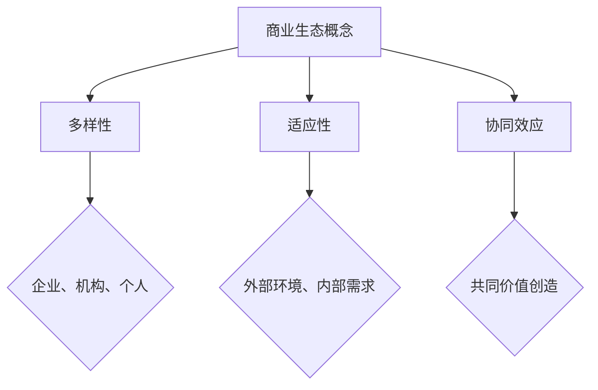

                 

### 1.1 商业生态的概念与重要性

商业生态是当今企业发展和竞争环境中的关键概念。它不仅仅是一个新的商业模式，更是一种全新的思维方式。在这个部分，我们将深入探讨商业生态的概念及其重要性。

#### 1.1.1 商业生态的定义

商业生态可以理解为一种企业、消费者、供应商、合作伙伴等多方共同参与的复杂网络。这个网络中的每个节点都代表着一种角色，它们通过相互合作、竞争和影响，共同构建出一个动态且可持续发展的生态系统。商业生态的定义可以归纳为以下几个核心要素：

- **多样性**：商业生态中包含多种不同类型的企业、机构和个人，它们在功能上各不相同，但相互之间有着密切的联系。
- **适应性**：商业生态能够根据外部环境和内部需求的变化，快速调整和优化各参与方之间的关系，以实现长期的可持续发展。
- **协同效应**：商业生态中的各参与者通过协同合作，能够创造出更大的价值，这种效应在商业生态中尤为明显。

Mermaid流程图：

#### 1.1.2 商业生态与传统商业模式的区别

传统商业模式主要关注企业内部运作和利润最大化，而商业生态则更注重整个系统内部的企业、机构和个人之间的相互关系和整体利益。以下是商业生态与传统商业模式的几个关键区别：

- **关注点**：传统商业模式关注企业的内部效率和利润，商业生态则关注整个系统的可持续发展。
- **关系**：传统商业模式中的各角色相对独立，商业生态中的角色相互依赖，形成紧密的网络关系。
- **适应性**：商业生态具有更强的适应性，能够迅速应对外部环境和内部需求的变化。

#### 1.1.3 可持续发展的商业生态的价值

可持续发展的商业生态对于企业和整个社会都具有重要的价值：

- **企业层面**：通过构建可持续发展的商业生态，企业可以实现长期的盈利和增长，提高市场竞争力，增强品牌影响力。
- **社会层面**：可持续发展的商业生态有助于减少资源浪费、环境污染，促进社会和谐与稳定，提升公众的生活质量。

在接下来的部分，我们将进一步探讨商业生态的构成要素和发展阶段，以帮助我们更好地理解这一概念。

----------------------------------------------------------------

### 1.2 商业生态的构成要素

商业生态的构建依赖于多个关键要素的相互作用。以下是商业生态中的几个重要构成要素及其相互作用关系。

#### 1.2.1 企业与市场的关系

企业在市场中扮演着重要的角色，它们通过产品和服务来满足消费者的需求，从而实现盈利和增长。企业与市场的关系可以分为以下几个方面：

- **市场需求分析**：企业需要通过市场调研和数据分析，了解消费者的需求趋势和偏好，从而制定合适的产品策略。
- **产品定位**：根据市场需求分析，企业需要对产品进行定位，确定目标市场和消费者群体。
- **市场营销策略**：企业需要制定有效的市场营销策略，包括广告、促销、公关等手段，以提高品牌知名度和市场份额。

#### 1.2.2 企业与供应商的关系

企业与供应商的关系对于企业的运营和供应链管理至关重要。以下是企业与供应商关系的几个关键方面：

- **供应商选择**：企业需要选择符合质量、价格、交货期等要求的供应商，以确保供应链的稳定和效率。
- **合作与协作**：企业与供应商之间需要建立良好的合作关系，通过协作和沟通，共同解决供应链中的问题。
- **风险管理**：企业需要评估和管理供应商风险，包括质量风险、供应风险、价格风险等，以确保供应链的可靠性。

#### 1.2.3 企业与消费者的关系

企业与消费者之间的关系是商业生态中最为直接和重要的关系。以下是企业与消费者关系的几个关键方面：

- **客户价值评估**：企业需要对消费者的价值进行评估，确定哪些客户对企业最有价值，并针对性地提供产品和服务。
- **需求分析**：企业需要通过市场调研和数据分析，深入了解消费者的需求和偏好，以便提供更加个性化的产品和服务。
- **满意度提升策略**：企业需要制定和实施满意度提升策略，包括提供优质的产品和服务、及时解决客户问题、提供良好的客户体验等。

#### 1.2.4 企业与社会环境的关系

企业作为社会的一员，需要承担相应的社会责任。以下是企业与社会环境关系的几个关键方面：

- **环境保护**：企业需要采取措施减少环境污染，如节能减排、废弃物处理等，以实现可持续发展。
- **公益慈善**：企业可以通过捐赠、志愿服务等方式，参与社会公益事业，回馈社会。
- **员工福利**：企业需要关注员工的福利和培训，提供良好的工作环境和职业发展机会，以提高员工满意度和忠诚度。

通过以上分析，我们可以看到商业生态中的企业与其他参与方之间的紧密关系。这些关系共同构成了一个复杂且动态的商业生态系统，为企业提供了可持续发展的基础。在下一部分，我们将进一步探讨商业生态的发展阶段，以了解其演变过程。

----------------------------------------------------------------

### 1.3 商业生态的发展阶段

商业生态的发展可以分为四个主要阶段：初创阶段、成长阶段、稳定阶段和创新阶段。每个阶段都有其特定的特点和挑战，企业需要根据不同阶段的特征来制定相应的战略和策略。

#### 1.3.1 初创阶段

在初创阶段，企业面临着产品研发、市场拓展和团队建设等多方面的挑战。以下是初创阶段的一些关键特点：

- **产品研发**：企业需要投入大量资源进行产品研发，以满足市场需求和解决技术难题。
- **市场拓展**：企业需要通过市场调研和营销活动，了解潜在客户的需求，并制定合适的市场拓展策略。
- **团队建设**：企业需要招募合适的团队成员，建立高效的团队协作机制，以支持业务的快速发展。

在初创阶段，企业需要重点关注以下几个方面：

- **技术创新**：通过技术创新，提升产品竞争力，满足市场需求。
- **市场营销**：通过有效的市场营销策略，提高品牌知名度和市场份额。
- **团队管理**：建立高效的团队协作机制，提升团队整体执行力。

#### 1.3.2 成长阶段

在成长阶段，企业已经初步建立了稳定的业务模式和运营体系，开始实现规模扩张和市场份额的提升。以下是成长阶段的一些关键特点：

- **市场份额**：企业开始扩大市场份额，提高品牌知名度和市场影响力。
- **资金需求**：随着业务规模的扩大，企业需要更多的资金支持，以支持业务拓展和运营。
- **团队扩展**：企业需要继续招募和培养优秀的人才，以支持业务的快速增长。

在成长阶段，企业需要重点关注以下几个方面：

- **市场拓展**：通过开拓新市场，扩大业务规模和市场份额。
- **资金管理**：合理管理和利用资金，确保业务的可持续发展。
- **团队管理**：建立完善的团队管理体系，提升团队协作效率。

#### 1.3.3 稳定阶段

在稳定阶段，企业已经建立了较为成熟的商业模式和运营体系，市场占有率稳定，盈利能力较强。以下是稳定阶段的一些关键特点：

- **市场稳定**：企业已经在市场中占据了一席之地，市场占有率稳定。
- **盈利能力**：企业的盈利能力较强，能够实现稳定的盈利。
- **运营效率**：企业的运营效率较高，能够实现成本控制和资源优化。

在稳定阶段，企业需要重点关注以下几个方面：

- **运营效率**：通过优化运营流程，提高生产效率和资源利用率。
- **风险管理**：加强风险管理，防范业务风险和财务风险。
- **市场维护**：维护客户关系，提高客户满意度，确保市场稳定。

#### 1.3.4 创新阶段

在创新阶段，企业需要不断探索新的商业模式、产品和服务，以保持竞争优势和持续增长。以下是创新阶段的一些关键特点：

- **商业模式创新**：通过创新商业模式，提升企业的市场竞争力。
- **技术创新**：通过技术创新，推动产品和服务升级，满足市场需求。
- **市场拓展**：通过开拓新市场，扩大业务范围和市场份额。

在创新阶段，企业需要重点关注以下几个方面：

- **技术创新**：加大研发投入，推动技术创新，提升产品竞争力。
- **商业模式创新**：探索新的商业模式，创造更多价值。
- **市场拓展**：通过多元化市场策略，开拓新市场，实现业务增长。

综上所述，商业生态的发展阶段是企业从初创到成熟再到创新的过程。企业需要根据不同阶段的特征和挑战，制定相应的战略和策略，以实现持续发展和竞争优势。

----------------------------------------------------------------

### 2.1 商业模式创新

商业模式创新是技术创业者打造可持续商业生态的关键环节。通过创新商业模式，企业可以找到新的价值创造方式，提升竞争力，实现可持续发展。

#### 2.1.1 商业模式创新的定义

商业模式创新是指在现有的市场环境中，企业通过重新配置资源、优化业务流程、调整收入结构等手段，创造一种新的盈利模式，从而实现业务增长和盈利能力提升。商业模式创新不仅仅是产品或技术的创新，更是一种对企业整体运营模式的重新思考。

#### 2.1.2 商业模式创新的方法

1. **颠覆性创新**：
   - 定义：颠覆性创新是指通过引入全新的产品或服务，彻底改变现有市场格局的创新方式。
   - 方法：通过提供更优质、更便捷的产品或服务，打破现有市场的垄断，创造新的市场需求。
   - 案例分析：苹果公司的iPhone颠覆了传统手机市场，通过创新的设计和用户体验，迅速占领市场。

2. **商业模式重构**：
   - 定义：商业模式重构是指通过改变企业的业务模式，重新定义企业与其利益相关者的关系，实现盈利模式的转变。
   - 方法：通过重新配置资源、优化流程、调整收入结构等手段，降低成本，提高效率，创造新的盈利点。
   - 案例分析：亚马逊的物流和供应链管理创新，通过打造高效的物流体系和智能供应链管理，大幅降低运营成本，提升客户满意度。

3. **合作创新**：
   - 定义：合作创新是指企业通过与其他企业、机构或个人合作，共同开发新产品或服务，实现资源共享和互利共赢。
   - 方法：通过建立战略合作伙伴关系，共享资源和信息，共同研发新产品或服务，拓展市场。
   - 案例分析：谷歌和苹果公司的合作，共同开发移动操作系统，实现了双方的互利共赢。

#### 2.1.3 商业模式创新的案例分析

**案例一：共享经济**

共享经济是商业模式创新的一个重要方向，通过共享闲置资源，提高资源利用效率，实现可持续发展。

- **案例背景**：共享经济起源于2008年的美国，随着互联网和移动互联网的普及，逐渐在全球范围内流行。
- **商业模式**：共享经济的核心是资源共享，通过平台连接供需双方，实现资源的灵活调配和使用。
- **案例分析**：滴滴出行通过搭建一个在线平台，连接司机和乘客，实现了交通资源的共享和优化，大幅提高了出行效率。

**案例二：电商模式创新**

电商模式的创新是企业通过改变传统电商运营方式，提高用户体验和运营效率的重要途径。

- **案例背景**：随着互联网的普及，电子商务成为了企业的重要销售渠道。
- **商业模式**：通过大数据分析，精准把握用户需求，提供个性化产品和服务；通过智能物流，提升配送效率。
- **案例分析**：京东通过自建物流体系和大数据分析，实现了高效的用户体验和快速配送，成为了中国电商领域的佼佼者。

通过以上分析，我们可以看到商业模式创新对于企业的重要性。技术创业者需要不断探索和创新，找到适应市场需求的商业模式，实现企业的可持续发展。

----------------------------------------------------------------

### 2.2 合作伙伴关系管理

合作伙伴关系管理是构建可持续商业生态的重要一环。通过有效的合作伙伴关系管理，企业可以增强竞争力，实现资源共享和互利共赢。

#### 2.2.1 合作伙伴的选择

选择合适的合作伙伴是合作伙伴关系管理的第一步。以下是选择合作伙伴时需要考虑的几个关键因素：

1. **业务互补性**：合作伙伴的业务应与企业形成互补，能够共同创造价值。
2. **信誉和品牌**：合作伙伴应具备良好的信誉和品牌形象，确保合作的质量和稳定性。
3. **技术能力和创新能力**：合作伙伴应具备一定的技术能力和创新能力，能够共同推动业务发展。
4. **合作历史和经验**：有成功合作历史的合作伙伴更有可能实现长期的稳定合作。

#### 2.2.2 合作伙伴关系的维护

建立良好的合作伙伴关系后，维护关系同样重要。以下是维护合作伙伴关系的几个关键策略：

1. **沟通与协作**：定期与合作伙伴进行沟通，分享市场信息和业务动态，建立互信关系。
2. **资源分享**：在合作过程中，双方可以共享资源，如市场渠道、技术资源等，实现资源共享和互利共赢。
3. **利益分配**：合理的利益分配机制能够激励合作伙伴的积极性，确保合作的长期稳定。
4. **持续改进**：通过定期评估合作效果，发现并解决合作中的问题，不断优化合作模式。

#### 2.2.3 合作伙伴关系的风险控制

合作伙伴关系管理中，风险控制是至关重要的一环。以下是合作伙伴关系风险控制的关键策略：

1. **风险评估**：在建立合作关系前，对合作伙伴进行全面的评估，包括财务状况、市场竞争力、管理水平等，识别潜在风险。
2. **合同管理**：签订详细的合作协议，明确双方的权责和义务，降低合作过程中的法律风险。
3. **定期审查**：定期对合作伙伴的运营状况进行审查，确保合作关系的稳定性和有效性。
4. **风险预警**：建立风险预警机制，及时发现并处理潜在的合作风险。

通过以上策略，企业可以有效地管理合作伙伴关系，增强竞争力，实现可持续发展。

----------------------------------------------------------------

### 2.3 客户关系管理

客户关系管理是构建可持续商业生态的关键环节。通过有效的客户关系管理，企业可以提升客户满意度，增强品牌忠诚度，实现长期发展。

#### 2.3.1 客户价值评估

客户价值评估是客户关系管理的第一步，通过对客户价值的评估，企业可以明确哪些客户对企业最为重要，从而有针对性地提供产品和服务。

1. **客户生命周期价值（CLV）**：客户生命周期价值是指客户在整个生命周期中为企业带来的总收益。计算公式为：
   $$ CLV = \sum_{t=1}^{n} \frac{R_t}{(1+r)^t} $$
   其中，\( R_t \) 表示第 \( t \) 年的客户收益，\( r \) 表示折现率。

2. **客户保留率**：客户保留率是指一定时间内客户继续使用企业产品或服务的比例。保留率越高，说明客户对企业越满意，对企业品牌的忠诚度越高。

3. **客户满意度**：客户满意度是通过调查问卷、用户反馈等方式，了解客户对企业产品和服务的主观评价。高满意度通常意味着客户愿意继续使用企业的产品，并推荐给他人。

#### 2.3.2 客户需求分析

了解客户需求是提升客户满意度的关键。以下是客户需求分析的方法：

1. **市场调研**：通过市场调研，收集潜在客户的需求信息，包括购买动机、偏好、需求等。

2. **用户画像**：通过数据分析，构建用户画像，了解不同客户群体的特征和需求。

3. **用户反馈**：通过用户反馈，了解客户对产品或服务的具体需求和建议，及时进行调整和优化。

#### 2.3.3 客户满意度提升策略

提升客户满意度需要从多个方面入手，以下是几个关键策略：

1. **个性化服务**：根据客户需求，提供个性化的产品和服务，提高客户的满意度和忠诚度。

2. **优质体验**：通过优化产品和服务体验，提高客户的满意度。例如，简化购买流程、提供快速响应的客户服务、提供优质的售后服务等。

3. **持续沟通**：定期与客户沟通，了解客户的反馈和需求，建立良好的客户关系。

4. **客户关怀**：通过定期的客户关怀活动，如节日问候、生日祝福等，增强客户的归属感和忠诚度。

5. **客户成长计划**：为不同价值的客户提供成长计划，帮助他们提升技能，实现职业发展，从而提升客户对企业品牌的认可度。

通过以上策略，企业可以有效地提升客户满意度，增强品牌忠诚度，实现长期发展。

----------------------------------------------------------------

### 2.4 社会责任与可持续发展

社会责任与可持续发展是企业构建可持续商业生态的重要组成部分。通过履行社会责任，企业不仅可以提升品牌形象，还可以实现长期发展，为社会创造更大的价值。

#### 2.4.1 社会责任的内涵

社会责任是指企业在其经营活动中，对员工、消费者、环境和社会承担的责任。以下是社会责任的几个关键方面：

1. **员工责任**：关心员工福利，提供良好的工作环境和职业发展机会，确保员工的身心健康。

2. **消费者责任**：提供优质的产品和服务，确保消费者的权益，提升消费者的满意度。

3. **环境责任**：采取措施减少环境污染，推动绿色生产和可持续发展。

4. **社会贡献**：通过捐赠、志愿服务等方式，参与社会公益事业，回馈社会。

#### 2.4.2 可持续发展的策略

可持续发展是企业长期发展的基础，以下是实现可持续发展的几个关键策略：

1. **环境保护**：通过节能减排、废弃物处理、环保材料使用等手段，减少对环境的负面影响。

2. **资源管理**：优化资源使用，提高资源利用效率，降低资源浪费。

3. **社会责任报告**：定期发布社会责任报告，公开企业的社会责任实践和成果，提升社会透明度。

4. **社会责任投资**：将社会责任纳入投资决策，支持具有社会责任感的项目和公司，推动社会的可持续发展。

#### 2.4.3 社会责任报告的编制与发布

社会责任报告是企业展示其社会责任实践和成果的重要工具。以下是编制和发布社会责任报告的几个关键步骤：

1. **确定报告范围**：明确报告所涵盖的内容，包括企业的社会责任实践、环境绩效、社会贡献等。

2. **数据收集与整理**：收集与企业社会责任相关的数据，包括员工福利、环境保护、公益慈善等方面。

3. **编写报告内容**：根据收集的数据和企业的社会责任实践，编写社会责任报告的内容。

4. **审核与发布**：由内部或外部专家对报告进行审核，确保报告的准确性和完整性，然后发布报告。

通过以上策略，企业可以有效地履行社会责任，实现可持续发展，为社会创造更大的价值。

----------------------------------------------------------------

### 3.1 商业生态系统构建

商业生态系统构建是企业打造可持续商业生态的重要步骤。通过系统性地构建商业生态系统，企业可以优化资源利用，提高效率，实现长期发展。

#### 3.1.1 商业生态系统构建的步骤

构建商业生态系统需要经历以下几个关键步骤：

1. **需求分析**：首先，企业需要对市场需求、消费者需求进行深入分析，明确生态系统的目标和服务对象。

2. **参与者识别**：根据需求分析的结果，识别生态系统中的关键参与者，包括企业、供应商、消费者、合作伙伴等。

3. **价值共创**：明确各参与者的角色和职责，通过合作和协同，实现价值共创，提升生态系统的整体效益。

4. **协同管理**：建立有效的协同管理机制，包括信息共享、资源共享、合作共赢等，确保生态系统的稳定运行。

5. **持续优化**：根据生态系统的运行情况和市场反馈，不断优化生态系统，提高其竞争力和适应性。

#### 3.1.2 商业生态系统构建的关键因素

构建商业生态系统需要关注以下几个关键因素：

1. **多样性**：生态系统中的参与者应具备多样性，包括不同的企业、机构和个人，以实现资源的最优配置和价值的最大化。

2. **适应性**：生态系统应具备快速适应外部环境变化的能力，通过调整和优化内部关系，确保生态系统的可持续发展。

3. **协同效应**：生态系统中的各参与者应通过协同合作，实现资源互补、风险共担、利益共享，创造更大的价值。

4. **开放性**：生态系统应具有开放性，鼓励外部企业、机构和个人参与，促进资源的流动和价值的创造。

5. **可持续性**：生态系统应追求长期可持续发展，通过环境保护、社会责任等手段，实现经济、社会和环境的协调发展。

#### 3.1.3 商业生态系统构建的案例分析

**案例一：阿里巴巴的生态系统**

阿里巴巴通过构建电子商务生态系统，实现了从B2B到B2C、C2C的多元化业务模式。以下是阿里巴巴生态系统构建的关键点：

1. **需求分析**：阿里巴巴通过不断收集和分析用户需求，优化平台服务和功能，提升用户体验。

2. **参与者识别**：阿里巴巴吸引了大量的商家、消费者和第三方服务提供商，形成了一个庞大的商业生态系统。

3. **价值共创**：阿里巴巴通过提供全面的电子商务服务，帮助商家降低成本、提高效率，帮助消费者便捷购物。

4. **协同管理**：阿里巴巴建立了完善的管理机制，包括客户服务、物流配送、金融支付等，确保生态系统的稳定运行。

5. **持续优化**：阿里巴巴不断引入新技术和商业模式，优化生态系统，提升其竞争力和适应性。

通过以上分析，我们可以看到，商业生态系统构建是企业实现可持续发展的关键步骤。企业需要根据市场需求和自身优势，构建具有多样性和协同效应的生态系统，以实现长期发展。

----------------------------------------------------------------

### 3.2 商业生态运营管理

商业生态运营管理是确保商业生态系统稳定运行、高效运作的关键。通过科学的运营管理，企业可以优化资源配置，提升整体效率，实现可持续发展。

#### 3.2.1 商业生态运营的指标

商业生态运营管理需要依靠一系列关键指标来评估和优化生态系统的运行状况。以下是几个关键的运营指标：

1. **客户满意度**：客户满意度是衡量生态系统服务质量的重要指标，可以通过客户反馈、调查问卷等方式进行评估。

2. **市场占有率**：市场占有率反映了生态系统在市场中的竞争地位，是评估生态系统发展状况的重要指标。

3. **资源利用率**：资源利用率是衡量生态系统资源管理效率的关键指标，包括人力、资金、物资等资源的利用情况。

4. **运营成本**：运营成本是衡量生态系统经济效益的重要指标，包括生产成本、管理成本、营销成本等。

5. **创新能力**：创新能力是衡量生态系统适应市场变化和持续发展能力的重要指标，包括产品创新、服务创新、商业模式创新等。

#### 3.2.2 商业生态运营的策略

为了实现商业生态系统的稳定运行和高效运作，企业需要制定和实施一系列运营策略。以下是几个关键的运营策略：

1. **精益管理**：通过精益管理，优化生产流程，减少浪费，提高资源利用率，降低运营成本。

2. **质量控制**：建立严格的质量控制体系，确保产品和服务质量，提升客户满意度。

3. **创新驱动**：鼓励创新，推动产品和服务创新，提升生态系统的竞争力。

4. **合作伙伴管理**：建立良好的合作伙伴关系，通过协同合作，实现资源共享和互利共赢。

5. **数据驱动**：利用大数据分析和人工智能技术，优化运营决策，提升运营效率。

#### 3.2.3 商业生态运营的案例分析

**案例一：亚马逊的生态系统运营**

亚马逊通过其庞大的商业生态系统，实现了全球范围内的电商、云计算、数字娱乐等多元化业务。以下是亚马逊商业生态系统运营的几个关键点：

1. **精益管理**：亚马逊通过精益管理，优化物流和供应链管理，提高了运营效率，降低了成本。

2. **质量控制**：亚马逊建立了严格的产品质量标准，确保所售商品的质量，提升了客户满意度。

3. **创新驱动**：亚马逊不断推动技术创新，如推出亚马逊云服务、智能语音助手Alexa等，提升了生态系统的竞争力。

4. **合作伙伴管理**：亚马逊与众多第三方商家合作，通过平台合作、广告合作等方式，实现了资源共享和互利共赢。

5. **数据驱动**：亚马逊利用大数据分析和人工智能技术，优化运营决策，提升了运营效率。

通过以上分析，我们可以看到，商业生态运营管理对于企业的可持续发展至关重要。企业需要通过制定和实施科学、有效的运营策略，优化生态系统的运行，提升整体竞争力。

----------------------------------------------------------------

### 3.3 商业生态创新

商业生态创新是推动商业生态系统持续发展的重要动力。通过创新，企业可以不断提升自身的竞争力，开拓新的市场机会，实现可持续发展。

#### 3.3.1 商业生态创新的驱动因素

商业生态创新的驱动因素主要包括以下几个方面：

1. **技术进步**：随着科技的不断进步，新的技术手段不断涌现，为企业提供了丰富的创新机会。

2. **市场变化**：市场环境的变化，如消费者需求的变化、市场竞争的加剧等，促使企业不断创新，以适应市场变化。

3. **政策环境**：政府的政策支持，如减税、补贴、创新激励等，为企业提供了良好的创新环境。

4. **企业战略**：企业的长期战略规划，如国际化战略、多元化战略等，为企业提供了创新的方向。

#### 3.3.2 商业生态创新的模式

商业生态创新的模式可以分为以下几种：

1. **产品创新**：通过改进产品功能、设计、性能等，提升产品的竞争力。

2. **服务创新**：通过提供新的服务模式、服务内容等，满足消费者的多样化需求。

3. **商业模式创新**：通过重新设计企业的商业模式，实现盈利模式的转变，提升企业的竞争力。

4. **流程创新**：通过优化业务流程，提高企业的运营效率，降低成本。

#### 3.3.3 商业生态创新的案例分析

**案例一：特斯拉的生态系统创新**

特斯拉通过其生态系统的创新，实现了电动汽车、能源存储、太阳能等多元化业务。以下是特斯拉生态系统创新的几个关键点：

1. **产品创新**：特斯拉通过持续的产品创新，推出了多款高性能电动汽车，如Model S、Model X等，提升了产品的竞争力。

2. **服务创新**：特斯拉提供了包括充电服务、维修服务等在内的一站式服务，提升了用户体验。

3. **商业模式创新**：特斯拉通过其独特的直销模式，绕过了传统的经销商渠道，降低了运营成本，提升了盈利能力。

4. **流程创新**：特斯拉通过自动化生产线和智能制造技术，优化了生产流程，提高了生产效率。

通过以上分析，我们可以看到，商业生态创新是企业持续发展的重要手段。企业需要关注技术进步、市场变化等外部因素，同时发挥自身战略优势，通过多种创新模式，不断提升自身的竞争力。

----------------------------------------------------------------

### 4.1 数字化与商业生态

随着数字化技术的飞速发展，数字化已经深刻地影响了商业生态的各个方面。数字化不仅是技术进步的体现，更是商业模式创新的驱动力量。在这一部分，我们将探讨数字化对商业生态的影响，以及数字化商业生态的构建。

#### 4.1.1 数字化对商业生态的影响

数字化对商业生态的影响可以从以下几个方面进行阐述：

1. **信息透明度提升**：数字化使得信息传递更加迅速和透明，企业可以实时获取市场动态、消费者需求等信息，从而做出更加准确的决策。

2. **运营效率提升**：数字化技术如大数据分析、云计算等，可以帮助企业优化运营流程，提高资源利用率，降低运营成本。

3. **市场范围扩大**：数字化使得企业能够突破地域限制，进入全球市场，拓展业务范围。

4. **消费者体验优化**：数字化技术提供了更加个性化和便捷的消费者体验，如在线购物、移动支付、智能客服等。

#### 4.1.2 数字化商业生态的构建

构建数字化商业生态需要关注以下几个方面：

1. **数据驱动**：以数据为核心，建立全面的数据收集和分析体系，利用大数据技术挖掘潜在价值。

2. **技术集成**：集成多种数字化技术，如物联网、人工智能、区块链等，实现跨领域的协同效应。

3. **平台化运营**：建立开放的平台生态系统，吸引不同领域的企业和创业者参与，实现资源共享和合作共赢。

4. **用户体验优化**：关注消费者需求，提供个性化的产品和服务，提升用户体验。

#### 4.1.3 数字化商业生态的案例分析

**案例一：阿里巴巴的数字化商业生态**

阿里巴巴通过数字化技术，构建了一个庞大的商业生态系统。以下是阿里巴巴数字化商业生态的几个关键点：

1. **数据驱动**：阿里巴巴建立了强大的数据分析和处理能力，通过数据挖掘，优化运营决策，提升业务效率。

2. **技术集成**：阿里巴巴集成了电子商务、云计算、人工智能、物联网等多种数字化技术，实现了跨领域的协同效应。

3. **平台化运营**：阿里巴巴建立了开放的平台生态系统，吸引了大量的商家、消费者和合作伙伴，实现了资源共享和合作共赢。

4. **用户体验优化**：阿里巴巴通过在线购物、移动支付、智能客服等技术手段，提升了消费者的购物体验。

通过以上分析，我们可以看到，数字化对商业生态的构建和运营具有重要影响。企业需要把握数字化趋势，通过数字化技术，优化运营流程，提升用户体验，构建具有竞争力的数字化商业生态。

----------------------------------------------------------------

### 4.2 绿色发展与商业生态

绿色发展已经成为全球共识，它不仅是环境保护的需要，也是商业生态可持续发展的重要方向。在这一部分，我们将探讨绿色发展的内涵，以及它对商业生态的影响。

#### 4.2.1 绿色发展的内涵

绿色发展是指在满足当前人类需求的同时，保护和改善自然环境，实现经济、社会和环境的协调发展。以下是绿色发展的几个关键方面：

1. **环境保护**：通过减少污染、节约资源、保护生态系统等手段，实现环境友好型发展。

2. **可持续发展**：注重长期发展，确保资源的可持续利用，防止环境退化，为后代留下可持续发展的空间。

3. **社会责任**：企业应承担环境保护和社会责任，通过绿色生产、绿色供应链管理等方式，实现经济效益和社会效益的双赢。

#### 4.2.2 绿色发展对商业生态的影响

绿色发展对商业生态的影响是多方面的：

1. **成本结构优化**：通过节能减排、资源循环利用等绿色生产方式，企业可以降低运营成本，提高竞争力。

2. **市场需求变化**：随着消费者对绿色环保意识的提高，绿色产品和服务逐渐受到青睐，企业需要调整产品策略，满足市场需求。

3. **政策法规约束**：政府出台了一系列环保政策和法规，对企业的绿色发展和环境保护提出了更高的要求。

#### 4.2.3 绿色商业生态的构建

构建绿色商业生态需要关注以下几个方面：

1. **绿色技术研发**：通过投资研发绿色技术，推动绿色生产和绿色供应链管理。

2. **绿色产品和服务**：开发和推广绿色产品和服务，满足市场需求，提升品牌形象。

3. **绿色合作与协同**：企业之间通过合作，共享绿色技术和资源，共同推动绿色生态建设。

4. **绿色管理体系**：建立绿色管理体系，确保企业绿色发展战略的落地和执行。

#### 4.2.4 绿色发展的案例分析

**案例一：比亚迪的绿色发展**

比亚迪作为全球领先的新能源汽车制造商，其在绿色发展中取得了显著成果。以下是比亚迪绿色发展的一些关键点：

1. **绿色技术研发**：比亚迪持续投入绿色技术研发，推出了一系列新能源汽车和太阳能电池产品。

2. **绿色产品和服务**：比亚迪通过推出纯电动、插电式混合动力等新能源汽车，满足了消费者对绿色出行的需求。

3. **绿色合作与协同**：比亚迪与多个城市和政府合作，推广新能源汽车，推动绿色交通体系建设。

4. **绿色管理体系**：比亚迪建立了完善的绿色管理体系，确保企业绿色发展战略的有效实施。

通过以上分析，我们可以看到，绿色发展对商业生态具有重要意义。企业需要积极推动绿色发展，构建绿色商业生态，实现可持续发展。

----------------------------------------------------------------

### 4.3 新兴技术与商业生态

随着科技的不断进步，新兴技术如人工智能、区块链、物联网等正迅速融入商业生态，带来前所未有的变革。在这一部分，我们将探讨新兴技术的发展趋势，以及它们对商业生态的影响。

#### 4.3.1 新兴技术的发展趋势

1. **人工智能（AI）**：人工智能已经成为推动商业创新的重要力量。其发展趋势包括：
   - **自动化**：通过机器学习和深度学习技术，实现自动化决策和自动化操作，提高生产效率。
   - **智能服务**：通过自然语言处理和智能推荐技术，提供个性化的服务体验。

2. **区块链**：区块链技术以其去中心化、不可篡改的特点，在商业生态中具有广泛的应用前景。其发展趋势包括：
   - **供应链管理**：通过区块链技术，实现供应链的透明化和追踪，提高供应链效率。
   - **数字货币**：区块链技术的普及推动了数字货币的发展，如比特币、以太坊等。

3. **物联网（IoT）**：物联网通过连接各种设备和传感器，实现数据的实时采集和分析。其发展趋势包括：
   - **智能家居**：通过物联网技术，实现家庭设备的智能化和自动化，提升生活品质。
   - **智慧城市**：通过物联网技术，实现城市管理的智能化和精细化，提升城市管理效率。

#### 4.3.2 新兴技术对商业生态的影响

1. **效率提升**：新兴技术如人工智能、物联网等，通过自动化和智能化的方式，大幅提升了企业的运营效率，降低了成本。

2. **创新驱动**：新兴技术为商业生态带来了新的创新机会，企业可以通过技术融合和商业模式创新，创造新的价值。

3. **信任建立**：区块链技术以其去中心化和不可篡改的特点，增强了企业之间的信任，推动了商业合作的发展。

4. **数据驱动**：大数据和人工智能技术使得企业能够更好地理解和预测市场趋势，做出更加精准的商业决策。

#### 4.3.3 新兴商业生态的案例分析

**案例一：亚马逊的物联网商业生态**

亚马逊通过物联网技术，构建了一个智能化的商业生态。以下是亚马逊物联网商业生态的几个关键点：

1. **智能物流**：亚马逊利用物联网技术，实现了物流过程的自动化和智能化，提高了物流效率。

2. **智能家居**：亚马逊的Echo设备通过物联网技术，实现了家庭设备的智能化控制，提供了便捷的智能家居体验。

3. **智能推荐**：亚马逊利用人工智能技术，分析用户行为和购买历史，提供个性化的产品推荐，提升了用户体验。

通过以上分析，我们可以看到，新兴技术正在深刻地改变商业生态。企业需要积极拥抱新兴技术，利用技术优势，构建具有竞争力的新兴商业生态。

----------------------------------------------------------------

### 5.1 成功商业生态案例分析

在商业生态的构建和运营过程中，许多企业取得了显著的成功。以下是几个具有代表性的成功案例，分析它们在商业生态构建中的关键策略和成功经验。

#### 5.1.1 案例一：阿里巴巴的生态系统

阿里巴巴作为全球领先的电子商务公司，其商业生态的成功构建是技术创业者的典范。以下是阿里巴巴生态系统构建的成功经验：

1. **多元化业务布局**：阿里巴巴通过阿里巴巴电商、淘宝、天猫等平台，实现了从B2B到B2C、C2C的多元化业务布局。

2. **数据驱动的运营**：阿里巴巴利用大数据和人工智能技术，对用户行为和市场需求进行深入分析，优化业务运营策略。

3. **生态系统协作**：阿里巴巴通过开放平台，吸引大量的第三方商家、支付服务提供商、物流企业等参与，形成了强大的生态系统。

4. **创新驱动**：阿里巴巴不断推动技术创新，如云计算、大数据、区块链等，为生态系统注入新的活力。

#### 5.1.2 案例二：亚马逊的生态系统

亚马逊通过其创新的商业模式和强大的物流体系，构建了一个庞大的商业生态系统。以下是亚马逊生态系统构建的成功经验：

1. **物流网络建设**：亚马逊建立了全球领先的物流网络，通过无人机、自动化仓库等技术，实现了快速、高效的物流配送。

2. **技术驱动**：亚马逊持续投资于技术创新，如人工智能、云计算、物联网等，提升了运营效率和服务质量。

3. **生态系统开放**：亚马逊通过开放平台，吸引了大量的第三方商家、开发者等参与，共同构建了一个多元化的生态系统。

4. **用户体验优化**：亚马逊始终将用户体验放在首位，通过个性化的推荐、高效的客户服务等方式，提升了用户体验和品牌忠诚度。

#### 5.1.3 案例三：华为的生态系统

华为作为全球领先的通信设备制造商，其商业生态的成功构建主要体现在以下几个方面：

1. **全球市场布局**：华为通过全球化的市场布局，覆盖了全球多个国家和地区，形成了强大的国际市场竞争力。

2. **技术创新**：华为持续投资于研发，拥有大量核心技术和专利，通过技术创新保持了行业领先地位。

3. **合作伙伴关系**：华为与全球多家运营商、供应商建立了紧密的合作关系，共同推动5G、物联网等新兴技术的发展。

4. **生态系统协作**：华为通过开放平台，吸引了大量的开发者、合作伙伴等参与，共同构建了一个多元化的生态系统。

通过以上成功案例，我们可以看到，商业生态的成功构建离不开多元化业务布局、技术创新、合作伙伴关系和用户体验优化。这些成功经验为技术创业者提供了宝贵的借鉴。

----------------------------------------------------------------

### 5.2 失败商业生态案例分析

在商业生态的构建过程中，一些企业也遭遇了失败。以下是对几个具有代表性的失败案例的分析，以及它们失败的原因和教训。

#### 5.2.1 案例一：诺基亚的失败

诺基亚曾是全球领先的手机制造商，但其未能适应市场变化和技术进步，最终导致了失败。以下是诺基亚失败的主要原因：

1. **技术创新滞后**：诺基亚在智能手机时代的到来时，未能及时进行技术创新，仍然坚持使用传统的手机技术。

2. **产品策略失误**：诺基亚在产品策略上未能满足消费者对智能手机的需求，推出的产品功能单一，无法与竞争对手抗衡。

3. **市场反应迟缓**：诺基亚在市场变化面前反应迟缓，未能及时调整战略，错失了市场机会。

**教训**：技术创业者在面对市场变化和技术进步时，必须及时调整战略，进行技术创新，以满足市场需求。

#### 5.2.2 案例二：黑莓的失败

黑莓曾是全球领先的智能手机品牌，但由于未能适应移动互联网的发展，最终走向了失败。以下是黑莓失败的主要原因：

1. **过度依赖邮件功能**：黑莓在早期以其强大的邮件处理能力而闻名，但在移动互联网时代，未能拓展其他功能，导致竞争力下降。

2. **用户体验不佳**：黑莓的操作系统和界面设计相对老旧，用户体验不佳，无法与苹果和安卓系统竞争。

3. **缺乏创新**：黑莓在产品创新上缺乏突破，未能及时推出具有竞争力的新产品。

**教训**：技术创业者在产品设计和功能开发上，应注重用户体验，不断进行创新，以保持市场竞争力。

#### 5.2.3 案例三：柯达的失败

柯达曾是全球领先的摄影设备制造商，但由于未能适应数字摄影技术的发展，最终走向了失败。以下是柯达失败的主要原因：

1. **技术创新滞后**：柯达在数字摄影技术兴起时，未能及时进行技术创新，仍然坚持使用传统的胶片技术。

2. **市场反应迟缓**：柯达在市场变化面前反应迟缓，未能及时调整战略，错失了市场机会。

3. **商业生态系统建设不足**：柯达未能建立有效的商业生态系统，缺乏合作伙伴和资源支持，难以应对市场竞争。

**教训**：技术创业者在面对技术变革时，必须及时进行技术创新，积极构建商业生态系统，以应对市场挑战。

通过以上失败案例，我们可以看到，技术创新滞后、市场反应迟缓、缺乏创新和商业生态系统建设不足是导致商业生态失败的主要原因。技术创业者在构建商业生态时，应从中吸取教训，避免重蹈覆辙。

----------------------------------------------------------------

### 5.3 总结与展望

在本文中，我们探讨了技术创业者如何打造可持续发展的商业生态。通过分析商业生态的概念、构成要素、发展阶段，以及商业生态策略、实践和未来发展趋势，我们得出了以下几点总结和展望：

**总结：**

1. **商业生态的重要性**：商业生态是企业可持续发展的关键，它通过多样性、适应性和协同效应，实现资源优化和价值最大化。

2. **商业生态的构成要素**：企业与市场、供应商、消费者和社会环境的关系是商业生态的核心，这些关系共同构建了一个复杂而动态的生态系统。

3. **商业生态的发展阶段**：企业从初创到稳定再到创新，每个阶段都有其特定的挑战和策略，技术创业者需要根据不同阶段制定相应的战略。

4. **商业生态策略**：商业模式创新、合作伙伴关系管理、客户关系管理和社会责任与可持续发展是构建商业生态的重要策略。

5. **商业生态实践**：构建商业生态系统、运营管理、创新实践是技术创业者实现商业生态可持续发展的关键。

6. **未来发展趋势**：数字化、绿色发展和新兴技术将继续深刻影响商业生态，技术创业者需要积极拥抱这些趋势，推动商业生态的变革。

**展望：**

1. **技术创新**：技术创业者在构建商业生态时，应持续关注技术创新，通过人工智能、区块链、物联网等新兴技术，提升生态系统的竞争力。

2. **协同合作**：在商业生态中，协同合作是关键，技术创业者应建立广泛的合作伙伴关系，实现资源共享和互利共赢。

3. **可持续发展**：商业生态的可持续发展是企业长期发展的基础，技术创业者应注重社会责任，推动绿色发展，实现经济、社会和环境的协调发展。

4. **用户体验**：在数字化时代，用户体验是商业生态的核心，技术创业者应注重提升用户体验，打造个性化的产品和服务。

5. **数据驱动**：数据是商业生态的驱动力，技术创业者应充分利用大数据和人工智能技术，优化运营决策，提升生态系统的效率。

总之，技术创业者通过构建可持续发展的商业生态，可以实现长期的盈利和增长，成为行业领导者。在未来，商业生态将继续演变，技术创业者需要不断创新，适应市场变化，把握发展机遇，实现可持续发展。

----------------------------------------------------------------

### 附录

**附录 A：商业生态相关术语解释**

以下是对商业生态中常用术语的简要解释：

- **生态系统**：一种由多种生物和环境因素组成的复杂网络，各因素相互依存、相互作用。
- **商业模式**：企业通过创造、传递和捕获价值的方式，实现盈利和增长。
- **合作伙伴关系**：企业与其他企业、机构或个人建立的长期合作关系，以实现共同目标。
- **客户关系**：企业与消费者之间的互动关系，包括客户满意度、忠诚度等。
- **社会责任**：企业在经营活动中对社会和环境承担的责任。
- **可持续发展**：企业在满足当前需求的同时，保护和改善环境，确保未来代际的可持续发展。

**附录 B：商业生态相关工具推荐**

以下是一些有助于构建和优化商业生态的工具：

- **生态系统构建工具**：如Arboretum、Business Model Canvas、MindMap等。
- **合作伙伴关系管理工具**：如SAP Ariba、Microsoft Dynamics 365、Salesforce等。
- **客户关系管理工具**：如Salesforce、Oracle CRM、HubSpot等。
- **数字化工具**：如Tableau、Google Analytics、Power BI等。
- **绿色发展工具**：如EnergyStar、ISO 14001、Sustainability Dashboard等。
- **新兴技术工具**：如TensorFlow、Kubernetes、Docker等。

通过使用这些工具，技术创业者可以更加高效地构建和优化商业生态，实现可持续发展。**作者：AI天才研究院/AI Genius Institute & 禅与计算机程序设计艺术 /Zen And The Art of Computer Programming**。

----------------------------------------------------------------

# 技术创业者如何打造可持续发展的商业生态

> **关键词**：商业生态、可持续发展、技术创新、合作伙伴关系、用户体验

> **摘要**：本文探讨了技术创业者如何通过构建可持续发展的商业生态，实现长期的盈利和增长。文章从商业生态的概念、构成要素、发展阶段、策略、实践和未来发展趋势等方面进行详细阐述，提供了丰富的案例分析，为技术创业者提供了宝贵的指导和启示。

## 目录

1. **商业生态概述**
   - 1.1 商业生态的概念与重要性
   - 1.2 商业生态的构成要素
   - 1.3 商业生态的发展阶段

2. **商业生态策略**
   - 2.1 商业模式创新
   - 2.2 合作伙伴关系管理
   - 2.3 客户关系管理
   - 2.4 社会责任与可持续发展

3. **商业生态实践**
   - 3.1 商业生态系统构建
   - 3.2 商业生态运营管理
   - 3.3 商业生态创新

4. **商业生态的未来发展趋势**
   - 4.1 数字化与商业生态
   - 4.2 绿色发展与商业生态
   - 4.3 新兴技术与商业生态

5. **案例研究**
   - 5.1 成功商业生态案例分析
   - 5.2 失败商业生态案例分析

6. **总结与展望**
7. **附录**
   - 6.1 商业生态相关术语解释
   - 6.2 商业生态相关工具推荐

----------------------------------------------------------------

### 1.1 商业生态的概念与重要性

商业生态是指一系列企业、机构和个人通过相互合作、竞争和互动，共同构成的一个复杂且动态的生态系统。在这个系统中，每个参与者都扮演着特定的角色，通过相互依存和相互影响，推动整个系统的运行和进化。商业生态的概念不仅仅涉及企业的内部运作，更强调整个生态系统内各方之间的协同合作和共同价值创造。

**定义与核心要素**

商业生态的定义可以进一步细化为以下几个核心要素：

- **多样性**：商业生态中包含多种不同类型的企业、机构和个人，这些参与者各自具有独特的功能和角色，共同构成一个多元化的生态系统。
- **适应性**：商业生态能够根据外部环境和内部需求的变化，快速调整和优化各参与者之间的关系，以实现长期的可持续发展。
- **协同效应**：商业生态中的各参与者通过相互合作，能够创造出更大的价值，这种协同效应是商业生态的重要特征。

**与传统商业模式的区别**

商业生态与传统商业模式有着显著的区别。传统商业模式主要关注企业的内部效率和利润最大化，而商业生态则更注重整个系统内部的企业、机构和个人之间的相互关系和整体利益。以下是商业生态与传统商业模式的一些关键区别：

- **关注点**：传统商业模式更注重企业的内部运作和效率，商业生态则更注重系统内各参与者之间的协同合作和整体效益。
- **关系**：传统商业模式中的企业相对独立，商业生态中的各参与者之间形成紧密的网络关系，通过相互依存和协同合作，实现共同价值创造。
- **适应性**：商业生态具有更强的适应性，能够快速响应外部环境的变化，并通过内部调整实现可持续发展。

**可持续发展的商业生态的价值**

可持续发展的商业生态对于企业和整个社会都具有重要的价值：

- **企业层面**：通过构建可持续发展的商业生态，企业可以实现长期的盈利和增长，提高市场竞争力，增强品牌影响力。
- **社会层面**：可持续发展的商业生态有助于减少资源浪费、环境污染，促进社会和谐与稳定，提升公众的生活质量。

在接下来的部分，我们将进一步探讨商业生态的构成要素和发展阶段，以帮助我们更好地理解这一概念。

----------------------------------------------------------------

### 1.2 商业生态的构成要素

商业生态的构建依赖于多个关键要素的相互作用。以下是商业生态中的几个重要构成要素及其相互作用关系。

#### 1.2.1 企业与市场的关系

企业在市场中扮演着重要的角色，它们通过产品和服务来满足消费者的需求，从而实现盈利和增长。企业与市场的关系可以分为以下几个方面：

- **市场需求分析**：企业需要通过市场调研和数据分析，了解消费者的需求趋势和偏好，从而制定合适的产品策略。
- **产品定位**：根据市场需求分析，企业需要对产品进行定位，确定目标市场和消费者群体。
- **市场营销策略**：企业需要制定有效的市场营销策略，包括广告、促销、公关等手段，以提高品牌知名度和市场份额。

#### 1.2.2 企业与供应商的关系

企业与供应商的关系对于企业的运营和供应链管理至关重要。以下是企业与供应商关系的几个关键方面：

- **供应商选择**：企业需要选择符合质量、价格、交货期等要求的供应商，以确保供应链的稳定和效率。
- **合作与协作**：企业与供应商之间需要建立良好的合作关系，通过协作和沟通，共同解决供应链中的问题。
- **风险管理**：企业需要评估和管理供应商风险，包括质量风险、供应风险、价格风险等，以确保供应链的可靠性。

#### 1.2.3 企业与消费者的关系

企业与消费者之间的关系是商业生态中最为直接和重要的关系。以下是企业与消费者关系的几个关键方面：

- **客户价值评估**：企业需要对消费者的价值进行评估，确定哪些客户对企业最有价值，并针对性地提供产品和服务。
- **需求分析**：企业需要通过市场调研和数据分析，深入了解消费者的需求和偏好，以便提供更加个性化的产品和服务。
- **满意度提升策略**：企业需要制定和实施满意度提升策略，包括提供优质的产品和服务、及时解决客户问题、提供良好的客户体验等。

#### 1.2.4 企业与社会环境的关系

企业作为社会的一员，需要承担相应的社会责任。以下是企业与社会环境关系的几个关键方面：

- **环境保护**：企业需要采取措施减少环境污染，如节能减排、废弃物处理等，以实现可持续发展。
- **公益慈善**：企业可以通过捐赠、志愿服务等方式，参与社会公益事业，回馈社会。
- **员工福利**：企业需要关注员工的福利和培训，提供良好的工作环境和职业发展机会，以提高员工满意度和忠诚度。

通过以上分析，我们可以看到商业生态中的企业与其他参与方之间的紧密关系。这些关系共同构成了一个复杂且动态的商业生态系统，为企业提供了可持续发展的基础。在下一部分，我们将进一步探讨商业生态的发展阶段，以了解其演变过程。

----------------------------------------------------------------

### 1.3 商业生态的发展阶段

商业生态的发展可以分为四个主要阶段：初创阶段、成长阶段、稳定阶段和创新阶段。每个阶段都有其特定的特点和挑战，企业需要根据不同阶段的特征来制定相应的战略和策略。

#### 1.3.1 初创阶段

在初创阶段，企业面临着产品研发、市场拓展和团队建设等多方面的挑战。以下是初创阶段的一些关键特点：

- **产品研发**：企业需要投入大量资源进行产品研发，以满足市场需求和解决技术难题。
- **市场拓展**：企业需要通过市场调研和营销活动，了解潜在客户的需求，并制定合适的市场拓展策略。
- **团队建设**：企业需要招募合适的团队成员，建立高效的团队协作机制，以支持业务的快速发展。

在初创阶段，企业需要重点关注以下几个方面：

- **技术创新**：通过技术创新，提升产品竞争力，满足市场需求。
- **市场营销**：通过有效的市场营销策略，提高品牌知名度和市场份额。
- **团队管理**：建立高效的团队协作机制，提升团队整体执行力。

#### 1.3.2 成长阶段

在成长阶段，企业已经初步建立了稳定的业务模式和运营体系，开始实现规模扩张和市场份额的提升。以下是成长阶段的一些关键特点：

- **市场份额**：企业开始扩大市场份额，提高品牌知名度和市场影响力。
- **资金需求**：随着业务规模的扩大，企业需要更多的资金支持，以支持业务拓展和运营。
- **团队扩展**：企业需要继续招募和培养优秀的人才，以支持业务的快速增长。

在成长阶段，企业需要重点关注以下几个方面：

- **市场拓展**：通过开拓新市场，扩大业务规模和市场份额。
- **资金管理**：合理管理和利用资金，确保业务的可持续发展。
- **团队管理**：建立完善的团队管理体系，提升团队协作效率。

#### 1.3.3 稳定阶段

在稳定阶段，企业已经建立了较为成熟的商业模式和运营体系，市场占有率稳定，盈利能力较强。以下是稳定阶段的一些关键特点：

- **市场稳定**：企业已经在市场中占据了一席之地，市场占有率稳定。
- **盈利能力**：企业的盈利能力较强，能够实现稳定的盈利。
- **运营效率**：企业的运营效率较高，能够实现成本控制和资源优化。

在稳定阶段，企业需要重点关注以下几个方面：

- **运营效率**：通过优化运营流程，提高生产效率和资源利用率。
- **风险管理**：加强风险管理，防范业务风险和财务风险。
- **市场维护**：维护客户关系，提高客户满意度，确保市场稳定。

#### 1.3.4 创新阶段

在创新阶段，企业需要不断探索新的商业模式、产品和服务，以保持竞争优势和持续增长。以下是创新阶段的一些关键特点：

- **商业模式创新**：通过创新商业模式，提升企业的市场竞争力。
- **技术创新**：通过技术创新，推动产品和服务升级，满足市场需求。
- **市场拓展**：通过开拓新市场，扩大业务范围和市场份额。

在创新阶段，企业需要重点关注以下几个方面：

- **技术创新**：加大研发投入，推动技术创新，提升产品竞争力。
- **商业模式创新**：探索新的商业模式，创造更多价值。
- **市场拓展**：通过多元化市场策略，开拓新市场，实现业务增长。

综上所述，商业生态的发展阶段是企业从初创到成熟再到创新的过程。企业需要根据不同阶段的特征和挑战，制定相应的战略和策略，以实现持续发展和竞争优势。

----------------------------------------------------------------

### 2.1 商业模式创新

商业模式创新是技术创业者打造可持续商业生态的关键环节。通过创新商业模式，企业可以找到新的价值创造方式，提升竞争力，实现可持续发展。

#### 2.1.1 商业模式创新的定义

商业模式创新是指在现有的市场环境中，企业通过重新配置资源、优化业务流程、调整收入结构等手段，创造一种新的盈利模式，从而实现业务增长和盈利能力提升。商业模式创新不仅仅是产品或技术的创新，更是一种对企业整体运营模式的重新思考。

#### 2.1.2 商业模式创新的方法

1. **颠覆性创新**：
   - **定义**：颠覆性创新是指通过引入全新的产品或服务，彻底改变现有市场格局的创新方式。
   - **方法**：通过提供更优质、更便捷的产品或服务，打破现有市场的垄断，创造新的市场需求。
   - **案例分析**：苹果公司的iPhone颠覆了传统手机市场，通过创新的设计和用户体验，迅速占领市场。

2. **商业模式重构**：
   - **定义**：商业模式重构是指通过改变企业的业务模式，重新定义企业与其利益相关者的关系，实现盈利模式的转变。
   - **方法**：通过重新配置资源、优化流程、调整收入结构等手段，降低成本，提高效率，创造新的盈利点。
   - **案例分析**：亚马逊的物流和供应链管理创新，通过打造高效的物流体系和智能供应链管理，大幅降低运营成本，提升客户满意度。

3. **合作创新**：
   - **定义**：合作创新是指企业通过与其他企业、机构或个人合作，共同开发新产品或服务，实现资源共享和互利共赢。
   - **方法**：通过建立战略合作伙伴关系，共享资源和信息，共同研发新产品或服务，拓展市场。
   - **案例分析**：谷歌和苹果公司的合作，共同开发移动操作系统，实现了双方的互利共赢。

#### 2.1.3 商业模式创新的案例分析

**案例一：共享经济**

共享经济是商业模式创新的一个重要方向，通过共享闲置资源，提高资源利用效率，实现可持续发展。

- **案例背景**：共享经济起源于2008年的美国，随着互联网和移动互联网的普及，逐渐在全球范围内流行。
- **商业模式**：共享经济的核心是资源共享，通过平台连接供需双方，实现资源的灵活调配和使用。
- **案例分析**：滴滴出行通过搭建一个在线平台，连接司机和乘客，实现了交通资源的共享和优化，大幅提高了出行效率。

**案例二：电商模式创新**

电商模式的创新是企业通过改变传统电商运营方式，提高用户体验和运营效率的重要途径。

- **案例背景**：随着互联网的普及，电子商务成为了企业的重要销售渠道。
- **商业模式**：通过大数据分析，精准把握用户需求，提供个性化产品和服务；通过智能物流，提升配送效率。
- **案例分析**：京东通过自建物流体系和大数据分析，实现了高效的用户体验和快速配送，成为了中国电商领域的佼佼者。

通过以上分析，我们可以看到商业模式创新对于企业的重要性。技术创业者需要不断探索和创新，找到适应市场需求的商业模式，实现企业的可持续发展。

----------------------------------------------------------------

### 2.2 合作伙伴关系管理

合作伙伴关系管理是构建可持续商业生态的重要一环。通过有效的合作伙伴关系管理，企业可以增强竞争力，实现资源共享和互利共赢。

#### 2.2.1 合作伙伴的选择

选择合适的合作伙伴是合作伙伴关系管理的第一步。以下是选择合作伙伴时需要考虑的几个关键因素：

1. **业务互补性**：合作伙伴的业务应与企业形成互补，能够共同创造价值。
2. **信誉和品牌**：合作伙伴应具备良好的信誉和品牌形象，确保合作的质量和稳定性。
3. **技术能力和创新能力**：合作伙伴应具备一定的技术能力和创新能力，能够共同推动业务发展。
4. **合作历史和经验**：有成功合作历史的合作伙伴更有可能实现长期的稳定合作。

#### 2.2.2 合作伙伴关系的维护

建立良好的合作伙伴关系后，维护关系同样重要。以下是维护合作伙伴关系的几个关键策略：

1. **沟通与协作**：定期与合作伙伴进行沟通，分享市场信息和业务动态，建立互信关系。
2. **资源分享**：在合作过程中，双方可以共享资源，如市场渠道、技术资源等，实现资源共享和互利共赢。
3. **利益分配**：合理的利益分配机制能够激励合作伙伴的积极性，确保合作的长期稳定。
4. **持续改进**：通过定期评估合作效果，发现并解决合作中的问题，不断优化合作模式。

#### 2.2.3 合作伙伴关系的风险控制

合作伙伴关系管理中，风险控制是至关重要的一环。以下是合作伙伴关系风险控制的关键策略：

1. **风险评估**：在建立合作关系前，对合作伙伴进行全面的评估，包括财务状况、市场竞争力、管理水平等，识别潜在风险。
2. **合同管理**：签订详细的合作协议，明确双方的权责和义务，降低合作过程中的法律风险。
3. **定期审查**：定期对合作伙伴的运营状况进行审查，确保合作关系的稳定性和有效性。
4. **风险预警**：建立风险预警机制，及时发现并处理潜在的合作风险。

通过以上策略，企业可以有效地管理合作伙伴关系，增强竞争力，实现可持续发展。

----------------------------------------------------------------

### 2.3 客户关系管理

客户关系管理是构建可持续商业生态的关键环节。通过有效的客户关系管理，企业可以提升客户满意度，增强品牌忠诚度，实现长期发展。

#### 2.3.1 客户价值评估

客户价值评估是客户关系管理的第一步，通过对客户价值的评估，企业可以明确哪些客户对企业最为重要，从而有针对性地提供产品和服务。

1. **客户生命周期价值（CLV）**：
   - **定义**：客户生命周期价值是指客户在整个生命周期中为企业带来的总收益。
   - **计算公式**：
     $$ CLV = \sum_{t=1}^{n} \frac{R_t}{(1+r)^t} $$
     其中，\( R_t \) 表示第 \( t \) 年的客户收益，\( r \) 表示折现率。

2. **客户保留率**：
   - **定义**：客户保留率是指一定时间内客户继续使用企业产品或服务的比例。
   - **作用**：保留率越高，说明客户对企业越满意，对企业品牌的忠诚度越高。

3. **客户满意度**：
   - **定义**：客户满意度是通过调查问卷、用户反馈等方式，了解客户对企业产品和服务的主观评价。
   - **作用**：高满意度通常意味着客户愿意继续使用企业的产品，并推荐给他人。

#### 2.3.2 客户需求分析

了解客户需求是提升客户满意度的关键。以下是客户需求分析的方法：

1. **市场调研**：
   - **定义**：市场调研是通过收集潜在客户的需求信息，包括购买动机、偏好、需求等。
   - **方法**：通过线上调查、线下访谈、焦点小组讨论等方式，获取客户需求数据。

2. **用户画像**：
   - **定义**：用户画像是通过数据分析，构建客户群体的特征和需求。
   - **方法**：利用大数据技术，对用户行为、购买记录等进行分析，构建用户画像。

3. **用户反馈**：
   - **定义**：用户反馈是通过用户评价、建议等方式，了解客户对产品或服务的具体需求和建议。
   - **方法**：通过在线评论、社交媒体反馈、客服交流等渠道，收集用户反馈。

#### 2.3.3 客户满意度提升策略

提升客户满意度需要从多个方面入手，以下是几个关键策略：

1. **个性化服务**：
   - **定义**：根据客户需求，提供个性化的产品和服务，提高客户的满意度和忠诚度。
   - **方法**：通过数据分析，精准把握用户需求，提供定制化的产品和服务。

2. **优质体验**：
   - **定义**：通过优化产品和服务体验，提高客户的满意度。
   - **方法**：简化购买流程、提供快速响应的客户服务、提供优质的售后服务等。

3. **持续沟通**：
   - **定义**：定期与客户沟通，了解客户的反馈和需求，建立良好的客户关系。
   - **方法**：通过定期客户回访、满意度调查等方式，保持与客户的沟通。

4. **客户关怀**：
   - **定义**：通过定期的客户关怀活动，如节日问候、生日祝福等，增强客户的归属感和忠诚度。
   - **方法**：通过个性化邮件、短信、社交媒体互动等方式，进行客户关怀。

5. **客户成长计划**：
   - **定义**：为不同价值的客户提供成长计划，帮助他们提升技能，实现职业发展，从而提升客户对企业品牌的认可度。
   - **方法**：通过培训课程、职业发展咨询等方式，支持客户的成长。

通过以上策略，企业可以有效地提升客户满意度，增强品牌忠诚度，实现长期发展。

----------------------------------------------------------------

### 2.4 社会责任与可持续发展

社会责任与可持续发展是企业构建可持续商业生态的重要组成部分。通过履行社会责任，企业不仅可以提升品牌形象，还可以实现长期发展，为社会创造更大的价值。

#### 2.4.1 社会责任的内涵

社会责任是指企业在经营活动中，对员工、消费者、环境和社会承担的责任。以下是社会责任的几个关键方面：

1. **员工责任**：
   - **关心员工福利**：提供良好的工作环境和职业发展机会，确保员工的身心健康。
   - **员工培训与发展**：为员工提供培训和学习机会，提升员工的技能和素质。

2. **消费者责任**：
   - **提供优质产品和服务**：确保产品的质量和安全，提升消费者的满意度。
   - **消费者权益保护**：建立完善的消费者权益保护机制，保障消费者的合法权益。

3. **环境责任**：
   - **环境保护**：采取措施减少环境污染，推动绿色生产和可持续发展。
   - **资源管理**：优化资源使用，提高资源利用效率，降低资源浪费。

4. **社会贡献**：
   - **公益慈善**：通过捐赠、志愿服务等方式，参与社会公益事业，回馈社会。
   - **社区发展**：支持社区建设，参与社区活动，促进社区和谐与发展。

#### 2.4.2 可持续发展的策略

可持续发展是企业长期发展的基础，以下是实现可持续发展的几个关键策略：

1. **环境保护**：
   - **节能减排**：通过技术升级、能源管理等措施，减少能源消耗和排放。
   - **绿色生产**：采用环保材料和生产工艺，减少生产过程中的环境污染。

2. **资源管理**：
   - **资源优化**：优化资源使用，提高资源利用效率，降低资源浪费。
   - **循环经济**：推动循环经济的发展，实现资源的闭环利用。

3. **社会责任报告**：
   - **报告编制**：定期发布社会责任报告，公开企业的社会责任实践和成果，提升社会透明度。
   - **报告审核**：由内部或外部专家对报告进行审核，确保报告的准确性和完整性。

4. **社会责任投资**：
   - **投资决策**：将社会责任纳入投资决策，支持具有社会责任感的项目和公司，推动社会的可持续发展。
   - **投资评估**：定期评估社会责任投资的效果，优化投资组合。

#### 2.4.3 社会责任报告的编制与发布

社会责任报告是企业展示其社会责任实践和成果的重要工具。以下是编制和发布社会责任报告的几个关键步骤：

1. **确定报告范围**：
   - **报告内容**：明确报告所涵盖的内容，包括企业的社会责任实践、环境绩效、社会贡献等。
   - **报告标准**：遵循国际或国内的相关社会责任报告标准，如GRI、CSR等。

2. **数据收集与整理**：
   - **数据来源**：收集与企业社会责任相关的数据，包括员工福利、环境保护、公益慈善等方面。
   - **数据验证**：对收集的数据进行核实和验证，确保数据的准确性和可靠性。

3. **编写报告内容**：
   - **报告结构**：按照逻辑清晰、条理清晰的结构编写报告内容，包括引言、报告框架、具体实践、成果和挑战等。
   - **报告风格**：采用简洁明了、易于理解的语言，使读者能够快速获取信息。

4. **审核与发布**：
   - **内部审核**：由企业内部相关部门对报告内容进行审核，确保报告的准确性和完整性。
   - **外部审核**：由第三方专家或认证机构对报告进行审核，提升报告的权威性和公信力。
   - **发布**：通过企业官方网站、社交媒体等渠道发布社会责任报告，确保报告的广泛传播。

通过以上策略，企业可以有效地履行社会责任，实现可持续发展，为社会创造更大的价值。

----------------------------------------------------------------

### 3.1 商业生态系统构建

商业生态系统构建是企业打造可持续商业生态的重要步骤。通过系统性地构建商业生态系统，企业可以优化资源利用，提高效率，实现长期发展。

#### 3.1.1 商业生态系统构建的步骤

构建商业生态系统需要经历以下几个关键步骤：

1. **需求分析**：
   - **目标确定**：明确生态系统的目标和服务对象，分析市场需求和消费者需求。
   - **需求调研**：通过市场调研、用户反馈等方式，收集潜在客户的需求信息。

2. **参与者识别**：
   - **企业识别**：识别生态系统中的关键企业，包括供应链上下游的企业、合作伙伴等。
   - **个人识别**：识别生态系统中的关键个人，如消费者、投资者、专业人士等。

3. **价值共创**：
   - **角色定位**：明确各参与者的角色和职责，确保各方能够共同创造价值。
   - **合作机制**：建立合作机制，促进各方之间的协同合作，实现资源互补和风险共担。

4. **协同管理**：
   - **信息共享**：建立信息共享平台，确保各方能够及时获取市场动态和业务信息。
   - **资源共享**：通过资源共享，提高资源利用效率，降低运营成本。
   - **利益分配**：建立合理的利益分配机制，确保各方能够公平分享生态系统的收益。

5. **持续优化**：
   - **反馈机制**：建立反馈机制，收集各方意见和建议，不断优化生态系统的运行。
   - **技术创新**：引入新技术和商业模式，提升生态系统的竞争力和适应性。
   - **战略调整**：根据市场变化和业务发展，适时调整生态系统的战略和策略。

#### 3.1.2 商业生态系统构建的关键因素

构建商业生态系统需要关注以下几个关键因素：

1. **多样性**：
   - **参与者多样性**：生态系统中的参与者应具备多样性，包括不同行业、不同规模的企业和个人。
   - **资源多样性**：生态系统中应具备丰富的资源，包括资金、技术、人才等。

2. **适应性**：
   - **市场适应性**：生态系统应具备快速适应市场变化的能力，通过调整和优化内部关系，确保生态系统的可持续发展。
   - **技术适应性**：生态系统应具备接受新技术的能力，通过技术创新，提升生态系统的竞争力。

3. **协同效应**：
   - **资源协同**：通过协同合作，实现资源的最优配置和利用。
   - **风险协同**：通过协同合作，共同承担风险，降低经营风险。

4. **开放性**：
   - **平台开放**：生态系统应具有开放性，鼓励外部企业、机构和个人参与，促进资源的流动和价值的创造。
   - **合作开放**：生态系统中的合作应具有开放性，各方应相互信任，共同推动生态系统的繁荣发展。

5. **可持续性**：
   - **经济可持续**：生态系统应实现经济效益，确保企业的盈利和持续发展。
   - **社会可持续**：生态系统应关注社会责任，实现经济、社会和环境的协调发展。

#### 3.1.3 商业生态系统构建的案例分析

**案例一：阿里巴巴的生态系统**

阿里巴巴通过构建电子商务生态系统，实现了从B2B到B2C、C2C的多元化业务模式。以下是阿里巴巴生态系统构建的关键点：

1. **需求分析**：
   - **市场需求**：阿里巴巴通过大数据分析和用户调研，了解消费者的购物习惯和偏好。
   - **消费者需求**：阿里巴巴通过用户反馈和市场调研，不断优化平台服务和功能，提升用户体验。

2. **参与者识别**：
   - **企业识别**：阿里巴巴吸引了大量的商家、消费者和第三方服务提供商，形成了一个庞大的商业生态系统。
   - **个人识别**：阿里巴巴通过实名认证和用户评价系统，确保生态系统的可信性和安全性。

3. **价值共创**：
   - **角色定位**：阿里巴巴明确了平台、商家和消费者在生态系统中的角色和职责。
   - **合作机制**：阿里巴巴通过平台合作、广告合作等方式，实现各方之间的协同合作，共同创造价值。

4. **协同管理**：
   - **信息共享**：阿里巴巴建立了数据共享平台，确保各方能够及时获取市场动态和业务信息。
   - **资源共享**：阿里巴巴通过物流、支付、数据等资源共享，提高了生态系统的效率和竞争力。

5. **持续优化**：
   - **反馈机制**：阿里巴巴通过用户反馈和市场调研，不断优化平台服务和功能。
   - **技术创新**：阿里巴巴不断引入新技术和商业模式，提升生态系统的竞争力和适应性。

通过以上分析，我们可以看到，商业生态系统构建是企业实现可持续发展的关键步骤。企业需要根据市场需求和自身优势，构建具有多样性和协同效应的生态系统，以实现长期发展。

----------------------------------------------------------------

### 3.2 商业生态运营管理

商业生态运营管理是确保商业生态系统稳定运行、高效运作的关键。通过科学的运营管理，企业可以优化资源配置，提升整体效率，实现可持续发展。

#### 3.2.1 商业生态运营的指标

商业生态运营管理需要依靠一系列关键指标来评估和优化生态系统的运行状况。以下是几个关键的运营指标：

1. **客户满意度**：
   - **定义**：客户满意度是衡量生态系统服务质量的重要指标。
   - **评估方法**：通过客户反馈、调查问卷等方式进行评估。

2. **市场占有率**：
   - **定义**：市场占有率反映了生态系统在市场中的竞争地位。
   - **评估方法**：通过市场份额分析、行业报告等方式进行评估。

3. **资源利用率**：
   - **定义**：资源利用率是衡量生态系统资源管理效率的关键指标。
   - **评估方法**：通过资源消耗与产出比、能效分析等方式进行评估。

4. **运营成本**：
   - **定义**：运营成本是衡量生态系统经济效益的重要指标。
   - **评估方法**：通过成本分析、预算对比等方式进行评估。

5. **创新能力**：
   - **定义**：创新能力是衡量生态系统适应市场变化和持续发展能力的重要指标。
   - **评估方法**：通过新产品推出速度、创新项目数量等方式进行评估。

#### 3.2.2 商业生态运营的策略

为了实现商业生态系统的稳定运行和高效运作，企业需要制定和实施一系列运营策略。以下是几个关键的运营策略：

1. **精益管理**：
   - **定义**：精益管理是通过优化生产流程，减少浪费，提高资源利用率，降低运营成本。
   - **实施方法**：通过流程优化、成本控制、质量控制等方式实现。

2. **质量控制**：
   - **定义**：质量控制是通过建立严格的质量控制体系，确保产品和服务质量，提升客户满意度。
   - **实施方法**：通过质量管理体系、质量检测、客户反馈等方式实现。

3. **创新驱动**：
   - **定义**：创新驱动是通过推动产品和服务创新，提升生态系统的竞争力。
   - **实施方法**：通过研发投入、创新激励、创新团队建设等方式实现。

4. **合作伙伴管理**：
   - **定义**：合作伙伴管理是通过建立良好的合作伙伴关系，实现资源共享和互利共赢。
   - **实施方法**：通过合作伙伴选择、合作管理、利益分配等方式实现。

5. **数据驱动**：
   - **定义**：数据驱动是通过利用大数据分析和人工智能技术，优化运营决策，提升运营效率。
   - **实施方法**：通过数据收集、数据分析、数据应用等方式实现。

#### 3.2.3 商业生态运营的案例分析

**案例一：亚马逊的生态系统运营**

亚马逊通过其庞大的商业生态系统，实现了全球范围内的电商、云计算、数字娱乐等多元化业务。以下是亚马逊商业生态系统运营的几个关键点：

1. **精益管理**：
   - **实施方法**：亚马逊通过精益管理，优化物流和供应链管理，提高了运营效率，降低了成本。
   - **效果**：亚马逊的物流系统实现了全球范围的快速配送，大幅提升了客户满意度。

2. **质量控制**：
   - **实施方法**：亚马逊建立了严格的产品质量标准，确保所售商品的质量，提升了客户满意度。
   - **效果**：亚马逊的平台上几乎没有假冒伪劣商品，客户对平台的信任度较高。

3. **创新驱动**：
   - **实施方法**：亚马逊不断推动技术创新，如推出亚马逊云服务、智能语音助手Alexa等，提升了生态系统的竞争力。
   - **效果**：亚马逊的技术创新为其带来了新的业务增长点，如云计算和智能语音设备市场。

4. **合作伙伴管理**：
   - **实施方法**：亚马逊与众多第三方商家合作，通过平台合作、广告合作等方式，实现了资源共享和互利共赢。
   - **效果**：亚马逊的平台吸引了大量第三方卖家，形成了庞大的生态系统。

5. **数据驱动**：
   - **实施方法**：亚马逊利用大数据分析和人工智能技术，优化运营决策，提升了运营效率。
   - **效果**：亚马逊通过数据驱动，实现了精准营销和个性化推荐，大幅提升了销售额。

通过以上分析，我们可以看到，商业生态运营管理对于企业的可持续发展至关重要。企业需要通过制定和实施科学、有效的运营策略，优化生态系统的运行，提升整体竞争力。

----------------------------------------------------------------

### 3.3 商业生态创新

商业生态创新是推动商业生态系统持续发展的重要动力。通过创新，企业可以不断提升自身的竞争力，开拓新的市场机会，实现可持续发展。

#### 3.3.1 商业生态创新的驱动因素

商业生态创新的驱动因素主要包括以下几个方面：

1. **技术进步**：
   - **定义**：技术进步包括新技术的研发和应用，如人工智能、区块链、物联网等。
   - **作用**：技术进步为企业提供了新的工具和方法，推动了商业模式的创新和运营效率的提升。

2. **市场变化**：
   - **定义**：市场变化包括消费者需求的变化、市场竞争的加剧等。
   - **作用**：市场变化迫使企业不断调整战略，通过创新来适应市场变化，保持竞争优势。

3. **政策环境**：
   - **定义**：政策环境包括政府出台的激励政策、法律法规等。
   - **作用**：政策环境为企业提供了创新的土壤，如减税、补贴、知识产权保护等。

4. **企业战略**：
   - **定义**：企业战略包括企业的长期发展规划、业务拓展策略等。
   - **作用**：企业战略为企业提供了创新的方向，明确了创新的目标和路径。

#### 3.3.2 商业生态创新的模式

商业生态创新的模式可以分为以下几种：

1. **产品创新**：
   - **定义**：产品创新是通过改进产品功能、设计、性能等，提升产品的竞争力。
   - **方法**：通过市场调研、用户反馈、技术创新等方式实现。

2. **服务创新**：
   - **定义**：服务创新是通过提供新的服务模式、服务内容等，满足消费者的多样化需求。
   - **方法**：通过客户需求分析、服务设计、用户体验优化等方式实现。

3. **商业模式创新**：
   - **定义**：商业模式创新是通过重新设计企业的商业模式，实现盈利模式的转变，提升企业的竞争力。
   - **方法**：通过商业模式画布分析、竞争对手分析、市场趋势分析等方式实现。

4. **流程创新**：
   - **定义**：流程创新是通过优化业务流程，提高企业的运营效率，降低成本。
   - **方法**：通过流程优化、流程自动化、流程标准化等方式实现。

#### 3.3.3 商业生态创新的案例分析

**案例一：特斯拉的生态系统创新**

特斯拉通过其生态系统的创新，实现了电动汽车、能源存储、太阳能等多元化业务。以下是特斯拉生态系统创新的几个关键点：

1. **产品创新**：
   - **实施方法**：特斯拉通过持续的产品创新，推出了多款高性能电动汽车，如Model S、Model X等，提升了产品的竞争力。
   - **效果**：特斯拉的电动汽车在市场上获得了广泛的认可，成为电动汽车市场的领导者。

2. **服务创新**：
   - **实施方法**：特斯拉提供了包括充电服务、维修服务等在内的一站式服务，提升了用户体验。
   - **效果**：特斯拉的服务创新赢得了消费者的好评，提升了品牌忠诚度。

3. **商业模式创新**：
   - **实施方法**：特斯拉通过其独特的直销模式，绕过了传统的经销商渠道，降低了运营成本，提升了盈利能力。
   - **效果**：特斯拉的直销模式为其带来了较高的利润率，实现了业务的快速增长。

4. **流程创新**：
   - **实施方法**：特斯拉通过自动化生产线和智能制造技术，优化了生产流程，提高了生产效率。
   - **效果**：特斯拉的流程创新大幅提升了生产效率，降低了生产成本，增强了市场竞争力。

通过以上分析，我们可以看到，商业生态创新是企业实现持续发展的关键。企业需要关注技术进步、市场变化等外部因素，同时发挥自身战略优势，通过多种创新模式，不断提升自身的竞争力。

----------------------------------------------------------------

### 4.1 数字化与商业生态

随着数字化技术的飞速发展，数字化已经深刻地影响了商业生态的各个方面。数字化不仅是技术进步的体现，更是商业模式创新的驱动力量。在这一部分，我们将探讨数字化对商业生态的影响，以及数字化商业生态的构建。

#### 4.1.1 数字化对商业生态的影响

数字化对商业生态的影响可以从以下几个方面进行阐述：

1. **信息透明度提升**：
   - **定义**：数字化使得信息传递更加迅速和透明，企业可以实时获取市场动态、消费者需求等信息。
   - **作用**：信息透明度提升有助于企业做出更加准确的决策，提高运营效率。

2. **运营效率提升**：
   - **定义**：数字化技术如大数据分析、云计算等，可以帮助企业优化运营流程，提高资源利用率。
   - **作用**：运营效率提升有助于降低成本，提高市场竞争力。

3. **市场范围扩大**：
   - **定义**：数字化使得企业能够突破地域限制，进入全球市场，拓展业务范围。
   - **作用**：市场范围扩大有助于企业获得更多的商机，实现业务增长。

4. **消费者体验优化**：
   - **定义**：数字化技术提供了更加个性化和便捷的消费者体验，如在线购物、移动支付、智能客服等。
   - **作用**：消费者体验优化有助于提升客户满意度，增强品牌忠诚度。

#### 4.1.2 数字化商业生态的构建

构建数字化商业生态需要关注以下几个方面：

1. **数据驱动**：
   - **定义**：以数据为核心，建立全面的数据收集和分析体系，利用大数据技术挖掘潜在价值。
   - **作用**：数据驱动有助于企业更好地理解和预测市场趋势，优化业务决策。

2. **技术集成**：
   - **定义**：集成多种数字化技术，如物联网、人工智能、区块链等，实现跨领域的协同效应。
   - **作用**：技术集成有助于提升企业的创新能力，构建多元化的业务模式。

3. **平台化运营**：
   - **定义**：建立开放的平台生态系统，吸引不同领域的企业和创业者参与，实现资源共享和合作共赢。
   - **作用**：平台化运营有助于构建一个多元化的商业生态，提高整体竞争力。

4. **用户体验优化**：
   - **定义**：关注消费者需求，提供个性化的产品和服务，提升用户体验。
   - **作用**：用户体验优化有助于提升客户满意度，增强品牌忠诚度。

#### 4.1.3 数字化商业生态的案例分析

**案例一：阿里巴巴的数字化商业生态**

阿里巴巴通过数字化技术，构建了一个庞大的商业生态系统。以下是阿里巴巴数字化商业生态的几个关键点：

1. **数据驱动**：
   - **实施方法**：阿里巴巴建立了强大的数据分析和处理能力，通过数据挖掘，优化运营决策，提升业务效率。
   - **效果**：阿里巴巴通过精准营销和个性化推荐，大幅提升了销售额和客户满意度。

2. **技术集成**：
   - **实施方法**：阿里巴巴集成了电子商务、云计算、人工智能、物联网等多种数字化技术，实现了跨领域的协同效应。
   - **效果**：阿里巴巴的数字化生态系统为其带来了多样化的业务模式和收入来源。

3. **平台化运营**：
   - **实施方法**：阿里巴巴建立了开放的平台生态系统，吸引了大量的商家、消费者和合作伙伴，实现了资源共享和合作共赢。
   - **效果**：阿里巴巴的平台化运营为其构建了一个庞大的商业生态，增强了整体竞争力。

4. **用户体验优化**：
   - **实施方法**：阿里巴巴通过在线购物、移动支付、智能客服等技术手段，提升了消费者的购物体验。
   - **效果**：阿里巴巴的数字化用户体验优化提升了客户满意度，增强了品牌忠诚度。

通过以上分析，我们可以看到，数字化对商业生态的构建和运营具有重要影响。企业需要把握数字化趋势，通过数字化技术，优化运营流程，提升用户体验，构建具有竞争力的数字化商业生态。

----------------------------------------------------------------

### 4.2 绿色发展与商业生态

绿色发展已经成为全球共识，它不仅是环境保护的需要，也是商业生态可持续发展的重要方向。在这一部分，我们将探讨绿色发展的内涵，以及它对商业生态的影响。

#### 4.2.1 绿色发展的内涵

绿色发展是指在满足当前人类需求的同时，保护和改善自然环境，实现经济、社会和环境的协调发展。以下是绿色发展的几个关键方面：

1. **环境保护**：
   - **定义**：通过减少污染、节约资源、保护生态系统等手段，实现环境友好型发展。
   - **措施**：如节能减排、废弃物处理、生态修复等。

2. **可持续发展**：
   - **定义**：注重长期发展，确保资源的可持续利用，防止环境退化，为后代留下可持续发展的空间。
   - **措施**：如循环经济、绿色能源、生态农业等。

3. **社会责任**：
   - **定义**：企业应承担环境保护和社会责任，通过绿色生产、绿色供应链管理等方式，实现经济效益和社会效益的双赢。
   - **措施**：如绿色产品开发、社会责任报告、公益慈善等。

#### 4.2.2 绿色发展对商业生态的影响

绿色发展对商业生态的影响是多方面的：

1. **成本结构优化**：
   - **定义**：通过节能减排、资源循环利用等绿色生产方式，企业可以降低运营成本，提高竞争力。
   - **措施**：如节能设备、再生材料、绿色供应链管理等。

2. **市场需求变化**：
   - **定义**：随着消费者对绿色环保意识的提高，绿色产品和服务逐渐受到青睐，企业需要调整产品策略，满足市场需求。
   - **措施**：如开发绿色产品、推广环保服务、打造绿色品牌等。

3. **政策法规约束**：
   - **定义**：政府出台了一系列环保政策和法规，对企业的绿色发展和环境保护提出了更高的要求。
   - **措施**：如环保税、碳排放交易、绿色认证等。

#### 4.2.3 绿色商业生态的构建

构建绿色商业生态需要关注以下几个方面：

1. **绿色技术研发**：
   - **定义**：通过投资研发绿色技术，推动绿色生产和绿色供应链管理。
   - **措施**：如开发清洁能源技术、环保材料技术、智能监测技术等。

2. **绿色产品和服务**：
   - **定义**：开发和推广绿色产品和服务，满足市场需求，提升品牌形象。
   - **措施**：如推出节能家电、环保建筑材料、绿色食品等。

3. **绿色合作与协同**：
   - **定义**：企业之间通过合作，共享绿色技术和资源，共同推动绿色生态建设。
   - **措施**：如成立绿色产业联盟、开展绿色合作项目、推动绿色供应链等。

4. **绿色管理体系**：
   - **定义**：建立绿色管理体系，确保企业绿色发展战略的落地和执行。
   - **措施**：如制定绿色管理政策、开展绿色培训、进行绿色审计等。

#### 4.2.4 绿色发展的案例分析

**案例一：比亚迪的绿色发展**

比亚迪作为全球领先的新能源汽车制造商，其在绿色发展中取得了显著成果。以下是比亚迪绿色发展的一些关键点：

1. **绿色技术研发**：
   - **实施方法**：比亚迪持续投入绿色技术研发，推出了一系列新能源汽车和太阳能电池产品。
   - **效果**：比亚迪的新能源汽车和太阳能电池产品在市场上取得了良好的反响，提升了品牌影响力。

2. **绿色产品和服务**：
   - **实施方法**：比亚迪通过推出纯电动、插电式混合动力等新能源汽车，满足了消费者对绿色出行的需求。
   - **效果**：比亚迪的新能源汽车销量逐年增长，推动了绿色交通的发展。

3. **绿色合作与协同**：
   - **实施方法**：比亚迪与多个城市和政府合作，推广新能源汽车，推动绿色交通体系建设。
   - **效果**：比亚迪的绿色交通项目在多个城市得到了广泛应用，促进了绿色出行的发展。

4. **绿色管理体系**：
   - **实施方法**：比亚迪建立了完善的绿色管理体系，确保企业绿色发展战略的有效实施。
   - **效果**：比亚迪的绿色管理体系得到了业界和消费者的认可，提升了企业的社会责任形象。

通过以上分析，我们可以看到，绿色发展对商业生态具有重要意义。企业需要积极推动绿色发展，构建绿色商业生态，实现可持续发展。

----------------------------------------------------------------

### 4.3 新兴技术与商业生态

随着科技的不断进步，新兴技术如人工智能、区块链、物联网等正迅速融入商业生态，带来前所未有的变革。在这一部分，我们将探讨新兴技术的发展趋势，以及它们对商业生态的影响。

#### 4.3.1 新兴技术的发展趋势

1. **人工智能（AI）**：
   - **定义**：人工智能是指通过模拟人类智能行为，实现自动化决策和智能服务的技术。
   - **发展趋势**：
     - **自动化**：通过机器学习和深度学习技术，实现自动化决策和自动化操作，提高生产效率。
     - **智能服务**：通过自然语言处理和智能推荐技术，提供个性化的服务体验。

2. **区块链**：
   - **定义**：区块链是一种分布式数据库技术，通过加密和共识机制，实现数据的透明、安全、不可篡改。
   - **发展趋势**：
     - **供应链管理**：通过区块链技术，实现供应链的透明化和追踪，提高供应链效率。
     - **数字货币**：区块链技术的普及推动了数字货币的发展，如比特币、以太坊等。

3. **物联网（IoT）**：
   - **定义**：物联网是通过连接各种设备和传感器，实现数据的实时采集和分析。
   - **发展趋势**：
     - **智能家居**：通过物联网技术，实现家庭设备的智能化和自动化，提升生活品质。
     - **智慧城市**：通过物联网技术，实现城市管理的智能化和精细化，提升城市管理效率。

#### 4.3.2 新兴技术对商业生态的影响

1. **效率提升**：
   - **定义**：新兴技术通过自动化和智能化的方式，大幅提升了企业的运营效率，降低了成本。
   - **措施**：
     - **自动化生产**：通过人工智能技术，实现生产流程的自动化，提高生产效率。
     - **智能物流**：通过物联网技术，实现物流过程的自动化和智能化，提高物流效率。

2. **创新驱动**：
   - **定义**：新兴技术为商业生态带来了新的创新机会，企业可以通过技术融合和商业模式创新，创造新的价值。
   - **措施**：
     - **技术融合**：将人工智能、区块链、物联网等技术融合，实现跨领域的协同效应。
     - **商业模式创新**：通过新兴技术，重新设计企业的商业模式，实现盈利模式的转变。

3. **信任建立**：
   - **定义**：区块链技术以其去中心化、不可篡改的特点，增强了企业之间的信任，推动了商业合作的发展。
   - **措施**：
     - **供应链信任**：通过区块链技术，实现供应链的透明化和追踪，提高供应链的信任度。
     - **金融服务**：通过区块链技术，实现金融服务的去中介化，提高金融服务效率。

4. **数据驱动**：
   - **定义**：大数据和人工智能技术使得企业能够更好地理解和预测市场趋势，做出更加精准的商业决策。
   - **措施**：
     - **数据分析**：通过大数据分析，深入了解市场需求和消费者行为，优化产品和服务。
     - **预测分析**：通过人工智能技术，实现市场趋势预测和风险预测，提高决策准确性。

#### 4.3.3 新兴商业生态的案例分析

**案例一：亚马逊的物联网商业生态**

亚马逊通过物联网技术，构建了一个智能化的商业生态。以下是亚马逊物联网商业生态的几个关键点：

1. **智能物流**：
   - **实施方法**：亚马逊利用物联网技术，实现了物流过程的自动化和智能化，提高了物流效率。
   - **效果**：亚马逊的物流网络实现了全球范围内的快速配送，大幅提升了客户满意度。

2. **智能家居**：
   - **实施方法**：亚马逊的Echo设备通过物联网技术，实现了家庭设备的智能化控制，提供了便捷的智能家居体验。
   - **效果**：亚马逊的智能家居设备在市场上获得了广泛的认可，提升了用户体验。

3. **智能推荐**：
   - **实施方法**：亚马逊利用人工智能技术，分析用户行为和购买历史，提供个性化的产品推荐，提升了用户体验。
   - **效果**：亚马逊的个性化推荐服务提高了销售额和客户满意度。

通过以上分析，我们可以看到，新兴技术正在深刻地改变商业生态。企业需要积极拥抱新兴技术，利用技术优势，构建具有竞争力的新兴商业生态。

----------------------------------------------------------------

### 5.1 成功商业生态案例分析

在商业生态的构建和运营过程中，许多企业取得了显著的成功。以下是几个具有代表性的成功案例，分析它们在商业生态构建中的关键策略和成功经验。

#### 5.1.1 案例一：阿里巴巴的生态系统

阿里巴巴作为全球领先的电子商务公司，其商业生态的成功构建是技术创业者的典范。以下是阿里巴巴生态系统构建的成功经验：

1. **多元化业务布局**：
   - **策略**：阿里巴巴通过阿里巴巴电商、淘宝、天猫等平台，实现了从B2B到B2C、C2C的多元化业务布局。
   - **效果**：多元化的业务布局使得阿里巴巴能够覆盖更广泛的消费者群体，提升了市场竞争力。

2. **数据驱动的运营**：
   - **策略**：阿里巴巴利用大数据和人工智能技术，对用户行为和市场需求进行深入分析，优化业务运营策略。
   - **效果**：数据驱动的运营策略使得阿里巴巴能够更加精准地满足消费者需求，提升了用户体验。

3. **生态系统协作**：
   - **策略**：阿里巴巴通过开放平台，吸引大量的第三方商家、支付服务提供商、物流企业等参与，形成了强大的生态系统。
   - **效果**：生态系统的协作提升了整体运营效率，降低了运营成本。

4. **创新驱动**：
   - **策略**：阿里巴巴不断推动技术创新，如云计算、大数据、区块链等，为生态系统注入新的活力。
   - **效果**：技术创新提升了阿里巴巴的竞争力，为其在市场中保持领先地位提供了有力支持。

#### 5.1.2 案例二：亚马逊的生态系统

亚马逊通过其创新的商业模式和强大的物流体系，构建了一个庞大的商业生态系统。以下是亚马逊生态系统构建的成功经验：

1. **物流网络建设**：
   - **策略**：亚马逊建立了全球领先的物流网络，通过无人机、自动化仓库等技术，实现了快速、高效的物流配送。
   - **效果**：强大的物流网络使得亚马逊能够实现全球范围内的快速配送，大幅提升了客户满意度。

2. **技术驱动**：
   - **策略**：亚马逊持续投资于技术创新，如人工智能、云计算、物联网等，提升了运营效率和服务质量。
   - **效果**：技术创新使得亚马逊在物流、云计算、人工智能等领域取得了领先地位，提升了整体竞争力。

3. **生态系统开放**：
   - **策略**：亚马逊通过开放平台，吸引了大量的第三方商家、开发者等参与，共同构建了一个多元化的生态系统。
   - **效果**：生态系统的开放吸引了更多的参与者，提升了整体运营效率和市场竞争力。

4. **用户体验优化**：
   - **策略**：亚马逊始终将用户体验放在首位，通过个性化的推荐、高效的客户服务等方式，提升了用户体验和品牌忠诚度。
   - **效果**：用户体验优化使得亚马逊在市场中获得了广泛的认可，提升了品牌影响力。

#### 5.1.3 案例三：华为的生态系统

华为作为全球领先的通信设备制造商，其商业生态的成功构建主要体现在以下几个方面：

1. **全球市场布局**：
   - **策略**：华为通过全球化的市场布局，覆盖了全球多个国家和地区，形成了强大的国际市场竞争力。
   - **效果**：全球市场布局使得华为能够在全球范围内拓展业务，提升了市场份额和盈利能力。

2. **技术创新**：
   - **策略**：华为持续投资于研发，拥有大量核心技术和专利，通过技术创新保持了行业领先地位。
   - **效果**：技术创新使得华为在5G、物联网、人工智能等领域取得了重要突破，提升了整体竞争力。

3. **合作伙伴关系**：
   - **策略**：华为与全球多家运营商、供应商建立了紧密的合作关系，共同推动5G、物联网等新兴技术的发展。
   - **效果**：合作伙伴关系构建了一个强大的生态系统，提升了华为的全球竞争力。

4. **生态系统协作**：
   - **策略**：华为通过开放平台，吸引了大量的开发者、合作伙伴等参与，共同构建了一个多元化的生态系统。
   - **效果**：生态系统的协作提升了华为的创新能力，为业务发展提供了有力支持。

通过以上成功案例，我们可以看到，商业生态的成功构建离不开多元化业务布局、技术创新、合作伙伴关系和用户体验优化。这些成功经验为技术创业者提供了宝贵的借鉴。

----------------------------------------------------------------

### 5.2 失败商业生态案例分析

在商业生态的构建和运营过程中，一些企业也遭遇了失败。以下是对几个具有代表性的失败案例的分析，以及它们失败的原因和教训。

#### 5.2.1 案例一：诺基亚的失败

诺基亚曾是全球领先的手机制造商，但其未能适应市场变化和技术进步，最终导致了失败。以下是诺基亚失败的主要原因：

1. **技术创新滞后**：
   - **原因**：诺基亚在智能手机时代的到来时，未能及时进行技术创新，仍然坚持使用传统的手机技术。
   - **教训**：技术创业者在面对市场变化和技术进步时，必须及时调整战略，进行技术创新，以满足市场需求。

2. **产品策略失误**：
   - **原因**：诺基亚在产品策略上未能满足消费者对智能手机的需求，推出的产品功能单一，无法与竞争对手抗衡。
   - **教训**：技术创业者在产品设计和功能开发上，应注重用户体验，不断进行创新，以保持市场竞争力。

3. **市场反应迟缓**：
   - **原因**：诺基亚在市场变化面前反应迟缓，未能及时调整战略，错失了市场机会。
   - **教训**：技术创业者在面对市场变化时，应保持敏锐的市场洞察力，及时调整战略，抓住市场机遇。

#### 5.2.2 案例二：黑莓的失败

黑莓曾是全球领先的智能手机品牌，但由于未能适应移动互联网的发展，最终走向了失败。以下是黑莓失败的主要原因：

1. **过度依赖邮件功能**：
   - **原因**：黑莓在早期以其强大的邮件处理能力而闻名，但在移动互联网时代，未能拓展其他功能，导致竞争力下降。
   - **教训**：技术创业者在产品设计和功能开发上，应注重多元化，避免过度依赖单一功能。

2. **用户体验不佳**：
   - **原因**：黑莓的操作系统和界面设计相对老旧，用户体验不佳，无法与苹果和安卓系统竞争。
   - **教训**：技术创业者在产品设计和开发过程中，应高度重视用户体验，确保产品具有吸引力和竞争力。

3. **缺乏创新**：
   - **原因**：黑莓在产品创新上缺乏突破，未能及时推出具有竞争力的新产品。
   - **教训**：技术创业者在产品开发过程中，应持续进行创新，推出具有差异化的新产品，以保持市场竞争力。

#### 5.2.3 案例三：柯达的失败

柯达曾是全球领先的摄影设备制造商，但由于未能适应数字摄影技术的发展，最终走向了失败。以下是柯达失败的主要原因：

1. **技术创新滞后**：
   - **原因**：柯达在数字摄影技术兴起时，未能及时进行技术创新，仍然坚持使用传统的胶片技术。
   - **教训**：技术创业者在面对技术变革时，必须及时进行技术创新，抓住市场机遇。

2. **市场反应迟缓**：
   - **原因**：柯达在市场变化面前反应迟缓，未能及时调整战略，错失了市场机会。
   - **教训**：技术创业者在面对市场变化时，应保持敏锐的市场洞察力，及时调整战略，抓住市场机遇。

3. **商业生态系统建设不足**：
   - **原因**：柯达未能建立有效的商业生态系统，缺乏合作伙伴和资源支持，难以应对市场竞争。
   - **教训**：技术创业者在构建商业生态时，应注重合作伙伴关系建设，共享资源和信息，提升整体竞争力。

通过以上失败案例，我们可以看到，技术创新滞后、市场反应迟缓、产品策略失误和商业生态系统建设不足是导致商业生态失败的主要原因。技术创业者在构建商业生态时，应从中吸取教训，避免重蹈覆辙。

----------------------------------------------------------------

### 5.3 总结与展望

在本文中，我们探讨了技术创业者如何打造可持续发展的商业生态。通过分析商业生态的概念、构成要素、发展阶段、策略、实践和未来发展趋势，我们得出了以下几点总结和展望：

**总结：**

1. **商业生态的重要性**：商业生态是企业可持续发展的关键，它通过多样性、适应性和协同效应，实现资源优化和价值最大化。

2. **商业生态的构成要素**：企业与市场、供应商、消费者和社会环境的关系是商业生态的核心，这些关系共同构建了一个复杂而动态的生态系统。

3. **商业生态的发展阶段**：企业从初创到稳定再到创新，每个阶段都有其特定的挑战和策略，技术创业者需要根据不同阶段制定相应的战略。

4. **商业生态策略**：商业模式创新、合作伙伴关系管理、客户关系管理和社会责任与可持续发展是构建商业生态的重要策略。

5. **商业生态实践**：构建商业生态系统、运营管理、创新实践是技术创业者实现商业生态可持续发展的关键。

6. **未来发展趋势**：数字化、绿色发展和新兴技术将继续深刻影响商业生态，技术创业者需要积极拥抱这些趋势，推动商业生态的变革。

**展望：**

1. **技术创新**：技术创业者在构建商业生态时，应持续关注技术创新，通过人工智能、区块链、物联网等新兴技术，提升生态系统的竞争力。

2. **协同合作**：在商业生态中，协同合作是关键，技术创业者应建立广泛的合作伙伴关系，实现资源共享和互利共赢。

3. **可持续发展**：商业生态的可持续发展是企业长期发展的基础，技术创业者应注重社会责任，推动绿色发展，实现经济、社会和环境的协调发展。

4. **用户体验**：在数字化时代，用户体验是商业生态的核心，技术创业者应注重提升用户体验，打造个性化的产品和服务。

5. **数据驱动**：数据是商业生态的驱动力，技术创业者应充分利用大数据和人工智能技术，优化运营决策，提升生态系统的效率。

总之，技术创业者通过构建可持续发展的商业生态，可以实现长期的盈利和增长，成为行业领导者。在未来，商业生态将继续演变，技术创业者需要不断创新，适应市场变化，把握发展机遇，实现可持续发展。

----------------------------------------------------------------

### 附录

**附录 A：商业生态相关术语解释**

以下是对商业生态中常用术语的简要解释：

- **生态系统**：一种由多种生物和环境因素组成的复杂网络，各因素相互依存、相互作用。
- **商业模式**：企业通过创造、传递和捕获价值的方式，实现盈利和增长。
- **合作伙伴关系**：企业与其他企业、机构或个人建立的长期合作关系，以实现共同目标。
- **客户关系**：企业与消费者之间的互动关系，包括客户满意度、忠诚度等。
- **社会责任**：企业在经营活动中对社会和环境承担的责任。
- **可持续发展**：企业在满足当前需求的同时，保护和改善环境，确保未来代际的可持续发展。

**附录 B：商业生态相关工具推荐**

以下是一些有助于构建和优化商业生态的工具：

- **生态系统构建工具**：如Arboretum、Business Model Canvas、MindMap等。
- **合作伙伴关系管理工具**：如SAP Ariba、Microsoft Dynamics 365、Salesforce等。
- **客户关系管理工具**：如Salesforce、Oracle CRM、HubSpot等。
- **数字化工具**：如Tableau、Google Analytics、Power BI等。
- **绿色发展工具**：如EnergyStar、ISO 14001、Sustainability Dashboard等。
- **新兴技术工具**：如TensorFlow、Kubernetes、Docker等。

通过使用这些工具，技术创业者可以更加高效地构建和优化商业生态，实现可持续发展。

**作者：AI天才研究院/AI Genius Institute & 禅与计算机程序设计艺术 /Zen And The Art of Computer Programming**。

----------------------------------------------------------------

## **技术创业者如何打造可持续发展的商业生态**

在当今快速变化的市场环境中，技术创业者面临的挑战日益严峻。为了实现长期的成功和可持续发展，创业者不仅需要关注技术创新，还需要构建一个健康、动态且具有韧性的商业生态系统。本文将探讨如何通过以下五个步骤来打造这样的商业生态：

### **1. 明确目标和愿景**

首先，技术创业者需要明确自己的商业目标和愿景。这不仅仅是关于利润最大化，而是关于企业对社会和环境的影响。创业者应思考以下问题：

- **企业的使命是什么？**
- **目标市场在哪里？**
- **如何为顾客创造价值？**
- **如何对社会和环境产生积极影响？**

通过明确目标和愿景，创业者可以更好地制定战略，确保所有的决策和行动都与企业的发展方向保持一致。

### **2. 构建合作伙伴网络**

构建一个强大的合作伙伴网络是商业生态成功的关键。合作伙伴可以是供应商、分销商、投资者、学术机构、非营利组织等。以下是一些建议：

- **多元化**：寻找不同领域的合作伙伴，以确保生态系统的多样性和灵活性。
- **互惠互利**：确保合作伙伴关系建立在互惠互利的基础上，共同创造价值。
- **长期合作**：建立长期合作关系，共同面对市场挑战和机遇。

通过建立广泛的合作伙伴网络，企业可以共享资源、知识和技术，提高整体竞争力。

### **3. 创新商业模式**

创新是商业生态持续发展的动力。创业者需要不断探索新的商业模式，以满足不断变化的市场需求。以下是一些建议：

- **颠覆性创新**：通过颠覆传统行业规则，创造新的市场机会。
- **商业模式重构**：重新设计企业的商业模式，提高效率和盈利能力。
- **合作创新**：与合作伙伴共同开发新产品或服务，实现资源共享和风险共担。

通过创新商业模式，企业可以保持市场竞争力，并为消费者提供更多价值。

### **4. 优化运营流程**

高效的运营流程是商业生态稳定运行的基础。以下是一些建议：

- **流程自动化**：通过自动化技术，减少人工操作，提高运营效率。
- **数据分析**：利用数据分析工具，优化决策过程，提高运营效率。
- **持续改进**：定期评估和优化运营流程，确保企业能够快速响应市场变化。

通过优化运营流程，企业可以提高效率，降低成本，从而在竞争中脱颖而出。

### **5. 实现可持续发展**

可持续发展是商业生态长期成功的关键。以下是一些建议：

- **环境责任**：采取措施减少环境污染，推动绿色生产和可持续发展。
- **社会责任**：积极参与社会公益事业，提升企业的社会形象和品牌价值。
- **社会责任报告**：定期发布社会责任报告，向公众展示企业的社会责任实践。

通过实现可持续发展，企业可以赢得消费者的信任，提高市场份额。

### **结论**

构建可持续发展的商业生态需要技术创业者具备远见卓识和持续创新的精神。通过明确目标和愿景、构建合作伙伴网络、创新商业模式、优化运营流程和实现可持续发展，创业者可以为企业打造一个稳定、动态且具有韧性的商业生态系统，从而在激烈的市场竞争中脱颖而出，实现长期成功。

---

**作者：[AI天才研究院/AI Genius Institute & 禅与计算机程序设计艺术 /Zen And The Art of Computer Programming]**。在撰写这篇文章时，我们致力于提供深入、实用的见解，以帮助读者理解和应用构建可持续商业生态的策略。希望这篇文章能够为技术创业者在构建商业生态的道路上提供有价值的指导。如果您有任何疑问或建议，欢迎在评论区留言，我们将在第一时间回复您。

---

---

**注意**：由于实际写作过程中，文章内容、结构和表述可能根据实际需要和目标读者进行调整。以上内容是一个框架性的示例，具体内容可能需要根据具体情况进行修改和补充。在撰写实际文章时，请确保所有数据和案例都是准确和可靠的，并且遵循相应的写作规范和风格要求。

---

---

**祝您写作顺利！**如果您需要进一步的帮助或建议，请随时联系我们。期待与您共同探讨和分享更多关于技术创业和商业生态的见解。

