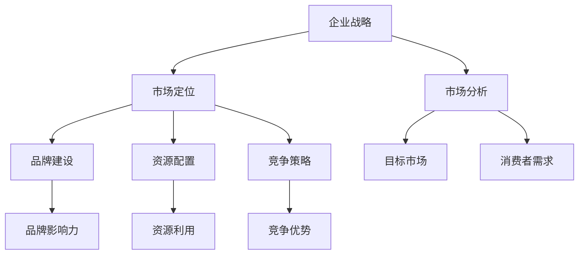
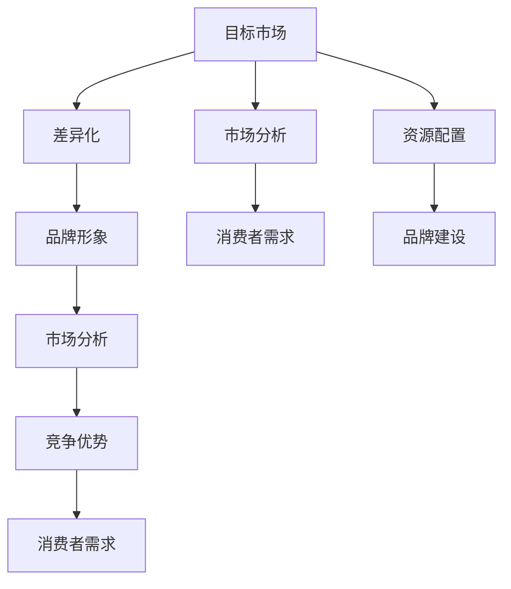
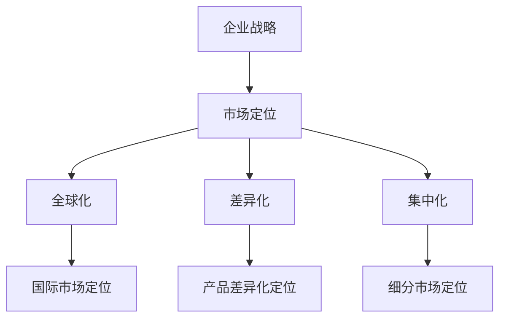
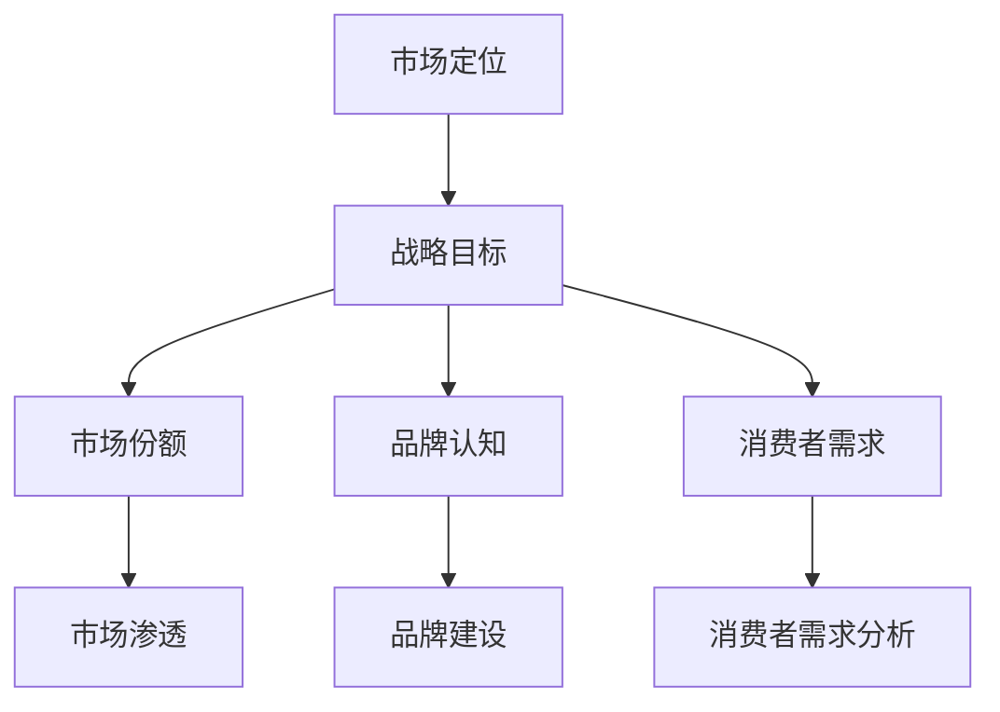
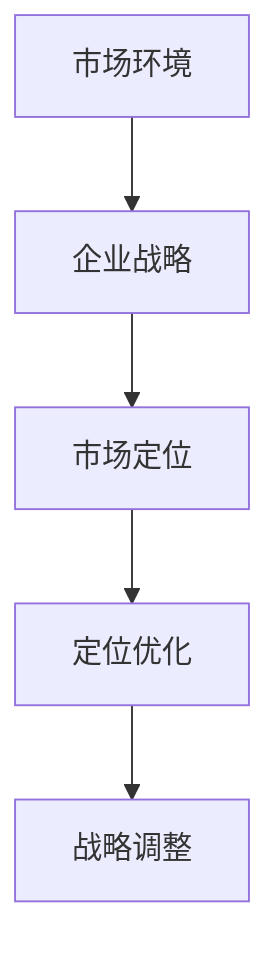
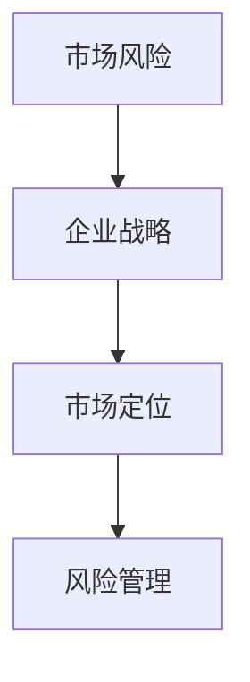
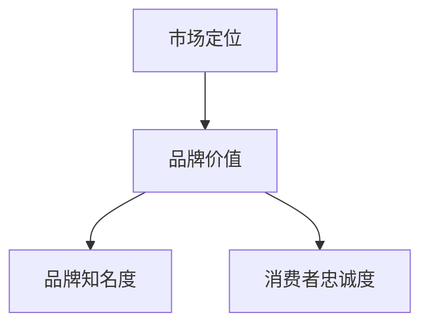

                 

### 第1章：市场定位的概述

#### 1.1 市场定位的定义与意义

市场定位（Market Positioning）是指企业根据目标市场的需求、竞争环境和自身资源，对产品或服务进行差异化设计，使其在消费者心中形成独特的形象和认知。市场定位不仅仅是选择目标市场，更重要的是在目标市场中建立一个与众不同的品牌形象。

**基本概念：**

- **市场定位**：在消费者心中建立品牌独特形象的过程。
- **目标市场**：企业选择进行市场活动和产品推广的目标消费者群体。
- **差异化**：通过独特的特点或优势，使产品或服务在市场上脱颖而出。

市场定位的核心是找到产品的独特卖点（Unique Selling Proposition, USP），即消费者为何选择该产品而不是竞争对手的产品。有效的市场定位能够帮助企业：

- **提升品牌形象**：明确企业在消费者心中的地位，增强品牌影响力。
- **增加市场份额**：通过精准的市场定位，提高产品或服务的竞争力。
- **优化资源配置**：集中资源服务于目标市场，提高资源利用效率。

#### 1.2 市场定位在创业中的重要性

对于技术创业者而言，市场定位的重要性不言而喻。以下是其关键作用：

- **明确方向**：市场定位可以帮助创业者明确产品的发展方向，避免盲目跟风。
- **竞争优势**：通过市场定位，创业者可以发现并利用自身的竞争优势，与竞争对手区分开来。
- **资源配置**：市场定位有助于创业者合理分配资源，专注于最有潜力的市场和需求。
- **品牌建设**：市场定位是品牌建设的基础，有助于塑造企业的品牌形象和市场地位。
- **风险控制**：合理的市场定位能够降低创业失败的风险，使企业更有针对性地应对市场变化。

#### 1.3 市场定位与企业战略的关系

市场定位与企业战略密切相关，两者相辅相成：

- **战略指导定位**：企业战略决定了市场定位的方向，例如，企业可能会选择全球化战略或细分市场战略。
- **定位支持战略**：市场定位则是实现企业战略的重要手段，通过有效的市场定位，企业可以实现其战略目标。

**关系图解：**

通过市场定位，企业不仅能够更好地满足消费者需求，还能在激烈的市场竞争中脱颖而出，实现长期战略目标。

### 1.1.1 市场定位的基本概念

市场定位是一个多层次、多维度的概念，涉及多个方面的要素。以下是市场定位的基本概念及其相互关系：

- **目标市场**：目标市场是企业希望吸引并服务的消费者群体。确定目标市场是市场定位的第一步，它决定了企业的市场策略和资源配置。

- **差异化**：差异化是指企业通过产品特性、品牌形象、服务质量等方面的独特性，使产品或服务在市场中具备竞争优势。

- **品牌形象**：品牌形象是消费者对企业的总体印象，包括品牌名称、标志、视觉识别系统、品牌文化等。

- **市场分析**：市场分析是市场定位的基础，包括对市场需求、竞争环境、消费者行为等各方面的深入研究。

- **竞争优势**：竞争优势是企业相对于竞争对手的优势，包括产品质量、价格、服务、技术等。

- **消费者需求**：消费者需求是市场定位的核心，了解消费者的需求是制定有效市场定位策略的关键。

**关系图解：**

通过以上基本概念的理解，企业可以更清晰地制定市场定位策略，确保其产品或服务能够满足目标市场的需求，并在竞争中脱颖而出。

### 1.1.2 市场定位在创业中的重要性

对于技术创业者来说，市场定位至关重要，它是决定创业项目成功与否的关键因素之一。以下从几个方面详细阐述市场定位在创业中的重要性：

#### 1. 面向市场需求

市场定位使创业者能够更加精准地把握市场需求，确保产品或服务能够满足消费者的实际需求。通过深入的市场调研和消费者行为分析，创业者可以了解目标市场的痛点、需求和偏好，从而设计出更符合市场期望的产品。

**案例**：小米公司在创业初期，通过深入了解中国消费者的需求，推出了高性价比的智能手机，迅速获得了市场的认可，并在短时间内实现了快速增长。

#### 2. 突出竞争优势

市场定位帮助企业识别并利用自身的竞争优势。在竞争激烈的市场环境中，明确的定位能够使企业从众多竞争对手中脱颖而出，建立独特的市场地位。竞争优势可以来自产品特性、技术创新、服务质量、品牌形象等多个方面。

**案例**：特斯拉公司通过其创新的技术和高端的电动汽车产品，成功在电动汽车市场中建立了强大的竞争优势，并在全球范围内赢得了广泛的消费者认可。

#### 3. 资源优化配置

市场定位有助于创业者合理分配资源，避免资源的浪费和分散。通过明确的目标市场和市场定位，企业可以集中资源在最有潜力的市场细分领域，提高资源利用效率，从而实现更好的市场表现。

**案例**：Airbnb在创业初期，通过明确的市场定位和资源优化配置，专注于旅游业市场，迅速在全球范围内拓展业务，成为全球领先的民宿预订平台。

#### 4. 品牌建设

市场定位是品牌建设的基础，通过有效的市场定位，企业可以塑造独特的品牌形象，提高品牌知名度和消费者忠诚度。良好的品牌形象不仅能够吸引消费者，还能增强企业的市场竞争力。

**案例**：苹果公司通过独特的设计风格、卓越的产品质量和创新的营销策略，成功地建立了强大的品牌形象，成为全球科技行业的领导者。

#### 5. 风险控制

市场定位能够帮助创业者预见市场变化，及时调整战略方向，从而降低创业失败的风险。通过持续的市场分析和定位优化，企业可以更好地应对市场挑战，保持持续竞争力。

**案例**：诺基亚在早期智能手机市场中，由于未能及时调整市场定位，未能适应消费者需求的变化，最终在市场中被竞争对手取代，成为行业发展的教训。

综上所述，市场定位在创业中的重要性不言而喻。通过准确的市场定位，创业者能够更好地把握市场机遇，优化资源配置，塑造品牌形象，并降低创业风险，从而提高创业项目的成功率。

### 1.1.3 市场定位与企业战略的关系

市场定位与企业战略密切相关，是企业战略的重要组成部分。市场定位不仅影响企业的短期业绩，还对其长期发展产生深远影响。以下从多个方面详细探讨市场定位与企业战略的关系：

**1. 战略指导定位**

企业战略决定了市场定位的方向和目标。企业战略通常包括全球化、差异化、集中化等不同策略，这些策略直接影响市场定位的具体实施。例如，采用全球化战略的企业需要在多个市场中进行定位，而采用差异化战略的企业则需要通过独特的产品特性来区分自己。

**关系图解：**

**2. 定位支持战略**

市场定位是企业战略实现的手段。通过有效的市场定位，企业可以更好地实现其战略目标。例如，如果企业的战略目标是扩大市场份额，那么通过精准的市场定位，企业可以找到最有潜力的市场细分，集中资源进行市场渗透。

**关系图解：**

**3. 战略调整与定位优化**

市场定位不是一成不变的，而是需要根据市场环境和竞争态势进行调整和优化的。企业战略的调整往往需要市场定位的同步调整，以确保战略目标的实现。例如，当市场环境发生变化或竞争态势加剧时，企业可能需要重新审视和调整其市场定位。

**关系图解：**

**4. 风险管理与战略定位**

市场定位的有效性直接影响企业的风险管理和战略稳定性。通过合理的市场定位，企业可以降低市场风险，提高战略执行的稳定性。例如，在市场不确定性较高的行业，企业通过精准的市场定位和灵活的战略调整，可以更好地应对市场波动。

**关系图解：**

**5. 品牌价值与战略定位**

品牌价值是企业长期战略目标之一，而市场定位直接影响品牌价值的提升。通过有效的市场定位，企业可以塑造强大的品牌形象，提高品牌知名度和消费者忠诚度，从而增强品牌价值。

**关系图解：**

综上所述，市场定位与企业战略密切相关，是企业发展过程中不可或缺的一部分。通过合理的市场定位，企业不仅可以实现短期目标，还能为长期战略目标的实现奠定坚实基础。

### 1.2 市场细分与目标市场选择

#### 1.2.1 市场细分的方法

市场细分是市场定位的重要组成部分，通过将整体市场划分为具有相似特征的子市场，企业可以更有针对性地制定营销策略，提高市场竞争力。以下介绍几种常用的市场细分方法：

**1. 地理细分**

地理细分是根据消费者所在的地理位置进行市场划分。地理细分有助于企业根据不同地区的消费习惯、经济状况、气候条件等因素，制定差异化的营销策略。

- **优点**：有助于企业更好地了解不同地区的市场需求，实现精准营销。
- **缺点**：地理细分可能导致市场细分过于细分，增加营销成本。

**案例**：可口可乐在不同地区的广告策略，根据当地的文化和消费者偏好进行调整，如在亚洲市场推广冰镇可乐。

**2. 人口细分**

人口细分是根据消费者的年龄、性别、收入、教育水平、职业等人口统计特征进行市场划分。人口细分是企业最常见的市场细分方法之一，因为它能够帮助企业识别和定位特定的消费群体。

- **优点**：有助于企业根据不同人群的需求和购买力，制定有针对性的产品和服务。
- **缺点**：人口细分可能忽略了消费者的个性化需求，导致市场细分过于宽泛。

**案例**：宝洁公司（P&G）根据不同年龄段和性别，推出多种针对不同消费者的洗发水、护肤品等产品。

**3. 心理细分**

心理细分是根据消费者的心理特征、生活方式、价值观和兴趣爱好进行市场划分。心理细分能够帮助企业深入了解消费者的内心需求，从而设计出更符合消费者心理的产品和服务。

- **优点**：有助于企业发现消费者的潜在需求，开发更具创新性的产品。
- **缺点**：心理细分需要大量调研和心理分析，成本较高。

**案例**：苹果公司通过心理细分，针对追求时尚、个性化和高端体验的消费者，推出iPhone系列高端产品。

**4. 行为细分**

行为细分是根据消费者的购买行为、使用习惯、品牌忠诚度等行为特征进行市场划分。行为细分有助于企业识别和吸引具有高价值行为的消费者，从而提高市场占有率。

- **优点**：有助于企业制定针对特定行为特征的营销策略，提高营销效果。
- **缺点**：行为细分可能导致市场细分过于细分，增加营销复杂度。

**案例**：亚马逊通过行为细分，针对经常购买书籍的消费者，推出个性化的图书推荐服务。

#### 1.2.2 目标市场的定义与评估

目标市场是指企业根据市场细分结果，选择最具盈利潜力和发展潜力的子市场作为主要服务对象。定义和评估目标市场是市场细分过程中的关键步骤。

**定义目标市场：**

- **市场潜力**：目标市场应具有足够的市场规模和增长潜力。
- **盈利能力**：目标市场应具备良好的盈利前景，能够为企业带来持续的收入。
- **可进入性**：目标市场应具备足够的进入条件，如政策支持、市场需求等。
- **竞争优势**：目标市场应与企业核心竞争力相匹配，有助于企业发挥优势。

**评估目标市场：**

1. **市场规模**：分析目标市场的潜在消费者数量和市场规模。
2. **增长潜力**：预测目标市场的未来增长趋势，分析其发展潜力。
3. **竞争态势**：评估目标市场的竞争状况，分析竞争对手的市场份额和策略。
4. **盈利前景**：评估目标市场的盈利能力和盈利前景。
5. **企业能力**：评估企业自身在目标市场中的竞争能力和资源配备。

**目标市场评估工具：**

- **SWOT分析**：分析目标市场的优势、劣势、机会和威胁。
- **PEST分析**：分析目标市场的政治、经济、社会、技术环境。
- **五力分析**：分析目标市场的供应商、买家、潜在竞争者、替代品、行业内竞争者。

#### 1.2.3 如何选择目标市场

选择目标市场是企业市场战略的重要环节，以下介绍几种选择目标市场的方法：

**1. 集中市场策略**

集中市场策略是指企业选择一个细分市场作为主要目标市场，集中资源进行服务。这种方法适用于资源有限的企业，能够帮助企业快速建立市场地位。

- **优点**：市场集中，资源利用率高，易于管理。
- **缺点**：市场风险较大，过于依赖单一市场。

**案例**：小米公司初期主要针对中国年轻消费者，通过高性价比的智能手机迅速占领市场。

**2. 差异化市场策略**

差异化市场策略是指企业选择多个细分市场作为目标市场，提供差异化的产品和服务。这种方法有助于企业分散市场风险，提高市场占有率。

- **优点**：市场多样化，风险分散，市场占有率提高。
- **缺点**：市场管理复杂度增加，资源分散。

**案例**：宝洁公司（P&G）通过在不同市场推出不同的产品线，满足不同消费者的需求。

**3. 全面市场策略**

全面市场策略是指企业覆盖整个市场，提供多元化的产品和服务。这种方法适用于大型企业，能够帮助企业实现全球市场扩张。

- **优点**：市场覆盖全面，市场份额大。
- **缺点**：资源需求大，管理复杂度高。

**案例**：可口可乐公司通过全面市场策略，在全球范围内提供多种口味的饮料。

**选择目标市场的考虑因素：**

1. **市场潜力**：目标市场的规模和增长潜力。
2. **竞争态势**：目标市场的竞争状况和竞争对手的实力。
3. **企业能力**：企业的资源、技术和管理能力。
4. **盈利前景**：目标市场的盈利能力和未来前景。
5. **市场需求**：目标市场的消费者需求和购买力。

通过以上市场细分方法和目标市场选择策略，企业可以更加精准地定位市场，制定有效的市场定位策略，提高市场竞争力。

### 1.2.4 跨市场扩展的策略

跨市场扩展是企业实现业务增长和市场份额扩大的一种重要策略。通过跨市场扩展，企业可以进入新的市场领域，获取更多的客户资源和市场份额。以下介绍几种常见的跨市场扩展策略：

#### 1. 渗透策略

渗透策略是指企业通过在现有市场的基础上，提高市场份额和产品销量来实现跨市场扩展。这种方法适用于产品成熟、市场知名度较高的企业。

- **优点**：风险较低，成本相对较低，可以迅速提高市场份额。
- **缺点**：市场潜力有限，可能难以实现大规模的业务增长。

**案例**：苹果公司在全球范围内推广iPhone，通过提高市场份额和产品销量，实现了跨市场扩展。

#### 2. 开拓策略

开拓策略是指企业进入新的市场领域，开拓新的客户群体和业务领域。这种方法适用于资源充足、具备市场开拓能力的企业。

- **优点**：市场潜力巨大，可以实现大规模的业务增长。
- **缺点**：风险较高，需要大量的资金和人力资源投入。

**案例**：小米公司通过开拓国际市场，进入印度、东南亚等地区，实现了全球业务的快速增长。

#### 3. 多元化策略

多元化策略是指企业进入多个市场领域，提供多元化的产品和服务。这种方法适用于具备强大资源和管理能力的企业。

- **优点**：可以分散市场风险，提高业务的稳定性。
- **缺点**：管理复杂度增加，需要大量的资源投入。

**案例**：通用电气（GE）通过多元化策略，进入多个行业领域，如医疗、能源、航空等，实现了业务的多元化发展。

#### 4. 合作策略

合作策略是指企业通过与其他企业合作，共同开拓新的市场。这种方法适用于资源有限、需要借助外部力量的企业。

- **优点**：可以快速进入市场，降低风险和成本。
- **缺点**：合作双方可能存在利益冲突，需要精心管理合作关系。

**案例**：阿里巴巴与本地电商企业合作，共同开拓东南亚市场，实现了快速扩展。

#### 5. 文化融合策略

文化融合策略是指企业在跨文化市场中，通过融入当地文化来满足消费者需求。这种方法适用于文化差异较大的市场。

- **优点**：可以更好地适应本地市场，提高市场竞争力。
- **缺点**：需要深入了解本地文化，实施成本较高。

**案例**：麦当劳在全球范围内，根据当地文化调整菜单，如在中国推出牛肉汉堡，在日本推出鸡肉汉堡。

#### 跨市场扩展的注意事项

1. **市场调研**：在进入新市场前，进行充分的市场调研，了解市场需求、竞争态势和文化背景。
2. **本地化**：根据本地市场的需求和特点，调整产品和服务，实现本地化运营。
3. **风险管理**：评估市场风险，制定相应的风险管理措施，降低市场扩展过程中的风险。
4. **资源分配**：合理分配企业资源，确保市场扩展的顺利进行。
5. **持续监控**：在市场扩展过程中，持续监控市场反应和效果，及时进行调整。

通过以上跨市场扩展策略和注意事项，企业可以更加有效地实现市场扩展，提高业务竞争力。

### 第2章：市场分析

#### 2.1 市场调研

市场调研是市场分析的基础，它通过收集和分析市场数据，帮助企业了解市场需求、消费者行为和竞争对手情况。以下详细介绍市场调研的方法、步骤及其应用。

**市场调研的方法：**

1. **定量调研**：通过问卷调查、电话访问、在线调查等方式收集大量数据，进行统计分析。定量调研可以提供具体的数值和趋势分析，有助于企业制定科学的决策。

2. **定性调研**：通过深度访谈、小组讨论、焦点小组讨论等方式，深入了解消费者需求和动机。定性调研可以帮助企业发现潜在问题和机会，提供深层次的洞察。

3. **观察调研**：通过直接观察消费者的购买行为、使用行为等，获取第一手数据。观察调研适用于分析消费者行为习惯和偏好。

4. **实验调研**：通过实验方法，如对比测试、模拟市场等，评估产品或服务的效果。实验调研有助于企业验证假设和预测，提高决策的准确性。

**市场调研的步骤：**

1. **确定调研目标**：明确调研的目的和范围，如了解市场需求、消费者行为、竞争对手情况等。

2. **设计调研工具**：根据调研目标，选择合适的调研方法，设计问卷、访谈提纲等调研工具。

3. **数据收集**：通过问卷调查、电话访问、在线调查、观察等方式收集数据。

4. **数据整理**：对收集到的数据进行分类、编码、录入等处理，确保数据的质量和完整性。

5. **数据分析**：运用统计软件和数据分析方法，对调研数据进行处理和分析，提取有价值的信息。

6. **撰写调研报告**：总结分析结果，撰写详细的调研报告，为决策提供依据。

**市场调研的应用：**

1. **市场需求预测**：通过市场调研，了解消费者的需求变化，预测市场趋势，帮助企业制定长期战略规划。

2. **产品开发**：根据市场调研结果，优化产品设计，满足消费者需求，提高产品的市场竞争力。

3. **营销策略制定**：通过市场调研，了解竞争对手的营销策略和消费者行为，制定有针对性的营销策略，提高市场占有率。

4. **品牌建设**：通过市场调研，了解消费者的品牌认知和品牌偏好，优化品牌形象，提升品牌价值。

**案例分析：**

**案例**：某家电公司进行市场调研，旨在了解消费者对其新推出的智能冰箱的需求和偏好。

1. **调研目标**：了解消费者对智能冰箱的需求、功能偏好和购买意愿。

2. **调研工具**：设计问卷，通过线上和线下渠道进行发放。

3. **数据收集**：收集1000份有效问卷，进行数据分析。

4. **数据分析**：通过数据分析，发现消费者对智能冰箱的智能控制和节能功能需求较高，但价格是其购买的主要考虑因素。

5. **调研报告**：撰写详细的调研报告，提出优化智能冰箱功能的建议，并调整定价策略。

通过以上市场调研，该家电公司能够更好地满足消费者需求，提高新产品的市场竞争力。

### 2.2 竞争分析

竞争分析是市场分析的重要组成部分，通过分析竞争对手的产品、策略和市场地位，企业可以了解自身在市场中的位置，并制定相应的竞争策略。以下详细介绍竞争分析的方法、步骤及其应用。

**竞争分析的方法：**

1. **SWOT分析**：对竞争对手的优势（Strengths）、劣势（Weaknesses）、机会（Opportunities）和威胁（Threats）进行综合分析。SWOT分析有助于企业识别竞争对手的核心竞争力和发展潜力。

2. **PEST分析**：分析竞争对手在政治（Political）、经济（Economic）、社会（Social）和技术（Technological）环境中的表现。PEST分析可以帮助企业了解竞争对手所处的市场环境，制定相应的应对策略。

3. **五力分析**：运用五力模型（供应商、买家、潜在竞争者、替代品、行业内竞争者）对竞争对手的市场地位和竞争力进行评估。五力分析有助于企业了解市场结构和竞争态势。

4. **市场占有率分析**：通过分析竞争对手在市场中的份额，了解其在不同市场的地位和表现。市场占有率分析可以帮助企业制定市场份额提升策略。

**竞争分析的步骤：**

1. **确定竞争对手**：明确企业的直接和间接竞争对手，包括主要竞争对手和潜在竞争对手。

2. **收集竞争信息**：通过各种途径收集竞争对手的信息，如产品特点、价格策略、市场份额、营销活动等。

3. **分析竞争信息**：对收集到的信息进行整理和分析，识别竞争对手的优势、劣势和市场地位。

4. **制定竞争策略**：根据竞争分析结果，制定相应的竞争策略，如产品差异化、市场细分、价格竞争等。

**竞争分析的应用：**

1. **识别竞争对手优势**：通过竞争分析，企业可以了解竞争对手的核心竞争力，避免直接与其正面竞争。

2. **制定差异化策略**：通过竞争分析，企业可以发现自身的差异化点，制定差异化策略，提高市场竞争力。

3. **优化产品和服务**：通过竞争分析，企业可以了解消费者对竞争对手产品和服务的评价，优化自身的产品和服务，提高客户满意度。

4. **市场拓展**：通过竞争分析，企业可以了解竞争对手的市场拓展策略，制定相应的市场拓展计划。

**案例分析：**

**案例**：某手机制造商进行竞争分析，以了解其市场地位和竞争策略。

1. **确定竞争对手**：识别主要竞争对手，包括三星、华为、小米等。

2. **收集竞争信息**：通过市场调研、行业报告、竞争对手官网等方式收集竞争信息。

3. **分析竞争信息**：通过SWOT分析和五力分析，发现三星在高端市场具有明显优势，华为在中端市场表现强劲，小米在性价比市场占主导地位。

4. **制定竞争策略**：根据分析结果，该手机制造商决定：

   - 在高端市场，通过技术创新和品牌建设提高产品竞争力。
   - 在中端市场，推出性价比高的产品，争夺市场份额。
   - 在低端市场，通过价格策略和广告宣传吸引消费者。

通过以上竞争分析，该手机制造商能够制定出有针对性的竞争策略，提高市场竞争力。

### 2.3 消费者行为分析

消费者行为分析是市场分析的核心环节之一，它通过研究消费者的购买行为、使用习惯和偏好，帮助企业了解目标市场的需求和特征，从而制定有效的营销策略。以下详细介绍消费者行为分析的方法、步骤及其应用。

**消费者行为分析的方法：**

1. **心理分析**：通过心理学理论，分析消费者在购买决策过程中的心理动机、认知过程和情感反应。心理分析有助于企业理解消费者为何做出某种购买决策。

2. **行为分析**：通过观察和记录消费者的购买行为，如购买频率、购买时间、购买渠道等，分析消费者的行为模式。行为分析可以帮助企业发现消费者的实际购买行为特征。

3. **数据分析**：运用数据挖掘和统计分析方法，对消费者行为数据进行分析，提取有价值的信息。数据分析有助于企业发现消费者行为中的趋势和规律。

4. **用户画像**：通过整合消费者行为数据，构建详细的用户画像，包括消费者的年龄、性别、收入、兴趣爱好等。用户画像有助于企业了解消费者的特征和需求。

**消费者行为分析的步骤：**

1. **确定分析目标**：明确消费者行为分析的目的和范围，如了解消费者购买动机、优化产品特性、提高客户满意度等。

2. **收集数据**：通过问卷调查、在线调查、用户访谈、观察等方式收集消费者行为数据。

3. **数据整理**：对收集到的数据进行分类、编码、清洗等处理，确保数据的质量和完整性。

4. **数据分析**：运用统计软件和数据分析方法，对消费者行为数据进行处理和分析，提取有价值的信息。

5. **撰写分析报告**：总结分析结果，撰写详细的消费者行为分析报告，为营销策略制定提供依据。

**消费者行为分析的应用：**

1. **产品优化**：通过分析消费者行为，发现产品设计和功能中的不足，优化产品特性，提高产品竞争力。

2. **营销策略制定**：根据消费者行为分析结果，制定有针对性的营销策略，如广告投放、促销活动等，提高营销效果。

3. **客户关系管理**：通过消费者行为分析，了解消费者的需求和偏好，提供个性化的客户服务，提高客户满意度和忠诚度。

4. **市场定位**：基于消费者行为分析结果，明确目标市场，制定市场细分和定位策略。

**案例分析：**

**案例**：某化妆品公司进行消费者行为分析，以了解其目标市场的需求和特征。

1. **确定分析目标**：了解消费者购买化妆品的动机、品牌偏好和使用习惯。

2. **收集数据**：通过线上问卷调查、用户访谈和销售数据分析等方式收集消费者行为数据。

3. **数据整理**：对收集到的数据进行分类整理，如品牌偏好、购买频率、使用场景等。

4. **数据分析**：通过数据分析，发现消费者对品牌忠诚度较高，但品牌间的价格差异显著影响购买决策。

5. **撰写分析报告**：根据分析结果，该化妆品公司决定：

   - 加强品牌建设，提升品牌形象。
   - 推出不同价格段的产品，满足不同消费者的需求。
   - 提供个性化的购买建议和售后服务，提高客户满意度和忠诚度。

通过以上消费者行为分析，该化妆品公司能够更好地了解目标市场，制定有效的营销策略，提高市场竞争力。

### 第3章：市场定位策略制定

#### 3.1 定位策略的种类

市场定位策略是企业在目标市场中获取竞争优势的重要手段。根据不同的市场环境和企业目标，市场定位策略可以分为多种类型。以下详细介绍不同定位策略的定义、特点和适用场景。

**1. 产品差异化定位**

产品差异化定位是指企业通过提供具有独特功能、设计或服务的产品，在消费者心中建立与众不同的品牌形象。这种策略的核心是创新和独特性，使产品在竞争激烈的市场中脱颖而出。

**特点：**
- 强调产品本身的独特性和创新性。
- 提高产品的附加值和品牌溢价。
- 需要大量研发投入。

**适用场景：**
- 产品高度同质化的市场。
- 企业拥有较强的技术创新能力。

**案例：** 苹果公司的iPhone系列，通过独特的设计、操作系统和生态系统，建立了强大的品牌形象。

**2. 目标市场定位**

目标市场定位是指企业根据市场细分的结果，选择一个或多个具有较高盈利潜力的细分市场，并针对这些市场制定相应的营销策略。这种策略的核心是精准定位，集中资源服务于特定的消费者群体。

**特点：**
- 强调市场细分和目标市场的选择。
- 需要对消费者需求有深入的了解。
- 提高市场占有率和客户满意度。

**适用场景：**
- 市场细分明显的市场。
- 企业资源有限，需要集中力量突破。

**案例：** 小米公司通过定位年轻消费者市场，推出性价比高的智能手机，迅速占领了市场份额。

**3. 品牌形象定位**

品牌形象定位是指企业通过塑造独特、一致的品牌形象，在消费者心中建立特定的认知和印象。这种策略的核心是品牌价值观和品牌文化的传递，以赢得消费者的信任和忠诚。

**特点：**
- 强调品牌形象的塑造和品牌文化的传递。
- 需要长期的品牌建设。
- 提高品牌的影响力和市场份额。

**适用场景：**
- 品牌竞争激烈的市场。
- 企业需要树立独特的品牌形象。

**案例：** 可口可乐通过“分享快乐”的品牌形象，赢得了全球消费者的喜爱。

**4. 价格定位**

价格定位是指企业根据产品价值、市场需求和竞争状况，确定合适的定价策略。这种策略的核心是价格策略的灵活性，以适应不同的市场细分和消费者需求。

**特点：**
- 强调价格的策略性和灵活性。
- 需要考虑成本、市场竞争和消费者心理。
- 提高市场渗透率和市场份额。

**适用场景：**
- 市场需求波动较大的市场。
- 企业需要快速占领市场。

**案例：** 宜家通过低价高质的家居产品，吸引了大量消费者。

**5. 混合定位**

混合定位是指企业结合多种定位策略，以满足不同消费者的需求。这种策略的核心是多元化，通过多种策略的组合，提高市场的覆盖率和竞争力。

**特点：**
- 结合多种定位策略，实现市场多元化。
- 需要企业具备较强的资源整合能力。
- 提高市场的适应性和竞争力。

**适用场景：**
- 市场多样化，消费者需求复杂。
- 企业资源充足，具备多元化能力。

**案例：** 亚马逊通过产品差异化、目标市场定位和价格定位，建立了全球领先的电子商务平台。

通过以上不同定位策略的介绍，企业可以根据自身情况和市场环境，选择适合的定位策略，提高市场竞争力。

### 3.2 定位策略的实施

市场定位策略的有效实施是企业成功的关键。一个成功的市场定位不仅需要明确的目标和策略，还需要在执行过程中充分考虑各种因素，确保策略能够落地并产生实际效果。以下详细讨论定位策略实施的步骤、方法及其注意事项。

#### 3.2.1 品牌建设

品牌建设是市场定位策略实施的重要组成部分。一个强大的品牌能够为企业带来长期的竞争优势和市场份额。

**品牌建设的方法：**

1. **品牌名称与标志**：选择简洁、易于记忆和具有辨识度的品牌名称和标志。品牌名称应能够反映企业的核心价值和产品特性，标志设计应独特且具有视觉吸引力。

2. **品牌故事**：通过品牌故事传递企业的价值观、历史和文化。品牌故事应具有情感共鸣，使消费者对企业产生认同感。

3. **品牌文化**：建立企业独特的品牌文化，包括品牌使命、愿景和核心价值观。品牌文化应能够引导员工行为，形成企业内部凝聚力。

**注意事项：**

- **一致性**：确保品牌在所有渠道和触点上的形象和传播一致。
- **持续投入**：品牌建设需要持续的资源投入，不能一蹴而就。

#### 3.2.2 营销传播策略

营销传播策略是市场定位策略实施的重要手段，通过有效的营销传播，企业可以将定位信息传递给目标消费者。

**营销传播策略的方法：**

1. **广告**：通过电视、广播、互联网、户外广告等多种形式，传递品牌定位信息。

2. **公关**：通过新闻发布、媒体合作、公益活动等，提升品牌形象和知名度。

3. **社交媒体**：利用社交媒体平台，与消费者进行互动，传播品牌故事和价值观。

4. **内容营销**：通过博客、白皮书、电子书、视频等多种形式，提供有价值的内容，吸引目标消费者。

**注意事项：**

- **针对性**：确保营销传播策略针对目标市场，提高传播效果。
- **互动性**：鼓励消费者参与，增强品牌互动性。

#### 3.2.3 产品规划与调整

产品规划与调整是市场定位策略实施的核心环节，通过不断优化产品，满足目标市场的需求。

**产品规划与调整的方法：**

1. **产品研发**：根据市场定位，研发具有独特卖点和创新功能的产品。

2. **产品线扩展**：根据市场细分和消费者需求，扩展产品线，提供多样化的产品选择。

3. **产品迭代**：定期更新产品，引入新技术和功能，保持产品竞争力。

**注意事项：**

- **消费者需求**：确保产品规划与调整紧密围绕消费者需求。
- **成本控制**：在产品研发和迭代过程中，控制成本，提高投资回报率。

#### 3.2.4 定位策略的评估与调整

定位策略的实施是一个动态的过程，需要定期评估策略的有效性，并根据市场变化进行调整。

**评估与调整的方法：**

1. **市场反馈**：收集消费者和市场的反馈，了解定位策略的实际效果。

2. **数据分析**：通过数据分析，评估定位策略的市场表现，如市场份额、销售额、品牌知名度等。

3. **竞争对手分析**：分析竞争对手的定位策略和市场表现，评估自身定位策略的优劣势。

**注意事项：**

- **灵活性**：保持定位策略的灵活性，根据市场变化及时进行调整。
- **持续优化**：不断优化定位策略，提高市场竞争力。

通过以上品牌建设、营销传播策略、产品规划与调整以及定位策略的评估与调整，企业可以确保市场定位策略的有效实施，从而在激烈的市场竞争中脱颖而出。

### 第4章：市场定位案例研究

#### 4.1 成功案例解析

**案例一：苹果公司**

苹果公司（Apple Inc.）是全球知名的高科技公司，其成功的市场定位策略使其在竞争激烈的市场中始终保持领先地位。以下是苹果公司市场定位策略的详细解析：

**1. 产品差异化定位**

苹果公司通过独特的产品设计和创新功能，成功实现了产品差异化定位。iPhone、iPad、MacBook等系列产品以卓越的性能、出色的用户体验和独特的设计赢得了消费者的喜爱。

- **独特设计**：苹果公司注重产品外观设计的创新，使产品具备独特的视觉风格。
- **技术创新**：苹果公司不断推出新的技术，如触控屏、FaceTime视频通话、M1芯片等，提升产品竞争力。
- **生态系统**：苹果公司建立了强大的生态系统，包括App Store、Apple Pay等，为消费者提供无缝衔接的体验。

**2. 品牌形象定位**

苹果公司通过品牌形象塑造，建立了高端、创新、品质卓越的品牌形象。这种品牌形象使消费者对苹果产品充满信任和忠诚。

- **品牌理念**：苹果公司倡导“Think Different”的品牌理念，强调创新和创造力。
- **品牌传播**：苹果公司通过精彩的广告宣传，如“不同凡响”广告系列，传递其品牌价值观。
- **品牌体验**：苹果公司注重消费者体验，通过全球门店和在线商店，提供优质的服务和购物体验。

**3. 价格定位**

苹果公司采取高端定价策略，通过高溢价获得更高的利润。尽管价格较高，但苹果品牌的高品质和独特性使其能够吸引大量高端消费者。

- **高端定价**：苹果公司的产品价格高于市场平均水平，但消费者愿意为高品质和独特体验支付额外费用。
- **价格区间**：苹果公司通过不同的产品线，提供多样化的价格选择，满足不同消费者的需求。

**成功因素：**

- **持续创新**：苹果公司持续投入研发，保持技术创新的领先地位。
- **精准定位**：苹果公司通过精准的市场定位，抓住高端消费者的需求。
- **品牌建设**：苹果公司通过强大的品牌建设和品牌传播，建立了卓越的品牌形象。

**案例二：特斯拉公司**

特斯拉公司（Tesla, Inc.）是全球领先的电动汽车制造商，其独特的市场定位策略使其在电动汽车市场中迅速崛起。以下是特斯拉公司市场定位策略的详细解析：

**1. 产品差异化定位**

特斯拉通过创新的产品和技术，实现了产品差异化定位。特斯拉的电动汽车以高性能、长续航和智能驾驶功能著称，吸引了大量消费者。

- **高性能**：特斯拉的电动汽车拥有出色的加速性能和长续航能力。
- **智能驾驶**：特斯拉的Autopilot系统实现了部分自动驾驶功能，为消费者提供便捷的驾驶体验。
- **新能源**：特斯拉致力于推动电动汽车和可再生能源的发展，契合了环保趋势。

**2. 品牌形象定位**

特斯拉通过品牌形象塑造，建立了创新、环保、高端的品牌形象。特斯拉的品牌形象使消费者对其产品充满信任和期待。

- **品牌理念**：特斯拉倡导“加速世界向可持续能源转型”的品牌理念，强调创新和环保。
- **品牌传播**：特斯拉通过社交媒体和新闻发布，积极传播其品牌故事和价值观。
- **品牌体验**：特斯拉的体验中心为消费者提供了独特的购车和体验体验。

**3. 价格定位**

特斯拉采取中高端定价策略，通过产品的高性能和智能功能获得高溢价。尽管价格较高，但特斯拉的品牌价值和产品特性使其能够吸引大量高端消费者。

- **中高端定价**：特斯拉的产品价格高于传统汽车品牌，但低于其他电动汽车品牌。
- **价格区间**：特斯拉通过不同的产品线和配置，提供多样化的价格选择，满足不同消费者的需求。

**成功因素：**

- **技术创新**：特斯拉持续投入研发，保持技术创新的领先地位。
- **市场定位**：特斯拉通过精准的市场定位，抓住电动汽车市场的机遇。
- **品牌建设**：特斯拉通过强大的品牌建设和品牌传播，建立了卓越的品牌形象。

**案例三：小米公司**

小米公司（Xiaomi Corporation）是中国领先的智能手机和智能家居制造商，其独特的市场定位策略使其在竞争激烈的市场中迅速崛起。以下是小米公司市场定位策略的详细解析：

**1. 产品差异化定位**

小米通过性价比高的智能手机和智能家居产品，实现了产品差异化定位。小米的产品以高性价比、智能化和用户体验著称，吸引了大量年轻消费者。

- **高性价比**：小米的智能手机价格低于市场平均水平，但性能不亚于高端手机。
- **智能化**：小米的智能家居产品通过物联网技术，实现家庭设备的智能化控制。
- **用户体验**：小米注重用户体验，通过简洁美观的设计和优秀的系统优化，提升用户满意度。

**2. 品牌形象定位**

小米通过品牌形象塑造，建立了年轻、创新、高性价比的品牌形象。小米的品牌形象使消费者对其产品充满信任和期待。

- **品牌理念**：小米倡导“创新、品质、效率”的品牌理念，强调技术创新和用户体验。
- **品牌传播**：小米通过社交媒体和线上活动，积极传播其品牌故事和价值观。
- **品牌体验**：小米的线上商店和线下体验店为消费者提供了便捷的购物和体验体验。

**3. 价格定位**

小米采取中低端定价策略，通过产品的高性价比获得大量市场份额。尽管价格较低，但小米的产品质量和服务使其能够吸引大量消费者。

- **中低端定价**：小米的产品价格低于市场平均水平，但性能和品质不亚于高端产品。
- **价格区间**：小米通过不同的产品线和配置，提供多样化的价格选择，满足不同消费者的需求。

**成功因素：**

- **技术创新**：小米持续投入研发，保持技术创新的领先地位。
- **市场定位**：小米通过精准的市场定位，抓住年轻消费者和高性价比市场的机遇。
- **品牌建设**：小米通过强大的品牌建设和品牌传播，建立了卓越的品牌形象。

通过以上成功案例的解析，我们可以看到苹果、特斯拉和小米公司是如何通过独特的市场定位策略，在竞争激烈的市场中脱颖而出，实现了长期的成功。

#### 4.2 失败案例解析

在市场定位过程中，并非所有企业都能取得成功。以下分析几个典型的失败案例，探讨其市场定位策略的不足之处及其教训。

**案例一：诺基亚**

诺基亚曾是全球最大的手机制造商，但在智能手机时代，诺基亚未能及时调整其市场定位，导致市场份额急剧下滑，最终被微软收购。

**失败原因：**

1. **市场定位滞后**：诺基亚在智能手机市场初期，未能及时推出具有竞争力的智能手机产品，错失了市场先机。

2. **产品创新不足**：诺基亚在产品创新方面明显滞后，其手机产品缺乏独特的卖点和创新功能，无法吸引消费者。

3. **品牌形象老化**：诺基亚的品牌形象过于传统，未能与时俱进，无法与新兴的智能手机品牌竞争。

**教训：**

- **及时调整市场定位**：企业应密切关注市场变化，及时调整市场定位，抓住市场机遇。
- **重视产品创新**：企业应持续投入研发，推出具有独特卖点和创新功能的产品，提升竞争力。
- **更新品牌形象**：企业应不断更新品牌形象，以适应市场需求，提升品牌吸引力。

**案例二：黑莓手机**

黑莓（BlackBerry）曾是全球领先的智能手机品牌，但未能适应智能手机市场的发展，市场份额大幅下滑，最终退出智能手机市场。

**失败原因：**

1. **市场定位过于狭窄**：黑莓最初专注于企业市场，忽视了个人消费者市场，导致市场份额受限。

2. **产品更新缓慢**：黑莓在智能手机市场上的产品更新速度较慢，无法与竞争对手保持竞争力。

3. **缺乏创新**：黑莓在产品创新方面明显滞后，其手机产品缺乏吸引消费者的独特卖点和创新功能。

**教训：**

- **多元化市场定位**：企业应多元化市场定位，不仅关注特定市场，还应抓住更广泛的市场机会。
- **加快产品更新速度**：企业应加快产品更新速度，以保持市场竞争力。
- **注重产品创新**：企业应持续投入研发，推出具有独特卖点和创新功能的产品，提升竞争力。

**案例三：雅虎**

雅虎曾是全球最大的互联网门户之一，但由于未能适应互联网发展趋势，未能抓住市场机遇，最终被微软收购。

**失败原因：**

1. **市场定位不清**：雅虎在市场定位上缺乏清晰的方向，既没有专注于核心业务，也没有有效应对新兴市场的竞争。

2. **创新不足**：雅虎在技术创新和产品开发方面明显滞后，未能推出具有竞争力的新产品。

3. **管理不善**：雅虎在管理上存在诸多问题，如内部矛盾、战略不明确等，导致公司缺乏凝聚力。

**教训：**

- **明确市场定位**：企业应明确市场定位，专注于核心业务，避免多元化导致的资源分散。
- **重视创新**：企业应重视技术创新，不断推出新产品，以保持市场竞争力。
- **优化管理**：企业应优化管理，建立高效的决策机制，确保战略执行的顺利进行。

通过以上失败案例的分析，我们可以看到，市场定位的失误往往导致企业的失败。企业应从这些案例中吸取教训，及时调整市场定位策略，以适应市场的变化，保持竞争力。

### 第5章：市场定位的挑战与应对

#### 5.1 市场定位的常见问题

在进行市场定位时，企业可能会遇到一系列问题，这些问题的存在可能影响市场定位的有效性和企业的长期发展。以下分析市场定位过程中常见的几个问题及其解决策略。

**1. 定位模糊**

定位模糊是指企业在市场定位过程中，未能清晰界定自身的市场位置和目标市场，导致市场信息传递不明确，消费者难以形成明确的品牌印象。

**原因：**
- 缺乏明确的市场细分和分析。
- 产品和服务缺乏独特卖点。
- 品牌形象不清晰。

**解决策略：**
- **明确市场细分**：通过对市场进行深入分析，明确目标市场，确保定位的精准性。
- **强化独特卖点**：通过产品或服务的差异化特点，打造独特的品牌形象。
- **品牌形象建设**：建立清晰的品牌形象，通过一致的市场传播，强化品牌认知。

**2. 定位过于细分**

定位过于细分是指企业在市场定位时，过度关注小众市场，导致资源分散，无法形成规模效应。

**原因：**
- 对市场细分过度，未能抓住主要市场。
- 对市场机会估计不足，过于追求细分市场。

**解决策略：**
- **优化市场细分**：重新评估市场细分，确定主要目标市场，避免资源浪费。
- **集中资源**：集中资源服务于主要市场，确保资源利用效率。
- **平衡细分市场**：在适当的情况下，平衡细分市场，确保市场覆盖的广度和深度。

**3. 定位滞后**

定位滞后是指企业在市场定位过程中，未能及时调整定位策略，导致无法适应市场变化和消费者需求。

**原因：**
- 市场调研不足，对市场变化反应迟钝。
- 企业内部决策缓慢，执行力不足。

**解决策略：**
- **加强市场调研**：定期进行市场调研，密切关注市场动态，及时调整定位策略。
- **提高决策效率**：优化内部决策流程，提高执行力，确保定位策略的及时调整。
- **灵活应对市场变化**：建立快速反应机制，灵活应对市场变化，确保定位策略的前瞻性和适应性。

**4. 定位过于激进**

定位过于激进是指企业在市场定位时，过于追求市场领先地位，导致资源过度集中，风险加大。

**原因：**
- 对市场机会估计过高，缺乏风险意识。
- 过度依赖单一市场，忽视多元化发展。

**解决策略：**
- **平衡市场拓展**：在市场拓展过程中，注重市场风险的评估和管理，避免过度集中资源。
- **多元化市场布局**：通过多元化市场布局，降低市场风险，确保企业的可持续发展。
- **稳健经营**：保持稳健的经营策略，确保企业在激烈的市场竞争中稳步发展。

**5. 定位缺乏创新**

定位缺乏创新是指企业在市场定位过程中，未能充分利用新技术、新产品或新理念，导致市场竞争力下降。

**原因：**
- 对市场趋势缺乏敏感度，创新意识不足。
- 研发投入不足，缺乏技术储备。

**解决策略：**
- **增强市场敏感性**：关注市场趋势和技术发展，确保市场定位的前瞻性和创新性。
- **加大研发投入**：增加研发投入，持续创新，推出具有竞争力的新产品。
- **推动内部创新**：鼓励员工提出创新想法，建立创新激励机制，提高企业的创新能力。

通过以上分析和解决策略，企业可以更好地应对市场定位过程中遇到的问题，提高市场定位的有效性，增强企业的市场竞争力。

### 5.2 面对竞争的应对策略

在激烈的市场竞争中，企业必须采取有效的策略来应对竞争压力，确保自身的市场地位和盈利能力。以下介绍几种常见的应对策略，包括市场差异化策略、市场细分策略、市场聚焦策略和防御性定位策略。

#### 5.2.1 市场差异化策略

市场差异化策略是指企业通过在产品、服务、品牌、渠道等方面的独特性，使自身在市场中具备与众不同的竞争优势。以下是一些实施市场差异化策略的方法：

1. **产品差异化**：通过技术创新、独特设计或特殊功能，使产品在市场上具有独特的卖点。例如，苹果公司的iPhone系列凭借其卓越的设计和操作系统，在智能手机市场中脱颖而出。

2. **服务差异化**：提供高质量的服务，如快速响应、个性化服务和优质的售后支持。例如，亚马逊通过提供高效的物流服务和卓越的客户体验，赢得了大量消费者的信任。

3. **品牌差异化**：塑造独特的品牌形象，传递与众不同的品牌价值观。例如，可口可乐通过“分享快乐”的品牌形象，与消费者建立了深厚的情感联系。

4. **渠道差异化**：选择独特的销售渠道，如线上直销、会员专享渠道等，以提升用户体验。例如，许多高端品牌选择在线下开设精品店，以提供独特的购物体验。

#### 5.2.2 市场细分策略

市场细分策略是指企业将整个市场划分为若干个具有相似需求和行为的子市场，并针对这些子市场制定不同的营销策略。以下是一些实施市场细分策略的方法：

1. **地理细分**：根据消费者所在的地理位置，将市场划分为不同的区域，如城市市场、农村市场等。例如，许多国际品牌在中国市场根据不同地区的消费水平和文化特点，制定差异化的营销策略。

2. **人口细分**：根据消费者的年龄、性别、收入、职业等人口统计特征，将市场划分为不同的群体。例如，宝洁公司通过针对不同年龄段的消费者，推出不同的洗发水和护肤品。

3. **心理细分**：根据消费者的生活方式、价值观和兴趣爱好，将市场划分为不同的群体。例如，耐克通过针对追求运动和时尚的消费者，推出高端的运动鞋和运动装备。

4. **行为细分**：根据消费者的购买行为、使用习惯和品牌忠诚度，将市场划分为不同的群体。例如，亚马逊通过分析消费者的购买历史和浏览行为，提供个性化的产品推荐。

#### 5.2.3 市场聚焦策略

市场聚焦策略是指企业将资源和营销活动集中在一个或几个具有高增长潜力的细分市场，以实现最大化的市场份额和利润。以下是一些实施市场聚焦策略的方法：

1. **集中市场策略**：企业选择一个细分市场，集中资源进行开发和营销。例如，小米公司最初专注于中国市场的年轻消费者，通过高性价比的智能手机迅速占领市场份额。

2. **专业化策略**：企业专注于一个特定的产品类别或技术领域，成为该领域的专家。例如，特斯拉专注于电动汽车市场，通过不断创新和技术领先，成为电动汽车行业的领导者。

3. **地理聚焦策略**：企业选择一个或几个地理区域，集中资源和营销活动。例如，许多国际品牌在中国市场选择一线城市作为重点市场，通过高端产品和优质服务吸引消费者。

#### 5.2.4 防御性定位策略

防御性定位策略是指企业通过建立强大的品牌壁垒和市场份额，防止竞争对手的入侵。以下是一些实施防御性定位策略的方法：

1. **品牌壁垒**：通过强大的品牌影响力和品牌忠诚度，建立品牌壁垒。例如，可口可乐通过长期的品牌建设和广告宣传，建立了深厚的品牌忠诚度，使竞争对手难以撼动其市场地位。

2. **专利和知识产权**：通过申请专利和知识产权保护，防止竞争对手抄袭和侵权。例如，苹果公司通过大量申请专利，保护其产品的设计和功能，防止竞争对手模仿。

3. **市场占有率**：通过提高市场占有率，建立强大的市场地位。例如，亚马逊通过不断扩张其电子商务业务，提高市场占有率，使其在在线零售市场中的地位难以被撼动。

通过以上市场差异化策略、市场细分策略、市场聚焦策略和防御性定位策略，企业可以有效地应对市场竞争，保持竞争优势。

### 5.3 创新在市场定位中的应用

在当前快速变化的市场环境中，创新已成为企业保持竞争优势的关键因素。市场定位中的创新不仅能够帮助企业发现新的市场机会，还能提升品牌形象和市场占有率。以下探讨创新在市场定位中的应用，以及如何通过产品创新、市场创新和营销创新来提高市场定位的效果。

#### 5.3.1 产品创新

产品创新是市场定位的核心之一，通过不断推出具有独特卖点和创新功能的产品，企业可以在竞争激烈的市场中脱颖而出。以下是一些产品创新的实践：

1. **技术驱动的创新**：利用最新的技术成果，如人工智能、物联网、大数据等，开发出具有前瞻性的产品。例如，智能家居设备通过物联网技术实现了家电设备的智能化控制，满足了消费者对便捷生活的需求。

2. **设计驱动的创新**：通过独特的设计理念，打造具有吸引力的产品外观和用户体验。例如，苹果公司通过简洁优雅的设计和卓越的用户体验，使其产品在市场中独树一帜。

3. **多功能集成**：将多个功能集成到单一产品中，提高产品的实用性和用户体验。例如，智能手机不仅具备通信功能，还集成了摄影、娱乐、支付等多种功能，大大提升了产品的竞争力。

#### 5.3.2 市场创新

市场创新是指企业通过开拓新的市场领域或创造新的市场需求，来实现市场定位的突破。以下是一些市场创新的实践：

1. **新兴市场开拓**：进入尚未充分开发的市场，如发展中国家和新兴市场，通过提供适应当地需求的产品和服务，实现市场扩张。例如，许多国际品牌通过在印度和东南亚等地区设立生产基地和销售网络，成功打开了这些市场。

2. **细分市场挖掘**：在现有市场中挖掘未被充分满足的需求，通过细分市场定位，提供针对性的产品和服务。例如，定制化服装和个性化礼品市场通过满足消费者对独特和个性化需求，实现了快速增长。

3. **跨界合作**：与其他行业或企业进行跨界合作，开拓新的市场领域。例如，许多传统制造业企业通过与互联网公司合作，开发出智能家居产品，成功进入了智能家居市场。

#### 5.3.3 营销创新

营销创新是指企业通过创新的营销策略和手段，提升品牌知名度和市场占有率。以下是一些营销创新的实践：

1. **数字营销**：利用互联网和社交媒体平台，开展数字营销活动，提高品牌曝光度和用户参与度。例如，通过社交媒体广告、搜索引擎优化和内容营销，企业可以更精准地触达目标消费者。

2. **互动营销**：通过线上线下互动，增强品牌与消费者的互动和黏性。例如，举办线上直播活动、用户互动社区和会员活动，使消费者更加亲近品牌。

3. **体验营销**：通过提供独特的消费者体验，增强品牌认知和用户忠诚度。例如，开设品牌体验店、举办品牌活动和文化展览，让消费者亲身体验品牌价值。

通过产品创新、市场创新和营销创新，企业可以不断拓展市场定位的边界，提升市场竞争力，实现长期可持续发展。

### 5.4 创新策略的制定与实施

创新策略是企业在市场定位过程中提升竞争力的重要手段。制定和实施有效的创新策略，不仅能够帮助企业开拓新市场，还能增强品牌价值和市场份额。以下介绍如何制定和实施创新策略，包括创新理念的培养、创新项目的筛选与评估、创新成果的转化与推广。

#### 5.4.1 创新理念的培养

创新理念的培养是企业实现持续创新的基础。以下是一些培养创新理念的方法：

1. **鼓励创新思维**：在企业内部建立鼓励创新的文化，鼓励员工提出新的想法和解决方案。例如，通过设立创新奖、定期举办创新研讨会，激发员工的创新潜力。

2. **跨界合作**：通过与不同领域的专家和公司合作，引入外部创新资源，拓宽创新视野。例如，许多科技公司通过与大学和科研机构合作，共同开展前沿技术研究。

3. **开放式创新**：鼓励外部合作伙伴和用户参与创新过程，通过开放创新平台，收集全球的创新理念和创意。例如，IBM通过IBM Innovation Open合作平台，与全球开发者共同开发新产品。

#### 5.4.2 创新项目的筛选与评估

筛选和评估创新项目是确保创新资源有效利用的关键环节。以下是一些筛选与评估创新项目的方法：

1. **市场潜力评估**：分析创新项目在市场中的潜在需求和发展前景。例如，通过市场调研和消费者反馈，评估项目的市场适应性。

2. **技术可行性评估**：评估创新项目在技术实现上的可行性，包括技术难度、研发成本等。例如，通过专家评审和实验室测试，确保项目的技术可行性。

3. **风险评估**：评估创新项目可能面临的风险，包括技术风险、市场风险、财务风险等。例如，通过风险矩阵分析，识别和评估项目的风险。

4. **ROI评估**：评估创新项目的预期回报率，确保项目的投资回报。例如，通过财务建模和收益预测，分析项目的经济效益。

#### 5.4.3 创新成果的转化与推广

创新成果的转化与推广是确保创新价值实现的关键步骤。以下是一些转化与推广创新成果的方法：

1. **产品化**：将创新成果转化为可商业化产品，进行市场推广。例如，通过产品研发和市场化推广，将创新项目转化为实际产品，满足市场需求。

2. **试点推广**：在特定市场或区域

