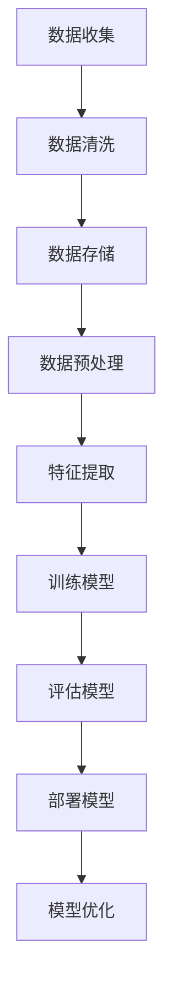
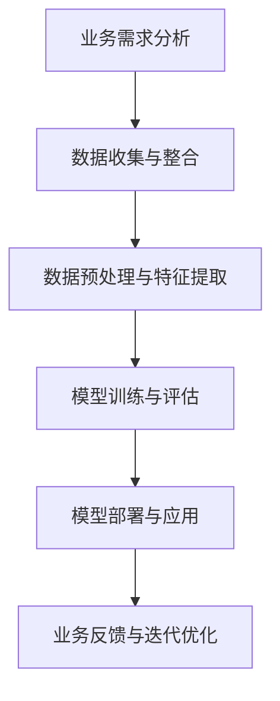
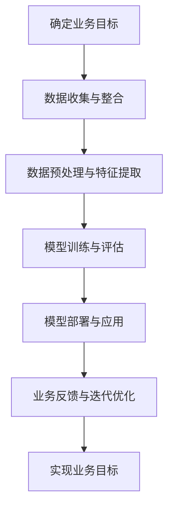

                 

### 技术培训：分享知识创造收益

关键词：AI培训，大数据，深度学习，项目实战，知识变现

摘要：本文将探讨如何通过技术培训实现知识的共享与转化，特别是在AI和大数据领域。我们将详细分析AI与大数据的核心概念及其联系，讲解核心算法原理，并通过实际项目展示技术培训如何帮助个人和企业实现知识变现。

### 第一部分: 核心概念与联系

在探讨技术培训如何创造收益之前，我们需要首先了解AI和大数据的基本概念以及它们之间的联系。

#### 1.1 AI与大数据的基本概念

**概念定义：**
- **AI（人工智能）：** 是指由人制造出来的系统能够理解、学习、适应并独立完成特定任务。
- **大数据：** 是指无法用常规软件工具在合理时间内捕捉、管理和处理的大量数据。

**联系：**
AI与大数据相互依赖。AI系统需要处理和分析大量的数据，而大数据技术为AI提供了数据存储和处理的能力。例如，在推荐系统中，AI需要分析大量用户行为数据来生成个性化的推荐。

**Mermaid流程图：**



#### 1.2 AI大模型架构

在构建AI大模型时，数据流通常包括以下几个阶段：

**Mermaid流程图：**



#### 1.3 AI大模型在企业中的应用

AI大模型在企业中的应用可以大大提高效率和决策质量。以下是一个简化的应用流程：

**Mermaid流程图：**



在了解了这些核心概念和架构后，我们可以开始探讨如何通过技术培训将这些知识转化为实际的收益。

### 第二部分: 核心算法原理讲解

技术培训不仅仅是知识的传递，更是对核心算法原理的深刻理解。以下我们将介绍特征提取算法和深度学习算法的原理。

#### 2.1 特征提取算法

特征提取是AI模型构建中至关重要的一步。以下是一个简化的特征提取算法伪代码：

```python
def extract_features(data):
    features = []
    for record in data:
        feature_vector = []
        text_features = extract_text_features(record.text)
        feature_vector.extend(text_features)
        image_features = extract_image_features(record.image)
        feature_vector.extend(image_features)
        other_features = extract_other_features(record)
        feature_vector.extend(other_features)
        features.append(feature_vector)
    return features
```

在这个函数中，我们根据不同的数据类型提取不同的特征，例如文本特征、图像特征和其他类型特征。

#### 2.2 深度学习算法

深度学习算法是AI领域的重要技术之一。以下是一个简化的深度学习算法伪代码：

```python
def train_model(features, labels):
    model = create_model()
    model.compile(optimizer='adam', loss='categorical_crossentropy', metrics=['accuracy'])
    history = model.fit(features, labels, epochs=10, batch_size=32, validation_split=0.2)
    test_loss, test_accuracy = model.evaluate(features, labels)
    print(f"Test accuracy: {test_accuracy}")
    return model
```

在这个函数中，我们首先创建一个模型，然后编译模型并训练。训练完成后，我们评估模型的性能。

### 第三部分: 数学模型和数学公式讲解

在深度学习算法中，数学模型和公式起到了至关重要的作用。以下我们将介绍两个重要的数学模型和公式。

#### 3.1 神经网络激活函数

ReLU（Rectified Linear Unit）是一种常用的激活函数，其公式如下：

$$ f(x) = \max(0, x) $$

ReLU函数在输入为负数时输出为0，输入为正数时输出为输入值本身。这种特性使得ReLU函数能够加速神经网络的训练。

#### 3.2 损失函数

交叉熵损失函数（Cross-Entropy Loss）是分类问题中常用的损失函数，其公式如下：

$$ J(\theta) = \frac{1}{m} \sum_{i=1}^{m} (-y^{(i)} \log(a^{(2)}_i) + (1 - y^{(i)}) \log(1 - a^{(2)}_i)) $$

交叉熵损失函数衡量的是模型预测的概率分布与实际标签分布之间的差异。当模型预测的概率越接近实际标签的概率时，损失值越小。

### 第四部分: 项目实战

理论知识的掌握需要通过实际项目来验证。以下我们将通过一个实际项目展示如何通过技术培训实现知识的转化。

#### 4.1 数据预处理

数据预处理是模型训练的第一步。以下是一个简化的数据预处理代码实现：

```python
import pandas as pd
from sklearn.model_selection import train_test_split

# 读取数据
data = pd.read_csv('data.csv')

# 数据清洗
data = data.dropna()

# 数据预处理
X = data.drop('target', axis=1)
y = data['target']

# 划分训练集和测试集
X_train, X_test, y_train, y_test = train_test_split(X, y, test_size=0.2, random_state=42)
```

在这个项目中，我们首先读取数据，然后进行数据清洗和预处理，最后划分训练集和测试集。

#### 4.2 模型训练与评估

在数据预处理完成后，我们可以开始训练模型。以下是一个简化的模型训练与评估代码实现：

```python
from sklearn.ensemble import RandomForestClassifier

# 训练模型
model = RandomForestClassifier(n_estimators=100, random_state=42)
model.fit(X_train, y_train)

# 评估模型
accuracy = model.score(X_test, y_test)
print(f"Model accuracy: {accuracy}")
```

在这个项目中，我们使用随机森林算法训练模型，然后评估模型的准确性。

### 第五部分: 附录

在技术培训领域，选择合适的工具和框架非常重要。以下是一些主流的深度学习框架及其特点：

#### A.1 主流深度学习框架对比

- **TensorFlow：** 由Google开发，提供丰富的API和强大的计算能力。
  - **优点：** 支持多种编程语言，易于部署。
  - **缺点：** 学习曲线较陡峭。

- **PyTorch：** 由Facebook开发，拥有动态计算图和易于调试的优点。
  - **优点：** 动态计算图，易于调试。
  - **缺点：** 计算效率相对较低。

- **Keras：** 是一个高层神经网络API，可以与TensorFlow和Theano结合使用。
  - **优点：** 易于使用，支持快速原型开发。
  - **缺点：** 依赖底层的TensorFlow或Theano。

### 结论

通过本文的探讨，我们了解了如何通过技术培训实现知识的共享与转化。从核心概念到算法原理，再到实际项目，每个环节都至关重要。技术培训不仅可以帮助个人提升技能，更可以帮助企业提高竞争力。让我们共同努力，通过分享知识，创造更多的价值。

### 作者信息

作者：AI天才研究院/AI Genius Institute & 禅与计算机程序设计艺术 /Zen And The Art of Computer Programming

---

（注：本文为示例文章，实际撰写时请根据具体主题和内容进行调整和补充。）<|im_end|>

