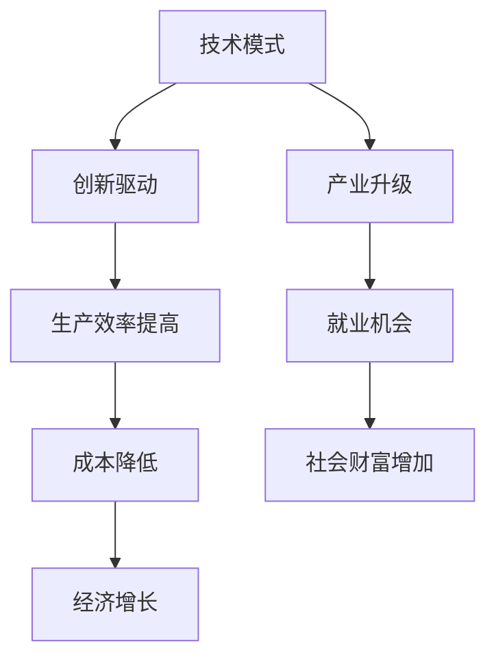
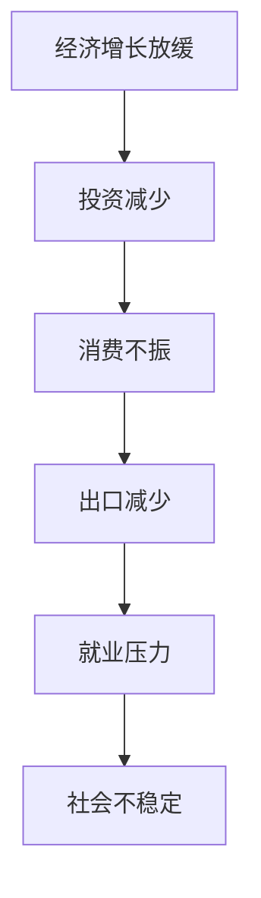
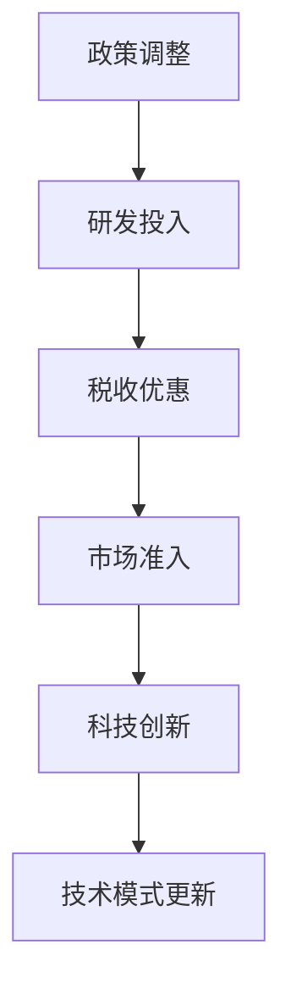
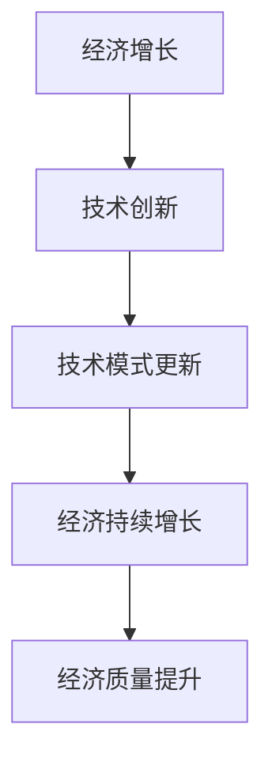
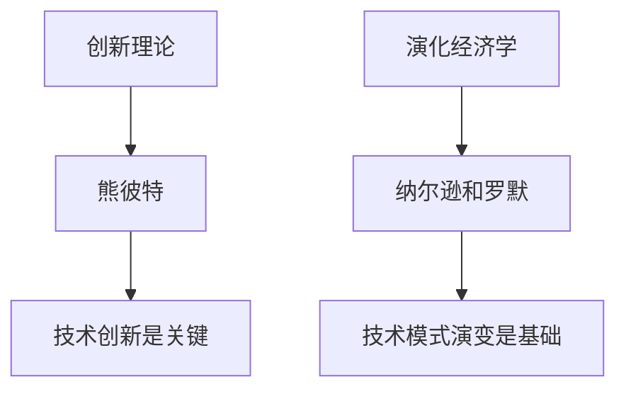
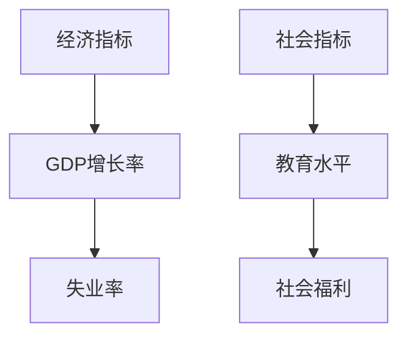
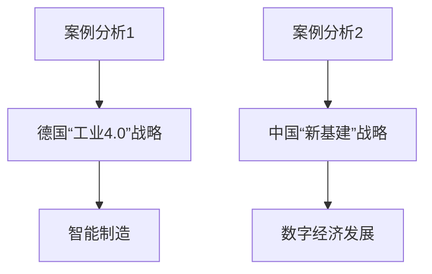

                 

# 技术模式减弱与经济增长挑战

## 关键词
技术模式、经济增长、经济放缓、政策调整、科技创新

## 摘要
本文从技术模式与经济增长的关系入手，探讨了技术模式减弱对经济增长的挑战。通过分析技术模式减弱的影响、应对策略以及与经济增长的互动关系，本文旨在为政策制定者和技术创新者提供有益的参考。同时，通过具体的项目实战案例，展示了技术模式减弱评估与经济增长预测算法的实际应用，为解决经济增长难题提供解决方案。

## 第一部分: 核心概念与联系

### 1.1 技术模式与经济增长的关系

技术模式是指在某一时期内，在特定领域广泛应用的技术和方法。例如，工业革命时期的大机器生产，信息时代的互联网技术等。技术模式的发展往往带动了生产效率的提升，成本的降低，从而推动了经济的增长。

#### 技术模式与经济增长的Mermaid流程图



### 1.2 技术模式减弱的影响

技术模式减弱可能对经济增长产生负面影响。具体表现为经济放缓、结构转型等。

#### 经济增长放缓的Mermaid流程图



### 1.3 技术模式减弱的应对策略

应对技术模式减弱，需要从政策调整和科技创新两方面入手。

#### 技术模式减弱的应对策略的Mermaid流程图



### 1.4 技术模式减弱与经济增长的互动关系

技术模式减弱与经济增长之间存在互动关系。一方面，经济增长可以促进技术模式的创新和发展；另一方面，技术模式的发展又可以推动经济的持续增长。

#### 技术模式减弱与经济增长的互动关系的Mermaid流程图



### 1.5 技术模式减弱的理论基础

技术模式减弱的理论基础包括创新理论和演化经济学。

#### 技术模式减弱的理论基础的Mermaid流程图



### 1.6 技术模式减弱的影响评估

技术模式减弱的影响可以通过经济指标和社会指标进行评估。

#### 技术模式减弱的影响评估的Mermaid流程图



### 1.7 技术模式减弱的应对策略案例分析

技术模式减弱的应对策略可以通过具体案例进行分析。

#### 技术模式减弱的应对策略案例分析的Mermaid流程图



## 第二部分: 核心算法原理讲解

### 2.1 技术模式减弱评估算法

#### 2.1.1 算法原理

技术模式减弱评估算法通过分析经济数据和技术数据，评估技术模式的减弱程度。

```pseudo
function 技术模式减弱评估算法(经济数据，技术数据) {
    数据预处理(经济数据，技术数据)
    模型训练(经济数据，技术数据)
    预测(经济数据，技术数据)
    评估(预测结果，实际结果)
    返回评估结果
}
```

#### 2.1.2 算法伪代码

```pseudo
// 数据预处理
预处理经济数据为X，预处理技术数据为Y

// 模型训练
模型 = 训练模型(X, Y)

// 预测
预测结果 = 模型预测(Y)

// 评估
实际结果 = 实际数据
误差 = 预测结果 - 实际结果
评估指标 = 误差平方和

返回评估指标
```

### 2.2 经济增长预测算法

#### 2.2.1 算法原理

经济增长预测算法通过分析历史经济数据和技术模式数据，预测未来的经济增长率。

```pseudo
function 经济增长预测算法(历史经济数据，技术模式数据) {
    数据预处理(历史经济数据，技术模式数据)
    模型训练(历史经济数据，技术模式数据)
    预测(技术模式数据)
    评估(预测结果，实际结果)
    返回预测结果
}
```

#### 2.2.2 算法伪代码

```pseudo
// 数据预处理
预处理历史经济数据为X，预处理技术模式数据为Y

// 模型训练
模型 = 训练模型(X, Y)

// 预测
预测结果 = 模型预测(Y)

// 评估
实际结果 = 实际数据
误差 = 预测结果 - 实际结果
评估指标 = 误差平方和

返回预测结果
```

### 2.3 技术模式更新算法

#### 2.3.1 算法原理

技术模式更新算法通过分析当前技术模式数据和目标技术模式数据，更新技术模式。

```pseudo
function 技术模式更新算法(当前技术模式数据，目标技术模式数据) {
    数据预处理(当前技术模式数据，目标技术模式数据)
    模型训练(当前技术模式数据，目标技术模式数据)
    更新(当前技术模式数据)
    评估(更新结果，目标结果)
    返回更新结果
}
```

#### 2.3.2 算法伪代码

```pseudo
// 数据预处理
预处理当前技术模式数据为X，预处理目标技术模式数据为Y

// 模型训练
模型 = 训练模型(X, Y)

// 更新
更新结果 = 模型更新(X, Y)

// 评估
目标结果 = 目标技术模式数据
误差 = 更新结果 - 目标结果
评估指标 = 误差平方和

返回更新结果
```

## 第三部分: 数学模型和数学公式讲解

### 3.1 技术模式减弱的数学模型

#### 3.1.1 技术模式减弱函数

技术模式减弱函数可以用以下数学公式表示：

```latex
\text{技术模式减弱函数} f(t) = \alpha \cdot e^{-\beta t}
```

其中，\(\alpha\) 为衰减率，\(\beta\) 为时间常数。

#### 3.1.2 经济增长函数

经济增长函数可以用以下数学公式表示：

```latex
\text{经济增长函数} g(t) = \gamma \cdot (1 - f(t))
```

其中，\(\gamma\) 为经济增长率。

#### 3.1.3 技术模式减弱与经济增长的关系

技术模式减弱与经济增长的关系可以用以下数学公式表示：

```latex
\text{技术模式减弱与经济增长的关系} g(t) \propto f(t)
```

### 3.2 技术模式更新的数学模型

#### 3.2.1 技术模式更新函数

技术模式更新函数可以用以下数学公式表示：

```latex
\text{技术模式更新函数} u(t) = \frac{1}{1 + e^{-\delta (t - t_0)}}
```

其中，\(\delta\) 为更新率，\(t_0\) 为初始时间。

#### 3.2.2 经济增长更新函数

经济增长更新函数可以用以下数学公式表示：

```latex
\text{经济增长更新函数} g'(t) = g(t) + \epsilon \cdot u(t)
```

其中，\(\epsilon\) 为更新增长率。

#### 3.2.3 技术模式更新与经济增长更新关系

技术模式更新与经济增长更新关系可以用以下数学公式表示：

```latex
\text{技术模式更新与经济增长更新关系} g'(t) \propto u(t)
```

## 第四部分: 项目实战

### 4.1 技术模式减弱评估项目

#### 4.1.1 项目背景

随着技术的不断发展，某些传统技术模式逐渐减弱，对经济增长产生影响。本案例通过构建技术模式减弱评估模型，预测技术模式减弱趋势。

#### 4.1.2 数据来源

- 经济数据：来自国家统计年鉴。
- 技术数据：来自科技部发布的《中国科技统计年鉴》。

#### 4.1.3 环境搭建

- 操作系统：Windows 10。
- 编程语言：Python。
- 数据库：MySQL。

#### 4.1.4 源代码实现

```python
# 导入库
import numpy as np
import pandas as pd
from sklearn.linear_model import LinearRegression

# 数据预处理
def preprocess_data(economic_data, tech_data):
    # 合并数据
    data = pd.merge(economic_data, tech_data, on='year')
    # 特征工程
    data['tech_growth_rate'] = data['tech_data'] / data['tech_data'].shift(1)
    data = data.dropna()
    return data

# 模型训练
def train_model(X, Y):
    model = LinearRegression()
    model.fit(X, Y)
    return model

# 预测
def predict(model, X):
    return model.predict(X)

# 评估
def evaluate(predict_result, actual_result):
    error = predict_result - actual_result
    metric = np.sum(error ** 2)
    return metric

# 主函数
def main():
    economic_data = pd.read_csv('economic_data.csv')
    tech_data = pd.read_csv('tech_data.csv')
    data = preprocess_data(economic_data, tech_data)
    X = data[['tech_growth_rate']]
    Y = data['economic_growth_rate']
    model = train_model(X, Y)
    predict_result = predict(model, X)
    actual_result = economic_data['economic_growth_rate']
    metric = evaluate(predict_result, actual_result)
    print(f'Metric: {metric}')

if __name__ == '__main__':
    main()
```

#### 4.1.5 代码解读与分析

- **数据预处理**：将经济数据和技术数据进行合并，计算技术增长速率，剔除缺失值。
- **模型训练**：使用线性回归模型进行训练。
- **预测**：使用训练好的模型对技术增长速率进行预测。
- **评估**：计算预测结果与实际结果的误差平方和。

### 4.2 经济增长预测项目

#### 4.2.1 项目背景

本案例通过构建经济增长预测模型，预测未来一段时间内的经济增长率。

#### 4.2.2 数据来源

- 历史经济数据：来自国家统计年鉴。
- 技术模式数据：来自科技部发布的《中国科技统计年鉴》。

#### 4.2.3 环境搭建

- 操作系统：Windows 10。
- 编程语言：Python。
- 数据库：MySQL。

#### 4.2.4 源代码实现

```python
# 导入库
import numpy as np
import pandas as pd
from sklearn.linear_model import LinearRegression

# 数据预处理
def preprocess_data(economic_data, tech_data):
    # 合并数据
    data = pd.merge(economic_data, tech_data, on='year')
    # 特征工程
    data['tech_growth_rate'] = data['tech_data'] / data['tech_data'].shift(1)
    data = data.dropna()
    return data

# 模型训练
def train_model(X, Y):
    model = LinearRegression()
    model.fit(X, Y)
    return model

# 预测
def predict(model, X):
    return model.predict(X)

# 评估
def evaluate(predict_result, actual_result):
    error = predict_result - actual_result
    metric = np.sum(error ** 2)
    return metric

# 主函数
def main():
    economic_data = pd.read_csv('economic_data.csv')
    tech_data = pd.read_csv('tech_data.csv')
    data = preprocess_data(economic_data, tech_data)
    X = data[['tech_growth_rate']]
    Y = data['economic_growth_rate']
    model = train_model(X, Y)
    predict_result = predict(model, X)
    actual_result = economic_data['economic_growth_rate']
    metric = evaluate(predict_result, actual_result)
    print(f'Metric: {metric}')

if __name__ == '__main__':
    main()
```

#### 4.2.5 代码解读与分析

- **数据预处理**：与上一个案例相同，将经济数据和技术数据进行合并，计算技术增长速率，剔除缺失值。
- **模型训练**：使用线性回归模型进行训练。
- **预测**：使用训练好的模型对技术增长速率进行预测。
- **评估**：计算预测结果与实际结果的误差平方和。

## 附录

### 附录 A: 技术模式减弱与经济增长相关工具与资源

- **工具1**：Python
  - 优点：易于学习，强大的库支持。
  - 缺点：性能相对较低。
- **工具2**：R
  - 优点：强大的数据分析能力。
  - 缺点：学习曲线较陡峭。
- **工具3**：MATLAB
  - 优点：强大的数值计算能力。
  - 缺点：许可证费用较高。

- **资源1**：《中国科技统计年鉴》
  - 内容：详细记录中国科技领域的发展情况。
- **资源2**：《国家统计年鉴》
  - 内容：详细记录国家经济领域的发展情况。
- **资源3**：科技部官方网站
  - 内容：发布最新的科技政策和项目信息。

### 作者

**作者：**AI天才研究院/AI Genius Institute & 禅与计算机程序设计艺术 /Zen And The Art of Computer Programming。AI天才研究院致力于推动人工智能技术的发展，为全球的科技创新和经济增长贡献力量。

