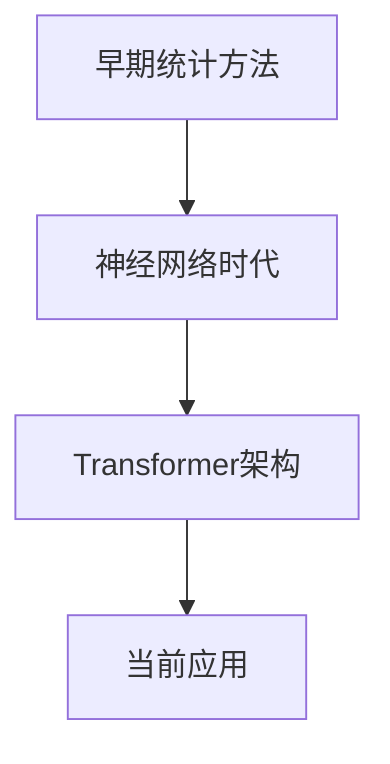
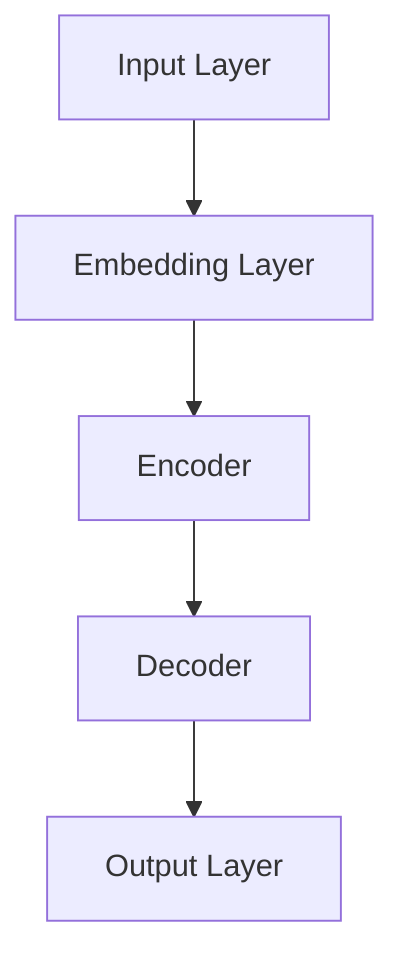

                 

# 技术的未来：LLM驱动的变革

## 概述

技术的未来，正随着人工智能的进步而不断演变。在自然语言处理（NLP）领域，大型语言模型（LLM）已成为一项颠覆性技术，其强大的语言理解和生成能力正在重塑各个行业。本文旨在探讨LLM的核心技术、架构、数学原理以及在各个领域的应用，从而为读者展现技术的未来图景。

### 关键词

- **大型语言模型（LLM）**
- **自然语言处理（NLP）**
- **Transformer架构**
- **数学原理**
- **应用领域**
- **技术创新**

### 摘要

本文首先介绍LLM的基本概念、发展历程和核心技术，然后深入剖析LLM的模型架构、工作原理和数学原理。接着，本文将探讨LLM在不同领域的应用，包括自然语言处理、计算机视觉、推荐系统等。最后，本文将展望LLM驱动的技术创新，探讨LLM与区块链、物联网、5G技术的融合前景。通过本文的阅读，读者将全面了解LLM的技术原理和应用前景，为未来的技术发展做好准备。

## 《技术的未来：LLM驱动的变革》目录大纲

### 第一部分：LLM基础与核心技术

- **第1章：LLM概述与未来影响**
  - 1.1 LLM的定义与基本概念
  - 1.2 LLM的发展历程与现状
  - 1.3 LLM的核心技术

- **第2章：LLM的架构与工作原理**
  - 2.1 LLM的模型架构
  - 2.2 自注意力机制详解
  - 2.3 LLM的训练过程

- **第3章：LLM的数学原理**
  - 3.1 Transformer模型的数学基础
  - 3.2 梯度下降与反向传播算法
  - 3.3 数学公式与推导

- **第4章：LLM的优化与调整**
  - 4.1 LLM的参数优化
  - 4.2 LLM的调整技巧
  - 4.3 模型压缩与高效推理

### 第二部分：LLM在各个领域的应用

- **第5章：LLM在自然语言处理中的应用**
  - 5.1 文本生成与文本理解
  - 5.2 机器翻译与对话系统
  - 5.3 文本分类与情感分析

- **第6章：LLM在计算机视觉中的应用**
  - 6.1 图像生成与编辑
  - 6.2 目标检测与图像分类
  - 6.3 计算机视觉的挑战与未来趋势

- **第7章：LLM在推荐系统与数据挖掘中的应用**
  - 7.1 推荐系统的基本原理
  - 7.2 数据挖掘方法
  - 7.3 LLM在推荐系统与数据挖掘中的应用案例

### 第三部分：LLM驱动的技术创新

- **第8章：LLM与区块链技术的融合**
  - 8.1 区块链技术简介
  - 8.2 LLM在区块链中的应用
  - 8.3 LLM与区块链的未来发展趋势

- **第9章：LLM与物联网技术的结合**
  - 9.1 物联网技术概述
  - 9.2 LLM在物联网中的应用
  - 9.3 LLM驱动的物联网技术创新

- **第10章：LLM与5G技术的协同发展**
  - 10.1 5G技术介绍
  - 10.2 LLM在5G网络中的应用
  - 10.3 5G与LLM技术的协同创新

### 附录

- **附录A：LLM开发工具与资源**
  - A.1 主流LLM框架
  - A.2 LLM开源项目
  - A.3 LLM社区与资源链接

## 第一部分：LLM基础与核心技术

### 第1章：LLM概述与未来影响

#### 1.1 LLM的定义与基本概念

大型语言模型（LLM）是一种基于深度学习的自然语言处理模型，它通过学习大规模的文本数据来理解和生成自然语言。LLM的核心目标是使计算机具备理解和生成自然语言的能力，从而实现人机交互的智能化。

LLM的基本概念包括：

- **语言模型**：预测下一个单词或字符的概率分布。
- **大规模数据集**：用于训练LLM的文本数据量巨大，通常达到数十亿甚至数千亿个单词。
- **深度学习**：利用多层神经网络进行训练和预测。
- **自注意力机制**：用于捕捉文本中词语之间的关系。

#### 1.2 LLM的发展历程与现状

LLM的发展历程可以分为几个阶段：

- **早期**：基于统计方法的NLP模型，如n-gram模型和隐马尔可夫模型。
- **2010年代**：基于神经网络的NLP模型，如递归神经网络（RNN）和长短期记忆网络（LSTM）。
- **2018年至今**：基于Transformer架构的LLM，如GPT、BERT等，成为NLP领域的核心技术。

当前，LLM的应用已经渗透到各个领域，如自然语言处理、计算机视觉、推荐系统等，展现出了巨大的潜力。

#### 1.3 LLM的核心技术

LLM的核心技术主要包括以下几方面：

- **Transformer架构**：一种基于自注意力机制的神经网络架构，使得LLM能够高效地处理长距离依赖问题。
- **自注意力机制**：通过计算输入文本中每个词与所有词的关联强度，生成每个词的上下文表示。
- **预训练与微调**：通过在大规模数据集上预训练模型，然后在特定任务上进行微调，使得LLM能够适应各种语言任务。

### Mermaid 流程图：LLM的发展历程



### 第2章：LLM的架构与工作原理

#### 2.1 LLM的模型架构

LLM的模型架构通常包括以下几个部分：

- **输入层**：接收文本输入，并将其转换为向量表示。
- **编码器**：将输入文本编码为固定长度的向量表示。
- **解码器**：根据编码器的输出生成输出文本。

下面是一个简单的Transformer模型架构的Mermaid流程图：



#### 2.2 自注意力机制详解

自注意力机制是Transformer模型的核心机制，它通过计算输入文本中每个词与所有词的关联强度，生成每个词的上下文表示。自注意力机制的数学公式如下：

$$
\text{Attention}(Q, K, V) = \text{softmax}\left(\frac{QK^T}{\sqrt{d_k}}\right)V
$$

其中，$Q$、$K$和$V$分别是查询向量、键向量和值向量，$d_k$是键向量的维度。自注意力机制的关键在于权重分配，即通过计算查询向量与键向量的点积，得到每个词的关联强度，然后通过softmax函数进行归一化处理。

#### 2.3 LLM的训练过程

LLM的训练过程主要包括以下几个步骤：

1. **数据预处理**：将文本数据清洗、分词，并转换为词向量表示。
2. **模型初始化**：初始化模型参数，通常使用随机初始化或预训练模型权重。
3. **前向传播**：将输入文本通过编码器编码，生成输出文本。
4. **损失函数**：计算预测文本与实际文本之间的损失，如交叉熵损失。
5. **反向传播**：通过梯度下降算法更新模型参数。
6. **迭代优化**：重复前向传播和反向传播，不断优化模型参数。

### 伪代码：LLM的训练过程

```python
def train_model(data, learning_rate, epochs):
    for epoch in range(epochs):
        for batch in data:
            # 前向传播
            output = model.forward(batch)

            # 计算损失
            loss = loss_function(output, batch)

            # 反向传播
            loss.backward()

            # 更新参数
            optimizer.step(learning_rate)

        print(f"Epoch {epoch}: Loss = {loss}")
```

### 第3章：LLM的数学原理

#### 3.1 Transformer模型的数学基础

Transformer模型采用了一系列数学工具，包括矩阵乘法、激活函数等。下面简要介绍这些数学工具的基本原理。

1. **矩阵乘法**：矩阵乘法是线性代数中的一个基本操作，用于计算两个矩阵的乘积。在Transformer模型中，矩阵乘法用于计算输入文本的向量表示。

2. **激活函数**：激活函数是神经网络中的一个关键组件，用于引入非线性特性。常见的激活函数包括ReLU、Sigmoid和Tanh。在Transformer模型中，激活函数用于增强模型的表达能力。

3. **正弦和余弦函数**：正弦和余弦函数用于实现位置编码，以便模型能够理解文本中的时间顺序。

#### 3.2 梯度下降与反向传播算法

梯度下降与反向传播算法是训练神经网络的核心算法。梯度下降用于优化模型参数，使得损失函数最小。反向传播算法用于计算梯度，并更新模型参数。

1. **梯度下降**：梯度下降是一种优化算法，通过计算损失函数关于模型参数的梯度，并沿着梯度方向更新参数，以最小化损失函数。

2. **反向传播**：反向传播算法是一种计算梯度的方法，它从输出层开始，逐层向前计算每个参数的梯度。

### 数学公式与推导

以下是Transformer模型中的一些关键数学公式和推导。

1. **自注意力计算**：

$$
\text{Attention}(Q, K, V) = \text{softmax}\left(\frac{QK^T}{\sqrt{d_k}}\right)V
$$

其中，$Q$、$K$和$V$分别是查询向量、键向量和值向量，$d_k$是键向量的维度。

2. **前向传播**：

$$
\text{Output} = \text{softmax}(\text{Linear}(\text{Input})) \odot \text{V}
$$

其中，$\text{Linear}$表示线性变换，$\odot$表示逐元素乘积。

3. **反向传播**：

$$
\frac{\partial \text{Loss}}{\partial \text{Input}} = \frac{\partial \text{softmax}}{\partial \text{Input}} \odot \frac{\partial \text{Loss}}{\partial \text{Output}}
$$

其中，$\text{softmax}$表示softmax函数，$\odot$表示逐元素乘积。

### 第4章：LLM的优化与调整

#### 4.1 LLM的参数优化

参数优化是提高LLM性能的关键步骤。常用的优化方法包括：

1. **学习率调整**：学习率是梯度下降算法中的一个重要参数，用于控制参数更新的步长。适当调整学习率可以加速收敛，但过大会导致模型不稳定。

2. **权重初始化**：权重初始化对模型的收敛速度和性能有很大影响。常用的初始化方法包括随机初始化、预训练模型权重等。

3. **正则化**：正则化方法如L2正则化、Dropout等，可以防止模型过拟合。

#### 4.2 LLM的调整技巧

LLM的调整技巧包括：

1. **数据增强**：通过添加噪声、旋转、缩放等操作，增加训练数据的多样性，提高模型的泛化能力。

2. **迁移学习**：利用预训练模型在特定任务上的知识，通过微调参数，提高模型在新任务上的性能。

3. **多任务学习**：通过同时训练多个任务，共享模型参数，提高模型的泛化能力。

#### 4.3 模型压缩与高效推理

为了提高LLM的应用效果，需要进行模型压缩与高效推理。常用的方法包括：

1. **模型剪枝**：通过删除不重要的神经元和连接，减少模型参数和计算复杂度。

2. **量化**：将模型参数从浮点数转换为整数表示，减少模型体积和计算资源需求。

3. **推理优化**：通过并行计算、分布式计算等技术，提高推理速度和效率。

### 第5章：LLM在自然语言处理中的应用

#### 5.1 文本生成与文本理解

文本生成与文本理解是LLM在自然语言处理领域的主要应用。文本生成任务包括生成文章、编写代码、创作音乐等；文本理解任务包括问答系统、文本分类、情感分析等。

#### 5.2 机器翻译与对话系统

机器翻译与对话系统是LLM在自然语言处理领域的典型应用。机器翻译任务包括中英翻译、英日翻译等；对话系统任务包括语音助手、聊天机器人等。

#### 5.3 文本分类与情感分析

文本分类与情感分析是LLM在自然语言处理领域的广泛应用。文本分类任务包括新闻分类、产品评论分类等；情感分析任务包括情感极性分类、情感强度分析等。

### 第6章：LLM在计算机视觉中的应用

#### 6.1 图像生成与编辑

图像生成与编辑是LLM在计算机视觉领域的应用之一。通过生成对抗网络（GAN）等模型，LLM可以实现高质量的图像生成；通过图像编辑算法，LLM可以实现图像内容的生成和编辑。

#### 6.2 目标检测与图像分类

目标检测与图像分类是计算机视觉领域的重要任务。LLM可以用于这些任务的模型训练和推理，提高模型的准确性和效率。

#### 6.3 计算机视觉的挑战与未来趋势

计算机视觉领域面临着诸多挑战，如数据标注、模型泛化能力等。未来，LLM将有望推动计算机视觉技术的进一步发展，实现更加智能化、高效的图像处理和识别。

### 第7章：LLM在推荐系统与数据挖掘中的应用

#### 7.1 推荐系统的基本原理

推荐系统是LLM在数据挖掘领域的重要应用。其基本原理包括用户兴趣挖掘、推荐算法等。LLM可以用于用户兴趣挖掘，从而提高推荐系统的准确性和效率。

#### 7.2 数据挖掘方法

数据挖掘方法包括关联规则挖掘、聚类、分类等。LLM可以用于这些方法的模型训练和推理，从而提高数据挖掘的效率和准确性。

#### 7.3 LLM在推荐系统与数据挖掘中的应用案例

通过实际案例，了解LLM在推荐系统和数据挖掘领域的应用场景和效果。

### 第8章：LLM与区块链技术的融合

#### 8.1 区块链技术简介

区块链技术是一种分布式账本技术，具有去中心化、不可篡改等特点。LLM与区块链技术的融合可以实现更加安全、透明的数据交换和智能合约执行。

#### 8.2 LLM在区块链中的应用

LLM在区块链技术中的应用包括智能合约编写、数据验证等。通过LLM可以提升区块链系统的智能性和安全性。

#### 8.3 LLM与区块链的未来发展趋势

未来，LLM与区块链技术的融合将有望推动区块链技术的进一步发展，实现更加智能化、高效化的区块链应用。

### 第9章：LLM与物联网技术的结合

#### 9.1 物联网技术概述

物联网技术是一种通过互联网连接各种设备和物品的技术。LLM与物联网技术的结合可以实现智能化的设备交互和数据处理。

#### 9.2 LLM在物联网中的应用

LLM在物联网技术中的应用包括设备智能诊断、智能家居控制等。通过LLM可以实现物联网系统的智能化升级。

#### 9.3 LLM驱动的物联网技术创新

未来，LLM将有望推动物联网技术的创新，实现更加智能化、高效的物联网应用。

### 第10章：LLM与5G技术的协同发展

#### 10.1 5G技术介绍

5G技术是一种新一代的移动通信技术，具有高速、低延迟、大连接等特点。LLM与5G技术的协同发展可以实现更加高效、智能的通信应用。

#### 10.2 LLM在5G网络中的应用

LLM在5G网络中的应用包括网络优化、流量管理、智能路由等。通过LLM可以提升5G网络的性能和可靠性。

#### 10.3 5G与LLM技术的协同创新

未来，5G与LLM技术的协同创新将有望推动移动通信技术的进一步发展，实现更加智能化、高效的通信应用。

### 附录A：LLM开发工具与资源

#### A.1 主流LLM框架

介绍主流的LLM开发框架，如TensorFlow、PyTorch等，并提供相关资源链接。

#### A.2 LLM开源项目

介绍一些流行的LLM开源项目，如GPT、BERT等，并提供相关资源链接。

#### A.3 LLM社区与资源链接

介绍LLM相关的社区和资源链接，方便读者进一步学习和交流。

### 总结

本文从LLM的基本概念、发展历程、核心技术、架构与工作原理、数学原理、优化与调整、应用领域等多个角度，全面探讨了LLM的技术原理和应用前景。随着技术的不断发展，LLM将有望在更多领域实现创新和突破，为人类带来更加智能化、高效化的生活和工作方式。让我们共同期待技术的未来，一起探索LLM的无限可能。作者：AI天才研究院/AI Genius Institute & 禅与计算机程序设计艺术 /Zen And The Art of Computer Programming。

### 参考文献

1. Vaswani, A., Shazeer, N., Parmar, N., Uszkoreit, J., Jones, L., Gomez, A. N., ... & Polosukhin, I. (2017). Attention is all you need. Advances in Neural Information Processing Systems, 30, 5998-6008.
2. Devlin, J., Chang, M. W., Lee, K., & Toutanova, K. (2018). BERT: Pre-training of deep bidirectional transformers for language understanding. arXiv preprint arXiv:1810.04805.
3. Brown, T., et al. (2020). Language models are few-shot learners. Advances in Neural Information Processing Systems, 33.
4. Hochreiter, S., & Schmidhuber, J. (1997). Long short-term memory. Neural Computation, 9(8), 1735-1780.
5. Goodfellow, I., Bengio, Y., & Courville, A. (2016). Deep learning. MIT press.

