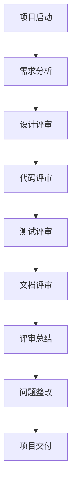

                 

## 第一部分：技术评审的基础知识

### 第1章：技术评审的概念与意义

#### 1.1 技术评审的定义

技术评审（Technical Review）是指在软件开发过程中，对代码、文档、架构等方面进行的一系列评估活动。它是一种确保软件质量、合规性、安全性和可维护性的重要手段。技术评审不仅仅是对代码的审查，还包括对设计、测试、部署等环节的评估。

技术评审的目的是多方面的，主要包括：

1. **确保代码质量**：通过评审，可以发现代码中的缺陷、漏洞和不良实践，从而提高代码的可读性、可维护性和可靠性。
2. **保障项目进度**：评审可以提前发现潜在的问题，避免后续开发过程中因为这些问题导致的延误和返工。
3. **提升团队协作**：技术评审是一种有效的团队沟通机制，可以促进团队成员之间的知识共享和协作。
4. **符合标准与规范**：技术评审有助于确保项目符合行业标准和规范，提高项目的可接受性和合规性。

#### 1.2 技术评审的目标与作用

技术评审的目标可以概括为以下几点：

1. **提高软件质量**：确保软件符合设计目标和预期功能，提高软件的可靠性和稳定性。
2. **降低风险**：识别和修复潜在的问题，降低项目开发过程中的风险。
3. **提升团队技能**：通过评审，团队成员可以学习到更多的最佳实践和技术经验。
4. **优化设计**：评审有助于优化软件架构和设计，提高软件的可扩展性和可维护性。
5. **改进文档**：评审有助于完善项目的文档资料，提高文档的准确性和完整性。

技术评审在软件开发中的作用是至关重要的。它可以：

1. **预防缺陷**：在开发初期通过评审预防缺陷的发生，减少后期修复成本。
2. **提高效率**：通过评审，可以提前识别和解决问题，提高开发效率。
3. **加强沟通**：评审过程是团队成员之间沟通的重要渠道，有助于消除误解和分歧。
4. **确保合规**：评审有助于确保项目符合相关标准和法规要求。
5. **促进学习和成长**：评审可以让团队成员了解到更先进的开发理念和技术，促进个人和团队成长。

#### 1.3 技术评审的类型

技术评审可以分为多种类型，根据评审的对象和目的，可以分为以下几种：

1. **代码评审**：对代码的语法、逻辑、结构、性能等方面进行审查，确保代码质量。
2. **文档评审**：对项目文档的准确性、完整性、一致性等方面进行审查，确保文档质量。
3. **设计评审**：对软件架构、模块设计等方面进行评估，确保设计的合理性和可行性。
4. **测试评审**：对测试用例、测试计划等进行审查，确保测试的有效性和全面性。
5. **安全评审**：对软件的安全性进行评估，发现潜在的安全漏洞和风险。
6. **合规性评审**：确保项目开发过程符合相关法规和标准要求。

不同类型的评审具有不同的重点和目标，但它们共同构成了一个完整的软件质量保障体系。

#### 1.4 技术评审的标准

技术评审的标准是指评审过程中需要遵循的一系列规则和准则。这些标准有助于确保评审的客观性和有效性。以下是技术评审的一些常见标准：

1. **一致性**：评审过程中要确保评审标准的一致性，避免因为个人偏好而导致的偏差。
2. **完整性**：评审应覆盖项目的各个方面，确保没有遗漏。
3. **客观性**：评审过程中应保持客观公正，避免主观偏见。
4. **全面性**：评审应涵盖代码、设计、测试、文档等多个方面，确保全方位的质量保障。
5. **及时性**：评审应在合适的时间点进行，以便及时发现问题并进行修复。
6. **准确性**：评审结果应准确无误，确保问题得到有效解决。
7. **专业性**：评审人员应具备相关领域的专业知识和经验，以确保评审的专业性。

遵循这些标准，可以大大提高技术评审的质量和效果。

### 第2章：技术评审的过程与方法

#### 2.1 技术评审的准备

技术评审的准备是评审过程的关键环节，它决定了评审的顺利进行和效果。以下是一些准备工作：

1. **确定评审目标**：明确评审的具体目标和要求，如代码质量、设计合理性、测试覆盖率等。
2. **组建评审团队**：根据评审内容，选择合适的评审人员，确保团队成员具备相关领域的专业知识和经验。
3. **准备评审材料**：包括代码、设计文档、测试文档等，确保评审材料完整、准确。
4. **制定评审计划**：明确评审的时间、地点、方式、流程等，确保评审有条不紊地进行。
5. **培训评审人员**：对评审人员进行培训，使其熟悉评审标准和流程，提高评审效率和质量。

#### 2.2 技术评审的执行

技术评审的执行是评审过程的核心，以下是一些执行步骤：

1. **召开评审会议**：组织评审会议，评审团队成员参与，讨论评审对象的问题和改进方案。
2. **审查评审材料**：评审人员对评审材料进行详细审查，发现潜在问题。
3. **记录评审结果**：将评审中发现的问题和改进建议记录下来，形成评审报告。
4. **讨论和反馈**：评审团队成员就发现的问题进行讨论，提出解决方案，并对改进方案进行反馈。
5. **跟踪问题整改**：评审结束后，跟踪问题的整改情况，确保问题得到有效解决。

#### 2.3 技术评审的记录与报告

技术评审的记录与报告是评审过程的必要环节，以下是一些关键点：

1. **记录评审过程**：详细记录评审的时间、地点、人员、内容、发现的问题等，形成评审记录。
2. **撰写评审报告**：根据评审记录，撰写评审报告，报告应包括评审结果、问题分析、改进建议等。
3. **分发评审报告**：将评审报告分发给相关团队成员和利益相关者，确保他们了解评审结果。
4. **跟踪报告执行**：跟踪评审报告中的改进建议的执行情况，确保改进措施得到落实。

#### 2.4 技术评审的反馈与改进

技术评审的反馈与改进是确保评审效果的重要环节，以下是一些关键点：

1. **反馈评审结果**：将评审结果和改进建议及时反馈给开发团队，确保他们了解问题。
2. **讨论改进方案**：与开发团队讨论改进方案，确定具体的改进措施和时间表。
3. **跟踪改进实施**：跟踪改进措施的执行情况，确保问题得到有效解决。
4. **持续改进**：通过定期评审，持续改进开发过程，提高软件质量。

### 第3章：技术评审工具与资源

#### 3.1 技术评审常用工具

技术评审需要使用各种工具来辅助评审过程，以下是一些常用的技术评审工具：

1. **代码评审工具**：
   - Pylint：Python代码质量检测工具。
   - Checkstyle：Java代码质量检测工具。
   - ESLint：前端代码质量检测工具。
2. **文档评审工具**：
   - Grammarly：文档语法和拼写检查工具。
   - GitLab：代码和文档管理平台，支持在线评审。
   - Confluence：企业级文档协作平台，支持版本控制和评审功能。
3. **设计评审工具**：
   - Figma：设计协作工具，支持在线评审和协作。
   - Lucidchart：流程图和架构图设计工具，支持在线评审。
4. **测试评审工具**：
   - Selenium：自动化测试工具，支持Web应用的测试。
   - JMeter：性能测试工具，支持各种协议的测试。

#### 3.2 开源技术评审工具介绍

开源技术评审工具是开源社区的重要资源，以下是一些流行的开源技术评审工具：

1. **Gerrit**：基于Git的代码审查平台，支持多层次的代码审查流程。
2. **Phabricator**：综合性的项目管理工具，包括代码评审、任务管理和文档评审等功能。
3. **Review Board**：用于代码、文档和设计评审的开源工具，支持多种版本控制系统。
4. **Pivotal Tracker**：敏捷开发项目管理工具，支持代码和文档评审。

#### 3.3 技术评审资源库

技术评审资源库是收集和管理评审资料的重要平台，以下是一些流行的技术评审资源库：

1. **GitHub**：全球最大的代码托管平台，支持代码评审和协作。
2. **GitLab**：支持自建的企业级代码和文档评审平台。
3. **Bitbucket**：Atlassian公司的代码托管平台，支持代码评审和协作。
4. **Confluence**：支持文档协作和版本控制的平台，适用于文档评审。

### 第4章：开源项目的评审策略

#### 4.1 评审前的准备工作

在开始评审之前，需要进行一系列准备工作，以确保评审的顺利进行。以下是一些关键步骤：

1. **明确评审目标**：根据项目的需求和特点，明确评审的目标和要求，如代码质量、设计合理性、测试覆盖率等。
2. **组建评审团队**：根据评审内容，选择合适的评审人员，确保团队成员具备相关领域的专业知识和经验。
3. **准备评审材料**：包括代码、设计文档、测试文档等，确保评审材料完整、准确。
4. **制定评审计划**：明确评审的时间、地点、方式、流程等，确保评审有条不紊地进行。
5. **培训评审人员**：对评审人员进行培训，使其熟悉评审标准和流程，提高评审效率和质量。

#### 4.2 评审过程中的注意事项

在评审过程中，需要关注以下几个方面，以确保评审的效果：

1. **保持客观公正**：评审过程中应保持客观公正，避免主观偏见，确保评审结果的准确性。
2. **关注细节**：评审时应仔细审查每一个细节，发现潜在的问题和缺陷。
3. **及时反馈**：评审中发现的问题应及时反馈给开发团队，确保问题得到及时解决。
4. **充分沟通**：评审过程中应充分沟通，确保评审人员之间的信息畅通，避免误解和分歧。
5. **遵循标准**：评审过程中应遵循评审标准和流程，确保评审的规范性和一致性。

#### 4.3 评审后的反馈与总结

评审结束后，需要进行一系列反馈和总结工作，以下是一些关键步骤：

1. **撰写评审报告**：根据评审记录，撰写评审报告，报告应包括评审结果、问题分析、改进建议等。
2. **分发评审报告**：将评审报告分发给相关团队成员和利益相关者，确保他们了解评审结果。
3. **讨论改进方案**：与开发团队讨论改进方案，确定具体的改进措施和时间表。
4. **跟踪问题整改**：跟踪评审报告中的改进建议的执行情况，确保问题得到有效解决。
5. **总结评审经验**：总结评审过程中的经验和教训，为下一次评审提供参考。

### 第5章：开源项目的代码评审

#### 5.1 代码评审的原则

代码评审是开源项目质量保障的重要环节，遵循以下原则可以确保评审的效率和效果：

1. **全面性**：评审应涵盖代码的各个方面，包括语法、逻辑、结构、性能等。
2. **一致性**：评审过程中应保持标准的一致性，避免因为个人偏好而导致的偏差。
3. **客观性**：评审过程中应保持客观公正，避免主观偏见，确保评审结果的准确性。
4. **及时性**：评审应在合适的时间点进行，以便及时发现问题并进行修复。
5. **针对性**：评审应根据项目的特点和要求，有针对性地进行，避免泛泛而谈。
6. **反馈性**：评审结果应及时反馈给开发团队，确保问题得到有效解决。

#### 5.2 代码评审的流程

代码评审的流程可以分为以下几个步骤：

1. **准备评审材料**：包括代码库、代码变更记录、相关文档等，确保评审材料完整、准确。
2. **确定评审人员**：根据评审内容，选择合适的评审人员，确保团队成员具备相关领域的专业知识和经验。
3. **召开评审会议**：组织评审会议，评审团队成员参与，讨论评审对象的问题和改进方案。
4. **审查代码**：评审人员对代码进行详细审查，发现潜在的问题和缺陷。
5. **记录评审结果**：将评审中发现的问题和改进建议记录下来，形成评审报告。
6. **讨论和反馈**：评审团队成员就发现的问题进行讨论，提出解决方案，并对改进方案进行反馈。
7. **跟踪问题整改**：评审结束后，跟踪问题的整改情况，确保问题得到有效解决。

#### 5.3 代码评审工具的使用

代码评审工具可以大大提高评审的效率和效果，以下是一些常用的代码评审工具及其使用方法：

1. **Gerrit**：Gerrit是一个基于Git的代码审查平台，支持多层次的代码审查流程。使用方法如下：
   - **安装Gerrit**：在服务器上安装Gerrit，配置Git插件。
   - **创建项目**：在Gerrit中创建项目，并将代码库导入。
   - **提交代码**：开发者将代码提交到Gerrit，发起评审。
   - **进行评审**：评审人员登录Gerrit，查看代码变更，进行评审。
   - **合并代码**：评审通过后，将代码合并到主分支。

2. **Phabricator**：Phabricator是一个综合性的项目管理工具，包括代码评审、任务管理和文档评审等功能。使用方法如下：
   - **安装Phabricator**：在服务器上安装Phabricator，配置相关插件。
   - **创建项目**：在Phabricator中创建项目，并将代码库连接。
   - **发起评审**：开发者创建Diff（代码差异），发起评审。
   - **进行评审**：评审人员查看Diff，进行评审。
   - **反馈结果**：评审人员提交评审意见，开发者根据意见修改代码。

3. **Review Board**：Review Board是一个用于代码、文档和设计评审的开源工具，支持多种版本控制系统。使用方法如下：
   - **安装Review Board**：在服务器上安装Review Board，配置相关插件。
   - **创建项目**：在Review Board中创建项目，并连接代码库。
   - **发起评审**：开发者创建Review Request（评审请求），发起评审。
   - **进行评审**：评审人员查看Review Request，进行评审。
   - **合并代码**：评审通过后，将代码合并到主分支。

#### 5.4 代码评审的实践案例

以下是一个代码评审的实践案例，用于说明评审的过程和结果：

1. **案例背景**：一个开源项目需要新增一个功能，开发者小明完成了代码实现，并提交到代码库。

2. **发起评审**：小明在代码库中创建了一个Pull Request（拉取请求），并发起评审。

3. **评审过程**：
   - 评审人员小刚查看Pull Request，审查代码。
   - 小刚发现代码中存在潜在的性能问题，提出了改进建议。
   - 小明根据评审意见，修改代码，并再次提交到代码库。

4. **评审结果**：
   - 评审人员小强再次审查代码，发现代码质量符合要求。
   - 评审通过，小明将代码合并到主分支。

通过这个案例，我们可以看到代码评审在确保代码质量和项目进度方面的重要作用。

### 第6章：开源项目的文档评审

#### 6.1 文档评审的重要性

在开源项目中，文档评审是一个至关重要的环节，它关系到项目能否被广大开发者理解和接受。以下是文档评审的一些重要性：

1. **提高代码可读性**：通过文档评审，可以确保代码的文档说明准确、完整，提高代码的可读性和可维护性。
2. **确保知识传递**：文档评审有助于确保关键知识和经验得到传递，促进团队成员之间的知识共享和协作。
3. **减少误解和冲突**：准确的文档可以减少开发过程中因为误解和分歧导致的错误和返工。
4. **提高项目透明度**：通过文档评审，项目进度、问题和决策等信息可以得到有效记录和传播，提高项目的透明度。
5. **促进项目可持续发展**：良好的文档可以吸引更多的开发者参与项目，促进项目的可持续发展。

#### 6.2 文档评审的标准

文档评审的标准是指评审过程中需要遵循的一系列规则和准则。以下是文档评审的一些常见标准：

1. **准确性**：文档内容应准确无误，避免错误和误导。
2. **完整性**：文档应包含所有必要的部分，确保内容的完整性。
3. **一致性**：文档中的术语、格式、结构等应保持一致性。
4. **可读性**：文档应具有良好的可读性，便于开发者理解和使用。
5. **规范性**：文档应遵循公司或行业的规范和标准。
6. **时效性**：文档内容应保持最新，及时更新以反映项目的最新状态。
7. **实用性**：文档应具有实用性，能够为开发者提供实际帮助。

#### 6.3 文档评审的实践

文档评审的实践包括以下几个步骤：

1. **准备评审材料**：收集项目文档，确保文档内容完整、准确。
2. **确定评审人员**：根据文档内容，选择合适的评审人员，确保评审人员的专业知识和经验。
3. **召开评审会议**：组织评审会议，评审团队成员参与，讨论文档的问题和改进方案。
4. **审查文档**：评审人员对文档进行详细审查，发现潜在的问题和缺陷。
5. **记录评审结果**：将评审中发现的问题和改进建议记录下来，形成评审报告。
6. **讨论和反馈**：评审团队成员就发现的问题进行讨论，提出解决方案，并对改进方案进行反馈。
7. **跟踪问题整改**：评审结束后，跟踪评审报告中的改进建议的执行情况，确保问题得到有效解决。

#### 6.4 文档评审的案例分析

以下是一个文档评审的实践案例，用于说明评审的过程和结果：

1. **案例背景**：一个开源项目需要更新其官方文档，以反映项目的新功能和最新进展。

2. **发起评审**：项目负责人在文档管理平台创建了一个文档评审请求，并发起评审。

3. **评审过程**：
   - 评审人员小李查看文档评审请求，审查文档内容。
   - 小李发现文档中的某些部分存在描述不准确和不够详细的问题，提出了改进建议。
   - 项目负责人根据评审意见，对文档进行了修订。

4. **评审结果**：
   - 评审人员小张再次审查文档，认为文档质量符合要求。
   - 评审通过，文档更新完成。

通过这个案例，我们可以看到文档评审在确保文档质量和项目透明度方面的重要作用。

### 第7章：开源项目的协作与贡献

#### 7.1 开源项目的协作文化

开源项目是一种基于协作和共享的软件开发模式，它依赖于众多开发者的共同努力和贡献。以下是一些关键点，描述了开源项目的协作文化：

1. **开放性和透明度**：开源项目通常具有高度的开放性和透明度，项目源代码、文档、会议记录等都是公开的，任何人都可以访问和查看。
2. **社区驱动的决策**：开源项目的决策往往通过社区讨论和投票来进行，以确保决策的公正性和合理性。
3. **互助和共享**：开发者之间相互帮助，共享经验和知识，共同推动项目的发展。
4. **贡献和认可**：开源项目鼓励开发者贡献代码、文档和资源，并对贡献者给予认可和奖励。
5. **包容性和多样性**：开源项目欢迎各种背景和技能的开发者参与，促进多样性的发展。

#### 7.2 开源项目的协作模式

开源项目的协作模式多种多样，以下是一些常见的协作模式：

1. **代码协作**：开发者通过代码库（如Git）协同工作，合并代码变更，解决冲突。
2. **文档协作**：使用文档协作工具（如Confluence、GitLab）共同编写和更新文档。
3. **邮件列表和论坛**：通过邮件列表和论坛进行社区讨论，解决技术问题和交流经验。
4. **Pull Request**：开发者通过Pull Request向项目提交代码变更，进行审查和讨论。
5. **GitHub Actions**：使用自动化工作流（GitHub Actions）进行持续集成和部署。

#### 7.3 开源项目的沟通技巧

有效的沟通是开源项目成功的关键，以下是一些开源项目中的沟通技巧：

1. **明确沟通目标**：在沟通前明确目标，确保双方都清楚要讨论的内容。
2. **尊重他人意见**：尊重团队成员的意见，倾听他们的想法，促进共识的形成。
3. **及时沟通**：在遇到问题时及时沟通，避免问题积压和扩大。
4. **使用合适的沟通工具**：根据沟通内容选择合适的沟通工具，如邮件、聊天软件、视频会议等。
5. **保持透明**：在沟通中保持透明，及时分享项目进展、问题和决策。

#### 7.4 开源项目的冲突解决

在开源项目中，冲突是不可避免的。以下是一些冲突解决的策略：

1. **识别冲突**：及时识别和了解冲突的原因，如意见分歧、资源争夺等。
2. **沟通和对话**：通过沟通和对话，寻求共同点和解决方案。
3. **妥协和合作**：在冲突中寻求妥协和合作，找到双方都能接受的解决方案。
4. **寻求第三方帮助**：当双方无法达成共识时，可以寻求第三方帮助，如项目领导、法律顾问等。
5. **保持专业态度**：在解决冲突时保持专业态度，避免情绪化。

### 第8章：开源项目的贡献指南

#### 8.1 贡献代码的流程

贡献代码是开源项目的重要方式之一，以下是一个基本的贡献代码流程：

1. **了解项目**：在开始贡献代码之前，了解项目的目的、代码库结构、开发规范等。
2. **创建账户**：在代码托管平台（如GitHub、GitLab）上注册账户。
3. ** Fork 项目**：将项目的代码库复制到自己的账户下，创建一个Fork。
4. **创建分支**：在自己的Fork上创建一个新分支，用于开发新功能或修复bug。
5. **编写代码**：在分支上编写代码，并进行本地测试。
6. **提交代码**：将代码提交到分支，并添加必要的注释。
7. **发起 Pull Request**：从自己的分支向原项目的分支发起Pull Request。
8. **审查 Pull Request**：项目维护者对Pull Request进行审查，并提出修改建议。
9. **合并代码**：在确认代码质量后，将Pull Request合并到主分支。
10. **测试和部署**：在主分支上的代码合并后，进行测试和部署。

#### 8.2 贡献文档的流程

贡献文档同样是开源项目的重要方式，以下是一个基本的贡献文档流程：

1. **了解文档规范**：在开始编写文档之前，了解项目的文档规范和格式要求。
2. **创建账户**：在文档托管平台（如GitLab、Confluence）上注册账户。
3. **获取文档权限**：如果需要，向项目维护者申请文档编辑权限。
4. **创建文档**：在文档平台上创建新文档，并按照规范进行编写。
5. **提交文档**：将编写好的文档提交到平台，并添加必要的注释。
6. **审查文档**：项目维护者或其他有权限的人员对文档进行审查。
7. **反馈修改**：根据审查意见，对文档进行修改。
8. **更新文档**：在确认文档质量后，将修改后的文档更新到项目中。
9. **测试和验证**：在实际使用场景中测试和验证文档的有效性。

#### 8.3 贡献资源的流程

贡献资源（如设计图、测试数据等）同样对开源项目的健康发展至关重要，以下是一个基本的贡献资源流程：

1. **了解资源需求**：在开始贡献资源之前，了解项目对资源的需求和规范。
2. **准备资源**：准备符合项目要求的资源，如设计图、测试数据等。
3. **获取资源权限**：如果需要，向项目维护者申请资源上传权限。
4. **上传资源**：将准备好的资源上传到代码托管平台或文档协作平台。
5. **添加注释**：在上传资源时，添加必要的注释，说明资源的用途和注意事项。
6. **审查资源**：项目维护者或其他有权限的人员对资源进行审查。
7. **反馈修改**：根据审查意见，对资源进行修改。
8. **更新资源**：在确认资源质量后，将修改后的资源更新到项目中。
9. **测试和验证**：在实际使用场景中测试和验证资源的有效性。

#### 8.4 贡献者权益与保护

开源项目的健康发展离不开贡献者的权益保护和激励机制，以下是一些关键点：

1. **贡献者协议**：开源项目通常要求贡献者在贡献代码、文档和资源时签署贡献者协议（Contributor License Agreement，CLA），明确贡献者的权益和责任。
2. **知识产权保护**：项目维护者应确保项目的知识产权得到保护，避免未经授权的使用或分发。
3. **贡献者奖励**：项目维护者可以设立贡献者奖励机制，对积极参与项目的贡献者给予奖励，如奖金、荣誉证书等。
4. **贡献者反馈**：项目维护者应定期收集贡献者的反馈，了解他们的需求和意见，不断优化项目。
5. **贡献者成长**：项目维护者可以提供培训、指导等资源，帮助贡献者提高技能和经验，促进其个人和职业发展。

### 第9章：开源项目中的商业模式

#### 9.1 开源项目的商业模式概述

开源项目作为一种开发模式，不仅依赖于社区的贡献和协作，也需要一种可持续的商业模式来确保其长期发展和维护。以下是几种常见的开源项目商业模式：

1. **捐赠模式**：开源项目通过接受社区成员和企业的捐赠来维持运营。捐赠可以来自个人、组织或企业，捐赠者通常会得到一些象征性的回报，如项目徽章、特殊权限等。

2. **订阅模式**：开源项目提供高级功能或服务，如扩展插件、技术支持等，供用户订阅。订阅模式可以为项目带来稳定的收入。

3. **商业赞助**：企业通过赞助开源项目来支持其发展，同时获取项目相关的技术支持和优先权。商业赞助通常以现金、资源、人力等多种形式进行。

4. **服务模式**：开源项目团队提供专业的技术咨询服务，如代码审查、性能优化、安全评估等。服务模式可以为项目带来可观的收入。

5. **商业许可**：开源项目可以在保留核心代码开源的前提下，对外部用户提供商业许可。商业许可通常包括对代码的修改、定制和商业用途等权限。

6. **硬件销售**：开源项目可以整合硬件产品，如开发板、传感器等，并通过销售硬件产品获得收入。

7. **培训与教育**：开源项目团队可以提供培训和教育服务，如在线课程、研讨会、工作坊等，帮助开发者提高技能和理解。

#### 9.2 商业模式在开源项目中的应用

以下是一些开源项目成功应用商业模式的案例：

1. **Kubernetes**：Kubernetes是一个开源的容器编排平台，通过捐赠模式、订阅模式和服务模式等多渠道收入，维持其运营和发展。Kubernetes的社区成员和企业用户通过捐赠、订阅和购买服务来支持项目。

2. **Red Hat OpenShift**：Red Hat OpenShift是一个基于Kubernetes的开源容器平台，Red Hat通过商业许可和服务模式将OpenShift商业化。Red Hat为用户提供商业支持、扩展插件和技术咨询服务，从而获得了可观的收入。

3. **Eclipse Foundation**：Eclipse Foundation是一个开源基金会，通过捐赠模式、赞助模式和服务模式等多种方式获得收入。Eclipse Foundation为企业和开发者提供技术支持、培训和教育服务，并通过基金会的运作维护开源项目的持续发展。

4. **PostgreSQL**：PostgreSQL是一个开源的关系型数据库管理系统，通过捐赠模式、订阅模式和商业许可等多种方式获得收入。PostgreSQL社区成员和企业用户通过捐赠、订阅和购买商业许可来支持项目。

#### 9.3 开源项目商业模式的案例分析

以下是一个开源项目商业模式的案例分析：

**案例：Docker**

Docker是一个开源的容器化平台，其商业模式如下：

1. **捐赠模式**：Docker社区成员和企业通过捐赠支持Docker项目的开发和维护。

2. **订阅模式**：Docker提供了Docker Hub，一个用于共享和管理容器镜像的在线服务。用户可以通过订阅Docker Hub获得高级功能，如私有仓库、自动化构建和容器监控等。

3. **服务模式**：Docker提供专业咨询服务，包括容器化策略规划、迁移服务和技术支持。这些服务帮助企业和开发者解决在容器化过程中遇到的问题。

4. **商业许可**：Docker在其商业版本Docker Enterprise中提供商业许可，允许企业修改、扩展和分发Docker引擎。

5. **硬件销售**：Docker与硬件制造商合作，推出了一系列基于Docker技术的硬件产品，如Docker Datacenter。

通过上述商业模式，Docker不仅获得了稳定的收入，而且推动了容器技术的发展和应用。Docker的成功案例为其他开源项目提供了宝贵的经验和启示。

### 第10章：开源专家的个人品牌建设

#### 10.1 个人品牌建设的重要性

开源专家的个人品牌建设对于其职业生涯的成就具有重要意义。以下是个人品牌建设的一些重要性：

1. **增强个人影响力**：个人品牌可以帮助开源专家在技术社区中获得更高的声誉和影响力，从而在职业生涯中获得更多机会。
2. **提高职业竞争力**：一个强大的个人品牌可以提高开源专家在就业市场上的竞争力，使其在求职过程中脱颖而出。
3. **拓展职业发展路径**：个人品牌建设可以为开源专家打开新的职业发展路径，如成为技术顾问、培训师、演讲嘉宾等。
4. **增加收入来源**：个人品牌建设可以帮助开源专家通过多种途径获得收入，如技术咨询、培训、演讲、版权收入等。
5. **促进知识共享**：一个强大的个人品牌可以激励开源专家更加积极地参与开源项目和技术社区的贡献，促进知识共享和传承。

#### 10.2 个人品牌建设的方法

以下是一些个人品牌建设的方法：

1. **撰写技术博客**：定期撰写高质量的技术博客，分享自己的技术见解和经验，可以增加个人在技术社区的曝光率。
2. **参与开源项目**：积极参与开源项目，贡献代码、文档和资源，可以提升个人在开源社区的影响力和知名度。
3. **发表技术论文**：在学术期刊或会议发表论文，可以展示个人在某一领域的研究成果和专业知识。
4. **参与技术活动**：参加技术会议、研讨会、工作坊等活动，可以与行业专家进行交流，扩大自己的社交网络。
5. **开设在线课程**：通过在线教育平台开设课程，可以分享自己的专业知识，吸引更多学习者。
6. **参与技术社群**：加入技术社群，参与讨论和贡献，可以扩大个人在技术社区的影响力。
7. **提供技术咨询服务**：为有需求的开发者提供技术咨询服务，解决他们的技术难题，树立专业形象。

#### 10.3 个人品牌建设案例分析

以下是一个个人品牌建设案例分析：

**案例：Lars Kvittingen**

Lars Kvittingen是一位知名的开源专家和云原生技术领域的专家。他通过以下方式建立了自己的个人品牌：

1. **撰写技术博客**：Lars定期在个人博客上分享关于Kubernetes、云原生技术和DevOps的深入见解和经验，吸引了大量读者。
2. **参与开源项目**：Lars是多个开源项目的贡献者，包括Kubernetes、OpenShift和Prometheus等，他的贡献使他成为这些项目的重要成员。
3. **发表技术论文**：Lars在多个国际学术会议上发表论文，展示了自己在云原生技术领域的研究成果。
4. **参与技术活动**：Lars经常参加技术会议、研讨会和工作坊，与行业专家进行交流，扩大了自己的影响力。
5. **开设在线课程**：Lars在Coursera和Udemy等在线教育平台上开设了多门关于云原生技术的课程，吸引了数千名学员。
6. **提供技术咨询服务**：Lars为许多企业提供了云原生技术和Kubernetes相关的咨询服务，帮助他们成功迁移到云原生架构。

通过这些方式，Lars成功地建立了自己的个人品牌，成为云原生技术领域的重要人物。他的案例为其他开源专家提供了宝贵的经验和启示。

### 第11章：开源专家的职业发展

#### 11.1 开源专家的职业路径

开源专家的职业发展路径多种多样，以下是一些常见的职业路径：

1. **开源社区经理**：负责开源社区的建设和管理，协调社区活动，促进社区成员之间的交流与合作。
2. **开源项目维护者**：负责开源项目的开发、维护和更新，确保项目的质量和稳定性。
3. **技术顾问**：为企业提供技术咨询服务，解决技术难题，帮助企业实现技术目标。
4. **培训师**：为企业和技术社区提供技术培训，传授专业知识，提高开发者的技能水平。
5. **技术演讲嘉宾**：参加技术会议和研讨会，分享自己的技术见解和经验，扩大个人影响力。
6. **技术作家**：撰写技术书籍和博客，分享自己的研究成果和经验，提高个人知名度。
7. **技术创业**：创建自己的技术公司，将开源项目商业化，推动技术的创新和应用。
8. **研究学者**：在学术领域开展研究，发表学术论文，推动技术理论的发展。

#### 11.2 开源专家的职业挑战

开源专家在职业发展中会面临一系列挑战，以下是一些常见的挑战：

1. **技术更新**：技术领域日新月异，开源专家需要不断学习和更新自己的知识，以保持竞争力。
2. **时间管理**：开源专家通常需要平衡开源项目和个人工作，合理分配时间和精力，确保项目和个人发展两不误。
3. **职业定位**：开源专家需要明确自己的职业定位，选择适合自己的职业路径，避免盲目跟风。
4. **沟通能力**：开源专家需要具备良好的沟通能力，与团队成员、利益相关者和社区成员进行有效沟通，确保项目的顺利进行。
5. **知识产权保护**：开源专家需要了解知识产权的相关法律和规定，确保自己的工作和成果得到合法保护。
6. **心理压力**：开源项目的发展往往伴随着不确定性和压力，开源专家需要具备良好的心理素质，应对各种挑战。

#### 11.3 开源专家的职业成长

开源专家的职业成长是一个持续的过程，以下是一些促进职业成长的方法：

1. **持续学习**：通过参加培训、阅读技术书籍和论文、参加在线课程等方式，不断更新自己的知识体系。
2. **实践经验**：通过参与开源项目和实践项目，积累实际工作经验，提高技术能力和解决问题的能力。
3. **参与社区**：积极参与开源社区和技术社区，与他人交流心得，拓展视野，建立自己的社交网络。
4. **撰写博客**：定期撰写技术博客，分享自己的研究成果和经验，提高个人知名度，建立个人品牌。
5. **发表论文**：在学术期刊或会议上发表论文，展示自己的研究成果和贡献，提升学术影响力。
6. **参与活动**：参加技术会议、研讨会、工作坊等活动，与行业专家交流，拓宽人脉，提高自己的职业竞争力。
7. **寻求反馈**：定期向同事、导师和行业专家寻求反馈，了解自己的优势和不足，不断改进和提升。

#### 11.4 开源专家的职业规划

开源专家的职业规划是实现职业发展的关键，以下是一些职业规划的步骤：

1. **自我评估**：了解自己的兴趣、优势和职业目标，明确自己的职业发展方向。
2. **设定目标**：根据自我评估结果，设定短期和长期职业目标，如成为某一技术领域的专家、参与重要项目等。
3. **制定计划**：制定实现职业目标的计划，包括学习计划、实践计划、参与社区计划等。
4. **持续行动**：按照计划执行，不断积累经验和提升能力。
5. **定期评估**：定期评估自己的职业发展进度，根据评估结果调整计划和策略。
6. **寻求指导**：向导师、同事和行业专家寻求指导和建议，为自己的职业发展提供支持。

通过上述步骤，开源专家可以更好地规划自己的职业发展，实现自己的职业目标。

### 附录：开源项目技术评审流程图

以下是一个开源项目技术评审的流程图，用于概括评审的主要步骤和环节：

**图解**：

- **A[项目启动]**：项目启动阶段，明确项目目标和需求。
- **B[需求分析]**：对项目需求进行详细分析，确保需求的完整性和可行性。
- **C[设计评审]**：评审项目的设计方案，确保设计的合理性和可实施性。
- **D[代码评审]**：审查代码质量和规范性，确保代码的可靠性和可维护性。
- **E[测试评审]**：评估测试用例和测试计划，确保测试的全面性和有效性。
- **F[文档评审]**：检查文档的准确性和完整性，确保文档为项目提供有效的支持。
- **G[评审总结]**：总结评审结果，记录发现的问题和改进建议。
- **H[问题整改]**：跟踪和解决评审中发现的问题，确保项目质量的持续提升。
- **I[项目交付]**：完成项目的开发、测试和评审，进行项目交付。

通过这个流程图，可以清晰地了解开源项目技术评审的各个环节和步骤，有助于确保项目的质量和进度。

