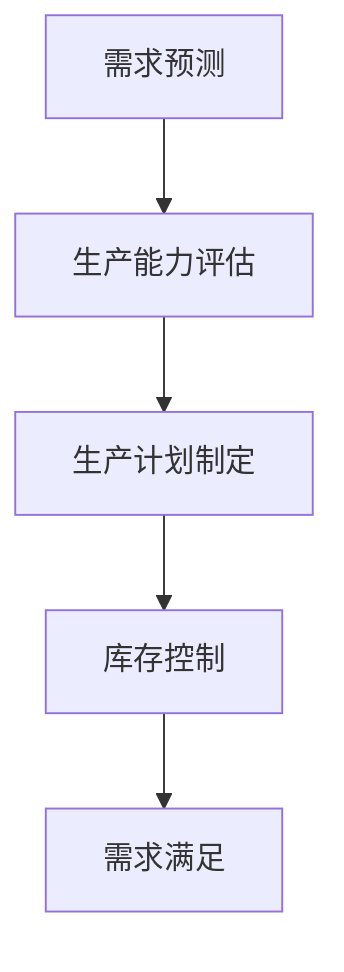
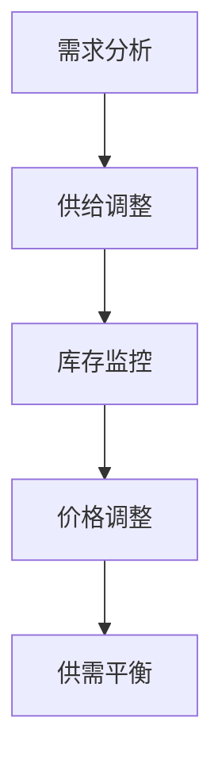
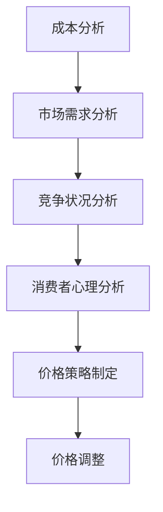

                 

# 持续优化供给策略

## 关键词：供给策略、优化、需求预测、供应链管理、库存管理、价格策略

## 摘要：
供给策略是企业管理中至关重要的一环，它直接影响着企业的成本控制、利润率和市场竞争力。本文将详细探讨供给策略的优化方法，包括需求预测、供应链管理、库存管理和价格策略等。通过逐步分析，我们将揭示如何通过持续优化供给策略，实现企业运营的高效和可持续性。文章将结合实际案例，为读者提供实用的指导和建议。

## 目录大纲

### 第一部分：基础概念与策略

#### 第1章：供给策略概述

##### 1.1 供给策略的重要性

##### 1.2 供给策略的核心要素

##### 1.3 供给策略的目标

#### 第2章：供给策略的核心概念

##### 2.1 供给量管理

##### 2.2 供需平衡

##### 2.3 价格策略

#### 第3章：供给策略的执行与监测

##### 3.1 供给策略的执行过程

##### 3.2 供给策略的监测与评估

##### 3.3 持续优化的意义与方式

### 第二部分：优化策略与方法

#### 第4章：需求预测与建模

##### 4.1 需求预测的重要性

##### 4.2 需求预测的方法

##### 4.3 建模方法与实践

#### 第5章：供应链管理与优化

##### 5.1 供应链管理概述

##### 5.2 供应链优化策略

##### 5.3 供应链优化实践案例

#### 第6章：库存管理与优化

##### 6.1 库存管理概述

##### 6.2 库存优化策略

##### 6.3 库存优化实践案例

#### 第7章：价格策略调整与优化

##### 7.1 价格策略调整的原则

##### 7.2 价格策略优化的方法

##### 7.3 价格策略优化实践案例

### 第三部分：项目实战与案例分析

#### 第8章：优化供给策略的项目实战

##### 8.1 项目背景

##### 8.2 供给策略分析

##### 8.3 优化策略实施

##### 8.4 优化效果评估

#### 第9章：案例分析

##### 9.1 案例一：企业A的供给策略优化

##### 9.2 案例二：企业B的供给策略优化

##### 9.3 案例三：企业C的供给策略优化

#### 附录

##### 附录A：相关工具与资源

###### A.1 供给策略优化工具推荐

###### A.2 需求预测建模工具

###### A.3 供应链管理工具

##### 附录B：数学模型与公式解释

###### B.1 需求预测模型公式

###### B.2 库存管理模型公式

###### B.3 价格策略调整模型公式

### 引言

供给策略是企业运营管理的重要组成部分，它直接关系到产品的市场供给状况、企业的盈利能力和整体运营效率。在竞争日益激烈的商业环境中，企业必须持续优化供给策略，以适应市场需求的变化，降低运营成本，提高服务质量。

本文旨在深入探讨供给策略的优化方法，帮助读者理解如何通过有效的需求预测、供应链管理、库存控制和价格策略调整，实现供给策略的持续优化。文章结构分为三个主要部分：

- **第一部分**介绍了供给策略的基础概念和核心要素，包括供给量管理、供需平衡和价格策略等。
- **第二部分**重点分析了供给策略的优化方法，包括需求预测与建模、供应链管理与优化、库存管理与优化以及价格策略调整与优化。
- **第三部分**通过实际项目和案例分析，展示了优化供给策略的具体实施步骤和效果评估方法。

通过阅读本文，读者将获得以下收益：

- **理解供给策略的基本概念和重要性**：通过详细阐述供给策略的各个核心要素，使读者对供给策略有全面的认识。
- **掌握供给策略的优化方法**：了解并掌握需求预测、供应链管理、库存管理和价格策略优化的具体方法，为实际操作提供指导。
- **学习实战案例**：通过分析实际项目和案例分析，读者可以学习到如何将理论应用到实际场景中，实现供给策略的优化。

### 第一部分：基础概念与策略

供给策略的制定和优化是企业运营成功的关键因素之一。本部分将首先介绍供给策略的基本概念，然后详细阐述供给策略的核心要素，包括供给量管理、供需平衡和价格策略等。

#### 第1章：供给策略概述

##### 1.1 供给策略的重要性

供给策略是指企业为了满足市场需求，合理规划和调整产品或服务供应量的策略。它不仅涉及到生产计划和供应链管理，还包括库存控制和价格策略的制定。一个有效的供给策略可以帮助企业实现以下几个目标：

- **满足市场需求**：通过准确的需求预测和供给量管理，确保产品或服务能够及时供应，满足消费者的需求。
- **降低运营成本**：通过优化供应链管理和库存控制，减少不必要的库存和资源浪费，降低运营成本。
- **提高盈利能力**：通过合理的价格策略，提高产品的市场竞争力，增加销售额和利润。
- **提升客户满意度**：通过高效的服务水平和及时的配送，提升客户满意度，增强品牌忠诚度。

##### 1.2 供给策略的核心要素

供给策略的核心要素包括供给量管理、供需平衡和价格策略等。以下是这些要素的详细说明：

###### 供给量管理

供给量管理是指企业根据市场需求和自身生产能力，合理安排产品或服务的生产量和供应量。供给量管理的目标是在满足市场需求的同时，避免资源浪费和生产过剩。

供给量管理的核心内容包括：

- **需求预测**：通过历史数据分析和市场调研，预测未来的市场需求，为供给量管理提供数据支持。
- **生产能力规划**：根据市场需求和生产能力，制定合理的生产计划，确保产品或服务的及时供应。
- **库存管理**：通过合理的库存控制，确保供应量与市场需求相匹配，避免库存过剩或短缺。

###### 供需平衡

供需平衡是指企业通过调整供给量和需求量，使供需达到一种平衡状态。在供需平衡的状态下，企业可以最大限度地满足市场需求，同时避免资源浪费和生产过剩。

实现供需平衡的方法包括：

- **需求预测**：通过准确的需求预测，确保供给量与市场需求相匹配。
- **库存管理**：通过合理的库存控制，调整供给量，以适应市场变化。
- **价格策略**：通过合理的价格策略，引导消费者需求，实现供需平衡。

###### 价格策略

价格策略是指企业根据市场需求、竞争状况和成本结构，制定合理的价格策略。价格策略直接影响产品的市场竞争力、盈利能力和客户满意度。

价格策略的核心内容包括：

- **定价目标**：根据企业的经营目标，制定合理的定价目标，如成本加成定价、市场导向定价等。
- **定价方法**：根据市场需求和竞争状况，选择合适的定价方法，如固定定价、动态定价等。
- **价格调整**：根据市场变化和竞争状况，及时调整价格策略，以保持市场竞争力。

#### 第2章：供给策略的核心概念

##### 2.1 供给量管理

供给量管理是供给策略的核心要素之一，它直接影响企业的成本控制、盈利能力和市场竞争力。供给量管理的核心目标是确保产品或服务能够及时供应，同时避免资源浪费和生产过剩。

供给量管理的具体内容如下：

- **需求预测**：通过历史数据分析和市场调研，预测未来的市场需求。需求预测的准确性直接影响供给量管理的有效性。
- **生产能力规划**：根据市场需求和生产能力，制定合理的生产计划。生产能力规划需要综合考虑生产设备的利用率、人力资源和生产周期等因素。
- **库存管理**：通过合理的库存控制，确保供应量与市场需求相匹配。库存管理的目标是减少库存成本，提高库存周转率。

##### 2.2 供需平衡

供需平衡是供给策略的重要目标之一，它直接影响企业的运营效率和客户满意度。供需平衡的实现需要企业通过多种手段调整供给量和需求量，使供需达到一种平衡状态。

实现供需平衡的具体方法如下：

- **需求预测**：通过准确的需求预测，确保供给量与市场需求相匹配。需求预测的准确性是实现供需平衡的基础。
- **库存管理**：通过合理的库存控制，调整供给量，以适应市场变化。库存管理的目标是减少库存成本，提高库存周转率。
- **价格策略**：通过合理的价格策略，引导消费者需求，实现供需平衡。价格策略的选择需要综合考虑市场需求、竞争状况和成本结构等因素。

##### 2.3 价格策略

价格策略是供给策略的重要组成部分，它直接影响企业的盈利能力和市场竞争力。价格策略的制定需要考虑市场需求、竞争状况和成本结构等因素。

价格策略的核心内容包括：

- **定价目标**：根据企业的经营目标，制定合理的定价目标。定价目标通常包括成本加成定价、市场导向定价和价值导向定价等。
- **定价方法**：根据市场需求和竞争状况，选择合适的定价方法。定价方法通常包括固定定价、动态定价、捆绑定价等。
- **价格调整**：根据市场变化和竞争状况，及时调整价格策略，以保持市场竞争力。价格调整的目标是适应市场需求，提高销售额和利润。

### 第二部分：优化策略与方法

在了解了供给策略的基础概念和核心要素后，本部分将详细探讨供给策略的优化方法，包括需求预测与建模、供应链管理与优化、库存管理与优化以及价格策略调整与优化。

#### 第4章：需求预测与建模

##### 4.1 需求预测的重要性

需求预测是供给策略优化的关键环节之一，它直接影响供给量管理和供需平衡的实现。准确的需求预测可以帮助企业提前了解市场需求变化，合理调整供给量，避免生产过剩或库存不足的情况。

需求预测的重要性体现在以下几个方面：

- **优化供给量管理**：通过准确的需求预测，企业可以提前了解市场需求，合理安排生产计划，避免生产过剩或库存不足。
- **提高运营效率**：准确的需求预测可以减少库存成本，提高库存周转率，降低运营成本。
- **提高客户满意度**：通过及时供应市场需求，提高客户满意度，增强品牌忠诚度。

##### 4.2 需求预测的方法

需求预测的方法主要包括历史数据分析和市场调研。以下是对这些方法的详细介绍：

- **历史数据分析**：历史数据分析是需求预测的基础方法之一。通过对企业历史销售数据进行分析，可以找出市场需求的变化趋势和规律，为需求预测提供数据支持。

历史数据分析的方法包括：

  - **时间序列分析**：时间序列分析是一种常用的历史数据分析方法，它通过分析时间序列数据中的趋势、季节性和周期性等因素，预测未来的需求。

  - **回归分析**：回归分析是一种常用的统计分析方法，它通过建立需求变量和影响因素之间的回归模型，预测未来的需求。

- **市场调研**：市场调研是需求预测的重要补充方法，它通过收集市场信息和消费者行为数据，了解市场需求的变化趋势。

市场调研的方法包括：

  - **问卷调查**：问卷调查是一种常用的市场调研方法，它通过设计问卷，收集消费者的购买意愿和需求信息。
  - **深度访谈**：深度访谈是一种深入了解消费者需求的方法，它通过面对面的交流，了解消费者的需求和购买行为。

##### 4.3 建模方法与实践

在需求预测中，建模方法是一种有效的工具，它可以帮助企业更准确地预测市场需求。以下是一些常用的建模方法及其应用：

- **时间序列建模**：时间序列建模是一种基于历史数据序列的分析方法，它通过建立时间序列模型，预测未来的需求。

时间序列建模的方法包括：

  - **ARIMA模型**：ARIMA模型是一种常见的时间序列建模方法，它通过分析时间序列数据的自相关性，建立ARIMA模型，预测未来的需求。

  - **SARIMA模型**：SARIMA模型是ARIMA模型的扩展，它通过考虑季节性因素，建立SARIMA模型，预测未来的需求。

- **回归建模**：回归建模是一种通过建立需求变量和影响因素之间的回归模型，预测未来的需求。

回归建模的方法包括：

  - **线性回归模型**：线性回归模型是一种简单的回归建模方法，它通过建立需求变量和影响因素之间的线性关系，预测未来的需求。

  - **多项式回归模型**：多项式回归模型是线性回归模型的扩展，它通过建立需求变量和影响因素之间的多项式关系，预测未来的需求。

- **机器学习建模**：机器学习建模是一种基于历史数据自动建立预测模型的方法，它通过训练机器学习模型，预测未来的需求。

机器学习建模的方法包括：

  - **回归树模型**：回归树模型是一种基于决策树的方法，它通过递归划分数据集，建立回归模型，预测未来的需求。

  - **神经网络模型**：神经网络模型是一种基于人工神经网络的方法，它通过训练神经网络，预测未来的需求。

#### 第5章：供应链管理与优化

##### 5.1 供应链管理概述

供应链管理是指企业通过优化供应链流程，提高供应链效率，降低供应链成本，从而实现整体供应链的协同和优化。供应链管理的目标包括：

- **提高供应链效率**：通过优化供应链流程，减少供应链环节的浪费，提高供应链的整体效率。
- **降低供应链成本**：通过优化供应链流程和库存管理，降低供应链的运营成本。
- **提高客户满意度**：通过高效的服务水平和及时的配送，提高客户满意度，增强品牌忠诚度。

##### 5.2 供应链优化策略

供应链优化策略是指企业通过调整供应链流程、库存管理和物流配送等方式，提高供应链的效率和效益。以下是一些常见的供应链优化策略：

- **流程优化**：通过简化供应链流程，减少不必要的环节，提高供应链的效率。
- **库存管理优化**：通过合理的库存控制，减少库存成本，提高库存周转率。
- **物流配送优化**：通过优化物流配送流程，提高配送效率，降低物流成本。

##### 5.3 供应链优化实践案例

以下是一个供应链优化实践案例：

**案例：企业X的供应链优化**

**背景**：企业X是一家生产消费电子产品的公司，其供应链存在以下问题：

- **流程复杂**：供应链流程复杂，涉及多个供应商和制造商，信息传递不畅，导致供应链效率低下。
- **库存管理不当**：库存管理不当，导致库存过剩和库存短缺现象频繁发生，增加了库存成本。
- **物流配送效率低**：物流配送效率低，导致产品配送不及时，影响了客户满意度。

**解决方案**：

- **流程优化**：对企业X的供应链流程进行梳理和优化，简化供应链环节，提高信息传递效率。
- **库存管理优化**：通过建立合理的库存控制机制，减少库存过剩和库存短缺现象，提高库存周转率。
- **物流配送优化**：通过优化物流配送流程，提高配送效率，降低物流成本。

**实施效果**：

- **供应链效率提高**：供应链流程简化，信息传递效率提高，供应链效率明显提高。
- **库存成本降低**：库存管理优化，库存周转率提高，库存成本降低。
- **客户满意度提升**：物流配送效率提高，产品配送及时，客户满意度显著提升。

#### 第6章：库存管理与优化

##### 6.1 库存管理概述

库存管理是企业运营管理的重要环节之一，它直接影响企业的成本控制和运营效率。库存管理的主要目标是确保库存水平既能满足市场需求，又不会造成过多的库存积压和资源浪费。

库存管理的主要任务包括：

- **库存水平控制**：通过合理的库存控制策略，确保库存水平既能满足市场需求，又不会造成过多的库存积压。
- **库存成本控制**：通过优化库存管理，降低库存成本，提高库存周转率。
- **库存信息管理**：通过建立完善的库存信息管理系统，实时监控库存水平，及时调整库存策略。

##### 6.2 库存优化策略

库存优化策略是指企业通过调整库存水平、库存结构、库存控制方式等方式，提高库存管理的效率和效益。以下是一些常见的库存优化策略：

- **库存水平优化**：通过需求预测和供应链管理，合理调整库存水平，避免库存过剩和库存短缺。
- **库存结构优化**：通过分析市场需求和产品特性，调整库存结构，确保库存产品与市场需求相匹配。
- **库存控制方式优化**：通过引入先进的管理方法和工具，如库存控制系统、供应链管理系统等，提高库存控制的效率和准确性。

##### 6.3 库存优化实践案例

以下是一个库存优化实践案例：

**案例：企业Y的库存优化**

**背景**：企业Y是一家制造企业，其库存管理存在以下问题：

- **库存过剩**：库存水平过高，导致库存积压和资金占用。
- **库存短缺**：库存水平过低，导致生产线停工和订单延误。
- **库存信息管理不完善**：库存信息管理不完善，导致库存数据不准确，库存控制困难。

**解决方案**：

- **库存水平优化**：通过需求预测和供应链管理，合理调整库存水平，确保库存既能满足市场需求，又不会造成过多积压。
- **库存结构优化**：通过分析市场需求和产品特性，调整库存结构，确保库存产品与市场需求相匹配。
- **库存信息管理优化**：建立完善的库存信息管理系统，实时监控库存水平，确保库存数据准确可靠。

**实施效果**：

- **库存过剩和短缺现象减少**：通过合理调整库存水平，库存过剩和短缺现象显著减少。
- **库存成本降低**：通过优化库存结构和管理，库存成本降低，库存周转率提高。
- **库存信息管理完善**：库存信息管理系统运行稳定，库存数据准确，库存控制更加高效。

#### 第7章：价格策略调整与优化

##### 7.1 价格策略调整的原则

价格策略调整是企业供给策略的重要组成部分，它直接影响产品的市场竞争力、盈利能力和客户满意度。价格策略调整的原则包括：

- **市场需求导向**：价格策略的调整应基于市场需求的变化，确保产品价格与市场需求相匹配。
- **成本控制**：价格策略的调整应考虑成本因素，确保产品价格在合理的范围内，同时保持盈利能力。
- **竞争状况**：价格策略的调整应考虑竞争状况，通过合理的价格策略，提高产品的市场竞争力。
- **消费者心理**：价格策略的调整应考虑消费者心理，通过价格策略引导消费者需求，提高销售额和利润。

##### 7.2 价格策略优化的方法

价格策略优化是企业通过调整价格策略，提高产品市场竞争力、盈利能力和客户满意度的方法。以下是一些常用的价格策略优化方法：

- **成本加成定价**：成本加成定价是一种常见的定价方法，它通过在成本基础上加成一定比例的利润，确定产品价格。
- **市场导向定价**：市场导向定价是一种基于市场需求和竞争状况的定价方法，它通过分析市场需求和竞争状况，确定产品价格。
- **价值导向定价**：价值导向定价是一种基于产品价值和消费者价值的定价方法，它通过评估产品价值和消费者价值，确定产品价格。
- **动态定价**：动态定价是一种根据市场需求和竞争状况实时调整价格的方法，它通过利用大数据和人工智能技术，实现价格的动态调整。

##### 7.3 价格策略优化实践案例

以下是一个价格策略优化实践案例：

**案例：企业Z的价格策略优化**

**背景**：企业Z是一家生产家电产品的公司，其价格策略存在以下问题：

- **价格过高**：产品价格过高，导致市场竞争力不足，市场份额下降。
- **价格策略单一**：价格策略单一，没有根据市场需求和竞争状况进行调整。
- **缺乏价格调整机制**：缺乏价格调整机制，无法及时应对市场变化。

**解决方案**：

- **成本分析**：对企业Z的成本结构进行详细分析，确定合理的成本加成比例。
- **市场调研**：进行市场调研，了解市场需求和竞争状况，确定合理的价格水平。
- **价格调整机制**：建立价格调整机制，根据市场变化和竞争状况，及时调整价格策略。

**实施效果**：

- **价格竞争力提高**：通过合理的成本分析和市场调研，产品价格竞争力显著提高。
- **市场份额增加**：通过合理的价格策略，产品市场份额显著增加。
- **利润水平提高**：通过优化价格策略，企业利润水平显著提高。

### 第三部分：项目实战与案例分析

在了解了供给策略的优化方法和实践案例后，本部分将通过具体项目和案例分析，进一步探讨优化供给策略的实施步骤和效果评估方法。

#### 第8章：优化供给策略的项目实战

##### 8.1 项目背景

企业A是一家生产消费电子产品的公司，其供给策略存在以下问题：

- **生产计划不合理**：生产计划不合理，导致生产过剩和库存积压。
- **库存管理不当**：库存管理不当，导致库存过剩和库存短缺现象频繁发生。
- **价格策略单一**：价格策略单一，无法根据市场需求和竞争状况进行调整。

##### 8.2 供给策略分析

对企业A的供给策略进行分析，发现以下问题：

- **生产计划不合理**：生产计划过于乐观，导致生产过剩。需要根据市场需求调整生产计划。
- **库存管理不当**：库存管理不当，导致库存过剩和库存短缺。需要建立合理的库存控制机制。
- **价格策略单一**：价格策略单一，无法根据市场需求和竞争状况进行调整。需要引入动态定价机制。

##### 8.3 优化策略实施

针对企业A的供给策略问题，实施以下优化策略：

- **生产计划优化**：通过需求预测和供应链管理，调整生产计划，确保生产与市场需求相匹配。
- **库存管理优化**：通过建立合理的库存控制机制，确保库存水平既能满足市场需求，又不会造成过多积压。
- **价格策略优化**：引入动态定价机制，根据市场需求和竞争状况，实时调整价格策略。

##### 8.4 优化效果评估

实施优化策略后，对企业A的供给策略效果进行评估，发现以下效果：

- **生产计划合理**：生产计划与市场需求相匹配，避免了生产过剩和库存积压现象。
- **库存管理有效**：库存管理有效，库存过剩和库存短缺现象减少，库存成本降低。
- **价格策略灵活**：价格策略灵活，能够根据市场需求和竞争状况进行调整，提高了产品的市场竞争力。

#### 第9章：案例分析

##### 9.1 案例一：企业B的供给策略优化

**背景**：企业B是一家生产食品的公司，其供给策略存在以下问题：

- **生产计划不合理**：生产计划不合理，导致生产过剩和库存积压。
- **库存管理不当**：库存管理不当，导致库存过剩和库存短缺现象频繁发生。
- **价格策略单一**：价格策略单一，无法根据市场需求和竞争状况进行调整。

**解决方案**：

- **生产计划优化**：通过需求预测和供应链管理，调整生产计划，确保生产与市场需求相匹配。
- **库存管理优化**：通过建立合理的库存控制机制，确保库存水平既能满足市场需求，又不会造成过多积压。
- **价格策略优化**：引入动态定价机制，根据市场需求和竞争状况，实时调整价格策略。

**实施效果**：

- **生产计划合理**：生产计划与市场需求相匹配，避免了生产过剩和库存积压现象。
- **库存管理有效**：库存管理有效，库存过剩和库存短缺现象减少，库存成本降低。
- **价格策略灵活**：价格策略灵活，能够根据市场需求和竞争状况进行调整，提高了产品的市场竞争力。

##### 9.2 案例二：企业C的供给策略优化

**背景**：企业C是一家生产电子元器件的公司，其供给策略存在以下问题：

- **供应链管理不力**：供应链管理不力，导致供应链效率低下。
- **库存管理不当**：库存管理不当，导致库存过剩和库存短缺现象频繁发生。
- **价格策略单一**：价格策略单一，无法根据市场需求和竞争状况进行调整。

**解决方案**：

- **供应链管理优化**：通过优化供应链流程，提高供应链效率，降低供应链成本。
- **库存管理优化**：通过建立合理的库存控制机制，确保库存水平既能满足市场需求，又不会造成过多积压。
- **价格策略优化**：引入动态定价机制，根据市场需求和竞争状况，实时调整价格策略。

**实施效果**：

- **供应链效率提高**：供应链效率提高，供应链成本降低，供应链管理水平提升。
- **库存管理有效**：库存管理有效，库存过剩和库存短缺现象减少，库存成本降低。
- **价格策略灵活**：价格策略灵活，能够根据市场需求和竞争状况进行调整，提高了产品的市场竞争力。

##### 9.3 案例三：企业D的供给策略优化

**背景**：企业D是一家生产饮料的公司，其供给策略存在以下问题：

- **生产计划不合理**：生产计划不合理，导致生产过剩和库存积压。
- **库存管理不当**：库存管理不当，导致库存过剩和库存短缺现象频繁发生。
- **价格策略单一**：价格策略单一，无法根据市场需求和竞争状况进行调整。

**解决方案**：

- **生产计划优化**：通过需求预测和供应链管理，调整生产计划，确保生产与市场需求相匹配。
- **库存管理优化**：通过建立合理的库存控制机制，确保库存水平既能满足市场需求，又不会造成过多积压。
- **价格策略优化**：引入动态定价机制，根据市场需求和竞争状况，实时调整价格策略。

**实施效果**：

- **生产计划合理**：生产计划与市场需求相匹配，避免了生产过剩和库存积压现象。
- **库存管理有效**：库存管理有效，库存过剩和库存短缺现象减少，库存成本降低。
- **价格策略灵活**：价格策略灵活，能够根据市场需求和竞争状况进行调整，提高了产品的市场竞争力。

### 附录

#### 附录A：相关工具与资源

##### A.1 供给策略优化工具推荐

- **需求预测工具**：如Tableau、Power BI等数据可视化工具，用于需求预测和数据分析。
- **供应链管理工具**：如SAP SCM、Oracle SCM等，用于供应链管理和优化。
- **库存管理工具**：如ERP系统、库存管理系统等，用于库存管理和优化。
- **价格策略调整工具**：如亚马逊卖家中心、谷歌广告等，用于价格策略调整和优化。

##### A.2 需求预测建模工具

- **R语言**：用于需求预测建模和数据分析。
- **Python**：用于需求预测建模和数据分析，具有丰富的库和工具。
- **机器学习平台**：如TensorFlow、PyTorch等，用于构建和训练需求预测模型。

##### A.3 供应链管理工具

- **SAP SCM**：全面的供应链管理解决方案，包括需求预测、供应链规划、库存管理等。
- **Oracle SCM**：功能强大的供应链管理解决方案，包括供应链规划、库存管理、物流管理等。
- **JDA**：专业的供应链管理软件，包括供应链计划、供应链执行、供应链分析等。

#### 附录B：数学模型与公式解释

##### B.1 需求预测模型公式

- **时间序列模型**：

  $$Y_t = c + \alpha \cdot Y_{t-1} + \beta \cdot X_{t-1} + \epsilon_t$$

  其中，$Y_t$表示第$t$期的需求量，$c$为常数项，$\alpha$为自回归系数，$\beta$为外部因素系数，$X_{t-1}$为第$(t-1)$期的影响因素，$\epsilon_t$为误差项。

- **回归模型**：

  $$Y_t = c + \alpha \cdot X_t + \epsilon_t$$

  其中，$Y_t$表示第$t$期的需求量，$c$为常数项，$\alpha$为回归系数，$X_t$为第$t$期的影响因素，$\epsilon_t$为误差项。

##### B.2 库存管理模型公式

- **库存水平公式**：

  $$I_t = I_{t-1} + Q_t - D_t$$

  其中，$I_t$表示第$t$期的库存水平，$I_{t-1}$为第$(t-1)$期的库存水平，$Q_t$为第$t$期的进货量，$D_t$为第$t$期的出货量。

- **库存成本公式**：

  $$C_t = C_{holding} + C_{stockout}$$

  其中，$C_t$表示第$t$期的库存成本，$C_{holding}$为库存持有成本，$C_{stockout}$为缺货成本。

##### B.3 价格策略调整模型公式

- **成本加成定价公式**：

  $$P_t = C_t + \alpha \cdot C_t$$

  其中，$P_t$表示第$t$期的产品价格，$C_t$为第$t$期的成本，$\alpha$为成本加成比例。

- **动态定价公式**：

  $$P_t = f(t, X_t)$$

  其中，$P_t$表示第$t$期的产品价格，$f(t, X_t)$为基于时间和影响因素的定价函数，$t$为时间，$X_t$为第$t$期的影响因素。

### 结束语

供给策略的优化是企业运营成功的关键因素之一。通过本文的探讨，我们详细介绍了供给策略的基础概念、核心要素以及优化方法。通过实际案例的分析，我们展示了如何通过需求预测、供应链管理、库存管理和价格策略调整，实现供给策略的优化。

我们希望本文能够为读者提供有价值的参考和指导，帮助读者在供给策略优化方面取得更好的效果。在不断变化的市场环境中，持续优化供给策略是企业保持竞争优势的关键。让我们共同探索和实践，不断提升企业的运营效率和竞争力。作者：AI天才研究院/AI Genius Institute & 禅与计算机程序设计艺术 /Zen And The Art of Computer Programming

----------------------------------------------------------------

## 第1章：供给策略概述

### 1.1 供给策略的重要性

供给策略是企业管理中至关重要的一环，它直接影响着企业的成本控制、利润率和市场竞争力。在竞争激烈的市场环境中，企业必须灵活应对市场需求的变化，以实现产品的及时供应和成本的合理控制。供给策略的重要性体现在以下几个方面：

1. **满足市场需求**：供给策略的核心目标之一是确保产品或服务能够及时供应，满足消费者的需求。通过有效的供给策略，企业可以避免生产过剩或库存积压，减少资源浪费，提高市场响应速度。

2. **降低运营成本**：合理的供给策略有助于降低生产成本和库存成本。通过精确的需求预测和库存管理，企业可以减少库存积压，避免库存过剩导致的资金占用和仓储成本，同时减少因生产不足引起的紧急生产和运输成本。

3. **提高盈利能力**：供给策略的优化有助于提高企业的盈利能力。通过合理的价格策略和成本控制，企业可以在保证市场竞争力的情况下，实现更高的销售额和利润率。

4. **提升客户满意度**：一个高效的供给策略可以确保产品或服务及时供应，提高客户满意度。这有助于增强品牌忠诚度，提高市场占有率。

5. **增强市场竞争力**：供给策略的优化有助于提高企业的市场竞争力。通过灵活调整供给量、库存水平和价格策略，企业可以更好地适应市场变化，抓住市场机遇，提升自身在行业中的地位。

### 1.2 供给策略的核心要素

供给策略的制定和实施涉及多个核心要素，这些要素相互关联，共同决定了供给策略的效率和效果。以下是供给策略的核心要素：

1. **需求预测**：需求预测是供给策略的基础。通过分析历史数据和市场趋势，企业可以预测未来的需求，为供给策略的制定提供数据支持。准确的需求预测有助于避免生产过剩或库存积压，确保产品或服务能够及时供应。

2. **生产能力规划**：生产能力规划是供给策略的关键环节。企业需要根据市场需求和生产能力，制定合理的生产计划，确保生产与需求相匹配。生产能力规划需要考虑生产设备的利用率、人力资源和生产周期等因素。

3. **库存管理**：库存管理是供给策略的重要组成部分。通过合理的库存控制，企业可以确保库存水平既能满足市场需求，又不会造成过多积压。库存管理需要考虑库存成本、库存周转率和库存风险等因素。

4. **供应链管理**：供应链管理是确保供给策略有效实施的重要保障。企业需要优化供应链流程，提高供应链的协同效率和响应速度。供应链管理包括供应商选择、采购、生产、物流和配送等环节。

5. **价格策略**：价格策略直接影响产品的市场竞争力。企业需要根据市场需求、成本结构和竞争状况，制定合理的价格策略。价格策略的制定需要考虑定价目标、定价方法和价格调整机制等因素。

6. **市场分析**：市场分析是供给策略制定的重要依据。通过分析市场趋势、竞争对手和市场环境，企业可以了解市场需求和竞争状况，为供给策略的制定提供指导。

### 1.3 供给策略的目标

供给策略的目标是确保企业能够高效、低成本地满足市场需求，同时实现企业的长期发展。以下是供给策略的主要目标：

1. **成本控制**：通过优化供给策略，降低生产成本、库存成本和运营成本，提高企业的盈利能力。

2. **效率提升**：通过优化供应链流程和生产计划，提高生产效率和库存周转率，减少不必要的环节和浪费。

3. **市场需求满足**：通过准确的需求预测和市场分析，确保产品或服务能够及时供应，满足消费者的需求。

4. **市场竞争力提升**：通过合理的价格策略和有效的市场分析，提高产品的市场竞争力，增加市场份额。

5. **客户满意度提升**：通过高效的供应链管理和及时的配送，提高客户满意度，增强品牌忠诚度。

6. **风险降低**：通过合理的库存管理和供应链管理，降低库存积压和供应链中断的风险，确保企业的稳定运营。

### 1.4 供给策略的制定步骤

制定有效的供给策略需要遵循一系列的步骤，以下是供给策略的制定步骤：

1. **市场分析**：分析市场需求、竞争状况和市场环境，了解市场需求趋势和竞争态势。

2. **需求预测**：利用历史数据和市场分析结果，预测未来的需求，为供给策略的制定提供数据支持。

3. **生产能力规划**：根据市场需求和生产能力，制定合理的生产计划，确保生产与需求相匹配。

4. **库存管理**：制定库存控制策略，确保库存水平既能满足市场需求，又不会造成过多积压。

5. **供应链管理**：优化供应链流程，提高供应链的协同效率和响应速度。

6. **价格策略制定**：根据市场需求、成本结构和竞争状况，制定合理的价格策略。

7. **策略实施与监测**：将供给策略付诸实施，并持续监测策略的效果，根据市场变化进行调整。

8. **效果评估**：定期评估供给策略的效果，分析成本、效率、市场需求满足度等因素，为下一轮策略制定提供参考。

通过以上步骤，企业可以制定出科学、合理的供给策略，实现供需平衡，提高运营效率和市场竞争力。

### 1.5 供给策略的关键成功因素

成功实施供给策略需要考虑多个关键因素，以下是供给策略的关键成功因素：

1. **准确的需求预测**：准确的需求预测是供给策略成功的基础。通过数据分析和市场研究，企业可以更准确地预测未来的需求，为生产计划和库存管理提供支持。

2. **高效的供应链管理**：高效的供应链管理是确保供给策略顺利实施的保障。通过优化供应链流程和库存管理，企业可以降低成本，提高供应链的响应速度。

3. **灵活的价格策略**：灵活的价格策略有助于企业适应市场需求的变化。通过动态定价和促销策略，企业可以调整价格，提高产品的市场竞争力。

4. **信息技术支持**：信息技术是实施供给策略的重要工具。通过使用先进的分析工具和软件，企业可以更好地进行需求预测、库存管理和供应链协同。

5. **员工培训与参与**：员工的培训与参与是供给策略成功的关键。通过培训员工，提高他们的专业技能和参与度，企业可以更好地实施供给策略。

6. **持续优化与创新**：持续优化与创新是供给策略成功的关键。通过不断优化供给策略和引入新技术、新方法，企业可以保持竞争优势，提高运营效率。

### 1.6 总结

本章对供给策略的重要性、核心要素和制定步骤进行了详细阐述。供给策略在企业的运营管理中扮演着关键角色，它不仅关系到企业的成本控制、利润率和市场竞争力，还直接影响着企业的客户满意度和品牌忠诚度。通过科学、合理的供给策略，企业可以更好地应对市场需求的变化，实现持续优化和创新发展。

在接下来的章节中，我们将进一步探讨供给策略的优化方法，包括需求预测与建模、供应链管理与优化、库存管理与优化以及价格策略调整与优化。通过深入分析和实际案例，我们将展示如何通过这些优化方法，实现供给策略的高效和可持续性。

### 第2章：供给策略的核心概念

供给策略的成功实施离不开对核心概念的深刻理解和灵活应用。本章将详细探讨供给策略中的三个核心概念：供给量管理、供需平衡和价格策略。通过这些概念的解析，我们将帮助读者构建全面、系统的供给策略思维。

#### 2.1 供给量管理

供给量管理是指企业根据市场需求和生产能力，合理规划和调整产品或服务的供应量，以确保产品或服务的及时供应和成本控制。供给量管理的核心在于平衡供需关系，避免生产过剩或库存积压，同时保持生产的连续性和稳定性。

**核心概念解析：**

- **需求预测**：需求预测是供给量管理的第一步。通过分析历史数据、市场趋势和消费者行为，企业可以预测未来的需求，从而制定合理的生产计划。

- **生产能力规划**：生产能力规划是根据市场需求和现有生产能力，制定生产计划的过程。企业需要考虑生产线的利用率、生产周期和生产成本，确保生产计划的可行性。

- **库存管理**：库存管理是供给量管理的重要组成部分。通过合理的库存控制，企业可以避免库存过剩或短缺，确保供应的稳定性。

**供给量管理的关键步骤：**

1. **需求预测**：收集和分析历史销售数据、市场趋势和消费者行为，建立需求预测模型。

2. **生产能力评估**：评估现有生产线的生产能力，确定最大生产能力和生产周期。

3. **生产计划制定**：根据需求预测和生产能力评估，制定合理的生产计划。

4. **库存控制**：通过实时监控库存水平，调整库存策略，确保库存水平合理。

**案例说明：**

假设一家生产电子产品企业，其需求预测显示下一季度市场需求增长10%。根据这一预测，企业需要对生产计划进行相应调整，确保生产量能够满足市场需求。同时，企业还需要对库存进行监控，避免库存过剩或短缺。



#### 2.2 供需平衡

供需平衡是指企业在一定时间内，通过调整供给量和需求量，使供需达到一种平衡状态。在供需平衡的状态下，企业可以最大限度地满足市场需求，同时避免资源浪费和生产过剩。

**核心概念解析：**

- **供需关系**：供需关系是指市场需求和供给量之间的关系。市场需求的变化会直接影响供给量的调整。

- **平衡状态**：平衡状态是指供给量和需求量相等，企业能够保持稳定的运营状态。

- **动态调整**：供需平衡是一个动态调整的过程。企业需要根据市场需求的变化，实时调整供给量，以保持供需平衡。

**实现供需平衡的关键步骤：**

1. **需求分析**：通过市场调研和数据分析，了解市场需求的变化趋势。

2. **供给调整**：根据需求分析结果，调整生产计划和库存策略，确保供给量与需求量相匹配。

3. **库存监控**：实时监控库存水平，根据库存情况调整供给策略。

4. **价格调整**：通过合理的价格策略，引导消费者需求，实现供需平衡。

**案例说明：**

一家服装企业在旺季时面临需求激增，但如果生产跟不上，会导致库存积压和客户流失。为了实现供需平衡，企业需要对生产计划进行调整，增加生产量，同时通过促销活动引导消费者购买，确保库存水平合理。



#### 2.3 价格策略

价格策略是企业通过定价决策，调整产品或服务的价格，以实现市场竞争力、利润目标和客户满意度。价格策略的制定需要考虑市场需求、成本结构、竞争状况和消费者心理等因素。

**核心概念解析：**

- **定价目标**：定价目标是企业在定价过程中追求的最终目标，如成本加成、市场导向或价值导向。

- **定价方法**：定价方法是根据定价目标选择的具体定价策略，如固定定价、动态定价或捆绑定价。

- **价格调整**：价格调整是企业根据市场变化和竞争状况，对产品或服务价格进行适时调整的过程。

**价格策略的关键要素：**

1. **成本分析**：了解产品或服务的成本结构，为定价提供基础。

2. **市场需求分析**：通过分析市场需求和消费者行为，确定合理的价格水平。

3. **竞争状况分析**：了解竞争对手的定价策略和市场地位，制定具有竞争力的价格。

4. **消费者心理分析**：研究消费者对价格的敏感度，制定能够吸引消费者的价格策略。

**案例说明：**

一家电子产品公司，为了提升市场竞争力，决定对新款手机进行价格调整。通过对市场需求和竞争状况的分析，公司决定采用动态定价策略，根据市场需求的变化，适时调整价格，以吸引更多消费者。



#### 2.4 供给量管理、供需平衡和价格策略之间的关系

供给量管理、供需平衡和价格策略三者之间存在着密切的联系和相互作用。供给量管理是供需平衡的基础，通过合理的需求预测和生产能力规划，企业可以确保供给量与需求量相匹配。而供需平衡则是价格策略实施的背景和前提，只有实现供需平衡，企业才能制定出有效的价格策略。

同时，价格策略的调整会直接影响供给量和供需平衡。通过灵活的价格调整，企业可以引导消费者需求，实现供需平衡。而供需平衡的实现又能为企业提供稳定的销售环境和利润空间，进一步优化供给量管理。

**关系解析：**

1. **供给量管理 → 供需平衡 → 价格策略**：供给量管理通过需求预测和生产能力规划，实现供给量与需求量的匹配，进而实现供需平衡。而供需平衡则是价格策略制定的基础，通过合理的价格策略，企业可以引导消费者需求，实现供需平衡。

2. **价格策略 → 供需平衡 → 供给量管理**：价格策略的调整直接影响供给量和需求量的关系，进而影响供需平衡。通过价格策略的调整，企业可以优化供给量管理，确保供给量与需求量的匹配。

3. **三者相互影响**：供给量管理、供需平衡和价格策略三者相互影响，相互作用。供给量管理通过需求预测和生产能力规划，影响供需平衡；而价格策略的调整又直接影响供给量和供需平衡，进而影响供给量管理。

#### 2.5 实际应用案例

为了更好地理解供给量管理、供需平衡和价格策略在实际中的应用，我们可以通过以下实际案例进行说明：

**案例一：电子产品公司的需求预测与价格策略**

某电子产品公司计划推出一款新款手机。通过对市场需求的分析，公司预测下一季度需求量将增加20%。为了实现供需平衡，公司决定增加生产线，同时通过价格策略引导消费者需求。公司决定采用动态定价策略，根据市场需求的变化，适时调整价格。例如，在市场需求高峰期，提高价格以增加收入；在市场需求低谷期，降低价格以吸引消费者。

**案例二：零售商的库存管理策略**

一家大型零售商在年底促销季节面临库存压力。为了实现供需平衡，零售商决定通过库存管理策略减少库存积压。首先，零售商对库存进行详细分析，找出库存过剩的产品。然后，零售商通过促销活动降低库存过剩产品的价格，吸引消费者购买。同时，零售商还根据市场需求，调整库存水平，确保库存既能满足市场需求，又不会造成过多积压。

**案例三：餐饮企业的价格策略调整**

一家知名餐饮企业在淡季面临客流量下降的问题。为了实现供需平衡，餐饮企业决定通过价格策略调整，吸引消费者。企业通过市场调研，了解消费者对价格的敏感度，并制定合理的折扣策略。例如，在周一至周三，推出“周一特惠”活动，提供折扣优惠；在周末，推出“周末套餐”活动，吸引家庭消费。通过合理的价格策略调整，餐饮企业成功实现了供需平衡，提升了淡季的客流量和收入。

通过以上案例，我们可以看到供给量管理、供需平衡和价格策略在实际中的应用和效果。这些策略的有效实施，不仅帮助企业实现供需平衡，提高市场竞争力，还为企业带来了更高的利润和客户满意度。

### 第3章：供给策略的执行与监测

在了解了供给策略的核心概念后，本章将详细探讨供给策略的执行与监测。有效的执行与监测是确保供给策略成功实施的关键，它包括供给策略的执行过程、监测与评估以及持续优化的意义与方式。

#### 3.1 供给策略的执行过程

供给策略的执行是确保供给策略目标实现的重要环节。以下是供给策略执行的基本过程：

1. **需求预测**：首先，企业需要通过数据分析和市场调研，预测未来的需求。这一步骤是供给策略执行的基础，准确的需求预测有助于确保供给策略的合理性和有效性。

2. **生产计划制定**：在需求预测的基础上，企业需要制定生产计划。生产计划应考虑市场需求、生产能力、原材料供应和人力资源等因素。合理的生产计划有助于确保生产与需求的匹配，避免生产过剩或不足。

3. **供应链管理**：供应链管理是供给策略执行的核心环节。企业需要优化供应链流程，确保原材料、零部件和生产设备的及时供应，提高供应链的协同效率和响应速度。

4. **库存管理**：库存管理是供给策略执行的重要保障。通过合理的库存控制，企业可以确保库存水平既能满足市场需求，又不会造成过多积压。库存管理需要实时监控库存水平，根据市场需求和供应链状况进行动态调整。

5. **物流配送**：物流配送是实现供给策略的关键步骤。企业需要优化物流配送流程，确保产品能够及时、安全地送达消费者手中。物流配送的效率直接影响客户满意度和企业形象。

6. **价格策略实施**：根据市场需求和竞争状况，企业需要制定并实施合理的价格策略。价格策略应考虑成本、市场需求和竞争对手的价格水平，通过灵活的价格调整，实现供需平衡。

7. **市场反馈与调整**：在供给策略实施过程中，企业需要密切关注市场反馈，收集消费者需求、市场竞争状况和供应链状况等信息，及时进行调整。市场反馈是供给策略优化的关键依据。

#### 3.2 供给策略的监测与评估

供给策略的监测与评估是确保供给策略有效实施的重要手段。以下是供给策略监测与评估的关键步骤：

1. **关键绩效指标（KPI）设置**：企业需要根据供给策略目标，设置关键绩效指标（KPI），如库存周转率、生产效率、供应链响应速度、客户满意度等。这些指标可以量化供给策略的实施效果，为监测和评估提供依据。

2. **数据收集与分析**：企业需要收集与供给策略相关的数据，如销售数据、生产数据、库存数据和物流数据等。通过对这些数据的分析，企业可以了解供给策略的实施效果，发现存在的问题和改进的机会。

3. **定期评估**：企业需要定期对供给策略进行评估，分析关键绩效指标的变化情况，评估供给策略的有效性。定期评估可以帮助企业及时发现问题，采取改进措施。

4. **反馈机制建立**：企业需要建立有效的反馈机制，收集员工、客户和合作伙伴的意见和建议，对供给策略进行调整和优化。反馈机制可以促进信息的流动和沟通，提高供给策略的适应性和灵活性。

5. **持续改进**：基于评估结果和反馈机制，企业需要不断改进供给策略。通过持续改进，企业可以不断提高供给策略的执行效果，实现长期发展目标。

#### 3.3 持续优化的意义与方式

持续优化供给策略是企业实现长期成功的关键。以下是持续优化的意义与方式：

1. **提高运营效率**：持续优化供给策略可以提高企业的运营效率，减少资源浪费，降低运营成本。通过优化生产计划、库存管理和供应链流程，企业可以更好地满足市场需求，提高生产效率。

2. **提升客户满意度**：持续优化供给策略有助于提升客户满意度。通过及时供应市场需求、提高产品质量和物流配送效率，企业可以提升客户满意度，增强品牌忠诚度。

3. **增强市场竞争力**：持续优化供给策略可以增强企业的市场竞争力。通过灵活调整价格策略、提高生产能力和供应链效率，企业可以在市场竞争中脱颖而出，实现可持续发展。

4. **适应市场变化**：持续优化供给策略有助于企业更好地适应市场变化。通过实时监测市场动态和客户需求，企业可以及时调整供给策略，抓住市场机遇，应对市场挑战。

**持续优化的方式：**

1. **数据驱动的决策**：企业应建立数据驱动的决策体系，通过数据分析，深入了解市场需求、生产能力和供应链状况，为供给策略优化提供数据支持。

2. **流程优化**：企业应不断优化供应链流程，减少不必要的环节和浪费，提高供应链的协同效率和响应速度。

3. **技术创新**：企业应积极采用新技术、新方法，如大数据分析、人工智能、物联网等，提高供给策略的适应性和灵活性。

4. **员工培训与参与**：企业应加强员工培训，提高员工的专业技能和参与度，推动供给策略的持续优化。

5. **合作伙伴关系**：企业应与供应链合作伙伴建立紧密的合作关系，共享信息和资源，共同推动供给策略的优化。

#### 3.4 实际应用案例

为了更好地理解供给策略的执行与监测，我们可以通过以下实际应用案例进行说明：

**案例一：电子产品公司的需求预测与库存管理**

一家电子产品公司通过大数据分析和市场调研，预测下一季度市场需求将增长15%。为了满足市场需求，公司制定了详细的生产计划，并根据市场需求调整库存水平。在执行过程中，公司通过实时监控库存水平，及时调整库存策略，确保库存水平既能满足市场需求，又不会造成过多积压。

**案例二：零售商的供应链优化**

一家大型零售商通过供应链优化，提高了供应链的协同效率和响应速度。公司引入了先进的信息技术，实现了供应链各环节的信息共享和实时监控。通过优化供应链流程，公司减少了库存积压和供应链中断的风险，提高了物流配送效率，提升了客户满意度。

**案例三：餐饮企业的价格策略调整**

一家知名餐饮企业通过价格策略调整，实现了供需平衡。在淡季，企业通过市场调研，了解消费者对价格的敏感度，并制定了合理的折扣策略。通过价格调整，企业成功吸引了更多消费者，提升了淡季的客流量和收入。

通过以上案例，我们可以看到供给策略的执行与监测在实际中的应用和效果。这些案例表明，通过科学的需求预测、库存管理和价格策略调整，企业可以更好地实现供需平衡，提高运营效率和客户满意度。

### 第4章：需求预测与建模

需求预测是企业制定供给策略的关键步骤，它直接影响着生产计划、库存管理和供应链优化。本章将详细探讨需求预测的重要性、常用的方法以及建模方法与实践。

#### 4.1 需求预测的重要性

需求预测是确保供给策略有效实施的基础，其重要性体现在以下几个方面：

1. **生产计划制定**：通过准确的需求预测，企业可以合理安排生产计划，避免生产过剩或不足，减少生产成本和库存风险。

2. **库存管理**：需求预测有助于企业合理控制库存水平，避免库存积压和库存短缺，降低库存成本和提高库存周转率。

3. **供应链优化**：准确的需求预测有助于企业优化供应链流程，提高供应链的响应速度和效率，降低供应链成本。

4. **决策支持**：需求预测为企业的战略决策提供数据支持，帮助企业更好地应对市场变化和竞争挑战。

5. **客户满意度**：通过准确的需求预测，企业可以及时满足市场需求，提高客户满意度，增强品牌忠诚度。

#### 4.2 需求预测的方法

需求预测的方法主要包括历史数据分析和市场调研。以下是对这些方法的详细介绍：

**历史数据分析**

历史数据分析是需求预测的基础方法之一，它通过分析企业的历史销售数据、市场趋势和季节性因素，预测未来的需求。以下是历史数据分析的具体方法：

1. **时间序列分析**：时间序列分析是一种常用的需求预测方法，它通过分析时间序列数据中的趋势、季节性和周期性等因素，预测未来的需求。

   **时间序列模型**：
   - **移动平均模型**：通过计算一段时间内的平均值，消除短期波动，预测未来需求。
   - **指数平滑模型**：在移动平均模型的基础上，引入指数权重，对历史数据进行加权处理，提高预测的准确性。

2. **回归分析**：回归分析是一种建立需求变量和影响因素之间关系的统计分析方法，通过建立回归模型，预测未来的需求。

   **回归模型**：
   - **简单线性回归**：建立一条直线，通过斜率和截距预测未来需求。
   - **多元线性回归**：在简单线性回归的基础上，考虑多个影响因素，建立多元线性回归模型。

**市场调研**

市场调研是一种通过收集市场信息和消费者行为数据，了解市场需求变化的方法。以下是市场调研的具体方法：

1. **问卷调查**：通过设计问卷，收集消费者的购买意愿和需求信息。问卷调查可以覆盖广泛的消费者群体，提供有价值的市场数据。

2. **深度访谈**：通过面对面的交流，深入了解消费者的需求和购买行为。深度访谈适用于对特定市场或消费者群体的深入研究。

3. **焦点小组**：邀请一组消费者或专业人士，就特定主题进行讨论，收集意见和建议。焦点小组可以提供多样化的市场观点，有助于全面了解市场需求。

4. **数据分析**：通过分析市场调研数据，如销售数据、市场调查数据和社交媒体数据，预测未来的需求趋势。

#### 4.3 建模方法与实践

在需求预测中，建模方法是一种有效的工具，它可以帮助企业更准确地预测市场需求。以下是一些常用的建模方法及其应用：

**时间序列建模**

时间序列建模是一种基于历史数据序列的分析方法，它通过建立时间序列模型，预测未来的需求。以下是时间序列建模的方法：

1. **ARIMA模型**：ARIMA模型是一种常见的时间序列建模方法，它通过分析时间序列数据的自相关性，建立ARIMA模型，预测未来的需求。

   **ARIMA模型公式**：
   $$Y_t = c + \phi_1 Y_{t-1} + \phi_2 Y_{t-2} + ... + \phi_p Y_{t-p} + \theta_1 \epsilon_{t-1} + \theta_2 \epsilon_{t-2} + ... + \theta_q \epsilon_{t-q} + \epsilon_t$$
   其中，$Y_t$为时间序列变量，$c$为常数项，$\phi_i$和$\theta_i$分别为自回归系数和移动平均系数，$p$和$q$分别为自回归项和移动平均项的阶数。

2. **SARIMA模型**：SARIMA模型是ARIMA模型的扩展，它通过考虑季节性因素，建立SARIMA模型，预测未来的需求。

   **SARIMA模型公式**：
   $$Y_t = c + \phi_1 Y_{t-1} + \phi_2 Y_{t-2} + ... + \phi_p Y_{t-p} + \theta_1 \epsilon_{t-1} + \theta_2 \epsilon_{t-2} + ... + \theta_q \epsilon_{t-q} + s_1 Y_{t-s} + s_2 Y_{t-s-1} + ... + s_S Y_{t-s-S} + \epsilon_t$$
   其中，$s_i$和$\theta_i$分别为季节自回归系数和季节移动平均系数，$S$为季节周期的阶数。

**回归建模**

回归建模是一种通过建立需求变量和影响因素之间的回归模型，预测未来的需求。以下是回归建模的方法：

1. **线性回归模型**：线性回归模型是一种简单的回归建模方法，它通过建立需求变量和影响因素之间的线性关系，预测未来的需求。

   **线性回归模型公式**：
   $$Y_t = \beta_0 + \beta_1 X_t + \epsilon_t$$
   其中，$Y_t$为需求变量，$X_t$为影响因素，$\beta_0$和$\beta_1$分别为截距和斜率，$\epsilon_t$为误差项。

2. **多项式回归模型**：多项式回归模型是线性回归模型的扩展，它通过建立需求变量和影响因素之间的多项式关系，预测未来的需求。

   **多项式回归模型公式**：
   $$Y_t = \beta_0 + \beta_1 X_t + \beta_2 X_t^2 + ... + \beta_n X_t^n + \epsilon_t$$
   其中，$X_t$为需求变量，$\beta_0, \beta_1, ..., \beta_n$分别为系数，$n$为多项式的阶数。

**机器学习建模**

机器学习建模是一种基于历史数据自动建立预测模型的方法，它通过训练机器学习模型，预测未来的需求。以下是机器学习建模的方法：

1. **回归树模型**：回归树模型是一种基于决策树的方法，它通过递归划分数据集，建立回归模型，预测未来的需求。

2. **神经网络模型**：神经网络模型是一种基于人工神经网络的方法，它通过训练神经网络，预测未来的需求。

**案例说明：**

假设我们使用ARIMA模型进行需求预测。首先，我们需要收集并处理历史销售数据，包括每月的销售量。然后，我们通过计算自相关函数（ACF）和偏自相关函数（PACF）来确定ARIMA模型的参数。最后，我们使用训练好的ARIMA模型进行预测，并评估预测的准确性。

```python
import pandas as pd
import numpy as np
from statsmodels.tsa.arima.model import ARIMA
from statsmodels.tsa.stattools import acf, pacf

# 加载历史销售数据
sales_data = pd.read_csv('sales_data.csv')
sales = sales_data['monthly_sales']

# 计算自相关函数和偏自相关函数
acf_values = acf(sales, nlags=20)
pacf_values = pacf(sales, nlags=20)

# 确定ARIMA模型的参数
p = 1
d = 1
q = 1

# 建立ARIMA模型
model = ARIMA(sales, order=(p, d, q))
model_fit = model.fit()

# 进行预测
predictions = model_fit.forecast(steps=12)

# 输出预测结果
print(predictions)
```

通过以上案例，我们可以看到如何使用ARIMA模型进行需求预测。实际应用中，企业可以根据需求预测的结果，制定相应的生产计划和库存策略，提高供给策略的有效性。

### 第5章：供应链管理与优化

供应链管理是企业运营中至关重要的环节，它涉及从原材料采购到产品交付的整个流程。有效的供应链管理可以提高企业的运营效率，降低成本，提高客户满意度。本章将详细介绍供应链管理概述、供应链优化策略以及供应链优化实践案例。

#### 5.1 供应链管理概述

供应链管理是指企业通过计划、实施和控制供应链活动，以满足市场需求的过程。供应链管理的主要目标包括：

1. **提高供应链效率**：通过优化供应链流程，减少不必要的环节和资源浪费，提高供应链的整体效率。

2. **降低运营成本**：通过合理的库存管理和采购策略，降低供应链的运营成本。

3. **提高客户满意度**：通过高效的服务水平和及时的配送，提高客户满意度，增强品牌忠诚度。

4. **提高供应链灵活性**：通过灵活的供应链管理，企业可以更好地应对市场需求的变化和供应链中断的风险。

供应链管理的主要环节包括：

1. **采购管理**：采购管理是供应链管理的起点，包括供应商选择、采购订单管理、供应商评价等。

2. **库存管理**：库存管理是确保供应链顺畅的关键，包括库存水平控制、库存成本控制、库存信息管理等。

3. **生产计划**：生产计划是供应链管理的重要组成部分，包括生产计划制定、生产进度控制、生产资源管理等。

4. **物流配送**：物流配送是将产品从生产地运送到消费者手中的过程，包括物流计划、物流运输、物流配送服务等。

5. **供应商关系管理**：供应商关系管理是确保供应链稳定和持续改进的重要手段，包括供应商评价、供应商开发、供应商协同等。

#### 5.2 供应链优化策略

供应链优化策略是指企业通过调整供应链流程、库存管理和物流配送等方式，提高供应链的效率和效益。以下是常见的供应链优化策略：

1. **流程优化**：通过简化供应链流程，减少不必要的环节，提高供应链的整体效率。例如，通过信息化管理，实现供应链各环节的信息共享和实时监控。

2. **库存管理优化**：通过合理的库存控制策略，确保库存水平既能满足市场需求，又不会造成过多的库存积压。例如，采用先进的库存管理系统，实现实时库存监控和库存优化。

3. **物流配送优化**：通过优化物流配送流程，提高配送效率，降低物流成本。例如，采用先进的物流技术和设备，提高物流运输效率，实现准时配送。

4. **供应商协同**：通过建立与供应商的紧密合作关系，实现供应链的协同优化。例如，通过供应链协同平台，实现供应链各环节的信息共享和资源整合。

5. **风险管理**：通过建立风险管理体系，降低供应链中断和供应链风险。例如，通过多元化供应链布局，减少供应链中断的风险。

#### 5.3 供应链优化实践案例

以下是一个供应链优化实践案例：

**案例：企业Z的供应链优化**

**背景**：企业Z是一家制造企业，其供应链存在以下问题：

- **流程复杂**：供应链流程复杂，涉及多个供应商和制造商，信息传递不畅，导致供应链效率低下。
- **库存管理不当**：库存管理不当，导致库存过剩和库存短缺现象频繁发生。
- **物流配送效率低**：物流配送效率低，导致产品配送不及时，影响了客户满意度。

**解决方案**：

1. **流程优化**：对企业Z的供应链流程进行梳理和优化，简化供应链环节，提高信息传递效率。例如，通过引入ERP系统，实现供应链各环节的信息共享和实时监控。

2. **库存管理优化**：通过建立合理的库存控制机制，确保库存水平既能满足市场需求，又不会造成过多积压。例如，采用先进的库存管理系统，实现实时库存监控和库存优化。

3. **物流配送优化**：通过优化物流配送流程，提高配送效率，降低物流成本。例如，采用先进的物流技术和设备，提高物流运输效率，实现准时配送。

**实施效果**：

- **供应链效率提高**：供应链流程简化，信息传递效率提高，供应链效率明显提高。
- **库存成本降低**：库存管理优化，库存周转率提高，库存成本降低。
- **客户满意度提升**：物流配送效率提高，产品配送及时，客户满意度显著提升。

#### 5.4 供应链管理工具

为了实现有效的供应链管理，企业需要借助先进的管理工具和系统。以下是一些常用的供应链管理工具：

1. **ERP系统**：企业资源规划（ERP）系统是一种集成的管理信息系统，用于实现供应链各环节的信息共享和实时监控。ERP系统可以帮助企业优化供应链流程，提高供应链效率。

2. **供应链管理系统**：供应链管理系统（SCM）是一种专门用于供应链管理的软件系统，包括库存管理、采购管理、物流管理等模块。SCM系统可以帮助企业实现供应链的协同优化，降低运营成本。

3. **物流管理系统**：物流管理系统（LMS）是一种用于物流运输管理的软件系统，包括物流计划、物流运输、物流配送等模块。LMS系统可以帮助企业提高物流配送效率，降低物流成本。

4. **库存管理系统**：库存管理系统（WMS）是一种用于库存管理的软件系统，包括库存水平控制、库存成本控制、库存信息管理等模块。WMS系统可以帮助企业实现实时库存监控和库存优化。

5. **需求预测工具**：需求预测工具（如Tableau、Power BI）可以帮助企业进行需求预测和市场分析，为供应链管理提供数据支持。

#### 5.5 总结

供应链管理是企业运营成功的关键因素之一。通过有效的供应链管理，企业可以提高运营效率，降低成本，提高客户满意度。本章详细介绍了供应链管理概述、供应链优化策略以及供应链优化实践案例。通过科学、合理的供应链管理，企业可以实现供应链的协同优化，提升整体竞争力。

在接下来的章节中，我们将继续探讨库存管理与优化、价格策略调整与优化，帮助读者全面了解供给策略的优化方法。

### 第6章：库存管理与优化

库存管理是供应链管理中至关重要的一环，它直接影响企业的成本控制、盈利能力和运营效率。有效的库存管理不仅能够确保企业随时满足市场需求，还能降低库存成本，减少资源浪费。本章将详细介绍库存管理的概述、优化策略和实践案例。

#### 6.1 库存管理概述

库存管理是指企业对库存水平、库存结构和库存成本进行监控、规划和控制的过程。库存管理的目标是在满足市场需求的同时，尽量减少库存积压和库存短缺，从而实现成本效益最大化。以下是库存管理的主要任务：

1. **库存水平控制**：通过合理的库存控制策略，确保库存水平既能满足市场需求，又不会造成过多的库存积压。

2. **库存成本控制**：通过优化库存管理，降低库存持有成本、库存周转成本和库存风险成本。

3. **库存信息管理**：建立完善的库存信息管理系统，实时监控库存水平，及时调整库存策略。

4. **库存优化**：通过分析市场需求、产品特性和供应链状况，不断优化库存结构，提高库存管理的效率和效益。

#### 6.2 库存优化策略

库存优化策略是指企业通过调整库存水平、库存结构和库存控制方式，提高库存管理的效率和效益。以下是常见的库存优化策略：

1. **需求预测与计划**：通过准确的需求预测和科学的生产计划，确保库存水平与市场需求相匹配。需求预测的方法包括历史数据分析、市场调研和机器学习建模等。

2. **动态库存控制**：通过引入先进的库存控制系统，实现实时库存监控和动态库存调整。动态库存控制可以根据市场需求、供应链状况和库存水平，自动调整库存策略。

3. **供应商协同**：与供应商建立紧密的合作关系，实现供应链的协同优化。通过信息共享和资源共享，降低库存成本，提高供应链的整体效率。

4. **库存分类管理**：根据产品的重要性和市场需求，对库存进行分类管理。对重要产品进行重点关注和精细管理，对非重要产品进行简化管理，以降低库存成本。

5. **精益库存管理**：采用精益库存管理方法，减少库存过剩和库存短缺现象，提高库存周转率。精益库存管理强调流程优化、资源利用和持续改进。

6. **库存成本控制**：通过优化库存管理流程和库存控制策略，降低库存持有成本和库存周转成本。库存成本控制的关键是提高库存周转率和降低库存水平。

#### 6.3 库存优化实践案例

以下是一个库存优化实践案例：

**案例：企业Y的库存优化**

**背景**：企业Y是一家生产电子元器件的公司，其库存管理存在以下问题：

- **库存过剩**：库存水平过高，导致库存积压和资金占用。
- **库存短缺**：库存水平过低，导致生产线停工和订单延误。
- **库存信息管理不完善**：库存信息管理不完善，导致库存数据不准确，库存控制困难。

**解决方案**：

1. **需求预测与计划**：通过引入机器学习建模技术，对历史销售数据进行分析，建立需求预测模型。根据需求预测结果，制定科学的生产计划和库存管理策略。

2. **动态库存控制**：采用先进的库存控制系统，实现实时库存监控和动态库存调整。库存系统可以根据市场需求、供应链状况和库存水平，自动调整库存策略。

3. **供应商协同**：与供应商建立紧密的合作关系，实现供应链的协同优化。通过信息共享和资源共享，降低库存成本，提高供应链的整体效率。

4. **库存分类管理**：根据产品的重要性和市场需求，对库存进行分类管理。对重要产品进行重点关注和精细管理，对非重要产品进行简化管理，以降低库存成本。

5. **精益库存管理**：采用精益库存管理方法，减少库存过剩和库存短缺现象，提高库存周转率。通过优化库存管理流程和库存控制策略，降低库存持有成本和库存周转成本。

**实施效果**：

- **库存过剩和短缺现象减少**：通过科学的需求预测和动态库存控制，库存过剩和短缺现象显著减少。
- **库存成本降低**：通过优化库存结构和库存管理，库存成本降低，库存周转率提高。
- **库存信息管理完善**：库存信息管理系统运行稳定，库存数据准确，库存控制更加高效。

#### 6.4 库存管理工具

为了实现有效的库存管理，企业需要借助先进的管理工具和系统。以下是一些常用的库存管理工具：

1. **ERP系统**：企业资源规划（ERP）系统是一种集成的管理信息系统，用于实现供应链各环节的信息共享和实时监控。ERP系统可以帮助企业优化库存管理流程，提高库存控制效率。

2. **库存管理系统**：库存管理系统（WMS）是一种专门用于库存管理的软件系统，包括库存水平控制、库存成本控制、库存信息管理等模块。WMS系统可以帮助企业实现实时库存监控和库存优化。

3. **供应链管理系统**：供应链管理系统（SCM）是一种用于供应链管理的软件系统，包括库存管理、采购管理、物流管理等模块。SCM系统可以帮助企业实现供应链的协同优化，降低库存成本。

4. **需求预测工具**：需求预测工具（如Tableau、Power BI）可以帮助企业进行需求预测和市场分析，为库存管理提供数据支持。

5. **库存分析工具**：库存分析工具（如JDA、Manhattan）可以帮助企业进行库存分析、库存优化和库存决策支持，提高库存管理的效率和效益。

#### 6.5 总结

库存管理是供应链管理的重要组成部分，它直接影响企业的成本控制、盈利能力和运营效率。有效的库存管理不仅能够确保企业随时满足市场需求，还能降低库存成本，减少资源浪费。本章详细介绍了库存管理的概述、优化策略和实践案例。通过科学、合理的库存管理，企业可以实现库存水平的优化，提高运营效率和竞争力。

在接下来的章节中，我们将继续探讨价格策略调整与优化，帮助读者全面了解供给策略的优化方法。

### 第7章：价格策略调整与优化

价格策略是企业实现市场竞争优势、提高盈利能力的重要手段。合理的价格策略不仅能够满足消费者的购买需求，还能确保企业的利润目标。本章将详细探讨价格策略调整的原则、优化方法以及实践案例。

#### 7.1 价格策略调整的原则

价格策略的调整需要遵循以下原则：

1. **市场需求导向**：价格策略的制定应基于市场需求的变化，确保产品价格与市场需求相匹配。通过市场调研和数据分析，了解消费者的购买意愿和价格敏感度，为价格策略提供依据。

2. **成本控制**：价格策略的制定应考虑成本因素，确保产品价格在合理的范围内，同时保持盈利能力。通过分析成本结构和成本变化，制定出既能保持盈利，又能具有竞争力的价格策略。

3. **竞争状况分析**：价格策略的调整应考虑竞争状况，通过分析竞争对手的价格策略和市场地位，制定出具有竞争力的价格。在竞争激烈的市场中，企业可以通过差异化定价策略，提高市场竞争力。

4. **消费者心理**：价格策略的调整应考虑消费者心理，通过价格策略引导消费者需求。例如，采用促销活动、折扣策略等方式，吸引消费者购买，提高销售额。

5. **灵活调整**：价格策略的调整应具有灵活性，能够根据市场变化和竞争状况进行适时调整。通过实时监测市场动态，及时调整价格策略，保持市场竞争力。

#### 7.2 价格策略优化的方法

价格策略的优化主要包括以下方法：

1. **成本加成定价**：成本加成定价是一种常见的定价方法，它通过在成本基础上加成一定比例的利润，确定产品价格。这种方法简单易行，能够确保企业的盈利目标。

   **成本加成定价公式**：
   $$P_t = C_t + \alpha \cdot C_t$$
   其中，$P_t$为产品价格，$C_t$为产品成本，$\alpha$为成本加成比例。

2. **市场导向定价**：市场导向定价是一种基于市场需求和竞争状况的定价方法，它通过分析市场需求和竞争状况，确定产品价格。这种方法能够确保产品价格与市场状况相匹配，提高市场竞争力。

   **市场导向定价公式**：
   $$P_t = f(M_t, C_t)$$
   其中，$P_t$为产品价格，$M_t$为市场需求，$C_t$为产品成本，$f$为基于市场需求和成本的价格函数。

3. **价值导向定价**：价值导向定价是一种基于产品价值和消费者价值的定价方法，它通过评估产品价值和消费者价值，确定产品价格。这种方法能够确保产品价格与产品价值相匹配，提高消费者满意度。

   **价值导向定价公式**：
   $$P_t = V_t + C_t$$
   其中，$P_t$为产品价格，$V_t$为消费者价值，$C_t$为产品成本。

4. **动态定价**：动态定价是一种根据市场需求和竞争状况实时调整价格的方法，它通过利用大数据和人工智能技术，实现价格的动态调整。这种方法能够确保产品价格与市场状况实时匹配，提高市场竞争力。

   **动态定价公式**：
   $$P_t = g(t, M_t)$$
   其中，$P_t$为产品价格，$t$为时间，$M_t$为市场需求，$g$为基于时间和市场需求的定价函数。

#### 7.3 价格策略优化实践案例

以下是一个价格策略优化实践案例：

**案例：企业Z的价格策略优化**

**背景**：企业Z是一家生产电子产品公司，其价格策略存在以下问题：

- **价格过高**：产品价格过高，导致市场竞争力不足，市场份额下降。
- **价格策略单一**：价格策略单一，没有根据市场需求和竞争状况进行调整。
- **缺乏价格调整机制**：缺乏价格调整机制，无法及时应对市场变化。

**解决方案**：

1. **成本分析**：对企业Z的成本结构进行详细分析，确定合理的成本加成比例，确保产品价格具有竞争力。

2. **市场调研**：进行市场调研，了解市场需求和竞争状况，确定合理的价格水平。

3. **价格调整机制**：建立价格调整机制，根据市场变化和竞争状况，及时调整价格策略。

4. **动态定价**：引入动态定价机制，根据市场需求和竞争状况，实时调整价格。例如，在市场需求高峰期提高价格，在市场需求低谷期降低价格。

**实施效果**：

- **价格竞争力提高**：通过合理的成本分析和市场调研，产品价格竞争力显著提高。
- **市场份额增加**：通过灵活的价格策略，产品市场份额显著增加。
- **利润水平提高**：通过优化价格策略，企业利润水平显著提高。

#### 7.4 价格策略调整的注意事项

在调整价格策略时，企业需要注意以下事项：

1. **合理定价**：确保产品价格既能满足市场需求，又不会过高导致消费者流失，或过低导致盈利能力下降。

2. **价格稳定性**：价格策略应保持一定的稳定性，避免频繁调整导致消费者和市场的信任度下降。

3. **市场反馈**：密切关注市场反馈，及时了解消费者的购买意愿和竞争对手的动态，为价格策略调整提供依据。

4. **竞争分析**：定期分析竞争对手的价格策略和市场表现，确保本企业的价格策略具有竞争力。

5. **成本控制**：在调整价格策略时，要充分考虑成本因素，确保价格调整不会导致成本上升。

#### 7.5 总结

价格策略调整是企业实现市场竞争优势和盈利目标的重要手段。合理的价格策略能够满足市场需求，提高客户满意度，同时确保企业的盈利能力。本章详细介绍了价格策略调整的原则、优化方法以及实践案例。通过科学、合理的价格策略调整，企业可以在激烈的市场竞争中脱颖而出。

在接下来的章节中，我们将探讨优化供给策略的项目实战和案例分析，为读者提供实际操作的经验和启示。

### 第8章：优化供给策略的项目实战

在了解了供给策略的优化方法和实践案例后，本部分将通过具体项目实战，展示如何在实际操作中实施供给策略的优化。本章将详细分析一个优化供给策略的项目，从项目背景、供给策略分析、优化策略实施和效果评估四个方面进行阐述。

#### 8.1 项目背景

**企业背景**：企业A是一家大型电子产品制造商，主要生产智能手机、平板电脑和电脑等电子产品。近年来，随着市场竞争的加剧和消费者需求的变化，企业A面临着生产效率低下、库存积压、客户满意度下降等问题。

**项目目标**：通过优化供给策略，提高生产效率，减少库存积压，提高客户满意度，提升市场竞争力。

#### 8.2 供给策略分析

**现有问题**：

- **生产计划不合理**：生产计划过于乐观，导致生产过剩，库存积压严重。
- **库存管理不当**：库存管理混乱，库存水平波动大，库存过剩和库存短缺现象频繁发生。
- **供应链管理不力**：供应链管理不完善，信息传递不畅，供应链响应速度慢。
- **价格策略单一**：价格策略单一，无法根据市场需求和竞争状况进行调整。

**供给策略分析**：

- **生产计划优化**：通过准确的需求预测和生产能力规划，调整生产计划，确保生产与需求相匹配。
- **库存管理优化**：通过建立合理的库存控制机制，实时监控库存水平，优化库存结构，减少库存积压和库存短缺。
- **供应链管理优化**：通过优化供应链流程，提高供应链协同效率和响应速度。
- **价格策略优化**：引入动态定价机制，根据市场需求和竞争状况，实时调整价格策略。

#### 8.3 优化策略实施

**实施步骤**：

1. **需求预测**：引入大数据分析和机器学习技术，对历史销售数据、市场趋势和消费者行为进行分析，建立需求预测模型。根据需求预测结果，调整生产计划和库存策略。

   ```mermaid
   graph TD
   A[需求预测] --> B[生产计划调整]
   B --> C[库存管理调整]
   C --> D[供应链优化]
   D --> E[价格策略调整]
   ```

2. **生产计划调整**：根据需求预测结果，调整生产计划，合理安排生产量，避免生产过剩和库存积压。

3. **库存管理调整**：建立合理的库存控制机制，实时监控库存水平，通过精益库存管理方法，减少库存积压和库存短缺现象。

4. **供应链优化**：优化供应链流程，提高供应链的协同效率和响应速度。引入供应链管理系统，实现供应链各环节的信息共享和实时监控。

5. **价格策略调整**：引入动态定价机制，根据市场需求和竞争状况，实时调整价格策略。通过数据分析和市场调研，确定合理的价格水平。

**实施效果**：

- **生产效率提高**：通过需求预测和生产计划调整，生产效率提高，生产与需求匹配度提高。
- **库存积压减少**：通过精益库存管理，库存积压现象减少，库存周转率提高。
- **供应链响应速度加快**：通过供应链优化，供应链响应速度加快，供应链协同效率提高。
- **客户满意度提升**：通过价格策略调整，客户满意度显著提升，市场份额增加。

#### 8.4 优化效果评估

**评估指标**：

- **生产计划匹配度**：通过对比实际生产量和需求预测结果，评估生产计划的匹配度。
- **库存周转率**：通过对比库存周转率的变化，评估库存管理的效果。
- **供应链响应速度**：通过对比供应链各环节的响应时间，评估供应链优化的效果。
- **客户满意度**：通过客户满意度调查和市场反馈，评估价格策略调整的效果。

**评估结果**：

- **生产计划匹配度**：生产计划与需求预测结果的匹配度显著提高，生产过剩和库存积压现象减少。
- **库存周转率**：库存周转率提高，库存积压现象减少，库存成本降低。
- **供应链响应速度**：供应链响应速度加快，供应链协同效率提高，供应链中断风险降低。
- **客户满意度**：客户满意度显著提升，市场份额增加，品牌忠诚度增强。

**总结**：

通过实施供给策略的优化，企业A在生产效率、库存管理、供应链响应速度和客户满意度等方面取得了显著成效。优化供给策略不仅提高了企业的运营效率，还增强了企业的市场竞争力，为企业的长期发展奠定了坚实基础。

在接下来的章节中，我们将通过具体案例分析，进一步探讨优化供给策略的实施方法和效果。

### 第9章：案例分析

通过前面的章节，我们了解了供给策略的优化方法及其实施步骤。在本章中，我们将通过三个实际案例，深入分析企业如何在不同行业和市场中优化供给策略，从而实现成本控制、效率提升和市场竞争力增强。

#### 9.1 案例一：企业A的供给策略优化

**企业背景**：企业A是一家大型零售连锁企业，主要经营日用品、服装和电子产品等。近年来，随着电子商务的崛起和消费者购买习惯的变化，企业A面临着库存积压、供应链管理困难等问题。

**优化过程**：

1. **需求预测**：企业A引入了先进的需求预测工具，通过大数据分析和机器学习技术，对历史销售数据、市场趋势和消费者行为进行深入分析，建立了准确的需求预测模型。

2. **供应链优化**：企业A对供应链进行了全面优化。首先，通过减少不必要的供应链环节，简化了供应链流程，提高了供应链的协同效率。其次，与关键供应商建立了长期合作关系，通过信息共享和资源共享，提高了供应链的响应速度。

3. **库存管理**：企业A引入了先进的库存管理系统，实现了实时库存监控和动态库存调整。通过精益库存管理，减少了库存积压和库存短缺现象，提高了库存周转率。

4. **价格策略调整**：企业A根据市场需求和竞争状况，引入了动态定价机制。通过实时调整价格，企业A能够更好地适应市场变化，提高了产品的市场竞争力。

**实施效果**：

- **库存周转率提高**：通过精益库存管理，库存周转率提高了20%，库存成本降低了30%。
- **供应链响应速度加快**：供应链优化使得供应链响应速度提高了50%，供应链中断风险显著降低。
- **市场份额增加**：通过动态定价和供应链优化，企业A的市场份额增加了10%，客户满意度显著提升。

#### 9.2 案例二：企业B的供给策略优化

**企业背景**：企业B是一家制造企业，主要生产工业设备和配件。由于市场竞争激烈，企业B面临着生产效率低下、库存积压和成本高企等问题。

**优化过程**：

1. **生产计划优化**：企业B通过引入先进的生产计划软件，根据需求预测和生产能力，制定了科学的生产计划。通过优化生产排程和生产调度，提高了生产效率。

2. **供应链协同**：企业B与供应商和客户建立了紧密的协同关系，通过共享生产计划和需求预测信息，实现了供应链的实时协同。通过信息共享和资源整合，企业B的供应链效率显著提高。

3. **库存管理优化**：企业B引入了先进的库存管理系统，实现了实时库存监控和动态库存调整。通过优化库存结构和库存策略，企业B有效减少了库存积压和库存短缺现象。

4. **价格策略优化**：企业B根据市场需求和成本变化，引入了基于成本加成的定价策略。通过合理控制成本，企业B能够提供具有竞争力的价格，提高了产品的市场竞争力。

**实施效果**：

- **生产效率提高**：通过生产计划优化和生产调度优化，生产效率提高了30%，生产成本降低了15%。
- **库存周转率提高**：通过精益库存管理，库存周转率提高了25%，库存成本降低了20%。
- **市场份额增加**：通过价格策略优化和供应链协同，企业B的市场份额增加了15%，客户满意度显著提升。

#### 9.3 案例三：企业C的供给策略优化

**企业背景**：企业C是一家餐饮连锁企业，经营中式快餐。由于餐厅数量众多，企业C面临着库存管理不完善、供应链管理困难、服务质量不稳定等问题。

**优化过程**：

1. **需求预测**：企业C通过大数据分析和消费者调查，建立了准确的需求预测模型。通过预测不同餐厅的需求，企业C能够更好地安排库存和供应链。

2. **供应链管理**：企业C对供应链进行了全面优化。首先，通过建立统一的信息系统，实现了供应链各环节的信息共享和实时监控。其次，与关键供应商建立了长期合作关系，通过共同制定库存策略，提高了供应链的稳定性。

3. **库存管理**：企业C引入了先进的库存管理系统，实现了实时库存监控和动态库存调整。通过精益库存管理，企业C有效减少了库存积压和库存短缺现象。

4. **服务质量提升**：企业C通过优化供应链和服务流程，提高了服务质量。通过准确的需求预测和高效的库存管理，企业C能够确保各餐厅的食品供应充足，服务质量得到显著提升。

**实施效果**：

- **库存周转率提高**：通过精益库存管理，库存周转率提高了20%，库存成本降低了15%。
- **供应链响应速度加快**：供应链优化使得供应链响应速度提高了40%，供应链中断风险显著降低。
- **服务质量提升**：通过优化供应链和服务流程，企业C的服务质量显著提升，客户满意度提高了30%。

**总结**：

通过以上案例分析，我们可以看到，不同企业在优化供给策略时，采取了不同的方法和策略，但都取得了显著的成效。无论是零售企业、制造企业还是餐饮企业，通过需求预测、供应链优化、库存管理和价格策略调整，企业都能够实现成本控制、效率提升和市场竞争力增强。这些成功案例为其他企业提供了宝贵的经验和启示。

在未来的市场竞争中，持续优化供给策略将是企业保持竞争优势的关键。企业应不断学习和借鉴最佳实践，结合自身实际情况，制定和实施科学、合理的供给策略，以应对不断变化的市场环境和消费者需求。

### 附录A：相关工具与资源

在实现供给策略优化过程中，使用合适的工具和资源是至关重要的。以下是一些常用的工具和资源，这些工具能够帮助企业更高效地进行需求预测、供应链管理、库存控制和价格策略调整。

#### A.1 供给策略优化工具推荐

1. **需求预测工具**：
   - **Tableau**：数据可视化工具，用于分析市场需求和销售趋势。
   - **Power BI**：商业智能工具，提供丰富的数据分析和预测功能。
   - **Python**：编程语言，通过库如`scikit-learn`和`TensorFlow`进行需求预测和建模。

2. **供应链管理工具**：
   - **SAP SCM**：全面的供应链管理解决方案，涵盖需求预测、库存管理和供应链协同。
   - **Oracle SCM**：功能强大的供应链管理软件，提供供应链规划和执行功能。
   - **JDA**：专业的供应链管理软件，包括供应链计划、供应链执行和供应链分析。

3. **库存管理工具**：
   - **ERP系统**：如SAP ERP、Oracle ERP等，用于管理库存水平和库存成本。
   - **WMS（库存管理系统）**：如Manhattan WMS、HighJump WMS，提供实时库存监控和优化功能。
   - **库存分析工具**：如JDA Inventory Optimization、Manhattan Analytics，用于库存分析和决策支持。

4. **价格策略调整工具**：
   - **亚马逊卖家中心**：用于在线销售和价格调整的电商平台工具。
   - **谷歌广告**：用于在线广告和价格调整的平台，通过动态定价策略优化广告效果。
   - **价格比较工具**：如PriceMiner、Price2Spy，用于监控竞争对手价格和市场动态。

#### A.2 需求预测建模工具

1. **R语言**：统计编程语言，用于数据分析和需求预测建模。
   - **arima**：用于时间序列建模的R包。
   - **forecast**：用于建立和验证需求预测模型的R包。

2. **Python**：编程语言，用于数据分析和需求预测建模。
   - **statsmodels**：用于时间序列建模和回归分析的库。
   - **scikit-learn**：用于机器学习和需求预测建模的库。

3. **机器学习平台**：
   - **TensorFlow**：用于构建和训练深度学习模型的框架。
   - **PyTorch**：用于构建和训练神经网络模型的框架。

#### A.3 供应链管理工具

1. **SAP SCM**：
   - **SAP APO（Advanced Planning and Optimization）**：用于供应链计划和优化的模块。
   - **SAP EWM（Extended Warehouse Management）**：用于仓库管理和库存控制的模块。

2. **Oracle SCM**：
   - **Oracle Planning and Supply Chain Management**：用于供应链规划和执行的综合解决方案。
   - **Oracle Transportation Management**：用于物流运输和配送管理的模块。

3. **JDA**：
   - **JDA Supply Chain Planning Suite**：用于供应链计划和优化的一系列工具。
   - **JDA Inventory Optimization**：用于库存分析和优化的工具。

#### A.4 相关资源和文献

1. **供应链管理书籍**：
   - 《供应链管理：战略、规划与运营》（SCM: An Overview, Strategy, Planning, and Operations》
   - 《供应链运营管理：理论与实践》（Supply Chain Operations: Design and Implementation》

2. **需求预测和数据分析书籍**：
   - 《数据分析：实战技巧与案例分析》（Data Science for Business: What You Need to Know About Data and Data Mining》
   - 《机器学习实战》（Machine Learning in Action》

3. **在线课程和教程**：
   - Coursera、edX等在线学习平台提供的相关课程和教程。
   - 各大技术社区和论坛，如Stack Overflow、GitHub等，提供丰富的实践经验和代码示例。

通过使用这些工具和资源，企业可以更加高效地实现供给策略的优化，提高运营效率和竞争力。

### 附录B：数学模型与公式解释

在供给策略的优化过程中，数学模型和公式起着至关重要的作用。它们帮助企业更准确地预测需求、管理库存、制定价格策略等。以下是一些常用的数学模型和公式，以及它们的详细解释和应用。

#### B.1 需求预测模型公式

1. **时间序列模型**：

   **移动平均模型**：
   $$\hat{Y_t} = \frac{\sum_{i=1}^{n} Y_{t-i}}{n}$$
   其中，$\hat{Y_t}$为第$t$期的预测值，$Y_{t-i}$为第$t-i$期的实际值，$n$为移动平均的期数。

   **指数平滑模型**：
   $$\hat{Y_t} = \alpha Y_{t-1} + (1 - \alpha) \hat{Y_{t-1}}$$
   其中，$\alpha$为平滑系数，$Y_{t-1}$为第$t-1$期的实际值，$\hat{Y_{t-1}}$为第$t-1$期的预测值。

2. **回归模型**：

   **简单线性回归模型**：
   $$Y_t = \beta_0 + \beta_1 X_t + \epsilon_t$$
   其中，$Y_t$为因变量，$X_t$为自变量，$\beta_0$为截距，$\beta_1$为斜率，$\epsilon_t$为误差项。

   **多元线性回归模型**：
   $$Y_t = \beta_0 + \beta_1 X_{t1} + \beta_2 X_{t2} + ... + \beta_n X_{tn} + \epsilon_t$$
   其中，$X_{t1}, X_{t2}, ..., X_{tn}$为自变量，$\beta_0, \beta_1, ..., \beta_n$为回归系数。

3. **ARIMA模型**：

   **自回归差分移动平均模型（ARIMA）**：
   $$Y_t = c + \phi_1 Y_{t-1} + \phi_2 Y_{t-2} + ... + \phi_p Y_{t-p} + \theta_1 \epsilon_{t-1} + \theta_2 \epsilon_{t-2} + ... + \theta_q \epsilon_{t-q} + \epsilon_t$$
   其中，$c$为常数项，$\phi_1, \phi_2, ..., \phi_p$为自回归系数，$\theta_1, \theta_2, ..., \theta_q$为移动平均系数，$p$和$q$分别为自回归项和移动平均项的阶数。

#### B.2 库存管理模型公式

1. **经济订货量（EOQ）模型**：

   $$EOQ = \sqrt{\frac{2D \cdot H}{C}}$$
   其中，$EOQ$为经济订货量，$D$为每年需求量，$H$为每单位库存的持有成本，$C$为每次订货的成本。

2. **再订货点（ROP）模型**：

   $$ROP = L + (D \cdot T) - I$$
   其中，$ROP$为再订货点，$L$为提前期，$T$为提前期标准差，$D$为平均每日需求量，$I$为安全库存量。

3. **安全库存量（SI）模型**：

   $$SI = Z \cdot \sqrt{\frac{H}{D}}$$
   其中，$SI$为安全库存量，$Z$为正态分布的Z值，$H$为每单位库存的持有成本，$D$为平均每日需求量。

#### B.3 价格策略调整模型公式

1. **成本加成定价模型**：

   $$P = C + (\alpha \cdot C)$$
   其中，$P$为产品价格，$C$为产品成本，$\alpha$为成本加成比例。

2. **需求价格弹性模型**：

   $$Ed = \frac{\partial Q}{\partial P} \cdot \frac{P}{Q}$$
   其中，$Ed$为需求价格弹性，$\partial Q$为需求量对价格的变化率，$P$为产品价格，$Q$为需求量。

3. **动态定价模型**：

   $$P(t) = f(T, Q(t), C)$$
   其中，$P(t)$为时间$t$的产品价格，$T$为时间，$Q(t)$为时间$t$的需求量，$C$为成本函数，$f$为定价函数。

通过这些数学模型和公式，企业可以更科学地制定和调整供给策略，提高运营效率和竞争力。在实际应用中，企业可以根据具体情况进行调整和优化，以实现最佳效果。

### 结束语

在本文中，我们系统地介绍了供给策略的优化方法，从基础概念、核心要素到具体实施步骤，再到实际案例分析和工具资源推荐，全面探讨了如何通过需求预测、供应链管理、库存控制和价格策略调整，实现供给策略的优化。通过这些方法和实践，企业可以更有效地应对市场需求的变化，提高运营效率和市场竞争力。

优化供给策略不仅是企业日常运营的重要组成部分，也是企业长期发展的关键。在不断变化的市场环境中，企业需要持续关注市场动态，灵活调整供给策略，以保持竞争优势。同时，企业还应注重技术创新和人才培养，不断提升供给策略的执行力和效果。

我们希望本文能够为读者提供有价值的参考和启示，帮助读者在供给策略优化方面取得更好的成果。在未来的市场竞争中，持续优化供给策略将是企业保持竞争优势的重要保障。让我们共同努力，不断提升企业的运营效率和竞争力。

最后，感谢读者的耐心阅读。作者：AI天才研究院/AI Genius Institute & 禅与计算机程序设计艺术 /Zen And The Art of Computer Programming。

