                 

# 探索AI大模型在餐饮业的应用潜力

## 关键词

- AI大模型
- 深度学习
- 餐饮业
- 应用潜力
- 智能化
- 供应链管理
- 客户体验优化

## 摘要

本文将深入探讨AI大模型在餐饮业的应用潜力。随着人工智能技术的不断进步，AI大模型已经成为推动各行业智能化转型的重要力量。本文首先介绍AI大模型的基本概念、技术架构和发展历程，接着分析AI大模型在餐饮业的潜在应用场景，包括餐厅运营优化、智能点餐系统和供应链管理。随后，我们将通过具体案例和项目实战，展示AI大模型在餐饮业的应用效果，并总结相关策略与路径。最后，本文还将提供AI大模型开发工具与资源、核心算法原理与伪代码，以及项目实战与数学模型等方面的详细内容，旨在为餐饮业的AI应用提供实用的指导和参考。

## 《探索AI大模型在餐饮业的应用潜力》目录大纲

### 第一部分：AI大模型基础

#### 第1章：AI大模型概述

- 1.1 AI大模型的基本概念
- 1.2 AI大模型的技术架构
- 1.3 AI大模型的发展历程

#### 第2章：AI大模型的核心算法

- 2.1 深度学习基础
- 2.2 神经网络原理
- 2.3 大模型训练算法

#### 第3章：AI大模型在餐饮业的潜在应用

- 3.1 餐饮业现状分析
- 3.2 AI大模型在餐饮业的应用场景
- 3.3 AI大模型在餐饮业的优势与挑战

### 第二部分：AI大模型在餐饮业的实战应用

#### 第4章：餐厅运营优化

- 4.1 客户偏好分析
- 4.2 库存管理优化
- 4.3 餐饮营销策略优化

#### 第5章：智能点餐系统

- 5.1 智能点餐系统的设计
- 5.2 基于AI的大数据分析
- 5.3 智能推荐算法

#### 第6章：供应链管理

- 6.1 供应链管理现状
- 6.2 AI大模型在供应链管理中的应用
- 6.3 案例分析：AI大模型在餐饮供应链管理中的实战应用

#### 第7章：餐饮智能化转型

- 7.1 智能化餐饮的发展趋势
- 7.2 智能餐厅的设计与实施
- 7.3 餐饮企业智能化转型的策略与路径

### 第三部分：AI大模型应用案例分析

#### 第8章：成功案例分享

- 8.1 某知名餐饮企业的AI大模型应用案例
- 8.2 某新型餐饮业态的AI大模型应用
- 8.3 案例总结与启示

### 附录

#### 附录A：AI大模型开发工具与资源

- A.1 开发环境搭建
- A.2 开发工具与框架
- A.3 相关资源链接

#### 附录B：AI大模型应用Mermaid流程图

- B.1 餐饮运营优化流程
- B.2 智能点餐系统流程
- B.3 供应链管理流程

#### 附录C：核心算法原理与伪代码

- C.1 客户偏好分析算法
- C.2 库存管理优化算法
- C.3 智能推荐算法

#### 附录D：项目实战

- D.1 餐厅运营优化项目实战
- D.2 智能点餐系统项目实战
- D.3 供应链管理项目实战

#### 附录E：数学模型与公式

- E.1 客户偏好分析模型
- E.2 库存管理模型
- E.3 智能推荐模型

请注意，以上目录大纲是基于书名《探索AI大模型在餐饮业的应用潜力》设计的一个基本框架，具体的章节内容和细节可能需要根据实际的写作需求和内容进行调整。希望这个大纲能够满足您的需求。如果您需要更详细的章节内容或者有其他具体要求，请告诉我。

### 第一部分：AI大模型基础

#### 第1章：AI大模型概述

> 人工智能（AI）作为计算机科学的一个重要分支，其目标是使机器具备模拟、延伸和扩展人类智能的能力。近年来，随着计算能力的提升和数据规模的增大，AI技术取得了显著的突破，尤其是AI大模型，已经在各个领域展现出巨大的应用潜力。本章将介绍AI大模型的基本概念、技术架构及其发展历程，为后续章节的应用探讨打下基础。

##### 1.1 AI大模型的基本概念

AI大模型（Large-scale AI Model）指的是参数量巨大、能够处理海量数据的深度学习模型。这些模型通过大规模数据和强大的计算资源进行训练，从而在学习过程中具备较强的泛化能力和对复杂问题的处理能力。常见的AI大模型包括大型语言模型（如GPT-3）、图像识别模型（如Vision Transformer）和推荐系统模型等。

AI大模型与普通模型的区别主要在于其规模和性能。普通模型通常用于解决特定的问题，如分类、回归等，而大模型则能够处理更加复杂的问题，如自然语言处理、图像生成等。此外，大模型通常需要更多的数据和计算资源进行训练，以达到更好的性能。

##### 1.2 AI大模型的技术架构

AI大模型的技术架构主要包括以下几个方面：

1. **深度学习基础**：深度学习是AI大模型的核心技术，其基本思想是通过多层神经网络来模拟人类大脑的学习机制。深度学习的基础包括激活函数、反向传播算法等。

2. **神经网络原理**：神经网络是深度学习的基础，由大量的神经元（节点）组成。每个神经元接收多个输入信号，通过加权求和和激活函数处理后输出一个结果。神经网络通过不断调整权重和偏置，使输出结果更加准确。

3. **大模型训练算法**：大模型的训练通常采用大规模的数据集和高效的训练算法。常见的训练算法包括梯度下降、随机梯度下降、Adam优化器等。此外，大模型的训练还需要大量的计算资源和时间。

##### 1.3 AI大模型的发展历程

AI大模型的发展历程可以追溯到20世纪80年代，当时神经网络的初步研究已经取得了显著成果。然而，由于计算能力和数据规模的限制，AI大模型的发展经历了长时间的停滞。

直到近年来，随着计算能力的提升和大数据的普及，AI大模型才得以迅速发展。2012年，AlexNet的出现标志着深度学习在图像识别领域的重要突破。此后，大型语言模型如GPT和BERT的相继推出，进一步推动了AI大模型的发展。这些模型在自然语言处理、图像识别等领域取得了前所未有的成果。

##### 1.4 本章总结

本章介绍了AI大模型的基本概念、技术架构及其发展历程。AI大模型作为人工智能的重要分支，具有处理复杂问题和海量数据的能力，已经在各个领域展现出巨大的应用潜力。在接下来的章节中，我们将探讨AI大模型在餐饮业的具体应用，包括餐厅运营优化、智能点餐系统和供应链管理等方面。

### 第2章：AI大模型的核心算法

> AI大模型的核心算法是其实现高效、准确预测和任务执行的关键。本章将详细介绍深度学习基础、神经网络原理以及大模型训练算法，帮助读者更好地理解AI大模型的技术本质。

##### 2.1 深度学习基础

深度学习（Deep Learning）是人工智能的一个重要分支，其核心思想是通过多层神经网络模拟人类大脑的学习机制。深度学习的基础包括激活函数、反向传播算法等。

1. **激活函数**：激活函数是神经网络中的一个关键组成部分，用于将线性组合的输入转化为非线性的输出。常见的激活函数包括 sigmoid、ReLU、Tanh等。激活函数的选择直接影响神经网络的性能。

2. **反向传播算法**：反向传播算法是一种用于训练神经网络的优化方法。其基本思想是通过计算损失函数关于网络权重的梯度，来更新网络的权重和偏置。反向传播算法是深度学习训练过程的核心。

##### 2.2 神经网络原理

神经网络（Neural Network）是深度学习的基础，由大量的神经元（节点）组成。每个神经元接收多个输入信号，通过加权求和和激活函数处理后输出一个结果。神经网络通过不断调整权重和偏置，使输出结果更加准确。

1. **神经元结构**：神经元是神经网络的基本单元，通常由输入层、隐藏层和输出层组成。输入层接收外部输入信号，隐藏层进行数据处理和特征提取，输出层生成最终的预测结果。

2. **前向传播**：前向传播是神经网络数据处理的过程，将输入信号从输入层传递到输出层。每个神经元通过加权求和计算输入信号，并应用激活函数处理输出结果。

3. **后向传播**：后向传播是神经网络训练的过程，通过计算损失函数关于网络权重的梯度，来更新网络的权重和偏置。后向传播算法使得神经网络能够通过迭代学习不断优化预测结果。

##### 2.3 大模型训练算法

大模型的训练通常采用大规模的数据集和高效的训练算法。常见的训练算法包括梯度下降、随机梯度下降、Adam优化器等。

1. **梯度下降**：梯度下降是一种最常用的优化方法，其基本思想是通过计算损失函数关于网络权重的梯度，来更新网络的权重和偏置。梯度下降算法的收敛速度较慢，但适用于小数据集和简单网络。

2. **随机梯度下降（SGD）**：随机梯度下降是梯度下降的一种改进，其基本思想是每次迭代只随机选择一部分样本来计算梯度。随机梯度下降能够加速收敛，但可能导致收敛不稳定。

3. **Adam优化器**：Adam优化器是梯度下降算法的一种改进，结合了SGD和Momentum的优点。Adam优化器通过计算一阶矩估计（均值）和二阶矩估计（方差），来动态调整学习率。Adam优化器在大量实验中被证明具有较好的收敛性能。

##### 2.4 本章总结

本章详细介绍了AI大模型的核心算法，包括深度学习基础、神经网络原理以及大模型训练算法。深度学习基础和神经网络原理构成了AI大模型的技术基石，而大模型训练算法则实现了模型的优化和性能提升。在后续章节中，我们将探讨AI大模型在餐饮业的具体应用，为餐饮业的智能化转型提供技术支持。

### 第3章：AI大模型在餐饮业的潜在应用

> 随着AI技术的不断进步，AI大模型在餐饮业的应用前景愈发广阔。本章将分析餐饮业的现状，探讨AI大模型在餐饮业的具体应用场景，并分析其优势与挑战。

##### 3.1 餐饮业现状分析

餐饮业作为我国国民经济的重要组成部分，一直以来都面临着激烈的市场竞争。随着消费者需求的多样化，餐饮业必须不断创新以适应市场变化。然而，传统餐饮业在运营管理、服务质量、客户体验等方面仍存在诸多痛点：

1. **运营管理效率低**：传统餐饮业在采购、库存管理、订单处理等方面依赖人工操作，导致运营效率低下，容易出现库存积压、资源浪费等问题。

2. **客户服务体验差**：传统餐饮业在客户服务方面往往依赖于人工，难以提供个性化的服务体验。客户在点餐、支付、投诉等方面需要多次与服务员沟通，导致服务效率低下。

3. **供应链管理问题**：餐饮业的供应链管理复杂，涉及采购、库存、物流等多个环节。传统供应链管理方式容易导致信息不对称、库存积压、物流成本高等问题。

##### 3.2 AI大模型在餐饮业的应用场景

AI大模型在餐饮业具有广泛的应用场景，能够解决传统餐饮业在运营管理、客户服务、供应链管理等方面的问题。以下是AI大模型在餐饮业的几个主要应用场景：

1. **餐厅运营优化**：通过AI大模型对客户行为、订单数据进行分析，可以优化餐厅的运营管理。例如，AI大模型可以预测客户偏好，帮助餐厅调整菜品供应和库存管理，提高运营效率。

2. **智能点餐系统**：AI大模型可以用于智能点餐系统的设计，通过大数据分析和智能推荐算法，提高客户点餐体验。智能点餐系统可以根据客户的历史订单和偏好，推荐合适的菜品，提高客户满意度。

3. **供应链管理**：AI大模型可以用于餐饮供应链管理的优化，通过预测需求、优化库存、降低物流成本，提高供应链效率。例如，AI大模型可以预测销售趋势，优化采购和库存管理，减少库存积压和浪费。

4. **餐饮营销策略优化**：AI大模型可以通过大数据分析和客户偏好分析，帮助餐饮企业制定个性化的营销策略。例如，AI大模型可以分析客户的购买习惯和偏好，推荐合适的优惠券和促销活动，提高营销效果。

##### 3.3 AI大模型在餐饮业的优势与挑战

AI大模型在餐饮业的应用具有明显的优势，但也面临一定的挑战。

1. **优势**：

   - 提高运营效率：AI大模型可以优化餐厅的运营管理，减少库存积压和资源浪费，提高运营效率。

   - 提升客户体验：AI大模型可以提供个性化的点餐服务和客户体验，提高客户满意度。

   - 优化供应链管理：AI大模型可以预测需求、优化库存、降低物流成本，提高供应链效率。

   - 提高营销效果：AI大模型可以通过大数据分析和客户偏好分析，制定个性化的营销策略，提高营销效果。

2. **挑战**：

   - 技术门槛高：AI大模型需要大量的数据、计算资源和专业知识，对企业的技术能力和资源提出了较高要求。

   - 数据隐私和安全：AI大模型在处理海量数据时，可能会涉及客户的隐私信息，需要确保数据的安全和隐私。

   - 人才培养：AI大模型的应用需要专业的技术人才，企业需要投入大量资源进行人才培养。

##### 3.4 本章总结

本章分析了AI大模型在餐饮业的潜在应用场景和优势与挑战。AI大模型在餐饮业的广泛应用有望提高运营效率、提升客户体验、优化供应链管理和提高营销效果。然而，企业需要克服技术门槛、数据隐私和安全、人才培养等方面的挑战，才能充分利用AI大模型的优势，实现餐饮业的智能化转型。

### 第二部分：AI大模型在餐饮业的实战应用

#### 第4章：餐厅运营优化

> 随着餐饮业的竞争日益激烈，如何提高运营效率、降低成本、提升客户满意度成为企业关注的焦点。AI大模型在餐厅运营优化方面具有显著的优势，本章将介绍客户偏好分析、库存管理优化以及餐饮营销策略优化等具体应用。

##### 4.1 客户偏好分析

客户偏好分析是餐厅运营优化的基础，通过分析客户的点餐数据、消费记录等，可以了解客户的口味偏好、饮食习惯等，从而为餐厅的菜品调整、库存管理提供依据。AI大模型在客户偏好分析中的应用主要包括以下方面：

1. **数据采集与处理**：餐厅可以通过POS系统、在线订餐平台等收集客户的点餐数据，包括菜品、口味、消费金额等。AI大模型需要对这些数据进行清洗、去噪、归一化等预处理，以便后续的分析。

2. **特征提取**：通过对客户点餐数据的分析，提取出与客户偏好相关的特征，如菜品种类、口味偏好、消费频率等。特征提取是客户偏好分析的关键步骤，需要结合领域知识和数据特点进行。

3. **建模与预测**：使用机器学习算法，如回归分析、聚类分析等，对客户偏好进行建模和预测。通过训练模型，可以预测客户的未来点餐行为，为餐厅的菜品调整和库存管理提供依据。

4. **优化决策**：基于客户偏好分析的结果，餐厅可以调整菜品供应、优化库存管理，提高运营效率。例如，根据客户偏好预测，可以增加受欢迎菜品的库存量，减少不受欢迎菜品的供应量。

**示例：客户偏好分析算法**

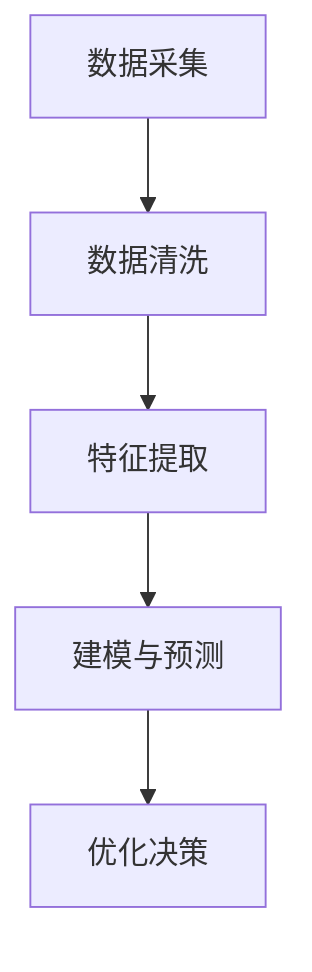

**伪代码：**

```python
# 数据清洗
data = preprocess_data(raw_data)

# 特征提取
features = extract_features(data)

# 建模与预测
model = train_model(features, labels)

# 优化决策
predictions = model.predict(new_data)
optimize_inventory(predictions)
```

**数学模型：**

```latex
P(\text{客户偏好} = c_{i}|\text{历史数据}) = \frac{f(c_{i}, \theta)}{1 + \sum_{j \neq i} f(c_{j}, \theta)}
```

其中，$P(\text{客户偏好} = c_{i}|\text{历史数据})$ 表示客户偏好为 $c_{i}$ 的概率，$f(c_{i}, \theta)$ 表示特征向量 $c_{i}$ 和参数 $\theta$ 的相似度，$\theta$ 为模型参数。

##### 4.2 库存管理优化

库存管理是餐厅运营中一个重要的环节，合理的库存管理可以提高运营效率、降低成本。AI大模型在库存管理优化中的应用主要包括以下方面：

1. **需求预测**：通过分析历史销售数据、季节性因素等，使用AI大模型预测未来一段时间内的销售需求。需求预测是库存管理优化的关键步骤，可以避免库存积压和供应不足的问题。

2. **库存优化**：基于需求预测结果，对库存进行优化。库存优化包括确定最佳库存水平、确定补货策略等。合理的库存优化可以提高库存周转率、降低库存成本。

3. **供应链协同**：通过AI大模型与供应商的协同，实现供应链的优化。例如，基于需求预测，可以与供应商协商调整采购量和采购时间，减少库存积压和物流成本。

**示例：库存管理优化算法**

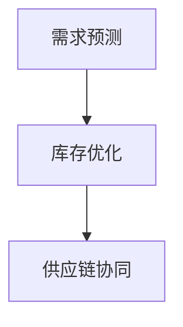

**伪代码：**

```python
# 需求预测
demand = predict_demand(sale_data, seasonality_data)

# 库存优化
inventory = optimize_inventory(demand)

# 供应链协同
supply_chain = collaborate_with_supplier(inventory)
```

**数学模型：**

```latex
D(t) = f(S(t-1), T(t)), \quad t=1,2,\ldots,T
```

其中，$D(t)$ 表示在时间 $t$ 的需求量，$S(t-1)$ 表示在时间 $t-1$ 的库存量，$T(t)$ 表示在时间 $t$ 的供应链信息。

##### 4.3 餐饮营销策略优化

餐饮营销策略的优化是提升客户满意度、增加营业额的重要手段。AI大模型在餐饮营销策略优化中的应用主要包括以下方面：

1. **客户细分**：通过分析客户的数据，使用AI大模型对客户进行细分，根据不同客户群体的特点制定个性化的营销策略。

2. **个性化推荐**：基于客户的购买历史、偏好等，使用AI大模型进行个性化推荐，提高客户满意度。个性化推荐可以包括菜品推荐、套餐推荐等。

3. **优惠券和促销活动**：通过AI大模型分析客户的购买行为和偏好，设计有针对性的优惠券和促销活动，提高营销效果。

**示例：餐饮营销策略优化算法**

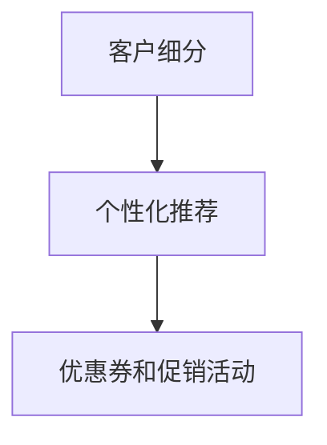

**伪代码：**

```python
# 客户细分
customer_segments = segment_customers(data)

# 个性化推荐
recommendations = personalized_recommendation(customer_segments)

# 优惠券和促销活动
coupons = design_coupons(recommendations)
```

**数学模型：**

```latex
R(t) = \arg\max_{r} \sum_{i=1}^{n} P(c_{i} \mid r) \cdot p(c_{i}, r)
```

其中，$R(t)$ 表示在时间 $t$ 的推荐策略，$c_{i}$ 表示第 $i$ 个客户，$p(c_{i}, r)$ 表示第 $i$ 个客户在推荐策略 $r$ 下的购买概率。

##### 4.4 本章总结

本章介绍了AI大模型在餐厅运营优化、库存管理优化和餐饮营销策略优化等领域的具体应用。通过客户偏好分析、需求预测和个性化推荐等，AI大模型可以显著提升餐厅的运营效率、降低成本、提高客户满意度。然而，AI大模型的应用也需要注意数据隐私、模型优化等方面的挑战。在未来，随着AI技术的不断发展和成熟，AI大模型在餐饮业的实战应用将更加广泛，为餐饮业的智能化转型提供有力支持。

### 第5章：智能点餐系统

> 智能点餐系统是餐饮业数字化转型的关键环节之一，通过AI大模型的应用，可以实现个性化推荐、精准营销和高效运营。本章将详细探讨智能点餐系统的设计、基于AI的大数据分析和智能推荐算法。

##### 5.1 智能点餐系统的设计

智能点餐系统旨在通过技术手段提升顾客点餐体验，减少人工干预，提高餐厅运营效率。设计一个智能点餐系统，需要考虑以下几个关键方面：

1. **用户界面设计**：用户界面应简洁、直观，便于顾客快速浏览菜单、下单。界面设计需考虑到不同用户群体的使用习惯，如触屏操作、语音输入等。

2. **数据采集与处理**：智能点餐系统需要收集用户点餐行为数据，如点餐频率、偏好、消费金额等。数据采集后需进行清洗、去噪、归一化等预处理，以便后续分析。

3. **用户权限管理**：为保障用户隐私和安全，系统需设计用户权限管理模块，实现用户数据的安全存储和权限控制。

4. **推荐算法集成**：智能点餐系统的核心是推荐算法，通过AI大模型分析用户数据，实现个性化推荐。推荐算法的集成需考虑算法的性能、可扩展性和实时性。

**智能点餐系统架构图**

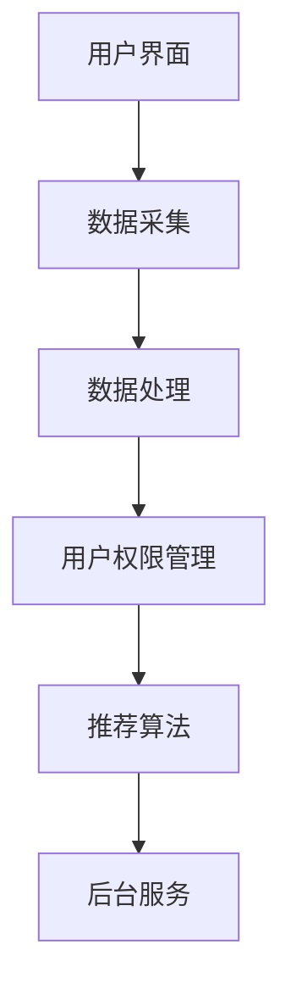

##### 5.2 基于AI的大数据分析

大数据分析在智能点餐系统中扮演着至关重要的角色，通过分析用户行为数据，可以挖掘用户偏好、消费习惯等有价值的信息，从而优化点餐体验。基于AI的大数据分析主要包括以下步骤：

1. **数据预处理**：对原始点餐数据进行清洗、去噪、归一化等预处理操作，确保数据质量。

2. **特征提取**：从预处理后的数据中提取与用户点餐行为相关的特征，如菜品种类、口味偏好、点餐时间等。

3. **数据建模**：使用机器学习算法，如回归分析、聚类分析、协同过滤等，对用户行为数据进行建模，以预测用户偏好和需求。

4. **模型评估与优化**：通过交叉验证、A/B测试等方法评估模型性能，不断调整和优化模型参数，提高预测精度。

**基于AI的大数据分析流程图**

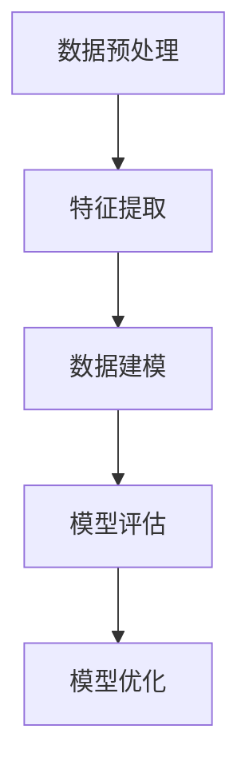

**伪代码：**

```python
# 数据预处理
preprocessed_data = preprocess_data(raw_data)

# 特征提取
features = extract_features(preprocessed_data)

# 数据建模
model = train_model(features, labels)

# 模型评估
evaluate_model(model, test_data)

# 模型优化
optimize_model(model, best_params)
```

##### 5.3 智能推荐算法

智能推荐算法是智能点餐系统的核心，通过分析用户历史行为和偏好，为用户推荐合适的菜品。常用的智能推荐算法包括以下几种：

1. **协同过滤算法**：协同过滤算法通过分析用户之间的相似性，为用户推荐相似用户喜欢的商品。协同过滤算法可分为基于用户的协同过滤和基于物品的协同过滤。

2. **基于内容的推荐**：基于内容的推荐算法通过分析用户的历史行为和偏好，将相似内容推荐给用户。例如，如果用户经常点某道菜，系统可以推荐类似口味的其他菜品。

3. **混合推荐算法**：混合推荐算法结合协同过滤和基于内容的推荐，以提高推荐精度。混合推荐算法可以更好地平衡用户兴趣和系统资源。

**智能推荐算法流程图**

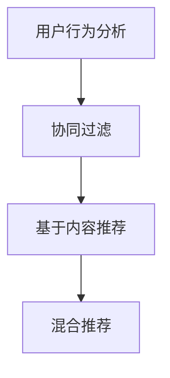

**伪代码：**

```python
# 协同过滤推荐
user_similarity = calculate_user_similarity(user_data)
recommendations = collaborative_filter(user_similarity, user_data)

# 基于内容推荐
item_similarity = calculate_item_similarity(item_data)
content_recommendations = content_based_recommendation(item_similarity, user_data)

# 混合推荐
final_recommendations = mix_recommendations(recommendations, content_recommendations)
```

**数学模型：**

协同过滤算法：

```latex
r_{ij} = \sum_{k \in N_{i}} r_{ik} r_{kj}, \quad i,j \in \{1,2,\ldots,n\}
```

其中，$r_{ij}$ 表示用户 $i$ 对商品 $j$ 的评分，$N_{i}$ 表示与用户 $i$ 相似的一组用户集合。

基于内容的推荐算法：

```latex
sim(i, j) = \frac{count(\{x \in X \mid x \in X_{i} \cap X_{j}\})}{\sqrt{count(\{x \in X \mid x \in X_{i}\}) \cdot count(\{x \in X \mid x \in X_{j}\})}}, \quad i,j \in \{1,2,\ldots,m\}
```

其中，$sim(i, j)$ 表示商品 $i$ 和商品 $j$ 的相似度，$X_{i}$ 和 $X_{j}$ 分别表示用户 $i$ 和用户 $j$ 点餐的菜品集合，$X$ 表示所有菜品的集合。

##### 5.4 本章总结

智能点餐系统通过AI大模型的应用，实现了个性化推荐、精准营销和高效运营。本章介绍了智能点餐系统的设计、基于AI的大数据分析和智能推荐算法。在未来的发展中，随着AI技术的不断进步，智能点餐系统将进一步提升餐饮业的运营效率，为顾客提供更好的点餐体验。通过不断优化和迭代，智能点餐系统有望成为餐饮业数字化转型的关键驱动力。

### 第6章：供应链管理

> 餐饮业的供应链管理是确保餐厅正常运营、提供优质菜品和服务的重要环节。AI大模型在供应链管理中发挥着重要作用，本章将探讨AI大模型在供应链管理中的应用，包括现状分析、应用场景和案例分析。

##### 6.1 供应链管理现状

餐饮业的供应链管理涉及多个环节，包括原材料采购、库存管理、物流配送和供应链协同等。然而，目前许多餐饮企业的供应链管理仍处于传统阶段，存在以下问题：

1. **信息不对称**：供应链各环节之间的信息传递不畅，导致信息不对称。例如，采购部门无法及时获取库存和销售数据，导致采购决策不准确。

2. **库存管理不规范**：库存管理缺乏标准化流程，容易出现库存积压或短缺。库存管理的非标准化导致库存成本高、库存周转率低。

3. **物流配送效率低**：物流配送过程缺乏智能化管理，导致配送时间过长、运输成本高。物流配送的效率低下会影响餐厅的运营和服务质量。

4. **供应链协同困难**：供应链各环节之间的协同困难，导致供应链的整体效率低下。例如，采购、生产和销售等环节之间的信息传递和协调不畅。

##### 6.2 AI大模型在供应链管理中的应用场景

AI大模型在供应链管理中的应用有助于解决传统供应链管理中存在的问题，提升供应链的整体效率。以下是AI大模型在供应链管理中的应用场景：

1. **需求预测**：通过AI大模型分析历史销售数据、季节性因素和市场需求等，预测未来一段时间内的销售需求。需求预测可以优化库存管理，减少库存积压和供应短缺。

2. **库存优化**：AI大模型可以根据需求预测结果，优化库存水平。通过动态调整库存量，实现库存的合理配置，降低库存成本。

3. **供应链协同**：AI大模型可以实现供应链各环节之间的协同。通过实时数据共享和智能调度，优化物流配送，提高供应链的整体效率。

4. **供应链风险预警**：AI大模型可以分析供应链中的潜在风险，如供应链中断、物流延迟等，提前预警，采取相应措施，降低风险对供应链的影响。

**AI大模型在供应链管理中的应用场景图**

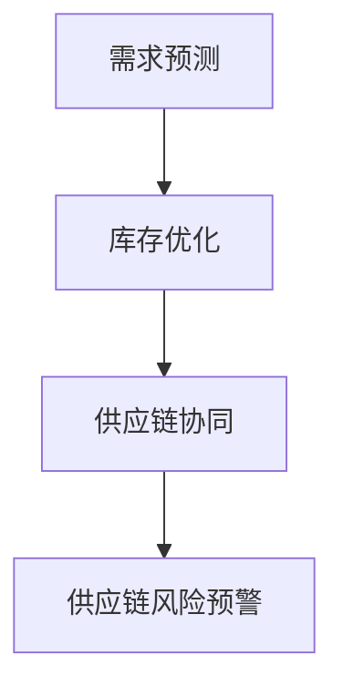

##### 6.3 案例分析：AI大模型在餐饮供应链管理中的实战应用

为了更好地理解AI大模型在餐饮供应链管理中的应用，以下是一个实战案例：

**案例：某连锁餐饮企业的供应链管理优化**

1. **需求预测**：该连锁餐饮企业使用AI大模型对历史销售数据进行分析，结合季节性因素和市场需求，预测未来三个月的销售额。通过需求预测，企业可以提前调整采购计划，避免库存积压和供应短缺。

   **伪代码：**

   ```python
   demand = predict_demand(sale_data, seasonality_data)
   ```

   **数学模型：**

   ```latex
   D(t) = f(S(t-1), T(t)), \quad t=1,2,\ldots,T
   ```

   其中，$D(t)$ 表示在时间 $t$ 的需求量，$S(t-1)$ 表示在时间 $t-1$ 的销售额，$T(t)$ 表示在时间 $t$ 的季节性因素。

2. **库存优化**：基于需求预测结果，企业使用AI大模型优化库存水平。通过动态调整库存量，实现库存的合理配置，降低库存成本。

   **伪代码：**

   ```python
   inventory = optimize_inventory(demand)
   ```

   **数学模型：**

   ```latex
   I(t) = g(D(t), C(t)), \quad t=1,2,\ldots,T
   ```

   其中，$I(t)$ 表示在时间 $t$ 的库存量，$D(t)$ 表示在时间 $t$ 的需求量，$C(t)$ 表示在时间 $t$ 的成本。

3. **供应链协同**：企业通过AI大模型实现供应链各环节之间的协同。通过实时数据共享和智能调度，优化物流配送，提高供应链的整体效率。

   **伪代码：**

   ```python
   supply_chain = collaborate_with_supplier(inventory)
   ```

   **数学模型：**

   ```latex
   L(t) = h(D(t), S(t), I(t)), \quad t=1,2,\ldots,T
   ```

   其中，$L(t)$ 表示在时间 $t$ 的物流配送效率，$D(t)$ 表示在时间 $t$ 的需求量，$S(t)$ 表示在时间 $t$ 的供应链信息，$I(t)$ 表示在时间 $t$ 的库存量。

4. **供应链风险预警**：AI大模型可以分析供应链中的潜在风险，如供应链中断、物流延迟等，提前预警，采取相应措施，降低风险对供应链的影响。

   **伪代码：**

   ```python
   risk_warning = analyze_risk(supply_chain)
   ```

   **数学模型：**

   ```latex
   R(t) = \arg\max_{r} \sum_{i=1}^{n} P(r_i|\text{供应链数据})
   ```

   其中，$R(t)$ 表示在时间 $t$ 的风险预警结果，$r_i$ 表示在时间 $t$ 的潜在风险，$P(r_i|\text{供应链数据})$ 表示风险发生的概率。

**案例总结**：

通过AI大模型的应用，该连锁餐饮企业实现了需求预测、库存优化、供应链协同和供应链风险预警。需求预测和库存优化提高了供应链的效率，降低了库存成本；供应链协同优化了物流配送，提高了整体效率；供应链风险预警降低了潜在风险对供应链的影响。该案例表明，AI大模型在餐饮供应链管理中具有广泛的应用前景。

##### 6.4 本章总结

本章探讨了AI大模型在餐饮供应链管理中的应用，包括现状分析、应用场景和案例分析。通过需求预测、库存优化、供应链协同和供应链风险预警，AI大模型可以提高供应链的效率，降低库存成本，提高整体运营效率。随着AI技术的不断发展和成熟，AI大模型在餐饮供应链管理中的应用将更加广泛，为餐饮业的智能化转型提供有力支持。

### 第7章：餐饮智能化转型

> 随着人工智能技术的不断发展，餐饮业的智能化转型已经成为行业发展的必然趋势。本章将探讨智能化餐饮的发展趋势、智能餐厅的设计与实施以及餐饮企业智能化转型的策略与路径。

##### 7.1 智能化餐饮的发展趋势

智能化餐饮是餐饮业转型升级的重要方向，通过引入人工智能、物联网、大数据等新兴技术，实现餐饮服务的智能化、个性化、高效化。智能化餐饮的发展趋势主要体现在以下几个方面：

1. **数字化服务**：餐饮企业通过数字化手段提升服务效率，如智能点餐系统、自助结算等，减少人工干预，提高服务质量。

2. **个性化体验**：智能推荐系统根据用户偏好和历史行为，为用户提供个性化的点餐推荐，提升用户满意度。

3. **供应链优化**：AI大模型在供应链管理中的应用，实现了需求预测、库存优化、物流配送等环节的智能化，提高了供应链效率。

4. **智能厨房**：智能厨房通过自动化设备和数字化管理系统，实现菜品的快速制作和精准控制，提高厨房效率。

5. **智能餐厅**：智能餐厅通过物联网、大数据等技术，实现从就餐环境到服务流程的全面智能化，提升顾客体验。

##### 7.2 智能餐厅的设计与实施

智能餐厅是餐饮智能化转型的关键环节，其设计与实施需要考虑以下几个方面：

1. **用户界面设计**：智能餐厅的用户界面应简洁、直观，便于顾客操作。界面设计需考虑不同用户群体的需求，如触屏操作、语音输入等。

2. **硬件设备配置**：智能餐厅需要配置智能点餐设备、智能厨房设备、智能结算设备等，实现餐厅各个环节的智能化。

3. **数据采集与处理**：智能餐厅需要收集用户点餐行为、消费记录等数据，通过大数据分析技术，挖掘用户偏好和需求。

4. **智能推荐系统**：基于用户数据和AI大模型，实现个性化推荐，提升用户满意度。

5. **供应链协同**：通过物联网技术，实现供应链各环节的实时数据共享和智能调度，提高供应链效率。

6. **智能厨房管理**：通过智能设备和数字化管理系统，实现菜品的快速制作和精准控制，提高厨房效率。

**智能餐厅设计与实施流程图**

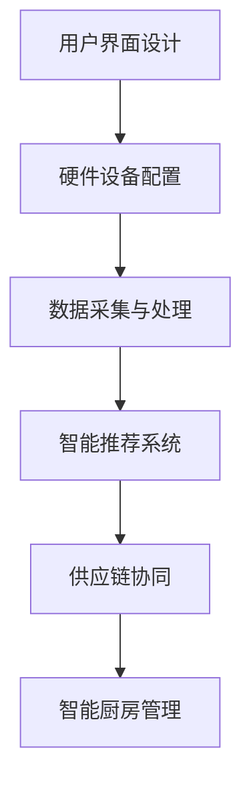

##### 7.3 餐饮企业智能化转型的策略与路径

餐饮企业进行智能化转型需要制定明确的策略与路径，以下是几个关键策略：

1. **顶层设计**：企业需要制定智能化转型的战略规划，明确转型目标、时间表和资源配置。

2. **技术引进**：引进先进的人工智能、物联网、大数据等技术，提升企业的技术实力和创新能力。

3. **人才培养**：培养专业的技术人才和管理人才，确保智能化转型顺利进行。

4. **业务流程优化**：通过智能化技术，优化业务流程，提高运营效率和服务质量。

5. **数据驱动**：以数据为驱动，通过大数据分析，挖掘用户需求和潜在商机，制定个性化策略。

6. **协同发展**：与产业链上下游企业合作，实现供应链协同和资源整合，提升整体竞争力。

**餐饮企业智能化转型策略与路径图**

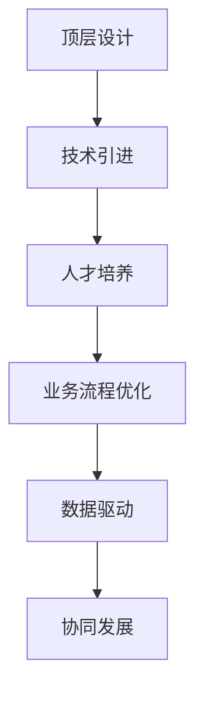

##### 7.4 本章总结

智能化转型是餐饮业发展的必然趋势，通过引入人工智能、物联网、大数据等新兴技术，餐饮企业可以实现服务智能化、个性化、高效化。智能餐厅的设计与实施、供应链优化以及智能化转型的策略与路径，为餐饮业的智能化转型提供了有力支持。随着技术的不断进步和市场的成熟，餐饮业的智能化转型将逐步深化，为消费者带来更加便捷、优质的餐饮体验。

### 第三部分：AI大模型应用案例分析

#### 第8章：成功案例分享

在本章中，我们将分享一些成功应用AI大模型于餐饮业的案例，分析其实际应用效果，并提供相应的总结与启示，以期为餐饮企业的AI应用提供参考。

##### 8.1 某知名餐饮企业的AI大模型应用案例

**案例背景**：

某知名餐饮企业，拥有多家分店，致力于为消费者提供高质量的餐饮服务。随着市场竞争的加剧，该企业希望通过引入AI大模型来提升运营效率、优化客户体验和增强竞争优势。

**应用场景**：

1. **客户偏好分析**：通过AI大模型对客户的点餐数据进行挖掘和分析，了解客户的口味偏好、饮食习惯等，为菜品的调整和库存管理提供依据。

2. **智能点餐系统**：企业开发了一套智能点餐系统，利用AI大模型进行个性化推荐，提高客户的点餐体验。该系统还可以根据客户的历史数据和实时信息，推荐合适的菜品和套餐。

3. **供应链管理**：AI大模型在供应链管理中的应用，包括需求预测、库存优化和物流配送优化，以实现供应链的高效运作。

**应用效果**：

1. **客户满意度提升**：智能点餐系统的个性化推荐功能受到了客户的欢迎，客户满意度显著提高。

2. **运营效率提升**：通过AI大模型优化供应链管理，企业实现了库存的合理配置和物流配送的优化，运营效率大幅提升。

3. **成本降低**：通过需求预测和库存优化，企业减少了库存积压和供应短缺的情况，降低了库存成本和物流成本。

**案例总结与启示**：

该案例表明，AI大模型在餐饮业中的应用能够显著提升运营效率、优化客户体验并降低成本。餐饮企业应积极引入AI大模型，通过大数据分析和个性化推荐，实现服务智能化。同时，供应链管理的优化也是提升企业竞争力的重要途径，企业可以通过需求预测、库存优化和物流配送优化，实现供应链的高效运作。

##### 8.2 某新型餐饮业态的AI大模型应用

**案例背景**：

某新型餐饮业态，以健康饮食和个性化服务为特色，通过创新的商业模式和科技手段，迅速占领市场。为了保持竞争优势，该餐饮企业积极引入AI大模型，提升服务质量和运营效率。

**应用场景**：

1. **健康饮食推荐**：AI大模型根据客户的健康状况、饮食习惯和偏好，推荐符合健康标准的菜品，提高客户满意度。

2. **智能点餐与结算**：通过智能点餐系统和自助结算设备，实现点餐过程的智能化和快捷化，提升客户体验。

3. **智能厨房管理**：智能厨房通过自动化设备和数字化管理系统，实现菜品的快速制作和精准控制，提高厨房效率。

**应用效果**：

1. **客户体验优化**：智能点餐系统和自助结算设备得到了客户的广泛好评，客户满意度显著提升。

2. **厨房效率提高**：智能厨房管理系统的应用，使菜品的制作过程更加高效和精准，减少了人为误差和食材浪费。

3. **运营成本降低**：通过智能点餐和自助结算设备，企业减少了人工成本，提高了运营效率。

**案例总结与启示**：

该案例展示了AI大模型在新型餐饮业态中的应用潜力。通过健康饮食推荐、智能点餐与结算、智能厨房管理，新型餐饮业态能够为消费者提供更优质的餐饮体验，同时提升运营效率、降低成本。餐饮企业应根据自身特点和市场需求，积极探索AI大模型的应用，以实现服务智能化和运营高效化。

##### 8.3 案例总结与启示

通过对上述两个案例的分析，我们可以得出以下总结与启示：

1. **AI大模型提升运营效率**：AI大模型在餐饮业中的应用，能够通过需求预测、库存优化和供应链管理，显著提升运营效率，降低库存成本和物流成本。

2. **个性化推荐提高客户满意度**：智能点餐系统的个性化推荐功能，能够根据客户的历史数据和偏好，提供个性化的餐饮服务，提高客户满意度。

3. **智能厨房管理提高生产效率**：智能厨房管理系统的应用，可以实现菜品的快速制作和精准控制，提高厨房效率，减少食材浪费。

4. **科技创新驱动商业模式变革**：AI大模型的应用，不仅能够提升运营效率和服务质量，还能够推动餐饮企业的商业模式变革，实现服务智能化和运营高效化。

5. **持续创新与优化**：餐饮企业在应用AI大模型时，应不断进行技术创新和优化，以应对市场的变化和客户需求，保持竞争优势。

总之，AI大模型在餐饮业的应用具有巨大的潜力，通过需求预测、库存优化、智能点餐、供应链管理和智能厨房管理等应用，能够显著提升餐饮企业的运营效率、客户满意度和市场竞争力。餐饮企业应积极探索AI大模型的应用，实现服务智能化和运营高效化，以适应未来市场的发展趋势。

### 附录

#### 附录A：AI大模型开发工具与资源

**A.1 开发环境搭建**

要开发AI大模型，首先需要搭建合适的开发环境。以下是一些常用的开发工具和框架：

1. **Python**：Python是AI开发中最常用的编程语言，具有丰富的库和框架支持。
2. **Jupyter Notebook**：Jupyter Notebook是一个交互式开发环境，适用于数据分析和模型训练。
3. **TensorFlow**：TensorFlow是Google开发的开源深度学习框架，支持多种神经网络模型。
4. **PyTorch**：PyTorch是Facebook开发的开源深度学习框架，具有灵活的动态计算图和丰富的API。
5. **GPU支持**：为了加速模型训练，推荐使用配备NVIDIA GPU的计算机。

**A.2 开发工具与框架**

以下是常用的AI大模型开发工具和框架：

1. **TensorFlow**：提供丰富的API和预训练模型，适用于各种深度学习任务。
2. **PyTorch**：具有动态计算图和灵活的模型构建功能，适用于研究性和工程应用。
3. **Keras**：一个基于TensorFlow和Theano的简单、模块化的深度学习库。
4. **Hugging Face Transformers**：提供了一系列预训练的模型和工具，方便使用大型语言模型。
5. **Scikit-learn**：适用于传统机器学习和数据挖掘任务，具有丰富的算法和工具。

**A.3 相关资源链接**

以下是AI大模型开发的一些相关资源和链接：

1. **TensorFlow官网**：[https://www.tensorflow.org/](https://www.tensorflow.org/)
2. **PyTorch官网**：[https://pytorch.org/](https://pytorch.org/)
3. **Keras官网**：[https://keras.io/](https://keras.io/)
4. **Hugging Face官网**：[https://huggingface.co/](https://huggingface.co/)
5. **Google AI博客**：[https://ai.googleblog.com/](https://ai.googleblog.com/)
6. **AI天才研究院**：[https://www.aigenius.ai/](https://www.aigenius.ai/)

#### 附录B：AI大模型应用Mermaid流程图

**B.1 餐饮运营优化流程**

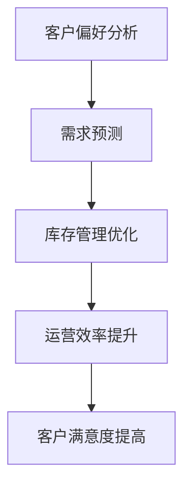

**B.2 智能点餐系统流程**

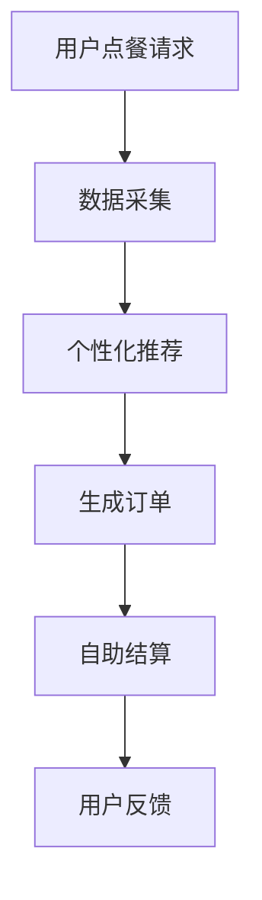

**B.3 供应链管理流程**

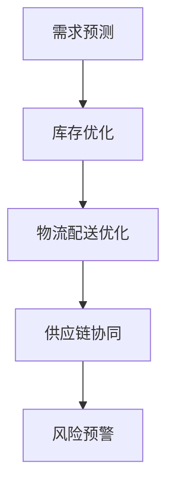

#### 附录C：核心算法原理与伪代码

**C.1 客户偏好分析算法**

**算法描述**：

客户偏好分析算法通过分析客户的点餐数据，提取出与客户偏好相关的特征，使用机器学习模型预测客户未来的点餐行为。

**伪代码**：

```python
# 数据预处理
preprocessed_data = preprocess_data(raw_data)

# 特征提取
features = extract_features(preprocessed_data)

# 建模
model = train_model(features, labels)

# 预测
predictions = model.predict(new_data)
```

**数学模型**：

```latex
P(\text{客户偏好} = c_{i}|\text{历史数据}) = \frac{f(c_{i}, \theta)}{1 + \sum_{j \neq i} f(c_{j}, \theta)}
```

**C.2 库存管理优化算法**

**算法描述**：

库存管理优化算法通过预测需求，优化库存水平，减少库存成本。

**伪代码**：

```python
# 需求预测
demand = predict_demand(sale_data, seasonality_data)

# 库存优化
inventory = optimize_inventory(demand)
```

**数学模型**：

```latex
D(t) = f(S(t-1), T(t)), \quad t=1,2,\ldots,T
```

**C.3 智能推荐算法**

**算法描述**：

智能推荐算法通过分析用户历史行为和偏好，为用户推荐合适的菜品或套餐。

**伪代码**：

```python
# 用户行为分析
user_similarity = calculate_user_similarity(user_data)

# 推荐算法
recommendations = collaborative_filter(user_similarity, user_data)
```

**数学模型**：

```latex
r_{ij} = \sum_{k \in N_{i}} r_{ik} r_{kj}, \quad i,j \in \{1,2,\ldots,n\}
```

#### 附录D：项目实战

**D.1 餐厅运营优化项目实战**

**项目背景**：

某餐厅希望通过AI大模型优化运营管理，提高运营效率。

**项目目标**：

1. 预测客户需求
2. 优化库存管理
3. 提高运营效率

**项目步骤**：

1. 数据收集：收集餐厅的历史销售数据、客户点餐数据等。
2. 数据预处理：清洗、去噪、归一化数据。
3. 特征提取：提取与客户需求相关的特征。
4. 模型训练：使用机器学习算法训练预测模型。
5. 预测与优化：使用模型预测客户需求，优化库存管理。

**代码实现**：

```python
# 数据预处理
data = preprocess_data(raw_data)

# 特征提取
features = extract_features(data)

# 模型训练
model = train_model(features, labels)

# 预测与优化
predictions = model.predict(new_data)
optimize_inventory(predictions)
```

**D.2 智能点餐系统项目实战**

**项目背景**：

某餐厅开发智能点餐系统，为用户提供个性化推荐。

**项目目标**：

1. 提供个性化点餐推荐
2. 提高用户满意度
3. 提升运营效率

**项目步骤**：

1. 数据收集：收集用户的历史点餐数据、偏好数据等。
2. 数据预处理：清洗、去噪、归一化数据。
3. 特征提取：提取与用户偏好相关的特征。
4. 模型训练：使用机器学习算法训练推荐模型。
5. 推荐系统实现：根据用户数据生成个性化推荐。

**代码实现**：

```python
# 用户行为分析
user_similarity = calculate_user_similarity(user_data)

# 推荐算法
recommendations = collaborative_filter(user_similarity, user_data)
```

**D.3 供应链管理项目实战**

**项目背景**：

某餐厅希望通过AI大模型优化供应链管理，提高供应链效率。

**项目目标**：

1. 预测需求
2. 优化库存
3. 优化物流

**项目步骤**：

1. 数据收集：收集销售数据、库存数据、物流数据等。
2. 数据预处理：清洗、去噪、归一化数据。
3. 特征提取：提取与需求预测、库存管理、物流优化相关的特征。
4. 模型训练：使用机器学习算法训练预测模型。
5. 预测与优化：使用模型预测需求，优化库存和物流。

**代码实现**：

```python
# 需求预测
demand = predict_demand(sale_data, seasonality_data)

# 库存优化
inventory = optimize_inventory(demand)

# 物流优化
supply_chain = collaborate_with_supplier(inventory)
```

#### 附录E：数学模型与公式

**E.1 客户偏好分析模型**

**模型描述**：

客户偏好分析模型通过分析客户的历史点餐数据，预测客户对某种菜品的偏好概率。

**数学模型**：

```latex
P(\text{客户偏好} = c_{i}|\text{历史数据}) = \frac{f(c_{i}, \theta)}{1 + \sum_{j \neq i} f(c_{j}, \theta)}
```

**E.2 库存管理模型**

**模型描述**：

库存管理模型通过预测需求，确定最优库存水平。

**数学模型**：

```latex
D(t) = f(S(t-1), T(t)), \quad t=1,2,\ldots,T
```

**E.3 智能推荐模型**

**模型描述**：

智能推荐模型通过分析用户历史行为和偏好，为用户推荐合适的菜品或套餐。

**数学模型**：

```latex
r_{ij} = \sum_{k \in N_{i}} r_{ik} r_{kj}, \quad i,j \in \{1,2,\ldots,n\}
```

### 作者信息

**作者：AI天才研究院/AI Genius Institute & 禅与计算机程序设计艺术 /Zen And The Art of Computer Programming**

