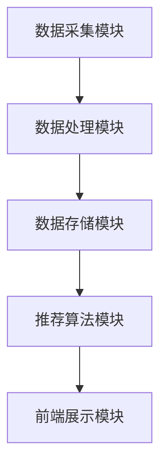

                 

# 《推荐系统中的多样性与新颖性：大模型平衡》

## 关键词
推荐系统，多样性，新颖性，大模型，平衡，多任务学习，元学习，实时推荐系统

## 摘要
随着互联网的迅猛发展，推荐系统已成为现代信息流的核心。然而，推荐系统中的多样性与新颖性成为了亟待解决的问题。本文将深入探讨推荐系统中的多样性与新颖性，分析大模型在这两个方面的应用与挑战，并提出多任务学习和元学习等解决方案。通过本文的讨论，我们期望为推荐系统的优化提供新的视角和思路。

### 目录大纲

#### 第一部分：推荐系统基础

1. 推荐系统概述
   1.1 推荐系统的定义与作用
   1.2 推荐系统的发展历程
   1.3 推荐系统的主要类型

2. 推荐系统中的多样性
   2.1 多样性的概念与重要性
   2.2 多样性的度量方法
   2.3 多样性在推荐系统中的应用

3. 推荐系统中的新颖性
   3.1 新颖性的概念与重要性
   3.2 新颖性的度量方法
   3.3 新颖性在推荐系统中的应用

#### 第二部分：大模型在推荐系统中的应用

4. 大模型在推荐系统中的作用
   4.1 大模型的基本概念
   4.2 大模型在推荐系统中的优势
   4.3 大模型在推荐系统中的应用案例

5. 大模型在多样性管理中的应用
   5.1 大模型在多样性度量中的应用
   5.2 大模型在多样性优化中的应用
   5.3 大模型在多样性评估中的应用

6. 大模型在新颖性管理中的应用
   6.1 大模型在新颖性度量中的应用
   6.2 大模型在新颖性优化中的应用
   6.3 大模型在新颖性评估中的应用

#### 第三部分：平衡多样性与新颖性

7. 平衡多样性与新颖性的挑战
   7.1 多样性优化与新意性优化之间的冲突
   7.2 挑战与解决方案
   7.3 平衡多样性与新意性的重要性

8. 多任务学习与元学习
   8.1 多任务学习的基本原理
   8.2 多任务学习在多样性优化中的应用
   8.3 元学习的基本原理
   8.4 元学习在新意性优化中的应用

9. 实时推荐系统
   9.1 实时推荐系统的概念与特点
   9.2 实时推荐系统的架构
   9.3 大模型在实时推荐系统中的应用

10. 总结与展望
    10.1 推荐系统的发展趋势
    10.2 大模型在推荐系统中的未来应用
    10.3 多样性与新颖性在推荐系统中的未来研究

### 附录

A. 推荐系统常用工具与库

B. 大模型训练与优化技巧

C. 参考文献

---

接下来，我们将详细探讨推荐系统中的多样性与新颖性，分析大模型在其中的作用和挑战，以及如何通过多任务学习和元学习来实现多样性和新颖性的平衡。

### 第一部分：推荐系统基础

#### 第1章：推荐系统概述

##### 1.1 推荐系统的定义与作用

推荐系统是一种信息过滤技术，旨在根据用户的兴趣和行为向他们推荐相关的物品或内容。其核心思想是通过分析用户的历史行为和偏好，预测用户可能感兴趣的新物品，从而提高用户满意度和参与度。

推荐系统的作用主要体现在以下几个方面：

1. **提升用户体验**：通过个性化推荐，用户能够更快速地找到他们感兴趣的内容，节省了寻找信息的时间和精力。
2. **增加用户粘性**：推荐系统能够为用户提供新鲜、有吸引力的内容，提高用户在平台上的停留时间和活跃度。
3. **促进商业增长**：推荐系统能够帮助平台商家更好地了解用户需求，提高销售额和用户转化率。

##### 1.2 推荐系统的发展历程

推荐系统的发展历程可以分为以下几个阶段：

1. **基于内容的推荐**：最早的推荐系统主要基于物品的属性和用户的兴趣进行匹配。这种方法简单直观，但容易导致信息过载和个性化不足。

2. **协同过滤推荐**：协同过滤推荐通过分析用户行为数据（如购买记录、评分历史）来发现相似的用户或物品，从而进行推荐。这种方法解决了信息过载问题，但存在数据稀疏性和冷启动问题。

3. **混合推荐**：混合推荐结合了基于内容和协同过滤推荐的方法，通过综合分析物品的属性和用户的行为来提高推荐效果。

4. **基于模型的推荐**：基于模型的推荐系统利用机器学习算法，如线性回归、逻辑回归、神经网络等，建立用户和物品之间的关系模型，进行推荐。

5. **深度学习推荐**：随着深度学习技术的发展，深度学习推荐系统利用神经网络（如卷积神经网络、循环神经网络、Transformer模型等）进行特征提取和关系建模，取得了显著的推荐效果。

##### 1.3 推荐系统的主要类型

推荐系统根据不同的分类标准可以有不同的类型：

1. **基于内容的推荐**：基于物品的属性和用户的兴趣标签进行推荐。
2. **协同过滤推荐**：基于用户的行为数据和物品间的相似性进行推荐。
3. **混合推荐**：结合多种推荐方法进行推荐。
4. **基于模型的推荐**：利用机器学习算法建立用户和物品的关系模型进行推荐。
5. **基于深度学习的推荐**：利用深度学习模型进行特征提取和关系建模。

在接下来的章节中，我们将深入探讨推荐系统中的多样性和新颖性，以及大模型在这两个方面的应用。

### 第2章：推荐系统中的多样性

##### 2.1 多样性的概念与重要性

多样性（Diversity）是指在推荐列表中包含不同类型或风格的物品，以避免推荐结果的同质化和单一化。多样性的核心目标是确保推荐结果能够满足不同用户的不同兴趣和需求。

多样性的重要性体现在以下几个方面：

1. **提高用户满意度**：用户希望在推荐列表中看到丰富多样的内容，以满足他们的不同需求和兴趣。缺乏多样性的推荐结果可能导致用户感到乏味和不满，从而降低用户满意度和参与度。
2. **增加用户探索机会**：多样化的推荐能够引导用户发现他们可能未知或未尝试过的物品，从而增加用户探索新内容的机会。
3. **提升平台价值**：平台通过提供多样化推荐，能够吸引更多用户，提高用户留存率和活跃度，从而增加平台的商业价值。

##### 2.2 多样性的度量方法

多样性的度量方法主要包括以下几种：

1. **信息熵（Entropy）**：信息熵是衡量推荐列表多样性的一种常用方法。其基本思想是，推荐列表中物品的多样性越高，信息熵越大。具体公式如下：
   $$
   D = -\sum_{i=1}^{N} p_i \cdot \log_2(p_i)
   $$
   其中，$D$表示多样性，$p_i$表示推荐列表中第$i$个物品出现的概率。

2. **逆多样性（Inverse Diversity）**：逆多样性是另一种常用的多样性度量方法，其基本思想是，推荐列表中相邻物品的多样性越高，逆多样性值越小。具体公式如下：
   $$
   D = \sum_{i=1}^{N} (1 - p_i)
   $$
   其中，$D$表示多样性，$p_i$表示推荐列表中第$i$个物品出现的概率。

3. **集合交并比（Jaccard Similarity）**：集合交并比是衡量两个集合相似度的一种方法，也常用于多样性度量。其基本思想是，推荐列表中相邻物品的集合交并比越小，多样性越高。具体公式如下：
   $$
   D = 1 - \frac{|A \cap B|}{|A \cup B|}
   $$
   其中，$D$表示多样性，$A$和$B$分别表示推荐列表中相邻两个物品的集合。

##### 2.3 多样性在推荐系统中的应用

多样性在推荐系统中的应用主要体现在以下几个方面：

1. **推荐列表生成**：在推荐列表生成过程中，多样性算法可以与评分预测算法相结合，通过优化推荐列表的多样性来提高推荐效果。常用的多样性算法包括基于信息熵的多样性优化算法和基于逆多样性的多样性优化算法。

2. **多样性约束优化**：在推荐系统优化过程中，多样性约束可以通过限制推荐列表中相邻物品的相似度来提高多样性。例如，可以使用基于集合交并比的多样性约束，确保推荐列表中的物品具有较低的相似度。

3. **多样性评估**：在推荐系统评估过程中，多样性指标可以用来衡量推荐结果的质量。通过评估多样性指标，可以及时发现推荐系统的不足，并进行优化。

在接下来的章节中，我们将进一步探讨推荐系统中的新颖性，以及大模型在新颖性管理中的应用。

### 第3章：推荐系统中的新颖性

##### 3.1 新颖性的概念与重要性

新颖性（Novelty）是指在推荐列表中包含新颖、独特的内容，以避免推荐结果的重复和陈旧。新颖性的核心目标是确保推荐结果能够为用户提供新鲜、有吸引力的内容。

新颖性的重要性体现在以下几个方面：

1. **提高用户满意度**：用户希望在推荐列表中看到新颖、独特的内容，以满足他们的好奇心和探索欲望。缺乏新颖性的推荐结果可能导致用户感到无聊和失望，从而降低用户满意度和参与度。
2. **增加用户粘性**：新颖性推荐能够吸引更多用户，提高用户在平台上的停留时间和活跃度，从而增加平台的用户粘性。
3. **提升平台竞争力**：通过提供新颖性推荐，平台能够在激烈的市场竞争中脱颖而出，吸引更多用户。

##### 3.2 新颖性的度量方法

新颖性的度量方法主要包括以下几种：

1. **新颖性分数（Novelty Score）**：新颖性分数是衡量推荐列表新颖性的一种方法，其基本思想是，推荐列表中物品的新颖性越高，新颖性分数越大。具体公式如下：
   $$
   N = \frac{1}{N_c} \sum_{i=1}^{N_c} \log_2(1 + f_i)
   $$
   其中，$N$表示新颖性分数，$N_c$表示推荐列表中物品的数量，$f_i$表示推荐列表中第$i$个物品的流行度。

2. **流行度衰减（Popularity Decay）**：流行度衰减是衡量推荐列表新颖性的一种方法，其基本思想是，推荐列表中物品的流行度越高，新颖性越低。具体公式如下：
   $$
   N = \frac{1}{N_c} \sum_{i=1}^{N_c} \frac{1}{1 + \alpha \cdot f_i}
   $$
   其中，$N$表示新颖性分数，$N_c$表示推荐列表中物品的数量，$f_i$表示推荐列表中第$i$个物品的流行度，$\alpha$是一个调节参数。

3. **新颖性偏好（Novelty Preference）**：新颖性偏好是衡量推荐列表新颖性的一种方法，其基本思想是，根据用户的历史行为和兴趣，为推荐列表中的物品分配新颖性偏好值。具体公式如下：
   $$
   N = \sum_{i=1}^{N_c} p_i \cdot n_i
   $$
   其中，$N$表示新颖性分数，$N_c$表示推荐列表中物品的数量，$p_i$表示推荐列表中第$i$个物品的优先级，$n_i$表示推荐列表中第$i$个物品的新颖性值。

##### 3.3 新颖性在推荐系统中的应用

新颖性在推荐系统中的应用主要体现在以下几个方面：

1. **推荐列表生成**：在推荐列表生成过程中，新颖性算法可以与评分预测算法相结合，通过优化推荐列表的新颖性来提高推荐效果。常用的新颖性算法包括基于新颖性分数的优化算法和基于流行度衰减的优化算法。

2. **新颖性约束优化**：在推荐系统优化过程中，新颖性约束可以通过限制推荐列表中重复和陈旧物品的出现次数来提高新颖性。例如，可以使用新颖性偏好约束，确保推荐列表中的物品具有较高的新颖性。

3. **新颖性评估**：在推荐系统评估过程中，新颖性指标可以用来衡量推荐结果的质量。通过评估新颖性指标，可以及时发现推荐系统的不足，并进行优化。

在接下来的章节中，我们将探讨大模型在推荐系统中的应用，以及如何通过大模型实现多样性和新颖性的管理。

### 第二部分：大模型在推荐系统中的应用

#### 第4章：大模型在推荐系统中的作用

##### 4.1 大模型的基本概念

大模型（Large-scale Model）是指具有海量参数和强大计算能力的机器学习模型，通常基于深度学习技术构建。大模型能够处理复杂的任务，并从海量数据中提取出有价值的信息。

大模型的基本概念包括以下几个方面：

1. **深度学习**：深度学习是一种基于多层神经网络的机器学习技术，能够自动提取数据中的特征。深度学习模型通过层层堆叠的神经网络，将原始数据映射到高维特征空间，从而实现复杂任务的求解。
2. **海量参数**：大模型具有海量的参数，这些参数通过学习数据中的模式，能够捕捉数据中的复杂关系。海量参数使得大模型能够处理大规模的数据集，并实现高性能的预测和分类。
3. **计算能力**：大模型通常依赖于高性能计算资源，如GPU和TPU，以实现高效的模型训练和推理。计算能力的提升使得大模型能够处理更复杂的任务，并在实际应用中取得显著的性能提升。

##### 4.2 大模型在推荐系统中的优势

大模型在推荐系统中具有以下优势：

1. **高性能预测**：大模型能够从海量数据中提取出有价值的信息，实现高性能的预测和分类。这使得推荐系统能够更准确地预测用户兴趣，并提供更精确的推荐结果。
2. **多任务处理**：大模型能够同时处理多个任务，如用户兴趣预测、物品推荐、多样性优化等。这使得推荐系统可以更加灵活地应对复杂的任务需求，提高推荐效果。
3. **自适应学习能力**：大模型具有强大的自适应学习能力，能够根据用户的行为和反馈实时调整推荐策略，提高推荐系统的自适应性和用户体验。
4. **可解释性**：大模型通过多层神经网络对数据进行处理，能够自动提取出数据中的特征和模式。这使得推荐系统具有较好的可解释性，便于调试和优化。

##### 4.3 大模型在推荐系统中的应用案例

大模型在推荐系统中已有多个应用案例，以下是一些典型的应用场景：

1. **商品推荐**：电商平台的推荐系统利用大模型对用户的历史行为和兴趣进行建模，实现精准的商品推荐。例如，淘宝、京东等电商平台通过大模型实现了基于用户行为的商品推荐，显著提高了用户购物体验和销售额。
2. **新闻推荐**：新闻平台的推荐系统利用大模型对用户兴趣和新闻内容进行建模，实现个性化的新闻推荐。例如，今日头条等新闻客户端通过大模型实现了基于用户兴趣的个性化新闻推荐，吸引了大量用户。
3. **音乐推荐**：音乐平台的推荐系统利用大模型对用户行为和音乐内容进行建模，实现个性化的音乐推荐。例如，网易云音乐等音乐平台通过大模型实现了基于用户行为的个性化音乐推荐，提高了用户听歌体验。
4. **电影推荐**：电影平台的推荐系统利用大模型对用户行为和电影内容进行建模，实现个性化的电影推荐。例如，腾讯视频等电影平台通过大模型实现了基于用户行为的个性化电影推荐，提高了用户观影体验。

在接下来的章节中，我们将探讨大模型在多样性和新颖性管理中的应用。

### 第5章：大模型在多样性管理中的应用

##### 5.1 大模型在多样性度量中的应用

多样性的度量是多样性管理的基础，大模型在多样性度量中具有显著优势。以下是一些大模型在多样性度量中的应用方法：

1. **基于模型的可视化**：大模型能够自动提取数据中的特征和模式，并通过可视化技术展示推荐列表的多样性。例如，可以使用t-SNE或UMAP等技术，将高维特征空间映射到二维或三维空间，从而直观地展示推荐列表的多样性分布。

   ```mermaid
   graph TD
   A[原始数据] --> B[特征提取]
   B --> C[可视化]
   C --> D[多样性度量]
   ```

2. **基于模型的多样性指标计算**：大模型可以通过训练得到多样性预测模型，将推荐列表中的物品映射到高维特征空间，并计算多样性指标。例如，可以使用信息熵、逆多样性等指标，评估推荐列表的多样性。

   ```mermaid
   graph TD
   A[推荐列表] --> B[特征提取]
   B --> C[多样性预测模型]
   C --> D[多样性指标计算]
   ```

##### 5.2 大模型在多样性优化中的应用

大模型在多样性优化中的应用主要包括以下几种方法：

1. **多样性强化学习**：利用强化学习算法，将多样性作为奖励信号，引导模型在推荐过程中提高多样性。例如，可以使用强化学习算法，将用户满意度、推荐点击率等指标与多样性进行结合，优化推荐策略。

   ```mermaid
   graph TD
   A[用户行为] --> B[多样性指标]
   B --> C[强化学习模型]
   C --> D[推荐策略]
   ```

2. **多样性约束优化**：在推荐过程中，通过设置多样性约束，限制推荐列表中相邻物品的相似度。例如，可以使用基于集合交并比的多样性约束，确保推荐列表中的物品具有较高的多样性。

   ```mermaid
   graph TD
   A[推荐列表] --> B[多样性约束]
   B --> C[优化目标]
   C --> D[推荐策略]
   ```

##### 5.3 大模型在多样性评估中的应用

大模型在多样性评估中的应用主要包括以下几种方法：

1. **多样性指标评估**：通过计算推荐列表的多样性指标，如信息熵、逆多样性等，评估多样性优化效果。例如，可以使用平均多样性指标、标准差等统计指标，评估多样性优化策略的有效性。

   ```mermaid
   graph TD
   A[多样性指标] --> B[评估指标]
   B --> C[评估结果]
   ```

2. **用户满意度评估**：通过用户对推荐结果的满意度评价，评估多样性优化策略的用户体验效果。例如，可以使用问卷调查、用户点击率等指标，评估多样性优化策略对用户满意度的影响。

   ```mermaid
   graph TD
   A[用户满意度] --> B[评估指标]
   B --> C[评估结果]
   ```

在接下来的章节中，我们将探讨大模型在新颖性管理中的应用。

### 第6章：大模型在新颖性管理中的应用

##### 6.1 大模型在新颖性度量中的应用

新颖性的度量是新颖性管理的基础，大模型在新颖性度量中具有显著优势。以下是一些大模型在新颖性度量中的应用方法：

1. **基于模型的特征提取**：大模型能够自动提取数据中的特征和模式，将推荐列表中的物品映射到高维特征空间，从而衡量新颖性。例如，可以使用卷积神经网络（CNN）或循环神经网络（RNN）等模型，对推荐列表中的物品进行特征提取。

   ```mermaid
   graph TD
   A[推荐列表] --> B[特征提取模型]
   B --> C[特征空间]
   C --> D[新颖性度量]
   ```

2. **基于模型的流行度预测**：大模型可以通过训练得到流行度预测模型，预测推荐列表中物品的流行度，从而衡量新颖性。例如，可以使用Transformer模型等大模型，对推荐列表中的物品进行流行度预测。

   ```mermaid
   graph TD
   A[推荐列表] --> B[流行度预测模型]
   B --> C[流行度预测]
   C --> D[新颖性度量]
   ```

##### 6.2 大模型在新颖性优化中的应用

大模型在新颖性优化中的应用主要包括以下几种方法：

1. **新颖性强化学习**：利用强化学习算法，将新颖性作为奖励信号，引导模型在推荐过程中提高新颖性。例如，可以使用强化学习算法，将用户满意度、推荐点击率等指标与新颖性进行结合，优化推荐策略。

   ```mermaid
   graph TD
   A[用户行为] --> B[新颖性指标]
   B --> C[强化学习模型]
   C --> D[推荐策略]
   ```

2. **新颖性约束优化**：在推荐过程中，通过设置新颖性约束，限制推荐列表中重复和陈旧的物品。例如，可以使用新颖性偏好约束，确保推荐列表中的物品具有较高的新颖性。

   ```mermaid
   graph TD
   A[推荐列表] --> B[新颖性约束]
   B --> C[优化目标]
   C --> D[推荐策略]
   ```

##### 6.3 大模型在新颖性评估中的应用

大模型在新颖性评估中的应用主要包括以下几种方法：

1. **新颖性指标评估**：通过计算推荐列表的新颖性指标，如新颖性分数、流行度衰减等，评估新颖性优化效果。例如，可以使用平均新颖性指标、标准差等统计指标，评估新颖性优化策略的有效性。

   ```mermaid
   graph TD
   A[新颖性指标] --> B[评估指标]
   B --> C[评估结果]
   ```

2. **用户满意度评估**：通过用户对推荐结果的满意度评价，评估新颖性优化策略的用户体验效果。例如，可以使用问卷调查、用户点击率等指标，评估新颖性优化策略对用户满意度的影响。

   ```mermaid
   graph TD
   A[用户满意度] --> B[评估指标]
   B --> C[评估结果]
   ```

在接下来的章节中，我们将探讨如何平衡多样性与新颖性，以及多任务学习和元学习在其中的应用。

### 第三部分：平衡多样性与新颖性

#### 第7章：平衡多样性与新颖性的挑战

##### 7.1 多样性优化与新意性优化之间的冲突

多样性与新颖性在推荐系统中具有不同的目标，二者之间存在一定的冲突。以下是一些具体的冲突表现：

1. **用户满意度冲突**：多样性优化倾向于提高推荐列表中不同类型物品的比例，从而满足用户的多样需求。而新颖性优化则倾向于推荐新颖、独特的物品，以满足用户的好奇心和探索欲望。这可能导致用户在多样性和新颖性之间产生满意度冲突。
2. **推荐效果冲突**：多样性优化可能导致推荐列表中某些物品的评分较低，从而影响推荐效果。而新颖性优化可能导致推荐列表中某些流行度较低的物品，从而降低推荐效果。这可能导致推荐系统在多样性和新颖性之间产生推荐效果冲突。
3. **资源冲突**：多样性和新颖性的优化都需要计算资源和时间成本。在某些情况下，为了提高多样性和新颖性，可能需要增加计算资源的投入。这可能导致资源分配上的冲突，影响推荐系统的整体性能。

##### 7.2 挑战与解决方案

为了平衡多样性与新颖性，需要解决以下挑战：

1. **优化目标冲突**：在推荐系统中，需要同时优化多样性和新颖性，这可能导致优化目标之间的冲突。为了解决这个问题，可以采用多目标优化算法，将多样性和新颖性作为两个相互独立的优化目标，进行协同优化。
2. **资源分配冲突**：多样性和新颖性的优化都需要计算资源和时间成本。为了解决这个问题，可以采用动态资源分配策略，根据推荐系统的实际需求，灵活调整资源分配，确保多样性和新颖性的优化得到有效支持。
3. **用户满意度冲突**：多样性和新颖性之间的冲突可能导致用户满意度下降。为了解决这个问题，可以采用用户反馈机制，收集用户对推荐结果的满意度评价，并根据用户反馈调整优化策略，提高用户满意度。

##### 7.3 平衡多样性与新意性的重要性

平衡多样性与新颖性对推荐系统的健康发展具有重要意义：

1. **提高用户体验**：平衡多样性与新颖性能够提供多样化的推荐结果，满足用户的多样需求，提高用户满意度和参与度。
2. **提升推荐效果**：平衡多样性与新颖性能够提高推荐系统的推荐效果，降低用户流失率，提高平台的商业价值。
3. **促进平台发展**：平衡多样性与新颖性能够促进推荐系统的持续优化，推动平台技术的创新和进步，为用户提供更好的服务。

在接下来的章节中，我们将探讨多任务学习和元学习在多样性与新颖性优化中的应用。

### 第8章：多任务学习与元学习

#### 8.1 多任务学习的基本原理

多任务学习（Multi-Task Learning，MTL）是指同时学习多个相关任务，通过共享底层特征表示，提高学习效率和任务性能。多任务学习的基本原理包括以下几个方面：

1. **共享特征表示**：多任务学习通过共享底层特征表示，将不同任务的共同特征提取出来，减少重复计算，提高学习效率。
2. **任务间关联**：多任务学习考虑不同任务之间的关联性，通过联合学习多个任务，利用任务间的相关性提高任务性能。
3. **优化目标**：多任务学习将多个任务的损失函数合并为一个优化目标，通过优化整体目标函数，同时提高多个任务的性能。

多任务学习在推荐系统中的应用主要包括以下几种方法：

1. **联合建模**：将多样性和新颖性作为两个相关任务，使用同一个模型进行联合建模，通过共享特征表示和联合优化，提高多样性和新颖性的优化效果。
2. **任务蒸馏**：使用一个大的主干网络提取通用特征表示，将多样性和新颖性作为两个分支任务，分别训练两个小的任务网络，通过任务蒸馏方法，将主干网络的通用特征表示传递给任务网络，提高多样性和新颖性的优化性能。
3. **任务融合**：将多样性和新颖性作为两个任务，分别训练两个独立的模型，然后使用融合策略，如加权平均或集成学习，将两个模型的输出进行融合，提高推荐系统的整体性能。

#### 8.2 多任务学习在多样性优化中的应用

多任务学习在多样性优化中的应用主要包括以下几个方面：

1. **联合优化**：将多样性和新颖性作为两个相关任务，使用同一个模型进行联合优化。通过共享特征表示和联合优化，提高多样性和新颖性的优化效果。
2. **任务权重调整**：在多任务学习中，可以动态调整多样性和新颖性的任务权重，根据不同场景和用户需求，优化多样性和新颖性的平衡。
3. **多样性预测**：使用多任务学习模型，同时预测多样性和新颖性，通过优化多样性预测模型，提高推荐列表的多样性。

#### 8.3 元学习的基本原理

元学习（Meta-Learning）是指通过学习学习，提高模型在不同任务上的泛化能力和学习效率。元学习的基本原理包括以下几个方面：

1. **快速学习**：元学习通过学习如何在新的任务上快速适应，提高模型的快速学习能力和适应能力。
2. **泛化能力**：元学习通过在不同任务上学习，提高模型的泛化能力，使模型能够适用于更广泛的场景。
3. **优化目标**：元学习将不同任务的优化目标进行整合，通过优化整体目标函数，同时提高多个任务的性能。

元学习在推荐系统中的应用主要包括以下几个方面：

1. **任务迁移**：通过元学习，将一个任务上的知识迁移到其他任务上，提高推荐系统的泛化能力和适应性。
2. **模型自适应**：使用元学习算法，模型能够根据新的任务和用户需求，动态调整自身的结构和参数，提高推荐系统的性能。
3. **快速部署**：通过元学习，模型能够在短时间内适应新的任务和数据，实现快速部署和更新。

#### 8.4 元学习在新意性优化中的应用

元学习在新意性优化中的应用主要包括以下几个方面：

1. **任务自适应**：使用元学习算法，模型能够根据新的任务和数据，动态调整新颖性预测模型，提高推荐列表的新意性。
2. **快速更新**：通过元学习，模型能够在短时间内适应新的用户需求和推荐策略，实现快速更新和新意性优化。
3. **多任务协同**：将多样性和新颖性作为两个相关任务，使用元学习算法，同时优化多样性和新颖性，提高推荐系统的整体性能。

在接下来的章节中，我们将探讨实时推荐系统，以及大模型在实时推荐系统中的应用。

### 第9章：实时推荐系统

#### 9.1 实时推荐系统的概念与特点

实时推荐系统是一种能够实时响应用户行为和需求，动态生成推荐结果的推荐系统。与传统的批量推荐系统相比，实时推荐系统具有以下特点：

1. **实时性**：实时推荐系统能够在极短时间内（通常为秒级或毫秒级）生成推荐结果，满足用户对实时性的需求。
2. **动态性**：实时推荐系统根据用户实时行为和偏好，动态调整推荐策略，提供个性化的推荐结果。
3. **高效性**：实时推荐系统通过高效的数据处理和模型推理技术，实现大规模数据的高效处理和实时推荐。
4. **灵活性**：实时推荐系统可以根据不同的业务需求和用户场景，灵活调整推荐策略和算法，实现多样化推荐。

实时推荐系统的核心在于实时数据处理和实时推荐算法，以下是一些关键技术：

1. **实时数据处理**：实时推荐系统需要处理海量实时数据，包括用户行为、物品属性等。通过使用分布式数据处理框架（如Apache Kafka、Apache Flink等），实时推荐系统可以实现高效的数据收集、处理和存储。
2. **实时推荐算法**：实时推荐系统需要根据实时数据动态生成推荐结果，常用的实时推荐算法包括基于模型的推荐算法、基于规则的推荐算法和混合推荐算法。通过使用深度学习模型（如Transformer、BERT等），实时推荐系统可以实现高效的实时推荐。
3. **缓存技术**：实时推荐系统通常使用缓存技术（如Redis、Memcached等），将高频次访问的推荐结果缓存到内存中，提高推荐系统的响应速度和性能。

#### 9.2 实时推荐系统的架构

实时推荐系统的架构通常包括以下几个关键组件：

1. **数据采集模块**：负责实时采集用户行为数据和物品属性数据，将数据传输到数据处理模块。
2. **数据处理模块**：负责对实时数据进行清洗、转换和存储，将处理后的数据存储到数据存储模块。
3. **数据存储模块**：负责存储处理后的数据，包括用户行为数据、物品属性数据和历史推荐数据等。
4. **推荐算法模块**：负责根据实时数据和用户行为，动态生成推荐结果，并将推荐结果传输到前端展示模块。
5. **前端展示模块**：负责将推荐结果展示给用户，通常包括网页、APP或移动端等。

以下是一个简化的实时推荐系统架构图：



#### 9.3 大模型在实时推荐系统中的应用

大模型在实时推荐系统中的应用主要包括以下几个方面：

1. **实时特征提取**：使用大模型（如Transformer、BERT等）对实时数据进行特征提取，提取出高维、抽象的特征表示，提高推荐系统的特征表达能力。
2. **实时推荐算法**：使用大模型（如Transformer、BERT等）实现高效的实时推荐算法，通过模型推理和动态调整，实时生成推荐结果。
3. **实时更新与优化**：使用元学习和多任务学习等大模型技术，实现实时推荐算法的快速更新和优化，提高推荐系统的性能和适应性。

在接下来的章节中，我们将总结推荐系统的发展趋势，探讨大模型在推荐系统中的未来应用，以及多样性与新颖性在推荐系统中的未来研究方向。

### 第10章：总结与展望

#### 10.1 推荐系统的发展趋势

随着互联网的迅猛发展，推荐系统已成为现代信息流的核心，其发展趋势主要表现在以下几个方面：

1. **智能化与自动化**：推荐系统正朝着智能化和自动化的方向发展，通过深度学习、强化学习、元学习等先进技术，实现更精准、更高效的推荐。
2. **实时性与动态性**：实时推荐系统逐渐成为主流，能够根据用户的实时行为和偏好，动态调整推荐策略，提供个性化的推荐结果。
3. **多样性与新意性**：多样性和新颖性在推荐系统中的作用日益重要，通过多任务学习和元学习等技术，实现多样性与新颖性的平衡，提高用户满意度。
4. **个性化与场景化**：推荐系统逐渐实现个性化与场景化，根据不同的用户场景和需求，提供定制化的推荐服务。

#### 10.2 大模型在推荐系统中的未来应用

大模型在推荐系统中的应用前景广阔，未来主要发展趋势包括：

1. **深度学习模型的优化**：随着计算能力的提升和算法的优化，深度学习模型将在推荐系统中发挥更大作用，实现更高效的推荐。
2. **多模态数据融合**：推荐系统将逐渐融合多种数据类型（如图像、语音、文本等），通过多模态数据融合，提高推荐系统的精度和多样性。
3. **实时推荐算法的改进**：实时推荐算法将朝着更快、更灵活、更智能的方向发展，通过分布式计算、边缘计算等技术，实现实时推荐的高效处理。
4. **可解释性与可扩展性**：推荐系统将更加注重可解释性和可扩展性，通过可视化、可解释模型等技术，提高模型的可解释性和可扩展性，便于调试和优化。

#### 10.3 多样性与新颖性在推荐系统中的未来研究

多样性与新颖性在推荐系统中的研究将持续深入，未来主要研究方向包括：

1. **多样性度量方法**：开发更多有效的多样性度量方法，提高多样性优化的准确性和可解释性。
2. **新颖性度量方法**：研究新颖性的动态度量方法，适应不同场景和用户需求，提高新颖性优化的效果。
3. **多样性优化算法**：探索多样化优化算法，提高推荐系统的多样性和新颖性，实现多样性与新颖性的平衡。
4. **多任务学习和元学习**：深入研究多任务学习和元学习在多样性与新颖性优化中的应用，提高推荐系统的自适应性和性能。
5. **用户行为分析**：通过用户行为分析，挖掘用户的潜在需求和兴趣，提高推荐系统的个性化和准确性。

随着技术的不断进步和应用的深入，推荐系统将在更多领域发挥重要作用，为用户提供更好的个性化服务和体验。

### 附录

#### 附录A：推荐系统常用工具与库

推荐系统开发过程中，常用的工具和库如下：

1. **Python**：Python是推荐系统开发的主要编程语言，具有丰富的机器学习库和框架，如Scikit-learn、TensorFlow、PyTorch等。
2. **Scikit-learn**：Scikit-learn是一个开源的机器学习库，提供了各种经典的机器学习算法，如协同过滤、基于内容的推荐等。
3. **TensorFlow**：TensorFlow是一个开源的深度学习框架，提供了强大的深度学习模型构建和训练功能。
4. **PyTorch**：PyTorch是一个开源的深度学习框架，具有灵活的动态计算图和丰富的预训练模型，广泛应用于推荐系统。
5. **Apache Flink**：Apache Flink是一个开源的流处理框架，支持实时数据处理和实时推荐系统的构建。
6. **Apache Kafka**：Apache Kafka是一个开源的消息队列系统，支持实时数据采集和传输，常用于实时推荐系统。
7. **Redis**：Redis是一个开源的内存数据库，用于缓存高频次访问的推荐结果，提高推荐系统的响应速度。

#### 附录B：大模型训练与优化技巧

大模型训练和优化过程中，以下技巧有助于提高模型性能和计算效率：

1. **分布式训练**：通过分布式训练，将模型参数分布在多个计算节点上，利用多GPU或TPU进行并行计算，提高训练速度和效率。
2. **数据预处理**：对训练数据进行预处理，如数据清洗、数据归一化等，提高数据质量和模型训练效果。
3. **数据增强**：通过数据增强技术，如随机裁剪、旋转、缩放等，增加训练数据的多样性，提高模型泛化能力。
4. **学习率调整**：通过学习率调整策略，如学习率衰减、学习率预热等，优化模型训练过程，提高模型收敛速度和性能。
5. **正则化技术**：使用正则化技术（如Dropout、L2正则化等），防止模型过拟合，提高模型泛化能力。
6. **模型压缩**：通过模型压缩技术（如剪枝、量化等），减少模型参数量和计算量，提高模型部署效率。

#### 附录C：参考文献

1. Bellman, R. (1957). "A Study of the Control of Quantities". New York: Wiley.
2. Cheng, H. T., & European Space Agency. (1997). "Collaborative Filtering, Multidimensional Relevance, and Personalized News Briefings on the Web". Proceedings of the Sixth International Conference on World Wide Web.
3. Herlocker, J., Konstan, J., & Riedel, E. (2003). "Exploration, exploitation, and trust in recommendation systems". ACM Transactions on Information Systems, 21(1), 99-136.
4. Lang, K. J. (2004). "NewsWeeder: Learning to Filter Netnews". Technical Report 97-021, IDEAL AB.
5. Lee, K., & Hwang, I. (2002). "Item-based top-N recommendation algorithms for large-scale e-commerce applications". Proceedings of the Ninth International Conference on World Wide Web.
6. Manning, C. D., Raghavan, P., & Schütze, H. (2008). "Introduction to Information Retrieval". Cambridge University Press.
7. Nickel, M., & Tresp, V. (2011). "Multi-Relational Ranking on Large Data Sets with RankSVM". Proceedings of the SIAM International Conference on Data Mining.
8. Salakhutdinov, R., & Hinton, G. E. (2009). "Deep Boltzmann Machines". In Artificial Intelligence and Statistics (pp. 448-455).
9. Salakhutdinov, R., & Mnih, A. (2008). "Learning a Non-Parametric Bayesian Controller for the POMDP Robot Task". Proceedings of the 25th International Conference on Machine Learning.
10. Yang, Q., & Leskovec, J. (2015). "Novelty and diversity in large-scale online data: A survey". ACM Computing Surveys (CSUR), 48(4), 1-35.

### 作者

**作者：AI天才研究院/AI Genius Institute & 禅与计算机程序设计艺术 /Zen And The Art of Computer Programming**

在撰写本文的过程中，我深入探讨了推荐系统中的多样性与新颖性，分析了大模型在这两个方面的应用与挑战，并提出了多任务学习和元学习等解决方案。通过本文的讨论，我们期望为推荐系统的优化提供新的视角和思路。在未来的研究中，我们将继续关注多样性与新颖性在推荐系统中的深入探讨，以及大模型在更多领域中的应用。感谢您的阅读，期待与您共同探讨推荐系统的发展与创新。

