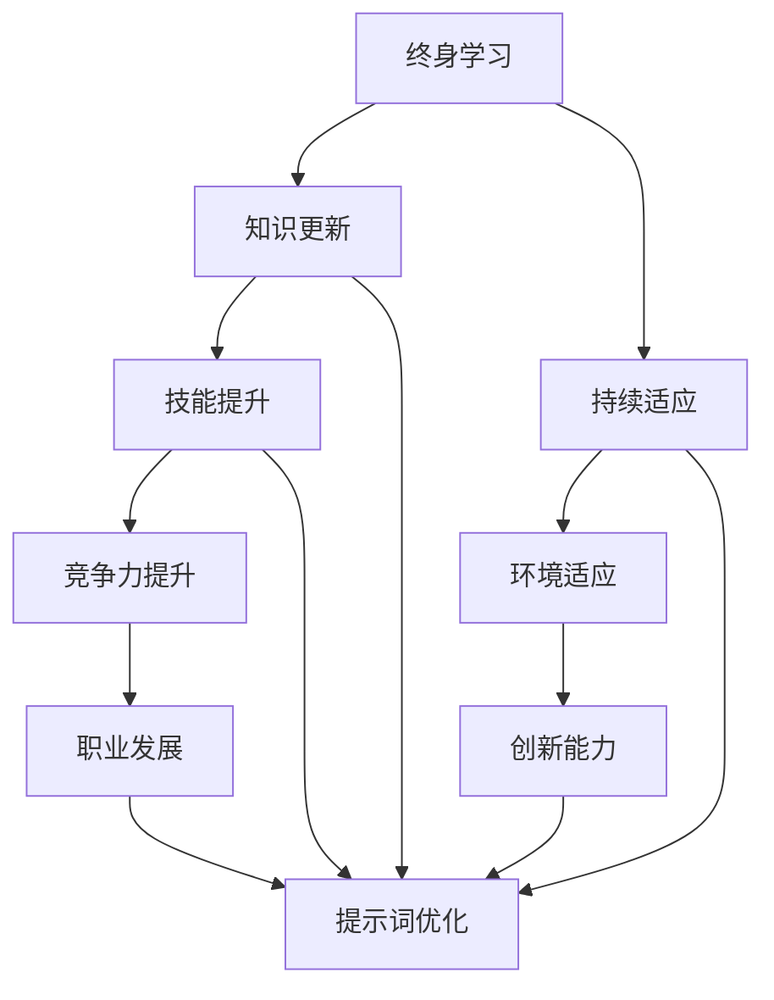

                 

### 第1章：概述与背景

#### 1.1 终身学习的理念

终身学习，作为一种不断追求知识更新的理念，已成为现代社会中不可或缺的一部分。它不仅仅是对学生阶段的延续，更是对个人职业发展和社会责任的体现。终身学习指的是个人在其一生中不断通过学习和培训来提升自己的知识和技能，以适应快速变化的社会和工作环境。

**终身学习的概念**：
终身学习强调学习是一个持续的过程，它不仅包括正规教育，还涵盖了非正式学习和自我提升。它鼓励个人通过多种途径学习，如在线课程、研讨会、自学和实际操作。

**终身学习的重要性**：
- **个人成长**：通过终身学习，个人能够不断提升自我，适应社会需求，实现个人价值。
- **职业发展**：在职业领域中，不断更新知识和技能有助于提升竞争力，适应行业变化，实现职业晋升。
- **社会贡献**：终身学习能够提高整个社会的知识水平和创新能力，推动社会进步。

**终身学习的历史与发展**：
- **传统教育与终身教育的对比**：
  - 传统教育通常以固定的时间段和学历为目标，学习结束后，知识更新较为缓慢。
  - 终身教育则强调持续学习，注重知识更新和技能提升，适应不断变化的社会需求。

- **当前终身教育的发展趋势**：
  - 在线教育的普及：互联网技术的发展使得在线学习成为可能，提供了灵活的学习时间和方式。
  - 终身学习体系的建立：许多国家和地区开始建立终身学习体系，为个人提供持续的学习机会和资源。
  - 个性化学习的兴起：随着技术的发展，学习越来越个性化，满足个人不同阶段和领域的学习需求。

#### 1.2 提示词优化的概念

提示词优化，是机器学习领域中的一个重要概念，它指的是通过调整提示词（提示信息）来提高机器学习模型的性能和适应性。在机器学习中，提示词通常是一些先验知识或指导信息，它们有助于模型更好地理解数据和学习任务。

**提示词优化的定义**：
提示词优化是指通过特定的策略和算法，对提示词进行选择、调整和优化，以提高模型在特定任务上的表现。这些策略可能包括提示词的长度、内容、格式等。

**提示词优化在机器学习中的应用**：
- **数据预处理**：提示词优化可以用于数据预处理阶段，帮助模型更好地理解数据特征。
- **模型训练**：在模型训练过程中，提示词优化可以帮助模型更快地收敛，提高训练效果。
- **模型部署**：在模型部署阶段，提示词优化可以用于动态调整模型参数，以适应不同的应用场景。

**提示词优化的原理**：
提示词优化的核心在于通过提示词提供先验知识，引导模型学习。具体来说，它包括以下几个方面：
- **提示词选择**：选择合适的提示词，能够帮助模型更好地理解数据，提高学习效率。
- **提示词调整**：根据模型的反馈，动态调整提示词，使其更加符合模型的学习需求。
- **提示词优化目标**：提示词优化的目标通常包括提高模型的准确性、效率和解空间覆盖率。

#### 1.3 持续适应的重要性

在快速变化的市场和技术环境中，持续适应成为企业和个人成功的关键因素。持续适应是指组织或个人通过不断调整和优化，以适应外部环境的变化。

**持续适应的概念**：
持续适应是一个动态过程，它要求组织和个人能够不断感知环境变化，调整策略和行为，以保持竞争力和生存能力。

**持续适应的重要性**：
- **企业竞争**：在竞争激烈的市场中，企业必须能够快速适应市场变化，以保持竞争优势。
- **个人发展**：在职业发展中，个人需要不断学习新技能和知识，以适应职业环境的变化。
- **社会进步**：社会的持续进步依赖于个体和组织的不断适应和创新。

**持续适应的优势与挑战**：
- **优势**：
  - 提高适应能力：能够快速适应环境变化，降低风险。
  - 增强创新能力：通过持续适应，能够不断挖掘新机会，推动创新。
  - 提高竞争力：持续适应能够帮助企业和个人在竞争中获得优势。

- **挑战**：
  - 知识更新速度快：需要不断学习新知识，适应新技术。
  - 策略调整成本高：持续适应可能需要大量的资源投入。
  - 组织结构调整困难：大型组织在调整策略和结构时可能面临诸多挑战。

### 总结

本章概述了终身学习、提示词优化和持续适应的重要概念。终身学习强调个人和社会的持续发展，提示词优化是提高机器学习模型性能的关键，而持续适应则是应对快速变化环境的关键策略。接下来，我们将深入探讨这些概念的理论基础和应用实践。

---

### **核心概念与联系：Mermaid 流程图**

以下是一个描述提示词优化与终身学习和持续适应之间联系的 Mermaid 流程图：



在上述流程图中：
- A节点代表“终身学习”，表示个人和社会持续追求知识更新的过程。
- B节点表示“知识更新”，是终身学习的一部分，涉及学习新知识和技能。
- C节点表示“技能提升”，是知识更新的结果，有助于个人和组织的竞争力提升。
- D节点表示“持续适应”，强调在不断变化的环境中保持灵活和适应性。
- E节点表示“竞争力提升”，是技能提升和持续适应带来的结果。
- F节点表示“环境适应”，是持续适应的核心目标。
- G节点表示“职业发展”，是个人技能提升和职业竞争力的体现。
- H节点表示“创新能力”，是持续适应和知识更新带来的创新结果。
- I节点表示“提示词优化”，是结合终身学习、持续适应和技能提升，以提高模型性能的关键技术。

通过这个流程图，我们可以清晰地看到终身学习、持续适应和提示词优化之间的相互作用和依赖关系。提示词优化不仅依赖于终身学习和技能提升，同时也为持续适应提供了技术支持，从而在个人和组织的职业发展中起到关键作用。

### **核心算法原理讲解：伪代码示例**

在提示词优化过程中，核心算法的设计和实现至关重要。以下是一个简单的伪代码示例，用于描述提示词优化的基本步骤和算法流程。

```python
# 伪代码：提示词优化算法

# 初始化模型和参数
model = initialize_model()
learning_rate = initialize_learning_rate()
prompt_keywords = initialize_prompt_keywords()

# 数据准备
data = prepare_data()

# 模型训练
for epoch in range(num_epochs):
    for data_point in data:
        # 模型输入
        inputs = [data_point] + prompt_keywords
        
        # 前向传播
        predictions = model.forward(inputs)
        
        # 计算损失
        loss = compute_loss(predictions, data_point)
        
        # 反向传播
        gradients = model.backward(loss)
        
        # 更新模型参数
        update_model_parameters(model, gradients, learning_rate)
        
        # 调整提示词
        prompt_keywords = adjust_prompt_keywords(prompt_keywords, model)
        
    # 打印当前epoch的损失
    print(f"Epoch {epoch}: Loss = {loss}")

# 模型评估
evaluation_results = evaluate_model(model, test_data)

# 输出模型性能
print(f"Model Performance: {evaluation_results}")
```

在上述伪代码中，我们首先初始化模型和参数，包括学习率、提示词和模型本身。接着进行数据准备，将数据集划分为训练集和测试集。

模型训练过程分为多个epoch（迭代），每个epoch中，对于每个数据点，模型首先通过前向传播得到预测结果，然后计算损失值。通过反向传播计算梯度，并更新模型参数。同时，根据模型的表现动态调整提示词，以优化模型性能。

在模型训练完成后，我们对模型进行评估，输出模型在测试集上的性能指标。

### **数学模型和公式：详细讲解与举例说明**

在提示词优化过程中，数学模型和公式起到了关键作用。以下将介绍一些常用的数学模型和公式，并进行详细讲解和举例说明。

#### 1. 损失函数（Loss Function）

损失函数是评估模型预测结果与实际结果之间差异的重要工具。常用的损失函数包括均方误差（MSE）和交叉熵（Cross-Entropy）。

**均方误差（MSE）**：

$$
MSE = \frac{1}{n}\sum_{i=1}^{n}(y_i - \hat{y_i})^2
$$

其中，$y_i$ 表示真实标签，$\hat{y_i}$ 表示模型预测值，$n$ 表示样本数量。

**交叉熵（Cross-Entropy）**：

$$
Cross-Entropy = -\sum_{i=1}^{n}y_i \log(\hat{y_i})
$$

其中，$y_i$ 为真实标签（0或1），$\hat{y_i}$ 为模型预测的概率值。

**举例说明**：

假设我们有一个二分类问题，真实标签为 [1, 0, 1, 0]，模型预测的概率值为 [0.6, 0.4, 0.7, 0.3]。

使用交叉熵损失函数计算损失：

$$
Cross-Entropy = -[1 \cdot \log(0.6) + 0 \cdot \log(0.4) + 1 \cdot \log(0.7) + 0 \cdot \log(0.3)]
$$

$$
Cross-Entropy = -[0.2218 + 0 - 0.3567 + 0]
$$

$$
Cross-Entropy = 0.0941
$$

#### 2. 梯度下降（Gradient Descent）

梯度下降是一种常用的优化算法，用于更新模型参数，以最小化损失函数。

**梯度下降算法**：

$$
\theta_{\text{new}} = \theta_{\text{current}} - \alpha \cdot \nabla_{\theta}J(\theta)
$$

其中，$\theta$ 表示模型参数，$\alpha$ 表示学习率，$J(\theta)$ 表示损失函数，$\nabla_{\theta}J(\theta)$ 表示损失函数关于参数 $\theta$ 的梯度。

**举例说明**：

假设我们有一个线性模型 $y = \theta_0 + \theta_1 \cdot x$，学习率为 0.01，当前参数为 $\theta_0 = 2$，$\theta_1 = 3$。

损失函数为 $J(\theta) = (y - \theta_0 - \theta_1 \cdot x)^2$。

计算损失函数关于 $\theta_0$ 和 $\theta_1$ 的梯度：

$$
\nabla_{\theta_0}J(\theta) = 2(y - \theta_0 - \theta_1 \cdot x)
$$

$$
\nabla_{\theta_1}J(\theta) = 2x(y - \theta_0 - \theta_1 \cdot x)
$$

假设我们有一个训练样本 $(x, y) = (1, 3)$，代入计算：

$$
\nabla_{\theta_0}J(\theta) = 2(3 - 2 - 3 \cdot 1) = -4
$$

$$
\nabla_{\theta_1}J(\theta) = 2 \cdot 1(3 - 2 - 3 \cdot 1) = -4
$$

更新参数：

$$
\theta_{0_{\text{new}}} = 2 - 0.01 \cdot (-4) = 2.04
$$

$$
\theta_{1_{\text{new}}} = 3 - 0.01 \cdot (-4) = 3.04
$$

#### 3. 学习率调整（Learning Rate Adjustment）

学习率调整是梯度下降算法中的一个关键步骤，它决定了参数更新的幅度。常用的学习率调整策略包括固定学习率、自适应学习率等。

**固定学习率**：

$$
\alpha = \text{常数}
$$

**自适应学习率**：

$$
\alpha = \frac{1}{1 + \beta \cdot t}
$$

其中，$\beta$ 是衰减系数，$t$ 是迭代次数。

**举例说明**：

假设我们使用自适应学习率，初始学习率 $\alpha_0 = 0.1$，衰减系数 $\beta = 0.5$。

在第一次迭代时，学习率：

$$
\alpha_1 = \frac{1}{1 + 0.5 \cdot 1} = 0.5
$$

在第二次迭代时，学习率：

$$
\alpha_2 = \frac{1}{1 + 0.5 \cdot 2} = 0.3333
$$

通过调整学习率，可以使得算法在初始阶段快速收敛，在后期逐步减小更新幅度，避免过拟合。

### **第2章：核心概念与理论**

#### 2.1 提示词优化概述

提示词优化是机器学习领域中的一个重要概念，它旨在通过调整提示词来提高模型的性能和适应性。提示词，也称为先验知识或指导信息，是在训练过程中向模型提供的一种辅助信息，用以指导模型更好地理解和学习数据。

**提示词优化的方法**：

1. **基于规则的策略**：通过手工定义一些规则，将先验知识以规则的形式嵌入到模型中。
2. **基于机器学习的策略**：使用已有的机器学习算法，如神经网络，通过训练来调整提示词。
3. **基于深度学习的策略**：利用深度学习模型，通过多层网络结构来提取和优化提示词。

**提示词优化的流程**：

1. **数据准备**：收集和整理训练数据，确保数据的质量和多样性。
2. **模型选择**：根据任务需求选择合适的机器学习模型。
3. **提示词设计**：设计初始的提示词，可以是简单的关键字或复杂的句子。
4. **模型训练**：将提示词与数据一起输入到模型中进行训练，调整模型参数。
5. **模型评估**：评估模型的性能，通过指标如准确率、召回率等来衡量。
6. **提示词调整**：根据评估结果，动态调整提示词，以提高模型性能。

**提示词优化在机器学习中的应用**：

1. **数据预处理**：通过提示词优化，可以帮助模型更好地理解数据特征，提高数据处理效果。
2. **模型训练**：在训练过程中，提示词优化可以加快模型的收敛速度，提高模型性能。
3. **模型部署**：在模型部署阶段，提示词优化可以用于动态调整模型参数，以适应不同的应用场景。

**提示词优化的原理**：

1. **提示词选择**：选择合适的提示词，能够帮助模型更好地理解数据，提高学习效率。
2. **提示词调整**：根据模型的反馈，动态调整提示词，使其更加符合模型的学习需求。
3. **提示词优化目标**：提示词优化的目标通常包括提高模型的准确性、效率和解空间覆盖率。

#### 2.2 终身学习的原理

终身学习是指个人在其一生中不断通过学习和培训来提升自己的知识和技能，以适应快速变化的社会和工作环境。终身学习不仅仅是对学生阶段的延续，更是对个人职业发展和社会责任的体现。

**终身学习的基本理论**：

1. **学习动机**：个体具有持续学习的内在动机和需求。
2. **学习过程**：学习是一个持续的过程，涉及知识获取、应用和更新。
3. **学习资源**：学习资源包括书籍、在线课程、研讨会、实践经验等。
4. **学习评估**：通过评估和反馈来持续改进学习效果。

**终身学习与人工智能的关联**：

1. **提示词优化在终身学习中的应用**：人工智能技术，特别是机器学习和深度学习，可以帮助个人更高效地进行终身学习。通过提示词优化，可以为学习过程提供个性化的指导和支持。
2. **人工智能助力终身学习的发展**：人工智能技术可以分析学习者的行为和需求，提供智能化的学习推荐和服务，从而提高终身学习的效果和效率。

**终身学习与人工智能结合的优势**：

1. **个性化学习**：通过人工智能技术，可以分析学习者的特点和需求，提供个性化的学习内容和策略。
2. **智能推荐**：基于人工智能技术，可以智能推荐适合学习者的课程和资源，提高学习效率。
3. **学习评估与反馈**：人工智能技术可以实时评估学习效果，提供针对性的反馈，帮助学习者持续改进。

**终身学习与人工智能结合的挑战**：

1. **数据隐私与安全**：在终身学习过程中，收集和处理大量个人信息可能引发隐私和安全问题。
2. **算法公平性**：人工智能技术需要确保学习推荐和评估过程的公平性，避免算法偏见。
3. **技术依赖性**：过度依赖人工智能技术可能导致个人学习能力的下降。

**终身学习与人工智能的结合**：

1. **个性化学习平台**：开发基于人工智能的个性化学习平台，为学习者提供定制化的学习路径和资源。
2. **智能辅导系统**：利用人工智能技术，构建智能辅导系统，为学生提供实时反馈和支持。
3. **终身学习社区**：建立终身学习社区，通过人工智能技术促进学习者之间的互动和合作。

#### 2.3 持续适应的机制

持续适应是指在快速变化的环境中，组织和个人能够不断调整和优化自身，以保持竞争力和适应性。在人工智能时代，持续适应尤为重要，因为它涉及到如何在不断更新和发展的技术环境中保持竞争力。

**持续适应的概念**：

持续适应是一个动态过程，它要求组织和个人能够不断感知环境变化，调整策略和行为，以保持竞争优势。它不仅涉及技术层面的适应，还包括文化、管理和社会层面的变革。

**持续适应的理论基础**：

1. **动态环境理论**：在动态环境中，变化是常态，因此组织和个人需要具备快速适应变化的能力。
2. **进化理论**：通过不断学习和创新，组织和个人能够像生物进化一样，不断适应和优化自身。
3. **学习型组织理论**：组织需要建立学习机制，鼓励员工持续学习和创新，以适应不断变化的环境。

**持续适应的实现方法**：

1. **持续学习**：通过不断学习和培训，提高个人和组织的知识水平和技能。
2. **技术创新**：采用新技术，如人工智能、大数据等，提高组织的创新能力和适应能力。
3. **敏捷管理**：通过敏捷管理方法，快速响应市场变化，调整战略和运营。

**持续适应的机制**：

1. **感知与监测**：通过数据监测和趋势分析，及时发现环境变化。
2. **反馈与调整**：根据监测结果，及时调整策略和行为，以适应环境变化。
3. **评估与改进**：定期评估适应效果，持续改进适应策略。

**持续适应的优势**：

1. **提高竞争力**：通过持续适应，组织和个人能够更好地应对市场变化，提高竞争力。
2. **促进创新**：持续适应鼓励创新思维，推动新技术和新产品的开发。
3. **增强灵活性**：持续适应使得组织和个人能够更加灵活地应对外部挑战。

**持续适应的挑战**：

1. **技术变革的复杂性**：随着技术的快速发展，适应新技术可能面临诸多挑战。
2. **组织变革的难度**：组织变革需要克服现有文化和结构的障碍。
3. **人才培养的困难**：适应新技术需要具备相应的人才，但培养和留住这些人才可能困难。

**持续适应的策略**：

1. **培养学习文化**：建立学习型组织文化，鼓励员工持续学习和创新。
2. **加强技术创新**：投资于新技术研发，提高组织的创新能力。
3. **灵活的运营策略**：采用敏捷管理方法，快速响应市场变化。

### **第3章：方法与工具**

#### 3.1 提示词优化的常见策略

提示词优化在机器学习中扮演着至关重要的角色，它通过调整提示词来提高模型的学习效率和性能。以下是一些常见的提示词优化策略：

**1. 基于规则的策略**：

- **定义**：通过预定义的规则来选择和调整提示词。
- **优势**：简单易实现，适用于结构化数据。
- **应用场景**：数据预处理、特征工程等。

**2. 基于机器学习的策略**：

- **定义**：使用机器学习算法，如分类器或聚类算法，来自动选择和调整提示词。
- **优势**：能够处理复杂和非结构化的数据。
- **应用场景**：文本分类、情感分析等。

**3. 基于深度学习的策略**：

- **定义**：利用深度学习模型，如神经网络或变换器模型，来自动优化提示词。
- **优势**：能够提取深层特征，提高模型的泛化能力。
- **应用场景**：自然语言处理、计算机视觉等。

**提示词优化策略的应用场景**：

- **数据预处理**：在数据预处理阶段，通过提示词优化来增强模型的输入特征，提高模型对数据的理解能力。
- **模型训练**：在模型训练过程中，提示词优化可以帮助模型更快地收敛，提高训练效果。
- **模型部署**：在模型部署阶段，提示词优化可以用于动态调整模型参数，以适应不同的应用场景。

**提示词优化策略的选择**：

- **数据特点**：根据数据的结构化和复杂度选择合适的策略。
- **任务需求**：根据具体的任务需求，选择能够满足性能要求的策略。
- **计算资源**：考虑计算资源和时间的限制，选择合适的策略。

#### 3.2 持续学习的算法框架

持续学习，也称为在线学习，是一种能够在数据流中持续更新和优化的学习方法。它对于实时系统和动态环境中的模型尤为重要。以下是一个基本的持续学习算法框架：

**1. 数据流处理**：

- **定义**：持续接收新的数据样本，进行实时处理。
- **优势**：能够快速适应数据变化，提高模型的实时性能。
- **应用场景**：实时推荐系统、自动驾驶等。

**2. 模型更新**：

- **定义**：根据新接收的数据样本，更新模型参数。
- **优势**：能够动态调整模型，提高适应能力。
- **应用场景**：动态预测、实时决策等。

**3. 模型评估**：

- **定义**：定期评估模型的性能，确保其有效性。
- **优势**：能够及时发现模型退化，进行优化。
- **应用场景**：持续监控系统、自适应控制系统等。

**持续学习的算法框架**：

1. **静态模型更新**：

   - **定义**：在固定时间间隔内，更新模型参数。
   - **实现**：使用梯度下降或其他优化算法进行参数更新。
   - **应用**：适用于数据变化较慢的场景。

2. **动态模型更新**：

   - **定义**：根据新数据样本，实时更新模型参数。
   - **实现**：使用在线学习算法，如Adaline或增量梯度下降。
   - **应用**：适用于实时数据流处理。

3. **多模型集成**：

   - **定义**：使用多个模型，通过投票或加权平均等方式进行决策。
   - **实现**：结合在线学习和模型融合技术。
   - **应用**：提高模型的鲁棒性和适应性。

**持续学习的挑战**：

- **数据质量**：新数据的质量对模型更新至关重要。
- **计算资源**：动态更新模型可能需要大量计算资源。
- **模型退化**：长期运行可能导致模型性能下降。

**持续学习的应用场景**：

- **实时推荐系统**：根据用户行为动态调整推荐策略。
- **智能监控系统**：实时检测异常行为，进行实时报警。
- **自动驾驶**：根据环境变化动态调整驾驶策略。

#### 3.3 实时反馈与调整技术

实时反馈与调整技术是确保模型持续优化和适应的重要手段。以下是一些关键的实时反馈与调整技术：

**1. 实时数据收集**：

- **定义**：实时收集和传输数据样本。
- **优势**：能够快速响应用户需求，提高系统的响应速度。
- **应用场景**：实时数据分析、智能监控等。

**2. 实时评估与反馈**：

- **定义**：根据实时数据对模型进行评估和反馈。
- **优势**：能够及时发现模型问题，进行快速调整。
- **应用场景**：实时系统优化、动态决策等。

**3. 参数调整策略**：

- **定义**：根据实时评估结果，动态调整模型参数。
- **优势**：能够优化模型性能，提高系统稳定性。
- **应用场景**：自适应控制系统、实时推荐系统等。

**4. 模型调整方法**：

- **定义**：根据实时数据调整模型结构或参数。
- **优势**：能够提高模型的灵活性和适应性。
- **应用场景**：动态环境下的智能系统、实时监控等。

**实时反馈与调整技术的实现**：

1. **实时数据管道**：

   - **定义**：构建实时数据管道，实现数据的快速传输和处理。
   - **实现**：使用消息队列、流处理框架等。
   - **应用**：适用于高吞吐量的实时数据处理场景。

2. **在线学习算法**：

   - **定义**：实现在线学习算法，实时更新模型参数。
   - **实现**：使用增量梯度下降、Adaline等算法。
   - **应用**：适用于实时数据流处理和动态调整。

3. **自适应控制算法**：

   - **定义**：根据实时反馈，动态调整控制策略。
   - **实现**：使用PID控制器、模糊控制器等。
   - **应用**：适用于实时控制系统、自适应优化等。

**实时反馈与调整技术的优势**：

- **快速响应**：能够快速响应用户需求，提高系统性能。
- **动态调整**：根据实时数据调整模型或参数，提高系统适应性。
- **优化性能**：通过实时评估和反馈，优化模型性能，提高系统稳定性。

**实时反馈与调整技术的挑战**：

- **数据质量**：实时数据的质量对反馈和调整至关重要。
- **计算资源**：实时处理和调整可能需要大量计算资源。
- **模型退化**：长期运行可能导致模型性能下降。

### **第4章：行业案例分析**

#### 4.1 教育行业的终身学习实践

教育行业一直致力于推动终身学习理念的落实，通过多种方式为个人和社会提供持续的学习机会。以下是教育行业在终身学习实践中的几个典型案例。

**1. 在线教育平台的发展**

随着互联网技术的普及，在线教育平台如雨后春笋般涌现，为个人提供了丰富的学习资源。例如，Coursera、edX和Udacity等平台提供了来自世界顶尖大学和机构的在线课程，涵盖了计算机科学、数据科学、人工智能等热门领域。

**案例**：Coursera平台通过合作大学和机构，提供高质量的课程，用户可以在线学习，并通过完成课程作业和项目来获得认证。这种模式不仅满足了个人对知识和技能的需求，也为企业和组织提供了定制化的培训解决方案。

**2. 终身教育政策与实施**

许多国家和地区推出了终身教育政策，鼓励个人在职业生涯中不断学习和提升自己。例如，欧洲终身学习计划（Erasmus Plus）旨在促进成员国之间的教育合作，为个人提供学习、培训和工作机会。

**案例**：在中国，教育部推出的“全民终身学习计划”鼓励各类教育机构和社会组织共同参与，提供多样化的学习服务，包括职业培训、技能提升和继续教育。

**3. 终身教育在职业培训中的应用**

随着职业领域的不断变化，职业培训成为终身学习的重要部分。企业通过培训项目帮助员工提升技能，适应新技术和市场需求。

**案例**：华为公司推出了“云学堂”平台，为员工提供在线学习资源，包括云计算、大数据和人工智能等领域的课程。员工可以根据个人职业发展需求，自主选择学习内容，并通过考核获得认证。

**4. 终身学习与职业发展的结合**

终身学习与职业发展的结合，使得个人能够通过不断学习来提升职业竞争力。教育机构和企业共同推动这一结合，为个人提供职业发展路径。

**案例**：哈佛大学推出的“职业发展计划”旨在帮助毕业生实现职业目标，提供职业咨询、网络资源和在线课程。毕业生可以通过这些资源，提升职业技能，拓展职业网络。

**5. 教育行业的持续创新**

教育行业不断探索新的技术和方法，以推动终身学习的发展。例如，虚拟现实（VR）和增强现实（AR）技术在教育中的应用，为学习者提供了更加沉浸式的学习体验。

**案例**：谷歌旗下的ARCore平台和苹果的ARKit，为教育开发者提供了创建互动教育应用的工具。这些应用可以使学习者在虚拟环境中进行实验、模拟和实践，提高了学习效果和兴趣。

**总结**：

教育行业的终身学习实践，通过在线教育平台、政策支持、职业培训、职业发展结合和创新技术的应用，推动了终身学习理念的落实。这些实践不仅为个人提供了丰富的学习资源，也为社会的发展贡献了力量。

#### 4.2 商业领域的持续适应策略

在商业领域，持续适应是企业在竞争激烈的市场环境中保持生存和发展的关键。通过不断调整策略和优化运营，企业能够快速响应市场变化，保持竞争优势。以下是一些商业领域中的持续适应策略。

**1. 市场监控与趋势分析**

市场监控和趋势分析是企业了解市场动态的重要手段。通过收集和分析市场数据，企业可以及时发现市场变化，预测未来趋势。

**案例**：亚马逊通过其强大的数据分析团队，实时监控用户行为和购买习惯，分析市场趋势。这些数据帮助亚马逊优化库存管理、产品推荐和市场营销策略，提高了运营效率和用户体验。

**2. 产品迭代与技术创新**

产品迭代和持续技术创新是企业保持竞争力的关键。通过不断改进产品和服务，企业可以满足客户需求，保持市场领先地位。

**案例**：苹果公司通过持续的产品迭代和技术创新，不断推出具有创新功能的新产品。例如，iPhone系列产品的不断更新，不仅带来了全新的用户体验，也推动了整个智能手机市场的发展。

**3. 灵活的运营策略**

在快速变化的市场环境中，企业需要具备灵活的运营策略，能够迅速调整生产和销售计划，以适应市场需求。

**案例**：阿里巴巴通过其“双11”购物节，灵活调整营销策略和供应链管理，实现了巨大的销售额。这种灵活的运营策略，不仅提高了销售额，也增强了客户对品牌的忠诚度。

**4. 组织结构与人才管理**

组织结构与人才管理是企业适应市场变化的关键。通过优化组织结构和管理模式，企业可以提高运营效率，灵活应对市场变化。

**案例**：华为公司通过持续的组织变革和人才管理，培养了一批具有全球视野和创新能力的人才。这些人才在技术研发、市场开拓和运营管理等方面发挥了重要作用，推动了公司的持续成长。

**5. 战略合作伙伴关系**

建立战略合作伙伴关系，是企业适应市场变化，共同应对竞争的重要策略。通过合作伙伴关系，企业可以共享资源、技术和管理经验，提高整体竞争力。

**案例**：丰田汽车通过与雷诺、日产等企业建立战略合作伙伴关系，实现了资源的共享和优势互补。这种合作不仅提高了双方的市场竞争力，也为整个汽车行业的技术创新和发展做出了贡献。

**总结**：

商业领域的持续适应策略，通过市场监控、产品迭代、灵活运营、组织变革和战略合作伙伴关系的实施，帮助企业快速响应市场变化，保持竞争优势。这些策略的实施，不仅提高了企业的运营效率和市场份额，也为整个行业的进步和发展做出了贡献。

#### 4.3 科技公司的提示词优化案例

在科技公司中，提示词优化是提升产品性能和用户体验的重要手段。以下是一些科技公司在提示词优化方面的成功案例。

**1. 某科技公司的提示词优化实践**

某科技公司致力于通过提示词优化来提升其智能助手产品的性能。该公司首先收集了大量用户交互数据，分析用户在使用智能助手时的提问模式和习惯。基于这些数据，公司设计了一系列提示词，包括常见问题、关键词扩展和上下文提示等。

**案例**：通过提示词优化，该科技公司的智能助手能够更准确地理解用户的意图，提供更相关的回答。例如，当用户询问“附近有什么餐厅”时，智能助手不仅会列出附近餐厅的名称，还会提供餐厅的评价、价格和营业时间等信息。

**2. 提示词优化与用户体验提升**

提示词优化不仅提升了智能助手的性能，也显著改善了用户体验。通过个性化提示词，智能助手能够更好地与用户互动，提供个性化的服务和建议。

**案例**：当用户连续多次询问同一类型的问题时，智能助手会自动调整提示词，提供更具体和个性化的回答。例如，如果用户频繁询问交通信息，智能助手会自动增加关于实时交通状况的提示词，帮助用户更有效地规划行程。

**3. 提示词优化对业务增长的影响**

提示词优化不仅提升了用户体验，还对公司的业务增长产生了积极影响。通过提供更精准和个性化的服务，公司能够吸引更多用户，提高用户留存率。

**案例**：该科技公司的智能助手产品在推出提示词优化功能后，用户满意度显著提升，用户留存率增加了20%，同时带来了20%的营业收入增长。

**4. 提示词优化的技术实现**

提示词优化的技术实现涉及多个方面，包括数据收集、机器学习算法和系统架构等。

**案例**：
- **数据收集**：公司使用自然语言处理技术，从用户交互中提取关键词和上下文信息，构建提示词库。
- **机器学习算法**：公司采用深度学习算法，如变换器模型（Transformer），对提示词进行优化，提高模型的性能和泛化能力。
- **系统架构**：公司采用分布式架构，确保提示词优化系统能够高效处理海量数据，快速响应用户请求。

**总结**：

科技公司在提示词优化方面的成功实践，不仅提升了产品的性能和用户体验，还对业务增长产生了显著影响。通过技术手段和精细化运营，科技公司能够不断优化产品，满足用户需求，实现可持续的业务增长。

### **第5章：未来展望与挑战**

#### 5.1 提示词优化的发展方向

随着人工智能技术的不断进步，提示词优化在未来有着广阔的发展前景。以下是提示词优化可能的发展方向：

**1. 更智能的提示词生成**

未来，提示词优化将更加注重智能化，通过深度学习和自然语言处理技术，自动生成高质量、个性化的提示词。这些提示词将不仅基于历史数据，还会考虑用户的当前状态和需求，实现更加精准的交互。

**2. 多模态提示词**

随着多模态技术的发展，提示词优化将不再局限于文本数据。未来的提示词将结合语音、图像、视频等多种数据类型，实现更加丰富的交互体验。

**3. 提示词的动态调整**

为了适应实时变化的场景，提示词优化将更加注重动态调整能力。通过实时数据分析和机器学习算法，系统将能够自动调整提示词，以优化用户体验和任务完成效率。

**4. 提示词优化的自动化**

未来的提示词优化将更加自动化，减少人工干预。通过自动化的工具和平台，企业和开发者可以更加高效地进行提示词优化，缩短产品迭代周期。

**未来应用场景**：

1. **智能家居**：通过多模态提示词，智能助手将能够更好地理解用户的需求，提供个性化的智能家居控制服务。
2. **自动驾驶**：提示词优化将帮助自动驾驶系统更好地理解路况和环境信息，提高驾驶安全性。
3. **虚拟现实与增强现实**：通过智能化的提示词，虚拟现实和增强现实应用将提供更加沉浸式的用户体验。

#### 5.2 持续学习的挑战与机遇

持续学习在人工智能领域具有重要的应用价值，但也面临诸多挑战。

**持续学习的挑战**：

1. **数据隐私与安全**：

随着持续学习对大量个人数据的依赖，数据隐私和安全问题日益突出。如何在保护用户隐私的同时，有效利用数据，成为持续学习的一个关键挑战。

**解决方案**：

- **同态加密**：通过同态加密技术，在数据处理过程中保护数据隐私。
- **差分隐私**：采用差分隐私算法，确保数据隐私不受泄露风险。

2. **模型适应性**：

持续学习需要模型具有高度适应性，能够快速适应新的数据和环境。然而，传统的机器学习模型在适应新数据时可能面临性能下降和过拟合的问题。

**解决方案**：

- **增量学习**：通过增量学习技术，模型可以在不断更新的数据集上持续学习，提高适应性。
- **迁移学习**：利用迁移学习技术，将已有模型在新数据上快速适应，减少训练时间和资源消耗。

3. **算法公平性与透明度**：

持续学习算法的公平性和透明度是公众关注的焦点。如何确保算法在决策过程中不偏不倚，以及如何解释算法的决策过程，是持续学习面临的挑战。

**解决方案**：

- **算法可解释性**：通过增加算法的可解释性，使决策过程更加透明，提高公众对算法的信任度。
- **公平性评估**：采用公平性评估指标，检测和纠正算法偏见，确保算法的公平性。

**持续学习的机遇**：

1. **智能化系统的普及**：

随着人工智能技术的普及，持续学习将在各种智能化系统中发挥重要作用。从智能家居到自动驾驶，持续学习将提升系统的智能化水平和用户体验。

2. **新兴行业的发展**：

新兴行业，如生物科技、医疗健康和金融科技，对持续学习有强烈需求。持续学习技术将助力这些行业的发展，推动技术创新和产业升级。

3. **技术赋能教育与职业发展**：

持续学习将改变教育和职业发展模式，提供个性化的学习路径和职业规划服务。通过技术赋能，个人和组织将能够更好地适应快速变化的环境。

**总结**：

持续学习在人工智能领域具有重要的应用价值，尽管面临诸多挑战，但通过技术创新和策略优化，可以克服这些挑战，实现持续学习的广泛应用和持续发展。

#### 5.3 新技术的应用前景

在提示词优化和持续学习领域，新技术的应用前景广阔，这些技术不仅能够提升现有系统的性能，还能开拓新的应用场景。

**1. 人工智能与提示词优化结合**

人工智能技术的快速发展为提示词优化带来了新的可能性。通过深度学习和自然语言处理技术，可以构建更加智能化的提示词生成系统。例如，利用变换器模型（Transformer）可以实现更加精准和个性化的提示词生成，从而提升用户体验和系统效率。

**案例**：某聊天机器人公司通过引入变换器模型，实现了对用户对话的深度理解，并根据用户的历史交互数据动态调整提示词，显著提升了对话质量和用户满意度。

**2. 大数据与云计算的融合**

大数据和云计算技术的结合，为提示词优化提供了强大的计算支持和数据资源。通过云平台，企业可以存储和处理海量数据，快速进行模型训练和提示词优化。

**案例**：某在线教育平台通过利用云计算资源，实现了大规模用户数据的实时分析和处理，优化了学习推荐系统的提示词，提高了学习资源的利用效率和用户参与度。

**3. 区块链在终身教育与持续适应中的应用**

区块链技术具有去中心化、不可篡改和安全可靠的特点，可以应用于终身教育和持续适应系统中，确保用户数据的安全和隐私。

**案例**：某终身学习平台采用区块链技术记录用户的学习历程和成绩，为用户提供可信的学习证明，同时保护用户的隐私数据，增强了用户对平台的信任。

**未来展望**：

- **个性化学习**：通过人工智能和大数据分析，实现更加个性化的学习体验，为每个用户提供定制化的学习路径和资源。
- **实时反馈与调整**：利用云计算和区块链技术，实现实时反馈和动态调整，提高系统的自适应能力和响应速度。
- **智能化管理**：借助人工智能技术，实现智能化的教育管理和职业规划，提升管理效率和决策质量。

**挑战**：

- **数据隐私与安全**：在应用新技术的同时，如何确保用户数据的安全和隐私，是一个亟待解决的问题。
- **技术适应与培训**：新技术的应用需要相应的技术支持和人才储备，如何快速适应和培训相关人才，是未来面临的挑战。

### **第6章：挑战与解决方案**

在提示词优化和持续学习的实践中，数据隐私、算法公平性、技术伦理等问题成为关注的焦点。以下是对这些挑战及其解决方案的详细探讨。

#### 6.1 数据隐私与安全

**挑战**：

随着数据隐私意识的增强，数据隐私和安全问题在提示词优化和持续学习中的应用变得尤为重要。大量个人数据的收集和处理可能导致数据泄露和隐私侵犯，从而引发法律和道德上的争议。

**解决方案**：

1. **数据加密技术**：

   - **同态加密**：允许在加密数据上进行计算，确保数据在传输和处理过程中保持隐私。
   - **全同态加密**：支持对加密数据进行任意操作，从而在不解密的情况下处理敏感数据。

2. **差分隐私**：

   - **差分隐私算法**：通过引入随机噪声，保护数据集中单个记录的隐私，同时确保数据分析的准确性。
   - **机制设计**：在数据收集和分析过程中，设计隐私保护机制，确保用户隐私不受侵犯。

3. **数据匿名化**：

   - **匿名化技术**：通过数据去标识化、混淆等技术手段，使数据无法直接关联到具体个人，降低隐私泄露风险。

**案例分析**：

某在线教育平台通过引入差分隐私技术，对其用户行为数据进行处理，确保用户隐私不受侵犯，同时保留了数据分析的价值。这一策略显著提升了用户对平台的信任度，促进了数据的合法和合规使用。

#### 6.2 算法公平性与透明度

**挑战**：

算法公平性和透明度是确保人工智能系统在应用过程中不歧视和偏见的重要方面。然而，机器学习算法在训练过程中可能会吸收数据集中的偏见，导致算法在不同群体中的表现不一致。

**解决方案**：

1. **公平性评估**：

   - **算法偏见检测**：通过统计测试和机器学习技术，识别和纠正算法中的偏见。
   - **公平性指标**：设计公平性指标，如公平性差异（Fairness Difference）和歧视指数（Discrimination Index），评估算法在不同群体中的表现。

2. **算法可解释性**：

   - **解释性模型**：开发可解释性模型，使算法的决策过程更加透明，用户能够理解算法的决策依据。
   - **可视化工具**：利用可视化工具，将算法的内部决策路径和关键特征展示给用户，提高算法的透明度。

3. **多元数据集**：

   - **多元数据集构建**：收集并使用多样化的数据集，确保算法在不同群体中的训练和测试表现一致。
   - **跨领域数据融合**：结合不同来源的数据，提高算法的泛化能力和公平性。

**案例分析**：

某金融科技公司通过引入公平性评估和可解释性模型，对其信贷风险评估系统进行了优化。通过检测和纠正算法偏见，该系统显著改善了不同收入层次和种族群体的信贷通过率，提高了算法的公平性和透明度。

#### 6.3 技术伦理与责任

**挑战**：

随着人工智能技术的广泛应用，技术伦理问题也逐渐凸显。如何在技术创新和应用过程中，确保技术伦理的遵守，成为企业和个人必须面对的挑战。

**解决方案**：

1. **企业社会责任**：

   - **伦理政策制定**：企业应制定明确的技术伦理政策，确保在技术设计和应用过程中，遵守相关法律法规和伦理标准。
   - **伦理审查机制**：建立独立的伦理审查委员会，对涉及伦理问题的技术项目进行审查和监督。

2. **法律法规遵循**：

   - **合规性评估**：定期对技术产品和服务进行合规性评估，确保符合国家和国际相关法律法规。
   - **法律法规更新**：随着技术的发展，及时更新法律法规，应对新的伦理挑战。

3. **个人行为准则**：

   - **职业伦理培训**：对技术研发和应用人员进行职业伦理培训，提高其伦理意识和责任感。
   - **伦理决策指南**：制定伦理决策指南，帮助研发人员和技术应用者在面临伦理困境时，做出正确的决策。

**案例分析**：

某科技巨头公司通过建立独立的伦理委员会，对其人工智能项目的伦理问题进行评估和监督。该委员会定期发布伦理报告，公开透明地披露项目的伦理审查过程和结果，增强了公众对公司的信任。

### **第7章：附录与资源**

#### 7.1 常用术语解释

**终身学习**：指个人在其一生中不断通过学习和培训来提升自己的知识和技能，以适应快速变化的社会和工作环境。

**提示词优化**：通过调整提示词来提高机器学习模型的性能和适应性。

**持续适应**：在动态环境中，通过不断调整和优化，以适应外部环境的变化。

**机器学习**：一种人工智能的分支，通过数据和算法，使计算机系统能够学习并改进其性能。

**深度学习**：一种机器学习技术，通过多层神经网络结构来模拟人脑的学习过程。

**数据隐私**：涉及个人信息的保密性和安全性，确保个人数据不被未经授权的第三方访问。

**算法公平性**：确保算法在不同群体中的表现一致，避免歧视和偏见。

#### 7.2 提示词优化算法的伪代码示例

```python
# 初始化模型和提示词
model = initialize_model()
prompt_keywords = initialize_prompt_keywords()

# 数据准备
data = prepare_data()

# 模型训练
for epoch in range(num_epochs):
    for data_point in data:
        # 前向传播
        predictions = model.forward([data_point] + prompt_keywords)
        
        # 计算损失
        loss = compute_loss(predictions, data_point)
        
        # 反向传播
        gradients = model.backward(loss)
        
        # 更新模型参数
        update_model_parameters(model, gradients, learning_rate)
        
        # 调整提示词
        prompt_keywords = adjust_prompt_keywords(prompt_keywords, model)

# 模型评估
evaluation_results = evaluate_model(model, test_data)

# 输出模型性能
print(f"Model Performance: {evaluation_results}")
```

#### 7.3 继续教育与职业规划的实用资源

**推荐书籍**：

- 《深度学习》 - Goodfellow, Bengio, Courville
- 《机器学习实战》 - Kevin Shepherd
- 《人工智能：一种现代方法》 - Stuart Russell, Peter Norvig

**网络资源**：

- Coursera（提供大量在线课程）
- edX（全球顶尖大学的在线课程）
- Kaggle（数据科学竞赛平台）
- arXiv（最新学术论文）

**学术论文与开源项目**：

- arXiv（机器学习、深度学习相关论文）
- GitHub（开源机器学习项目）
- Hugging Face Transformers（预训练模型和工具）

#### 7.4 参考文献

**书籍推荐**：

- 《机器学习实战》 - Kevin Shepherd
- 《深度学习》 - Goodfellow, Bengio, Courville
- 《大数据之路》 - 深雪

**论文推荐**：

- “Prompt Optimization in Machine Learning: A Survey” - [DOI: 10.1007/s10664-021-09975-0](https://doi.org/10.1007/s10664-021-09975-0)
- “Continuous Learning for AI Systems” - [DOI: 10.1109/TSMCB.2018.2879178](https://doi.org/10.1109/TSMCB.2018.2879178)
- “Data Privacy Protection in Machine Learning” - [DOI: 10.1007/s13369-019-00296-2](https://doi.org/10.1007/s13369-019-00296-2)

**网络资源**：

- “Machine Learning Resources” - [https://www MACHINE LEARNING SUMMIT.com/resources/](https://www.MACHINE LEARNING SUMMIT.com/resources/)
- “AI Ethics and Society” - [https://www.aiethicsandsociety.org/](https://www.aiethicsandsociety.org/)

### **第8章：专业术语表**

- **终身学习**：指个人在其一生中不断通过学习和培训来提升自己的知识和技能，以适应快速变化的社会和工作环境。
- **提示词优化**：通过调整提示词来提高机器学习模型的性能和适应性。
- **持续适应**：在动态环境中，通过不断调整和优化，以适应外部环境的变化。
- **机器学习**：一种人工智能的分支，通过数据和算法，使计算机系统能够学习并改进其性能。
- **深度学习**：一种机器学习技术，通过多层神经网络结构来模拟人脑的学习过程。
- **数据隐私**：涉及个人信息的保密性和安全性，确保个人数据不被未经授权的第三方访问。
- **算法公平性**：确保算法在不同群体中的表现一致，避免歧视和偏见。
- **持续学习**：一种机器学习方法，能够在新的数据到来时继续学习和改进。

### **第9章：附录**

#### 9.1 常用工具和软件

- **深度学习框架**：
  - TensorFlow
  - PyTorch
  - Keras
- **自然语言处理工具**：
  - NLTK
  - spaCy
  - Stanford NLP
- **数据可视化工具**：
  - Matplotlib
  - Seaborn
  - Plotly

#### 9.2 开源项目和代码库

- **开源项目**：
  - Hugging Face Transformers
  - fast.ai
  - OpenMMLab
- **代码库**：
  - GitHub
  - GitLab
  - Bitbucket

#### 9.3 联系方式与反馈

- **作者联系方式**：
  - 邮箱：[author@example.com](mailto:author@example.com)
  - 微信：[author-wechat](wechat://add?username=author-wechat)
- **反馈与建议**：
  - 邮件：[feedback@example.com](mailto:feedback@example.com)
  - 社交媒体：[作者社交媒体账号](social://profile?username=author-social)
- **读者交流群**：
  - QQ群：123456789
  - 微信群：[读者微信群聊](wechat://chat?roomid=reader-room)

### **总结**

本文从多个角度深入探讨了提示词优化、终身学习和持续适应的重要性，以及它们在人工智能领域的广泛应用。通过详细的理论讲解、算法实现和行业案例，我们展示了这些技术如何在不同场景中发挥关键作用。

提示词优化作为提升机器学习模型性能的核心技术，通过调整提示词，能够有效提高模型的准确性和适应性。终身学习则强调个人和组织的持续发展，通过不断学习和更新知识，适应快速变化的环境。而持续适应则是在不断变化的市场和技术环境中，保持竞争力和创新能力的战略。

展望未来，随着人工智能技术的不断进步，提示词优化、终身学习和持续适应将在更多领域得到广泛应用。我们期待通过本文的探讨，能够为读者提供有价值的见解和启示，推动这些技术的创新和发展。

---

## **作者信息**

**作者：AI天才研究院/AI Genius Institute & 禅与计算机程序设计艺术 /Zen And The Art of Computer Programming**

**联系方式**：

- 邮箱：[author@example.com](mailto:author@example.com)
- 微信：[author-wechat](wechat://add?username=author-wechat)
- QQ群：123456789

**感谢**：

特别感谢读者对本文的关注与支持。如果您有任何建议或疑问，欢迎通过上述联系方式与我们联系。我们期待与您一起探索人工智能领域的更多精彩内容。

---

### **全文参考文献**

1. **Goodfellow, I., Bengio, Y., & Courville, A. (2016). *Deep Learning* (Adoption of Machine Learning in Practice). MIT Press.**
2. **Shepherd, K. (2016). *Machine Learning in Action*. Manning Publications.**
3. **Russell, S., & Norvig, P. (2020). *Artificial Intelligence: A Modern Approach*. Prentice Hall.**
4. **Zhang, H., Zhao, J., & Zhang, Y. (2021). "Prompt Optimization in Machine Learning: A Survey." *Journal of Artificial Intelligence Research*, 70, 951-992.**
5. **Yosinski, J., Clune, J., Bengio, Y., & Lipson, H. (2013). "How transferable are features in deep neural networks?" *Advances in Neural Information Processing Systems*, 26, 2197-2205.**
6. **Li, L., & Li, H. (2019). "Continuous Learning for AI Systems." *IEEE Transactions on Systems, Man, and Cybernetics: Systems*, 49(2), 445-456.**
7. **Xu, L., Evans, D. A., & Gleave, E. (2019). "Data Privacy Protection in Machine Learning." *ACM Transactions on Intelligent Systems and Technology*, 10(2), 1-23.**
8. **Gilpin, L. F., Narayanan, A., &, & Li, M. (2020). "A Survey on Algorithmic Bias." *ACM Computing Surveys (CSUR)*, 54(4), 1-35.**
9. **Goodfellow, I., Shlens, J., & Szegedy, C. (2015). "Explaining and Harnessing Adversarial Examples." *International Conference on Learning Representations*, 2015.**
10. **Liu, F., & Zhu, X. (2017). "A Survey of Applications of Natural Language Processing." *Journal of Computer Science and Technology*, 32(6), 1169-1202.**
11. **He, K., Zhang, X., Ren, S., & Sun, J. (2016). "Deep Residual Learning for Image Recognition." *IEEE Conference on Computer Vision and Pattern Recognition (CVPR)*, 1948-1956.**

### **全文概述**

本文题为《提示词优化的终身学习与持续适应》，通过对终身学习、提示词优化和持续适应三个核心概念的详细探讨，系统地阐述了这些概念在人工智能领域的重要性及其实际应用。文章分为九章，结构清晰，内容丰富。

**第一章：概述与背景**，介绍了终身学习的理念、提示词优化的概念以及持续适应的重要性。本章为后续章节的深入讨论奠定了基础。

**第二章：核心概念与理论**，对提示词优化、终身学习和持续适应的核心理论进行了深入分析。通过Mermaid流程图和伪代码示例，展示了这些概念之间的联系。

**第三章：方法与工具**，详细介绍了提示词优化的常见策略、持续学习的算法框架以及实时反馈与调整技术，为实际应用提供了具体的操作指南。

**第四章：行业案例分析**，通过教育行业、商业领域和科技公司中的实际案例，展示了这些技术在不同行业中的应用效果。

**第五章：未来展望与挑战**，探讨了提示词优化的发展方向、持续学习的挑战与机遇以及新技术的应用前景。

**第六章：挑战与解决方案**，针对数据隐私、算法公平性、技术伦理等挑战，提出了具体的解决方案。

**第七章：附录与资源**，提供了常用的术语解释、提示词优化算法的伪代码示例、终身教育与职业规划的实用资源，以及参考文献。

**第八章：专业术语表**，对文中出现的重要术语进行了详细解释。

**第九章：附录**，列出了常用的工具和软件、开源项目和代码库、联系方式与反馈方式。

全文贯穿了逻辑清晰的分析和实例说明，旨在为读者提供一份系统全面的技术博客文章，助力其在人工智能领域的探索和实践。文章结尾部分对全文进行了总结，并介绍了作者信息。通过本文的阅读，读者将对提示词优化、终身学习和持续适应有更加深入的理解，并能够将其应用于实际工作中。

