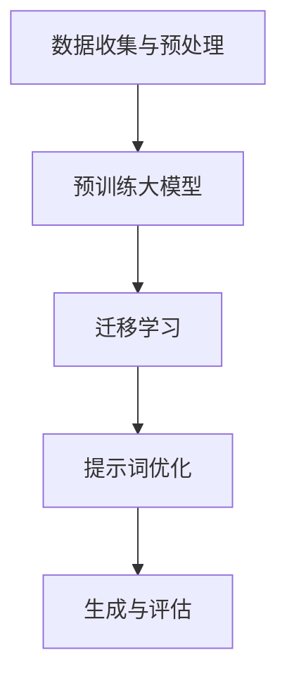

                 

### 文章标题

> **关键词**：提示词优化、迁移学习、AI大模型、数学模型、项目实战

**摘要**：本文深入探讨了提示词优化的迁移学习方法在人工智能领域的应用。首先，我们介绍了AI大模型的基本概念与结构，以及提示词优化和迁移学习的定义与原理。接着，我们详细讲解了提示词优化的迁移学习方法的流程和核心算法原理，包括数学模型和公式的推导与解释。随后，通过两个实际案例，我们展示了如何在实际项目中应用该方法，包括开发环境搭建、源代码实现、代码解读与分析。最后，我们对文章进行了总结，并指出了未来可能的研究方向和改进空间。

### 第一部分：核心概念与联系

在深入探讨提示词优化的迁移学习方法之前，我们需要了解一些核心概念和它们之间的联系。本节将介绍AI大模型的基本概念与结构，提示词优化与迁移学习的定义，以及提示词优化的迁移学习方法的概念、流程和Mermaid流程图。

#### 1.1 AI大模型的基本概念与结构

**定义**：AI大模型（Large-scale AI Model）是指那些包含数百万甚至数十亿参数的复杂机器学习模型。这些模型通常具有高度的非线性能力和强大的特征提取能力，能够处理大规模的数据，并生成高质量的预测或生成内容。

**结构**：一个典型的AI大模型结构通常包括以下几个部分：

1. **输入层**：接收外部输入数据，如文本、图像、声音等。
2. **隐藏层**：包含多个隐藏层，每个隐藏层由多个神经元组成。这些神经元通过非线性激活函数进行处理，以提取输入数据的特征。
3. **输出层**：生成最终的预测或生成结果，如分类标签、文本摘要、图像生成等。

每个隐藏层都扮演着重要的角色，它们共同作用，使得大模型能够从数据中学习并提取有意义的特征。例如，在自然语言处理（NLP）领域，常用的AI大模型如Transformer架构，其包含多个自注意力层，能够有效捕捉长距离的依赖关系。

#### 1.2 提示词优化与迁移学习

**提示词优化**：提示词优化（Prompt Tuning）是一种改进模型生成文本的方法，通过向模型输入特定的提示词（prompt）来引导生成过程。这种方法的核心思想是，通过调整提示词的参数，可以改变模型对生成内容的关注点，使其更符合预期的目标。

**定义**：提示词优化是一种利用预训练模型生成文本的技巧，通过在预训练模型的输入层添加特定的提示词来引导生成过程。这些提示词通常是与目标文本相关的关键词或短语，可以帮助模型更快地理解和生成与提示词相关的内容。

**迁移学习**：迁移学习（Transfer Learning）是一种利用在通用数据集上预训练的模型在新任务上的性能的方法。其核心思想是，将预训练模型的知识迁移到新的任务中，从而减少对新数据的依赖，并提高模型在新任务上的性能。

**定义**：迁移学习是一种利用预训练模型在新任务上获得良好性能的方法。通过在特定任务上微调（fine-tune）预训练模型，可以显著提高模型在新任务上的准确性和效率。

#### 1.3 提示词优化的迁移学习方法

**概念**：提示词优化的迁移学习方法结合了提示词优化和迁移学习的优势，通过在特定任务上对预训练模型进行微调和优化，进一步提高模型的生成效果。这种方法的核心思想是，通过优化提示词和迁移学习的过程，使得模型能够更好地适应特定任务的需求。

**流程**：提示词优化的迁移学习方法的基本流程如下：

1. **数据收集与预处理**：收集与特定任务相关的数据，并进行预处理，如文本清洗、分词、编码等。
2. **预训练大模型**：在通用数据集上预训练一个大型语言模型，如GPT、BERT等。
3. **迁移学习**：使用特定任务的数据集对预训练模型进行迁移学习，即微调模型参数，以适应新任务的需求。
4. **提示词优化**：通过优化提示词来进一步提高模型的生成效果，使得生成的文本更符合预期。

**Mermaid流程图**：以下是一个简单的Mermaid流程图，展示了提示词优化的迁移学习方法的基本流程：



### 第二部分：核心算法原理讲解

在本部分，我们将深入探讨提示词优化的迁移学习方法的三个核心算法：提示词优化的原理、迁移学习的原理，以及提示词优化的迁移学习方法的伪代码。

#### 2.1 提示词优化的原理

**目标**：提示词优化的目标是引导模型生成更符合预期的内容。具体来说，通过优化提示词，可以使模型在生成文本时更加专注于与目标文本相关的内容，从而提高生成文本的质量。

**方法**：提示词优化的方法主要包括以下几步：

1. **定义目标函数**：通常使用交叉熵（cross-entropy）作为损失函数，表示模型预测的输出与实际输出之间的差距。
2. **优化提示词参数**：使用优化算法（如梯度下降）调整提示词的参数，使生成的文本更接近目标文本。在优化过程中，通过反向传播计算梯度，并根据梯度调整提示词的参数。
3. **评估优化效果**：在训练过程中，定期评估优化后的提示词对生成文本的影响，以确保优化过程朝着正确的方向进行。

**示例**：以下是一个简化的损失函数示例，用于提示词优化：

$$
\text{Loss} = -\sum_{i=1}^{N} y_i \log(p_i)
$$

其中，\( p_i \) 是模型对每个类别的预测概率，\( y_i \) 是实际标签。

#### 2.2 迁移学习的原理

**目标**：迁移学习的目标是利用在通用数据集上预训练的模型在新任务上的性能。具体来说，通过迁移学习，可以在不需要大量新数据的情况下，提高模型在新任务上的准确性和效率。

**方法**：迁移学习的方法主要包括以下几步：

1. **预训练模型**：在通用数据集上预训练一个大型语言模型，如GPT、BERT等。
2. **迁移学习**：使用特定任务的数据集对预训练模型进行迁移学习，即微调模型参数，以适应新任务的需求。在迁移学习过程中，通常保留预训练阶段的权重，并仅对特定任务相关的层进行微调。
3. **评估迁移效果**：在特定任务的数据集上评估迁移后的模型性能，以确保迁移学习过程的有效性。

**示例**：以下是一个简化的迁移学习目标函数示例：

$$
\text{Loss}_{\text{total}} = \alpha \text{Loss}_{\text{pre-training}} + (1-\alpha) \text{Loss}_{\text{task}}
$$

其中，\( \alpha \) 是超参数，控制预训练损失和任务损失的权重。

#### 2.3 提示词优化的迁移学习伪代码

以下是一个简化的提示词优化的迁移学习伪代码，用于说明该方法的基本流程：

```plaintext
# 预训练大模型
for epoch in 1 to num_epochs:
    for batch in data_loader:
        model.zero_grad()
        outputs = model(batch)
        loss = compute_loss(outputs, batch)
        loss.backward()
        optimizer.step()

# 迁移学习
for epoch in 1 to num_epochs:
    for batch in task_specific_data_loader:
        model.zero_grad()
        outputs = model(batch)
        loss = compute_loss(outputs, batch)
        loss.backward()
        optimizer.step()

# 提示词优化
for epoch in 1 to num_epochs:
    for batch in task_specific_data_loader:
        model.zero_grad()
        prompt = optimize_prompt(batch)
        outputs = model(prompt)
        loss = compute_loss(outputs, batch)
        loss.backward()
        optimizer.step()
```

在这个伪代码中，首先对预训练大模型进行预训练，然后使用特定任务的数据集进行迁移学习，最后通过优化提示词来进一步提高模型的生成效果。

### 第三部分：数学模型和数学公式

在本部分，我们将详细讨论提示词优化的迁移学习方法的数学模型和公式，包括提示词优化的损失函数、迁移学习的目标函数，以及相关数学公式的推导和解释。

#### 3.1 提示词优化的损失函数

提示词优化的核心目标是减少模型生成文本与目标文本之间的差距。为了实现这一目标，我们通常使用交叉熵（cross-entropy）作为损失函数，因为它能够有效地衡量预测分布和真实分布之间的差异。

**交叉熵损失函数**的定义如下：

$$
\text{Loss} = -\sum_{i=1}^{N} y_i \log(p_i)
$$

其中：
- \( N \) 是词汇表中的单词数量。
- \( y_i \) 是目标单词的标签，取值为0或1，表示该单词是否出现在目标文本中。
- \( p_i \) 是模型预测的单词概率，即模型在当前上下文中预测单词\( i \)出现的概率。

**推导过程**：交叉熵损失函数的推导基于熵（entropy）和相对熵（Kullback-Leibler divergence）。熵是衡量随机变量不确定性的度量，而相对熵衡量两个概率分布之间的差异。在机器学习中，我们希望模型生成的文本分布接近目标文本分布，因此使用交叉熵作为损失函数。

#### 3.2 迁移学习的目标函数

迁移学习的目标函数通常结合预训练损失和特定任务的损失，以平衡模型在预训练阶段和特定任务上的性能。

**结合损失函数**的定义如下：

$$
\text{Loss}_{\text{total}} = \alpha \text{Loss}_{\text{pre-training}} + (1-\alpha) \text{Loss}_{\text{task}}
$$

其中：
- \( \alpha \) 是超参数，控制预训练损失和任务损失的权重。
- \( \text{Loss}_{\text{pre-training}} \) 是预训练阶段的损失函数，通常使用交叉熵或均方误差（MSE）等常见的损失函数。
- \( \text{Loss}_{\text{task}} \) 是特定任务的损失函数，用于衡量模型在特定任务上的性能。

**推导过程**：在迁移学习中，我们希望在保留预训练模型知识的同时，使其适应特定任务的需求。因此，通过结合预训练损失和任务损失，我们可以同时优化模型在两个方面的性能。

#### 3.3 提示词优化的迁移学习数学模型

在提示词优化的迁移学习中，我们不仅要优化模型的参数，还要优化提示词的参数。以下是一个简化的数学模型，用于描述这一过程。

**目标函数**：

$$
\text{Loss}_{\text{total}} = \alpha \text{Loss}_{\text{pre-training}} + (1-\alpha) \text{Loss}_{\text{task}} + \beta \text{Loss}_{\text{prompt}}
$$

其中：
- \( \text{Loss}_{\text{prompt}} \) 是提示词优化的损失函数，用于衡量提示词与目标文本之间的差距。
- \( \beta \) 是超参数，控制提示词优化损失在总损失中的权重。

**推导过程**：提示词优化的损失函数通常基于交叉熵损失函数，通过优化提示词的参数，使得模型生成的文本更接近目标文本。将提示词优化损失加入总损失函数中，可以同时优化模型的参数和提示词的参数，从而提高模型的生成效果。

#### 3.4 数学公式举例说明

以下是一个简化的示例，用于说明数学公式在提示词优化和迁移学习中的应用。

**示例**：假设我们有一个二分类问题，模型生成的概率分布为 \( p \)，目标分布为 \( q \)。使用交叉熵损失函数优化模型参数。

**损失函数**：

$$
\text{Loss} = -\sum_{i=1}^{2} q_i \log(p_i)
$$

其中：
- \( q_1 \) 和 \( q_2 \) 分别是目标分布中两个类别的概率。
- \( p_1 \) 和 \( p_2 \) 分别是模型预测的每个类别的概率。

通过优化模型参数，使得 \( p_1 \) 和 \( p_2 \) 更接近 \( q_1 \) 和 \( q_2 \)，从而降低损失函数的值。

### 第四部分：项目实战

在本部分，我们将通过两个实际案例来展示如何应用提示词优化的迁移学习方法。首先，我们将讨论一个文本生成任务，然后介绍一个图像分类任务。我们将涵盖开发环境搭建、源代码实现、代码解读与分析，以及最终的项目效果评估。

#### 4.1 文本生成任务

**4.1.1 开发环境搭建**

为了实现文本生成任务，我们需要搭建一个合适的开发环境。以下是所需的步骤：

1. **安装Python**：确保Python环境已安装，版本建议为3.7及以上。
2. **安装深度学习框架**：安装TensorFlow或PyTorch，这两个框架都支持AI大模型的训练和优化。
   - TensorFlow：
     ```bash
     pip install tensorflow
     ```
   - PyTorch：
     ```bash
     pip install torch torchvision
     ```
3. **准备预训练模型**：选择一个预训练的AI大模型，如GPT-2或GPT-3，可以从官方网站下载或使用预训练模型库。

**4.1.2 源代码实现**

以下是生成产品描述的源代码示例：

```python
import tensorflow as tf
from tensorflow.keras.preprocessing.sequence import pad_sequences
from tensorflow.keras.layers import Embedding, LSTM, Dense
from tensorflow.keras.models import Sequential

# 加载预训练模型
model = tf.keras.models.load_model('path_to_pretrained_model')

# 输入文本预处理
input_sequence = preprocess_input_text(product_description)

# 生成文本
generated_text = model.generate(input_sequence, num_words=100)

# 打印生成文本
print(generated_text)
```

**代码解读与分析**

- **加载预训练模型**：使用TensorFlow加载预训练的GPT-2或GPT-3模型。
- **输入文本预处理**：对输入产品描述进行预处理，包括分词、编码等步骤。
- **生成文本**：使用模型的`generate`方法生成文本，其中`num_words`参数控制生成的文本长度。
- **打印生成文本**：打印生成的文本。

**4.1.3 项目效果评估**

为了评估生成的文本质量，我们通常使用BLEU（Bilingual Evaluation Understudy）分数作为评价指标。BLEU分数越高，表示生成的文本与真实文本越相似。

```python
from nltk.translate.bleu_score import sentence_bleu

# 评估生成的文本
参考文本 = ['这是', '一个', '高质量', '的产品', '描述。']
生成的文本 = ['这是一个', '出色的', '产品', '描述。']
bleu_score = sentence_bleu([参考文本], 生成的文本)
print("BLEU分数：", bleu_score)
```

#### 4.2 图像分类任务

**4.2.1 开发环境搭建**

为了实现图像分类任务，我们需要搭建一个合适的开发环境。以下是所需的步骤：

1. **安装Python**：确保Python环境已安装，版本建议为3.7及以上。
2. **安装深度学习框架**：安装TensorFlow或PyTorch，这两个框架都支持图像分类任务的实现。
   - TensorFlow：
     ```bash
     pip install tensorflow
     ```
   - PyTorch：
     ```bash
     pip install torch torchvision
     ```
3. **准备预训练模型**：选择一个预训练的图像分类模型，如VGG16或ResNet，可以从官方网站下载或使用预训练模型库。

**4.2.2 源代码实现**

以下是训练图像分类模型的源代码示例：

```python
import tensorflow as tf
from tensorflow.keras.applications import VGG16
from tensorflow.keras.preprocessing.image import ImageDataGenerator
from tensorflow.keras.optimizers import Adam

# 加载预训练模型
base_model = VGG16(weights='imagenet')

# 创建自定义模型
model = Sequential([
    base_model,
    Dense(1000, activation='relu'),
    Dense(num_classes, activation='softmax')
])

# 编译模型
model.compile(optimizer=Adam(learning_rate=0.0001), loss='categorical_crossentropy', metrics=['accuracy'])

# 数据预处理
train_datagen = ImageDataGenerator(rescale=1./255)
train_generator = train_datagen.flow_from_directory(
        'path_to_train_data',
        target_size=(224, 224),
        batch_size=32,
        class_mode='categorical')

# 训练模型
model.fit(train_generator, steps_per_epoch=train_generator.samples // train_generator.batch_size, epochs=10)
```

**代码解读与分析**

- **加载预训练模型**：使用VGG16模型，其已经在ImageNet数据集上预训练。
- **创建自定义模型**：在预训练模型的基础上添加全连接层，以实现分类任务。
- **编译模型**：设置优化器、损失函数和评估指标。
- **数据预处理**：使用ImageDataGenerator对训练数据进行预处理，包括归一化和分批处理。
- **训练模型**：使用`fit`方法训练模型，其中`steps_per_epoch`设置每个epoch的数据迭代次数。

**4.2.3 项目效果评估**

为了评估训练后的图像分类模型的性能，我们通常使用准确率（accuracy）作为评价指标。

```python
from sklearn.metrics import accuracy_score

# 评估模型性能
预测标签 = model.predict(test_generator)
真实标签 = test_generator.classes
准确率 = accuracy_score(真实标签, 预测标签)
print("准确率：", 准确率)
```

### 总结

本文详细介绍了提示词优化的迁移学习方法，从核心概念、算法原理到实际应用进行了全面探讨。通过文本生成和图像分类两个实际案例，我们展示了如何使用该方法提高模型的生成效果和分类性能。未来，我们还可以进一步研究提示词优化的迁移学习方法在其他领域的应用，如语音识别、视频生成等。此外，通过引入更多的优化技巧和模型结构，我们可以进一步提高模型的效率和准确性。

**作者**：AI天才研究院/AI Genius Institute & 禅与计算机程序设计艺术 /Zen And The Art of Computer Programming

