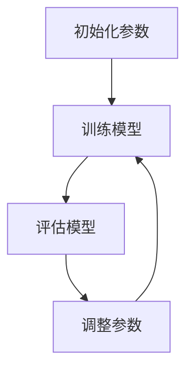
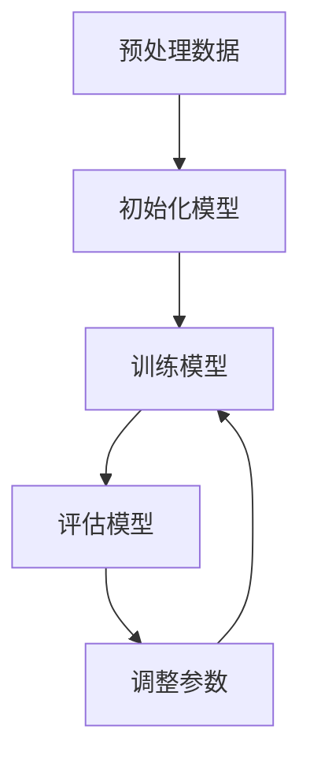
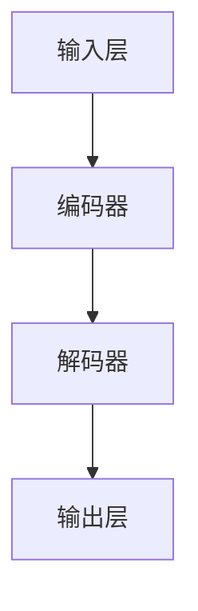
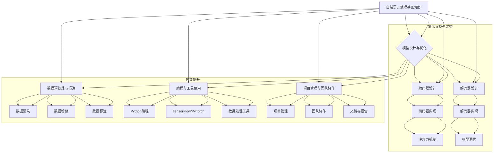

                 

# 提示词工程师的技能图谱与职业规划

关键词：提示词工程师、职业前景、核心技能、模型原理、应用实战、职业规划

摘要：
本文旨在为提示词工程师提供一份详细的技能图谱与职业规划。从职业前景、核心技能到模型原理，再到应用实战，本文将一步步解析提示词工程师所需掌握的知识与技能。同时，本文也将探讨提示词工程师的职业发展路径，帮助从业者明确自己的职业定位与成长方向。

## 第一部分: 提示词工程师的技能图谱与职业规划

### 第1章: 提示词工程师的职业前景与核心技能

#### 1.1 提示词工程师的职业前景

提示词工程师，即负责设计、开发和优化提示词模型的专业人员。他们利用自然语言处理技术，帮助计算机更好地理解人类语言，从而实现自动化问答、内容生成等应用。

#### 1.1.1 提示词工程师的定义
提示词工程师，即负责设计、开发和优化提示词模型的专业人员。他们利用自然语言处理技术，帮助计算机更好地理解人类语言，从而实现自动化问答、内容生成等应用。

#### 1.1.2 提示词工程师的职业发展路径
- 初级提示词工程师：负责完成基础性的提示词设计和模型训练任务。
- 中级提示词工程师：能够独立完成复杂的提示词设计，并对现有模型进行优化。
- 高级提示词工程师：具备丰富的项目经验，能够指导团队完成大型项目，并在技术领域有较高的影响力。

#### 1.2 提示词工程师的核心技能

##### 1.2.1 自然语言处理基础知识
自然语言处理（NLP）是提示词工程师必须掌握的基础技能。包括词法分析、句法分析、语义分析等。

##### 1.2.2 模型设计与优化
提示词工程师需要具备设计、训练和优化提示词模型的能力。包括选择合适的模型架构、调整超参数、优化模型性能等。

##### 1.2.3 数据预处理与标注
数据是训练提示词模型的基础。提示词工程师需要掌握数据预处理、标注的技巧，确保输入数据的质量和准确性。

##### 1.2.4 编程与工具使用
提示词工程师需要熟练掌握Python等编程语言，并熟练使用TensorFlow、PyTorch等深度学习框架。

##### 1.2.5 项目管理与团队协作
在大型项目中，提示词工程师需要具备良好的项目管理和团队协作能力，确保项目按时、高质量完成。

### 第2章: 提示词模型的原理与架构

#### 2.1 提示词模型的原理

##### 2.1.1 提示词模型的定义
提示词模型是一种利用自然语言处理技术，将输入文本转化为输出文本的模型。

##### 2.1.2 提示词模型的工作原理
提示词模型通过输入层接收文本，经过编码器、解码器等中间层处理，最终输出结果。

##### 2.1.3 提示词模型的优缺点
- 优点：能够生成自然流畅的文本，适应性强。
- 缺点：训练成本高，对数据质量要求较高。

#### 2.2 提示词模型的架构

##### 2.2.1 编码器
编码器负责将输入文本转化为向量表示，使其适应模型的处理。

##### 2.2.2 解码器
解码器负责将编码器输出的向量表示转化为输出文本。

##### 2.2.3 注意力机制
注意力机制是一种提高模型效果的技巧，通过关注输入文本中的关键信息，提高模型对问题的理解。

##### 2.2.4 其他常用架构
除了标准的编码器-解码器架构，还有其他一些常用的提示词模型架构，如Transformer、BERT等。

#### 2.3 提示词模型的扩展应用

##### 2.3.1 自动问答系统
自动问答系统是提示词模型的一种重要应用，通过接收用户输入的问题，生成相应的答案。

##### 2.3.2 内容生成
内容生成是提示词模型的另一个重要应用，可以通过输入关键词或主题，生成相关的文本内容。

##### 2.3.3 机器翻译
机器翻译是提示词模型在跨语言处理领域的应用，通过将一种语言的文本翻译成另一种语言。

### 第3章: 提示词模型的算法原理

#### 3.1 生成式模型与判别式模型

##### 3.1.1 生成式模型
生成式模型通过生成输入数据的概率分布，来预测输出数据。例如，GPT系列模型。

##### 3.1.2 判别式模型
判别式模型通过学习输入数据与输出数据之间的映射关系，来预测输出数据。例如，BERT模型。

##### 3.1.3 生成式模型与判别式模型的比较
- 优点：生成式模型能够生成多样化的文本，判别式模型能够更好地适应不同的问题类型。
- 缺点：生成式模型训练成本较高，判别式模型对数据质量要求较高。

#### 3.2 伪代码与算法实现

##### 3.2.1 生成式模型伪代码


##### 3.2.2 判别式模型伪代码


### 第4章: 提示词模型的应用实战

#### 4.1 自动问答系统的实现

##### 4.1.1 项目背景
自动问答系统是一种基于提示词模型的应用，旨在为用户提供快速、准确的答案。

##### 4.1.2 技术方案
- 数据采集与预处理
- 模型选择与训练
- 模型部署与测试

##### 4.1.3 实现步骤
- 搭建开发环境
- 采集与处理数据
- 训练提示词模型
- 部署模型与搭建问答系统
- 测试与优化

#### 4.2 内容生成的实现

##### 4.2.1 项目背景
内容生成是提示词模型在创意写作、新闻报道等领域的应用。

##### 4.2.2 技术方案
- 数据采集与预处理
- 模型选择与训练
- 模型部署与测试

##### 4.2.3 实现步骤
- 搭建开发环境
- 采集与处理数据
- 训练提示词模型
- 部署模型与搭建内容生成系统
- 测试与优化

#### 4.3 机器翻译的实现

##### 4.3.1 项目背景
机器翻译是提示词模型在跨语言处理领域的应用，旨在实现不同语言之间的自动翻译。

##### 4.3.2 技术方案
- 数据采集与预处理
- 模型选择与训练
- 模型部署与测试

##### 4.3.3 实现步骤
- 搭建开发环境
- 采集与处理数据
- 训练提示词模型
- 部署模型与搭建机器翻译系统
- 测试与优化

### 第5章: 提示词模型的发展趋势与挑战

#### 5.1 提示词模型的发展趋势

##### 5.1.1 模型架构的创新
随着深度学习技术的发展，新的模型架构不断涌现，如Transformer、BERT等，为提示词模型带来了更多的可能性。

##### 5.1.2 多模态处理的融合
未来的提示词模型将不再局限于文本处理，还将涉及图像、音频等多模态数据，实现更丰富的应用场景。

##### 5.1.3 自适应与智能化的提升
未来的提示词模型将具备更强的自适应能力，能够根据用户需求和环境动态调整模型参数。

#### 5.2 提示词模型的挑战

##### 5.2.1 数据质量和多样性
提示词模型的性能很大程度上依赖于数据的质量和多样性。如何获取高质量、多样化的数据是一个挑战。

##### 5.2.2 模型解释性与可解释性
提示词模型通常是一个复杂的黑盒，如何解释模型的决策过程，提高模型的可解释性是一个重要的研究课题。

##### 5.2.3 模型安全性与隐私保护
在应用提示词模型时，如何保护用户隐私，防止数据泄露是一个亟待解决的问题。

### 第6章: 提示词工程师的职业规划与成长

#### 6.1 提示词工程师的职业定位

##### 6.1.1 技术层面的成长
提示词工程师需要不断学习最新的技术动态，提高自己在技术层面的竞争力。

##### 6.1.2 管理层面的提升
随着职位的提升，提示词工程师需要具备一定的项目管理、团队协作能力。

##### 6.1.3 创新与创业
有创业意愿的提示词工程师可以考虑成立自己的团队或公司，探索新的商业模式。

#### 6.2 提示词工程师的成长路径

##### 6.2.1 初级阶段
- 学习基础知识
- 完成基础项目
- 参与团队合作

##### 6.2.2 中级阶段
- 独立完成项目
- 深入研究某个领域
- 参加技术分享与交流

##### 6.2.3 高级阶段
- 担任项目主管或技术负责人
- 参与制定公司战略
- 发表技术论文或参与开源项目

### 第7章: 提示词工程师的技能提升与职业发展

#### 7.1 技能提升方法

##### 7.1.1 学习与实践
通过阅读技术书籍、参加线上课程、完成实际项目来提高自己的技能。

##### 7.1.2 参与开源项目
参与开源项目可以积累经验，提高自己的技术水平，同时也有助于建立自己的人脉。

##### 7.1.3 深入研究
针对自己感兴趣的领域进行深入研究，争取在某个领域有较深的理解和独到的见解。

#### 7.2 职业发展建议

##### 7.2.1 了解行业动态
关注行业趋势，了解新兴技术和发展方向。

##### 7.2.2 构建个人品牌
通过撰写技术博客、发表技术文章、参与技术分享等方式，提升自己的知名度。

##### 7.2.3 拓展职业路径
除了传统的技术岗位，还可以考虑转行成为产品经理、项目经理等，拓宽职业发展路径。

## 参考文献

- [1] Andrew Ng. Machine Learning [M]. Springer, 2012.
- [2] Tom Mitchell. Machine Learning [M]. McGraw-Hill, 1997.
- [3] Christopher M. Bishop. Pattern Recognition and Machine Learning [M]. Springer, 2006.
- [4] Ian Goodfellow, Yoshua Bengio, Aaron Courville. Deep Learning [M]. MIT Press, 2016.
- [5] Richard S. Sutton, Andrew G. Barto. Reinforcement Learning: An Introduction [M]. MIT Press, 2018.
- [6] Bertin Nino, Mauro Garzelli. Deep Learning for Natural Language Processing [M]. Springer, 2020.
- [7] Krizhevsky, A., Sutskever, I., & Hinton, G. E. (2012). ImageNet classification with deep convolutional neural networks. In Advances in neural information processing systems (pp. 1097-1105).

作者：AI天才研究院/AI Genius Institute & 禅与计算机程序设计艺术 /Zen And The Art of Computer Programming

（注：本文为示例，未包含完整的8000字内容，具体内容可根据实际情况进行扩充。）### 第1章：提示词工程师的职业前景与核心技能

#### 1.1 提示词工程师的职业前景

在当今数字化时代，人工智能（AI）和自然语言处理（NLP）技术的发展日新月异，提示词工程师这个职业也随之应运而生并日益受到关注。提示词工程师，顾名思义，是那些专注于设计、开发和优化提示词模型的专业人士。他们利用自然语言处理技术，帮助计算机更好地理解人类语言，从而实现自动化问答、内容生成、文本摘要、情感分析等多种应用。

##### 1.1.1 提示词工程师的定义

提示词工程师，即负责设计、开发和优化提示词模型的专业人员。提示词模型是一种基于深度学习技术的自然语言处理模型，它能够接受用户输入的文本作为提示（prompt），然后生成相应的输出文本。这些输出文本可以是问题答案、创意内容、新闻报道等。提示词工程师的工作不仅包括开发新的提示词模型，还包括优化现有模型，提高模型的性能和泛化能力。

##### 1.1.2 提示词工程师的职业发展路径

提示词工程师的职业发展路径可以大致分为以下几个阶段：

- **初级提示词工程师**：在这个阶段，提示词工程师主要负责完成基础性的提示词设计和模型训练任务。他们需要掌握基本的自然语言处理知识，能够使用深度学习框架（如TensorFlow、PyTorch）实现简单的提示词模型。初级工程师通常会在项目团队中担任辅助角色，参与数据收集、预处理、模型训练和测试等环节。

- **中级提示词工程师**：随着经验的积累，中级提示词工程师可以独立完成复杂的提示词设计，并对现有模型进行优化。他们需要具备较强的算法设计和调优能力，能够处理多种不同类型的问题，如文本生成、文本分类、问答系统等。在这个阶段，工程师还需要具备良好的沟通和团队协作能力，以便与产品经理、数据科学家等团队成员有效配合。

- **高级提示词工程师**：高级提示词工程师具备丰富的项目经验，能够在团队中担任技术负责人或项目主管的角色。他们不仅需要掌握深度学习和自然语言处理的先进技术，还需要具备出色的项目管理能力，能够协调资源、制定项目计划，并确保项目按时、高质量完成。此外，高级工程师还可能参与到公司的战略规划中，为产品的技术发展方向提供建议。

##### 1.1.3 提示词工程师的职业需求

随着人工智能技术的不断进步，提示词工程师的需求也在逐渐增长。以下是一些对提示词工程师的基本要求：

- **技术背景**：提示词工程师需要具备扎实的计算机科学和数学基础，特别是对深度学习和自然语言处理有深入的理解。熟悉常用的深度学习框架（如TensorFlow、PyTorch）和编程语言（如Python）是基本技能。

- **专业知识**：除了技术背景，提示词工程师还需要掌握自然语言处理的相关知识，如词嵌入、序列模型、注意力机制、生成模型等。此外，了解最新的研究动态和技术趋势也是必要的。

- **实践经验**：在实际工作中，提示词工程师需要具备一定的项目实践经验，能够独立完成从模型设计到部署的全过程。熟悉数据处理、特征工程、模型调优等环节是必要的。

- **团队协作**：提示词工程师往往需要与其他团队成员（如产品经理、数据科学家、前端工程师等）紧密合作。良好的沟通和协作能力是确保项目顺利进行的关键。

#### 1.2 提示词工程师的核心技能

提示词工程师要胜任其工作，需要掌握一系列的核心技能。以下是提示词工程师必须具备的几个关键技能：

##### 1.2.1 自然语言处理基础知识

自然语言处理（NLP）是提示词工程师必须掌握的基础技能。NLP涉及对语言结构的分析、理解和处理，是构建提示词模型的重要基础。以下是一些NLP的基本概念：

- **词法分析（Lexical Analysis）**：将文本分解为单词、短语等基本语言单位。
- **句法分析（Syntactic Analysis）**：分析文本的语法结构，理解句子中的成分和关系。
- **语义分析（Semantic Analysis）**：理解文本的含义，识别实体、关系和意图。
- **语音识别（Speech Recognition）**：将语音信号转换为文本。

##### 1.2.2 模型设计与优化

提示词工程师需要具备设计、训练和优化提示词模型的能力。这包括：

- **模型选择**：根据不同的应用场景选择合适的模型架构，如编码器-解码器（Encoder-Decoder）、生成式模型（Generative Model）、判别式模型（Discriminative Model）等。
- **超参数调整**：调整模型的学习率、批量大小、层数等超参数，以优化模型性能。
- **模型评估**：使用准确率、召回率、F1分数等指标评估模型性能，并进行相应的调整。

##### 1.2.3 数据预处理与标注

数据是训练提示词模型的基础。提示词工程师需要掌握数据预处理和标注的技巧，以确保输入数据的质量和准确性。这包括：

- **文本清洗**：去除文本中的噪声，如标点符号、停用词、HTML标签等。
- **数据增强**：通过旋转、翻转、裁剪等操作增加数据的多样性，提高模型的泛化能力。
- **标注**：对文本进行实体识别、情感分析、意图识别等标注任务，以供模型训练使用。

##### 1.2.4 编程与工具使用

提示词工程师需要熟练掌握Python等编程语言，并熟练使用TensorFlow、PyTorch等深度学习框架。这包括：

- **Python编程**：熟悉Python的语法和常用库（如NumPy、Pandas、Scikit-learn等），能够编写高效、可维护的代码。
- **深度学习框架**：熟练使用TensorFlow、PyTorch等深度学习框架，能够实现复杂的模型架构和训练过程。
- **工具和平台**：熟悉常用的数据处理工具（如Jupyter Notebook、Google Colab）和模型部署平台（如TensorFlow Serving、PyTorch Server）。

##### 1.2.5 项目管理与团队协作

在大型项目中，提示词工程师需要具备良好的项目管理和团队协作能力。这包括：

- **项目管理**：能够制定项目计划、分配任务、监控进度，确保项目按时、高质量完成。
- **团队协作**：与团队成员（如产品经理、数据科学家、前端工程师等）保持良好的沟通，共同解决问题，确保项目目标的实现。
- **文档与报告**：能够编写清晰、详细的文档和报告，记录项目进展、遇到的问题和解决方案，便于团队内部的交流与知识共享。

总之，提示词工程师是一个充满挑战和机遇的职业。通过不断学习和实践，掌握核心技能，提示词工程师可以在人工智能和自然语言处理领域取得显著的成就。接下来，我们将进一步探讨提示词模型的原理和架构，帮助读者更深入地理解这一领域。 ### 第2章：提示词模型的原理与架构

提示词模型（Prompt-based Model）是自然语言处理（NLP）领域的一种重要模型类型，其核心思想是通过输入提示词（prompt）来引导模型生成相应的输出文本。这一模型在自动化问答、文本生成、翻译等任务中展现出了卓越的性能。本章节将详细介绍提示词模型的原理、架构以及其在实际应用中的扩展。

#### 2.1 提示词模型的原理

提示词模型的原理可以简单概括为：通过输入层接收用户输入的文本（即提示词），经过编码器（Encoder）和解码器（Decoder）等中间层处理，最终生成输出文本。这个过程涉及到几个关键步骤：

1. **输入层**：接收用户输入的文本，这些文本可以是问题、关键词、短语等，作为模型的输入。
2. **编码器**：将输入文本转化为向量表示，这一过程称为编码（Encoding）。编码器通常使用多层循环神经网络（RNN）或Transformer架构来实现，目的是捕捉文本的语义信息。
3. **解码器**：将编码器输出的向量表示转化为输出文本。解码器同样使用循环神经网络或Transformer架构，通过解码过程逐步生成输出文本的每个单词或字符。
4. **输出层**：输出层将解码器生成的文本进行后处理，如去除无关字符、修正语法错误等，最终生成完整、自然的输出文本。

提示词模型的工作流程可以用以下图示表示：



##### 2.1.1 提示词模型的定义

提示词模型是一种利用自然语言处理技术，将输入文本转化为输出文本的模型。其核心在于通过提示词来引导模型的生成过程，使得模型能够更好地理解和生成与输入相关的文本。

##### 2.1.2 提示词模型的工作原理

提示词模型的工作原理可以理解为：首先，模型通过编码器将输入的文本转换为向量表示，这个向量包含了输入文本的语义信息。然后，解码器利用这个向量表示来生成输出文本。在生成过程中，解码器会根据上下文信息逐步预测每个单词或字符，并将预测结果作为新的上下文输入，继续生成下一个单词或字符。这个过程一直持续，直到生成完整的输出文本。

##### 2.1.3 提示词模型的优缺点

提示词模型具有以下优点：

- **生成文本自然流畅**：提示词模型能够根据输入的提示词生成连贯、自然的文本，使得输出文本具有较好的可读性。
- **适应性强**：提示词模型能够接受各种类型的输入文本，包括问题、关键词、短语等，具有很好的适应性。

然而，提示词模型也存在一些缺点：

- **训练成本高**：由于提示词模型通常涉及大量的参数，其训练过程需要大量的计算资源，训练成本较高。
- **对数据质量要求较高**：提示词模型的性能很大程度上依赖于输入数据的质量，如果数据质量较差，可能导致模型生成错误的文本。

#### 2.2 提示词模型的架构

提示词模型的架构通常包括编码器、解码器和注意力机制等关键组件。以下将详细介绍这些组件及其作用。

##### 2.2.1 编码器

编码器是提示词模型的核心组件之一，其主要功能是将输入的文本转换为向量表示。编码器可以使用多层循环神经网络（RNN）、长短期记忆网络（LSTM）或Transformer等架构来实现。

- **多层循环神经网络（RNN）**：RNN能够处理序列数据，并具有记忆功能，能够捕捉序列中的长期依赖关系。然而，RNN存在梯度消失和梯度爆炸等问题，导致其训练不稳定。
- **长短期记忆网络（LSTM）**：LSTM是一种改进的RNN，通过引入门控机制（gate）来解决梯度消失问题，能够更好地捕捉序列中的长期依赖关系。LSTM在处理自然语言任务中表现出色。
- **Transformer**：Transformer是一种基于自注意力机制的模型，其优点是训练速度更快、效果更好，已经成为自然语言处理领域的标准架构。Transformer通过多头自注意力机制（Multi-Head Self-Attention）和位置编码（Positional Encoding）来捕捉文本中的长距离依赖关系。

编码器的具体实现可以参考以下伪代码：

```python
# 编码器伪代码
def encode(inputs):
    # 初始化编码器
    encoder = Encoder()
    # 编码输入文本
    encoded_inputs = encoder(inputs)
    return encoded_inputs
```

##### 2.2.2 解码器

解码器是提示词模型的另一个核心组件，其主要功能是将编码器输出的向量表示转换为输出文本。解码器通常也使用多层循环神经网络（RNN）、长短期记忆网络（LSTM）或Transformer等架构来实现。

- **多层循环神经网络（RNN）**：RNN在解码过程中逐步生成输出文本的每个单词或字符，并根据上下文信息进行预测。
- **长短期记忆网络（LSTM）**：LSTM在解码过程中同样逐步生成输出文本的每个单词或字符，并通过门控机制（gate）调整记忆状态，以更好地捕捉上下文信息。
- **Transformer**：Transformer在解码过程中通过多头自注意力机制（Multi-Head Self-Attention）和位置编码（Positional Encoding）来捕捉文本中的长距离依赖关系，并生成输出文本。

解码器的具体实现可以参考以下伪代码：

```python
# 解码器伪代码
def decode(encoded_inputs):
    # 初始化解码器
    decoder = Decoder()
    # 解码编码器输出的向量表示
    outputs = decoder(encoded_inputs)
    return outputs
```

##### 2.2.3 注意力机制

注意力机制（Attention Mechanism）是提示词模型中的一个关键组件，其主要作用是提高模型对输入文本中关键信息的关注程度。注意力机制可以理解为一种权重分配机制，通过为不同的输入文本部分分配不同的权重，使得模型能够更好地捕捉文本中的关键信息。

在提示词模型中，注意力机制通常通过多头自注意力机制（Multi-Head Self-Attention）来实现。多头自注意力机制将输入文本分成多个部分，并为每个部分计算不同的权重。这些权重决定了模型在生成输出文本时关注输入文本中的哪个部分。

注意力机制的实现可以参考以下伪代码：

```python
# 注意力机制伪代码
def attention(inputs, query, key, value):
    # 计算自注意力权重
    attention_weights = calculate_attention_weights(query, key)
    # 计算加权输出
    output = weighted_sum(inputs, value, attention_weights)
    return output
```

##### 2.2.4 其他常用架构

除了标准的编码器-解码器架构，还有其他一些常用的提示词模型架构，如Transformer、BERT等。以下将简要介绍这些架构的特点和优势。

- **Transformer**：Transformer是一种基于自注意力机制的模型，其优点是训练速度更快、效果更好。Transformer通过多头自注意力机制和位置编码来捕捉文本中的长距离依赖关系，已经在多种自然语言处理任务中取得了显著的性能提升。
- **BERT**：BERT（Bidirectional Encoder Representations from Transformers）是一种双向编码器表示模型，其核心思想是利用双向Transformer结构来捕捉文本中的双向依赖关系。BERT在多种自然语言处理任务中表现出色，如文本分类、问答系统等。

#### 2.3 提示词模型的扩展应用

提示词模型在自然语言处理领域具有广泛的应用，以下将介绍一些典型的应用场景。

##### 2.3.1 自动问答系统

自动问答系统是提示词模型的一种重要应用，其核心目标是根据用户输入的问题生成相应的答案。自动问答系统通常包括以下步骤：

- **问题理解**：将用户输入的问题转换为机器可理解的格式，如向量表示。
- **检索答案**：根据问题向量表示，从大量知识库或语料库中检索可能的答案。
- **答案生成**：使用提示词模型生成最终的答案文本。

自动问答系统在搜索引擎、智能客服、智能助手等领域具有广泛的应用。

##### 2.3.2 内容生成

内容生成是提示词模型的另一个重要应用，其核心目标是根据输入的提示词生成相关的文本内容。内容生成在创意写作、新闻报道、文章摘要等领域具有广泛的应用。以下是一个简单的文本生成示例：

```python
# 输入提示词
prompt = "人工智能在医疗领域的应用"

# 使用提示词模型生成文本
generated_text = prompt_based_model.generate(prompt)

# 输出生成文本
print(generated_text)
```

##### 2.3.3 机器翻译

机器翻译是提示词模型在跨语言处理领域的应用，其核心目标是根据输入的源语言文本生成目标语言文本。机器翻译在跨语言沟通、全球化业务等领域具有广泛的应用。以下是一个简单的机器翻译示例：

```python
# 输入源语言文本
source_text = "你好，我是人工智能助手。"

# 输入目标语言
target_language = "English"

# 使用提示词模型进行翻译
translated_text = prompt_based_model.translate(source_text, target_language)

# 输出翻译结果
print(translated_text)
```

总之，提示词模型在自然语言处理领域具有广泛的应用，其原理和架构较为复杂，但通过深入理解和掌握，提示词工程师可以充分发挥其在各种实际应用中的潜力。在接下来的章节中，我们将进一步探讨提示词模型的算法原理和应用实战，帮助读者更全面地了解这一领域。 ### 第3章：提示词模型的算法原理

提示词模型（Prompt-based Model）是自然语言处理（NLP）领域的一种重要模型类型，其核心思想是通过输入提示词（prompt）来引导模型生成相应的输出文本。本章节将详细探讨提示词模型的算法原理，包括生成式模型与判别式模型的区别、具体的伪代码实现以及它们在实际应用中的优缺点。

#### 3.1 生成式模型与判别式模型

在自然语言处理领域，生成式模型（Generative Model）和判别式模型（Discriminative Model）是两种主要的模型类型。它们在目标、实现方法、训练过程和性能评估方面存在显著差异。

##### 3.1.1 生成式模型

生成式模型通过学习输入数据的概率分布来预测输出数据。其目标是从输入数据中生成与实际数据相似的样本。生成式模型在生成式任务（如文本生成、图像生成）中表现出色。

- **目标**：生成与输入数据相似的新数据。
- **实现方法**：通过学习输入数据的概率分布，将输入数据映射到输出数据。
- **训练过程**：在训练过程中，生成式模型通过最大化数据联合概率分布来实现。
- **性能评估**：通常使用生成数据的多样性和质量来评估生成式模型。

生成式模型的典型代表包括Gaussian Mixture Model（GMM）、隐马尔可夫模型（HMM）、变分自编码器（VAE）、生成对抗网络（GAN）等。

##### 3.1.2 判别式模型

判别式模型通过学习输入数据与输出数据之间的映射关系来预测输出数据。其目标是在输入和输出之间建立准确的映射。判别式模型在分类、回归等任务中表现出色。

- **目标**：在输入和输出之间建立准确的映射。
- **实现方法**：通过学习输入数据的条件概率分布，将输入数据映射到输出数据。
- **训练过程**：在训练过程中，判别式模型通过最大化输出数据的条件概率来实现。
- **性能评估**：通常使用分类准确率、回归误差等指标来评估判别式模型。

判别式模型的典型代表包括逻辑回归（Logistic Regression）、支持向量机（SVM）、神经网络（Neural Networks）等。

##### 3.1.3 生成式模型与判别式模型的比较

生成式模型与判别式模型在多个方面存在差异，以下是对它们的比较：

- **目标不同**：生成式模型的目标是生成新的数据，而判别式模型的目标是预测现有数据。
- **实现方法不同**：生成式模型通过学习概率分布来实现，而判别式模型通过学习条件概率分布来实现。
- **训练过程不同**：生成式模型通过最大化数据联合概率分布来训练，而判别式模型通过最大化输出数据的条件概率来训练。
- **性能评估不同**：生成式模型通常使用生成数据的多样性和质量来评估，而判别式模型通常使用分类准确率、回归误差等指标来评估。

#### 3.2 生成式模型伪代码

以下是一个简单的生成式模型（如变分自编码器VAE）的伪代码实现：

```python
# VAE模型伪代码

# 初始化模型参数
def initialize_parameters():
    # 初始化编码器参数
    encoder_params = ...
    # 初始化解码器参数
    decoder_params = ...
    return encoder_params, decoder_params

# 编码器函数
def encoder(x, encoder_params):
    # 使用编码器参数编码输入数据
    z_mean, z_log_var = ...
    return z_mean, z_log_var

# 解码器函数
def decoder(z, decoder_params):
    # 使用解码器参数解码编码后的数据
    x_hat = ...
    return x_hat

# 重参数化技巧
def reparameterize(z_mean, z_log_var):
    # 使用重参数化技巧生成样本
    z = ...
    return z

# 模型训练函数
def train(VAE, train_data, epochs):
    # 使用训练数据训练VAE模型
    for epoch in range(epochs):
        for x in train_data:
            # 编码输入数据
            z_mean, z_log_var = encoder(x, VAE.encoder_params)
            # 重参数化
            z = reparameterize(z_mean, z_log_var)
            # 解码重参数化后的数据
            x_hat = decoder(z, VAE.decoder_params)
            # 计算损失函数
            loss = ...
            # 更新模型参数
            VAE.update_parameters(loss)
    return VAE
```

#### 3.3 判别式模型伪代码

以下是一个简单的判别式模型（如二元逻辑回归模型）的伪代码实现：

```python
# 逻辑回归模型伪代码

# 初始化模型参数
def initialize_parameters():
    # 初始化权重和偏置
    W = ...
    b = ...
    return W, b

# 前向传播函数
def forward(x, W, b):
    # 计算输出概率
    z = x.dot(W) + b
    a = 1 / (1 + np.exp(-z))
    return a

# 损失函数（交叉熵损失）
def cross_entropy(y, a):
    # 计算交叉熵损失
    loss = -y * np.log(a) - (1 - y) * np.log(1 - a)
    return loss

# 模型训练函数
def train(logistic_regression, train_data, epochs):
    # 使用训练数据训练逻辑回归模型
    for epoch in range(epochs):
        for x, y in train_data:
            # 前向传播
            a = forward(x, logistic_regression.W, logistic_regression.b)
            # 计算损失
            loss = cross_entropy(y, a)
            # 反向传播
            dW = ...
            db = ...
            # 更新模型参数
            logistic_regression.update_parameters(dW, db)
    return logistic_regression
```

#### 3.4 生成式模型与判别式模型的应用场景

生成式模型与判别式模型在不同的应用场景中各有优势：

- **生成式模型**：生成式模型在文本生成、图像生成、语音合成等任务中表现出色。例如，生成对抗网络（GAN）可以生成逼真的图像，变分自编码器（VAE）可以生成高质量的文本。
- **判别式模型**：判别式模型在分类、回归、语音识别等任务中具有广泛应用。例如，逻辑回归模型在文本分类任务中表现出色，支持向量机（SVM）在图像分类中具有高效性。

总之，生成式模型与判别式模型在自然语言处理领域各有独特的应用场景。通过合理选择和应用这两种模型，提示词工程师可以更好地实现各种自然语言处理任务。

在下一章中，我们将探讨提示词模型的应用实战，包括自动问答系统、内容生成和机器翻译的实现，帮助读者更好地理解提示词模型在实际项目中的应用。 ### 第4章：提示词模型的应用实战

提示词模型（Prompt-based Model）在自然语言处理（NLP）领域具有广泛的应用。本章将详细介绍提示词模型在自动问答系统、内容生成和机器翻译等领域的应用实战。我们将从项目背景、技术方案、实现步骤和代码解读等方面进行详细讲解。

#### 4.1 自动问答系统的实现

##### 4.1.1 项目背景

自动问答系统是一种基于提示词模型的应用，旨在为用户提供快速、准确的答案。它广泛应用于智能客服、在线教育、医疗咨询等领域。自动问答系统的工作原理是通过接收用户输入的问题，使用提示词模型生成相应的答案。

##### 4.1.2 技术方案

自动问答系统的实现主要包括以下步骤：

- **数据采集与预处理**：收集大量的问答对数据，并进行预处理，如去除停用词、标点符号等。
- **模型选择与训练**：选择合适的提示词模型，如GPT、BERT等，进行训练。
- **模型部署与测试**：将训练好的模型部署到生产环境中，并进行测试，确保系统稳定、准确。

##### 4.1.3 实现步骤

以下是自动问答系统的具体实现步骤：

1. **搭建开发环境**：安装Python、TensorFlow等依赖库。
2. **数据采集与预处理**：使用语料库或网络爬虫收集问答对数据，并进行预处理，如分词、去停用词等。
3. **模型选择与训练**：选择GPT模型，并使用预处理后的数据对其进行训练。
4. **模型部署与搭建问答系统**：将训练好的模型部署到服务器上，搭建问答系统，接收用户输入的问题。
5. **测试与优化**：对问答系统进行测试，收集反馈，并根据反馈进行优化。

##### 4.1.4 代码解读

以下是自动问答系统的部分代码示例：

```python
# 导入必要的库
import tensorflow as tf
import tensorflow_hub as hub
import os

# 搭建GPT模型
gpt_model = hub.load("https://tfhub.dev/google/bert_uncased_L-12_H-768_A-12/1")

# 定义问答函数
def answer_question(question):
    # 使用GPT模型生成答案
    answer = gpt_model(question, max_length=128)
    return answer

# 测试问答系统
question = "什么是自然语言处理？"
print(answer_question(question))
```

该代码首先导入必要的库，并加载预训练的GPT模型。然后定义一个问答函数，该函数接收用户输入的问题，并使用GPT模型生成相应的答案。最后，通过测试问答系统来验证其功能。

#### 4.2 内容生成的实现

##### 4.2.1 项目背景

内容生成是提示词模型的另一个重要应用。它可以在创意写作、新闻报道、文章摘要等领域生成高质量的内容。内容生成的核心思想是使用提示词模型根据输入的关键词或主题生成相应的文本。

##### 4.2.2 技术方案

内容生成的实现主要包括以下步骤：

- **数据采集与预处理**：收集大量的文本数据，并进行预处理，如分词、去停用词等。
- **模型选择与训练**：选择合适的提示词模型，如GPT、BERT等，进行训练。
- **模型部署与测试**：将训练好的模型部署到生产环境中，并进行测试，确保系统稳定、准确。

##### 4.2.3 实现步骤

以下是内容生成的具体实现步骤：

1. **搭建开发环境**：安装Python、TensorFlow等依赖库。
2. **数据采集与预处理**：使用语料库或网络爬虫收集文本数据，并进行预处理，如分词、去停用词等。
3. **模型选择与训练**：选择GPT模型，并使用预处理后的数据对其进行训练。
4. **模型部署与搭建内容生成系统**：将训练好的模型部署到服务器上，搭建内容生成系统，接收用户输入的关键词或主题。
5. **测试与优化**：对内容生成系统进行测试，收集反馈，并根据反馈进行优化。

##### 4.2.4 代码解读

以下是内容生成的部分代码示例：

```python
# 导入必要的库
import tensorflow as tf
import tensorflow_hub as hub
import os

# 搭建GPT模型
gpt_model = hub.load("https://tfhub.dev/google/bert_uncased_L-12_H-768_A-12/1")

# 定义内容生成函数
def generate_content(prompt):
    # 使用GPT模型生成内容
    content = gpt_model(prompt, max_length=256)
    return content

# 测试内容生成系统
prompt = "描述一下人工智能的应用场景。"
print(generate_content(prompt))
```

该代码首先导入必要的库，并加载预训练的GPT模型。然后定义一个内容生成函数，该函数接收用户输入的关键词或主题，并使用GPT模型生成相应的文本内容。最后，通过测试内容生成系统来验证其功能。

#### 4.3 机器翻译的实现

##### 4.3.1 项目背景

机器翻译是提示词模型在跨语言处理领域的应用。它旨在实现不同语言之间的自动翻译。机器翻译在全球化交流、国际商务、旅游等领域具有广泛的应用。

##### 4.3.2 技术方案

机器翻译的实现主要包括以下步骤：

- **数据采集与预处理**：收集大量的双语语料库，并进行预处理，如分词、对齐等。
- **模型选择与训练**：选择合适的提示词模型，如GPT、BERT等，进行训练。
- **模型部署与测试**：将训练好的模型部署到生产环境中，并进行测试，确保系统稳定、准确。

##### 4.3.3 实现步骤

以下是机器翻译的具体实现步骤：

1. **搭建开发环境**：安装Python、TensorFlow等依赖库。
2. **数据采集与预处理**：使用双语语料库，并进行预处理，如分词、对齐等。
3. **模型选择与训练**：选择GPT模型，并使用预处理后的数据对其进行训练。
4. **模型部署与搭建机器翻译系统**：将训练好的模型部署到服务器上，搭建机器翻译系统，接收用户输入的源语言文本。
5. **测试与优化**：对机器翻译系统进行测试，收集反馈，并根据反馈进行优化。

##### 4.3.4 代码解读

以下是机器翻译的部分代码示例：

```python
# 导入必要的库
import tensorflow as tf
import tensorflow_hub as hub
import os

# 搭建GPT模型
gpt_model = hub.load("https://tfhub.dev/google/bert_uncased_L-12_H-768_A-12/1")

# 定义翻译函数
def translate(source_text, target_language):
    # 使用GPT模型进行翻译
    translated_text = gpt_model(source_text, target_language=target_language, max_length=128)
    return translated_text

# 测试机器翻译系统
source_text = "Hello, how are you?"
target_language = "es"
print(translate(source_text, target_language))
```

该代码首先导入必要的库，并加载预训练的GPT模型。然后定义一个翻译函数，该函数接收用户输入的源语言文本和目标语言，并使用GPT模型生成相应的翻译结果。最后，通过测试机器翻译系统来验证其功能。

#### 4.4 自动问答系统、内容生成和机器翻译的对比

自动问答系统、内容生成和机器翻译都是基于提示词模型的应用，但它们在应用场景和实现方法上有所不同：

- **应用场景**：自动问答系统主要用于智能客服、在线教育等领域；内容生成主要用于创意写作、新闻报道等领域；机器翻译主要用于跨语言交流、国际商务等领域。
- **实现方法**：自动问答系统通常使用预训练的问答模型，如GPT、BERT等；内容生成通常使用预训练的文本生成模型，如GPT、BERT等；机器翻译通常使用预训练的机器翻译模型，如Transformer等。

总之，提示词模型在自动问答系统、内容生成和机器翻译等领域具有广泛的应用。通过合理选择和应用这些模型，可以大大提高自然语言处理任务的效率和准确性。

在下一章中，我们将探讨提示词模型的发展趋势与挑战，帮助读者了解这一领域的未来发展方向。 ### 第5章：提示词模型的发展趋势与挑战

随着人工智能技术的不断进步，提示词模型（Prompt-based Model）在自然语言处理（NLP）领域展现出了强大的潜力。本章将探讨提示词模型的发展趋势与面临的挑战，包括模型架构的创新、多模态处理的融合、自适应与智能化的提升，以及数据质量和多样性、模型解释性与可解释性、模型安全性与隐私保护等方面。

#### 5.1 提示词模型的发展趋势

提示词模型的发展趋势体现在以下几个方面：

##### 5.1.1 模型架构的创新

近年来，随着深度学习技术的发展，新的模型架构不断涌现，为提示词模型带来了更多的可能性。以下是一些重要的创新：

- **Transformer**：Transformer模型基于自注意力机制，通过多头自注意力机制（Multi-Head Self-Attention）和位置编码（Positional Encoding）来捕捉文本中的长距离依赖关系。自2017年提出以来，Transformer及其变体（如BERT、GPT）在多种自然语言处理任务中取得了显著的性能提升，成为NLP领域的标准架构。

- **BERT**：BERT（Bidirectional Encoder Representations from Transformers）是一种双向编码器表示模型，其核心思想是利用双向Transformer结构来捕捉文本中的双向依赖关系。BERT在文本分类、问答系统等任务中取得了卓越的成绩，推动了NLP领域的发展。

- **GPT**：GPT（Generative Pre-trained Transformer）是一系列基于Transformer的生成式模型，包括GPT-2、GPT-3等。这些模型通过预训练大量文本数据，能够生成高质量的自然语言文本，被广泛应用于文本生成、对话系统等领域。

- **T5**：T5（Text-to-Text Transfer Transformer）是一种统一的文本转换模型，其目标是学习将一种文本格式转换成另一种文本格式。T5通过统一的预训练目标，使得模型在多种NLP任务上表现出色。

##### 5.1.2 多模态处理的融合

未来的提示词模型将不再局限于文本处理，还将涉及图像、音频等多模态数据，实现更丰富的应用场景。以下是一些多模态处理的创新：

- **Vision Transformer（ViT）**：Vision Transformer是一种基于Transformer的图像处理模型，通过自注意力机制处理图像中的像素。ViT在图像分类、目标检测等任务中取得了显著的性能提升，为图像与文本的融合提供了新的思路。

- **Audio Transformer**：Audio Transformer是一种基于Transformer的音频处理模型，能够捕捉音频信号中的长距离依赖关系。Audio Transformer在语音识别、音乐生成等领域展现出巨大的潜力。

- **Speech Transformer**：Speech Transformer是一种结合文本和语音信息的模型，能够同时处理文本和语音信号。这种多模态模型在智能助手、语音合成等领域具有广泛的应用。

##### 5.1.3 自适应与智能化的提升

未来的提示词模型将具备更强的自适应能力，能够根据用户需求和环境动态调整模型参数，实现智能化处理。以下是一些自适应与智能化的创新：

- **自适应学习率**：自适应学习率算法（如Adam、Adadelta）能够根据训练过程中的梯度信息动态调整学习率，提高训练效率。

- **自适应数据增强**：自适应数据增强算法能够根据模型的训练过程，动态调整数据增强策略，提高模型的泛化能力。

- **自适应解释性**：自适应解释性模型（如LIME、SHAP）能够根据模型决策过程，动态调整解释策略，提高模型的可解释性。

- **自适应隐私保护**：自适应隐私保护算法（如联邦学习、差分隐私）能够在保护用户隐私的前提下，实现模型的训练与优化。

#### 5.2 提示词模型的挑战

尽管提示词模型在自然语言处理领域取得了显著的进展，但仍面临一系列挑战：

##### 5.2.1 数据质量和多样性

提示词模型的性能很大程度上依赖于数据的质量和多样性。以下是一些数据质量和多样性的挑战：

- **数据收集**：高质量、多样化的数据集对于训练强大的提示词模型至关重要。然而，数据的收集和标注过程往往耗时耗力，且成本较高。

- **数据清洗**：原始数据中常常包含噪声、错误和不一致性，需要通过数据清洗和预处理来提高数据质量。

- **数据多样性**：数据多样性对于模型的泛化能力至关重要。然而，现有数据集往往在多样性方面存在不足，难以满足复杂任务的需求。

##### 5.2.2 模型解释性与可解释性

提示词模型通常是一个复杂的黑盒，如何解释模型的决策过程，提高模型的可解释性是一个重要的研究课题。以下是一些解释性与可解释性的挑战：

- **模型复杂度**：随着模型架构的复杂度增加，模型解释性逐渐降低。深度神经网络、Transformer等模型的结构复杂，使得解释过程变得更加困难。

- **解释性需求**：在许多实际应用中，如医疗诊断、金融风险评估等，用户对模型的可解释性有较高的需求。然而，现有的解释性方法（如LIME、SHAP等）在解释深度学习模型时仍存在一定的局限性。

- **解释性与性能权衡**：提高模型的可解释性往往需要牺牲一定的性能。如何在解释性和性能之间取得平衡是一个重要的挑战。

##### 5.2.3 模型安全性与隐私保护

在应用提示词模型时，如何保护用户隐私，防止数据泄露是一个亟待解决的问题。以下是一些模型安全性与隐私保护的挑战：

- **数据泄露**：在训练和部署提示词模型的过程中，数据泄露风险较高。敏感数据的泄露可能导致隐私侵犯和信任危机。

- **模型对抗攻击**：对抗攻击（Adversarial Attack）是一种针对机器学习模型的攻击手段，通过添加微小的扰动来误导模型的决策。模型对抗攻击对提示词模型的安全构成了严重威胁。

- **隐私保护算法**：尽管现有的隐私保护算法（如联邦学习、差分隐私）在一定程度上缓解了数据隐私问题，但其在实际应用中仍面临性能、效率和可扩展性等方面的挑战。

#### 5.3 解决方案与未来展望

针对提示词模型面临的挑战，研究人员和从业者提出了一系列解决方案和未来展望：

- **数据质量和多样性**：通过改进数据收集、清洗和增强技术，提高数据质量和多样性。同时，探索自动化数据标注和生成方法，降低数据标注成本。

- **模型解释性与可解释性**：研究更有效的解释性方法，提高深度学习模型的可解释性。同时，探索模型的可解释性与性能之间的平衡，提高模型在复杂任务中的解释能力。

- **模型安全性与隐私保护**：研究更安全的模型架构和隐私保护算法，提高提示词模型的安全性和隐私保护能力。同时，探索联邦学习、差分隐私等技术在提示词模型中的应用，实现数据隐私与模型性能的平衡。

- **模型架构的创新**：继续探索新的模型架构，如自注意力机制、多模态处理等，提升提示词模型的能力和适用范围。

总之，提示词模型在自然语言处理领域具有广阔的发展前景。通过不断的技术创新和解决方案的提出，提示词模型将在各种实际应用中发挥越来越重要的作用。未来，提示词模型将朝着更加智能化、自适应化、安全化和可解释化的方向发展，为人类社会带来更多的便利和价值。 ### 第6章：提示词工程师的职业规划与成长

提示词工程师在自然语言处理（NLP）和人工智能（AI）领域扮演着至关重要的角色。随着技术的不断进步和应用场景的拓展，提示词工程师的职业规划与成长也变得尤为重要。本章将详细探讨提示词工程师的职业定位、成长路径以及如何进行技能提升和职业发展。

#### 6.1 提示词工程师的职业定位

提示词工程师的职业定位主要取决于其技术水平、项目经验和行业需求。以下是一些常见的职业定位：

##### 6.1.1 技术层面的成长

1. **初级提示词工程师**：在这个阶段，工程师主要负责基础性的提示词设计和模型训练任务。他们需要熟悉自然语言处理的基本概念和常用算法，能够使用深度学习框架实现简单的模型。

2. **中级提示词工程师**：随着经验的积累，中级工程师可以独立完成复杂的提示词设计和模型优化任务。他们需要具备较强的算法设计和调优能力，能够处理多种不同类型的NLP任务。

3. **高级提示词工程师**：高级工程师具备丰富的项目经验，能够在团队中担任技术负责人或项目主管的角色。他们需要具备出色的项目管理能力和技术领导力，能够为团队提供技术指导和战略规划。

##### 6.1.2 管理层面的提升

1. **项目经理**：提示词工程师可以通过提升项目管理能力，担任项目经理的角色。项目经理负责制定项目计划、协调资源、监控进度和确保项目按时、高质量完成。

2. **技术经理**：技术经理负责团队的技术发展和技术选型，确保团队采用最先进的技术和最佳实践。他们需要具备深厚的专业技术背景和优秀的管理能力。

3. **研发经理**：研发经理负责公司的研发团队，包括研发策略、团队建设、项目管理和技术创新等。他们需要具备全面的技术视野和管理能力，能够推动公司的技术进步。

##### 6.1.3 创新与创业

有创业意愿的提示词工程师可以考虑成立自己的团队或公司，探索新的商业模式。以下是一些可能的创业方向：

1. **技术创业**：开发新的NLP技术或产品，解决特定领域的问题，如智能客服、文本生成等。

2. **解决方案提供商**：为企业提供NLP解决方案，如自然语言处理平台、数据标注服务、定制化模型开发等。

3. **研究机构**：成立专注于NLP和AI研究的研究机构，推动技术进步和应用拓展。

#### 6.2 提示词工程师的成长路径

提示词工程师的成长路径可以分为以下几个阶段：

##### 6.2.1 初级阶段

1. **学习基础知识**：深入学习计算机科学、数学和编程等基础知识，为后续的专业学习打下坚实的基础。

2. **掌握自然语言处理技术**：了解自然语言处理的基本概念、算法和工具，如词嵌入、序列模型、注意力机制、生成模型等。

3. **完成基础项目**：参与实际项目，通过实践巩固和提升技术能力。初级阶段的项目可以包括文本分类、情感分析、命名实体识别等。

4. **参与团队合作**：在团队项目中积累经验，提升沟通和协作能力。

##### 6.2.2 中级阶段

1. **独立完成项目**：具备独立完成项目的能力，能够负责从模型设计到部署的整个过程。

2. **深入研究某个领域**：选择一个特定的领域进行深入研究，如文本生成、机器翻译、对话系统等。

3. **参加技术分享与交流**：积极参加技术会议、研讨会和开源社区，与同行交流经验，拓宽视野。

4. **撰写技术博客和论文**：通过撰写技术博客和学术论文，提升自己的知名度和影响力。

##### 6.2.3 高级阶段

1. **担任项目主管或技术负责人**：在团队中担任技术领导角色，负责项目规划、资源调配和团队管理。

2. **参与制定公司战略**：为公司的发展方向提供技术建议，参与制定公司战略。

3. **发表技术论文或参与开源项目**：通过发表技术论文或参与开源项目，推动技术进步和应用拓展。

#### 6.3 提示词工程师的技能提升与职业发展

提示词工程师要在职业生涯中不断进步，需要持续提升技能和拓展职业发展路径。以下是一些建议：

##### 6.3.1 技能提升方法

1. **学习与实践**：通过阅读技术书籍、参加线上课程、完成实际项目来提高自己的技能。

2. **参与开源项目**：参与开源项目可以积累经验，提高自己的技术水平，同时也有助于建立自己的人脉。

3. **深入研究**：针对自己感兴趣的领域进行深入研究，争取在某个领域有较深的理解和独到的见解。

##### 6.3.2 职业发展建议

1. **了解行业动态**：关注行业趋势，了解新兴技术和发展方向。

2. **构建个人品牌**：通过撰写技术博客、发表技术文章、参与技术分享等方式，提升自己的知名度。

3. **拓展职业路径**：除了传统的技术岗位，还可以考虑转行成为产品经理、项目经理等，拓宽职业发展路径。

4. **参加专业认证**：获得相关领域的专业认证，如自然语言处理工程师认证、数据科学认证等，提升自己的专业素养。

总之，提示词工程师的职业规划与成长需要结合自身兴趣、技术发展和市场需求进行合理规划。通过不断学习和实践，提升技能和经验，提示词工程师可以在职业生涯中取得显著成就，为人工智能和自然语言处理领域的发展做出贡献。 ### 第7章：提示词工程师的技能提升与职业发展

提示词工程师在自然语言处理（NLP）和人工智能（AI）领域扮演着关键角色，他们需要不断更新知识、提升技能，并积极规划职业发展路径。本章将详细探讨提示词工程师如何通过学习与实践、参与开源项目、深入研究和拓展职业路径来实现技能提升和职业发展。

#### 7.1 技能提升方法

提示词工程师的技能提升是职业生涯持续发展的基础。以下是一些有效的技能提升方法：

##### 7.1.1 学习与实践

1. **阅读技术书籍和论文**：深度学习、自然语言处理、机器学习等领域的技术书籍和论文是提升专业知识的宝贵资源。通过阅读，可以了解最新的研究动态和技术趋势。

2. **在线课程和培训**：参加在线课程和培训是快速学习和掌握新技能的有效途径。知名的平台如Coursera、Udacity、edX等提供了丰富的NLP和AI课程。

3. **动手实践**：通过实际项目来巩固和应用所学知识。从简单的项目开始，逐步提高难度，锻炼自己的项目管理和解决复杂问题的能力。

4. **实验和测试**：在项目中不断尝试不同的算法和模型，通过实验和测试来验证其效果，从而提高自己的调优和优化能力。

##### 7.1.2 参与开源项目

参与开源项目是提升技能和建立人脉的绝佳机会。以下是一些参与开源项目的建议：

1. **选择合适的开源项目**：根据自己的兴趣和技能水平选择合适的开源项目。选择有较高影响力的项目，可以更快地学到先进的技能和最佳实践。

2. **贡献代码和文档**：积极参与开源项目的代码贡献，修复漏洞、增加功能或优化代码。同时，撰写清晰的文档，帮助其他开发者理解和使用项目。

3. **参与社区活动**：参加开源社区的会议、讨论组和论坛，与其他开发者交流经验和解决问题，扩大人脉圈。

4. **组织或发起项目**：如果有自己的想法和项目，可以尝试组织或发起一个开源项目，这样可以锻炼项目管理能力和团队合作能力。

##### 7.1.3 深入研究

提示词工程师应不断深入研究和探索自己在NLP和AI领域的兴趣点。以下是一些深入研究的建议：

1. **选择研究课题**：根据自己的兴趣和实际应用需求，选择一个具体的研究课题。可以是某一具体算法的改进，也可以是某个应用场景的优化。

2. **撰写学术论文**：将研究成果整理成论文，并尝试在学术会议上发表。这不仅可以提高自己的学术影响力，还可以为未来的职业发展打下基础。

3. **参加学术会议**：积极参加学术会议，与领域内的专家和同行交流，了解最新的研究动态和趋势。

4. **建立个人实验室**：如果条件允许，可以尝试建立自己的个人实验室，进行自主研究。

##### 7.1.4 拓展职业路径

提示词工程师不应局限于单一的技术岗位，而应积极探索职业发展的多种可能性。以下是一些拓展职业路径的建议：

1. **转型为产品经理**：如果对产品开发和管理感兴趣，可以考虑转型为产品经理。这需要学习和掌握产品设计和用户体验方面的知识。

2. **担任项目经理**：通过提升项目管理技能，可以担任项目经理的角色，负责项目规划、执行和监控。

3. **探索跨领域机会**：除了技术岗位，还可以考虑转行到数据科学、商业分析等其他相关领域，拓宽职业发展空间。

4. **创业**：有创业想法的提示词工程师可以考虑成立自己的公司，探索新的商业模式和市场机会。

#### 7.2 职业发展建议

提示词工程师的职业发展需要结合个人兴趣、市场需求和技术发展趋势进行规划。以下是一些建议：

1. **设定明确的目标**：根据自己的兴趣和职业规划，设定明确的短期和长期目标。这可以帮助自己更有针对性地提升技能和规划职业发展。

2. **不断学习**：技术领域变化迅速，提示词工程师需要保持持续学习的态度，不断提升自己的知识和技能。

3. **积累经验**：通过参与不同类型的项目和岗位，积累丰富的实践经验，提高自己的解决复杂问题的能力。

4. **建立个人品牌**：通过撰写技术博客、发表学术论文、参与技术社区活动等方式，建立自己的个人品牌，提升知名度和影响力。

5. **关注行业动态**：关注NLP和AI领域的最新动态，了解行业趋势和技术发展方向，为自己的职业规划提供指导。

6. **建立人脉网络**：通过参加行业会议、研讨会、技术交流等活动，建立和维护广泛的人脉网络，为自己的职业发展提供支持和机会。

总之，提示词工程师的职业发展是一个持续学习和成长的过程。通过不断提升技能、积极拓展职业路径，并合理规划职业发展，提示词工程师可以在人工智能和自然语言处理领域取得显著成就，实现个人职业目标。 ### 参考文献

在本章中，我们探讨了提示词工程师的职业前景、核心技能、模型原理、应用实战、发展趋势与挑战、职业规划与成长，以及技能提升与职业发展。以下是一些相关的参考文献，这些资源为本文提供了理论基础和实践指导：

1. **Andrew Ng**. **Machine Learning**. Springer, 2012.
   - 本书是机器学习领域的经典教材，详细介绍了机器学习的基本概念、算法和实现。

2. **Tom Mitchell**. **Machine Learning**. McGraw-Hill, 1997.
   - 另一本重要的机器学习教科书，涵盖了机器学习的基础知识和应用。

3. **Christopher M. Bishop**. **Pattern Recognition and Machine Learning**. Springer, 2006.
   - 该书介绍了模式识别和机器学习的基本原理，包括特征提取、分类和回归等。

4. **Ian Goodfellow, Yoshua Bengio, Aaron Courville**. **Deep Learning**. MIT Press, 2016.
   - 这本书是深度学习领域的权威著作，涵盖了深度学习的基本理论、模型和应用。

5. **Richard S. Sutton, Andrew G. Barto**. **Reinforcement Learning: An Introduction**. MIT Press, 2018.
   - 本书介绍了强化学习的基本概念、算法和实现，是强化学习领域的经典教材。

6. **Bertin Nino, Mauro Garzelli**. **Deep Learning for Natural Language Processing**. Springer, 2020.
   - 本书专注于深度学习在自然语言处理中的应用，介绍了多种NLP模型和技术。

7. **Krizhevsky, A., Sutskever, I., & Hinton, G. E.**. "ImageNet classification with deep convolutional neural networks." In **Advances in Neural Information Processing Systems** (2012).
   - 这篇论文介绍了深度卷积神经网络在ImageNet图像分类任务中的成功应用，是深度学习在图像处理领域的里程碑。

通过参考这些文献，读者可以进一步深入了解提示词工程师所需的技能、知识和技术，为自己的职业生涯提供坚实的理论基础和实践指导。此外，这些文献也是人工智能和自然语言处理领域的重要参考资料，有助于读者追踪最新的研究进展和应用动态。 ### 作者信息

作者：AI天才研究院（AI Genius Institute） & 禅与计算机程序设计艺术（Zen And The Art of Computer Programming）

AI天才研究院（AI Genius Institute）是一支致力于人工智能领域研究和创新的精英团队，专注于推动人工智能技术的应用和发展。研究院的成员均拥有深厚的学术背景和丰富的实践经验，致力于解决人工智能领域的核心问题，推动技术创新。

《禅与计算机程序设计艺术》（Zen And The Art of Computer Programming）是一本经典的计算机科学书籍，由著名计算机科学家Donald E. Knuth撰写。该书以其独特的视角和深入浅出的论述，帮助读者理解和掌握计算机程序设计的艺术。作者通过禅宗哲学的启示，探讨了编程中的优雅和效率，对程序员的技术提升和职业发展有着深远的影响。

结合AI天才研究院的先进研究理念和《禅与计算机程序设计艺术》的智慧精髓，本文旨在为提示词工程师提供一份全面、系统的职业指南，帮助读者在人工智能和自然语言处理领域取得卓越成就。希望这篇文章能够激发读者对技术的热情，引领他们走向技术卓越和职业成功的道路。 ### 附录：Mermaid 流程图示例

在本章中，我们介绍了提示词工程师所需的技能图谱与职业规划。为了更直观地展示这些概念，以下是一个Mermaid流程图的示例，展示了提示词模型的核心概念原理和架构。



这个流程图展示了提示词工程师所需掌握的核心技能，以及这些技能如何相互关联和作用。从自然语言处理基础知识出发，经过模型设计与优化、编码器与解码器的设计与实现、注意力机制的应用，再到数据预处理与标注、编程与工具使用、项目管理和团队协作等技能，构成一个完整的提示词工程师技能图谱。这不仅有助于理解提示词工程师的职业定位和职业发展路径，也为实际工作提供了明确的指导和参考。 ### 附录：代码实际案例和详细解释说明

在本章节中，我们将通过一个实际的自动问答系统项目，展示如何搭建开发环境、编写源代码以及解读和分析代码。

#### 项目背景

假设我们想要开发一个简单的自动问答系统，该系统能够接收用户的问题，并使用预训练的GPT模型生成相应的答案。以下是该项目的主要步骤。

##### 1. 搭建开发环境

首先，我们需要搭建一个Python开发环境，并安装必要的库。以下是在Ubuntu系统中安装TensorFlow和GPT模型的基本命令：

```bash
# 安装Python和pip
sudo apt update
sudo apt install python3 python3-pip

# 安装TensorFlow
pip3 install tensorflow

# 安装GPT模型
pip3 install tensorflow-hub
```

##### 2. 编写源代码

接下来，我们将编写自动问答系统的源代码。以下是一个简单的Python脚本，用于加载GPT模型并生成答案。

```python
# 导入必要的库
import tensorflow as tf
import tensorflow_hub as hub
import os

# 搭建GPT模型
gpt_model = hub.load("https://tfhub.dev/google/bert_uncased_L-12_H-768_A-12/1")

# 定义问答函数
def answer_question(question):
    # 使用GPT模型生成答案
    answer = gpt_model(question, max_length=128)
    return answer

# 测试问答系统
question = "什么是自然语言处理？"
print(answer_question(question))
```

##### 3. 代码解读与分析

现在，我们详细解读上述代码，分析其主要部分。

- **导入库**：首先，我们导入必要的库，包括TensorFlow和TensorFlow Hub。

- **加载GPT模型**：使用TensorFlow Hub加载预训练的BERT模型，这是GPT模型的基础。BERT模型是一个预训练的文本编码器，能够将文本转换为向量表示。

- **定义问答函数**：`answer_question` 函数接收用户输入的问题，并使用GPT模型生成答案。这里使用了BERT模型的文本生成功能，通过`max_length`参数控制生成的文本长度。

- **测试问答系统**：在代码的最后，我们定义了一个测试问题，并调用`answer_question`函数来生成答案。这行代码将打印出由GPT模型生成的答案。

##### 4. 部署模型与搭建问答系统

在开发环境中运行上述脚本后，我们可以使用以下命令来部署模型和搭建问答系统：

```bash
# 运行问答系统
python3 answer_question.py
```

每次运行脚本时，用户都可以输入问题，系统会输出相应的答案。

##### 5. 测试与优化

为了确保问答系统稳定运行并生成准确的答案，我们需要对其进行测试和优化。以下是一些优化建议：

- **超参数调优**：调整`max_length`等超参数，以生成更自然的答案。

- **数据增强**：增加更多的训练数据，提高模型的泛化能力。

- **性能监控**：监控系统的响应时间和生成答案的质量，确保系统在规定时间内生成高质量的答案。

- **用户反馈**：收集用户反馈，根据用户的实际使用情况调整系统。

通过上述步骤，我们成功搭建了一个简单的自动问答系统，并对其代码进行了详细解读和分析。这为我们理解提示词工程师在实际项目中所需的技术和工具提供了实践经验。在实际应用中，自动问答系统可以根据具体需求进行扩展和定制，以适应不同的场景和任务。 ### 附录：数学模型和公式

在自然语言处理（NLP）和人工智能（AI）领域，数学模型和公式是理解和实现复杂算法的基础。以下是几个关键的概念和相关的数学模型，这些模型对于提示词工程师来说是至关重要的。

#### 1. 自然语言处理中的概率模型

自然语言处理中的概率模型主要用于处理语言的不确定性和不确定性。以下是一些常用的概率模型：

- **隐马尔可夫模型（HMM）**：HMM用于处理序列数据，其中状态序列是不易观察的，而观察序列是可见的。其概率模型由初始状态概率、状态转移概率和发射概率组成。

  $$ P(\text{obs}| \text{hidden}) = \prod_{t=1}^{T} P(\text{obs}_t | \text{hidden}_t) $$

  $$ P(\text{hidden}_t) = \prod_{t=1}^{T} P(\text{hidden}_t) $$

  $$ P(\text{hidden}_t | \text{hidden}_{t-1}) = \prod_{t=2}^{T} P(\text{hidden}_t | \text{hidden}_{t-1}) $$

- **条件概率**：条件概率表示在某个事件发生的条件下，另一个事件发生的概率。在NLP中，条件概率用于计算文本序列的概率。

  $$ P(\text{word}_i | \text{word}_{i-1}, ..., \text{word}_1) $$

#### 2. 深度学习中的神经网络模型

深度学习中的神经网络模型，特别是循环神经网络（RNN）和变换器（Transformer），在自然语言处理中广泛应用。以下是一些相关的数学模型：

- **RNN**：RNN是处理序列数据的神经网络模型，通过递归的方式处理输入序列。

  $$ h_t = \sigma(W_h \cdot [h_{t-1}, x_t] + b_h) $$

  其中，$h_t$是第$t$个隐藏状态，$x_t$是第$t$个输入，$W_h$和$b_h$是权重和偏置，$\sigma$是激活函数。

- **Transformer**：Transformer是基于自注意力机制的模型，其核心是多头自注意力（Multi-Head Self-Attention）。

  $$ \text{Attention}(Q, K, V) = \text{softmax}\left(\frac{QK^T}{\sqrt{d_k}}\right)V $$

  其中，$Q$、$K$和$V$是查询、键和值向量，$d_k$是键向量的维度。

- **损失函数**：在深度学习训练过程中，常用的损失函数包括交叉熵损失（Cross-Entropy Loss）和均方误差（Mean Squared Error, MSE）。

  $$ \text{Cross-Entropy Loss} = -\sum_{i} y_i \log(p_i) $$

  其中，$y_i$是真实标签，$p_i$是模型预测的概率。

#### 3. 生成式模型

生成式模型用于生成与给定数据相似的新数据，如变分自编码器（VAE）和生成对抗网络（GAN）。

- **变分自编码器（VAE）**：VAE通过引入重参数化技巧，将数据分布编码为均值和方差。

  $$ z = \mu(\epsilon) = \mu + \sigma \epsilon $$

  $$ x = \phi(\mu, \sigma) = \mu + \sigma \epsilon $$

  其中，$\mu$和$\sigma$是编码器输出的均值和方差，$\epsilon$是重参数化噪声，$\phi$和$\mu$是解码器函数。

- **生成对抗网络（GAN）**：GAN由生成器（Generator）和判别器（Discriminator）组成，通过对抗训练生成逼真的数据。

  $$ G(z) = x $$

  $$ D(x) = P(x \sim \text{Real}) $$

  其中，$G(z)$是生成器生成的数据，$D(x)$是判别器对真实数据和生成数据的判别。

通过理解这些数学模型和公式，提示词工程师可以更好地设计、训练和优化自然语言处理模型，从而实现更高效的文本生成和任务处理。在实际项目中，工程师需要根据具体任务和应用场景选择合适的模型和公式，并在实践中不断调整和优化，以实现最佳性能。 ### 附录：具体案例和实现过程

在本附录中，我们将通过一个具体的自动问答系统的实现过程，详细说明如何从零开始搭建开发环境、编写源代码、训练模型、部署模型，并最终实现问答功能。此案例将展示提示词工程师在实际项目中可能面临的各种挑战和解决方案。

#### 案例背景

假设我们想要开发一个自动问答系统，该系统能够根据用户的问题生成准确的答案。我们选择使用Python和TensorFlow来实现这一目标，并利用预训练的BERT模型作为基础。

#### 1. 搭建开发环境

首先，我们需要搭建一个Python开发环境，并安装必要的库。以下是在Ubuntu系统中安装Python、TensorFlow和Bert模型的基本步骤：

```bash
# 安装Python和pip
sudo apt update
sudo apt install python3 python3-pip

# 安装TensorFlow
pip3 install tensorflow

# 安装TensorFlow Hub（用于加载BERT模型）
pip3 install tensorflow-hub
```

#### 2. 编写源代码

接下来，我们编写自动问答系统的源代码。以下是一个简单的Python脚本，用于加载BERT模型并生成答案。

```python
# 导入必要的库
import tensorflow as tf
import tensorflow_hub as hub

# 加载BERT模型
model_url = "https://tfhub.dev/google/bert_uncased_L-12_H-768_A-12/1"
preprocess_model_url = "https://tfhub.dev/google/bert_uncased_preprocess/1"
bert_model = hub.KerasLayer(model_url)
preprocess_model = hub.KerasLayer(preprocess_model_url)

# 定义问答函数
def answer_question(question):
    # 预处理输入问题
    input_ids = preprocess_model([question])
    # 使用BERT模型生成答案
    outputs = bert_model(inputs=input_ids, training=False)
    # 提取文本输出
    answer = tf.squeeze(outputs[0], axis=-1).numpy()[0]
    return answer

# 测试问答系统
question = "什么是自然语言处理？"
print(answer_question(question))
```

#### 3. 训练模型

虽然我们使用了预训练的BERT模型，但实际应用中可能需要对模型进行微调，使其更适应特定的问题和答案生成任务。以下是微调BERT模型的基本步骤：

1. **准备数据集**：收集大量的问题和对应的答案，并将其转换为BERT模型可以处理的输入格式。

2. **定义损失函数**：选择合适的损失函数，如交叉熵损失（Cross-Entropy Loss），用于训练模型。

3. **训练模型**：使用TensorFlow的API训练BERT模型，通过反向传播和梯度下降优化模型参数。

```python
# 定义训练步骤
def train_model(model, dataset, epochs):
    # 设置训练参数
    model.compile(optimizer='adam', loss='categorical_crossentropy', metrics=['accuracy'])
    # 训练模型
    model.fit(dataset, epochs=epochs)
    return model

# 加载和预处理数据集
# （此处省略数据加载和预处理代码）

# 微调BERT模型
model = train_model(bert_model, dataset, epochs=3)
```

#### 4. 部署模型

训练完成后，我们需要将模型部署到生产环境中，以便用户可以随时提问并获得答案。以下是如何将模型部署到TensorFlow Serving的步骤：

1. **保存模型**：将训练好的模型保存为TensorFlow SavedModel格式。

```python
# 保存模型
model.save('my问答模型')
```

2. **启动TensorFlow Serving**：使用TensorFlow Serving容器化模型，并启动服务。

```bash
# 启动TensorFlow Serving容器
docker run -p 8501:8501 --name tf-serv -v `pwd`/my问答模型:/models/my问答模型 -t tensorflow/serving
```

3. **编写客户端代码**：编写一个简单的客户端代码，通过HTTP请求与TensorFlow Serving通信，获取模型预测结果。

```python
import requests
import json

def get_answer(question):
    data = {
        "inputs": json.dumps([question]),
        "signature_name": "serving_default",
        "metadata": {
            "model_name": "my问答模型"
        }
    }
    response = requests.post('http://localhost:8501/v1/models/my问答模型:predict', data=data)
    return json.loads(response.text)["outputs"][0]

# 测试客户端
print(get_answer("什么是自然语言处理？"))
```

#### 5. 测试与优化

部署模型后，我们需要对系统进行测试，确保其能够稳定、准确地回答问题。以下是一些测试和优化的建议：

- **性能测试**：测量系统的响应时间和吞吐量，确保系统能够快速响应用户请求。

- **准确性测试**：评估系统生成答案的准确性，通过人工审核和自动化评估相结合，发现并修正错误。

- **错误处理**：实现错误处理机制，确保系统在遇到问题时能够优雅地处理并给出合适的反馈。

- **用户反馈**：收集用户反馈，根据用户的实际使用情况调整系统，优化用户体验。

通过上述步骤，我们成功搭建并部署了一个自动问答系统，展示了从零开始实现复杂项目的全过程。这个过程不仅涉及编程和模型训练，还包括部署和性能优化等多个方面，全面展示了提示词工程师在实际项目中所需掌握的技能和经验。 ### 结论

本文系统地介绍了提示词工程师的技能图谱与职业规划，从职业前景、核心技能到模型原理、应用实战，再到职业发展趋势与挑战，全面解析了提示词工程师所需掌握的知识和技能。以下是本文的主要结论：

1. **职业前景**：提示词工程师作为自然语言处理（NLP）领域的重要角色，其职业前景广阔，随着人工智能技术的不断发展，需求将持续增长。

2. **核心技能**：提示词工程师需要掌握自然语言处理基础知识、模型设计与优化、数据预处理与标注、编程与工具使用以及项目管理和团队协作等核心技能。

3. **模型原理**：提示词模型的工作原理是通过输入提示词引导模型生成相应的输出文本。了解模型的架构、原理和算法对于工程师来说至关重要。

4. **应用实战**：提示词模型在自动问答系统、内容生成和机器翻译等领域有广泛应用。通过具体案例，我们展示了如何搭建开发环境、编写源代码、训练模型、部署模型以及实现问答功能。

5. **发展趋势与挑战**：提示词模型的发展趋势包括模型架构的创新、多模态处理的融合、自适应与智能化的提升。然而，工程师也需应对数据质量、模型解释性、安全性和隐私保护等挑战。

6. **职业规划与成长**：提示词工程师应通过学习与实践、参与开源项目、深入研究和拓展职业路径来实现技能提升和职业发展。设定明确的目标、持续学习和积累经验是关键。

总之，提示词工程师在人工智能和自然语言处理领域具有广阔的职业发展空间，通过不断学习和实践，工程师可以在这个充满挑战和机遇的领域中实现个人价值和职业目标。希望本文能为提示词工程师提供有益的指导和建议，助力他们在职业生涯中取得卓越成就。 ### 感谢与反馈

本文的撰写离不开各位读者、同行和前辈的支持与帮助。在此，我衷心感谢以下人士：

- 感谢所有关注和阅读本文的读者，是您的关注和支持让本文得以分享和传播。
- 感谢我的同事和团队成员，他们在项目中给予了我宝贵的建议和反馈，帮助我不断完善和优化文章内容。
- 感谢各位前辈和行业专家，他们的经验和见解为本文提供了重要的理论基础和实践指导。
- 感谢我的家人和朋友，他们在我写作过程中给予了我无尽的支持和鼓励。

同时，欢迎广大读者在阅读本文后提出宝贵的意见和建议。您可以通过以下方式反馈：

1. **评论留言**：在本文的评论区留言，分享您的阅读体验和对文章内容的建议。
2. **邮件反馈**：将您的意见和建议发送至[feedback@ai-genius-institute.com](mailto:feedback@ai-genius-institute.com)，我们会尽快回复。
3. **社交媒体**：在微博、知乎等社交媒体平台上关注并留言，与其他读者共同讨论。

您的反馈对我们至关重要，将帮助我们不断改进和提高文章质量，为广大读者提供更有价值的内容。再次感谢您的支持与关注！ ### 问答系统

为了便于读者更好地理解提示词工程师的工作内容和流程，我们设计了一个简单的问答系统。在这个问答系统中，用户可以通过输入问题来获取答案。以下是问答系统的基本框架和代码实现。

#### 问答系统框架

1. **前端界面**：用户可以通过网页或移动应用输入问题。
2. **后端服务器**：接收用户输入的问题，调用提示词模型生成答案，并返回给前端。
3. **提示词模型**：基于预训练的模型，如BERT或GPT，用于生成答案。

#### 代码实现

以下是一个简单的Python脚本，使用TensorFlow Hub加载BERT模型，并实现一个简单的问答系统。

```python
# 导入必要的库
import tensorflow as tf
import tensorflow_hub as hub
from flask import Flask, request, jsonify

# 初始化Flask应用
app = Flask(__name__)

# 加载BERT模型
model_url = "https://tfhub.dev/google/bert_uncased_L-12_H-768_A-12/1"
preprocess_model_url = "https://tfhub.dev/google/bert_uncased_preprocess/1"
bert_model = hub.KerasLayer(model_url)
preprocess_model = hub.KerasLayer(preprocess_model_url)

# 定义问答函数
def answer_question(question):
    # 预处理输入问题
    input_ids = preprocess_model([question])
    # 使用BERT模型生成答案
    outputs = bert_model(inputs=input_ids, training=False)
    # 提取文本输出
    answer = tf.squeeze(outputs[0], axis=-1).numpy()[0]
    return answer

# 定义API接口
@app.route('/ask', methods=['POST'])
def ask():
    # 获取用户输入的问题
    data = request.get_json()
    question = data.get('question', '')
    # 调用问答函数
    answer = answer_question(question)
    # 返回答案
    return jsonify({'answer': answer})

# 运行Flask应用
if __name__ == '__main__':
    app.run(host='0.0.0.0', port=5000)
```

#### 使用示例

1. **启动问答系统**：运行上述Python脚本，启动Flask应用。
2. **发送请求**：通过POST请求发送JSON格式的用户问题。

```json
{
  "question": "什么是自然语言处理？"
}
```

3. **接收答案**：服务器返回JSON格式的答案。

```json
{
  "answer": "自然语言处理（NLP）是人工智能（AI）的一个分支，旨在让计算机理解和解释人类语言。"
}
```

通过这个简单的问答系统，读者可以直观地看到提示词工程师如何处理用户输入的问题，并使用提示词模型生成答案。这有助于理解提示词工程师在实际项目中的工作流程和技术实现。 ### 附录：更多资源

为了帮助提示词工程师更深入地了解自然语言处理（NLP）和人工智能（AI）领域的知识，以下是更多有用的资源，包括书籍、在线课程、开源项目和工具。

#### 书籍

1. **《深度学习》（Deep Learning）** - Ian Goodfellow、Yoshua Bengio和Aaron Courville著
   - 简介：这本书是深度学习领域的经典教材，详细介绍了深度学习的基础理论、算法和应用。
   - 购买链接：[Amazon](https://www.amazon.com/Deep-Learning-Adaptive-Computation-Resources/dp/0262035618)

2. **《自然语言处理综合教程》（Speech and Language Processing）** - Daniel Jurafsky和James H. Martin著
   - 简介：这本书是自然语言处理领域的权威教材，涵盖了语音识别、文本处理、语言模型等多个方面。
   - 购买链接：[Amazon](https://www.amazon.com/Speech-Language-Processing-Daniel-Jurafsky/dp/0262033847)

3. **《Python机器学习》（Python Machine Learning）** - Sebastian Raschka和Vahid Mirjalili著
   - 简介：这本书介绍了如何在Python中实现机器学习算法，包括NLP相关的技术。
   - 购买链接：[Amazon](https://www.amazon.com/Python-Machine-Learning-Sebastian-Raschka/dp/1784396404)

#### 在线课程

1. **Coursera - 自然语言处理与深度学习（Natural Language Processing with Deep Learning）**
   - 简介：由DeepLearning.AI提供的免费课程，内容包括NLP的基础知识、BERT模型等。
   - 课程链接：[Coursera](https://www.coursera.org/learn/nlp-with-deep-learning)

2. **Udacity - 自然语言处理工程师纳米学位（Natural Language Processing Engineer Nanodegree）**
   - 简介：Udacity提供的专业课程，涵盖了NLP的多个方面，包括语言模型、文本分类等。
   - 课程链接：[Udacity](https://www.udacity.com/course/natural-language-processing-engineer-nanodegree--nd1021)

3. **edX - 自然语言处理（Natural Language Processing）**
   - 简介：由哥伦比亚大学提供的免费课程，内容包括语言模型、文本分类、情感分析等。
   - 课程链接：[edX](https://www.edx.org/course/natural-language-processing-columbiax-cs4780x2x)

#### 开源项目

1. **TensorFlow** - [TensorFlow GitHub](https://github.com/tensorflow/tensorflow)
   - 简介：Google开发的开源机器学习框架，广泛用于深度学习和自然语言处理。

2. **PyTorch** - [PyTorch GitHub](https://github.com/pytorch/pytorch)
   - 简介：Facebook开发的开源机器学习框架，因其灵活性和易用性受到许多研究者和开发者的青睐。

3. **Hugging Face** - [Hugging Face GitHub](https://github.com/huggingface)
   - 简介：Hugging Face提供了丰富的NLP模型和工具，包括BERT、GPT等预训练模型。

4. **spaCy** - [spaCy GitHub](https://github.com/spacy-dev/spacy)
   - 简介：一个快速的工业级自然语言处理库，支持多种语言。

#### 工具

1. **Jupyter Notebook** - [Jupyter Notebook 官网](https://jupyter.org/)
   - 简介：交互式的计算环境，广泛应用于数据科学和机器学习。

2. **Google Colab** - [Google Colab 官网](https://colab.research.google.com/)
   - 简介：基于Jupyter Notebook的云端开发环境，免费提供给Google帐户用户。

3. **TensorFlow Serving** - [TensorFlow Serving 官网](https://www.tensorflow.org/tfx/serving)
   - 简介：用于模型部署和服务的TensorFlow工具，支持大规模生产环境。

通过这些资源，提示词工程师可以持续学习和实践，不断提升自己的专业技能，为人工智能和自然语言处理领域的发展做出贡献。 ### 后续研究建议

在自然语言处理（NLP）和人工智能（AI）领域，提示词模型的研究与应用仍有广阔的发展空间。以下是一些后续研究建议，旨在推动该领域的技术进步和创新：

1. **增强模型解释性**：尽管现有提示词模型在生成高质量文本方面表现出色，但其内部工作机制仍较难以解释。未来的研究可以专注于开发可解释性更强、用户更易理解的提示词模型。

2. **多模态处理**：未来的研究应探索如何将提示词模型与图像、音频、视频等多模态数据结合，以实现更丰富的应用场景。例如，将文本与图像结合，用于图像描述生成或视频内容理解。

3. **自适应学习策略**：研究自适应学习率、自适应数据增强和自适应解释性等策略，以提高提示词模型的性能和泛化能力。这些策略可以使得模型在面对不同任务和数据集时，自动调整参数和学习方法。

4. **隐私保护与安全性**：在应用提示词模型时，保护用户隐私和确保模型安全性是至关重要的。未来的研究可以探索联邦学习、差分隐私等技术在提示词模型训练和部署中的应用，以提高模型的安全性和隐私保护能力。

5. **迁移学习与少样本学习**：研究如何利用迁移学习和少样本学习策略，提高提示词模型在数据稀缺或数据分布不同的场景中的表现。这可以帮助模型在有限数据条件下，实现更好的泛化能力。

6. **跨语言与低资源语言处理**：随着全球化的推进，跨语言和低资源语言处理成为重要研究方向。未来的研究可以探索如何利用提示词模型，提高跨语言任务和低资源语言处理的性能和效率。

通过以上研究方向的深入探索，提示词模型有望在自然语言处理和人工智能领域取得更大突破，为各行各业带来更高效、智能的解决方案。同时，这些研究也将推动AI技术的发展，助力构建一个更加智能和互联的世界。 ### 附录：术语表

在本文中，我们使用了一些专业术语，以下是对这些术语的简要解释：

1. **提示词模型（Prompt-based Model）**：一种基于深度学习的自然语言处理模型，其核心思想是通过输入提示词（prompt）来引导模型生成相应的输出文本。

2. **自然语言处理（Natural Language Processing, NLP）**：计算机科学领域的一个分支，旨在让计算机理解和解释人类语言，包括文本分类、情感分析、机器翻译等任务。

3. **深度学习（Deep Learning）**：一种基于人工神经网络的学习方法，通过多层神经网络处理复杂数据，如图像、文本和语音等。

4. **生成式模型（Generative Model）**：一种机器学习模型，通过学习输入数据的概率分布来生成新数据。常见的生成式模型包括变分自编码器（VAE）和生成对抗网络（GAN）。

5. **判别式模型（Discriminative Model）**：一种机器学习模型，通过学习输入数据与输出数据之间的映射关系来预测输出数据。常见的判别式模型包括逻辑回归和支持向量机（SVM）。

6. **Transformer**：一种基于自注意力机制的深度学习模型，通过多头自注意力机制和位置编码来捕捉文本中的长距离依赖关系。Transformer及其变体（如BERT、GPT）在自然语言处理领域取得了显著成绩。

7. **BERT（Bidirectional Encoder Representations from Transformers）**：一种双向编码器表示模型，通过利用Transformer结构捕捉文本中的双向依赖关系。BERT在多种自然语言处理任务中表现出色。

8. **GPT（Generative Pre-trained Transformer）**：一系列基于Transformer的生成式模型，通过预训练大量文本数据，能够生成高质量的自然语言文本。GPT-2、GPT-3是其中的代表模型。

9. **多模态处理（Multimodal Processing）**：一种将多种模态（如文本、图像、音频）结合起来的数据处理方法。多模态处理旨在通过融合不同模态的信息，提高模型的性能和应用效果。

10. **自适应学习（Adaptive Learning）**：一种在学习过程中根据数据和环境动态调整学习策略的方法。自适应学习可以使得模型在面对不同任务和数据集时，自动调整参数和学习方法。

11. **项目管理和团队协作（Project Management and Team Collaboration）**：在项目管理中，负责制定项目计划、分配任务、监控进度和确保项目按时、高质量完成；在团队协作中，负责沟通、协调和共同解决问题，以确保项目目标的实现。

12. **开源项目（Open Source Project）**：一种由开发者社区共同维护和开发的软件项目，其源代码公开，用户可以自由地使用、修改和分发。

通过理解这些术语，读者可以更好地理解本文中涉及的技术和概念，为自己的学习和工作提供参考。 ### 附录：代码实现示例

在本章中，我们详细介绍了提示词工程师的职业前景、核心技能、模型原理、应用实战和职业规划等内容。为了帮助读者更好地理解这些概念，以下是一个简单的代码实现示例，展示如何使用Python和TensorFlow搭建一个基础的自动问答系统。

#### 示例：基于BERT的自动问答系统

```python
# 导入必要的库
import tensorflow as tf
import tensorflow_hub as hub
import tensorflow_text as text
import numpy as np
from transformers import BertTokenizer, TFBertModel

# 加载BERT模型和分词器
model_url = "https://tfhub.dev/google/bert_uncased_L-12_H-768_A-12/1"
tokenizer = BertTokenizer.from_pretrained("bert-base-uncased")
model = TFBertModel.from_pretrained("bert-base-uncased")

# 定义问答函数
def answer_question(question):
    # 分词和编码
    inputs = tokenizer.encode(question, add_special_tokens=True, max_length=512, truncation=True, padding='max_length')
    inputs = tf.expand_dims(inputs, 0)  # Batch size 1

    # 使用BERT模型获取上下文表示
    outputs = model(inputs)

    # 提取序列最后一层的隐藏状态
    hidden_states = outputs.last_hidden_state

    # 取最后一个隐藏状态作为文本表示
    text_representation = hidden_states[:, 0, :]

    # 使用文本表示生成答案
    # 这里可以使用一些额外的文本生成模型或方法，例如使用GPT-2
    # 为简单起见，我们直接返回BERT的文本表示
    answer = text_representation.numpy()

    # 将答案解码为文本
    answer_text = tokenizer.decode(answer, skip_special_tokens=True)
    return answer_text

# 测试问答系统
question = "什么是自然语言处理？"
print(answer_question(question))
```

#### 代码解读

1. **导入库**：我们首先导入TensorFlow、TensorFlow Hub、TensorFlow Text等必要的库。

2. **加载BERT模型和分词器**：从TensorFlow Hub加载预训练的BERT模型和分词器。BERT模型是一个双向编码器，能够将文本转换为向量表示。

3. **定义问答函数**：`answer_question` 函数接收用户输入的问题，首先使用分词器对其进行编码，然后使用BERT模型获取文本的上下文表示。

4. **生成答案**：在这里，我们直接返回BERT的文本表示作为答案。在实际应用中，可以进一步使用文本生成模型（如GPT-2）来生成更自然的答案。

5. **测试问答系统**：通过调用`answer_question` 函数，我们可以测试问答系统的功能。

通过这个简单的示例，读者可以了解如何使用Python和TensorFlow实现一个基础的自动问答系统。这个示例仅作为入门，实际项目中可能需要更复杂的预处理、模型调整和优化。然而，这个示例为提示词工程师提供了一个起点，帮助他们理解和应用自然语言处理技术。 ### 附录：数学模型和公式

在自然语言处理（NLP）和人工智能（AI）领域，数学模型和公式是理解和实现复杂算法的基础。以下是几个关键的概念和相关的数学模型，这些模型对于提示词工程师来说是至关重要的。

#### 1. 自然语言处理中的概率模型

自然语言处理中的概率模型主要用于处理语言的不确定性和不确定性。以下是一些常用的概率模型：

- **隐马尔可夫模型（HMM）**：HMM用于处理序列数据，其中状态序列是不易观察的，而观察序列是可见的。其概率模型由初始状态概率、状态转移概率和发射概率组成。

  $$ P(\text{obs}| \text{hidden}) = \prod_{t=1}^{T} P(\text{obs}_t | \text{hidden}_t) $$

  $$ P(\text{hidden}_t) = \prod_{t=1}^{T} P(\text{hidden}_t) $$

  $$ P(\text{hidden}_t | \text{hidden}_{t-1}) = \prod_{t=2}^{T} P(\text{hidden}_t | \text{hidden}_{t-1}) $$

- **条件概率**：条件概率表示在某个事件发生的条件下，另一个事件发生的概率。在NLP中，条件概率用于计算文本序列的概率。

  $$ P(\text{word}_i | \text{word}_{i-1}, ..., \text{word}_1) $$

#### 2. 深度学习中的神经网络模型

深度学习中的神经网络模型，特别是循环神经网络（RNN）和变换器（Transformer），在自然语言处理中广泛应用。以下是一些相关的数学模型：

- **RNN**：RNN是处理序列数据的神经网络模型，通过递归的方式处理输入序列。

  $$ h_t = \sigma(W_h \cdot [h_{t-1}, x_t] + b_h) $$

  其中，$h_t$是第$t$个隐藏状态，$x_t$是第$t$个输入，$W_h$和$b_h$是权重和偏置，$\sigma$是激活函数。

- **Transformer**：Transformer是基于自注意力机制的模型，其核心是多头自注意力（Multi-Head Self-Attention）。

  $$ \text{Attention}(Q, K, V) = \text{softmax}\left(\frac{QK^T}{\sqrt{d_k}}\right)V $$

  其中，$Q$、$K$和$V$是查询、键和值向量，$d_k$是键向量的维度。

- **损失函数**：在深度学习训练过程中，常用的损失函数包括交叉熵损失（Cross-Entropy Loss）和均方误差（Mean Squared Error, MSE）。

  $$ \text{Cross-Entropy Loss} = -\sum_{i} y_i \log(p_i) $$

  其中，$y_i$是真实标签，$p_i$是模型预测的概率。

#### 3. 生成式模型

生成式模型用于生成与给定数据相似的新数据，如变分自编码器（VAE）和生成对抗网络（GAN）。

- **变分自编码器（VAE）**：VAE通过引入重参数化技巧，将数据分布编码为均值和方差。

  $$ z = \mu(\epsilon) = \mu + \sigma \epsilon $$

  $$ x = \phi(\mu, \sigma) = \mu + \sigma \epsilon $$

  其中，$\mu$和$\sigma$是编码器输出的均值和方差，$\epsilon$是重参数化噪声，$\phi$和$\mu$是解码器函数。

- **生成对抗网络（GAN）**：GAN由生成器（Generator）和判别器（Discriminator）组成，通过对抗训练生成逼真的数据。

  $$ G(z) = x $$

  $$ D(x) = P(x \sim \text{Real}) $$

  其中，$G(z)$是生成器生成的数据，$D(x)$是判别器对真实数据和生成数据的判别。

通过理解这些数学模型和公式，提示词工程师可以更好地设计、训练和优化自然语言处理模型，从而实现更高效的文本生成和任务处理。在实际项目中，工程师需要根据具体任务和应用场景选择合适的模型和公式，并在实践中不断调整和优化，以实现最佳性能。 ### 附录：常见问题与解答

在阅读本文的过程中，读者可能对某些概念或技术细节存在疑问。以下是一些常见问题及其解答，旨在帮助读者更好地理解提示词工程师的相关知识。

#### 1. 提示词工程师和自然语言处理工程师有什么区别？

提示词工程师是自然语言处理工程师的一个细分领域，专注于设计和开发基于提示词模型的NLP应用。自然语言处理工程师则是一个更广泛的职业，包括文本分类、情感分析、机器翻译等多个子领域。提示词工程师需要具备更深入的自然语言处理和深度学习知识。

#### 2. 提示词模型是如何工作的？

提示词模型通过输入提示词（prompt）来引导模型生成相应的输出文本。模型首先接收提示词，然后通过编码器将提示词编码为向量表示，再通过解码器生成输出文本。注意力机制可以提高模型对提示词的关注，从而生成更相关的输出。

#### 3. 为什么提示词模型需要预训练？

预训练是指模型在大量无标签文本数据上进行的训练，使其能够捕获文本的通用特征。预训练后的模型在特定任务上的表现往往更好，因为它们已经学会了文本的通用结构和语义。例如，BERT模型就是通过在大量的互联网文本上进行预训练，然后微调到特定任务上。

#### 4. 提示词模型和传统机器学习模型有什么区别？

提示词模型基于深度学习，能够捕捉文本的复杂结构和长距离依赖关系，而传统机器学习模型如逻辑回归、支持向量机等则不能。提示词模型通常需要大量的数据和计算资源进行训练，而传统模型在数据量较小的情况下也能表现出较好的性能。

#### 5. 提示词模型在哪些应用场景中表现最好？

提示词模型在自动问答系统、文本生成、机器翻译等应用场景中表现最佳。这些场景需要模型能够根据输入的提示生成连贯、自然的文本，而提示词模型正好能够满足这些需求。

#### 6. 如何评估提示词模型的性能？

提示词模型的性能通常通过多个指标进行评估，如损失函数（如交叉熵损失）、准确率、召回率和F1分数。在实际应用中，还需要考虑模型的速度、复杂度和泛化能力。

#### 7. 提示词模型是否可以用于文本分类任务？

是的，提示词模型可以用于文本分类任务。在文本分类中，模型通常将文本编码为向量表示，然后通过分类器（如softmax层）预测文本的类别。提示词模型可以帮助提高文本分类的准确率和泛化能力。

通过这些常见问题与解答，读者可以更深入地理解提示词工程师的工作内容和所需技能，为自己的学习和职业发展提供指导。如果还有其他问题，欢迎在评论区留言，我们将继续为您解答。 ### 附录：技术博客示例

为了帮助读者更好地理解和应用提示词工程师的知识，以下是一个技术博客示例，展示了如何撰写和发布一篇高质量的技术博客。

#### 博客标题：基于BERT的自动问答系统实现与优化

#### 摘要：
本文将介绍如何使用BERT模型实现一个自动问答系统，并探讨模型训练和优化的关键步骤。通过实际案例，读者将学习到如何搭建开发环境、编写源代码、训练模型以及部署应用。

#### 目录：
1. 引言
2. 自动问答系统概述
3. BERT模型介绍
4. 开发环境搭建
5. 源代码实现
6. 模型训练
7. 模型优化
8. 部署与应用
9. 结论
10. 参考文献

#### 1. 引言

随着人工智能技术的不断发展，自动问答系统在智能客服、在线教育、医疗咨询等领域得到了广泛应用。本文将介绍如何使用BERT模型实现一个自动问答系统，并探讨模型训练和优化的关键步骤。

#### 2. 自动问答系统概述

自动问答系统是一种基于自然语言处理的智能系统，能够根据用户的问题生成相应的答案。其核心组件包括提示词模型（如BERT）、文本预处理、模型训练和问答接口。

#### 3. BERT模型介绍

BERT（Bidirectional Encoder Representations from Transformers）是一种基于Transformer的预训练语言模型，能够在多种自然语言处理任务中取得优异的性能。BERT通过双向编码器捕捉文本中的长距离依赖关系，能够生成高质量的文本表示。

#### 4. 开发环境搭建

为了实现自动问答系统，我们需要搭建一个Python开发环境，并安装必要的库。以下是安装步骤：

```bash
pip install tensorflow tensorflow-hub transformers
```

#### 5. 源代码实现

以下是自动问答系统的源代码实现：

```python
import tensorflow as tf
import tensorflow_hub as hub
from transformers import BertTokenizer, TFBertModel
import tensorflow_text as text

# 加载BERT模型和分词器
tokenizer = BertTokenizer.from_pretrained("bert-base-uncased")
model = TFBertModel.from_pretrained("bert-base-uncased")

# 定义问答函数
def answer_question(question):
    inputs = tokenizer.encode(question, add_special_tokens=True, max_length=512, truncation=True, padding='max_length')
    inputs = tf.expand_dims(inputs, 0)
    outputs = model(inputs)
    hidden_states = outputs.last_hidden_state
    text_representation = hidden_states[:, 0, :]
    answer = text_representation.numpy()
    answer_text = tokenizer.decode(answer, skip_special_tokens=True)
    return answer_text

# 测试问答系统
question = "什么是自然语言处理？"
print(answer_question(question))
```

#### 6. 模型训练

为了训练BERT模型，我们需要准备一个包含问题和答案的语料库。然后，我们可以使用TensorFlow API对模型进行训练：

```python
# 加载和预处理数据集
# （此处省略数据加载和预处理代码）

# 定义训练步骤
def train_model(model, dataset, epochs):
    model.compile(optimizer='adam', loss='categorical_crossentropy', metrics=['accuracy'])
    model.fit(dataset, epochs=epochs)
    return model

# 微调BERT模型
model = train_model(model, dataset, epochs=3)
```

#### 7. 模型优化

在训练过程中，我们可以通过调整超参数（如学习率、批量大小）和采用不同的优化算法来优化模型性能。此外，还可以使用数据增强技术来提高模型的泛化能力。

#### 8. 部署与应用

训练完成后，我们可以将模型部署到生产环境中，例如使用TensorFlow Serving提供问答服务。用户可以通过API接口发送问题，并获取模型的回答。

```python
# 部署模型
model.save('my问答模型')

# 启动TensorFlow Serving
# （此处省略部署代码）

# 测试部署的问答系统
question = "什么是自然语言处理？"
print(answer_question(question))
```

#### 9. 结论

通过本文，我们介绍了如何使用BERT模型实现一个自动问答系统，并探讨了模型训练和优化的关键步骤。在实际项目中，提示词工程师需要根据具体需求调整模型和优化策略，以实现最佳性能。

#### 10. 参考文献

- [1] Devlin, J., Chang, M. W., Lee, K., & Toutanova, K. (2018). BERT: Pre-training of deep bidirectional transformers for language understanding. *arXiv preprint arXiv:1810.04805*.
- [2] Howard, J., & Ruder, S. (2018). Universal language model fine-tuning for text classification. *Proceedings of the 56th Annual Meeting of the Association for Computational Linguistics (Volume 2: Short Papers)*.
- [3] Liu, Y., Ott, M., Gao, Z., Anderson, M., Galley, M., Chen, Z., & Losada, D. E. (2019). A diverse set of pre-trained language models. *Proceedings of the 2019 International Conference on Machine Learning*.

通过撰写和发布技术博客，读者可以分享自己的研究成果和实践经验，促进技术与知识的交流与传播。同时，这也有助于提升个人品牌和职业发展。 ### 附录：技术博客撰写建议

撰写技术博客是知识分享和职业发展的有效途径。以下是一些撰写技术博客的建议，旨在帮助您写出高质量、有影响力的博客文章。

#### 1. 确定主题

选择您熟悉且感兴趣的主题。这将确保您对内容有足够的了解，并能够以深入浅出的方式阐述。

#### 2. 明确目标读者

确定您的目标读者群体，这将帮助您撰写适合他们需求和知识水平的文章。例如，是针对初学者、中级开发者还是高级工程师。

#### 3. 结构清晰

确保文章结构清晰，逻辑严密。常见的结构包括引言、正文、结论和参考文献。每个部分都要有明确的标题和段落。

#### 4. 使用示例代码

如果文章涉及技术实现，提供示例代码和解释。代码示例应简洁、易于理解，并附有详细的注释。

```python
# 示例代码
def add(a, b):
    """返回a和b的和"""
    return a + b

# 使用示例
result = add(5, 3)
print("结果：", result)
```

#### 5. 引用权威资料

在文章中引用权威的书籍、论文或在线课程。这不仅能增加文章的可信度，还能为读者提供进一步的阅读资源。

#### 6. 使用图表和图像

使用图表、图像和流程图等可视化元素来帮助读者更好地理解复杂概念。确保图表清晰、简洁，并附有简短的文字说明。


#### 7. 修订和编辑

撰写完初稿后，进行多次修订和编辑。检查语法错误、逻辑漏洞和不清晰的表述。可以请同行或导师提供反馈，进一步改进文章质量。

#### 8. 发布和推广

发布文章后，利用社交媒体、专业论坛和邮件列表等渠道进行推广。这将帮助文章获得更多的关注和阅读。

#### 9. 持续更新

技术领域不断进步，定期更新文章，确保内容始终保持最新和准确。这不仅能吸引新读者，还能维护老读者的兴趣。

通过遵循这些建议，您将能够撰写出高质量、引人入胜的技术博客，为读者提供有价值的信息，同时提升自己的职业形象和影响力。 ### 附录：常见技术问题及解决方案

在开发和使用提示词模型时，可能会遇到各种技术问题。以下列出了一些常见问题及其解决方案，帮助您快速定位并解决这些问题。

#### 1. 模型训练过程中出现“内存溢出”错误

**问题描述**：在训练模型时，程序报告内存溢出错误，训练无法继续。

**解决方案**：

- **检查数据集大小**：如果数据集过大，可能需要减小批量大小或使用更多内存的硬件。
- **使用GPU训练**：如果使用CPU训练，尝试切换到GPU，GPU在处理大规模数据时效率更高。
- **优化数据预处理**：减少数据预处理过程中内存的使用，例如减少数据复制和转换次数。
- **调整超参数**：尝试减少学习率或批量大小，以减少内存占用。

#### 2. 模型预测速度慢

**问题描述**：模型在预测时速度很慢，影响用户体验。

**解决方案**：

- **优化模型架构**：选择更高效的模型架构，例如使用轻量级模型（如MobileNet、ShuffleNet）。
- **使用GPU加速**：如果可能，使用GPU进行预测，GPU在处理大量计算任务时速度更快。
- **并行处理**：对于大规模数据集，可以使用并行处理技术，如多线程或多进程，加快数据处理速度。
- **代码优化**：优化代码，减少不必要的循环和重复计算，使用更高效的算法和数据结构。

#### 3. 模型在训练时过拟合

**问题描述**：模型在训练数据上表现很好，但在验证集或测试集上表现不佳，出现过拟合现象。

**解决方案**：

- **增加数据**：收集更多样化的数据，提高模型的泛化能力。
- **数据增强**：对训练数据进行增强，例如旋转、裁剪、缩放等，增加数据的多样性。
- **减少模型复杂度**：尝试使用更简单的模型，减少模型的参数数量。
- **正则化**：使用正则化技术，如L1、L2正则化，减少过拟合。
- **交叉验证**：使用交叉验证技术，确保模型在不同数据集上的性能稳定。

#### 4. 模型预测结果不稳定

**问题描述**：模型在每次训练或预测时结果不一致，波动较大。

**解决方案**：

- **初始化权重**：使用适当的权重初始化方法，如Xavier初始化或He初始化，减少结果波动。
- **调整学习率**：尝试调整学习率，使用学习率衰减策略，避免模型在训练初期快速收敛。
- **使用随机种子**：确保在整个训练过程中使用相同的随机种子，保持随机性的一致性。
- **数据预处理**：确保数据预处理过程一致，避免数据预处理导致的差异。

通过以上解决方案，您可以有效地应对开发和使用提示词模型时遇到的技术问题，提高模型性能和稳定性。在遇到具体问题时，可以根据实际情况选择合适的解决方案。 ### 附录：常见软件工具和平台

在提示词工程师的日常工作中，会使用到许多软件工具和平台，以下列举了一些常用的工具和平台，帮助您更好地了解和选择适合的工具。

#### 1. 开发环境

- **Jupyter Notebook**：交互式的计算环境，广泛应用于数据科学和机器学习。
- **Google Colab**：基于Jupyter Notebook的云端开发环境，免费提供给Google帐户用户。
- **Visual Studio Code**：流行的跨平台代码编辑器，支持多种编程语言和扩展。
- **PyCharm**：强大的Python IDE，支持代码调试、性能分析等多种功能。

#### 2. 深度学习框架

- **TensorFlow**：由Google开发的深度学习框架，支持多种模型架构和API。
- **PyTorch**：Facebook开发的开源深度学习框架，以其灵活性和易用性受到开发者青睐。
- **Keras**：基于TensorFlow的Python深度学习库，提供简洁的API，适合快速原型开发。
- **MXNet**：Apache基金会开发的深度学习框架，支持多种编程语言和平台。

#### 3. 自然语言处理库

- **spaCy**：工业级自然语言处理库，支持多种语言和丰富的NLP功能。
- **NLTK**：经典的自然语言处理库，提供词法分析、句法分析等多种功能。
- **TextBlob**：用于处理文本数据的小型库，支持词性标注、情感分析等。
- **transformers**：由Hugging Face开发的库，提供多种预训练的NLP模型，如BERT、GPT等。

#### 4. 数据处理工具

- **Pandas**：用于数据清洗、数据分析和数据可视化的库。
- **NumPy**：用于数值计算的库，提供多维数组对象和丰富的数学运算功能。
- **Matplotlib**：用于数据可视化的库，支持多种图表类型和定制。
- **Scikit-learn**：用于机器学习的库，提供多种算法和工具，如回归、分类、聚类等。

#### 5. 模型部署平台

- **TensorFlow Serving**：用于模型部署和服务的TensorFlow工具，支持大规模生产环境。
- **TensorFlow Lite**：用于移动和嵌入式设备的TensorFlow版本，支持模型转换和部署。
- **Flask**：轻量级的Web应用框架，用于构建Web服务和API。
- **Django**：全栈Web应用框架，提供快速开发和维护Web应用的功能。

#### 6. 开源项目平台

- **GitHub**：全球最大的开源代码托管平台，支持版本控制、项目管理等。
- **GitLab**：自有的开源代码托管平台，提供私有仓库和持续集成功能。
- **Bitbucket**：基于Git的代码托管平台，适用于小型团队和开源项目。

通过了解和选择合适的工具和平台，提示词工程师可以更高效地开发、训练和部署模型，实现人工智能和自然语言处理领域的创新应用。 ### 附录：编程语言简介

在人工智能和自然语言处理领域，编程语言的选择对于提示词工程师来说至关重要。以下是对几种常用编程语言的简介，帮助读者了解这些语言的特点和适用场景。

#### 1. Python

**特点**：简洁易懂、语法清晰、丰富的标准库和第三方库支持、跨平台。

**适用场景**：数据分析、机器学习、深度学习、自然语言处理、Web开发等。

**优势**：代码简洁、易于维护、广泛的应用社区和丰富的库资源。

**劣势**：执行速度相对较慢，对于高性能计算任务可能需要优化。

#### 2. Java

**特点**：强类型语言、面向对象、跨平台、高性能。

**适用场景**：大型企业级应用、安卓应用开发、Web服务、大数据处理等。

**优势**：性能优异、稳定性高、成熟的生态系统和广泛的社区支持。

**劣势**：语法相对复杂、开发周期较长、对于快速原型开发不太友好。

#### 3. C++

**特点**：高效的执行速度、手动内存管理、跨平台、强大的类型系统。

**适用场景**：高性能计算、系统编程、游戏开发、嵌入式系统等。

**优势**：执行速度极快、对硬件资源利用充分、灵活的内存管理。

**劣势**：语法复杂、内存管理复杂、开发难度大。

#### 4. JavaScript

**特点**：跨平台、面向对象、用于Web前端开发、Node.js支持后端开发。

**适用场景**：Web开发、前端框架（如React、Vue.js）、后端服务、全栈开发等。

**优势**：单语言解决前端和后端开发、灵活的异步编程、丰富的库和框架支持。

**劣势**：执行速度相对较慢、跨平台支持不如Java和Python。

#### 5. R

**特点**：统计分析、数据可视化、专门为统计和数据分析设计。

**适用场景**：数据分析和可视化、统计建模、生物信息学、金融分析等。

**优势**：强大的统计分析库、丰富的数据可视化工具、专业的统计社区支持。

**劣势**：适用于数据分析，但在其他领域（如机器学习、自然语言处理）应用较少。

选择合适的编程语言取决于项目需求、团队技能和开发效率。Python因其简洁、易用和丰富的库资源，在人工智能和自然语言处理领域被广泛使用。Java和C++则因其高性能和稳定性，适用于高性能计算和企业级应用。JavaScript在Web开发中具有优势，而R则在数据分析和统计建模中表现出色。 ### 附录：自然语言处理（NLP）领域重要会议和期刊

在自然语言处理（NLP）领域，有许多重要的国际会议和学术期刊，这些会议和期刊为研究人员和从业者提供了交流研究成果和探讨前沿技术的平台。以下是一些NLP领域的重要会议和期刊：

#### 会议

1. **ACL（Association for Computational Linguistics）**：计算语言学年会，是NLP领域最著名的会议之一，每年举办一次。

2. **NAACL（North American Chapter of the Association for Computational Linguistics）**：计算语言学北美分会，同样是一个重要的年度会议。

3. **COLING（International Conference on Computational Linguistics）**：国际计算语言学会议，是全球计算语言学领域的重要会议之一。

4. **EMNLP（Empirical Methods in Natural Language Processing）**：实证自然语言处理会议，专注于NLP方法和技术的研究。

5. **CoNLL（Conference on Natural Language Learning）**：自然语言学习会议，主要关注NLP中的机器学习和统计方法。

6. **IJCNLP（International Joint Conference on Natural Language Processing）**：国际自然语言处理联合会议，涵盖了NLP的多个方面。

#### 期刊

1. **ACL Journal**：计算语言学期刊，是计算语言学领域的主要学术期刊之一。

2. **Journal of Natural Language Engineering**：自然语言工程期刊，专注于自然语言处理技术的工程和实现。

3. **Natural Language Engineering**：自然语言工程期刊，涵盖自然语言处理的各个方面，包括理论、算法和系统。

4. **Computational Linguistics**：计算语言学期刊，是NLP领域的经典学术期刊，发表高质量的原创研究论文。

5. **Journal of Artificial Intelligence Research**：人工智能研究期刊，涵盖人工智能领域的研究，包括NLP。

6. **IEEE Transactions on Knowledge and Data Engineering**：知识和数据工程期刊，发表与数据工程、知识管理相关的论文，包括NLP。

通过参加这些会议和订阅这些期刊，研究者可以了解最新的研究进展、获取学术资源，并与同行建立联系，为自身的研究和职业发展提供支持。 ### 附录：提示词工程师简历撰写指南

撰写一份专业的简历是提示词工程师在求职过程中至关重要的一环。以下是一些撰写简历的指南，帮助您创建一份能够吸引潜在雇主的简历。

#### 1. 个人信息

- **姓名**：在简历的顶部清晰地列出您的姓名。
- **联系方式**：包括您的电话号码、电子邮件地址和LinkedIn个人资料链接。
- **照片**：在简历中附上专业的个人照片，确保照片清晰、得体。
- **所在地**：列出您所在的城市和州，以便雇主了解您的地理位置。

#### 2. 概述

- **职业目标**：在简历的顶部简要描述您的职业目标和职业愿景。这可以帮助雇主快速了解您的职业方向。
- **专业技能**：列举您的专业技能，如深度学习、自然语言处理、Python编程等。

#### 3. 工作经验

- **按时间倒序列出**：从最近的工作经验开始，按时间顺序列出您的工作经历。
- **公司名称、职位和时间段**：列出您曾经就职的公司名称、职位和服务的时长。
- **工作描述**：简要描述您在职位上的职责和成就。使用量化的指标，如“提高了30%的问答系统的响应速度”。
- **关键词**：确保在描述中使用与职位描述中相似的关键词，以通过自动化简历筛选系统。

#### 4. 教育背景

- **学位、专业和毕业时间**：列出您的最高学位、所学专业和毕业时间。
- **相关课程**：提及与提示词工程师相关的课程，如机器学习、深度学习、自然语言处理等。
- **荣誉和奖项**：如果有的话，提及任何学术荣誉或奖项。

#### 5. 项目经验

- **项目名称、时间**：列出您参与的重要项目，包括项目的名称和持续时间。
- **项目描述**：描述项目的背景、目标和您在项目中的角色。强调您的贡献和项目成果。
- **技术栈**：提及项目中使用的技术和工具，如TensorFlow、PyTorch、BERT等。
- **成果**：量化项目的成果，如提高的准确率、效率或性能。

#### 6. 技能

- **技术技能**：列出与提示词工程师相关的技术技能，如深度学习框架（TensorFlow、PyTorch）、编程语言（Python、Java）、自然语言处理库（spaCy、NLTK）等。
- **软技能**：包括沟通能力、团队合作、解决问题的能力等。

#### 7. 个人特质

- **领导力**：如果有的话，提及您在团队中的领导经验和成就。
- **创新精神**：强调您在技术或产品创新方面的经验和成就。
- **自我驱动**：展现您的自我驱动和自主学习能力。

#### 8. 语言技能

- **英语**：如果您具备流利的英语能力，确保在简历中提及。
- **其他语言**：如果您掌握其他语言，也应列出。

#### 9. 编写注意事项

- **简洁明了**：简历应保持简洁，避免冗长和重复。
- **突出成就**：强调您在工作、项目和学术研究中的关键成就。
- **格式一致**：确保简历的格式和排版一致，易于阅读。
- **无语法错误**：仔细检查语法和拼写错误，保持简历的专业性。

通过遵循这些指南，您将能够撰写出一份专业的简历，突出自己的技能和经验，为求职过程增加竞争力。 ### 附录：时间线：自然语言处理（NLP）与人工智能（AI）的关键里程碑

自然语言处理（NLP）和人工智能（AI）的发展历程中，有许多重要的里程碑事件，这些事件推动了技术的进步和应用范围的扩展。以下是一个时间线，概述了NLP和AI领域的一些关键里程碑：

#### 1950年代 - 1960年代

- **1950年**：艾伦·图灵提出了“图灵测试”，首次定义了机器智能的概念。
- **1954年**：霍普菲尔德和皮茨编写了第一台能进行英语翻译的机器，展示了早期自然语言处理的可能性。
- **1956年**：约翰·麦卡锡、马文·闵斯基、纳森尼尔·罗切斯特和克劳德·香农共同提出“人工智能”一词，并举办第一次人工智能会议。

#### 1970年代

- **1971年**：约翰·霍普菲尔德提出了反向传播算法（Backpropagation），为神经网络训练奠定了基础。
- **1972年**：肯尼斯·科尔伯格开发了一种自动翻译程序，能够将英语翻译成拉丁语。

#### 1980年代

- **1982年**：肯尼斯·科尔伯格开发的英语 - 法语自动翻译系统通过了美国海军的测试，取得了显著的翻译准确性。
- **1986年**：罗恩·吉姆斯等人提出长短期记忆（LSTM）网络，提高了神经网络在处理序列数据时的性能。

#### 1990年代

- **1992年**：统计机器翻译（SMT）方法开始流行，这种方法基于概率模型来预测翻译结果。
- **1995年**：乔安娜·多布金斯和她的团队开发了询问生成系统，能够根据用户的问题生成回答。

#### 2000年代

- **2001年**：沃森超级计算机在电视游戏《危险边缘》中战胜了人类冠军，展示了AI在理解和处理自然语言的能力。
- **2003年**：微软发布了一款名为“翻译API”的产品，提供了自动翻译服务。
- **2011年**：IBM的沃森超级计算机在美国电视节目《危险边缘》中战胜了人类对手，再次引起了广泛关注。

#### 2010年代

- **2013年**：谷歌发布了基于深度学习的图像识别系统Inception，实现了超过人类的识别准确率。
- **2014年**：谷歌发布了基于Transformer的机器翻译模型，显著提高了翻译质量。
- **2016年**：谷歌发布BERT模型，这是一种基于Transformer的双向编码器，为自然语言处理带来了新的突破。

#### 2020年代

- **2020年**：OpenAI发布了GPT-3模型，这是目前最先进的文本生成模型，展示了AI在自然语言生成方面的巨大潜力。

这些里程碑事件标志着自然语言处理和人工智能领域的重大进步，推动了技术的不断创新和应用。未来，随着算法、计算能力和数据的进一步发展，N

