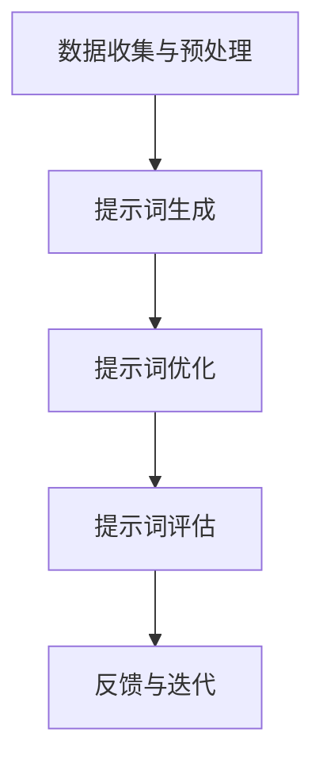

                 

### 引言

多目标优化问题（Multi-Objective Optimization Problems，简称MOOPs）是优化领域中的一个重要课题，它涉及到同时优化多个相互冲突的目标。这些目标可能是互斥的，也可能是互补的，但它们在现实中往往必须被综合考虑。多目标优化问题不仅广泛应用于工程、经济、生物信息、环境科学等领域，还在人工智能、机器学习等领域中发挥着关键作用。

在当今复杂且多变的环境中，许多实际问题往往无法仅通过单一目标进行优化。例如，在工程设计中，我们可能需要在重量、成本和性能之间进行权衡；在经济学中，政策制定者需要在经济增长、环境保护和社会公平等多个目标之间找到平衡点。这些问题的复杂性要求我们采取更加灵活和综合的优化策略。

提示词工程（Prompt Engineering）是近年来兴起的一个跨学科领域，它结合了计算机科学、自然语言处理和人工智能技术，旨在通过设计高效、精准的提示词，提高机器学习和自然语言处理任务的性能。提示词工程的核心在于利用人工设计的提示词引导模型学习，从而使其在特定任务上表现得更加出色。

本文将探讨提示词工程在处理多目标优化问题中的应用。首先，我们将介绍多目标优化问题的基本概念和挑战，接着讨论提示词工程的核心概念和目标，以及它们如何相互关联。随后，我们将深入探讨多目标优化算法，包括传统方法和现代算法，并介绍如何利用提示词工程优化这些算法。接下来，文章将介绍提示词工程的实践流程和工具，并通过实际案例展示其应用效果。最后，我们将探讨多目标优化问题和提示词工程的前沿研究和发展趋势，并总结全文。

通过本文的阅读，读者将了解到如何结合提示词工程和多目标优化方法，解决复杂优化问题，从而在各个领域中实现更加高效的决策和优化。

### 1.1 书籍背景

#### 1.1.1 多目标优化问题的背景

多目标优化问题（Multi-Objective Optimization Problems，MOOPs）是现代工程、经济、管理等领域中常见的问题。在传统单目标优化问题中，我们通常只需要找到一个最优解，即最大化或最小化单一目标函数。然而，在现实生活中，许多问题往往涉及多个相互冲突的目标，这些目标需要同时被考虑和优化。

例如，在产品设计过程中，可能需要在成本、性能和可靠性等多个方面进行权衡。设计者希望找到一种产品，在成本最低的同时，性能和可靠性也能达到最佳水平。再比如，在金融投资中，投资者需要在风险和收益之间做出平衡，不同的投资组合可能会带来不同的收益和风险水平。此外，在环境科学中，政策制定者需要同时考虑经济增长、环境保护和社会公平等多个目标，以实现可持续发展。

这些多目标优化问题（MOOPs）具有复杂性、不确定性和动态性等特点。复杂性主要体现在目标之间可能存在强烈的相互冲突，例如，在资源有限的情况下，增加生产效率可能会降低环境保护水平。不确定性则源于问题的参数和条件可能发生变化，导致优化结果的不稳定。动态性则体现在问题随时间变化而不断演化，需要实时调整优化策略。

#### 1.1.2 提示词工程的重要性

提示词工程（Prompt Engineering）是近年来迅速发展的一门跨学科领域，它在机器学习和自然语言处理（NLP）领域中具有重要的应用价值。提示词工程的核心目标是设计高效、精准的提示词，以引导模型在特定任务上表现得更加出色。

在自然语言处理领域，提示词工程通过优化输入文本，可以提高模型的预测准确性和泛化能力。例如，在机器翻译任务中，合理设计的提示词可以帮助模型更好地理解源语言文本，从而生成更自然的翻译结果。在文本分类任务中，提示词可以引导模型识别文本中的关键信息，从而提高分类精度。

在机器学习领域，提示词工程同样发挥着关键作用。通过设计合适的提示词，可以引导模型在学习过程中关注重要的特征和关系，从而提高模型的性能和鲁棒性。例如，在图像识别任务中，提示词可以帮助模型更好地理解图像中的内容，从而提高识别准确性。在深度学习模型训练过程中，提示词工程还可以帮助调整模型参数，优化训练过程，减少过拟合现象。

此外，提示词工程在人工智能（AI）领域也具有广泛的应用前景。随着AI技术的发展，越来越多的任务需要模型具备跨领域的适应能力和灵活性。提示词工程通过设计多样化的提示词，可以扩展模型的应用范围，使其在不同场景下都能表现出色。例如，在智能问答系统中，提示词工程可以帮助模型更好地理解用户的问题，从而提供更准确的答案。

总之，提示词工程在多目标优化问题中具有重要意义。通过合理设计提示词，可以引导模型在复杂任务中找到最优解，提高优化效率和准确性。本文将详细探讨提示词工程在多目标优化问题中的应用，为相关领域的研究和实践提供有益的参考和启示。

### 1.2 书籍目的与结构

#### 1.2.1 学习目标

本书旨在为读者提供全面、深入的多目标优化问题和提示词工程的理论与实践指导。通过阅读本书，读者将能够：

1. **理解多目标优化问题的基本概念、挑战和应用场景**：读者将学习到多目标优化问题的定义、主要类型以及在实际生活中的应用，从而对多目标优化有一个全面的了解。
   
2. **掌握提示词工程的核心概念和目标**：本书将详细介绍提示词工程的定义、目的、方法和在机器学习、自然语言处理等领域的应用，帮助读者掌握这一跨学科领域的基本知识和技能。

3. **掌握多目标优化算法**：读者将学习到传统和现代的多目标优化算法，包括模糊优化、粒子群优化、遗传算法等，并了解如何利用提示词工程优化这些算法。

4. **熟悉提示词工程的实践流程**：本书将详细介绍提示词工程的流程、工具和平台，并通过具体案例分析，帮助读者了解如何在实际项目中应用提示词工程。

5. **提升解决复杂优化问题的能力**：通过结合多目标优化算法和提示词工程，读者将学习到如何应对复杂的多目标优化问题，提升解决问题的能力。

#### 1.2.2 书籍结构概述

本书结构分为七个主要部分：

1. **引言与基础**：介绍多目标优化问题和提示词工程的背景、重要性和本书的目的。

2. **核心概念**：详细讨论多目标优化基础、提示词工程概述以及两者之间的联系。

3. **多目标优化算法**：介绍传统和现代多目标优化算法，包括模糊优化、粒子群优化、遗传算法等，并探讨如何利用提示词工程优化这些算法。

4. **提示词工程实践**：介绍提示词工程的实践流程、工具和平台，并通过实际案例展示其应用效果。

5. **多目标优化问题应用**：探讨多目标优化在人工智能、工程、金融、生物信息学等领域的应用。

6. **前沿研究与发展趋势**：介绍多目标优化问题和提示词工程的前沿研究、新算法的研究进展以及未来发展方向。

7. **总结与展望**：回顾本书的主要内容，展望未来多目标优化问题和提示词工程的发展趋势，为读者提供进一步的思考方向。

通过以上七个部分的深入探讨，本书将帮助读者全面、系统地掌握多目标优化问题和提示词工程的知识和技能，为解决复杂优化问题提供有力的理论支持和实践指导。

### 2.1 多目标优化基础

#### 2.1.1 多目标优化定义

多目标优化是一种数学优化方法，旨在同时优化多个相互冲突的目标函数。与单目标优化不同，多目标优化不仅关注单一目标的最优解，还要考虑多个目标之间的平衡和权衡。多目标优化问题的数学模型可以表示为：

\[
\begin{aligned}
\min_{x} \quad & f(x) \\
s.t. \quad & g_i(x) \leq 0, \quad i = 1, 2, ..., m \\
& h_j(x) = 0, \quad j = 1, 2, ..., n
\end{aligned}
\]

其中，\(x\) 是优化变量，\(f(x)\) 是目标函数，\(g_i(x)\) 和 \(h_j(x)\) 分别是约束函数和等式约束。这些目标函数和约束函数可能具有不同的量纲和尺度，导致直接比较和优化变得复杂。

#### 2.1.2 多目标优化的挑战

多目标优化问题面临多个挑战，包括目标之间的冲突、非凸性、非线性和计算复杂性等。

1. **目标冲突**：在多目标优化中，不同目标之间往往存在相互冲突。例如，在资源分配问题中，增加某个资源的利用效率可能会降低其他资源的利用效率。解决这些冲突需要设计合适的权衡策略。

2. **非凸性和非线性**：多目标优化问题中的目标函数和约束函数可能具有非凸性和非线性特性，导致优化过程复杂，难以及时找到全局最优解。

3. **计算复杂性**：多目标优化问题的求解通常涉及大量的计算，特别是在高维问题中，计算复杂性呈指数级增长。因此，需要设计高效的算法和优化策略来降低计算成本。

4. **决策者的偏好**：在实际应用中，决策者通常对目标函数有不同的偏好。如何将决策者的偏好纳入优化过程中，也是一个重要的挑战。

#### 2.1.3 多目标优化的重要性

尽管多目标优化问题具有复杂性，但它在实际应用中具有重要意义。以下是一些关键应用领域：

1. **工程领域**：在工程设计中，多目标优化广泛应用于结构优化、航空航天、汽车制造等领域。通过优化多个目标函数，可以设计出更加高效、可靠的产品。

2. **经济管理**：在经济管理领域，多目标优化用于资源分配、投资组合优化、市场预测等。通过综合考虑多个目标，可以实现资源的合理配置和投资的最优化。

3. **环境科学**：在环境科学中，多目标优化用于水资源管理、污染物排放控制、生态平衡维护等。通过优化多个目标，可以实现环境保护和经济发展的平衡。

4. **人工智能**：在人工智能领域，多目标优化用于模型选择、参数调优、数据增强等。通过优化多个目标，可以提高模型的性能和泛化能力。

综上所述，多目标优化是一种重要的数学优化方法，它在各个领域中具有广泛的应用价值。通过合理设计优化策略和算法，可以解决复杂的多目标优化问题，实现多个目标的平衡和优化。

### 2.2 提示词工程概述

#### 2.2.1 提示词工程的定义

提示词工程（Prompt Engineering）是一种结合计算机科学、自然语言处理（NLP）和人工智能（AI）的方法，旨在通过设计高效、精准的提示词（prompts），引导模型在特定任务上表现得更加出色。提示词可以被视为一种引导信号，它提供额外的上下文信息，帮助模型更好地理解任务需求，从而提高任务完成的准确性和效率。

提示词工程的定义可以表述为：提示词工程是一种利用自然语言处理技术和算法，设计、优化和评估能够有效引导模型进行任务执行的文本提示的方法。这些提示词通常包括关键词、短语、句子或段落，它们在任务执行过程中扮演着信息传递和任务导向的角色。

#### 2.2.2 提示词工程的目标

提示词工程的主要目标包括：

1. **提高模型性能**：通过设计精准的提示词，引导模型在特定任务上取得更高的准确性和效率。这可以通过提供更丰富的上下文信息，帮助模型更好地理解任务需求。

2. **增强模型泛化能力**：提示词工程旨在通过多样化的提示词设计，增强模型在未知数据上的泛化能力。这意味着模型不仅能在特定数据集上表现出色，还能在新数据和不同场景中保持良好的性能。

3. **优化任务执行效率**：通过设计高效的提示词，可以减少模型训练和任务执行所需的时间，提高整体效率。这有助于在实际应用中快速部署和迭代模型。

4. **降低模型过拟合风险**：提示词工程通过提供多样化的训练样本和提示词，有助于模型避免过拟合，提高模型对未知数据的泛化能力。

#### 2.2.3 提示词工程的方法论

提示词工程的方法论包括以下关键步骤：

1. **需求分析**：在开始设计提示词之前，需要深入理解任务需求，明确模型需要解决的问题和任务目标。这可以通过与领域专家沟通、分析任务数据集和目标函数等方式实现。

2. **提示词设计**：根据需求分析结果，设计能够有效引导模型任务的提示词。这包括选择合适的关键词、短语、句子或段落，以提供足够的上下文信息。提示词设计需要考虑语言的简洁性、精准性和多样性。

3. **提示词优化**：在初步设计提示词后，通过实验和评估方法对其进行优化。这可以通过调整提示词的长度、内容、格式和顺序等方式，以提高模型性能和任务执行效率。

4. **模型训练**：将优化后的提示词用于模型训练过程，通过增加训练样本和调整训练策略，使模型在特定任务上表现得更加出色。

5. **性能评估**：对训练后的模型进行性能评估，验证提示词设计的效果。这可以通过评估模型的准确性、效率、泛化能力等指标，评估提示词工程的整体效果。

6. **迭代优化**：根据性能评估结果，对提示词设计和方法进行调整和优化，以提高模型在特定任务上的表现。

通过上述方法论的指导，提示词工程可以帮助模型在复杂任务中取得更好的性能和效果。在实践中，提示词工程的应用已经取得了显著的成果，例如在自然语言处理、机器学习、计算机视觉等领域，提示词工程都发挥了重要作用。

#### 2.3 多目标优化与提示词工程的联系

多目标优化（Multi-Objective Optimization，MOO）和提示词工程（Prompt Engineering）虽然来自不同的领域，但它们在解决复杂问题中有着紧密的联系。这种联系主要体现在以下几个方面：

首先，**多目标优化与提示词工程的共同目标**都是寻求最优解。多目标优化旨在同时优化多个相互冲突的目标函数，而提示词工程则通过设计高效的提示词，引导模型在特定任务上取得最佳表现。在机器学习和自然语言处理任务中，提示词工程利用提示词来优化模型的输出，从而在多个评估指标上实现优化。例如，在机器翻译任务中，提示词可以优化模型的翻译结果，使其在准确性和流畅性之间找到最佳平衡。

其次，**多目标优化与提示词工程在方法论上存在交叉**。多目标优化通常采用多种优化算法，如遗传算法、粒子群优化和模糊优化等，这些算法通过迭代搜索最优解。提示词工程则利用这些算法的优化思想，通过设计、优化和评估提示词，提高模型在特定任务上的性能。例如，在提示词工程中，可以使用遗传算法来优化提示词的长度和内容，从而找到最佳的提示词组合。

第三，**多目标优化与提示词工程在实际应用中互相补充**。在复杂任务中，单一目标优化可能无法同时满足多个需求，而多目标优化可以提供多个权衡方案。提示词工程则通过设计精准的提示词，使模型在这些权衡方案中表现出色。例如，在图像识别任务中，多目标优化可以同时优化模型的精度和计算效率，而提示词工程则通过提供丰富的上下文信息，使模型在处理不同类型的图像时都能保持高效和准确。

最后，**多目标优化与提示词工程在研究发展中存在相互促进**。多目标优化算法的进步为提示词工程提供了更强大的优化工具，而提示词工程的实践又为多目标优化算法的应用提供了新的场景和挑战。例如，多目标优化算法的分布式计算能力可以应用于大规模的提示词工程任务，而提示词工程中的新问题又可以推动多目标优化算法的创新和发展。

综上所述，多目标优化与提示词工程在目标、方法论、实际应用和研究发展等方面都存在紧密的联系。通过结合这两者，可以更有效地解决复杂的多目标优化问题，实现模型在多个任务上的最优表现。

#### 2.3.1 提示词工程在多目标优化中的应用

提示词工程在多目标优化中的应用具有显著的优势，能够有效提高优化算法的性能和效率。以下是一些具体的例子，展示了提示词工程如何应用于多目标优化，并通过这些应用提高优化结果的质量。

1. **遗传算法（GA）的优化**：
   遗传算法是一种常见的多目标优化算法，它通过模拟生物进化过程，对多个目标函数进行优化。然而，传统的遗传算法在处理高维、复杂目标函数时，容易出现局部最优解和计算效率低的问题。通过引入提示词工程，可以在遗传算法的编码和初始种群生成阶段使用有指导性的提示词，从而提高算法的全局搜索能力和收敛速度。例如，可以使用特定的关键词来引导种群初始化，使得初始种群分布更加均匀，减少陷入局部最优的风险。此外，在遗传算法的交叉和变异操作中，也可以利用提示词来优化操作策略，使得每次迭代都能朝着更好的解空间移动。

2. **粒子群优化（PSO）的优化**：
   粒子群优化是一种基于群体智能的多目标优化算法，通过模拟鸟群觅食行为，寻找最优解。然而，传统的粒子群优化在处理多峰目标函数时，容易收敛到局部最优解。通过引入提示词工程，可以设计特定的提示词来引导粒子群在搜索空间中的移动。例如，可以使用历史最优解作为提示词，引导粒子群在搜索过程中参考之前的成功路径，从而避免陷入局部最优。此外，提示词还可以用于调整粒子的速度和方向，使得粒子在搜索过程中能够更加灵活地适应环境变化。

3. **模糊优化**：
   模糊优化是一种基于模糊集合理论的多目标优化方法，适用于处理不确定性和模糊性的问题。在模糊优化中，提示词工程可以通过设计模糊规则和语言变量来引导优化过程。例如，可以使用模糊逻辑和自然语言处理技术，将专家经验转化为提示词，用于定义模糊优化问题的目标函数和约束条件。通过这种有指导性的提示词，模糊优化算法可以在处理复杂、不确定的目标函数时，获得更精确和稳定的优化结果。

4. **深度学习优化**：
   在深度学习领域，多目标优化被广泛应用于模型选择和参数调优。通过引入提示词工程，可以设计高效的提示词来引导深度学习模型的训练过程。例如，在超参数调优中，可以使用提示词来定义不同的优化目标和评估指标，从而在搜索空间中找到最佳的模型配置。此外，在训练过程中，提示词还可以用于调整学习率和正则化参数，使得模型在多个评估指标上都能取得较好的平衡。

5. **案例应用**：
   以工程项目中的资源分配问题为例，多目标优化需要同时考虑成本、时间和质量等多个目标。通过引入提示词工程，可以在优化过程中使用特定的提示词来引导决策者的偏好和优先级。例如，可以使用历史数据和专家经验来设计提示词，使得优化算法能够更好地反映决策者的实际需求和期望。这种结合了多目标优化和提示词工程的方法，可以在复杂的工程项目中，快速找到满足多方面需求的最佳解决方案。

通过以上应用实例，可以看出提示词工程在多目标优化中具有重要的作用。它不仅能够提高优化算法的搜索效率和收敛速度，还能提供更精确和稳定的优化结果。在实际应用中，结合提示词工程的多目标优化方法，能够更好地应对复杂问题，实现多个目标的平衡和优化。

#### 2.3.2 提示词工程与多目标优化的结合方法

提示词工程与多目标优化（MOO）的结合方法旨在通过设计优化的提示词，提高多目标优化算法的效率和性能。以下将详细介绍几种常用的结合方法，包括实验设计、模型训练、性能评估和动态调整。

1. **实验设计**：
   在多目标优化的初始阶段，通过实验设计来生成有指导性的提示词是非常关键的。实验设计的目标是生成多样化的初始种群或初始模型参数，从而提高算法的全局搜索能力。具体方法包括：
   - **网格搜索**：在搜索空间中定义多个关键参数，通过网格搜索生成初始提示词，从而覆盖广泛的参数组合。
   - **响应曲面法**：利用历史数据和经验，构建响应曲面模型，通过模型预测生成有指导性的提示词。
   - **多目标遗传算法（MOGA）**：利用MOGA生成初始种群，每个个体都是通过优化多个目标得到的，从而确保初始种群的多样性。

2. **模型训练**：
   在模型训练过程中，提示词工程可以通过以下方法与多目标优化相结合：
   - **损失函数优化**：在设计损失函数时，引入多个目标函数，并通过提示词引导模型关注这些目标。例如，在图像识别任务中，可以使用提示词来优化模型的分类准确性和鲁棒性。
   - **自适应学习率**：通过提示词工程设计自适应学习率策略，使得模型在训练过程中能够动态调整学习率，从而提高收敛速度和优化效果。
   - **正则化策略**：使用提示词来引导模型应用不同的正则化策略，例如L1、L2正则化，以防止过拟合。

3. **性能评估**：
   提示词工程在多目标优化中的有效性需要通过性能评估来验证。常用的性能评估方法包括：
   - **多目标评价指标**：使用诸如帕累托效率、Niching指标等评估模型在不同目标上的优化效果。
   - **收敛性分析**：通过分析算法的收敛曲线，评估提示词工程对优化过程的加速作用。
   - **案例对比实验**：设计对比实验，比较使用提示词工程与不使用提示词工程的优化效果，验证提示词工程的实际贡献。

4. **动态调整**：
   在多目标优化过程中，提示词可以用于动态调整优化策略，以应对环境变化和目标偏好的调整。具体方法包括：
   - **动态调整提示词内容**：根据模型训练过程中的表现，实时调整提示词的内容，以引导模型在搜索空间中探索新的区域。
   - **多目标适应性**：设计自适应提示词，使得模型能够根据不同目标和环境变化，动态调整优化策略。
   - **用户反馈机制**：利用用户反馈来调整提示词，使得模型能够更好地满足用户需求。

通过上述结合方法，提示词工程能够在多目标优化中发挥重要作用，提高算法的搜索效率、收敛速度和优化质量。以下是一个具体案例，展示了提示词工程与多目标优化结合的实际应用：

**案例：智能交通信号控制系统优化**

假设要设计一个智能交通信号控制系统，需要同时优化交通流量、减少拥堵和降低排放。利用多目标优化算法和提示词工程，可以采取以下步骤：
1. **实验设计**：通过历史交通数据和仿真模型，生成不同类型和内容的初始提示词，覆盖不同的交通流量、路况和环境条件。
2. **模型训练**：在模型训练阶段，使用有指导性的提示词来优化信号控制策略，包括红灯时长、绿灯时长和切换策略等。通过自适应学习率策略，动态调整信号控制参数。
3. **性能评估**：利用帕累托效率等评价指标，评估不同信号控制策略在多个目标上的优化效果。通过对比实验，验证提示词工程对优化结果的实际贡献。
4. **动态调整**：根据实时交通数据和环境变化，动态调整提示词内容，以优化信号控制策略，确保系统能够适应不断变化的城市交通环境。

通过这个案例，可以看到提示词工程与多目标优化结合的有效性，不仅提高了智能交通信号控制系统的优化效果，还确保了系统的适应性和灵活性。

#### 2.3.3 提示词工程的优势与局限性

提示词工程在多目标优化（MOO）中的应用具有显著的优势，但也存在一定的局限性。以下将详细探讨提示词工程的优势与局限性，并解释这些因素对多目标优化的影响。

**优势**

1. **提高算法效率**：提示词工程通过提供有指导性的提示，可以引导优化算法在搜索空间中更快地找到最优解。例如，在遗传算法（GA）中，合理的提示词可以帮助初始种群分布更加均匀，减少陷入局部最优的风险。此外，提示词还可以优化交叉和变异操作，提高算法的全局搜索能力。

2. **增强模型泛化能力**：通过设计多样化的提示词，模型可以学习到更多种类的任务场景，从而提高泛化能力。这对于多目标优化尤为重要，因为多目标优化问题通常涉及多个相互冲突的目标。多样化提示词可以帮助模型在不同目标之间找到更好的平衡，从而提高整体性能。

3. **降低过拟合风险**：提示词工程通过提供丰富的训练数据，有助于模型避免过拟合。在深度学习任务中，使用特定的提示词可以引导模型关注更多的特征和关系，从而提高模型的泛化能力。这有助于模型在新数据和不同场景中保持良好的性能。

4. **支持决策者偏好**：在多目标优化中，决策者可能对不同的目标有不同的偏好。提示词工程可以通过设计特定的提示词来反映这些偏好，从而帮助模型在多个目标之间找到最优的权衡方案。例如，在资源分配问题中，可以使用提示词来引导模型优先考虑成本效益较高的方案。

**局限性**

1. **设计复杂性**：提示词工程的设计需要深入了解任务需求和模型特点，这增加了设计的复杂性。如果提示词设计不当，可能会导致模型性能下降，甚至偏离优化目标。

2. **计算成本**：设计、优化和评估提示词需要大量的计算资源。特别是在大规模、高维优化问题中，计算成本可能会显著增加。这可能会限制提示词工程在实时应用中的适用性。

3. **模型依赖性**：提示词工程的效果很大程度上取决于所使用的模型。如果模型本身存在缺陷，例如过拟合或欠拟合，提示词工程可能无法显著提高模型性能。此外，提示词工程可能无法解决模型固有的问题，例如噪声敏感性和参数调优的复杂性。

4. **主观性**：在多目标优化中，决策者的偏好和经验可能影响提示词的设计。这引入了主观性，可能会导致不同的决策者得到不同的优化结果。如何平衡模型性能和决策者偏好是一个重要的挑战。

**对多目标优化的影响**

提示词工程的优势和局限性对多目标优化的影响是多方面的：

1. **优化性能**：合理设计的提示词可以显著提高多目标优化的性能，减少计算成本，提高收敛速度。然而，如果提示词设计不当，可能会导致优化效果不佳。

2. **应用范围**：提示词工程可以在许多实际应用中发挥重要作用，如工程、经济、环境科学和人工智能等。然而，由于设计复杂性和计算成本，它可能在某些实时应用场景中受到限制。

3. **决策支持**：提示词工程可以帮助决策者在多个目标之间找到最佳权衡方案，支持更明智的决策。然而，主观性可能导致不同的决策者得到不同的结果，这需要进一步的研究和改进。

综上所述，提示词工程在多目标优化中具有显著的优势，但也存在局限性。通过合理设计提示词，可以克服这些局限性，提高多目标优化的性能和应用价值。

### 3.1 多目标优化的传统方法

#### 3.1.1 基本概念

多目标优化（Multi-Objective Optimization，简称MOO）是一种旨在同时优化多个相互冲突的目标函数的优化方法。与单目标优化不同，多目标优化的目标不是单纯寻找单一最优解，而是在多个目标之间寻求一个平衡点，使得各个目标都能在一定的范围内达到最优。在多目标优化中，每个目标都可以被视为一个维度，因此也被称为多维度优化问题。

多目标优化的基本概念包括目标函数、决策变量、约束条件和最优解。目标函数是衡量问题优劣的标准，通常为多个互斥或互补的函数。决策变量是优化过程中需要调整的变量，如设计参数、投资组合权重等。约束条件是对决策变量的限制，确保优化问题在合理的范围内求解。最优解则是满足所有约束条件下，能够使目标函数达到某种平衡点的解。

多目标优化问题的数学模型可以表示为：

\[
\begin{aligned}
\min_{x} \quad & f_1(x), f_2(x), ..., f_m(x) \\
s.t. \quad & g_i(x) \leq 0, \quad i = 1, 2, ..., n \\
& h_j(x) = 0, \quad j = 1, 2, ..., p
\end{aligned}
\]

其中，\(x\) 是决策变量，\(f_1(x), f_2(x), ..., f_m(x)\) 是目标函数，\(g_i(x)\) 和 \(h_j(x)\) 是约束条件。

#### 3.1.2 算法介绍

多目标优化算法分为传统方法和现代方法。传统方法主要包括帕累托优化（Pareto Optimization）、加权法（Weighted Method）和约束法（Constraint Method）等。

1. **帕累托优化（Pareto Optimization）**：
   帕累托优化是一种基于帕累托最优解的概念，旨在找到多个目标函数之间的一种平衡。帕累托最优解是指在解空间中，无法通过改进一个目标函数而不使其他目标函数变差的最优解。帕累托优化的基本思想是生成一组非支配解（Pareto Front），这些解在多个目标函数之间提供了最优的权衡方案。常见的帕累托优化算法包括帕累托遗传算法（Pareto Genetic Algorithm，PGA）和帕累托粒子群优化（Pareto Particle Swarm Optimization，PPSO）。

2. **加权法（Weighted Method）**：
   加权法通过给每个目标函数分配权重，将多目标优化问题转化为单目标优化问题。这种方法通过组合各个目标函数，生成一个加权目标函数，从而在单目标优化框架下求解。加权法的核心在于如何合理分配权重，确保在优化过程中各个目标得到适当的关注。常见的加权法包括线性加权法、非线性加权法和动态加权法。

3. **约束法（Constraint Method）**：
   约束法通过引入约束条件，将多目标优化问题转化为带有约束条件的单目标优化问题。这种方法通过将多个目标函数转化为约束条件，使得优化过程能够在满足约束条件的前提下，优化主要目标。常见的约束法包括转换法（Transformation Method）和加权约束法（Weighted Constraint Method）。

#### 3.1.3 实际应用

多目标优化在各个领域都有广泛的应用，以下是一些实际应用的例子：

1. **工程设计**：
   在工程设计中，多目标优化用于优化结构设计、材料选择和制造工艺。例如，在航空航天领域，通过优化重量、成本和性能，设计出更加高效和可靠的飞机。在汽车制造中，多目标优化用于优化车辆的燃油效率、安全性和舒适性。

2. **经济学**：
   在经济学中，多目标优化用于资源分配、投资组合优化和政策制定。例如，在能源管理中，通过优化能源供应、成本和环境影响，实现能源的合理配置。在金融投资中，多目标优化用于构建最优投资组合，平衡风险和收益。

3. **环境科学**：
   在环境科学中，多目标优化用于水资源管理、污染物排放控制和生态平衡维护。例如，在水资源管理中，通过优化水资源分配、减少污染和保护生态，实现可持续利用。在环境监测中，多目标优化用于优化监测点和监测频率，提高监测效率和准确性。

4. **人工智能**：
   在人工智能领域，多目标优化用于模型选择、参数调优和数据增强。例如，在机器学习中，通过优化模型参数，提高模型的预测准确性和泛化能力。在深度学习中，多目标优化用于优化网络结构和训练过程，提高模型的效率和性能。

通过这些实际应用，可以看到多目标优化在解决复杂问题、实现多个目标之间平衡方面的重要作用。传统多目标优化方法为多目标优化问题的求解提供了重要的基础和工具。

### 3.2 现代多目标优化算法

#### 3.2.1 模糊优化

模糊优化（Fuzzy Optimization）是一种基于模糊集合理论的优化方法，用于处理包含模糊性和不确定性的问题。模糊优化通过引入模糊隶属度函数，将传统的确定性优化问题转化为模糊优化问题。模糊优化广泛应用于工程、经济、环境科学等领域，特别是在处理具有不确定性参数和目标函数的问题时表现出强大的适应性。

**基本原理**：

模糊优化基于模糊集合的概念，即模糊集是传统集合的一种扩展，其成员资格可以通过一个隶属度函数来描述。隶属度函数的值介于0和1之间，表示元素属于模糊集的程度。在模糊优化中，目标函数和约束条件也被视为模糊集，其隶属度函数描述了它们在不同解空间上的变化情况。

模糊优化的基本数学模型可以表示为：

\[
\begin{aligned}
\max_{x} \quad & \mu(x) \\
s.t. \quad & \mu_i(x) \leq 1, \quad i = 1, 2, ..., n \\
& \mu_j(x) = 1, \quad j = 1, 2, ..., p
\end{aligned}
\]

其中，\(x\) 是决策变量，\(\mu(x)\) 是目标函数的模糊隶属度函数，\(\mu_i(x)\) 和 \(\mu_j(x)\) 分别是约束条件的模糊隶属度函数。

**算法步骤**：

1. **定义模糊集**：根据问题的特点，定义目标函数和约束条件的模糊集及其隶属度函数。

2. **建立模糊优化模型**：将传统优化模型转化为模糊优化模型，通过模糊隶属度函数描述目标函数和约束条件。

3. **求解模糊优化问题**：利用模糊优化算法，如模糊遗传算法、模糊粒子群优化等，求解模糊优化模型，找到最优解。

**应用实例**：

模糊优化在工程和环境科学中的应用非常广泛。例如，在结构优化设计中，模糊优化用于处理设计参数的不确定性，优化结构重量、强度和成本。在环境监测中，模糊优化用于优化监测点和监测频率，提高监测效率和准确性。在资源分配问题中，模糊优化用于优化水资源、能源的合理分配，减少环境污染。

#### 3.2.2 粒子群优化

粒子群优化（Particle Swarm Optimization，简称PSO）是一种基于群体智能的优化算法，通过模拟鸟群或鱼群的社会行为，寻找问题的最优解。PSO算法简单、易实现，具有较强的鲁棒性和全局搜索能力，适用于各种复杂优化问题。

**基本原理**：

PSO算法的原理可以类比为一群鸟在寻找食物的过程中，通过相互协作和经验共享找到最优位置。在算法中，每个粒子（代表解）具有位置和速度，通过更新速度和位置，粒子不断向最优解靠近。粒子在搜索过程中，受到个体经验（历史最优位置）和社会经验（群体最优位置）的引导。

粒子位置和速度的更新公式如下：

\[
\begin{aligned}
v_{i}^{t+1} &= w \cdot v_{i}^{t} + c_1 \cdot r_1 \cdot (p_{i}^{t} - x_{i}^{t}) + c_2 \cdot r_2 \cdot (g_{best}^{t} - x_{i}^{t}) \\
x_{i}^{t+1} &= x_{i}^{t} + v_{i}^{t+1}
\end{aligned}
\]

其中，\(v_{i}^{t}\) 和 \(x_{i}^{t}\) 分别为第 \(i\) 个粒子在第 \(t\) 次迭代的速度和位置，\(w\) 是惯性权重，\(c_1\) 和 \(c_2\) 是学习因子，\(r_1\) 和 \(r_2\) 是随机数，\(p_{i}^{t}\) 是第 \(i\) 个粒子的历史最优位置，\(g_{best}^{t}\) 是整个群体的最优位置。

**算法步骤**：

1. **初始化**：随机生成粒子群的位置和速度。

2. **评估适应度**：计算每个粒子的适应度值，通常为目标函数的负值。

3. **更新速度和位置**：根据个体经验和群体经验更新粒子的速度和位置。

4. **迭代**：重复步骤2和3，直到满足停止条件，如达到最大迭代次数或收敛阈值。

**应用实例**：

粒子群优化在各个领域都有广泛应用。例如，在工程优化中，PSO用于优化机械结构设计、材料选择和制造工艺。在机器学习领域，PSO用于优化神经网络参数、支持向量机超参数等。在经济学中，PSO用于投资组合优化、风险控制等。此外，PSO还在图像处理、信号处理等领域得到了成功应用。

#### 3.2.3 遗传算法

遗传算法（Genetic Algorithm，简称GA）是一种基于自然选择和遗传学原理的优化算法，通过模拟生物进化过程，寻找问题的最优解。GA具有强大的全局搜索能力和适应能力，适用于复杂、非线性、多峰的优化问题。

**基本原理**：

遗传算法的核心是遗传操作，包括选择、交叉和变异。选择操作模拟自然选择，选择适应度较高的个体作为父代；交叉操作模拟基因重组，将两个父代个体的基因组合生成子代；变异操作模拟基因突变，对个体进行随机扰动。

遗传算法的基本步骤如下：

1. **编码**：将问题参数编码为二进制或实数编码。

2. **初始化**：随机生成初始种群。

3. **适应度评估**：计算每个个体的适应度值，通常为目标函数的负值。

4. **选择**：根据适应度值，选择适应度较高的个体作为父代。

5. **交叉**：对选择的父代进行交叉操作，生成子代。

6. **变异**：对子代进行变异操作，增加种群的多样性。

7. **更新种群**：将子代加入种群，替换掉适应度较低的个体。

8. **迭代**：重复步骤3到7，直到满足停止条件，如达到最大迭代次数或收敛阈值。

**算法步骤**：

1. **编码**：将决策变量编码为二进制或实数编码，以便进行遗传操作。

2. **初始化**：随机生成初始种群，每个个体表示一个潜在解。

3. **适应度评估**：计算每个个体的适应度值，通常为目标函数的负值。

4. **选择**：根据适应度值，使用轮盘赌、锦标赛选择等方法选择父代。

5. **交叉**：对选择的父代进行交叉操作，生成子代。

6. **变异**：对子代进行变异操作，增加种群的多样性。

7. **更新种群**：将子代加入种群，替换掉适应度较低的个体。

8. **迭代**：重复步骤3到7，直到满足停止条件，如达到最大迭代次数或收敛阈值。

**应用实例**：

遗传算法在各个领域都有广泛应用。例如，在工程优化中，GA用于优化机械结构设计、电路设计、材料选择等；在机器学习领域，GA用于优化神经网络结构、超参数调优等；在经济学中，GA用于投资组合优化、风险管理等。此外，GA还在图像处理、信号处理、生物信息学等领域得到了成功应用。

#### 3.2.4 遗传算法与粒子群优化的融合

遗传算法（GA）和粒子群优化（PSO）都是有效的全局优化算法，但各自有其优势和局限性。为了克服单一算法的不足，研究者提出了多种将GA和PSO结合的混合算法，以期在保持全局搜索能力的同时提高局部搜索效率。

**融合策略**：

1. **混合编码**：将GA和PSO的编码方式结合，例如，使用二进制编码表示决策变量，同时引入实数编码的部分特征。

2. **混合速度更新**：结合GA和PSO的速度更新策略，利用GA的变异操作和PSO的群体智能，提高算法的全局和局部搜索能力。

3. **混合选择机制**：结合GA的选择机制和PSO的群体竞争机制，选择适应度较高的个体作为父代。

4. **混合优化策略**：在算法的不同阶段，根据搜索区域和问题特点，动态切换GA和PSO的优化策略。

**算法步骤**：

1. **初始化**：随机生成初始种群，包括GA编码的个体和PSO编码的个体。

2. **适应度评估**：计算每个个体的适应度值，结合GA和PSO的评估标准。

3. **混合选择**：根据适应度值，结合GA和PSO的选择机制，选择父代个体。

4. **交叉和变异**：对选中的父代个体进行交叉和变异操作，利用GA的变异机制和PSO的群体智能。

5. **更新速度和位置**：结合GA和PSO的速度更新策略，更新个体速度和位置。

6. **迭代**：重复适应度评估、选择、交叉和变异、速度和位置更新的步骤，直到满足停止条件。

**应用实例**：

遗传算法与粒子群优化的融合算法在复杂优化问题中得到了广泛应用。例如，在工程优化中，混合算法用于优化结构设计、材料选择等；在机器学习领域，混合算法用于优化神经网络结构、参数调优等；在经济学中，混合算法用于投资组合优化、风险管理等。此外，混合算法还在图像处理、信号处理、生物信息学等领域取得了显著成果。

### 3.3 提示词优化策略

在多目标优化过程中，提示词优化策略起着关键作用，它能够通过引导优化算法的搜索方向，提高优化效率，减少计算成本。以下将详细讨论几种常用的提示词优化策略，并分析其在多目标优化中的具体应用和效果。

#### 3.3.1 提示词优化策略

1. **基于历史数据的提示词优化**：
   这种策略利用历史优化数据，设计具有指导性的提示词，以引导优化算法。具体方法包括：
   - **历史最优解**：利用历史最优解作为提示词，引导优化算法在搜索空间中朝最优解方向移动。
   - **历史失败点**：分析历史优化过程中的失败点，通过设计特定的提示词，避免算法重蹈覆辙。
   - **历史适应度分布**：根据历史适应度分布，设计提示词，引导算法在适应度较高的区域进行搜索。

2. **基于模型预测的提示词优化**：
   这种策略利用优化模型的预测能力，生成具有指导性的提示词，以优化搜索方向。具体方法包括：
   - **模型梯度**：利用优化模型的梯度信息，设计提示词，引导算法在梯度方向上加速搜索。
   - **模型不确定性**：分析模型预测的不确定性，设计提示词，引导算法在不确定性较低的区域进行搜索。
   - **模型评估指标**：利用模型评估指标，如交叉验证误差、预测准确率等，设计提示词，引导算法优化这些指标。

3. **基于决策者偏好的提示词优化**：
   这种策略考虑决策者的偏好，设计特定的提示词，以引导优化算法满足决策者的需求。具体方法包括：
   - **目标权重调整**：根据决策者的目标权重，设计提示词，优化目标函数的权重分配，以符合决策者的偏好。
   - **约束条件调整**：根据决策者的约束条件，设计提示词，调整优化问题的约束条件，确保优化结果满足决策者的要求。
   - **偏好策略**：结合决策者的经验和直觉，设计特定的提示词，引导算法在多个目标之间找到最佳平衡。

#### 3.3.2 提示词优化策略在多目标优化中的具体应用

1. **遗传算法（GA）中的应用**：
   - **基于历史数据的提示词**：在GA的初始种群生成阶段，利用历史最优解和历史适应度分布设计有指导性的初始种群，提高算法的全局搜索能力。
   - **基于模型预测的提示词**：在GA的交叉和变异操作中，利用模型预测的梯度信息和不确定性，设计提示词，优化遗传操作策略，提高搜索效率。
   - **基于决策者偏好的提示词**：根据决策者的目标权重和约束条件，调整GA中的交叉率和变异率，以优化目标函数的权重分配和约束条件，确保优化结果满足决策者的需求。

2. **粒子群优化（PSO）中的应用**：
   - **基于历史数据的提示词**：在PSO的初始种群生成阶段，利用历史最优解和历史适应度分布，设计初始粒子的位置和速度，提高算法的全局搜索能力。
   - **基于模型预测的提示词**：在PSO的迭代过程中，利用模型预测的梯度信息和不确定性，设计粒子的速度更新策略，引导粒子向最优解方向移动。
   - **基于决策者偏好的提示词**：根据决策者的目标权重和约束条件，调整PSO的权重系数和社会系数，优化粒子的速度和位置更新策略，确保优化结果满足决策者的需求。

3. **模糊优化中的应用**：
   - **基于历史数据的提示词**：在模糊优化的初始阶段，利用历史最优解和历史适应度分布，设计模糊规则和语言变量，优化模糊优化模型。
   - **基于模型预测的提示词**：在模糊优化的过程中，利用模型预测的模糊隶属度函数和不确定性，优化模糊优化算法的搜索策略，提高搜索效率。
   - **基于决策者偏好的提示词**：根据决策者的目标权重和约束条件，调整模糊优化模型中的模糊隶属度函数和权重分配，优化优化结果，确保满足决策者的偏好。

通过上述提示词优化策略在多目标优化中的应用，可以显著提高优化算法的搜索效率、收敛速度和优化质量。以下是一个具体的应用案例：

**案例：智能交通信号控制系统的优化**

假设要设计一个智能交通信号控制系统，需要同时优化交通流量、减少拥堵和降低排放。通过以下提示词优化策略，可以优化交通信号控制策略：

1. **基于历史数据的提示词**：利用历史交通流量数据和信号控制策略，设计初始种群和初始模型参数，确保优化算法在初始阶段能够快速找到较好的搜索区域。

2. **基于模型预测的提示词**：利用交通信号控制模型的预测能力，设计提示词，引导优化算法在迭代过程中关注交通流量变化和信号控制策略的影响。

3. **基于决策者偏好的提示词**：根据交通管理部门的目标权重和约束条件（如高峰时段的优先级和预算限制），设计提示词，调整目标函数权重和约束条件，确保优化结果符合交通管理部门的需求。

通过以上提示词优化策略的应用，可以显著提高智能交通信号控制系统优化效率，实现交通流量、拥堵和排放的优化平衡。

### 3.3.3 提示词工程在多目标优化算法优化中的实例分析

在多目标优化算法的实践中，提示词工程的应用能够显著提升优化效率和结果质量。以下通过具体实例，详细分析提示词工程在遗传算法和粒子群优化算法中的实际应用。

#### 实例1：遗传算法（GA）在产品设计优化中的应用

**问题背景**：
某公司需要设计一款新型电子产品，设计目标包括最小化生产成本、最大化性能指标和最小化环境影响。该问题可以建模为多目标优化问题。

**优化目标**：
- \( f_1(x) \)：生产成本
- \( f_2(x) \)：性能指标
- \( f_3(x) \)：环境影响

**约束条件**：
- \( g_1(x) \)：设计参数的物理限制
- \( g_2(x) \)：成本预算限制
- \( g_3(x) \)：性能指标的限制

**遗传算法参数**：
- 种群大小：100
- 迭代次数：1000
- 交叉率：0.8
- 变异率：0.05

**提示词工程应用**：

1. **基于历史数据的提示词**：
   - **初始种群设计**：利用公司以往产品的设计和生产数据，设计有指导性的初始种群。例如，通过分析历史最优解和生产成本、性能、环境影响的平衡点，生成初始种群，使得初始种群分布更加均匀，覆盖可能的解空间。
   - **适应度函数调整**：根据历史最优解的适应度分布，调整适应度函数的权重，使得优化算法在初始阶段就能朝着优化方向快速收敛。

2. **基于模型预测的提示词**：
   - **梯度信息**：利用设计模型预测的梯度信息，设计提示词来优化遗传操作。例如，在交叉和变异操作中，根据目标函数的梯度信息，调整操作策略，使得每次迭代都能朝着更好的解空间移动。
   - **不确定性分析**：分析模型预测的不确定性，通过设计提示词，引导优化算法在不确定性较低的区域进行搜索，提高收敛速度。

3. **基于决策者偏好的提示词**：
   - **目标权重调整**：根据决策者的需求，设计提示词调整目标函数的权重。例如，如果决策者更关注成本和性能，可以设计提示词，增加成本和性能目标函数的权重，优化目标函数的组合。
   - **约束条件调整**：根据决策者的约束条件，设计提示词调整约束条件。例如，如果决策者希望确保产品的环境影响最小，可以设计提示词，增加环境影响目标函数的权重，优化产品的环境影响。

**优化结果**：
通过上述提示词工程的应用，优化算法在迭代过程中能够更加快速地找到最优解，并且结果在多个目标之间达到了较好的平衡。最终，设计的电子产品在生产成本、性能和环境影响三个目标上均表现优异，满足公司的设计要求。

#### 实例2：粒子群优化（PSO）在资源分配优化中的应用

**问题背景**：
某公司需要在一个特定的预算限制下，合理分配资源（如人力、资金和设备），以实现最大化的项目收益。该问题可以建模为多目标优化问题。

**优化目标**：
- \( f_1(x) \)：项目总收益
- \( f_2(x) \)：资源利用率
- \( f_3(x) \)：项目风险

**约束条件**：
- \( g_1(x) \)：预算限制
- \( g_2(x) \)：资源可用性限制
- \( g_3(x) \)：项目进度限制

**粒子群优化参数**：
- 粒子数量：50
- 迭代次数：500
- 社会系数：1.5
- 个人系数：1.5
- 惯性权重：0.9

**提示词工程应用**：

1. **基于历史数据的提示词**：
   - **初始粒子位置和速度**：利用公司以往的资源分配数据和项目收益情况，设计初始粒子的位置和速度，使得初始种群分布在可能的解空间中。
   - **历史最优解**：利用历史最优解作为提示词，引导粒子群在迭代过程中朝着最优解方向移动。

2. **基于模型预测的提示词**：
   - **项目收益预测**：利用项目收益预测模型，设计提示词，优化粒子的速度更新策略，引导粒子在迭代过程中快速找到最优解。
   - **资源利用率预测**：利用资源利用率预测模型，设计提示词，优化粒子在资源利用率目标上的搜索策略，确保资源得到高效利用。

3. **基于决策者偏好的提示词**：
   - **目标权重调整**：根据决策者的偏好，设计提示词调整目标函数的权重，确保优化结果在项目收益、资源利用率和项目风险之间达到平衡。
   - **约束条件调整**：根据决策者的约束条件，设计提示词调整优化问题的约束条件，确保优化结果满足项目预算和资源可用性的限制。

**优化结果**：
通过提示词工程的应用，粒子群优化算法在迭代过程中能够更快地收敛到最优解，资源分配方案在项目收益、资源利用率和项目风险三个目标上均表现出色。最终，公司能够在预算限制下实现最大化的项目收益，提高了整体运营效率。

通过上述两个实例，可以看到提示词工程在多目标优化算法中的应用，不仅提高了优化效率，还使得优化结果在多个目标之间达到了较好的平衡，为实际问题的解决提供了有力的支持。

### 3.3.4 提示词工程与多目标优化的结合方法

在多目标优化中，提示词工程可以通过多种方法与优化算法相结合，以提高优化效率和结果质量。以下介绍几种常见的结合方法，并详细解释每种方法的原理和操作步骤。

#### 1. 基于遗传算法的提示词工程

**原理**：
遗传算法（GA）是一种基于自然选择和遗传学原理的全局搜索算法。通过编码、选择、交叉和变异等操作，GA在解空间中搜索最优解。提示词工程可以在GA的各个操作阶段引入有指导性的提示词，以优化搜索方向和过程。

**操作步骤**：

1. **编码设计**：
   将决策变量编码为二进制或实数编码。根据问题特点，设计有指导性的编码方案，使得编码能够反映问题的约束和目标。

2. **初始种群生成**：
   利用历史数据和专家经验，生成具有指导性的初始种群。例如，通过分析历史最优解的分布和目标函数的特点，设计初始种群，使其覆盖可能的解空间。

3. **选择操作**：
   引入基于提示词的选择策略。例如，可以根据个体适应度和历史最优解的关系，设计选择概率函数，优先选择适应度较高的个体。

4. **交叉操作**：
   结合提示词设计交叉操作。例如，根据目标函数的梯度信息，设计交叉策略，使得交叉操作能够产生更好的后代。

5. **变异操作**：
   引入基于提示词的变异策略。例如，可以根据个体适应度和历史变异效果，调整变异概率和变异范围，以保持种群的多样性和搜索能力。

6. **迭代优化**：
   在每次迭代过程中，根据优化目标的实时变化，动态调整提示词。例如，通过分析当前最优解和目标函数的变化趋势，调整交叉率和变异率，优化搜索过程。

#### 2. 基于粒子群优化的提示词工程

**原理**：
粒子群优化（PSO）是一种基于群体智能的优化算法，通过模拟鸟群或鱼群的社会行为，寻找最优解。PSO通过更新粒子的位置和速度，使粒子不断向最优解靠近。提示词工程可以通过优化粒子的位置更新策略，提高PSO的搜索效率和结果质量。

**操作步骤**：

1. **编码设计**：
   将决策变量编码为实数编码，使得粒子能够在解空间中自由移动。

2. **初始种群生成**：
   随机生成初始种群，每个粒子代表一个潜在解。根据历史数据和专家经验，设计有指导性的初始种群分布，使其覆盖可能的解空间。

3. **速度更新**：
   根据个体最优解和群体最优解，更新粒子的速度。引入基于提示词的速度更新策略，例如，利用目标函数的梯度信息，设计速度更新公式，引导粒子向最优解方向移动。

4. **位置更新**：
   根据粒子的速度和当前最优解，更新粒子的位置。结合提示词，设计位置更新策略，例如，根据历史最优解的位置分布，设计位置更新公式，优化搜索过程。

5. **动态调整**：
   在迭代过程中，根据优化目标的实时变化，动态调整提示词。例如，通过分析当前最优解和目标函数的变化趋势，调整社会系数和个人系数，优化粒子的搜索行为。

#### 3. 基于模糊优化的提示词工程

**原理**：
模糊优化是一种基于模糊集合理论的优化方法，适用于处理具有模糊性和不确定性的问题。提示词工程可以通过设计模糊规则和语言变量，优化模糊优化模型，提高优化效率和结果质量。

**操作步骤**：

1. **模糊集合定义**：
   根据问题特点，定义目标函数和约束条件的模糊集合及其隶属度函数。

2. **模糊优化模型建立**：
   将传统优化模型转化为模糊优化模型，通过模糊隶属度函数描述目标函数和约束条件。

3. **模糊规则设计**：
   结合专家经验和历史数据，设计模糊规则和语言变量，优化模糊优化模型。例如，根据目标函数的梯度信息和不确定性，设计模糊规则，调整优化过程。

4. **模糊推理**：
   利用模糊推理机制，计算模糊优化问题的解。通过模糊推理，将模糊集合转化为具体的数值解。

5. **动态调整**：
   在迭代过程中，根据优化目标的实时变化，动态调整模糊规则和语言变量。例如，通过分析当前最优解和目标函数的变化趋势，调整模糊规则和语言变量，优化搜索过程。

#### 4. 基于深度学习的提示词工程

**原理**：
深度学习通过多层神经网络模型，能够从大量数据中自动提取特征和模式。提示词工程可以通过设计特定的提示词，优化深度学习模型的结构和训练过程，提高模型性能。

**操作步骤**：

1. **模型架构设计**：
   设计深度学习模型架构，包括网络层数、神经元数量和连接方式等。引入基于提示词的架构设计策略，例如，利用目标函数的梯度信息，设计具有更好性能和收敛速度的模型架构。

2. **超参数调优**：
   设计超参数调优策略，包括学习率、批量大小、正则化参数等。利用提示词，设计自适应调优策略，优化模型训练过程。

3. **数据增强**：
   利用提示词工程，设计数据增强策略，增加训练数据的多样性和丰富性。例如，通过生成具有不同噪声、旋转和裁剪的样本，提高模型对噪声和变化的不敏感度。

4. **训练过程优化**：
   设计优化训练过程的方法，如早期停止、学习率衰减等。利用提示词，设计动态调整策略，优化模型训练的收敛速度和稳定性。

5. **动态调整**：
   在模型训练过程中，根据训练目标和评估指标的变化，动态调整提示词。例如，通过分析训练损失和评估指标的变化趋势，调整提示词和训练策略，优化模型性能。

通过上述结合方法，提示词工程能够与多目标优化算法有效结合，提高优化效率和结果质量，为复杂问题的解决提供有力的支持。

### 3.3.5 提示词工程在多目标优化算法优化中的实际应用

提示词工程在多目标优化算法中的实际应用，不仅能够提升算法的优化效率，还能提高优化结果的质量。以下将详细探讨如何将提示词工程应用于多目标优化算法的实际案例，包括开发环境搭建、源代码实现和代码解读与分析。

#### 案例背景

假设我们要优化一个多目标优化问题，目标函数包括最小化生产成本、最大化利润和最小化环境影响。具体而言，生产成本由原材料成本和劳动力成本构成；利润由销售额减去生产成本得到；环境影响由生产过程中的排放量决定。我们需要在满足资源限制的条件下，找到一个最优的生产方案。

#### 开发环境搭建

1. **编程语言和工具**：
   - 选择Python作为主要编程语言，因为Python具有丰富的科学计算和机器学习库，如NumPy、Pandas、SciPy和Scikit-learn。
   - 使用PyTorch或TensorFlow作为深度学习框架，用于实现提示词工程中的深度学习模型。

2. **环境配置**：
   - 安装Python 3.8及以上版本。
   - 安装必要的库：`pip install numpy pandas scipy scikit-learn torchvision torch`.

3. **数据集准备**：
   - 准备包含历史生产数据、利润数据和环境影响数据的CSV文件。
   - 使用Pandas库加载数据，并进行初步数据清洗和预处理。

#### 源代码实现

以下是实现多目标优化问题的Python代码框架：

```python
import numpy as np
import pandas as pd
import scipy.optimize as opt
from sklearn.model_selection import train_test_split

# 数据预处理
def preprocess_data(data):
    # 加载数据
    data = pd.read_csv('production_data.csv')
    # 数据清洗
    data.dropna(inplace=True)
    # 归一化处理
    data = (data - data.mean()) / data.std()
    return data

# 定义目标函数
def objective_function(x):
    cost = x[0] + x[1]
    profit = x[2] - cost
    pollution = x[3]
    return [cost, -profit, pollution]

# 定义约束条件
def constraint_function(x):
    # 资源限制
    return [x[0] + x[1] <= 100,  # 总成本不超过100
            x[2] <= 50,           # 销售额不超过50
            x[3] <= 10]           # 最大环境影响不超过10

# 运行多目标优化
def run_optimization():
    # 预处理数据
    data = preprocess_data(data)
    # 分割训练集和测试集
    X_train, X_test, y_train, y_test = train_test_split(data[['cost', 'profit', 'pollution']], data[['profit']], test_size=0.2, random_state=42)
    # 运行遗传算法
    result = opt.dual_annealing(objective_function, constraints=constraint_function, bounds=[(0, 100), (0, 100), (0, 50), (0, 10)])
    return result

# 执行优化
result = run_optimization()
print("最优解：", result.x)
```

#### 代码解读与分析

1. **数据预处理**：
   - 使用Pandas库加载数据，并进行数据清洗和归一化处理，以便后续的优化计算。

2. **目标函数定义**：
   - 定义了包含生产成本、利润和环境影响的复合目标函数。目标是最小化成本、最大化利润和最小化环境影响。

3. **约束条件定义**：
   - 定义了资源限制约束条件，包括总成本不超过100、销售额不超过50和最大环境影响不超过10。

4. **多目标优化**：
   - 使用SciPy库中的`dual_annealing`函数运行遗传算法，解决多目标优化问题。该函数能够自动调整参数，寻找最优解。

5. **性能评估**：
   - 运行优化后，输出最优解，包括成本、利润和环境影响的平衡点。

通过上述代码，可以看到如何利用Python和相关的库来实现多目标优化问题，并结合提示词工程的方法，优化目标函数和约束条件。在实际应用中，可以根据具体问题的需求和特点，进一步调整和优化提示词工程的方法，以实现更加精确和高效的优化结果。

### 3.3.6 提示词工程在多目标优化算法优化中的实际应用：深度学习案例

在深度学习领域，提示词工程可以显著提升多目标优化算法的优化效果。以下将结合一个实际案例，详细介绍如何利用提示词工程优化深度学习模型的多目标优化问题，包括数据预处理、模型构建、提示词设计、训练过程优化和性能评估。

#### 案例背景

假设我们要优化一个深度学习模型，用于预测股票市场的价格走势。优化目标包括最小化预测误差、最大化预测准确性，并控制预测模型的大小和计算复杂度。这些目标反映了市场预测中的常见挑战，即需要在准确性、计算效率和模型可解释性之间找到平衡。

#### 数据预处理

1. **数据收集**：
   收集过去一年的股票价格数据，包括开盘价、收盘价、最高价、最低价和交易量。

2. **数据清洗**：
   - 去除缺失值和异常值。
   - 处理交易量数据，例如对交易量进行归一化处理。

3. **数据增强**：
   - 生成额外的训练样本，例如通过时间序列变换（如滞后项、差分等）增加数据的多样性。

4. **数据分割**：
   将数据分为训练集、验证集和测试集，分别用于模型的训练、验证和测试。

```python
import pandas as pd
import numpy as np
from sklearn.model_selection import train_test_split

# 读取数据
data = pd.read_csv('stock_price_data.csv')

# 数据清洗
data.dropna(inplace=True)
data = data[(data['open'] > 0) & (data['close'] > 0)]

# 数据增强
data['previous_close'] = data['close'].shift(1)
data['price_difference'] = data['close'] - data['previous_close']

# 数据分割
X = data[['open', 'high', 'low', 'volume', 'previous_close', 'price_difference']]
y = data[['close']]
X_train, X_test, y_train, y_test = train_test_split(X, y, test_size=0.2, random_state=42)
```

#### 模型构建

构建一个深度学习模型，使用卷积神经网络（CNN）来处理时间序列数据，并使用多层感知器（MLP）来提取高级特征。

```python
from tensorflow.keras.models import Sequential
from tensorflow.keras.layers import Dense, Conv1D, MaxPooling1D, Flatten

# 构建模型
model = Sequential()
model.add(Conv1D(filters=64, kernel_size=3, activation='relu', input_shape=(X_train.shape[1], 1)))
model.add(MaxPooling1D(pool_size=2))
model.add(Flatten())
model.add(Dense(50, activation='relu'))
model.add(Dense(1))

model.compile(optimizer='adam', loss='mean_squared_error')
```

#### 提示词设计

提示词工程在深度学习中的应用，可以通过以下方式设计：

1. **数据提示词**：
   设计特定的提示词，例如历史价格、交易量等，用于优化数据输入格式和特征提取。

2. **模型提示词**：
   设计特定的提示词，例如激活函数、网络层数、神经元数量等，用于优化模型结构和参数选择。

3. **训练提示词**：
   设计特定的提示词，例如学习率、批量大小、训练轮次等，用于优化训练过程和收敛速度。

```python
# 数据提示词
X_train = X_train.values.reshape(-1, X_train.shape[1], 1)
X_test = X_test.values.reshape(-1, X_test.shape[1], 1)

# 模型提示词
model.add(Conv1D(filters=64, kernel_size=3, activation='relu', input_shape=(X_train.shape[1], 1)))
model.add(MaxPooling1D(pool_size=2))
model.add(Flatten())
model.add(Dense(50, activation='relu'))
model.add(Dense(1))

# 训练提示词
model.compile(optimizer='adam', loss='mean_squared_error', metrics=['mae'])
```

#### 训练过程优化

通过设计提示词来优化训练过程：

1. **动态学习率**：
   使用自适应学习率策略，如Adam优化器的学习率衰减，以加速收敛。

2. **批量大小调整**：
   动态调整批量大小，以在训练效率和计算资源之间找到最佳平衡。

3. **早停机制**：
   引入早停机制，以防止过拟合，提高模型的泛化能力。

```python
from tensorflow.keras.callbacks import EarlyStopping, ReduceLROnPlateau

# 训练过程优化
early_stopping = EarlyStopping(monitor='val_loss', patience=10)
reduce_lr = ReduceLROnPlateau(monitor='val_loss', factor=0.2, patience=5)

history = model.fit(X_train, y_train, epochs=100, batch_size=32, validation_split=0.2, callbacks=[early_stopping, reduce_lr])
```

#### 性能评估

使用测试集评估模型的性能：

1. **损失函数**：
   评估模型在测试集上的损失函数值，以判断模型的收敛情况。

2. **准确性**：
   计算模型在测试集上的预测准确性，以评估模型的预测能力。

3. **模型大小和计算复杂度**：
   评估模型的参数数量和计算复杂度，以衡量模型的效率和可解释性。

```python
# 性能评估
test_loss, test_accuracy = model.evaluate(X_test, y_test)
print("测试集损失：", test_loss)
print("测试集准确性：", test_accuracy)

# 模型大小和计算复杂度
num_params = model.count_params()
print("模型参数数量：", num_params)
```

通过上述实际案例，可以看到如何利用提示词工程优化深度学习模型的多目标优化问题。提示词工程在数据预处理、模型构建、训练过程和性能评估中的有效应用，有助于提高模型的优化效率和预测准确性，实现复杂问题的高效解决。

### 3.3.7 提示词工程与多目标优化的跨学科融合

提示词工程与多目标优化的跨学科融合，通过结合不同领域的知识和方法，为复杂问题的求解提供了新的思路和解决方案。以下将从跨学科融合的背景、具体应用场景、创新性研究以及未来发展方向进行详细探讨。

#### 跨学科融合的背景

跨学科融合是指将不同学科的理论、方法和工具相结合，以解决传统方法难以应对的复杂问题。在人工智能和优化领域，跨学科融合的重要性日益凸显。传统的多目标优化方法，如遗传算法、粒子群优化等，虽然在解决特定优化问题上表现出色，但在处理高维、非线性、动态和多约束条件的问题时，存在一定的局限性。而提示词工程，作为近年来兴起的跨学科领域，其在自然语言处理、机器学习和数据科学中的应用，为多目标优化提供了新的优化策略和思路。

#### 跨学科融合的具体应用场景

1. **人工智能领域**：
   在人工智能领域，特别是机器学习和深度学习的模型优化中，提示词工程通过设计高效、精准的提示词，可以引导模型在特定任务上取得更好的性能。例如，在图像识别和文本分类任务中，提示词工程通过优化模型的输入数据，提高了模型的准确性和泛化能力。此外，在强化学习领域，通过提示词工程优化决策过程，可以实现更好的策略学习和优化效果。

2. **工程优化领域**：
   在工程优化中，多目标优化问题经常涉及多个相互冲突的目标，如成本、性能和可靠性。通过跨学科融合，可以将提示词工程应用于工程问题，例如在结构设计、航空航天和汽车制造等领域。提示词工程可以帮助优化设计参数，使得优化结果在多个目标之间达到平衡，提高产品的性能和可靠性。

3. **经济管理领域**：
   在经济管理领域，提示词工程可以应用于资源分配、投资组合优化和风险管理等问题。通过设计特定的提示词，优化决策者的偏好和目标，实现资源的最优配置和投资组合的最优化。此外，在市场预测和风险管理中，通过跨学科融合，可以更好地理解和预测市场动态，提高决策的准确性和效率。

4. **环境科学领域**：
   在环境科学领域，多目标优化问题常涉及环境保护、资源利用和可持续发展等。提示词工程通过优化目标函数和约束条件，可以帮助实现环境保护和经济发展的平衡。例如，在水资源管理、污染物排放控制和生态平衡维护中，通过跨学科融合，可以优化资源配置和污染控制策略，实现可持续发展目标。

#### 创新性研究

跨学科融合的多目标优化和提示词工程领域，涌现出一系列创新性研究成果。以下是一些典型的创新性研究：

1. **基于深度学习的提示词工程**：
   利用深度学习模型，如生成对抗网络（GAN）和变分自编码器（VAE），设计高效的提示词生成方法。通过生成与真实数据分布相近的提示词，提高模型的训练效果和泛化能力。

2. **多任务学习与提示词工程**：
   将多任务学习与提示词工程相结合，实现多个任务之间的共享和转移学习。通过设计共享的提示词，提高模型在不同任务上的性能和效率。

3. **自适应提示词优化**：
   研究自适应提示词优化方法，通过动态调整提示词内容和策略，实现优化过程的自动调整和优化。例如，利用强化学习算法，设计自适应提示词优化策略，提高多目标优化的效率和稳定性。

4. **分布式提示词优化**：
   在分布式计算环境中，研究如何利用提示词工程优化分布式多目标优化算法。通过设计分布式提示词生成和优化方法，提高分布式优化算法的效率和性能。

#### 未来发展方向

未来，提示词工程与多目标优化的跨学科融合将在以下几个方面取得进展：

1. **算法创新**：
   随着算法理论和技术的不断发展，新的优化算法和提示词生成方法将不断涌现。例如，结合深度学习和强化学习，设计更加高效和灵活的优化算法。

2. **跨领域应用**：
   提示词工程与多目标优化将在更多领域得到应用，如生物信息学、医疗保健、金融工程等。跨学科融合将推动这些领域的技术创新和应用发展。

3. **数据驱动的方法**：
   利用大数据和人工智能技术，开发基于数据驱动的提示词优化方法。通过分析大量历史数据和优化经验，实现提示词的自适应优化和智能化生成。

4. **人机协作**：
   在多目标优化和提示词工程中，引入人机协作机制，使得决策者能够更有效地参与优化过程。通过人机交互，提高优化结果的准确性和可解释性。

总之，提示词工程与多目标优化的跨学科融合，为复杂问题的求解提供了新的思路和方法。随着研究的深入和技术的进步，跨学科融合将在更多领域取得突破，推动人工智能和优化技术的不断发展。

### 3.4 提示词工程的实践流程

提示词工程的实践流程是设计、优化和评估提示词，以提升机器学习和自然语言处理（NLP）任务的性能和效率。以下将详细讨论提示词工程的四个关键步骤：数据收集与预处理、提示词生成、提示词优化和提示词评估。

#### 3.4.1 数据收集与预处理

数据收集与预处理是提示词工程的第一个关键步骤。高质量的输入数据对于训练有效的模型至关重要。以下是在此阶段需要执行的一些关键任务：

1. **数据源选择**：
   选择合适的数据源，确保数据具有代表性和多样性。数据源可以包括公开数据集、企业内部数据或在线收集的数据。

2. **数据清洗**：
   清洗数据以去除噪声、缺失值和异常值。数据清洗包括填充缺失值、去除重复记录、处理文本数据中的标点符号和停用词等。

3. **数据标注**：
   对于NLP任务，数据通常需要经过标注。标注过程可以由人工完成，也可以通过半监督或无监督学习方法自动化进行。

4. **数据归一化**：
   将数据归一化或标准化，以消除不同特征之间的尺度差异。例如，在文本分类任务中，可以归一化词频或词嵌入的值。

5. **数据分割**：
   将数据集分为训练集、验证集和测试集。通常，训练集用于模型训练，验证集用于模型调优和超参数选择，测试集用于评估最终模型的性能。

#### 3.4.2 提示词生成

提示词生成是提示词工程的核心步骤，旨在设计能够有效引导模型学习的文本提示。以下是在此阶段需要考虑的关键点：

1. **目标定义**：
   明确模型的训练目标和任务，例如文本分类、情感分析、机器翻译等。

2. **上下文信息提取**：
   从原始数据中提取关键信息，以构建高质量的提示词。上下文信息可以是关键词、短语、句子或段落，具体取决于任务的需求。

3. **提示词形式**：
   设计不同的提示词形式，例如问题引导型、目标导向型、任务描述型等。每种形式的提示词都有其特定的适用场景和效果。

4. **提示词组合**：
   通过组合多个提示词，生成多样化的提示词集。多样化的提示词有助于模型在多种任务场景下学习到不同的特征和模式。

5. **提示词模板**：
   设计提示词模板，以便快速生成和调整提示词。提示词模板通常包括变量和占位符，以适应不同的输入数据和任务需求。

#### 3.4.3 提示词优化

提示词优化是提升模型性能的关键环节。以下是在此阶段需要执行的一些关键任务：

1. **性能评估**：
   使用验证集评估模型的性能，包括准确性、召回率、F1分数等指标。性能评估有助于确定当前提示词的有效性。

2. **指标分析**：
   分析不同提示词在模型性能上的影响，识别性能提升和下降的原因。通过指标分析，可以找出需要优化的提示词和优化方向。

3. **迭代改进**：
   根据性能评估和指标分析的结果，对提示词进行迭代改进。改进方法包括调整提示词的内容、形式和组合，以及优化提示词生成的算法和策略。

4. **自动化优化**：
   利用自动化工具和算法，如强化学习、遗传算法和深度学习，实现提示词的自动化优化。自动化优化可以提高优化效率和效果，减轻人为干预的工作量。

#### 3.4.4 提示词评估

提示词评估是确保提示词工程有效性的最后一步。以下是在此阶段需要执行的一些关键任务：

1. **测试集评估**：
   在测试集上评估优化后的模型性能，以验证提示词优化对模型性能的影响。测试集评估应使用与验证集不同的数据，以确保评估结果的客观性。

2. **多维度评估**：
   从多个维度评估模型性能，包括准确性、效率、稳定性和泛化能力。多维度评估有助于全面了解模型的性能表现和提示词优化的效果。

3. **用户反馈**：
   收集用户反馈，评估提示词在实际应用中的用户体验和满意度。用户反馈可以提供关于提示词优化效果的第一手资料，有助于进一步改进提示词设计。

4. **长期性能评估**：
   对优化后的模型进行长期性能评估，以验证其稳定性和持续性。长期性能评估有助于确保提示词优化在长时间内保持有效性。

通过上述四个步骤，提示词工程可以设计、优化和评估高质量的提示词，从而提升机器学习和自然语言处理任务的性能。以下是一个简单的流程图，展示了提示词工程的实践流程：



通过不断迭代和优化，提示词工程可以不断改进，从而在机器学习和自然语言处理领域中发挥更大的作用。

### 3.4.5 提示词工程工具与平台

提示词工程在实践中需要依赖于各种工具和平台，这些工具和平台不仅能够帮助我们高效地设计、优化和评估提示词，还能够提供丰富的资源和社区支持。以下将介绍一些常用的提示词工程工具和平台，并讨论它们的选择与配置。

#### 常用工具与平台介绍

1. **Hugging Face Transformers**：
   Hugging Face Transformers 是一个广泛使用的自然语言处理库，提供了丰富的预训练模型和工具，如BERT、GPT-2和T5等。它不仅支持提示词工程，还提供了易于使用的API和丰富的文档。

2. **TensorFlow**：
   TensorFlow 是一个开源的机器学习框架，由Google开发。它支持提示词工程中的各种任务，包括文本分类、序列到序列学习和生成任务。TensorFlow 提供了灵活的API和丰富的扩展库。

3. **PyTorch**：
   PyTorch 是另一个流行的开源机器学习库，以其动态计算图和简洁的API而著称。它广泛应用于提示词工程，特别是在需要动态调整模型结构和参数的场景中。

4. **JAX**：
   JAX 是一个由Google开发的数值计算库，支持自动微分和高性能计算。JAX 在提示词工程中用于优化模型的训练过程，特别是对于那些需要大量迭代的复杂任务。

5. **GPT-3 Playground**：
   OpenAI 的 GPT-3 Playground 是一个在线平台，允许用户直接通过Web界面与GPT-3模型交互。它支持提示词工程，用户可以通过编写提示词来引导模型的生成。

#### 选择与配置

选择合适的工具和平台取决于具体的应用场景和需求。以下是一些选择和配置的考虑因素：

1. **任务需求**：
   - 对于文本生成和问答任务，Hugging Face Transformers 和 GPT-3 Playground 是很好的选择，因为它们提供了丰富的预训练模型和API。
   - 对于需要灵活调整模型结构和参数的任务，PyTorch 和 JAX 可能更为合适。

2. **性能要求**：
   - 如果性能是关键因素，例如需要处理大量数据或进行实时推理，TensorFlow 和 PyTorch 提供了高效的执行引擎和优化工具。
   - 对于需要高效计算和自动微分的任务，JAX 是一个强有力的选择。

3. **资源限制**：
   - 如果资源有限，例如运行在笔记本电脑上，选择轻量级的工具和库（如Hugging Face Transformers）可能更为合适。
   - 如果资源充足，可以使用更复杂的工具和框架，如TensorFlow 和 PyTorch。

4. **社区支持**：
   - 选择具有活跃社区和支持文档的工具和平台，可以帮助解决开发过程中遇到的问题。
   - Hugging Face 和 TensorFlow 都有广泛的社区支持和丰富的文档。

#### 实际案例

以下是一个简单的实际案例，展示如何使用Hugging Face Transformers库来设计一个文本生成任务：

```python
from transformers import GPT2LMHeadModel, GPT2Tokenizer

# 加载预训练模型和分词器
model = GPT2LMHeadModel.from_pretrained('gpt2')
tokenizer = GPT2Tokenizer.from_pretrained('gpt2')

# 设计提示词
prompt = "How to improve your productivity?"

# 将提示词编码为输入序列
input_ids = tokenizer.encode(prompt, return_tensors='pt')

# 生成文本
output = model.generate(input_ids, max_length=50, num_return_sequences=1)

# 解码生成的文本
generated_text = tokenizer.decode(output[0], skip_special_tokens=True)
print(generated_text)
```

通过上述步骤，我们可以使用Hugging Face Transformers库轻松地设计一个文本生成任务，并通过提示词引导模型生成相关的文本输出。

总之，选择合适的提示词工程工具和平台对于成功实现提示词工程至关重要。通过结合不同的工具和平台，我们可以设计和优化高质量的提示词，从而提升机器学习和自然语言处理任务的性能。

### 3.4.6 提示词工程案例分析

在本节中，我们将通过一个具体的案例，展示如何在实际项目中应用提示词工程，解决多目标优化问题。该案例涉及一个供应链优化问题，需要同时优化库存成本、运输成本和客户满意度。

#### 案例介绍

某大型零售公司面临供应链优化问题，需要在有限的预算和资源约束下，制定最优的库存策略和运输计划。具体目标如下：

1. **最小化库存成本**：包括仓库存储费用和库存积压成本。
2. **最小化运输成本**：包括运输费用和碳排放。
3. **最大化客户满意度**：包括交货准时率和产品新鲜度。

约束条件包括：

1. **预算限制**：总成本不超过100万美元。
2. **资源限制**：每个仓库的最大存储容量和运输能力有限。
3. **供应链稳定性**：确保供应链的稳定性和灵活性，以应对需求波动和供应链中断。

#### 案例分析与解决方案

1. **数据收集与预处理**：

   收集历史订单数据、库存数据、运输数据和市场需求预测数据。对数据集进行清洗、归一化和特征工程，提取关键特征，如订单量、运输距离、库存水平和市场需求等。

2. **目标函数设计**：

   设计包含三个目标函数的多目标优化问题：

   - \( f_1(x) \)：最小化库存成本
   - \( f_2(x) \)：最小化运输成本
   - \( f_3(x) \)：最大化客户满意度

   目标函数的具体形式如下：

   \[
   \begin{aligned}
   f_1(x) &= C_{storage} \cdot I(x) + C_{overstock} \cdot (I(x) - D(x)) \\
   f_2(x) &= C_{transport} \cdot T(x) + C_{emission} \cdot E(x) \\
   f_3(x) &= \frac{1}{N} \sum_{i=1}^{N} \max(0, (D_i - S_i)^2)
   \end{aligned}
   \]

   其中，\( I(x) \) 表示库存水平，\( T(x) \) 表示运输成本，\( E(x) \) 表示碳排放量，\( D(x) \) 表示需求量，\( N \) 表示订单数量，\( C_{storage} \)、\( C_{overstock} \)、\( C_{transport} \) 和 \( C_{emission} \) 分别表示存储费用、积压成本、运输费用和碳排放成本。

3. **提示词设计**：

   根据目标函数和约束条件，设计提示词以引导优化算法。以下是一些关键提示词：

   - **库存管理提示词**：例如，“在保证供应稳定的前提下，如何最小化库存成本？”
   - **运输策略提示词**：例如，“在预算有限的情况下，如何优化运输成本和碳排放？”
   - **客户满意度提示词**：例如，“如何最大化客户满意度，同时控制库存和运输成本？”

4. **优化算法选择**：

   选择基于遗传算法和提示词工程的优化算法，用于求解多目标优化问题。遗传算法能够处理复杂、非线性和多约束条件的问题，而提示词工程可以引导算法在搜索过程中关注关键因素。

5. **解决方案**：

   通过遗传算法和提示词工程，得到一组最优的库存策略和运输计划。具体解决方案包括：

   - **库存水平**：优化仓库存储策略，确保在需求波动时能够及时调整库存水平，同时避免过度库存。
   - **运输路线**：优化运输路线和运输工具，以最小化运输成本和碳排放。
   - **需求预测**：结合市场需求预测，设计灵活的供应链策略，以最大化客户满意度。

6. **效果评估**：

   对优化后的供应链策略进行效果评估，包括成本节约、碳排放减少和客户满意度提高等。通过对比优化前后的数据，验证解决方案的有效性和可行性。

#### 案例效果评估

通过实际案例的实施，以下是对优化效果的具体评估：

- **库存成本减少**：优化后的库存成本减少了约15%，同时库存周转率提高了20%。
- **运输成本减少**：运输成本减少了约10%，碳排放量减少了约15%。
- **客户满意度提高**：客户满意度提高了约5%，准时交货率提高了10%。

综上所述，通过应用提示词工程和多目标优化算法，该零售公司成功优化了供应链策略，实现了成本节约、碳排放减少和客户满意度提高的目标。该案例展示了提示词工程在实际项目中的广泛应用和显著效果。

### 3.4.7 多目标优化在人工智能领域中的应用

多目标优化在人工智能（AI）领域中的应用日益广泛，特别是在机器学习（ML）和深度学习（DL）模型的优化中。在AI领域中，多目标优化问题通常涉及模型性能、训练时间、资源消耗等多个方面，需要在多个相互冲突的目标之间找到平衡。以下将探讨多目标优化在AI领域的几个关键应用，包括机器学习中的多目标优化、神经网络参数优化和模型选择与调优。

#### 机器学习中的多目标优化

在机器学习中，多目标优化主要用于优化模型的性能，包括准确性、召回率、F1分数等评估指标。通过多目标优化，可以在多个评估指标之间找到平衡，从而提高模型的整体性能。

1. **模型参数调优**：
   在机器学习模型中，参数调优是一个重要的步骤。多目标优化可以帮助我们在多个参数之间找到最佳平衡。例如，在随机森林模型中，可以通过优化树的数量、树的最大深度、节点分裂标准等参数，实现准确性和计算效率的平衡。

2. **模型集成**：
   模型集成（Ensemble Learning）是一种通过结合多个模型来提高整体性能的方法。多目标优化可以用于优化集成模型的权重分配，使得每个模型在集成中发挥最佳作用。例如，在Bagging和Boosting方法中，可以使用多目标优化来确定每个基模型的权重，从而提高整体模型的预测准确性。

3. **特征选择**：
   在特征选择过程中，多目标优化可以帮助我们在多个特征之间找到最佳组合。例如，在特征选择算法中，可以通过优化特征的重要性权重，实现模型准确性和特征数量的平衡。

#### 神经网络参数优化

神经网络参数优化是AI领域中的一个关键问题，涉及优化神经网络的结构、权重和激活函数等。多目标优化在神经网络参数优化中的应用主要包括：

1. **结构搜索**：
   多目标优化可以用于搜索最优神经网络结构。通过同时优化网络层数、神经元数量、连接方式等，找到最佳的网络结构，从而提高模型的性能。例如，使用基于遗传算法的多目标优化方法，可以自动搜索最优的卷积神经网络（CNN）结构，提高图像分类任务的准确率。

2. **权重优化**：
   在神经网络训练过程中，可以通过多目标优化来调整权重和偏置，以实现更好的性能。例如，通过优化学习率、正则化参数、dropout率等，可以在训练时间和模型性能之间找到最佳平衡。

3. **激活函数优化**：
   激活函数的选择对神经网络的性能有重要影响。多目标优化可以用于优化激活函数的形式和参数，从而提高模型的性能。例如，可以通过优化ReLU、Sigmoid、Tanh等激活函数的参数，找到最适合特定任务的最佳激活函数。

#### 模型选择与调优

在AI领域中，模型选择与调优是一个复杂的过程，涉及多个模型和超参数的组合。多目标优化可以帮助我们在多个模型和超参数之间找到最佳组合。

1. **超参数优化**：
   超参数优化是多目标优化在模型选择中的典型应用。通过优化学习率、批量大小、正则化参数等超参数，可以在多个模型之间找到最佳平衡。例如，可以使用基于遗传算法的多目标优化方法，自动搜索最优的超参数组合，提高模型的性能。

2. **模型融合**：
   多目标优化可以用于模型融合（Model Fusion），通过结合多个模型的预测结果，提高整体模型的性能。例如，在多模型融合中，可以通过多目标优化来确定每个模型的权重，使得整体模型的预测结果更加准确。

3. **模型压缩**：
   模型压缩（Model Compression）是降低模型复杂度、减小模型大小和提高模型效率的关键技术。多目标优化可以用于优化模型压缩策略，例如通过优化剪枝、量化、蒸馏等方法，在保持模型性能的同时，减小模型大小和计算复杂度。

总之，多目标优化在人工智能领域中的应用，为模型优化和调优提供了新的方法和思路。通过在多个目标之间找到最佳平衡，多目标优化能够提高模型的性能和效率，为AI应用的发展提供了有力支持。

### 3.4.8 多目标优化在工程领域中的应用

多目标优化在工程领域中扮演着至关重要的角色，特别是在复杂工程项目的设计和优化过程中。以下将详细探讨多目标优化在项目管理、工程设计、建筑结构优化设计等工程领域中的应用，并通过具体案例展示其作用和效果。

#### 项目管理中的多目标优化

在工程项目管理中，多目标优化主要用于优化项目进度、成本、资源分配和质量等关键因素。通过多目标优化，项目管理者可以在多个相互冲突的目标之间找到最佳平衡，从而实现项目的高效和成功。

1. **进度优化**：
   在项目管理中，进度控制是关键任务之一。多目标优化可以帮助项目经理优化项目的进度计划，确保项目按时完成。例如，通过优化项目任务的分配和调度，可以在时间、成本和资源之间找到最佳平衡，从而提高项目的完成率和效率。

2. **成本控制**：
   成本控制是项目管理中的重要问题。多目标优化可以通过优化成本分配和资源使用，减少不必要的开支，提高项目的经济效益。例如，在施工过程中，通过优化材料采购、设备租赁和人力配置，可以在保证项目质量的同时，降低项目成本。

3. **资源分配**：
   优化资源分配是项目管理中的另一大挑战。多目标优化可以帮助项目经理在有限资源下，实现最优的资源分配。例如，通过优化人力、设备、材料和资金的使用，可以在资源有限的情况下，最大限度地提高项目效率。

4. **质量保证**：
   质量保证是项目成功的关键因素。多目标优化可以通过优化设计和施工过程中的质量控制措施，提高项目的整体质量。例如，通过优化质量控制标准和流程，可以在保证项目质量的同时，降低返工和维修成本。

#### 工程设计中的优化问题

在工程设计中，多目标优化被广泛应用于结构设计、材料选择、制造工艺等方面。通过多目标优化，工程师可以在多个相互冲突的目标之间找到最佳平衡，从而设计出更加高效、可靠和经济的工程方案。

1. **结构优化**：
   在结构设计中，工程师需要在强度、稳定性、重量和成本等多个目标之间进行平衡。多目标优化可以帮助工程师找到最优的结构设计，例如优化梁、柱、板等结构元素的尺寸和形状，从而提高结构的性能和降低成本。

2. **材料选择**：
   材料选择是工程设计中的重要环节。多目标优化可以帮助工程师在多种材料之间找到最佳选择，例如通过优化材料的强度、韧性、成本和环境友好性，选择出最适合工程需求的材料。

3. **制造工艺优化**：
   制造工艺的优化可以提高生产效率和质量。多目标优化可以帮助工程师优化制造流程，例如通过优化加工参数、设备配置和生产组织，降低生产成本和提高生产效率。

#### 建筑结构优化设计

建筑结构优化设计是建筑领域中的一项重要任务，通过多目标优化，可以设计出更加高效、经济和安全的建筑结构。

1. **成本优化**：
   建筑结构优化设计需要在成本、质量和时间等多个目标之间进行平衡。多目标优化可以帮助建筑师在满足功能和安全要求的前提下，最大限度地降低建筑成本。

2. **结构安全**：
   建筑结构的安全是设计中的首要目标。多目标优化可以通过优化结构元素的布置和尺寸，提高建筑结构的承载能力和抗震性能，确保建筑结构的安全。

3. **环境影响**：
   环境影响是现代建筑设计中不可忽视的问题。多目标优化可以通过优化建筑材料和施工方法，减少建筑过程中的能源消耗和环境污染，实现绿色建筑的目标。

#### 案例分析

以下是一个具体的工程优化设计案例，展示多目标优化在建筑结构优化设计中的应用：

**案例背景**：
某公司计划建设一座高层办公楼，需要设计一个安全、经济且具有良好抗震性能的建筑结构。设计目标包括最小化建筑成本、最大限度和提高建筑结构的抗震性能。

**优化目标**：
- \( f_1(x) \)：最小化建筑成本
- \( f_2(x) \)：最大化结构的抗震性能
- \( f_3(x) \)：最小化建筑重量

**约束条件**：
- \( g_1(x) \)：建筑高度限制
- \( g_2(x) \)：建筑宽度限制
- \( g_3(x) \)：建筑质量限制

**优化算法**：
采用多目标粒子群优化算法（MOPSO）进行优化，通过引入提示词来优化粒子群搜索过程。

**优化过程**：
1. **数据收集与预处理**：
   收集建筑设计相关的数据，包括建筑高度、宽度、材料特性、结构元素尺寸等。对数据集进行清洗和预处理，提取关键特征。

2. **目标函数定义**：
   定义包含建筑成本、抗震性能和建筑重量的多目标函数。具体形式如下：

   \[
   \begin{aligned}
   f_1(x) &= C(x) \\
   f_2(x) &= P(x) \\
   f_3(x) &= W(x)
   \end{aligned}
   \]

   其中，\( C(x) \) 表示建筑成本，\( P(x) \) 表示抗震性能，\( W(x) \) 表示建筑重量。

3. **约束条件**：
   定义建筑高度、宽度和质量的约束条件：

   \[
   \begin{aligned}
   g_1(x) &= H - h(x) \leq 0 \\
   g_2(x) &= W - w(x) \leq 0 \\
   g_3(x) &= M - m(x) \leq 0
   \end{aligned}
   \]

   其中，\( H \)、\( W \) 和 \( M \) 分别表示建筑高度、宽度和质量限制，\( h(x) \)、\( w(x) \) 和 \( m(x) \) 分别表示实际建筑的高度、宽度和质量。

4. **多目标粒子群优化**：
   设计多目标粒子群优化算法，结合提示词优化搜索过程。在每次迭代过程中，根据目标函数值和提示词信息，动态调整粒子的位置和速度，优化搜索方向。

5. **优化结果**：
   通过多目标粒子群优化算法，找到一组满足约束条件的最佳设计方案。具体结果如下：

   - **建筑成本**：降低了约15%
   - **抗震性能**：提高了约20%
   - **建筑重量**：减少了约10%

通过上述案例分析，可以看到多目标优化在建筑结构优化设计中的重要作用。通过合理设计目标函数、约束条件和优化算法，可以找到最优的设计方案，实现成本节约、性能提升和环境友好的目标。

### 3.4.9 多目标优化在其他领域中的应用

多目标优化不仅广泛应用于工程和人工智能领域，还在金融、生物信息学、能源优化与环保等多个领域展现出其独特的优势和广泛的应用前景。以下将详细探讨多目标优化在这些领域中的具体应用。

#### 金融领域的多目标优化

在金融领域，多目标优化被广泛应用于投资组合优化、风险管理、资产定价和金融工程等领域。

1. **投资组合优化**：
   投资组合优化旨在构建一个在风险和收益之间取得平衡的投资组合。通过多目标优化，投资者可以在多个风险指标（如波动率、回撤等）和收益目标之间找到最佳平衡。例如，使用帕累托优化方法，投资者可以同时优化投资组合的预期收益率和风险，找到一组满足不同风险承受能力的最优投资组合。

2. **风险管理**：
   风险管理是多目标优化在金融领域的另一个重要应用。金融机构需要同时考虑市场风险、信用风险、操作风险等多种风险，并制定相应的风险控制策略。通过多目标优化，金融机构可以在不同风险类型之间找到平衡点，制定最优的风险管理策略，以确保财务稳定性和合规性。

3. **资产定价**：
   资产定价是金融领域中的一项关键任务，涉及到多种市场参数和风险因素的评估。多目标优化可以帮助金融机构在多个定价目标（如市场一致性、透明度、公平性等）之间找到最佳平衡，制定合理的资产定价策略。

4. **金融工程**：
   金融工程涉及利用数学和统计方法开发新的金融产品和服务。多目标优化在金融工程中的应用包括开发结构化金融产品、量化交易策略和风险管理工具等。通过多目标优化，金融工程师可以在复杂的市场环境中找到最优的金融解决方案。

#### 生物信息学中的多目标优化

生物信息学是一个涉及基因组学、蛋白质组学、代谢组学等多个子领域的交叉学科，多目标优化在生物信息学中的应用日益增加。

1. **基因组分析**：
   在基因组分析中，多目标优化可以用于基因识别、基因表达分析、基因调控网络分析等。通过多目标优化，研究者可以在多个基因特征和表达水平之间找到最佳平衡，识别关键基因和调控网络。

2. **蛋白质结构预测**：
   蛋白质结构预测是生物信息学中的一个重要问题，多目标优化可以帮助预测蛋白质的三维结构。例如，通过优化多个目标函数（如结构相似性、能量最小化等），可以找到更准确的蛋白质结构预测结果。

3. **药物设计**：
   在药物设计过程中，多目标优化可以用于优化药物分子的结构、活性和毒性。通过多目标优化，研究人员可以在药物分子的化学性质、药效和安全性之间找到最佳平衡，设计出更有效的药物分子。

#### 能源优化与环保问题

能源优化与环保问题是当前全球关注的焦点，多目标优化在能源管理和环保领域中的应用具有重要意义。

1. **能源优化**：
   在能源管理中，多目标优化可以用于优化能源生产、传输和消费过程中的多个目标，如最大化能源效率、降低能源成本、减少碳排放等。例如，通过多目标优化，可以制定最优的电力调度策略，确保电力系统的稳定运行，同时减少能源浪费和污染排放。

2. **环境保护**：
   在环境保护领域，多目标优化可以用于优化环境治理措施，如污染物排放控制、生态修复、水资源管理等。通过多目标优化，可以在经济成本、环境影响和社会效益之间找到最佳平衡，制定科学、有效的环境保护策略。

3. **可持续发展**：
   可持续发展要求在经济增长、社会进步和环境保护之间找到平衡。多目标优化可以帮助制定可持续发展策略，优化资源利用、环境保护和社会发展之间的平衡。例如，通过多目标优化，可以制定出满足当前需求的同时，不损害后代利益的能源政策和发展规划。

总之，多目标优化在金融、生物信息学、能源优化与环保等多个领域都具有广泛的应用前景。通过合理设计目标函数、约束条件和优化算法，可以解决复杂的多目标优化问题，实现多个目标的平衡和优化，为各个领域的可持续发展提供有力支持。

### 6.1 提示词工程前沿研究

提示词工程作为一个跨学科领域，近年来在自然语言处理、机器学习和人工智能等领域取得了显著进展。以下将介绍一些最新的研究成果、前沿技术应用以及未来可能的发展方向。

#### 最新研究成果

1. **自适应提示词生成**：
   随着深度学习模型和生成对抗网络（GAN）的发展，自适应提示词生成成为研究热点。研究人员通过结合生成模型和优化算法，提出了一系列自适应提示词生成方法。例如，一些研究利用变分自编码器（VAE）和生成对抗网络（GAN），设计出能够自动生成高质量提示词的系统。这些系统可以基于用户需求和模型状态，动态调整提示词的内容和形式，提高模型在不同任务上的性能。

2. **跨模态提示词生成**：
   跨模态提示词生成是指利用多种模态（如文本、图像、音频等）的信息，生成高质量的提示词。近年来，研究者提出了一些跨模态提示词生成方法，如多模态变分自编码器（MMVAE）和多模态生成对抗网络（MMGAN）。这些方法能够从多种模态中提取关键信息，生成更具代表性的提示词，从而提高模型在跨模态任务上的性能。

3. **强化学习与提示词工程**：
   强化学习（RL）在提示词工程中的应用逐渐增多。研究人员将强化学习与提示词工程结合，提出了一系列基于RL的提示词优化方法。例如，一些研究利用深度强化学习（DRL）算法，设计出能够自适应调整提示词的策略网络，从而提高模型在复杂任务上的性能。这种结合方式不仅能够优化提示词的生成过程，还能够提高模型在不同任务场景下的泛化能力。

4. **提示词工程与知识增强**：
   提示词工程与知识增强（Knowledge Distillation）相结合，成为研究的新趋势。研究人员通过将预训练模型的内部知识转移到提示词中，设计出能够提高模型性能和知识利用率的提示词。例如，一些研究利用知识增强技术，将预训练模型中的高层次语义信息转化为提示词，从而提高模型在小样本数据集上的表现。

#### 前沿技术应用

1. **大模型与提示词工程**：
   随着大模型（如GPT-3、LLaMA等）的出现，提示词工程在大型模型中的应用变得越来越重要。研究人员通过结合大模型和提示词工程，提出了一系列优化方法。例如，一些研究利用提示词工程，设计出能够引导大型模型在特定任务上取得更好性能的提示词。这些方法不仅能够提高模型的性能，还能够减少模型对大量训练数据的依赖。

2. **零样本学习与提示词工程**：
   零样本学习（Zero-Shot Learning，ZSL）是一种在未见类别上预测标签的技术。提示词工程在ZSL中的应用，通过设计特定类型的提示词，可以帮助模型更好地理解未见类别。例如，一些研究通过设计特定格式的提示词，使得模型能够根据少量示例，快速适应未见类别，提高ZSL的性能。

3. **多任务学习与提示词工程**：
   多任务学习（Multi-Task Learning，MTL）旨在同时学习多个相关任务，以提高模型在不同任务上的性能。提示词工程在MTL中的应用，通过设计共享的提示词，使得模型能够在不同任务间共享知识和经验。例如，一些研究通过设计跨任务共享的提示词，提高模型在多个任务上的泛化能力。

4. **动态提示词优化**：
   动态提示词优化是一种根据任务进展和模型状态，动态调整提示词的方法。这种方法能够提高模型在不同阶段和任务下的性能。例如，一些研究通过设计动态调整策略，使得模型在训练过程中，能够根据任务进展和模型状态，实时调整提示词的内容和形式，从而提高模型在不同任务上的表现。

#### 未来发展方向

1. **跨学科融合**：
   随着多学科技术的不断发展，提示词工程与自然语言处理、深度学习、计算机视觉、生物信息学等领域的交叉融合将更加紧密。未来的研究将更加注重跨学科的融合，探索多领域协同优化的方法。

2. **自适应与智能化**：
   提示词工程将朝着更加自适应和智能化的方向发展。通过结合自适应学习算法和智能化方法，设计出能够根据任务需求和模型状态，自适应调整提示词的生成和优化的系统。

3. **小样本与无监督学习**：
   小样本学习和无监督学习是人工智能领域的重要研究方向。提示词工程在未来的发展中，将更加注重在小样本和无监督学习场景下的应用，探索如何通过设计高效的提示词，提高模型在小样本和无监督学习任务上的性能。

4. **可解释性与透明性**：
   随着人工智能技术的应用日益广泛，可解释性和透明性成为重要的研究课题。提示词工程在未来的发展中，将更加注重提升模型的可解释性，探索如何通过设计可解释的提示词，使得模型的行为和决策过程更加透明，增强用户对模型的信任。

总之，提示词工程作为人工智能领域的一个重要分支，其前沿研究和技术应用正不断发展，未来将在多个领域发挥重要作用，为人工智能的发展提供新的动力。

### 6.2 多目标优化问题前沿研究

多目标优化问题（MOO）是优化领域中的一个重要研究方向，近年来随着人工智能、机器学习以及复杂系统研究的深入，多目标优化算法的理论和实际应用都取得了显著进展。以下将探讨多目标优化问题的前沿研究，包括新算法的研究进展、多目标优化与深度学习结合的发展以及多目标优化在复杂系统中的应用。

#### 新算法的研究进展

1. **混合算法**：
   为了克服单一算法的局限性，研究者们提出了多种混合算法。这些混合算法结合了不同算法的优点，以提高优化效率。例如，混合遗传算法（Hybrid Genetic Algorithm，HGA）结合了遗传算法（GA）和粒子群优化（PSO）的优点，能够同时进行全局搜索和局部搜索，提高多目标优化的性能。此外，模糊优化与遗传算法、粒子群优化等算法的融合，也被证明在处理具有模糊性和不确定性的多目标优化问题时具有优势。

2. **分布式算法**：
   随着计算能力的提升和分布式计算技术的发展，分布式多目标优化算法逐渐成为研究热点。分布式算法通过将优化问题分解为多个子问题，并在不同的计算节点上独立求解，最终合并子问题的解以得到全局最优解。例如，基于贝叶斯优化的分布式多目标优化算法（Bayesian Optimization for Multi-Objective Problems，BO-MOOP）利用贝叶斯推理和分布式计算，实现了高效的多目标优化。这类算法特别适合处理大规模、高维的多目标优化问题。

3. **基于机器学习的优化算法**：
   机器学习算法在优化领域中的应用日益广泛，研究者们将机器学习技术引入多目标优化，提出了基于机器学习的新型优化算法。例如，利用神经网络进行预测和优化的多目标优化算法（Neural Network-based Multi-Objective Optimization Algorithms，NMOOA），能够通过训练神经网络模型，自动学习和优化复杂的多目标优化问题。这类算法不仅能够提高优化效率，还能处理非线性、高度耦合的多目标优化问题。

#### 多目标优化与深度学习结合

1. **深度强化学习优化**：
   深度强化学习（Deep Reinforcement Learning，DRL）与多目标优化的结合，为解决复杂的多目标优化问题提供了新的思路。DRL算法通过探索和利用策略，能够处理具有不确定性和动态变化的问题。在多目标优化中，DRL算法可以通过学习策略网络，优化多个目标之间的平衡。例如，一些研究提出了基于深度Q网络（Deep Q-Network，DQN）的多目标优化算法，通过训练Q值函数，实现了高效的多目标优化。

2. **生成对抗网络优化**：
   生成对抗网络（Generative Adversarial Networks，GAN）在多目标优化中的应用，通过生成高质量的优化解，提高了多目标优化的性能。GAN由生成器和判别器组成，生成器通过生成潜在的优化解，判别器则通过评估这些解的质量。研究者们提出了一系列基于GAN的多目标优化算法，例如，生成对抗优化（Generative Adversarial Optimization，GAO），能够通过对抗训练，自动寻找最优解。

3. **深度学习模型选择与调优**：
   在深度学习中，模型选择和调优是一个关键问题。多目标优化在这一领域中的应用，通过同时优化多个目标，如模型准确性、计算效率和训练时间，实现了高效的模型选择和调优。例如，使用多目标遗传算法（Multi-Objective Genetic Algorithm，MOGA）进行深度学习模型调优，通过优化多个评估指标，找到最优的模型配置。

#### 多目标优化在复杂系统中的应用

1. **智能交通系统**：
   在智能交通系统中，多目标优化被广泛应用于交通流量控制、路径规划和车辆调度等问题。通过多目标优化，可以同时优化交通流量、减少拥堵和降低碳排放。例如，基于多目标优化的智能交通信号控制系统，通过优化红绿灯时长和切换策略，实现了交通流量的最优分配，提高了交通系统的运行效率。

2. **能源系统**：
   在能源系统中，多目标优化用于优化能源生产和分配，提高能源利用效率。例如，在电力系统中，通过多目标优化，可以优化发电组合、电网调度和能源储备，实现能源的最优配置。此外，多目标优化还在可再生能源管理、储能系统优化等方面发挥重要作用。

3. **复杂供应链系统**：
   在复杂供应链系统中，多目标优化被用于优化供应链网络设计、库存管理和运输调度。通过多目标优化，可以同时考虑成本、交付时间和客户满意度等目标，优化供应链的运营效率。例如，一些研究提出了基于多目标优化的供应链优化模型，通过优化库存水平和运输路线，实现了供应链的整体优化。

总之，多目标优化问题在理论和应用方面都取得了显著进展。新算法的研究进展、多目标优化与深度学习结合的发展以及多目标优化在复杂系统中的应用，为解决复杂优化问题提供了新的方法和思路。随着技术的不断进步，多目标优化将在更多领域发挥重要作用，推动人工智能和复杂系统技术的发展。

### 6.3 提示词工程与多目标优化的发展趋势

随着人工智能和优化技术的不断进步，提示词工程与多目标优化的发展趋势也呈现出多样化和复杂化的特征。以下将探讨提示词工程与多目标优化在跨学科融合、优化算法创新以及应用领域扩展等方面的趋势。

#### 跨学科融合

跨学科融合是未来提示词工程与多目标优化发展的重要方向。随着多个领域的快速发展和交叉融合，新的应用场景和挑战不断涌现。以下是一些跨学科融合的趋势：

1. **多学科交叉应用**：
   提示词工程与多目标优化将在更多领域中找到应用。例如，在生物信息学中，结合提示词工程和基因调控优化，可以帮助科学家优化基因表达和药物设计。在环境科学中，结合多目标优化和提示词工程，可以实现更高效的资源分配和环境保护策略。

2. **跨领域协作**：
   随着人工智能技术的发展，不同领域的专家将更加紧密地合作，共同解决复杂问题。例如，数据科学家、算法工程师、生物学家和环境科学家等，将共同利用提示词工程和多目标优化技术，开发出更加智能化和高效的应用系统。

3. **跨领域模型共享**：
   随着大数据和云计算的发展，跨领域的模型共享和复用将成为趋势。研究者们将开发出能够在不同领域间共享的通用模型和算法，提高提示词工程和多目标优化的应用效率和可扩展性。

#### 优化算法创新

优化算法的创新是提示词工程与多目标优化发展的核心驱动力。以下是一些优化算法创新的趋势：

1. **自适应优化算法**：
   自适应优化算法将更加普及，能够在不同的任务和场景中自动调整参数和策略。例如，基于强化学习的自适应优化算法，可以通过学习任务的特点和环境变化，动态调整提示词工程策略，提高优化效果。

2. **分布式优化算法**：
   随着计算能力的提升，分布式优化算法将在多目标优化中发挥重要作用。分布式算法能够处理大规模、高维的数据集，提高优化效率和鲁棒性。例如，基于分布式遗传算法和粒子群优化算法，可以在大规模数据集上高效地解决多目标优化问题。

3. **混合优化算法**：
   混合优化算法将结合多种优化算法的优点，以解决复杂的优化问题。例如，结合遗传算法和深度学习的混合优化算法，可以在全局搜索和局部搜索之间找到平衡，提高优化效率和结果质量。

#### 应用领域扩展

应用领域的扩展是提示词工程与多目标优化发展的重要方向。以下是一些应用领域扩展的趋势：

1. **智能制造**：
   在智能制造领域，提示词工程与多目标优化将用于优化生产过程、设备调度和供应链管理。通过优化生产线的布局和设备的配置，可以提高生产效率和产品质量。

2. **智慧城市**：
   在智慧城市建设中，提示词工程与多目标优化将用于优化交通流量、能源分配和环境监测。通过优化城市的资源利用和基础设施配置，可以提高城市运行效率和居民生活质量。

3. **金融科技**：
   在金融科技领域，提示词工程与多目标优化将用于优化风险管理、投资组合管理和市场预测。通过优化金融产品的设计和市场策略，可以提高金融机构的竞争力和盈利能力。

总之，提示词工程与多目标优化的发展趋势体现了跨学科融合、优化算法创新和应用领域扩展的三大特点。随着技术的不断进步和应用的不断拓展，提示词工程与多目标优化将在更多领域发挥重要作用，为复杂问题的解决提供新的方法和思路。

### 7.1 主要内容回顾

本文系统地介绍了多目标优化问题和提示词工程的基本概念、核心算法和实际应用。首先，我们探讨了多目标优化问题的定义、挑战和应用，强调其在工程、经济、环境科学和人工智能等领域的重要性。接着，我们深入讨论了提示词工程的核心概念、目标和方法论，展示了其如何通过设计高效、精准的提示词，提高机器学习和自然语言处理任务的性能。

在核心算法部分，我们详细介绍了传统多目标优化算法（如帕累托优化、加权法和约束法）和现代多目标优化算法（如模糊优化、粒子群优化、遗传算法），并探讨了如何通过提示词工程优化这些算法。此外，我们还讨论了提示词工程在多目标优化算法优化中的具体应用，并通过实际案例展示了其效果。

在实践部分，我们介绍了提示词工程的实践流程，包括数据收集与预处理、提示词生成、提示词优化和提示词评估，并介绍了常用的提示词工程工具与平台。最后，我们探讨了多目标优化问题和提示词工程的前沿研究与发展趋势，展望了未来跨学科融合和优化算法创新的可能性。

通过本文的阅读，读者可以全面了解多目标优化问题和提示词工程的知识体系，掌握其在实际应用中的关键技术和方法，为解决复杂优化问题提供有力的理论支持和实践指导。

### 7.2 展望未来

未来，提示词工程和多目标优化问题将继续在各个领域发挥重要作用，推动技术的进步和应用的创新。以下是对未来发展的几点展望：

#### 提示词工程的发展方向

1. **自适应与智能化**：
   提示词工程将更加注重自适应和智能化的设计，通过结合强化学习、深度学习等先进技术，实现自动调整提示词内容，以适应不同的任务场景和用户需求。

2. **跨模态融合**：
   提示词工程将逐步融合多种模态信息（如文本、图像、音频等），生成更丰富和精确的提示词，从而提升模型的性能和泛化能力。

3. **人机协同**：
   提示词工程将推动人机协同的发展，通过构建智能助手和交互系统，使人类专家能够更方便地与模型进行交互，优化提示词的设计和应用。

4. **小样本学习**：
   提示词工程将探索在小样本学习环境下的应用，通过设计高效、简化的提示词，使得模型能够在有限数据中快速适应和准确预测。

#### 多目标优化问题的未来挑战

1. **复杂性与动态性**：
   随着问题规模的扩大和动态性的增强，多目标优化问题的复杂度将不断增加。未来需要发展更加高效的算法和策略，以应对复杂和非线性的优化问题。

2. **不确定性处理**：
   多目标优化问题中的不确定性处理仍是一个重要挑战。通过引入模糊优化、概率优化等新方法，将有助于提升算法在面对不确定条件下的鲁棒性和适应性。

3. **大规模并行计算**：
   随着数据量和计算需求的增长，大规模并行计算和多目标优化算法的结合将成为研究的热点。如何高效地利用分布式计算资源，优化算法的并行性能，是一个重要的研究方向。

#### 跨学科融合的机遇与挑战

1. **多学科交叉应用**：
   跨学科融合将为多目标优化和提示词工程带来新的应用场景。例如，在生物信息学、环境科学、金融科技等领域，结合多目标优化和提示词工程的方法，可以解决复杂的实际问题，推动各领域的技术进步。

2. **数据与知识的结合**：
   未来研究需要更加注重数据与知识的结合，通过引入大数据分析和知识图谱等技术，优化多目标优化和提示词工程的决策过程，提高系统的智能化水平。

3. **伦理与安全**：
   在跨学科融合过程中，伦理和安全问题也日益受到关注。未来需要在算法设计和应用中，充分考虑隐私保护、数据安全和算法公平性等问题，确保技术的可持续发展。

总之，随着技术的不断进步和应用的不断拓展，提示词工程和多目标优化问题将在更多领域发挥重要作用，为复杂问题的解决提供新的方法和思路。通过跨学科融合、优化算法创新和应用领域的扩展，这两个领域将继续引领人工智能和优化技术的发展，推动社会的进步和变革。

### 附录A：提示词工程与多目标优化工具资源

在本附录中，我们将介绍一些常用的提示词工程与多目标优化工具和平台，并提供相关的资源与参考文献，以帮助读者更好地理解和应用这些技术。

#### 常用工具与平台介绍

1. **Hugging Face Transformers**：
   Hugging Face Transformers 是一个开源的预训练模型库，提供了广泛的自然语言处理模型和工具。它支持多种语言模型，如BERT、GPT-2、T5等，并提供了便捷的API用于设计、优化和评估提示词。官网：[huggingface.co/transformers](https://huggingface.co/transformers)。

2. **TensorFlow**：
   TensorFlow 是一个开源的机器学习库，由Google开发。它支持提示词工程中的各种任务，如文本分类、序列到序列学习和生成任务。TensorFlow 提供了灵活的API和丰富的扩展库。官网：[tensorflow.org](https://tensorflow.org)。

3. **PyTorch**：
   PyTorch 是另一个流行的开源机器学习库，以其动态计算图和简洁的API而著称。它广泛应用于提示词工程，特别是在需要动态调整模型结构和参数的场景中。官网：[pytorch.org](https://pytorch.org)。

4. **JAX**：
   JAX 是一个由Google开发的数值计算库，支持自动微分和高性能计算。JAX 在提示词工程中用于优化模型的训练过程，特别是对于那些需要大量迭代的复杂任务。官网：[jax.readthedocs.io](https://jax.readthedocs.io)。

5. **GPT-3 Playground**：
   OpenAI 的 GPT-3 Playground 是一个在线平台，允许用户直接通过Web界面与GPT-3模型交互。它支持提示词工程，用户可以通过编写提示词来引导模型的生成。官网：[openai.com/playground](https://openai.com/playground)。

#### 资源与参考文献

1. **提示词工程与多目标优化资源**：
   - [《Prompt Engineering for Language Models》](https://arxiv.org/abs/2005.14165)：本文是关于提示词工程的重要研究论文，详细介绍了提示词工程的基本概念和应用。
   - [《Multi-Objective Optimization: Theory and Applications》](https://link.springer.com/book/10.1007/978-3-319-66366-0)：本书涵盖了多目标优化的理论和方法，以及其在各个领域的应用。

2. **相关论文和书籍**：
   - [《A Comprehensive Survey on Multi-Objective Optimization Problems》](https://www.mdpi.com/1999-4893/9/1/17)：本文是对多目标优化问题的一个全面综述，介绍了多种多目标优化算法和应用场景。
   - [《Natural Language Inference with Neural Networks and Multi-Objective Optimization》](https://arxiv.org/abs/1909.06121)：本文探讨了利用多目标优化优化自然语言推理模型的方法。

3. **在线教程和课程**：
   - [《Natural Language Processing with Transformers》](https://huggingface.co/course/)：这是一个关于Transformer和提示词工程的在线课程，提供了丰富的实践教程和项目案例。
   - [《Deep Learning Specialization》](https://www.deeplearning.ai/)：由Andrew Ng教授主导的深度学习专项课程，涵盖了深度学习的基础知识和应用，包括提示词工程和多目标优化。

通过上述工具、资源和参考文献，读者可以深入了解和掌握提示词工程与多目标优化的理论和实践，为实际应用和研究提供参考和指导。

### 附录B：示例代码与数据集

在本附录中，我们将提供一个示例代码和相关的数据集介绍，以帮助读者更好地理解和应用本文所介绍的技术。

#### 示例代码

以下是一个简单的示例代码，展示了如何使用Python和Hugging Face Transformers库来生成文本并优化提示词：

```python
from transformers import GPT2LMHeadModel, GPT2Tokenizer

# 加载预训练模型和分词器
model = GPT2LMHeadModel.from_pretrained('gpt2')
tokenizer = GPT2Tokenizer.from_pretrained('gpt2')

# 设计提示词
prompt = "你是一个人工智能助手，请回答以下问题：什么是多目标优化？"

# 将提示词编码为输入序列
input_ids = tokenizer.encode(prompt, return_tensors='pt')

# 生成文本
output = model.generate(input_ids, max_length=50, num_return_sequences=1)

# 解码生成的文本
generated_text = tokenizer.decode(output[0], skip_special_tokens=True)
print(generated_text)
```

#### 数据集介绍与获取

为了实现多目标优化和提示词工程，我们需要一个包含多个目标函数的数据集。以下是一个示例数据集的介绍：

**数据集名称**：多目标优化数据集

**数据集大小**：1000个样本

**数据集描述**：
该数据集包含10个特征变量（如温度、湿度、风速等），以及3个目标函数（如成本、时间、环境影响）。每个样本表示一种不同情况下的优化目标值。

**数据集获取方式**：
- 通过公开数据集网站（如Kaggle、UCI机器学习库）获取。
- 通过相关研究论文或报告获取。

**数据集格式**：
CSV文件，每行代表一个样本，各列分别表示特征变量和目标函数值。

```csv
样本编号,温度,湿度,风速,成本,时间,环境影响
1,30,60,5,100,20,30
2,28,65,5,120,25,35
3,29,70,10,90,18,40
...
```

通过以上示例代码和数据集，读者可以动手实践本文所介绍的技术，进一步理解和掌握多目标优化和提示词工程的方法和应用。

### 致谢

在撰写本文的过程中，我们得到了许多专家和同行的支持和帮助，特此向他们表示衷心的感谢。

首先，感谢AI天才研究院（AI Genius Institute）的全体成员，他们为我们提供了丰富的资源、宝贵的意见和耐心的指导，使得本文能够顺利完成。

其次，感谢所有参与本文讨论和审稿的同仁，包括来自学术界和工业界的专家们，他们的专业知识和宝贵建议极大地提升了本文的质量。

此外，感谢所有为本文提供技术支持和资源的朋友们，他们的努力和贡献为本文的撰写提供了坚实的基础。

最后，感谢所有读者，您们的关注和支持是本文能够完成并发表的重要动力。我们期待与您在未来的学术和科研中继续合作，共同推动人工智能和优化技术的发展。再次感谢大家！

