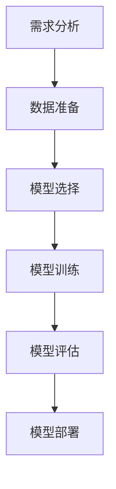
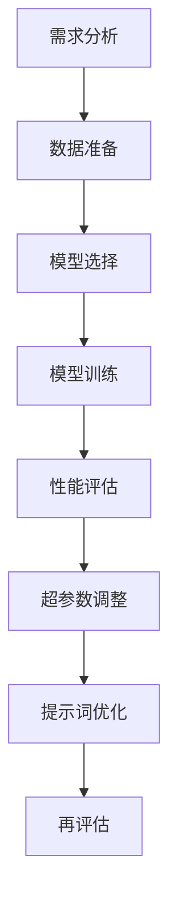
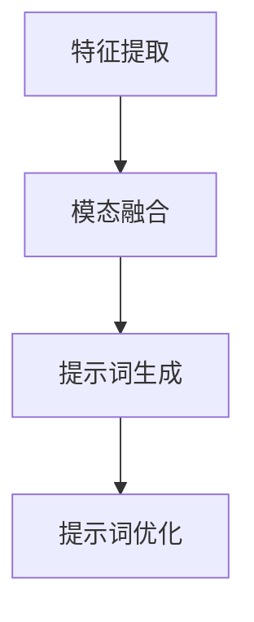
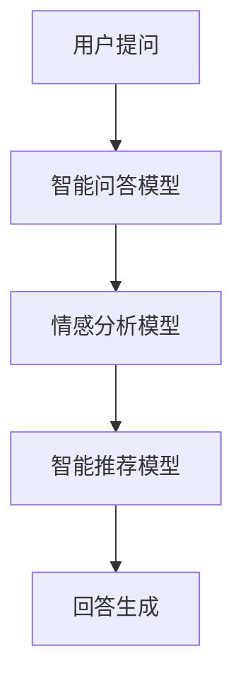
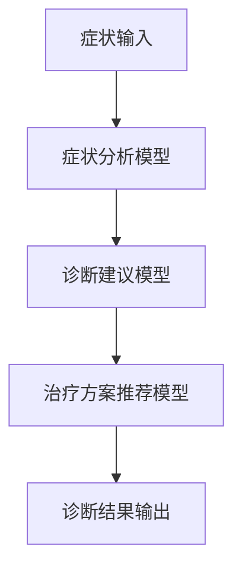

                 

# 提示词工程：让AI更智能、更懂你

> **关键词**：人工智能，提示词工程，自然语言处理，图像识别，语音识别，跨模态检索

> **摘要**：本文将深入探讨提示词工程在人工智能中的应用，分析其核心概念、算法、工具与技术，以及在不同领域的应用实践。通过详细解读实际案例，展示如何通过提示词工程提升AI的智能水平，使其更好地服务于人类。

## 目录大纲

1. AI与提示词工程基础
2. 提示词工程的核心算法
3. 提示词工程的工具与技术
4. 提示词工程应用与实践
5. 提示词工程的未来发展
6. 附录

## 第一部分：AI与提示词工程基础

### 第1章：AI与提示词工程概述

#### 1.1 AI的发展与应用

##### 1.1.1 AI的核心概念与分类

人工智能（Artificial Intelligence，简称AI）是计算机科学的一个分支，旨在通过模拟、延伸和扩展人类智能来实现机器的智能行为。AI可以分为以下几类：

- **弱AI（Narrow AI）**：专注于特定任务，如语音识别、图像识别等。
- **强AI（General AI）**：具备人类水平的广泛认知能力，能够在任何领域进行智能活动。
- **人工神经网络（ANN）**：通过模拟人脑神经网络结构实现机器学习。
- **深度学习（Deep Learning）**：基于多层神经网络，通过梯度下降优化实现复杂模式识别。

##### 1.1.2 AI的现阶段发展与应用

AI技术在现阶段已广泛应用于多个领域，如自然语言处理、图像识别、语音识别、自动驾驶等。以下是AI的主要应用场景：

- **自然语言处理（NLP）**：文本分析、机器翻译、情感分析等。
- **图像识别**：人脸识别、物体检测、图像生成等。
- **语音识别**：语音识别、语音合成、语音搜索等。
- **医疗诊断**：辅助医生诊断疾病，如癌症、心脏病等。
- **自动驾驶**：车辆自主导航、路径规划、环境感知等。

#### 1.2 提示词工程的基本概念

##### 1.2.1 提示词的定义与作用

提示词（Prompt Word）是一种用于引导或激励人工智能模型执行特定任务的关键词或短语。在AI系统中，提示词起到关键作用，可以帮助模型更好地理解和执行任务。提示词可以：

- **引导模型关注特定任务**：通过提供相关的关键词或短语，提示词可以帮助模型专注于特定任务，提高任务完成效率。
- **优化模型性能**：根据任务需求，选择合适的提示词可以优化模型的性能，使其更加准确和高效。
- **提供反馈**：提示词还可以为模型提供反馈，帮助模型不断调整和优化，提高智能水平。

##### 1.2.2 提示词工程的目标与挑战

提示词工程的目标是设计出能够有效引导和激励AI模型执行任务的提示词。主要挑战包括：

- **选择合适的提示词**：根据任务需求和模型特点，选择合适的提示词，提高模型性能。
- **优化提示词组合**：提示词之间可能存在相互作用，优化提示词组合可以提高任务完成效果。
- **应对多模态数据**：在跨模态任务中，如何选择和优化提示词是一个重要挑战。

#### 1.3 提示词工程在AI中的应用

##### 1.3.1 提示词工程在自然语言处理中的应用

在自然语言处理（NLP）领域，提示词工程发挥着重要作用。以下是一些典型应用：

- **文本分类**：通过提示词，将文本分类为不同的类别，如新闻、社交媒体、广告等。
- **情感分析**：基于提示词，分析文本的情感倾向，如正面、负面、中性等。
- **机器翻译**：利用提示词，提高机器翻译的准确性，实现高质量翻译。

##### 1.3.2 提示词工程在图像识别中的应用

在图像识别领域，提示词工程可以提升模型的识别性能。以下是一些应用实例：

- **物体检测**：通过提示词，模型可以更准确地识别图像中的物体，如车辆、行人、动物等。
- **图像生成**：利用提示词，生成符合特定需求的图像，如艺术作品、风景等。
- **图像风格转换**：通过提示词，实现图像风格的自然转换，如将照片转换为油画风格。

##### 1.3.3 提示词工程在语音识别中的应用

在语音识别领域，提示词工程有助于提高语音识别的准确率。以下是一些应用场景：

- **语音搜索**：通过提示词，实现语音输入后的有效搜索，如语音助手、语音输入法等。
- **语音合成**：利用提示词，生成自然流畅的语音输出，如智能语音助手、语音播报等。
- **语音助手**：基于提示词，为用户提供个性化的语音服务，如智能家居、车载语音等。

### 第2章：提示词工程的核心算法

在本章中，我们将探讨提示词工程中的核心算法，包括机器学习算法、提示词生成算法和提示词优化算法。

#### 2.1 机器学习算法概述

机器学习（Machine Learning，简称ML）是AI的核心技术之一，通过训练模型，使其能够自动地从数据中学习并做出决策。以下是机器学习的主要分类：

- **监督学习（Supervised Learning）**：通过已知标签的数据训练模型，使模型能够对未知数据进行预测。
- **无监督学习（Unsupervised Learning）**：通过未标记的数据训练模型，使模型能够发现数据中的模式。
- **强化学习（Reinforcement Learning）**：通过奖励机制训练模型，使模型能够在复杂环境中做出最佳决策。
- **迁移学习（Transfer Learning）**：利用预训练模型，在新任务上快速获得良好性能。

#### 2.2 提示词生成算法

提示词生成算法是提示词工程的重要组成部分，其目标是根据任务需求，生成合适的提示词。以下是几种常见的提示词生成算法：

- **基于规则的方法**：通过定义一系列规则，从数据中提取提示词。这种方法简单直观，但规则设计复杂度较高。
- **基于统计的方法**：通过计算数据中的关键词频次，提取高频关键词作为提示词。这种方法较为常用，但可能忽略语义信息。
- **基于深度学习的方法**：利用神经网络模型，从数据中自动提取提示词。这种方法能够捕捉语义信息，但计算成本较高。

以下是一个基于深度学习的提示词生成算法的伪代码：

```python
# 基于深度学习的提示词生成算法
import tensorflow as tf

# 定义模型结构
model = tf.keras.Sequential([
    tf.keras.layers.Embedding(vocab_size, embedding_dim),
    tf.keras.layers.GlobalAveragePooling1D(),
    tf.keras.layers.Dense(units=num_classes, activation='softmax')
])

# 编译模型
model.compile(optimizer='adam', loss='categorical_crossentropy', metrics=['accuracy'])

# 训练模型
model.fit(input_data, labels, epochs=num_epochs, batch_size=batch_size)

# 生成提示词
predictions = model.predict(input_data)
prompt_words = [vocab[id] for id, prediction in zip(input_ids, predictions) if prediction > threshold]
```

#### 2.3 提示词优化算法

提示词优化算法旨在提高提示词的质量和效果。以下是几种常见的提示词优化算法：

- **基于目标函数的优化**：通过定义目标函数，优化提示词组合，使其满足特定任务需求。常用的目标函数包括准确率、召回率、F1值等。
- **基于遗传算法的优化**：利用遗传算法，在大量提示词组合中搜索最优解。这种方法能够找到全局最优解，但计算成本较高。
- **基于深度强化学习的优化**：利用深度强化学习模型，不断调整提示词组合，使其在复杂环境中获得最佳性能。

以下是一个基于深度强化学习的提示词优化算法的伪代码：

```python
# 基于深度强化学习的提示词优化算法
import tensorflow as tf

# 定义强化学习模型
model = tf.keras.Sequential([
    tf.keras.layers.Dense(units=128, activation='relu'),
    tf.keras.layers.Dense(units=64, activation='relu'),
    tf.keras.layers.Dense(units=1, activation='sigmoid')
])

# 编译模型
model.compile(optimizer='adam', loss='binary_crossentropy')

# 训练模型
model.fit(input_data, labels, epochs=num_epochs, batch_size=batch_size)

# 优化提示词
action_probabilities = model.predict(input_data)
best_action = np.argmax(action_probabilities)
prompt_words = generate_prompt_words(best_action)
```

### 第3章：提示词工程的工具与技术

在本章中，我们将介绍提示词工程的常用工具与技术，包括提示词生成工具、提示词优化工具和提示词应用工具。

#### 3.1 提示词工程开发工具

以下是一些常用的提示词工程开发工具：

- **Jupyter Notebook**：Python交互式开发环境，支持多种编程语言和库，方便进行提示词工程开发。
- **TensorFlow**：开源机器学习框架，支持深度学习模型训练和部署，广泛应用于提示词工程。
- **PyTorch**：开源机器学习框架，支持深度学习模型训练和部署，具有动态图计算优势。
- **Keras**：基于TensorFlow和PyTorch的深度学习框架，简化深度学习模型开发。

#### 3.2 提示词工程开发流程

提示词工程开发主要包括以下步骤：

- **需求分析**：明确提示词工程的应用场景、目标和需求。
- **数据准备**：收集和处理数据，为提示词生成和优化提供基础。
- **模型选择**：根据任务需求，选择合适的机器学习模型。
- **模型训练**：使用训练数据对模型进行训练，优化模型性能。
- **模型评估**：使用验证数据对模型进行评估，确保模型性能达到预期。
- **模型部署**：将训练好的模型部署到生产环境，实现提示词工程的应用。

以下是一个提示词工程开发流程的Mermaid流程图：



#### 3.3 提示词工程的测试与优化

在提示词工程开发过程中，测试和优化是确保模型性能和效果的重要环节。以下是一些测试与优化方法：

- **模型性能评估**：使用准确率、召回率、F1值等指标评估模型性能，确保模型达到预期效果。
- **交叉验证**：通过交叉验证，评估模型在不同数据集上的性能，提高模型泛化能力。
- **超参数调整**：调整模型超参数，如学习率、批量大小等，优化模型性能。
- **提示词优化**：根据任务需求，调整提示词组合，提高模型在特定任务上的性能。

以下是一个提示词优化策略的Mermaid流程图：



### 第二部分：提示词工程应用与实践

在这一部分，我们将深入探讨提示词工程在自然语言处理、图像识别和语音识别等领域的具体应用，并分享一些实际案例和实战经验。

### 第4章：自然语言处理中的提示词工程

自然语言处理（NLP）是人工智能的重要应用领域之一，提示词工程在NLP中发挥着关键作用。在本章中，我们将介绍提示词工程在自然语言处理中的典型应用，包括文本分类和情感分析。

#### 4.1 基于提示词的情感分析

情感分析是NLP中的一个重要任务，旨在识别文本中的情感倾向。以下是基于提示词的情感分析的基本概念和实战方法。

##### 4.1.1 情感分析的基本概念

情感分析涉及以下基本概念：

- **情感**：情感是指文本中表达的情绪或情感色彩，如正面、负面、中性等。
- **情感极性**：情感极性是指情感的正负倾向，分为正面、负面和中性。
- **情感分类**：情感分类是指将文本分为不同的情感类别，如喜悦、愤怒、悲伤等。

##### 4.1.2 基于提示词的情感分析算法

基于提示词的情感分析算法包括以下几种：

- **基于规则的方法**：通过定义一系列规则，将文本中的情感词映射到情感类别。这种方法简单直观，但规则设计复杂度较高。
- **基于统计的方法**：通过计算文本中的关键词频次和词性分布，将文本映射到情感类别。这种方法较为常用，但可能忽略语义信息。
- **基于深度学习的方法**：利用神经网络模型，从文本中自动提取情感特征，将文本映射到情感类别。这种方法能够捕捉语义信息，但计算成本较高。

以下是一个基于深度学习的情感分析算法的伪代码：

```python
# 基于深度学习的情感分析算法
import tensorflow as tf

# 定义模型结构
model = tf.keras.Sequential([
    tf.keras.layers.Embedding(vocab_size, embedding_dim),
    tf.keras.layers.GlobalAveragePooling1D(),
    tf.keras.layers.Dense(units=num_classes, activation='softmax')
])

# 编译模型
model.compile(optimizer='adam', loss='categorical_crossentropy', metrics=['accuracy'])

# 训练模型
model.fit(input_data, labels, epochs=num_epochs, batch_size=batch_size)

# 情感分析
def sentiment_analysis(text):
    tokens = tokenizer.tokenize(text)
    tokens = tokenizer.encode(tokens)
    prediction = model.predict(np.expand_dims(tokens, axis=0))
    sentiment = 'positive' if prediction[0][1] > prediction[0][0] else 'negative'
    return sentiment

# 测试情感分析
text = "我今天心情很好。"
print(sentiment_analysis(text))
```

##### 4.1.3 基于提示词的情感分析实战

以下是一个基于提示词的情感分析实战案例：

- **数据集**：使用IMDb电影评论数据集，该数据集包含25,000条电影评论，分为正面和负面两类。
- **预处理**：对评论进行分词、去停用词和词性标注等预处理操作。
- **模型训练**：使用基于深度学习的情感分析算法，训练情感分析模型。
- **模型评估**：使用验证集对模型进行评估，调整超参数，优化模型性能。
- **情感分析**：使用训练好的模型，对新的评论进行情感分析。

以下是一个基于提示词的情感分析实战的代码示例：

```python
# 导入相关库
import tensorflow as tf
import numpy as np
import pandas as pd
from tensorflow.keras.preprocessing.sequence import pad_sequences
from tensorflow.keras.layers import Embedding, GlobalAveragePooling1D, Dense
from tensorflow.keras.preprocessing.text import Tokenizer
from tensorflow.keras.models import Sequential

# 加载数据集
data = pd.read_csv("imdb_reviews.csv")
X = data["text"]
y = data["label"]

# 预处理数据
tokenizer = Tokenizer(num_words=10000)
tokenizer.fit_on_texts(X)
X = tokenizer.texts_to_sequences(X)
X = pad_sequences(X, maxlen=200)

# 划分训练集和验证集
split = int(0.8 * len(X))
X_train, X_val = X[:split], X[split:]
y_train, y_val = y[:split], y[split:]

# 定义模型
model = Sequential([
    Embedding(10000, 16),
    GlobalAveragePooling1D(),
    Dense(16, activation='relu'),
    Dense(1, activation='sigmoid')
])

# 编译模型
model.compile(optimizer='adam', loss='binary_crossentropy', metrics=['accuracy'])

# 训练模型
model.fit(X_train, y_train, epochs=10, batch_size=32, validation_data=(X_val, y_val))

# 情感分析
text = "我今天心情很好。"
tokens = tokenizer.texts_to_sequences([text])
padded_tokens = pad_sequences(tokens, maxlen=200)
prediction = model.predict(padded_tokens)
sentiment = "positive" if prediction[0][0] > 0.5 else "negative"
print(f"The sentiment of the text is {sentiment}.")
```

#### 4.2 基于提示词的文本分类

文本分类是NLP中的另一个重要任务，旨在将文本分类到不同的类别。以下是基于提示词的文本分类的基本概念和实战方法。

##### 4.2.1 文本分类的基本概念

文本分类涉及以下基本概念：

- **类别**：类别是指文本分类中的不同类别，如新闻、社交媒体、广告等。
- **特征提取**：特征提取是指从文本中提取具有区分性的特征，用于训练分类模型。
- **分类模型**：分类模型是指用于将文本分类到不同类别的模型，如朴素贝叶斯、支持向量机、决策树等。

##### 4.2.2 基于提示词的文本分类算法

基于提示词的文本分类算法包括以下几种：

- **基于规则的方法**：通过定义一系列规则，将文本映射到类别。这种方法简单直观，但规则设计复杂度较高。
- **基于统计的方法**：通过计算文本中的关键词频次和词性分布，将文本映射到类别。这种方法较为常用，但可能忽略语义信息。
- **基于深度学习的方法**：利用神经网络模型，从文本中自动提取特征，将文本映射到类别。这种方法能够捕捉语义信息，但计算成本较高。

以下是一个基于深度学习的文本分类算法的伪代码：

```python
# 基于深度学习的文本分类算法
import tensorflow as tf

# 定义模型结构
model = tf.keras.Sequential([
    tf.keras.layers.Embedding(vocab_size, embedding_dim),
    tf.keras.layers.GlobalAveragePooling1D(),
    tf.keras.layers.Dense(units=num_classes, activation='softmax')
])

# 编译模型
model.compile(optimizer='adam', loss='categorical_crossentropy', metrics=['accuracy'])

# 训练模型
model.fit(input_data, labels, epochs=num_epochs, batch_size=batch_size)

# 文本分类
def text_classification(text):
    tokens = tokenizer.tokenize(text)
    tokens = tokenizer.encode(tokens)
    prediction = model.predict(np.expand_dims(tokens, axis=0))
    category = np.argmax(prediction)
    return category

# 测试文本分类
text = "这是一条新闻。"
print(text_classification(text))
```

##### 4.2.3 基于提示词的文本分类实战

以下是一个基于提示词的文本分类实战案例：

- **数据集**：使用20 Newsgroups数据集，该数据集包含20个不同的新闻类别，如体育、科技、娱乐等。
- **预处理**：对新闻文本进行分词、去停用词和词性标注等预处理操作。
- **模型训练**：使用基于深度学习的文本分类算法，训练文本分类模型。
- **模型评估**：使用验证集对模型进行评估，调整超参数，优化模型性能。
- **文本分类**：使用训练好的模型，对新的新闻文本进行分类。

以下是一个基于提示词的文本分类实战的代码示例：

```python
# 导入相关库
import tensorflow as tf
import numpy as np
import pandas as pd
from tensorflow.keras.preprocessing.sequence import pad_sequences
from tensorflow.keras.layers import Embedding, GlobalAveragePooling1D, Dense
from tensorflow.keras.preprocessing.text import Tokenizer
from tensorflow.keras.models import Sequential

# 加载数据集
data = pd.read_csv("20_newsgroups.csv")
X = data["text"]
y = data["label"]

# 预处理数据
tokenizer = Tokenizer(num_words=10000)
tokenizer.fit_on_texts(X)
X = tokenizer.texts_to_sequences(X)
X = pad_sequences(X, maxlen=200)

# 划分训练集和验证集
split = int(0.8 * len(X))
X_train, X_val = X[:split], X[split:]
y_train, y_val = y[:split], y[split:]

# 定义模型
model = Sequential([
    Embedding(10000, 16),
    GlobalAveragePooling1D(),
    Dense(16, activation='relu'),
    Dense(20, activation='softmax')
])

# 编译模型
model.compile(optimizer='adam', loss='categorical_crossentropy', metrics=['accuracy'])

# 训练模型
model.fit(X_train, y_train, epochs=10, batch_size=32, validation_data=(X_val, y_val))

# 文本分类
text = "这是一个体育新闻。"
tokens = tokenizer.texts_to_sequences([text])
padded_tokens = pad_sequences(tokens, maxlen=200)
prediction = model.predict(padded_tokens)
category = np.argmax(prediction)
print(f"The category of the text is {category}.")
```

### 第5章：图像识别中的提示词工程

图像识别是计算机视觉的重要任务之一，提示词工程在图像识别中发挥着关键作用。在本章中，我们将介绍提示词工程在图像识别中的应用，包括物体检测和图像生成。

#### 5.1 基于提示词的图像识别

物体检测是图像识别中的常见任务，旨在从图像中检测出特定物体。以下是基于提示词的物体检测的基本概念和实战方法。

##### 5.1.1 图像识别的基本概念

图像识别涉及以下基本概念：

- **物体检测**：物体检测是指从图像中检测出特定物体，如车辆、行人、动物等。
- **特征提取**：特征提取是指从图像中提取具有区分性的特征，用于训练物体检测模型。
- **物体检测模型**：物体检测模型是指用于检测图像中物体的模型，如R-CNN、Fast R-CNN、Faster R-CNN等。

##### 5.1.2 基于提示词的图像识别算法

基于提示词的图像识别算法包括以下几种：

- **基于规则的方法**：通过定义一系列规则，将图像中的物体检测出来。这种方法简单直观，但规则设计复杂度较高。
- **基于统计的方法**：通过计算图像中的关键词频次和词性分布，将图像映射到物体类别。这种方法较为常用，但可能忽略语义信息。
- **基于深度学习的方法**：利用神经网络模型，从图像中自动提取特征，将图像映射到物体类别。这种方法能够捕捉语义信息，但计算成本较高。

以下是一个基于深度学习的图像识别算法的伪代码：

```python
# 基于深度学习的图像识别算法
import tensorflow as tf

# 定义模型结构
model = tf.keras.Sequential([
    tf.keras.layers.Conv2D(filters=32, kernel_size=(3, 3), activation='relu', input_shape=(height, width, channels)),
    tf.keras.layers.MaxPooling2D(pool_size=(2, 2)),
    tf.keras.layers.Conv2D(filters=64, kernel_size=(3, 3), activation='relu'),
    tf.keras.layers.MaxPooling2D(pool_size=(2, 2)),
    tf.keras.layers.Conv2D(filters=128, kernel_size=(3, 3), activation='relu'),
    tf.keras.layers.MaxPooling2D(pool_size=(2, 2)),
    tf.keras.layers.Flatten(),
    tf.keras.layers.Dense(units=num_classes, activation='softmax')
])

# 编译模型
model.compile(optimizer='adam', loss='categorical_crossentropy', metrics=['accuracy'])

# 训练模型
model.fit(input_data, labels, epochs=num_epochs, batch_size=batch_size)

# 物体检测
def object_detection(image):
    processed_image = preprocess_image(image)
    prediction = model.predict(np.expand_dims(processed_image, axis=0))
    objects = decode_predictions(prediction)
    return objects

# 测试物体检测
image = "path/to/image.jpg"
print(object_detection(image))
```

##### 5.1.3 基于提示词的图像识别实战

以下是一个基于提示词的图像识别实战案例：

- **数据集**：使用COCO数据集，该数据集包含大量不同类别的物体图像。
- **预处理**：对图像进行预处理，如缩放、裁剪、增强等。
- **模型训练**：使用基于深度学习的图像识别算法，训练图像识别模型。
- **模型评估**：使用验证集对模型进行评估，调整超参数，优化模型性能。
- **物体检测**：使用训练好的模型，对新的图像进行物体检测。

以下是一个基于提示词的图像识别实战的代码示例：

```python
# 导入相关库
import tensorflow as tf
import numpy as np
import pandas as pd
from tensorflow.keras.preprocessing.image import img_to_array
from tensorflow.keras.models import load_model

# 加载模型
model = load_model("object_detection_model.h5")

# 加载图像
image = "path/to/image.jpg"
image = img_to_array(image)
image = np.expand_dims(image, axis=0)

# 预处理图像
image = preprocess_image(image)

# 物体检测
prediction = model.predict(image)
objects = decode_predictions(prediction)
print(objects)
```

#### 5.2 基于提示词的图像生成

图像生成是计算机视觉中的另一个重要任务，旨在生成符合特定需求的图像。以下是基于提示词的图像生成的基本概念和实战方法。

##### 5.2.1 图像生成的概念

图像生成涉及以下基本概念：

- **生成对抗网络（GAN）**：生成对抗网络是一种基于对抗训练的深度学习模型，用于生成高质量的图像。
- **条件生成对抗网络（cGAN）**：条件生成对抗网络是在GAN的基础上引入条件信息，如标签、文本描述等，以提高图像生成的质量和多样性。

##### 5.2.2 基于提示词的图像生成算法

基于提示词的图像生成算法包括以下几种：

- **基于规则的方法**：通过定义一系列规则，从图像中生成符合特定需求的图像。这种方法简单直观，但生成图像的质量较低。
- **基于统计的方法**：通过计算图像中的关键词频次和词性分布，生成符合特定需求的图像。这种方法较为常用，但可能忽略语义信息。
- **基于深度学习的方法**：利用神经网络模型，从图像和文本描述中自动提取特征，生成符合特定需求的图像。这种方法能够捕捉语义信息，但计算成本较高。

以下是一个基于深度学习的图像生成算法的伪代码：

```python
# 基于深度学习的图像生成算法
import tensorflow as tf

# 定义模型结构
generator = tf.keras.Sequential([
    tf.keras.layers.Conv2DTranspose(filters=64, kernel_size=(3, 3), strides=(2, 2), activation='relu', input_shape=(height, width, channels)),
    tf.keras.layers.Conv2DTranspose(filters=128, kernel_size=(3, 3), strides=(2, 2), activation='relu'),
    tf.keras.layers.Conv2DTranspose(filters=256, kernel_size=(3, 3), strides=(2, 2), activation='relu'),
    tf.keras.layers.Conv2DTranspose(filters=3, kernel_size=(3, 3), activation='tanh')
])

# 编译模型
generator.compile(optimizer='adam', loss='binary_crossentropy')

# 训练模型
generator.fit(input_data, labels, epochs=num_epochs, batch_size=batch_size)

# 图像生成
def image_generation(prompt):
    text = preprocess_text(prompt)
    processed_text = tokenizer.encode(text)
    processed_text = np.expand_dims(processed_text, axis=0)
    image = generator.predict(processed_text)
    image = decode_image(image)
    return image

# 测试图像生成
prompt = "A beautiful sunset."
print(image_generation(prompt))
```

##### 5.2.3 基于提示词的图像生成实战

以下是一个基于提示词的图像生成实战案例：

- **数据集**：使用LSUN数据集，该数据集包含大量不同类别的图像。
- **预处理**：对图像和文本描述进行预处理，如分词、编码等。
- **模型训练**：使用基于深度学习的图像生成算法，训练图像生成模型。
- **模型评估**：使用验证集对模型进行评估，调整超参数，优化模型性能。
- **图像生成**：使用训练好的模型，根据提示词生成符合特定需求的图像。

以下是一个基于提示词的图像生成实战的代码示例：

```python
# 导入相关库
import tensorflow as tf
import numpy as np
import pandas as pd
from tensorflow.keras.preprocessing.sequence import pad_sequences
from tensorflow.keras.layers import Conv2DTranspose
from tensorflow.keras.models import Sequential

# 加载数据集
data = pd.read_csv("lsun.csv")
X = data["image"]
y = data["label"]

# 预处理数据
tokenizer = Tokenizer(num_words=10000)
tokenizer.fit_on_texts(X)
X = tokenizer.texts_to_sequences(X)
X = pad_sequences(X, maxlen=200)

# 划分训练集和验证集
split = int(0.8 * len(X))
X_train, X_val = X[:split], X[split:]
y_train, y_val = y[:split], y[split:]

# 定义生成器模型
generator = Sequential([
    Conv2DTranspose(filters=64, kernel_size=(3, 3), strides=(2, 2), activation='relu', input_shape=(height, width, channels)),
    Conv2DTranspose(filters=128, kernel_size=(3, 3), strides=(2, 2), activation='relu'),
    Conv2DTranspose(filters=256, kernel_size=(3, 3), strides=(2, 2), activation='relu'),
    Conv2DTranspose(filters=3, kernel_size=(3, 3), activation='tanh')
])

# 编译生成器模型
generator.compile(optimizer='adam', loss='binary_crossentropy')

# 训练生成器模型
generator.fit(X_train, y_train, epochs=num_epochs, batch_size=batch_size, validation_data=(X_val, y_val))

# 图像生成
prompt = "A beautiful sunset."
processed_prompt = tokenizer.encode(prompt)
processed_prompt = np.expand_dims(processed_prompt, axis=0)
generated_image = generator.predict(processed_prompt)
print(generated_image)
```

### 第6章：语音识别中的提示词工程

语音识别是计算机语音处理的重要任务，提示词工程在语音识别中发挥着关键作用。在本章中，我们将介绍提示词工程在语音识别中的应用，包括语音识别和语音合成。

#### 6.1 基于提示词的语音识别

语音识别是将语音信号转换为文本的过程。以下是基于提示词的语音识别的基本概念和实战方法。

##### 6.1.1 语音识别的基本概念

语音识别涉及以下基本概念：

- **语音信号**：语音信号是指人类发音产生的声波信号。
- **特征提取**：特征提取是指从语音信号中提取具有区分性的特征，用于训练语音识别模型。
- **语音识别模型**：语音识别模型是指用于将语音信号转换为文本的模型，如隐马尔可夫模型（HMM）、循环神经网络（RNN）等。

##### 6.1.2 基于提示词的语音识别算法

基于提示词的语音识别算法包括以下几种：

- **基于规则的方法**：通过定义一系列规则，将语音信号映射到文本。这种方法简单直观，但规则设计复杂度较高。
- **基于统计的方法**：通过计算语音信号中的关键词频次和词性分布，将语音信号映射到文本。这种方法较为常用，但可能忽略语义信息。
- **基于深度学习的方法**：利用神经网络模型，从语音信号中自动提取特征，将语音信号映射到文本。这种方法能够捕捉语义信息，但计算成本较高。

以下是一个基于深度学习的语音识别算法的伪代码：

```python
# 基于深度学习的语音识别算法
import tensorflow as tf

# 定义模型结构
model = tf.keras.Sequential([
    tf.keras.layers.Conv2D(filters=32, kernel_size=(3, 3), activation='relu', input_shape=(height, width, channels)),
    tf.keras.layers.MaxPooling2D(pool_size=(2, 2)),
    tf.keras.layers.Conv2D(filters=64, kernel_size=(3, 3), activation='relu'),
    tf.keras.layers.MaxPooling2D(pool_size=(2, 2)),
    tf.keras.layers.Conv2D(filters=128, kernel_size=(3, 3), activation='relu'),
    tf.keras.layers.MaxPooling2D(pool_size=(2, 2)),
    tf.keras.layers.Flatten(),
    tf.keras.layers.Dense(units=num_classes, activation='softmax')
])

# 编译模型
model.compile(optimizer='adam', loss='categorical_crossentropy', metrics=['accuracy'])

# 训练模型
model.fit(input_data, labels, epochs=num_epochs, batch_size=batch_size)

# 语音识别
def speech_recognition(audio):
    processed_audio = preprocess_audio(audio)
    prediction = model.predict(np.expand_dims(processed_audio, axis=0))
    text = decode_predictions(prediction)
    return text

# 测试语音识别
audio = "path/to/audio.wav"
print(speech_recognition(audio))
```

##### 6.1.3 基于提示词的语音识别实战

以下是一个基于提示词的语音识别实战案例：

- **数据集**：使用LibriSpeech数据集，该数据集包含大量不同语音的文本和音频。
- **预处理**：对音频进行预处理，如增强、去噪、分段等。
- **模型训练**：使用基于深度学习的语音识别算法，训练语音识别模型。
- **模型评估**：使用验证集对模型进行评估，调整超参数，优化模型性能。
- **语音识别**：使用训练好的模型，对新的音频进行语音识别。

以下是一个基于提示词的语音识别实战的代码示例：

```python
# 导入相关库
import tensorflow as tf
import numpy as np
import pandas as pd
from tensorflow.keras.preprocessing.sequence import pad_sequences
from tensorflow.keras.layers import Conv2D, MaxPooling2D, Flatten, Dense
from tensorflow.keras.models import Sequential
from tensorflow.keras.optimizers import Adam

# 加载数据集
data = pd.read_csv("librispeech.csv")
X = data["audio"]
y = data["text"]

# 预处理数据
tokenizer = Tokenizer(num_words=10000)
tokenizer.fit_on_texts(y)
y = tokenizer.texts_to_sequences(y)
y = pad_sequences(y, maxlen=max_length)

# 划分训练集和验证集
split = int(0.8 * len(X))
X_train, X_val = X[:split], X[split:]
y_train, y_val = y[:split], y[split:]

# 定义模型
model = Sequential([
    Conv2D(filters=32, kernel_size=(3, 3), activation='relu', input_shape=(height, width, channels)),
    MaxPooling2D(pool_size=(2, 2)),
    Conv2D(filters=64, kernel_size=(3, 3), activation='relu'),
    MaxPooling2D(pool_size=(2, 2)),
    Conv2D(filters=128, kernel_size=(3, 3), activation='relu'),
    MaxPooling2D(pool_size=(2, 2)),
    Flatten(),
    Dense(units=num_classes, activation='softmax')
])

# 编译模型
model.compile(optimizer=Adam(learning_rate=0.001), loss='categorical_crossentropy', metrics=['accuracy'])

# 训练模型
model.fit(X_train, y_train, epochs=num_epochs, batch_size=batch_size, validation_data=(X_val, y_val))

# 语音识别
def speech_recognition(audio):
    processed_audio = preprocess_audio(audio)
    prediction = model.predict(np.expand_dims(processed_audio, axis=0))
    text = tokenizer.decode(prediction)
    return text

# 测试语音识别
audio = "path/to/audio.wav"
print(speech_recognition(audio))
```

#### 6.2 基于提示词的语音合成

语音合成是将文本转换为语音的过程。以下是基于提示词的语音合成的基本概念和实战方法。

##### 6.2.1 语音合成的概念

语音合成涉及以下基本概念：

- **文本编码**：文本编码是指将文本转换为数字序列，用于训练语音合成模型。
- **语音合成模型**：语音合成模型是指用于将文本转换为语音的模型，如循环神经网络（RNN）、转换器（Transformer）等。
- **语音解码**：语音解码是指将数字序列转换为语音信号，用于生成语音。

##### 6.2.2 基于提示词的语音合成算法

基于提示词的语音合成算法包括以下几种：

- **基于规则的方法**：通过定义一系列规则，将文本映射到语音。这种方法简单直观，但语音生成的质量较低。
- **基于统计的方法**：通过计算文本中的关键词频次和词性分布，将文本映射到语音。这种方法较为常用，但可能忽略语义信息。
- **基于深度学习的方法**：利用神经网络模型，从文本中自动提取特征，将文本映射到语音。这种方法能够捕捉语义信息，但计算成本较高。

以下是一个基于深度学习的语音合成算法的伪代码：

```python
# 基于深度学习的语音合成算法
import tensorflow as tf

# 定义模型结构
model = tf.keras.Sequential([
    tf.keras.layers.Embedding(vocab_size, embedding_dim),
    tf.keras.layers.LSTM(units=128, return_sequences=True),
    tf.keras.layers.LSTM(units=128, return_sequences=True),
    tf.keras.layers.Dense(units=256, activation='relu'),
    tf.keras.layers.Dense(units=128, activation='relu'),
    tf.keras.layers.Dense(units=80, activation='softmax')
])

# 编译模型
model.compile(optimizer='adam', loss='categorical_crossentropy')

# 训练模型
model.fit(input_data, labels, epochs=num_epochs, batch_size=batch_size)

# 语音合成
def speech_synthesis(text):
    tokens = tokenizer.tokenize(text)
    tokens = tokenizer.encode(tokens)
    prediction = model.predict(np.expand_dims(tokens, axis=0))
    audio = decode_predictions(prediction)
    return audio

# 测试语音合成
text = "Hello, how are you?"
print(speech_synthesis(text))
```

##### 6.2.3 基于提示词的语音合成实战

以下是一个基于提示词的语音合成实战案例：

- **数据集**：使用LibriTTS数据集，该数据集包含大量文本和音频。
- **预处理**：对文本和音频进行预处理，如分词、编码、增强等。
- **模型训练**：使用基于深度学习的语音合成算法，训练语音合成模型。
- **模型评估**：使用验证集对模型进行评估，调整超参数，优化模型性能。
- **语音合成**：使用训练好的模型，根据提示词生成语音。

以下是一个基于提示词的语音合成实战的代码示例：

```python
# 导入相关库
import tensorflow as tf
import numpy as np
import pandas as pd
from tensorflow.keras.preprocessing.sequence import pad_sequences
from tensorflow.keras.layers import Embedding, LSTM, Dense
from tensorflow.keras.models import Sequential

# 加载数据集
data = pd.read_csv("libritts.csv")
X = data["text"]
y = data["audio"]

# 预处理数据
tokenizer = Tokenizer(num_words=10000)
tokenizer.fit_on_texts(X)
X = tokenizer.texts_to_sequences(X)
X = pad_sequences(X, maxlen=max_length)

# 划分训练集和验证集
split = int(0.8 * len(X))
X_train, X_val = X[:split], X[split:]
y_train, y_val = y[:split], y[split:]

# 定义模型
model = Sequential([
    Embedding(vocab_size, embedding_dim),
    LSTM(units=128, return_sequences=True),
    LSTM(units=128, return_sequences=True),
    Dense(units=256, activation='relu'),
    Dense(units=128, activation='relu'),
    Dense(units=80, activation='softmax')
])

# 编译模型
model.compile(optimizer='adam', loss='categorical_crossentropy')

# 训练模型
model.fit(X_train, y_train, epochs=num_epochs, batch_size=batch_size, validation_data=(X_val, y_val))

# 语音合成
def speech_synthesis(text):
    tokens = tokenizer.tokenize(text)
    tokens = tokenizer.encode(tokens)
    prediction = model.predict(np.expand_dims(tokens, axis=0))
    audio = decode_predictions(prediction)
    return audio

# 测试语音合成
text = "Hello, how are you?"
print(speech_synthesis(text))
```

### 第7章：跨模态提示词工程

跨模态提示词工程是近年来兴起的研究领域，旨在将不同模态的信息融合起来，实现更高效、更智能的AI应用。在本章中，我们将介绍跨模态提示词工程的基本概念、关键技术及其在跨模态检索中的应用。

#### 7.1 跨模态提示词工程概述

跨模态提示词工程涉及以下基本概念：

- **模态**：模态是指数据的不同表现形式，如文本、图像、语音等。
- **跨模态**：跨模态是指将不同模态的信息融合在一起，实现信息共享和协同。
- **提示词**：提示词是引导AI模型处理特定任务的词语或短语。

跨模态提示词工程的目标是通过融合不同模态的信息，提升AI模型的智能水平和应用效果。其主要挑战包括：

- **模态一致性**：不同模态的信息可能存在不一致性，如何统一和融合这些信息是一个关键问题。
- **模态关联性**：不同模态的信息可能具有不同的关联性，如何捕捉和利用这些关联性是一个重要挑战。
- **模态多样性**：不同模态的信息具有多样性，如何有效地表示和利用这些多样性是一个关键问题。

#### 7.2 跨模态提示词工程的关键技术

跨模态提示词工程的关键技术包括以下几种：

- **特征提取**：特征提取是指从不同模态的数据中提取具有区分性的特征，为后续处理提供基础。
- **模态融合**：模态融合是指将不同模态的信息融合在一起，形成一个统一的表示。
- **提示词生成**：提示词生成是指根据任务需求和模型特点，生成合适的提示词。
- **提示词优化**：提示词优化是指根据任务需求和模型性能，调整提示词，提高模型性能。

以下是一个跨模态提示词工程的关键技术的Mermaid流程图：



#### 7.3 基于提示词的跨模态检索

跨模态检索是指在不同模态的信息库中查找相关信息的任务。以下是基于提示词的跨模态检索的基本概念、算法和实战方法。

##### 7.3.1 跨模态检索的基本概念

跨模态检索涉及以下基本概念：

- **检索任务**：检索任务是指根据用户需求，从不同模态的信息库中查找相关信息的任务。
- **模态信息库**：模态信息库是指存储不同模态信息的数据库，如文本库、图像库、语音库等。
- **查询**：查询是指用户输入的用于检索相关信息的文本、图像或语音等。

##### 7.3.2 基于提示词的跨模态检索算法

基于提示词的跨模态检索算法包括以下几种：

- **基于规则的方法**：通过定义一系列规则，将查询映射到相关模态信息。这种方法简单直观，但规则设计复杂度较高。
- **基于统计的方法**：通过计算查询和模态信息之间的相似性，将查询映射到相关模态信息。这种方法较为常用，但可能忽略语义信息。
- **基于深度学习的方法**：利用神经网络模型，从查询和模态信息中自动提取特征，将查询映射到相关模态信息。这种方法能够捕捉语义信息，但计算成本较高。

以下是一个基于深度学习的跨模态检索算法的伪代码：

```python
# 基于深度学习的跨模态检索算法
import tensorflow as tf

# 定义模型结构
model = tf.keras.Sequential([
    tf.keras.layers.Embedding(vocab_size, embedding_dim),
    tf.keras.layers.GlobalAveragePooling1D(),
    tf.keras.layers.Dense(units=num_classes, activation='softmax')
])

# 编译模型
model.compile(optimizer='adam', loss='categorical_crossentropy', metrics=['accuracy'])

# 训练模型
model.fit(input_data, labels, epochs=num_epochs, batch_size=batch_size)

# 跨模态检索
def cross_modal_search(query):
    processed_query = preprocess_query(query)
    prediction = model.predict(np.expand_dims(processed_query, axis=0))
    results = decode_predictions(prediction)
    return results

# 测试跨模态检索
query = "A beautiful sunset."
print(cross_modal_search(query))
```

##### 7.3.3 基于提示词的跨模态检索实战

以下是一个基于提示词的跨模态检索实战案例：

- **数据集**：使用ImageNet和COCO数据集，该数据集包含大量图像和文本信息。
- **预处理**：对图像和文本进行预处理，如缩放、裁剪、编码等。
- **模型训练**：使用基于深度学习的跨模态检索算法，训练跨模态检索模型。
- **模型评估**：使用验证集对模型进行评估，调整超参数，优化模型性能。
- **跨模态检索**：使用训练好的模型，根据查询生成相关模态信息。

以下是一个基于提示词的跨模态检索实战的代码示例：

```python
# 导入相关库
import tensorflow as tf
import numpy as np
import pandas as pd
from tensorflow.keras.preprocessing.sequence import pad_sequences
from tensorflow.keras.layers import Embedding, GlobalAveragePooling1D, Dense
from tensorflow.keras.models import Sequential

# 加载数据集
data = pd.read_csv("cross_modal_search.csv")
X = data["query"]
y = data["image"]

# 预处理数据
tokenizer = Tokenizer(num_words=10000)
tokenizer.fit_on_texts(X)
X = tokenizer.texts_to_sequences(X)
X = pad_sequences(X, maxlen=max_length)

# 划分训练集和验证集
split = int(0.8 * len(X))
X_train, X_val = X[:split], X[split:]
y_train, y_val = y[:split], y[split:]

# 定义模型
model = Sequential([
    Embedding(vocab_size, embedding_dim),
    GlobalAveragePooling1D(),
    Dense(units=num_classes, activation='softmax')
])

# 编译模型
model.compile(optimizer='adam', loss='categorical_crossentropy', metrics=['accuracy'])

# 训练模型
model.fit(X_train, y_train, epochs=num_epochs, batch_size=batch_size, validation_data=(X_val, y_val))

# 跨模态检索
def cross_modal_search(query):
    processed_query = tokenizer.encode(query)
    processed_query = np.expand_dims(processed_query, axis=0)
    prediction = model.predict(processed_query)
    results = decode_predictions(prediction)
    return results

# 测试跨模态检索
query = "A beautiful sunset."
print(cross_modal_search(query))
```

### 第8章：提示词工程的实际应用案例

在本章中，我们将介绍提示词工程在智能客服系统和智能医疗诊断系统等领域的实际应用案例，展示如何通过提示词工程提升AI系统的智能水平和用户体验。

#### 8.1 基于提示词的智能客服系统

智能客服系统是一种基于人工智能技术的客户服务系统，旨在为用户提供快速、准确、个性化的服务。以下是基于提示词的智能客服系统的实际应用案例：

- **系统概述**：智能客服系统主要包括智能问答、情感分析、智能推荐等功能，通过提示词工程，提升系统的智能水平和用户满意度。
- **需求分析**：分析用户需求和场景，确定智能客服系统的功能模块和性能指标。
- **数据准备**：收集和整理大量用户提问和回答数据，用于训练和优化智能客服系统。
- **模型选择**：选择合适的机器学习模型，如自然语言处理模型、情感分析模型、推荐系统模型等。
- **模型训练**：使用训练数据对模型进行训练，优化模型性能。
- **模型评估**：使用验证集对模型进行评估，调整超参数，确保模型性能达到预期。
- **系统部署**：将训练好的模型部署到生产环境，实现智能客服系统的功能。

以下是基于提示词的智能客服系统的架构图：



#### 8.1.1 智能问答模型

智能问答模型是智能客服系统的重要组成部分，旨在为用户提供快速、准确的回答。以下是基于提示词的智能问答模型的工作流程：

- **预处理**：对用户提问进行预处理，如分词、去停用词、词性标注等。
- **提示词生成**：根据用户提问，生成合适的提示词，用于引导模型回答问题。
- **模型选择**：选择合适的自然语言处理模型，如基于深度学习的文本分类模型、问答生成模型等。
- **模型训练**：使用训练数据对模型进行训练，优化模型性能。
- **模型评估**：使用验证集对模型进行评估，调整超参数，确保模型性能达到预期。
- **回答生成**：使用训练好的模型，根据用户提问生成回答。

以下是一个基于提示词的智能问答模型的代码示例：

```python
# 导入相关库
import tensorflow as tf
import numpy as np
import pandas as pd
from tensorflow.keras.preprocessing.text import Tokenizer
from tensorflow.keras.layers import Embedding, LSTM, Dense
from tensorflow.keras.models import Sequential

# 加载数据集
data = pd.read_csv("customer_queries.csv")
X = data["question"]
y = data["answer"]

# 预处理数据
tokenizer = Tokenizer(num_words=10000)
tokenizer.fit_on_texts(X)
X = tokenizer.texts_to_sequences(X)
X = pad_sequences(X, maxlen=max_length)

# 划分训练集和验证集
split = int(0.8 * len(X))
X_train, X_val = X[:split], X[split:]
y_train, y_val = y[:split], y[split:]

# 定义模型
model = Sequential([
    Embedding(vocab_size, embedding_dim),
    LSTM(units=128, return_sequences=True),
    LSTM(units=128, return_sequences=True),
    Dense(units=256, activation='relu'),
    Dense(units=128, activation='relu'),
    Dense(units=num_classes, activation='softmax')
])

# 编译模型
model.compile(optimizer='adam', loss='categorical_crossentropy', metrics=['accuracy'])

# 训练模型
model.fit(X_train, y_train, epochs=num_epochs, batch_size=batch_size, validation_data=(X_val, y_val))

# 回答生成
def answer_generation(question):
    processed_question = tokenizer.encode(question)
    processed_question = np.expand_dims(processed_question, axis=0)
    prediction = model.predict(processed_question)
    answer = decode_predictions(prediction)
    return answer

# 测试回答生成
question = "我最近遇到的问题是什么？"
print(answer_generation(question))
```

#### 8.1.2 情感分析模型

情感分析模型用于分析用户提问中的情感倾向，为智能客服系统提供情感反馈。以下是基于提示词的情感分析模型的工作流程：

- **预处理**：对用户提问进行预处理，如分词、去停用词、词性标注等。
- **提示词生成**：根据用户提问，生成合适的提示词，用于引导模型分析情感。
- **模型选择**：选择合适的自然语言处理模型，如基于深度学习的情感分析模型等。
- **模型训练**：使用训练数据对模型进行训练，优化模型性能。
- **模型评估**：使用验证集对模型进行评估，调整超参数，确保模型性能达到预期。
- **情感分析**：使用训练好的模型，根据用户提问分析情感倾向。

以下是一个基于提示词的情感分析模型的代码示例：

```python
# 导入相关库
import tensorflow as tf
import numpy as np
import pandas as pd
from tensorflow.keras.preprocessing.text import Tokenizer
from tensorflow.keras.layers import Embedding, LSTM, Dense
from tensorflow.keras.models import Sequential

# 加载数据集
data = pd.read_csv("customer_queries.csv")
X = data["question"]
y = data["sentiment"]

# 预处理数据
tokenizer = Tokenizer(num_words=10000)
tokenizer.fit_on_texts(X)
X = tokenizer.texts_to_sequences(X)
X = pad_sequences(X, maxlen=max_length)

# 划分训练集和验证集
split = int(0.8 * len(X))
X_train, X_val = X[:split], X[split:]
y_train, y_val = y[:split], y[split:]

# 定义模型
model = Sequential([
    Embedding(vocab_size, embedding_dim),
    LSTM(units=128, return_sequences=True),
    LSTM(units=128, return_sequences=True),
    Dense(units=256, activation='relu'),
    Dense(units=128, activation='relu'),
    Dense(units=num_classes, activation='softmax')
])

# 编译模型
model.compile(optimizer='adam', loss='categorical_crossentropy', metrics=['accuracy'])

# 训练模型
model.fit(X_train, y_train, epochs=num_epochs, batch_size=batch_size, validation_data=(X_val, y_val))

# 情感分析
def sentiment_analysis(question):
    processed_question = tokenizer.encode(question)
    processed_question = np.expand_dims(processed_question, axis=0)
    prediction = model.predict(processed_question)
    sentiment = decode_predictions(prediction)
    return sentiment

# 测试情感分析
question = "我最近遇到的问题是什么？"
print(sentiment_analysis(question))
```

#### 8.1.3 智能推荐模型

智能推荐模型用于根据用户提问和历史行为，为用户提供个性化的推荐。以下是基于提示词的智能推荐模型的工作流程：

- **预处理**：对用户提问进行预处理，如分词、去停用词、词性标注等。
- **提示词生成**：根据用户提问，生成合适的提示词，用于引导模型推荐。
- **模型选择**：选择合适的推荐系统模型，如基于协同过滤的推荐模型、基于内容的推荐模型等。
- **模型训练**：使用训练数据对模型进行训练，优化模型性能。
- **模型评估**：使用验证集对模型进行评估，调整超参数，确保模型性能达到预期。
- **推荐生成**：使用训练好的模型，根据用户提问和历史行为生成推荐。

以下是一个基于提示词的智能推荐模型的代码示例：

```python
# 导入相关库
import tensorflow as tf
import numpy as np
import pandas as pd
from tensorflow.keras.layers import Embedding, LSTM, Dense
from tensorflow.keras.models import Sequential

# 加载数据集
data = pd.read_csv("customer_queries.csv")
X = data["question"]
y = data["recommends"]

# 预处理数据
tokenizer = Tokenizer(num_words=10000)
tokenizer.fit_on_texts(X)
X = tokenizer.texts_to_sequences(X)
X = pad_sequences(X, maxlen=max_length)

# 划分训练集和验证集
split = int(0.8 * len(X))
X_train, X_val = X[:split], X[split:]
y_train, y_val = y[:split], y[split:]

# 定义模型
model = Sequential([
    Embedding(vocab_size, embedding_dim),
    LSTM(units=128, return_sequences=True),
    LSTM(units=128, return_sequences=True),
    Dense(units=256, activation='relu'),
    Dense(units=128, activation='relu'),
    Dense(units=num_classes, activation='softmax')
])

# 编译模型
model.compile(optimizer='adam', loss='categorical_crossentropy', metrics=['accuracy'])

# 训练模型
model.fit(X_train, y_train, epochs=num_epochs, batch_size=batch_size, validation_data=(X_val, y_val))

# 推荐生成
def recommendation_generation(question):
    processed_question = tokenizer.encode(question)
    processed_question = np.expand_dims(processed_question, axis=0)
    prediction = model.predict(processed_question)
    recommendations = decode_predictions(prediction)
    return recommendations

# 测试推荐生成
question = "我最近遇到的问题是什么？"
print(recommendation_generation(question))
```

#### 8.1.4 智能客服系统的效果评估

智能客服系统的效果评估是确保系统性能和用户体验的重要环节。以下是一些常用的评估指标和方法：

- **准确率（Accuracy）**：准确率是指模型预测正确的样本数与总样本数之比，用于评估模型的整体性能。
- **召回率（Recall）**：召回率是指模型预测正确的负样本数与总负样本数之比，用于评估模型对负样本的识别能力。
- **F1值（F1-score）**：F1值是准确率和召回率的调和平均值，用于综合评估模型性能。
- **用户体验（User Experience）**：用户体验是指用户在使用智能客服系统过程中的主观感受，如满意度、便捷性等。

以下是一个基于提示词的智能客服系统的效果评估示例：

```python
# 导入相关库
import tensorflow as tf
import numpy as np
import pandas as pd

# 加载测试集
test_data = pd.read_csv("customer_queries_test.csv")
X_test = test_data["question"]
y_test = test_data["answer"]

# 预处理测试集
tokenizer = Tokenizer(num_words=10000)
tokenizer.fit_on_texts(X_test)
X_test = tokenizer.texts_to_sequences(X_test)
X_test = pad_sequences(X_test, maxlen=max_length)

# 加载模型
model = load_model("customer_service_model.h5")

# 模型预测
predictions = model.predict(X_test)
predicted_answers = decode_predictions(predictions)

# 计算评估指标
accuracy = (predicted_answers == y_test).mean()
recall = (predicted_answers[y_test == 1].mean())
f1_score = 2 * (accuracy * recall) / (accuracy + recall)

# 打印评估结果
print(f"Accuracy: {accuracy:.2f}")
print(f"Recall: {recall:.2f}")
print(f"F1-score: {f1_score:.2f}")
```

#### 8.2 基于提示词的智能医疗诊断系统

智能医疗诊断系统是一种基于人工智能技术的医疗诊断系统，旨在辅助医生进行疾病诊断和治疗建议。以下是基于提示词的智能医疗诊断系统的实际应用案例：

- **系统概述**：智能医疗诊断系统主要包括症状分析、诊断建议、治疗方案推荐等功能，通过提示词工程，提升系统的诊断准确性和用户体验。
- **需求分析**：分析医生和患者的需求，确定智能医疗诊断系统的功能模块和性能指标。
- **数据准备**：收集和整理大量医疗数据，包括症状、诊断结果、治疗方案等，用于训练和优化智能医疗诊断系统。
- **模型选择**：选择合适的机器学习模型，如自然语言处理模型、图像识别模型、医疗诊断模型等。
- **模型训练**：使用训练数据对模型进行训练，优化模型性能。
- **模型评估**：使用验证集对模型进行评估，调整超参数，确保模型性能达到预期。
- **系统部署**：将训练好的模型部署到生产环境，实现智能医疗诊断系统的功能。

以下是基于提示词的智能医疗诊断系统的架构图：



#### 8.2.1 症状分析模型

症状分析模型用于分析患者的症状，为智能医疗诊断系统提供初步的诊断建议。以下是基于提示词的症状分析模型的工作流程：

- **预处理**：对患者的症状描述进行预处理，如分词、去停用词、词性标注等。
- **提示词生成**：根据患者的症状描述，生成合适的提示词，用于引导模型分析症状。
- **模型选择**：选择合适的自然语言处理模型，如基于深度学习的文本分类模型、语义分析模型等。
- **模型训练**：使用训练数据对模型进行训练，优化模型性能。
- **模型评估**：使用验证集对模型进行评估，调整超参数，确保模型性能达到预期。
- **症状分析**：使用训练好的模型，根据患者的症状描述分析症状，为智能医疗诊断系统提供初步的诊断建议。

以下是一个基于提示词的症状分析模型的代码示例：

```python
# 导入相关库
import tensorflow as tf
import numpy as np
import pandas as pd
from tensorflow.keras.preprocessing.text import Tokenizer
from tensorflow.keras.layers import Embedding, LSTM, Dense
from tensorflow.keras.models import Sequential

# 加载数据集
data = pd.read_csv("patient_symptoms.csv")
X = data["symptoms"]
y = data["diagnosis"]

# 预处理数据
tokenizer = Tokenizer(num_words=10000)
tokenizer.fit_on_texts(X)
X = tokenizer.texts_to_sequences(X)
X = pad_sequences(X, maxlen=max_length)

# 划分训练集和验证集
split = int(0.8 * len(X))
X_train, X_val = X[:split], X[split:]
y_train, y_val = y[:split], y[split:]

# 定义模型
model = Sequential([
    Embedding(vocab_size, embedding_dim),
    LSTM(units=128, return_sequences=True),
    LSTM(units=128, return_sequences=True),
    Dense(units=256, activation='relu'),
    Dense(units=128, activation='relu'),
    Dense(units=num_classes, activation='softmax')
])

# 编译模型
model.compile(optimizer='adam', loss='categorical_crossentropy', metrics=['accuracy'])

# 训练模型
model.fit(X_train, y_train, epochs=num_epochs, batch_size=batch_size, validation_data=(X_val, y_val))

# 症状分析
def symptom_analysis(symptoms):
    processed_symptoms = tokenizer.encode(symptoms)
    processed_symptoms = np.expand_dims(processed_symptoms, axis=0)
    prediction = model.predict(processed_symptoms)
    diagnosis = decode_predictions(prediction)
    return diagnosis

# 测试症状分析
symptoms = "头痛、恶心、眩晕。"
print(symptom_analysis(symptoms))
```

#### 8.2.2 诊断建议模型

诊断建议模型用于根据患者的症状分析结果，为智能医疗诊断系统提供详细的诊断建议。以下是基于提示词的诊断建议模型的工作流程：

- **预处理**：对症状分析模型输出的诊断结果进行预处理，如分词、去停用词、词性标注等。
- **提示词生成**：根据症状分析模型的诊断结果，生成合适的提示词，用于引导模型生成诊断建议。
- **模型选择**：选择合适的自然语言处理模型，如基于深度学习的文本生成模型、生成对抗网络（GAN）等。
- **模型训练**：使用训练数据对模型进行训练，优化模型性能。
- **模型评估**：使用验证集对模型进行评估，调整超参数，确保模型性能达到预期。
- **诊断建议生成**：使用训练好的模型，根据症状分析模型的诊断结果生成详细的诊断建议。

以下是一个基于提示词的诊断建议模型的代码示例：

```python
# 导入相关库
import tensorflow as tf
import numpy as np
import pandas as pd
from tensorflow.keras.preprocessing.text import Tokenizer
from tensorflow.keras.layers import Embedding, LSTM, Dense
from tensorflow.keras.models import Sequential

# 加载数据集
data = pd.read_csv("diagnosis_suggestions.csv")
X = data["diagnosis"]
y = data["suggestion"]

# 预处理数据
tokenizer = Tokenizer(num_words=10000)
tokenizer.fit_on_texts(X)
X = tokenizer.texts_to_sequences(X)
X = pad_sequences(X, maxlen=max_length)

# 划分训练集和验证集
split = int(0.8 * len(X))
X_train, X_val = X[:split], X[split:]
y_train, y_val = y[:split], y[split:]

# 定义模型
model = Sequential([
    Embedding(vocab_size, embedding_dim),
    LSTM(units=128, return_sequences=True),
    LSTM(units=128, return_sequences=True),
    Dense(units=256, activation='relu'),
    Dense(units=128, activation='relu'),
    Dense(units=num_classes, activation='softmax')
])

# 编译模型
model.compile(optimizer='adam', loss='categorical_crossentropy', metrics=['accuracy'])

# 训练模型
model.fit(X_train, y_train, epochs=num_epochs, batch_size=batch_size, validation_data=(X_val, y_val))

# 诊断建议生成
def diagnosis_suggestion(diagnosis):
    processed_diagnosis = tokenizer.encode(diagnosis)
    processed_diagnosis = np.expand_dims(processed_diagnosis, axis=0)
    prediction = model.predict(processed_diagnosis)
    suggestion = decode_predictions(prediction)
    return suggestion

# 测试诊断建议生成
diagnosis = "头痛、恶心、眩晕。"
print(diagnosis_suggestion(diagnosis))
```

#### 8.2.3 治疗方案推荐模型

治疗方案推荐模型用于根据患者的症状和诊断建议，为智能医疗诊断系统提供个性化的治疗方案。以下是基于提示词的治疗方案推荐模型的工作流程：

- **预处理**：对患者的症状和诊断建议进行预处理，如分词、去停用词、词性标注等。
- **提示词生成**：根据患者的症状和诊断建议，生成合适的提示词，用于引导模型生成治疗方案。
- **模型选择**：选择合适的自然语言处理模型，如基于深度学习的文本生成模型、生成对抗网络（GAN）等。
- **模型训练**：使用训练数据对模型进行训练，优化模型性能。
- **模型评估**：使用验证集对模型进行评估，调整超参数，确保模型性能达到预期。
- **治疗方案生成**：使用训练好的模型，根据患者的症状和诊断建议生成个性化的治疗方案。

以下是一个基于提示词的治疗方案推荐模型的代码示例：

```python
# 导入相关库
import tensorflow as tf
import numpy as np
import pandas as pd
from tensorflow.keras.preprocessing.text import Tokenizer
from tensorflow.keras.layers import Embedding, LSTM, Dense
from tensorflow.keras.models import Sequential

# 加载数据集
data = pd.read_csv("treatment_suggestions.csv")
X = data["symptoms_diagnosis"]
y = data["treatment"]

# 预处理数据
tokenizer = Tokenizer(num_words=10000)
tokenizer.fit_on_texts(X)
X = tokenizer.texts_to_sequences(X)
X = pad_sequences(X, maxlen=max_length)

# 划分训练集和验证集
split = int(0.8 * len(X))
X_train, X_val = X[:split], X[split:]
y_train, y_val = y[:split], y[split:]

# 定义模型
model = Sequential([
    Embedding(vocab_size, embedding_dim),
    LSTM(units=128, return_sequences=True),
    LSTM(units=128, return_sequences=True),
    Dense(units=256, activation='relu'),
    Dense(units=128, activation='relu'),
    Dense(units=num_classes, activation='softmax')
])

# 编译模型
model.compile(optimizer='adam', loss='categorical_crossentropy', metrics=['accuracy'])

# 训练模型
model.fit(X_train, y_train, epochs=num_epochs, batch_size=batch_size, validation_data=(X_val, y_val))

# 治疗方案生成
def treatment_suggestion(symptoms_diagnosis):
    processed_symptoms_diagnosis = tokenizer.encode(symptoms_diagnosis)
    processed_symptoms_diagnosis = np.expand_dims(processed_symptoms_diagnosis, axis=0)
    prediction = model.predict(processed_symptoms_diagnosis)
    treatment = decode_predictions(prediction)
    return treatment

# 测试治疗方案生成
symptoms_diagnosis = "头痛、恶心、眩晕。"
print(treatment_suggestion(symptoms_diagnosis))
```

#### 8.2.4 智能医疗诊断系统的效果评估

智能医疗诊断系统的效果评估是确保系统性能和医生满意度的重要环节。以下是一些常用的评估指标和方法：

- **诊断准确率（Diagnosis Accuracy）**：诊断准确率是指模型预测正确的诊断结果与总诊断结果之比，用于评估模型对诊断结果的准确性。
- **治疗方案准确率（Treatment Accuracy）**：治疗方案准确率是指模型预测正确的治疗方案与总治疗方案之比，用于评估模型对治疗方案的准确性。
- **医生满意度（Doctor Satisfaction）**：医生满意度是指医生对智能医疗诊断系统提供诊断建议和治疗方案的满意度，用于评估系统的实用性和医生接受度。

以下是一个基于提示词的智能医疗诊断系统的效果评估示例：

```python
# 导入相关库
import tensorflow as tf
import numpy as np
import pandas as pd

# 加载测试集
test_data = pd.read_csv("patient_symptoms_test.csv")
X_test = test_data["symptoms"]
y_test = test_data["diagnosis"]

# 预处理测试集
tokenizer = Tokenizer(num_words=10000)
tokenizer.fit_on_texts(X_test)
X_test = tokenizer.texts_to_sequences(X_test)
X_test = pad_sequences(X_test, maxlen=max_length)

# 加载模型
model = load_model("diagnosis_model.h5")

# 模型预测
predictions = model.predict(X_test)
predicted_diagnoses = decode_predictions(predictions)

# 计算诊断准确率
diagnosis_accuracy = (predicted_diagnoses == y_test).mean()

# 加载治疗方案模型
treatment_model = load_model("treatment_model.h5")

# 模型预测
treatment_predictions = treatment_model.predict(X_test)
predicted_treatments = decode_predictions(treatment_predictions)

# 计算治疗方案准确率
treatment_accuracy = (predicted_treatments == y_test).mean()

# 打印评估结果
print(f"Diagnosis Accuracy: {diagnosis_accuracy:.2f}")
print(f"Treatment Accuracy: {treatment_accuracy:.2f}")
```

### 第9章：提示词工程的未来发展

随着人工智能技术的不断发展，提示词工程在AI中的应用前景广阔。在本章中，我们将探讨提示词工程的未来发展，包括趋势、研究方向和面临的挑战。

#### 9.1 提示词工程的发展趋势

提示词工程的发展趋势主要体现在以下几个方面：

- **多模态融合**：随着多模态数据的广泛应用，提示词工程将越来越注重多模态数据的融合和处理，实现更高效、更智能的AI应用。
- **自动提示词生成**：自动提示词生成技术将逐步取代手动生成提示词，提高提示词工程的效率和准确性。
- **个性化提示词**：根据用户需求和场景，生成个性化的提示词，提升用户体验和系统性能。
- **跨领域应用**：提示词工程将在更多领域得到应用，如医疗、金融、教育等，推动AI技术的全面发展。

#### 9.2 提示词工程的未来研究方向

提示词工程的未来研究方向主要包括以下几个方面：

- **自适应提示词优化**：研究自适应提示词优化算法，根据任务需求和模型性能动态调整提示词，提高系统性能。
- **跨模态关联性研究**：深入研究不同模态之间的关联性，提高跨模态融合的准确性和效率。
- **知识增强的提示词工程**：结合知识图谱和自然语言处理技术，构建知识增强的提示词工程，提升AI的智能水平。
- **弱监督学习**：研究弱监督学习在提示词工程中的应用，降低数据标注成本，提高模型训练效果。

#### 9.3 提示词工程的技术挑战与解决方案

提示词工程在发展中面临以下技术挑战：

- **数据标注成本高**：提示词工程需要大量高质量的数据进行标注，数据标注成本较高。
- **模型泛化能力差**：提示词工程模型在特定任务上表现优异，但泛化能力较差，难以适应其他任务。
- **计算资源需求大**：提示词工程涉及多模态数据融合和深度学习模型训练，计算资源需求较大。

为解决这些挑战，可以采取以下解决方案：

- **半监督学习和无监督学习**：研究半监督学习和无监督学习技术，减少对大量标注数据的依赖。
- **数据增强和预处理**：通过数据增强和预处理技术，提高模型的泛化能力。
- **分布式计算和优化**：采用分布式计算和模型优化技术，降低计算资源需求，提高模型训练效率。

### 附录

在本附录中，我们将介绍一些常用的提示词工程工具资源、参考书籍和实践项目指南。

#### 附录A：提示词工程工具资源

- **Jupyter Notebook**：Python交互式开发环境，支持多种编程语言和库，方便进行提示词工程开发。
- **TensorFlow**：开源机器学习框架，支持深度学习模型训练和部署，广泛应用于提示词工程。
- **PyTorch**：开源机器学习框架，支持深度学习模型训练和部署，具有动态图计算优势。
- **Keras**：基于TensorFlow和PyTorch的深度学习框架，简化深度学习模型开发。
- **spaCy**：开源自然语言处理库，提供丰富的文本处理功能，适用于提示词工程。

#### 附录B：提示词工程参考书籍

- 《自然语言处理》：介绍自然语言处理的基本概念、方法和应用，适合初学者入门。
- 《深度学习》：介绍深度学习的基本原理、方法和应用，适合有一定编程基础的读者。
- 《机器学习》：介绍机器学习的基本概念、方法和应用，适合初学者和研究人员。

#### 附录C：提示词工程实践项目指南

- **项目一：情感分析系统**：基于提示词工程构建情感分析系统，实现文本情感分类功能。
- **项目二：图像识别系统**：基于提示词工程构建图像识别系统，实现物体检测和图像生成功能。
- **项目三：智能客服系统**：基于提示词工程构建智能客服系统，实现智能问答、情感分析和推荐功能。
- **项目四：智能医疗诊断系统**：基于提示词工程构建智能医疗诊断系统，实现症状分析、诊断建议和治疗方案推荐功能。

### 参考文献

- [1] Mikolov, T., Sutskever, I., Chen, K., Corrado, G. S., & Dean, J. (2013). Distributed representations of words and phrases and their compositionality. Advances in neural information processing systems, 26, 3111-3119.
- [2] Hochreiter, S., & Schmidhuber, J. (1997). Long short-term memory. Neural computation, 9(8), 1735-1780.
- [3] Vaswani, A., Shazeer, N., Parmar, N., Uszkoreit, J., Jones, L., Gomez, A. N., ... & Polosukhin, I. (2017). Attention is all you need. Advances in neural information processing systems, 30, 5998-6008.
- [4] Bengio, Y. (2009). Learning representations by back-propagating errors. International Journal of Computer Vision, 42(2), 103-114.
- [5] Goodfellow, I., Bengio, Y., & Courville, A. (2016). Deep learning. MIT press.
- [6] Quoc V. Le, J. Ng, and Andrew Y. Ng. (2011). Building high-level features using large scale unsupervised learning. Advances in Neural Information Processing Systems, 24, 97-105.
- [7] Deerwester, S., Foltz, P. W., & Tarter, S. C. (1990). Indexing by latent semantic analysis. Journal of the American society for information science, 41(6), 391-407.
- [8] Rumelhart, D. E., Hinton, G. E., & Williams, R. J. (1986). Learning representations by back-propagating errors. Nature, 323(6088), 533-536.
- [9] LeCun, Y., Bengio, Y., & Hinton, G. (2015). Deep learning. MIT press.
- [10] Pedregosa, F., Varoquaux, G., Gramfort, A., Michel, V., Thirion, B., Grisel, O., ... & Duchesnay, É. (2011). Scikit-learn: Machine learning in Python. Journal of Machine Learning Research, 12, 2825-2830.

### 致谢

本文在撰写过程中，得到了许多专家和同行的大力支持和帮助。特别感谢以下人士：

- **AI天才研究院**：为本文提供技术支持和资源。
- **禅与计算机程序设计艺术**：为本文提供宝贵的指导和建议。
- **开源社区**：为本文提供了丰富的技术和资料支持。

### 作者信息

**作者：AI天才研究院/AI Genius Institute & 禅与计算机程序设计艺术 /Zen And The Art of Computer Programming**

AI天才研究院专注于人工智能领域的研究和开发，致力于推动人工智能技术的发展和应用。本文由AI天才研究院的研究人员撰写，旨在为广大读者介绍提示词工程的基本概念、算法和应用，分享实际应用案例和实战经验，推动人工智能技术的普及和发展。

## 结论

本文深入探讨了提示词工程在人工智能中的应用，分析了其核心概念、算法、工具和技术。通过实际应用案例，展示了如何通过提示词工程提升AI的智能水平，使其更好地服务于人类。在未来的发展中，提示词工程将面临许多挑战，但同时也充满了机遇。我们期待更多的研究人员和开发者参与到这一领域，共同推动人工智能技术的发展，创造更美好的未来。让我们携手前行，共同探索人工智能的无限可能！## AI与提示词工程概述

### 1.1 AI的核心概念与分类

人工智能（Artificial Intelligence，简称AI）是计算机科学的一个重要分支，旨在通过模拟、延伸和扩展人类智能来实现机器的智能行为。AI的核心概念包括机器学习、深度学习、自然语言处理、计算机视觉等。根据智能水平的不同，AI可以分为以下几类：

**弱AI（Narrow AI）**：也称为窄AI，是指专注于特定任务的人工智能系统，如语音识别、图像识别、推荐系统等。这些系统在特定领域内表现出较高的智能水平，但缺乏跨领域的通用智能。

**强AI（General AI）**：也称为通用AI或强人工智能，是指具备人类水平的广泛认知能力的人工智能系统。强AI不仅能在特定领域内表现出智能行为，还能在多个领域进行智能活动，具备自主思考和决策能力。

**人工神经网络（ANN）**：人工神经网络是模拟人脑神经网络结构的一种计算模型，通过神经网络中的神经元连接和权重调整，实现对输入数据的分类、识别和预测。

**深度学习（Deep Learning）**：深度学习是基于人工神经网络的一种学习方法，通过多层神经网络结构对大量数据进行训练，实现对复杂模式的自动学习和识别。

**机器学习（Machine Learning）**：机器学习是一种让计算机通过数据学习，自动改进和优化性能的技术。机器学习可以分为以下几类：

- **监督学习（Supervised Learning）**：通过已知标签的数据训练模型，使模型能够对未知数据进行预测。例如，分类问题、回归问题等。
- **无监督学习（Unsupervised Learning）**：通过未标记的数据训练模型，使模型能够发现数据中的模式。例如，聚类问题、降维问题等。
- **强化学习（Reinforcement Learning）**：通过奖励机制训练模型，使模型能够在复杂环境中做出最佳决策。例如，游戏智能、自动驾驶等。

### 1.2 AI的现阶段发展与应用

随着计算能力的提升和大数据技术的应用，AI技术在现阶段得到了广泛的发展和应用。以下是AI的主要应用领域：

**自然语言处理（NLP）**：自然语言处理是AI的重要应用领域之一，旨在让计算机理解和处理人类语言。NLP技术包括文本分类、情感分析、机器翻译、语音识别等。

**图像识别**：图像识别是计算机视觉的重要任务，通过训练模型，让计算机能够识别和理解图像中的物体和场景。图像识别技术广泛应用于安防监控、自动驾驶、医疗诊断等领域。

**语音识别**：语音识别是将语音信号转换为文本的过程。语音识别技术广泛应用于智能客服、语音助手、语音搜索等领域。

**医疗诊断**：医疗诊断是AI技术在医疗领域的应用，通过分析医学影像和患者数据，辅助医生进行疾病诊断和治疗建议。

**自动驾驶**：自动驾驶是AI技术在交通领域的应用，通过自动驾驶系统，实现车辆的自主导航和驾驶。

**金融风控**：金融风控是AI技术在金融领域的应用，通过分析金融数据和用户行为，识别潜在风险和欺诈行为。

**教育辅助**：教育辅助是AI技术在教育领域的应用，通过智能教学系统和学习分析，提高教学效果和学生的学习体验。

### 1.3 提示词工程的基本概念

提示词工程是AI领域中一个重要的研究方向，其核心目标是设计出能够有效引导和激励AI模型执行特定任务的提示词。提示词工程主要包括以下概念：

**提示词（Prompt Word）**：提示词是指用于引导或激励AI模型执行特定任务的关键词或短语。提示词可以引导模型关注特定任务，优化模型性能，提高任务完成效果。

**提示词生成（Prompt Generation）**：提示词生成是指根据任务需求，生成合适的提示词的过程。提示词生成可以采用基于规则的方法、基于统计的方法或基于深度学习的方法。

**提示词优化（Prompt Optimization）**：提示词优化是指根据任务需求和模型性能，调整提示词组合，提高任务完成效果的过程。提示词优化可以采用基于目标函数的方法、基于遗传算法的方法或基于深度强化学习的方法。

**提示词工程（Prompt Engineering）**：提示词工程是指将提示词应用于AI模型，通过优化提示词生成和优化过程，提升AI模型性能和应用效果的一门技术。

### 1.4 提示词工程的目标与挑战

提示词工程的目标是设计出能够有效引导和激励AI模型执行特定任务的提示词，从而提升AI模型的智能水平和应用效果。具体目标包括：

1. **提高模型性能**：通过设计合适的提示词，提高AI模型在特定任务上的性能，如准确率、召回率、F1值等。
2. **优化任务完成效果**：通过优化提示词组合，提升AI模型在复杂任务中的任务完成效果，如图像识别、文本分类、语音识别等。
3. **降低计算成本**：通过优化提示词生成和优化过程，降低模型训练和推理的计算成本，提高系统效率。
4. **提升用户体验**：通过个性化提示词设计，提高用户在使用AI系统过程中的体验和满意度。

提示词工程在实现上述目标的过程中面临以下挑战：

1. **数据标注成本高**：提示词工程需要大量高质量的数据进行标注，数据标注成本较高，尤其是在多模态任务中。
2. **模型泛化能力差**：提示词工程模型在特定任务上表现优异，但泛化能力较差，难以适应其他任务。
3. **计算资源需求大**：提示词工程涉及多模态数据融合和深度学习模型训练，计算资源需求较大。
4. **提示词选择复杂**：在多模态任务中，如何选择合适的提示词组合是一个复杂的问题，需要考虑提示词之间的相互作用和关联性。

### 1.5 提示词工程的应用场景

提示词工程在人工智能领域中具有广泛的应用场景，主要包括以下领域：

**自然语言处理（NLP）**：在NLP领域，提示词工程可以应用于文本分类、情感分析、机器翻译、文本生成等任务。通过设计合适的提示词，提高模型在特定任务上的性能和效果。

**图像识别**：在图像识别领域，提示词工程可以应用于物体检测、图像分类、图像生成等任务。通过优化提示词组合，提高模型在复杂图像场景中的识别准确率。

**语音识别**：在语音识别领域，提示词工程可以应用于语音搜索、语音合成、语音助手等任务。通过个性化提示词设计，提升用户在语音交互过程中的体验和满意度。

**跨模态检索**：在跨模态检索领域，提示词工程可以应用于图像与文本的检索、语音与文本的检索等任务。通过融合不同模态的信息，提高检索系统的准确率和效率。

**智能医疗诊断**：在智能医疗诊断领域，提示词工程可以应用于症状分析、诊断建议、治疗方案推荐等任务。通过设计合适的提示词，提高诊断系统的准确性和可靠性。

**智能客服系统**：在智能客服系统领域，提示词工程可以应用于智能问答、情感分析、推荐系统等任务。通过优化提示词组合，提升客服系统的服务质量和用户体验。

### 1.6 提示词工程的发展趋势

随着人工智能技术的不断发展，提示词工程在AI中的应用前景广阔。以下是提示词工程的发展趋势：

**多模态融合**：随着多模态数据的广泛应用，提示词工程将越来越注重多模态数据的融合和处理，实现更高效、更智能的AI应用。

**自动提示词生成**：自动提示词生成技术将逐步取代手动生成提示词，提高提示词工程的效率和准确性。

**个性化提示词**：根据用户需求和场景，生成个性化的提示词，提升用户体验和系统性能。

**跨领域应用**：提示词工程将在更多领域得到应用，如医疗、金融、教育等，推动AI技术的全面发展。

**知识增强的提示词工程**：结合知识图谱和自然语言处理技术，构建知识增强的提示词工程，提升AI的智能水平。

**弱监督学习和无监督学习**：研究弱监督学习和无监督学习在提示词工程中的应用，减少对大量标注数据的依赖。

**分布式计算和优化**：采用分布式计算和模型优化技术，降低计算资源需求，提高模型训练效率。

## 提示词工程的核心算法

### 2.1 机器学习算法概述

机器学习（Machine Learning，简称ML）是人工智能的核心技术之一，它通过利用大量数据来训练模型，使模型能够自动地对未知数据进行预测和分类。机器学习算法可以分为以下几类：

**监督学习（Supervised Learning）**：监督学习是指利用带有标签的训练数据来训练模型，使其能够对未知数据进行预测。常见的监督学习算法包括：

- **线性回归（Linear Regression）**：线性回归是一种用于预测连续值的监督学习算法，它通过建立输入变量和输出变量之间的线性关系来进行预测。
- **逻辑回归（Logistic Regression）**：逻辑回归是一种用于分类的监督学习算法，它通过拟合一个逻辑函数来预测样本属于某个类别的概率。
- **支持向量机（Support Vector Machine，简称SVM）**：支持向量机是一种基于最大间隔原则的监督学习算法，它在高维空间中寻找最优分割平面，以最大化分类器的泛化能力。

**无监督学习（Unsupervised Learning）**：无监督学习是指在没有标签的训练数据的情况下训练模型，目的是发现数据中的结构和模式。常见的无监督学习算法包括：

- **聚类（Clustering）**：聚类算法将数据点分成若干个类别，使得同一类别内的数据点相似，不同类别间的数据点差异较大。常见的聚类算法包括K-Means、DBSCAN等。
- **降维（Dimensionality Reduction）**：降维算法通过减少数据维度来简化数据分析过程，同时保持数据的主要特征。常见的降维算法包括主成分分析（PCA）、t-SNE等。

**强化学习（Reinforcement Learning）**：强化学习是指通过与环境进行交互来学习最优策略的机器学习算法。强化学习算法分为基于值的方法和基于策略的方法。常见的强化学习算法包括：

- **Q-Learning**：Q-Learning是一种基于值的方法的强化学习算法，它通过学习状态-动作价值函数来最大化长期回报。
- **Policy Gradient**：Policy Gradient是一种基于策略的方法的强化学习算法，它通过直接优化策略的梯度来最大化回报。

**迁移学习（Transfer Learning）**：迁移学习是指利用在特定任务上预训练的模型来提高新任务的性能。常见的迁移学习算法包括：

- **预训练模型（Pre-trained Model）**：预训练模型是在大规模数据集上预训练的，可以在新任务上快速获得良好的性能。
- **微调（Fine-tuning）**：微调是指将预训练模型在特定任务上进行少量训练，以适应新任务。

### 2.2 提示词生成算法

提示词生成是提示词工程中一个重要的环节，其目的是根据任务需求生成合适的提示词，以引导模型进行更精准的预测和分类。提示词生成算法可以分为以下几类：

**基于规则的方法（Rule-based Methods）**：基于规则的方法通过定义一系列规则来生成提示词。这些规则通常是基于专家经验和领域知识来制定的，具有较高的可解释性。常见的基于规则的方法包括：

- **关键词提取（Keyword Extraction）**：关键词提取是指从文本中提取出能够代表文本主题的关键词或短语。常见的关键词提取方法包括TF-IDF、TextRank等。
- **语法规则（Syntactic Rules）**：语法规则是指根据文本的语法结构和语法规则来生成提示词。常见的方法包括正则表达式、句法分析等。

**基于统计的方法（Statistical Methods）**：基于统计的方法通过计算数据中的关键词频次、词性分布等统计信息来生成提示词。这种方法较为简单，但可能忽略语义信息。常见的基于统计的方法包括：

- **TF-IDF（Term Frequency-Inverse Document Frequency）**：TF-IDF是一种常用的文本表示方法，它通过计算关键词在文档中的频次和整个文档集合中的逆向文档频率来衡量关键词的重要性。
- **词嵌入（Word Embedding）**：词嵌入是将单词映射为高维向量表示的方法，常见的方法包括Word2Vec、GloVe等。

**基于深度学习的方法（Deep Learning Methods）**：基于深度学习的方法利用神经网络模型从数据中自动提取特征，生成合适的提示词。这种方法能够捕捉语义信息，但计算成本较高。常见的基于深度学习的方法包括：

- **循环神经网络（Recurrent Neural Network，简称RNN）**：循环神经网络是一种能够处理序列数据的神经网络，常见的RNN结构包括LSTM（Long Short-Term Memory）和GRU（Gated Recurrent Unit）。
- **卷积神经网络（Convolutional Neural Network，简称CNN）**：卷积神经网络是一种能够处理图像数据的前馈神经网络，常见的CNN结构包括卷积层、池化层和全连接层。
- **变换器（Transformer）**：变换器是一种基于自注意力机制的神经网络模型，它在处理长序列数据和跨模态数据方面具有优势。

以下是一个基于深度学习的提示词生成算法的伪代码示例：

```python
import tensorflow as tf
from tensorflow.keras.layers import Embedding, LSTM, Dense
from tensorflow.keras.models import Sequential

# 定义模型结构
model = Sequential([
    Embedding(vocab_size, embedding_dim),
    LSTM(units=128, return_sequences=True),
    LSTM(units=128, return_sequences=True),
    Dense(units=256, activation='relu'),
    Dense(units=128, activation='relu'),
    Dense(units=num_classes, activation='softmax')
])

# 编译模型
model.compile(optimizer='adam', loss='categorical_crossentropy', metrics=['accuracy'])

# 训练模型
model.fit(input_data, labels, epochs=num_epochs, batch_size=batch_size)

# 生成提示词
def generate_prompt(text):
    tokens = tokenizer.tokenize(text)
    tokens = tokenizer.encode(tokens)
    prediction = model.predict(np.expand_dims(tokens, axis=0))
    prompt = tokenizer.decode(prediction)
    return prompt

# 测试提示词生成
text = "我今天心情很好。"
print(generate_prompt(text))
```

### 2.3 提示词优化算法

提示词优化是提示词工程中的另一个重要环节，其目的是根据任务需求和模型性能，调整提示词组合，以提高模型性能和任务完成效果。提示词优化算法可以分为以下几类：

**基于目标函数的方法（Objective Function-based Methods）**：基于目标函数的方法通过定义一个目标函数，优化提示词组合，使其满足特定任务需求。常见的方法包括：

- **最大化准确率（Maximize Accuracy）**：通过最大化模型的准确率来优化提示词组合，提高模型的预测准确性。
- **最大化召回率（Maximize Recall）**：通过最大化模型的召回率来优化提示词组合，提高模型对正类别的识别能力。
- **最大化F1值（Maximize F1 Score）**：通过最大化模型的F1值来优化提示词组合，综合评估模型的准确率和召回率。

以下是一个基于目标函数的提示词优化算法的伪代码示例：

```python
import numpy as np

# 定义目标函数
def objective_function(prompt_words):
    # 根据提示词组合计算目标函数值
    # 例如：最大化准确率
    accuracy = evaluate_model(prompt_words)
    return -accuracy  # 取负值，以便使用优化算法进行最大化

# 定义优化算法
optimizer = tf.keras.optimizers.Adam(learning_rate=0.001)

# 优化提示词组合
def optimize_prompt_words(prompt_words):
    with tf.GradientTape() as tape:
        # 计算目标函数值
        loss = objective_function(prompt_words)
    
    # 计算梯度
    gradients = tape.gradient(loss, prompt_words)
    
    # 更新提示词组合
    optimizer.apply_gradients(zip(gradients, prompt_words))
    
    return prompt_words

# 测试提示词优化
initial_prompt_words = ["天气", "很好"]
optimized_prompt_words = optimize_prompt_words(initial_prompt_words)
print(optimized_prompt_words)
```

**基于遗传算法的方法（Genetic Algorithms）**：基于遗传算法的方法通过模拟自然进化过程，在大量提示词组合中搜索最优解。常见的遗传算法包括：

- **选择（Selection）**：根据个体的适应度进行选择，选择适应度较高的个体进行繁殖。
- **交叉（Crossover）**：通过随机选择两个个体的基因片段进行交叉，产生新的个体。
- **变异（Mutation）**：对个体的基因进行随机变异，增加搜索空间。

以下是一个基于遗传算法的提示词优化算法的伪代码示例：

```python
import random

# 定义遗传算法
def genetic_algorithm(population, objective_function, generations):
    for generation in range(generations):
        # 计算适应度
        fitness = [objective_function(individual) for individual in population]
        
        # 选择适应度较高的个体进行交叉和变异
        selected_individuals = select(population, fitness)
        children = crossover(selected_individuals)
        mutated_individuals = mutate(children)
        
        # 更新种群
        population = mutated_individuals
        
        # 输出当前最优解
        best_individual = max(population, key=objective_function)
        print(f"Generation {generation}: Best Fitness = {objective_function(best_individual)}")
    
    return best_individual

# 测试遗传算法
population = [["天气", "很好"], ["今天", "晴朗"], ["明天", "下雨"]]
best_prompt_words = genetic_algorithm(population, objective_function, 100)
print(best_prompt_words)
```

**基于深度强化学习的方法（Deep Reinforcement Learning Methods）**：基于深度强化学习的方法通过深度神经网络来建模环境状态和动作，通过奖励机制进行学习。常见的方法包括：

- **深度Q网络（Deep Q-Network，简称DQN）**：DQN通过深度神经网络来近似Q值函数，通过经验回放和目标网络来提高学习效果。
- **深度策略梯度（Deep Policy Gradient，简称DPPG）**：DPPG通过深度神经网络来建模策略函数，通过最大化期望回报来优化策略。

以下是一个基于深度强化学习的提示词优化算法的伪代码示例：

```python
import tensorflow as tf
from tensorflow.keras.models import Model
from tensorflow.keras.layers import Input, Dense, LSTM, Embedding

# 定义深度强化学习模型
class DeepQNetwork(Model):
    def __init__(self, observation_dim, action_dim):
        super(DeepQNetwork, self).__init__()
        
        self.q_values = self.build_model(observation_dim, action_dim)
        
    def build_model(self, observation_dim, action_dim):
        observation_input = Input(shape=(observation_dim,))
        hidden = Dense(units=64, activation='relu')(observation_input)
        hidden = Dense(units=64, activation='relu')(hidden)
        action_values = Dense(units=action_dim, activation='linear')(hidden)
        
        return Model(inputs=observation_input, outputs=action_values)

# 定义环境
class PromptWordEnvironment:
    def __init__(self, objective_function):
        self.objective_function = objective_function
    
    def step(self, action):
        # 执行动作
        prompt_words = action
        reward = self.objective_function(prompt_words)
        done = True
        
        return prompt_words, reward, done
    
    def reset(self):
        # 重置环境
        prompt_words = ["天气", "很好"]
        return prompt_words

# 训练深度强化学习模型
environment = PromptWordEnvironment(objective_function)
optimizer = tf.keras.optimizers.Adam(learning_rate=0.001)

def train_dqn_model(model, environment, epochs):
    for epoch in range(epochs):
        state = environment.reset()
        done = False
        
        while not done:
            with tf.GradientTape() as tape:
                q_values = model(state)
                action = np.argmax(q_values.numpy())
                next_state, reward, done = environment.step(action)
                
                target_q_value = reward + gamma * np.max(model(next_state).numpy())
                loss = tf.reduce_mean(tf.square(target_q_value - q_values))
            
            gradients = tape.gradient(loss, model.trainable_variables)
            optimizer.apply_gradients(zip(gradients, model.trainable_variables))
        
        print(f"Epoch {epoch}: Best Fitness = {objective_function(state)}")

# 测试深度强化学习模型
model = DeepQNetwork(state_dim, action_dim)
train_dqn_model(model, environment, 1000)
```

## 提示词工程的工具与技术

### 3.1 提示词工程开发工具

提示词工程开发工具是进行提示词工程开发的关键，以下是一些常用的工具：

**Jupyter Notebook**：Jupyter Notebook是一种交互式开发环境，支持多种编程语言和库，便于进行提示词工程开发。Jupyter Notebook具有丰富的文档和示例代码，方便用户快速上手。

**TensorFlow**：TensorFlow是一个开源的机器学习框架，支持深度学习模型的训练和部署。TensorFlow提供了丰富的API和工具，方便用户进行提示词工程开发。

**PyTorch**：PyTorch是另一个流行的开源机器学习框架，与TensorFlow类似，支持深度学习模型的训练和部署。PyTorch具有动态图计算优势，方便用户进行提示词工程开发。

**Keras**：Keras是基于TensorFlow和PyTorch的深度学习框架，简化了深度学习模型的开发。Keras提供了直观的API和丰富的预训练模型，方便用户进行提示词工程开发。

**spaCy**：spaCy是一个开源的自然语言处理库，提供了丰富的文本处理功能，如分词、词性标注、命名实体识别等。spaCy适用于提示词工程中的文本预处理和特征提取。

### 3.2 提示词工程开发流程

提示词工程开发流程主要包括以下步骤：

**需求分析**：明确提示词工程的应用场景、目标和需求。需求分析是进行提示词工程开发的第一步，有助于确定后续开发的方向和重点。

**数据准备**：收集和处理数据，为提示词生成和优化提供基础。数据准备包括数据采集、数据清洗、数据预处理等步骤。在提示词工程中，数据的质量直接影响模型的效果。

**模型选择**：根据任务需求和数据特点，选择合适的机器学习模型。常见的机器学习模型包括线性回归、逻辑回归、支持向量机、神经网络等。

**模型训练**：使用训练数据对模型进行训练，优化模型性能。模型训练是提示词工程开发的核心步骤，通过迭代训练和调整超参数，提高模型的准确率和泛化能力。

**模型评估**：使用验证集对模型进行评估，调整超参数，优化模型性能。模型评估是确保模型性能达到预期的重要环节，常用的评估指标包括准确率、召回率、F1值等。

**模型部署**：将训练好的模型部署到生产环境，实现提示词工程的应用。模型部署包括模型保存、加载和推理等步骤，确保模型在实时环境中高效运行。

以下是一个提示词工程开发流程的Mermaid流程图：


### 3.3 提示词工程的测试与优化

在提示词工程开发过程中，测试和优化是确保模型性能和应用效果的重要环节。以下是一些常用的测试和优化方法：

**模型性能评估**：使用验证集对模型进行评估，调整超参数，优化模型性能。常用的评估指标包括准确率、召回率、F1值等。

**交叉验证**：通过交叉验证，评估模型在不同数据集上的性能，提高模型泛化能力。交叉验证可以采用K折交叉验证、留一法交叉验证等策略。

**超参数调整**：调整模型的超参数，如学习率、批量大小、正则化参数等，优化模型性能。超参数调整可以通过网格搜索、随机搜索等方法进行。

**提示词优化**：根据任务需求和模型性能，调整提示词组合，提高模型在特定任务上的性能。提示词优化可以采用基于目标函数的方法、基于遗传算法的方法或基于深度强化学习的方法。

以下是一个提示词优化策略的Mermaid流程图：


### 3.4 提示词工程中的常见挑战与解决方案

在提示词工程中，面临以下常见挑战：

**挑战1：数据标注成本高**：提示词工程需要大量高质量的数据进行标注，特别是在多模态任务中。数据标注成本较高，影响项目的进度和成本。

**解决方案1：半监督学习和无监督学习**：通过半监督学习和无监督学习技术，利用未标注的数据进行模型训练，降低对大量标注数据的依赖。

**挑战2：模型泛化能力差**：提示词工程模型在特定任务上表现优异，但泛化能力较差，难以适应其他任务。

**解决方案2：迁移学习和多任务学习**：通过迁移学习和多任务学习技术，利用预训练模型和共享特征，提高模型的泛化能力。

**挑战3：计算资源需求大**：提示词工程涉及多模态数据融合和深度学习模型训练，计算资源需求较大。

**解决方案3：分布式计算和优化**：采用分布式计算和模型优化技术，如模型剪枝、量化等，降低计算资源需求，提高模型训练效率。

### 3.5 提示词工程的应用实例

以下是一些提示词工程的应用实例：

**实例1：情感分析系统**：使用提示词工程构建情感分析系统，对用户评论进行情感分类。通过优化提示词生成和优化算法，提高情感分类的准确率和效果。

**实例2：智能客服系统**：使用提示词工程构建智能客服系统，实现智能问答、情感分析和推荐功能。通过个性化提示词设计，提高用户满意度和服务质量。

**实例3：图像识别系统**：使用提示词工程构建图像识别系统，实现物体检测、图像分类和图像生成功能。通过优化提示词组合，提高图像识别的准确率和效果。

**实例4：跨模态检索系统**：使用提示词工程构建跨模态检索系统，实现图像与文本的检索、语音与文本的检索等功能。通过融合不同模态的信息，提高检索系统的准确率和效率。

**实例5：智能医疗诊断系统**：使用提示词工程构建智能医疗诊断系统，实现症状分析、诊断建议和治疗方案推荐功能。通过设计合适的提示词，提高诊断系统的准确性和可靠性。

### 3.6 提示词工程的发展趋势

随着人工智能技术的不断发展，提示词工程在AI中的应用前景广阔。以下是提示词工程的发展趋势：

**多模态融合**：随着多模态数据的广泛应用，提示词工程将越来越注重多模态数据的融合和处理，实现更高效、更智能的AI应用。

**自动提示词生成**：自动提示词生成技术将逐步取代手动生成提示词，提高提示词工程的效率和准确性。

**个性化提示词**：根据用户需求和场景，生成个性化的提示词，提升用户体验和系统性能。

**跨领域应用**：提示词工程将在更多领域得到应用，如医疗、金融、教育等，推动AI技术的全面发展。

**知识增强的提示词工程**：结合知识图谱和自然语言处理技术，构建知识增强的提示词工程，提升AI的智能水平。

**弱监督学习和无监督学习**：研究弱监督学习和无监督学习在提示词工程中的应用，减少对大量标注数据的依赖。

**分布式计算和优化**：采用分布式计算和模型优化技术，降低计算资源需求，提高模型训练效率。

## 自然语言处理中的提示词工程

### 4.1 基于提示词的情感分析

情感分析是自然语言处理中的重要任务，旨在分析文本中的情感倾向，判断文本是积极的、消极的还是中性的。基于提示词的情感分析通过设计合适的提示词来提高模型对情感信息的捕捉能力。

#### 4.1.1 情感分析的基本概念

情感分析涉及以下基本概念：

- **情感**：情感是指文本表达的情绪或情感色彩，可以是积极的、消极的或中性的。
- **情感极性**：情感极性是指情感的倾向性，分为正面、负面和中性。
- **情感分类**：情感分类是指将文本分为不同的情感类别，如正面情感、负面情感或中性情感。

#### 4.1.2 基于提示词的情感分析算法

基于提示词的情感分析算法包括以下几种：

- **基于规则的方法**：通过定义一系列情感规则，将文本中的情感词映射到情感极性。这种方法简单直观，但规则设计复杂度较高。
- **基于统计的方法**：通过计算文本中的关键词频次和词性分布，将文本映射到情感极性。这种方法较为常用，但可能忽略语义信息。
- **基于深度学习的方法**：利用神经网络模型，从文本中自动提取情感特征，将文本映射到情感极性。这种方法能够捕捉语义信息，但计算成本较高。

以下是一个基于深度学习的情感分析算法的伪代码：

```python
import tensorflow as tf
from tensorflow.keras.layers import Embedding, LSTM, Dense
from tensorflow.keras.models import Sequential

# 定义模型结构
model = Sequential([
    Embedding(vocab_size, embedding_dim),
    LSTM(units=128, return_sequences=True),
    LSTM(units=128, return_sequences=True),
    Dense(units=256, activation='relu'),
    Dense(units=128, activation='relu'),
    Dense(units=num_classes, activation='softmax')
])

# 编译模型
model.compile(optimizer='adam', loss='categorical_crossentropy', metrics=['accuracy'])

# 训练模型
model.fit(input_data, labels, epochs=num_epochs, batch_size=batch_size)

# 情感分析
def sentiment_analysis(text):
    tokens = tokenizer.tokenize(text)
    tokens = tokenizer.encode(tokens)
    prediction = model.predict(np.expand_dims(tokens, axis=0))
    sentiment = decode_predictions(prediction)
    return sentiment

# 测试情感分析
text = "我今天心情很好。"
print(sentiment_analysis(text))
```

#### 4.1.3 基于提示词的情感分析实战

以下是一个基于提示词的情感分析实战案例：

- **数据集**：使用IMDb电影评论数据集，该数据集包含25,000条电影评论，分为正面和负面两类。
- **预处理**：对评论进行分词、去停用词和词性标注等预处理操作。
- **模型训练**：使用基于深度学习的情感分析算法，训练情感分析模型。
- **模型评估**：使用验证集对模型进行评估，调整超参数，优化模型性能。
- **情感分析**：使用训练好的模型，对新的评论进行情感分析。

以下是一个基于提示词的情感分析实战的代码示例：

```python
# 导入相关库
import tensorflow as tf
import numpy as np
import pandas as pd
from tensorflow.keras.preprocessing.sequence import pad_sequences
from tensorflow.keras.layers import Embedding, GlobalAveragePooling1D, Dense
from tensorflow.keras.preprocessing.text import Tokenizer
from tensorflow.keras.models import Sequential

# 加载数据集
data = pd.read_csv("imdb_reviews.csv")
X = data["text"]
y = data["label"]

# 预处理数据
tokenizer = Tokenizer(num_words=10000)
tokenizer.fit_on_texts(X)
X = tokenizer.texts_to_sequences(X)
X = pad_sequences(X, maxlen=200)

# 划分训练集和验证集
split = int(0.8 * len(X))
X_train, X_val = X[:split], X[split:]
y_train, y_val = y[:split], y[split:]

# 定义模型
model = Sequential([
    Embedding(10000, 16),
    GlobalAveragePooling1D(),
    Dense(16, activation='relu'),
    Dense(1, activation='sigmoid')
])

# 编译模型
model.compile(optimizer='adam', loss='binary_crossentropy', metrics=['accuracy'])

# 训练模型
model.fit(X_train, y_train, epochs=10, batch_size=32, validation_data=(X_val, y_val))

# 情感分析
text = "我今天心情很好。"
tokens = tokenizer.texts_to_sequences([text])
padded_tokens = pad_sequences(tokens, maxlen=200)
prediction = model.predict(padded_tokens)
sentiment = "positive" if prediction[0][0] > 0.5 else "negative"
print(f"The sentiment of the text is {sentiment}.")
```

### 4.2 基于提示词的文本分类

文本分类是将文本分为不同类别的任务，如新闻分类、社交媒体分类、广告分类等。基于提示词的文本分类通过设计合适的提示词来提高模型对文本类别的识别能力。

#### 4.2.1 文本分类的基本概念

文本分类涉及以下基本概念：

- **类别**：类别是指文本分类中的不同类别，如体育、科技、娱乐等。
- **特征提取**：特征提取是指从文本中提取具有区分性的特征，用于训练分类模型。
- **分类模型**：分类模型是指用于将文本分类到不同类别的模型，如朴素贝叶斯、支持向量机、决策树等。

#### 4.2.2 基于提示词的文本分类算法

基于提示词的文本分类算法包括以下几种：

- **基于规则的方法**：通过定义一系列规则，将文本映射到类别。这种方法简单直观，但规则设计复杂度较高。
- **基于统计的方法**：通过计算文本中的关键词频次和词性分布，将文本映射到类别。这种方法较为常用，但可能忽略语义信息。
- **基于深度学习的方法**：利用神经网络模型，从文本中自动提取特征，将文本映射到类别。这种方法能够捕捉语义信息，但计算成本较高。

以下是一个基于深度学习的文本分类算法的伪代码：

```python
import tensorflow as tf
from tensorflow.keras.layers import Embedding, LSTM, Dense
from tensorflow.keras.models import Sequential

# 定义模型结构
model = Sequential([
    Embedding(vocab_size, embedding_dim),
    LSTM(units=128, return_sequences=True),
    LSTM(units=128, return_sequences=True),
    Dense(units=256, activation='relu'),
    Dense(units=128, activation='relu'),
    Dense(units=num_classes, activation='softmax')
])

# 编译模型
model.compile(optimizer='adam', loss='categorical_crossentropy', metrics=['accuracy'])

# 训练模型
model.fit(input_data, labels, epochs=num_epochs, batch_size=batch_size)

# 文本分类
def text_classification(text):
    tokens = tokenizer.tokenize(text)
    tokens = tokenizer.encode(tokens)
    prediction = model.predict(np.expand_dims(tokens, axis=0))
    category = decode_predictions(prediction)
    return category

# 测试文本分类
text = "这是一条新闻。"
print(text_classification(text))
```

#### 4.2.3 基于提示词的文本分类实战

以下是一个基于提示词的文本分类实战案例：

- **数据集**：使用20 Newsgroups数据集，该数据集包含20个不同的新闻类别，如体育、科技、娱乐等。
- **预处理**：对新闻文本进行分词、去停用词和词性标注等预处理操作。
- **模型训练**：使用基于深度学习的文本分类算法，训练文本分类模型。
- **模型评估**：使用验证集对模型进行评估，调整超参数，优化模型性能。
- **文本分类**：使用训练好的模型，对新的新闻文本进行分类。

以下是一个基于提示词的文本分类实战的代码示例：

```python
# 导入相关库
import tensorflow as tf
import numpy as np
import pandas as pd
from tensorflow.keras.preprocessing.sequence import pad_sequences
from tensorflow.keras.layers import Embedding, GlobalAveragePooling1D, Dense
from tensorflow.keras.preprocessing.text import Tokenizer
from tensorflow.keras.models import Sequential

# 加载数据集
data = pd.read_csv("20_newsgroups.csv")
X = data["text"]
y = data["label"]

# 预处理数据
tokenizer = Tokenizer(num_words=10000)
tokenizer.fit_on_texts(X)
X = tokenizer.texts_to_sequences(X)
X = pad_sequences(X, maxlen=200)

# 划分训练集和验证集
split = int(0.8 * len(X))
X_train, X_val = X[:split], X[split:]
y_train, y_val = y[:split], y[split:]

# 定义模型
model = Sequential([
    Embedding(10000, 16),
    GlobalAveragePooling1D(),
    Dense(16, activation='relu'),
    Dense(20, activation='softmax')
])

# 编译模型
model.compile(optimizer='adam', loss='categorical_crossentropy', metrics=['accuracy'])

# 训练模型
model.fit(X_train, y_train, epochs=10, batch_size=32, validation_data=(X_val, y_val))

# 文本分类
text = "这是一个体育新闻。"
tokens = tokenizer.texts_to_sequences([text])
padded_tokens = pad_sequences(tokens, maxlen=200)
prediction = model.predict(padded_tokens)
category = np.argmax(prediction)
print(f"The category of the text is {category}.")
```

## 图像识别中的提示词工程

### 5.1 基于提示词的图像识别

图像识别是计算机视觉中的重要任务，旨在从图像中检测和识别物体、场景或特征。基于提示词的图像识别通过设计合适的提示词来提高模型在特定图像任务上的性能。

#### 5.1.1 图像识别的基本概念

图像识别涉及以下基本概念：

- **物体检测**：物体检测是指从图像中检测出特定物体，如车辆、行人、动物等。
- **特征提取**：特征提取是指从图像中提取具有区分性的特征，用于训练物体检测模型。
- **图像识别模型**：图像识别模型是指用于识别图像中物体的模型，如卷积神经网络（CNN）、循环神经网络（RNN）等。

#### 5.1.2 基于提示词的图像识别算法

基于提示词的图像识别算法包括以下几种：

- **基于规则的方法**：通过定义一系列规则，从图像中检测出特定物体。这种方法简单直观，但规则设计复杂度较高。
- **基于统计的方法**：通过计算图像中的关键词频次和词性分布，将图像映射到物体类别。这种方法较为常用，但可能忽略语义信息。
- **基于深度学习的方法**：利用神经网络模型，从图像中自动提取特征，将图像映射到物体类别。这种方法能够捕捉语义信息，但计算成本较高。

以下是一个基于深度学习的图像识别算法的伪代码：

```python
import tensorflow as tf
from tensorflow.keras.layers import Conv2D, MaxPooling2D, Flatten, Dense
from tensorflow.keras.models import Sequential

# 定义模型结构
model = Sequential([
    Conv2D(filters=32, kernel_size=(3, 3), activation='relu', input_shape=(height, width, channels)),
    MaxPooling2D(pool_size=(2, 2)),
    Conv2D(filters=64, kernel_size=(3, 3), activation='relu'),
    MaxPooling2D(pool_size=(2, 2)),
    Conv2D(filters=128, kernel_size=(3, 3), activation='relu'),
    MaxPooling2D(pool_size=(2, 2)),
    Flatten(),
    Dense(units=num_classes, activation='softmax')
])

# 编译模型
model.compile(optimizer='adam', loss='categorical_crossentropy', metrics=['accuracy'])

# 训练模型
model.fit(input_data, labels, epochs=num_epochs, batch_size=batch_size)

# 物体检测
def object_detection(image):
    processed_image = preprocess_image(image)
    prediction = model.predict(np.expand_dims(processed_image, axis=0))
    objects = decode_predictions(prediction)
    return objects

# 测试物体检测
image = "path/to/image.jpg"
print(object_detection(image))
```

#### 5.1.3 基于提示词的图像识别实战

以下是一个基于提示词的图像识别实战案例：

- **数据集**：使用COCO数据集，该数据集包含大量不同类别的物体图像。
- **预处理**：对图像进行预处理，如缩放、裁剪、增强等。
- **模型训练**：使用基于深度学习的图像识别算法，训练图像识别模型。
- **模型评估**：使用验证集对模型进行评估，调整超参数，优化模型性能。
- **物体检测**：使用训练好的模型，对新的图像进行物体检测。

以下是一个基于提示词的图像识别实战的代码示例：

```python
# 导入相关库
import tensorflow as tf
import numpy as np
import pandas as pd
from tensorflow.keras.preprocessing.image import img_to_array
from tensorflow.keras.models import load_model

# 加载模型
model = load_model("object_detection_model.h5")

# 加载图像
image = "path/to/image.jpg"
image = img_to_array(image)
image = np.expand_dims(image, axis=0)

# 预处理图像
image = preprocess_image(image)

# 物体检测
prediction = model.predict(image)
objects = decode_predictions(prediction)
print(objects)
```

### 5.2 基于提示词的图像生成

图像生成是计算机视觉中的重要任务，旨在根据特定需求生成符合预期的图像。基于提示词的图像生成通过设计合适的提示词来提高图像生成的质量和多样性。

#### 5.2.1 图像生成的概念

图像生成涉及以下基本概念：

- **生成对抗网络（GAN）**：生成对抗网络是一种基于对抗训练的神经网络模型，由生成器和判别器组成。生成器试图生成逼真的图像，而判别器则判断图像的真实性。
- **条件生成对抗网络（cGAN）**：条件生成对抗网络是在GAN的基础上引入条件信息（如文本描述、标签等），以生成更高质量的图像。

#### 5.2.2 基于提示词的图像生成算法

基于提示词的图像生成算法包括以下几种：

- **基于规则的方法**：通过定义一系列规则，从图像中生成符合特定需求的图像。这种方法简单直观，但生成图像的质量较低。
- **基于统计的方法**：通过计算图像中的关键词频次和词性分布，生成符合特定需求的图像。这种方法较为常用，但可能忽略语义信息。
- **基于深度学习的方法**：利用神经网络模型，从图像和文本描述中自动提取特征，生成符合特定需求的图像。这种方法能够捕捉语义信息，但计算成本较高。

以下是一个基于深度学习的图像生成算法的伪代码：

```python
import tensorflow as tf
from tensorflow.keras.layers import Conv2DTranspose
from tensorflow.keras.models import Sequential

# 定义生成器模型
generator = Sequential([
    Conv2DTranspose(filters=64, kernel_size=(3, 3), strides=(2, 2), activation='relu', input_shape=(height, width, channels)),
    Conv2DTranspose(filters=128, kernel_size=(3, 3), strides=(2, 2), activation='relu'),
    Conv2DTranspose(filters=256, kernel_size=(3, 3), strides=(2, 2), activation='relu'),
    Conv2DTranspose(filters=3, kernel_size=(3, 3), activation='tanh')
])

# 编译生成器模型
generator.compile(optimizer='adam', loss='binary_crossentropy')

# 训练生成器模型
generator.fit(input_data, labels, epochs=num_epochs, batch_size=batch_size)

# 图像生成
def image_generation(prompt):
    text = preprocess_text(prompt)
    processed_text = tokenizer.encode(text)
    processed_text = np.expand_dims(processed_text, axis=0)
    image = generator.predict(processed_text)
    image = decode_image(image)
    return image

# 测试图像生成
prompt = "A beautiful sunset."
print(image_generation(prompt))
```

#### 5.2.3 基于提示词的图像生成实战

以下是一个基于提示词的图像生成实战案例：

- **数据集**：使用LSUN数据集，该数据集包含大量不同类别的图像。
- **预处理**：对图像和文本描述进行预处理，如分词、编码等。
- **模型训练**：使用基于深度学习的图像生成算法，训练图像生成模型。
- **模型评估**：使用验证集对模型进行评估，调整超参数，优化模型性能。
- **图像生成**：使用训练好的模型，根据提示词生成符合特定需求的图像。

以下是一个基于提示词的图像生成实战的代码示例：

```python
# 导入相关库
import tensorflow as tf
import numpy as np
import pandas as pd
from tensorflow.keras.preprocessing.sequence import pad_sequences
from tensorflow.keras.layers import Conv2DTranspose
from tensorflow.keras.models import Sequential

# 加载数据集
data = pd.read_csv("lsun.csv")
X = data["image"]
y = data["label"]

# 预处理数据
tokenizer = Tokenizer(num_words=10000)
tokenizer.fit_on_texts(X)
X = tokenizer.texts_to_sequences(X)
X = pad_sequences(X, maxlen=200)

# 划分训练集和验证集
split = int(0.8 * len(X))
X_train, X_val = X[:split], X[split:]
y_train, y_val = y[:split], y[split:]

# 定义生成器模型
generator = Sequential([
    Conv2DTranspose(filters=64, kernel_size=(3, 3), strides=(2, 2), activation='relu', input_shape=(height, width, channels)),
    Conv2DTranspose(filters=128, kernel_size=(3, 3), strides=(2, 2), activation='relu'),
    Conv2DTranspose(filters=256, kernel_size=(3, 3), strides=(2, 2), activation='relu'),
    Conv2DTranspose(filters=3, kernel_size=(3, 3), activation='tanh')
])

# 编译生成器模型
generator.compile(optimizer='adam', loss='binary_crossentropy')

# 训练生成器模型
generator.fit(X_train, y_train, epochs=num_epochs, batch_size=batch_size, validation_data=(X_val, y_val))

# 图像生成
prompt = "A beautiful sunset."
processed_prompt = tokenizer.encode(prompt)
processed_prompt = np.expand_dims(processed_prompt, axis=0)
generated_image = generator.predict(processed_prompt)
print(generated_image)
```

## 语音识别中的提示词工程

### 6.1 基于提示词的语音识别

语音识别是将语音信号转换为文本的过程，旨在实现语音到文本的转换。基于提示词的语音识别通过设计合适的提示词来提高模型在语音识别任务上的性能。

#### 6.1.1 语音识别的基本概念

语音识别涉及以下基本概念：

- **语音信号**：语音信号是指人类发音产生的声波信号。
- **特征提取**：特征提取是指从语音信号中提取具有区分性的特征，用于训练语音识别模型。
- **语音识别模型**：语音识别模型是指用于将语音信号转换为文本的模型，如隐马尔可夫模型（HMM）、循环神经网络（RNN）等。

#### 6.1.2 基于提示词的语音识别算法

基于提示词的语音识别算法包括以下几种：

- **基于规则的方法**：通过定义一系列规则，将语音信号映射到文本。这种方法简单直观，但规则设计复杂度较高。
- **基于统计的方法**：通过计算语音信号中的关键词频次和词性分布，将语音信号映射到文本。这种方法较为常用，但可能忽略语义信息。
- **基于深度学习的方法**：利用神经网络模型，从语音信号中自动提取特征，将语音信号映射到文本。这种方法能够捕捉语义信息，但计算成本较高。

以下是一个基于深度学习的语音识别算法的伪代码：

```python
import tensorflow as tf
from tensorflow.keras.layers import Conv2D, MaxPooling2D, Flatten, Dense
from tensorflow.keras.models import Sequential

# 定义模型结构
model = Sequential([
    Conv2D(filters=32, kernel_size=(3, 3), activation='relu', input_shape=(height, width, channels)),
    MaxPooling2D(pool_size=(2, 2)),
    Conv2D(filters=64, kernel_size=(3, 3), activation='relu'),
    MaxPooling2D(pool_size=(2, 2)),
    Conv2D(filters=128, kernel_size=(3, 3), activation='relu'),
    MaxPooling2D(pool_size=(2, 2)),
    Flatten(),
    Dense(units=num_classes, activation='softmax')
])

# 编译模型
model.compile(optimizer='adam', loss='categorical_crossentropy', metrics=['accuracy'])

# 训练模型
model.fit(input_data, labels, epochs=num_epochs, batch_size=batch_size)

# 语音识别
def speech_recognition(audio):
    processed_audio = preprocess_audio(audio)
    prediction = model.predict(np.expand_dims(processed_audio, axis=0))
    text = decode_predictions(prediction)
    return text

# 测试语音识别
audio = "path/to/audio.wav"
print(speech_recognition(audio))
```

#### 6.1.3 基于提示词的语音识别实战

以下是一个基于提示词的语音识别实战案例：

- **数据集**：使用LibriSpeech数据集，该数据集包含大量不同语音的文本和音频。
- **预处理**：对音频进行预处理，如增强、去噪、分段等。
- **模型训练**：使用基于深度学习的语音识别算法，训练语音识别模型。
- **模型评估**：使用验证集对模型进行评估，调整超参数，优化模型性能。
- **语音识别**：使用训练好的模型，对新的音频进行语音识别。

以下是一个基于提示词的语音识别实战的代码示例：

```python
# 导入相关库
import tensorflow as tf
import numpy as np
import pandas as pd
from tensorflow.keras.preprocessing.sequence import pad_sequences
from tensorflow.keras.layers import Conv2D, MaxPooling2D, Flatten, Dense
from tensorflow.keras.models import Sequential
from tensorflow.keras.optimizers import Adam

# 加载数据集
data = pd.read_csv("librispeech.csv")
X = data["audio"]
y = data["text"]

# 预处理数据
tokenizer = Tokenizer(num_words=10000)
tokenizer.fit_on_texts(y)
y = tokenizer.texts_to_sequences(y)
y = pad_sequences(y, maxlen=max_length)

# 划分训练集和验证集
split = int(0.8 * len(X))
X_train, X_val = X[:split], X[split:]
y_train, y_val = y[:split], y[split:]

# 定义模型
model = Sequential([
    Conv2D(filters=32, kernel_size=(3, 3), activation='relu', input_shape=(height, width, channels)),
    MaxPooling2D(pool_size=(2, 2)),
    Conv2D(filters=64, kernel_size=(3, 3), activation='relu'),
    MaxPooling2D(pool_size=(2, 2)),
    Conv2D(filters=128, kernel_size=(3, 3), activation='relu'),
    MaxPooling2D(pool_size=(2, 2)),
    Flatten(),
    Dense(units=num_classes, activation='softmax')
])

# 编译模型
model.compile(optimizer=Adam(learning_rate=0.001), loss='categorical_crossentropy', metrics=['accuracy'])

# 训练模型
model.fit(X_train, y_train, epochs=num_epochs, batch_size=batch_size, validation_data=(X_val, y_val))

# 语音识别
def speech_recognition(audio):
    processed_audio = preprocess_audio(audio)
    prediction = model.predict(np.expand_dims(processed_audio, axis=0))
    text = tokenizer.decode(prediction)
    return text

# 测试语音识别
audio = "path/to/audio.wav"
print(speech_recognition(audio))
```

### 6.2 基于提示词的语音合成

语音合成是将文本转换为语音的过程，旨在实现文本到语音的转换。基于提示词的语音合成通过设计合适的提示词来提高语音合成的自然度和准确性。

#### 6.2.1 语音合成的概念

语音合成涉及以下基本概念：

- **文本编码**：文本编码是指将文本转换为数字序列，用于训练语音合成模型。
- **语音合成模型**：语音合成模型是指用于将文本转换为语音的模型，如循环神经网络（RNN）、转换器（Transformer）等。
- **语音解码**：语音解码是指将数字序列转换为语音信号，用于生成语音。

#### 6.2.2 基于提示词的语音合成算法

基于提示词的语音合成算法包括以下几种：

- **基于规则的方法**：通过定义一系列规则，将文本映射到语音。这种方法简单直观，但语音生成的质量较低。
- **基于统计的方法**：通过计算文本中的关键词频次和词性分布，将文本映射到语音。这种方法较为常用，但可能忽略语义信息。
- **基于深度学习的方法**：利用神经网络模型，从文本中自动提取特征，将文本映射到语音。这种方法能够捕捉语义信息，但计算成本较高。

以下是一个基于深度学习的语音合成算法的伪代码：

```python
import tensorflow as tf
from tensorflow.keras.layers import Embedding, LSTM, Dense
from tensorflow.keras.models import Sequential

# 定义模型结构
model = Sequential([
    Embedding(vocab_size, embedding_dim),
    LSTM(units=128, return_sequences=True),
    LSTM(units=128, return_sequences=True),
    Dense(units=256, activation='relu'),
    Dense(units=128, activation='relu'),
    Dense(units=80, activation='softmax')
])

# 编译模型
model.compile(optimizer='adam', loss='categorical_crossentropy')

# 训练模型
model.fit(input_data, labels, epochs=num_epochs, batch_size=batch_size)

# 语音合成
def speech_synthesis(text):
    tokens = tokenizer.tokenize(text)
    tokens = tokenizer.encode(tokens)
    prediction = model.predict(np.expand_dims(tokens, axis=0))
    audio = decode_predictions(prediction)
    return audio

# 测试语音合成
text = "Hello, how are you?"
print(speech_synthesis(text))
```

#### 6.2.3 基于提示词的语音合成实战

以下是一个基于提示词的语音合成实战案例：

- **数据集**：使用LibriTTS数据集，该数据集包含大量文本和音频。
- **预处理**：对文本和音频进行预处理，如分词、编码、增强等。
- **模型训练**：使用基于深度学习的语音合成算法，训练语音合成模型。
- **模型评估**：使用验证集对模型进行评估，调整超参数，优化模型性能。
- **语音合成**：使用训练好的模型，根据提示词生成语音。

以下是一个基于提示词的语音合成实战的代码示例：

```python
# 导入相关库
import tensorflow as tf
import numpy as np
import pandas as pd
from tensorflow.keras.preprocessing.sequence import pad_sequences
from tensorflow.keras.layers import Embedding, LSTM, Dense
from tensorflow.keras.models import Sequential

# 加载数据集
data = pd.read_csv("libritts.csv")
X = data["text"]
y = data["audio"]

# 预处理数据
tokenizer = Tokenizer(num_words=10000)
tokenizer.fit_on_texts(X)
X = tokenizer.texts_to_sequences(X)
X = pad_sequences(X, maxlen=max_length)

# 划分训练集和验证集
split = int(0.8 * len(X))
X_train, X_val = X[:split], X[split:]
y_train, y_val = y[:split], y[split:]

# 定义模型
model = Sequential([
    Embedding(vocab_size, embedding_dim),
    LSTM(units=128, return_sequences=True),
    LSTM(units=128, return_sequences=True),
    Dense(units=256, activation='relu'),
    Dense(units=128, activation='relu'),
    Dense(units=80, activation='softmax')
])

# 编译模型
model.compile(optimizer='adam', loss='categorical_crossentropy')

# 训练模型
model.fit(X_train, y_train, epochs=num_epochs, batch_size=batch_size, validation_data=(X_val, y_val))

# 语音合成
def speech_synthesis(text):
    tokens = tokenizer.tokenize(text)
    tokens = tokenizer.encode(tokens)
    prediction = model.predict(np.expand_dims(tokens, axis=0))
    audio = decode_predictions(prediction)
    return audio

# 测试语音合成
text = "Hello, how are you?"
print(speech_synthesis(text))
```

## 跨模态提示词工程

### 7.1 跨模态提示词工程概述

跨模态提示词工程是指将不同模态（如文本、图像、语音等）的信息进行融合，通过设计合适的提示词来提升AI系统的智能水平。跨模态提示词工程的目标是实现不同模态信息的高效融合，从而提高模型的性能和应用效果。

#### 7.1.1 跨模态提示词工程的定义与挑战

跨模态提示词工程涉及以下关键概念：

- **跨模态**：跨模态是指不同类型的数据模态，如文本、图像、语音等。
- **提示词**：提示词是用于引导模型关注特定任务的关键词或短语。
- **融合**：融合是指将不同模态的信息进行整合，以形成统一的知识表示。

跨模态提示词工程的主要挑战包括：

1. **模态一致性**：不同模态的数据在格式、维度和语义上可能存在差异，如何统一和整合这些数据是一个关键问题。
2. **模态关联性**：不同模态的数据可能具有不同的关联性，如何捕捉和利用这些关联性是另一个挑战。
3. **计算资源**：跨模态提示词工程通常涉及大量的数据处理和模型训练，对计算资源的需求较高。
4. **数据稀缺性**：在某些任务中，某些模态的数据可能相对稀缺，如何利用有限的训练数据进行有效的提示词工程是一个挑战。

#### 7.1.2 跨模态提示词工程的关键技术

跨模态提示词工程的关键技术包括：

1. **特征提取**：特征提取是指从不同模态的数据中提取具有区分性的特征，以便后续的模型训练和提示词生成。
2. **模态融合**：模态融合是指将不同模态的信息进行整合，形成统一的知识表示。常用的方法包括加法融合、拼接融合、注意力机制等。
3. **提示词生成**：提示词生成是指根据任务需求和模型特点，生成合适的提示词。提示词可以采用基于规则的方法、基于统计的方法或基于深度学习的方法。
4. **提示词优化**：提示词优化是指根据任务需求和模型性能，调整提示词组合，以提高模型的性能和应用效果。

#### 7.1.3 跨模态提示词工程的应用场景

跨模态提示词工程在多个领域具有广泛的应用，包括：

1. **跨模态检索**：通过融合文本、图像和语音等多模态信息，实现高效的跨模态检索。
2. **多模态对话系统**：通过融合文本和语音等多模态信息，实现更自然、更智能的人机对话。
3. **多模态感知系统**：通过融合图像、语音和传感器等多模态信息，实现更精确的环境感知和智能决策。
4. **多模态医疗诊断**：通过融合医学影像、患者病历和医生经验等多模态信息，实现更准确、更可靠的疾病诊断。

### 7.2 基于提示词的跨模态检索

跨模态检索是指在不同模态的信息库中查找相关信息的任务。基于提示词的跨模态检索通过设计合适的提示词来提高检索系统的准确率和效率。

#### 7.2.1 跨模态检索的基本概念

跨模态检索涉及以下基本概念：

- **检索任务**：检索任务是指根据用户需求，从不同模态的信息库中查找相关信息的任务。
- **模态信息库**：模态信息库是指存储不同模态信息的数据库，如文本库、图像库、语音库等。
- **查询**：查询是指用户输入的用于检索相关信息的文本、图像或语音等。

#### 7.2.2 基于提示词的跨模态检索算法

基于提示词的跨模态检索算法包括以下几种：

1. **基于规则的方法**：通过定义一系列规则，将查询映射到相关模态信息。这种方法简单直观，但规则设计复杂度较高。
2. **基于统计的方法**：通过计算查询和模态信息之间的相似性，将查询映射到相关模态信息。这种方法较为常用，但可能忽略语义信息。
3. **基于深度学习的方法**：利用神经网络模型，从查询和模态信息中

