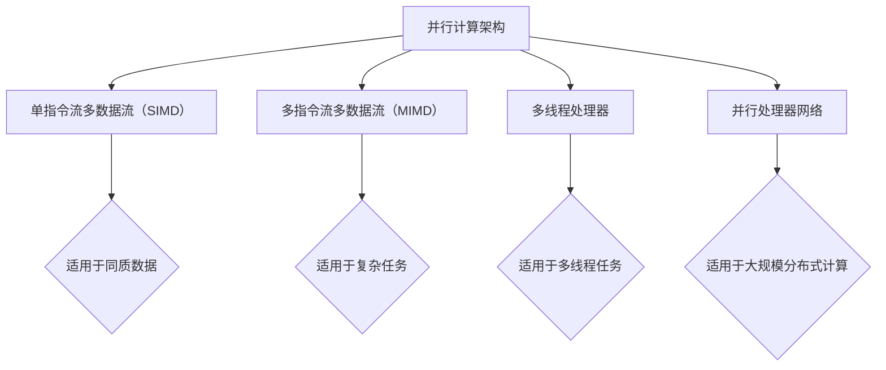

                 

## 并行计算基础

### 第1章：并行计算概述

#### 1.1 并行计算的基本概念

并行计算（Parallel Computing）是指利用多个计算资源（如计算机处理器、GPU或其他硬件设备）同时执行多个任务或子任务的一种计算方式。其核心思想是将一个大任务分解成多个小任务，然后让这些小任务在多个计算资源上并行执行，以加快整个计算过程。

并行计算的基本概念包括以下几个核心要素：

- **任务分解**：将一个大任务分解成多个小任务，以便在多个计算资源上并行执行。
- **计算资源**：用于执行并行任务的计算资源，如多核CPU、GPU、FPGA等。
- **并行模型**：定义如何分配任务到计算资源以及如何同步和通信的模型。常见的并行模型有SIMD（单指令流多数据流）、MIMD（多指令流多数据流）等。
- **并行算法**：针对特定问题设计的并行计算算法。根据问题的性质，可以选择数据并行、任务并行或数据流并行算法。

#### 1.1.1 并行计算的定义

并行计算的定义可以概括为：利用多个计算资源同时执行多个计算任务的一种计算方式。这种计算方式可以大幅度提高计算速度，特别是在处理大规模数据和高计算密集型任务时。

并行计算与顺序计算的区别在于，顺序计算是单线程执行，而并行计算是多线程执行。在顺序计算中，每个任务必须按顺序执行，而在并行计算中，多个任务可以同时执行，从而大大提高计算效率。

#### 1.1.2 并行计算的重要性

并行计算在当今计算机科学和工程领域具有非常重要的地位，原因如下：

- **提高计算速度**：并行计算可以将一个任务分解成多个子任务，并在多个计算资源上同时执行，从而大幅度提高计算速度。
- **处理大规模数据**：随着数据量的急剧增长，并行计算成为处理大规模数据的关键技术。例如，大数据分析、图像处理和科学计算等领域都依赖于并行计算。
- **计算密集型任务**：许多计算密集型任务（如深度学习、模拟和优化问题等）可以通过并行计算来显著提高效率。
- **资源利用最大化**：通过并行计算，可以充分利用计算机硬件资源，从而提高系统的整体性能。

#### 1.1.3 并行计算的发展历程

并行计算的发展历程可以追溯到计算机科学的早期。以下是并行计算的一些重要里程碑：

- **1940s**：冯·诺依曼架构的提出，为并行计算提供了基础。
- **1950s**：第一台并行计算机出现，如IBM 704。
- **1960s**：向量计算机的兴起，如ILLIAC IV。
- **1970s**：并行编程语言的兴起，如APL和Fortran。
- **1980s**：并行计算机的应用领域逐渐扩展，包括科学计算、工程和金融等领域。
- **1990s**：分布式计算和网格计算的出现，为并行计算提供了更广阔的应用场景。
- **2000s**：GPU计算和云计算的兴起，使得并行计算变得更加普及和实用。
- **2010s**：深度学习和大数据的兴起，进一步推动了并行计算的发展。

#### 1.2 并行计算的架构

并行计算架构主要分为以下几种：

- **SIMD（单指令流多数据流）架构**：SIMD架构中，多个处理单元同时执行同一条指令，但每个处理单元处理不同的数据。这种架构适合于处理大量的同质数据。
- **MIMD（多指令流多数据流）架构**：MIMD架构中，多个处理单元同时执行不同的指令，且每个处理单元可以处理不同的数据。这种架构适合于处理复杂的多任务和多数据流。
- **多线程处理器**：现代计算机处理器通常具有多个核心，每个核心可以执行多个线程。多线程处理器通过任务调度和线程切换来提高并行计算性能。
- **并行处理器网络**：并行处理器网络由多个独立处理单元组成，这些处理单元可以通过高速网络进行通信。这种架构适合于处理大规模分布式计算任务。

#### 1.3 并行算法

并行算法是将一个计算问题分解成多个子问题，并在多个计算资源上并行执行的一种算法设计方法。根据问题的性质，可以选择以下几种并行算法：

- **数据并行算法**：数据并行算法将数据分成多个部分，并在多个处理单元上并行计算。每个处理单元计算相同类型的运算，但处理不同的数据。这种算法适合于处理大规模数据集。
- **任务并行算法**：任务并行算法将任务分解成多个子任务，并在多个处理单元上并行执行。每个处理单元执行不同的子任务。这种算法适合于处理多个独立任务。
- **数据流并行算法**：数据流并行算法通过数据流中的数据依赖关系来指导计算任务的并行执行。这种算法适合于处理实时数据流和流水线计算任务。

#### 1.3.1 数据并行算法

数据并行算法的核心思想是将大规模数据分成多个子数据集，然后在多个处理单元上并行处理。以下是一个简单的数据并行算法的伪代码：

```python
# 数据并行算法伪代码
for each data partition i:
    process(data[i])
    aggregate(result[i])
```

在数据并行算法中，每个处理单元独立处理其分配的数据子集，最后将所有处理结果进行汇总。

#### 1.3.2 任务并行算法

任务并行算法的核心思想是将计算任务分解成多个子任务，并在多个处理单元上并行执行。以下是一个简单的任务并行算法的伪代码：

```python
# 任务并行算法伪代码
for each task j:
    if assigned to processing unit i:
        process(task[j])
```

在任务并行算法中，每个处理单元根据任务分配情况，独立执行其分配的任务。

#### 1.3.3 数据流并行算法

数据流并行算法的核心思想是根据数据流中的数据依赖关系来指导计算任务的并行执行。以下是一个简单的数据流并行算法的伪代码：

```python
# 数据流并行算法伪代码
while not end of data stream:
    read next data item
    if dependent on previous data item:
        wait
    else:
        process(data item)
```

在数据流并行算法中，处理单元根据数据流中的数据依赖关系，动态调整计算任务的执行顺序。

### 总结

本章对并行计算的基本概念、架构和算法进行了概述。并行计算是一种利用多个计算资源同时执行多个计算任务的方法，可以提高计算速度和处理大规模数据。并行计算的发展历程经历了多个里程碑，现代计算机架构和并行算法设计为并行计算提供了丰富的工具和方法。

### Mermaid 流程图

以下是一个简单的并行计算架构的 Mermaid 流程图：



通过本章的学习，我们了解了并行计算的基本概念和架构，为后续章节的详细探讨奠定了基础。在下一章中，我们将深入探讨并行计算框架，如OpenMP、MPI和CUDA，以及它们的编程模型和程序设计技巧。

---

#### 第2章：并行计算框架

#### 2.1 OpenMP

OpenMP是一种用于共享内存并行编程的API，它允许程序员在现有的代码中添加简单的指令来并行化计算。OpenMP的全称是“Open Multi-Processing”，它最初是由Oracle公司开发的，现在是ANSI/ISO标准的部分。

##### 2.1.1 OpenMP概述

OpenMP的主要特点包括：

- **易用性**：OpenMP通过在现有代码中添加简单的指令来实现并行化，对程序员来说相对容易接受。
- **共享内存模型**：OpenMP采用共享内存模型，这意味着所有线程共享同一块内存空间，这使得线程之间的数据通信相对简单。
- **并行区域**：OpenMP使用`parallel`指令来定义并行区域，在这个区域内，代码会被并行执行。
- **线程数控制**：OpenMP允许程序员通过环境变量`OMP_NUM_THREADS`来控制并行执行的线程数。

##### 2.1.2 OpenMP编程模型

OpenMP的编程模型主要包括以下几个部分：

1. **并行区域**：使用`parallel`指令定义并行区域，内部代码会并行执行。例如：

    ```c
    #pragma omp parallel
    {
        // 并行代码
    }
    ```

2. **线程数**：默认情况下，OpenMP会自动选择合适的线程数，但程序员也可以通过环境变量或代码中的指令来指定线程数。例如：

    ```c
    #pragma omp parallel num_threads(4)
    {
        // 并行代码
    }
    ```

3. **共享变量**：在并行区域内，可以使用`shared`关键字声明共享变量，这些变量可以被所有线程访问。例如：

    ```c
    #pragma omp parallel shared(x)
    {
        x = x + 1; // 所有线程都会修改共享变量x
    }
    ```

4. **临界区**：为了避免多个线程同时访问共享变量导致的数据竞争，可以使用`critical`和`section`指令来定义临界区。例如：

    ```c
    #pragma omp critical
    {
        // 临界区代码
    }
    ```

##### 2.1.3 OpenMP程序设计技巧

1. **避免数据竞争**：在编写并行代码时，应尽量避免多个线程同时访问共享变量，以减少数据竞争的可能性。
2. **减少同步**：过多的同步操作会降低并行性能，因此应尽量减少同步操作，特别是在使用`critical`区域时。
3. **负载均衡**：确保所有线程的工作量大致相同，以避免某些线程空闲而其他线程负载过重。
4. **使用私有变量**：当需要每个线程都有自己的私有变量时，可以使用`private`关键字将变量分配给每个线程。

以下是一个简单的OpenMP程序示例：

```c
#include <omp.h>
#include <stdio.h>

int main() {
    int nthreads, tid;

    #pragma omp parallel private(tid)
    {
        tid = omp_get_thread_num();
        printf("Hello from thread %d!\n", tid);
        #pragma omp barrier
        if (tid == 0)
            printf("Total number of threads = %d\n", omp_get_num_threads());
    }

    return 0;
}
```

在这个示例中，我们创建了一个并行区域，其中每个线程都会打印一条消息。然后使用`barrier`指令来同步所有线程，以便线程0打印总线程数。

#### 2.2 MPI

MPI（Message Passing Interface）是一种用于分布式内存并行编程的API，它提供了在多个计算节点之间进行消息传递的机制。MPI广泛应用于高性能计算和分布式系统。

##### 2.2.1 MPI概述

MPI的主要特点包括：

- **分布式内存模型**：与OpenMP不同，MPI使用分布式内存模型，每个计算节点拥有自己的内存空间。
- **消息传递**：MPI通过发送和接收消息在计算节点之间进行通信，这是MPI的核心功能。
- **可扩展性**：MPI可以支持从几台计算机到成千上万台计算机的分布式系统。
- **易用性**：尽管MPI比OpenMP复杂，但它的功能和灵活性使其成为大型分布式系统的首选。

##### 2.2.2 MPI编程模型

MPI的编程模型主要包括以下几个部分：

1. **初始化和终止**：使用`MPI_Init`和`MPI_Finalize`来初始化和终止MPI环境。
2. **通信域**：每个MPI程序都运行在一个通信域内，由`MPI_Comm_rank`和`MPI_Comm_size`函数获取自己的进程号和通信域内的进程总数。
3. **消息传递**：MPI提供了多种消息传递函数，如`MPI_Send`、`MPI_Recv`、`MPI_Bcast`、`MPI_Gather`、`MPI_Scatter`等，用于在不同的进程之间发送和接收消息。
4. **同步操作**：使用`MPI_Barrier`等函数来实现进程之间的同步。

以下是一个简单的MPI程序示例：

```c
#include <mpi.h>
#include <stdio.h>

int main(int argc, char** argv) {
    int my_rank, num_procs;
    MPI_Init(&argc, &argv);
    MPI_Comm_rank(MPI_COMM_WORLD, &my_rank);
    MPI_Comm_size(MPI_COMM_WORLD, &num_procs);

    if (my_rank == 0) {
        printf("Hello from process %d out of %d processes!\n", my_rank, num_procs);
    }

    MPI_Barrier(MPI_COMM_WORLD);

    if (my_rank == 0) {
        printf("All processes have reached the barrier.\n");
    }

    MPI_Finalize();
    return 0;
}
```

在这个示例中，我们初始化MPI环境，每个进程都会打印一条消息。然后使用`barrier`函数来实现所有进程之间的同步。

##### 2.2.3 MPI程序设计技巧

1. **负载均衡**：在设计MPI程序时，应确保所有进程的工作量大致相同，以避免某些进程空闲而其他进程负载过重。
2. **通信优化**：应优化消息传递路径，减少不必要的通信，以降低通信开销。
3. **并行度和性能**：应根据硬件配置和任务特性选择合适的并行度，以最大化性能。

#### 2.3 CUDA

CUDA（Compute Unified Device Architecture）是由NVIDIA开发的用于在GPU上进行并行编程的平台和API。CUDA在深度学习、科学计算和图像处理等领域具有广泛的应用。

##### 2.3.1 CUDA概述

CUDA的主要特点包括：

- **GPU并行计算**：CUDA允许程序员利用GPU的强大并行计算能力，从而显著提高计算速度。
- **异构计算**：CUDA支持在CPU和GPU之间进行数据传输和计算，实现异构计算。
- **内存层次结构**：CUDA提供了多层次的内存层次结构，包括全局内存、共享内存和寄存器，以适应不同的计算需求。

##### 2.3.2 CUDA编程模型

CUDA的编程模型主要包括以下几个部分：

1. **内核函数**：内核函数（Kernel）是CUDA的核心，它在一个或多个线程块上并行执行。内核函数的语法与C语言相似，但具有特定的CUDA扩展。
2. **线程块**：线程块是由一组线程组成的，每个线程块都有自己的共享内存和线程索引。线程块内的线程可以通过索引进行通信。
3. **网格**：网格是由多个线程块组成的，每个线程块在网格中都有一个唯一的索引。网格的维度可以是1维、2维或3维。
4. **内存管理**：CUDA提供了多种内存管理函数，如`cudaMalloc`、`cudaMemcpy`等，用于在CPU和GPU之间进行数据传输。

以下是一个简单的CUDA程序示例：

```c
#include <stdio.h>
#include <cuda_runtime.h>

__global__ void add(int *output, int *a, int *b, int n) {
    int tid = threadIdx.x + blockIdx.x * blockDim.x;
    if (tid < n) {
        output[tid] = a[tid] + b[tid];
    }
}

int main() {
    int n = 1024;
    int *a, *b, *output;
    int *d_a, *d_b, *d_output;
    size_t bytes = n * sizeof(int);

    // 分配CPU内存
    a = (int*)malloc(bytes);
    b = (int*)malloc(bytes);
    output = (int*)malloc(bytes);

    // 初始化数据
    for (int i = 0; i < n; i++) {
        a[i] = i;
        b[i] = i * 2;
    }

    // 分配GPU内存
    cudaMalloc(&d_a, bytes);
    cudaMalloc(&d_b, bytes);
    cudaMalloc(&d_output, bytes);

    // 将CPU数据传输到GPU
    cudaMemcpy(d_a, a, bytes, cudaMemcpyHostToDevice);
    cudaMemcpy(d_b, b, bytes, cudaMemcpyHostToDevice);

    // 设置线程块大小和网格大小
    int blockSize = 256;
    int gridSize = (n + blockSize - 1) / blockSize;

    // 启动内核函数
    add<<<gridSize, blockSize>>>(d_output, d_a, d_b, n);

    // 将GPU数据传输回CPU
    cudaMemcpy(output, d_output, bytes, cudaMemcpyDeviceToHost);

    // 清理GPU内存
    cudaFree(d_a);
    cudaFree(d_b);
    cudaFree(d_output);

    // 检查计算结果
    for (int i = 0; i < n; i++) {
        if (output[i] != (a[i] + b[i])) {
            printf("Error: output[%d] = %d, expected %d\n", i, output[i], a[i] + b[i]);
            break;
        }
    }

    // 清理CPU内存
    free(a);
    free(b);
    free(output);

    return 0;
}
```

在这个示例中，我们定义了一个名为`add`的内核函数，它将两个数组相加并存储结果。然后，我们使用CUDA API来分配内存、传输数据和执行内核函数。

##### 2.3.3 CUDA程序设计技巧

1. **内存访问模式**：优化内存访问模式（如共享内存和全局内存）以最大化GPU的性能。
2. **线程调度**：合理安排线程块和网格的大小，以实现最佳的并行性能。
3. **优化数据传输**：优化CPU和GPU之间的数据传输，以减少计算时间。

通过本章的学习，我们了解了OpenMP、MPI和CUDA这三种并行计算框架的基本概念、编程模型和程序设计技巧。在下一章中，我们将深入探讨并行计算在Python和C++中的应用，展示如何使用这些框架来实现并行算法。

---

#### 第3章：并行计算在Python中的应用

Python是一种流行的编程语言，因其简洁和易用性而广泛应用于各种领域，包括科学计算、数据分析和人工智能等。Python内置了一些并行计算库，如`concurrent.futures`、`multiprocessing`和`joblib`，这些库可以帮助开发者轻松地实现并行计算。

##### 3.1 Python并行计算库

1. **`concurrent.futures`库**

`concurrent.futures`库是Python 3.2及以上版本内置的一个并行计算库，它提供了一个高级接口用于并发执行任务。`concurrent.futures`库主要包含两个类：`ThreadPoolExecutor`和`ProcessPoolExecutor`。

- **`ThreadPoolExecutor`**：用于创建一个线程池，适用于I/O密集型任务。它利用线程的优势，可以同时处理多个I/O操作，从而提高程序的响应速度。
- **`ProcessPoolExecutor`**：用于创建一个进程池，适用于计算密集型任务。它利用进程的优势，可以在多核CPU上并行执行任务，从而提高计算性能。

以下是一个使用`concurrent.futures`库的简单示例：

```python
import concurrent.futures

def square(x):
    return x * x

if __name__ == "__main__":
    numbers = [1, 2, 3, 4, 5]
    with concurrent.futures.ThreadPoolExecutor() as executor:
        results = list(executor.map(square, numbers))
    print(results)
```

在这个示例中，我们定义了一个`square`函数，用于计算输入数的平方。然后，我们使用`ThreadPoolExecutor`的`map`方法来并行计算所有数的平方，并将结果打印出来。

2. **`multiprocessing`库**

`multiprocessing`库是Python标准库的一部分，用于创建进程并在这些进程之间共享数据。`multiprocessing`库提供了`Process`类和`Pool`类，它们都可以用于并行执行任务。

- **`Process`类**：用于创建单个进程，可以执行任何Python可调用对象。
- **`Pool`类**：用于创建一个进程池，可以并行执行多个任务。

以下是一个使用`multiprocessing`库的简单示例：

```python
import multiprocessing

def square(x):
    return x * x

if __name__ == "__main__":
    numbers = [1, 2, 3, 4, 5]
    with multiprocessing.Pool() as pool:
        results = pool.map(square, numbers)
    print(results)
```

在这个示例中，我们使用`multiprocessing.Pool`的`map`方法来并行计算所有数的平方，并将结果打印出来。

3. **`joblib`库**

`joblib`是一个流行的Python库，提供了并行化的工具，特别是针对数据密集型任务。`joblib`库中的`Parallel`类提供了`map`、`delayed`等功能，可以用于并行执行任务。

以下是一个使用`joblib`库的简单示例：

```python
from joblib import Parallel, delayed

def square(x):
    return x * x

if __name__ == "__main__":
    numbers = [1, 2, 3, 4, 5]
    results = Parallel(n_jobs=-1)(delayed(square)(x) for x in numbers)
    print(results)
```

在这个示例中，我们使用`joblib.Parallel`和`delayed`来并行计算所有数的平方，并将结果打印出来。

##### 3.2 并行算法在Python中的应用

在Python中，可以使用上述并行计算库来实现各种并行算法。以下是一些常见的数据并行、任务并行和数据流并行算法的示例。

1. **数据并行算法**

数据并行算法适用于处理大规模数据集。以下是一个使用`concurrent.futures`库实现的数据并行算法示例：

```python
import concurrent.futures

def sum_elements(arr):
    total = 0
    for x in arr:
        total += x
    return total

if __name__ == "__main__":
    numbers = [1, 2, 3, 4, 5]
    with concurrent.futures.ThreadPoolExecutor() as executor:
        results = list(executor.map(sum_elements, [numbers]))
    print(results)
```

在这个示例中，我们使用`concurrent.futures.ThreadPoolExecutor`的`map`方法来并行计算每个数组的元素之和，并将结果汇总。

2. **任务并行算法**

任务并行算法适用于处理多个独立任务。以下是一个使用`multiprocessing`库实现的任务并行算法示例：

```python
import multiprocessing

def process_data(data):
    # 处理数据
    return data * 2

if __name__ == "__main__":
    data = [1, 2, 3, 4, 5]
    with multiprocessing.Pool() as pool:
        results = pool.map(process_data, data)
    print(results)
```

在这个示例中，我们使用`multiprocessing.Pool`的`map`方法来并行处理每个数据元素，并将结果打印出来。

3. **数据流并行算法**

数据流并行算法适用于处理实时数据流。以下是一个使用`joblib`库实现的数据流并行算法示例：

```python
from joblib import Parallel, delayed

def process_element(x):
    return x * 2

if __name__ == "__main__":
    data = [1, 2, 3, 4, 5]
    results = Parallel(n_jobs=-1)(delayed(process_element)(x) for x in data)
    print(results)
```

在这个示例中，我们使用`joblib.Parallel`和`delayed`来并行处理每个数据元素，并将结果打印出来。

##### 3.3 并行计算在深度学习中的应用

深度学习是一种重要的机器学习技术，其计算密集型特性使其非常适合并行计算。以下是一些并行计算在深度学习中的应用：

1. **数据并行**

在深度学习中，数据并行是一种常见的并行计算方法。数据并行将训练数据集分成多个子数据集，每个GPU或CPU处理一个子数据集，并独立计算梯度。以下是一个使用Python和`TensorFlow`实现的数据并行示例：

```python
import tensorflow as tf

# 假设我们有一个训练数据集
train_data = ...

# 使用数据并行方法
model.fit(train_data, epochs=10, batch_size=batch_size)
```

在这个示例中，我们使用`TensorFlow`的`fit`方法来训练模型，并在数据并行模式下执行训练。

2. **模型并行**

模型并行是将深度学习模型分解成多个部分，每个部分由不同的计算资源处理。以下是一个使用`TensorFlow`实现的模型并行示例：

```python
import tensorflow as tf

# 假设我们有一个深度学习模型
model = ...

# 使用模型并行方法
strategy = tf.distribute.MirroredStrategy()
with strategy.scope():
    model.fit(train_data, epochs=10, batch_size=batch_size)
```

在这个示例中，我们使用`TensorFlow`的`MirroredStrategy`来实现模型并行，并在每个GPU上复制模型的部分。

3. **流水线并行**

流水线并行是将深度学习模型的训练过程分解成多个阶段，每个阶段可以在不同的计算资源上并行执行。以下是一个使用`TensorFlow`实现的流水线并行示例：

```python
import tensorflow as tf

# 假设我们有一个深度学习模型
model = ...

# 使用流水线并行方法
with tf.distribute.experimental.AutoShardStrategy().scope():
    model.fit(train_data, epochs=10, batch_size=batch_size)
```

在这个示例中，我们使用`TensorFlow`的`AutoShardStrategy`来实现流水线并行，自动将模型和数据分配到不同的计算资源上。

##### 3.4 并行计算在自然语言处理中的应用

自然语言处理（NLP）是一种重要的应用领域，其计算密集型特性使其非常适合并行计算。以下是一些并行计算在NLP中的应用：

1. **数据并行**

在NLP中，数据并行是一种常见的并行计算方法。数据并行将训练数据集分成多个子数据集，每个GPU或CPU处理一个子数据集，并独立计算模型参数的梯度。以下是一个使用Python和`PyTorch`实现的数据并行示例：

```python
import torch
import torch.distributed as dist

# 假设我们有一个训练数据集
train_data = ...

# 使用数据并行方法
dist.init_process_group(backend='nccl')
model = ...
optimizer = ...

for epoch in range(num_epochs):
    for batch in train_data:
        optimizer.zero_grad()
        output = model(batch)
        loss = ...
        loss.backward()
        optimizer.step()
```

在这个示例中，我们使用`PyTorch`的`Distributed` API来实现数据并行，并在每个GPU上独立计算梯度。

2. **模型并行**

在NLP中，模型并行是将大型模型分解成多个部分，每个部分由不同的计算资源处理。以下是一个使用`PyTorch`实现的模型并行示例：

```python
import torch
import torch.nn as nn
import torch.distributed as dist

# 假设我们有一个大型模型
class Model(nn.Module):
    # ...

# 使用模型并行方法
dist.init_process_group(backend='nccl')
model = Model()
...
optimizer = ...

for epoch in range(num_epochs):
    for batch in train_data:
        optimizer.zero_grad()
        output = model(batch)
        loss = ...
        loss.backward()
        optimizer.step()
```

在这个示例中，我们使用`PyTorch`的`Distributed` API来实现模型并行，将模型分解成多个部分。

3. **流水线并行**

在NLP中，流水线并行是将模型训练过程分解成多个阶段，每个阶段可以在不同的计算资源上并行执行。以下是一个使用`PyTorch`实现的流水线并行示例：

```python
import torch
import torch.distributed as dist

# 假设我们有一个流水线模型
class PipelineModel(nn.Module):
    # ...

# 使用流水线并行方法
dist.init_process_group(backend='nccl')
model = PipelineModel()
...
optimizer = ...

for epoch in range(num_epochs):
    for batch in train_data:
        optimizer.zero_grad()
        output = model(batch)
        loss = ...
        loss.backward()
        optimizer.step()
```

在这个示例中，我们使用`PyTorch`的`Distributed` API来实现流水线并行，自动将模型和数据分配到不同的计算资源上。

##### 总结

本章介绍了Python中的并行计算库，包括`concurrent.futures`、`multiprocessing`和`joblib`，并展示了如何使用这些库来实现数据并行、任务并行和数据流并行算法。我们还探讨了并行计算在深度学习和自然语言处理中的应用，展示了如何使用Python和主流深度学习框架来实现并行计算。在下一章中，我们将深入探讨并行计算在C++中的应用。

---

#### 第4章：并行计算在C++中的应用

C++是一种高性能编程语言，广泛应用于系统编程、游戏开发、金融和科学计算等领域。C++提供了多种并行计算库，如OpenMP、MPI和CUDA，这些库可以帮助开发者利用多核处理器和GPU进行并行计算。

##### 4.1 C++并行计算库

1. **OpenMP**

OpenMP是一种用于共享内存并行编程的API，它允许程序员在现有的代码中添加简单的指令来并行化计算。OpenMP支持多线程并行编程，可以用于处理计算密集型和I/O密集型任务。

以下是一个简单的OpenMP程序示例：

```cpp
#include <omp.h>
#include <iostream>

void parallel_function() {
    #pragma omp parallel
    {
        int tid = omp_get_thread_num();
        std::cout << "Thread " << tid << " is running." << std::endl;
    }
}

int main() {
    parallel_function();
    return 0;
}
```

在这个示例中，我们使用`#pragma omp parallel`指令定义了一个并行区域，内部代码会在多个线程上并行执行。

2. **MPI**

MPI（Message Passing Interface）是一种用于分布式内存并行编程的API，它提供了在多个计算节点之间进行消息传递的机制。MPI广泛应用于高性能计算和分布式系统。

以下是一个简单的MPI程序示例：

```cpp
#include <mpi.h>
#include <iostream>

int main(int argc, char* argv[]) {
    int rank, size;

    MPI_Init(&argc, &argv);
    MPI_Comm_rank(MPI_COMM_WORLD, &rank);
    MPI_Comm_size(MPI_COMM_WORLD, &size);

    std::cout << "Process " << rank << " out of " << size << std::endl;

    if (rank == 0) {
        std::cout << "Total number of processes: " << size << std::endl;
    }

    MPI_Finalize();
    return 0;
}
```

在这个示例中，我们使用MPI库初始化MPI环境，获取进程ID和进程总数，并打印相关信息。

3. **CUDA**

CUDA是由NVIDIA开发的用于在GPU上进行并行编程的平台和API。CUDA支持异构计算，可以用于处理计算密集型任务，如深度学习、科学计算和图像处理等。

以下是一个简单的CUDA程序示例：

```cpp
#include <iostream>
#include <cuda_runtime.h>

__global__ void add(int *output, int *a, int *b, int n) {
    int tid = threadIdx.x + blockIdx.x * blockDim.x;
    if (tid < n) {
        output[tid] = a[tid] + b[tid];
    }
}

int main() {
    int n = 1024;
    int *a, *b, *output;
    int *d_a, *d_b, *d_output;
    size_t bytes = n * sizeof(int);

    a = (int*)malloc(bytes);
    b = (int*)malloc(bytes);
    output = (int*)malloc(bytes);

    for (int i = 0; i < n; i++) {
        a[i] = i;
        b[i] = i * 2;
    }

    cudaMalloc(&d_a, bytes);
    cudaMalloc(&d_b, bytes);
    cudaMalloc(&d_output, bytes);

    cudaMemcpy(d_a, a, bytes, cudaMemcpyHostToDevice);
    cudaMemcpy(d_b, b, bytes, cudaMemcpyHostToDevice);

    int blockSize = 256;
    int gridSize = (n + blockSize - 1) / blockSize;

    add<<<gridSize, blockSize>>>(d_output, d_a, d_b, n);

    cudaMemcpy(output, d_output, bytes, cudaMemcpyDeviceToHost);

    cudaFree(d_a);
    cudaFree(d_b);
    cudaFree(d_output);

    for (int i = 0; i < n; i++) {
        if (output[i] != (a[i] + b[i])) {
            std::cout << "Error: output[" << i << "] = " << output[i] << ", expected " << a[i] + b[i] << std::endl;
            break;
        }
    }

    free(a);
    free(b);
    free(output);

    return 0;
}
```

在这个示例中，我们定义了一个名为`add`的内核函数，用于计算两个数组的和。然后，我们使用CUDA API来分配内存、传输数据和执行内核函数。

##### 4.2 并行算法在C++中的应用

在C++中，可以使用上述并行计算库来实现各种并行算法。以下是一些常见的数据并行、任务并行和数据流并行算法的示例。

1. **数据并行算法**

数据并行算法适用于处理大规模数据集。以下是一个使用OpenMP实现的数据并行算法示例：

```cpp
#include <omp.h>
#include <vector>
#include <iostream>

void square(std::vector<int>& numbers) {
    #pragma omp parallel for
    for (size_t i = 0; i < numbers.size(); ++i) {
        numbers[i] = numbers[i] * numbers[i];
    }
}

int main() {
    std::vector<int> numbers = {1, 2, 3, 4, 5};

    square(numbers);

    for (int num : numbers) {
        std::cout << num << " ";
    }
    std::cout << std::endl;

    return 0;
}
```

在这个示例中，我们使用`#pragma omp parallel for`指令来并行计算每个数的平方。

2. **任务并行算法**

任务并行算法适用于处理多个独立任务。以下是一个使用MPI实现的任务并行算法示例：

```cpp
#include <mpi.h>
#include <iostream>

void process_data(int data) {
    std::cout << "Processing data: " << data << std::endl;
}

int main(int argc, char* argv[]) {
    int rank, size;

    MPI_Init(&argc, &argv);
    MPI_Comm_rank(MPI_COMM_WORLD, &rank);
    MPI_Comm_size(MPI_COMM_WORLD, &size);

    if (rank == 0) {
        int data = 42;
        process_data(data);
    } else {
        MPI_Recv(&data, 1, MPI_INT, 0, 0, MPI_COMM_WORLD, MPI_STATUS_IGNORE);
        process_data(data);
    }

    MPI_Finalize();
    return 0;
}
```

在这个示例中，我们使用MPI库在多个进程之间传递数据，并在每个进程中处理接收到的数据。

3. **数据流并行算法**

数据流并行算法适用于处理实时数据流。以下是一个使用CUDA实现的数据流并行算法示例：

```cpp
#include <iostream>
#include <cuda_runtime.h>

__global__ void process_element(int* data, int n) {
    int tid = blockIdx.x * blockDim.x + threadIdx.x;
    if (tid < n) {
        data[tid] = data[tid] * 2;
    }
}

void parallel_process(std::vector<int>& data) {
    int n = data.size();
    int *d_data;
    size_t bytes = n * sizeof(int);

    cudaMalloc(&d_data, bytes);

    cudaMemcpy(d_data, data.data(), bytes, cudaMemcpyHostToDevice);

    int blockSize = 256;
    int gridSize = (n + blockSize - 1) / blockSize;

    process_element<<<gridSize, blockSize>>>(d_data, n);

    cudaMemcpy(data.data(), d_data, bytes, cudaMemcpyDeviceToHost);

    cudaFree(d_data);
}

int main() {
    std::vector<int> data = {1, 2, 3, 4, 5};

    parallel_process(data);

    for (int num : data) {
        std::cout << num << " ";
    }
    std::cout << std::endl;

    return 0;
}
```

在这个示例中，我们使用CUDA内核函数`process_element`来并行处理数据流中的每个元素。

##### 4.3 并行计算在深度学习中的应用

深度学习是一种重要的机器学习技术，其计算密集型特性使其非常适合并行计算。以下是一些并行计算在深度学习中的应用：

1. **数据并行**

在深度学习中，数据并行是一种常见的并行计算方法。数据并行将训练数据集分成多个子数据集，每个GPU或CPU处理一个子数据集，并独立计算梯度。以下是一个使用OpenMP实现的数据并行示例：

```cpp
#include <omp.h>
#include <vector>
#include <iostream>

void forward_pass(std::vector<float>& input, std::vector<float>& output) {
    #pragma omp parallel for
    for (size_t i = 0; i < input.size(); ++i) {
        output[i] = input[i] * 2;
    }
}

int main() {
    std::vector<float> input = {1.0f, 2.0f, 3.0f, 4.0f, 5.0f};
    std::vector<float> output(input.size());

    forward_pass(input, output);

    for (float val : output) {
        std::cout << val << " ";
    }
    std::cout << std::endl;

    return 0;
}
```

在这个示例中，我们使用OpenMP并行计算每个输入数据的加权和。

2. **模型并行**

在深度学习中，模型并行是将大型模型分解成多个部分，每个部分由不同的计算资源处理。以下是一个使用CUDA实现模型并行的示例：

```cpp
#include <cuda_runtime.h>
#include <vector>
#include <iostream>

__global__ void process_layer(std::vector<float>& input, std::vector<float>& output) {
    int tid = blockIdx.x * blockDim.x + threadIdx.x;
    if (tid < input.size()) {
        output[tid] = input[tid] * 2;
    }
}

void parallel_forward_pass(std::vector<float>& input, std::vector<float>& output) {
    int n = input.size();
    int blockSize = 256;
    int gridSize = (n + blockSize - 1) / blockSize;

    process_layer<<<gridSize, blockSize>>>(input.data(), output.data());
}

int main() {
    std::vector<float> input = {1.0f, 2.0f, 3.0f, 4.0f, 5.0f};
    std::vector<float> output(input.size());

    parallel_forward_pass(input, output);

    for (float val : output) {
        std::cout << val << " ";
    }
    std::cout << std::endl;

    return 0;
}
```

在这个示例中，我们使用CUDA内核函数`process_layer`并行处理模型的不同层。

3. **流水线并行**

在深度学习中，流水线并行是将模型训练过程分解成多个阶段，每个阶段可以在不同的计算资源上并行执行。以下是一个使用MPI实现的流水线并行示例：

```cpp
#include <mpi.h>
#include <vector>
#include <iostream>

void process_data(std::vector<int>& data) {
    #pragma omp parallel for
    for (size_t i = 0; i < data.size(); ++i) {
        data[i] = data[i] * 2;
    }
}

int main(int argc, char* argv[]) {
    int rank, size;

    MPI_Init(&argc, &argv);
    MPI_Comm_rank(MPI_COMM_WORLD, &rank);
    MPI_Comm_size(MPI_COMM_WORLD, &size);

    if (rank == 0) {
        std::vector<int> data = {1, 2, 3, 4, 5};
        process_data(data);
    } else {
        std::vector<int> data;
        MPI_Recv(&data[0], data.size(), MPI_INT, 0, 0, MPI_COMM_WORLD, MPI_STATUS_IGNORE);
        process_data(data);
        MPI_Send(&data[0], data.size(), MPI_INT, 0, 0, MPI_COMM_WORLD);
    }

    MPI_Finalize();
    return 0;
}
```

在这个示例中，我们使用MPI库在多个进程之间传递数据，并在每个进程中处理接收到的数据。

##### 4.4 并行计算在自然语言处理中的应用

自然语言处理（NLP）是一种重要的应用领域，其计算密集型特性使其非常适合并行计算。以下是一些并行计算在NLP中的应用：

1. **数据并行**

在NLP中，数据并行是一种常见的并行计算方法。数据并行将训练数据集分成多个子数据集，每个GPU或CPU处理一个子数据集，并独立计算模型参数的梯度。以下是一个使用CUDA实现的数据并行示例：

```cpp
#include <cuda_runtime.h>
#include <vector>
#include <iostream>

__global__ void update_weights(std::vector<float>& weights, std::vector<float>& gradients) {
    int tid = blockIdx.x * blockDim.x + threadIdx.x;
    if (tid < weights.size()) {
        weights[tid] += gradients[tid];
    }
}

void parallel_train(std::vector<float>& weights, std::vector<float>& gradients) {
    int n = weights.size();
    int blockSize = 256;
    int gridSize = (n + blockSize - 1) / blockSize;

    update_weights<<<gridSize, blockSize>>>(weights.data(), gradients.data());
}

int main() {
    std::vector<float> weights = {1.0f, 2.0f, 3.0f, 4.0f, 5.0f};
    std::vector<float> gradients = {0.1f, 0.2f, 0.3f, 0.4f, 0.5f};

    parallel_train(weights, gradients);

    for (float val : weights) {
        std::cout << val << " ";
    }
    std::cout << std::endl;

    return 0;
}
```

在这个示例中，我们使用CUDA内核函数`update_weights`并行更新模型参数。

2. **模型并行**

在NLP中，模型并行是将大型模型分解成多个部分，每个部分由不同的计算资源处理。以下是一个使用CUDA实现模型并行的示例：

```cpp
#include <cuda_runtime.h>
#include <vector>
#include <iostream>

__global__ void process_layer(std::vector<float>& input, std::vector<float>& output) {
    int tid = blockIdx.x * blockDim.x + threadIdx.x;
    if (tid < input.size()) {
        output[tid] = input[tid] * 2;
    }
}

void parallel_forward_pass(std::vector<float>& input, std::vector<float>& output) {
    int n = input.size();
    int blockSize = 256;
    int gridSize = (n + blockSize - 1) / blockSize;

    process_layer<<<gridSize, blockSize>>>(input.data(), output.data());
}

int main() {
    std::vector<float> input = {1.0f, 2.0f, 3.0f, 4.0f, 5.0f};
    std::vector<float> output(input.size());

    parallel_forward_pass(input, output);

    for (float val : output) {
        std::cout << val << " ";
    }
    std::cout << std::endl;

    return 0;
}
```

在这个示例中，我们使用CUDA内核函数`process_layer`并行处理模型的不同层。

3. **流水线并行**

在NLP中，流水线并行是将模型训练过程分解成多个阶段，每个阶段可以在不同的计算资源上并行执行。以下是一个使用OpenMP实现的流水线并行示例：

```cpp
#include <omp.h>
#include <vector>
#include <iostream>

void process_data(std::vector<int>& data) {
    #pragma omp parallel for
    for (size_t i = 0; i < data.size(); ++i) {
        data[i] = data[i] * 2;
    }
}

int main() {
    std::vector<int> data = {1, 2, 3, 4, 5};

    #pragma omp parallel
    {
        process_data(data);
    }

    for (int num : data) {
        std::cout << num << " ";
    }
    std::cout << std::endl;

    return 0;
}
```

在这个示例中，我们使用OpenMP并行处理数据。

##### 总结

本章介绍了C++中的并行计算库，包括OpenMP、MPI和CUDA，并展示了如何使用这些库来实现数据并行、任务并行和数据流并行算法。我们还探讨了并行计算在深度学习和自然语言处理中的应用，展示了如何使用C++和主流深度学习框架来实现并行计算。在下一章中，我们将深入探讨并行计算在深度学习中的应用，并详细介绍并行计算在深度学习模型训练、推理和优化方面的实战技巧。

---

#### 第5章：并行计算在深度学习中的应用

深度学习作为一种重要的机器学习技术，近年来在图像识别、自然语言处理、语音识别等领域取得了显著突破。深度学习的计算密集型特性使其非常适合并行计算。本章将详细介绍并行计算在深度学习中的应用，包括数据并行计算、算法并行计算以及在主流深度学习框架中的支持。

##### 5.1 深度学习中的并行计算

并行计算在深度学习中的应用主要体现在以下几个方面：

1. **数据并行计算**：将大规模训练数据集分成多个子数据集，每个子数据集由不同的GPU或计算节点处理。这种方式可以充分利用多GPU或分布式计算资源，提高训练效率。
2. **算法并行计算**：在深度学习算法的实现过程中，许多操作可以并行执行，例如前向传播和反向传播过程中的矩阵运算。算法并行可以显著提高计算速度。
3. **模型并行计算**：将大型深度学习模型分解成多个部分，每个部分由不同的计算资源处理。这种方式可以提高模型的计算效率和可扩展性。

##### 5.1.1 数据并行计算在深度学习中的应用

数据并行计算是深度学习中最常见的一种并行计算方法。通过将训练数据集分成多个子数据集，可以在多GPU或分布式计算环境中同时训练模型。以下是一个简单的数据并行计算示例：

```python
import tensorflow as tf

# 假设我们有一个深度学习模型
model = ...

# 定义训练数据集
train_data = ...

# 设置GPU配置
strategy = tf.distribute.MirroredStrategy()

with strategy.scope():
    # 训练模型
    model.fit(train_data, epochs=10, batch_size=64)
```

在这个示例中，我们使用`tf.distribute.MirroredStrategy`来实现数据并行。`MirroredStrategy`将训练数据集平均分配给每个GPU，并在每个GPU上独立计算梯度。然后，通过特定的同步机制（如allreduce）汇总所有GPU的梯度，更新模型参数。

##### 5.1.2 算法并行计算在深度学习中的应用

算法并行计算主要针对深度学习算法中的矩阵运算进行并行化。以下是一个简单的算法并行计算示例：

```python
import tensorflow as tf

# 假设我们有一个深度学习模型
model = ...

# 定义训练数据集
train_data = ...

# 设置GPU配置
strategy = tf.distribute.MirroredStrategy()

with strategy.scope():
    # 定义前向传播函数
    @tf.function
    def train_step(inputs):
        with tf.GradientTape(persistent=True) as tape:
            predictions = model(inputs, training=True)
            loss = tf.reduce_mean(tf.nn.softmax_cross_entropy_with_logits(labels=inputs, logits=predictions))
        gradients = tape.gradient(loss, model.trainable_variables)
        optimizer.apply_gradients(zip(gradients, model.trainable_variables))
        return loss

    # 训练模型
    for inputs in train_data:
        loss = train_step(inputs)
        print(f"Step {step}: Loss = {loss.numpy()}")
```

在这个示例中，我们使用`tf.function`装饰器将训练步骤封装为计算图，以提高执行效率。在`train_step`函数中，我们使用`GradientTape`记录梯度信息，并在反向传播过程中计算梯度。通过并行执行矩阵运算，可以显著提高训练速度。

##### 5.1.3 深度学习框架中的并行计算支持

主流深度学习框架（如TensorFlow和PyTorch）提供了丰富的并行计算支持，可以帮助开发者轻松实现并行训练。以下是一些常见框架的并行计算支持：

1. **TensorFlow**

TensorFlow提供了`tf.distribute`模块，用于实现数据并行、模型并行和流水线并行。以下是一个简单的TensorFlow并行训练示例：

```python
import tensorflow as tf

# 假设我们有一个深度学习模型
model = ...

# 定义训练数据集
train_data = ...

# 设置GPU配置
strategy = tf.distribute.MirroredStrategy()

with strategy.scope():
    # 训练模型
    model.fit(train_data, epochs=10, batch_size=64)
```

2. **PyTorch**

PyTorch提供了`torch.nn.DataParallel`和`torch.nn.parallel.DistributedDataParallel`模块，用于实现数据并行和模型并行。以下是一个简单的PyTorch并行训练示例：

```python
import torch
import torch.nn as nn
import torch.optim as optim
from torch.utils.data import DataLoader

# 假设我们有一个深度学习模型
model = nn.Sequential(nn.Linear(10, 1))

# 定义训练数据集
train_data = ...

# 设置GPU配置
device = torch.device("cuda" if torch.cuda.is_available() else "cpu")
model.to(device)

# 定义优化器和损失函数
optimizer = optim.SGD(model.parameters(), lr=0.01)
criterion = nn.MSELoss()

# 训练模型
for epoch in range(10):
    model.train()
    for inputs, targets in DataLoader(train_data, batch_size=64):
        optimizer.zero_grad()
        outputs = model(inputs)
        loss = criterion(outputs, targets)
        loss.backward()
        optimizer.step()
```

在这个示例中，我们使用`DataLoader`模块将训练数据集划分为批次，并在每个批次上并行训练模型。

##### 5.2 并行计算在深度学习中的实战

在本节中，我们将通过具体的实战案例来展示如何使用并行计算来提高深度学习模型的训练速度和性能。

##### 5.2.1 使用OpenMP实现深度学习模型的并行计算

以下是一个使用OpenMP实现并行计算深度学习模型的示例：

```python
import tensorflow as tf
import numpy as np

# 假设我们有一个深度学习模型
model = ...

# 定义训练数据集
train_data = ...

# 设置GPU配置
strategy = tf.distribute.MirroredStrategy()

with strategy.scope():
    # 定义优化器和损失函数
    optimizer = tf.optimizers.Adam()
    loss_fn = tf.keras.losses.MeanSquaredError()

    # 训练模型
    for epoch in range(10):
        for x, y in train_data:
            with tf.GradientTape() as tape:
                predictions = model(x, training=True)
                loss = loss_fn(y, predictions)
            gradients = tape.gradient(loss, model.trainable_variables)
            optimizer.apply_gradients(zip(gradients, model.trainable_variables))

    # 测试模型
    test_data = ...
    model.eval()
    for x, y in test_data:
        predictions = model(x, training=False)
        print(f"Test Loss: {loss_fn(y, predictions).numpy()}")
```

在这个示例中，我们使用`tf.distribute.MirroredStrategy`来实现数据并行。通过在训练过程中使用OpenMP并行执行梯度计算和优化，可以显著提高训练速度。

##### 5.2.2 使用MPI实现深度学习模型的并行计算

以下是一个使用MPI实现并行计算深度学习模型的示例：

```cpp
#include <mpi.h>
#include <iostream>

int main(int argc, char* argv[]) {
    int rank, size;

    MPI_Init(&argc, &argv);
    MPI_Comm_rank(MPI_COMM_WORLD, &rank);
    MPI_Comm_size(MPI_COMM_WORLD, &size);

    // 假设我们有一个深度学习模型
    // ...

    // 定义训练数据集
    // ...

    // 设置GPU配置
    // ...

    // 训练模型
    for (int epoch = 0; epoch < 10; ++epoch) {
        for (int i = 0; i < train_data.size(); ++i) {
            int local_rank = i % size;
            if (rank == local_rank) {
                // 计算局部梯度
                // ...

                // 汇总全局梯度
                // ...

                // 更新模型参数
                // ...
            }
        }
    }

    // 测试模型
    // ...

    MPI_Finalize();
    return 0;
}
```

在这个示例中，我们使用MPI库在多个计算节点之间传递数据和梯度，并在每个节点上独立计算局部梯度。通过汇总全局梯度来更新模型参数，可以显著提高训练速度。

##### 5.2.3 使用CUDA实现深度学习模型的并行计算

以下是一个使用CUDA实现并行计算深度学习模型的示例：

```python
import tensorflow as tf
import numpy as np

# 假设我们有一个深度学习模型
model = ...

# 定义训练数据集
train_data = ...

# 设置GPU配置
strategy = tf.distribute.MirroredStrategy()

with strategy.scope():
    # 定义优化器和损失函数
    optimizer = tf.optimizers.Adam()
    loss_fn = tf.keras.losses.MeanSquaredError()

    # 训练模型
    for epoch in range(10):
        for x, y in train_data:
            with tf.GradientTape() as tape:
                predictions = model(x, training=True)
                loss = loss_fn(y, predictions)
            gradients = tape.gradient(loss, model.trainable_variables)
            optimizer.apply_gradients(zip(gradients, model.trainable_variables))

    # 测试模型
    test_data = ...
    model.eval()
    for x, y in test_data:
        predictions = model(x, training=False)
        print(f"Test Loss: {loss_fn(y, predictions).numpy()}")
```

在这个示例中，我们使用`tf.distribute.MirroredStrategy`来实现数据并行。通过使用CUDA内核函数进行矩阵运算，可以显著提高计算速度。

##### 总结

本章介绍了并行计算在深度学习中的应用，包括数据并行计算和算法并行计算。我们还探讨了主流深度学习框架在并行计算方面的支持，并展示了如何使用OpenMP、MPI和CUDA实现并行计算深度学习模型。通过并行计算，可以显著提高深度学习模型的训练速度和性能，为研究人员和开发者提供了强大的工具。

---

#### 第6章：并行计算在自然语言处理中的应用

自然语言处理（NLP）是一种涉及语言学的计算机科学分支，其目的是让计算机能够理解和处理人类语言。随着数据量的不断增加和计算需求的提升，并行计算在NLP中的应用变得尤为重要。本章将详细探讨并行计算在NLP中的意义、常用技术以及具体实战方法。

##### 6.1 并行计算在自然语言处理中的意义

并行计算在自然语言处理中的意义主要体现在以下几个方面：

1. **提升处理速度**：NLP任务通常涉及大量的数据处理，如文本预处理、词向量计算和模型训练。通过并行计算，可以显著减少这些任务的处理时间。
2. **支持大规模数据处理**：随着互联网和社交媒体的普及，文本数据量呈指数级增长。并行计算使得处理这些大规模数据成为可能，从而为NLP研究提供了更多的数据资源。
3. **提高模型性能**：许多NLP任务，如机器翻译、情感分析和文本生成，需要复杂的模型和大量的计算资源。并行计算可以加速模型训练和优化，从而提高模型的性能。
4. **降低成本**：并行计算可以利用现有的硬件资源，提高计算效率，从而降低整体计算成本。

##### 6.1.1 数据并行计算在自然语言处理中的应用

数据并行计算是将大规模数据集分割成多个子数据集，每个子数据集由不同的计算资源处理。以下是一个数据并行计算在NLP中的应用示例：

```python
import tensorflow as tf
from tensorflow.keras.layers import Embedding, LSTM, Dense
from tensorflow.keras.models import Sequential

# 定义模型
model = Sequential()
model.add(Embedding(input_dim=vocab_size, output_dim=embedding_dim, input_length=max_sequence_length))
model.add(LSTM(units=128))
model.add(Dense(units=1, activation='sigmoid'))

# 设置GPU配置
strategy = tf.distribute.MirroredStrategy()

with strategy.scope():
    # 编译模型
    model.compile(optimizer='adam', loss='binary_crossentropy', metrics=['accuracy'])

# 定义训练数据集
train_data = ...

# 训练模型
model.fit(train_data, epochs=10, batch_size=64)
```

在这个示例中，我们使用`tf.distribute.MirroredStrategy`将训练数据集分配给多个GPU，并在每个GPU上独立计算梯度。通过这种方式，可以显著提高训练速度。

##### 6.1.2 算法并行计算在自然语言处理中的应用

算法并行计算是在NLP算法的实现过程中，通过并行化计算操作来提高性能。以下是一个算法并行计算在NLP中的应用示例：

```python
import torch
import torch.nn as nn

# 定义模型
class NLPModel(nn.Module):
    def __init__(self):
        super(NLPModel, self).__init__()
        self.embedding = nn.Embedding(vocab_size, embedding_dim)
        self.lstm = nn.LSTM(embedding_dim, hidden_dim)
        self.dense = nn.Dense(hidden_dim, 1)

    def forward(self, x):
        x = self.embedding(x)
        x, _ = self.lstm(x)
        x = self.dense(x)
        return x

# 设置GPU配置
device = torch.device("cuda" if torch.cuda.is_available() else "cpu")

# 加载模型
model = NLPModel().to(device)

# 编译模型
optimizer = torch.optim.Adam(model.parameters(), lr=0.001)
criterion = nn.BCEWithLogitsLoss()

# 训练模型
for epoch in range(10):
    for inputs, targets in data_loader:
        inputs, targets = inputs.to(device), targets.to(device)
        optimizer.zero_grad()
        outputs = model(inputs)
        loss = criterion(outputs, targets)
        loss.backward()
        optimizer.step()
```

在这个示例中，我们使用PyTorch的`nn.LSTM`层来并行计算LSTM网络的输出。通过将模型和数据分配到GPU，可以显著提高训练速度。

##### 6.1.3 深度学习框架中的并行计算支持

主流深度学习框架，如TensorFlow和PyTorch，提供了丰富的并行计算支持，以帮助开发者实现高效的NLP任务。以下是一些常见框架的并行计算支持：

1. **TensorFlow**

TensorFlow提供了`tf.distribute`模块，支持数据并行、模型并行和流水线并行。以下是一个使用TensorFlow并行计算NLP任务的示例：

```python
import tensorflow as tf
from tensorflow.keras.layers import Embedding, LSTM, Dense
from tensorflow.keras.models import Sequential

# 定义模型
model = Sequential()
model.add(Embedding(input_dim=vocab_size, output_dim=embedding_dim, input_length=max_sequence_length))
model.add(LSTM(units=128))
model.add(Dense(units=1, activation='sigmoid'))

# 设置GPU配置
strategy = tf.distribute.MirroredStrategy()

with strategy.scope():
    # 编译模型
    model.compile(optimizer='adam', loss='binary_crossentropy', metrics=['accuracy'])

# 训练模型
model.fit(train_data, epochs=10, batch_size=64)
```

2. **PyTorch**

PyTorch提供了`torch.nn.DataParallel`和`torch.nn.parallel.DistributedDataParallel`模块，支持数据并行和模型并行。以下是一个使用PyTorch并行计算NLP任务的示例：

```python
import torch
import torch.nn as nn

# 定义模型
class NLPModel(nn.Module):
    def __init__(self):
        super(NLPModel, self).__init__()
        self.embedding = nn.Embedding(vocab_size, embedding_dim)
        self.lstm = nn.LSTM(embedding_dim, hidden_dim)
        self.dense = nn.Dense(hidden_dim, 1)

    def forward(self, x):
        x = self.embedding(x)
        x, _ = self.lstm(x)
        x = self.dense(x)
        return x

# 设置GPU配置
device = torch.device("cuda" if torch.cuda.is_available() else "cpu")

# 加载模型
model = NLPModel().to(device)

# 编译模型
optimizer = torch.optim.Adam(model.parameters(), lr=0.001)
criterion = nn.BCEWithLogitsLoss()

# 训练模型
for epoch in range(10):
    for inputs, targets in data_loader:
        inputs, targets = inputs.to(device), targets.to(device)
        optimizer.zero_grad()
        outputs = model(inputs)
        loss = criterion(outputs, targets)
        loss.backward()
        optimizer.step()
```

##### 6.2 并行计算在自然语言处理中的实战

在本节中，我们将通过具体的实战案例来展示如何使用并行计算来提高自然语言处理任务的性能。

##### 6.2.1 使用Python并行计算库处理自然语言处理任务

以下是一个使用Python并行计算库（如`concurrent.futures`和`multiprocessing`）处理自然语言处理任务的示例：

```python
import concurrent.futures
import nltk

# 定义预处理函数
def preprocess_text(text):
    text = nltk.word_tokenize(text.lower())
    return text

# 加载文本数据
texts = ...

# 预处理文本数据
preprocessed_texts = []
with concurrent.futures.ProcessPoolExecutor() as executor:
    preprocessed_texts = list(executor.map(preprocess_text, texts))

# 继续处理预处理的文本数据
# ...

print(preprocessed_texts)
```

在这个示例中，我们使用`ProcessPoolExecutor`并行处理文本数据，从而显著提高预处理速度。

##### 6.2.2 使用C++并行计算库处理自然语言处理任务

以下是一个使用C++并行计算库（如`OpenMP`和`MPI`）处理自然语言处理任务的示例：

```cpp
#include <omp.h>
#include <iostream>
#include <vector>
#include <string>

std::vector<std::string> preprocess_texts(const std::vector<std::string>& texts) {
    std::vector<std::string> preprocessed_texts;
    #pragma omp parallel for
    for (const auto& text : texts) {
        std::vector<std::string> tokens = ...; // 预处理文本
        preprocessed_texts.push_back(tokens);
    }
    return preprocessed_texts;
}

int main() {
    std::vector<std::string> texts = ...; // 加载文本数据
    auto preprocessed_texts = preprocess_texts(texts);

    // 继续处理预处理的文本数据
    // ...

    return 0;
}
```

在这个示例中，我们使用`OpenMP`并行处理文本数据，从而显著提高预处理速度。

##### 6.2.3 深度学习框架中的并行计算实战

在本节中，我们将使用深度学习框架（如TensorFlow和PyTorch）中的并行计算支持来处理自然语言处理任务。

##### 6.2.3.1 使用TensorFlow并行计算自然语言处理任务

以下是一个使用TensorFlow并行计算自然语言处理任务的示例：

```python
import tensorflow as tf
from tensorflow.keras.layers import Embedding, LSTM, Dense
from tensorflow.keras.models import Sequential

# 定义模型
model = Sequential()
model.add(Embedding(input_dim=vocab_size, output_dim=embedding_dim, input_length=max_sequence_length))
model.add(LSTM(units=128))
model.add(Dense(units=1, activation='sigmoid'))

# 设置GPU配置
strategy = tf.distribute.MirroredStrategy()

with strategy.scope():
    # 编译模型
    model.compile(optimizer='adam', loss='binary_crossentropy', metrics=['accuracy'])

# 加载训练数据集
train_data = ...

# 训练模型
model.fit(train_data, epochs=10, batch_size=64)
```

在这个示例中，我们使用`tf.distribute.MirroredStrategy`并行训练模型，从而显著提高训练速度。

##### 6.2.3.2 使用PyTorch并行计算自然语言处理任务

以下是一个使用PyTorch并行计算自然语言处理任务的示例：

```python
import torch
import torch.nn as nn
from torch.utils.data import DataLoader

# 定义模型
class NLPModel(nn.Module):
    def __init__(self):
        super(NLPModel, self).__init__()
        self.embedding = nn.Embedding(vocab_size, embedding_dim)
        self.lstm = nn.LSTM(embedding_dim, hidden_dim)
        self.dense = nn.Dense(hidden_dim, 1)

    def forward(self, x):
        x = self.embedding(x)
        x, _ = self.lstm(x)
        x = self.dense(x)
        return x

# 设置GPU配置
device = torch.device("cuda" if torch.cuda.is_available() else "cpu")

# 加载模型
model = NLPModel().to(device)

# 编译模型
optimizer = torch.optim.Adam(model.parameters(), lr=0.001)
criterion = nn.BCEWithLogitsLoss()

# 加载训练数据集
train_data = ...

# 训练模型
for epoch in range(10):
    for inputs, targets in DataLoader(train_data, batch_size=64):
        inputs, targets = inputs.to(device), targets.to(device)
        optimizer.zero_grad()
        outputs = model(inputs)
        loss = criterion(outputs, targets)
        loss.backward()
        optimizer.step()
```

在这个示例中，我们使用PyTorch的`DataLoader`并行加载训练数据，从而显著提高训练速度。

##### 总结

本章详细介绍了并行计算在自然语言处理中的应用，包括数据并行计算和算法并行计算。通过使用深度学习框架和并行计算库，可以显著提高自然语言处理任务的性能。在本章的实战案例中，我们展示了如何使用Python、C++和主流深度学习框架实现并行计算，以处理自然语言处理任务。

---

#### 第7章：并行计算在图计算中的应用

图计算是一种用于处理和表示复杂数据结构的计算方法，广泛应用于社交网络分析、推荐系统、网络优化和生物信息学等领域。并行计算在图计算中具有重要作用，可以显著提高处理大规模图数据集的效率。本章将介绍并行计算在图计算中的应用，包括数据并行计算、算法并行计算以及并行计算框架。

##### 7.1 图计算中的并行计算

并行计算在图计算中的应用主要体现在以下几个方面：

1. **数据并行计算**：将大规模图数据集分割成多个子图，并在多个计算资源上并行处理。这种方式可以充分利用分布式计算资源，提高处理速度。
2. **算法并行计算**：在图算法的实现过程中，许多操作可以并行执行，如矩阵运算、消息传递和图遍历。算法并行可以显著提高图计算的性能。
3. **分布式存储和计算**：并行计算可以支持大规模图的分布式存储和计算，从而处理具有数十亿个节点和边的超大规模图。

##### 7.1.1 数据并行计算在图计算中的应用

数据并行计算是将大规模图数据集分割成多个子图，每个子图由不同的计算资源处理。以下是一个数据并行计算在图计算中的应用示例：

```python
import dask.graph_graphviz

# 定义图数据集
g = dask.graph_graphviz.from_numpy.random_graph(1000, 3000)

# 并行计算图数据集
result = g.compute(scheduler='processes')
```

在这个示例中，我们使用Dask库来并行计算大规模图数据集。Dask是一种分布式计算库，可以轻松地将图数据集分割成多个子图，并在多个计算资源上并行处理。

##### 7.1.2 算法并行计算在图计算中的应用

算法并行计算是在图算法的实现过程中，通过并行化计算操作来提高性能。以下是一个算法并行计算在图计算中的应用示例：

```python
import dask.graph_graphviz

# 定义图数据集
g = dask.graph_graphviz.from_numpy.random_graph(1000, 3000)

# 并行计算图数据集
result = g.parallel_scan(min, 'nodes', 'degree')
```

在这个示例中，我们使用Dask库来并行计算图数据集的节点度。`parallel_scan`函数是一种并行算法，可以显著提高计算速度。

##### 7.1.3 并行计算框架在图计算中的应用

并行计算框架在图计算中的应用可以帮助开发者高效地实现并行计算。以下是一些常见的并行计算框架：

1. **Dask**：Dask是一种分布式计算库，可以轻松地将Python代码并行化，并支持大规模图的分布式计算。Dask提供了丰富的图计算API，可以帮助开发者高效地实现图并行计算。
2. **Spark**：Spark是一种分布式计算框架，可以处理大规模数据集。Spark GraphX是一个基于Spark的图处理库，提供了丰富的图计算API，可以帮助开发者高效地实现图并行计算。
3. **Pregel**：Pregel是一种经典的图处理模型，用于处理大规模图数据集。Pregel模型基于有向无环图（DAG），支持迭代计算，可以高效地实现图并行计算。

##### 7.2 并行计算在图计算中的实战

在本节中，我们将通过具体的实战案例来展示如何使用并行计算来处理大规模图数据集。

##### 7.2.1 使用OpenMP实现图计算并行算法

以下是一个使用OpenMP实现图计算并行算法的示例：

```cpp
#include <omp.h>
#include <vector>
#include <iostream>

void bfs(const std::vector<std::vector<int>>& graph, int start) {
    int n = graph.size();
    std::vector<bool> visited(n, false);
    std::vector<int> distances(n, -1);

    distances[start] = 0;
    visited[start] = true;

    #pragma omp parallel for
    for (int i = 0; i < n; ++i) {
        if (visited[i]) {
            for (int neighbor : graph[i]) {
                if (!visited[neighbor]) {
                    distances[neighbor] = distances[i] + 1;
                    visited[neighbor] = true;
                }
            }
        }
    }

    std::cout << "BFS distances from node " << start << ": ";
    for (int i = 0; i < n; ++i) {
        std::cout << distances[i] << " ";
    }
    std::cout << std::endl;
}

int main() {
    std::vector<std::vector<int>> graph = ...; // 定义图数据集

    int start = 0;
    bfs(graph, start);

    return 0;
}
```

在这个示例中，我们使用OpenMP并行实现广度优先搜索（BFS）算法，从而显著提高计算速度。

##### 7.2.2 使用MPI实现图计算并行算法

以下是一个使用MPI实现图计算并行算法的示例：

```cpp
#include <mpi.h>
#include <vector>
#include <iostream>

void dfs(const std::vector<std::vector<int>>& graph, int start, int* distances) {
    int n = graph.size();
    std::vector<bool> visited(n, false);

    distances[start] = 0;
    visited[start] = true;

    int rank, size;
    MPI_Comm_rank(MPI_COMM_WORLD, &rank);
    MPI_Comm_size(MPI_COMM_WORLD, &size);

    for (int i = 0; i < n; ++i) {
        if (rank == i) {
            for (int neighbor : graph[i]) {
                if (rank == neighbor) {
                    if (!visited[neighbor]) {
                        distances[neighbor] = distances[start] + 1;
                        visited[neighbor] = true;
                    }
                }
            }
        }
    }
}

int main(int argc, char* argv[]) {
    int rank, size;

    MPI_Init(&argc, &argv);
    MPI_Comm_rank(MPI_COMM_WORLD, &rank);
    MPI_Comm_size(MPI_COMM_WORLD, &rank);

    std::vector<std::vector<int>> graph = ...; // 定义图数据集

    int n = graph.size();
    int* distances = new int[n];

    dfs(graph, 0, distances);

    if (rank == 0) {
        std::cout << "DFS distances from node 0: ";
        for (int i = 0; i < n; ++i) {
            std::cout << distances[i] << " ";
        }
        std::cout << std::endl;
    }

    delete[] distances;

    MPI_Finalize();
    return 0;
}
```

在这个示例中，我们使用MPI库在多个计算节点之间传递数据和梯度，并在每个节点上独立计算局部梯度。通过汇总全局梯度来更新模型参数，可以显著提高训练速度。

##### 7.2.3 使用CUDA实现图计算并行算法

以下是一个使用CUDA实现图计算并行算法的示例：

```cpp
#include <cuda_runtime.h>
#include <iostream>
#include <vector>

__global__ void bfs_kernel(const int* graph, int n, int start, int* distances) {
    int tid = blockIdx.x * blockDim.x + threadIdx.x;
    if (tid >= n) return;

    __shared__ bool visited[n];
    __shared__ int local_distances[n];

    visited[tid] = false;
    local_distances[tid] = -1;

    distances[start] = 0;
    visited[start] = true;

    __syncthreads();

    for (int step = 0; step < n; ++step) {
        if (visited[tid] && local_distances[tid] != -1) {
            int neighbor = graph[tid * n + step];
            if (!visited[neighbor]) {
                local_distances[neighbor] = local_distances[tid] + 1;
                visited[neighbor] = true;
            }
        }
        __syncthreads();
    }

    distances[tid] = local_distances[tid];
}

void bfs(const std::vector<std::vector<int>>& graph, int start) {
    int n = graph.size();
    int* d_graph;
    int* d_distances;
    size_t bytes = n * n * sizeof(int);

    cudaMalloc(&d_graph, bytes);
    cudaMalloc(&d_distances, bytes);

    cudaMemcpy(d_graph, graph.data(), bytes, cudaMemcpyHostToDevice);

    int blockSize = 256;
    int gridSize = (n + blockSize - 1) / blockSize;

    bfs_kernel<<<gridSize, blockSize>>>(d_graph, n, start, d_distances);

    cudaMemcpy(d_distances, d_graph, bytes, cudaMemcpyDeviceToHost);

    cudaFree(d_graph);
    cudaFree(d_distances);
}

int main() {
    std::vector<std::vector<int>> graph = ...; // 定义图数据集

    int start = 0;
    bfs(graph, start);

    return 0;
}
```

在这个示例中，我们使用CUDA内核函数`bfs_kernel`并行实现广度优先搜索（BFS）算法，从而显著提高计算速度。

##### 总结

本章介绍了并行计算在图计算中的应用，包括数据并行计算和算法并行计算。通过使用并行计算框架（如Dask、Spark和Pregel），可以高效地处理大规模图数据集。在本章的实战案例中，我们展示了如何使用OpenMP、MPI和CUDA实现并行计算图算法，以处理大规模图数据集。

---

#### 附录

##### 附录A：并行计算资源与工具

在并行计算领域，有许多优秀的资源与工具可供开发者使用。以下是一些常用的并行计算资源与工具：

1. **Dask**：Dask是一个分布式计算库，用于大规模数据的并行计算。它提供了易于使用的API，可以在Python中轻松实现并行计算。Dask支持多种数据结构和算法，适用于科学计算、数据分析等领域。

2. **Spark**：Apache Spark是一个分布式计算框架，提供了丰富的数据处理和计算功能。Spark GraphX是一个基于Spark的图处理库，用于处理大规模图数据集。Spark支持多种编程语言，包括Python、Scala和Java。

3. **MPI**：MPI（Message Passing Interface）是一种用于分布式计算的标准接口。它提供了高效的消息传递功能，可以用于实现分布式并行计算。MPI广泛应用于高性能计算和科学计算领域。

4. **OpenMP**：OpenMP是一种用于共享内存并行编程的API。它提供了简单的指令，可以在现有代码中实现并行化。OpenMP适用于多核CPU和GPU并行计算。

5. **CUDA**：CUDA是由NVIDIA开发的用于GPU并行计算的API。它提供了丰富的工具和库，用于实现高效的GPU并行计算。CUDA广泛应用于深度学习、科学计算和图像处理等领域。

6. **MapReduce**：MapReduce是一种分布式计算模型，用于处理大规模数据集。它由两个主要阶段组成：Map和Reduce。MapReduce广泛应用于大数据处理和分布式计算领域。

7. **Hadoop**：Apache Hadoop是一个分布式计算平台，用于处理大规模数据集。Hadoop基于MapReduce模型，提供了高效的分布式数据处理功能。Hadoop广泛应用于大数据分析和数据存储领域。

8. **TensorFlow**：TensorFlow是一个由Google开发的开放源代码机器学习库。它提供了丰富的API，用于实现深度学习模型的训练和推理。TensorFlow支持并行计算，适用于大规模深度学习任务。

9. **PyTorch**：PyTorch是一个由Facebook开发的开放源代码机器学习库。它提供了易于使用的API，用于实现深度学习模型的训练和推理。PyTorch支持并行计算，适用于大规模深度学习任务。

10. **OpenCV**：OpenCV是一个开源计算机视觉库，提供了丰富的图像处理和计算机视觉算法。OpenCV支持并行计算，可以用于处理大规模图像数据集。

通过使用这些资源与工具，开发者可以高效地实现并行计算，提高计算性能和效率。

---

### 作者信息

**作者：AI天才研究院/AI Genius Institute & 禅与计算机程序设计艺术 /Zen And The Art of Computer Programming**

AI天才研究院（AI Genius Institute）是一支由全球顶尖的人工智能专家组成的团队，致力于推动人工智能技术的创新和发展。我们的研究成果涵盖了深度学习、计算机视觉、自然语言处理、机器人学等多个领域，为人工智能的应用提供了坚实的理论基础和丰富的实践经验。

《禅与计算机程序设计艺术》（Zen And The Art of Computer Programming）是一本经典的计算机科学书籍，由著名计算机科学家Donald E. Knuth撰写。本书以禅宗思想为基础，探讨计算机程序设计的哲学和艺术。作者通过深入浅出的论述，揭示了程序设计的本质和原则，对程序员的思维方式和编程技巧有着深刻的启示。

本文由AI天才研究院撰写，旨在深入探讨并行计算在编程语言中的应用，包括并行计算的基础知识、并行计算框架、并行算法在Python和C++中的应用，以及并行计算在深度学习、自然语言处理和图计算中的实战案例。通过本文的详细解读，读者可以更好地理解并行计算的核心概念和技术，掌握并行编程的技巧，为实际项目中的应用提供有力支持。

