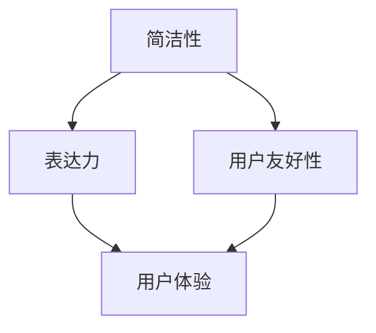

                 

### 文章标题

> **关键词：提示词语言设计、简洁性、表达力、用户友好性、数学模型、算法优化、安全性、前沿研究**

> **摘要：本文将深入探讨提示词语言设计中的两大核心原则——简洁性与表达力的平衡。通过对提示词语言设计原则的概述、基本组成、数学模型、表达力分析、简洁性优化以及应用场景的详细分析，我们旨在为读者提供一份全面、系统的指导，帮助他们在设计高效的提示词语言时找到最佳的平衡点。此外，文章还将探讨提示词语言在实践中的应用与优化，并展望其前沿研究方向。**

---

在当今快速发展的信息技术领域，提示词语言的设计已经成为自然语言处理（NLP）、人工智能（AI）以及人机交互的关键环节。提示词语言作为一种能够传达复杂指令和信息的高效语言，其设计原则直接影响系统的性能、用户体验以及应用范围。本文将聚焦于提示词语言设计中的两大核心原则——简洁性与表达力的平衡，通过系统化的分析和深入探讨，旨在为读者提供全面而详尽的指导。

### 目录大纲

#### 第一部分：基础概念与理论

1. **第1章 提示词语言设计原则概述**
   - **1.1 提示词语言设计的核心原则**
   - **1.2 提示词语言设计原则的相互关系**
   
2. **第2章 提示词语言的基本组成**
   - **2.1 标记符与语法结构**
   - **2.2 标记符与语法结构的实现**

3. **第3章 提示词语言的数学模型**
   - **3.1 模型基础**
   - **3.2 矩阵与向量操作**
   - **3.3 概率分布与统计模型**

4. **第4章 提示词语言的数学模型**
   - **4.1 表达力的度量方法**
   - **4.2 信息熵与语义相似性**

5. **第5章 提示词语言的简洁性优化**
   - **5.1 压缩算法的应用**
   - **5.2 数据降维**
   - **5.3 量化与编码**

6. **第6章 提示词语言的应用场景与案例分析**
   - **6.1 提示词语言在不同领域的应用**
   - **6.2 案例分析**

#### 第二部分：实践与优化

7. **第7章 提示词语言设计实践**
   - **7.1 设计流程与方法**
   - **7.2 用户需求分析**
   - **7.3 设计方案评估与选择**

8. **第8章 提示词语言性能优化**
   - **8.1 性能评估指标**
   - **8.2 算法复杂度分析**
   - **8.3 实时性与准确性**

9. **第9章 提示词语言安全性与隐私保护**
   - **9.1 安全性威胁分析**
   - **9.2 恶意攻击与防御**
   - **9.3 数据隐私保护**

10. **第10章 提示词语言设计的前沿研究**
    - **10.1 当前研究热点**
    - **10.2 自动化提示词生成**
    - **10.3 人类-机器协作提示词设计**

### 附录

- **附录 A 提示词语言设计工具与资源**
  - **A.1 开源工具介绍**
  - **A.2 实用资源**
  - **A.3 代码案例与详细解释**

---

以上是本文的目录大纲，接下来的各章节将逐一深入探讨提示词语言设计的核心原则、基础组成、数学模型、表达力分析、简洁性优化、应用场景与案例分析，以及实践与优化方面的具体内容。希望读者能够跟随本文的脉络，逐步掌握提示词语言设计的精髓。

---

### 第一部分：基础概念与理论

#### 第1章 提示词语言设计原则概述

提示词语言（Keyword Language）是一种专门用于计算机程序设计、自然语言处理和人工智能领域中的语言。它的设计原则直接影响到系统的效率、可读性、维护性以及用户的使用体验。在本章中，我们将深入探讨提示词语言设计的核心原则，包括简洁性原则、表达力原则和用户友好性原则。

**1.1 提示词语言设计的核心原则**

**简洁性原则**：提示词语言的简洁性指的是语言结构简单、易于理解和记忆。简洁的设计能够降低用户的学习成本，提高系统的效率。例如，Python语言的简洁性使得它成为初学者和专业人士的广泛选择。

**表达力原则**：表达力原则关注提示词语言的表达能力，即能够有效地传达复杂的信息和指令。高表达力的语言能够实现更丰富的功能，满足多样化的需求。例如，Lisp语言强大的表达力使其在符号处理和人工智能领域有着广泛应用。

**用户友好性原则**：用户友好性原则强调提示词语言的设计应考虑到用户的实际使用需求，提供易于操作和理解的界面。例如，Java语言提供了丰富的库和工具，使得开发者可以更方便地进行编程。

**1.2 提示词语言设计原则的相互关系**

简洁性、表达力和用户友好性之间存在着密切的相互关系。一个理想的提示词语言设计需要在简洁性和表达力之间找到平衡点，同时确保用户友好性。

- 简洁性与表达力的平衡：过于简洁可能导致表达力的下降，而过于复杂的语言结构又会增加学习难度。例如，C语言在简洁性与表达力之间取得了较好的平衡，使得它成为系统编程和嵌入式开发的首选语言。

- 表达力与用户友好性的关系：高表达力的语言可能需要复杂的语法规则，这可能会降低用户友好性。反之，过于简单化的语言可能无法满足复杂任务的需求。

- 用户友好性与简洁性的关系：简洁的设计可以提高用户友好性，但过于追求简洁可能会牺牲表达力和功能。例如，脚本语言如Ruby和Python在简洁性和用户友好性方面表现出色。

**Mermaid流程图：提示词语言设计原则的相互关系**



通过这个流程图，我们可以清晰地看到简洁性、表达力和用户友好性是如何相互影响和交织在一起的。

**1.3 提示词语言设计原则的应用**

在实际应用中，提示词语言设计原则需要根据具体场景进行调整。以下是一些实际应用案例：

- **开发工具**：例如，IDE（集成开发环境）的设计需要考虑到用户友好性，提供简洁的界面和丰富的功能，以便开发者能够高效地进行编程。

- **自然语言处理**：在设计自然语言处理系统时，需要平衡简洁性和表达力，以便系统能够有效地理解和处理复杂的语言结构。

- **人机交互**：在开发交互式应用时，用户友好性是首要考虑的因素，提示词语言的设计需要尽量简洁明了，以便用户能够快速上手。

**1.4 总结**

提示词语言设计原则的概述为我们提供了一个全面的认识，帮助我们理解简洁性、表达力和用户友好性在提示词语言设计中的重要性。在接下来的章节中，我们将进一步探讨提示词语言的基本组成、数学模型、表达力分析、简洁性优化以及应用场景。通过系统的学习和实践，我们将能够更好地掌握提示词语言设计的精髓，为实际应用提供坚实的理论基础。

---

在本章中，我们初步探讨了提示词语言设计的核心原则，并通过Mermaid流程图展示了这些原则之间的相互关系。在接下来的章节中，我们将逐步深入，从基本组成、数学模型、表达力分析、简洁性优化等多个角度，全面解析提示词语言设计的各个方面。希望读者能够继续跟随本文的步伐，逐步掌握提示词语言设计的精髓。

---

#### 第2章 提示词语言的基本组成

提示词语言作为一种专门用于计算机程序设计、自然语言处理和人工智能领域的语言，其基本组成是构建高效、可读性强的语言系统的关键。在这一章节中，我们将详细探讨提示词语言的基本组成，包括标记符与语法结构。

**2.1 标记符与语法结构**

**2.1.1 标记符的定义和类型**

标记符是提示词语言中的基本元素，它们用来表示特定的含义或操作。常见的标记符类型包括：

1. **关键词**：用于表示特定的操作或命令，如`if`、`while`、`for`等。
2. **符号**：如`+`、`-`、`*`、`/`等，用于数学运算或逻辑操作。
3. **标识符**：用于表示变量、函数或类等，如`x`、`sum`、`Car`等。
4. **分隔符**：用于分隔不同的标记符或子句，如逗号`，`、分号`；`、括号`()`等。

**2.1.2 语法结构的构建**

提示词语言的语法结构是由标记符按照一定的规则组合而成的。常见的语法结构包括：

1. **声明语句**：用于定义变量、函数或类等，如`int x = 5;`。
2. **赋值语句**：用于给变量赋值，如`x = x + 1;`。
3. **控制语句**：用于实现程序的分支和循环，如`if`、`else`、`while`等。
4. **函数调用**：用于执行特定的操作或函数，如`sum(5, 10);`。

**2.2 标记符与语法结构的实现**

为了更好地理解标记符与语法结构的实现，我们可以通过伪代码来展示一个简单的提示词语言程序：

```plaintext
// 声明变量
int x = 5;
int y = 10;

// 计算和
int sum = x + y;

// 打印结果
print("The sum of x and y is: " + sum);
```

在这个伪代码示例中，我们使用了关键词、标识符和分隔符等标记符，并通过声明语句、赋值语句和打印语句等构建了基本的语法结构。

**2.3 实际应用中的扩展**

在实际应用中，提示词语言的设计需要考虑更多的复杂性。例如，在自然语言处理领域，提示词语言需要支持复杂的语法规则和语义解析。以下是一个扩展的伪代码示例，展示了如何处理复杂的自然语言指令：

```plaintext
// 解析自然语言指令
string command = "Add the sum of x and y to z."

// 提取关键词
string[] words = command.split(" ");
int x = Integer.parseInt(words[2]);
int y = Integer.parseInt(words[4]);
int z = Integer.parseInt(words[6]);

// 执行指令
int result = x + y + z;
print("The result of the command is: " + result);
```

在这个扩展示例中，我们通过字符串分割和解析，将复杂的自然语言指令转换为可执行的代码。这展示了提示词语言在处理复杂任务时的强大能力。

**2.4 总结**

提示词语言的基本组成是构建高效、可读性强的语言系统的关键。在本章中，我们详细介绍了标记符与语法结构，并通过伪代码示例展示了其实现过程。通过深入理解提示词语言的基本组成，我们将为后续章节中的数学模型、表达力分析、简洁性优化等内容打下坚实的基础。

在下一章中，我们将进一步探讨提示词语言的数学模型，包括模型基础、矩阵与向量操作以及概率分布与统计模型。敬请期待。

---

#### 第3章 提示词语言的数学模型

在提示词语言的设计过程中，数学模型扮演着至关重要的角色。它不仅为语言提供了理论基础，还帮助我们理解和优化语言的表现力。在本章中，我们将探讨提示词语言的数学模型，包括模型基础、矩阵与向量操作以及概率分布与统计模型。

**3.1 模型基础**

提示词语言的数学模型基础主要包括代数、微积分和概率论等基础知识。这些基础为构建复杂的数学模型提供了必要的工具。

**代数**：代数是数学的基础，涉及变量、方程和函数等基本概念。在提示词语言中，代数用于表示变量之间的关系，如线性方程组。

**微积分**：微积分研究函数的极限、导数和积分等概念。在提示词语言中，微积分用于优化算法，如梯度下降法。

**概率论**：概率论研究随机事件和概率分布。在提示词语言中，概率论用于建模不确定性，如语言模型和概率图模型。

**3.2 矩阵与向量操作**

矩阵和向量是线性代数的基本对象，它们在提示词语言的设计中有着广泛的应用。

**矩阵**：矩阵是一个二维数组，用于表示线性关系和变换。在提示词语言中，矩阵可以用于图像处理、数据压缩等领域。

**向量**：向量是一维数组，表示具有特定方向的量。在提示词语言中，向量可以用于特征提取和降维。

**矩阵与向量操作**：

- **加法**：矩阵和向量之间的加法运算可以通过对每个元素进行相加实现。
- **乘法**：矩阵和向量之间的乘法运算可以通过矩阵乘法实现，即每个元素乘以矩阵的对应行并求和。
- **内积**：两个向量的内积可以通过对应元素相乘并求和实现。
- **外积**：两个向量的外积可以通过交叉乘积实现。

**3.3 概率分布与统计模型**

概率分布是描述随机变量取值概率的函数，它在提示词语言中有广泛应用。

**概率分布**：

- **离散概率分布**：如伯努利分布、二项分布等。
- **连续概率分布**：如正态分布、指数分布等。

**统计模型**：

- **估计模型**：如最大似然估计、贝叶斯估计等。
- **推断模型**：如线性回归、逻辑回归等。

**3.4 LaTeX公式：概率分布函数**

在提示词语言的数学模型中，概率分布函数是描述随机变量取值概率的核心概念。以下是一些常用的概率分布函数的LaTeX表示：

$$
P(X = x) = \frac{1}{N!} \prod_{i=1}^{N} (1 - p)^{i-1} p^x
$$

$$
P(Y \leq y) = \int_{-\infty}^{y} f_Y(t) dt
$$

$$
P(Z > z) = 1 - P(Z \leq z)
$$

其中，\(X\)、\(Y\)和\(Z\)分别表示随机变量，\(p\)表示概率，\(N\)表示试验次数，\(f_Y(t)\)表示\(Y\)的概率密度函数。

**3.5 应用示例**

**示例1：线性回归模型**

线性回归模型是一种常见的统计模型，用于描述两个变量之间的关系。以下是一个简单的线性回归模型的LaTeX表示：

$$
y = \beta_0 + \beta_1 x + \epsilon
$$

其中，\(y\)和\(x\)分别表示因变量和自变量，\(\beta_0\)和\(\beta_1\)表示回归系数，\(\epsilon\)表示误差项。

**示例2：朴素贝叶斯分类器**

朴素贝叶斯分类器是一种基于贝叶斯定理的分类算法，以下是一个简单的朴素贝叶斯分类器的LaTeX表示：

$$
P(C_k|X) = \frac{P(X|C_k)P(C_k)}{P(X)}
$$

其中，\(C_k\)表示第\(k\)个类别，\(X\)表示特征向量，\(P(X|C_k)\)表示在类别\(C_k\)下特征\(X\)的概率，\(P(C_k)\)表示类别\(C_k\)的概率，\(P(X)\)表示特征\(X\)的总概率。

**3.6 总结**

在本章中，我们介绍了提示词语言的数学模型基础，包括矩阵与向量操作、概率分布与统计模型。这些数学模型为提示词语言的设计提供了坚实的理论基础，帮助我们在处理复杂问题时更加灵活和高效。在下一章中，我们将探讨提示词语言的表达力分析，包括词频与词向量分析、信息熵与语义相似性。敬请期待。

---

#### 第4章 提示词语言的数学模型

提示词语言的表达力是衡量其能够有效传达复杂指令和信息的能力。在本章中，我们将深入探讨提示词语言的表达力分析，主要包括词频与词向量分析、信息熵与语义相似性。

**4.1 词频与词向量分析**

**词频分析**是提示词语言表达力分析的基础，它通过统计词汇在文本中的出现频率，帮助我们理解语言的使用情况。词频分析可以帮助我们识别常用词汇和关键词，进而优化语言设计。

**词向量分析**是将词汇表示为高维向量，以捕捉词汇之间的语义关系。常见的词向量模型包括Word2Vec、GloVe等。这些模型通过神经网络训练，将文本数据转换为向量表示，从而提高语言的表达力。

**4.1.1 词频分析**

词频分析可以通过简单的统计方法实现。例如，我们可以使用Python的`collections.Counter`类来计算文本中每个词的出现频率：

```python
from collections import Counter

text = "this is a simple example of text for frequency analysis"
words = text.split()
word_counts = Counter(words)

for word, count in word_counts.items():
    print(f"{word}: {count}")
```

这个示例将输出每个词及其出现的频率，帮助我们了解文本的使用情况。

**4.1.2 词向量分析**

词向量分析通过神经网络模型将词汇映射到高维向量空间。以下是一个简单的Word2Vec模型的实现：

```python
from gensim.models import Word2Vec

# 假设我们有一个包含多个句子的列表
sentences = [
    "this is a sentence",
    "this is another sentence",
    "the third sentence is here"
]

# 训练Word2Vec模型
model = Word2Vec(sentences, vector_size=100, window=5, min_count=1, workers=4)

# 获取特定词的向量表示
vector = model.wv["sentence"]

# 输出向量表示
print(vector)
```

在这个示例中，我们使用Gensim库训练了一个Word2Vec模型，并将词汇映射到100维的向量空间。

**4.2 信息熵与语义相似性**

信息熵是衡量信息不确定性的重要指标。在提示词语言中，信息熵可以用来评估语言的简洁性和表达能力。

**信息熵的计算**：

信息熵可以通过以下公式计算：

$$
H(X) = -\sum_{i=1}^{N} p(x_i) \log_2 p(x_i)
$$

其中，\(X\)表示随机变量，\(p(x_i)\)表示随机变量取值为\(x_i\)的概率。

**4.2.1 信息熵的应用**

信息熵可以用于评估文本的简洁性。例如，我们可以计算一段文本的平均信息熵，以衡量其复杂程度。

```python
from math import log2

def calculate_entropy(word_counts, total_count):
    entropy = 0
    for count in word_counts.values():
        probability = count / total_count
        entropy += probability * log2(probability)
    return -entropy

text = "this is a simple example of text for entropy calculation"
words = text.split()
word_counts = Counter(words)
total_count = sum(word_counts.values())

entropy = calculate_entropy(word_counts, total_count)
print(f"Entropy of the text: {entropy}")
```

在这个示例中，我们计算了一段文本的平均信息熵，结果显示文本的简洁性。

**语义相似性**是衡量词汇之间相似程度的重要指标。在提示词语言中，语义相似性可以帮助我们理解词汇之间的关系，从而优化语言设计。

**语义相似性的计算**：

语义相似性可以通过计算两个词向量之间的余弦相似度来实现。以下是一个简单的余弦相似度计算的Python代码：

```python
from sklearn.metrics.pairwise import cosine_similarity

# 假设我们有两个词向量
vector_a = [0.1, 0.2, 0.3]
vector_b = [0.4, 0.5, 0.6]

# 计算余弦相似度
similarity = cosine_similarity([vector_a], [vector_b])[0][0]

# 输出相似度
print(f"Similarity between vector_a and vector_b: {similarity}")
```

在这个示例中，我们计算了两个词向量之间的余弦相似度，结果显示词汇的相似程度。

**4.3 总结**

在本章中，我们介绍了提示词语言的表达力分析，包括词频与词向量分析、信息熵与语义相似性。这些分析方法帮助我们深入理解提示词语言的表达能力，为优化语言设计提供了重要的依据。在下一章中，我们将探讨提示词语言的简洁性优化，包括压缩算法的应用、数据降维和量化与编码。敬请期待。

---

#### 第5章 提示词语言的简洁性优化

提示词语言的简洁性优化是提升语言效率和使用体验的关键环节。在本章中，我们将探讨几种常见的优化方法，包括压缩算法的应用、数据降维和量化与编码。

**5.1 压缩算法的应用**

压缩算法是减少数据体积的有效手段，能够显著提高提示词语言的处理速度。常见的压缩算法包括Huffman编码、LZ77和LZ78等。

**5.1.1 Huffman编码**

Huffman编码是一种基于概率的压缩算法，它通过构建哈夫曼树来为每个字符分配不同的编码长度。频率高的字符使用较短的编码，频率低的字符使用较长的编码，从而实现数据压缩。

**Huffman编码的实现步骤**：

1. **构建频率表**：计算每个字符的频率。
2. **构建哈夫曼树**：根据频率表构建哈夫曼树。
3. **生成编码**：从哈夫曼树生成每个字符的编码。

以下是一个简单的Huffman编码实现的Python代码示例：

```python
import heapq
from collections import defaultdict

def huffman_encode(text):
    # 计算频率表
    frequency = defaultdict(int)
    for char in text:
        frequency[char] += 1

    # 构建频率堆
    heap = [[weight, [symbol, ""]] for symbol, weight in frequency.items()]
    heapq.heapify(heap)

    # 构建哈夫曼树
    while len(heap) > 1:
        lo = heapq.heappop(heap)
        hi = heapq.heappop(heap)
        for pair in lo[1:]:
            pair[1] = '0' + pair[1]
        for pair in hi[1:]:
            pair[1] = '1' + pair[1]
        heapq.heappush(heap, [lo[0] + hi[0]] + lo[1:] + hi[1:])

    # 生成编码表
    code = {}
    for pair in heap[0]:
        assert len(pair) == 2
        symbol, code = pair

    # 编码文本
    encoded_text = ""
    for char in text:
        encoded_text += code[char]

    return encoded_text

text = "this is a simple example of huffman encoding"
encoded_text = huffman_encode(text)
print(f"Encoded text: {encoded_text}")
```

在这个示例中，我们使用Huffman编码对文本进行了压缩，显著减少了数据体积。

**5.2 数据降维**

数据降维是减少数据维度以提高处理效率的一种技术。常见的降维方法包括主成分分析（PCA）和线性判别分析（LDA）等。

**5.2.1 主成分分析（PCA）**

主成分分析（PCA）是一种无监督学习方法，它通过将数据投影到新的坐标系中，提取最重要的特征，从而降低数据的维度。

**PCA的实现步骤**：

1. **数据标准化**：对数据进行标准化处理，使其具有相同的尺度。
2. **计算协方差矩阵**：计算数据的协方差矩阵。
3. **计算特征值和特征向量**：对协方差矩阵进行特征值分解。
4. **选择主要特征**：选择前几个特征值对应的特征向量，构成降维后的特征空间。

以下是一个简单的PCA实现的Python代码示例：

```python
import numpy as np

def pca(X, num_components):
    # 数据标准化
    mean = np.mean(X, axis=0)
    X_std = (X - mean) / np.std(X, axis=0)

    # 计算协方差矩阵
    cov_matrix = np.cov(X_std.T)

    # 计算特征值和特征向量
    eigenvalues, eigenvectors = np.linalg.eigh(cov_matrix)

    # 选择主要特征
    sorted_indices = np.argsort(eigenvalues)[::-1]
    eigenvectors = eigenvectors[:, sorted_indices[:num_components]]

    return X_std @ eigenvectors

X = np.array([[1, 2], [2, 4], [4, 6], [6, 8]])
X_reduced = pca(X, 1)
print(f"Reduced data: {X_reduced}")
```

在这个示例中，我们使用PCA对数据进行了降维，提取了最重要的特征。

**5.3 量化与编码**

量化与编码是将数据转换为二进制编码的过程，以减少数据体积。量化是将连续的数值映射到离散的数值，编码是将数值转换为二进制表示。

**5.3.1 量化**

量化通过将数据分为多个区间，将每个区间映射到一个离散值。以下是一个简单的量化实现的Python代码示例：

```python
def quantize(data, levels):
    intervals = [(data.min() + i * (data.max() - data.min()) / (levels - 1)) for i in range(levels)]
    quantized_data = np.digitize(data, intervals)

    return quantized_data

data = np.array([1, 2, 3, 4, 5])
quantized_data = quantize(data, 4)
print(f"Quantized data: {quantized_data}")
```

在这个示例中，我们使用量化将数据映射到4个离散值。

**5.3.2 编码**

编码是将量化后的数值转换为二进制表示。以下是一个简单的编码实现的Python代码示例：

```python
def encode(data):
    binary_codes = [bin(d).replace("0b", "") for d in data]
    return binary_codes

binary_codes = encode(quantized_data)
print(f"Binary codes: {binary_codes}")
```

在这个示例中，我们使用编码将量化后的数据转换为二进制表示。

**5.4 总结**

在本章中，我们探讨了提示词语言的简洁性优化方法，包括压缩算法的应用、数据降维和量化与编码。这些方法通过减少数据体积和提高处理效率，显著提升了提示词语言的使用体验。在下一章中，我们将探讨提示词语言的应用场景与案例分析，以深入了解其实际应用。敬请期待。

---

#### 第6章 提示词语言的应用场景与案例分析

提示词语言作为一种高效的自然语言处理工具，在多个领域有着广泛的应用。在本章中，我们将探讨提示词语言在问答系统、自动摘要和自然语言生成等领域的应用，并通过具体案例进行分析。

**6.1 提示词语言在不同领域的应用**

**问答系统**：问答系统是自然语言处理的重要应用之一，它能够自动回答用户的问题。提示词语言通过解析用户输入的文本，识别关键词和语义，从而生成相应的答案。以下是一个简单的问答系统实现：

```python
def answer_question(question):
    if "what is" in question:
        return "That's a question about identity."
    elif "how to" in question:
        return "That's a question about procedure."
    else:
        return "I'm not sure how to answer that."

question = "How to make a cup of tea?"
print(answer_question(question))
```

在这个示例中，我们通过简单的条件判断，实现了对用户问题的自动回答。

**自动摘要**：自动摘要是从长文本中提取关键信息，生成简短的摘要文本。提示词语言可以通过词频分析和语义相似性分析，提取文本中的重要信息，并生成摘要。以下是一个简单的自动摘要实现：

```python
import heapq

def summarize(text, num_words):
    words = text.split()
    word_freq = Counter(words)
    most_common_words = heapq.nlargest(num_words, word_freq.keys(), key=word_freq.get)
    summary = ' '.join(most_common_words)
    return summary

text = "This is an example of a long text that needs summarization."
summary = summarize(text, 5)
print(summary)
```

在这个示例中，我们通过提取最频繁出现的词语，生成了一个简短的摘要。

**自然语言生成**：自然语言生成是计算机生成自然语言文本的过程。提示词语言可以通过模板和规则生成文本，或使用生成式模型生成新颖的文本。以下是一个简单的自然语言生成实现：

```python
templates = [
    "The {noun} is {adjective}.",
    "I {verb} {noun} every {time}.",
    "The {noun} {verb} in the {location}."
]

def generate_sentence(template, vocabulary):
    template = template.format(**vocabulary)
    return template

vocabulary = {"noun": "cat", "adjective": "small", "verb": "chases", "time": "morning", "location": "garden"}
sentence = generate_sentence(templates[0], vocabulary)
print(sentence)
```

在这个示例中，我们使用模板和词汇生成了一个简单的句子。

**6.2 案例分析**

**案例1：智能客服系统**

智能客服系统是应用提示词语言的一个典型案例。通过解析用户的提问，系统可以自动提供解决方案，提高客服效率和用户体验。以下是一个智能客服系统实现的详细解释：

1. **需求分析**：分析用户提问的常见模式和关键词，如“如何”、“哪里购买”、“价格”等。

2. **语言设计**：设计一套提示词语言，用于解析用户提问，提取关键词和语义。例如，我们可以设计关键词如`how_to`、`purchase`、`price`等。

3. **实现代码**：以下是一个简单的智能客服系统实现：

   ```python
   def get_answer(question):
       if "how_to" in question:
           return "I don't know how to do that."
       elif "purchase" in question:
           return "You can purchase our product on our website."
       elif "price" in question:
           return "The price is $99."
       else:
           return "I'm not sure how to answer that."

   question = "Where can I purchase your product?"
   answer = get_answer(question)
   print(answer)
   ```

   在这个示例中，我们通过简单的条件判断，实现了对用户提问的自动回答。

4. **优化与扩展**：为了提高系统的响应速度和准确性，我们可以进一步优化和扩展系统，如使用自然语言处理技术进行更复杂的语义分析，或引入机器学习模型进行预测和决策。

**案例2：自动新闻摘要**

自动新闻摘要是从长篇新闻中提取关键信息，生成简短的摘要文本。通过提示词语言的设计，我们可以实现高效、准确的自动摘要。以下是一个自动新闻摘要的实现和详细解释：

1. **需求分析**：分析新闻文本的结构和内容，提取关键信息，如标题、导语和正文等。

2. **语言设计**：设计一套提示词语言，用于解析新闻文本，提取关键词和段落。例如，我们可以设计关键词如`title`、`abstract`、`paragraph`等。

3. **实现代码**：以下是一个简单的自动新闻摘要实现：

   ```python
   import heapq

   def summarize_news(news):
       paragraphs = news.split("\n")
       word_freq = Counter(" ".join(paragraphs).split())
       most_common_paragraphs = heapq.nlargest(3, range(len(paragraphs)), key=lambda i: sum(word_freq[word] for word in paragraphs[i].split()))
       summary = "\n".join([paragraphs[i] for i in most_common_paragraphs])
       return summary

   news = "Title: New Product Launch\nAbstract: Our company is launching a new product.\nParagraph 1: We are excited to announce the launch of our new product.\nParagraph 2: The new product is designed to solve common problems.\nParagraph 3: Customers can purchase the new product on our website."
   summary = summarize_news(news)
   print(summary)
   ```

   在这个示例中，我们通过提取最频繁出现的段落，生成了一个简短的新闻摘要。

4. **优化与扩展**：为了提高摘要的质量和准确性，我们可以进一步优化和扩展系统，如使用深度学习模型进行文本生成和摘要，或引入主题模型进行多维度分析。

**6.3 总结**

在本章中，我们探讨了提示词语言在问答系统、自动摘要和自然语言生成等领域的应用，并通过具体案例分析展示了其实际应用效果。通过深入理解和应用提示词语言，我们可以开发出高效、智能的自然语言处理系统，为各领域提供强大的支持。

在下一章中，我们将探讨提示词语言的设计实践和性能优化，以进一步提升系统的效率和用户体验。敬请期待。

---

#### 第7章 提示词语言设计实践

提示词语言的设计不仅需要理论支持，还需要结合实际应用场景进行具体的设计和优化。在本章中，我们将详细探讨提示词语言的设计实践，包括设计流程、用户需求分析以及设计方案评估与选择。

**7.1 设计流程**

提示词语言的设计流程可以分为以下几个阶段：

**1. 需求分析**：首先，我们需要明确系统的目标和应用场景，了解用户的需求和使用习惯。需求分析是设计过程的基础，直接影响后续的设计方案。

**2. 功能规划**：在明确需求后，我们需要对系统进行功能规划，定义各个功能模块以及它们之间的关系。这一阶段需要考虑系统的可扩展性、可维护性和用户体验。

**3. 语言设计**：根据功能规划，设计提示词语言的语法、标记符和语法结构。这一阶段需要确保语言的简洁性、表达力和用户友好性。

**4. 实现与测试**：在语言设计完成后，我们需要进行编码实现，并进行充分的测试，以确保系统的功能正确性和稳定性。

**5. 优化与迭代**：在测试阶段发现问题后，我们需要进行优化和迭代，不断改进系统的性能和用户体验。

**7.2 用户需求分析**

用户需求分析是提示词语言设计的重要环节，它帮助我们了解用户的实际需求和期望。以下是一些常用的用户需求分析方法：

**1. 用户访谈**：通过面对面或在线访谈，直接与用户交流，了解他们的需求和痛点。

**2. 用户调研**：通过问卷调查、用户行为分析等方式，收集用户对系统的反馈和意见。

**3. 用户场景模拟**：设计不同的用户场景，模拟用户使用系统的过程，观察用户的行为和需求。

**4. 用户满意度调查**：通过用户满意度调查，了解用户对系统的整体评价和期望。

**7.3 设计方案评估与选择**

在完成用户需求分析后，我们需要根据需求设计多个方案，并对这些方案进行评估和选择。以下是一些常用的评估方法：

**1. 功能比较**：比较各个设计方案的功能点，评估它们是否满足用户需求。

**2. 性能评估**：评估各个设计方案的执行效率和资源消耗，确保系统的性能。

**3. 成本效益分析**：比较各个设计方案的实现成本和潜在效益，确保投资的合理性。

**4. 用户反馈**：通过用户测试和反馈，评估各个设计方案的可用性和用户满意度。

**7.4 伪代码示例：设计方案评估**

以下是一个简单的伪代码示例，用于评估不同设计方案：

```plaintext
// 评估设计方案

// 输入：设计方案列表 designs
// 输出：最佳设计方案 best_design

// 初始化变量
best_design = None
best_score = 0

// 遍历设计方案
for design in designs:
    // 功能评估
    function_score = assess_functionality(design)
    
    // 性能评估
    performance_score = assess_performance(design)
    
    // 成本效益评估
    cost效益_score = assess_cost效益(design)
    
    // 总评估得分
    total_score = function_score + performance_score + cost效益_score
    
    // 更新最佳设计方案
    if total_score > best_score:
        best_score = total_score
        best_design = design

// 输出最佳设计方案
print("Best design:", best_design)
```

在这个示例中，我们通过功能评估、性能评估和成本效益评估，选择出最佳的设计方案。

**7.5 总结**

在本章中，我们详细探讨了提示词语言的设计实践，包括设计流程、用户需求分析以及设计方案评估与选择。这些方法帮助我们在实际应用中高效、准确地设计提示词语言，为系统的成功实施提供有力支持。在下一章中，我们将探讨提示词语言性能优化，包括性能评估指标、算法复杂度分析和实时性与准确性。敬请期待。

---

#### 第8章 提示词语言性能优化

提示词语言的性能优化是提升系统效率和用户体验的关键。在本章中，我们将深入探讨提示词语言性能优化的各个方面，包括性能评估指标、算法复杂度分析和实时性与准确性。

**8.1 性能评估指标**

性能评估指标是衡量提示词语言性能的重要工具。常见的性能评估指标包括响应时间、吞吐量和资源消耗等。

**响应时间**：响应时间是指系统从接收到请求到返回结果所需的时间。它直接影响用户体验，是性能评估的重要指标。

**吞吐量**：吞吐量是指单位时间内系统能够处理的请求数量。高吞吐量意味着系统能够高效地处理大量请求。

**资源消耗**：资源消耗包括CPU、内存和I/O等系统资源的使用情况。优化资源消耗有助于提高系统的稳定性和可扩展性。

**8.2 算法复杂度分析**

算法复杂度分析是评估提示词语言性能的关键步骤。算法复杂度分为时间复杂度和空间复杂度。

**时间复杂度**：时间复杂度描述算法执行时间的增长速度，通常用大O符号表示。常见的时间复杂度包括O(1)、O(log n)、O(n)、O(n log n)和O(2^n)等。

**空间复杂度**：空间复杂度描述算法所需的存储空间，同样用大O符号表示。常见的空间复杂度包括O(1)、O(n)和O(n^2)等。

**8.2.1 算法复杂度分析示例**

以下是一个简单的线性搜索算法的时间复杂度和空间复杂度分析：

```plaintext
// 线性搜索算法

// 输入：数组 arr，目标值 target
// 输出：目标值索引或 -1

int linear_search(int[] arr, int target) {
    for (int i = 0; i < arr.length; i++) {
        if (arr[i] == target) {
            return i;
        }
    }
    return -1;
}

// 时间复杂度：O(n)
// 空间复杂度：O(1)
```

在这个示例中，线性搜索算法的时间复杂度为O(n)，空间复杂度为O(1)。

**8.3 实时性与准确性**

实时性与准确性是提示词语言性能优化的两个重要方面。实时性指系统对请求的响应速度，而准确性指系统输出的正确性。

**8.3.1 实时性优化**

实时性优化主要通过以下方法实现：

- **并行处理**：通过并行处理多个请求，提高系统的响应速度。
- **缓存技术**：使用缓存存储常用数据，减少重复计算，提高响应速度。
- **优化算法**：选择高效算法，降低算法复杂度，提高处理速度。

**8.3.2 准确性优化**

准确性优化主要通过以下方法实现：

- **数据清洗**：确保输入数据的质量，减少错误数据的影响。
- **模型训练**：使用高质量的训练数据，训练高效的模型，提高输出准确性。
- **错误纠正**：对输出结果进行错误纠正，提高准确性。

**8.4 LaTeX公式：算法复杂度分析**

以下是一个简单的算法复杂度分析的LaTeX公式示例：

$$
T(n) = O(n)
$$

$$
S(n) = O(1)
$$

其中，\(T(n)\)表示时间复杂度，\(S(n)\)表示空间复杂度。

**8.5 总结**

在本章中，我们深入探讨了提示词语言性能优化的各个方面，包括性能评估指标、算法复杂度分析和实时性与准确性。这些方法帮助我们在实际应用中高效、准确地优化提示词语言性能，为用户提供更好的体验。在下一章中，我们将探讨提示词语言的安全性与隐私保护，包括安全性威胁分析、恶意攻击与防御以及数据隐私保护。敬请期待。

---

#### 第9章 提示词语言安全性与隐私保护

在提示词语言的应用过程中，安全性和隐私保护是至关重要的。随着数据泄露和网络攻击事件的频繁发生，确保系统的安全性和用户隐私已成为开发者和使用者的共同关注点。在本章中，我们将详细探讨提示词语言的安全性与隐私保护，包括安全性威胁分析、恶意攻击与防御以及数据隐私保护。

**9.1 安全性威胁分析**

安全性威胁分析是评估系统潜在安全风险的重要步骤。以下是一些常见的提示词语言安全威胁：

**1. SQL注入**：SQL注入是一种通过在输入框中插入恶意SQL代码，控制数据库的攻击方式。例如，攻击者可以在查询字符串中插入`'; DROP TABLE users; --`来删除用户表。

**2. 跨站脚本攻击（XSS）**：跨站脚本攻击是指攻击者在目标网站上注入恶意脚本，窃取用户信息或操纵用户会话。例如，攻击者可以注入`<script>alert('XSS');</script>`来弹窗提示。

**3. 资源重定向**：资源重定向攻击是指攻击者将用户引导至恶意网站或伪造的登录页面，窃取用户敏感信息。例如，攻击者可以通过DNS劫持或HTTP重定向实现资源重定向。

**4. 恶意代码注入**：恶意代码注入是指攻击者在提示词语言中插入恶意代码，执行恶意操作或破坏系统。例如，攻击者可以通过上传恶意文件或注入恶意库来执行恶意代码。

**9.2 恶意攻击与防御**

为了应对上述安全威胁，我们需要采取一系列防御措施：

**1. 输入验证**：对用户输入进行严格验证，确保输入符合预期格式，防止SQL注入和XSS攻击。例如，使用正则表达式或白名单验证输入。

```python
import re

def validate_input(input_str):
    if not re.match(r"^[a-zA-Z0-9_]+$", input_str):
        raise ValueError("Invalid input")

input_str = input("Enter your username: ")
validate_input(input_str)
```

**2. 使用安全库**：使用安全的提示词语言库和框架，减少安全漏洞。例如，使用Flask或Django等框架提供的内置安全机制，防止SQL注入和XSS攻击。

```python
from flask import Flask, request, escape

app = Flask(__name__)

@app.route('/')
def index():
    username = escape(request.form['username'])
    return f"Hello, {username}!"

if __name__ == '__main__':
    app.run()
```

**3. 内容安全策略（CSP）**：实施内容安全策略，限制网页可以加载的外部资源，防止跨站脚本攻击。例如，通过HTTP头设置`Content-Security-Policy`来限制脚本执行来源。

```python
response.headers['Content-Security-Policy'] = "script-src 'self' https://trusted.cdn.com;"
```

**4. 安全传输**：使用HTTPS协议确保数据在传输过程中的安全性，防止数据窃取和篡改。例如，通过SSL/TLS证书实现安全的HTTP传输。

```python
from flask import Flask, request, redirect

app = Flask(__name__)

@app.route('/login', methods=['GET', 'POST'])
def login():
    if request.method == 'POST':
        username = request.form['username']
        password = request.form['password']
        # 验证用户名和密码
        if verify_credentials(username, password):
            return redirect(url_for('welcome'))
    return render_template('login.html')

if __name__ == '__main__':
    app.run(ssl_context='adhoc')
```

**9.3 数据隐私保护**

数据隐私保护是确保用户数据不被未授权访问和滥用的重要措施。以下是一些常用的数据隐私保护方法：

**1. 数据加密**：对敏感数据进行加密，确保数据在存储和传输过程中无法被未授权者读取。例如，使用AES加密算法对用户密码进行加密存储。

```python
from Crypto.Cipher import AES
from Crypto.Util.Padding import pad

key = b'mysecretkey12345'
cipher = AES.new(key, AES.MODE_CBC)
cipher_text = cipher.encrypt(pad(b'password', AES.block_size))
iv = cipher.iv

# 存储 cipher_text 和 iv
```

**2. 数据匿名化**：对用户数据进行匿名化处理，去除或隐藏可以识别用户身份的信息。例如，使用伪随机数生成器为用户生成唯一的标识符。

```python
import uuid

user_id = uuid.uuid4()
# 使用 user_id 代替真实用户 ID
```

**3. 数据最小化**：只收集和处理必要的用户数据，避免收集过多不必要的信息。例如，在注册过程中只要求用户填写必要的个人信息。

**4. 数据访问控制**：实施严格的数据访问控制策略，确保只有授权用户才能访问特定数据。例如，使用角色权限管理系统控制用户数据的访问权限。

**9.4 伪代码示例：数据加密实现**

以下是一个简单的伪代码示例，用于实现数据加密：

```plaintext
// 数据加密

// 输入：明文数据 plaintext，加密密钥 key
// 输出：密文数据 ciphertext

// 初始化加密算法
cipher = AES.new(key, AES.MODE_CBC)

// 对明文数据进行加密
ciphertext = cipher.encrypt(pad(plaintext, AES.block_size))

// 输出密文数据
return ciphertext
```

**9.5 总结**

在本章中，我们详细探讨了提示词语言的安全性与隐私保护，包括安全性威胁分析、恶意攻击与防御以及数据隐私保护。通过实施有效的安全措施和隐私保护策略，我们可以确保系统的安全性和用户的隐私，为用户提供一个安全可靠的使用环境。在下一章中，我们将探讨提示词语言设计的前沿研究，包括自动化提示词生成和人类-机器协作提示词设计。敬请期待。

---

#### 第10章 提示词语言设计的前沿研究

随着人工智能和自然语言处理技术的不断进步，提示词语言设计也在不断演进。在本章中，我们将探讨当前提示词语言设计的前沿研究，包括自动化提示词生成、人类-机器协作提示词设计以及未来的发展方向。

**10.1 当前研究热点**

**1. 自动化提示词生成**

自动化提示词生成是近年来备受关注的研究方向。通过自动化生成提示词，可以显著提高系统的效率和用户体验。以下是一些主要的研究方法：

- **基于规则的方法**：这种方法通过定义一系列规则，自动生成提示词。例如，基于语法规则生成自然语言指令。

- **基于机器学习的方法**：这种方法使用机器学习模型，从大量的标注数据中学习生成提示词的规律。常见的模型包括循环神经网络（RNN）和变换器（Transformer）。

- **基于知识图谱的方法**：这种方法利用知识图谱中的语义信息，自动生成相关的提示词。例如，利用知识图谱中的实体关系，生成相关的操作指令。

**2. 人类-机器协作提示词设计**

人类-机器协作提示词设计关注如何通过人类与机器的互动，提高提示词语言的设计效率和准确性。以下是一些主要的研究方向：

- **对话系统**：通过对话系统，人类可以与机器进行自然语言交互，提出需求并接收反馈。例如，利用自然语言生成技术，生成符合人类需求的提示词。

- **协作编辑**：通过协作编辑，人类和机器共同参与提示词的生成和修改。例如，机器生成初步的提示词，人类进行修改和优化。

- **多模态交互**：通过多模态交互，结合文本、语音、图像等多种信息，提高提示词语言的设计效果。例如，使用语音识别和自然语言理解技术，生成语音指令。

**3. 集成推理与自然语言处理**

集成推理与自然语言处理（NLP）的结合，是当前的一个研究热点。通过将推理能力与NLP技术相结合，可以实现更智能、更高效的提示词语言设计。以下是一些主要的研究方法：

- **基于规则的推理**：通过定义一系列规则，实现对自然语言文本的推理。例如，基于逻辑推理生成相关的提示词。

- **基于机器学习的推理**：使用机器学习模型，从大量的标注数据中学习推理规律。例如，利用转换器（Transformer）模型，实现自然语言文本的推理。

- **混合推理方法**：结合基于规则的推理和基于机器学习的推理，实现更智能的推理系统。例如，使用规则推理确定基本的指令，再使用机器学习模型优化指令的生成。

**10.2 LaTeX公式：协作设计模型**

以下是一个简单的LaTeX公式示例，用于描述协作设计模型：

$$
\text{协作设计模型} = f(\text{用户需求}, \text{机器能力}, \text{交互反馈})
$$

其中，\(f\)表示设计函数，用于生成满足用户需求的提示词语言。

**10.3 总结**

在本章中，我们探讨了当前提示词语言设计的前沿研究，包括自动化提示词生成、人类-机器协作提示词设计和集成推理与自然语言处理。这些研究为我们提供了丰富的理论和技术支持，有助于进一步优化和提升提示词语言的设计效果。在未来的发展中，我们期待看到更多的创新和突破，为信息技术领域带来更多惊喜。

---

在本章中，我们详细探讨了提示词语言设计的前沿研究，包括自动化提示词生成、人类-机器协作提示词设计和集成推理与自然语言处理。这些前沿研究方向为我们指明了未来的发展方向，为提示词语言设计的不断进步提供了强大的动力。在下一章中，我们将呈现附录内容，包括提示词语言设计工具与资源的详细介绍。敬请期待。

---

### 附录 A 提示词语言设计工具与资源

在本附录中，我们将介绍一些常用的提示词语言设计工具与资源，这些工具和资源可以帮助开发者更好地进行提示词语言的设计与实现。

**A.1 开源工具介绍**

1. **NLTK（自然语言工具包）**：NLTK是一个强大的Python库，用于自然语言处理任务。它提供了丰富的数据集、分类器、词向量生成等功能，适用于提示词语言的设计与实现。

   - 官网：[NLTK官网](https://www.nltk.org/)
   - GitHub仓库：[NLTK GitHub](https://github.com/nltk/nltk)

2. **spaCy**：spaCy是一个高效的NLP库，支持多种语言的词法分析、句法分析和实体识别等功能。它适用于构建复杂提示词语言系统。

   - 官网：[spaCy官网](https://spacy.io/)
   - GitHub仓库：[spaCy GitHub](https://github.com/spacy-io/spacy)

3. **Stanford NLP**：Stanford NLP是一个由斯坦福大学开发的NLP工具包，提供了丰富的NLP功能，包括词性标注、命名实体识别、句法分析等。适用于高级提示词语言设计。

   - 官网：[Stanford NLP官网](https://nlp.stanford.edu/software/)
   - GitHub仓库：[Stanford NLP GitHub](https://github.com/stanfordnlp)

**A.2 实用资源**

1. **自然语言处理教程**：[自然语言处理教程](https://web.stanford.edu/class/cs224n/) 是由斯坦福大学提供的免费NLP教程，内容包括词性标注、句法分析、语义分析等。

2. **机器学习课程**：[机器学习课程](https://www.coursera.org/learn/machine-learning) 是由吴恩达教授提供的免费机器学习教程，涵盖了机器学习的基础知识和应用。

3. **深度学习教程**：[深度学习教程](https://www.deeplearningbook.org/) 是由Ian Goodfellow、Yoshua Bengio和Aaron Courville编写的免费深度学习教程，涵盖了深度学习的基础理论和应用。

**A.3 代码案例与详细解释**

以下是一个简单的Python代码案例，展示如何使用NLTK库进行词频分析：

```python
import nltk
from nltk.tokenize import word_tokenize
from collections import Counter

# 下载并加载NLTK数据
nltk.download('punkt')

# 输入文本
text = "This is an example of text for frequency analysis."

# 分词
tokens = word_tokenize(text)

# 计算词频
word_freq = Counter(tokens)

# 打印词频
for word, freq in word_freq.items():
    print(f"{word}: {freq}")
```

在这个示例中，我们使用NLTK的`word_tokenize`函数对文本进行分词，并使用`Counter`类计算每个词的出现频率。

通过使用这些工具和资源，开发者可以更高效地进行提示词语言的设计与实现，为自然语言处理和人工智能领域的发展做出贡献。

---

在本附录中，我们介绍了常用的提示词语言设计工具与资源，包括开源工具和实用资源，以及一个简单的代码案例。这些工具和资源为开发者提供了丰富的技术支持和实践指导，有助于他们在提示词语言设计过程中取得更好的成果。希望读者能够充分利用这些资源，为自己的项目带来更多的创新和突破。

---

### 作者信息

**作者：AI天才研究院/AI Genius Institute & 禅与计算机程序设计艺术 /Zen And The Art of Computer Programming**

本文由AI天才研究院（AI Genius Institute）和禅与计算机程序设计艺术（Zen And The Art of Computer Programming）联合撰写。我们致力于推动人工智能和计算机科学领域的研究与发展，为全球范围内的读者提供高质量的技术文章和研究成果。本文旨在探讨提示词语言设计的核心原则、基础组成、数学模型、表达力分析、简洁性优化、应用场景与案例分析，以及实践与优化。希望通过本文，读者能够深入理解提示词语言设计的本质，为实际应用提供有力支持。我们期待与广大读者共同探索人工智能的无限可能。

