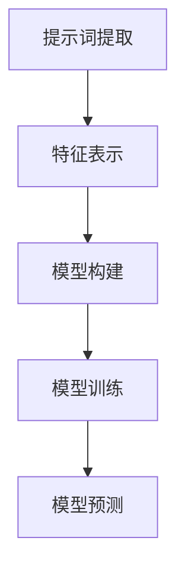

                 

# 提示词驱动的智能水资源管理：应对气候变化

> **关键词：** 水资源管理、智能水资源管理、气候变化、提示词、水资源预测模型、水资源优化配置、农业、城市水务、环境监测与保护、未来发展趋势、挑战与应对策略

> **摘要：** 面对全球气候变化，水资源管理面临前所未有的挑战。本文探讨了提示词驱动的智能水资源管理方法，通过引入提示词技术，构建水资源预测模型和优化配置方法，为应对气候变化提供技术支持。文章详细分析了智能水资源管理在农业、城市水务和环境监测与保护等领域的应用，并对未来发展趋势和挑战进行了展望。

## 目录大纲

1. **背景与理论基础**
    1.1 水资源管理的基本概念
    1.2 水资源管理面临的挑战
    1.3 气候变化对水资源管理的影响
    1.4 智能水资源管理概述
    1.5 智能水资源管理的定义与发展
    1.6 智能水资源管理的应用

2. **提示词驱动的智能水资源管理**
    2.1 提示词的概念与作用
    2.2 提示词驱动的水资源预测模型
    2.3 提示词驱动的水资源优化配置

3. **应用与实践**
    3.1 智能水资源管理在农业领域的应用
    3.2 智能水资源管理在城市水务领域的应用
    3.3 智能水资源管理在环境监测与保护中的应用

4. **未来展望与挑战**
    4.1 智能水资源管理的未来发展趋势
    4.2 智能水资源管理的挑战与应对策略

5. **附录**
    5.1 智能水资源管理工具与资源
    5.2 术语解释

### 第一部分：背景与理论基础

### 第1章：水资源管理的现状与挑战

#### 1.1 水资源管理的基本概念

水资源管理是指对水资源的保护、开发、利用和治理进行规划、组织、协调和监督的一系列活动。水资源管理的基本目标是确保水资源的合理开发和高效利用，以满足人类生活和生产的需求。水资源管理包括水资源的分配、调度、保护、开发和利用等多个方面。

水资源管理的基本概念可以分为以下几个方面：

- **水资源总量**：指一定区域内的水资源总量，包括地表水资源和地下水资源。
- **水资源质量**：指水资源的物理、化学和生物特性，如水的颜色、气味、温度、pH值等。
- **水资源用途**：指水资源的分配和使用方向，如生活用水、工业用水、农业用水等。
- **水资源管理政策**：指国家或地方政府制定的有关水资源保护、开发和利用的政策和法规。

#### 1.2 水资源管理面临的挑战

随着全球气候变化和人口增长，水资源管理面临许多挑战。以下是水资源管理面临的主要挑战：

- **水资源短缺**：全球水资源分布不均衡，许多地区面临水资源短缺问题。气候变化进一步加剧了水资源短缺问题，导致水资源供需矛盾日益突出。
- **水污染**：工业、农业和生活污染导致水体质量下降，影响水资源的利用。水污染问题严重威胁人类健康和生态系统的平衡。
- **水资源浪费**：在水资源利用过程中，存在大量的水资源浪费现象，如农业灌溉中的无效灌溉、工业生产中的废水排放等。
- **气候变化**：全球气候变化对水资源管理带来新的挑战。气候变化导致降水和径流变化，影响水资源的时空分布，增加了水资源管理的难度。

#### 1.3 气候变化对水资源管理的影响

气候变化对水资源管理的影响主要表现在以下几个方面：

- **降水变化**：气候变化导致降水模式发生变化，极端天气事件增多，如暴雨、干旱和洪涝等，影响水资源的时空分布。
- **径流变化**：气候变化导致地表径流和地下径流发生变化，影响水资源的供给和分配。
- **蒸发变化**：气候变化导致蒸发量变化，影响水资源的损失和利用效率。
- **海平面上升**：海平面上升导致沿海地区水资源受到盐分污染，影响水资源的质量和利用。

气候变化对水资源管理提出了更高的要求，需要采取有效的应对措施，包括改进水资源管理策略、加强水资源保护、提高水资源利用效率等。

### 第2章：智能水资源管理概述

#### 2.1 智能水资源管理的定义与发展

智能水资源管理是指利用现代信息技术、数据分析和人工智能等先进技术，对水资源进行高效、精确和智能化的管理和调控。智能水资源管理的发展经历了以下几个阶段：

1. **传统水资源管理阶段**：在这个阶段，水资源管理主要依赖于人工监测和经验判断，管理效率低下，难以应对复杂的水资源问题。
2. **计算机辅助水资源管理阶段**：随着计算机技术的发展，水资源管理开始采用计算机技术进行数据分析和模拟，提高了管理效率。
3. **现代智能水资源管理阶段**：在这个阶段，智能水资源管理利用大数据、云计算、物联网和人工智能等技术，实现对水资源的全面监测、分析和调控，实现智能化管理。

#### 2.2 智能水资源管理的技术框架

智能水资源管理的技术框架包括以下几个关键组成部分：

- **数据采集与传输**：通过传感器、遥感和监测设备等手段，实时采集水资源相关的数据，如水位、水质、降水量等，并通过通信网络传输到数据处理中心。
- **数据处理与分析**：利用大数据分析和机器学习技术，对采集到的水资源数据进行处理和分析，提取有用信息，如水资源供需状况、水资源分布等。
- **水资源模拟与预测**：利用水资源模拟模型，结合历史数据和实时数据，对未来水资源的供需状况进行预测，为水资源管理提供科学依据。
- **水资源优化配置**：基于水资源预测结果和优化算法，对水资源进行合理分配和调度，实现水资源的高效利用。
- **水资源决策支持**：通过智能水资源管理系统，为水资源管理部门提供决策支持，辅助决策者制定水资源管理策略。

#### 2.3 智能水资源管理在水资源管理中的应用

智能水资源管理在水资源管理中具有广泛的应用，包括以下几个方面：

- **水资源规划与设计**：通过智能水资源管理技术，可以对水资源的开发和利用进行科学规划，优化水资源配置，提高水资源利用效率。
- **水资源调度与管理**：利用智能水资源管理系统，可以对水资源进行实时调度和管理，实现水资源的高效利用和供需平衡。
- **水资源监测与预警**：通过智能水资源管理技术，可以实时监测水资源状况，对水资源短缺、水污染等异常情况进行预警，及时采取措施应对。
- **水资源保护与治理**：利用智能水资源管理技术，可以对水资源进行保护和治理，减少水资源的浪费和污染，提高水资源质量。

智能水资源管理技术的应用，为水资源管理提供了新的思路和方法，有助于应对水资源管理面临的挑战，实现水资源的高效、可持续利用。

### 第3章：提示词驱动的智能水资源管理

#### 3.1 提示词的概念与作用

提示词（Keywords）在智能水资源管理中扮演着重要的角色。提示词是指用于描述水资源特征、状态和需求的词汇或短语。在智能水资源管理中，提示词用于以下几个关键方面：

1. **数据标注**：提示词用于对水资源相关的数据进行标注，如水位、水质、降水量等。通过提示词，可以明确数据的类型和含义，便于数据分析和处理。
2. **模型训练**：提示词用于训练智能水资源管理模型，如水资源预测模型、水资源优化配置模型等。提示词的选择和组合直接影响模型的性能和准确性。
3. **信息检索**：提示词用于在大量水资源数据中快速检索相关信息，提高信息检索效率和准确性。
4. **知识表示**：提示词用于表示水资源管理的相关知识，如水资源管理政策、水资源管理方法等。通过提示词，可以构建水资源管理的知识图谱，实现知识共享和知识挖掘。

#### 3.2 提示词驱动的水资源预测模型

提示词驱动的水资源预测模型是一种基于提示词技术的智能水资源预测方法。该方法的核心思想是利用提示词对水资源数据进行特征提取和表示，然后结合历史数据，构建预测模型，对未来水资源状态进行预测。

提示词驱动的水资源预测模型通常包括以下几个步骤：

1. **数据采集与预处理**：采集与水资源相关的数据，如水位、水质、降水量等。对数据进行清洗、去噪和归一化处理，为模型训练提供高质量的数据集。
2. **提示词生成**：利用自然语言处理技术，从原始数据中提取相关的提示词。提示词生成的方法包括词频统计、文本分类、关键词提取等。
3. **特征表示**：利用提示词对水资源数据进行特征表示。特征表示的方法包括词嵌入、词向量表示、特征提取等。
4. **模型训练**：基于特征表示的数据，训练水资源预测模型，如时间序列预测模型、回归模型、分类模型等。
5. **模型评估与优化**：对训练好的模型进行评估和优化，提高模型的预测准确性和稳定性。

提示词驱动的水资源预测模型在水资源管理中具有重要作用：

1. **预测水资源供需状况**：通过预测水资源供需状况，为水资源管理部门提供决策支持，优化水资源配置。
2. **预警水资源风险**：通过预测水资源风险，如干旱、洪涝等，为水资源管理部门提供预警信息，及时采取应对措施。
3. **辅助水资源规划**：通过预测未来水资源状态，为水资源规划提供科学依据，优化水资源开发、利用和保护策略。

#### 3.3 提示词驱动的水资源优化配置方法

提示词驱动的水资源优化配置方法是一种基于提示词技术的智能水资源配置方法。该方法利用提示词对水资源特征进行描述和表示，结合优化算法，实现水资源的高效配置。

提示词驱动的水资源优化配置方法通常包括以下几个步骤：

1. **问题定义**：明确水资源优化配置的目标和约束条件。目标可以是水资源供需平衡、最小化水资源浪费等；约束条件可以是水资源质量标准、水资源分配政策等。
2. **提示词提取**：从水资源数据中提取相关的提示词，如水资源量、水资源质量、水资源需求等。提示词用于表示水资源的特征和需求。
3. **模型构建**：基于提示词和优化目标，构建水资源优化配置模型。模型可以是线性规划模型、整数规划模型、多目标优化模型等。
4. **算法选择**：选择适合的优化算法，如遗传算法、粒子群优化算法、线性规划算法等，对水资源优化配置模型进行求解。
5. **模型优化**：对优化模型进行评估和优化，提高模型配置方案的质量和稳定性。

提示词驱动的水资源优化配置方法在水资源管理中具有重要作用：

1. **优化水资源分配**：通过优化水资源分配，实现水资源供需平衡，提高水资源利用效率。
2. **降低水资源浪费**：通过优化水资源配置，降低水资源的浪费现象，提高水资源利用效益。
3. **支持水资源决策**：通过优化模型提供的水资源配置方案，为水资源管理部门提供决策支持，优化水资源管理策略。

总之，提示词驱动的智能水资源管理方法为水资源管理提供了新的思路和方法，有助于应对水资源管理面临的挑战，实现水资源的高效、可持续利用。

### 第4章：提示词驱动的水资源预测模型

#### 4.1 水资源预测模型的基本概念

水资源预测模型是一种用于预测未来水资源状况的数学模型。通过水资源预测模型，可以预测未来一段时间内水资源的供需状况、水资源质量等，为水资源管理部门提供决策支持。水资源预测模型的基本概念包括以下几个方面：

1. **输入变量**：水资源预测模型的输入变量是影响水资源状况的关键因素，如降水量、蒸发量、地表径流量、地下水位等。输入变量的选择和准确性对预测模型的性能有重要影响。
2. **输出变量**：水资源预测模型的输出变量是预测的水资源状况，如水资源量、水资源质量等。输出变量的预测结果用于水资源管理和调度。
3. **模型结构**：水资源预测模型的模型结构是指模型的组成和架构，包括输入层、隐含层和输出层等。模型结构的设计和选择对预测模型的性能有重要影响。
4. **训练数据**：水资源预测模型的训练数据是用于训练模型的历史数据。训练数据的质量和数量对预测模型的性能有重要影响。

#### 4.2 提示词驱动的水资源预测模型原理

提示词驱动的水资源预测模型是基于提示词技术构建的智能水资源预测方法。该方法利用提示词对水资源数据进行分析和特征提取，然后结合历史数据，构建预测模型。提示词驱动的水资源预测模型原理包括以下几个方面：

1. **提示词提取**：从水资源数据中提取相关的提示词，如水位、水质、降水量等。提示词用于表示水资源的特征和状态。
2. **特征表示**：利用提示词对水资源数据进行特征表示，如词嵌入、词向量表示等。特征表示将水资源数据转换为数值形式，便于模型处理。
3. **模型构建**：基于特征表示的数据，构建水资源预测模型。预测模型可以是时间序列预测模型、回归模型、分类模型等。
4. **模型训练**：利用历史数据对预测模型进行训练，优化模型参数，提高预测模型的性能。
5. **模型预测**：利用训练好的预测模型，对未来水资源状况进行预测。

提示词驱动的水资源预测模型原理如图1所示：



#### 4.3 水资源预测模型的构建与训练

水资源预测模型的构建与训练是智能水资源管理的重要环节。以下是水资源预测模型的构建与训练步骤：

1. **数据采集与预处理**：采集与水资源相关的数据，如水位、水质、降水量等。对数据进行清洗、去噪和归一化处理，为模型训练提供高质量的数据集。
2. **提示词提取**：利用自然语言处理技术，从原始数据中提取相关的提示词，如水位、水质、降水量等。提示词提取的方法包括词频统计、文本分类、关键词提取等。
3. **特征表示**：利用提示词对水资源数据进行特征表示，如词嵌入、词向量表示等。特征表示将水资源数据转换为数值形式，便于模型处理。
4. **模型构建**：基于特征表示的数据，构建水资源预测模型。模型可以选择时间序列预测模型、回归模型、分类模型等。模型构建的方法包括神经网络、支持向量机、决策树等。
5. **模型训练**：利用历史数据对预测模型进行训练，优化模型参数，提高预测模型的性能。模型训练的方法包括梯度下降、随机梯度下降、反向传播等。
6. **模型评估**：对训练好的预测模型进行评估，如预测准确率、均方误差等。模型评估的方法包括交叉验证、留出法等。
7. **模型优化**：根据模型评估结果，对模型进行优化，提高模型的预测性能。模型优化的方法包括超参数调整、模型融合等。

以下是一个简单的水资源预测模型构建与训练的伪代码示例：

```python
# 数据采集与预处理
data = preprocess_data(raw_data)

# 提示词提取
keywords = extract_keywords(data)

# 特征表示
features = represent_features(keywords)

# 模型构建
model = build_model(features)

# 模型训练
train_model(model, train_data)

# 模型评估
evaluate_model(model, test_data)

# 模型优化
optimize_model(model, optimization_params)
```

通过以上步骤，可以构建和训练一个提示词驱动的水资源预测模型，为水资源管理提供科学依据。

### 第5章：提示词驱动的水资源优化配置

#### 5.1 水资源优化配置的基本概念

水资源优化配置是指利用数学模型和优化算法，对水资源进行科学分配和调度，实现水资源的高效利用和供需平衡。水资源优化配置的基本概念包括以下几个方面：

1. **目标函数**：水资源优化配置的目标函数是衡量水资源配置效果的标准。常见的目标函数包括最小化水资源浪费、最大化水资源利用效率、最小化水资源分配成本等。
2. **决策变量**：水资源优化配置的决策变量是水资源的分配和调度策略。决策变量可以是水资源的分配量、调度时间、水源选择等。
3. **约束条件**：水资源优化配置的约束条件是水资源分配和调度的限制条件。常见的约束条件包括水资源供需平衡、水资源质量标准、水资源分配政策等。

#### 5.2 提示词驱动的水资源优化配置方法

提示词驱动的水资源优化配置方法是基于提示词技术构建的智能水资源优化配置方法。该方法利用提示词对水资源特征进行描述和表示，结合优化算法，实现水资源的高效配置。提示词驱动的水资源优化配置方法通常包括以下几个步骤：

1. **问题定义**：明确水资源优化配置的目标和约束条件。目标可以是最大化水资源利用效率、最小化水资源浪费等；约束条件可以是水资源供需平衡、水资源质量标准等。
2. **提示词提取**：从水资源数据中提取相关的提示词，如水资源量、水资源需求、水资源质量等。提示词用于表示水资源的特征和需求。
3. **模型构建**：基于提示词和优化目标，构建水资源优化配置模型。模型可以是线性规划模型、整数规划模型、多目标优化模型等。
4. **算法选择**：选择适合的优化算法，如遗传算法、粒子群优化算法、线性规划算法等，对水资源优化配置模型进行求解。
5. **模型优化**：对优化模型进行评估和优化，提高模型配置方案的质量和稳定性。

提示词驱动的水资源优化配置方法在水资源管理中具有重要作用：

1. **优化水资源分配**：通过优化水资源分配，实现水资源供需平衡，提高水资源利用效率。
2. **降低水资源浪费**：通过优化水资源配置，降低水资源的浪费现象，提高水资源利用效益。
3. **支持水资源决策**：通过优化模型提供的水资源配置方案，为水资源管理部门提供决策支持，优化水资源管理策略。

#### 5.3 水资源优化配置案例分析

以下是一个水资源优化配置的案例分析：

**案例背景**：某城市水资源管理面临供需不平衡的问题，一方面，城市工业和生活用水需求不断增加；另一方面，城市水资源供给有限，且分布不均。为了优化水资源配置，提高水资源利用效率，该城市水资源管理部门决定采用提示词驱动的水资源优化配置方法。

**问题定义**：该城市水资源优化配置的目标是最大化水资源利用效率，同时满足工业和生活用水的需求。约束条件包括水资源供需平衡、水资源质量标准等。

**提示词提取**：从水资源数据中提取相关的提示词，如水资源量、工业用水需求、生活用水需求、水资源质量等。

**模型构建**：基于提示词和优化目标，构建水资源优化配置模型。模型采用多目标优化方法，目标函数包括最大化水资源利用效率和最小化水资源浪费。约束条件包括水资源供需平衡、水资源质量标准等。

**算法选择**：选择粒子群优化算法对水资源优化配置模型进行求解。粒子群优化算法是一种基于群体智能的优化算法，具有良好的搜索能力和鲁棒性。

**模型优化**：对优化模型进行评估和优化，提高模型配置方案的质量和稳定性。优化过程中，通过调整粒子群优化算法的参数，如惯性权重、学习因子等，提高优化效果。

**结果分析**：通过优化模型，得到最优的水资源配置方案。方案包括合理分配水资源供给，满足工业和生活用水的需求，降低水资源浪费。优化方案提高了水资源利用效率，缓解了城市水资源供需不平衡的问题。

**实际应用**：优化方案应用于城市水资源管理，提高了水资源利用效率和供水质量，取得了显著的社会和经济效益。该案例为其他城市水资源管理提供了有益的参考和借鉴。

### 第6章：智能水资源管理在农业领域的应用

#### 6.1 农业水资源管理的重要性

农业是水资源消耗最大的领域之一，农业水资源管理对于保障国家粮食安全和农业可持续发展具有重要意义。农业水资源管理的重要性体现在以下几个方面：

1. **保障粮食安全**：农业用水占全球用水总量的70%以上，合理利用水资源是保障粮食生产的基础。农业水资源管理直接影响农作物的产量和质量，关系到国家粮食安全。
2. **提高农业效益**：科学合理的农业水资源管理可以提高农业效益，降低农业生产成本。通过优化灌溉制度、提高灌溉效率，可以实现水资源的节约利用，提高农业生产的经济效益。
3. **促进农业可持续发展**：农业水资源管理有助于保护农业生态环境，减少水资源的污染和浪费，促进农业的可持续发展。合理的水资源管理可以降低农业生产对水资源的压力，改善农业生态环境。
4. **应对气候变化**：气候变化对水资源的影响日益显著，农业水资源管理需要适应气候变化带来的挑战。通过智能水资源管理技术，可以实时监测农业水资源状况，预测气候变化对水资源的影响，为农业水资源管理提供科学依据。

#### 6.2 提示词驱动的智能农业水资源管理

提示词驱动的智能农业水资源管理是一种基于提示词技术的智能水资源管理方法，适用于农业水资源管理。该方法通过引入提示词，对农业水资源进行实时监测、预测和优化配置，实现农业水资源的高效利用。

提示词驱动的智能农业水资源管理包括以下几个关键步骤：

1. **数据采集与预处理**：采集与农业水资源相关的数据，如土壤湿度、降水量、灌溉用水量等。对数据进行清洗、去噪和归一化处理，为后续分析提供高质量的数据集。
2. **提示词提取**：利用自然语言处理技术，从原始数据中提取相关的提示词，如土壤湿度、降水量、灌溉用水量等。提示词用于描述农业水资源的特征和状态。
3. **特征表示**：利用提示词对农业水资源数据进行特征表示，如词嵌入、词向量表示等。特征表示将农业水资源数据转换为数值形式，便于模型处理。
4. **水资源预测**：基于特征表示的数据，构建水资源预测模型，如时间序列预测模型、回归模型等。预测模型用于预测未来一段时间内农业水资源的状态。
5. **水资源优化配置**：利用水资源预测模型，结合农业用水需求，优化农业水资源的分配和调度。优化配置方法可以基于线性规划、整数规划、多目标优化等方法。
6. **水资源监测与预警**：利用智能水资源管理系统，实时监测农业水资源状况，对水资源短缺、水资源污染等异常情况进行预警，及时采取措施应对。

提示词驱动的智能农业水资源管理在农业水资源管理中具有重要作用：

1. **实时监测水资源状况**：通过实时监测农业水资源状况，为农业水资源管理提供准确的数据支持，及时了解水资源的变化情况。
2. **预测水资源变化趋势**：利用水资源预测模型，预测未来一段时间内农业水资源的变化趋势，为水资源管理提供科学依据。
3. **优化水资源配置**：通过优化水资源配置，实现农业水资源的高效利用，降低水资源浪费，提高农业生产效益。
4. **支持水资源决策**：为农业水资源管理部门提供决策支持，优化水资源管理策略，提高农业水资源利用效率。

#### 6.3 智能农业水资源管理案例分析

以下是一个智能农业水资源管理的案例分析：

**案例背景**：某农业大省的灌溉农业面临水资源短缺和灌溉效率低下的问题。为了提高农业水资源利用效率，该省决定采用提示词驱动的智能农业水资源管理方法。

**数据采集与预处理**：采集与农业水资源相关的数据，如土壤湿度、降水量、灌溉用水量等。对数据进行清洗、去噪和归一化处理，为后续分析提供高质量的数据集。

**提示词提取**：利用自然语言处理技术，从原始数据中提取相关的提示词，如土壤湿度、降水量、灌溉用水量等。

**特征表示**：利用提示词对农业水资源数据进行特征表示，如词嵌入、词向量表示等。

**水资源预测**：基于特征表示的数据，构建水资源预测模型，如时间序列预测模型、回归模型等。预测模型用于预测未来一段时间内农业水资源的状态。

**水资源优化配置**：利用水资源预测模型，结合农业用水需求，优化农业水资源的分配和调度。优化配置方法基于线性规划、整数规划、多目标优化等方法。

**水资源监测与预警**：利用智能水资源管理系统，实时监测农业水资源状况，对水资源短缺、水资源污染等异常情况进行预警，及时采取措施应对。

**结果分析**：通过提示词驱动的智能农业水资源管理，实现了以下效果：

1. **提高灌溉效率**：优化灌溉用水量，降低水资源浪费，提高了农业灌溉效率。
2. **预测水资源变化趋势**：准确预测未来一段时间内农业水资源的变化趋势，为水资源管理提供科学依据。
3. **优化水资源配置**：合理分配水资源，实现农业水资源的高效利用，提高了农业生产效益。
4. **支持水资源决策**：为农业水资源管理部门提供决策支持，优化水资源管理策略，提高了农业水资源利用效率。

**实际应用**：智能农业水资源管理方法在农业水资源管理中取得了显著成效，为其他地区提供了有益的参考和借鉴。

### 第7章：智能水资源管理在城市水务领域的应用

#### 7.1 城市水务管理的基本概念

城市水务管理是指对城市水资源的保护、开发、利用和治理进行规划、组织、协调和监督的一系列活动。城市水务管理的基本概念包括以下几个方面：

1. **城市供水**：城市供水的任务是确保城市居民和企业获得充足、安全、优质的饮用水源。城市供水系统包括水源地、水处理厂、输配水管网等。
2. **城市排水**：城市排水的任务是及时、安全地收集和输送城市雨水和废水。城市排水系统包括排水管网、泵站、污水处理厂等。
3. **城市防洪**：城市防洪的任务是防御洪水灾害，保护城市安全。城市防洪措施包括建设防洪堤、水库、排水系统等。
4. **城市节水**：城市节水的任务是提高水资源利用效率，减少水资源的浪费。城市节水措施包括提高用水设施节水效率、推广节水器具、开展节水宣传教育等。

#### 7.2 提示词驱动的智能城市水务管理

提示词驱动的智能城市水务管理是一种基于提示词技术的智能城市水务管理方法。该方法利用提示词对城市水资源、供水、排水、防洪等数据进行实时监测、预测和优化配置，实现城市水务管理的智能化。

提示词驱动的智能城市水务管理包括以下几个关键步骤：

1. **数据采集与预处理**：采集与城市水资源相关的数据，如供水量、排水量、雨水径流量、水质等。对数据进行清洗、去噪和归一化处理，为后续分析提供高质量的数据集。
2. **提示词提取**：利用自然语言处理技术，从原始数据中提取相关的提示词，如供水量、排水量、雨水径流量、水质等。提示词用于描述城市水资源的特征和状态。
3. **特征表示**：利用提示词对城市水资源数据进行特征表示，如词嵌入、词向量表示等。特征表示将城市水资源数据转换为数值形式，便于模型处理。
4. **水资源预测**：基于特征表示的数据，构建水资源预测模型，如时间序列预测模型、回归模型等。预测模型用于预测未来一段时间内城市水资源的状态。
5. **水资源优化配置**：利用水资源预测模型，结合城市用水需求，优化城市水资源的分配和调度。优化配置方法可以基于线性规划、整数规划、多目标优化等方法。
6. **城市水务监测与预警**：利用智能城市水务管理系统，实时监测城市水资源状况，对水资源短缺、水质污染、排水系统故障等异常情况进行预警，及时采取措施应对。

提示词驱动的智能城市水务管理在提高城市水务管理效率、保障城市用水安全、减少水资源浪费等方面具有重要作用。

#### 7.3 智能城市水务管理案例分析

以下是一个智能城市水务管理的案例分析：

**案例背景**：某城市水务管理面临水资源短缺、水质污染、排水系统故障等问题。为了提高城市水务管理效率，该城市决定采用提示词驱动的智能城市水务管理方法。

**数据采集与预处理**：采集与城市水资源相关的数据，如供水量、排水量、雨水径流量、水质等。对数据进行清洗、去噪和归一化处理，为后续分析提供高质量的数据集。

**提示词提取**：利用自然语言处理技术，从原始数据中提取相关的提示词，如供水量、排水量、雨水径流量、水质等。

**特征表示**：利用提示词对城市水资源数据进行特征表示，如词嵌入、词向量表示等。

**水资源预测**：基于特征表示的数据，构建水资源预测模型，如时间序列预测模型、回归模型等。预测模型用于预测未来一段时间内城市水资源的状态。

**水资源优化配置**：利用水资源预测模型，结合城市用水需求，优化城市水资源的分配和调度。优化配置方法基于线性规划、整数规划、多目标优化等方法。

**城市水务监测与预警**：利用智能城市水务管理系统，实时监测城市水资源状况，对水资源短缺、水质污染、排水系统故障等异常情况进行预警，及时采取措施应对。

**结果分析**：通过提示词驱动的智能城市水务管理，实现了以下效果：

1. **提高水资源利用效率**：优化水资源分配和调度，降低水资源浪费，提高了城市水资源利用效率。
2. **保障城市用水安全**：实时监测水质，发现并解决水质污染问题，保障城市居民用水安全。
3. **减少排水系统故障**：实时监测排水系统运行状况，及时发现并处理排水系统故障，确保排水系统正常运行。
4. **提高城市水务管理效率**：智能水务管理系统为城市水务管理部门提供决策支持，优化水资源管理策略，提高了城市水务管理效率。

**实际应用**：智能城市水务管理方法在提高城市水务管理效率、保障城市用水安全、减少水资源浪费等方面取得了显著成效，为其他城市提供了有益的参考和借鉴。

### 第8章：智能水资源管理在环境监测与保护中的应用

#### 8.1 环境监测与保护的基本概念

环境监测与保护是指对环境质量进行监测、评估和治理，以维护生态平衡、保障人类健康和促进可持续发展的一系列活动。环境监测与保护的基本概念包括以下几个方面：

1. **环境质量监测**：环境质量监测是指对大气、水、土壤等环境要素的质量进行定期监测和分析，以评估环境状况和预测环境变化趋势。
2. **污染源监测**：污染源监测是指对工业废水、废气、废渣等污染源进行监测，以掌握污染物的种类、浓度和排放量，为污染治理提供依据。
3. **生态保护**：生态保护是指保护生物多样性、维护生态系统平衡和恢复生态功能的一系列措施，包括自然保护区建设、生态修复等。
4. **环境影响评估**：环境影响评估是指对建设项目可能对环境产生的影响进行评估，以提出环境保护措施和减缓影响措施。

#### 8.2 提示词驱动的智能环境监测与保护

提示词驱动的智能环境监测与保护是一种基于提示词技术的智能环境监测与保护方法。该方法利用提示词对环境数据进行实时监测、分析和预警，实现环境监测与保护的智能化。

提示词驱动的智能环境监测与保护包括以下几个关键步骤：

1. **数据采集与预处理**：采集与环境监测相关的数据，如空气质量、水质、土壤质量等。对数据进行清洗、去噪和归一化处理，为后续分析提供高质量的数据集。
2. **提示词提取**：利用自然语言处理技术，从原始数据中提取相关的提示词，如空气质量、水质、土壤质量等。提示词用于描述环境数据的特征和状态。
3. **特征表示**：利用提示词对环境数据进行特征表示，如词嵌入、词向量表示等。特征表示将环境数据转换为数值形式，便于模型处理。
4. **环境监测与预警**：基于特征表示的数据，构建环境监测模型，如时间序列预测模型、回归模型等。监测模型用于实时监测环境质量，对异常情况进行预警。
5. **污染源监测与治理**：利用智能环境监测模型，对污染源进行监测和评估，提出污染治理措施。污染源监测模型可以基于机器学习算法、数据挖掘技术等。
6. **生态保护与修复**：基于环境监测与预警结果，制定生态保护与修复措施，如建设生态保护区、实施生态修复工程等。生态保护与修复模型可以基于生态学原理、模型预测等。

提示词驱动的智能环境监测与保护在环境监测与保护中具有重要作用：

1. **实时监测环境质量**：通过实时监测环境质量，及时了解环境状况，为环境治理提供数据支持。
2. **预警环境污染风险**：通过预警系统，对环境污染风险进行提前预警，为污染治理提供时间窗口。
3. **优化污染治理措施**：基于监测数据和分析结果，优化污染治理措施，提高污染治理效果。
4. **支持生态保护与修复**：为生态保护与修复提供科学依据，制定合理的保护与修复策略。

#### 8.3 智能环境监测与保护案例分析

以下是一个智能环境监测与保护的案例分析：

**案例背景**：某城市面临空气质量下降、水质污染等问题。为了改善环境质量，该城市决定采用提示词驱动的智能环境监测与保护方法。

**数据采集与预处理**：采集与空气质量、水质相关的数据，如PM2.5浓度、水质指标等。对数据进行清洗、去噪和归一化处理，为后续分析提供高质量的数据集。

**提示词提取**：利用自然语言处理技术，从原始数据中提取相关的提示词，如PM2.5浓度、水质指标等。

**特征表示**：利用提示词对环境数据进行特征表示，如词嵌入、词向量表示等。

**环境监测与预警**：基于特征表示的数据，构建空气质量监测模型和水质量监测模型。监测模型用于实时监测环境质量，对异常情况进行预警。

**污染源监测与治理**：利用空气质量监测模型和水质量监测模型，对污染源进行监测和评估，提出污染治理措施。污染源监测模型可以基于机器学习算法、数据挖掘技术等。

**生态保护与修复**：基于环境监测与预警结果，制定生态保护与修复措施，如建设生态保护区、实施生态修复工程等。生态保护与修复模型可以基于生态学原理、模型预测等。

**结果分析**：通过提示词驱动的智能环境监测与保护，实现了以下效果：

1. **提高环境质量**：实时监测空气质量、水质，发现并解决污染问题，提高了城市环境质量。
2. **预警环境污染风险**：提前预警环境污染风险，为污染治理提供时间窗口，减少了环境污染对人类健康的影响。
3. **优化污染治理措施**：基于监测数据和分析结果，优化污染治理措施，提高了污染治理效果。
4. **支持生态保护与修复**：为生态保护与修复提供科学依据，制定合理的保护与修复策略，改善了城市生态环境。

**实际应用**：智能环境监测与保护方法在城市环境监测与保护中取得了显著成效，为其他城市提供了有益的参考和借鉴。

### 第9章：智能水资源管理的未来发展趋势

#### 9.1 智能水资源管理的未来发展方向

随着科技的不断进步，智能水资源管理的未来发展趋势体现在以下几个方面：

1. **人工智能与大数据技术的深入应用**：人工智能和大数据技术在水资源管理中的应用将更加广泛，通过数据挖掘、机器学习、深度学习等技术，实现水资源的智能监测、预测和优化配置。
2. **物联网与智能传感器技术的普及**：物联网和智能传感器技术的普及将提高水资源监测的精度和实时性，实现对水资源的全面监控和智能调度。
3. **云计算与边缘计算的融合**：云计算和边缘计算的融合将为水资源管理提供强大的计算能力和数据存储能力，实现高效的数据处理和分析。
4. **水资源管理的数字化转型**：数字化转型将改变水资源管理的传统模式，通过信息化手段实现水资源管理的智能化、精细化和高效化。
5. **国际合作与资源共享**：随着全球水资源问题的日益突出，国际合作和资源共享将成为智能水资源管理的重要发展方向，通过国际合作解决跨国水资源问题。

#### 9.2 提示词驱动的智能水资源管理技术展望

提示词驱动的智能水资源管理技术具有巨大的发展潜力，未来可能的发展方向包括：

1. **多源异构数据融合**：利用提示词技术，实现多源异构数据的融合和关联分析，提高水资源预测和优化的准确性。
2. **动态优化算法的研究**：研究动态优化算法，适应水资源管理中的实时性和不确定性，提高水资源优化配置的效率。
3. **智能决策支持系统的构建**：构建智能决策支持系统，利用提示词技术提供水资源管理策略的智能建议，辅助水资源管理部门做出科学决策。
4. **知识图谱与语义分析**：利用知识图谱和语义分析技术，构建水资源管理的知识体系，实现水资源管理知识的共享和利用。
5. **跨领域应用的探索**：探索提示词驱动的水资源管理技术在其他领域的应用，如农业、城市规划、环境保护等，实现水资源管理技术的多元化发展。

#### 9.3 智能水资源管理的社会影响

智能水资源管理的发展将对社会产生深远影响：

1. **水资源管理效率的提升**：智能水资源管理技术的应用将显著提高水资源管理的效率和精度，实现水资源的优化配置和高效利用。
2. **水资源利用效益的提高**：通过智能水资源管理，可以实现水资源的合理分配和高效利用，提高水资源利用效益，降低水资源浪费。
3. **水资源问题的解决**：智能水资源管理技术为解决水资源短缺、水资源污染等水资源问题提供了新的思路和方法，有助于实现水资源的安全和可持续发展。
4. **生态环境保护**：智能水资源管理技术有助于保护水资源和生态环境，实现水资源的可持续利用，为生态环境保护提供技术支持。
5. **社会经济的推动**：智能水资源管理技术的发展将带动相关产业链的发展，促进社会经济的繁荣，为经济社会发展提供新的动力。

总之，智能水资源管理技术的未来发展趋势和潜在的社会影响将为水资源管理带来新的机遇和挑战，需要进一步加强技术研发和应用推广，实现水资源的高效、可持续利用。

### 第10章：智能水资源管理的挑战与应对策略

#### 10.1 智能水资源管理面临的挑战

尽管智能水资源管理技术在水资源管理中显示出巨大的潜力，但其发展仍然面临诸多挑战：

1. **数据质量与可靠性问题**：水资源管理涉及大量数据，数据质量直接影响到智能水资源管理的效果。数据缺失、噪声、不一致性等问题可能导致预测模型和优化算法的性能下降。
2. **计算资源与成本问题**：智能水资源管理需要大量的计算资源，如高性能计算机、云计算平台等。然而，计算资源的高成本可能会限制智能水资源管理技术的普及和应用。
3. **技术标准化与互操作性**：智能水资源管理涉及多种技术，包括物联网、人工智能、大数据等。技术标准化和互操作性不足可能导致不同系统之间的数据共享和集成困难。
4. **法律法规与政策支持**：智能水资源管理的发展需要完善的法律法规和政策支持。目前，相关法律法规尚不完善，政策支持力度也有待加强。
5. **公众参与与接受度**：智能水资源管理技术的普及需要公众的参与和接受。然而，公众对智能技术的了解和接受程度尚需提高，这可能影响到智能水资源管理技术的推广和应用。

#### 10.2 提示词驱动的智能水资源管理应对策略

针对上述挑战，提示词驱动的智能水资源管理可以采取以下应对策略：

1. **数据质量提升与标准化**：通过数据清洗、去噪、归一化等预处理方法，提高数据质量。制定数据标准，确保不同系统之间的数据兼容性和互操作性。
2. **计算资源优化与共享**：利用云计算、边缘计算等先进技术，优化计算资源的使用。通过计算资源的共享和协同，降低计算成本，提高计算效率。
3. **技术标准化与互操作性**：推动智能水资源管理技术的标准化进程，制定统一的技术标准和规范。促进不同系统之间的数据共享和集成，提高系统互操作性。
4. **法律法规与政策支持**：加强法律法规体系建设，制定智能水资源管理相关的法律法规。政府应加大对智能水资源管理技术的政策支持，提供资金和技术支持。
5. **公众参与与宣传**：通过科普宣传、教育培训等方式，提高公众对智能水资源管理技术的认知和接受度。鼓励公众参与智能水资源管理，形成全社会共同推进智能水资源管理的良好氛围。

#### 10.3 智能水资源管理的可持续发展策略

为了实现智能水资源管理的可持续发展，可以采取以下策略：

1. **技术创新**：持续推动智能水资源管理技术的创新，研究新型算法、方法和技术，提高智能水资源管理的效果和效率。
2. **人才培养**：加强智能水资源管理相关人才的培养，提高人才的专业素质和技术水平，为智能水资源管理提供强大的人才支持。
3. **跨学科合作**：促进智能水资源管理领域的跨学科合作，整合不同领域的知识和技术，实现智能水资源管理的综合发展。
4. **国际合作**：加强与国际同行的交流与合作，借鉴国际先进经验和技术，推动智能水资源管理的国际交流和合作。
5. **实践应用**：加大智能水资源管理技术的实践应用力度，通过试点项目和示范工程，检验技术的实际效果，积累实践经验。

通过以上策略，可以实现智能水资源管理的可持续发展，为水资源的安全和可持续发展提供坚实的技术保障。

### 附录：智能水资源管理工具与资源

#### A.1 智能水资源管理工具介绍

1. **水管理平台（Water Management Platforms）**：
   - **Aquafadas**：提供水资源监测、分析和报告的在线平台，支持实时数据监控和预测。
   - **Aquaton**：专注于水资源优化和调度，提供基于人工智能的决策支持工具。

2. **水资源管理软件（Water Management Software）**：
   - **iScape**：用于水资源规划、设计和优化的软件，支持多种算法和模型。
   - **Orca**：提供水资源管理和优化解决方案，支持水资源分配和调度。

3. **水资源监测系统（Water Monitoring Systems）**：
   - **Sensopart**：提供各种传感器和监控设备，用于实时监测水质、水位和降雨量。
   - **Veolia Water Solutions & Technologies**：提供全面的水资源监测和水资源管理解决方案。

#### A.2 智能水资源管理相关资源推荐

1. **研究论文与报告**：
   - **"Intelligent Water Resources Management: A Review"**：全面综述智能水资源管理技术的研究进展。
   - **"Artificial Intelligence for Water Resource Management"**：探讨人工智能在水资源管理中的应用。

2. **在线课程与教程**：
   - **"Introduction to Water Resources Management"**：由联合国大学提供的基础水资源管理在线课程。
   - **"Data Science for Water Resources"**：由加州大学伯克利分校提供的课程，涵盖数据科学在水资源管理中的应用。

3. **开源工具与框架**：
   - **PyWRF**：用于气象和水文学模拟的开源Python框架。
   - **TensorFlow**：用于构建和训练人工智能模型的开源机器学习框架。

通过使用上述工具和资源，可以更好地开展智能水资源管理的研究和应用，提升水资源管理的效率和质量。

### 附录B：术语解释

#### B.1 水资源管理相关术语

1. **水资源（Water Resources）**：地球上可供人类利用的水体，包括河流、湖泊、地下水、雨水等。
2. **水资源量（Water Resource Volume）**：一定时间内，一定区域内可供人类利用的水体总量。
3. **水资源供需平衡（Water Supply and Demand Balance）**：水资源供给与需求之间的平衡状态，即供给量等于需求量。
4. **水资源质量（Water Resource Quality）**：水体的物理、化学和生物特性，如水质指标、污染物浓度等。
5. **水资源优化配置（Optimized Water Allocation）**：通过数学模型和优化算法，合理分配水资源，实现水资源的高效利用。

#### B.2 智能水资源管理相关术语

1. **智能水资源管理（Intelligent Water Resource Management）**：利用现代信息技术、人工智能和大数据等技术，对水资源进行高效、精确和智能化的管理和调控。
2. **提示词（Keywords）**：用于描述水资源特征、状态和需求的词汇或短语，用于数据标注、模型训练和特征提取。
3. **水资源预测模型（Water Resource Forecasting Model）**：用于预测未来水资源状况的数学模型，如时间序列模型、回归模型等。
4. **水资源优化配置模型（Water Resource Optimization Model）**：用于优化水资源分配和调度的数学模型，如线性规划模型、整数规划模型等。

#### B.3 提示词相关术语

1. **自然语言处理（Natural Language Processing, NLP）**：研究如何使计算机理解和处理自然语言的技术。
2. **词嵌入（Word Embedding）**：将词语转换为向量表示的方法，用于特征表示和模型训练。
3. **关键词提取（Keyword Extraction）**：从文本中提取具有代表性的关键词或短语的方法。
4. **文本分类（Text Classification）**：将文本数据分类为预定义的类别的方法。

#### B.4 气候变化相关术语

1. **气候变化（Climate Change）**：指地球气候系统中长时间的变化，包括气温、降水、风向等。
2. **全球变暖（Global Warming）**：由于温室气体浓度增加，导致地球表面温度升高的现象。
3. **极端天气事件（Extreme Weather Events）**：指异常强烈或极端的天气现象，如暴雨、干旱、洪水等。
4. **适应与减缓（Adaptation and Mitigation）**：适应气候变化和减缓气候变化的影响的策略。

通过理解这些术语，可以更深入地理解智能水资源管理的方法、技术和应用，为水资源管理和气候变化应对提供理论基础和技术支持。

