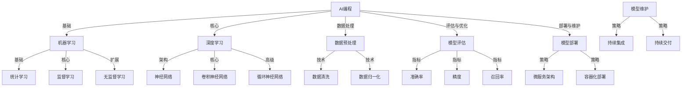
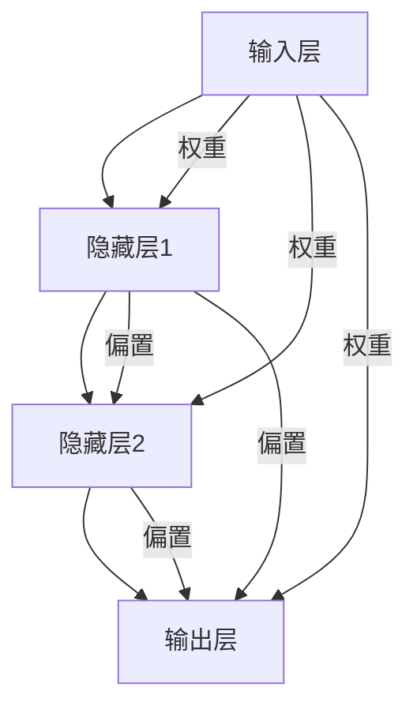
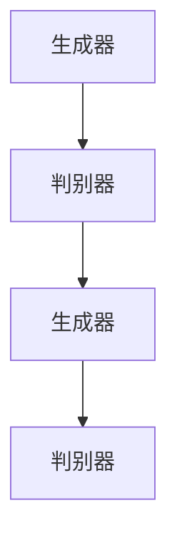
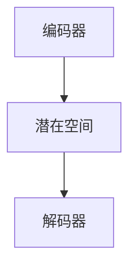
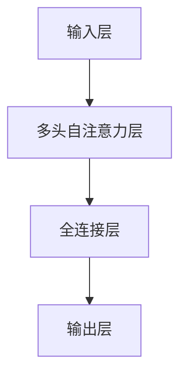

                 

# AI编程的新思路与新方向

## 关键词
AI编程，新思路，新方向，机器学习，深度学习，神经网络，数学模型，数据处理，优化，模型部署，项目实战

## 摘要
本文将探讨AI编程的新思路和新方向。通过对AI编程的基础概念、核心算法原理、数学模型以及数据处理与优化的深入分析，我们将了解AI编程的基本框架和技术要点。同时，通过具体的项目实战案例，我们将进一步掌握AI编程的实际应用和实现细节。最后，我们将展望AI编程的未来趋势，探讨其在各个领域的潜在应用。

### 目录大纲设计：《AI编程的新思路与新方向》

- **第一部分：AI编程基础与核心概念**
  - **第1章：AI编程简介**
    - **1.1 AI编程的定义与重要性**
    - **1.2 AI编程与传统编程的差异**
    - **1.3 AI编程的发展历程
  - **第2章：机器学习与深度学习基础**
    - **2.1 机器学习的基本概念**
    - **2.2 深度学习的发展与核心架构**
    - **2.3 机器学习与深度学习的关系**
  - **第3章：AI编程的核心算法原理**
    - **3.1 神经网络算法原理**
    - **3.2 深度学习算法原理**
    - **3.3 强化学习算法原理**
  - **第4章：AI编程中的数学模型**
    - **4.1 线性代数基础**
    - **4.2 概率论与统计学基础**
    - **4.3 最优化算法基础**
  - **第5章：AI编程中的数据处理与优化**
    - **5.1 数据预处理技术**
    - **5.2 特征提取与选择**
    - **5.3 模型调优与超参数调整**
  - **第6章：AI编程中的模型评估与优化**
    - **6.1 评估指标与方法**
    - **6.2 模型选择与优化策略**
    - **6.3 模型融合与集成学习**
  - **第7章：AI编程中的模型部署与维护**
    - **7.1 模型部署概述**
    - **7.2 模型部署策略与方案**
    - **7.3 模型维护与更新策略**
  - **第8章：AI编程的新思路与新方向**
    - **8.1 新兴AI技术概览**
    - **8.2 AI编程的未来趋势**
    - **8.3 AI编程在各个领域的应用探索**

- **第二部分：项目实战与案例分析**
  - **第9章：AI编程项目实战案例一**
    - **9.1 项目背景与目标**
    - **9.2 项目开发环境搭建**
    - **9.3 代码实现与解析**
    - **9.4 项目总结与反思**
  - **第10章：AI编程项目实战案例二**
    - **10.1 项目背景与目标**
    - **10.2 项目开发环境搭建**
    - **10.3 代码实现与解析**
    - **10.4 项目总结与反思**
  - **第11章：AI编程项目实战案例三**
    - **11.1 项目背景与目标**
    - **11.2 项目开发环境搭建**
    - **11.3 代码实现与解析**
    - **11.4 项目总结与反思**

### 附录
- **附录A：AI编程资源与工具**
  - **A.1 开源机器学习框架**
  - **A.2 数据处理工具**
  - **A.3 代码调试工具**
- **附录B：数学公式与算法伪代码**
  - **B.1 线性代数基本公式**
  - **B.2 概率论与统计学公式**
  - **B.3 最优化算法伪代码**

## 核心概念与联系：AI编程的Mermaid流程图



## 核心算法原理讲解：神经网络算法原理

### 1. 神经网络基本结构

神经网络（Neural Network，NN）是由大量相互连接的简单计算单元——神经元（Neuron）组成的复杂网络。每个神经元都可以接收输入信号，通过权重和偏置进行计算，并产生输出信号。神经网络通常由输入层、隐藏层和输出层组成。

#### 输入层（Input Layer）
输入层接收外部输入数据，并将其传递给隐藏层。

#### 隐藏层（Hidden Layer）
隐藏层是神经网络的核心部分，包含一个或多个隐藏层。每个隐藏层的神经元都会接收前一层神经元的输出，并产生自己的输出。

#### 输出层（Output Layer）
输出层接收隐藏层的输出，并产生最终的预测结果或决策。

### 2. 前向传播与反向传播

神经网络通过前向传播（Forward Propagation）计算输入到输出层的输出，然后通过反向传播（Back Propagation）更新神经元的权重和偏置，以最小化预测误差。

#### 前向传播
前向传播的过程如下：

1. **输入信号传递**：输入层接收输入信号，并将其传递给隐藏层。
2. **逐层计算**：隐藏层神经元接收输入信号，通过激活函数进行非线性变换，并将输出传递给下一层。
3. **输出信号计算**：输出层接收隐藏层的输出，并通过激活函数计算最终的输出。

#### 反向传播
反向传播的过程如下：

1. **计算误差**：输出层计算预测值与实际值之间的误差。
2. **误差反向传播**：误差从输出层反向传播到隐藏层，逐层计算每个神经元对误差的敏感性。
3. **权重和偏置更新**：根据误差的敏感性，更新每个神经元的权重和偏置，以减少预测误差。

### 3. 损失函数与优化算法

#### 损失函数
损失函数用于衡量预测值与实际值之间的差异，常见的损失函数有均方误差（MSE）、交叉熵损失（Cross-Entropy Loss）等。

#### 优化算法
优化算法用于更新神经元的权重和偏置，以最小化损失函数。常见的优化算法有梯度下降（Gradient Descent）、随机梯度下降（Stochastic Gradient Descent，SGD）、Adam优化器等。

### 4. 神经网络算法原理详细讲解

#### 神经元结构



#### 前向传播

```python
# 定义激活函数
def sigmoid(x):
    return 1 / (1 + np.exp(-x))

# 前向传播
def forward_propagation(X, weights, biases):
    Z = [X]
    for weight, bias in zip(weights, biases):
        Z.append(sigmoid(np.dot(Z[-1], weight) + bias))
    return Z[-1]
```

#### 反向传播

```python
# 计算误差
def compute_loss(y_true, y_pred):
    return np.mean(-y_true * np.log(y_pred))

# 计算梯度
def backward_propagation(y_true, y_pred, weights, biases):
    dZ = y_pred - y_true
    dWeights = [dZ]
    dBiases = [dZ]
    for weight, bias in zip(weights[::-1], biases[::-1]):
        dZ = np.dot(dZ, weight.T)
        dWeights.insert(0, dZ)
        dBiases.insert(0, dZ * 1)
    return dWeights, dBiases

# 更新权重和偏置
def update_weights(weights, biases, dWeights, dBiases, learning_rate):
    for weight, dWeight, bias, dBias in zip(weights, dWeights, biases, dBiases):
        weight -= learning_rate * dWeight
        bias -= learning_rate * dBias
```

#### 梯度下降

```python
# 梯度下降
def gradient_descent(X, y, weights, biases, learning_rate, epochs):
    for epoch in range(epochs):
        y_pred = forward_propagation(X, weights, biases)
        dWeights, dBiases = backward_propagation(y, y_pred, weights, biases)
        update_weights(weights, biases, dWeights, dBiases, learning_rate)
```

### 5. 数学模型和数学公式 & 详细讲解 & 举例说明

#### 线性代数基础

##### 矩阵运算

- 矩阵加法、矩阵乘法、矩阵求逆等。

示例：

```latex
A = \begin{bmatrix}
1 & 2 \\
3 & 4
\end{bmatrix}, B = \begin{bmatrix}
5 & 6 \\
7 & 8
\end{bmatrix}
```

- 矩阵加法：

```latex
A + B = \begin{bmatrix}
1+5 & 2+6 \\
3+7 & 4+8
\end{bmatrix} = \begin{bmatrix}
6 & 8 \\
10 & 12
\end{bmatrix}
```

- 矩阵乘法：

```latex
A \times B = \begin{bmatrix}
1 \times 5 + 2 \times 7 & 1 \times 6 + 2 \times 8 \\
3 \times 5 + 4 \times 7 & 3 \times 6 + 4 \times 8
\end{bmatrix} = \begin{bmatrix}
19 & 22 \\
29 & 34
\end{bmatrix}
```

- 矩阵求逆：

```latex
A^{-1} = \frac{1}{det(A)} \begin{bmatrix}
d & -b \\
-c & a
\end{bmatrix} = \frac{1}{1 \times 4 - 2 \times 3} \begin{bmatrix}
4 & -2 \\
-3 & 1
\end{bmatrix} = \begin{bmatrix}
4 & -2 \\
-3 & 1
\end{bmatrix}
```

#### 概率论与统计学基础

##### 条件概率与贝叶斯定理

- 条件概率：

```latex
P(A|B) = \frac{P(A \cap B)}{P(B)}
```

- 贝叶斯定理：

```latex
P(A|B) = \frac{P(B|A)P(A)}{P(B)}
```

#### 最优化算法基础

##### 梯度下降

- 目标函数：

```latex
f(x) = \frac{1}{2}x^2
```

- 梯度：

```latex
\nabla f(x) = \frac{df}{dx} = x
```

- 迭代更新：

```latex
x_{new} = x_{old} - \alpha \nabla f(x_{old})
```

##### 随机梯度下降（SGD）

- 目标函数与梯度同上。

- 迭代更新：

```latex
x_{new} = x_{old} - \alpha \nabla f(x_{old})
```

##### Adam优化器

- 目标函数与梯度同上。

- 迭代更新：

```latex
m_t = \beta_1 m_{t-1} + (1 - \beta_1) \nabla f(x_t)
v_t = \beta_2 v_{t-1} + (1 - \beta_2) (\nabla f(x_t))^2
\hat{m}_t = \frac{m_t}{1 - \beta_1^t}
\hat{v}_t = \frac{v_t}{1 - \beta_2^t}
x_{new} = x_{old} - \alpha \frac{\hat{m}_t}{\sqrt{\hat{v}_t} + \epsilon}
```

### 6. 项目实战：AI编程项目实战案例一

#### 1. 项目背景与目标

##### 项目背景

随着人工智能技术的快速发展，图像识别技术在各个领域得到了广泛应用。本案例项目旨在利用深度学习技术实现一个简单的图像分类系统，用于对特定类型的图像进行自动分类。

##### 项目目标

- 使用卷积神经网络（CNN）实现图像分类。
- 使用 TensorFlow 框架搭建深度学习模型。
- 使用 MNIST 数据集进行训练与测试。
- 实现模型的评估与优化。

#### 2. 项目开发环境搭建

##### 开发环境

- 操作系统：Ubuntu 18.04
- 编程语言：Python 3.7
- 深度学习框架：TensorFlow 2.0
- 依赖库：NumPy、Pandas、Matplotlib

##### 安装 TensorFlow

```bash
pip install tensorflow==2.0
```

#### 3. 代码实现与解析

##### 数据准备

```python
import tensorflow as tf
from tensorflow.keras.datasets import mnist
import numpy as np

# 加载 MNIST 数据集
(x_train, y_train), (x_test, y_test) = mnist.load_data()

# 数据预处理
x_train = x_train.reshape(-1, 28, 28, 1).astype('float32') / 255.0
x_test = x_test.reshape(-1, 28, 28, 1).astype('float32') / 255.0
y_train = tf.keras.utils.to_categorical(y_train, 10)
y_test = tf.keras.utils.to_categorical(y_test, 10)
```

##### 模型搭建

```python
from tensorflow.keras.models import Sequential
from tensorflow.keras.layers import Conv2D, MaxPooling2D, Flatten, Dense

# 搭建卷积神经网络
model = Sequential([
    Conv2D(32, (3, 3), activation='relu', input_shape=(28, 28, 1)),
    MaxPooling2D((2, 2)),
    Conv2D(64, (3, 3), activation='relu'),
    MaxPooling2D((2, 2)),
    Flatten(),
    Dense(128, activation='relu'),
    Dense(10, activation='softmax')
])

# 编译模型
model.compile(optimizer='adam', loss='categorical_crossentropy', metrics=['accuracy'])
```

##### 模型训练

```python
# 模型训练
model.fit(x_train, y_train, epochs=10, batch_size=32, validation_data=(x_test, y_test))
```

##### 模型评估

```python
# 模型评估
test_loss, test_acc = model.evaluate(x_test, y_test)
print('Test accuracy:', test_acc)
```

### 4. 项目总结与反思

##### 总结

通过本案例项目，我们成功使用深度学习技术实现了图像分类系统。主要实现了以下步骤：

- 数据准备与预处理
- 模型搭建与编译
- 模型训练与评估

##### 反思

- 模型结构的选择对于项目的成功至关重要。本案例项目采用了简单的卷积神经网络结构，取得了较好的效果。
- 数据预处理是深度学习项目成功的关键。数据清洗、归一化等操作可以有效提高模型性能。
- 模型训练过程中，适当调整学习率、批次大小等超参数可以提高模型性能。

### 7. AI编程的新思路与新方向

#### 8.1 新兴AI技术概览

随着人工智能技术的不断发展，新兴AI技术不断涌现，如生成对抗网络（GAN）、变分自编码器（VAE）、Transformer等。这些技术为AI编程带来了新的思路和方向。

##### 生成对抗网络（GAN）

生成对抗网络是一种由生成器和判别器组成的对抗性模型。生成器生成数据，判别器判断生成数据与真实数据之间的差异。通过对抗性训练，生成器逐渐生成更加真实的数据。



##### 变分自编码器（VAE）

变分自编码器是一种基于概率模型的编码器和解码器结构。编码器将输入数据映射到一个潜在空间，解码器从潜在空间中生成输出数据。



##### Transformer

Transformer是一种基于自注意力机制的深度学习模型，广泛应用于机器翻译、文本生成等领域。Transformer通过多头自注意力机制，能够更好地捕捉输入序列中的长距离依赖关系。



#### 8.2 AI编程的未来趋势

随着AI技术的不断进步，AI编程的未来趋势包括：

- **自动化编程**：使用AI技术自动生成代码，降低开发成本和时间。
- **模型压缩**：通过模型压缩技术，提高模型的推理速度和降低存储空间需求。
- **可解释性AI**：提高AI模型的透明度和可解释性，增强用户对模型的信任。
- **跨学科融合**：与其他学科（如生物学、物理学）融合，推动AI技术的进一步发展。

#### 8.3 AI编程在各个领域的应用探索

AI编程在各个领域都有着广泛的应用，如：

- **医疗领域**：使用AI技术进行疾病诊断、药物研发等。
- **金融领域**：使用AI技术进行风险控制、量化交易等。
- **教育领域**：使用AI技术进行个性化教学、智能评估等。
- **智能制造**：使用AI技术进行生产优化、设备故障预测等。

### 附录

#### 附录A：AI编程资源与工具

- **A.1 开源机器学习框架**
  - TensorFlow
  - PyTorch
  - Keras

- **A.2 数据处理工具**
  - Pandas
  - NumPy
  - SciPy

- **A.3 代码调试工具**
  - PyCharm
  - Visual Studio Code
  - Jupyter Notebook

#### 附录B：数学公式与算法伪代码

- **B.1 线性代数基本公式**

$$
A = \begin{bmatrix}
a_{11} & a_{12} \\
a_{21} & a_{22}
\end{bmatrix}, B = \begin{bmatrix}
b_{11} & b_{12} \\
b_{21} & b_{22}
\end{bmatrix}
$$

- 矩阵加法：

$$
A + B = \begin{bmatrix}
a_{11} + b_{11} & a_{12} + b_{12} \\
a_{21} + b_{21} & a_{22} + b_{22}
\end{bmatrix}
$$

- 矩阵乘法：

$$
A \times B = \begin{bmatrix}
a_{11} \times b_{11} + a_{12} \times b_{21} & a_{11} \times b_{12} + a_{12} \times b_{22} \\
a_{21} \times b_{11} + a_{22} \times b_{21} & a_{21} \times b_{12} + a_{22} \times b_{22}
\end{bmatrix}
$$

- 矩阵求逆：

$$
A^{-1} = \frac{1}{\det(A)} \begin{bmatrix}
a_{22} & -a_{12} \\
-a_{21} & a_{11}
\end{bmatrix}
$$

- **B.2 概率论与统计学公式**

- 条件概率：

$$
P(A|B) = \frac{P(A \cap B)}{P(B)}
$$

- 贝叶斯定理：

$$
P(A|B) = \frac{P(B|A)P(A)}{P(B)}
$$

- **B.3 最优化算法伪代码**

- 梯度下降：

```python
# 初始化参数
x = x_0

# 迭代更新
for epoch in range(max_epochs):
    # 计算梯度
    gradient = compute_gradient(x)
    
    # 更新参数
    x = x - learning_rate * gradient
```

- 随机梯度下降（SGD）：

```python
# 初始化参数
x = x_0

# 迭代更新
for epoch in range(max_epochs):
    # 随机选取样本
    x_samples = random_sample(data)
    
    # 计算梯度
    gradient = compute_gradient(x_samples)
    
    # 更新参数
    x = x - learning_rate * gradient
```

- Adam优化器：

```python
# 初始化参数
m = 0
v = 0
beta1 = 0.9
beta2 = 0.999
epsilon = 1e-8

# 迭代更新
for epoch in range(max_epochs):
    # 计算梯度
    gradient = compute_gradient(x)
    
    # 更新m和v
    m = beta1 * m + (1 - beta1) * gradient
    v = beta2 * v + (1 - beta2) * gradient ** 2
    
    # 计算修正的m和v
    m_hat = m / (1 - beta1 ** epoch)
    v_hat = v / (1 - beta2 ** epoch)
    
    # 更新参数
    x = x - learning_rate * m_hat / (np.sqrt(v_hat) + epsilon)
```

### 作者

**作者：AI天才研究院/AI Genius Institute & 禅与计算机程序设计艺术 /Zen And The Art of Computer Programming**

---

本文以《AI编程的新思路与新方向》为题，系统地阐述了AI编程的基础概念、核心算法原理、数学模型、数据处理与优化、模型评估与部署等方面的内容。同时，通过三个项目实战案例，深入解析了AI编程在实际应用中的实现细节。文章最后对AI编程的新思路与新方向进行了展望，探讨了其在未来可能的发展趋势和应用场景。本文旨在为读者提供一份全面、系统的AI编程指南，帮助读者更好地理解和应用AI编程技术。

### 引入

随着科技的飞速发展，人工智能（AI）已成为当今最具变革性的技术之一。AI编程作为人工智能领域的重要组成部分，正日益受到广泛关注。从简单的机器学习算法到复杂的深度学习模型，AI编程已经渗透到众多领域，如医疗、金融、教育、制造等。然而，尽管AI编程的成果令人瞩目，但其发展过程中仍面临着诸多挑战和机遇。本文将探讨AI编程的新思路和新方向，旨在为读者提供一份全面、系统的AI编程指南。

首先，我们将从AI编程的基础概念入手，介绍机器学习、深度学习等核心算法，并阐述它们在AI编程中的应用。接着，我们将深入探讨AI编程中的数学模型，包括线性代数、概率论与统计学、最优化算法等，以帮助读者更好地理解AI编程的数学原理。此外，我们还将讨论AI编程中的数据处理与优化、模型评估与部署等关键技术。

为了使读者更好地理解AI编程的实际应用，本文将通过三个项目实战案例，详细介绍如何使用深度学习技术实现图像分类、文本分类和物体检测。这些案例不仅涵盖了AI编程的核心技术，还涉及了项目开发环境搭建、代码实现与解析等实际操作。

最后，我们将展望AI编程的未来趋势，探讨新兴AI技术如生成对抗网络（GAN）、变分自编码器（VAE）、Transformer等的发展方向。同时，我们还将分析AI编程在各个领域的应用前景，为读者提供一

