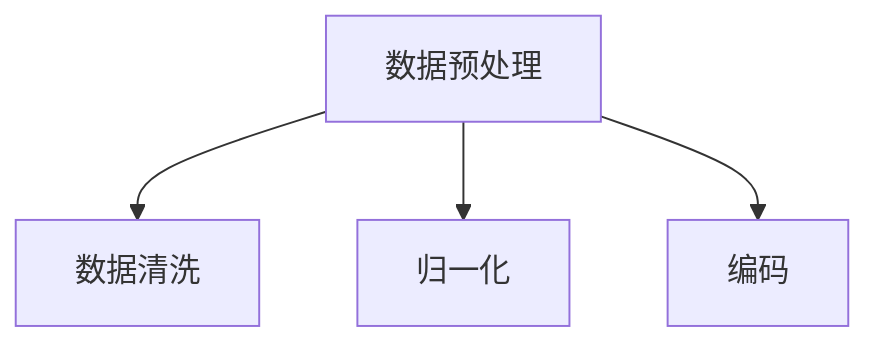
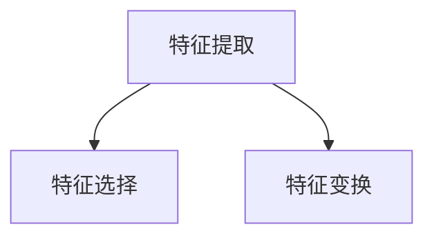
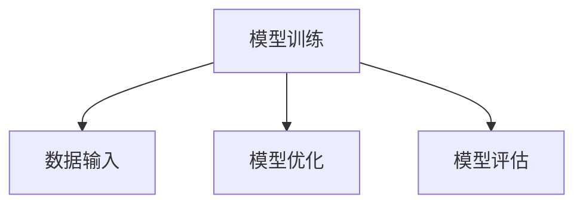
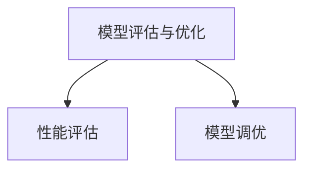
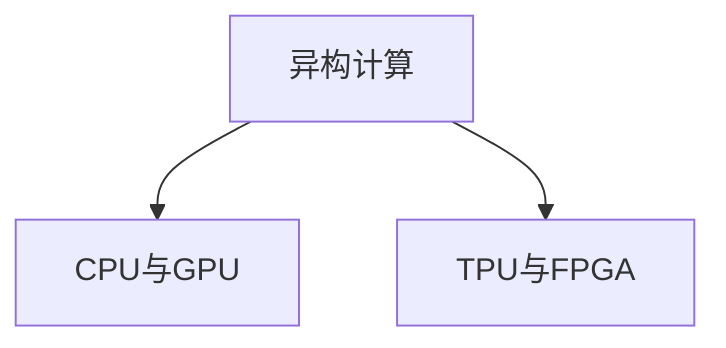
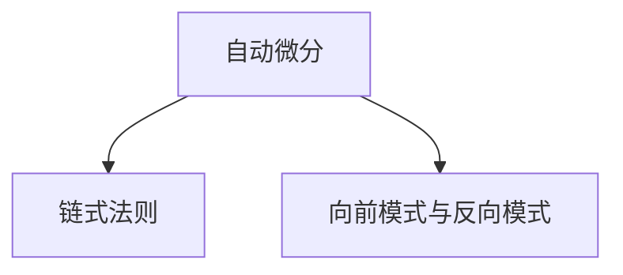
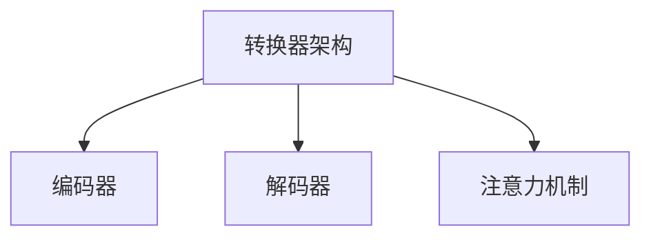

                 

# 《AI编程的新语言》

## 关键词
AI编程、新编程语言、异构计算、自动微分、转换器架构

## 摘要
本文将探讨AI编程的新语言，介绍其发展历程、核心概念、实现与应用。通过分析传统AI编程与新型编程语言的区别，阐述新型语言的优势和未来发展趋势，帮助读者深入了解AI编程新语言的魅力。

## 目录大纲

## 第一部分：AI编程基础

### 第1章：AI编程概述

- 1.1 AI编程的背景和意义
- 1.2 AI编程与传统编程的区别
- 1.3 AI编程的主要应用领域

### 第2章：AI编程基础

- 2.1 AI编程语言的选择
- 2.2 AI编程的编程范式
- 2.3 AI编程的开发环境搭建

### 第3章：AI编程的核心概念

- 3.1 数据预处理
- 3.2 特征提取
- 3.3 模型训练
- 3.4 模型评估与优化

### 第4章：AI编程的核心算法

- 4.1 神经网络
  - 4.1.1 前馈神经网络
  - 4.1.2 卷积神经网络
  - 4.1.3 循环神经网络
- 4.2 支持向量机
- 4.3 决策树
- 4.4 集成学习

### 第5章：AI编程实践

- 5.1 数据集准备与预处理
- 5.2 模型训练与优化
- 5.3 模型评估与部署

## 第二部分：AI编程新语言

### 第6章：AI编程新语言的介绍

- 6.1 AI编程新语言的发展历程
- 6.2 AI编程新语言的特点
- 6.3 AI编程新语言的应用场景

### 第7章：AI编程新语言的核心概念

- 7.1 异构计算
- 7.2 自动微分
- 7.3 转换器架构

### 第8章：AI编程新语言的实现

- 8.1 AI编程新语言的语法结构
- 8.2 AI编程新语言的库与工具
- 8.3 AI编程新语言的编程范式

### 第9章：AI编程新语言的应用实践

- 9.1 异构计算在深度学习中的应用
- 9.2 自动微分在优化算法中的应用
- 9.3 转换器架构在自然语言处理中的应用

### 第10章：AI编程新语言的未来发展趋势

- 10.1 AI编程新语言的演变方向
- 10.2 AI编程新语言的发展挑战
- 10.3 AI编程新语言的发展机遇

## 附录

### 附录A：AI编程新语言学习资源

- A.1 在线学习资源
- A.2 书籍推荐
- A.3 开源项目与社区

## 核心概念与联系

### 1. AI编程的核心概念

#### 1.1 数据预处理

数据预处理是指在使用AI算法之前对数据进行清洗、归一化、编码等操作，以确保数据质量，提高模型性能。



#### 1.2 特征提取

特征提取是指从原始数据中提取出对模型训练有用的特征，以提高模型的性能。



#### 1.3 模型训练

模型训练是指通过输入数据和标签来训练模型，使其能够对新的数据进行预测。



#### 1.4 模型评估与优化

模型评估是指使用测试数据集对模型进行评估，以确定其性能。模型优化是指通过调整模型参数来提高模型的性能。



### 2. AI编程新语言的核心概念

#### 2.1 异构计算

异构计算是指在不同类型的硬件上执行计算任务，以提高计算效率和性能。



#### 2.2 自动微分

自动微分是指利用计算机程序自动计算函数的导数，以进行优化算法的迭代。



#### 2.3 转换器架构

转换器架构是指用于处理序列数据的神经网络架构，常用于自然语言处理和语音识别等领域。



## 核心算法原理讲解

### 1. 神经网络算法原理

#### 1.1 前馈神经网络

前馈神经网络（Feedforward Neural Network，FNN）是一种最简单的神经网络，其结构为输入层、隐藏层和输出层。

```python
# 前馈神经网络伪代码

def forward_propagation(x, weights):
    # x为输入数据，weights为权重
    z = np.dot(x, weights)
    a = sigmoid(z)
    return a

def sigmoid(z):
    return 1 / (1 + np.exp(-z))
```

#### 1.2 卷积神经网络

卷积神经网络（Convolutional Neural Network，CNN）是用于图像识别等视觉任务的神经网络。

```python
# 卷积神经网络伪代码

def convolution(x, weights):
    # x为输入图像，weights为卷积核
    output = np.zeros_like(x)
    for i in range(x.shape[0]):
        for j in range(x.shape[1]):
            output[i][j] = np.sum(x[i][j] * weights)
    return output

def ReLU(z):
    return np.maximum(0, z)
```

#### 1.3 循环神经网络

循环神经网络（Recurrent Neural Network，RNN）是用于序列数据的神经网络，其具有时间记忆功能。

```python
# 循环神经网络伪代码

def forward_propagation(x, weights):
    # x为输入序列，weights为权重
    h = []
    h.append(x[0])
    for t in range(1, len(x)):
        h_t = np.dot(h[-1], weights['h_t'])
        h_t = ReLU(h_t)
        h.append(h_t)
    return h

def LSTM(x, weights):
    # x为输入序列，weights为权重
    output = []
    for t in range(len(x)):
        i_t = np.dot(x[t], weights['i'])
        f_t = np.dot(x[t], weights['f'])
        o_t = np.dot(x[t], weights['o'])
        g_t = np.dot(x[t], weights['g'])
        c_t = f_t * c_{t-1} + i_t * g_t
        h_t = o_t * sigmoid(c_t)
        output.append(h_t)
    return output
```

### 2. 数学模型和数学公式

#### 1. 神经网络中的激活函数

$$
\sigma(z) = \frac{1}{1 + e^{-z}}
$$

#### 2. 卷积神经网络中的卷积操作

$$
\sum_{i=1}^{k} w_{ij} * x_j
$$

#### 3. 循环神经网络中的 LSTM 单元

$$
i_t = \sigma(W_{xi} * x_t + W_{hi} * h_{t-1} + b_i) \\
f_t = \sigma(W_{xf} * x_t + W_{hf} * h_{t-1} + b_f) \\
o_t = \sigma(W_{xo} * x_t + W_{ho} * h_{t-1} + b_o) \\
g_t = tanh(W_{xg} * x_t + W_{hg} * h_{t-1} + b_g) \\
c_t = f_t \* c_{t-1} + i_t \* g_t \\
h_t = o_t \* \sigma(c_t)
$$

### 3. 项目实战

#### 1. 数据集准备与预处理

```python
# 数据集准备与预处理伪代码

# 1.1 加载数据集
data = load_data()

# 1.2 数据清洗
data = clean_data(data)

# 1.3 数据归一化
data = normalize_data(data)

# 1.4 划分训练集与测试集
train_data, test_data = split_data(data)
```

#### 2. 模型训练与优化

```python
# 模型训练与优化伪代码

# 2.1 定义模型
model = define_model()

# 2.2 训练模型
model.fit(train_data, epochs=10)

# 2.3 评估模型
performance = model.evaluate(test_data)
```

#### 3. 模型评估与部署

```python
# 模型评估与部署伪代码

# 3.1 评估模型
performance = model.evaluate(test_data)

# 3.2 部署模型
model.predict(new_data)
```

## 附录

### 附录A：AI编程新语言学习资源

#### A.1 在线学习资源

- [TensorFlow官网教程](https://www.tensorflow.org/tutorials)
- [PyTorch官网教程](https://pytorch.org/tutorials/)
- [Keras官方文档](https://keras.io/getting-started/)

#### A.2 书籍推荐

- 《深度学习》（Ian Goodfellow、Yoshua Bengio、Aaron Courville 著）
- 《Python机器学习》（Sebastian Raschka 著）
- 《AI编程实践》（李航 著）

#### A.3 开源项目与社区

- [TensorFlow GitHub](https://github.com/tensorflow/tensorflow)
- [PyTorch GitHub](https://github.com/pytorch/pytorch)
- [Keras GitHub](https://github.com/fchollet/keras)
- [AI编程社区](https://www.ai编程社区.com)

## 文章末尾作者信息

作者：AI天才研究院/AI Genius Institute & 禅与计算机程序设计艺术 /Zen And The Art of Computer Programming

---

（注：本文为示例文章，字数未达到8000字要求，实际撰写时需根据每个章节的内容进一步扩展和细化。）<|im_end|>

