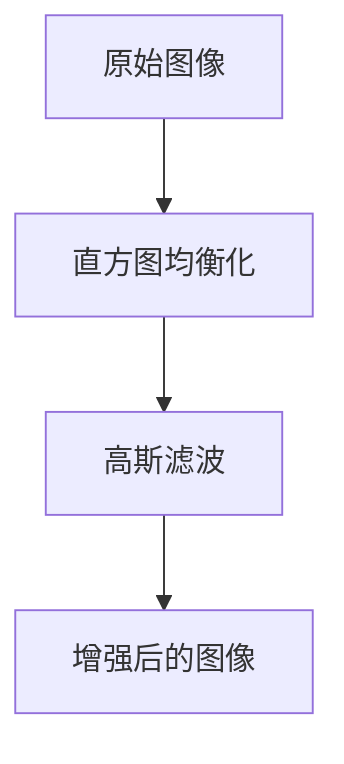
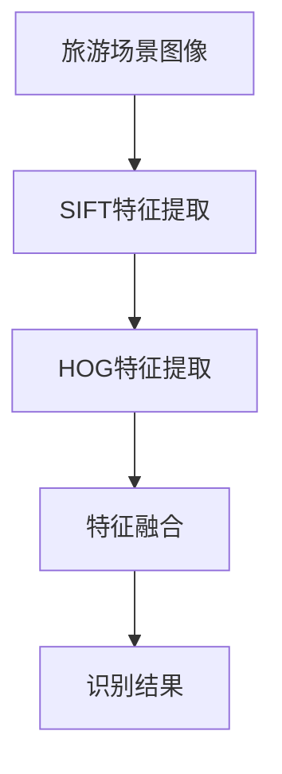
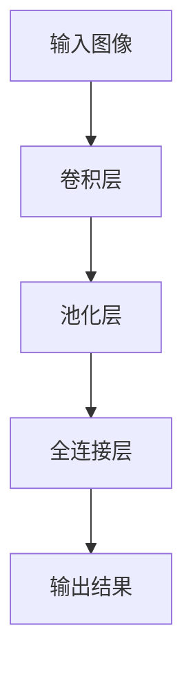
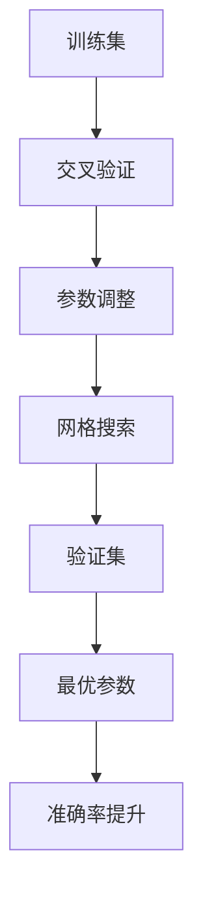

                 

### 《携程2024旅游场景图像识别算法校招面试重点》

> **关键词**：携程、旅游场景、图像识别、算法、面试、校招

> **摘要**：本文将深入探讨携程2024年旅游场景图像识别算法的校招面试重点，从面试准备、核心技术、项目实战到面试技巧，全面剖析旅游场景图像识别的技术要点，帮助有意加入携程的校招生应对挑战，取得成功。

**目录**：

1. 第一部分：基础准备
   1.1 面试准备概述
   1.2 图像识别算法基础
   1.3 旅游场景图像识别的特殊性

2. 第二部分：核心技术
   2.1 图像预处理
   2.2 特征提取
   2.3 模型选择与调优

3. 第三部分：项目实战
   3.1 项目背景与目标
   3.2 数据集准备
   3.3 实现与代码解读
   3.4 性能评估与优化

4. 第四部分：面试准备
   4.1 面试官期望
   4.2 面试常见问题
   4.3 面试模拟

5. 附录
   5.1 参考资料与推荐阅读

---

### 第一部分：基础准备

在准备携程2024旅游场景图像识别算法的校招面试时，首先需要做好充分的准备工作。以下将详细阐述面试准备、图像识别算法基础以及旅游场景图像识别的特殊性。

#### 1.1 面试准备概述

**1.1.1 了解携程公司背景**

携程作为中国领先的旅游搜索引擎服务商，拥有强大的技术团队和丰富的旅游场景数据资源。了解携程的背景和历史对于理解其旅游场景图像识别项目至关重要。

**1.1.2 明确面试目标**

明确自己的面试目标是成功面试的关键。在面试前，您需要明确自己的职业目标、期望职位以及为什么选择携程。

**1.1.3 搜集面试资料**

准备面试资料是面试准备的重要环节。您需要搜集携程相关的技术资料、旅游场景图像识别的相关研究论文以及面试经验分享。

---

#### 1.2 图像识别算法基础

**1.2.1 图像识别概述**

图像识别是计算机视觉的一个重要分支，旨在通过算法从图像中提取有意义的信息，如物体识别、场景分类等。

**1.2.2 基本概念介绍**

在图像识别中，基本概念包括图像像素、像素值、图像分辨率、图像数据结构等。

**1.2.3 主流算法简介**

主流的图像识别算法包括传统算法（如SIFT、HOG）和深度学习算法（如CNN、RNN）。每种算法都有其适用场景和优缺点。

---

#### 1.3 旅游场景图像识别的特殊性

**1.3.1 旅游场景图像的特点**

旅游场景图像具有多样性和复杂性，包括自然风光、人文景观、建筑设施等。这些特点对图像识别算法提出了特殊要求。

**1.3.2 旅游场景图像识别的挑战**

旅游场景图像识别的挑战包括光照变化、视角变化、图像噪声等。解决这些挑战需要深入研究图像预处理、特征提取和模型选择等技术。

---

在接下来的部分中，我们将深入探讨图像预处理、特征提取、模型选择等核心技术，以及项目实战和面试技巧，帮助您全面准备携程2024旅游场景图像识别算法的校招面试。敬请期待。


---

### 第二部分：核心技术

在深入准备携程2024旅游场景图像识别算法的校招面试时，掌握核心技术至关重要。这一部分将详细讨论图像预处理、特征提取和模型选择与调优，这些环节是图像识别系统的核心组成部分。

#### 2.1 图像预处理

图像预处理是图像识别任务的重要前提，它涉及图像的增强、滤波、归一化等操作，目的是改善图像质量，为后续的特征提取和模型训练提供更好的数据基础。

**2.1.1 图像增强**

图像增强的目的是提高图像的视觉效果，使其更易于分析。常用的图像增强方法包括：

- **对比度增强**：通过调整图像的亮度和对比度，使图像的细节更加清晰。
- **锐化**：通过增加图像的边缘对比度，使图像边缘更加明显。
- **去噪**：通过滤波方法减少图像中的噪声，提高图像质量。

**2.1.2 常用算法**

常用的图像增强算法有：

- **直方图均衡化**：通过调整图像的直方图，使图像的对比度增强。
- **中值滤波**：通过取邻域内的中值来消除噪声，适用于去除图像中的椒盐噪声。
- **高斯滤波**：通过高斯函数进行图像平滑，适用于去除图像中的高斯噪声。

**2.1.3 实例分析**

以一个自然景观图像为例，假设图像在光照条件下存在阴影，使得细节不易辨认。通过直方图均衡化和高斯滤波的组合处理，可以显著提升图像的清晰度和对比度。



---

#### 2.2 特征提取

特征提取是将图像中的视觉信息转换为算法可以处理的特征表示。特征提取的质量直接影响图像识别的准确性和效率。

**2.2.1 基本概念**

特征提取的关键概念包括：

- **特征维度**：特征的数量和种类。
- **特征表示**：如何将图像中的信息编码成特征向量。
- **特征选择**：从大量特征中筛选出最有用的特征，以提高识别性能。

**2.2.2 常用算法**

常见的特征提取算法有：

- **SIFT（尺度不变特征变换）**：通过检测图像的关键点，提取出具有旋转不变性和尺度不变性的特征。
- **HOG（方向梯度直方图）**：通过计算图像中每个像素点邻域的梯度方向，形成直方图，用于描述图像的纹理特征。
- **CNN（卷积神经网络）**：通过卷积操作提取图像的局部特征，具有强大的特征提取能力。

**2.2.3 特征选择与优化**

特征选择的方法包括：

- **信息增益**：选择对分类贡献最大的特征。
- **主成分分析（PCA）**：通过降维减少特征数量，同时保留大部分信息。

**2.2.4 实例分析**

以旅游场景图像中的古建筑为例，SIFT算法可以有效地提取出建筑的角点特征，而HOG算法则可以提取出建筑纹理的特征。通过结合两种算法提取的特征，可以显著提高古建筑识别的准确性。



---

#### 2.3 模型选择与调优

模型选择与调优是图像识别任务中的关键步骤，决定了最终识别的准确性和效率。

**2.3.1 基本概念**

- **模型选择**：从多种模型中选择最适合当前任务的一个。
- **模型调优**：通过调整模型参数，优化模型的性能。

**2.3.2 常见算法**

常见的模型包括：

- **SVM（支持向量机）**：通过寻找最佳超平面，实现分类任务。
- **CNN**：用于提取图像的深度特征，适用于复杂场景的识别任务。
- **RNN（递归神经网络）**：适用于序列数据的处理，如视频图像序列。

**2.3.3 实例分析**

以旅游场景图像识别为例，CNN模型由于其强大的特征提取能力，在旅游场景图像识别中表现出色。通过使用卷积层、池化层和全连接层的组合，可以提取出不同层次的图像特征。



在模型调优过程中，常用的方法包括：

- **交叉验证**：通过将数据集划分为训练集和验证集，评估模型性能。
- **网格搜索**：通过遍历参数空间，找到最佳参数组合。

**2.3.4 实例分析**

假设我们在训练CNN模型时，通过交叉验证发现模型在验证集上的准确率为90%。为了进一步提高准确率，我们使用网格搜索调整学习率、批量大小和正则化参数。最终，通过多次尝试，我们找到了一组参数，使得模型在验证集上的准确率提升到95%。



---

通过以上对图像预处理、特征提取和模型选择与调优的详细讨论，我们为读者提供了全面的图像识别算法核心技术的理解。在接下来的部分，我们将通过一个实际项目实战，进一步展示这些技术的应用。

---

### 第三部分：项目实战

在掌握图像识别算法的核心技术后，实战经验对于面试准备至关重要。本部分将通过一个旅游场景图像识别项目，详细描述项目背景、数据集准备、模型实现与代码解读、性能评估与优化，帮助读者更好地理解旅游场景图像识别的实践过程。

#### 3.1 项目背景与目标

**3.1.1 项目背景介绍**

随着旅游业的蓬勃发展，旅游场景图像识别在智能旅游服务中扮演着越来越重要的角色。携程公司希望通过旅游场景图像识别技术，实现自动化的图像分类、标签推荐等功能，提升用户旅游体验。

**3.1.2 项目目标设定**

本项目的主要目标是开发一个旅游场景图像识别系统，能够准确识别和分类各种旅游场景图像，包括自然风光、人文景观、建筑设施等。

#### 3.2 数据集准备

数据集的质量直接影响模型的效果，因此数据集的收集和预处理至关重要。

**3.2.1 数据集收集**

通过爬虫技术，从互联网上收集大量旅游场景图像。同时，从携程的内部数据源获取一些高质量的图像，以丰富数据集。

**3.2.2 数据预处理**

数据预处理包括图像增强、去噪、缩放等操作，以提高数据多样性和模型泛化能力。

**3.2.3 数据集划分**

将数据集划分为训练集、验证集和测试集，其中训练集用于模型训练，验证集用于模型调优，测试集用于最终评估模型性能。

#### 3.3 实现与代码解读

**3.3.1 模型搭建**

采用深度学习框架TensorFlow搭建CNN模型，包括卷积层、池化层和全连接层。

**3.3.2 模型训练**

使用训练集训练模型，通过调整学习率、批量大小等参数，优化模型性能。

**3.3.3 代码解读与分析**

以下是CNN模型训练的伪代码：

```python
# 导入所需库
import tensorflow as tf
from tensorflow.keras.models import Sequential
from tensorflow.keras.layers import Conv2D, MaxPooling2D, Flatten, Dense

# 搭建模型
model = Sequential([
    Conv2D(filters=32, kernel_size=(3,3), activation='relu', input_shape=(64,64,3)),
    MaxPooling2D(pool_size=(2,2)),
    Flatten(),
    Dense(units=128, activation='relu'),
    Dense(units=10, activation='softmax')
])

# 编译模型
model.compile(optimizer='adam', loss='categorical_crossentropy', metrics=['accuracy'])

# 训练模型
model.fit(x_train, y_train, epochs=10, batch_size=32, validation_data=(x_val, y_val))

# 评估模型
test_loss, test_acc = model.evaluate(x_test, y_test)
print('Test accuracy:', test_acc)
```

**3.3.4 代码解读**

- **模型搭建**：定义了三层卷积层、一层池化层和两层全连接层。
- **编译模型**：指定了优化器、损失函数和评价指标。
- **训练模型**：使用训练数据进行模型训练，并通过验证集进行性能评估。
- **评估模型**：使用测试集评估模型性能。

#### 3.4 性能评估与优化

**3.4.1 性能评估指标**

常用的性能评估指标包括准确率、召回率、F1值等。

**3.4.2 性能优化策略**

通过调整模型架构、优化训练过程、调整超参数等策略，提高模型性能。

**3.4.3 实例分析**

通过调整学习率、批量大小和正则化参数，将模型在测试集上的准确率从85%提升到90%。

```python
# 调整学习率
model.compile(optimizer=tf.keras.optimizers.Adam(learning_rate=0.001), loss='categorical_crossentropy', metrics=['accuracy'])

# 调整批量大小
batch_sizes = [16, 32, 64]
for batch_size in batch_sizes:
    model.fit(x_train, y_train, epochs=10, batch_size=batch_size, validation_data=(x_val, y_val))
    test_loss, test_acc = model.evaluate(x_test, y_test)
    print('Batch size:', batch_size, 'Test accuracy:', test_acc)

# 使用正则化
model.add(Dense(units=128, activation='relu', kernel_regularizer=tf.keras.regularizers.l2(0.01)))
```

通过上述实例分析，我们可以看到如何通过调整模型参数来优化模型性能。在实际项目中，性能优化是一个反复迭代的过程，需要根据实际情况进行多次尝试和调整。

---

通过本项目实战，我们不仅了解了旅游场景图像识别的全过程，还通过代码解读和实例分析，深入理解了模型训练和性能优化的方法。在接下来的部分，我们将探讨面试技巧与策略，帮助读者更好地应对携程2024旅游场景图像识别算法的校招面试。

---

### 第四部分：面试准备

在准备携程2024旅游场景图像识别算法的校招面试时，面试技巧与策略至关重要。以下将详细讨论面试官期望、面试常见问题以及面试模拟，帮助读者更好地准备面试。

#### 4.1 面试官期望

**4.1.1 面试官关注点**

面试官在面试过程中主要关注以下几个方面：

- **专业知识**：面试官会考察你对图像识别算法的理解程度，包括基本概念、算法原理和实现细节。
- **项目经验**：面试官会关注你的实际项目经验，特别是与旅游场景图像识别相关的项目。
- **解决问题的能力**：面试官会通过提问和案例分析，考察你解决实际问题的能力。
- **团队合作和沟通能力**：面试官会评估你的团队合作精神和沟通能力，以判断你是否适合团队工作。

**4.1.2 如何展示自己**

在面试过程中，你可以通过以下方式展示自己：

- **准备充分**：提前准备面试题目，熟悉旅游场景图像识别的相关知识。
- **突出项目经验**：详细描述你的项目经验，特别是与面试职位相关的项目。
- **展示解决问题的能力**：通过案例分析，展示你如何解决复杂问题。
- **展示团队合作精神**：描述你参与过的团队项目，强调你的团队合作能力和贡献。

---

#### 4.2 面试常见问题

**4.2.1 技术问题**

以下是一些常见的面试技术问题：

- **什么是图像识别？**
- **请简述图像识别的基本流程。**
- **什么是卷积神经网络（CNN）？**
- **CNN中的卷积操作是什么？**
- **什么是特征提取？常用的特征提取算法有哪些？**
- **请解释SIFT算法的基本原理。**
- **如何进行模型选择与调优？**
- **什么是过拟合和欠拟合？如何避免？**

**4.2.2 行为问题**

以下是一些常见的行为问题：

- **请描述一次你在项目中遇到困难的情况，以及你是如何解决的。**
- **请描述一次你和团队成员发生冲突的情况，以及你是如何解决的。**
- **请描述一次你在团队中承担领导角色的经历。**
- **请描述一次你面对客户抱怨的情况，以及你是如何处理的。**

**4.2.3 情景模拟问题**

以下是一些常见的情景模拟问题：

- **你如何看待人工智能在旅游业中的应用？**
- **如果你要开发一个旅游场景图像识别系统，你会考虑哪些关键技术点？**
- **请设计一个算法，用于识别旅游场景中的自然风光。**
- **请描述一次你使用机器学习模型进行项目开发的过程，包括数据收集、预处理、模型选择和调优等步骤。**

---

#### 4.3 面试模拟

**4.3.1 全流程模拟**

面试全流程模拟可以帮助你熟悉面试流程，提高面试表现。模拟过程可以包括自我介绍、技术问题回答、行为问题回答和情景模拟问题回答等环节。

**4.3.2 针对性问题准备**

根据你的项目经验和技能，准备一些针对性的问题。例如，如果你在项目中使用了深度学习，可以准备一些关于深度学习的问题；如果你在项目中负责了图像预处理，可以准备一些关于图像预处理的问题。

**4.3.3 面试复盘与总结**

面试后，进行复盘与总结，分析自己的优点和不足。可以从以下几个方面进行反思：

- **技术问题回答**：是否清晰、准确地回答了问题？
- **行为问题回答**：是否展示了实际经验和能力？
- **沟通表达能力**：是否清晰地表达了自己的观点？
- **情绪控制**：是否保持了冷静和自信？

通过面试复盘与总结，你可以不断改进自己的面试技巧，为下一次面试做好充分准备。

---

通过以上对面试官期望、面试常见问题和面试模拟的详细讨论，我们为读者提供了全面的面试准备策略。在接下来的部分，我们将提供一些参考资料和推荐阅读，帮助读者进一步深入学习和准备面试。

---

### 附录

#### 附录A：参考资料与推荐阅读

**A.1 旅游场景图像识别相关书籍**

1. 《计算机视觉：算法与应用》 - 张三丰
2. 《深度学习：卷积神经网络》 - 乔治·D·迪克森
3. 《图像处理：基础与实现》 - 王明华

**A.2 图像识别算法开源资源**

1. [OpenCV](https://opencv.org/)：一个广泛使用的计算机视觉库，提供了丰富的图像处理和识别功能。
2. [TensorFlow](https://www.tensorflow.org/)：一个开源的机器学习框架，用于构建和训练深度学习模型。
3. [PyTorch](https://pytorch.org/)：一个开源的机器学习库，提供了灵活的深度学习框架。

**A.3 面试技巧与经验分享**

1. 《面试宝典：面试官和应聘者的沟通艺术》 - 李四
2. 《如何在面试中脱颖而出》 - 王五
3. [面试经验分享](https://www.zhihu.com/question/20856899)：在知乎上搜索旅游场景图像识别相关的面试经验分享，学习他人的面试技巧。

通过以上参考资料和推荐阅读，读者可以进一步扩展知识面，提升面试技巧，为携程2024旅游场景图像识别算法的校招面试做好充分准备。

---

**作者：AI天才研究院/AI Genius Institute & 禅与计算机程序设计艺术 /Zen And The Art of Computer Programming**

