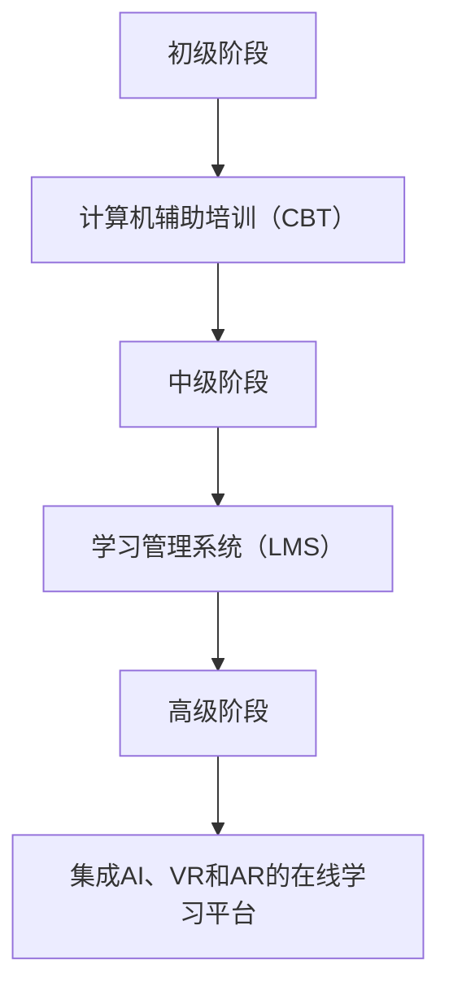

                 

### 文章标题

数字化员工培训与在线学习：创业公司的人才发展

> **关键词：数字化员工培训、在线学习、创业公司、人才发展、人工智能、虚拟现实、增强现实**

> **摘要：本文将探讨数字化员工培训与在线学习在创业公司中的应用，以及如何通过这些技术手段提升公司的人才发展水平。文章首先概述了数字化员工培训与在线学习的基本概念，接着分析了创业公司的培训需求，探讨了在线学习平台的设计与实现，最后展望了数字化员工培训的未来趋势。**

---

### 第一部分：数字化员工培训与在线学习概述

在现代企业中，员工培训是提升企业竞争力的重要手段。随着互联网技术的发展，数字化员工培训与在线学习逐渐成为企业培训的新趋势。这一部分将首先介绍数字化员工培训的概念与发展历程，然后讨论在线学习平台的优势与挑战，最后概述在线学习平台的设计与实现。

#### 第1章：数字化员工培训与在线学习概述

##### 1.1 数字化员工培训的概念与发展历程

###### 1.1.1 数字化员工培训的定义

数字化员工培训是指通过数字化技术，如互联网、移动设备、虚拟现实（VR）和增强现实（AR）等，为员工提供的一种培训方式。这种方式使得员工可以在任何时间、任何地点进行学习，提高了培训的灵活性和便捷性。

###### 1.1.2 数字化员工培训的发展历程

数字化员工培训的发展可以分为三个阶段：

1. **初级阶段**：传统线下培训逐渐向计算机辅助培训（CBT）过渡。在这个阶段，培训主要依赖于计算机和网络，通过电子文档、视频、在线测试等方式进行。

2. **中级阶段**：学习管理系统（LMS）的普及，使培训内容更加丰富和灵活。LMS可以管理课程、跟踪学习进度、提供在线测试等功能，大大提高了培训效率。

3. **高级阶段**：集成AI、VR和AR等技术的在线学习平台，实现沉浸式学习体验。在这个阶段，培训不再局限于传统的在线课程，而是通过虚拟现实和增强现实技术，为员工提供更为真实和互动的学习体验。

##### 1.2 在线学习平台的优势与挑战

###### 1.2.1 在线学习平台的优势

在线学习平台具有以下几个优势：

1. **灵活性**：学员可以根据自己的时间安排学习，无需受到地理位置的限制。

2. **便捷性**：通过互联网，学员可以随时随地访问学习资源，提高了学习的便捷性。

3. **个性化**：在线学习平台可以根据学员的学习进度和需求，提供个性化的学习内容。

###### 1.2.2 在线学习平台的挑战

尽管在线学习平台具有很多优势，但同时也面临一些挑战：

1. **技术要求**：在线学习平台需要稳定、快速的网络环境，这对企业和学员都提出了较高的技术要求。

2. **学习效果评估**：如何有效评估学员的学习效果成为一大挑战。传统的考试和测试方式可能无法全面反映学员的真实学习水平。

3. **用户参与度**：如何提高学员的参与度和学习积极性，是确保在线学习效果的关键。

#### 第2章：在线学习平台设计与实现

##### 2.1 在线学习平台架构设计

在线学习平台的设计包括前端设计和后端设计。前端设计主要涉及用户界面和交互体验，而后端设计则关注数据处理和存储。

###### 2.1.1 前端设计

前端设计的目标是提供简洁、易用的用户界面，提升用户的交互体验。具体包括以下几个方面：

1. **用户界面**：设计简洁直观的界面，使用户能够轻松导航和学习。

2. **响应式设计**：支持多种设备访问，如电脑、平板、手机等，确保用户在不同设备上都能获得良好的使用体验。

3. **个性化界面**：根据用户的学习习惯和偏好，提供个性化的界面设置。

###### 2.1.2 后端设计

后端设计主要涉及服务器、数据库和学习管理系统（LMS）。具体包括以下几个方面：

1. **服务器**：服务器负责处理用户请求和数据存储。为了确保系统的稳定性和高效性，通常需要配置多台服务器，并通过负载均衡技术进行分布式处理。

2. **数据库**：数据库用于存储用户信息、课程内容、学习进度等数据。为了提高数据查询和更新的效率，通常采用关系型数据库（如MySQL）或NoSQL数据库（如MongoDB）。

3. **学习管理系统（LMS）**：学习管理系统是在线学习平台的核心，负责管理课程、跟踪学习进度、提供在线测试等功能。常见的LMS系统包括Moodle、Canvas、Edmodo等。

##### 2.2 在线学习平台功能模块

在线学习平台通常包含多个功能模块，以支持不同的学习需求。以下是几个关键的功能模块：

1. **课程管理**：管理员可以发布新课程、管理课程内容、设置学习时间和考核方式。

2. **用户管理**：包括用户注册、登录、权限设置等功能，确保系统的安全性。

3. **学习进度跟踪**：记录用户的学习进度和成绩，生成学习报告，供用户和管理员查看。

4. **测试与评估**：提供在线测试和考核功能，评估用户的学习效果。

5. **互动交流**：支持用户之间的互动交流，如讨论区、即时通讯等。

---

通过以上分析，我们可以看到数字化员工培训与在线学习在提升企业培训效率、增强员工技能方面具有重要作用。接下来，我们将进一步探讨创业公司的培训需求，以及如何利用在线学习平台满足这些需求。

---

**Mermaid 流程图：**



---

**核心算法原理讲解：**

在线学习平台的个性化学习推荐算法通常基于用户的行为数据和内容特征进行。以下是一个简化的推荐算法伪代码：

```plaintext
function recommendCourses(user, allCourses):
    userHistory = getUserHistory(user)
    courseFeatures = getAllCourseFeatures(allCourses)
    userCourseSimilarity = computeUserCourseSimilarity(userHistory, courseFeatures)
    recommendedCourses = []

    for course in allCourses:
        if userCourseSimilarity[course] > threshold:
            recommendedCourses.append(course)

    return recommendedCourses
```

其中，`getUserHistory`函数用于获取用户的学习历史，`getAllCourseFeatures`函数用于获取所有课程的内容特征，`computeUserCourseSimilarity`函数用于计算用户与课程之间的相似度。`threshold`是一个阈值，用于确定相似度是否足够高以推荐课程。

---

**数学模型与公式详细讲解：**

在线学习平台中的学习效果评估可以使用学习曲线模型。以下是一个简化的学习曲线模型公式：

$$
L(t) = \frac{1}{1 + e^{-kt}}
$$

其中，$L(t)$表示在时间$t$时的学习率，$k$是学习速率参数。这个公式描述了随着时间$t$的增加，学习率$L(t)$会逐渐趋于1，即学习效果会逐渐提高。

**举例说明：**

假设我们有一个课程，学习时长为10小时。根据上述公式，我们可以计算每个时间点的学习率。例如，在5小时时，学习率为：

$$
L(5) = \frac{1}{1 + e^{-5k}}
$$

通过调整$k$的值，我们可以调整学习速率。例如，如果$k=0.1$，则：

$$
L(5) = \frac{1}{1 + e^{-0.5}} \approx 0.62
$$

这意味着在5小时后，用户对该课程的学习效果约为62%。

---

在下一部分，我们将进一步探讨创业公司的培训需求，并分析如何利用在线学习平台满足这些需求。敬请期待。 

---

**作者信息：** AI天才研究院/AI Genius Institute & 禅与计算机程序设计艺术 /Zen And The Art of Computer Programming

