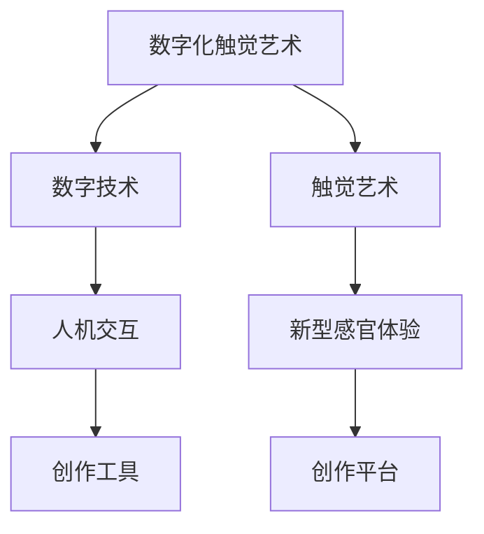

                 

# 《数字化触觉艺术创业：新型感官体验的创作平台》

## 关键词
数字化触觉艺术、新型感官体验、人机交互、创意创业、技术平台、触觉感知、反馈系统。

## 摘要
本文深入探讨了数字化触觉艺术的概念、原理及其在创业中的应用。通过分析数字化触觉艺术的起源与发展、新型感官体验的设计原则、创作工具和平台搭建，本文旨在为创业者提供一整套系统化的指导，帮助他们掌握数字化触觉艺术的创作与创业实践。文章还将通过实际案例，展示数字化触觉艺术在市场中的具体应用和前景。

## 目录大纲

### 第一部分：数字化触觉艺术概述

**第1章：数字化触觉艺术基础**  
- 1.1 数字化触觉艺术的起源与发展  
- 1.2 数字化触觉艺术的定义与特点  
- 1.3 数字化触觉艺术的应用领域

**第2章：新型感官体验原理**  
- 2.1 人机交互原理  
- 2.2 感知系统与触觉反馈系统  
- 2.3 新型感官体验的设计原则

**第3章：数字化触觉艺术创作工具**  
- 3.1 触觉艺术创作软件介绍  
- 3.2 触觉交互设备的种类与应用  
- 3.3 创作工具的选用与优化

### 第二部分：数字化触觉艺术创业实践

**第4章：数字化触觉艺术创业机会分析**  
- 4.1 市场需求与趋势  
- 4.2 创业机会的识别与评估  
- 4.3 创业模式与盈利方式

**第5章：数字化触觉艺术创业团队建设**  
- 5.1 团队角色与职责划分  
- 5.2 技术能力与市场能力的平衡  
- 5.3 团队协作与沟通

**第6章：数字化触觉艺术项目策划与实施**  
- 6.1 项目目标与规划  
- 6.2 创作流程与项目管理  
- 6.3 项目风险与应对策略

**第7章：数字化触觉艺术创业案例研究**  
- 7.1 案例一：触觉艺术装置设计  
- 7.2 案例二：触觉游戏开发  
- 7.3 案例三：触觉艺术展览策划

### 第三部分：数字化触觉艺术创作与平台搭建

**第8章：数字化触觉艺术创作流程**  
- 8.1 创作准备与素材收集  
- 8.2 创作思路与方案确定  
- 8.3 创作过程中的挑战与解决

**第9章：数字化触觉艺术平台搭建**  
- 9.1 平台架构设计  
- 9.2 软硬件环境配置与调试  
- 9.3 平台功能的实现与优化

**第10章：数字化触觉艺术平台的运营与推广**  
- 10.1 平台运营策略与规划  
- 10.2 推广渠道与方法  
- 10.3 用户反馈与持续改进

**附录：数字化触觉艺术相关资源与工具**  
- A.1 数字化触觉艺术相关书籍与论文  
- A.2 触觉艺术创作软件与工具  
- A.3 触觉交互设备与平台资源链接

## 核心概念与联系

### 数字化触觉艺术

数字化触觉艺术是一种新兴的艺术形式，它通过将数字技术与触觉艺术相结合，创造出一种全新的感官体验。这种艺术形式不仅依赖于视觉和听觉，更注重触觉的感知，通过数字化手段模拟或增强现实世界的触觉感受。

### 新型感官体验

新型感官体验是指通过数字化技术扩展或增强人类的感官感受，从而提供更加丰富和独特的互动体验。在数字化触觉艺术中，新型感官体验通过触觉反馈系统来实现，使得观众能够通过触摸感受到艺术作品的不同层次和细节。

### 人机交互

人机交互是数字化触觉艺术的核心原理之一。它涉及如何将人的触觉信号转换为机器可以理解和处理的信号，以及如何将机器生成的触觉反馈信号转换为人类可以感知的触觉感受。人机交互技术使得数字化触觉艺术能够与观众实现有效的互动。

### 创作工具

创作工具是数字化触觉艺术创作的重要载体。这些工具包括触觉艺术创作软件、触觉交互设备和各种编程语言，它们帮助艺术家和开发者构建出丰富多样的触觉艺术作品。

### 创作平台

创作平台是数字化触觉艺术创作的集成环境，它提供了一个完整的创作生态系统，包括创作工具、开发环境和发布平台。创作平台不仅提高了创作的效率，还使得数字化触觉艺术作品能够更广泛地传播和共享。

### Mermaid 流程图



## 核心算法原理讲解

### 触觉感知与反馈系统

在数字化触觉艺术中，触觉感知与反馈系统是实现新型感官体验的关键。触觉感知系统负责接收和处理触觉信号，而触觉反馈系统则负责生成和输出触觉反馈。

### 触觉感知模块

触觉感知模块的伪代码如下：

```python
# 触觉感知模块
def tactile_perception(data):
    # 对触觉信号进行预处理
    processed_data = preprocess_data(data)
    # 提取触觉特征
    features = extract_features(processed_data)
    # 分类触觉特征
    touch_type = classify_features(features)
    return touch_type
```

在这个模块中，`preprocess_data` 函数用于对原始触觉信号进行预处理，如滤波、去噪等，以确保信号的准确性和稳定性。`extract_features` 函数用于提取触觉信号中的关键特征，如频率、振幅等。`classify_features` 函数则根据提取的特征对触觉信号进行分类，以确定触觉类型。

### 触觉反馈模块

触觉反馈模块的伪代码如下：

```python
# 触觉反馈模块
def tactile_feedback(touch_type, feedback_params):
    # 根据触觉类型生成反馈信号
    feedback_signal = generate_signal(touch_type, feedback_params)
    # 输出反馈信号至触觉设备
    output_signal(feedback_signal)
```

在这个模块中，`generate_signal` 函数根据触觉类型和反馈参数生成相应的触觉反馈信号。`output_signal` 函数则将生成的反馈信号输出到触觉设备，如触觉手套、触觉鼠标等，从而实现触觉反馈。

### 触觉感知模型

触觉感知模型可以用以下数学公式表示：

$$
\text{感知质量} = f(\text{触觉信号}, \text{传感器参数})
$$

其中，`f` 表示感知质量的函数，`触觉信号` 是输入的触觉数据，`传感器参数` 是用于感知处理的参数。这个公式说明了感知质量是由触觉信号和传感器参数共同决定的。

### 触觉反馈模型

触觉反馈模型可以用以下数学公式表示：

$$
\text{反馈信号} = g(\text{触觉类型}, \text{反馈参数})
$$

其中，`g` 表示生成反馈信号的函数，`触觉类型` 是感知到的触觉类型，`反馈参数` 是用于生成反馈信号的参数。这个公式说明了反馈信号是由触觉类型和反馈参数共同决定的。

## 项目实战

### 项目名称：触觉艺术装置设计

### 目标

设计一个能够模拟多种触觉感受的互动艺术装置。

### 开发环境

使用 Unity 游戏引擎进行开发，搭载触觉反馈设备。

### 实现步骤

1. **需求分析与规划**

   明确装置的功能和目标用户群体，制定详细的项目规划。

2. **触觉反馈系统搭建**

   使用 Unity 引擎构建虚拟触觉反馈系统，集成触觉设备。

3. **艺术创作**

   根据设计理念，创作多种触觉感受的互动场景。

4. **测试与优化**

   对装置进行多次测试，优化触觉反馈效果和用户体验。

5. **发布与推广**

   在艺术展览或活动中展示装置，收集用户反馈，持续改进。

### 代码解读与分析

以下是一个触觉反馈系统的核心代码片段：

```csharp
// 触觉反馈系统核心代码
public class TactileFeedbackSystem : MonoBehaviour
{
    public TactileDevice tactileDevice;
    public TactileMaterial tactileMaterial;

    void Update()
    {
        // 读取触觉设备数据
        float[] tactileData = tactileDevice.ReadTactileData();
        
        // 根据触觉数据更新材质
        tactileMaterial.SetTactileData(tactileData);
    }
}
```

这个代码片段展示了如何使用 Unity 引擎实现触觉反馈系统的核心功能。通过读取触觉设备的数据，实时更新材质的触觉属性，从而实现触觉互动效果。

## 附录：数字化触觉艺术相关资源与工具

### 书籍

- 《数字化触觉艺术：新型感官体验的设计与实践》
- 《触觉交互技术与应用》

### 软件与工具

- Unity 3D游戏引擎
- TactiClear 触觉反馈软件
- HapticShop 触觉素材库

### 平台资源

- 触觉交互技术论坛
- 触觉艺术创作社区
- 触觉交互设备厂商官网

作者：AI天才研究院/AI Genius Institute & 禅与计算机程序设计艺术 /Zen And The Art of Computer Programming

---

本文从数字化触觉艺术的定义、原理、创作工具、创业实践到具体案例，全面阐述了数字化触觉艺术的创作与创业路径。希望本文能为读者提供有价值的参考和启示。在数字化时代，触觉艺术作为一种新兴的艺术形式，具有广阔的发展前景和应用潜力。让我们共同探索数字化触觉艺术的无限可能，创造出更多令人惊叹的感官体验。|>

