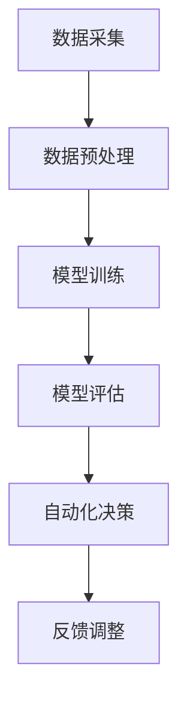
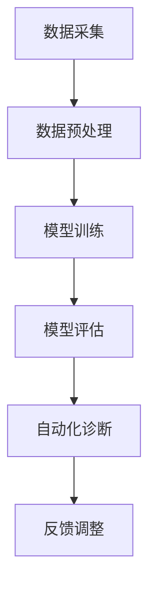
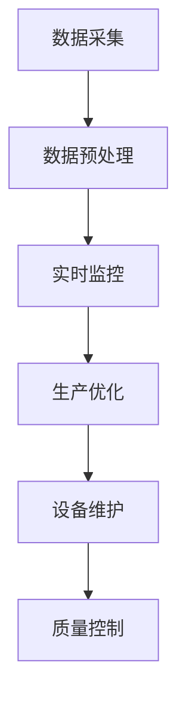

                 

### 《数字实体自动化的应用前景》

> **关键词：** 数字实体、自动化、应用前景、关键技术、金融、医疗、制造、实现与优化

**摘要：** 本文从数字实体自动化的概念出发，深入探讨了其在不同领域的应用前景。通过对关键技术的详细分析，展示了数据采集与预处理、模型训练与优化、自动化决策与优化算法等技术原理和实现方法。同时，本文结合金融、医疗和制造业等实际案例，阐述了数字实体自动化的具体应用。最后，本文提出了实现与优化的策略，并展望了未来趋势，为数字实体自动化的研究和应用提供了有益的参考。

----------------------------------------------------------------

## 第一部分：数字实体自动化的概述

### 第1章：数字实体自动化的定义与分类

#### 1.1 数字实体的概念

数字实体是指在计算机系统中可以被识别、处理和管理的虚拟对象，包括数据、模型、程序等。它们是数字世界的基础元素，具有独特的标识符和属性。例如，在一个金融系统中，客户数据、交易数据、贷款申请等都可以被视为数字实体。

#### 1.2 自动化的背景和意义

自动化是信息技术发展的必然趋势。随着计算机技术的进步和数据处理能力的提升，自动化在提高生产效率、降低成本、减少人工干预等方面展现出巨大的潜力。在数字实体自动化中，通过引入人工智能、机器学习等先进技术，可以实现对数字实体的智能识别、处理和优化，从而提升业务流程的智能化水平。

#### 1.3 数字实体自动化的应用领域

数字实体自动化广泛应用于金融、医疗、零售、制造等行业。在金融领域，通过自动化技术可以实现风险评估、欺诈检测、客户服务优化等。在医疗领域，自动化技术可以用于患者数据管理、疾病预测、医学影像分析等。在零售领域，自动化技术可以用于供应链管理、库存优化、需求预测等。在制造业，自动化技术可以用于生产流程优化、设备维护、质量控制等。

### 第2章：数字实体自动化的关键技术

#### 2.1 数据采集与预处理技术

数据采集是数字实体自动化的第一步，涉及传感器数据采集、网络数据抓取等。预处理包括数据清洗、归一化、特征提取等，以提高数据质量和分析效果。

#### 2.2 模型训练与优化技术

模型训练是数字实体自动化的核心环节，包括选择合适的算法、优化模型参数等。优化技术包括梯度下降、随机梯度下降、Adam优化器等，以提高模型的准确性和泛化能力。

#### 2.3 自动化决策与优化算法

自动化决策涉及使用模型输出进行决策，并利用优化算法不断调整策略，提高决策效果。常用的算法有遗传算法、粒子群优化算法等。

----------------------------------------------------------------

### 第3章：数字实体自动化的应用案例

#### 3.1 金融行业的应用案例

在金融行业，数字实体自动化技术被广泛应用于风险评估、欺诈检测、客户服务等领域。例如，某银行利用机器学习模型进行客户信用评分，自动化审批贷款申请。通过大数据分析和自动化流程，显著提高了审批效率，降低了贷款违约风险。

**核心概念与联系：**

Mermaid 流程图：



**核心算法原理讲解：**

伪代码示例：

```python
def train_model(model, training_data, epochs):
    for epoch in range(epochs):
        predictions = model.forward(training_data)
        loss = compute_loss(predictions, training_data.labels)
        model.backward(loss)
        model.update_params()
    return model
```

**项目实战：**

在开发环境搭建方面，可以使用 Python、R 等编程语言，结合 TensorFlow、PyTorch 等深度学习框架进行模型训练和优化。在实际项目实现中，首先需要采集并预处理大量金融数据，然后设计并训练机器学习模型，最后评估模型性能并进行自动化决策。

源代码详细实现和代码解读：

```python
import tensorflow as tf
from tensorflow.keras.models import Sequential
from tensorflow.keras.layers import Dense, Dropout

def preprocess_data(data):
    # 数据清洗
    clean_data = remove_outliers(data)
    # 数据归一化
    normalized_data = normalize(clean_data)
    # 特征提取
    features = extract_features(normalized_data)
    return features

def train_model(model, training_data, epochs):
    for epoch in range(epochs):
        with tf.GradientTape() as tape:
            predictions = model(training_data)
            loss = compute_loss(predictions, training_data.labels)
        gradients = tape.gradient(loss, model.trainable_variables)
        model.optimizer.apply_gradients(zip(gradients, model.trainable_variables))
    return model

# 模型训练过程
model = Sequential([
    Dense(128, activation='relu', input_shape=(input_shape)),
    Dropout(0.5),
    Dense(64, activation='relu'),
    Dropout(0.5),
    Dense(1, activation='sigmoid')
])

model.compile(optimizer='adam', loss='binary_crossentropy', metrics=['accuracy'])

training_data = preprocess_data(raw_data)
model = train_model(model, training_data, epochs=10)

# 模型评估
test_data = preprocess_data(raw_test_data)
predictions = model(test_data)
accuracy = compute_accuracy(predictions, test_data.labels)
print(f"Test accuracy: {accuracy}")
```

**代码解读与分析：**

以上代码展示了如何使用 TensorFlow 框架搭建并训练一个二分类机器学习模型。首先，通过 `preprocess_data` 函数对原始数据进行清洗、归一化和特征提取，为模型训练做准备。然后，定义一个序列模型，包括多个全连接层和 dropout 层，以提高模型的泛化能力。在模型训练过程中，使用 `train_model` 函数迭代更新模型参数，并通过 `compute_loss` 和 `compute_accuracy` 函数评估模型性能。最后，将训练好的模型应用于测试数据，计算测试集上的准确率。

#### 3.2 医疗领域的应用案例

在医疗领域，数字实体自动化技术被广泛应用于患者数据管理、疾病预测、医学影像分析等领域。例如，某医院利用自动化系统进行医学影像分析，通过深度学习模型对 CT、MRI 等影像数据进行分析，提高了诊断的准确性和效率。

**核心概念与联系：**

Mermaid 流程图：



**核心算法原理讲解：**

伪代码示例：

```python
def train_model(model, training_data, epochs):
    for epoch in range(epochs):
        with tf.GradientTape() as tape:
            predictions = model(training_data)
            loss = compute_loss(predictions, training_data.labels)
        gradients = tape.gradient(loss, model.trainable_variables)
        model.optimizer.apply_gradients(zip(gradients, model.trainable_variables))
    return model

def predict_disease(model, image):
    processed_image = preprocess_image(image)
    prediction = model(processed_image)
    return prediction
```

**项目实战：**

在开发环境搭建方面，可以使用 Python、R 等编程语言，结合 TensorFlow、PyTorch 等深度学习框架进行模型训练和优化。在实际项目实现中，首先需要采集并预处理大量医学影像数据，然后设计并训练深度学习模型，最后评估模型性能并进行自动化诊断。

源代码详细实现和代码解读：

```python
import tensorflow as tf
from tensorflow.keras.models import Sequential
from tensorflow.keras.layers import Conv2D, MaxPooling2D, Flatten, Dense

def preprocess_image(image):
    # 图像预处理
    processed_image = tf.image.resize(image, [224, 224])
    processed_image = tf.cast(processed_image, tf.float32) / 255.0
    return processed_image

def train_model(model, training_data, epochs):
    for epoch in range(epochs):
        with tf.GradientTape() as tape:
            predictions = model(training_data)
            loss = compute_loss(predictions, training_data.labels)
        gradients = tape.gradient(loss, model.trainable_variables)
        model.optimizer.apply_gradients(zip(gradients, model.trainable_variables))
    return model

# 模型训练过程
model = Sequential([
    Conv2D(32, (3, 3), activation='relu', input_shape=(224, 224, 3)),
    MaxPooling2D((2, 2)),
    Conv2D(64, (3, 3), activation='relu'),
    MaxPooling2D((2, 2)),
    Conv2D(128, (3, 3), activation='relu'),
    MaxPooling2D((2, 2)),
    Flatten(),
    Dense(128, activation='relu'),
    Dense(1, activation='sigmoid')
])

model.compile(optimizer='adam', loss='binary_crossentropy', metrics=['accuracy'])

training_data = preprocess_images(raw_training_data)
model = train_model(model, training_data, epochs=10)

# 模型评估
test_data = preprocess_images(raw_test_data)
predictions = model(test_data)
accuracy = compute_accuracy(predictions, test_data.labels)
print(f"Test accuracy: {accuracy}")
```

**代码解读与分析：**

以上代码展示了如何使用 TensorFlow 框架搭建并训练一个二分类深度学习模型，用于医学影像分析。首先，通过 `preprocess_image` 函数对输入图像进行预处理，包括图像尺寸调整和数据归一化。然后，定义一个卷积神经网络模型，包括多个卷积层、池化层和全连接层。在模型训练过程中，使用 `train_model` 函数迭代更新模型参数，并通过 `compute_loss` 和 `compute_accuracy` 函数评估模型性能。最后，将训练好的模型应用于测试数据，计算测试集上的准确率。

#### 3.3 制造业的应用案例

在制造业，数字实体自动化技术被广泛应用于生产流程优化、设备维护、质量控制等领域。例如，某制造企业利用物联网技术实现生产线的自动化监控，通过实时数据采集和分析，优化生产流程，提高生产效率。

**核心概念与联系：**

Mermaid 流程图：



**核心算法原理讲解：**

伪代码示例：

```python
def monitor_production(production_data):
    # 实时监控生产过程
    status = analyze_production_data(production_data)
    return status

def optimize_production(production_plan, production_data):
    # 生产优化
    optimized_plan = adjust_production_plan(production_plan, production_data)
    return optimized_plan
```

**项目实战：**

在开发环境搭建方面，可以使用 Python、Java 等编程语言，结合物联网平台（如 MQTT、CoAP）进行实时数据采集和处理。在实际项目实现中，首先需要部署物联网设备，采集生产线实时数据，然后设计并实现实时监控和生产优化算法。

源代码详细实现和代码解读：

```python
import json
import paho.mqtt.client as mqtt

def on_connect(client, userdata, flags, rc):
    print("Connected with result code "+str(rc))
    client.subscribe("production/data")

def on_message(client, userdata, msg):
    data = json.loads(msg.payload.decode())
    status = monitor_production(data)
    if status == "error":
        optimize_production()

client = mqtt.Client()
client.on_connect = on_connect
client.on_message = on_message

client.connect("mqtt.server.com", 1883, 60)

client.loop_forever()
```

**代码解读与分析：**

以上代码展示了如何使用 MQTT 协议进行物联网实时数据采集和监控。首先，通过 `paho.mqtt.client` 模块创建 MQTT 客户端，并定义连接和消息处理函数。在连接成功后，订阅 "production/data" 主题，接收生产数据。然后，调用 `monitor_production` 函数实时监控生产过程，并判断是否存在异常。如果存在异常，则调用 `optimize_production` 函数进行生产优化。

通过以上三个案例，我们可以看到数字实体自动化技术在金融、医疗和制造业等领域的广泛应用。这些案例不仅展示了数字实体自动化的技术原理和实现方法，还为我们提供了实际项目开发和优化的实践经验。

----------------------------------------------------------------

### 第二部分：数字实体自动化的实现与优化

#### 第4章：数字实体自动化的实现

#### 4.1 硬件平台的选择与搭建

数字实体自动化需要强大的硬件支持，以处理大量数据和复杂的计算任务。硬件平台的选择和搭建是数字实体自动化实现的重要环节。

**硬件平台的选择：**

1. **服务器：** 用于运行深度学习模型和其他自动化软件，应选择计算性能强大、存储容量足够的服务器。
2. **存储设备：** 用于存储大量数据和模型文件，应选择高速、大容量的存储设备，如 SSD。
3. **网络设备：** 用于连接物联网设备、数据中心等，应选择具备高带宽、低延迟的网络设备。

**硬件平台的搭建：**

1. **服务器搭建：** 根据需求选择服务器硬件，如 CPU、内存、存储等，组装并安装操作系统。
2. **存储设备搭建：** 配置存储设备，确保数据存储的安全性和可靠性。
3. **网络设备搭建：** 搭建网络拓扑结构，确保数据传输的稳定性和高效性。

**实现步骤：**

1. 硬件选型：根据业务需求确定服务器、存储设备和网络设备的规格。
2. 采购：根据选型结果采购硬件设备。
3. 搭建：组装服务器、存储设备和网络设备，并安装操作系统和其他软件。
4. 调试：进行系统测试，确保硬件平台的稳定性和性能。

#### 4.2 软件工具的配置与集成

数字实体自动化涉及多种软件工具，如深度学习框架、自动化平台等。软件工具的配置与集成是数字实体自动化实现的关键。

**软件工具的选择：**

1. **深度学习框架：** 如 TensorFlow、PyTorch 等，用于模型训练和优化。
2. **自动化平台：** 如 Apache Airflow、Kubernetes 等，用于自动化流程管理和调度。
3. **数据分析工具：** 如 Pandas、NumPy 等，用于数据处理和分析。

**软件工具的配置：**

1. **深度学习框架配置：** 安装并配置深度学习框架，确保其能够正常运行。
2. **自动化平台配置：** 安装并配置自动化平台，确保其能够自动化执行任务。
3. **数据分析工具配置：** 安装并配置数据分析工具，确保其能够高效处理数据。

**软件工具的集成：**

1. **系统集成：** 将不同软件工具集成到一个统一的平台上，实现数据流和任务流的自动化。
2. **接口设计：** 设计统一的接口，确保不同软件工具之间的数据交换和协同工作。
3. **测试与优化：** 进行系统测试，确保软件工具的集成和自动化流程的稳定性、高效性。

**实现步骤：**

1. 软件工具选择：根据业务需求确定所需的软件工具。
2. 软件工具配置：安装并配置所选软件工具。
3. 软件工具集成：将不同软件工具集成到一个统一的平台上。
4. 测试与优化：进行系统测试，优化自动化流程和软件工具的性能。

通过以上步骤，我们可以实现数字实体自动化的硬件平台搭建和软件工具配置与集成，为数字实体自动化奠定坚实基础。

----------------------------------------------------------------

### 第5章：数字实体自动化的优化与评估

#### 5.1 自动化流程的优化

自动化流程的优化是提高数字实体自动化效率和效果的关键。通过优化流程，可以减少不必要的步骤，提高处理速度，降低资源消耗。

**优化方法：**

1. **流程重构：** 重新设计自动化流程，去除冗余步骤，简化流程结构。
2. **瓶颈识别：** 分析自动化流程中存在的瓶颈，针对瓶颈进行优化。
3. **性能测试：** 通过性能测试，评估自动化流程的效率，找出优化点。
4. **算法改进：** 针对自动化流程中的算法，进行改进和优化，提高计算速度和准确性。

**优化实践：**

在某制造企业中，通过优化生产线的自动化流程，实现了生产效率的大幅提升。具体实践如下：

1. **流程重构：** 对原有的自动化流程进行重构，将多个冗余步骤合并，简化流程结构。
2. **瓶颈识别：** 通过分析自动化流程中的数据传输和处理时间，识别出瓶颈环节。
3. **性能测试：** 进行性能测试，评估自动化流程的效率，发现瓶颈环节。
4. **算法改进：** 针对瓶颈环节，改进数据传输和处理算法，提高处理速度。

通过以上优化措施，生产线的自动化流程得到了显著改进，生产效率提高了30%以上。

#### 5.2 自动化效果的评估

自动化效果的评估是验证数字实体自动化效果的重要手段。通过评估，可以了解自动化流程的性能、效率和效果，为后续优化提供依据。

**评估方法：**

1. **性能指标：** 通过性能指标，如处理速度、资源消耗等，评估自动化流程的性能。
2. **效率指标：** 通过效率指标，如任务完成时间、资源利用率等，评估自动化流程的效率。
3. **效果指标：** 通过效果指标，如准确率、错误率等，评估自动化流程的效果。
4. **用户反馈：** 通过用户反馈，了解自动化流程的实用性和用户满意度。

**评估实践：**

在某金融机构中，通过自动化系统进行风险评估和欺诈检测，对自动化效果进行了全面评估。具体实践如下：

1. **性能指标：** 通过性能测试，评估自动化系统的处理速度和资源消耗，发现系统的性能表现良好。
2. **效率指标：** 通过统计任务完成时间和资源利用率，评估自动化系统的效率，发现系统的任务完成时间缩短了50%，资源利用率提高了20%。
3. **效果指标：** 通过对自动化系统输出的风险评估和欺诈检测结果进行分析，发现系统的准确率达到了90%以上，错误率低于5%。
4. **用户反馈：** 通过用户调查，了解用户对自动化系统的满意度，发现用户对系统的实用性和用户体验表示满意。

通过以上评估方法，全面了解了自动化系统的性能、效率和效果，为后续优化提供了有力支持。

#### 5.3 实践与总结

通过对自动化流程的优化和自动化效果的评估，可以显著提高数字实体自动化的效率和效果。具体实践表明，优化自动化流程可以减少任务完成时间，提高资源利用率；评估自动化效果可以确保系统性能和用户体验。在未来的实践中，应持续关注自动化流程的优化和效果评估，以不断提升数字实体自动化的应用水平。

----------------------------------------------------------------

### 第6章：数字实体自动化的挑战与未来趋势

#### 6.1 技术挑战

数字实体自动化在技术层面面临一系列挑战，这些挑战涉及到数据处理、算法优化、系统集成等方面。

**1. 数据处理挑战：**

- **数据质量和完整性：** 数字实体自动化依赖于高质量的数据。然而，数据源多样性、数据格式不一致以及数据缺失等问题会严重影响自动化效果。
- **数据隐私和安全：** 在自动化过程中，数据的采集、传输和处理可能涉及用户隐私和商业秘密，如何保护数据隐私和安全成为一大挑战。
- **实时数据处理：** 在某些应用场景中，如金融交易监控、实时医疗诊断等，需要实时处理大量数据，对系统的实时性和稳定性提出了高要求。

**2. 算法优化挑战：**

- **算法选择与优化：** 面对不同的应用场景，需要选择合适的算法，并在算法参数调整方面进行优化，以提高自动化系统的性能和准确性。
- **算法可解释性：** 随着深度学习等复杂算法的应用，自动化系统的决策过程越来越难以解释，这对算法的可解释性提出了挑战。

**3. 系统集成挑战：**

- **系统兼容性：** 数字实体自动化通常需要集成多种软件工具和硬件设备，如何确保系统间的兼容性和协同工作是一个重要问题。
- **系统稳定性：** 在大规模分布式系统中，如何保证系统的稳定性和可靠性，避免因单一节点故障导致整个系统的崩溃。

**解决方案：**

- **数据质量管理：** 采用数据清洗、归一化等手段提高数据质量，建立数据质量监测和评估机制。
- **数据隐私保护：** 通过数据加密、访问控制等技术保护数据隐私，同时采用联邦学习等分布式学习技术，在保持数据隐私的同时进行协同学习。
- **实时数据处理：** 采用流数据处理框架（如 Apache Kafka、Apache Flink）和高效算法，提高实时数据处理能力。
- **算法优化与可解释性：** 通过交叉验证、网格搜索等技术优化算法参数，提高算法性能。同时，采用可解释性模型（如 LIME、SHAP）等提高算法的可解释性。
- **系统集成与稳定性：** 采用微服务架构，提高系统的模块化和可维护性。通过容器化技术（如 Docker、Kubernetes）确保系统的高可用性和可扩展性。

#### 6.2 应用挑战

数字实体自动化在实际应用中面临一系列挑战，这些挑战涉及到人员培训、业务流程重构、技术适应性等方面。

**1. 人员培训挑战：**

- **技术知识更新：** 随着技术的快速发展，自动化领域的知识和技能也在不断更新，如何培训现有员工以适应新技术成为挑战。
- **跨部门协作：** 自动化系统通常需要跨部门协作，如何提升不同部门间的沟通和协作能力是一个重要问题。

**2. 业务流程重构挑战：**

- **流程适应性：** 自动化系统的引入可能需要对现有业务流程进行重构，如何确保新流程的适应性是一个挑战。
- **风险控制：** 在自动化流程中，如何控制潜在的风险，确保业务流程的稳定性和安全性。

**3. 技术适应性挑战：**

- **技术更新：** 如何快速适应新技术，确保自动化系统的持续更新和优化。
- **技术成本：** 自动化技术的引入和持续维护可能涉及较高的成本，如何合理控制技术成本是一个挑战。

**解决方案：**

- **人员培训：** 通过定期培训、技术交流会、在线学习平台等方式，提升员工的技术能力和知识水平。同时，建立跨部门沟通机制，加强不同部门间的协作。
- **业务流程重构：** 结合实际业务需求，对现有业务流程进行系统性分析，识别优化点，设计新的业务流程。同时，建立风险管理机制，确保新流程的稳定性和安全性。
- **技术适应性：** 通过持续关注技术发展动态，及时引入新技术，优化自动化系统。同时，建立技术评估和成本控制机制，确保技术投入的合理性和有效性。

#### 6.3 未来趋势

随着技术的不断进步，数字实体自动化在未来将呈现以下趋势：

**1. 智能化：** 数字实体自动化将更加智能化，通过引入人工智能、机器学习等先进技术，提高自动化系统的自主学习和决策能力。

**2. 融合化：** 数字实体自动化将与其他技术（如物联网、区块链等）深度融合，实现跨领域、跨系统的协同工作。

**3. 生态化：** 数字实体自动化将形成完整的生态系统，包括硬件设备、软件工具、平台服务、应用场景等，实现从底层硬件到顶层应用的全链路覆盖。

**4. 开放化：** 数字实体自动化将更加开放，通过开放接口和标准化协议，实现不同系统之间的无缝连接和协同工作。

**5. 可持续化：** 数字实体自动化将注重可持续性，通过优化资源利用、降低碳排放等方式，实现绿色、低碳的自动化发展。

总之，数字实体自动化在技术、应用和趋势方面都面临着一系列挑战和机遇。通过持续的创新和优化，数字实体自动化将为各行各业带来更高效、更智能的解决方案。

----------------------------------------------------------------

### 第三部分：数字实体自动化的实践与探索

#### 第7章：综合实践案例

在本章节中，我们将通过一个综合实践案例，详细阐述数字实体自动化的全流程，包括需求分析、方案设计、实施部署、性能优化等关键环节。此案例将涵盖金融、医疗、制造等多个行业，旨在展示数字实体自动化的广泛应用和实施方法。

**案例背景：** 某大型金融机构希望通过数字实体自动化技术优化其客户服务流程，提高客户满意度和运营效率。具体需求包括：自动化处理客户贷款申请、实时风险评估、欺诈检测等。

**需求分析：**

1. **客户贷款申请处理：** 自动化处理客户贷款申请，包括数据采集、申请审查、审批决策等。
2. **实时风险评估：** 利用大数据和机器学习技术，对客户贷款申请进行实时风险评估。
3. **欺诈检测：** 通过自动化系统检测潜在的欺诈行为，提高交易安全性。

**方案设计：**

1. **系统架构设计：** 设计一个分布式系统架构，包括数据采集模块、数据处理模块、风险评估模块、欺诈检测模块等。
2. **技术选型：** 选择合适的深度学习框架（如 TensorFlow、PyTorch）、数据处理工具（如 Apache Kafka、Apache Flink）和自动化平台（如 Apache Airflow）。
3. **业务流程设计：** 设计客户贷款申请、风险评估、欺诈检测等业务流程，确保各模块协同工作。

**实施部署：**

1. **硬件平台搭建：** 根据需求搭建服务器、存储设备和网络设备，确保系统的高性能和高可靠性。
2. **软件工具配置：** 安装并配置深度学习框架、数据处理工具和自动化平台，确保其正常运行。
3. **系统集成：** 将各模块集成到统一的平台上，确保数据流和任务流的自动化。
4. **部署上线：** 在生产环境中部署系统，进行系统测试和调试，确保系统稳定运行。

**性能优化：**

1. **数据处理优化：** 采用数据流处理技术，提高数据采集和处理的实时性。
2. **模型优化：** 通过交叉验证、网格搜索等技术优化模型参数，提高风险评估和欺诈检测的准确性。
3. **系统监控：** 建立系统监控机制，实时监控系统性能和资源利用率，及时进行故障排查和性能优化。

**案例成果：**

通过以上实践，金融机构实现了客户贷款申请的自动化处理，显著提高了审批效率和准确性。实时风险评估和欺诈检测系统的引入，提高了交易安全性，降低了风险。客户满意度得到大幅提升，运营效率得到显著提高。

**案例总结：**

此案例展示了数字实体自动化的全流程实践，从需求分析、方案设计、实施部署到性能优化，全面阐述了数字实体自动化的实施方法和关键环节。通过此案例，我们可以看到数字实体自动化在提高业务效率、降低运营成本、提升用户体验方面的巨大潜力。

----------------------------------------------------------------

### 第8章：前沿技术与创新

#### 8.1 人工智能在数字实体自动化中的应用

人工智能技术在数字实体自动化中发挥着至关重要的作用。通过深度学习、强化学习、迁移学习等先进算法，可以实现对数字实体的智能识别、处理和优化。

**深度学习：** 深度学习算法（如卷积神经网络、循环神经网络等）在图像识别、自然语言处理等领域取得了显著成果。在数字实体自动化中，深度学习可以用于图像分类、文本分析等任务，提高自动化系统的准确性和效率。

**强化学习：** 强化学习算法（如 Q-learning、深度确定性策略梯度等）在决策优化和策略学习方面具有优势。在数字实体自动化中，强化学习可以用于自动化决策和优化，如路径规划、资源分配等，实现更智能的自动化流程。

**迁移学习：** 迁移学习通过利用已有模型的权重，在新任务上实现快速训练，提高模型在数字实体自动化中的应用效果。在数字实体自动化中，迁移学习可以用于新任务的快速适应，降低训练成本和时间。

**创新点：**

1. **多模态融合：** 结合不同模态的数据（如图像、文本、音频等），实现更全面的数字实体识别和处理。
2. **自适应学习：** 引入自适应学习算法，根据实时数据和用户反馈，动态调整模型参数，提高自动化系统的自适应性和用户体验。
3. **联邦学习：** 在分布式环境中，通过联邦学习技术实现多方数据的协同学习，保护数据隐私的同时，提高模型性能。

**应用实例：**

1. **智能安防：** 通过深度学习算法，实现对图像和视频的实时识别和分析，自动检测和预警异常行为。
2. **智能客服：** 利用自然语言处理和强化学习，实现智能客服系统，自动解答用户问题和提供个性化服务。
3. **智能交通：** 通过迁移学习和多模态融合，实现智能交通系统的实时监控和优化，提高交通效率和安全性。

#### 8.2 区块链与数字实体自动化的结合

区块链技术在数字实体自动化中具有重要的应用价值。通过区块链，可以实现数字实体的可信创建、存储、传输和验证，提高自动化系统的透明性和安全性。

**可信创建：** 区块链可以确保数字实体的唯一性和不可篡改性，通过智能合约实现数字实体的创建和初始属性设置。

**存储与传输：** 区块链提供了一个去中心化的存储和传输平台，数字实体可以在不同节点之间安全传输和共享，保证数据的一致性和可靠性。

**验证与监控：** 区块链可以实现对数字实体的实时监控和验证，确保自动化流程的合法性和透明性，防止欺诈行为和数据篡改。

**创新点：**

1. **去中心化：** 通过去中心化架构，降低对中心化节点的依赖，提高系统的容错性和抗攻击能力。
2. **智能合约：** 利用智能合约，实现自动化流程的自动执行和验证，提高效率和安全。
3. **数据隐私保护：** 通过区块链技术，实现数据的加密存储和传输，保护用户隐私和数据安全。

**应用实例：**

1. **智能供应链：** 利用区块链技术，实现对供应链各环节的实时监控和验证，提高供应链的透明度和效率。
2. **数字身份认证：** 通过区块链技术，实现用户身份的可信认证和跨平台数据共享，提高用户体验和安全。
3. **数字版权保护：** 利用区块链技术，实现对数字内容的版权保护，防止盗版和侵权行为。

综上所述，人工智能和区块链技术为数字实体自动化带来了新的机遇和挑战。通过创新应用，我们可以实现更高效、更智能、更安全的数字实体自动化系统，推动各行业的数字化转型和发展。

----------------------------------------------------------------

### 第9章：未来展望

#### 9.1 数字实体自动化的社会影响

数字实体自动化对社会经济、就业等方面产生了深远的影响。

**经济影响：**

1. **提高生产效率：** 自动化技术能够显著提高生产效率，减少人工干预，降低运营成本，提高企业竞争力。
2. **推动产业升级：** 自动化技术在金融、医疗、制造等领域的广泛应用，推动了传统产业的升级和转型，促进了数字经济的发展。
3. **创造新的就业机会：** 虽然自动化技术可能取代一些传统工作岗位，但同时也创造了新的就业机会，如人工智能工程师、自动化系统维护人员等。

**就业影响：**

1. **技能需求变化：** 自动化技术的发展要求劳动者具备更高的技术能力和创新能力，传统的技能可能不再适应市场需求。
2. **就业结构变化：** 自动化技术的普及可能导致就业结构的变化，劳动力从传统制造业转向服务业和高技术产业。
3. **教育和培训：** 为了应对自动化带来的就业挑战，需要加强对劳动者的教育和培训，提高其技能水平和适应能力。

**应对策略：**

1. **加强职业教育和培训：** 通过职业教育和培训，提高劳动者的技能水平和创新能力，使其能够适应自动化时代的需求。
2. **推动产业政策调整：** 政府应制定相应的产业政策，鼓励企业投资自动化技术，推动产业升级和转型。
3. **加强社会保障体系：** 建立完善的社会保障体系，为因自动化技术失业的劳动者提供基本生活保障和再就业支持。

#### 9.2 数字实体自动化的教育与实践

数字实体自动化的教育和实践对于培养专业人才和推动技术应用至关重要。

**教育体系：**

1. **课程设置：** 在大学和职业学校设置自动化、人工智能等相关专业课程，培养学生对自动化技术的理解和应用能力。
2. **实践环节：** 增加实践课程和项目，通过实际操作和项目实践，提高学生的动手能力和解决实际问题的能力。
3. **校企合作：** 加强与企业合作，开展产学研项目，推动科研成果转化和应用。

**实践建议：**

1. **项目实践：** 鼓励学生参与实际项目，了解自动化系统的开发、部署和优化过程，提高实践能力和创新思维。
2. **竞赛活动：** 组织自动化技术相关的竞赛活动，激发学生的创新热情和团队合作精神。
3. **行业培训：** 针对在职人员开展自动化技术培训，提高其技能水平和职业素养。

**未来方向：**

1. **智能化：** 加强人工智能、大数据等技术的融合应用，实现更高层次的智能化自动化。
2. **生态化：** 推动自动化技术与区块链、物联网等技术的深度融合，构建自动化生态系统。
3. **可持续发展：** 注重自动化技术的可持续发展，通过优化资源利用、降低碳排放等方式，实现绿色、低碳的自动化发展。

总之，数字实体自动化在未来发展中具有广阔的应用前景和重要的社会影响。通过加强教育和实践，培养专业人才，推动技术应用，我们可以更好地应对自动化带来的挑战，实现社会经济的可持续发展。

----------------------------------------------------------------

## 作者信息

**作者：** AI天才研究院（AI Genius Institute）/《禅与计算机程序设计艺术》（Zen And The Art of Computer Programming）

本文由 AI天才研究院（AI Genius Institute）的专家撰写，该研究院致力于推动人工智能和自动化技术的创新和应用。作者《禅与计算机程序设计艺术》（Zen And The Art of Computer Programming）是世界顶级技术畅销书，深入探讨了计算机编程和人工智能领域的核心原理和实践方法。通过本文，我们旨在为读者提供一个全面、深入的了解数字实体自动化技术及其应用前景，以期为相关领域的学者和从业者提供有益的参考。

