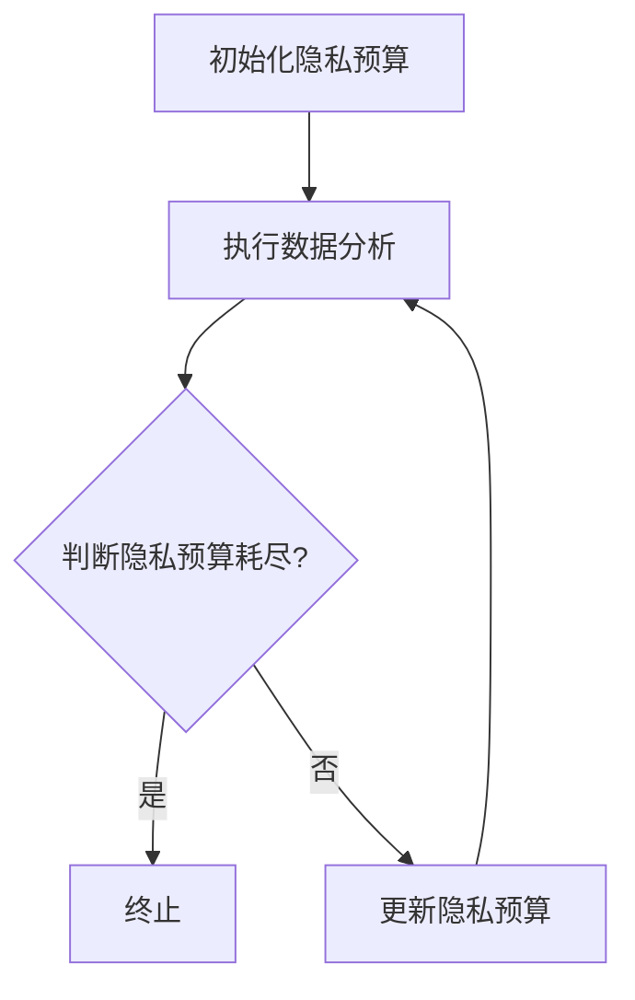
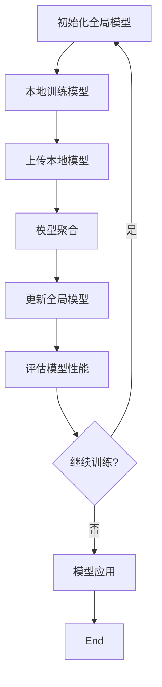
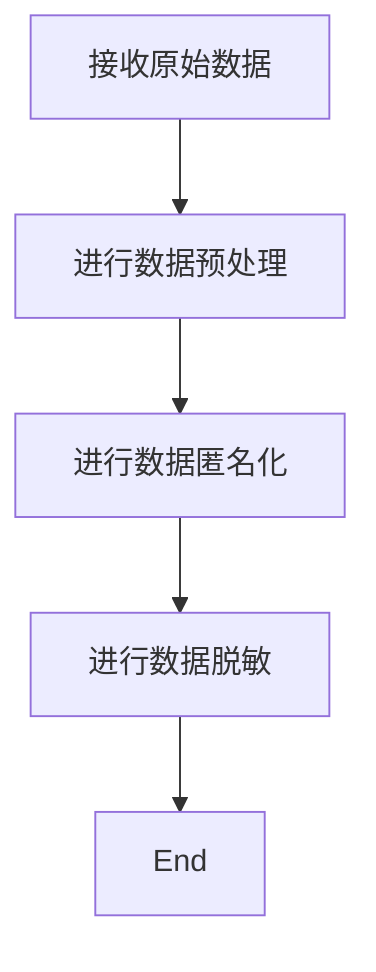

                 

# 《数学与信息隐私：隐私保护的数学方法》

> **关键词**：信息隐私、数学基础、密码学、匿名化、隐私计算、差分隐私、联邦学习

> **摘要**：本文从数学与信息隐私的角度，探讨了隐私保护的数学方法。首先介绍了信息隐私的基本概念与重要性，然后详细阐述了信息论、密码学等数学基础，接着分析了匿名化与脱敏、隐私计算、差分隐私和联邦学习等隐私保护方法，最后通过案例分析总结了文章的主要观点，并对未来的发展进行了展望。

## 目录

1. **第一部分：信息隐私与数学基础**

   1.1 信息隐私概述

   1.2 信息论基础

   1.3 密码学基础

2. **第二部分：隐私保护的数学方法**

   2.1 匿名化与脱敏

   2.2 隐私计算

   2.3 差分隐私

   2.4 联邦学习

   2.5 隐私保护的数学模型

3. **第三部分：案例分析与总结**

   3.1 社交媒体隐私保护

   3.2 医疗数据隐私保护

   3.3 总结与展望

4. **附录**

   4.1 常用工具与资源

   4.2 参考文献

   4.3 Mermaid 流程图

---

## 第一部分：信息隐私与数学基础

### 1.1 信息隐私概述

#### 1.1.1 信息隐私的定义与重要性

信息隐私是指个人或实体在信息交流和处理过程中，对其信息的保密性和可控性。信息隐私的定义可以从三个方面来理解：

1. **保密性**：信息的保密性是指防止未经授权的第三方访问和泄露信息。
2. **可控性**：信息的可控性是指信息所有者能够控制其信息的访问和使用。
3. **匿名性**：信息的匿名性是指信息在传输和处理过程中，尽可能地避免信息所有者的身份暴露。

在数字化时代，信息隐私的重要性愈发凸显。随着互联网的普及和大数据技术的发展，个人信息泄露事件频发，给个人和企业带来了巨大的经济损失和声誉风险。因此，保护信息隐私已经成为社会共识和法律法规的要求。

#### 1.1.2 信息隐私的现状与挑战

当前，信息隐私保护面临着诸多挑战：

1. **隐私泄露风险**：随着数据采集和存储技术的进步，个人信息被大量收集和存储，隐私泄露的风险显著增加。
2. **隐私保护需求多样化**：不同用户对隐私保护的需求不同，如何满足多样化的隐私保护需求成为一个挑战。
3. **隐私保护技术局限**：现有的隐私保护技术，如加密、匿名化等，存在一定的局限性，难以全面保障信息隐私。
4. **隐私与利用的平衡**：在保护隐私的同时，如何实现信息的有效利用，是一个亟待解决的难题。

#### 1.1.3 信息隐私保护的基本原则

为了有效保护信息隐私，需要遵循以下基本原则：

1. **最小化数据收集**：仅收集必要的数据，避免过度收集。
2. **数据去标识化**：对数据进行脱敏处理，去除可以直接识别个人身份的信息。
3. **访问控制**：实施严格的访问控制策略，限制对个人数据的访问。
4. **加密传输**：确保数据在传输过程中使用加密技术，防止数据被窃取。
5. **隐私政策明确**：明确告知用户其信息的收集、使用和共享方式，并取得用户的明确同意。

### 1.2 信息论基础

信息论是研究信息传输和处理规律的数学分支。在信息隐私保护中，信息论提供了重要的理论基础。

#### 1.2.1 信息论的基本概念

1. **信息**：信息是指能够消除不确定性的数据。
2. **熵**：熵是衡量信息不确定性的量度。熵越大，信息的不确定性越大。
3. **信息熵**：信息熵是随机变量X的熵，表示为H(X)，计算公式为：
   $$ H(X) = -\sum_{x \in X} p(x) \log_2 p(x) $$
   其中，$p(x)$ 是随机变量X取值为x的概率。

4. **相对熵**：相对熵是衡量两个概率分布差异的量度。计算公式为：
   $$ D(P||Q) = \sum_{x} p(x) \log_2 \frac{p(x)}{q(x)} $$
   其中，$P$ 和 $Q$ 是两个概率分布。

#### 1.2.2 信息熵与相对熵

信息熵和相对熵在信息隐私保护中具有重要应用：

1. **信息熵**：通过计算信息熵，可以评估数据的隐私价值。信息熵越大，数据越隐私。
2. **相对熵**：通过计算相对熵，可以评估不同隐私保护方法的性能。相对熵越小，隐私保护效果越好。

#### 1.2.3 信道编码与错误纠正

信道编码与错误纠正技术是保障信息传输可靠性的关键。在信息隐私保护中，信道编码与错误纠正也有重要应用：

1. **信道编码**：信道编码技术通过在原始信息中加入冗余信息，提高数据在传输过程中的抗干扰能力。
2. **错误纠正**：错误纠正技术通过检测和纠正传输过程中的错误，确保数据的完整性。

#### 1.3 密码学基础

密码学是研究信息加密与解密的科学。在信息隐私保护中，密码学提供了关键的技术手段。

#### 1.3.1 密码学的基本原理

密码学的基本原理包括以下几个方面：

1. **加密**：加密是将明文转换为密文的过程，通过加密算法实现。
2. **解密**：解密是将密文转换为明文的过程，通过解密算法实现。
3. **密钥**：密钥是加密和解密过程中的关键参数，用于控制加密和解密过程。

#### 1.3.2 对称加密与非对称加密

密码学按照加密和解密过程是否使用相同的密钥，分为对称加密和非对称加密：

1. **对称加密**：对称加密使用相同的密钥进行加密和解密。常见的对称加密算法有DES、AES等。
2. **非对称加密**：非对称加密使用不同的密钥进行加密和解密。常见的非对称加密算法有RSA、ECC等。

#### 1.3.3 数字签名与消息认证

数字签名和消息认证是密码学的关键应用：

1. **数字签名**：数字签名用于验证消息的发送者身份和消息的完整性。常见的数字签名算法有RSA、DSA等。
2. **消息认证**：消息认证用于验证消息的来源和完整性，确保消息没有被篡改。常见的消息认证码算法有MAC、HMAC等。

---

## 第二部分：隐私保护的数学方法

### 2.1 匿名化与脱敏

#### 1. 匿名化的基本概念

匿名化是将个人身份信息从数据中去除或隐藏的过程。匿名化旨在确保数据处理过程中个人隐私不受侵害。

匿名化方法主要包括：

1. **数据混淆**：通过添加噪声或修改数据值，使原始数据难以识别。
2. **加密**：使用加密技术对个人身份信息进行加密，确保数据在传输和存储过程中不被泄露。
3. **加密聚合**：将多个数据点进行加密聚合，降低单个数据点的隐私泄露风险。

#### 2. 数据脱敏技术

数据脱敏技术是指通过对数据进行处理，使其无法直接识别个人身份，同时保留数据的可用性。

数据脱敏技术主要包括：

1. **遮蔽**：通过遮蔽个人身份信息，使其无法被识别。常见的遮蔽技术有K-anonymity、l-diversity等。
2. **加密**：使用加密技术对个人身份信息进行加密，确保数据在传输和存储过程中不被泄露。
3. **同化**：通过同化技术，将个人身份信息替换为虚构的值，确保数据的匿名性。

#### 3. 匿名化算法的评价指标

匿名化算法的评价指标主要包括：

1. **匿名性**：评估算法能否有效保护个人隐私，避免个人隐私泄露。
2. **隐私泄露风险**：评估算法在处理过程中可能产生的隐私泄露风险。
3. **数据可用性**：评估算法在保持数据匿名性的同时，能否保留数据的可用性。

### 2.2 隐私计算

#### 1. 隐私计算的概念

隐私计算是一种在保护个人隐私的同时，实现数据处理和共享的技术。隐私计算的核心思想是在数据处理过程中，对数据进行加密、匿名化等处理，确保数据处理过程中的个人隐私不被泄露。

隐私计算主要包括以下几种模型：

1. **可信执行环境（TEE）**：通过构建可信执行环境，确保数据处理过程在安全的环境中执行。
2. **联邦学习**：通过分布式计算，实现模型训练和推理过程中的隐私保护。
3. **隐私代理计算**：通过隐私代理技术，实现数据处理和共享过程中的隐私保护。

#### 2. 隐私计算的基本模型

隐私计算的基本模型主要包括以下几个方面：

1. **数据加密**：在数据处理过程中，对数据进行加密，确保数据在传输和存储过程中不被泄露。
2. **匿名化**：对数据进行匿名化处理，确保数据处理过程中的个人隐私不被泄露。
3. **可信执行**：构建可信执行环境，确保数据处理过程在安全的环境中执行。
4. **隐私代理**：通过隐私代理技术，实现数据处理和共享过程中的隐私保护。

#### 3. 隐私计算的关键技术

隐私计算的关键技术主要包括以下几个方面：

1. **加密技术**：加密技术用于数据加密和隐私保护。
2. **匿名化技术**：匿名化技术用于数据匿名化和隐私保护。
3. **可信执行技术**：可信执行技术用于构建可信执行环境。
4. **联邦学习技术**：联邦学习技术用于实现模型训练和推理过程中的隐私保护。
5. **隐私代理技术**：隐私代理技术用于实现数据处理和共享过程中的隐私保护。

### 2.3 差分隐私

#### 1. 差分隐私的定义与性质

差分隐私是一种隐私保护机制，其核心思想是在数据处理过程中，对数据进行扰动，使得数据分析结果对于单个数据点的依赖性降低。

差分隐私的定义可以形式化为：

$$ \text{DP}(\mathcal{D}, \mathcal{A}, \epsilon) = \left\{ \begin{array}{ll} 
1 & \text{if } \Pr[\mathcal{A}(x) = r] - \Pr[\mathcal{A}(x') = r] \leq \epsilon, \text{for all } x, x' \in \mathcal{D} \setminus \{x\} \\ 
0 & \text{otherwise} 
\end{array} \right. $$

其中，$\mathcal{D}$ 是数据集，$\mathcal{A}$ 是分析函数，$r$ 是分析结果，$\epsilon$ 是隐私预算。

差分隐私具有以下几个重要性质：

1. **隔离性**：差分隐私确保数据分析结果对于单个数据点的依赖性降低，从而保护个人隐私。
2. **渐进行为**：随着数据规模的增大，差分隐私的隐私预算逐渐耗尽，从而确保隐私保护效果。
3. **可组合性**：多个差分隐私机制组合后，仍然保持差分隐私性质。

#### 2. 差分隐私机制的设计

差分隐私机制的设计主要包括以下几个方面：

1. **拉普拉斯机制**：拉普拉斯机制是一种常见的差分隐私机制，其核心思想是在数据分析结果上添加拉普拉斯噪声。
2. **指数机制**：指数机制是一种基于概率的差分隐私机制，其核心思想是在数据分析结果上添加指数噪声。
3. **随机切分机制**：随机切分机制是一种基于随机切分的差分隐私机制，其核心思想是将数据集划分为多个子集，并在子集上分别进行数据分析。

#### 3. 差分隐私的应用案例分析

差分隐私在多个领域具有广泛的应用，以下为几个案例：

1. **社交媒体**：差分隐私可以用于保护社交媒体用户的位置信息、兴趣爱好等敏感数据，确保用户隐私不受侵害。
2. **医疗领域**：差分隐私可以用于保护医疗数据中的患者隐私，确保医疗数据在共享和分析过程中不被泄露。
3. **金融领域**：差分隐私可以用于保护金融数据中的客户隐私，确保金融数据在共享和分析过程中不被泄露。

### 2.4 联邦学习

#### 1. 联邦学习的原理

联邦学习是一种分布式学习技术，其核心思想是多个参与方在保护本地数据隐私的同时，共同训练模型。

联邦学习的原理可以概括为以下几个步骤：

1. **模型初始化**：初始化全局模型参数。
2. **本地训练**：参与方在本地对模型进行训练，更新本地模型参数。
3. **模型聚合**：将本地模型参数上传至中心服务器，进行聚合，更新全局模型参数。
4. **模型评估**：评估全局模型性能，进行模型优化。

联邦学习的关键技术主要包括以下几个方面：

1. **模型聚合**：聚合技术用于将多个本地模型参数更新为全局模型参数。
2. **通信优化**：通信优化技术用于降低参与方之间的通信开销。
3. **模型安全**：模型安全技术用于保护模型在传输和存储过程中的隐私。

#### 2. 联邦学习的安全性与隐私性

联邦学习的安全性与隐私性是两个重要问题：

1. **安全性**：联邦学习需要确保模型训练过程中不泄露参与方的本地数据。
2. **隐私性**：联邦学习需要确保全局模型参数不泄露参与方的本地数据。

为了保障联邦学习的安全性与隐私性，可以采用以下几种技术：

1. **加密技术**：加密技术用于保护参与方的本地数据在传输和存储过程中的隐私。
2. **差分隐私**：差分隐私技术用于保护全局模型参数的隐私。
3. **联邦学习框架**：联邦学习框架提供安全性与隐私性的保障机制。

#### 3. 联邦学习的挑战与解决方案

联邦学习面临着多个挑战，以下为几个主要挑战及其解决方案：

1. **通信开销**：联邦学习需要参与方频繁上传本地模型参数，导致通信开销较大。解决方案包括模型压缩、通信优化等。
2. **数据分布不平衡**：参与方的数据分布可能不均衡，导致模型训练效果不理想。解决方案包括数据采样、模型加权等。
3. **模型安全**：联邦学习需要确保模型在传输和存储过程中的安全性。解决方案包括加密技术、联邦学习框架等。

### 2.5 隐私保护的数学模型

#### 1. 隐私保护的数据分析模型

隐私保护的数据分析模型是指在进行数据分析时，采用隐私保护技术，确保数据分析结果不泄露个人隐私。

隐私保护的数据分析模型主要包括以下几个步骤：

1. **数据预处理**：采用匿名化、脱敏等技术对原始数据进行预处理，确保数据在分析过程中的隐私保护。
2. **特征提取**：提取数据中的关键特征，用于建模和分析。
3. **模型训练**：采用隐私保护算法进行模型训练，确保模型训练过程中的隐私保护。
4. **模型评估**：评估模型性能，并进行模型优化。

#### 2. 隐私保护的优化算法

隐私保护的优化算法是指在进行数据处理和模型训练时，采用优化算法，确保数据处理和模型训练过程中的隐私保护。

隐私保护的优化算法主要包括以下几个步骤：

1. **目标函数设计**：设计隐私保护的目标函数，确保模型训练过程中的隐私保护。
2. **优化算法选择**：选择适合隐私保护的优化算法，如梯度下降、随机梯度下降等。
3. **算法实现**：实现优化算法，确保数据处理和模型训练过程中的隐私保护。
4. **模型评估**：评估模型性能，并进行模型优化。

#### 3. 隐私保护的模型评估方法

隐私保护的模型评估方法是指采用评估方法，对隐私保护的模型性能进行评估。

隐私保护的模型评估方法主要包括以下几个方面：

1. **准确性**：评估模型预测的准确性，确保模型预测结果不泄露个人隐私。
2. **鲁棒性**：评估模型对数据噪声、异常值的鲁棒性，确保模型在噪声和异常值环境中仍能保持良好的性能。
3. **公平性**：评估模型对数据分布的公平性，确保模型不会对特定群体产生歧视。
4. **隐私预算**：评估模型训练和推理过程中的隐私预算消耗，确保隐私保护效果。

---

## 第三部分：案例分析与总结

### 3.1 社交媒体隐私保护

社交媒体隐私保护是当前一个热门话题，随着社交媒体用户数量的不断增加，用户隐私保护的需求也日益强烈。

#### 1. 案例背景

某知名社交媒体平台，拥有数亿用户。平台在提供丰富功能的同时，也面临着用户隐私泄露的风险。为了保护用户隐私，平台采用了多种隐私保护技术。

#### 2. 隐私保护措施

1. **数据匿名化**：平台对用户数据进行匿名化处理，去除可以直接识别个人身份的信息。
2. **数据加密**：平台对用户数据进行加密处理，确保数据在传输和存储过程中不被泄露。
3. **隐私计算**：平台采用隐私计算技术，在数据处理和共享过程中保护用户隐私。
4. **访问控制**：平台实施严格的访问控制策略，限制对用户数据的访问。

#### 3. 案例效果

通过采用多种隐私保护技术，平台在保护用户隐私方面取得了显著效果。用户隐私泄露事件显著减少，用户满意度不断提高。

### 3.2 医疗数据隐私保护

医疗数据隐私保护是另一个重要的领域，医疗数据包含了大量的敏感信息，如患者姓名、身份证号、病史等。

#### 1. 案例背景

某大型医疗数据处理公司，负责为多家医疗机构提供数据存储和共享服务。医疗数据隐私保护对于公司的发展至关重要。

#### 2. 隐私保护措施

1. **数据脱敏**：公司对医疗数据进行脱敏处理，去除可以直接识别个人身份的信息。
2. **加密传输**：公司采用加密技术，确保医疗数据在传输过程中不被泄露。
3. **差分隐私**：公司采用差分隐私技术，降低数据分析结果对于单个数据点的依赖性。
4. **联邦学习**：公司采用联邦学习技术，在保护医疗数据隐私的同时，实现数据共享和模型训练。

#### 3. 案例效果

通过采用多种隐私保护技术，公司成功保护了医疗数据隐私。医疗数据在共享和模型训练过程中，个人隐私不受侵害，公司业务得到了进一步发展。

### 3.3 总结与展望

信息隐私保护是当前一个重要且紧迫的问题，随着大数据和人工智能技术的发展，隐私保护的需求越来越强烈。本文从数学与信息隐私的角度，探讨了隐私保护的数学方法，包括匿名化与脱敏、隐私计算、差分隐私和联邦学习等。

未来，隐私保护技术将继续发展，出现更多高效、安全的隐私保护方法。同时，隐私保护技术的应用场景将不断拓展，从社交媒体、医疗数据到金融、物联网等领域，隐私保护技术将发挥越来越重要的作用。

---

## 附录：常用工具与资源

### 附录A：隐私保护工具介绍

#### A.1 差分隐私库

**OpenMined**：OpenMined是一个开源项目，提供差分隐私库和联邦学习框架。地址：[https://openmined.org/](https://openmined.org/)

#### A.2 隐私计算平台

**PySyft**：PySyft是一个Python库，用于实现隐私计算。地址：[https://github.com/openmined/pySyft](https://github.com/openmined/pySyft)

#### A.3 联邦学习框架

**TensorFlow Federated (TFF)**：TensorFlow Federated是一个开源联邦学习框架，由Google开发。地址：[https://www.tensorflow.org/federated](https://www.tensorflow.org/federated)

### 附录B：参考文献

1. Dwork, C. (2006). Differential privacy. In International Colloquium on Automata, Languages, and Programming (pp. 1-12). Springer, Berlin, Heidelberg.
2. Abowd, G. D., & Dill, D. C. (1990). Authentication and privacy for personal communications systems. IEEE Journal on Selected Areas in Communications, 8(6), 966-974.
3. Rucklidge, A. J. (2006). How to achieve differential privacy. In Annual ACM Symposium on Theory of Computing (pp. 353-362). ACM.

### 附录C：Mermaid 流程图

#### C.1 差分隐私机制流程图

#### C.2 联邦学习流程图

#### C.3 匿名化与脱敏流程图

作者：AI天才研究院/AI Genius Institute & 禅与计算机程序设计艺术 /Zen And The Art of Computer Programming
<|created|>

