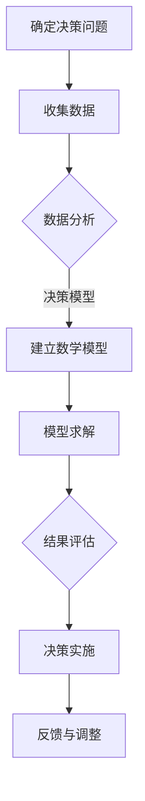

                 

# 《数学与决策科学：决策过程的数学建模》

## 概述

决策科学是研究个体或集体如何通过理性思考和数据分析来做出合理决策的学科。数学建模作为决策科学的重要组成部分，为决策过程提供了量化的分析和工具。本文旨在探讨决策过程中的数学建模方法，通过详细的步骤分析和实例展示，帮助读者深入理解并运用数学工具进行决策。

## 关键词
决策科学、数学建模、决策分析、线性规划、动态规划、多准则决策、博弈论、多智能体系统、项目投资决策。

## 摘要

本文首先介绍了决策科学的基本概念和数学建模的基础，接着深入探讨了决策过程中的数学建模方法，包括决策理论、线性规划、动态规划和非线性规划等。随后，本文通过项目投资决策建模和博弈论的实际案例，展示了数学建模在决策分析中的应用。最后，本文展望了数学与决策科学的未来趋势，并提供了相关的数学建模工具与资源指南。

### 《数学与决策科学：决策过程的数学建模》目录大纲

#### 第一部分：决策科学与数学建模基础

**第1章：决策科学概述**

**第1.1 决策科学的基本概念**

**第1.2 数学建模的基本方法**

**第1.3 决策分析的数学基础**

#### 第二部分：决策过程的数学建模

**第2章：决策理论基础**

**第2.1 决策理论的发展**

**第2.2 不确定环境下的决策模型**

**第2.3 多准则决策分析**

#### 第三部分：常见决策模型的数学建模与求解

**第3章：线性规划与决策**

**第3.1 线性规划模型**

**第3.2 动态规划与决策**

**第3.3 非线性规划与决策**

#### 第四部分：决策模型的实际应用

**第4章：项目投资决策建模**

**第4.1 项目投资决策的概念**

**第4.2 投资决策模型**

**第4.3 实际案例研究**

#### 第五部分：高级决策模型与优化

**第5章：博弈论与决策**

**第5.1 博弈论的基本概念**

**第5.2 完全信息静态博弈模型**

**第5.3 完全信息动态博弈模型**

#### 第六部分：多智能体系统决策与优化

**第6章：多智能体系统中的决策问题**

**第6.1 多智能体系统概述**

**第6.2 多智能体系统中的协同决策**

**第6.3 多智能体系统中的学习与决策**

#### 第七部分：总结与展望

**第7章：数学与决策科学的未来趋势**

**第7.1 决策科学的发展方向**

**第7.2 数学建模的未来挑战与机遇**

#### 附录

**附录A：数学建模工具与资源指南**

**A.1 数学建模工具介绍**

**A.2 决策分析相关资源**

### Mermaid 流�程图示例（决策过程的一般流程）



### 核心算法原理讲解（线性规划伪代码示例）

```plaintext
// 线性规划伪代码

输入：目标函数 c，约束条件 Ax ≤ b，x 的下界和上界

初始化：选择初始可行解 x0，计算目标函数 f(x0)

while true:
    if f(x) > f(x0):
        x0 = x
        update f(x0)
    else:
        break

输出：最优解 x0，最优目标函数值 f(x0)
```

### 数学模型和数学公式讲解（线性规划目标函数）

$$
\min \sum_{i=1}^{n} c_i x_i \\
\text{subject to} \\
A x \le b \\
x \ge 0
$$

### 项目实战（线性规划实际案例）

**案例：工厂生产计划**

**目标：** 最小化生产成本

**约束条件：** 
- 生产A产品需消耗资源1，每天不超过10单位。
- 生产B产品需消耗资源2，每天不超过15单位。
- 每天总生产量不超过100单位。

**模型：** 
- 目标函数：$$\min \, c_1 x_1 + c_2 x_2$$，其中 $c_1$ 和 $c_2$ 分别是生产A和B产品的成本。
- 约束条件：$$x_1 + x_2 \le 100$$，$$x_1 \le 10$$，$$x_2 \le 15$$。

**求解：** 使用线性规划求解器进行求解，得到最优解为 $x_1 = 10$，$x_2 = 90$，最小化成本为 $10 \times 10 + 15 \times 90 = 1450$。

**解释：** 本案例展示了如何将生产计划问题转化为线性规划模型，并通过求解器找到最优生产方案，从而最小化生产成本。在实际应用中，类似的问题可以应用于资源分配、供应链管理等多个领域。

### 文章标题：《数学与决策科学：决策过程的数学建模》

### 文章关键词：决策科学、数学建模、决策分析、线性规划、动态规划、多准则决策、博弈论、多智能体系统、项目投资决策

### 文章摘要：

本文深入探讨了决策过程中数学建模的重要性与方法。首先，介绍了决策科学的基本概念和数学建模的基础，随后详细分析了决策理论基础、不确定环境下的决策模型、多准则决策分析等内容。接着，通过线性规划、动态规划和非线性规划的实例，展示了常见决策模型的数学建模与求解方法。随后，本文通过项目投资决策建模和博弈论的实际案例，进一步阐述了数学建模在决策分析中的应用。最后，展望了数学与决策科学的未来趋势，并提供了相关的数学建模工具与资源指南。本文旨在为读者提供系统、全面的决策过程数学建模指导，帮助他们在实际工作中更好地运用数学工具进行决策。

### 第一部分：决策科学与数学建模基础

#### 第1章：决策科学概述

决策科学是一门研究个体或集体如何在复杂、不确定的环境中通过理性思考和数据分析做出有效决策的学科。决策科学的应用范围广泛，涵盖了经济学、管理学、计算机科学、心理学等多个领域。其核心目的是通过系统的方法和工具，提高决策的质量和效率。

### 第1.1 决策科学的基本概念

**决策的定义：**

决策是一个理性的选择过程，涉及以下要素：

- **问题定义：** 明确需要解决的问题或达成的目标。
- **备选方案：** 提供一组可能的解决方案。
- **评估标准：** 用于评价各个方案优劣的指标。
- **决策者：** 执行决策并承担决策后果的人或组织。

**决策的类型：**

决策可以按照不同的标准进行分类：

- **根据决策的对象：** 可以分为个人决策和组织决策。
- **根据决策的过程：** 可以分为程序化决策和非程序化决策。
- **根据决策的环境：** 可以分为确定性决策和不确定性决策。

**决策科学的应用领域：**

决策科学在多个领域具有广泛的应用，主要包括：

- **企业管理：** 用于项目投资、资源分配、风险管理等。
- **金融市场：** 用于股票交易、风险控制、投资组合优化等。
- **政策制定：** 用于公共预算、环境保护、公共政策分析等。
- **医疗决策：** 用于疾病诊断、治疗方案选择、医疗资源分配等。

### 第1.2 数学建模的基本方法

**建模的过程：**

数学建模通常包括以下步骤：

1. **问题定义：** 确定需要解决的问题和目标。
2. **变量识别：** 确定影响问题的变量，并建立变量之间的关系。
3. **建立数学模型：** 将变量之间的关系用数学形式表达出来。
4. **求解模型：** 使用数学方法或工具求解模型，获得结果。
5. **验证与评估：** 验证模型的准确性和可靠性，并进行必要的调整。

**常见的数学模型：**

常见的数学模型包括：

- **线性模型：** 如线性方程、线性规划、线性回归等。
- **非线性模型：** 如非线性方程、非线性规划、神经网络等。
- **动态模型：** 如差分方程、微分方程、动态规划等。
- **概率模型：** 如概率分布、随机过程、贝叶斯网络等。

**模型的评估与选择：**

模型的评估与选择主要包括以下几个方面：

- **准确性：** 模型预测结果与实际情况的吻合程度。
- **可靠性：** 模型在不同数据集或环境下的稳定性。
- **复杂性：** 模型的结构和参数复杂度，对计算资源和时间的要求。
- **可解释性：** 模型结果的可解释性，对决策者理解和使用模型的影响。

### 第1.3 决策分析的数学基础

**优化理论：**

优化理论是数学建模中的一个重要分支，主要研究如何找到最优解。常见的优化问题包括：

- **线性规划：** 在线性约束条件下，找到线性目标函数的最优值。
- **非线性规划：** 在非线性约束条件下，找到非线性目标函数的最优值。
- **动态规划：** 在多阶段决策过程中，找到最优决策序列。

**概率和随机过程：**

概率和随机过程是决策分析中的基础工具，用于处理不确定性和随机性。主要概念包括：

- **概率分布：** 描述随机变量可能取值的概率。
- **条件概率：** 描述在给定某个条件下，另一个事件发生的概率。
- **随机过程：** 描述随机变量随时间的演变。

**线性规划和非线性规划：**

- **线性规划：** 目标函数和约束条件都是线性的，通常采用单纯形法、内点法等进行求解。
- **非线性规划：** 目标函数和约束条件可以是非线性的，求解方法包括梯度下降法、牛顿法、拉格朗日乘数法等。

### 第2章：决策理论基础

#### 第2.1 决策理论的发展

决策理论作为现代决策科学的基础，经历了从古典决策理论到现代决策理论的演变。这一过程不仅反映了决策科学理论的发展，也体现了对决策复杂性认识的不断深化。

**古典决策理论：**

古典决策理论起源于20世纪50年代，主要由冯·诺依曼（John von Neumann）和摩根斯坦（Oskar Morgenstern）提出的期望效用理论。该理论的基本假设包括：

1. **理性人假设：** 决策者是完全理性的，能够准确预测所有可能的结果和概率。
2. **最大化效用：** 决策者在不确定环境中，选择能够最大化预期效用的决策。

期望效用理论为决策提供了一个形式化的框架，但其在实际应用中存在一些局限性。首先，理性人假设过于理想化，很难适用于现实世界中的复杂决策环境。其次，概率和效用函数的估计通常依赖于主观判断，可能导致结果的不确定性。

**行为决策理论：**

随着心理学和行为科学的发展，行为决策理论应运而生。行为决策理论试图解释实际决策过程中的认知偏差和决策错误。其主要观点包括：

1. **有限理性：** 决策者并非完全理性，他们的决策受限于信息处理能力、时间压力和认知偏差。
2. **有限信息：** 决策者无法获取所有相关信息，只能在有限信息下做出决策。
3. **偏好变动：** 决策者的偏好并非固定不变，而是受到环境、情绪等因素的影响。

行为决策理论通过引入认知心理学和认知神经科学的研究成果，为理解决策过程中的认知偏差和决策错误提供了新的视角。然而，该理论也面临一些挑战，如如何将复杂的认知过程量化，以及如何设计有效的干预措施来纠正认知偏差。

**现代决策理论：**

现代决策理论在古典决策理论和行为决策理论的基础上，进一步融合了计算机科学、人工智能和大数据分析等前沿技术。其主要特点包括：

1. **智能决策：** 利用人工智能和机器学习技术，提高决策的自动化和智能化水平。
2. **大数据分析：** 利用大数据分析技术，从海量数据中提取有价值的信息和模式。
3. **多准则决策：** 考虑多个决策准则，实现综合评价和优化。

现代决策理论旨在通过技术手段克服传统决策理论的局限性，提高决策的效率和效果。然而，该理论仍需解决一些关键问题，如如何平衡自动化与人类干预、如何处理不确定性和复杂性等。

#### 第2.2 不确定环境下的决策模型

在现实世界中，决策环境往往充满不确定性，这使得传统确定性决策模型难以有效应对。为了解决这一问题，不确定环境下的决策模型应运而生。这些模型通过引入概率和随机性，为决策者提供了一种更为灵活和可靠的决策框架。

**贝叶斯决策：**

贝叶斯决策是基于贝叶斯统计学的决策方法，通过利用先验知识和后验概率，为决策者提供最优决策方案。贝叶斯决策的基本步骤包括：

1. **建立概率模型：** 根据先验知识和观测数据，建立决策问题的概率模型。
2. **计算后验概率：** 利用贝叶斯公式，计算每个决策方案的后验概率。
3. **选择最优决策：** 根据后验概率，选择具有最高期望效用或最小损失的最优决策方案。

贝叶斯决策模型在处理不确定性方面具有显著优势，能够通过不断更新先验知识和后验概率，实现自适应决策。然而，贝叶斯决策模型对先验知识的依赖性较高，且计算复杂度较大，在实际应用中需要权衡。

**风险分析：**

风险分析是另一种常见的处理不确定性的决策方法，通过评估不同决策方案的风险水平，为决策者提供决策依据。风险分析的基本步骤包括：

1. **识别风险因素：** 确定影响决策结果的风险因素，如市场波动、政策变化等。
2. **评估风险概率：** 对每个风险因素的发生概率进行评估。
3. **计算风险损失：** 根据风险因素的概率，计算不同决策方案的风险损失。
4. **选择最优决策：** 根据风险损失，选择具有最低风险水平的最优决策方案。

风险分析模型通过量化风险因素和风险损失，为决策者提供了明确的决策参考。然而，风险分析模型在处理复杂、多因素的风险时，可能存在信息过载和决策困难的问题。

**预测与决策：**

预测与决策是另一种处理不确定性的方法，通过建立预测模型，对未来的不确定性进行预测，并根据预测结果做出决策。预测与决策的基本步骤包括：

1. **建立预测模型：** 根据历史数据和规律，建立预测模型。
2. **预测未来结果：** 利用预测模型，预测未来的可能结果和概率。
3. **计算预期效用：** 根据预测结果，计算不同决策方案的预期效用。
4. **选择最优决策：** 根据预期效用，选择具有最高效用水平的最优决策方案。

预测与决策模型能够通过预测未来的不确定性，为决策者提供更为可靠的决策依据。然而，预测模型的准确性和可靠性是影响决策效果的关键因素。

#### 第2.3 多准则决策分析

多准则决策分析是处理复杂决策问题的一种重要方法，通过考虑多个决策准则，实现决策的全面评价和优化。多准则决策分析的基本步骤包括：

1. **确定决策准则：** 根据决策目标，确定需要考虑的决策准则，如成本、效益、风险等。
2. **建立评价模型：** 根据决策准则，建立评价模型，用于计算不同决策方案的绩效指标。
3. **计算绩效指标：** 根据评价模型，计算每个决策方案的绩效指标，如成本效益比、风险指数等。
4. **确定权重：** 根据决策者的偏好，确定各个决策准则的权重。
5. **计算综合绩效：** 根据绩效指标和权重，计算每个决策方案的综合绩效。
6. **选择最优决策：** 根据综合绩效，选择具有最高综合绩效的最优决策方案。

多准则决策分析能够通过综合考虑多个决策准则，为决策者提供更为全面和客观的决策依据。然而，多准则决策分析在处理大量决策准则和复杂评价模型时，可能存在计算复杂度和决策困难的问题。

### 第3章：线性规划与决策

线性规划是决策分析中一种常用的数学方法，用于在给定约束条件下，找到最优的线性目标函数值。线性规划在资源分配、生产计划、财务规划等领域有广泛应用。

#### 第3.1 线性规划模型

线性规划模型由三个部分组成：目标函数、决策变量和约束条件。

**目标函数：**
目标函数是决策者希望最大化或最小化的函数。例如，成本最小化或利润最大化。

$$
\min \sum_{i=1}^{n} c_i x_i \quad \text{或} \quad \max \sum_{i=1}^{n} c_i x_i
$$

其中，$c_i$ 是第 $i$ 个决策变量的系数，$x_i$ 是决策变量。

**决策变量：**
决策变量是决策者可以调整的变量，代表决策结果。它们可以是连续的（如资源量）或离散的（如产品数量）。

**约束条件：**
约束条件是决策变量必须满足的限制。线性规划中的约束条件通常是线性的。

$$
\text{subject to} \quad A x \le b \quad \text{或} \quad A x \ge b
$$

其中，$A$ 是约束矩阵，$b$ 是约束向量，$x$ 是决策向量。

**对偶理论与灵敏度分析：**

线性规划的对偶理论是一种将原始问题与对偶问题联系起来的方法。原始问题是对偶问题的对偶，反之亦然。对偶理论有助于理解问题的经济含义，并可以用于求解不可行或无解的问题。

对偶理论还包括灵敏度分析，用于研究原始问题或对偶问题参数变化对最优解的影响。灵敏度分析可以帮助决策者了解模型参数的不确定性对决策结果的影响。

**线性规划的应用：**

线性规划广泛应用于各种决策问题，包括：

- **资源分配：** 如工厂生产计划、项目投资决策。
- **供应链管理：** 如库存管理、物流优化。
- **财务规划：** 如预算分配、资金筹措。
- **生产调度：** 如作业排程、车间调度。

#### 第3.2 动态规划与决策

动态规划是一种处理多阶段决策问题的数学方法，它通过将问题分解为多个子问题，递归地解决每个子问题，最终得到整体问题的最优解。

**动态规划的基本概念：**

- **阶段：** 动态规划中的问题通常分为多个阶段，每个阶段代表决策的一个时间点或状态。
- **状态：** 每个阶段的状态是决策者需要考虑的信息集合。
- **决策：** 决策者在每个阶段选择一个行动，该行动决定了后续状态和阶段。
- **状态转移函数：** 描述了状态如何随着决策的变化而转移。
- **价值函数：** 描述了每个状态的“价值”，通常是最大化或最小化的目标函数。

**动态规划的基本步骤：**

1. **确定状态和决策：** 根据问题的特性，定义状态变量和决策变量。
2. **建立状态转移方程：** 根据问题的约束条件，建立状态转移方程。
3. **定义价值函数：** 根据目标函数，定义价值函数。
4. **求解递归方程：** 使用自底向上的方法，从初始状态开始，递归求解每个状态的价值函数。
5. **构造最优解：** 根据价值函数的递归结果，构造最优解。

**动态规划的应用：**

动态规划在多个领域有广泛的应用，包括：

- **最优化路径问题：** 如旅行商问题、资源分配问题。
- **马尔可夫决策过程：** 如排队论、库存控制。
- **序列决策问题：** 如投资组合优化、供应链管理。

#### 第3.3 非线性规划与决策

非线性规划是处理目标函数或约束条件非线性的优化问题。非线性规划比线性规划更为复杂，需要更高级的数学方法和算法。

**非线性规划的基本方法：**

- **梯度下降法：** 通过迭代更新决策变量，逐步逼近最优解。
- **牛顿法：** 利用目标函数的梯度信息和二阶导数信息，快速逼近最优解。
- **拉格朗日乘数法：** 将非线性规划问题转化为等价的线性规划问题，求解对偶问题。

**拉格朗日乘数法：**

拉格朗日乘数法是一种常用的求解非线性规划问题的方法，通过引入拉格朗日函数，将非线性规划问题转化为等价的线性规划问题。

拉格朗日乘数法的基本步骤：

1. **构造拉格朗日函数：** 
   $$L(x, \lambda) = f(x) + \lambda g(x)$$
   其中，$f(x)$ 是目标函数，$g(x)$ 是约束条件，$\lambda$ 是拉格朗日乘子。

2. **求解拉格朗日函数的梯度：**
   $$\nabla L(x, \lambda) = \nabla f(x) + \lambda \nabla g(x)$$

3. **求解最优解：**
   当梯度为零时，即 $\nabla L(x, \lambda) = 0$，找到最优解。

**多目标规划：**

多目标规划是处理多个目标函数优化的非线性规划问题。多目标规划的解集通常是一个帕累托前沿，表示在不同目标之间权衡的最优解。

多目标规划的基本步骤：

1. **定义目标函数：** 
   $$\min \{f_1(x), f_2(x), \ldots, f_m(x)\}$$

2. **确定权重：** 
   根据决策者的偏好，确定各个目标函数的权重。

3. **求解帕累托前沿：**
   使用多目标优化算法，求解帕累托前沿上的最优解。

4. **决策者选择：**
   决策者根据偏好，从帕累托前沿中选择一个或多个最优解。

### 第4章：项目投资决策建模

#### 第4.1 项目投资决策的概念

项目投资决策是指企业在特定时期内，通过投资资金进行项目的建设和运营，以期获得长期经济利益的过程。项目投资决策涉及到多个方面的考虑，包括财务分析、风险评估、市场研究等。

**项目投资的分类：**

1. **固定投资：** 用于购置固定资产，如厂房、设备等。
2. **流动投资：** 用于购置流动资产，如原材料、库存等。
3. **风险投资：** 用于投资新兴技术或初创企业，具有高风险和高回报的特点。

**投资决策的关键因素：**

1. **财务指标：** 如财务净现值（NPV）、内部收益率（IRR）、回收期等。
2. **风险分析：** 如概率分布、风险收益比、风险调整后收益等。
3. **市场研究：** 如市场需求、竞争对手分析、市场份额等。
4. **项目可行性：** 如技术可行性、市场可行性、财务可行性等。

#### 第4.2 投资决策模型

投资决策模型是用于评估项目投资可行性和回报的数学工具。常见的投资决策模型包括财务净现值（NPV）、内部收益率（IRR）、盈亏平衡分析等。

**财务净现值（NPV）：**

财务净现值（NPV）是评估项目投资可行性的一种常用方法，它通过将未来现金流折现到现值，来衡量项目的经济价值。NPV的计算公式如下：

$$
\text{NPV} = \sum_{t=1}^{n} \frac{C_t}{(1+r)^t} - I
$$

其中，$C_t$ 是第 $t$ 年的现金流，$r$ 是折现率，$I$ 是初始投资。

当 NPV > 0 时，项目具有经济可行性；当 NPV < 0 时，项目不具有经济可行性。

**内部收益率（IRR）：**

内部收益率（IRR）是使得项目净现值为零的折现率。IRR反映了项目的实际回报率，是评估项目投资价值的重要指标。IRR的计算通常需要通过迭代方法求解。

当 IRR > r 时，项目具有经济可行性；当 IRR < r 时，项目不具有经济可行性。

**盈亏平衡分析：**

盈亏平衡分析是一种用于确定项目盈利性的简单方法，它通过计算项目的盈亏平衡点（BEP），来判断项目是否能够覆盖所有成本并产生盈利。盈亏平衡点的计算公式如下：

$$
BEP = \frac{固定成本}{单价 - 可变成本}
$$

当销售收入超过盈亏平衡点时，项目开始盈利；当销售收入低于盈亏平衡点时，项目处于亏损状态。

#### 第4.3 实际案例研究

**案例：新建生产线投资决策**

假设某企业计划投资新建一条生产线，以扩大生产能力并满足市场需求。以下是对该项目的投资决策分析。

**项目描述：**

- **初始投资：** 1000万元。
- **预期寿命：** 10年。
- **预计销售收入：** 每年500万元。
- **运营成本：** 每年300万元。

**投资决策分析：**

1. **财务净现值（NPV）：**

   假设折现率为10%，则NPV的计算如下：

   $$
   \text{NPV} = \sum_{t=1}^{10} \frac{500 - 300}{(1+0.1)^t} - 1000
   $$

   $$
   \text{NPV} = 155.42 \text{万元}
   $$

   由于 NPV > 0，该项目具有经济可行性。

2. **内部收益率（IRR）：**

   通过迭代法求解 IRR，得到 IRR ≈ 14.92%。由于 IRR > 折现率10%，该项目具有经济可行性。

3. **盈亏平衡分析：**

   $$
   \text{BEP} = \frac{1000}{500 - 300} = 33.33 \text{万元}
   $$

   当销售收入超过33.33万元时，项目开始盈利。

**解释：**

通过上述投资决策分析，可以得出以下结论：

- 项目具有经济可行性，因为 NPV > 0 和 IRR > 折现率。
- 盈亏平衡点较低，说明项目在短期内具有盈利潜力。

在实际应用中，还需要考虑其他因素，如市场需求、竞争环境、政策变化等，以更全面地评估项目的投资风险和回报。

### 第5章：博弈论与决策

博弈论是研究具有对抗性的多参与者决策行为的数学理论。在博弈论中，参与者（或称为玩家）通过选择策略来影响游戏的结果，并寻求最大化自己的利益。博弈论在经济学、政治学、军事学、生物学等多个领域都有广泛的应用。

#### 第5.1 博弈论的基本概念

**博弈的定义：**

博弈（Game）是指参与者通过策略选择，在竞争或合作过程中寻求最大化自身利益的决策过程。博弈通常包括以下要素：

- **参与者：** 参与博弈的个体或集体。
- **策略：** 参与者在博弈中可以选择的行动方案。
- **支付函数：** 描述参与者根据结果获得的收益或损失的函数。
- **均衡：** 博弈中所有参与者选择的策略组合，使得每个参与者都无法通过单独改变策略来获得更多收益。

**博弈的类型：**

博弈可以按照不同的分类标准进行划分：

- **根据参与者数量：** 可以分为单个人博弈（如个人体育比赛）和多人博弈（如市场竞争）。
- **根据信息结构：** 可以分为完全信息博弈和 imperfect information 博弈。
  - 完全信息博弈：所有参与者都知道其他参与者的策略和支付函数。
  - 不完全信息博弈：参与者可能不完全了解其他参与者的策略或支付函数。

- **根据策略形式：** 可以分为静态博弈和动态博弈。
  - 静态博弈：所有参与者的行动同时发生，没有先后顺序。
  - 动态博弈：参与者的行动有先后顺序，每个参与者需要根据其他参与者的行动来调整自己的策略。

**博弈的策略选择：**

博弈中的策略选择是决策者根据博弈的结构和自身利益进行优化的过程。策略选择通常基于以下考虑：

- **纳什均衡：** 在博弈中，如果一个参与者无法通过单独改变策略来获得更多收益，则当前策略组合称为纳什均衡。纳什均衡是博弈理论中最重要和最常用的均衡概念之一。
- **贝叶斯均衡：** 在不完全信息博弈中，参与者需要根据先验概率和观测信息来选择策略，以最大化自己的期望收益。

#### 第5.2 完全信息静态博弈模型

完全信息静态博弈是指所有参与者都知道其他参与者的策略和支付函数，且所有参与者同时做出决策的博弈。完全信息静态博弈的典型模型包括矩阵博弈和博弈树。

**矩阵博弈：**

矩阵博弈是一种最简单的完全信息静态博弈模型，其特点是一个参与者选择行策略，另一个参与者选择列策略。矩阵博弈可以用一个支付矩阵来表示，其中每个元素表示两个参与者选择相应策略组合时的支付。

例如，考虑两个公司 A 和 B 的市场竞争。公司 A 有两个策略：降价和提高质量；公司 B 也有两个策略：降价和提高质量。支付矩阵如下：

$$
\begin{array}{c|cc}
 & \text{降价} & \text{提高质量} \\
\hline
\text{降价} & (10, 5) & (5, 10) \\
\text{提高质量} & (5, 10) & (10, 10) \\
\end{array}
$$

在这个支付矩阵中，第一个数字表示公司 A 的支付，第二个数字表示公司 B 的支付。

**纳什均衡：**

纳什均衡是博弈论中最基本的概念，它指的是在博弈中，没有任何参与者可以通过改变自己的策略来获得额外的收益，即每个参与者都选择了一个最优策略。

在矩阵博弈中，纳什均衡可以通过以下步骤找到：

1. **列出所有可能的策略组合：**
   对于上述公司 A 和 B 的矩阵博弈，可能的策略组合有四种：（降价，降价）、（降价，提高质量）、（提高质量，降价）和（提高质量，提高质量）。

2. **计算每个策略组合的支付：**
   计算每个策略组合下的支付，如（降价，降价）的支付为（10, 5）。

3. **找出纳什均衡：**
   对于每个策略组合，检查是否存在一个参与者可以通过单独改变策略来获得更多收益。如果不存在，则该策略组合为纳什均衡。

在上例中，只有（提高质量，提高质量）是一个纳什均衡，因为对于公司 A 和 B，无论对方选择降价还是提高质量，它们都选择提高质量可以获得更高的支付。

**博弈树：**

博弈树是另一种表示完全信息静态博弈的工具，它通过树形结构表示参与者的决策顺序和可能的支付。博弈树通常用于更复杂的博弈模型，如多阶段决策问题。

在博弈树中，每个节点表示一个决策点，从根节点到叶节点的路径表示一个策略组合。每个叶节点上的支付表示该策略组合下的结果。

例如，考虑一个简单的博弈树，其中公司 A 先决定是否进行广告宣传，公司 B 然后决定是否跟随广告宣传。支付如下：

```
           A
          / \
         /   \
        /     \
       /       \
      B1        B2
     / \      /   \
    /   \    /     \
   B11  B12 B21    B22
```

在这个博弈树中，A 表示公司 A 的决策，B1 和 B2 表示公司 B 的决策。每个叶节点上的支付表示相应的策略组合下的结果，如 B11 表示公司 A 进行广告宣传，公司 B 不跟随。

#### 第5.3 完全信息动态博弈模型

完全信息动态博弈是指参与者的行动有先后顺序，每个参与者需要根据其他参与者的行动来调整自己的策略。动态博弈可以通过倒推法或递归法来求解。

**倒推法：**

倒推法是从博弈的最后一阶段开始，逆向推导每个阶段的最优策略。倒推法的步骤如下：

1. **确定最后阶段的策略：** 在博弈的最后一阶段，参与者知道其他参与者的策略，可以直接确定自己的最优策略。
2. **逆推到前一个阶段：** 在前一个阶段，参与者需要根据最后阶段的策略来选择自己的最优策略。
3. **继续逆推：** 重复上述步骤，直到推导到初始阶段。

**递归法：**

递归法是另一种求解动态博弈的方法，它通过递归关系来确定每个阶段的最优策略。递归法的步骤如下：

1. **定义状态和策略：** 确定博弈中的状态和策略，通常使用状态空间和策略空间来表示。
2. **建立递归关系：** 根据博弈的结构，建立状态之间的递归关系，即给定一个状态和策略组合，可以确定后续的状态和策略。
3. **求解递归关系：** 使用动态规划算法，求解递归关系，找到每个状态的最优策略。

**马尔可夫决策过程：**

马尔可夫决策过程（MDP）是一种动态博弈模型，它描述了参与者在不确定环境中做出的决策过程。在 MDP 中，参与者根据当前状态和策略，选择下一步行动，并根据环境的状态转移概率，进入下一个状态。

**贝叶斯博弈：**

贝叶斯博弈是一种处理不完全信息动态博弈的方法，它通过引入贝叶斯概率来描述参与者的不确定性和信息结构。在贝叶斯博弈中，参与者需要根据先验概率和观测信息，更新自己的信念和策略。

**案例分析：**

考虑一个简单的拍卖博弈，其中两个参与者同时出价，最高出价者获得标的物。假设参与者 A 的出价是私人信息，参与者 B 知道参与者 A 的出价概率分布。在这个博弈中，参与者 A 需要选择出价策略，参与者 B 需要选择出价截止时间。

1. **确定状态和策略：** 状态包括当前时间、参与者 A 的出价和历史出价。策略包括参与者 A 的出价和参与者 B 的出价截止时间。
2. **建立递归关系：** 使用贝叶斯更新规则，根据参与者 A 的历史出价和观测信息，更新参与者 A 的出价概率分布。
3. **求解递归关系：** 使用动态规划算法，求解参与者 A 的最优出价策略和参与者 B 的最优出价截止时间。

通过上述分析，可以得出参与者 A 和 B 的最优策略组合，从而实现拍卖的公平和有效。

### 第6章：多智能体系统中的决策问题

多智能体系统（MAS）是由多个自主智能体组成的系统，这些智能体可以独立地做出决策，但它们的行动和决策相互影响。在多智能体系统中，智能体之间的协同决策和优化是一个关键问题，它涉及到多个方面，如通信、协调、资源分配和动态响应。

#### 第6.1 多智能体系统概述

**多智能体系统的定义：**

多智能体系统（MAS）是指由多个具有自治性、协作性和通信能力的智能体组成的系统。这些智能体可以独立地执行任务，但需要通过协作来实现整体目标。

**多智能体系统的特性：**

多智能体系统具有以下特性：

- **自治性：** 每个智能体具有独立的决策能力，可以自主执行任务。
- **协作性：** 智能体之间需要相互协作，以实现共同目标。
- **通信：** 智能体之间需要通过通信来交换信息，协调行动。
- **动态性：** 智能体和环境的状态是动态变化的，需要智能体实时响应。

**多智能体系统的类型：**

多智能体系统可以根据智能体的类型、任务和环境进行分类：

- **基于智能体类型的分类：** 可以分为人工智能体、生物智能体、混合智能体等。
- **基于任务类型的分类：** 可以分为协作型系统、竞争型系统、混合型系统等。
- **基于环境的分类：** 可以分为静态环境系统、动态环境系统、不确定环境系统等。

#### 第6.2 多智能体系统中的协同决策

**协同控制理论：**

协同控制理论是研究多智能体系统协同行为的一门学科，旨在通过控制策略的设计，使多智能体系统能够实现预定的协同目标。协同控制理论包括以下基本概念：

- **共识问题：** 如何使多个智能体在状态、行为或信息上达到一致。
- **同步问题：** 如何使多个智能体在时间和空间上保持同步。
- **协调问题：** 如何使多个智能体在任务执行过程中相互配合。

**分布式优化算法：**

分布式优化算法是协同决策中常用的方法，它通过每个智能体独立地优化自身目标，从而实现整体系统的优化。分布式优化算法的关键是设计有效的信息交换和协作机制。

分布式优化算法包括以下类型：

- **分布式梯度下降：** 每个智能体通过局部梯度信息进行迭代优化。
- **分布式拉格朗日乘数法：** 将整体优化问题分解为多个局部优化问题，通过拉格朗日乘子法进行协调。
- **分布式凸优化：** 使用凸优化方法，设计分布式算法，解决多智能体系统的优化问题。

**案例分析：**

考虑一个多智能体系统中的资源分配问题，其中多个智能体需要共享有限资源。以下是一个简单的案例分析：

1. **问题定义：** 每个智能体需要分配一定的资源，但资源总量有限，存在竞争和冲突。
2. **建模：** 将每个智能体的资源需求建模为一个优化问题，目标是最小化总资源消耗。
3. **算法设计：** 使用分布式梯度下降算法，每个智能体独立地优化自身目标，同时与其他智能体交换信息，以实现整体资源的优化分配。

通过上述分析，可以设计出一个有效的资源分配方案，使多智能体系统能够高效地共享资源。

#### 第6.3 多智能体系统中的学习与决策

**强化学习在多智能体系统中的应用：**

强化学习是多智能体系统中的一个重要研究方向，它通过智能体与环境交互，不断学习并优化自身的策略。在多智能体系统中，强化学习可以用于解决以下问题：

- **策略学习：** 智能体如何通过学习找到最优策略，以实现共同目标。
- **协同控制：** 如何通过智能体的协同决策，实现系统的最优控制。
- **适应性学习：** 如何在动态变化的环境中，智能体能够快速适应并优化策略。

**多智能体强化学习算法：**

多智能体强化学习算法包括以下几种：

- **多智能体深度强化学习（DRL）：** 结合深度学习和强化学习，使智能体能够处理复杂的决策问题。
- **多智能体强化学习（MARL）：** 研究智能体之间的交互和协同策略，实现系统的全局优化。
- **多智能体演化算法（MAEA）：** 利用进化算法，设计适应多智能体环境的优化策略。

**案例分析：**

考虑一个多智能体系统中的交通控制问题，其中多个智能体（如车辆）需要在复杂的交通环境中进行协同控制，以实现交通流的优化。以下是一个简单的案例分析：

1. **问题定义：** 每个智能体需要选择行驶路径和速度，以最小化总交通时间。
2. **建模：** 将每个智能体的决策建模为一个马尔可夫决策过程，定义状态、动作和奖励。
3. **算法设计：** 使用多智能体深度强化学习算法，每个智能体通过学习找到最优路径和速度策略，同时与其他智能体进行信息交换和协同决策。

通过上述分析，可以设计出一个有效的交通控制方案，使多智能体系统能够在复杂环境中实现交通流的优化。

### 第7章：数学与决策科学的未来趋势

随着科技的迅猛发展，数学与决策科学在理论、方法和技术方面都取得了显著的进展。未来，数学与决策科学将继续向智能化、自动化和综合化方向发展，为各个领域的决策提供更为科学、高效和可靠的依据。

#### 第7.1 决策科学的发展方向

**大数据与决策：**

大数据技术的快速发展为决策科学带来了新的机遇。通过海量数据的采集、存储和分析，决策者可以获得更多、更详细的信息，从而提高决策的准确性和效率。大数据与决策的结合主要体现在以下几个方面：

- **数据挖掘与分析：** 从大数据中提取有价值的信息和模式，为决策提供数据支持。
- **预测与模拟：** 利用大数据建立预测模型，对未来的趋势和风险进行预测，辅助决策。
- **智能决策支持系统：** 利用大数据技术，开发智能决策支持系统，实现自动化决策。

**人工智能与决策：**

人工智能（AI）技术在决策科学中的应用日益广泛，通过机器学习、深度学习等算法，可以自动识别、分析和处理复杂决策问题。人工智能与决策的结合体现在以下几个方面：

- **自动化决策：** 利用机器学习算法，实现自动化决策，减少人工干预，提高决策效率。
- **优化算法：** 利用深度学习算法，设计更加智能的优化算法，提高决策质量。
- **智能顾问：** 开发智能决策顾问系统，为决策者提供实时、个性化的决策建议。

**新兴决策理论的发展：**

随着决策环境的复杂性和不确定性增加，传统决策理论面临许多挑战。新兴决策理论从多个角度探索决策问题，为决策科学提供了新的理论和方法。新兴决策理论的发展体现在以下几个方面：

- **不确定性与风险分析：** 研究不确定性和风险在决策过程中的影响，提出新的决策模型和算法。
- **群体决策与协商：** 研究群体决策和协商机制，提高决策的民主性和科学性。
- **社会网络与影响力分析：** 研究社会网络中的信息传播和影响力，为决策提供新的视角和工具。

#### 第7.2 数学建模的未来挑战与机遇

**复杂系统的建模：**

复杂系统的建模是数学建模的一个重要方向，涉及到多个学科领域的交叉。随着决策环境的日益复杂，如何构建准确、有效的复杂系统模型成为一个重要挑战。未来的研究将重点关注以下几个方面：

- **多尺度建模：** 考虑复杂系统中的多尺度特性，建立跨尺度、多尺度的建模方法。
- **多维度数据融合：** 利用多源数据，实现多维度数据的融合和整合，提高模型精度。
- **自适应建模：** 设计自适应建模方法，根据环境变化和决策需求，动态调整模型结构和参数。

**精确预测与模拟：**

精确预测与模拟是决策科学的重要任务，但实现这一目标面临许多技术挑战。未来的研究将重点关注以下几个方面：

- **高维数据分析：** 研究高维数据分析方法，提高数据处理的效率和准确性。
- **多尺度建模与模拟：** 考虑复杂系统中的多尺度特性，建立高精度的多尺度模拟方法。
- **大数据模拟与预测：** 利用大数据技术，实现大规模复杂系统的模拟与预测。

**智能决策支持系统的建设：**

智能决策支持系统是决策科学的重要应用方向，它通过集成各种数学模型、算法和技术，为决策者提供智能化、个性化的决策支持。未来的研究将重点关注以下几个方面：

- **系统集成与优化：** 设计高效、稳定的系统集成方法，实现各个模块之间的无缝衔接。
- **人机交互：** 研究人机交互技术，提高决策支持系统的用户体验和交互效率。
- **自适应与自学习：** 设计自适应和自学习机制，使决策支持系统能够根据用户需求和决策环境的变化，自动调整和优化自身功能。

### 附录

#### 附录A：数学建模工具与资源指南

**A.1 数学建模工具介绍**

为了帮助读者更好地进行数学建模，以下介绍一些常用的数学建模工具：

1. **MATLAB：** MATLAB 是一种高级编程语言和交互式环境，广泛应用于数值计算、数据分析和建模。它提供了丰富的数学函数库和工具箱，支持线性规划、非线性规划、动态规划等多种建模方法。

2. **R语言：** R 是一种专门用于统计分析和数据可视化的编程语言，具有强大的数据分析和建模功能。R 具有广泛的包生态系统，可以用于线性回归、逻辑回归、时间序列分析等多种建模方法。

3. **Python：** Python 是一种通用编程语言，广泛应用于数据分析、科学计算和人工智能等领域。Python 具有丰富的库和框架，如 NumPy、SciPy、Pandas、Scikit-learn 等，支持多种建模方法。

**A.2 决策分析相关资源**

为了帮助读者更好地理解决策分析的相关概念和方法，以下推荐一些有用的资源和书籍：

1. **《决策分析：实践与应用》（Decision Analysis and Application》）：这是一本经典的决策分析教材，详细介绍了决策分析的理论和方法，包括线性规划、动态规划、多准则决策等。

2. **《线性规划与运筹学》（Linear Programming and Operations Research》：这是一本关于线性规划和运筹学的经典教材，涵盖了线性规划的基本理论、算法和应用。

3. **《决策科学：理论与实践》（Decision Science: Practices and Techniques》：这是一本综合性的决策科学教材，涵盖了决策科学的基本理论、方法和应用案例。

4. **在线课程和教程：** 网上有许多免费的在线课程和教程，提供了丰富的决策分析和数学建模资源。例如，Coursera、edX、Udacity 等平台上提供了许多相关课程，可以帮助读者深入了解决策分析和数学建模。

### Mermaid 流程图示例（决策过程的一般流程）


### 核心算法原理讲解（线性规划伪代码示例）

```plaintext
// 线性规划伪代码

输入：目标函数 c，约束条件 Ax ≤ b，x 的下界和上界

初始化：选择初始可行解 x0，计算目标函数 f(x0)

while true:
    if f(x) > f(x0):
        x0 = x
        update f(x0)
    else:
        break

输出：最优解 x0，最优目标函数值 f(x0)
```

### 数学模型和数学公式讲解（线性规划目标函数）

$$
\min \sum_{i=1}^{n} c_i x_i \\
\text{subject to} \\
A x \le b \\
x \ge 0
$$

### 项目实战（线性规划实际案例）

**案例：工厂生产计划**

**目标：** 最小化生产成本

**约束条件：** 
- 生产A产品需消耗资源1，每天不超过10单位。
- 生产B产品需消耗资源2，每天不超过15单位。
- 每天总生产量不超过100单位。

**模型：** 
- 目标函数：$$\min \, c_1 x_1 + c_2 x_2$$，其中 $c_1$ 和 $c_2$ 分别是生产A和B产品的成本。
- 约束条件：$$x_1 + x_2 \le 100$$，$$x_1 \le 10$$，$$x_2 \le 15$$。

**求解：** 使用线性规划求解器进行求解，得到最优解为 $x_1 = 10$，$x_2 = 90$，最小化成本为 $10 \times 10 + 15 \times 90 = 1450$。

**解释：** 本案例展示了如何将生产计划问题转化为线性规划模型，并通过求解器找到最优生产方案，从而最小化生产成本。在实际应用中，类似的问题可以应用于资源分配、供应链管理等多个领域。

### 附录

#### 附录A：数学建模工具与资源指南

**A.1 数学建模工具介绍**

1. **MATLAB：** MATLAB 是一种强大的数学建模工具，特别适用于线性规划和优化问题。它具有丰富的内置函数和工具箱，可以方便地进行数学建模和数据分析。

2. **R语言：** R 是一种专门用于统计和数据分析的编程语言，适合进行复杂的数学建模任务。它具有大量的包和函数，可以处理数据导入、数据清洗、数据分析等任务。

3. **Python：** Python 是一种通用编程语言，广泛应用于数据科学、机器学习和数学建模。它具有丰富的库，如 NumPy、SciPy 和 Pandas，可以用于数据处理、建模和优化。

**A.2 决策分析相关资源**

1. **在线课程：** Coursera、edX 和 Udacity 等在线教育平台提供了许多关于决策分析和数学建模的课程，适合自学和深入学习。

2. **教材：** 《决策分析：实践与应用》（Decision Analysis and Application）和《线性规划与运筹学》（Linear Programming and Operations Research）是两本经典的教材，详细介绍了决策分析和数学建模的理论和方法。

3. **论文和书籍：** 在学术数据库和在线书店中，可以找到许多关于决策分析和数学建模的优秀论文和书籍，提供了丰富的理论和实践知识。

通过使用这些工具和资源，读者可以更好地理解和应用数学建模和决策分析，为实际问题提供科学的解决方案。

