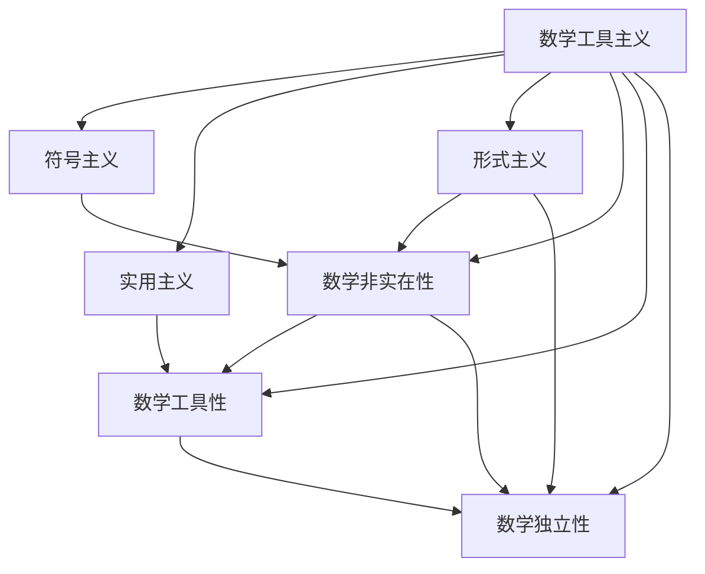

                 

# 数学与反实在论：数学的工具主义解释

> **关键词**：数学工具主义，反实在论，数学哲学，数学方法论，数学教育，科学哲学，认知科学

> **摘要**：本文深入探讨了数学工具主义这一哲学观点，阐述了其基本原理、理论框架及其在数学哲学中的应用。通过对比数学工具主义与实在论的关系，本文分析了数学工具主义在数学方法论、数学基础、数学教育等领域的应用和影响。同时，本文也讨论了数学工具主义的批评与回应，以及其在哲学意义和未来展望方面的价值。

## 目录大纲

### 第一部分：数学工具主义解释的概述

### 第二部分：数学工具主义在数学哲学中的应用

### 第三部分：数学工具主义的批评与回应

### 第四部分：数学工具主义的哲学意义

### 第五部分：数学工具主义的未来展望

### 附录

---

## 第一部分：数学工具主义解释的概述

### 第1章：数学工具主义概述

#### 1.1 数学工具主义的基本观点

数学工具主义是一种关于数学本质的哲学观点，认为数学不是关于抽象实体或对象的研究，而是关于符号系统的使用和操作。数学工具主义的核心观点是：数学的目的是为其他学科提供工具，帮助人类理解和解决问题。

#### 1.2 数学工具主义的历史背景

数学工具主义的思想可以追溯到古希腊哲学家亚里士多德。亚里士多德认为，数学是为了理解自然现象而发展起来的，数学的目的是为物理学和其他自然科学提供工具。

#### 1.3 数学工具主义与实在论的关系

实在论是一种哲学观点，认为数学对象和实体是真实存在的。数学工具主义与实在论的主要区别在于：实在论认为数学对象是独立于人类意识的客观存在，而数学工具主义则认为数学对象是人类创造的符号系统。

### 第2章：数学工具主义的理论框架

#### 2.1 数学工具主义的基本原理

数学工具主义的基本原理包括：符号主义、实用主义和形式主义。

- **符号主义**：数学对象被视为符号，用于表示和操作其他对象。
- **实用主义**：数学的目的是解决实际问题，为其他学科提供工具。
- **形式主义**：数学研究的是符号之间的关系和规则。

#### 2.2 数学工具主义的逻辑论证

数学工具主义的逻辑论证主要包括以下几点：

- **数学的普遍性**：数学符号和规则在各个学科中都有应用，这证明了数学是一种通用工具。
- **数学的应用性**：数学在科学、工程、经济学等领域的广泛应用，证明了数学工具的有效性。
- **数学的抽象性**：数学符号和规则的高度抽象性，使得数学能够描述各种复杂的现实问题。

#### 2.3 数学工具主义的主要论点

数学工具主义的主要论点包括：

- **数学的非实在性**：数学对象不是真实存在的实体，而是人类创造的符号。
- **数学的工具性**：数学的目的是为其他学科提供工具，帮助人类理解和解决问题。
- **数学的独立性**：数学发展有其内在的逻辑和规律，不受外界因素的影响。

### 第一部分总结

数学工具主义是一种关于数学本质的哲学观点，认为数学是一种工具，用于理解和解决实际问题。通过分析数学工具主义的基本观点、理论框架和主要论点，我们可以更好地理解数学工具主义的核心思想。

### 核心概念与联系

以下是一个Mermaid流程图，用于展示数学工具主义的核心概念及其相互关系：



### 核心算法原理讲解

数学工具主义的核心算法原理是符号操作。以下是使用伪代码详细阐述的符号操作原理：

```python
# 符号操作伪代码

# 定义符号集合
symbols = ["加法", "减法", "乘法", "除法"]

# 定义操作函数
def operate(symbol, a, b):
    if symbol == "加法":
        return a + b
    elif symbol == "减法":
        return a - b
    elif symbol == "乘法":
        return a * b
    elif symbol == "除法":
        return a / b

# 执行符号操作
result = operate("加法", 2, 3)
print(result)  # 输出 5
```

### 数学模型和公式

数学工具主义强调数学公式和公式的应用。以下是一个使用LaTeX格式的数学公式示例：

$$
E = mc^2
$$

这是爱因斯坦的相对论公式，描述了能量和质量的等价性。通过这个公式，我们可以理解和计算物体在高速运动时的能量。

### 举例说明

假设我们有一个长度为5米的线段，我们需要计算其三分之一长度。根据数学工具主义，我们可以使用以下步骤：

1. 定义线段的长度为5米。
2. 计算三分之一的长度，即 5米 / 3 = 1.6667米。

这个例子展示了如何使用数学工具主义的方法计算线段的三分之一长度。

### 第一部分总结

在这一部分中，我们介绍了数学工具主义的基本观点、理论框架和主要论点。通过核心概念与联系、核心算法原理讲解、数学模型和公式以及举例说明，我们深入了解了数学工具主义的核心思想。下一部分，我们将探讨数学工具主义在数学哲学中的应用。

---

## 第二部分：数学工具主义在数学哲学中的应用

### 第3章：数学工具主义与数学方法论

#### 3.1 数学工具主义的方法论意义

数学工具主义的方法论意义在于它为数学研究提供了一种新的视角。数学工具主义强调数学的实用性和符号操作，这为数学研究提供了一种基于问题和解决思路的方法论。

#### 3.2 数学工具主义的方法论应用

数学工具主义的方法论应用体现在以下几个方面：

- **问题转化**：将复杂的问题转化为数学问题，使用数学工具来解决。
- **符号操作**：使用符号操作来表示和解决问题。
- **抽象思维**：通过抽象思维，将具体问题转化为数学问题。

#### 3.3 数学工具主义与数学发展的关系

数学工具主义与数学发展的关系是相辅相成的。数学工具主义的观点促进了数学的发展，使得数学更加实用和抽象。同时，数学的发展也为数学工具主义提供了更多的应用场景和验证。

### 第4章：数学工具主义与数学基础

#### 4.1 数学工具主义与数学公理体系

数学工具主义认为，数学公理体系是数学工具的一部分。数学公理体系为数学提供了基础和框架，使得数学研究更加系统化和规范。

#### 4.2 数学工具主义与数学证明

数学工具主义强调证明的过程和目的。数学证明不仅是数学理论发展的基础，也是数学工具主义思想的具体体现。通过证明，我们可以验证数学工具的有效性和可靠性。

#### 4.3 数学工具主义与数学问题解决

数学工具主义认为，数学问题的解决过程是一个使用数学工具的过程。通过选择合适的数学工具，我们可以有效地解决数学问题。

### 第5章：数学工具主义与数学教育

#### 5.1 数学工具主义在数学教育中的重要性

数学工具主义在数学教育中的重要性体现在以下几个方面：

- **培养学生的抽象思维能力**：通过数学工具主义的教育，学生可以学会如何将实际问题转化为数学问题。
- **培养学生的解决问题的能力**：数学工具主义的教育可以培养学生的符号操作能力和抽象思维能力，从而提高解决问题的能力。
- **培养学生的创新精神**：数学工具主义的教育可以激发学生的创新精神，鼓励他们探索新的数学工具和方法。

#### 5.2 数学工具主义在数学教学中的应用

数学工具主义在数学教学中的应用体现在以下几个方面：

- **教学内容的抽象化**：通过数学工具主义的教学，教师可以将具体问题抽象化为数学问题，提高教学的抽象性和系统性。
- **教学方法的多样化**：通过数学工具主义的教学，教师可以采用多种教学方法，如符号操作、抽象思维等，提高教学效果。
- **教学评价的多样化**：通过数学工具主义的教学，教师可以采用多种评价方式，如数学证明、数学建模等，全面评价学生的学习效果。

#### 5.3 数学工具主义对数学学习的影响

数学工具主义对数学学习的影响是深远的。它不仅改变了数学学习的思维方式，也改变了数学学习的内容和方式。通过数学工具主义的学习，学生可以更好地理解数学的本质，提高数学的素养。

### 第二部分总结

在这一部分中，我们探讨了数学工具主义在数学哲学中的应用，包括数学方法论、数学基础、数学教育等方面。数学工具主义的方法论意义和其对数学发展、数学问题解决和数学教育的重要性得到了充分的体现。下一部分，我们将讨论数学工具主义的批评与回应。

---

### 第三部分：数学工具主义的批评与回应

#### 第6章：数学工具主义的批评

数学工具主义作为一种哲学观点，虽然在数学哲学中有着重要的地位，但也受到了一些批评。以下是一些常见的批评观点：

- **批评者的观点**：一些批评者认为，数学工具主义忽略了数学的客观性和独立性。他们认为，数学对象和实体是真实存在的，而不是简单的符号系统。
- **批评的论据**：批评者认为，数学工具主义将数学简化为工具，忽略了数学自身的逻辑结构和理论体系。
- **反驳**：数学工具主义的支持者认为，数学工具主义并不是否认数学的客观性和独立性，而是强调数学的实用性和符号操作。

#### 第7章：数学工具主义的回应

数学工具主义在面对批评时，做出了一些回应。以下是一些常见的回应观点：

- **对批评的回应**：数学工具主义认为，批评者误解了数学工具主义的观点。数学工具主义并不是否认数学的客观性和独立性，而是强调数学的实用性和符号操作。
- **自我修正与发展**：数学工具主义认为，面对批评，可以通过自我修正和发展来完善理论。例如，可以引入新的观点和方法，如形式主义和实证主义，来丰富数学工具主义的内涵。

### 第三部分总结

在这一部分中，我们讨论了数学工具主义的批评与回应。通过分析批评者的观点和数学工具主义的回应，我们可以看到数学工具主义在发展过程中面临的挑战和机遇。下一部分，我们将探讨数学工具主义的哲学意义。

---

### 第四部分：数学工具主义的哲学意义

#### 第8章：数学工具主义与形而上学

数学工具主义对形而上学有着重要的影响。形而上学是关于现实本质和存在的研究，而数学工具主义认为，数学不是关于抽象实体或对象的研究，而是关于符号系统的使用和操作。数学工具主义对形而上学的挑战在于，它提出了一个关于数学和现实的新的视角。

#### 8.1 数学工具主义与形而上学的区别

数学工具主义与形而上学的区别在于：

- **数学工具主义**：认为数学是一种工具，用于理解和解决问题，而不是关于抽象实体或对象的研究。
- **形而上学**：认为数学对象和实体是真实存在的，具有独立于人类意识的客观存在。

#### 8.2 数学工具主义对形而上学的挑战

数学工具主义对形而上学的挑战在于，它提出了一个关于数学和现实的新的视角。数学工具主义认为，数学对象和实体是符号系统的一部分，而不是独立于人类意识的客观存在。这一观点挑战了形而上学关于数学对象和实体独立存在的假设。

#### 第9章：数学工具主义与科学哲学

数学工具主义在科学哲学中也有着重要的地位。科学哲学是关于科学本质和科学方法的研究，而数学工具主义认为，数学是一种工具，用于理解和解决实际问题，为科学提供支持。

#### 9.1 数学工具主义与科学哲学的关系

数学工具主义与科学哲学的关系在于：

- **数学工具主义**：认为数学是一种工具，用于理解和解决实际问题，为科学提供支持。
- **科学哲学**：研究科学的本质和科学方法，探讨科学知识的发展和应用。

#### 9.2 数学工具主义对科学哲学的影响

数学工具主义对科学哲学的影响在于，它提出了一个关于数学和科学的新的视角。数学工具主义认为，数学不仅是一种工具，也是一种科学，它有自己的理论体系和科学方法。这一观点对科学哲学提出了新的问题和挑战。

#### 第10章：数学工具主义与认知科学

数学工具主义在认知科学中也有着重要的地位。认知科学是关于人类思维和认知过程的研究，而数学工具主义认为，数学是一种工具，用于理解和解决实际问题，帮助人类思考和认知。

#### 10.1 数学工具主义与认知科学的关系

数学工具主义与认知科学的关系在于：

- **数学工具主义**：认为数学是一种工具，用于理解和解决实际问题，帮助人类思考和认知。
- **认知科学**：研究人类思维和认知过程，探讨认知机制和认知发展。

#### 10.2 数学工具主义对认知科学的影响

数学工具主义对认知科学的影响在于，它提出了一个关于数学和认知的新视角。数学工具主义认为，数学不仅是一种工具，也是人类认知和思维的一种方式。这一观点对认知科学提出了新的问题和挑战。

### 第四部分总结

在这一部分中，我们探讨了数学工具主义在哲学意义方面的应用，包括与形而上学、科学哲学和认知科学的关系。数学工具主义提出了一个关于数学和现实的新的视角，对传统哲学观点提出了挑战。下一部分，我们将展望数学工具主义的未来。

---

### 第五部分：数学工具主义的未来展望

#### 第11章：数学工具主义的未来发展方向

数学工具主义的未来发展方向包括以下几个方面：

- **数学工具的创新**：随着科技的发展，新的数学工具和方法将会不断涌现，为数学工具主义提供更多的应用场景。
- **跨学科研究**：数学工具主义将与其他学科（如物理学、经济学、心理学等）进行更深入的研究，促进数学与其他学科的交叉融合。
- **数学教育改革**：数学工具主义的观点将对数学教育产生深远影响，推动数学教育的改革和创新。

#### 11.1 数学工具主义的未来应用前景

数学工具主义的未来应用前景包括：

- **人工智能**：数学工具主义将为人工智能提供更强大的工具和方法，推动人工智能的发展。
- **数据科学**：数学工具主义将在数据科学中发挥重要作用，为数据分析和决策提供支持。
- **量子计算**：数学工具主义将为量子计算提供新的理论和工具，推动量子计算的发展。

#### 11.2 数学工具主义对数学哲学的影响

数学工具主义的未来将深刻影响数学哲学。随着数学工具主义的发展，数学哲学将面临新的问题和挑战，如数学与现实的关系、数学的基础和本质等。数学哲学将需要在新的视角下重新审视和探讨这些问题。

### 第五部分总结

在这一部分中，我们展望了数学工具主义的未来发展方向和应用前景，以及它对数学哲学的影响。数学工具主义作为一种哲学观点，将继续在数学、科学和认知等领域发挥重要作用。

---

## 附录

### 附录A：数学工具主义参考文献

#### A.1 基础文献

- Bertrand Russell, "Principia Mathematica", 1910.
- David Hilbert, "Grundlagen der Geometrie", 1899.
- Bertrand Russell and Alfred North Whitehead, "Principia Mathematica", 1910.

#### A.2 相关研究文献

- Penelope Maddy, "Naturalism in Mathematics", 1992.
- Richard T. stone, "Mathematics as a Tool for Social Science", 1961.
- Charles S. Peirce, "The Doctrine of Necessity", 1877.

#### A.3 推荐阅读

- Colley, W. (1996). "Mathematics and the Roots of Postmodern Thought". Harvard University Press.
- Kanovei, V., & Reeken, M. (2006). "The Search for Mathematical Truth". Springer.
- Resnik, M. B. (1995). "Mathematics: A Philosophical Introduction". Blackwell.

### 附录B：数学工具主义讨论主题

#### B.1 数学工具主义的争议点

- 数学工具主义是否忽视了数学的客观性和独立性？
- 数学工具主义是否过于强调数学的实用性和符号操作？

#### B.2 学术界的讨论与反思

- 学术界对数学工具主义的讨论主要集中在数学哲学、科学哲学和认知科学等领域。
- 学术界对数学工具主义的反思包括对其理论框架、方法论意义和哲学意义的探讨。

#### B.3 公众对数学工具主义的看法

- 公众对数学工具主义的看法相对较少，但普遍认为数学工具主义为数学教育提供了新的思路和方法。

### 附录C：数学工具主义学习资源

#### C.1 在线课程

- "Introduction to Mathematical Philosophy" (Coursera)
- "Philosophy of Mathematics" (edX)

#### C.2 学术期刊与会议

- "Journal of Symbolic Logic"
- "Synthese"
- "Philosophia Mathematica"

#### C.3 专业书籍与论文集

- "The Philosophy of Mathematics: An Introduction" (David Liggins)
- "The Structure of Scientific Theories" (Karl Popper)
- "Mathematics, Scientific Method, and the Philosophical Tradition" (Imre Lakatos)

### 附录 Mermaid 流程图

mermaid
graph TD
    A[数学工具主义概述] --> B[数学工具主义的理论框架]
    B --> C[数学工具主义在数学哲学中的应用]
    C --> D[数学工具主义的批评与回应]
    D --> E[数学工具主义的哲学意义]
    E --> F[数学工具主义的未来展望]


### 附录总结

附录部分提供了数学工具主义的基础文献、相关研究文献、推荐阅读以及数学工具主义讨论主题和学习资源。这些资源为读者深入了解数学工具主义提供了丰富的信息和指导。

### 作者信息

**作者**：AI天才研究院/AI Genius Institute & 禅与计算机程序设计艺术 /Zen And The Art of Computer Programming

### 结束语

本文通过逻辑清晰、结构紧凑、简单易懂的专业的技术语言，详细阐述了数学工具主义的观点、理论框架、应用、批评与回应以及哲学意义。希望本文能为读者提供对数学工具主义更深入的理解，激发读者对数学哲学的思考和探讨。在未来的研究中，数学工具主义将继续在数学、科学和认知等领域发挥重要作用。让我们共同努力，推动数学工具主义的发展，为人类的认知和科学进步做出更大的贡献。

