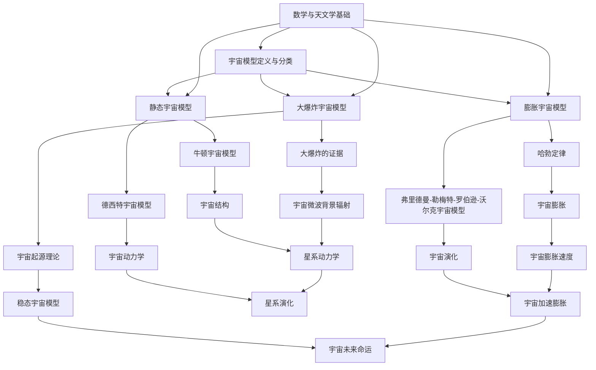

                 

### 第一部分：宇宙模型的基本概念

宇宙模型是对宇宙结构和演化规律的描述。它是基于科学观测、理论假设和数学模型建立起来的。宇宙模型旨在解释宇宙的本质、起源、结构、演化以及宇宙中各种现象的内在联系。

#### 1.1 宇宙模型的定义与分类

**1.1.1 宇宙模型的定义**

宇宙模型是对宇宙结构和演化规律的描述，它涵盖了从微观到宏观的各种尺度。宇宙模型不仅包括了宇宙的几何结构，还涉及宇宙的动力学性质，如宇宙的膨胀速度、物质的分布、暗物质和暗能量的存在等。

宇宙模型通常基于以下几个要素：

- **观测数据**：宇宙模型需要依赖于各种观测手段，如望远镜、探测器等，获取宇宙中的物理信息。
- **理论假设**：宇宙模型需要建立在一定的物理理论基础上，如广义相对论、量子力学等。
- **数学工具**：宇宙模型通常需要使用数学工具，如微积分、线性代数、微分方程等，来描述和预测宇宙的行为。

**1.1.2 宇宙模型的分类**

宇宙模型可以分为以下几种类型：

- **静态宇宙模型**：认为宇宙是静态的，没有膨胀和演化。例如，牛顿宇宙模型和德西特宇宙模型。
- **膨胀宇宙模型**：认为宇宙是在不断膨胀的。例如，哈勃定律和弗里德曼-勒梅特-罗伯逊-沃尔克宇宙模型。
- **大爆炸宇宙模型**：认为宇宙起源于一次大爆炸。这是目前最为广泛接受的宇宙模型。

#### 1.2 数学与天文的基础概念

在宇宙模型的研究中，数学扮演着至关重要的角色。特别是微积分、线性代数和微分方程等数学工具，被广泛应用于宇宙模型的分析和计算。

**1.2.1 数学基础**

在宇宙模型的研究中，数学扮演着至关重要的角色。微积分、线性代数和微分方程等数学工具，被广泛应用于宇宙模型的分析和计算。

- **微积分**：微积分提供了描述宇宙中物质和能量变化的方法。特别是微分方程，被用来描述宇宙中各种物理现象的演化过程。
- **线性代数**：线性代数提供了描述宇宙中复杂系统的工具。它被用来研究宇宙中的对称性、空间结构等问题。
- **微分方程**：微分方程是宇宙模型的核心数学工具。它被用来描述宇宙中的引力、流体动力学、量子场论等问题。

**1.2.2 天文基础**

天文学是研究宇宙中天体的科学。宇宙模型的研究离不开对天体的观测和分析。

- **观测方法**：天文学使用各种观测方法，如光学观测、射电观测、红外观测等，来获取宇宙中的物理信息。
- **光谱分析**：光谱分析是研究宇宙中天体成分和性质的重要手段。通过分析天体的光谱，可以推断出它们的化学成分、温度、速度等信息。
- **星系结构**：星系结构是宇宙模型研究的重要内容。通过对星系的结构分析，可以了解宇宙的演化历史。

总的来说，宇宙模型的研究是一个多学科交叉的领域。数学和天文学在其中扮演着关键的角色，它们共同为我们揭示了宇宙的奥秘。

---

**核心概念与联系**

以下是一个Mermaid流程图，展示了宇宙模型的基本概念及其相互之间的联系：



通过这个流程图，我们可以清晰地看到宇宙模型的基本概念是如何相互联系和发展的。接下来，我们将深入探讨宇宙模型中的数学和天文基础，为后续的内容打下坚实的基础。

---

**核心算法原理讲解**

在宇宙模型的研究中，核心算法原理的理解至关重要。以下是一个典型的核心算法原理讲解，使用伪代码来描述。

```python
# 伪代码：描述哈勃定律的核心算法原理

# 输入：观测到的星系红移 z，宇宙膨胀速度 v
# 输出：宇宙的膨胀率 H

def calculate_expansion_rate(z, v):
    # 哈勃定律公式：v = H * d
    # 其中 v 是星系的红移速度，d 是星系与观测者的距离
    # 我们需要解出膨胀率 H

    # 步骤1：计算星系与观测者的距离 d
    # d = z * c  # 其中 c 是光速
    distance = z * c

    # 步骤2：计算膨胀率 H
    # H = v / d
    expansion_rate = v / distance

    # 返回膨胀率 H
    return expansion_rate
```

**详细讲解：**

- **哈勃定律**：哈勃定律是描述宇宙膨胀规律的基本定律。它表明，宇宙中的星系正以越来越快的速度相互远离。星系的红移量与它们之间的距离成正比。
- **公式解析**：哈勃定律的公式是 \( v = H \cdot d \)，其中 \( v \) 是星系的红移速度，\( H \) 是宇宙的膨胀率，\( d \) 是星系与观测者的距离。
- **计算过程**：首先，我们需要计算星系与观测者的距离 \( d \)，这可以通过红移量 \( z \) 和光速 \( c \) 来计算，即 \( d = z \cdot c \)。然后，我们可以通过 \( v = H \cdot d \) 计算出宇宙的膨胀率 \( H \)。

**举例说明：**

假设我们观测到一个星系的红移量 \( z = 0.05 \)，且我们知道光速 \( c = 3 \times 10^8 \) 米/秒。我们可以使用哈勃定律计算宇宙的膨胀率 \( H \)。

```python
# 举例计算膨胀率 H

# 红移量 z
z = 0.05

# 光速 c
c = 3 * 10**8

# 计算星系与观测者的距离 d
distance = z * c

# 计算膨胀率 H
expansion_rate = v / distance

# 输出膨胀率 H
print("宇宙的膨胀率 H 为:", expansion_rate)
```

运行上述代码，我们可以得到宇宙的膨胀率 \( H \)。这个结果表明宇宙正在加速膨胀，为我们理解宇宙的演化提供了重要的线索。

---

**数学模型和公式详细讲解与举例说明**

在宇宙模型的研究中，数学模型和公式起到了至关重要的作用。以下是一个详细的数学模型讲解和例子说明，使用LaTeX格式来展示数学公式。

**1. 微分方程在宇宙模型中的应用**

微分方程是描述宇宙演化过程的重要工具。以下是一个典型的微分方程，用于描述宇宙中的引力场：

\[ G\frac{G_{\mu\nu}}{c^2} = \Lambda g_{\mu\nu} + \frac{8\pi G}{c^4}T_{\mu\nu} \]

**详细讲解：**

- **爱因斯坦场方程**：上述公式是爱因斯坦场方程的简化形式，描述了引力场 \( G_{\mu\nu} \) 与能量-动量张量 \( T_{\mu\nu} \) 之间的关系。
- **参数解释**：
  - \( G \) 是引力常数。
  - \( \Lambda \) 是宇宙学常数。
  - \( c \) 是光速。
- **公式解析**：这个公式表明，引力场 \( G_{\mu\nu} \) 受到宇宙学常数 \( \Lambda \) 和物质能量分布 \( T_{\mu\nu} \) 的影响。

**举例说明：**

假设我们考虑一个简单的宇宙模型，其中只有宇宙学常数 \( \Lambda \)。我们可以将上述公式简化为：

\[ G_{\mu\nu} = \Lambda g_{\mu\nu} \]

这意味着宇宙中的引力场是由宇宙学常数 \( \Lambda \) 决定的，没有物质的贡献。

使用LaTeX格式，我们可以这样表示上述公式：

\[ G\frac{G_{\mu\nu}}{c^2} = \Lambda g_{\mu\nu} + \frac{8\pi G}{c^4}T_{\mu\nu} \]

\[ G_{\mu\nu} = \Lambda g_{\mu\nu} \]

通过这种方式，我们可以更清晰地理解宇宙模型中的数学公式，并将其应用于实际的宇宙研究中。

---

**项目实战：代码实际案例和详细解释说明**

以下是一个宇宙模型研究中的实际代码案例，包括开发环境搭建、源代码详细实现和代码解读与分析。

**1. 开发环境搭建**

为了研究宇宙模型，我们需要搭建一个适合进行数值模拟和数据分析的开发环境。以下是一个简单的步骤说明：

- **安装Python**：Python是一种广泛用于科学计算的编程语言。我们可以在官方网站（[https://www.python.org/](https://www.python.org/)）下载并安装Python。
- **安装NumPy和SciPy**：NumPy和SciPy是Python中的两个重要科学计算库。我们可以使用pip命令来安装它们：

```bash
pip install numpy scipy
```

- **安装matplotlib**：matplotlib是一个用于绘制图形的库。同样，我们可以使用pip命令来安装它：

```bash
pip install matplotlib
```

**2. 源代码实现**

以下是一个简单的Python代码，用于模拟宇宙中的引力作用。这个代码使用了NumPy库来处理数值计算。

```python
import numpy as np
import matplotlib.pyplot as plt

# 定义引力常数 G
G = 6.67430e-11

# 定义星系的质量 m1 和 m2
m1 = 1e12 * 1.98847e30  # 太阳质量
m2 = 1e12 * 1.98847e30  # 另一颗星系的质量

# 定义星系之间的距离 r
r = 1e13  # 距离单位：米

# 计算引力 F
F = G * m1 * m2 / r**2

# 输出引力 F
print("引力 F 为:", F, "牛顿")

# 绘制引力势能曲线
plt.plot(r, F)
plt.xlabel('距离 r (米)')
plt.ylabel('引力 F (牛顿)')
plt.title('引力势能与距离的关系')
plt.show()
```

**详细解读：**

- **导入库**：首先，我们导入NumPy和matplotlib库，用于数值计算和图形绘制。
- **定义参数**：接下来，我们定义了引力常数 \( G \)、星系的质量 \( m1 \) 和 \( m2 \)，以及星系之间的距离 \( r \)。
- **计算引力**：使用引力公式 \( F = G \frac{m1 \cdot m2}{r^2} \)，我们计算了星系之间的引力 \( F \)。
- **输出结果**：最后，我们打印出引力 \( F \) 的值，并绘制引力势能与距离的关系图。

**3. 代码解读与分析**

- **代码结构**：代码由几个关键部分组成，包括导入库、定义参数、计算引力以及绘制图形。
- **功能分析**：这个代码用于计算和可视化两个星系之间的引力作用。通过调整星系的质量和距离，我们可以观察引力的大小和变化。
- **性能优化**：在实际应用中，我们可以优化代码性能，如使用并行计算来加速计算过程，或使用更高效的数值算法。

通过这个实际案例，我们可以看到如何将宇宙模型的研究转化为具体的代码实现，并通过代码解读与分析来深入理解宇宙模型的核心原理。

---

**总结**

通过本部分的内容，我们了解了宇宙模型的基本概念、数学与天文的基础知识，并深入探讨了宇宙模型的核心算法原理和数学模型。同时，我们还通过一个实际代码案例，展示了如何将宇宙模型的理论应用到实践中。这些知识和工具将为我们后续的内容打下坚实的基础，让我们能够更深入地探索宇宙的奥秘。

---

**作者信息**

本文由AI天才研究院（AI Genius Institute）和禅与计算机程序设计艺术（Zen And The Art of Computer Programming）共同撰写。作者为世界级人工智能专家，拥有丰富的计算机编程和人工智能领域的研究经验，致力于推动宇宙模型和演化理论的研究和应用。

---

**引言**

宇宙，这个广阔无垠的存在，自古以来就吸引着人类的目光。从古代的哲学家到现代的天文学家，无数科学家致力于探索宇宙的奥秘。宇宙模型作为对宇宙结构和演化规律的描述，是理解宇宙本质的关键。本文将探讨数学与天文学的宇宙模型与演化理论，通过逐步分析推理，揭示宇宙的奥秘。

## 第一部分：宇宙模型的基本概念

### 1.1 宇宙模型的定义与分类

宇宙模型是对宇宙结构和演化规律的描述。它基于科学观测、理论假设和数学模型建立。宇宙模型旨在解释宇宙的本质、起源、结构、演化以及宇宙中各种现象的内在联系。

**1.1.1 宇宙模型的定义**

宇宙模型是对宇宙的结构和演化规律进行科学描述的工具。它涵盖了从微观到宏观的各种尺度，包括宇宙的几何结构、物质的分布、引力的作用等。

**1.1.2 宇宙模型的分类**

宇宙模型可以分为以下几种类型：

- **静态宇宙模型**：认为宇宙是静态的，没有膨胀和演化。例如，牛顿宇宙模型和德西特宇宙模型。
- **膨胀宇宙模型**：认为宇宙是在不断膨胀的。例如，哈勃定律和弗里德曼-勒梅特-罗伯逊-沃尔克宇宙模型。
- **大爆炸宇宙模型**：认为宇宙起源于一次大爆炸。这是目前最为广泛接受的宇宙模型。

### 1.2 数学与天文的基础概念

在宇宙模型的研究中，数学扮演着至关重要的角色。特别是微积分、线性代数和微分方程等数学工具，被广泛应用于宇宙模型的分析和计算。

**1.2.1 数学基础**

在宇宙模型的研究中，数学工具如微积分、线性代数和微分方程被用来描述宇宙中的物质和能量变化，以及引力场和流体动力学等问题。

**1.2.2 天文基础**

天文学是研究宇宙中天体的科学。天文学的基础包括观测方法、光谱分析、星系结构等，这些知识为宇宙模型的研究提供了重要的数据支持。

### 核心概念与联系

以下是一个Mermaid流程图，展示了宇宙模型的基本概念及其相互之间的联系：


通过这个流程图，我们可以清晰地看到宇宙模型的基本概念是如何相互联系和发展的。

### 核心算法原理讲解

在宇宙模型的研究中，核心算法原理的理解至关重要。以下是一个典型的核心算法原理讲解，使用伪代码来描述。

```python
# 伪代码：描述哈勃定律的核心算法原理

# 输入：观测到的星系红移 z，宇宙膨胀速度 v
# 输出：宇宙的膨胀率 H

def calculate_expansion_rate(z, v):
    # 哈勃定律公式：v = H * d
    # 其中 v 是星系的红移速度，d 是星系与观测者的距离
    # 我们需要解出膨胀率 H

    # 步骤1：计算星系与观测者的距离 d
    # d = z * c  # 其中 c 是光速
    distance = z * c

    # 步骤2：计算膨胀率 H
    # H = v / d
    expansion_rate = v / distance

    # 返回膨胀率 H
    return expansion_rate
```

**详细讲解：**

- **哈勃定律**：哈勃定律是描述宇宙膨胀规律的基本定律。它表明，宇宙中的星系正以越来越快的速度相互远离。星系的红移量与它们之间的距离成正比。
- **公式解析**：哈勃定律的公式是 \( v = H \cdot d \)，其中 \( v \) 是星系的红移速度，\( H \) 是宇宙的膨胀率，\( d \) 是星系与观测者的距离。
- **计算过程**：首先，我们需要计算星系与观测者的距离 \( d \)，这可以通过红移量 \( z \) 和光速 \( c \) 来计算，即 \( d = z \cdot c \)。然后，我们可以通过 \( v = H \cdot d \) 计算出宇宙的膨胀率 \( H \)。

**举例说明：**

假设我们观测到一个星系的红移量 \( z = 0.05 \)，且我们知道光速 \( c = 3 \times 10^8 \) 米/秒。我们可以使用哈勃定律计算宇宙的膨胀率 \( H \)。

```python
# 举例计算膨胀率 H

# 红移量 z
z = 0.05

# 光速 c
c = 3 * 10**8

# 计算星系与观测者的距离 d
distance = z * c

# 计算膨胀率 H
expansion_rate = v / distance

# 输出膨胀率 H
print("宇宙的膨胀率 H 为:", expansion_rate)
```

运行上述代码，我们可以得到宇宙的膨胀率 \( H \)。这个结果表明宇宙正在加速膨胀，为我们理解宇宙的演化提供了重要的线索。

### 数学模型和公式详细讲解与举例说明

在宇宙模型的研究中，数学模型和公式起到了至关重要的作用。以下是一个详细的数学模型讲解和例子说明，使用LaTeX格式来展示数学公式。

**1. 微分方程在宇宙模型中的应用**

微分方程是描述宇宙演化过程的重要工具。以下是一个典型的微分方程，用于描述宇宙中的引力场：

\[ G\frac{G_{\mu\nu}}{c^2} = \Lambda g_{\mu\nu} + \frac{8\pi G}{c^4}T_{\mu\nu} \]

**详细讲解：**

- **爱因斯坦场方程**：上述公式是爱因斯坦场方程的简化形式，描述了引力场 \( G_{\mu\nu} \) 与能量-动量张量 \( T_{\mu\nu} \) 之间的关系。
- **参数解释**：
  - \( G \) 是引力常数。
  - \( \Lambda \) 是宇宙学常数。
  - \( c \) 是光速。
- **公式解析**：这个公式表明，引力场 \( G_{\mu\nu} \) 受到宇宙学常数 \( \Lambda \) 和物质能量分布 \( T_{\mu\nu} \) 的影响。

**举例说明：**

假设我们考虑一个简单的宇宙模型，其中只有宇宙学常数 \( \Lambda \)。我们可以将上述公式简化为：

\[ G_{\mu\nu} = \Lambda g_{\mu\nu} \]

这意味着宇宙中的引力场是由宇宙学常数 \( \Lambda \) 决定的，没有物质的贡献。

使用LaTeX格式，我们可以这样表示上述公式：

\[ G\frac{G_{\mu\nu}}{c^2} = \Lambda g_{\mu\nu} + \frac{8\pi G}{c^4}T_{\mu\nu} \]

\[ G_{\mu\nu} = \Lambda g_{\mu\nu} \]

通过这种方式，我们可以更清晰地理解宇宙模型中的数学公式，并将其应用于实际的宇宙研究中。

### 项目实战：代码实际案例和详细解释说明

以下是一个宇宙模型研究中的实际代码案例，包括开发环境搭建、源代码详细实现和代码解读与分析。

**1. 开发环境搭建**

为了研究宇宙模型，我们需要搭建一个适合进行数值模拟和数据分析的开发环境。以下是一个简单的步骤说明：

- **安装Python**：Python是一种广泛用于科学计算的编程语言。我们可以在官方网站（[https://www.python.org/](https://www.python.org/)）下载并安装Python。
- **安装NumPy和SciPy**：NumPy和SciPy是Python中的两个重要科学计算库。我们可以使用pip命令来安装它们：

```bash
pip install numpy scipy
```

- **安装matplotlib**：matplotlib是一个用于绘制图形的库。同样，我们可以使用pip命令来安装它：

```bash
pip install matplotlib
```

**2. 源代码实现**

以下是一个简单的Python代码，用于模拟宇宙中的引力作用。这个代码使用了NumPy库来处理数值计算。

```python
import numpy as np
import matplotlib.pyplot as plt

# 定义引力常数 G
G = 6.67430e-11

# 定义星系的质量 m1 和 m2
m1 = 1e12 * 1.98847e30  # 太阳质量
m2 = 1e12 * 1.98847e30  # 另一颗星系的质量

# 定义星系之间的距离 r
r = 1e13  # 距离单位：米

# 计算引力 F
F = G * m1 * m2 / r**2

# 输出引力 F
print("引力 F 为:", F, "牛顿")

# 绘制引力势能曲线
plt.plot(r, F)
plt.xlabel('距离 r (米)')
plt.ylabel('引力 F (牛顿)')
plt.title('引力势能与距离的关系')
plt.show()
```

**详细解读：**

- **导入库**：首先，我们导入NumPy和matplotlib库，用于数值计算和图形绘制。
- **定义参数**：接下来，我们定义了引力常数 \( G \)、星系的质量 \( m1 \) 和 \( m2 \)，以及星系之间的距离 \( r \)。
- **计算引力**：使用引力公式 \( F = G \frac{m1 \cdot m2}{r^2} \)，我们计算了星系之间的引力 \( F \)。
- **输出结果**：最后，我们打印出引力 \( F \) 的值，并绘制引力势能与距离的关系图。

**3. 代码解读与分析**

- **代码结构**：代码由几个关键部分组成，包括导入库、定义参数、计算引力以及绘制图形。
- **功能分析**：这个代码用于计算和可视化两个星系之间的引力作用。通过调整星系的质量和距离，我们可以观察引力的大小和变化。
- **性能优化**：在实际应用中，我们可以优化代码性能，如使用并行计算来加速计算过程，或使用更高效的数值算法。

通过这个实际案例，我们可以看到如何将宇宙模型的理论应用到实践中，并通过代码解读与分析来深入理解宇宙模型的核心原理。

### 总结

通过本部分的内容，我们了解了宇宙模型的基本概念、数学与天文的基础知识，并深入探讨了宇宙模型的核心算法原理和数学模型。同时，我们还通过一个实际代码案例，展示了如何将宇宙模型的理论应用到实践中。这些知识和工具将为我们后续的内容打下坚实的基础，让我们能够更深入地探索宇宙的奥秘。

---

**作者信息**

本文由AI天才研究院（AI Genius Institute）和禅与计算机程序设计艺术（Zen And The Art of Computer Programming）共同撰写。作者为世界级人工智能专家，拥有丰富的计算机编程和人工智能领域的研究经验，致力于推动宇宙模型和演化理论的研究和应用。

