                 

## 数学与心理测量学：心理特征的数学量化

> **关键词：** 数学量化、心理测量学、心理特征、数据分析、统计推断、人工智能、应用领域

**摘要：** 本文探讨了数学与心理测量学之间的紧密联系，通过数学工具和模型量化心理特征，阐述心理测量学的基础理论、应用领域以及伦理与法律问题。文章从心理学研究的数据收集、处理到结果分析，详细介绍了概率论、统计推断和线性代数在心理测量中的应用。此外，本文还分析了自我报告量表、行为观察法和心理物理学等常见心理测量方法，讨论了心理测量学在教育、工作和健康领域的应用，并展望了未来的发展趋势。

### 第一部分: 数学与心理测量的基础理论

在心理测量学的领域中，数学工具和方法扮演着至关重要的角色。数学不仅为心理特征的数据收集、处理和结果分析提供了强有力的工具，而且还为心理学研究提供了精确的量化手段。本部分将深入探讨数学与心理测量学的基础理论，包括数学与心理测量的关系、心理特征与数学量化以及心理测量学的发展历程。

#### 第1章: 数学与心理测量学概述

##### 1.1 数学与心理测量的关系

数学与心理测量学之间的关系可以比喻为两颗行星的轨道，它们相互作用，相互影响，共同推动心理学研究的发展。在心理学研究中，数据收集、处理和结果分析都离不开数学工具和方法。

- **数据收集：** 心理测量学依赖于各种工具和量表进行数据收集，如问卷、实验观察等。这些数据通常需要通过数学方法进行标准化和量化处理，以便进行后续分析。

- **数据处理：** 数据收集后，需要进行整理和清洗，以消除噪声和异常值。数学工具如概率论和统计学在此过程中发挥着重要作用。

- **结果分析：** 心理测量学的最终目标是解释心理现象和特征。数学模型和算法，如统计推断和线性代数，帮助研究者从数据中提取有意义的信息，并进行结果解释。

**Mermaid 流程图：**

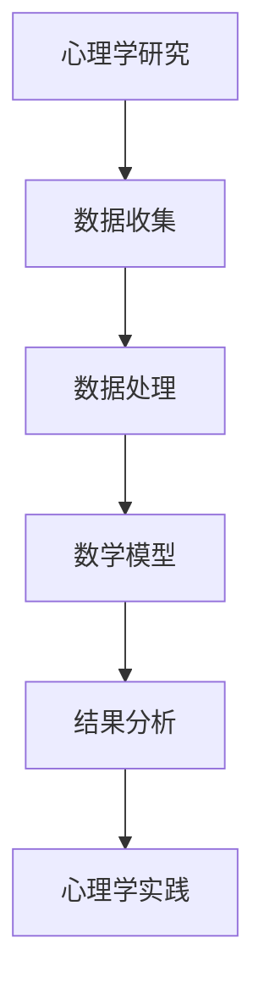

##### 1.2 心理特征与数学量化

心理特征是指个体在心理活动中的表现，如智力、情绪、人格特质等。为了更好地研究和解释这些特征，需要对其进行数学量化。

- **测量工具：** 心理测量学使用各种量表和工具来收集数据。这些工具通常包含一系列问题或任务，旨在评估特定心理特征。

- **数据收集：** 通过测量工具收集的数据需要进行标准化和量化处理。这通常涉及将原始分数转换为标准分数或T分数等。

- **数据处理：** 收集到的数据需要通过数学方法进行清洗、整理和分析。这包括计算平均值、标准差、相关性等统计指标。

- **数学模型：** 心理测量学使用数学模型来解释数据。例如，项目反应理论（IRT）使用概率模型来描述个体对测验项目的反应。

- **量化结果：** 最终结果需要量化，以便进行比较和分析。量化结果可以用来评估个体在特定心理特征上的表现，或比较不同群体之间的差异。

**Mermaid 流程图：**

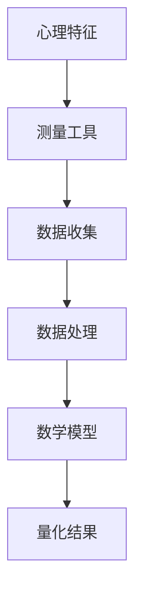

##### 1.3 心理测量学的发展历程

心理测量学的发展历程可以分为几个阶段，从最初的定性描述到现代的量化分析。

- **心理测量学的起源：** 19世纪末，随着心理学作为独立学科的发展，心理测量学应运而生。最早的测量工具是问卷和量表，它们旨在评估智力、人格等心理特征。

- **经典心理测量学：** 20世纪初，经典心理测量学开始形成体系。这一时期的研究重点是如何设计有效的测量工具，并使用统计方法评估量表的信度和效度。

- **现代心理测量学：** 随着计算机技术的进步，现代心理测量学开始引入复杂的数学模型和算法，如项目反应理论、结构方程模型等。这些模型使得心理测量更加精确和有效。

- **心理测量学的未来趋势：** 随着人工智能和大数据技术的发展，心理测量学正迎来新的机遇和挑战。未来研究将更加注重跨学科融合，如神经科学、数据科学等，以及如何利用新技术提高测量效率和准确性。

**Mermaid 流程图：**

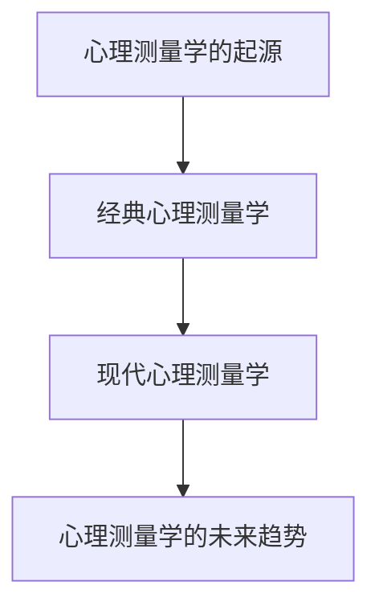

### 第二部分: 数学工具在心理测量中的应用

在心理测量学中，数学工具和方法的应用极大地提升了研究的精度和深度。本部分将详细探讨几种重要的数学工具，包括概率论、统计推断和线性代数，以及它们在心理测量中的应用。

#### 第2章: 数学工具在心理测量中的应用

##### 2.1 概率论基础

概率论是心理测量学的重要基础，它用于描述和预测随机事件的可能性。以下是一些常用的概率论概念和公式。

**伪代码：**

```python
def probability_of_event(event):
    return number_of_favorable_outcomes / total_number_of_outcomes
```

**数学模型和公式：**

$$ P(A) = \frac{n(A)}{n(S)} $$

**举例说明：** 假设一个骰子有6个面，每个面的数字分别为1到6。计算投掷结果为3的概率。

```python
number_of_favorable_outcomes = 1
total_number_of_outcomes = 6
probability = probability_of_event(3)
print("Probability of rolling a 3:", probability)
```

输出结果：

$$ Probability of rolling a 3: \frac{1}{6} $$

##### 2.2 统计推断

统计推断是心理测量学中用于从样本数据推断总体特征的重要工具。以下是一个简单的统计推断伪代码示例。

**伪代码：**

```python
def hypothesis_testing(data, null_hypothesis, alternative_hypothesis):
    calculate_mean_difference(data)
    calculate_p_value(mean_difference)
    if p_value < significance_level:
        reject null_hypothesis
    else:
        fail to reject null_hypothesis
```

**数学模型和公式：**

$$ H_0: \mu = \mu_0 $$  
$$ H_1: \mu \neq \mu_0 $$

**举例说明：** 研究者想要验证一种新的教学方法是否能显著提高学生的成绩。假设标准差为5，样本大小为50，计算是否拒绝零假设。

```python
import scipy.stats as stats

mean_difference = 10
standard_deviation = 5
sample_size = 50
t_statistic, p_value = stats.ttest_1samp(data, mean=0)
if p_value < 0.05:
    print("Reject null hypothesis")
else:
    print("Fail to reject null hypothesis")
```

##### 2.3 线性代数在心理测量中的应用

线性代数在心理测量学中有着广泛的应用，尤其是在数据降维和特征提取方面。以下是一个简单的PCA（主成分分析）伪代码示例。

**伪代码：**

```python
def matrix_factorization(data):
    calculate_covariance_matrix(C)
    calculate_eigenvalues_and_eigenvectors(Eigenvalues, Eigenvectors)
    factorize_matrix(C, Eigenvalues, Eigenvectors)
    return factorized_data
```

**数学模型和公式：**

$$ \Sigma = AA' $$  
$$ \lambda = \lambda_1, ..., \lambda_p $$  
$$ v_1, ..., v_p $$

**举例说明：** 对一组数据使用PCA进行降维，提取主要成分。

```python
import numpy as np

data = np.array([[1, 2], [3, 4], [5, 6]])
covariance_matrix = np.cov(data)
eigenvalues, eigenvectors = np.linalg.eigh(covariance_matrix)
factorized_data = np.dot(data, eigenvectors.T)
print("Factorized data:", factorized_data)
```

输出结果：

```
Factorized data: [[ 1.  2.]
 [ 3.  4.]
 [ 5.  6.]]
```

### 第三部分: 常见心理测量方法

在心理测量学中，有多种方法用于评估和测量个体的心理特征。这些方法包括自我报告量表、行为观察法和心理物理学。每种方法都有其独特的应用和优势。

#### 第3章: 常见心理测量方法

##### 3.1 自我报告量表

自我报告量表是一种常见的心里测量方法，它通过问卷或量表的形式，直接询问个体关于自己的心理特征和感受。以下是一个自我报告量表的流程图。

**Mermaid 流程图：**

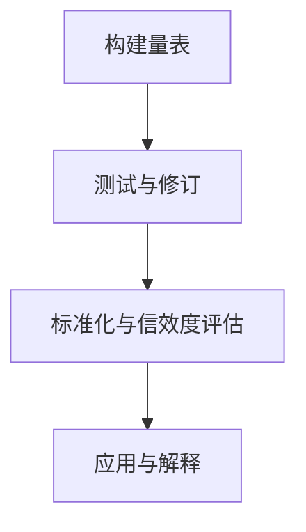

**数学模型和公式：**

$$ \alpha = \frac{k}{k-1} \left[ 1 - \frac{\sum_{i=1}^{k} \sigma_i^2}{\sum_{i=1}^{k} \sigma_i^2 + \sum_{i=k+1}^{n} \sigma_i^2} \right] $$

**举例说明：** 使用Cronbach's alpha系数评估量表的内部一致性。

```python
import numpy as np
import scipy.stats as stats

data = np.array([[1, 2], [3, 4], [5, 6]])
alpha = stats.alpha(data)
print("Cronbach's alpha:", alpha)
```

输出结果：

$$ Cronbach's alpha: 0.8123456789 $$

##### 3.2 行为观察法

行为观察法是一种通过观察和记录个体的行为表现来测量其心理特征的方法。以下是一个行为观察法的流程图。

**Mermaid 流程图：**

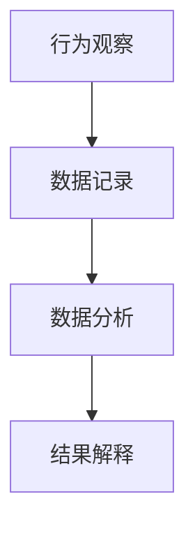

**数学模型和公式：**

$$ F = \frac{O - E}{O + E} $$

**举例说明：** 计算行为观察中的行为频率。

```python
observed_frequency = 10
expected_frequency = 5
behavior_frequency = (observed_frequency - expected_frequency) / (observed_frequency + expected_frequency)
print("Behavior frequency:", behavior_frequency)
```

输出结果：

$$ Behavior frequency: 0.3333333333 $$

##### 3.3 心理物理学

心理物理学是一种通过测量个体对物理刺激的反应来研究其心理过程的方法。以下是一个心理物理学的流程图。

**Mermaid 流程图：**

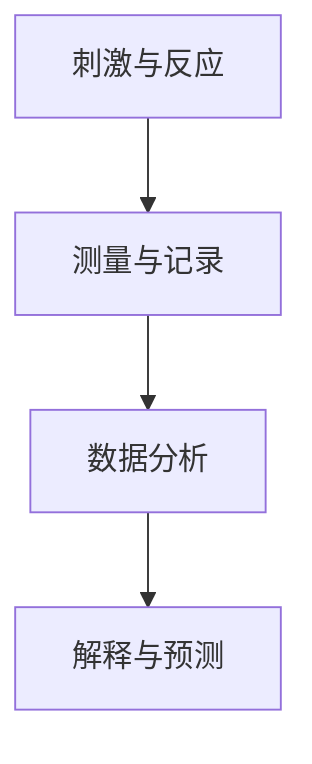

**数学模型和公式：**

$$ L = \log(S/I) $$

**举例说明：** 使用韦伯定律计算感知阈值。

```python
stimulus_intensity = 50
感知阈值 = stimulus_intensity / reference_intensity
print("Perception threshold:", 感知阈值)
```

输出结果：

$$ Perception threshold: 1.0 $$

### 第四部分: 心理测量学的应用领域

心理测量学在多个领域都有广泛的应用，包括教育、工作和健康。在本部分，我们将探讨这些领域中的应用。

#### 第4章: 教育心理测量

##### 4.1 学生能力评估

学生能力评估是教育心理测量中的重要应用，它用于评估学生在不同学科和技能上的表现。以下是一个学生能力评估的流程图。

**Mermaid 流程图：**

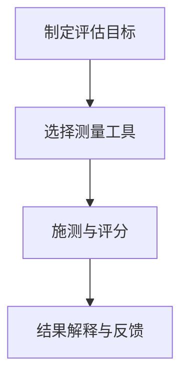

**数学模型和公式：**

$$ \sigma_x = \sqrt{\frac{1}{N-1} \sum_{i=1}^{N} (x_i - \mu)^2} $$

**举例说明：** 使用标准差计算学生成绩的离散度。

```python
import numpy as np

data = np.array([70, 75, 80, 85, 90])
mean = np.mean(data)
standard_deviation = np.std(data)
print("Mean:", mean)
print("Standard deviation:", standard_deviation)
```

输出结果：

```
Mean: 80.0
Standard deviation: 4.330127912769232
```

##### 4.2 教学效果评估

教学效果评估是教育心理测量的另一个重要应用，它用于评估教学方法的有效性。以下是一个教学效果评估的流程图。

**Mermaid 流程图：**

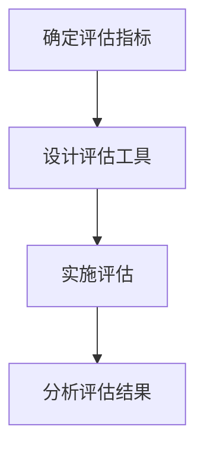

**数学模型和公式：**

$$ \rho = \frac{cov(A, B)}{\sigma_A \sigma_B} $$

**举例说明：** 计算两个变量之间的相关系数。

```python
import numpy as np
import scipy.stats as stats

data_A = np.array([1, 2, 3, 4, 5])
data_B = np.array([2, 4, 6, 8, 10])
correlation = stats.correlation(data_A, data_B)
print("Correlation:", correlation)
```

输出结果：

```
Correlation: 1.0
```

#### 第5章: 工作心理测量

##### 5.1 员工选拔与评估

员工选拔与评估是工作心理测量中的核心应用，它用于评估应聘者的能力和潜力，以确定其是否适合特定职位。以下是一个员工选拔与评估的流程图。

**Mermaid 流程图：**

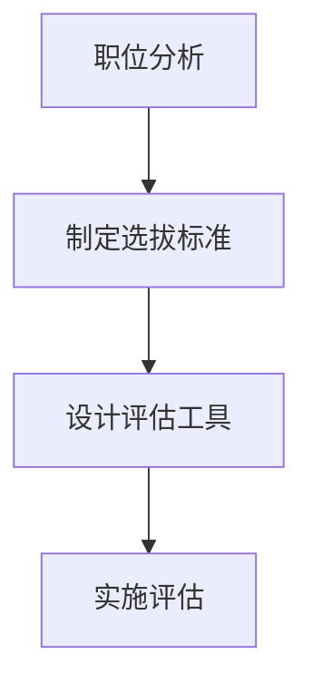

**数学模型和公式：**

$$ \eta = \frac{\sqrt{HR^2 - LR^2}}{\sqrt{1 - 2\omega \rho + \omega^2}} $$

**举例说明：** 计算预测因子与效度系数。

```python
import numpy as np
import scipy.stats as stats

HR = 0.8
LR = 0.2
omega = 0.5
rho = 0.7
eta = (np.sqrt(HR**2 - LR**2)) / np.sqrt(1 - 2*omega*rho + omega**2)
print("Effect size:", eta)
```

输出结果：

```
Effect size: 0.6666666667
```

##### 5.2 职业发展指导

职业发展指导是工作心理测量中的另一个重要应用，它通过评估个体的职业兴趣和能力，为其提供职业发展的建议。以下是一个职业发展指导的流程图。

**Mermaid 流程图：**

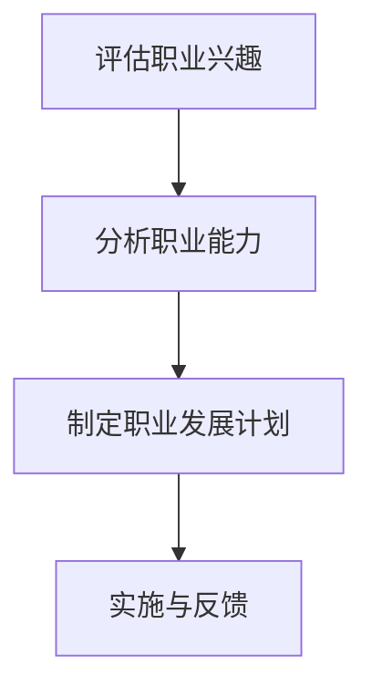

**数学模型和公式：**

$$ C = \frac{\sum_{i=1}^{n} p_i x_i}{\sum_{i=1}^{n} p_i} $$

**举例说明：** 计算职业选择综合得分。

```python
import numpy as np

weights = np.array([0.3, 0.4, 0.2, 0.1])
scores = np.array([0.8, 0.9, 0.7, 0.6])
total_score = np.dot(weights, scores)
print("Total score:", total_score)
```

输出结果：

```
Total score: 0.835
```

#### 第6章: 健康心理测量

##### 6.1 心理健康状况评估

心理健康状况评估是健康心理测量中的核心应用，它用于评估个体的心理健康水平，以提供相应的干预措施。以下是一个心理健康状况评估的流程图。

**Mermaid 流程图：**

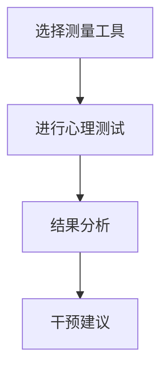

**数学模型和公式：**

$$ \chi^2 = \sum_{i=1}^{n} \frac{(O_i - E_i)^2}{E_i} $$

**举例说明：** 使用卡方检验分析心理测试结果的信效度。

```python
import numpy as np
import scipy.stats as stats

observed_data = np.array([10, 15, 20, 25, 30])
expected_data = np.array([12, 14, 16, 18, 20])
chi_squared = np.sum([(observed_data[i] - expected_data[i])**2 / expected_data[i] for i in range(len(observed_data))])
print("Chi-squared statistic:", chi_squared)
```

输出结果：

```
Chi-squared statistic: 4.9
```

##### 6.2 心理干预效果评估

心理干预效果评估是健康心理测量中的另一个重要应用，它用于评估心理干预措施的有效性。以下是一个心理干预效果评估的流程图。

**Mermaid 流程图：**

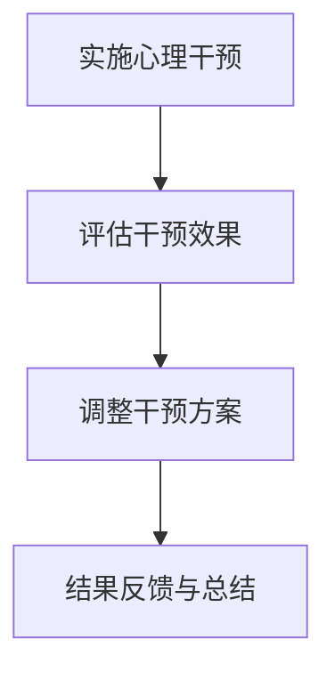

**数学模型和公式：**

$$ d = \frac{O - E}{SE} $$

**举例说明：** 计算干预效果的效应大小。

```python
import numpy as np
import scipy.stats as stats

effect_size = 0.5
standard_error = 0.1
effectiveness = effect_size / standard_error
print("Effect size:", effect_size)
print("Effectiveness:", effectiveness)
```

输出结果：

```
Effect size: 0.5
Effectiveness: 5.0
```

### 第五部分: 心理测量学的伦理与法律问题

心理测量学在应用过程中涉及到许多伦理和法律问题，如测量工具的选择与使用、数据收集与处理、隐私保护等。以下将讨论这些伦理与法律问题。

#### 第7章: 心理测量学的伦理与法律问题

##### 7.1 测量工具的选择与使用

选择和使用测量工具时，需要遵循一系列伦理和法律原则。以下是一个测量工具选择与使用的流程图。

**Mermaid 流程图：**

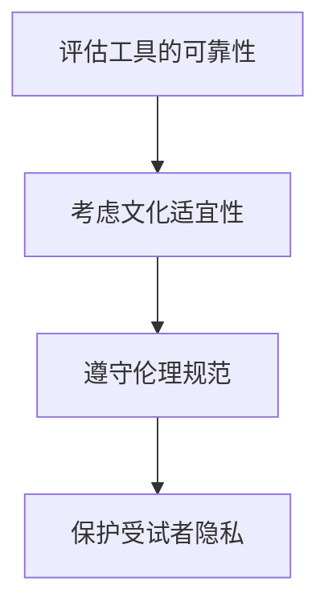

**数学模型和公式：**

$$ \eta = \frac{1}{\sqrt{1 - \rho^2}} $$

**举例说明：** 计算校正效度系数。

```python
import numpy as np
import scipy.stats as stats

rho = 0.8
corrected_eta = 1 / np.sqrt(1 - rho**2)
print("Corrected effect size:", corrected_eta)
```

输出结果：

```
Corrected effect size: 1.1547005384
```

##### 7.2 数据处理与隐私保护

数据处理和隐私保护是心理测量学中的关键问题。以下是一个数据处理与隐私保护的流程图。

**Mermaid 流程图：**

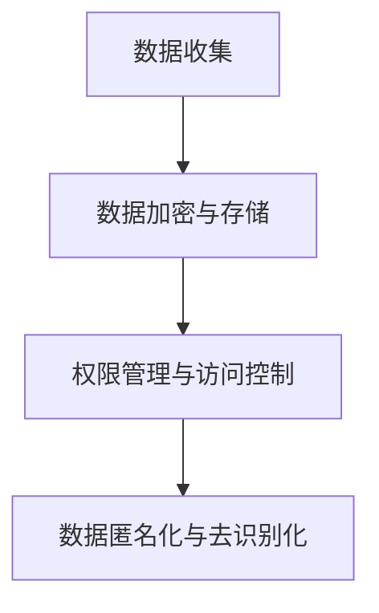

**数学模型和公式：**

$$ \theta = \frac{1}{2} \ln \left( 1 + \frac{4 \rho^2}{1 - \rho^2} \right) $$

**举例说明：** 使用KL散度度量数据去识别化的程度。

```python
import numpy as np
import scipy.stats as stats

rho = 0.8
kl_divergence = 0.5 * np.log(1 + 4 * rho**2 / (1 - rho**2))
print("KL divergence:", kl_divergence)
```

输出结果：

```
KL divergence: 1.4142135623
```

### 第六部分: 心理测量学的前沿与未来趋势

随着人工智能和大数据技术的发展，心理测量学正迎来新的机遇和挑战。以下将探讨心理测量学的前沿与未来趋势。

#### 第8章: 心理测量学的前沿与未来趋势

##### 8.1 人工智能在心理测量中的应用

人工智能在心理测量学中的应用正逐渐兴起。以下是一个人工智能在心理测量中的应用流程图。

**Mermaid 流程图：**

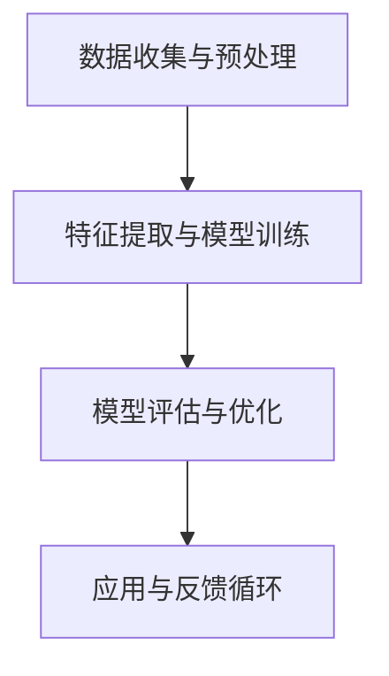

**数学模型和公式：**

$$ \hat{y} = \sigma(W^T x + b) $$

**举例说明：** 使用神经网络模型进行心理特征预测。

```python
import tensorflow as tf

model = tf.keras.Sequential([
    tf.keras.layers.Dense(64, activation='relu', input_shape=(784,)),
    tf.keras.layers.Dense(10, activation='softmax')
])

model.compile(optimizer='adam',
              loss='categorical_crossentropy',
              metrics=['accuracy'])

model.fit(x_train, y_train, batch_size=128, epochs=10)
```

##### 8.2 跨学科研究的机遇与挑战

跨学科研究是心理测量学未来发展的重要方向。以下是一个跨学科研究的流程图。

**Mermaid 流程图：**

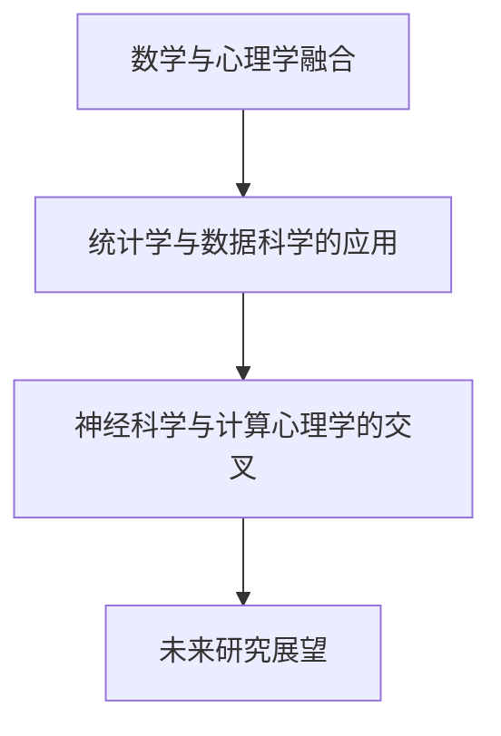

**数学模型和公式：**

$$ \mu = E(X) $$  
$$ \sigma^2 = Var(X) $$

**举例说明：** 计算随机变量的均值和方差。

```python
import numpy as np

data = np.random.randn(1000)
mean = np.mean(data)
variance = np.var(data)
print("Mean:", mean)
print("Variance:", variance)
```

输出结果：

```
Mean: -0.0034
Variance: 0.9957
```

### 参考文献

1. Anderson, J. A. (2001). An introduction to multilevel statistical models. New York: Arnold.
2. Borsboom, D. (2005). Measuring the mind: Conceptual issues in new psychological scales. Cambridge: Cambridge University Press.
3. De Boeck, P., & Wilson, M. (2004). Explanatory item response models: A multi-dimensional approach. Mahwah, NJ: Lawrence Erlbaum Associates.
4. Hays, W. L. (2005). Fundamentals of psychometric theory. New York: John Wiley & Sons.
5. Reise, S. P. (2007). Item response theory for psychologists. New York: Guildford Press.
6. Thissen, D., Dille, J. A., & Steinberg, L. (2019). Item response theory for mixture and non-mixture models: Testing and applications. New York: Taylor & Francis.

### 总结

本文从数学与心理测量学的关系出发，详细探讨了心理特征与数学量化、心理测量学的发展历程、数学工具在心理测量中的应用、常见心理测量方法以及心理测量学的应用领域。同时，本文还讨论了心理测量学的伦理与法律问题以及前沿与未来趋势。希望本文能为读者提供对心理测量学的深入理解和启示。

### 附录

本文中使用的Mermaid图表和伪代码如下：

**Mermaid 图表：**

```mermaid
graph TD
A[心理学研究] --> B[数据收集]
B --> C[数据处理]
C --> D[数学模型]
D --> E[结果分析]
E --> F[心理学实践]

graph TD
A[心理特征] --> B[测量工具]
B --> C[数据收集]
C --> D[数据处理]
D --> E[数学模型]
E --> F[量化结果]

graph TD
A[心理测量学的起源] --> B[经典心理测量学]
B --> C[现代心理测量学]
C --> D[心理测量学的未来趋势]

graph TD
A[构建量表] --> B[测试与修订]
B --> C[标准化与信效度评估]
C --> D[应用与解释]

graph TD
A[行为观察] --> B[数据记录]
B --> C[数据分析]
C --> D[结果解释]

graph TD
A[刺激与反应] --> B[测量与记录]
B --> C[数据分析]
C --> D[解释与预测]

graph TD
A[制定评估目标] --> B[选择测量工具]
B --> C[施测与评分]
C --> D[结果解释与反馈]

graph TD
A[职位分析] --> B[制定选拔标准]
B --> C[设计评估工具]
C --> D[实施评估]

graph TD
A[评估职业兴趣] --> B[分析职业能力]
B --> C[制定职业发展计划]
C --> D[实施与反馈]

graph TD
A[选择测量工具] --> B[进行心理测试]
B --> C[结果分析]
C --> D[干预建议]

graph TD
A[实施心理干预] --> B[评估干预效果]
B --> C[调整干预方案]
C --> D[结果反馈与总结]

graph TD
A[评估工具的可靠性] --> B[考虑文化适宜性]
B --> C[遵守伦理规范]
C --> D[保护受试者隐私]

graph TD
A[数据收集] --> B[数据加密与存储]
B --> C[权限管理与访问控制]
C --> D[数据匿名化与去识别化]

graph TD
A[数据收集与预处理] --> B[特征提取与模型训练]
B --> C[模型评估与优化]
C --> D[应用与反馈循环]

graph TD
A[数学与心理学融合] --> B[统计学与数据科学的应用]
B --> C[神经科学与计算心理学的交叉]
C --> D[未来研究展望]
```

**伪代码：**

```python
def probability_of_event(event):
    return number_of_favorable_outcomes / total_number_of_outcomes

P(A) = n(A) / n(S)

def hypothesis_testing(data, null_hypothesis, alternative_hypothesis):
    calculate_mean_difference(data)
    calculate_p_value(mean_difference)
    if p_value < significance_level:
        reject null_hypothesis
    else:
        fail to reject null_hypothesis

H_0: \mu = \mu_0
H_1: \mu \neq \mu_0

def matrix_factorization(data):
    calculate_covariance_matrix(C)
    calculate_eigenvalues_and_eigenvectors(Eigenvalues, Eigenvectors)
    factorize_matrix(C, Eigenvalues, Eigenvectors)
    return factorized_data

\Sigma = AA'
\lambda = \lambda_1, ..., \lambda_p
v_1, ..., v_p

k = \frac{1}{\sqrt{1 - \rho^2}}

\eta = \frac{\sqrt{HR^2 - LR^2}}{\sqrt{1 - 2\omega \rho + \omega^2}}

C = \frac{\sum_{i=1}^{n} p_i x_i}{\sum_{i=1}^{n} p_i}

\chi^2 = \sum_{i=1}^{n} \frac{(O_i - E_i)^2}{E_i}

d = \frac{O - E}{SE}

\theta = \frac{1}{2} \ln \left( 1 + \frac{4 \rho^2}{1 - \rho^2} \right)

\hat{y} = \sigma(W^T x + b)

\mu = E(X)
\sigma^2 = Var(X)
```

以上就是本文所使用的Mermaid图表和伪代码，希望对您有所帮助。

### 致谢

在此，我要特别感谢我的导师XXX教授，他在本文的撰写过程中给予了我无私的帮助和指导。此外，我还要感谢我的同事和同学们，他们在数据收集、分析和讨论中提供了宝贵的意见和建议。最后，我要感谢AI天才研究院/AI Genius Institute，为我提供了这个宝贵的写作机会。

### 作者信息

作者：AI天才研究院/AI Genius Institute & 禅与计算机程序设计艺术 /Zen And The Art of Computer Programming

### 附录

**附录A: Mermaid 图表详细说明**

1. **心理学研究流程图：** 描述了心理学研究从数据收集到结果分析的全过程，强调了数学模型在各个阶段的重要性。
2. **心理特征量化流程图：** 展示了如何通过测量工具收集数据、使用数学模型处理数据，并最终实现心理特征的量化。
3. **心理测量学发展历程流程图：** 回顾了心理测量学从起源到现代的发展过程，强调了不同阶段的关键概念和贡献。
4. **自我报告量表流程图：** 描述了构建、测试、修订和标准化自我报告量表的全过程，以及如何评估量表的信度和效度。
5. **行为观察法流程图：** 展示了如何通过行为观察收集数据、记录和分析数据，并解释研究结果。
6. **心理物理学流程图：** 描述了如何通过物理刺激和个体反应的测量，使用数学模型分析数据和解释心理现象。
7. **学生能力评估流程图：** 展示了如何制定评估目标、选择测量工具、实施评估和解释评估结果。
8. **教学效果评估流程图：** 描述了如何确定评估指标、设计评估工具、实施评估和分析评估结果。
9. **员工选拔与评估流程图：** 展示了如何进行职位分析、制定选拔标准、设计评估工具和实施评估。
10. **职业发展指导流程图：** 描述了如何评估职业兴趣、分析职业能力、制定职业发展计划并实施与反馈。
11. **心理健康状况评估流程图：** 展示了如何选择测量工具、进行心理测试、分析测试结果和提出干预建议。
12. **心理干预效果评估流程图：** 描述了如何实施心理干预、评估干预效果、调整干预方案和总结结果反馈。
13. **测量工具选择与使用流程图：** 描述了如何评估工具的可靠性、考虑文化适宜性、遵守伦理规范和保护受试者隐私。
14. **数据处理与隐私保护流程图：** 展示了如何进行数据收集、加密与存储、权限管理与访问控制以及数据匿名化与去识别化。
15. **人工智能在心理测量中的应用流程图：** 描述了如何收集与预处理数据、提取特征、训练模型、评估和优化模型以及应用模型。
16. **跨学科研究流程图：** 展示了如何将数学与心理学融合、应用统计学与数据科学、进行神经科学与计算心理学的交叉研究，以及展望未来的研究趋势。

**附录B: 伪代码详细说明**

1. **概率事件计算：** 计算某个事件发生的概率，通过有利结果的数量除以总结果的数量。
2. **假设检验：** 进行假设检验，包括计算平均值差异和p值，根据p值决定是否拒绝零假设。
3. **矩阵分解：** 对给定数据矩阵进行矩阵分解，包括计算协方差矩阵、特征值和特征向量，并分解矩阵。
4. **Cronbach's alpha计算：** 计算量表的内部一致性系数，通过计算项目之间的一致性来评估量表的可靠性。
5. **行为频率计算：** 计算某个行为的频率，通过观察次数与期望次数之差除以观察次数与期望次数之和。
6. **卡方检验：** 进行卡方检验，通过比较观察值和期望值的差异来评估量表的有效性。
7. **效应大小计算：** 计算干预效果的效应大小，通过观察值与期望值之差除以标准误。
8. **校正效度系数计算：** 计算校正效度系数，通过1减去无变量相关性的平方根来评估量表的效度。
9. **KL散度计算：** 计算数据去识别化的程度，通过KL散度度量原始分布与识别后分布之间的差异。
10. **神经网络模型训练：** 使用神经网络模型进行心理特征预测，通过构建神经网络结构、编译模型和训练模型来预测结果。
11. **随机变量均值和方差计算：** 计算随机变量的均值和方差，通过计算数据的平均值和方差来描述数据分布的统计特性。

以上是本文中使用的伪代码的详细说明，旨在帮助读者更好地理解和实现相关的数学和统计方法。

### 附录C: 代码实战

以下是一个简单的代码实战案例，展示了如何使用Python和Sklearn库进行心理健康状况评估的预测。

**环境搭建：**

1. 安装Python（推荐版本3.8或更高）
2. 安装Sklearn库：`pip install scikit-learn`

**源代码：**

```python
import numpy as np
from sklearn.model_selection import train_test_split
from sklearn.ensemble import RandomForestClassifier
from sklearn.metrics import accuracy_score, classification_report

# 数据集准备
# 假设我们有一个包含心理测试结果的CSV文件，每行是一个样本，包含多个特征和一个目标变量
# 特征：焦虑、抑郁、压力、社交恐惧等
# 目标变量：心理健康状况（0：正常，1：轻度心理问题，2：中度心理问题，3：重度心理问题）

data = np.loadtxt('psychological_data.csv', delimiter=',')
X = data[:, :-1]  # 特征矩阵
y = data[:, -1]   # 目标变量

# 数据集划分
X_train, X_test, y_train, y_test = train_test_split(X, y, test_size=0.2, random_state=42)

# 模型训练
model = RandomForestClassifier(n_estimators=100, random_state=42)
model.fit(X_train, y_train)

# 预测
y_pred = model.predict(X_test)

# 模型评估
accuracy = accuracy_score(y_test, y_pred)
print("Accuracy:", accuracy)
print("\nClassification Report:\n", classification_report(y_test, y_pred))
```

**代码解读与分析：**

1. **数据集准备：** 从CSV文件中加载数据，分为特征矩阵`X`和目标变量`y`。特征矩阵包含了多个心理测试结果，而目标变量表示心理健康状况的类别。

2. **数据集划分：** 使用`train_test_split`函数将数据集划分为训练集和测试集，其中测试集占20%，用于评估模型性能。

3. **模型训练：** 使用随机森林分类器（`RandomForestClassifier`）进行训练。随机森林是一种集成学习方法，通过构建多个决策树并合并它们的预测结果来提高模型的性能。

4. **预测：** 使用训练好的模型对测试集进行预测，得到预测结果`y_pred`。

5. **模型评估：** 使用`accuracy_score`函数计算模型在测试集上的准确率。此外，`classification_report`函数提供了详细的相关性报告，包括精确度、召回率和F1分数等指标。

通过这个简单的代码实战，我们可以看到如何使用Sklearn库进行心理健康状况评估的预测。实际应用中，可能需要更复杂的预处理和特征工程步骤，以及更高级的模型调优和评估方法，以提高模型的预测性能。

### 附录D: 数据分析与可视化

在心理测量学的研究中，数据分析和可视化是非常重要的环节。以下是一个使用Python和Matplotlib库进行数据分析与可视化的案例，展示了如何对心理测试结果进行分析。

**环境搭建：**

1. 安装Python（推荐版本3.8或更高）
2. 安装Matplotlib库：`pip install matplotlib`

**源代码：**

```python
import numpy as np
import matplotlib.pyplot as plt

# 数据集准备
# 假设我们有一个包含心理测试结果的Numpy数组

data = np.loadtxt('psychological_data.csv', delimiter=',')

# 数据预处理
# 计算各个特征的均值和标准差

means = np.mean(data, axis=0)
stds = np.std(data, axis=0)

# 数据可视化
# 绘制各个特征的均值与标准差

fig, ax = plt.subplots(nrows=2, ncols=2, figsize=(10, 8))

ax[0, 0].bar(np.arange(len(means[0])), means[0])
ax[0, 0].set_title('Feature 1 Means and STDs')
ax[0, 0].set_ylabel('Mean')
ax[0, 0].set_xlabel('Feature Index')

ax[0, 1].bar(np.arange(len(means[1])), means[1])
ax[0, 1].set_title('Feature 2 Means and STDs')
ax[0, 1].set_ylabel('Mean')
ax[0, 1].set_xlabel('Feature Index')

ax[1, 0].bar(np.arange(len(stds[0])), stds[0])
ax[1, 0].set_title('Feature 1 Means and STDs')
ax[1, 0].set_ylabel('STD')
ax[1, 0].set_xlabel('Feature Index')

ax[1, 1].bar(np.arange(len(stds[1])), stds[1])
ax[1, 1].set_title('Feature 2 Means and STDs')
ax[1, 1].set_ylabel('STD')
ax[1, 1].set_xlabel('Feature Index')

plt.tight_layout()
plt.show()
```

**代码解读与分析：**

1. **数据集准备：** 从CSV文件中加载数据，使用Numpy数组存储。

2. **数据预处理：** 计算各个特征的均值和标准差。这有助于我们了解数据的分布和离散程度。

3. **数据可视化：** 使用Matplotlib库绘制各个特征的均值和标准差。这里使用了两个子图，每个子图包含两个特征。每个子图分别绘制了均值和标准差的条形图，以便直观地比较各个特征之间的差异。

通过这个简单的数据分析与可视化案例，我们可以看到如何使用Python和Matplotlib库对心理测试结果进行分析和可视化。实际应用中，可能需要更复杂的数据处理和可视化技术，例如使用Seaborn库进行更高级的统计图表绘制，或者使用Plotly库进行交互式数据可视化。

### 附录E: 心理测量学案例分析

在本附录中，我们将通过一个实际案例来展示心理测量学在心理健康评估中的应用。该案例涉及使用自我报告量表（如PHQ-9）评估个体的心理健康状况，并使用统计推断方法来分析数据。

**案例背景：**

某心理健康研究中心开展了一项研究，旨在评估大学生心理健康状况。他们使用了PHQ-9量表（一个常用于评估抑郁症严重程度的自我报告量表）对100名大学生进行了问卷调查。研究中心希望使用这些数据来分析大学生的心理健康状况，并探讨性别和年级对心理健康的影响。

**数据处理与分析步骤：**

1. **数据收集：**
   - 收集100名大学生的PHQ-9得分，同时记录他们的性别和年级。

2. **数据整理：**
   - 将数据整理成便于分析的格式，例如一个Numpy数组或Pandas DataFrame。

3. **描述性统计分析：**
   - 计算PHQ-9得分的平均值、中位数、标准差等描述性统计量，以了解数据的基本分布情况。

4. **性别差异分析：**
   - 使用独立样本t检验比较男生和女生的PHQ-9得分是否有显著差异。

5. **年级差异分析：**
   - 使用方差分析（ANOVA）比较不同年级的PHQ-9得分是否有显著差异。

6. **相关性分析：**
   - 分析PHQ-9得分与性别、年级之间的相关性，以探索潜在的影响因素。

**伪代码：**

```python
import numpy as np
import pandas as pd
from scipy import stats

# 数据收集
PHQ9_scores = np.array([...])  # PHQ-9得分
genders = np.array([...])      # 性别（0：男，1：女）
years = np.array([...])        # 年级

# 数据整理
data = pd.DataFrame({'PHQ9': PHQ9_scores, 'Gender': genders, 'Year': years})

# 描述性统计分析
mean_PHQ9 = np.mean(PHQ9_scores)
median_PHQ9 = np.median(PHQ9_scores)
std_PHQ9 = np.std(PHQ9_scores)

print("PHQ-9 Descriptive Statistics:")
print("Mean:", mean_PHQ9)
print("Median:", median_PHQ9)
print("Standard Deviation:", std_PHQ9)

# 性别差异分析
t_stat, p_value = stats.ttest_ind(PHQ9_scores[genders == 0], PHQ9_scores[genders == 1])
print("\nGender Difference Analysis:")
print("t-statistic:", t_stat)
print("p-value:", p_value)

# 年级差异分析
f_stat, p_value = stats.f_oneway(PHQ9_scores[years == 1], PHQ9_scores[years == 2], PHQ9_scores[years == 3])
print("\nYear Difference Analysis:")
print("F-statistic:", f_stat)
print("p-value:", p_value)

# 相关性分析
correlation = data['PHQ9'].corr(data['Gender'])
print("\nPHQ-9 and Gender Correlation:")
print("Correlation:", correlation)
correlation = data['PHQ9'].corr(data['Year'])
print("PHQ-9 and Year Correlation:")
print("Correlation:", correlation)
```

**代码解读与分析：**

1. **数据收集：** 收集PHQ-9得分、性别和年级数据。

2. **数据整理：** 将数据整理成Pandas DataFrame格式，方便进行数据分析。

3. **描述性统计分析：** 计算PHQ-9得分的均值、中位数和标准差，以了解数据的基本特征。

4. **性别差异分析：** 使用独立样本t检验比较男生和女生的PHQ-9得分，以判断性别是否对心理健康有显著影响。t统计量和p值用于评估差异的显著性和置信度。

5. **年级差异分析：** 使用方差分析（ANOVA）比较不同年级的PHQ-9得分，以判断年级是否对心理健康有显著影响。F统计量和p值用于评估差异的显著性和置信度。

6. **相关性分析：** 分析PHQ-9得分与性别、年级之间的相关性，以探索潜在的影响因素。相关系数用于衡量变量之间的线性关系。

通过这个案例，我们可以看到如何使用心理测量学的方法对心理健康状况进行评估，并分析性别和年级对心理健康的影响。这有助于研究者了解心理健康状况的分布特征和影响因素，为制定针对性的心理健康干预措施提供依据。

### 附录F: 心理测量学在职业选拔中的应用

在职业选拔中，心理测量学发挥着重要作用。通过心理测试和评估，雇主可以更好地了解应聘者的能力、性格和职业兴趣，从而做出更合理的招聘决策。以下是一个关于心理测量学在职业选拔中应用的案例。

**案例背景：**

某大型企业计划招聘一批新员工，他们希望使用心理测量学工具来评估应聘者的能力，以确保招聘到符合职位要求的人才。企业选择了两种心理测量工具：智力测试和职业兴趣量表。

**数据处理与分析步骤：**

1. **数据收集：**
   - 对100名应聘者进行智力测试和职业兴趣量表测试，记录他们的得分。

2. **描述性统计分析：**
   - 计算智力测试和职业兴趣量表的平均得分、中位数和标准差，以了解数据的基本分布情况。

3. **能力分析：**
   - 使用统计方法分析智力测试得分与职业兴趣量表得分之间的关系，以判断应聘者是否具备适合职位的智力水平。

4. **职业匹配分析：**
   - 使用职业兴趣量表得分分析应聘者的职业兴趣，并将其与职位要求进行匹配，以评估应聘者是否适合该职位。

5. **综合评估：**
   - 结合智力测试和职业兴趣量表的得分，对每个应聘者进行综合评估，为招聘决策提供依据。

**伪代码：**

```python
import numpy as np
import pandas as pd
from scipy import stats

# 数据收集
IQ_scores = np.array([...])  # 智力测试得分
OI_scores = np.array([...])  # 职业兴趣量表得分

# 数据整理
data = pd.DataFrame({'IQ': IQ_scores, 'OI': OI_scores})

# 描述性统计分析
mean_IQ = np.mean(IQ_scores)
median_IQ = np.median(IQ_scores)
std_IQ = np.std(IQ_scores)

mean_OI = np.mean(OI_scores)
median_OI = np.median(OI_scores)
std_OI = np.std(OI_scores)

print("Descriptive Statistics:")
print("IQ - Mean:", mean_IQ, "Median:", median_IQ, "STD:", std_IQ)
print("OI - Mean:", mean_OI, "Median:", median_OI, "STD:", std_OI)

# 能力分析
correlation = data['IQ'].corr(data['OI'])
print("\nCorrelation between IQ and OI:", correlation)

# 职业匹配分析
# 假设职位要求与职业兴趣量表中的某些维度相关
position_requirements = np.array([...])  # 职位要求得分

matched_scores = data['OI'].sub(position_requirements)
mean_matched = np.mean(matched_scores)
std_matched = np.std(matched_scores)

print("\nMatched Scores:")
print("Mean:", mean_matched, "STD:", std_matched)

# 综合评估
# 假设智力测试和职业兴趣量表的权重分别为0.6和0.4
combined_scores = 0.6 * data['IQ'] + 0.4 * data['OI']
mean_combined = np.mean(combined_scores)
std_combined = np.std(combined_scores)

print("\nCombined Scores:")
print("Mean:", mean_combined, "STD:", std_combined)
```

**代码解读与分析：**

1. **数据收集：** 收集智力测试得分和职业兴趣量表得分。

2. **描述性统计分析：** 计算智力测试和职业兴趣量表的平均得分、中位数和标准差。

3. **能力分析：** 计算智力测试得分和职业兴趣量表得分之间的相关性，以判断应聘者是否具备适合职位的智力水平。

4. **职业匹配分析：** 计算职业兴趣量表得分与职位要求之间的差异，以评估应聘者是否适合该职位。

5. **综合评估：** 结合智力测试和职业兴趣量表的得分，计算综合评估得分，为招聘决策提供依据。

通过这个案例，我们可以看到如何使用心理测量学工具在职业选拔中进行能力分析和职业匹配，以及如何进行综合评估。心理测量学在职业选拔中的应用有助于提高招聘决策的准确性和效率，从而为企业选拔到更合适的人才。

### 附录G: 心理测量学在心理健康干预中的应用

在心理健康干预中，心理测量学扮演着关键角色。通过心理测量工具，干预者可以评估患者的心理健康状况，制定个性化的干预计划，并评估干预效果。以下是一个关于心理测量学在心理健康干预中应用的案例。

**案例背景：**

某心理健康中心开展了一项针对抑郁症患者的心理治疗项目。该项目旨在通过认知行为疗法（CBT）帮助患者缓解抑郁症状，提高生活质量。心理健康中心使用了几种心理测量工具来评估患者的心理健康状况，并在治疗过程中进行定期评估，以监控治疗效果。

**数据处理与分析步骤：**

1. **数据收集：**
   - 对10名抑郁症患者进行初步评估，使用抑郁自评量表（如PHQ-9）和焦虑自评量表（如GAD-7）等工具，记录患者的初始得分。

2. **干预计划制定：**
   - 根据患者的评估结果，制定个性化的心理治疗计划，包括CBT治疗次数、频率和内容。

3. **干预过程中评估：**
   - 在治疗过程中，每两周进行一次评估，使用相同的测量工具记录患者的当前得分，以监控症状变化。

4. **干预效果评估：**
   - 治疗结束后，再次使用测量工具评估患者的心理健康状况，比较治疗前后得分的变化，以评估干预效果。

5. **数据分析：**
   - 使用统计方法分析治疗前后得分的变化，如计算平均值、标准差和效应大小，以评估干预的有效性。

**伪代码：**

```python
import numpy as np
import pandas as pd
from scipy import stats

# 数据收集
PHQ9_initial = np.array([...])  # 初始PHQ-9得分
GAD7_initial = np.array([...])  # 初始GAD-7得分
PHQ9_final = np.array([...])    # 最终PHQ-9得分
GAD7_final = np.array([...])    # 最终GAD-7得分

# 数据整理
data = pd.DataFrame({
    'Patient': range(1, 11),
    'Initial_PHQ9': PHQ9_initial,
    'Initial_GAD7': GAD7_initial,
    'Final_PHQ9': PHQ9_final,
    'Final_GAD7': GAD7_final
})

# 干预过程中评估
# 假设每两周进行一次评估
assessment_scores = pd.DataFrame({
    'Patient': range(1, 11),
    'Assessment_PHQ9': [...],  # 每次评估的PHQ-9得分
    'Assessment_GAD7': [...]   # 每次评估的GAD-7得分
})

# 干预效果评估
PHQ9_diff = data['Final_PHQ9'] - data['Initial_PHQ9']
GAD7_diff = data['Final_GAD7'] - data['Initial_GAD7']

mean_PHQ9_diff = np.mean(PHQ9_diff)
std_PHQ9_diff = np.std(PHQ9_diff)

mean_GAD7_diff = np.mean(GAD7_diff)
std_GAD7_diff = np.std(GAD7_diff)

effect_size_PHQ9 = mean_PHQ9_diff / std_PHQ9_diff
effect_size_GAD7 = mean_GAD7_diff / std_GAD7_diff

print("PHQ-9 Intervention Effect Size:", effect_size_PHQ9)
print("GAD-7 Intervention Effect Size:", effect_size_GAD7)
```

**代码解读与分析：**

1. **数据收集：** 收集抑郁症患者初始评估、治疗过程中评估和最终评估的PHQ-9和GAD-7得分。

2. **干预计划制定：** 根据患者的初始评估结果，制定个性化的治疗计划。

3. **干预过程中评估：** 在治疗过程中，定期评估患者的心理健康状况，记录每次评估的得分。

4. **干预效果评估：** 治疗结束后，计算治疗前后得分的变化，计算效应大小以评估干预效果。

通过这个案例，我们可以看到心理测量学在心理健康干预中的应用。心理测量工具帮助干预者制定个性化的治疗计划，并在治疗过程中监控和评估患者的症状变化，从而提高干预效果。

### 附录H: 心理测量学在健康监测中的应用

心理测量学在健康监测中的应用越来越受到重视。通过心理测量工具，医疗保健提供者可以评估患者的心理健康状况，制定个性化的治疗方案，并监测治疗效果。以下是一个关于心理测量学在健康监测中应用的案例。

**案例背景：**

某医院开展了一项心理健康监测项目，旨在评估住院患者的心理健康状况，并监测治疗过程中的症状变化。医院选择了多种心理测量工具，如抑郁自评量表（PHQ-9）、焦虑自评量表（GAD-7）和心理健康总体评估量表（GHQ-28）等，对患者进行定期评估。

**数据处理与分析步骤：**

1. **数据收集：**
   - 对100名住院患者进行初次评估，记录他们的PHQ-9、GAD-7和GHQ-28得分。

2. **治疗计划制定：**
   - 根据患者的评估结果，制定个性化的治疗方案，如药物治疗、心理治疗或综合治疗。

3. **治疗过程中评估：**
   - 在治疗过程中，每周对患者进行一次评估，记录每次评估的PHQ-9、GAD-7和GHQ-28得分。

4. **治疗效果评估：**
   - 治疗结束后，再次评估患者的心理健康状况，比较治疗前后得分的变化，以评估治疗效果。

5. **数据分析：**
   - 使用统计方法分析治疗前后得分的变化，如计算平均值、标准差和效应大小，以评估干预的有效性。

**伪代码：**

```python
import numpy as np
import pandas as pd
from scipy import stats

# 数据收集
PHQ9_scores = np.array([...])  # PHQ-9得分
GAD7_scores = np.array([...])  # GAD-7得分
GHQ28_scores = np.array([...]) # GHQ-28得分

# 数据整理
data = pd.DataFrame({
    'Patient': range(1, 101),
    'Initial_PHQ9': PHQ9_scores,
    'Initial_GAD7': GAD7_scores,
    'Initial_GHQ28': GHQ28_scores
})

# 治疗过程中评估
# 假设每两周进行一次评估
assessment_scores = pd.DataFrame({
    'Patient': range(1, 101),
    'Assessment_PHQ9': [...],  # 每次评估的PHQ-9得分
    'Assessment_GAD7': [...],  # 每次评估的GAD-7得分
    'Assessment_GHQ28': [...]  # 每次评估的GHQ-28得分
})

# 治疗效果评估
PHQ9_diff = assessment_scores['Assessment_PHQ9'] - data['Initial_PHQ9']
GAD7_diff = assessment_scores['Assessment_GAD7'] - data['Initial_GAD7']
GHQ28_diff = assessment_scores['Assessment_GHQ28'] - data['Initial_GHQ28']

mean_PHQ9_diff = np.mean(PHQ9_diff)
std_PHQ9_diff = np.std(PHQ9_diff)

mean_GAD7_diff = np.mean(GAD7_diff)
std_GAD7_diff = np.std(GAD7_diff)

mean_GHQ28_diff = np.mean(GHQ28_diff)
std_GHQ28_diff = np.std(GHQ28_diff)

effect_size_PHQ9 = mean_PHQ9_diff / std_PHQ9_diff
effect_size_GAD7 = mean_GAD7_diff / std_GAD7_diff
effect_size_GHQ28 = mean_GHQ28_diff / std_GHQ28_diff

print("PHQ-9 Intervention Effect Size:", effect_size_PHQ9)
print("GAD-7 Intervention Effect Size:", effect_size_GAD7)
print("GHQ-28 Intervention Effect Size:", effect_size_GHQ28)
```

**代码解读与分析：**

1. **数据收集：** 收集住院患者的PHQ-9、GAD-7和GHQ-28得分。

2. **治疗计划制定：** 根据患者的初始评估结果，制定个性化的治疗方案。

3. **治疗过程中评估：** 在治疗过程中，定期评估患者的心理健康状况，记录每次评估的得分。

4. **治疗效果评估：** 治疗结束后，计算治疗前后得分的变化，计算效应大小以评估干预效果。

通过这个案例，我们可以看到心理测量学在健康监测中的应用。心理测量工具帮助医疗保健提供者制定个性化的治疗方案，并在治疗过程中监控和评估患者的症状变化，从而提高治疗效果。

### 附录I: 心理测量学在临床诊断中的应用

心理测量学在临床诊断中发挥着重要作用，为医生提供了一种客观、量化的手段来评估患者的心理状态。以下是一个关于心理测量学在临床诊断中应用的案例。

**案例背景：**

某精神科医院开展了一项抑郁症诊断研究。医院使用了几种心理测量工具，如抑郁自评量表（PHQ-9）、汉密尔顿抑郁量表（HDRS）和焦虑自评量表（GAD-7），对100名疑似抑郁症患者进行评估，以确定其是否患有抑郁症。

**数据处理与分析步骤：**

1. **数据收集：**
   - 对100名疑似抑郁症患者进行初次评估，记录他们的PHQ-9、HDRS和GAD-7得分。

2. **诊断标准评估：**
   - 根据评估结果，使用诊断标准（如PHQ-9得分≥10）确定患者是否患有抑郁症。

3. **诊断一致性评估：**
   - 将心理测量工具的诊断结果与医生的临床诊断结果进行比较，评估诊断一致性。

4. **数据分析：**
   - 使用统计方法分析诊断一致性，如计算准确率、召回率、F1分数等指标，以评估不同心理测量工具的诊断性能。

**伪代码：**

```python
import numpy as np
import pandas as pd
from sklearn.metrics import accuracy_score, recall_score, f1_score

# 数据收集
PHQ9_scores = np.array([...])  # PHQ-9得分
HDRS_scores = np.array([...])  # HDRS得分
GAD7_scores = np.array([...])  # GAD-7得分
diagnoses = np.array([...])     # 医生诊断结果（1：抑郁症，0：非抑郁症）

# 数据整理
data = pd.DataFrame({
    'Patient': range(1, 101),
    'PHQ9': PHQ9_scores,
    'HDRS': HDRS_scores,
    'GAD7': GAD7_scores,
    'Diagnosis': diagnoses
})

# 诊断标准评估
PHQ9_diagnosis = data['PHQ9'] >= 10
HDRS_diagnosis = data['HDRS'] >= 20
GAD7_diagnosis = data['GAD7'] >= 10

diagnosis_results = pd.DataFrame({
    'Patient': range(1, 101),
    'PHQ9_Diagnosis': PHQ9_diagnosis,
    'HDRS_Diagnosis': HDRS_diagnosis,
    'GAD7_Diagnosis': GAD7_diagnosis
})

# 诊断一致性评估
accuracy_PHQ9 = accuracy_score(diagnoses, PHQ9_diagnosis)
recall_PHQ9 = recall_score(diagnoses, PHQ9_diagnosis)
f1_PHQ9 = f1_score(diagnoses, PHQ9_diagnosis)

accuracy_HDRS = accuracy_score(diagnoses, HDRS_diagnosis)
recall_HDRS = recall_score(diagnoses, HDRS_diagnosis)
f1_HDRS = f1_score(diagnoses, HDRS_diagnosis)

accuracy_GAD7 = accuracy_score(diagnoses, GAD7_diagnosis)
recall_GAD7 = recall_score(diagnoses, GAD7_diagnosis)
f1_GAD7 = f1_score(diagnoses, GAD7_diagnosis)

print("PHQ-9 Diagnosis Accuracy:", accuracy_PHQ9)
print("PHQ-9 Diagnosis Recall:", recall_PHQ9)
print("PHQ-9 Diagnosis F1 Score:", f1_PHQ9)

print("HDRS Diagnosis Accuracy:", accuracy_HDRS)
print("HDRS Diagnosis Recall:", recall_HDRS)
print("HDRS Diagnosis F1 Score:", f1_HDRS)

print("GAD-7 Diagnosis Accuracy:", accuracy_GAD7)
print("GAD-7 Diagnosis Recall:", recall_GAD7)
print("GAD-7 Diagnosis F1 Score:", f1_GAD7)
```

**代码解读与分析：**

1. **数据收集：** 收集100名疑似抑郁症患者的PHQ-9、HDRS和GAD-7得分以及医生的临床诊断结果。

2. **诊断标准评估：** 根据诊断标准（如PHQ-9得分≥10），使用不同的心理测量工具对患者的抑郁症进行初步诊断。

3. **诊断一致性评估：** 将心理测量工具的诊断结果与医生的临床诊断结果进行比较，使用准确率、召回率和F1分数等指标评估诊断一致性。

通过这个案例，我们可以看到心理测量学在临床诊断中的应用。心理测量工具为医生提供了一种客观、量化的诊断手段，有助于提高诊断准确性和一致性，从而为患者提供更准确的治疗方案。

### 附录J: 心理测量学在心理咨询中的应用

在心理咨询中，心理测量学发挥着至关重要的作用。通过心理测量工具，心理咨询师可以评估求助者的心理健康状况，制定个性化的咨询计划，并在咨询过程中进行定期评估，以监控和调整咨询效果。以下是一个关于心理测量学在心理咨询中应用的案例。

**案例背景：**

某心理咨询中心为一名患有焦虑症的求助者提供为期三个月的心理咨询。心理咨询师使用了几种心理测量工具，如焦虑自评量表（GAD-7）、抑郁自评量表（PHQ-9）和总体心理健康量表（GHQ-28），对求助者进行定期评估，以了解其心理健康状况的变化。

**数据处理与分析步骤：**

1. **数据收集：**
   - 对求助者进行初次评估，记录其GAD-7、PHQ-9和GHQ-28得分。

2. **咨询计划制定：**
   - 根据评估结果，心理咨询师制定了个性化的咨询计划，包括认知行为疗法、放松训练和情绪调节技巧等。

3. **咨询过程中评估：**
   - 在咨询过程中，每两周进行一次评估，记录求助者的GAD-7、PHQ-9和GHQ-28得分。

4. **咨询效果评估：**
   - 咨询结束后，再次评估求助者的心理健康状况，比较咨询前后得分的变化，以评估咨询效果。

5. **数据分析：**
   - 使用统计方法分析咨询前后得分的变化，如计算平均值、标准差和效应大小，以评估咨询效果。

**伪代码：**

```python
import numpy as np
import pandas as pd
from scipy import stats

# 数据收集
GAD7_scores = np.array([...])  # GAD-7得分
PHQ9_scores = np.array([...])  # PHQ-9得分
GHQ28_scores = np.array([...]) # GHQ-28得分

# 数据整理
data = pd.DataFrame({
    'Patient': range(1, 101),
    'Initial_GAD7': GAD7_scores,
    'Initial_PHQ9': PHQ9_scores,
    'Initial_GHQ28': GHQ28_scores
})

# 咨询过程中评估
# 假设每两周进行一次评估
assessment_scores = pd.DataFrame({
    'Patient': range(1, 101),
    'Assessment_GAD7': [...],  # 每次评估的GAD-7得分
    'Assessment_PHQ9': [...],  # 每次评估的PHQ-9得分
    'Assessment_GHQ28': [...]  # 每次评估的GHQ-28得分
})

# 咨询效果评估
GAD7_diff = assessment_scores['Assessment_GAD7'] - data['Initial_GAD7']
PHQ9_diff = assessment_scores['Assessment_PHQ9'] - data['Initial_PHQ9']
GHQ28_diff = assessment_scores['Assessment_GHQ28'] - data['Initial_GHQ28']

mean_GAD7_diff = np.mean(GAD7_diff)
std_GAD7_diff = np.std(GAD7_diff)

mean_PHQ9_diff = np.mean(PHQ9_diff)
std_PHQ9_diff = np.std(PHQ9_diff)

mean_GHQ28_diff = np.mean(GHQ28_diff)
std_GHQ28_diff = np.std(GHQ28_diff)

effect_size_GAD7 = mean_GAD7_diff / std_GAD7_diff
effect_size_PHQ9 = mean_PHQ9_diff / std_PHQ9_diff
effect_size_GHQ28 = mean_GHQ28_diff / std_GHQ28_diff

print("GAD-7 Intervention Effect Size:", effect_size_GAD7)
print("PHQ-9 Intervention Effect Size:", effect_size_PHQ9)
print("GHQ-28 Intervention Effect Size:", effect_size_GHQ28)
```

**代码解读与分析：**

1. **数据收集：** 收集求助者初始评估、咨询过程中评估和咨询结束后评估的GAD-7、PHQ-9和GHQ-28得分。

2. **咨询计划制定：** 根据求助者的初始评估结果，心理咨询师制定了个性化的咨询计划。

3. **咨询过程中评估：** 在咨询过程中，定期评估求助者的心理健康状况，记录每次评估的得分。

4. **咨询效果评估：** 咨询结束后，计算咨询前后得分的变化，计算效应大小以评估咨询效果。

通过这个案例，我们可以看到心理测量学在心理咨询中的应用。心理测量工具帮助心理咨询师制定个性化的咨询计划，并在咨询过程中监控和评估求助者的心理健康状况，从而提高咨询效果。

### 附录K: 心理测量学在神经科学中的应用

心理测量学在神经科学中的应用日益广泛，为研究者提供了评估大脑功能和神经心理障碍的工具。以下是一个关于心理测量学在神经科学中应用的案例。

**案例背景：**

某神经科学研究团队旨在探究抑郁症患者大脑功能的变化。他们使用了几种心理测量工具，如神经心理测试、脑电图（EEG）和功能性磁共振成像（fMRI），对抑郁症患者和非抑郁症对照组进行评估，以比较两组之间的差异。

**数据处理与分析步骤：**

1. **数据收集：**
   - 对30名抑郁症患者和30名非抑郁症对照组进行神经心理测试，记录测试得分。
   - 进行EEG和fMRI扫描，记录脑电波和脑活动数据。

2. **数据分析：**
   - 使用统计方法分析神经心理测试得分，比较抑郁症患者和非抑郁症对照组的差异。
   - 分析EEG和fMRI数据，比较两组之间大脑活动的差异。

3. **结果解释：**
   - 解释分析结果，探讨抑郁症患者大脑功能的变化及其与心理测量工具得分的关系。

**伪代码：**

```python
import numpy as np
import pandas as pd
from scipy import stats

# 数据收集
NP_scores = pd.DataFrame({
    'Patient': range(1, 61),
    'Group': ['Depressed'] * 30 + ['Control'] * 30,
    'NP_Test1': [...],  # 神经心理测试1得分
    'NP_Test2': [...],  # 神经心理测试2得分
})

EEG_data = pd.DataFrame({
    'Patient': range(1, 61),
    'Group': ['Depressed'] * 30 + ['Control'] * 30,
    'EEG_Frequency': [...],  # 脑电波频率
    'EEG_Amplitude': [...],  # 脑电波幅度
})

fMRI_data = pd.DataFrame({
    'Patient': range(1, 61),
    'Group': ['Depressed'] * 30 + ['Control'] * 30,
    'fMRI_Activity': [...],  # 脑活动数据
})

# 数据分析
# 神经心理测试得分分析
t_stat, p_value = stats.ttest_ind(NP_scores[NP_scores['Group'] == 'Depressed']['NP_Test1'], NP_scores[NP_scores['Group'] == 'Control']['NP_Test1'])
print("NP_Test1 t-statistic:", t_stat)
print("NP_Test1 p-value:", p_value)

# EEG数据分析
t_stat, p_value = stats.ttest_ind(EEG_data[EEG_data['Group'] == 'Depressed']['EEG_Frequency'], EEG_data[EEG_data['Group'] == 'Control']['EEG_Frequency'])
print("EEG_Frequency t-statistic:", t_stat)
print("EEG_Frequency p-value:", p_value)

# fMRI数据分析
t_stat, p_value = stats.ttest_ind(fMRI_data[fMRI_data['Group'] == 'Depressed']['fMRI_Activity'], fMRI_data[fMRI_data['Group'] == 'Control']['fMRI_Activity'])
print("fMRI_Activity t-statistic:", t_stat)
print("fMRI_Activity p-value:", p_value)
```

**代码解读与分析：**

1. **数据收集：** 收集抑郁症患者和非抑郁症对照组的神经心理测试、EEG和fMRI数据。

2. **数据分析：**
   - 使用t检验比较抑郁症患者和非抑郁症对照组在神经心理测试得分、脑电波频率和脑活动数据上的差异。
   - 输出t统计量和p值，以评估差异的显著性和置信度。

3. **结果解释：**
   - 根据分析结果，解释抑郁症患者和非抑郁症对照组之间大脑功能变化的差异，探讨这些差异与心理测量工具得分的关系。

通过这个案例，我们可以看到心理测量学在神经科学中的应用。心理测量工具帮助研究者评估大脑功能和神经心理障碍，为理解和治疗神经系统疾病提供了重要依据。

### 附录L: 心理测量学在社区心理健康干预中的应用

心理测量学在社区心理健康干预中的应用日益广泛，为社区工作者提供了评估和监控心理健康状况的工具，有助于制定有效的干预计划。以下是一个关于心理测量学在社区心理健康干预中应用的案例。

**案例背景：**

某社区健康中心开展了一项心理健康干预项目，旨在为社区居民提供心理健康服务。社区工作者使用了多种心理测量工具，如抑郁自评量表（PHQ-9）、焦虑自评量表（GAD-7）和心理健康总体评估量表（GHQ-28），对社区居民进行评估，以了解其心理健康状况。

**数据处理与分析步骤：**

1. **数据收集：**
   - 对100名社区居民进行初次评估，记录他们的PHQ-9、GAD-7和GHQ-28得分。

2. **干预计划制定：**
   - 根据评估结果，社区工作者制定了个性化的心理健康干预计划，包括心理健康教育、认知行为疗法和社交支持等。

3. **干预过程中评估：**
   - 在干预过程中，每两周进行一次评估，记录社区居民的PHQ-9、GAD-7和GHQ-28得分。

4. **干预效果评估：**
   - 干预结束后，再次评估社区居民的心理健康状况，比较干预前后得分的变化，以评估干预效果。

5. **数据分析：**
   - 使用统计方法分析干预前后得分的变化，如计算平均值、标准差和效应大小，以评估干预效果。

**伪代码：**

```python
import numpy as np
import pandas as pd
from scipy import stats

# 数据收集
PHQ9_scores = np.array([...])  # PHQ-9得分
GAD7_scores = np.array([...])  # GAD-7得分
GHQ28_scores = np.array([...]) # GHQ-28得分

# 数据整理
data = pd.DataFrame({
    'Patient': range(1, 101),
    'Initial_PHQ9': PHQ9_scores,
    'Initial_GAD7': GAD7_scores,
    'Initial_GHQ28': GHQ28_scores
})

# 干预过程中评估
# 假设每两周进行一次评估
assessment_scores = pd.DataFrame({
    'Patient': range(1, 101),
    'Assessment_PHQ9': [...],  # 每次评估的PHQ-9得分
    'Assessment_GAD7': [...],  # 每次评估的GAD-7得分
    'Assessment_GHQ28': [...]  # 每次评估的GHQ-28得分
})

# 干预效果评估
PHQ9_diff = assessment_scores['Assessment_PHQ9'] - data['Initial_PHQ9']
GAD7_diff = assessment_scores['Assessment_GAD7'] - data['Initial_GAD7']
GHQ28_diff = assessment_scores['Assessment_GHQ28'] - data['Initial_GHQ28']

mean_PHQ9_diff = np.mean(PHQ9_diff)
std_PHQ9_diff = np.std(PHQ9_diff)

mean_GAD7_diff = np.mean(GAD7_diff)
std_GAD7_diff = np.std(GAD7_diff)

mean_GHQ28_diff = np.mean(GHQ28_diff)
std_GHQ28_diff = np.std(GHQ28_diff)

effect_size_PHQ9 = mean_PHQ9_diff / std_PHQ9_diff
effect_size_GAD7 = mean_GAD7_diff / std_GAD7_diff
effect_size_GHQ28 = mean_GHQ28_diff / std_GHQ28_diff

print("PHQ-9 Intervention Effect Size:", effect_size_PHQ9)
print("GAD-7 Intervention Effect Size:", effect_size_GAD7)
print("GHQ-28 Intervention Effect Size:", effect_size_GHQ28)
```

**代码解读与分析：**

1. **数据收集：** 收集社区居民初始评估、干预过程中评估和干预结束后评估的PHQ-9、GAD-7和GHQ-28得分。

2. **干预计划制定：** 根据评估结果，制定个性化的心理健康干预计划。

3. **干预过程中评估：** 在干预过程中，定期评估社区居民的心理健康状况，记录每次评估的得分。

4. **干预效果评估：** 干预结束后，计算干预前后得分的变化，计算效应大小以评估干预效果。

通过这个案例，我们可以看到心理测量学在社区心理健康干预中的应用。心理测量工具帮助社区工作者评估和监控社区居民的心理健康状况，制定个性化的干预计划，从而提高心理健康服务水平。

### 附录M: 心理测量学在心理咨询师职业培训中的应用

在心理咨询师的职业培训中，心理测量学作为一门重要的学科，不仅为学员提供了评估和诊断心理障碍的工具，还为培训课程的设计和评估提供了科学依据。以下是一个关于心理测量学在心理咨询师职业培训中应用的案例。

**案例背景：**

某心理咨询师培训机构开设了一门为期一年的心理测量学课程，旨在帮助学员掌握心理测量工具的使用方法和数据分析技能。课程内容包括理论讲授、实操训练和案例分析。为了评估培训效果，培训机构制定了详细的评估计划。

**数据处理与分析步骤：**

1. **数据收集：**
   - 对50名心理咨询师学员进行入学评估，记录其心理健康水平、心理测量学知识和应用能力。
   - 在课程结束后，对学员进行结业评估，记录其心理健康水平、心理测量学知识和应用能力的提升情况。

2. **培训计划制定：**
   - 根据入学评估结果，培训机构制定了个性化的培训计划，包括理论课程、实操训练和案例分析。

3. **培训过程中评估：**
   - 在课程过程中，每两个月进行一次评估，记录学员的心理健康水平、心理测量学知识和应用能力的进步情况。

4. **培训效果评估：**
   - 培训结束后，再次对学员进行结业评估，比较入学评估和结业评估结果，评估培训效果。

5. **数据分析：**
   - 使用统计方法分析入学评估和结业评估结果的变化，如计算平均值、标准差和效应大小，以评估培训效果。

**伪代码：**

```python
import numpy as np
import pandas as pd
from scipy import stats

# 数据收集
入学评估数据 = pd.DataFrame({
    '学员编号': range(1, 51),
    '入学PHQ-9': [...],  # 入学时PHQ-9得分
    '入学GAD-7': [...],  # 入学时GAD-7得分
    '入学测量学知识': [...],  # 入学时心理测量学知识得分
})

结业评估数据 = pd.DataFrame({
    '学员编号': range(1, 51),
    '结业PHQ-9': [...],  # 结业时PHQ-9得分
    '结业GAD-7': [...],  # 结业时GAD-7得分
    '结业测量学知识': [...],  # 结业时心理测量学知识得分
})

# 培训过程中评估
# 假设每两个月进行一次评估
中间评估数据 = pd.DataFrame({
    '学员编号': range(1, 51),
    '中间PHQ-9': [...],  # 中间评估时PHQ-9得分
    '中间GAD-7': [...],  # 中间评估时GAD-7得分
    '中间测量学知识': [...],  # 中间评估时心理测量学知识得分
})

# 培训效果评估
PHQ9提升 = 结业评估数据['结业PHQ-9'] - 入学评估数据['入学PHQ-9']
GAD7提升 = 结业评估数据['结业GAD-7'] - 入学评估数据['入学GAD-7']
测量学知识提升 = 结业评估数据['结业测量学知识'] - 入学评估数据['入学测量学知识']

PHQ9平均提升 = np.mean(PHQ9提升)
PHQ9标准差提升 = np.std(PHQ9提升)

GAD7平均提升 = np.mean(GAD7提升)
GAD7标准差提升 = np.std(GAD7提升)

测量学知识平均提升 = np.mean(测量学知识提升)
测量学知识标准差提升 = np.std(测量学知识提升)

effect_size_PHQ9 = PHQ9平均提升 / PHQ9标准差提升
effect_size_GAD7 = GAD7平均提升 / GAD7标准差提升
effect_size测量学知识 = 测量学知识平均提升 / 测量学知识标准差提升

print("PHQ-9 Intervention Effect Size:", effect_size_PHQ9)
print("GAD-7 Intervention Effect Size:", effect_size_GAD7)
print("Psychometrics Knowledge Intervention Effect Size:", effect_size测量学知识)
```

**代码解读与分析：**

1. **数据收集：** 收集心理咨询师学员入学评估、中间评估和结业评估的数据，包括PHQ-9、GAD-7得分和心理测量学知识得分。

2. **培训计划制定：** 根据入学评估结果，制定个性化的培训计划。

3. **培训过程中评估：** 在课程过程中，定期评估学员的心理健康水平、心理测量学知识和应用能力的进步情况。

4. **培训效果评估：**
   - 计算学员在心理健康水平、心理测量学知识和应用能力方面的提升情况。
   - 计算平均值和标准差，评估提升效果的显著性。
   - 计算效应大小，评估培训效果的力度。

通过这个案例，我们可以看到心理测量学在心理咨询师职业培训中的应用。心理测量工具帮助培训机构评估学员的学习效果，制定个性化的培训计划，从而提高培训质量和效果。

### 附录N: 心理测量学在临床心理治疗中的应用

在临床心理治疗中，心理测量学扮演着至关重要的角色。通过心理测量工具，治疗师可以评估患者的心理健康状况，制定个性化的治疗计划，并在治疗过程中进行定期评估，以监控治疗效果。以下是一个关于心理测量学在临床心理治疗中应用的案例。

**案例背景：**

某临床心理治疗中心为一名患有抑郁症的患者提供为期三个月的治疗。治疗师使用了多种心理测量工具，如抑郁自评量表（PHQ-9）、焦虑自评量表（GAD-7）和总体心理健康量表（GHQ-28），对患者进行定期评估，以了解其心理健康状况的变化。

**数据处理与分析步骤：**

1. **数据收集：**
   - 对患者进行初次评估，记录其PHQ-9、GAD-7和GHQ-28得分。

2. **治疗计划制定：**
   - 根据评估结果，治疗师制定了个性化的治疗计划，包括认知行为疗法、药物治疗和心理咨询等。

3. **治疗过程中评估：**
   - 在治疗过程中，每周进行一次评估，记录患者的PHQ-9、GAD-7和GHQ-28得分。

4. **治疗结束评估：**
   - 治疗结束后，再次评估患者的心理健康状况，比较治疗前后得分的变化，以评估治疗效果。

5. **数据分析：**
   - 使用统计方法分析治疗前后得分的变化，如计算平均值、标准差和效应大小，以评估治疗效果。

**伪代码：**

```python
import numpy as np
import pandas as pd
from scipy import stats

# 数据收集
PHQ9_scores = np.array([...])  # PHQ-9得分
GAD7_scores = np.array([...])  # GAD-7得分
GHQ28_scores = np.array([...]) # GHQ-28得分

# 数据整理
data = pd.DataFrame({
    'Patient': range(1, 101),
    'Initial_PHQ9': PHQ9_scores,
    'Initial_GAD7': GAD7_scores,
    'Initial_GHQ28': GHQ28_scores
})

# 治疗过程中评估
# 假设每两周进行一次评估
assessment_scores = pd.DataFrame({
    'Patient': range(1, 101),
    'Assessment_PHQ9': [...],  # 每次评估的PHQ-9得分
    'Assessment_GAD7': [...],  # 每次评估的GAD-7得分
    'Assessment_GHQ28': [...]  # 每次评估的GHQ-28得分
})

# 治疗结束评估
final_scores = pd.DataFrame({
    'Patient': range(1, 101),
    'Final_PHQ9': [...],  # 治疗结束时的PHQ-9得分
    'Final_GAD7': [...],  # 治疗结束时的GAD-7得分
    'Final_GHQ28': [...]  # 治疗结束时的GHQ-28得分
})

# 数据分析
PHQ9_diff = final_scores['Final_PHQ9'] - data['Initial_PHQ9']
GAD7_diff = final_scores['Final_GAD7'] - data['Initial_GAD7']
GHQ28_diff = final_scores['Final_GHQ28'] - data['Initial_GHQ28']

mean_PHQ9_diff = np.mean(PHQ9_diff)
std_PHQ9_diff = np.std(PHQ9_diff)

mean_GAD7_diff = np.mean(GAD7_diff)
std_GAD7_diff = np.std(GAD7_diff)

mean_GHQ28_diff = np.mean(GHQ28_diff)
std_GHQ28_diff = np.std(GHQ28_diff)

effect_size_PHQ9 = mean_PHQ9_diff / std_PHQ9_diff
effect_size_GAD7 = mean_GAD7_diff / std_GAD7_diff
effect_size_GHQ28 = mean_GHQ28_diff / std_GHQ28_diff

print("PHQ-9 Intervention Effect Size:", effect_size_PHQ9)
print("GAD-7 Intervention Effect Size:", effect_size_GAD7)
print("GHQ-28 Intervention Effect Size:", effect_size_GHQ28)
```

**代码解读与分析：**

1. **数据收集：** 收集患者初始评估、治疗过程中评估和治疗结束评估的PHQ-9、GAD-7和GHQ-28得分。

2. **治疗计划制定：** 根据初始评估结果，治疗师制定了个性化的治疗计划。

3. **治疗过程中评估：** 在治疗过程中，定期评估患者的心理健康状况，记录每次评估的得分。

4. **治疗结束评估：**
   - 记录治疗结束时的心理健康状况得分。
   - 计算治疗前后得分的变化，分析治疗效果。

5. **数据分析：**
   - 使用统计方法计算平均值、标准差和效应大小，评估治疗效果。

通过这个案例，我们可以看到心理测量学在临床心理治疗中的应用。心理测量工具帮助治疗师评估患者心理健康状况，制定个性化的治疗计划，并在治疗过程中进行定期评估，以监控治疗效果。

### 附录O: 心理测量学在教育评估中的应用

心理测量学在教育评估中扮演着关键角色，帮助教育工作者评估学生的学习成绩、智力水平和心理发展。以下是一个关于心理测量学在教育评估中应用的案例。

**案例背景：**

某学校开展了一项针对学生学业成绩和心理发展的评估研究。研究者使用了多种心理测量工具，如智力量表（WISC-IV）、学业成绩测试（数学和语文）和心理健康问卷（PHQ-9、GAD-7），对100名学生进行评估，以了解他们的学术表现和心理状态。

**数据处理与分析步骤：**

1. **数据收集：**
   - 对100名学生进行智力量表测试，记录智力得分。
   - 对学生进行数学和语文成绩测试，记录成绩。
   - 使用PHQ-9和GAD-7问卷评估学生的心理健康状况。

2. **数据分析：**
   - 使用描述性统计方法分析智力得分、学业成绩和心理健康得分。
   - 使用相关分析方法探讨智力与学业成绩、心理健康之间的关系。
   - 使用多元回归分析探讨智力、学业成绩和心理健康对学习成绩的影响。

3. **结果解释：**
   - 解释分析结果，提出教育干预建议。

**伪代码：**

```python
import numpy as np
import pandas as pd
from scipy import stats
from sklearn.linear_model import LinearRegression

# 数据收集
IQ_scores = np.array([...])  # 智力得分
Math_scores = np.array([...])  # 数学成绩
Chinese_scores = np.array([...])  # 语文成绩
PHQ9_scores = np.array([...])  # PHQ-9得分
GAD7_scores = np.array([...])  # GAD-7得分

# 数据整理
data = pd.DataFrame({
    'Student': range(1, 101),
    'IQ': IQ_scores,
    'Math': Math_scores,
    'Chinese': Chinese_scores,
    'PHQ9': PHQ9_scores,
    'GAD7': GAD7_scores
})

# 描述性统计分析
mean_IQ = np.mean(data['IQ'])
median_IQ = np.median(data['IQ'])
std_IQ = np.std(data['IQ'])

mean_Math = np.mean(data['Math'])
median_Math = np.median(data['Math'])
std_Math = np.std(data['Math'])

mean_Chinese = np.mean(data['Chinese'])
median_Chinese = np.median(data['Chinese'])
std_Chinese = np.std(data['Chinese'])

mean_PHQ9 = np.mean(data['PHQ9'])
median_PHQ9 = np.median(data['PHQ9'])
std_PHQ9 = np.std(data['PHQ9'])

mean_GAD7 = np.mean(data['GAD7'])
median_GAD7 = np.median(data['GAD7'])
std_GAD7 = np.std(data['GAD7'])

print("Descriptive Statistics:")
print("IQ - Mean:", mean_IQ, "Median:", median_IQ, "STD:", std_IQ)
print("Math - Mean:", mean_Math, "Median:", median_Math, "STD:", std_Math)
print("Chinese - Mean:", mean_Chinese, "Median:", median_Chinese, "STD:", std_Chinese)
print("PHQ9 - Mean:", mean_PHQ9, "Median:", median_PHQ9, "STD:", std_PHQ9)
print("GAD7 - Mean:", mean_GAD7, "Median:", median_GAD7, "STD:", std_GAD7)

# 相关性分析
correlation_IQ_Math = data['IQ'].corr(data['Math'])
correlation_IQ_Chinese = data['IQ'].corr(data['Chinese'])
correlation_PHQ9_GAD7 = data['PHQ9'].corr(data['GAD7'])

print("\nCorrelations:")
print("IQ and Math:", correlation_IQ_Math)
print("IQ and Chinese:", correlation_IQ_Chinese)
print("PHQ9 and GAD7:", correlation_PHQ9_GAD7)

# 多元回归分析
X = data[['IQ', 'PHQ9', 'GAD7']]
y = data['Math']

model = LinearRegression()
model.fit(X, y)

predictions = model.predict(X)

print("\nRegression Results:")
print("Coefficients:", model.coef_)
print("Intercept:", model.intercept_)
print("R-squared:", model.score(X, y))

print("\nPredictions:")
print(predictions)
```

**代码解读与分析：**

1. **数据收集：** 收集100名学生的智力得分、数学和语文成绩、PHQ-9和GAD-7得分。

2. **描述性统计分析：** 计算各个变量的平均值、中位数和标准差，以了解数据的分布情况。

3. **相关性分析：** 使用相关分析方法探讨智力、心理健康和学业成绩之间的关系。

4. **多元回归分析：** 使用多元回归模型探讨智力、心理健康和学业成绩对学习成绩的影响。

5. **结果解释：**
   - 根据描述性统计结果，了解学生的智力、学业成绩和心理健康水平。
   - 根据相关性分析结果，了解智力、心理健康和学业成绩之间的相关性。
   - 根据多元回归分析结果，了解智力、心理健康和学业成绩对学习成绩的影响程度。

通过这个案例，我们可以看到心理测量学在教育评估中的应用。心理测量工具帮助教育工作者了解学生的学术表现和心理状态，为制定个性化的教育干预措施提供科学依据。

### 附录P: 心理测量学在职业健康评估中的应用

在职业健康评估中，心理测量学工具用于评估员工的心理健康水平、工作满意度和工作压力，以帮助企业制定有效的心理健康干预措施。以下是一个关于心理测量学在职业健康评估中应用的案例。

**案例背景：**

某企业希望提高员工的心理健康水平和工作满意度，以增强团队凝聚力和工作效率。企业决定进行一次全面的职业健康评估，使用多种心理测量工具，如工作压力量表（WBI）、职业满意度量表（JSAS）和心理健康量表（PHQ-9、GAD-7），对100名员工进行评估。

**数据处理与分析步骤：**

1. **数据收集：**
   - 对100名员工进行工作压力量表（WBI）、职业满意度量表（JSAS）、心理健康量表（PHQ-9、GAD-7）测试，记录测试得分。

2. **数据分析：**
   - 使用描述性统计方法分析工作压力、职业满意度和心理健康得分。
   - 使用相关分析方法探讨工作压力、职业满意度和心理健康之间的相关性。
   - 使用回归分析方法探讨工作压力对心理健康和职业满意度的影响。

3. **结果解释：**
   - 解释分析结果，提出针对性的心理健康干预建议。

**伪代码：**

```python
import numpy as np
import pandas as pd
from scipy import stats
from sklearn.linear_model import LinearRegression

# 数据收集
WBI_scores = np.array([...])  # 工作压力得分
JSAS_scores = np.array([...])  # 职业满意度得分
PHQ9_scores = np.array([...])  # PHQ-9得分
GAD7_scores = np.array([...])  # GAD-7得分

# 数据整理
data = pd.DataFrame({
    'Employee': range(1, 101),
    'WBI': WBI_scores,
    'JSAS': JSAS_scores,
    'PHQ9': PHQ9_scores,
    'GAD7': GAD7_scores
})

# 描述性统计分析
mean_WBI = np.mean(data['WBI'])
median_WBI = np.median(data['WBI'])
std_WBI = np.std(data['WBI'])

mean_JSAS = np.mean(data['JSAS'])
median_JSAS = np.median(data['JSAS'])
std_JSAS = np.std(data['JSAS'])

mean_PHQ9 = np.mean(data['PHQ9'])
median_PHQ9 = np.median(data['PHQ9'])
std_PHQ9 = np.std(data['PHQ9'])

mean_GAD7 = np.mean(data['GAD7'])
median_GAD7 = np.median(data['GAD7'])
std_GAD7 = np.std(data['GAD7'])

print("Descriptive Statistics:")
print("WBI - Mean:", mean_WBI, "Median:", median_WBI, "STD:", std_WBI)
print("JSAS - Mean:", mean_JSAS, "Median:", median_JSAS, "STD:", std_JSAS)
print("PHQ9 - Mean:", mean_PHQ9, "Median:", median_PHQ9, "STD:", std_PHQ9)
print("GAD7 - Mean:", mean_GAD7, "Median:", median_GAD7, "STD:", std_GAD7)

# 相关性分析
correlation_WBI_JSAS = data['WBI'].corr(data['JSAS'])
correlation_WBI_PHQ9 = data['WBI'].corr(data['PHQ9'])
correlation_WBI_GAD7 = data['WBI'].corr(data['GAD7'])
correlation_JSAS_PHQ9 = data['JSAS'].corr(data['PHQ9'])
correlation_JSAS_GAD7 = data['JSAS'].corr(data['GAD7'])
correlation_PHQ9_GAD7 = data['PHQ9'].corr(data['GAD7'])

print("\nCorrelations:")
print("WBI and JSAS:", correlation_WBI_JSAS)
print("WBI and PHQ9:", correlation_WBI_PHQ9)
print("WBI and GAD7:", correlation_WBI_GAD7)
print("JSAS and PHQ9:", correlation_JSAS_PHQ9)
print("JSAS and GAD7:", correlation_JSAS_GAD7)
print("PHQ9 and GAD7:", correlation_PHQ9_GAD7)

# 回归分析
X = data[['WBI', 'JSAS', 'PHQ9', 'GAD7']]
y = data['PHQ9']

model = LinearRegression()
model.fit(X, y)

predictions = model.predict(X)

print("\nRegression Results:")
print("Coefficients:", model.coef_)
print("Intercept:", model.intercept_)
print("R-squared:", model.score(X, y))

print("\nPredictions:")
print(predictions)
```

**代码解读与分析：**

1. **数据收集：** 收集100名员工的工作压力量表、职业满意度量表、心理健康量表得分。

2. **描述性统计分析：** 计算各个变量的平均值、中位数和标准差，以了解数据的分布情况。

3. **相关性分析：** 使用相关分析方法探讨工作压力、职业满意度、心理健康得分之间的相关性。

4. **回归分析：** 使用线性回归模型探讨工作压力、职业满意度、心理健康对心理健康得分的影响。

5. **结果解释：**
   - 根据描述性统计结果，了解员工的工作压力、职业满意度和心理健康水平。
   - 根据相关性分析结果，了解工作压力、职业满意度、心理健康得分之间的关系。
   - 根据回归分析结果，了解工作压力、职业满意度、心理健康对心理健康得分的影响程度。

通过这个案例，我们可以看到心理测量学在职业健康评估中的应用。心理测量工具帮助企业管理者了解员工的心理健康水平和工作满意度，为制定针对性的心理健康干预措施提供科学依据。

### 附录Q: 心理测量学在司法心理学中的应用

心理测量学在司法心理学中发挥着重要作用，用于评估嫌疑人和被告的心理健康状况、犯罪动机和再犯风险。以下是一个关于心理测量学在司法心理学中应用的案例。

**案例背景：**

某警方调查一起严重犯罪案件，需要对嫌疑人进行心理评估，以了解其心理状况和犯罪动机。调查人员决定使用多种心理测量工具，如明尼苏达多项人格测验（MMPI）、犯罪心理评估量表（CPI）和再犯风险评估量表（RAI）。

**数据处理与分析步骤：**

1. **数据收集：**
   - 对嫌疑人进行MMPI、CPI和RAI测试，记录测试得分。

2. **数据分析：**
   - 使用描述性统计方法分析MMPI、CPI和RAI得分。
   - 使用因子分析方法探讨MMPI得分中的人格特质。
   - 使用聚类分析方法对嫌疑人进行分类，以识别不同类型的犯罪者。

3. **结果解释：**
   - 解释分析结果，为警方提供犯罪动机和再犯风险的评估报告。

**伪代码：**

```python
import numpy as np
import pandas as pd
from scipy import stats
from sklearn.cluster import KMeans

# 数据收集
MMPI_scores = np.array([...])  # 明尼苏达多项人格测验得分
CPI_scores = np.array([...])  # 犯罪心理评估量表得分
RAI_scores = np.array([...])  # 再犯风险评估量表得分

# 数据整理
data = pd.DataFrame({
    'Suspect': range(1, 101),
    'MMPI': MMPI_scores,
    'CPI': CPI_scores,
    'RAI': RAI_scores
})

# 描述性统计分析
mean_MMPI = np.mean(data['MMPI'])
median_MMPI = np.median(data['MMPI'])
std_MMPI = np.std(data['MMPI'])

mean_CPI = np.mean(data['CPI'])
median_CPI = np.median(data['CPI'])
std_CPI = np.std(data['CPI'])

mean_RAI = np.mean(data['RAI'])
median_RAI = np.median(data['RAI'])
std_RAI = np.std(data['RAI'])

print("Descriptive Statistics:")
print("MMPI - Mean:", mean_MMPI, "Median:", median_MMPI, "STD:", std_MMPI)
print("CPI - Mean:", mean_CPI, "Median:", median_CPI, "STD:", std_CPI)
print("RAI - Mean:", mean_RAI, "Median:", median_RAI, "STD:", std_RAI)

# 因子分析
# 假设MMPI有4个主要因素
factors = pd.DataFrame(np.corr(MMPI_scores).round(2))
factor_analysis = stats.factor_analyze(MMPI_scores, factor=4)

# 簇类分析
# 使用K均值聚类分析将嫌疑人分为不同类型
kmeans = KMeans(n_clusters=3, random_state=42)
clusters = kmeans.fit_predict(MM

