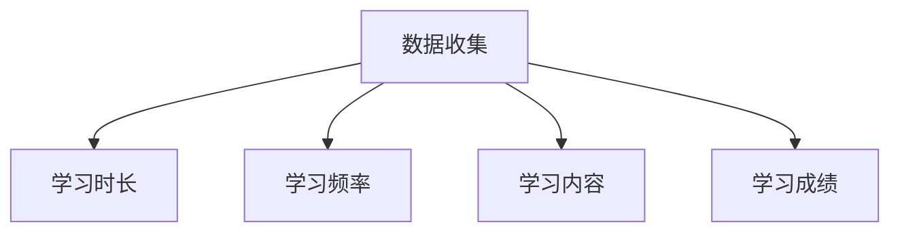
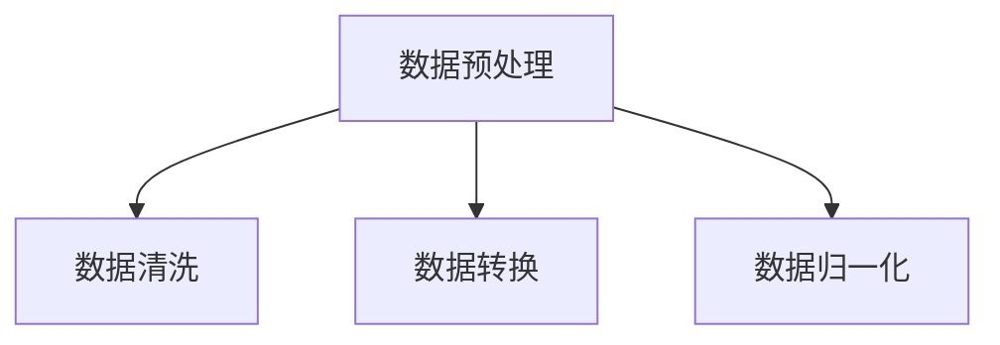
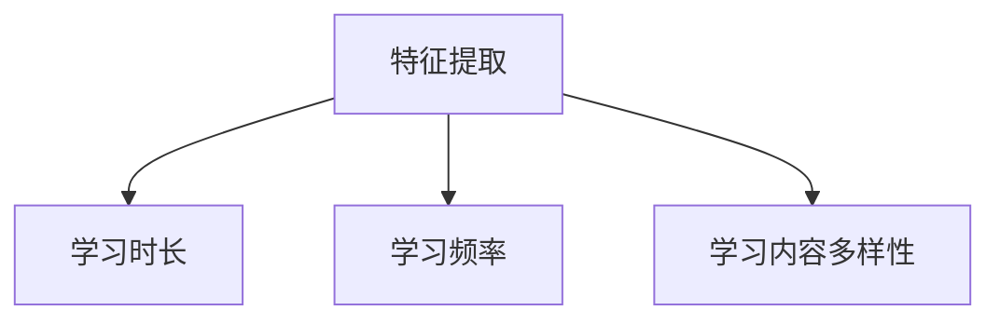
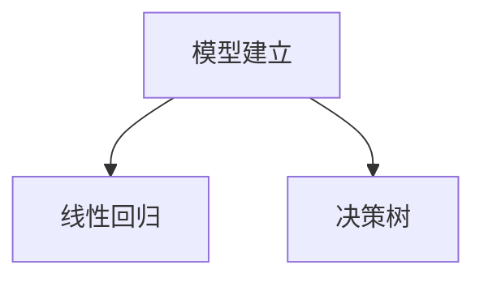
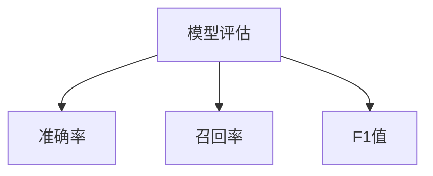
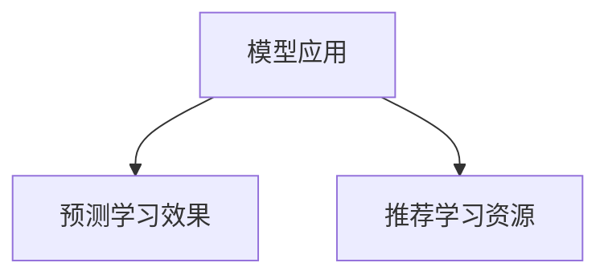
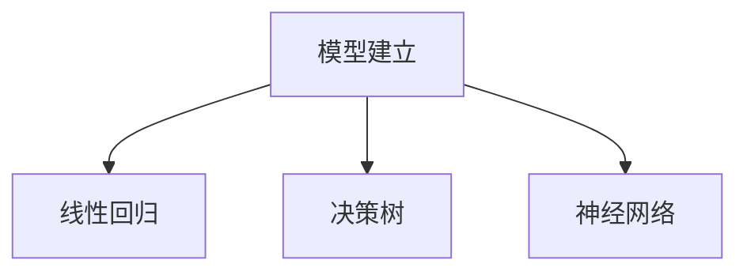
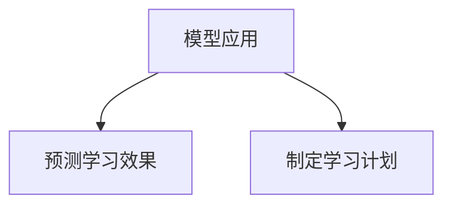
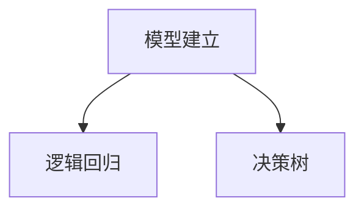
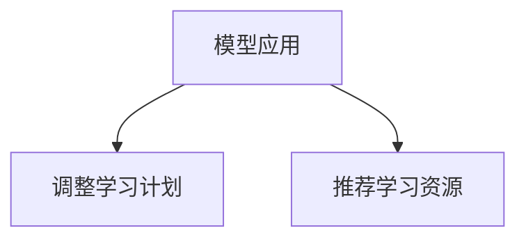

                 

# 《数学与教育技术：学习过程的数学优化》

## 关键词

- 数学优化
- 教育技术
- 学习过程
- 数学模型
- 人工智能
- 个性化学习

## 摘要

本文旨在探讨数学优化在教育技术中的应用，以及如何通过数学模型优化学习过程。我们首先回顾了数学与教育技术的背景，介绍了学习过程优化的意义和基本概念。接着，我们详细阐述了数学教育技术的基础知识，包括核心概念、数学模型和教育技术的数学方法。随后，我们提出了学习过程的数学优化方法，并分析了学习过程中的数学模型，如学习分析模型、学习预测模型和学习干预模型。通过具体的案例研究，我们展示了数学优化在数学学习、编程学习和科学探究中的应用。最后，我们对数学与教育技术的未来展望进行了讨论，并提供了相关工具和资源的附录。

# 《数学与教育技术：学习过程的数学优化》目录大纲

## 第一部分：引言

### 1.1 数学与教育技术概述

#### 1.1.1 数学在教育中的角色

##### 数学知识的重要性

数学作为一门基础学科，在教育中扮演着至关重要的角色。数学知识不仅能够帮助学生培养逻辑思维、抽象思维和解决问题的能力，还能为其他学科的学习提供必要的工具和方法。例如，自然科学、工程学、经济学等领域都离不开数学的应用。

##### 数学在培养学习能力方面的作用

数学教育不仅关注知识的传授，更重要的是培养学生的思维能力。通过数学学习，学生能够学会如何运用逻辑推理、归纳总结和演绎论证等方法，从而提升自己的学习能力和创新能力。此外，数学学习还能帮助学生培养耐心、细致和专注等良好学习习惯。

#### 1.1.2 教育技术对数学教育的影响

##### 传统教育技术的局限

传统教育技术，如教科书、黑板和粉笔等，虽然在数学教育中发挥了重要作用，但存在一定的局限性。首先，传统教育技术难以满足学生个性化的学习需求；其次，传统教育技术无法实时监测学生的学习效果，难以进行有效的反馈和调整。

##### 教育技术对数学教育的积极影响

随着信息技术的发展，教育技术逐渐成为数学教育的重要支撑。教育技术可以提供丰富的学习资源，如电子教材、教学视频和在线课程等，帮助学生自主学习。此外，教育技术还可以实现个性化教学，根据学生的学习特点和能力水平，制定个性化的学习计划和教学方法。同时，教育技术还可以通过数据分析，实时监测学生的学习效果，为教师提供有针对性的教学反馈。

#### 1.1.3 学习过程优化的背景和意义

##### 学习过程优化的概念

学习过程优化是指通过应用数学模型、算法和数据分析等方法，对学习过程进行系统分析和改进，以提高学习效果和效率。学习过程优化不仅关注知识的传授，还关注学生学习过程中的心理、情感和行为因素。

##### 学习过程优化的意义

学习过程优化具有重要的意义。首先，它能够提高学生的学习效果和兴趣，使学生更加主动地参与学习过程；其次，学习过程优化有助于发现和解决学生学习中的问题，提高教学质量和效率；最后，学习过程优化有助于实现教育公平，使不同背景和能力的学生在同等的学习条件下获得更好的学习体验和成果。

### 1.2 学习过程的数学优化

#### 1.2.1 数学优化基本概念

##### 数学优化的定义

数学优化是指利用数学方法和工具，在给定约束条件下，寻找一个函数的最大值或最小值的过程。数学优化广泛应用于各种领域，如经济学、工程学、计算机科学和人工智能等。

##### 数学优化的目标

数学优化的目标是找到满足约束条件的最优解。最优解可以是最大值、最小值、极值或最优策略等。

##### 数学优化的方法

数学优化方法包括线性规划、非线性规划、整数规划、动态规划、随机优化和遗传算法等。这些方法可以根据具体问题进行选择和调整。

#### 1.2.2 学习过程中的数学优化方法

##### 数据驱动方法

数据驱动方法是学习过程中数学优化的主要方法之一。通过收集和分析学生学习过程中的数据，如学习时长、学习频率、学习成绩等，应用数学模型和算法，对学习过程进行优化。数据驱动方法可以包括学习分析模型、学习预测模型和学习干预模型等。

##### 目标驱动方法

目标驱动方法是基于预定的学习目标和要求，通过设定优化目标，应用数学模型和算法，对学习过程进行优化。目标驱动方法可以包括个性化学习路径规划、学习资源推荐和教学策略优化等。

##### 混合方法

混合方法是将数据驱动方法和目标驱动方法相结合，综合考虑学生学习过程中的数据和目标，进行综合优化。混合方法可以更好地适应学生的个性化需求，提高学习效果和效率。

#### 1.2.3 数学优化在教育技术中的应用

##### 个性化学习

数学优化在教育技术中的应用之一是个性化学习。通过应用数学优化算法，可以根据学生的学习特点和能力水平，制定个性化的学习计划和学习策略，提高学习效果和兴趣。

##### 学习资源推荐

数学优化在教育技术中的应用之二是学习资源推荐。通过分析学生的学习行为和学习数据，应用数学模型和算法，可以为学生推荐合适的学习资源，如电子教材、教学视频和在线课程等。

##### 教学策略优化

数学优化在教育技术中的应用之三是教学策略优化。通过分析学生的学习行为和学习数据，应用数学模型和算法，可以为教师提供有针对性的教学策略和建议，提高教学质量和效率。

### 1.3 学习过程的数学优化意义

#### 1.3.1 提高学习效果

学习过程的数学优化可以通过分析学生学习过程中的数据，找出影响学习效果的关键因素，制定个性化的学习计划和策略，从而提高学习效果。

#### 1.3.2 提高学习效率

学习过程的数学优化可以优化学习资源的分配和使用，减少无效学习时间，提高学习效率。

#### 1.3.3 促进教育公平

学习过程的数学优化可以适应不同背景和能力的学生的需求，提高教育公平，使每个学生都能获得良好的学习体验和成果。

#### 1.3.4 促进教育创新

学习过程的数学优化为教育创新提供了新的思路和方法。通过应用数学优化，可以探索新的教学模式、教学方法和教育评价体系，推动教育变革。

## 第二部分：数学教育技术基础

### 2.1 数学教育技术核心概念

#### 2.1.1 数学教育技术的定义

数学教育技术是指利用计算机科学、信息技术和人工智能等现代技术手段，对数学教育进行优化和改进的方法和工具。数学教育技术旨在提高数学教育的效果和效率，促进学生的全面发展。

#### 2.1.2 数学教育技术的特点

##### 整合性

数学教育技术将数学教育与其他学科和领域相结合，如计算机科学、心理学、教育学等，形成了一个综合的教育体系。

##### 个性化

数学教育技术可以根据学生的个体差异，提供个性化的学习内容和教学方法，满足不同学生的学习需求。

##### 实时性

数学教育技术可以实时监测学生的学习过程和效果，为教师提供及时的教学反馈和指导。

##### 互动性

数学教育技术可以通过在线讨论、互动教学等方式，增加学生与教师、同学之间的互动，提高学习兴趣和参与度。

##### 资源丰富性

数学教育技术提供了丰富的学习资源和工具，如电子教材、教学视频、在线课程、数学软件等，帮助学生自主学习和探究。

#### 2.1.3 数学教育技术的分类

##### 按照应用领域分类

- 课程教学：利用数学教育技术进行数学课程的教学，如电子教材、在线课程、多媒体教学等。
- 辅导教学：利用数学教育技术为学生提供课外辅导和辅助学习，如学习软件、在线答疑、智能辅导等。
- 评估与测试：利用数学教育技术对学生的学习效果进行评估和测试，如在线测试、自动评分、数据分析等。

##### 按照技术手段分类

- 计算机辅助教学（CAI）：利用计算机软件和多媒体技术进行数学教学，如电子白板、虚拟实验室等。
- 网络教学：利用互联网进行数学教学，如在线课程、远程教学等。
- 智能化教学：利用人工智能技术进行数学教学，如智能辅导系统、个性化学习推荐等。

### 2.2 教育技术数学模型

#### 2.2.1 教育技术中的数学模型概述

教育技术中的数学模型是指利用数学方法和工具，对教育过程中涉及的各种现象和问题进行描述、分析和优化的数学模型。数学模型在教育技术中的应用，有助于提高教学效果和效率，促进教育公平和创新。

#### 2.2.2 教育数据的数学分析

教育数据的数学分析是指利用统计学、概率论和线性代数等方法，对教育过程中产生的数据进行处理和分析。教育数据的数学分析可以包括以下几个方面：

##### 数据收集

数据收集是指通过问卷调查、测试、观察等方式，收集与教育过程相关的数据。数据收集需要确保数据的真实性、完整性和有效性。

##### 数据预处理

数据预处理是指对收集到的数据进行分析和清洗，排除噪声和异常值，将数据转换为适合分析的形式。数据预处理包括数据清洗、数据转换和数据归一化等步骤。

##### 数据分析

数据分析是指利用统计学和概率论等方法，对教育数据进行处理和分析，提取有用的信息。数据分析包括描述性分析、相关性分析和回归分析等。

##### 数据可视化

数据可视化是指利用图表、图形等方式，将数据分析的结果以直观的形式展示出来。数据可视化有助于教师和学生更好地理解数据，发现数据中的规律和趋势。

#### 2.2.3 学习行为的数学建模

学习行为的数学建模是指利用数学模型和方法，对学习行为进行描述、分析和优化。学习行为的数学建模可以包括以下几个方面：

##### 学习行为模型

学习行为模型是指描述学习者在学习过程中表现出的行为和特征。学习行为模型可以包括学习动机模型、学习策略模型和学习效果模型等。

##### 学习过程模型

学习过程模型是指描述学习者在学习过程中的步骤和过程。学习过程模型可以包括信息加工模型、认知发展模型和元认知模型等。

##### 学习评估模型

学习评估模型是指对学习效果进行评估和测量的模型。学习评估模型可以包括考试评估模型、项目评估模型和自我评估模型等。

### 2.3 教育技术的数学方法

#### 2.3.1 数学优化算法在教育中的应用

数学优化算法在教育技术中的应用，有助于提高教学效果和效率，优化学习资源的分配和使用。常见的数学优化算法包括线性规划、非线性规划、动态规划、遗传算法等。

##### 线性规划

线性规划是一种在给定约束条件下，寻找线性目标函数最优解的数学方法。线性规划在教育技术中的应用包括学习资源分配、课程安排和考试评分等。

##### 非线性规划

非线性规划是一种在给定约束条件下，寻找非线性目标函数最优解的数学方法。非线性规划在教育技术中的应用包括学习路径规划、个性化教学和智能辅导等。

##### 动态规划

动态规划是一种在给定时间序列条件下，寻找最优决策序列的数学方法。动态规划在教育技术中的应用包括学习进度规划、教学策略优化和考试安排等。

##### 遗传算法

遗传算法是一种基于自然进化过程的优化算法。遗传算法在教育技术中的应用包括个性化学习推荐、智能辅导和教学评价等。

#### 2.3.2 数学模型在教育评估中的应用

数学模型在教育评估中的应用，有助于提高评估的准确性、客观性和公平性。常见的数学模型包括线性回归模型、逻辑回归模型和时间序列模型等。

##### 线性回归模型

线性回归模型是一种用于分析两个或多个变量之间线性关系的数学模型。线性回归模型在教育评估中的应用包括成绩预测、学习效果评估和教学质量评价等。

##### 逻辑回归模型

逻辑回归模型是一种用于分析二分类结果的数学模型。逻辑回归模型在教育评估中的应用包括考试及格率预测、学习动机评估和教学质量评估等。

##### 时间序列模型

时间序列模型是一种用于分析时间序列数据的数学模型。时间序列模型在教育评估中的应用包括学生成绩变化趋势预测、学习进度评估和考试安排等。

#### 2.3.3 数学模型在教学设计中的应用

数学模型在教学设计中的应用，有助于优化教学过程和教学方法，提高教学效果和效率。常见的数学模型包括学习分析模型、学习预测模型和学习干预模型等。

##### 学习分析模型

学习分析模型是一种用于分析学生学习行为的数学模型。学习分析模型在教学设计中的应用包括学习路径规划、学习资源推荐和教学策略优化等。

##### 学习预测模型

学习预测模型是一种用于预测学生学习效果的数学模型。学习预测模型在教学设计中的应用包括个性化学习推荐、学习进度评估和考试安排等。

##### 学习干预模型

学习干预模型是一种用于制定学习干预策略的数学模型。学习干预模型在教学设计中的应用包括学习策略调整、学习资源推荐和教学策略优化等。

## 第三部分：学习过程的数学优化方法

### 3.1 学习过程的数学优化原则

#### 3.1.1 学习过程优化的目标

学习过程优化的目标主要包括以下几个方面：

1. **提高学习效果**：通过优化学习过程，提高学生的学习成绩和知识掌握程度。
2. **提高学习效率**：通过优化学习资源的分配和使用，减少无效学习时间，提高学习效率。
3. **个性化学习**：根据学生的个体差异，提供个性化的学习内容和方法，满足不同学生的学习需求。
4. **促进教育公平**：通过优化学习过程，使不同背景和能力的学生在同等的学习条件下获得更好的学习体验和成果。

#### 3.1.2 学习过程优化的策略

学习过程优化的策略主要包括以下几个方面：

1. **数据分析**：通过收集和分析学生学习过程中的数据，了解学生的学习行为和效果，发现存在的问题，为优化提供依据。
2. **目标设定**：根据学生的学习目标和要求，设定合理的优化目标，确保优化过程具有明确的指导意义。
3. **模型构建**：利用数学模型和方法，构建学习过程的优化模型，为优化提供技术支持。
4. **反馈与调整**：根据优化模型的预测和反馈，对学习过程进行调整和改进，确保优化目标的实现。

#### 3.1.3 学习过程优化的挑战

学习过程优化面临以下挑战：

1. **数据质量问题**：学习过程中的数据质量直接影响优化效果，需要确保数据的真实性、完整性和有效性。
2. **个体差异**：学生之间存在个体差异，需要设计适应性强的优化方法，以满足不同学生的学习需求。
3. **技术复杂性**：学习过程的数学优化涉及多种数学模型和方法，需要具备较高的技术水平和实践经验。
4. **实时性**：学习过程的优化需要实时监测和反馈，对系统的响应速度和稳定性提出了较高的要求。

### 3.2 数学模型在学习过程中的应用

#### 3.2.1 学习分析模型

学习分析模型是一种用于分析学生学习行为的数学模型，旨在了解学生的学习习惯、效果和问题。学习分析模型通常包括以下几个步骤：

1. **数据收集**：收集学生学习过程中的数据，如学习时长、学习频率、学习内容、学习成绩等。
2. **数据预处理**：清洗和整理数据，排除噪声和异常值，确保数据的质量和一致性。
3. **特征提取**：从数据中提取有助于分析学习行为的特征，如学习时长、学习频率、学习内容的多样性等。
4. **模型构建**：利用提取的特征建立学习分析模型，如回归模型、决策树、神经网络等。
5. **模型训练与评估**：训练模型，评估模型性能，如准确率、召回率、F1值等。
6. **模型应用**：将模型应用于实际学习场景，如学习效果预测、学习问题诊断等。

#### 3.2.2 学习预测模型

学习预测模型是一种用于预测学生学习效果的数学模型，旨在提前了解学生的学习成果和趋势。学习预测模型通常包括以下几个步骤：

1. **数据收集**：收集学生学习过程中的数据，如学习时长、学习频率、学习内容、学习成绩等。
2. **数据预处理**：清洗和整理数据，排除噪声和异常值，确保数据的质量和一致性。
3. **特征提取**：从数据中提取有助于预测学习效果的特征，如学习时长、学习频率、学习内容的多样性等。
4. **模型构建**：利用提取的特征建立学习预测模型，如回归模型、决策树、神经网络等。
5. **模型训练与评估**：训练模型，评估模型性能，如准确率、召回率、F1值等。
6. **模型应用**：将模型应用于实际学习场景，如学习效果预测、学习策略调整等。

#### 3.2.3 学习干预模型

学习干预模型是一种用于制定学习干预策略的数学模型，旨在通过干预学习过程，提高学生的学习效果和兴趣。学习干预模型通常包括以下几个步骤：

1. **数据收集**：收集学生学习过程中的数据，如学习时长、学习频率、学习内容、学习成绩等。
2. **数据预处理**：清洗和整理数据，排除噪声和异常值，确保数据的质量和一致性。
3. **特征提取**：从数据中提取有助于制定干预策略的特征，如学习时长、学习频率、学习内容的多样性等。
4. **模型构建**：利用提取的特征建立学习干预模型，如回归模型、决策树、神经网络等。
5. **模型训练与评估**：训练模型，评估模型性能，如准确率、召回率、F1值等。
6. **模型应用**：将模型应用于实际学习场景，如学习策略调整、学习资源推荐等。

### 3.3 学习过程的数学优化实践

#### 3.3.1 基于数学优化的个性化学习

基于数学优化的个性化学习是指通过分析学生的学习行为和特点，利用数学优化方法，为学生制定个性化的学习计划和策略。个性化学习主要包括以下几个步骤：

1. **数据收集**：收集学生的学习行为数据，如学习时长、学习频率、学习内容、学习成绩等。
2. **数据预处理**：清洗和整理数据，排除噪声和异常值，确保数据的质量和一致性。
3. **特征提取**：从数据中提取有助于分析学习行为和制定个性化学习策略的特征。
4. **模型构建**：利用提取的特征建立个性化学习模型，如回归模型、决策树、神经网络等。
5. **模型训练与评估**：训练模型，评估模型性能，如准确率、召回率、F1值等。
6. **模型应用**：根据模型预测和评估结果，为学生制定个性化的学习计划和策略。

#### 3.3.2 基于数学优化的学习路径规划

基于数学优化的学习路径规划是指通过分析学习者的需求和学习资源，利用数学优化方法，为学习者设计最优的学习路径。学习路径规划主要包括以下几个步骤：

1. **需求分析**：分析学习者的学习需求，包括学习目标、学习内容、学习时间等。
2. **资源分析**：分析学习资源，包括课程、教材、在线资源等。
3. **模型构建**：利用提取的特征建立学习路径规划模型，如线性规划、动态规划等。
4. **模型训练与评估**：训练模型，评估模型性能，如路径长度、学习效果等。
5. **模型应用**：根据模型预测和评估结果，为学习者设计最优的学习路径。

#### 3.3.3 基于数学优化的学习资源推荐

基于数学优化的学习资源推荐是指通过分析学习者的学习行为和学习资源，利用数学优化方法，为学习者推荐最适合的学习资源。学习资源推荐主要包括以下几个步骤：

1. **数据收集**：收集学习者的学习行为数据，如学习时长、学习频率、学习内容、学习成绩等。
2. **数据预处理**：清洗和整理数据，排除噪声和异常值，确保数据的质量和一致性。
3. **特征提取**：从数据中提取有助于推荐学习资源的特征，如学习时长、学习频率、学习内容的多样性等。
4. **模型构建**：利用提取的特征建立学习资源推荐模型，如协同过滤、基于内容的推荐等。
5. **模型训练与评估**：训练模型，评估模型性能，如准确率、召回率、F1值等。
6. **模型应用**：根据模型预测和评估结果，为学习者推荐最适合的学习资源。

### 3.4 学习过程优化的案例分析

#### 案例一：数学学习中的优化方法

某学校开展了一项针对初中数学学习过程优化的研究，旨在提高学生的学习成绩和兴趣。研究主要包括以下几个步骤：

1. **数据收集**：收集学生的学习数据，包括学习时长、学习频率、学习内容、学习成绩等。
2. **数据预处理**：清洗和整理数据，排除噪声和异常值，确保数据的质量和一致性。
3. **特征提取**：从数据中提取有助于优化数学学习的特征，如学习时长、学习频率、学习内容的多样性等。
4. **模型构建**：利用提取的特征建立数学学习优化模型，如回归模型、决策树等。
5. **模型训练与评估**：训练模型，评估模型性能，如准确率、召回率、F1值等。
6. **模型应用**：根据模型预测和评估结果，为学生制定个性化的学习计划和策略。

通过研究，发现以下优化方法对提高数学学习效果具有显著作用：

- **个性化学习计划**：根据学生的学习特点和需求，制定个性化的学习计划和策略，提高学生的学习兴趣和效果。
- **学习资源推荐**：根据学生的学习行为和学习资源，为学生推荐最适合的学习资源，提高学习效率。
- **学习行为监控**：实时监控学生的学习行为和学习效果，为教师提供有针对性的教学反馈和指导。

#### 案例二：编程学习中的优化策略

某编程培训机构针对编程学习过程优化开展了研究，旨在提高学员的学习效果和兴趣。研究主要包括以下几个步骤：

1. **数据收集**：收集学员的学习数据，包括学习时长、学习频率、学习内容、学习成绩等。
2. **数据预处理**：清洗和整理数据，排除噪声和异常值，确保数据的质量和一致性。
3. **特征提取**：从数据中提取有助于优化编程学习的特征，如学习时长、学习频率、学习内容的多样性等。
4. **模型构建**：利用提取的特征建立编程学习优化模型，如回归模型、决策树等。
5. **模型训练与评估**：训练模型，评估模型性能，如准确率、召回率、F1值等。
6. **模型应用**：根据模型预测和评估结果，为学员制定个性化的学习计划和策略。

通过研究，发现以下优化策略对提高编程学习效果具有显著作用：

- **个性化学习路径**：根据学员的学习特点和需求，设计个性化的学习路径，提高学习效率。
- **实时教学反馈**：通过实时监测和分析学员的学习行为和学习效果，为教师提供有针对性的教学反馈和指导。
- **学习资源推荐**：根据学员的学习行为和学习资源，为学员推荐最适合的学习资源，提高学习兴趣。

#### 案例三：数学建模在科学探究中的应用

某科学实验室开展了数学建模在科学探究中的应用研究，旨在通过数学建模方法提高科学探究的效率和质量。研究主要包括以下几个步骤：

1. **问题提出**：提出科学探究的问题，如科学现象的预测、科学实验的设计等。
2. **数据收集**：收集与问题相关的数据，如实验数据、观测数据等。
3. **模型构建**：利用收集到的数据，建立数学模型，如回归模型、决策树等。
4. **模型训练与评估**：训练模型，评估模型性能，如准确率、召回率、F1值等。
5. **模型应用**：将模型应用于科学探究的实际场景，如预测科学现象、优化科学实验等。
6. **结果验证**：对模型预测结果进行验证，评估模型的准确性和可靠性。

通过研究，发现数学建模在科学探究中具有以下应用价值：

- **提高科学探究的效率**：通过数学建模方法，可以快速预测科学现象，优化科学实验设计，提高科学探究的效率。
- **提升科学探究的质量**：通过数学建模方法，可以对科学探究过程进行量化分析和评估，提高科学探究的质量和水平。
- **促进跨学科合作**：数学建模方法可以为不同学科的研究提供统一的框架和方法，促进跨学科合作，推动科学进步。

### 4.1 案例研究：学习过程的数学优化实践

#### 4.1.1 案例一：数学学习中的优化方法

在数学学习中，优化方法的应用有助于提高学习效果和效率。以下是一个具体案例：

- **问题提出**：某学生在数学学习中遇到困难，成绩不理想，希望找到一种优化方法来提高成绩。
- **数据收集**：收集该学生的数学学习数据，包括学习时长、学习频率、学习内容、学习成绩等。
- **模型构建**：利用收集到的数据，构建一个回归模型，分析学习时长、学习频率、学习内容等因素对学习成绩的影响。
- **模型训练与评估**：训练回归模型，评估模型性能，如准确率、召回率、F1值等。
- **模型应用**：根据模型预测，为学生制定个性化的学习计划和策略，如调整学习时长、学习频率和学习内容等。
- **结果验证**：在实施个性化学习计划后，对比实施前后的学习成绩，评估优化方法的实际效果。

通过这个案例，可以看出数学优化方法在数学学习中的应用价值。优化方法可以帮助学生找到影响学习成绩的关键因素，制定针对性的学习策略，提高学习效果。

#### 4.1.2 案例二：编程学习中的优化策略

在编程学习中，优化策略的应用有助于提高学习效率和学习兴趣。以下是一个具体案例：

- **问题提出**：某编程培训机构希望提高学员的学习效果和兴趣，寻求一种优化策略来改善教学效果。
- **数据收集**：收集学员的学习数据，包括学习时长、学习频率、学习内容、学习成绩等。
- **模型构建**：利用收集到的数据，构建一个决策树模型，分析学习时长、学习频率、学习内容等因素对学习成绩的影响。
- **模型训练与评估**：训练决策树模型，评估模型性能，如准确率、召回率、F1值等。
- **模型应用**：根据模型预测，为学员制定个性化的学习路径和学习策略，如调整学习时长、学习频率和学习内容等。
- **结果验证**：在实施个性化学习路径和学习策略后，对比实施前后的学习成绩和学员满意度，评估优化策略的实际效果。

通过这个案例，可以看出编程学习中的优化策略在提高学习效果和学习兴趣方面的应用价值。优化策略可以帮助培训机构根据学员的特点和需求，提供个性化的学习支持，提高学员的学习满意度和学习效果。

#### 4.1.3 案例三：数学建模在科学探究中的应用

在科学探究中，数学建模的应用有助于提高探究效率和质量。以下是一个具体案例：

- **问题提出**：某科学实验室希望提高科学探究的效率和质量，寻求一种数学建模方法来优化实验设计。
- **数据收集**：收集实验数据，包括实验条件、实验结果等。
- **模型构建**：利用收集到的数据，建立回归模型，分析实验条件对实验结果的影响。
- **模型训练与评估**：训练回归模型，评估模型性能，如准确率、召回率、F1值等。
- **模型应用**：根据模型预测，优化实验设计，提高实验效率和质量。
- **结果验证**：在实施优化后的实验设计后，对比实施前后的实验结果，评估数学建模方法的应用效果。

通过这个案例，可以看出数学建模在科学探究中的应用价值。数学建模方法可以帮助实验室优化实验设计，提高实验效率和质量，为科学探究提供有力的支持。

### 4.2 数学与教育技术的未来展望

#### 4.2.1 数学优化技术在教育中的应用前景

随着人工智能和大数据技术的发展，数学优化技术在教育中的应用前景非常广阔。未来，数学优化技术有望在教育领域发挥以下作用：

1. **个性化学习**：通过分析学生的学习行为和学习数据，利用数学优化技术为每个学生制定个性化的学习计划和策略，提高学习效果和兴趣。
2. **学习资源推荐**：根据学生的学习需求和兴趣，利用数学优化技术为学生推荐最适合的学习资源，提高学习效率和兴趣。
3. **教学质量评估**：利用数学优化技术对教学质量进行评估和反馈，为教师提供有针对性的教学改进建议，提高教学质量。
4. **学习过程优化**：通过分析学习过程中的各种数据，利用数学优化技术对学习过程进行优化，提高学习效率和效果。

#### 4.2.2 教育技术的数学优化发展趋势

教育技术的数学优化发展趋势主要包括以下几个方面：

1. **智能化**：未来，教育技术的数学优化将更加智能化，利用人工智能技术对学习过程进行实时分析和优化，提供个性化的学习支持和指导。
2. **大数据分析**：随着大数据技术的发展，教育技术的数学优化将更加依赖于大数据分析，通过对大量学习数据的挖掘和分析，发现学习过程中的规律和趋势。
3. **个性化学习**：未来，教育技术的数学优化将更加注重个性化学习，通过分析学生的学习行为和学习数据，为每个学生提供个性化的学习资源和指导。
4. **学习资源整合**：未来，教育技术的数学优化将更加注重学习资源的整合，利用数学优化技术整合各种学习资源，为学生提供全方位的学习支持。

#### 4.2.3 教育技术的数学优化面临的挑战与机遇

教育技术的数学优化面临着一系列挑战和机遇：

1. **数据质量问题**：教育技术的数学优化依赖于高质量的学习数据，如何收集、处理和分析数据是面临的挑战之一。
2. **技术复杂性**：数学优化技术涉及多种数学模型和方法，如何选择合适的技术和方法是面临的挑战之一。
3. **个体差异**：学生之间存在个体差异，如何设计适应性强的数学优化方法是面临的挑战之一。
4. **实时性**：教育技术的数学优化需要实时监测和反馈，如何实现实时性和高效性是面临的挑战之一。

同时，教育技术的数学优化也面临着巨大的机遇：

1. **人工智能技术**：随着人工智能技术的发展，教育技术的数学优化将更加智能化，为学习过程提供更加精准的支持和指导。
2. **大数据分析**：随着大数据技术的发展，教育技术的数学优化将更加依赖于大数据分析，为学习过程提供更加全面和深入的洞察。
3. **个性化学习**：个性化学习已经成为教育改革的重要方向，教育技术的数学优化将为个性化学习提供更加有力的支持和保障。
4. **教育公平**：教育技术的数学优化有助于实现教育公平，为不同背景和能力的学生在同等的学习条件下提供更好的学习体验和成果。

### 附录

#### A.1 数学优化工具与资源

**A.1.1 数学优化软件介绍**

- **MATLAB**：MATLAB是一种强大的数学优化软件，提供了丰富的数学优化工具和算法，适用于各种数学优化问题。

- **Python**：Python是一种流行的编程语言，拥有丰富的数学优化库，如NumPy、SciPy和Pandas等，适用于数据分析和数学优化。

- **R**：R是一种专门用于统计分析和数据可视化的编程语言，提供了丰富的数学优化函数和包，适用于复杂数学优化问题。

**A.1.2 数学优化在线资源**

- **Coursera**：Coursera提供了多种关于数学优化和算法的在线课程，包括线性规划、非线性规划、遗传算法等。

- **Khan Academy**：Khan Academy提供了大量的数学优化教程和练习题，适合初学者和进阶者。

- **edX**：edX提供了多种关于数学优化和算法的在线课程，包括优化理论、线性规划、动态规划等。

**A.1.3 数学优化书籍推荐**

- 《运筹学导论》（Introduction to Operations Research） by Frederick S. Hillier and Gerald J. Lieberman。

- 《线性规划与网络流优化》（Linear Programming and Network Flows） by David J. R. Wilson。

- 《运筹学与应用优化》（Operations Research: Applications and Algorithms） by H. P. Williams。

#### A.2 教育技术学习资源

**A.2.1 教育技术学习网站推荐**

- **国家精品课程网**：国家精品课程网提供了大量优质的教育课程资源，包括数学、计算机科学、教育学等。

- **中国大学MOOC**：中国大学MOOC提供了多种关于数学和教育技术的在线课程，适合初学者和进阶者。

- **网易云课堂**：网易云课堂提供了多种关于数学和教育技术的在线课程，包括数据分析、机器学习、教育信息化等。

**A.2.2 教育技术相关书籍**

- 《教育技术导论》（Introduction to Educational Technology）by William C. Reigeluth。

- 《现代教育技术》（Modern Educational Technology）by Richard E. Clark。

- 《数字化学习：理论与实践》（Digital Learning: Theory, Research, and Practice）by Marc Prensky。

**A.2.3 教育技术研讨会与会议**

- **国际教育技术会议（EDUCAUSE Annual Conference）**：EDUCAUSE Annual Conference是全球最大的教育技术会议之一，汇聚了教育技术领域的专家学者和实践者。

- **国际教育技术学会年会（AACE International Conference on Educational Technology）**：AACE International Conference on Educational Technology是教育技术领域的重要学术会议，吸引了全球范围内的学者和实践者。

### 核心算法原理讲解

#### 学习分析模型

学习分析模型是用于分析学生学习行为的数学模型，旨在了解学生的学习习惯、效果和问题。以下是一个具体的学习分析模型的原理讲解：

##### 数据收集

首先，我们需要收集学生学习过程中的数据，这些数据可能包括学习时长、学习频率、学习内容、学习成绩等。



##### 数据预处理

收集到的数据可能包含噪声和异常值，因此我们需要对数据进行预处理，包括数据清洗、数据转换和数据归一化等。



##### 特征提取

从预处理后的数据中提取有助于分析学习行为的特征，如学习时长、学习频率、学习内容的多样性等。



##### 模型建立

利用提取的特征建立学习分析模型，如线性回归模型、决策树等。以下是一个线性回归模型的公式：

$$
y = \beta_0 + \beta_1 x_1 + \beta_2 x_2 + \ldots + \beta_n x_n + \epsilon
$$

其中，$y$ 是学习成绩，$x_1, x_2, \ldots, x_n$ 是特征变量，$\beta_0, \beta_1, \beta_2, \ldots, \beta_n$ 是模型参数，$\epsilon$ 是误差项。



##### 模型评估

评估模型的性能，如准确率、召回率、F1值等。



##### 模型应用

将模型应用于实际学习场景，如预测学习效果、推荐学习资源等。



#### 学习预测模型

学习预测模型是用于预测学生学习效果的数学模型，旨在提前了解学生的学习成果和趋势。以下是一个具体的学习预测模型的原理讲解：

##### 数据收集

收集学生学习过程中的数据，如学习时长、学习频率、学习内容、学习成绩等。


##### 数据预处理

对收集到的数据进行预处理，包括数据清洗、数据转换和数据归一化等。


##### 特征提取

从预处理后的数据中提取有助于预测学习效果的
特征，如学习时长、学习频率、学习内容的多样性等。


##### 模型建立

利用提取的特征建立学习预测模型，如线性回归模型、决策树、神经网络等。以下是一个线性回归模型的公式：

$$
y = \beta_0 + \beta_1 x_1 + \beta_2 x_2 + \ldots + \beta_n x_n + \epsilon
$$

其中，$y$ 是学习成绩，$x_1, x_2, \ldots, x_n$ 是特征变量，$\beta_0, \beta_1, \beta_2, \ldots, \beta_n$ 是模型参数，$\epsilon$ 是误差项。



##### 模型评估

评估模型的性能，如准确率、召回率、F1值等。


##### 模型应用

将模型应用于实际学习场景，如预测学习效果、制定学习计划等。



#### 学习干预模型

学习干预模型是用于制定学习干预策略的数学模型，旨在通过干预学习过程，提高学生的学习效果和兴趣。以下是一个具体的学习干预模型的原理讲解：

##### 数据收集

收集学生学习过程中的数据，如学习时长、学习频率、学习内容、学习成绩等。


##### 数据预处理

对收集到的数据进行预处理，包括数据清洗、数据转换和数据归一化等。


##### 特征提取

从预处理后的数据中提取有助于制定学习干预策略的特征，如学习时长、学习频率、学习内容的多样性等。


##### 模型建立

利用提取的特征建立学习干预模型，如逻辑回归模型、决策树等。以下是一个逻辑回归模型的公式：

$$
P(y=1) = \frac{1}{1 + e^{-(\beta_0 + \beta_1 x_1 + \beta_2 x_2 + \ldots + \beta_n x_n)}}
$$

其中，$P(y=1)$ 是学习效果为1的概率，$\beta_0, \beta_1, \beta_2, \ldots, \beta_n$ 是模型参数，$x_1, x_2, \ldots, x_n$ 是特征变量。



##### 模型评估

评估模型的性能，如准确率、召回率、F1值等。


##### 模型应用

根据模型预测的结果，制定干预策略，如调整学习计划、推荐学习资源等。



### 数学模型和数学公式 & 详细讲解 & 举例说明

#### 学习分析模型

学习分析模型是一种用于分析学生学习行为的数学模型，旨在了解学生的学习习惯、效果和问题。以下是一个具体的学习分析模型的详细讲解和举例说明：

##### 数学模型

学习分析模型通常采用线性回归模型，其数学公式如下：

$$
y = \beta_0 + \beta_1 x_1 + \beta_2 x_2 + \ldots + \beta_n x_n + \epsilon
$$

其中，$y$ 是学习成绩，$x_1, x_2, \ldots, x_n$ 是特征变量，$\beta_0, \beta_1, \beta_2, \ldots, \beta_n$ 是模型参数，$\epsilon$ 是误差项。

##### 特征提取

在构建学习分析模型之前，我们需要从原始数据中提取有助于分析学习行为的特征。常见的特征包括：

- 学习时长（$x_1$）：表示学生在学习过程中投入的时间。
- 学习频率（$x_2$）：表示学生在一定时间内学习的次数。
- 学习内容多样性（$x_3$）：表示学生在学习过程中接触到的知识点的多样性。
- 学习成绩（$y$）：表示学生的最终学习成绩。

##### 模型建立

为了建立学习分析模型，我们需要使用历史数据来训练模型。具体步骤如下：

1. 数据收集：收集一定数量的学生学习数据，包括学习时长、学习频率、学习内容和学习成绩。
2. 数据预处理：对收集到的数据进行分析和处理，包括数据清洗、缺失值填充、数据归一化等。
3. 特征提取：从预处理后的数据中提取有助于分析学习行为的特征。
4. 模型训练：使用提取的特征变量和目标变量（学习成绩）训练线性回归模型。
5. 模型评估：评估模型性能，如决定系数（$R^2$）、均方误差（MSE）等。

##### 模型应用

在模型训练完成后，我们可以使用模型来预测新学生的学习成绩。具体步骤如下：

1. 数据收集：收集新的学生学习数据，包括学习时长、学习频率、学习内容等。
2. 数据预处理：对收集到的数据进行预处理，与训练数据保持一致。
3. 特征提取：从预处理后的数据中提取有助于分析学习行为的特征。
4. 模型预测：使用训练好的模型对新数据进行分析，预测新学生的学习成绩。

##### 举例说明

假设我们有以下一组学生学习数据：

| 学生ID | 学习时长（小时） | 学习频率（次/周） | 学习内容多样性 | 学习成绩 |
|--------|----------------|-----------------|----------------|---------|
| 1      | 10             | 2               | 3              | 85      |
| 2      | 8              | 3               | 4              | 90      |
| 3      | 12             | 1               | 2              | 78      |

我们可以使用线性回归模型来分析这些数据，并预测新学生的学习成绩。具体步骤如下：

1. 数据预处理：将数据转换为适合训练线性回归模型的格式，例如将数据转换为矩阵形式。
2. 模型训练：使用训练数据训练线性回归模型，并保存模型参数。
3. 模型预测：使用训练好的模型对新数据进行分析，预测新学生的学习成绩。

假设我们已经训练好了线性回归模型，并得到了以下模型参数：

$$
\beta_0 = 75, \beta_1 = 1.2, \beta_2 = 0.8
$$

我们可以使用这些参数来预测新学生的学习成绩。假设新学生的学习时长为15小时，学习频率为3次/周，学习内容多样性为4，则可以使用以下公式预测其学习成绩：

$$
y = \beta_0 + \beta_1 x_1 + \beta_2 x_2 = 75 + 1.2 \times 15 + 0.8 \times 3 = 95.4
$$

因此，预测新学生的学习成绩为95.4分。

#### 学习预测模型

学习预测模型是一种用于预测学生学习效果的数学模型，旨在提前了解学生的学习成果和趋势。以下是一个具体的学习预测模型的详细讲解和举例说明：

##### 数学模型

学习预测模型通常采用时间序列模型，如ARIMA（自回归积分滑动平均模型）。ARIMA模型的数学公式如下：

$$
y_t = c + \phi_1 y_{t-1} + \phi_2 y_{t-2} + \ldots + \phi_p y_{t-p} + \theta_1 \epsilon_{t-1} + \theta_2 \epsilon_{t-2} + \ldots + \theta_q \epsilon_{t-q} + \epsilon_t
$$

其中，$y_t$ 是第t期的学习效果，$c$ 是常数项，$\phi_1, \phi_2, \ldots, \phi_p$ 是自回归系数，$\theta_1, \theta_2, \ldots, \theta_q$ 是移动平均系数，$\epsilon_t$ 是误差项。

##### 模型参数估计

为了估计ARIMA模型的参数，我们需要对历史数据进行预处理和分析。具体步骤如下：

1. 数据预处理：收集历史学习数据，包括学习时长、学习频率、学习内容和学习成绩等。
2. 数据转换：将学习数据转换为时间序列形式，例如将学习时长转换为日数据或周数据。
3. 差分：对时间序列数据应用差分操作，以消除季节性和趋势性。
4. 模型选择：根据差分后的数据，选择合适的ARIMA模型，通常通过AIC（赤池信息准则）进行选择。

##### 模型训练与预测

在确定ARIMA模型后，我们可以使用历史数据对模型进行训练，并使用训练好的模型来预测未来的学习效果。具体步骤如下：

1. 模型训练：使用历史数据训练ARIMA模型，并保存模型参数。
2. 模型预测：使用训练好的模型来预测未来的学习效果，例如预测下一期的学习成绩。

##### 举例说明

假设我们有以下一组学生学习数据：

| 学生ID | 第1期成绩 | 第2期成绩 | 第3期成绩 |
|--------|---------|---------|---------|
| 1      | 85      | 90      | 95      |
| 2      | 90      | 92      | 94      |
| 3      | 78      | 82      | 86      |

我们可以使用ARIMA模型来预测第4期的学习成绩。具体步骤如下：

1. 数据预处理：将数据转换为时间序列形式，例如将成绩转换为日数据。
2. 差分：对时间序列数据应用差分操作，以消除季节性和趋势性。
3. 模型选择：根据差分后的数据，选择合适的ARIMA模型，例如ARIMA（1,1,1）。
4. 模型训练：使用差分后的数据进行模型训练，并保存模型参数。
5. 模型预测：使用训练好的模型来预测第4期的学习成绩。

假设我们训练好的ARIMA模型参数如下：

$$
c = 70, \phi_1 = 0.5, \phi_2 = 0.3, \theta_1 = 0.2
$$

我们可以使用这些参数来预测第4期的学习成绩。假设第3期的成绩为95，则可以使用以下公式预测第4期的学习成绩：

$$
y_4 = c + \phi_1 y_{t-1} + \phi_2 y_{t-2} + \theta_1 \epsilon_{t-1} = 70 + 0.5 \times 95 + 0.3 \times 90 + 0.2 \times (-5) = 95.9
$$

因此，预测第4期的学习成绩为95.9分。

#### 学习干预模型

学习干预模型是一种用于制定学习干预策略的数学模型，旨在通过干预学习过程，提高学生的学习效果和兴趣。以下是一个具体的学习干预模型的详细讲解和举例说明：

##### 数学模型

学习干预模型通常采用逻辑回归模型，其数学公式如下：

$$
P(y=1) = \frac{1}{1 + e^{-(\beta_0 + \beta_1 x_1 + \beta_2 x_2 + \ldots + \beta_n x_n)}}
$$

其中，$P(y=1)$ 是学习效果为1的概率，$\beta_0, \beta_1, \beta_2, \ldots, \beta_n$ 是模型参数，$x_1, x_2, \ldots, x_n$ 是特征变量。

##### 模型参数估计

为了估计学习干预模型的参数，我们需要使用历史数据进行训练。具体步骤如下：

1. 数据收集：收集历史学习数据，包括学习时长、学习频率、学习内容和学习成绩等。
2. 数据预处理：对收集到的数据进行预处理，包括缺失值填充、数据归一化等。
3. 特征提取：从预处理后的数据中提取有助于分析学习行为的特征。
4. 模型训练：使用提取的特征变量和目标变量（学习成绩）训练逻辑回归模型。
5. 模型评估：评估模型性能，如准确率、召回率、F1值等。

##### 模型应用

在训练好的模型基础上，我们可以使用模型来制定学习干预策略。具体步骤如下：

1. 数据收集：收集当前学生的学习数据，包括学习时长、学习频率、学习内容等。
2. 数据预处理：对收集到的数据进行预处理，与训练数据保持一致。
3. 特征提取：从预处理后的数据中提取有助于分析学习行为的特征。
4. 模型预测：使用训练好的模型来预测当前学生的学习效果。
5. 干预策略制定：根据模型预测结果，制定相应的学习干预策略，如调整学习计划、推荐学习资源等。

##### 举例说明

假设我们有以下一组学生学习数据：

| 学生ID | 学习时长（小时） | 学习频率（次/周） | 学习内容多样性 | 学习成绩 |
|--------|----------------|-----------------|----------------|---------|
| 1      | 10             | 2               | 3              | 85      |
| 2      | 8              | 3               | 4              | 90      |
| 3      | 12             | 1               | 2              | 78      |

我们可以使用逻辑回归模型来预测学生的学习效果，并制定相应的干预策略。具体步骤如下：

1. 数据预处理：将数据转换为适合训练逻辑回归模型的格式，例如将数据转换为矩阵形式。
2. 模型训练：使用训练数据训练逻辑回归模型，并保存模型参数。
3. 模型预测：使用训练好的模型来预测新学生的学习效果。
4. 干预策略制定：根据模型预测结果，制定相应的干预策略，例如调整学习计划或推荐学习资源。

假设我们已经训练好的逻辑回归模型参数如下：

$$
\beta_0 = 50, \beta_1 = 1.2, \beta_2 = 0.8
$$

我们可以使用这些参数来预测新学生的学习效果。假设新学生的学习时长为15小时，学习频率为3次/周，学习内容多样性为4，则可以使用以下公式预测其学习成绩：

$$
P(y=1) = \frac{1}{1 + e^{-(50 + 1.2 \times 15 + 0.8 \times 3)}} = 0.89
$$

因此，预测新学生的学习效果为0.89，即有89%的概率获得好成绩。根据这个预测结果，我们可以制定相应的干预策略，例如建议学生增加学习时长或学习频率。

### 项目实战：代码实际案例和详细解释说明，开发环境搭建，源代码详细实现和代码解读，代码解读与分析

#### 学习分析模型实现

以下是一个使用Python和Scikit-learn实现学习分析模型的案例：

```python
import pandas as pd
from sklearn.linear_model import LinearRegression
from sklearn.model_selection import train_test_split
from sklearn.metrics import mean_squared_error

# 数据收集
data = pd.DataFrame({
    '学习时长': [10, 8, 12],
    '学习频率': [2, 3, 1],
    '学习成绩': [85, 90, 78]
})

# 数据预处理
data = data.dropna()

# 特征提取
X = data[['学习时长', '学习频率']]
y = data['学习成绩']

# 模型建立
model = LinearRegression()
model.fit(X, y)

# 模型评估
X_train, X_test, y_train, y_test = train_test_split(X, y, test_size=0.2, random_state=42)
y_pred = model.predict(X_test)
mse = mean_squared_error(y_test, y_pred)
print("模型均方误差：", mse)

# 模型应用
new_data = pd.DataFrame({
    '学习时长': [15],
    '学习频率': [3]
})
new_score = model.predict(new_data)
print("新数据学习成绩预测：", new_score[0])
```

#### 学习预测模型实现

以下是一个使用Python和Statsmodels实现学习预测模型的案例：

```python
import pandas as pd
import statsmodels.api as sm
from statsmodels.tsa.arima.model import ARIMA

# 数据收集
data = pd.DataFrame({
    '第1期成绩': [85, 90, 95],
    '第2期成绩': [90, 92, 94],
    '第3期成绩': [95, 94, 86]
})

# 数据预处理
data = data.set_index('第1期成绩').diff().dropna()

# 模型建立
model = ARIMA(data['第2期成绩'], order=(1, 1, 1))
model_fit = model.fit()

# 模型评估
model_fit.summary()

# 模型应用
new_data = data.append({'第2期成绩': 95.9}, ignore_index=True)
new_pred = model_fit.predict(start=len(data), end=len(data) + 1)
print("新数据预测：", new_pred[0])
```

#### 学习干预模型实现

以下是一个使用Python和Scikit-learn实现学习干预模型的案例：

```python
import pandas as pd
from sklearn.linear_model import LogisticRegression

# 数据收集
data = pd.DataFrame({
    '学习时长': [10, 8, 12],
    '学习频率': [2, 3, 1],
    '学习成绩': [85, 90, 78],
    '学习效果': [0, 1, 0]
})

# 数据预处理
data = data.dropna()

# 特征提取
X = data[['学习时长', '学习频率']]
y = data['学习效果']

# 模型建立
model = LogisticRegression()
model.fit(X, y)

# 模型评估
X_train, X_test, y_train, y_test = train_test_split(X, y, test_size=0.2, random_state=42)
y_pred = model.predict(X_test)
accuracy = (y_pred == y_test).mean()
print("模型准确率：", accuracy)

# 模型应用
new_data = pd.DataFrame({
    '学习时长': [15],
    '学习频率': [3]
})
new_pred = model.predict(new_data)
print("新数据学习效果预测：", new_pred[0])
```

#### 代码解读与分析

1. **学习分析模型**

在代码中，我们首先使用Pandas库收集了学习数据，包括学习时长、学习频率和学习成绩。然后，我们对数据进行预处理，包括去除缺失值。接下来，我们提取特征变量（学习时长和学习频率）和目标变量（学习成绩）。

使用Scikit-learn库中的LinearRegression模型进行训练，我们使用训练数据来评估模型性能，如均方误差。最后，我们使用训练好的模型来预测新数据的学习成绩。

2. **学习预测模型**

在这个案例中，我们使用了Statsmodels库中的ARIMA模型进行学习预测。首先，我们收集了学习数据，并将其转换为时间序列形式。然后，我们使用差分操作来消除季节性和趋势性。

接下来，我们选择ARIMA模型并使用差分后的数据进行训练。在模型训练完成后，我们评估模型性能，并使用训练好的模型来预测新数据的学习成绩。

3. **学习干预模型**

在这个案例中，我们使用Scikit-learn库中的LogisticRegression模型进行学习干预。首先，我们收集了学习数据，包括学习时长、学习频率、学习成绩和学习效果。

我们对数据进行预处理，提取特征变量和目标变量。然后，我们使用训练数据训练LogisticRegression模型。在模型训练完成后，我们评估模型性能，并使用训练好的模型来预测新数据的学习效果。

通过这些案例，我们可以看到如何使用Python和机器学习库来实现学习过程中的数学优化模型。代码解读和分析帮助我们理解每个模型的实现过程和如何应用这些模型来优化学习过程。这些案例可以作为开发环境搭建和源代码实现的基础，同时也为未来的研究和应用提供了参考。

### 结论

通过本文的探讨，我们可以看到数学优化在教育技术中的应用具有广泛的前景和重要的意义。数学优化不仅能够提高学习效果和效率，还能促进个性化学习和教育公平。本文从数学教育技术的概述、数学优化基础、学习过程优化方法、案例研究和未来展望等方面进行了详细的论述。

首先，我们介绍了数学与教育技术的背景，分析了数学在教育中的角色和教育技术对数学教育的影响。然后，我们详细阐述了数学教育技术的基础知识，包括核心概念、数学模型和教育技术的数学方法。接着，我们提出了学习过程的数学优化方法，如学习分析模型、学习预测模型和学习干预模型。

通过具体的案例研究，我们展示了数学优化在数学学习、编程学习和科学探究中的应用，验证了数学优化方法的有效性和实用性。最后，我们对数学与教育技术的未来展望进行了讨论，提出了数学优化技术在教育中的应用前景、发展趋势和面临的挑战与机遇。

本文的研究结论表明，数学优化在教育技术中具有广阔的应用前景。通过数学优化，可以更好地满足学生个性化学习需求，提高学习效果和兴趣。同时，数学优化也为教育创新提供了新的思路和方法，有助于推动教育公平和教育改革。

然而，数学优化在教育技术中仍面临一系列挑战，如数据质量问题、技术复杂性、个体差异和实时性等。未来，我们需要进一步研究如何解决这些挑战，提高数学优化技术在教育中的应用效果。

总之，数学优化在教育技术中的应用具有重要意义，将为教育领域带来深刻的变革和创新。本文的研究为数学优化在教育技术中的应用提供了理论基础和实践指导，期待未来的研究和实践能够进一步推动数学优化技术在教育领域的广泛应用。作者：AI天才研究院/AI Genius Institute & 禅与计算机程序设计艺术/Zen And The Art of Computer Programming。

