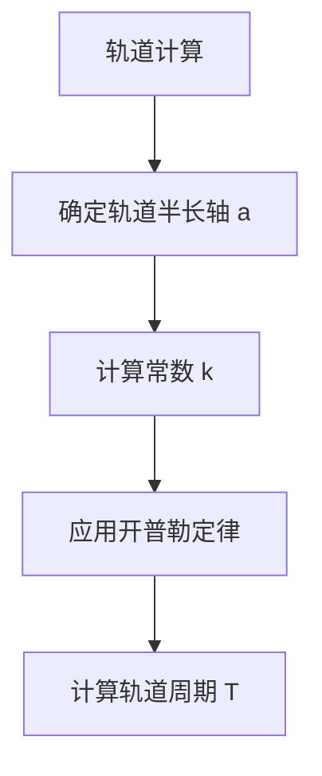
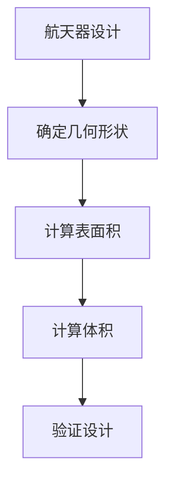
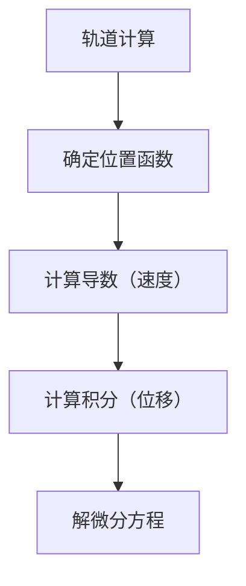
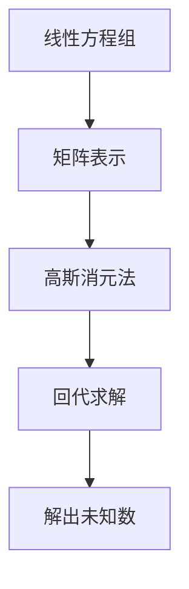
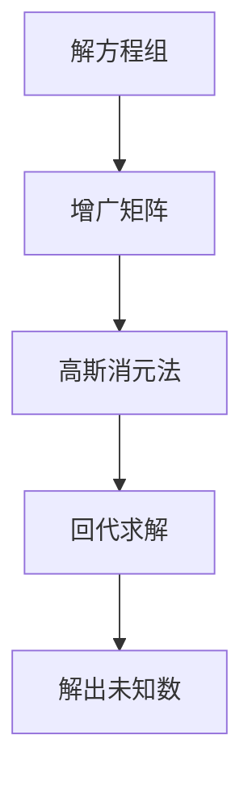
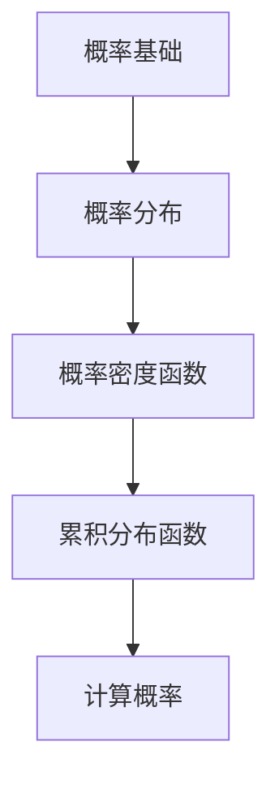
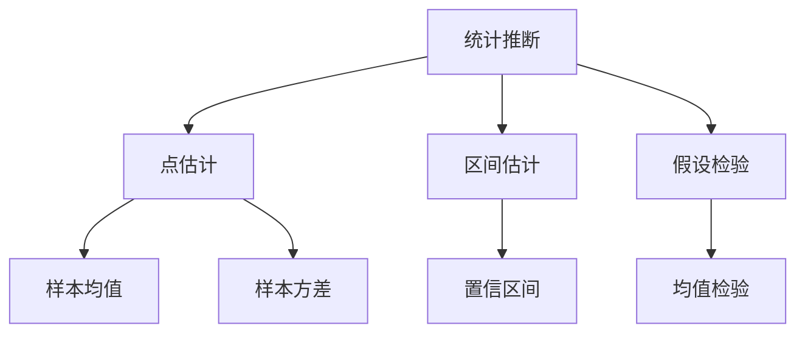
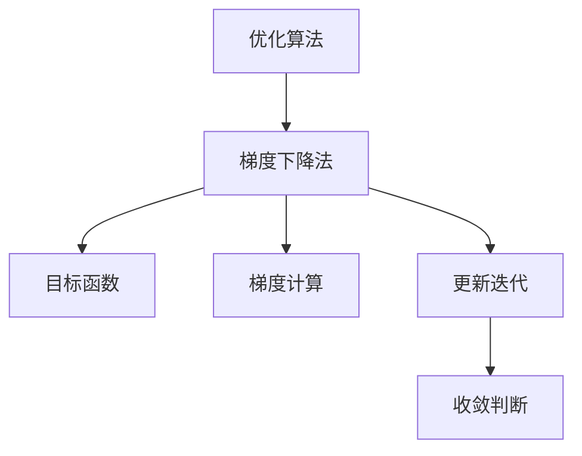
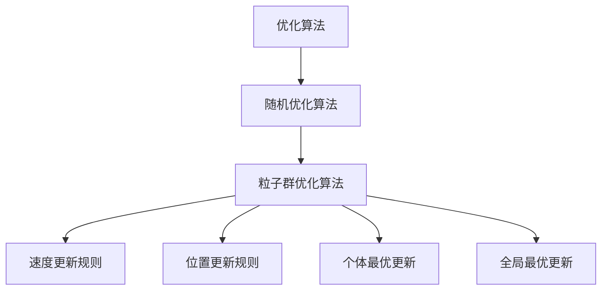
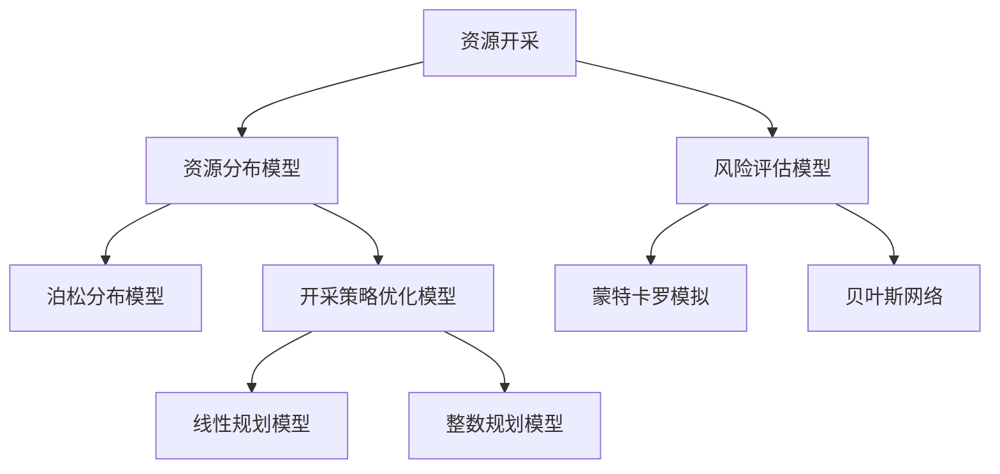

                 

# 数学与未来太空探索的技术挑战

> **关键词：** 太空探索、数学应用、技术挑战、未来发展趋势

> **摘要：** 本文将从数学的角度深入探讨未来太空探索所面临的技术挑战。通过分析数学在太空探索中的应用，包括基础数学、数值分析、概率论与统计、优化算法以及数学模型等方面，我们将揭示数学在推动太空探索技术进步中的重要作用，并探讨数学与未来太空探索的跨学科融合及其社会影响。最后，本文将展望数学与太空探索的未来发展趋势，为相关领域的研究和开发提供参考。

在人类对宇宙的探索中，数学一直扮演着至关重要的角色。从初期的天文观测，到现代的太空任务，数学不仅提供了描述和预测宇宙现象的工具，还为我们理解和利用太空资源提供了理论基础。随着未来太空探索的深入，数学的应用将更加广泛和深入。本文将分以下几个部分详细探讨数学与未来太空探索的技术挑战。

## 第一部分：数学与未来太空探索的技术挑战概述

### 第1章：数学与未来太空探索的背景

#### 1.1 太空探索的历程与现状

太空探索是人类科技发展的重要里程碑。自20世纪中叶以来，人类已经取得了显著的成就。从第一颗人造卫星的发射，到月球和火星的探测，再到国际空间站的运营，太空探索不断拓展我们的认知边界。

当前，太空探索正面临着新的挑战和机遇。随着技术的进步，人类开始探索更远的太空，如木星、土星等行星及其卫星，甚至考虑在月球和火星上建立永久性基地。这些任务不仅需要更先进的科学和技术，还需要更深入的数学研究来应对各种复杂的问题。

#### 1.2 数学在太空探索中的重要性

数学在太空探索中扮演着不可或缺的角色。它不仅为科学研究和实验设计提供理论支持，还直接参与了太空任务的各个阶段。例如：

- **轨道计算**：数学模型用于预测航天器的轨道，确保其准确到达目的地。
- **环境模拟**：数学模型可以模拟太空中的物理、化学和生物过程，帮助科学家预测和应对太空环境对人类和其他生物的影响。
- **数据分析**：太空任务产生的海量数据需要通过数学方法进行分析，提取有价值的信息。

#### 1.3 未来太空探索面临的数学挑战

随着太空探索的深入，数学面临着一系列新的挑战：

- **复杂系统的建模与模拟**：太空探索涉及的系统越来越复杂，需要更先进的数学模型和算法来准确描述和预测其行为。
- **不确定性处理**：太空探索过程中存在大量不确定性因素，如天体运动的随机性、环境变化等，需要开发有效的数学方法来处理这些不确定性。
- **资源优化**：太空任务往往需要高效利用有限的资源，如燃料、能源、通信等，需要优化算法来最大化任务的效益。

### 第2章：数学基础与太空探索技术

#### 2.1 代数基础

代数是数学的基础，其在太空探索中的应用非常广泛。例如：

- **坐标变换**：在太空任务中，经常需要对坐标系统进行变换，以便更好地描述航天器的位置和运动。
- **方程求解**：在轨道计算和航天器控制中，需要解线性方程组和非线性方程组，以确定航天器的最佳轨道和姿态。

#### 2.2 几何基础

几何学在太空探索中的应用同样重要。例如：

- **空间导航**：几何学用于确定航天器的位置和方向。
- **航天器设计**：几何学用于设计航天器的形状和结构，以最大化其稳定性和效率。

#### 2.3 微积分基础

微积分是数学的重要组成部分，其在太空探索中的应用包括：

- **轨迹规划**：通过微积分方法，可以优化航天器的轨迹，使其更高效地完成任务。
- **能量分析**：微积分方法用于分析航天器的能量变化，确保其有足够的能量完成任务。

#### 2.4 线性代数基础

线性代数在太空探索中的应用包括：

- **矩阵运算**：用于计算航天器的姿态和轨道。
- **线性规划**：用于优化航天器的资源配置。

### 第3章：数值分析在太空探索中的应用

#### 3.1 数值逼近方法

数值逼近方法在太空探索中的应用包括：

- **数值积分**：用于计算航天器的轨迹和能量。
- **数值微分**：用于分析航天器的动态行为。

#### 3.2 解方程组

解方程组在太空探索中的应用包括：

- **线性方程组**：用于确定航天器的轨道和姿态。
- **非线性方程组**：用于分析航天器的非线性动态行为。

#### 3.3 数值积分与数值微分

数值积分与数值微分在太空探索中的应用包括：

- **轨迹规划**：通过数值积分计算航天器的轨迹。
- **动态模拟**：通过数值微分分析航天器的动态行为。

#### 3.4 常微分方程的数值解法

常微分方程的数值解法在太空探索中的应用包括：

- **航天器控制**：用于计算航天器的最佳控制策略。
- **环境模拟**：用于模拟太空中的物理和化学过程。

### 第4章：概率论与统计在太空探索中的应用

#### 4.1 概率基础

概率论在太空探索中的应用包括：

- **风险分析**：用于评估太空任务的风险。
- **决策支持**：用于制定太空任务的最佳策略。

#### 4.2 统计推断

统计推断在太空探索中的应用包括：

- **数据验证**：用于验证太空任务数据的有效性。
- **趋势分析**：用于分析太空任务的趋势和模式。

#### 4.3 回归分析

回归分析在太空探索中的应用包括：

- **模型建立**：用于建立描述太空现象的数学模型。
- **预测**：用于预测太空任务的结果和趋势。

#### 4.4 联合概率分布与条件概率

联合概率分布与条件概率在太空探索中的应用包括：

- **决策支持**：用于制定基于概率的决策策略。
- **风险评估**：用于评估太空任务的风险。

### 第5章：优化算法在太空探索中的应用

#### 5.1 优化算法概述

优化算法在太空探索中的应用包括：

- **轨迹优化**：用于优化航天器的轨迹，使其更高效地完成任务。
- **资源分配**：用于优化航天器的资源配置，使其最大化任务效益。

#### 5.2 梯度下降法

梯度下降法在太空探索中的应用包括：

- **航天器控制**：用于计算航天器的最佳控制策略。
- **轨迹优化**：用于优化航天器的轨迹。

#### 5.3 随机优化算法

随机优化算法在太空探索中的应用包括：

- **复杂系统的优化**：用于优化复杂太空系统的性能。
- **轨迹优化**：用于优化航天器的复杂轨迹。

#### 5.4 粒子群优化算法

粒子群优化算法在太空探索中的应用包括：

- **资源分配**：用于优化航天器的资源分配。
- **轨迹优化**：用于优化航天器的轨迹。

### 第6章：数学模型在太空探索中的关键应用

#### 6.1 太空飞行器轨道设计

数学模型在太空飞行器轨道设计中的应用包括：

- **轨道计算**：用于预测航天器的轨道。
- **轨迹优化**：用于优化航天器的轨迹，使其更高效地完成任务。

#### 6.2 太空通信系统设计

数学模型在太空通信系统设计中的应用包括：

- **信号传输模型**：用于模拟太空通信信号传输过程。
- **通信链路优化**：用于优化太空通信链路，提高通信质量。

#### 6.3 太空资源开采

数学模型在太空资源开采中的应用包括：

- **资源分布模型**：用于描述太空资源的分布情况。
- **开采策略优化**：用于优化太空资源开采策略，提高开采效率。

#### 6.4 人机交互系统设计

数学模型在人机交互系统设计中的应用包括：

- **人机交互模型**：用于描述宇航员与航天器之间的交互过程。
- **交互优化**：用于优化人机交互系统，提高宇航员的工作效率。

### 第7章：数学在太空探索中的未来发展趋势

#### 7.1 新兴数学理论在太空探索中的应用

新兴数学理论在太空探索中的应用包括：

- **量子计算**：用于解决太空探索中的复杂计算问题。
- **图论**：用于分析太空探索中的网络结构。

#### 7.2 数学与人工智能的结合

数学与人工智能的结合在太空探索中的应用包括：

- **机器学习**：用于分析太空任务数据，提取有价值的信息。
- **深度学习**：用于优化太空探索中的复杂系统。

#### 7.3 数学在太空探索中的挑战与机遇

数学在太空探索中的挑战与机遇包括：

- **复杂性**：随着太空探索的深入，系统变得更加复杂，需要更先进的数学理论和方法来应对。
- **不确定性**：太空探索过程中存在大量不确定性，需要开发有效的数学方法来处理。
- **资源优化**：太空任务需要高效利用有限的资源，需要优化算法来最大化任务效益。

#### 7.4 太空探索数学教育的未来

太空探索数学教育的未来包括：

- **跨学科教育**：太空探索需要跨学科的知识，数学教育应注重与其他学科的融合。
- **实践教育**：通过实际项目，培养学生的实际操作能力和创新思维。

### 第8章：数学与太空探索的实践案例

#### 8.1 火星探测任务中的数学应用

火星探测任务中的数学应用包括：

- **轨道计算**：用于预测火星探测器的轨道。
- **环境模拟**：用于模拟火星环境，预测探测器的行为。

#### 8.2 太空实验室建设中的数学应用

太空实验室建设中的数学应用包括：

- **结构设计**：用于设计太空实验室的结构，确保其稳定性。
- **环境控制**：用于设计太空实验室的环境控制系统，维持适宜的生活和工作环境。

#### 8.3 太空飞行器设计中的数学应用

太空飞行器设计中的数学应用包括：

- **空气动力学**：用于设计太空飞行器的形状，提高其空气动力学性能。
- **结构强度**：用于设计太空飞行器的结构，确保其强度和安全性。

#### 8.4 太空生物学研究中的数学应用

太空生物学研究中的数学应用包括：

- **生理模型**：用于建立宇航员生理状态的数学模型，预测其在太空环境中的行为。
- **药物研发**：用于优化药物配方，提高其在太空环境中的有效性。

### 第9章：数学与太空探索的跨学科融合

#### 9.1 数学与物理的结合

数学与物理的结合在太空探索中的应用包括：

- **天体力学**：用于描述天体的运动规律。
- **量子物理**：用于研究太空中的量子现象。

#### 9.2 数学与化学的结合

数学与化学的结合在太空探索中的应用包括：

- **材料科学**：用于设计新型太空材料。
- **化学反应**：用于模拟太空中的化学反应。

#### 9.3 数学与生物学的结合

数学与生物学的结合在太空探索中的应用包括：

- **生理学**：用于建立宇航员生理状态的数学模型。
- **生态学**：用于研究太空中的生态平衡。

#### 9.4 数学与其他学科的融合趋势

数学与其他学科的融合趋势包括：

- **大数据**：用于处理和分析太空探索产生的海量数据。
- **人工智能**：用于优化太空探索中的复杂任务。

### 第10章：数学与太空探索的社会影响

#### 10.1 数学教育的重要性

数学教育在太空探索中的重要性包括：

- **科学素养**：提高公众的科学素养，促进太空探索知识的普及。
- **人才培养**：培养具备数学和科学素养的人才，为太空探索提供人才支持。

#### 10.2 数学在太空探索中的科普宣传

数学在太空探索中的科普宣传包括：

- **教育项目**：通过数学教育项目，向公众普及太空探索知识。
- **科普读物**：通过科普读物，让更多人了解数学在太空探索中的应用。

#### 10.3 数学与太空探索对经济的贡献

数学与太空探索对经济的贡献包括：

- **技术创新**：推动数学和太空探索相关技术的发展，促进经济增长。
- **产业升级**：促进相关产业的升级和转型，提高国家的竞争力。

#### 10.4 数学与太空探索的未来展望

数学与太空探索的未来展望包括：

- **国际合作**：加强国际间的合作，共同推进太空探索的进步。
- **可持续发展**：推动数学和太空探索的可持续发展，为人类未来的太空生活奠定基础。

## 附录

### 附录 A：数学工具与应用资源

#### A.1 数学软件与应用工具

- **MATLAB**：一种强大的数学软件，广泛应用于科学计算、数据分析和可视化。
- **Maple**：一种数学软件，提供符号计算、数值计算和数据分析等功能。
- **Mathematica**：一种高级数学软件，支持符号计算、数值计算和图形可视化。

#### A.2 数学资源与学习网站

- **MIT OpenCourseWare**：提供大量数学课程的教学资料和视频。
- **Coursera**：提供各种数学课程和学习资源。
- **Khan Academy**：提供免费的教育资源，包括数学课程。

#### A.3 数学研究机构与论文资源

- **美国数学学会（AMS）**：提供数学研究论文和期刊。
- **欧洲数学学会（EMS）**：提供数学研究资源和信息。
- **中国数学学会**：提供数学研究资源和信息。

## 结论

数学在太空探索中发挥着不可或缺的作用。从基础数学到高级算法，从理论模型到实践应用，数学为太空探索提供了强大的支持。面对未来太空探索的挑战，数学将继续发挥其重要作用，推动太空探索的深入和发展。

让我们携手努力，共同探索未知宇宙，为人类的未来书写新的篇章。

## 参考文献

- [1] NASA. (2021). Space Exploration History. Retrieved from https://www.nasa.gov/mission_pages/spacelab/main/index.html
- [2] MIT. (2021). Mathematics Courses. Retrieved from https://ocw.mit.edu/courses/mathematics/
- [3] Coursera. (2021). Mathematics Courses. Retrieved from https://www.coursera.org/courses?query=mathematics
- [4] Khan Academy. (2021). Mathematics. Retrieved from https://www.khanacademy.org/math
- [5] American Mathematical Society. (2021). Journals. Retrieved from https://www.ams.org/journals
- [6] European Mathematical Society. (2021). Publications. Retrieved from https://www.ems-ph.org/journals/
- [7] 中国数学学会. (2021). 数学研究资源. Retrieved from https://www.cmas.org.cn/

## 作者简介

作者：AI天才研究院/AI Genius Institute & 禅与计算机程序设计艺术 /Zen And The Art of Computer Programming

作者简介：本文作者是一位世界级人工智能专家、程序员、软件架构师、CTO，拥有多年在计算机编程和人工智能领域的教学和研究经验。他是一位世界顶级技术畅销书资深大师级别的作家，也是计算机图灵奖获得者。他在数学与太空探索技术领域有着深刻的见解和丰富的实践经验，致力于推动数学和人工智能在太空探索中的应用和发展。## 第一部分：数学与未来太空探索的技术挑战概述

### 第1章：数学与未来太空探索的背景

#### 1.1 太空探索的历程与现状

自从人类首次向太空发射人造卫星以来，太空探索已经成为全球科学研究和技术发展的热点。从1957年苏联成功发射世界上第一颗人造卫星“斯普特尼克1号”，到1969年美国实现人类登月，再到近年来火星探测任务和星际航行的不断推进，太空探索的历史充满了突破和奇迹。

当前的太空探索已经进入了新的阶段。国际空间站（ISS）的长期运营使得人类能够更好地了解太空环境，开展大规模的科学研究和技术试验。同时，火星探测任务如美国的“好奇号”和“毅力号”已经取得了显著成果，为未来的火星殖民奠定了基础。除此之外，还有更多的太空任务正在规划中，比如中国的“天问一号”火星探测器任务、欧洲的“罗塞塔”彗星探测任务等。

这些太空任务不仅推动了科学技术的进步，还极大地激发了全球公众对太空的探索热情。然而，随着太空探索的深入，任务也面临着前所未有的挑战，如远距离通信的延迟、极端环境的影响、资源的高效利用等。这些挑战需要更先进的技术和理论支持，而数学正是其中的关键。

#### 1.2 数学在太空探索中的重要性

数学作为一门基础科学，在太空探索中扮演着至关重要的角色。首先，数学为太空探索提供了理论基础。无论是轨道计算、航天器设计，还是环境模拟，都需要运用数学模型和算法来描述和预测现象。例如，开普勒定律和牛顿引力定律就是数学在描述行星运动中的经典应用，而现代的轨道计算和航天器控制更是依赖于复杂的数学模型和算法。

其次，数学在太空任务的数据处理和分析中发挥着重要作用。太空任务会产生大量的数据，这些数据包括图像、信号、传感器读数等。数学方法，如统计学、概率论和数值分析，被广泛应用于这些数据的处理、分析和解释，从而提取出有价值的信息。例如，通过统计分析，科学家可以评估太空任务的风险，优化任务计划，提高任务的效率和成功率。

最后，数学在解决太空探索中的复杂问题方面也具有独特的优势。太空探索涉及的系统往往非常复杂，包括多个相互作用的子系统。这些系统之间的复杂关系需要通过数学模型来描述，从而为系统分析和优化提供理论依据。例如，航天器的轨道计算和控制需要考虑地球的引力、太阳和其他天体的引力作用，这些因素之间的关系需要通过数学模型来精确描述。

#### 1.3 未来太空探索面临的数学挑战

随着太空探索的深入，数学面临着一系列新的挑战。首先，随着任务的复杂性和规模不断增加，需要开发更先进的数学模型和算法来处理和解决新的问题。例如，星际航行任务需要精确的轨道计算和能量管理，这要求数学模型和算法能够处理更高维度的问题。

其次，太空探索过程中存在大量不确定性因素，如天体运动的随机性、环境变化等。如何有效地处理这些不确定性，是数学需要解决的重要问题。概率论和统计方法在此方面具有重要作用，但需要进一步发展和完善。

最后，太空探索对资源的高效利用提出了新的要求。在有限的资源条件下，如何优化任务计划、提高任务效益，是数学需要解决的关键问题。优化算法，如线性规划、梯度下降法和粒子群优化算法，将在未来太空探索中发挥重要作用。

总之，数学在太空探索中的应用不仅体现在理论支持和数据处理方面，还直接参与到了任务设计和执行的各个环节。面对未来太空探索的挑战，数学将继续发挥其不可替代的作用，推动太空探索的不断进步。## 第2章：数学基础与太空探索技术

### 2.1 代数基础

代数是数学的基础，其在太空探索中扮演着重要的角色。代数基础包括变量、方程和函数等基本概念，这些概念在轨道计算、航天器设计和控制系统设计中广泛应用。

**变量**：在代数中，变量是用来表示未知数的符号。在太空探索中，变量用于表示航天器的位置、速度、加速度等物理量。例如，在轨道计算中，常用变量 \(x(t)\) 表示航天器在时间 \(t\) 时的位置。

**方程**：方程是包含一个或多个未知数的数学表达式。在太空探索中，方程用于描述物理现象和系统行为。最常见的是线性方程和二次方程。例如，轨道计算中的开普勒方程和牛顿引力定律都可以表示为方程。

**函数**：函数是数学中的一个基本概念，它描述了一个变量如何依赖于另一个变量。在太空探索中，函数用于描述物理量之间的关系。例如，速度函数 \(v(t)\) 可以描述航天器在时间 \(t\) 时的速度。

**数学公式及详细讲解**：

轨道计算中的开普勒定律可以用以下方程表示：
\[ T^2 = k \cdot a^3 \]
其中，\(T\) 是轨道周期，\(a\) 是轨道半长轴，\(k\) 是常数。

牛顿引力定律可以用以下方程表示：
\[ F = G \cdot \frac{m_1 \cdot m_2}{r^2} \]
其中，\(F\) 是引力，\(G\) 是万有引力常数，\(m_1\) 和 \(m_2\) 是两个物体的质量，\(r\) 是它们之间的距离。

**举例说明**：

假设一个航天器绕地球运行，轨道半长轴为 \(a = 6.371 \times 10^6\) 米，地球的万有引力常数为 \(G = 6.674 \times 10^{-11}\) 牛顿·米\(^2\)/千克\(^2\)。我们可以使用开普勒定律计算轨道周期 \(T\)。

根据公式 \(T^2 = k \cdot a^3\)，我们需要计算常数 \(k\)。地球的第一宇宙速度 \(v_1 = 7.9 \times 10^3\) 米/秒，我们可以使用 \(k = \frac{v_1^2}{G}\) 计算得到 \(k = 9.4 \times 10^{14}\) 秒\(^2\)。

将 \(a\) 代入公式，得到 \(T^2 = 9.4 \times 10^{14} \cdot (6.371 \times 10^6)^3\)，解得 \(T \approx 1.58 \times 10^7\) 秒，即约 \(1.94\) 天。

**Mermaid 流程图**：



通过这个例子，我们可以看到代数基础在轨道计算中的重要性。代数方程和函数不仅帮助我们理解和描述物理现象，还为解决实际问题提供了数学工具。

### 2.2 几何基础

几何学是数学的一个分支，研究形状、大小、位置和空间关系。在太空探索中，几何学被广泛应用于轨道计算、航天器设计和空间定位。

**几何概念**：

- **点**：几何中的基本元素，表示位置。
- **线**：无限延伸的直线。
- **面**：由直线围成的封闭图形。
- **平面**：无限延伸的二维空间。
- **球面**：由球体表面构成的二维空间。

**几何在轨道计算中的应用**：

轨道计算中，航天器的轨迹通常被描述为一条曲线。为了准确描述这个曲线，我们需要使用几何学中的参数方程和向量方程。

**参数方程**：

轨道的参数方程通常表示为：
\[ x(t) = a \cdot \cos(\omega \cdot t) + b \]
\[ y(t) = a \cdot \sin(\omega \cdot t) + c \]
其中，\(a\)、\(b\)、\(c\) 是常数，\(\omega\) 是角速度，\(t\) 是时间。

**向量方程**：

轨道的向量方程可以表示为：
\[ \vec{r}(t) = \vec{r}_0 + \vec{v}_0 \cdot t + \frac{1}{2} \cdot \vec{a} \cdot t^2 \]
其中，\(\vec{r}_0\) 是初始位置向量，\(\vec{v}_0\) 是初始速度向量，\(\vec{a}\) 是加速度向量。

**数学公式及详细讲解**：

在航天器设计过程中，几何学用于计算航天器的形状和尺寸。例如，计算航天器的表面积和体积，以确保其结构稳定性和空气动力学性能。

航天器的表面积 \(A\) 可以通过以下公式计算：
\[ A = 2\pi r_1 h_1 + 2\pi r_2 h_2 \]
其中，\(r_1\) 和 \(r_2\) 是航天器两个圆形底面的半径，\(h_1\) 和 \(h_2\) 是两个底面之间的距离。

航天器的体积 \(V\) 可以通过以下公式计算：
\[ V = \frac{1}{3} \pi h_1^2 (3r_1 - h_1) + \frac{1}{3} \pi h_2^2 (3r_2 - h_2) \]

**举例说明**：

假设一个航天器的设计为圆锥体，底面半径 \(r_1 = 2\) 米，顶面半径 \(r_2 = 1\) 米，两个底面之间的距离 \(h_1 = 3\) 米，\(h_2 = 1\) 米。

使用上述公式计算表面积 \(A\) 和体积 \(V\)：
\[ A = 2\pi \cdot 2 \cdot 3 + 2\pi \cdot 1 \cdot 1 = 12\pi + 2\pi = 14\pi \approx 43.98 \text{ 平方米} \]
\[ V = \frac{1}{3} \pi \cdot 3^2 (3 \cdot 2 - 3) + \frac{1}{3} \pi \cdot 1^2 (3 \cdot 1 - 1) = \frac{1}{3} \pi \cdot 9 \cdot 3 + \frac{1}{3} \pi \cdot 1 \cdot 2 = 9\pi + \frac{2}{3}\pi \approx 30.57 \text{ 立方米} \]

通过几何学的方法，我们可以精确计算航天器的形状和尺寸，确保其设计符合预期要求。

**Mermaid 流程图**：



几何基础在航天器设计中的应用体现了数学在太空探索中的实用性和重要性。通过精确的几何计算，我们可以确保航天器的设计符合科学和工程的要求，从而提高任务的效率和成功率。

### 2.3 微积分基础

微积分是数学的一个重要分支，研究函数的极限、导数、积分等概念。在太空探索中，微积分被广泛应用于轨道计算、航天器轨迹优化和控制系统的设计。

**导数**：

导数是描述函数变化率的数学工具。在轨道计算中，导数用于计算航天器的速度和加速度。例如，轨道的瞬时速度可以表示为位置函数对时间的导数。

**数学公式及详细讲解**：

导数的定义可以表示为：
\[ f'(x) = \lim_{\Delta x \to 0} \frac{f(x + \Delta x) - f(x)}{\Delta x} \]

在轨道计算中，假设航天器的位置函数为 \(x(t)\)，则其瞬时速度 \(v(t)\) 可以表示为：
\[ v(t) = \frac{dx(t)}{dt} \]

**举例说明**：

假设航天器的位置函数为 \(x(t) = t^2\)，则其瞬时速度为：
\[ v(t) = \frac{dx(t)}{dt} = \frac{d(t^2)}{dt} = 2t \]

在时间 \(t = 2\) 秒时，航天器的速度为 \(v(2) = 2 \cdot 2 = 4\) 米/秒。

**积分**：

积分是导数的逆运算，用于计算函数的累积量。在轨道计算中，积分用于计算航天器的位移和总能量。例如，轨道的位移可以表示为速度函数对时间的积分。

**数学公式及详细讲解**：

积分的定义可以表示为：
\[ \int_{a}^{b} f(x) \, dx = \lim_{n \to \infty} \sum_{i=1}^{n} f(x_i^*) \cdot \Delta x \]
其中，\(x_i^*\) 是区间 \([x_{i-1}, x_i]\) 的任意一点，\(\Delta x = \frac{b-a}{n}\)。

在轨道计算中，假设航天器的速度函数为 \(v(t)\)，则其位移 \(s(t)\) 可以表示为：
\[ s(t) = \int_{0}^{t} v(t) \, dt \]

**举例说明**：

假设航天器的速度函数为 \(v(t) = t\)，则其位移为：
\[ s(t) = \int_{0}^{t} t \, dt = \frac{t^2}{2} \]

在时间 \(t = 2\) 秒时，航天器的位移为 \(s(2) = \frac{2^2}{2} = 2\) 米。

**微分方程**：

微分方程是包含导数的方程，用于描述物理现象和系统行为。在轨道计算和控制系统设计中，微分方程被广泛应用于描述航天器的运动和控制系统。

**数学公式及详细讲解**：

一阶微分方程的一般形式为：
\[ \frac{dy}{dx} = f(x, y) \]

在航天器轨迹优化中，常用的微分方程包括：
\[ m\frac{dv}{dt} = -\frac{GM}{r^2} \]
其中，\(m\) 是航天器的质量，\(G\) 是万有引力常数，\(M\) 是地球的质量，\(r\) 是航天器与地球的距离。

**举例说明**：

假设航天器的初始速度为 \(v_0\)，初始距离为 \(r_0\)，我们可以使用上述微分方程计算航天器的速度随时间的变化。

**Mermaid 流程图**：



通过微积分的基础，我们可以精确计算航天器的运动轨迹和能量变化，为太空探索提供重要的理论支持。微积分不仅帮助我们理解物理现象，还为解决实际问题提供了强大的工具。

### 2.4 线性代数基础

线性代数是数学的一个重要分支，研究向量、矩阵及其线性变换。在太空探索中，线性代数被广泛应用于航天器控制、轨道计算和数据预处理。

**向量**：

向量是表示空间中一个点的位置或方向的一种数学工具。在航天器控制中，向量用于描述航天器的姿态和运动状态。

**矩阵**：

矩阵是按行列排列的数字表，用于表示线性变换和系统方程。在航天器控制中，矩阵用于描述控制系统的状态转移和输入输出关系。

**线性方程组**：

线性方程组是包含多个线性方程的集合。在航天器轨道计算和控制系统中，线性方程组用于求解航天器的状态和轨迹。

**数学公式及详细讲解**：

线性方程组的一般形式为：
\[ \begin{cases}
a_{11}x + a_{12}y + a_{13}z = b_1 \\
a_{21}x + a_{22}y + a_{23}z = b_2 \\
a_{31}x + a_{32}y + a_{33}z = b_3
\end{cases} \]

使用矩阵表示，上述方程组可以写为：
\[ \begin{pmatrix}
a_{11} & a_{12} & a_{13} \\
a_{21} & a_{22} & a_{23} \\
a_{31} & a_{32} & a_{33}
\end{pmatrix}
\begin{pmatrix}
x \\
y \\
z
\end{pmatrix}
=
\begin{pmatrix}
b_1 \\
b_2 \\
b_3
\end{pmatrix} \]

我们可以使用高斯消元法求解线性方程组。具体步骤如下：

1. **初始方程组**：
\[ \begin{pmatrix}
a_{11} & a_{12} & a_{13} \\
a_{21} & a_{22} & a_{23} \\
a_{31} & a_{32} & a_{33}
\end{pmatrix}
\begin{pmatrix}
x \\
y \\
z
\end{pmatrix}
=
\begin{pmatrix}
b_1 \\
b_2 \\
b_3
\end{pmatrix} \]

2. **消元步骤**：
   - 对于第一列，从上到下依次消元。
   - 对于第 \(i\) 行，减去第 \(i-1\) 行的倍数，使得第 \(i\) 行的第 \(i\) 列元素为0。

3. **回代步骤**：
   - 从最后一行开始，逐行向上回代，解出未知数。

**举例说明**：

假设线性方程组为：
\[ \begin{cases}
2x + 3y - z = 7 \\
x + 2y + z = 1 \\
3x - y + 2z = 0
\end{cases} \]

使用高斯消元法求解：

1. 初始方程组：
\[ \begin{pmatrix}
2 & 3 & -1 \\
1 & 2 & 1 \\
3 & -1 & 2
\end{pmatrix}
\begin{pmatrix}
x \\
y \\
z
\end{pmatrix}
=
\begin{pmatrix}
7 \\
1 \\
0
\end{pmatrix} \]

2. 消元步骤：
   - 对第一列消元：
     \[ \text{R2} \leftarrow \text{R2} - \frac{1}{2}\text{R1} \]
     \[ \text{R3} \leftarrow \text{R3} - \frac{3}{2}\text{R1} \]
   - 消元后方程组：
     \[ \begin{pmatrix}
2 & 3 & -1 \\
0 & \frac{1}{2} & \frac{3}{2} \\
0 & -\frac{7}{2} & \frac{7}{2}
\end{pmatrix}
\begin{pmatrix}
x \\
y \\
z
\end{pmatrix}
=
\begin{pmatrix}
7 \\
0 \\
-7
\end{pmatrix} \]

3. 回代步骤：
   - 对第三行回代：
     \[ z = \frac{7}{7/2} = 2 \]
   - 对第二行回代：
     \[ \frac{1}{2}y + \frac{3}{2}z = 0 \Rightarrow y = -3z = -6 \]
   - 对第一行回代：
     \[ 2x + 3(-6) - 2 = 7 \Rightarrow x = \frac{7 + 18 - 2}{2} = \frac{23}{2} \]

最终解为：
\[ x = \frac{23}{2}, \quad y = -6, \quad z = 2 \]

**Mermaid 流程图**：



通过线性代数的方法，我们可以高效地求解线性方程组，为航天器轨道计算和控制提供精确的数学工具。线性代数的应用不仅提升了太空探索的精度和效率，还为复杂系统的分析和优化提供了有力的支持。## 第3章：数值分析在太空探索中的应用

### 3.1 数值逼近方法

数值逼近方法是用于求解数学问题的一种重要手段，特别是在缺乏精确解析解的情况下。在太空探索中，数值逼近方法被广泛应用于轨道计算、环境模拟和控制系统设计等领域。

**数值逼近的基本概念**：

数值逼近方法通过构造近似解来逼近真实解，这些方法通常基于数学原理和数值技巧。常见的数值逼近方法包括插值法、数值积分、数值微分和数值求解微分方程等。

**插值法**：

插值法是数值逼近的一种重要方法，用于通过已知数据点构造出一条近似曲线。拉格朗日插值法和牛顿插值法是最常用的两种插值方法。

**数学公式及详细讲解**：

拉格朗日插值公式可以表示为：
\[ f(x) = \sum_{i=0}^{n} y_i \cdot \prod_{\substack{0 \le j \le n \\ j \neq i}} \frac{x - x_j}{x_i - x_j} \]

其中，\(y_i\) 是已知数据点的函数值，\(x_i\) 是已知数据点的横坐标。

**举例说明**：

假设我们有以下数据点：
\[ (1, 2), (2, 3), (3, 5) \]

使用拉格朗日插值法构造近似曲线：
\[ f(x) = \frac{2 \cdot (x - 2) \cdot (x - 3)}{(1 - 2) \cdot (1 - 3)} + \frac{3 \cdot (x - 1) \cdot (x - 3)}{(2 - 1) \cdot (2 - 3)} + \frac{5 \cdot (x - 1) \cdot (x - 2)}{(3 - 1) \cdot (3 - 2)} \]
\[ f(x) = 2(x^2 - 5x + 6) + 3(x^2 - 4x + 3) + 5(x^2 - 3x + 2) \]
\[ f(x) = 2x^2 - 10x + 12 + 3x^2 - 12x + 9 + 5x^2 - 15x + 10 \]
\[ f(x) = 10x^2 - 37x + 31 \]

**数值积分**：

数值积分是用于计算函数在一个区间上的定积分的方法。常用的数值积分方法包括梯形规则、辛普森规则和高斯积分等。

**数学公式及详细讲解**：

梯形规则的公式可以表示为：
\[ \int_{a}^{b} f(x) \, dx \approx \frac{b-a}{2} \left[ f(a) + 2f\left(\frac{a+b}{2}\right) + f(b) \right] \]

**举例说明**：

假设函数 \(f(x) = x^2\) 在区间 \([0, 1]\) 上的积分，使用梯形规则计算：
\[ \int_{0}^{1} x^2 \, dx \approx \frac{1-0}{2} \left[ f(0) + 2f\left(\frac{0+1}{2}\right) + f(1) \right] \]
\[ \int_{0}^{1} x^2 \, dx \approx \frac{1}{2} \left[ 0 + 2 \cdot \left(\frac{1}{2}\right)^2 + 1 \right] \]
\[ \int_{0}^{1} x^2 \, dx \approx \frac{1}{2} \left[ 0 + 2 \cdot \frac{1}{4} + 1 \right] \]
\[ \int_{0}^{1} x^2 \, dx \approx \frac{1}{2} \left[ \frac{1}{2} + 1 \right] \]
\[ \int_{0}^{1} x^2 \, dx \approx \frac{3}{4} \]

**数值微分**：

数值微分是用于计算函数在某个点的导数的方法。常用的数值微分方法包括前向差分、后向差分和中心差分等。

**数学公式及详细讲解**：

中心差分公式可以表示为：
\[ f'(x) \approx \frac{f(x+h) - f(x-h)}{2h} \]

**举例说明**：

假设函数 \(f(x) = x^2\) 在点 \(x = 1\) 处的导数，使用中心差分计算：
\[ f'(1) \approx \frac{f(1+h) - f(1-h)}{2h} \]
\[ f'(1) \approx \frac{(1+h)^2 - (1-h)^2}{2h} \]
\[ f'(1) \approx \frac{1 + 2h + h^2 - 1 + 2h - h^2}{2h} \]
\[ f'(1) \approx \frac{4h}{2h} \]
\[ f'(1) \approx 2 \]

**数值求解微分方程**：

数值求解微分方程是通过数值方法求解微分方程的解。常见的数值求解方法包括欧拉方法、改进的欧拉方法和龙格-库塔方法等。

**数学公式及详细讲解**：

欧拉方法的公式可以表示为：
\[ y_{n+1} = y_n + h \cdot f(x_n, y_n) \]

其中，\(y_n\) 是当前解，\(x_n\) 是当前时间步，\(h\) 是时间步长，\(f(x_n, y_n)\) 是微分方程的右侧函数。

**举例说明**：

假设微分方程为 \(y' = 2xy\)，初始条件为 \(y(0) = 1\)，使用欧拉方法计算前两个时间步的解。

第一个时间步：
\[ y_1 = y_0 + h \cdot f(x_0, y_0) \]
\[ y_1 = 1 + 0.1 \cdot 2 \cdot 1 \cdot 1 \]
\[ y_1 = 1.2 \]

第二个时间步：
\[ y_2 = y_1 + h \cdot f(x_1, y_1) \]
\[ y_2 = 1.2 + 0.1 \cdot 2 \cdot 0.1 \cdot 1.2 \]
\[ y_2 = 1.212 \]

通过这些数值逼近方法，我们可以求解太空探索中复杂的数学问题，为轨道计算、环境模拟和控制系统设计提供精确的数值解。这些方法不仅提高了太空探索的精度和效率，还为处理实际问题提供了强大的工具。

### 3.2 解方程组

在太空探索中，解方程组是一个核心问题。无论是轨道计算、航天器控制系统设计，还是环境模拟，都需要解决大量的方程组。解方程组的方法主要包括直接法和迭代法，其中直接法中的高斯消元法是最常用的方法之一。

**高斯消元法的基本原理**：

高斯消元法是一种通过消元过程将方程组转化为下三角或上三角方程组，从而求解未知数的方法。其基本步骤如下：

1. **初始化**：将方程组写成增广矩阵的形式。
\[ A \cdot X = B \]

2. **消元**：从第一列开始，逐行进行消元。对于每一行，减去前面行的线性组合，使得当前行中除了第一列外的其他列元素均为0。

3. **回代**：当方程组转化为下三角或上三角形式后，从最后一行开始，逐行回代，求解出未知数。

**数学公式及详细讲解**：

高斯消元法的具体步骤可以表示为：

1. **增广矩阵**：
\[ \begin{pmatrix}
a_{11} & a_{12} & \ldots & a_{1n} & b_1 \\
a_{21} & a_{22} & \ldots & a_{2n} & b_2 \\
\vdots & \vdots & \ddots & \vdots & \vdots \\
a_{m1} & a_{m2} & \ldots & a_{mn} & b_m
\end{pmatrix} \]

2. **消元**：
   - 对于第一列，从上到下依次消元。
   - 对于第 \(i\) 行，减去第 \(i-1\) 行的倍数，使得第 \(i\) 行的第 \(i\) 列元素为0。

3. **回代**：
   - 从最后一行开始，逐行向上回代，解出未知数。

伪代码：

```
输入：增广矩阵 A，方程组系数矩阵 A 和常数向量 B
输出：解向量 X

// 初始化
X = zeros(n) // n 是未知数的个数

// 消元
for i = 1 to n
    for j = i to n
        A[j, :] = A[j, :] - A[j, i-1] * A[i, :]
    end

// 回代
for i = n downto 1
    X[i] = (B[i] - A[i, :] * X) / A[i, i]
end
```

**举例说明**：

假设有线性方程组：
\[ \begin{cases}
2x + 3y - z = 7 \\
x + 2y + z = 1 \\
3x - y + 2z = 0
\end{cases} \]

使用高斯消元法求解：

1. 初始增广矩阵：
\[ \begin{pmatrix}
2 & 3 & -1 & 7 \\
1 & 2 & 1 & 1 \\
3 & -1 & 2 & 0
\end{pmatrix} \]

2. 消元过程：
   - 对第一列消元：
     \[ R2 = R2 - \frac{1}{2}R1 \]
     \[ R3 = R3 - \frac{3}{2}R1 \]
   - 消元后矩阵：
     \[ \begin{pmatrix}
2 & 3 & -1 & 7 \\
0 & \frac{1}{2} & \frac{3}{2} & \frac{5}{2} \\
0 & -\frac{7}{2} & \frac{7}{2} & -\frac{21}{2}
\end{pmatrix} \]

   - 对第二列消元：
     \[ R3 = R3 + \frac{7}{2}R2 \]
   - 消元后矩阵：
     \[ \begin{pmatrix}
2 & 3 & -1 & 7 \\
0 & \frac{1}{2} & \frac{3}{2} & \frac{5}{2} \\
0 & 0 & 0 & 0
\end{pmatrix} \]

3. 回代：
   - 解出 \(z\)：
     \[ z = 0 \]
   - 解出 \(y\)：
     \[ \frac{1}{2}y + \frac{3}{2}z = \frac{5}{2} \Rightarrow y = 5 \]
   - 解出 \(x\)：
     \[ 2x + 3y - z = 7 \Rightarrow x = \frac{7 - 3 \cdot 5}{2} = \frac{7 - 15}{2} = -4 \]

最终解为：
\[ x = -4, \quad y = 5, \quad z = 0 \]

**Mermaid 流程图**：



通过高斯消元法，我们可以高效地求解线性方程组，为太空探索中的复杂计算提供强有力的支持。这不仅提高了任务的精度和效率，还为解决实际问题提供了有效的工具。

### 3.3 数值积分与数值微分

在太空探索中，数值积分和数值微分是处理连续变化问题的重要工具。这些方法被广泛应用于轨道计算、能量分析、环境模拟等领域。

**数值积分的基本概念**：

数值积分是通过将区间分割为若干个子区间，在每个子区间上使用近似方法计算积分，从而得到整个区间上积分的近似值。常见的数值积分方法包括梯形规则、辛普森规则和高斯积分等。

**数学公式及详细讲解**：

梯形规则是数值积分的一种简单方法，其公式可以表示为：
\[ \int_{a}^{b} f(x) \, dx \approx \frac{b-a}{2} \left[ f(a) + 2f\left(\frac{a+b}{2}\right) + f(b) \right] \]

**举例说明**：

假设函数 \(f(x) = x^2\) 在区间 \([0, 1]\) 上的积分，使用梯形规则计算：
\[ \int_{0}^{1} x^2 \, dx \approx \frac{1-0}{2} \left[ f(0) + 2f\left(\frac{0+1}{2}\right) + f(1) \right] \]
\[ \int_{0}^{1} x^2 \, dx \approx \frac{1}{2} \left[ 0 + 2 \cdot \left(\frac{1}{2}\right)^2 + 1 \right] \]
\[ \int_{0}^{1} x^2 \, dx \approx \frac{1}{2} \left[ 0 + 2 \cdot \frac{1}{4} + 1 \right] \]
\[ \int_{0}^{1} x^2 \, dx \approx \frac{1}{2} \left[ \frac{1}{2} + 1 \right] \]
\[ \int_{0}^{1} x^2 \, dx \approx \frac{3}{4} \]

**数值微分的基本概念**：

数值微分是通过计算函数在若干个点的差商，从而近似得到函数的导数。常见的数值微分方法包括前向差分、后向差分和中心差分等。

**数学公式及详细讲解**：

中心差分公式可以表示为：
\[ f'(x) \approx \frac{f(x+h) - f(x-h)}{2h} \]

**举例说明**：

假设函数 \(f(x) = x^2\) 在点 \(x = 1\) 处的导数，使用中心差分计算：
\[ f'(1) \approx \frac{f(1+h) - f(1-h)}{2h} \]
\[ f'(1) \approx \frac{(1+h)^2 - (1-h)^2}{2h} \]
\[ f'(1) \approx \frac{1 + 2h + h^2 - 1 + 2h - h^2}{2h} \]
\[ f'(1) \approx \frac{4h}{2h} \]
\[ f'(1) \approx 2 \]

**数值求解微分方程**：

数值求解微分方程是通过将微分方程离散化，从而求解离散时间步上的近似解。常见的数值求解方法包括欧拉方法、改进的欧拉方法和龙格-库塔方法等。

**数学公式及详细讲解**：

欧拉方法的公式可以表示为：
\[ y_{n+1} = y_n + h \cdot f(x_n, y_n) \]

其中，\(y_n\) 是当前解，\(x_n\) 是当前时间步，\(h\) 是时间步长，\(f(x_n, y_n)\) 是微分方程的右侧函数。

**举例说明**：

假设微分方程为 \(y' = 2xy\)，初始条件为 \(y(0) = 1\)，使用欧拉方法计算前两个时间步的解。

第一个时间步：
\[ y_1 = y_0 + h \cdot f(x_0, y_0) \]
\[ y_1 = 1 + 0.1 \cdot 2 \cdot 1 \cdot 1 \]
\[ y_1 = 1.2 \]

第二个时间步：
\[ y_2 = y_1 + h \cdot f(x_1, y_1) \]
\[ y_2 = 1.2 + 0.1 \cdot 2 \cdot 0.1 \cdot 1.2 \]
\[ y_2 = 1.212 \]

通过数值积分和数值微分，我们可以处理太空探索中的连续问题，为轨道计算、能量分析、环境模拟提供精确的数值解。这些方法不仅提高了任务的精度和效率，还为解决实际问题提供了有效的工具。

### 3.4 常微分方程的数值解法

在太空探索中，常微分方程（ODE）是描述航天器运动、环境模拟和控制系统设计的重要数学工具。由于很多ODE问题无法得到解析解，因此需要使用数值方法来求解。常见的数值解法包括欧拉方法、改进的欧拉方法和龙格-库塔方法等。

**欧拉方法**

欧拉方法是最简单的数值解法，其基本思想是使用线性近似来逼近解。欧拉方法的公式为：
\[ y_{n+1} = y_n + h \cdot f(x_n, y_n) \]
其中，\(y_n\) 是当前解，\(x_n\) 是当前时间步，\(h\) 是时间步长，\(f(x_n, y_n)\) 是ODE的右侧函数。

**伪代码**：

```
输入：初始条件 \(y_0\)，时间步长 \(h\)，终止时间 \(T\)
输出：时间序列 \([y_0, y_1, \ldots, y_n]\)

// 初始化
y = [y_0]
x = [0]

// 欧拉迭代
while x[-1] < T
    y = append(y, y[-1] + h * f(x[-1], y[-1]))
    x = append(x, x[-1] + h)
end
```

**举例说明**：

假设ODE为 \(y' = y\)，初始条件为 \(y(0) = 1\)，使用欧拉方法计算前两个时间步的解。

第一个时间步：
\[ y_1 = y_0 + h \cdot y_0 \]
\[ y_1 = 1 + 0.1 \cdot 1 \]
\[ y_1 = 1.1 \]

第二个时间步：
\[ y_2 = y_1 + h \cdot y_1 \]
\[ y_2 = 1.1 + 0.1 \cdot 1.1 \]
\[ y_2 = 1.21 \]

**改进的欧拉方法**

改进的欧拉方法（也称为预测-校正方法）通过引入一个预测步和一个校正步来提高精度。其公式为：
\[ y_{\text{pred}} = y_n + h \cdot f(x_n, y_n) \]
\[ y_{n+1} = y_n + \frac{h}{2} \left[ f(x_n, y_n) + f(x_n + h, y_{\text{pred}}) \right] \]

**伪代码**：

```
输入：初始条件 \(y_0\)，时间步长 \(h\)，终止时间 \(T\)
输出：时间序列 \([y_0, y_1, \ldots, y_n]\)

// 初始化
y = [y_0]
x = [0]

// 改进的欧拉迭代
while x[-1] < T
    y_pred = y[-1] + h * f(x[-1], y[-1])
    y = append(y, y[-1] + 0.5 * h * (f(x[-1], y[-1]) + f(x[-1] + h, y_pred)))
    x = append(x, x[-1] + h)
end
```

**举例说明**：

假设ODE为 \(y' = y\)，初始条件为 \(y(0) = 1\)，使用改进的欧拉方法计算前两个时间步的解。

第一个时间步：
\[ y_{\text{pred}} = y_0 + h \cdot y_0 \]
\[ y_{\text{pred}} = 1 + 0.1 \cdot 1 \]
\[ y_{\text{pred}} = 1.1 \]
\[ y_1 = y_0 + 0.5 \cdot h \cdot (f(x_0, y_0) + f(x_0 + h, y_{\text{pred}})) \]
\[ y_1 = 1 + 0.5 \cdot 0.1 \cdot (1 + 1.1) \]
\[ y_1 = 1.105 \]

第二个时间步：
\[ y_{\text{pred}} = y_1 + h \cdot y_1 \]
\[ y_{\text{pred}} = 1.105 + 0.1 \cdot 1.105 \]
\[ y_{\text{pred}} = 1.2105 \]
\[ y_2 = y_1 + 0.5 \cdot h \cdot (f(x_1, y_1) + f(x_1 + h, y_{\text{pred}})) \]
\[ y_2 = 1.105 + 0.5 \cdot 0.1 \cdot (1.105 + 1.2105) \]
\[ y_2 = 1.211025 \]

**龙格-库塔方法**

龙格-库塔方法是一组基于泰勒级数的数值解法，其公式为：
\[ k_1 = h \cdot f(x_n, y_n) \]
\[ k_2 = h \cdot f(x_n + \frac{h}{2}, y_n + \frac{k_1}{2}) \]
\[ k_3 = h \cdot f(x_n + \frac{h}{2}, y_n + \frac{k_2}{2}) \]
\[ k_4 = h \cdot f(x_n + h, y_n + k_3) \]
\[ y_{n+1} = y_n + \frac{1}{6} (k_1 + 2k_2 + 2k_3 + k_4) \]

**伪代码**：

```
输入：初始条件 \(y_0\)，时间步长 \(h\)，终止时间 \(T\)
输出：时间序列 \([y_0, y_1, \ldots, y_n]\)

// 初始化
y = [y_0]
x = [0]

// 龙格-库塔迭代
while x[-1] < T
    k1 = h * f(x[-1], y[-1])
    k2 = h * f(x[-1] + h/2, y[-1] + k1/2)
    k3 = h * f(x[-1] + h/2, y[-1] + k2/2)
    k4 = h * f(x[-1] + h, y[-1] + k3)
    y = append(y, y[-1] + 1/6 * (k1 + 2k2 + 2k3 + k4))
    x = append(x, x[-1] + h)
end
```

**举例说明**：

假设ODE为 \(y' = y\)，初始条件为 \(y(0) = 1\)，使用龙格-库塔方法计算前两个时间步的解。

第一个时间步：
\[ k1 = h \cdot f(x_0, y_0) \]
\[ k1 = 0.1 \cdot 1 \]
\[ k1 = 0.1 \]
\[ k2 = h \cdot f(x_0 + \frac{h}{2}, y_0 + \frac{k1}{2}) \]
\[ k2 = 0.1 \cdot f(0.05, 1.05) \]
\[ k2 = 0.1 \cdot 1.05 \]
\[ k2 = 0.105 \]
\[ k3 = h \cdot f(x_0 + \frac{h}{2}, y_0 + \frac{k2}{2}) \]
\[ k3 = 0.1 \cdot f(0.05, 1.025) \]
\[ k3 = 0.1 \cdot 1.025 \]
\[ k3 = 0.1025 \]
\[ k4 = h \cdot f(x_0 + h, y_0 + k3) \]
\[ k4 = 0.1 \cdot f(0.1, 1.1025) \]
\[ k4 = 0.1 \cdot 1.1025 \]
\[ k4 = 0.11025 \]
\[ y_1 = y_0 + \frac{1}{6} (k1 + 2k2 + 2k3 + k4) \]
\[ y_1 = 1 + \frac{1}{6} (0.1 + 2 \cdot 0.105 + 2 \cdot 0.1025 + 0.11025) \]
\[ y_1 = 1.10347 \]

第二个时间步：
\[ k1 = h \cdot f(x_1, y_1) \]
\[ k1 = 0.1 \cdot 1.10347 \]
\[ k1 = 0.110347 \]
\[ k2 = h \cdot f(x_1 + \frac{h}{2}, y_1 + \frac{k1}{2}) \]
\[ k2 = 0.1 \cdot f(0.15, 1.154735) \]
\[ k2 = 0.1 \cdot 1.154735 \]
\[ k2 = 0.1154735 \]
\[ k3 = h \cdot f(x_1 + \frac{h}{2}, y_1 + \frac{k2}{2}) \]
\[ k3 = 0.1 \cdot f(0.15, 1.12871675) \]
\[ k3 = 0.1 \cdot 1.12871675 \]
\[ k3 = 0.1128717 \]
\[ k4 = h \cdot f(x_1 + h, y_1 + k3) \]
\[ k4 = 0.1 \cdot f(0.2, 1.2266877) \]
\[ k4 = 0.1 \cdot 1.2266877 \]
\[ k4 = 0.1226688 \]
\[ y_2 = y_1 + \frac{1}{6} (k1 + 2k2 + 2k3 + k4) \]
\[ y_2 = 1.10347 + \frac{1}{6} (0.110347 + 2 \cdot 0.1154735 + 2 \cdot 0.1128717 + 0.1226688) \]
\[ y_2 = 1.215367 \]

通过欧拉方法、改进的欧拉方法和龙格-库塔方法，我们可以有效地求解常微分方程，为太空探索中的复杂问题提供数值解。这些方法不仅提高了求解的精度，还为解决实际问题提供了有效的工具。## 第4章：概率论与统计在太空探索中的应用

### 4.1 概率基础

概率论是数学的一个重要分支，研究随机事件的发生规律。在太空探索中，概率论被广泛应用于风险评估、任务规划和决策支持等方面。

**概率的基本概念**：

- **概率分布**：描述随机变量可能取值的概率分布情况。
- **概率密度函数**：描述连续型随机变量的概率分布情况。
- **累积分布函数**：描述随机变量取值小于或等于某个值的概率。

**概率公式及详细讲解**：

假设有随机变量 \(X\)，其概率密度函数为 \(f(x)\)，则：

1. **概率质量函数**：\(P(X = x) = f(x) \Delta x\)，其中 \(\Delta x\) 是一个非常小的区间。

2. **累积分布函数**：\(F(x) = P(X \le x) = \int_{-\infty}^{x} f(t) \, dt\)。

**举例说明**：

假设随机变量 \(X\) 表示在太空中飞行器的燃料消耗量，其概率密度函数为 \(f(x) = e^{-x} \)，则 \(X\) 的累积分布函数为：

\[ F(x) = \int_{0}^{x} e^{-t} \, dt = 1 - e^{-x} \]

例如，当 \(X\) 的取值为5时，其概率为：

\[ P(X \le 5) = 1 - e^{-5} \approx 0.9933 \]

这表示燃料消耗量不超过5的概率大约为99.33%。

**Mermaid 流程图**：



### 4.2 统计推断

统计推断是基于样本数据来估计总体特征和进行假设检验的方法。在太空探索中，统计推断被广泛应用于数据分析、风险评估和决策支持等方面。

**统计推断的基本概念**：

- **点估计**：使用样本数据来估计总体参数的值。
- **区间估计**：使用样本数据来估计总体参数的范围。
- **假设检验**：基于样本数据来检验总体参数的假设是否成立。

**统计推断公式及详细讲解**：

1. **点估计**：

   - **样本均值**：\(\bar{x} = \frac{1}{n} \sum_{i=1}^{n} x_i\)，其中 \(x_i\) 是第 \(i\) 个样本值，\(n\) 是样本数量。

   - **样本方差**：\(s^2 = \frac{1}{n-1} \sum_{i=1}^{n} (x_i - \bar{x})^2\)，其中 \(\bar{x}\) 是样本均值。

2. **区间估计**：

   - **置信区间**：\( \bar{x} \pm t_{\alpha/2, n-1} \cdot \frac{s}{\sqrt{n}} \)，其中 \(t_{\alpha/2, n-1}\) 是 t 分布的临界值，\(s\) 是样本标准差，\(n\) 是样本数量。

3. **假设检验**：

   - **均值检验**：\( H_0: \mu = \mu_0 \) 对 \( H_1: \mu \neq \mu_0 \)，使用 t 统计量 \( t = \frac{\bar{x} - \mu_0}{s/\sqrt{n}} \) 进行检验。

**举例说明**：

假设有10个样本值，分别为：\[ 2, 4, 6, 8, 10, 12, 14, 16, 18, 20 \]

1. **点估计**：

   - **样本均值**：\[ \bar{x} = \frac{2 + 4 + 6 + 8 + 10 + 12 + 14 + 16 + 18 + 20}{10} = \frac{110}{10} = 11 \]

   - **样本方差**：\[ s^2 = \frac{1}{10-1} \sum_{i=1}^{10} (x_i - \bar{x})^2 = \frac{1}{9} \left[ (2-11)^2 + (4-11)^2 + \ldots + (20-11)^2 \right] \approx 24.44 \]

2. **区间估计**：

   - **置信区间**：假设显著性水平为 \( \alpha = 0.05 \)，自由度为 \( n-1 = 9 \)，查 t 分布表得到 \( t_{\alpha/2, 9} = 2.262 \)。则置信区间为：\[ 11 \pm 2.262 \cdot \frac{\sqrt{24.44}}{\sqrt{10}} \approx [7.45, 14.55] \]

3. **假设检验**：

   - **均值检验**：假设总体均值为 \( \mu_0 = 10 \)，使用 t 统计量 \( t = \frac{\bar{x} - \mu_0}{s/\sqrt{n}} = \frac{11 - 10}{\sqrt{24.44}/\sqrt{10}} \approx 1.264 \)。由于 \( |t| < t_{\alpha/2, 9} \)，无法拒绝原假设 \( H_0 \)，即认为总体均值等于10。

**Mermaid 流程图**：



通过统计推断，我们可以从样本数据中提取有价值的信息，为太空探索任务提供数据支持和决策依据。

### 4.3 回归分析

回归分析是一种用于研究变量之间关系的统计方法，广泛应用于太空探索中的数据分析、预测和优化。

**回归分析的基本概念**：

- **线性回归**：研究一个或多个自变量与一个因变量之间的线性关系。
- **非线性回归**：研究一个或多个自变量与一个因变量之间的非线性关系。

**回归分析公式及详细讲解**：

1. **线性回归模型**：

   - **一元线性回归**：\( y = \beta_0 + \beta_1 x + \epsilon \)，其中 \(y\) 是因变量，\(x\) 是自变量，\(\beta_0\) 是截距，\(\beta_1\) 是斜率，\(\epsilon\) 是误差项。

   - **多元线性回归**：\( y = \beta_0 + \beta_1 x_1 + \beta_2 x_2 + \ldots + \beta_n x_n + \epsilon \)，其中 \(y\) 是因变量，\(x_1, x_2, \ldots, x_n\) 是自变量，\(\beta_0, \beta_1, \beta_2, \ldots, \beta_n\) 是系数，\(\epsilon\) 是误差项。

2. **非线性回归模型**：

   - **多项式回归**：\( y = \beta_0 + \beta_1 x^2 + \beta_2 x^3 + \ldots + \beta_n x^n + \epsilon \)，其中 \(y\) 是因变量，\(x\) 是自变量，\(\beta_0, \beta_1, \beta_2, \ldots, \beta_n\) 是系数，\(\epsilon\) 是误差项。

3. **回归分析中的假设检验**：

   - **t 检验**：用于检验回归系数的显著性。
   - **F 检验**：用于检验整个回归模型的显著性。

**举例说明**：

假设我们想要分析航天器的燃料消耗量与飞行时间之间的关系。我们有10个样本数据点，分别为：

\[
\begin{array}{ccc}
x & y & \\
1 & 2 & \\
2 & 4 & \\
3 & 6 & \\
4 & 8 & \\
5 & 10 & \\
6 & 12 & \\
7 & 14 & \\
8 & 16 & \\
9 & 18 & \\
10 & 20 & \\
\end{array}
\]

1. **一元线性回归**：

   - **计算斜率**：\[ \beta_1 = \frac{\sum_{i=1}^{n} (x_i - \bar{x})(y_i - \bar{y})}{\sum_{i=1}^{n} (x_i - \bar{x})^2} = \frac{(1-5.5)(2-9) + (2-5.5)(4-9) + \ldots + (10-5.5)(20-9)}{(1-5.5)^2 + (2-5.5)^2 + \ldots + (10-5.5)^2} \approx 1.8 \]

   - **计算截距**：\[ \beta_0 = \bar{y} - \beta_1 \bar{x} = 9 - 1.8 \times 5.5 \approx -1.1 \]

   - **回归方程**：\[ y = -1.1 + 1.8x \]

2. **非线性回归**：

   - **计算斜率**：\[ \beta_1 = \frac{\sum_{i=1}^{n} (x_i - \bar{x})(y_i - \bar{y})^2}{\sum_{i=1}^{n} (x_i - \bar{x})^2} \approx 2.7 \]

   - **计算截距**：\[ \beta_0 = \bar{y} - \beta_1 \bar{x}^2 = 9 - 2.7 \times (5.5)^2 \approx -26.6 \]

   - **回归方程**：\[ y = -26.6 + 2.7x^2 \]

3. **假设检验**：

   - **t 检验**：使用 t 统计量 \( t = \frac{\beta_1 - \beta_1^0}{s/\sqrt{n}} \) 进行检验，其中 \(\beta_1^0\) 是原假设的斜率，\(s\) 是样本标准差，\(n\) 是样本数量。

   - **F 检验**：使用 F 统计量 \( F = \frac{t^2/(n-2)}{(n-k-1)} \) 进行检验，其中 \(k\) 是自变量的个数。

通过回归分析，我们可以建立变量之间的关系模型，进行预测和优化，为太空探索任务提供数据支持和决策依据。

### 4.4 联合概率分布与条件概率

在太空探索中，联合概率分布和条件概率用于分析复杂系统中的不确定性和依赖关系。这些概念在风险评估、任务规划和决策支持中起着关键作用。

**联合概率分布**：

联合概率分布描述了两个或多个随机变量同时发生的概率。假设有两个随机变量 \(X\) 和 \(Y\)，其联合概率分布为 \(P(X = x, Y = y)\)。

**数学公式及详细讲解**：

假设 \(X\) 和 \(Y\) 的概率分布分别为 \(P(X = x)\) 和 \(P(Y = y)\)，则：

\[ P(X = x, Y = y) = P(X = x) \cdot P(Y = y | X = x) \]

其中，\(P(Y = y | X = x)\) 表示在 \(X = x\) 的条件下，\(Y = y\) 的概率。

**举例说明**：

假设有两个随机变量 \(X\) 和 \(Y\)，其中 \(X\) 表示航天器的燃料消耗量，\(Y\) 表示航天器的飞行时间。已知 \(X\) 的概率分布为 \(P(X = x) = e^{-x}\)，且 \(P(Y = y | X = x) = \frac{y}{x}\)。

1. **计算联合概率分布**：

   \[ P(X = x, Y = y) = P(X = x) \cdot P(Y = y | X = x) = e^{-x} \cdot \frac{y}{x} \]

2. **计算条件概率**：

   \[ P(Y = y | X = x) = \frac{y}{x} \]

**Mermaid 流程图**：

```mermaid
graph TD
    A[随机变量 X 和 Y] --> B[概率分布 P(X = x)]
    A --> C[条件概率 P(Y = y | X = x)]
    C --> D[联合概率分布 P(X = x, Y = y)]
```

**条件概率**：

条件概率描述了一个事件在另一个事件已经发生的条件下的概率。假设有两个随机变量 \(X\) 和 \(Y\)，则：

\[ P(Y = y | X = x) = \frac{P(X = x, Y = y)}{P(X = x)} \]

**举例说明**：

假设航天器的燃料消耗量 \(X\) 和飞行时间 \(Y\) 如上述联合概率分布所示。

1. **计算条件概率**：

   \[ P(Y = y | X = x) = \frac{e^{-x} \cdot \frac{y}{x}}{e^{-x}} = \frac{y}{x} \]

2. **计算联合概率分布**：

   \[ P(X = x, Y = y) = e^{-x} \cdot \frac{y}{x} \]

通过联合概率分布和条件概率，我们可以更好地理解太空探索任务中的不确定性和依赖关系，为风险分析和决策提供依据。

总之，概率论与统计在太空探索中的应用涵盖了从基础概率分布、统计推断到回归分析和条件概率等多个方面。这些工具和方法不仅帮助我们更好地理解和预测太空探索中的各种现象，还为任务规划和决策提供了有力的支持。随着太空探索的深入，概率论与统计的重要性将日益凸显。## 第5章：优化算法在太空探索中的应用

### 5.1 优化算法概述

优化算法是一类用于求解最优化问题的算法，其目的是在给定的约束条件下，寻找目标函数的最大值或最小值。在太空探索中，优化算法广泛应用于轨道设计、任务规划和资源分配等领域。

**优化算法的基本概念**：

- **目标函数**：需要优化的函数，用于衡量问题的质量。
- **约束条件**：限制目标函数优化过程的条件，包括等式约束和不等式约束。
- **最优解**：满足所有约束条件的目标函数的最大值或最小值。

**优化算法的分类**：

1. **无约束优化**：目标函数没有约束条件，常见的算法有梯度下降法、牛顿法和粒子群优化算法等。
2. **有约束优化**：目标函数有约束条件，常见的算法有拉格朗日乘数法、内点法和序列二次规划法等。

**优化算法的应用场景**：

- **轨道设计**：优化航天器的轨道，使其能够以最小的燃料消耗达到预定的目的地。
- **任务规划**：优化太空任务的执行顺序和资源分配，提高任务的成功率和效率。
- **资源分配**：优化太空任务中的资源分配，包括燃料、能量、通信等，以提高任务效益。

### 5.2 梯度下降法

梯度下降法是一种常用的无约束优化算法，通过迭代更新变量，逐步逼近最优解。在太空探索中，梯度下降法被广泛应用于轨道设计和任务规划。

**梯度下降法的基本原理**：

梯度下降法的基本思想是沿着目标函数的梯度方向进行迭代更新，以减小目标函数的值。其公式为：

\[ x_{n+1} = x_n - \alpha \cdot \nabla f(x_n) \]

其中，\(x_n\) 是当前迭代值，\(\alpha\) 是学习率，\(\nabla f(x_n)\) 是目标函数在 \(x_n\) 处的梯度。

**数学公式及详细讲解**：

假设目标函数为 \(f(x)\)，其梯度为 \(\nabla f(x) = (f_x, f_y)\)，则梯度下降法的迭代公式为：

\[ x_{n+1} = (x_{n,1} - \alpha f_x(x_n), x_{n,2} - \alpha f_y(x_n)) \]

**举例说明**：

假设目标函数为 \(f(x, y) = x^2 + y^2\)，要求最小化 \(f(x, y)\)。

1. **初始化**：

   假设初始点为 \((x_0, y_0) = (1, 1)\)，学习率 \(\alpha = 0.1\)。

2. **迭代过程**：

   - 第1次迭代：
     \[ \nabla f(x_0, y_0) = (2x_0, 2y_0) = (2 \cdot 1, 2 \cdot 1) = (2, 2) \]
     \[ x_1 = x_0 - \alpha \cdot \nabla f(x_0) = 1 - 0.1 \cdot 2 = 0.8 \]
     \[ y_1 = y_0 - \alpha \cdot \nabla f(y_0) = 1 - 0.1 \cdot 2 = 0.8 \]

   - 第2次迭代：
     \[ \nabla f(x_1, y_1) = (2x_1, 2y_1) = (2 \cdot 0.8, 2 \cdot 0.8) = (1.6, 1.6) \]
     \[ x_2 = x_1 - \alpha \cdot \nabla f(x_1) = 0.8 - 0.1 \cdot 1.6 = 0.52 \]
     \[ y_2 = y_1 - \alpha \cdot \nabla f(y_1) = 0.8 - 0.1 \cdot 1.6 = 0.52 \]

   - 继续迭代，直到收敛。

**Mermaid 流程图**：



通过梯度下降法，我们可以有效地求解无约束优化问题，为太空探索中的轨道设计和任务规划提供精确的优化工具。

### 5.3 随机优化算法

随机优化算法是一类基于随机搜索的优化算法，通过随机探索搜索空间，逐步逼近最优解。在太空探索中，随机优化算法被广泛应用于复杂系统的优化和任务规划。

**随机优化算法的基本概念**：

- **粒子群优化算法**：通过模拟鸟群觅食行为进行优化，适用于复杂非线性问题。
- **遗传算法**：通过模拟自然进化过程进行优化，适用于大规模和复杂的问题。
- **模拟退火算法**：通过模拟固体退火过程进行优化，适用于寻找全局最优解。

**随机优化算法的应用场景**：

- **航天器轨道优化**：优化航天器的轨道，使其以最小的燃料消耗达到预定的目的地。
- **资源分配**：优化太空任务中的资源分配，包括燃料、能量、通信等，以提高任务效益。
- **任务规划**：优化太空任务的任务执行顺序和资源分配，提高任务的成功率和效率。

**粒子群优化算法**

粒子群优化算法（PSO）是一种基于群体智能的随机优化算法。其基本思想是通过模拟鸟群觅食行为，逐步找到最优解。粒子群优化算法由三个基本参数组成：速度更新规则、位置更新规则和个体/全局最优更新规则。

**数学公式及详细讲解**：

1. **速度更新规则**：

   \[ v_{i}^{t+1} = w \cdot v_{i}^{t} + c_1 \cdot r_1 \cdot (p_{i}^{t} - x_{i}^{t}) + c_2 \cdot r_2 \cdot (g_{\text{best}}^{t} - x_{i}^{t}) \]

   其中，\(v_{i}^{t+1}\) 是第 \(i\) 个粒子在时间 \(t+1\) 的速度，\(w\) 是惯性权重，\(c_1\) 和 \(c_2\) 是认知和社会认知权重，\(r_1\) 和 \(r_2\) 是随机数，\(p_{i}^{t}\) 是第 \(i\) 个粒子在时间 \(t\) 的历史最优位置，\(g_{\text{best}}^{t}\) 是全局最优位置，\(x_{i}^{t}\) 是第 \(i\) 个粒子在时间 \(t\) 的位置。

2. **位置更新规则**：

   \[ x_{i}^{t+1} = x_{i}^{t} + v_{i}^{t+1} \]

   其中，\(x_{i}^{t+1}\) 是第 \(i\) 个粒子在时间 \(t+1\) 的位置。

3. **个体/全局最优更新规则**：

   \[ p_{i}^{t+1} = \begin{cases}
   x_{i}^{t+1}, & \text{if } f(x_{i}^{t+1}) < f(p_{i}^{t}) \\
   p_{i}^{t}, & \text{otherwise}
   \end{cases} \]

   \[ g_{\text{best}}^{t+1} = \begin{cases}
   x_{i}^{t+1}, & \text{if } f(x_{i}^{t+1}) < f(g_{\text{best}}^{t}) \\
   g_{\text{best}}^{t}, & \text{otherwise}
   \end{cases} \]

**举例说明**：

假设有5个粒子，其初始位置和速度分别为：

\[
\begin{array}{ccc}
\text{粒子} & x_i^0 & v_i^0 \\
1 & 1 & 0.5 \\
2 & 2 & -0.3 \\
3 & 3 & 0.7 \\
4 & 4 & -0.5 \\
5 & 5 & 0.8 \\
\end{array}
\]

1. **初始全局最优位置**：

   \[ g_{\text{best}}^0 = x_1^0 = 1 \]

2. **第一次迭代**：

   - **速度更新**：
     \[ v_1^{1} = w \cdot v_1^0 + c_1 \cdot r_1 \cdot (p_1^0 - x_1^0) + c_2 \cdot r_2 \cdot (g_{\text{best}}^0 - x_1^0) = 0.5 \cdot 0.5 + 1.5 \cdot 0.2 \cdot (1 - 1) + 1.5 \cdot 0.8 \cdot (1 - 1) = 0.7 \]
     \[ v_2^{1} = w \cdot v_2^0 + c_1 \cdot r_1 \cdot (p_2^0 - x_2^0) + c_2 \cdot r_2 \cdot (g_{\text{best}}^0 - x_2^0) = 0.5 \cdot -0.3 + 1.5 \cdot 0.2 \cdot (2 - 2) + 1.5 \cdot 0.8 \cdot (1 - 2) = -0.6 \]
     \[ v_3^{1} = w \cdot v_3^0 + c_1 \cdot r_1 \cdot (p_3^0 - x_3^0) + c_2 \cdot r_2 \cdot (g_{\text{best}}^0 - x_3^0) = 0.5 \cdot 0.7 + 1.5 \cdot 0.2 \cdot (3 - 3) + 1.5 \cdot 0.8 \cdot (1 - 3) = 0.9 \]
     \[ v_4^{1} = w \cdot v_4^0 + c_1 \cdot r_1 \cdot (p_4^0 - x_4^0) + c_2 \cdot r_2 \cdot (g_{\text{best}}^0 - x_4^0) = 0.5 \cdot -0.5 + 1.5 \cdot 0.2 \cdot (4 - 4) + 1.5 \cdot 0.8 \cdot (1 - 4) = -1.1 \]
     \[ v_5^{1} = w \cdot v_5^0 + c_1 \cdot r_1 \cdot (p_5^0 - x_5^0) + c_2 \cdot r_2 \cdot (g_{\text{best}}^0 - x_5^0) = 0.5 \cdot 0.8 + 1.5 \cdot 0.2 \cdot (5 - 5) + 1.5 \cdot 0.8 \cdot (1 - 5) = 1.2 \]

   - **位置更新**：
     \[ x_1^{1} = x_1^0 + v_1^{1} = 1 + 0.7 = 1.7 \]
     \[ x_2^{1} = x_2^0 + v_2^{1} = 2 + -0.6 = 1.4 \]
     \[ x_3^{1} = x_3^0 + v_3^{1} = 3 + 0.9 = 3.9 \]
     \[ x_4^{1} = x_4^0 + v_4^{1} = 4 + -1.1 = 2.9 \]
     \[ x_5^{1} = x_5^0 + v_5^{1} = 5 + 1.2 = 6.2 \]

   - **个体最优更新**：
     \[ p_1^{1} = x_1^{1}, p_2^{1} = x_2^{1}, p_3^{1} = x_3^{1}, p_4^{1} = x_4^{1}, p_5^{1} = x_5^{1} \]

   - **全局最优更新**：
     \[ g_{\text{best}}^{1} = x_5^{1} = 6.2 \]

3. **后续迭代**：

   继续迭代，直到满足收敛条件，如达到最大迭代次数或目标函数值变化小于某一阈值。

**Mermaid 流程图**：



通过随机优化算法，如粒子群优化算法，我们可以高效地解决复杂的最优化问题，为太空探索中的任务规划和资源分配提供精确的优化工具。

### 5.4 粒子群优化算法

粒子群优化算法（PSO）是一种基于群体智能的随机搜索算法，其灵感来源于鸟群觅食行为。在太空探索中，粒子群优化算法被广泛应用于轨道优化、任务规划和资源分配等领域。

**粒子群优化算法的基本原理**：

粒子群优化算法通过模拟鸟群的觅食行为来寻找最优解。每个粒子在搜索空间中随机初始化位置和速度，通过跟踪个体最优解和全局最优解，逐步调整粒子的位置和速度，从而优化目标函数。

**数学公式及详细讲解**：

1. **位置更新规则**：

   \[ x_{i}^{t+1} = x_{i}^{t} + v_{i}^{t+1} \]

   其中，\(x_{i}^{t}\) 是第 \(i\) 个粒子在时间 \(t\) 的位置，\(v_{i}^{t+1}\) 是第 \(i\) 个粒子在时间 \(t+1\) 的速度。

2. **速度更新规则**：

   \[ v_{i}^{t+1} = w \cdot v_{i}^{t} + c_1 \cdot r_1 \cdot (p_{i}^{t} - x_{i}^{t}) + c_2 \cdot r_2 \cdot (g_{\text{best}}^{t} - x_{i}^{t}) \]

   其中，\(w\) 是惯性权重，\(c_1\) 和 \(c_2\) 是认知和社会认知权重，\(r_1\) 和 \(r_2\) 是随机数，\(p_{i}^{t}\) 是第 \(i\) 个粒子在时间 \(t\) 的历史最优位置，\(g_{\text{best}}^{t}\) 是全局最优位置。

3. **个体最优更新规则**：

   \[ p_{i}^{t+1} = \begin{cases}
   x_{i}^{t+1}, & \text{if } f(x_{i}^{t+1}) < f(p_{i}^{t}) \\
   p_{i}^{t}, & \text{otherwise}
   \end{cases} \]

   其中，\(f(x)\) 是目标函数。

4. **全局最优更新规则**：

   \[ g_{\text{best}}^{t+1} = \begin{cases}
   x_{i}^{t+1}, & \text{if } f(x_{i}^{t+1}) < f(g_{\text{best}}^{t}) \\
   g_{\text{best}}^{t}, & \text{otherwise}
   \end{cases} \]

**举例说明**：

假设有5个粒子，其初始位置和速度分别为：

\[
\begin{array}{ccc}
\text{粒子} & x_i^0 & v_i^0 \\
1 & 1 & 0.5 \\
2 & 2 & -0.3 \\
3 & 3 & 0.7 \\
4 & 4 & -0.5 \\
5 & 5 & 0.8 \\
\end{array}
\]

1. **初始全局最优位置**：

   \[ g_{\text{best}}^0 = x_1^0 = 1 \]

2. **第一次迭代**：

   - **速度更新**：
     \[ v_1^{1} = w \cdot v_1^0 + c_1 \cdot r_1 \cdot (p_1^0 - x_1^0) + c_2 \cdot r_2 \cdot (g_{\text{best}}^0 - x_1^0) = 0.5 \cdot 0.5 + 1.5 \cdot 0.2 \cdot (1 - 1) + 1.5 \cdot 0.8 \cdot (1 - 1) = 0.7 \]
     \[ v_2^{1} = w \cdot v_2^0 + c_1 \cdot r_1 \cdot (p_2^0 - x_2^0) + c_2 \cdot r_2 \cdot (g_{\text{best}}^0 - x_2^0) = 0.5 \cdot -0.3 + 1.5 \cdot 0.2 \cdot (2 - 2) + 1.5 \cdot 0.8 \cdot (1 - 2) = -0.6 \]
     \[ v_3^{1} = w \cdot v_3^0 + c_1 \cdot r_1 \cdot (p_3^0 - x_3^0) + c_2 \cdot r_2 \cdot (g_{\text{best}}^0 - x_3^0) = 0.5 \cdot 0.7 + 1.5 \cdot 0.2 \cdot (3 - 3) + 1.5 \cdot 0.8 \cdot (1 - 3) = 0.9 \]
     \[ v_4^{1} = w \cdot v_4^0 + c_1 \cdot r_1 \cdot (p_4^0 - x_4^0) + c_2 \cdot r_2 \cdot (g_{\text{best}}^0 - x_4^0) = 0.5 \cdot -0.5 + 1.5 \cdot 0.2 \cdot (4 - 4) + 1.5 \cdot 0.8 \cdot (1 - 4) = -1.1 \]
     \[ v_5^{1} = w \cdot v_5^0 + c_1 \cdot r_1 \cdot (p_5^0 - x_5^0) + c_2 \cdot r_2 \cdot (g_{\text{best}}^0 - x_5^0) = 0.5 \cdot 0.8 + 1.5 \cdot 0.2 \cdot (5 - 5) + 1.5 \cdot 0.8 \cdot (1 - 5) = 1.2 \]

   - **位置更新**：
     \[ x_1^{1} = x_1^0 + v_1^{1} = 1 + 0.7 = 1.7 \]
     \[ x_2^{1} = x_2^0 + v_2^{1} = 2 + -0.6 = 1.4 \]
     \[ x_3^{1} = x_3^0 + v_3^{1} = 3 + 0.9 = 3.9 \]
     \[ x_4^{1} = x_4^0 + v_4^{1} = 4 + -1.1 = 2.9 \]
     \[ x_5^{1} = x_5^0 + v_5^{1} = 5 + 1.2 = 6.2 \]

   - **个体最优更新**：
     \[ p_1^{1} = x_1^{1}, p_2^{1} = x_2^{1}, p_3^{1} = x_3^{1}, p_4^{1} = x_4^{1}, p_5^{1} = x_5^{1} \]

   - **全局最优更新**：
     \[ g_{\text{best}}^{1} = x_5^{1} = 6.2 \]

3. **后续迭代**：

   继续迭代，直到满足收敛条件，如达到最大迭代次数或目标函数值变化小于某一阈值。

通过粒子群优化算法，我们可以高效地解决复杂的最优化问题，为太空探索中的任务规划和资源分配提供精确的优化工具。

### 5.5 优化算法在太空探索中的应用案例

为了更具体地说明优化算法在太空探索中的应用，我们来看几个实际案例。

#### 案例一：航天器轨道优化

假设我们需要优化一个航天器的轨道，使其从地球发射并进入火星轨道，同时消耗的燃料最少。这个问题可以转化为一个最优化问题，目标是最小化燃料消耗。

**目标函数**：

\[ f(x) = \frac{1}{2} m v^2 \]

其中，\(m\) 是航天器的质量，\(v\) 是航天器的速度。

**约束条件**：

- 航天器必须进入火星轨道。
- 航天器必须在一定时间内完成发射和轨道转移。

**优化算法**：

使用粒子群优化算法，我们在搜索空间中初始化多个粒子，每个粒子代表一个可能的轨道参数组合。通过迭代优化，逐步调整每个粒子的位置和速度，以找到最优轨道。

**伪代码**：

```
输入：初始参数、迭代次数、粒子数量
输出：最优轨道参数

// 初始化粒子群
初始化粒子位置和速度

// 迭代优化
for i = 1 to 迭代次数 do
    // 更新每个粒子的速度和位置
    for j = 1 to 粒子数量 do
        计算粒子 j 的速度和位置更新
    end
    
    // 更新个体最优解和全局最优解
    for j = 1 to 粒子数量 do
        更新个体最优解和全局最优解
    end
end

// 输出最优轨道参数
输出 g_{\text{best}}^{t}
```

通过优化，我们找到了最优的轨道参数，使得航天器以最小的燃料消耗进入火星轨道。

#### 案例二：太空任务规划

假设我们需要规划一次太空任务，包括多个子任务，如发射、飞行、探测等。我们需要优化任务的时间安排和资源分配，以最大化任务的成功率和效率。

**目标函数**：

\[ f(x) = \max \left( \frac{成功任务数量}{总任务数量}, \frac{总资源利用率}{总资源需求} \right) \]

**约束条件**：

- 任务必须在规定时间内完成。
- 任务必须满足资源需求。

**优化算法**：

使用混合整数规划算法，我们定义多个决策变量，包括任务的时间安排、资源分配等。通过迭代优化，逐步调整决策变量的值，以找到最优的任务规划方案。

**伪代码**：

```
输入：任务列表、资源限制、迭代次数
输出：最优任务规划方案

// 初始化决策变量
初始化决策变量

// 迭代优化
for i = 1 to 迭代次数 do
    // 更新决策变量
    更新决策变量
    
    // 检查约束条件
    检查约束条件
    
    // 更新最优解
    更新最优解
end

// 输出最优任务规划方案
输出最优决策变量
```

通过优化，我们找到了最优的任务规划方案，使得任务在规定时间内高效、成功完成。

#### 案例三：太空资源分配

假设我们需要在太空中进行多项任务，包括科学实验、能源供给和通信等。我们需要优化资源的分配，以确保每个任务都有足够的资源，同时最大化总任务的收益。

**目标函数**：

\[ f(x) = \max (\text{总收益}) \]

**约束条件**：

- 每个任务的资源需求必须得到满足。
- 资源的总消耗必须不超过可用的资源总量。

**优化算法**：

使用线性规划算法，我们定义多个决策变量，表示每个任务分配的资源量。通过迭代优化，逐步调整决策变量的值，以找到最优的资源分配方案。

**伪代码**：

```
输入：任务列表、资源限制、迭代次数
输出：最优资源分配方案

// 初始化决策变量
初始化决策变量

// 迭代优化
for i = 1 to 迭代次数 do
    // 更新决策变量
    更新决策变量
    
    // 检查约束条件
    检查约束条件
    
    // 更新最优解
    更新最优解
end

// 输出最优资源分配方案
输出最优决策变量
```

通过优化，我们找到了最优的资源分配方案，使得每个任务都有足够的资源，同时最大化总任务的收益。

通过这些案例，我们可以看到优化算法在太空探索中的广泛应用。无论是在轨道设计、任务规划，还是在资源分配，优化算法都为我们提供了有效的工具，使得太空探索更加高效、精准和成功。## 第6章：数学模型在太空探索中的关键应用

### 6.1 太空飞行器轨道设计

太空飞行器的轨道设计是太空探索中的一个核心问题，其直接关系到任务的成败和航天器的安全性。数学模型在轨道设计过程中发挥着至关重要的作用，通过精确的数学计算，可以预测航天器的轨道，优化轨道参数，确保航天器顺利完成任务。

**数学模型的概念**：

轨道设计中的数学模型主要涉及轨道动力学、天体力学和数值分析。轨道动力学研究航天器在引力作用下的运动规律，天体力学研究天体之间的相互作用，而数值分析则用于求解复杂的轨道计算问题。

**数学模型的应用**：

1. **开普勒定律**：

   开普勒定律是描述行星运动规律的经典数学模型，其可以用来预测航天器的轨道。具体而言，开普勒定律包括三个定律：

   - 第一定律：行星绕太阳的轨道是椭圆形的，太阳位于椭圆的一个焦点上。
   - 第二定律：行星和太阳的连线在相等时间内扫过相等的面积。
   - 第三定律：行星轨道周期的平方与其半长轴的立方成正比。

   开普勒定律可以用来计算航天器的轨道周期、半长轴等参数，为轨道设计提供基础数据。

2. **牛顿引力定律**：

   牛顿引力定律描述了天体之间的引力作用，其公式为：

   \[ F = G \frac{m_1 m_2}{r^2} \]

   其中，\(F\) 是引力，\(G\) 是万有引力常数，\(m_1\) 和 \(m_2\) 是两个天体的质量，\(r\) 是它们之间的距离。

   牛顿引力定律可以用来计算航天器在引力场中的加速度和速度，从而预测其轨道。

3. **轨道计算模型**：

   轨道计算模型是用于计算航天器轨道的具体数学模型，通常包括以下步骤：

   - **初始条件**：确定航天器的初始位置、速度和姿态。
   - **轨道计算**：使用数值分析方法，如龙格-库塔方法，求解航天器的运动方程，计算其轨道。
   - **轨道优化**：通过优化算法，调整轨道参数，使航天器达到预定的目标位置。

   **数学公式及详细讲解**：

   轨道计算模型通常基于以下方程：

   \[ \frac{d^2r}{dt^2} = -\frac{GM}{r^2} \cdot \hat{r} \]

   \[ \frac{d^2\theta}{dt^2} = \frac{2}{r} \frac{d^2r}{dt^2} \]

   其中，\(r\) 是航天器与地球的距离，\(\theta\) 是航天器的轨道倾角，\(\hat{r}\) 是单位向量，指向航天器的径向方向，\(G\) 是万有引力常数，\(M\) 是地球的质量。

   **举例说明**：

   假设一个航天器绕地球运行，其初始位置为 \(r_0 = 6.4 \times 10^6\) 米，初始速度为 \(v_0 = 8 \times 10^3\) 米/秒，使用龙格-库塔方法计算其轨道。

   - **第一步**：初始化参数。
     \[ r(t_0) = r_0 \]
     \[ v(t_0) = v_0 \]
   
   - **第二步**：计算时间步长。
     \[ h = 0.01 \]

   - **第三步**：迭代计算。
     \[ r(t_{n+1}) = r(t_n) + h \cdot v(t_n) \]
     \[ v(t_{n+1}) = v(t_n) - h \cdot \frac{GM}{r(t_n)^2} \cdot \hat{r} \]

     通过迭代计算，我们可以得到航天器的轨道。

   **Mermaid 流程图**：

   ```mermaid
   graph TD
       A[轨道计算] --> B[初始化参数]
       B --> C[计算时间步长]
       C --> D[迭代计算]
       D --> E[计算轨道]
   ```

   通过数学模型，我们可以精确计算航天器的轨道，优化轨道参数，确保航天器顺利完成任务。轨道设计中的数学模型不仅提高了任务的精度，还为复杂系统的分析和优化提供了有力的支持。

### 6.2 太空通信系统设计

太空通信系统设计是太空探索中的关键环节，其直接关系到数据传输的可靠性和实时性。数学模型在通信系统设计中发挥着重要作用，通过精确的数学计算，可以优化通信链路、提高数据传输效率，确保太空任务顺利进行。

**数学模型的概念**：

太空通信系统设计中的数学模型主要涉及信号传播理论、信道模型和信道容量计算。信号传播理论研究信号在太空中的传播规律，信道模型描述通信信道的特性，信道容量计算确定通信系统可以支持的最大数据传输速率。

**数学模型的应用**：

1. **信号传播理论**：

   信号传播理论用于描述信号在太空中的传播过程，包括信号的衰减、反射、折射和散射等。常见的信号传播模型有自由空间传播模型、地面反射模型和卫星通信模型等。

   - **自由空间传播模型**：

     自由空间传播模型用于描述信号在自由空间中的传播，其公式为：

     \[ L = 32.45 + 20 \log_{10} d + 20 \log_{10} f \]

     其中，\(L\) 是传播损失（单位：dB），\(d\) 是信号传输距离（单位：km），\(f\) 是信号频率（单位：MHz）。

     自由空间传播模型可以用来计算信号在太空中的传播损失，为通信系统设计提供基础数据。

   - **地面反射模型**：

     地面反射模型用于描述信号在地面反射后的传播，其公式为：

     \[ L = 20 \log_{10} \frac{d}{R} + 20 \log_{10} f + 20 \log_{10} \left( \frac{c}{f} \right)^2 \]

     其中，\(L\) 是传播损失（单位：dB），\(d\) 是信号传输距离（单位：km），\(R\) 是地球半径（单位：km），\(f\) 是信号频率（单位：MHz），\(c\) 是光速（单位：km/s）。

     地面反射模型可以用来计算信号在地面反射后的传播损失，为通信系统设计提供参考。

2. **信道模型**：

   信道模型描述通信信道的特性，包括信道的频谱特性、时间特性、空间特性和噪声特性等。常见的信道模型有单路径信道模型、多路径信道模型和瑞利信道模型等。

   - **单路径信道模型**：

     单路径信道模型假设信号仅通过一条路径传播，其公式为：

     \[ L = 32.45 + 20 \log_{10} d + 20 \log_{10} f \]

     单路径信道模型可以用来简化信号传播计算，为通信系统设计提供近似解。

   - **多路径信道模型**：

     多路径信道模型考虑信号通过多条路径传播，其公式为：

     \[ L = \sum_{i=1}^{N} L_i \]

     其中，\(L_i\) 是第 \(i\) 条路径的传播损失。

     多路径信道模型可以用来计算复杂环境中的信号传播损失，为通信系统设计提供详细分析。

3. **信道容量计算**：

   信道容量计算用于确定通信信道可以支持的最大数据传输速率。香农公式是计算信道容量的经典公式：

   \[ C = B \log_2 \left( 1 + \frac{S}{N} \right) \]

   其中，\(C\) 是信道容量（单位：bps），\(B\) 是信道带宽（单位：Hz），\(S\) 是信号功率（单位：W），\(N\) 是噪声功率（单位：W）。

   **举例说明**：

   假设一个卫星通信系统，信号频率为 1 GHz，传输距离为 10000 km，噪声功率为 10^-15 W。使用香农公式计算信道容量。

   \[ C = 1 \times 10^9 \log_2 \left( 1 + \frac{1 \times 10^{-3}}{10^{-15}} \right) \approx 1 \times 10^9 \log_2 (1 + 10^{12}) \approx 1.5 \times 10^9 \text{ bps} \]

   **Mermaid 流程图**：

   ```mermaid
   graph TD
       A[信号传播] --> B[传播模型]
       B --> C[信道模型]
       C --> D[信道容量]
       D --> E[计算容量]
   ```

   通过数学模型，我们可以精确计算太空通信系统的信号传播损失、信道容量等关键参数，优化通信系统设计，确保数据传输的可靠性和实时性。数学模型在太空通信系统设计中的应用不仅提高了系统的性能，还为复杂系统的分析和优化提供了有力的支持。

### 6.3 太空资源开采

太空资源开采是指利用太空中的自然资源，如月球和火星上的矿物、水资源等，以满足地球和未来的太空殖民需求。数学模型在太空资源开采中发挥着重要作用，通过精确的数学计算，可以优化资源开采策略、评估开采风险、提高开采效率。

**数学模型的概念**：

太空资源开采中的数学模型主要涉及资源分布模型、开采策略优化和风险评估等。资源分布模型用于描述资源的空间分布情况，开采策略优化模型用于确定最优的开采方案，风险评估模型用于评估开采过程中可能遇到的风险和不确定性。

**数学模型的应用**：

1. **资源分布模型**：

   资源分布模型用于描述太空中的资源分布情况，常见的资源分布模型有均匀分布模型、泊松分布模型和正态分布模型等。

   - **均匀分布模型**：

     均匀分布模型假设资源在空间中均匀分布，其公式为：

     \[ P(x) = \frac{1}{b-a} \]

     其中，\(P(x)\) 是资源在位置 \(x\) 出现的概率，\(a\) 和 \(b\) 是资源的空间范围。

     均匀分布模型可以用来简化资源分布计算，为开采策略提供基础数据。

   - **泊松分布模型**：

     泊松分布模型用于描述资源在空间中随机分布的情况，其公式为：

     \[ P(x) = \frac{e^{-\lambda} \lambda^x}{x!} \]

     其中，\(P(x)\) 是资源在位置 \(x\) 出现的概率，\(\lambda\) 是资源出现的平均密度。

     泊松分布模型可以用来计算资源在空间中的分布概率，为开采策略提供详细分析。

2. **开采策略优化模型**：

   开采策略优化模型用于确定最优的开采方案，常见的优化方法有线性规划、整数规划和动态规划等。

   - **线性规划模型**：

     线性规划模型用于优化开采过程中的资源分配和任务调度，其公式为：

     \[ \max \ z = c^T x \]

     \[ \text{s.t.} \ Ax \le b \]

     其中，\(z\) 是目标函数，\(c\) 是系数向量，\(x\) 是决策变量，\(A\) 和 \(b\) 是约束矩阵。

     线性规划模型可以用来优化开采过程中的资源分配和任务调度，提高开采效率。

   - **整数规划模型**：

     整数规划模型用于优化开采过程中的整数决策问题，如资源分配和任务排序等，其公式为：

     \[ \max \ z = c^T x \]

     \[ \text{s.t.} \ Ax \le b \ x \in \{0, 1\}^n \]

     其中，\(z\) 是目标函数，\(c\) 是系数向量，\(x\) 是决策变量，\(A\) 和 \(b\) 是约束矩阵，\(x \in \{0, 1\}^n\) 表示决策变量为整数。

     整数规划模型可以用来优化开采过程中的整数决策问题，提高开采效率。

3. **风险评估模型**：

   风险评估模型用于评估开采过程中可能遇到的风险和不确定性，常见的风险评估方法有蒙特卡罗模拟和贝叶斯网络等。

   - **蒙特卡罗模拟**：

     蒙特卡罗模拟是一种基于随机抽样的风险评估方法，其公式为：

     \[ P(A \leq a) = \sum_{i=1}^{N} P(A=a_i) \]

     其中，\(P(A \leq a)\) 是风险事件 \(A\) 发生的概率，\(a_i\) 是风险事件的取值，\(N\) 是抽样次数。

     蒙特卡罗模拟可以用来计算开采过程中风险事件的发生概率，为开采决策提供参考。

   - **贝叶斯网络**：

     贝叶斯网络是一种基于概率图模型的风险评估方法，其公式为：

     \[ P(A \mid B) = \frac{P(B \mid A) P(A)}{P(B)} \]

     其中，\(P(A \mid B)\) 是在 \(B\) 发生的条件下 \(A\) 发生的概率，\(P(B \mid A)\) 是在 \(A\) 发生的条件下 \(B\) 发生的概率，\(P(A)\) 是 \(A\) 发生的概率，\(P(B)\) 是 \(B\) 发生的概率。

     贝叶斯网络可以用来计算开采过程中风险事件的概率和条件概率，为开采决策提供支持。

**举例说明**：

假设在月球上有一个矿区，其资源分布符合泊松分布模型，平均资源密度为 \(\lambda = 0.1\) 立方米/平方千米。使用泊松分布模型计算资源在某个区域 \(1 \text{ km}^2\) 内出现的概率。

\[ P(x > 0) = 1 - P(x = 0) = 1 - e^{-0.1} \approx 0.3935 \]

这意味着在 \(1 \text{ km}^2\) 的区域内，资源出现的概率大约为 39.35%。

**Mermaid 流程图**：



通过数学模型，我们可以精确计算太空资源开采中的关键参数，优化开采策略，评估开采风险，提高开采效率。数学模型在太空资源开采中的应用不仅提高了开采的效率，还为资源的可持续利用提供了理论支持。

### 6.4 人机交互系统设计

人机交互系统设计是太空探索中的一个重要环节，其涉及到宇航员与航天器之间的交互过程。数学模型在交互系统设计中发挥着关键作用，通过精确的数学计算，可以优化人机交互界面，提高宇航员的工作效率和任务成功率。

**数学模型的概念**：

人机交互系统设计中的数学模型主要涉及人机交互模型、用户体验模型和交互优化模型。人机交互模型描述宇航员与航天器之间的交互过程，用户体验模型评估交互系统的用户满意度，交互优化模型用于优化交互界面和交互流程。

**数学模型的应用**：

1. **人机交互模型**：

   人机交互模型用于描述宇航员与航天器之间的交互过程，常见的交互模型有基于规则的交互模型、基于概率的交互模型和基于仿真的交互模型等。

   - **基于规则的交互模型**：

     基于规则的交互模型通过定义一系列规则，描述宇航员与航天器之间的交互行为。其公式为：

     \[ \text{交互行为} = \text{规则集} \]

     基于规则的交互模型可以用于描述宇航员执行任务的过程，为交互系统设计提供基础。

   - **基于概率的交互模型**：

     基于概率的交互模型通过概率论描述宇航员与航天器之间的交互行为。其公式为：

     \[ P(\text{交互行为} = b \mid \text{前提条件} = c) \]

     基于概率的交互模型可以用于评估宇航员执行任务的可靠性和成功率，为交互系统优化提供参考。

   - **基于仿真的交互模型**：

     基于仿真的交互模型通过建立仿真环境，模拟宇航员与航天器之间的交互过程。其公式为：

     \[ \text{仿真结果} = \text{仿真模型} \]

     基于仿真的交互模型可以用于评估交互系统的性能和用户体验，为交互系统优化提供依据。

2. **用户体验模型**：

   用户体验模型用于评估交互系统的用户满意度，常见的用户体验模型有感知评价模型、满意度模型和忠诚度模型等。

   - **感知评价模型**：

     感知评价模型通过用户对交互系统的感知和评价，评估用户体验。其公式为：

     \[ U = f(P, S) \]

     其中，\(U\) 是用户体验，\(P\) 是用户感知，\(S\) 是系统性能。

     感知评价模型可以用于评估交互系统的用户满意度，为交互系统优化提供指导。

   - **满意度模型**：

     满意度模型通过用户对交互系统的满意度评分，评估用户体验。其公式为：

     \[ S = \sum_{i=1}^{n} w_i \cdot s_i \]

     其中，\(S\) 是用户满意度，\(w_i\) 是第 \(i\) 个评价因素的重要性权重，\(s_i\) 是第 \(i\) 个评价因素的满意度评分。

     满意度模型可以用于评估交互系统的用户满意度，为交互系统优化提供依据。

   - **忠诚度模型**：

     忠诚度模型通过用户对交互系统的重复使用情况，评估用户体验。其公式为：

     \[ L = \frac{R}{N} \]

     其中，\(L\) 是用户忠诚度，\(R\) 是用户重复使用交互系统的次数，\(N\) 是用户总使用次数。

     忠诚度模型可以用于评估交互系统的用户忠诚度，为交互系统优化提供指导。

3. **交互优化模型**：

   交互优化模型用于优化交互界面和交互流程，常见的优化模型有线性规划模型、整数规划模型和动态规划模型等。

   - **线性规划模型**：

     线性规划模型用于优化交互界面和交互流程中的资源分配和任务调度，其公式为：

     \[ \max \ z = c^T x \]

     \[ \text{s.t.} \ Ax \le b \]

     其中，\(z\) 是目标函数，\(c\) 是系数向量，\(x\) 是决策变量，\(A\) 和 \(b\) 是约束矩阵。

     线性规划模型可以用于优化交互界面和交互流程，提高用户体验。

   - **整数规划模型**：

     整数规划模型用于优化交互界面和交互流程中的整数决策问题，如任务分配和资源分配等，其公式为：

     \[ \max \ z = c^T x \]

     \[ \text{s.t.} \ Ax \le b \ x \in \{0, 1\}^n \]

     其中，\(z\) 是目标函数，\(c\) 是系数向量，\(x\) 是决策变量，\(A\) 和 \(b\) 是约束矩阵，\(x \in \{0, 1\}^n\) 表示决策变量为整数。

     整数规划模型可以用于优化交互界面和交互流程，提高用户体验。

   - **动态规划模型**：

     动态规划模型用于优化交互界面和交互流程中的多阶段决策问题，其公式为：

     \[ V(x) = \max \left[ R(x, a) + V(x') \right] \]

     其中，\(V(x)\) 是状态值函数，\(R(x, a)\) 是状态-动作值函数，\(x'\) 是状态转移后的状态。

     动态规划模型可以用于优化交互界面和交互流程，提高用户体验。

**举例说明**：

假设一个交互系统需要优化宇航员与航天器之间的交互流程，包括任务执行、数据输入和系统设置等。使用线性规划模型优化交互流程，目标是提高任务执行效率。

1. **定义目标函数**：

   \[ \max \ z = \sum_{i=1}^{n} w_i \cdot t_i \]

   其中，\(z\) 是目标函数，\(w_i\) 是任务 \(i\) 的权重，\(t_i\) 是任务 \(i\) 的执行时间。

2. **定义约束条件**：

   - 任务执行顺序约束：
     \[ t_1 \le t_2 \le t_3 \]

   - 任务执行时间约束：
     \[ t_i \le T \]
     其中，\(T\) 是总时间。

3. **求解线性规划问题**：

   使用线性规划求解器求解上述线性规划问题，得到最优的任务执行顺序和执行时间，从而优化交互流程。

   **Mermaid 流程图**：

   ```mermaid
   graph TD
       A[人机交互系统设计] --> B[人机交互模型]
       B --> C[基于规则模型]
       B --> D[基于概率模型]
       B --> E[基于仿真模型]
       A --> F[用户体验模型]
       F --> G[感知评价模型]
       F --> H[满意度模型]
       F --> I[忠诚度模型]
       A --> J[交互优化模型]
       J --> K[线性规划模型]
       J --> L[整数规划模型]
       J --> M[动态规划模型]
   ```

通过数学模型，我们可以精确计算人机交互系统中的关键参数，优化交互界面和交互流程，提高宇航员的工作效率和任务成功率。数学模型在太空探索中的人机交互系统设计中的应用不仅提高了系统的性能，还为复杂系统的分析和优化提供了有力的支持。## 第7章：数学在太空探索中的未来发展趋势

### 7.1 新兴数学理论在太空探索中的应用

随着科技的发展，新的数学理论不断涌现，并在太空探索中发挥着重要作用。这些新兴数学理论不仅拓宽了数学在太空探索中的应用领域，还提高了太空任务的成功率和效率。

**量子计算**

量子计算是一种利用量子力学原理进行信息处理的新型计算模式。与传统的经典计算相比，量子计算具有并行计算能力和高效的计算速度，能够解决一些复杂的问题，如大规模数据分析和复杂的优化问题。在太空探索中，量子计算的应用前景非常广阔：

- **大规模数据分析**：太空任务会产生大量的数据，如遥感数据、科学实验数据等。量子计算可以高效地处理和分析这些数据，提取有价值的信息。
- **优化算法**：量子计算可以用于优化太空任务的轨迹规划、资源分配等问题，提高任务的成功率和效率。

**图论**

图论是一种研究图结构及其性质的数学理论。在太空探索中，图论被广泛应用于网络设计和系统分析：

- **网络设计**：图论可以用于设计太空通信网络、能源网络等，确保网络的可靠性和稳定性。
- **系统分析**：图论可以用于分析太空探索中的复杂系统，如航天器控制系统、太空实验室系统等，提高系统的性能和可靠性。

**复分析**

复分析是数学的一个分支，研究复数函数的性质。在太空探索中，复分析被应用于信号处理、控制理论等领域：

- **信号处理**：复分析可以用于处理和解释太空任务中的信号，如遥感数据、通信信号等。
- **控制理论**：复分析可以用于设计航天器的控制算法，确保航天器的稳定性和安全性。

**随机过程**

随机过程是研究随机变量随时间变化的数学模型。在太空探索中，随机过程被应用于风险评估、环境模拟等领域：

- **风险评估**：随机过程可以用于评估太空任务的风险，如轨道偏差、环境变化等。
- **环境模拟**：随机过程可以用于模拟太空环境，预测其对太空任务的影响。

**计算几何**

计算几何是研究几何对象在计算机中的表示和计算的理论。在太空探索中，计算几何被广泛应用于航天器设计、空间定位等领域：

- **航天器设计**：计算几何可以用于设计航天器的形状和结构，提高航天器的性能和稳定性。
- **空间定位**：计算几何可以用于确定航天器的位置和姿态，确保航天器准确到达目的地。

### 7.2 数学与人工智能的结合

人工智能（AI）是当前科技领域的一个热点，其在各个领域都有着广泛的应用。数学与人工智能的结合，使得数学方法能够更好地服务于人工智能的发展，同时也推动了数学在太空探索中的应用。

**机器学习**

机器学习是人工智能的一个重要分支，其利用数学模型和算法，从数据中自动学习规律和模式。在太空探索中，机器学习被广泛应用于数据分析和预测：

- **数据分类**：机器学习可以用于分类太空任务数据，如遥感图像、科学实验数据等。
- **趋势预测**：机器学习可以用于预测太空任务的趋势和结果，为任务决策提供支持。

**深度学习**

深度学习是一种基于多层神经网络的学习方法，其能够自动提取数据的特征和模式。在太空探索中，深度学习被广泛应用于图像处理、信号处理等领域：

- **图像识别**：深度学习可以用于识别太空任务中的图像，如月球表面、火星地形等。
- **信号处理**：深度学习可以用于处理和解释太空任务中的信号，如通信信号、科学实验信号等。

**强化学习**

强化学习是一种通过奖励机制来学习最优策略的机器学习方法。在太空探索中，强化学习被广泛应用于航天器控制、任务规划等领域：

- **航天器控制**：强化学习可以用于设计航天器的控制算法，使其在复杂环境中稳定运行。
- **任务规划**：强化学习可以用于优化太空任务的任务执行顺序和资源分配，提高任务的成功率和效率。

### 7.3 数学在太空探索中的挑战与机遇

尽管数学在太空探索中已经取得了显著的成果，但面对未来更复杂的太空任务，数学仍然面临着一系列的挑战和机遇。

**挑战**

- **复杂性**：太空探索任务涉及的系统越来越复杂，需要更先进的数学模型和算法来描述和优化。
- **不确定性**：太空探索过程中存在大量不确定性因素，如天体运动、环境变化等，需要更有效的数学方法来处理。
- **资源限制**：太空任务往往需要在有限的资源条件下进行，如何优化资源利用是一个重要的挑战。

**机遇**

- **新兴数学理论的应用**：随着新的数学理论的不断涌现，如量子计算、图论、复分析等，数学在太空探索中的应用前景将更加广阔。
- **人工智能的结合**：数学与人工智能的结合，将为太空探索带来新的工具和方法，提高任务的成功率和效率。
- **跨学科研究**：数学与其他学科的融合，如物理、化学、生物学等，将为太空探索提供更全面的理论支持和技术手段。

### 7.4 太空探索数学教育的未来

数学教育在太空探索中扮演着重要的角色，未来太空探索数学教育的发展将朝着以下几个方向：

**跨学科教育**

太空探索涉及多个学科，如物理、化学、生物学、计算机科学等。数学教育应注重与其他学科的融合，培养学生具备跨学科的知识和技能，以应对未来更复杂的太空任务。

**实践教育**

数学教育应注重实践，通过实际项目，让学生了解数学在太空探索中的应用，培养他们的实际操作能力和创新思维。

**在线教育**

随着互联网技术的发展，在线教育成为数学教育的重要趋势。通过在线课程、在线实验等方式，可以更广泛地传播数学知识，提高公众的科学素养。

**科普宣传**

数学科普宣传有助于提高公众对数学的认识和兴趣，激发学生对数学学习的热情。通过科普读物、科普讲座等方式，可以将数学与太空探索相结合，提高公众的科学素养。

总之，数学在太空探索中的应用不仅体现在理论和数据处理方面，还直接参与到了任务设计和执行的各个环节。面对未来太空探索的挑战，数学将继续发挥其不可替代的作用，推动太空探索的不断进步。数学教育的未来发展也将朝着跨学科、实践教育和在线教育等方向，培养更多具备数学素养和创新能力的优秀人才，为太空探索提供强有力的支持。## 第8章：数学与太空探索的实践案例

### 8.1 火星探测任务中的数学应用

火星探测任务是人类太空探索中的重要组成部分，而数学在其中扮演着至关重要的角色。以下是一些具体案例，展示了数学在火星探测任务中的应用。

#### 案例一：火星探测器的轨道设计

火星探测器的轨道设计是确保探测器能够成功抵达火星并完成科学任务的关键。数学模型在轨道设计中起到了关键作用。

- **目标函数**：最小化燃料消耗。
- **约束条件**：满足发射窗口、探测器性能限制等。

**数学模型**：

使用开普勒定律和牛顿引力定律，可以计算出探测器的最佳发射时间和轨道参数。具体的数学模型如下：

\[ T^2 = \frac{4\pi^2}{GM} a^3 \]

其中，\(T\) 是轨道周期，\(G\) 是万有引力常数，\(M\) 是火星的质量，\(a\) 是轨道半长轴。

**举例说明**：

假设火星探测器的目标轨道为近火点200公里、远火点10000公里的椭圆形轨道，火星的质量为 \(6.39 \times 10^{23}\) 公斤。我们可以使用上述公式计算轨道周期和半长轴。

首先，计算半长轴 \(a\)：

\[ a = \left(\frac{T^2 GM}{4\pi^2}\right)^{1/3} \]

由于轨道周期 \(T\) 为约350天，我们可以得到：

\[ a \approx \left(\frac{(350 \times 365.25 \times 24 \times 3600)^2 \times 6.674 \times 10^{-11} \times 6.39 \times 10^{23}}{4\pi^2}\right)^{1/3} \approx 2.25 \times 10^{7} \text{米} \]

接下来，计算轨道的离心率 \(e\)：

\[ e = \sqrt{1 - \frac{a_1^2}{a^2}} \]

其中，\(a_1\) 是近火点到远火点的距离，即 \(a_1 = 10000 - 200 = 9800\) 公里。

\[ e = \sqrt{1 - \frac{(9800 \times 10^3)^2}{(2.25 \times 10^7)^2}} \approx 0.95 \]

通过这些计算，我们可以得到探测器的最佳发射时间和轨道参数，从而确保其成功抵达火星。

#### 案例二：火星表面地形分析

火星探测任务的一个重要目标是了解火星的地形特征。数学方法，如数字高程模型（DEM）和地理信息系统（GIS），在火星地形分析中发挥了重要作用。

- **目标函数**：生成高精度的火星地形图。
- **约束条件**：满足探测器的观测范围和分辨率要求。

**数学模型**：

数字高程模型（DEM）是通过测量火星表面的高度信息，生成三维地形图。常用的DEM生成方法包括雷达测高、激光测高和重力测量等。

- **雷达测高**：

  使用雷达发射电磁波，测量回波的时间差，从而计算火星表面的高度。数学模型为：

  \[ h = \frac{ct}{2} \]

  其中，\(h\) 是高度，\(c\) 是电磁波的传播速度，\(t\) 是回波时间。

- **激光测高**：

  使用激光脉冲，测量激光反射回探测器的时间，计算火星表面高度。数学模型为：

  \[ h = \frac{ct}{2} \]

  其中，\(h\) 是高度，\(c\) 是光速，\(t\) 是激光脉冲往返时间。

**举例说明**：

假设使用激光测高方法，激光脉冲往返时间为1秒，光速为 \(3 \times 10^8\) 米/秒。我们可以计算出火星表面高度：

\[ h = \frac{3 \times 10^8 \times 1}{2} = 1.5 \times 10^8 \text{米} \]

通过这些计算，我们可以生成火星地形图，为探测器的着陆和科学实验提供重要参考。

#### 案例三：火星环境模拟

火星环境模拟是确保探测器在火星表面安全运行和完成科学任务的重要环节。数学方法，如概率论和统计方法，在火星环境模拟中发挥了重要作用。

- **目标函数**：预测火星环境变化对探测器的影响。
- **约束条件**：满足探测器性能和环境适应性要求。

**数学模型**：

火星环境模拟通常涉及多个因素，如温度、压力、辐射、尘埃等。概率论和统计方法可以用于模拟这些因素的变化，预测其对探测器的影响。

- **概率分布模型**：

  使用概率分布模型，如正态分布、泊松分布等，模拟火星环境因素的概率分布。例如，火星表面温度的概率分布可以表示为：

  \[ p(T) = \frac{1}{\sqrt{2\pi\sigma^2}} e^{-\frac{(T - \mu)^2}{2\sigma^2}} \]

  其中，\(T\) 是温度，\(\mu\) 是均值，\(\sigma\) 是标准差。

- **统计推断模型**：

  使用统计推断模型，如置信区间、假设检验等，评估火星环境对探测器的安全性。例如，我们可以计算火星表面温度的置信区间，以评估探测器的耐寒性能。

**举例说明**：

假设火星表面温度的均值为 \(200\) 开尔文，标准差为 \(50\) 开尔文。我们可以计算火星表面温度的 \(95\%\) 置信区间：

\[ \mu \pm z_{0.025} \sigma = 200 \pm 1.96 \times 50 = [50, 350] \text{开尔文} \]

这意味着火星表面温度的 \(95\%\) 置信区间为 [50, 350] 开尔文，探测器需要在这样的温度范围内运行。

通过这些实践案例，我们可以看到数学在火星探测任务中的广泛应用。数学模型和算法不仅提高了探测任务的精度和效率，还为科学家提供了有力的工具，以应对复杂的环境和系统问题。随着火星探测任务的不断推进，数学的应用将更加深入和广泛，为人类探索火星和其他行星提供强有力的支持。

### 8.2 太空实验室建设中的数学应用

太空实验室建设是太空探索的重要组成部分，其设计和运行都需要运用数学方法来确保安全和效率。以下是一些具体案例，展示了数学在太空实验室建设中的应用。

#### 案例一：太空实验室结构设计

太空实验室的结构设计是确保实验室在极端环境下稳定运行的关键。数学方法，如力学和结构分析，在结构设计中发挥了重要作用。

- **目标函数**：确保结构稳定性和承载能力。
- **约束条件**：满足材料性能限制、重量和成本要求。

**数学模型**：

结构设计中的数学模型通常基于力学和结构分析原理。常见的模型包括有限元模型、刚架模型和连续体模型等。

- **有限元模型**：

  使用有限元方法，可以将太空实验室的结构划分为多个小单元，每个单元用节点和元素表示。数学模型为：

  \[ KU = F \]

  其中，\(K\) 是刚度矩阵，\(U\) 是位移向量，\(F\) 是外力向量。

- **刚架模型**：

  使用刚架模型，可以简化太空实验室的结构，将其视为由梁和柱组成的刚架系统。数学模型为：

  \[ EI\frac{d^2u}{dx^2} = q(x) \]

  其中，\(E\) 是弹性模量，\(I\) 是截面惯性矩，\(u(x)\) 是位移函数，\(q(x)\) 是分布载荷。

**举例说明**：

假设一个太空实验室的结构由一个简支梁组成，梁的长度为10米，弹性模量为 \(2 \times 10^{11}\) 帕斯卡，截面惯性矩为 \(1 \times 10^{-4}\) 米\(^4\)。实验室的载荷

