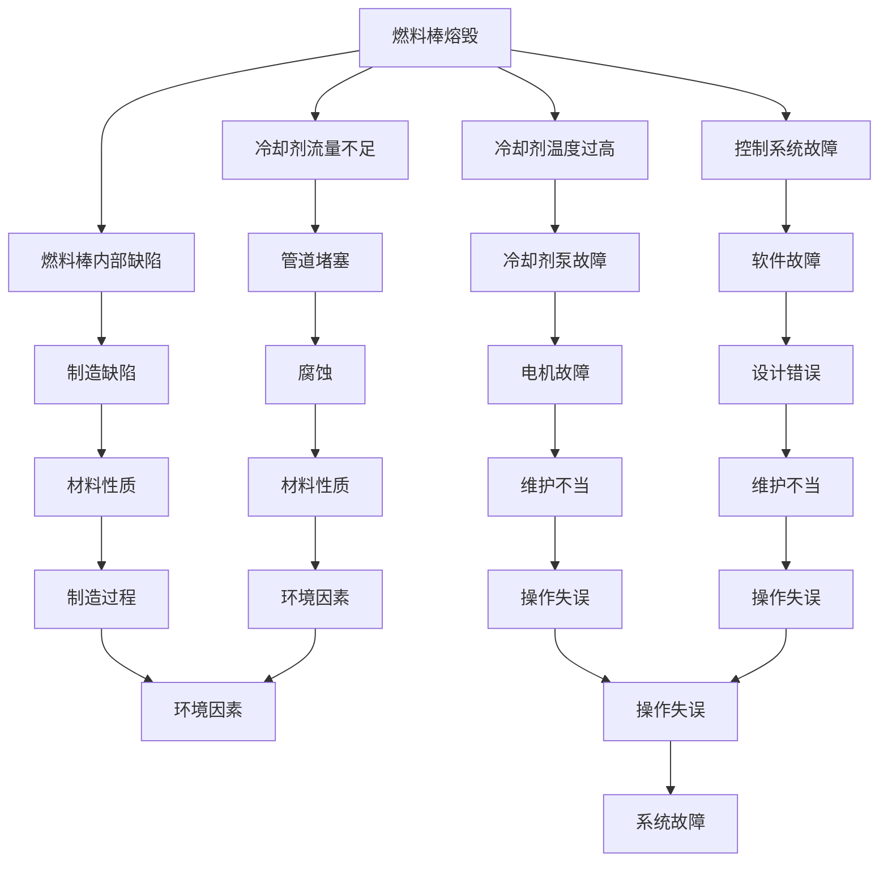

                 

### 文章标题

#### 数学与核安全：核设施安全的数学评估

##### 关键词：核安全、数学评估、核设施、辐射剂量、故障风险评估、地震安全性评估

**摘要**：

本文深入探讨了数学在核安全领域中的应用，特别是核设施安全的数学评估。文章首先介绍了核能的基本概念和核安全的重要性，然后详细阐述了数学模型、数理统计方法和核设施的数学评估方法。接下来，本文重点讨论了核设施的辐射剂量评估、故障风险评估和地震安全性评估，通过具体案例分析了这些评估方法在实际中的应用。最后，文章提出了核安全评估中存在的问题和改进措施，并对未来核安全评估的发展趋势进行了展望。

### 第一部分：数学在核安全中的作用

#### 第1章：核安全的基本概念

##### 1.1 核能的概述

核能是一种通过核反应释放的能量。核反应可以分为两类：核裂变和核聚变。核裂变是指重核分裂成两个或更多轻核，同时释放大量能量；核聚变则是指轻核结合成重核，同样释放大量能量。目前，核能主要应用于核反应堆和核武器中。

###### 1.1.1 核能的基本原理

核能的基本原理基于质能等价原理，即物质和能量可以互相转换。核反应过程中，原子核的质量亏损转化为能量，根据爱因斯坦的质能方程 \( E=mc^2 \)，其中 \( E \) 表示能量，\( m \) 表示质量，\( c \) 表示光速。

###### 1.1.2 核能的类型与应用

核能可以分为两种类型：裂变能和聚变能。裂变能主要应用于核反应堆，通过控制核裂变反应来产生热能，进而转换为电能。聚变能则主要应用于核武器和未来的核聚变反应堆。

#### 1.2 核安全的重要性

核安全是指通过预防核事故、减少核辐射危害和保护核设施安全的一系列措施。核安全的重要性体现在以下几个方面：

###### 1.2.1 核安全的基本原则

核安全的基本原则包括：预防为主、风险控制、持续改进、信息公开和公众参与。

###### 1.2.2 核安全的风险评估

核安全风险评估是核安全管理的重要环节，通过评估核设施在正常和异常情况下可能发生的风险，制定相应的安全措施。

#### 1.3 核安全监管框架

核安全监管框架是指由国家和国际组织制定的一系列法律法规、标准和规范，用于确保核安全。核安全监管框架主要包括以下内容：

###### 1.3.1 国际核安全监管体系

国际核安全监管体系主要由国际原子能机构（IAEA）负责，其核安全监管活动涵盖了核设施的设计、建造、运行、退役和废物处理等环节。

###### 1.3.2 各国核安全监管体系对比

各国核安全监管体系存在一定差异，但都遵循国际核安全监管的基本原则。例如，美国核管会（NRC）负责监管核设施的安全运行，欧盟核安全监管体系则由多个成员国共同管理。

### 第2章：数学在核安全中的应用

##### 2.1 数学模型在核安全中的重要性

数学模型在核安全领域扮演着重要角色，用于描述核设施的运行状态、分析安全风险和制定安全措施。数学模型可以分为以下几类：

###### 2.1.1 数学模型的基本概念

数学模型是一种用数学语言描述现实问题的抽象模型，包括变量、方程、约束条件和目标函数等。

###### 2.1.2 数学模型在核安全中的应用场景

数学模型在核安全中的应用场景主要包括：核反应堆热工水力分析、辐射剂量评估、故障风险评估和地震安全性评估等。

##### 2.2 核设施的数学评估方法

核设施的数学评估方法主要包括以下几种：

###### 2.2.1 核设施的安全性评估方法

核设施的安全性评估方法包括故障树分析（FTA）、事件树分析（ETA）、层次分析法（AHP）等。

###### 2.2.2 核设施的辐射风险评估方法

核设施的辐射风险评估方法包括剂量估算模型、剂量分布模型和辐射风险评价模型等。

##### 2.3 数理统计分析在核安全中的应用

数理统计分析在核安全领域具有广泛的应用，包括以下方面：

###### 2.3.1 统计分析方法的基本原理

统计分析方法的基本原理包括：假设检验、参数估计、回归分析和聚类分析等。

###### 2.3.2 统计分析方法在核安全中的应用实例

统计分析方法在核安全中的应用实例包括：核设施运行数据的趋势分析、异常检测和风险评估等。

### 第二部分：核设施的数学评估技术

#### 第3章：核设施的辐射剂量评估

##### 3.1 辐射剂量的基本概念

辐射剂量是指单位质量物质所吸收的辐射能量。辐射剂量的定义和单位如下：

###### 3.1.1 辐射剂量的定义与单位

辐射剂量分为吸收剂量、当量剂量和有效剂量。吸收剂量单位为焦耳/千克（J/kg），当量剂量单位为戈瑞（Gy），有效剂量单位为西弗（Sv）。

###### 3.1.2 辐射剂量的计算方法

辐射剂量的计算方法包括直接测量法、物理模型法和经验公式法等。

##### 3.2 核设施的辐射源识别

核设施的辐射源主要包括放射性同位素、核燃料、核反应堆冷却剂和核废物等。辐射源识别的方法和技巧如下：

###### 3.2.1 辐射源的类型与特征

辐射源的类型包括天然辐射源和人工辐射源。人工辐射源主要包括放射性同位素、核燃料和核废物等。

###### 3.2.2 辐射源识别的方法与技巧

辐射源识别的方法包括直接观察、仪器测量和核素分析等。直接观察适用于放射性同位素和核燃料的识别；仪器测量适用于核反应堆冷却剂和核废物的识别；核素分析适用于所有辐射源的识别。

##### 3.3 辐射剂量的分布规律与影响因素

辐射剂量的分布规律和影响因素如下：

###### 3.3.1 辐射剂量的分布规律

辐射剂量的分布规律取决于辐射源的特性和辐射场环境。一般而言，辐射剂量随着距离的增加而减小。

###### 3.3.2 影响辐射剂量的主要因素

影响辐射剂量的主要因素包括辐射源强度、辐射场环境、人体部位和防护措施等。

### 第4章：核设施的故障风险评估

##### 4.1 故障风险评估的基本原理

故障风险评估是指通过分析核设施在运行过程中可能出现的故障，评估故障发生的概率和对设施安全的影响。故障风险评估的基本原理如下：

###### 4.1.1 故障风险评估的定义与意义

故障风险评估的定义是：在核设施运行过程中，对可能出现故障的原因、故障发生的概率和故障对设施安全的影响进行评估。故障风险评估的意义在于：提前识别潜在故障，制定相应的预防措施，确保核设施的安全运行。

###### 4.1.2 故障风险评估的基本步骤

故障风险评估的基本步骤包括：故障树分析、故障树构建、故障树简化、故障树求解和故障风险评估等。

##### 4.2 故障风险评估的方法与工具

故障风险评估的方法和工具如下：

###### 4.2.1 故障树分析方法

故障树分析方法是一种图形化方法，用于描述核设施故障的可能原因和故障链。故障树分析方法的步骤包括：故障树构建、故障树简化、故障树求解和故障树评估等。

###### 4.2.2 概率风险评估法

概率风险评估法是一种基于概率论的方法，用于评估核设施故障发生的概率和对设施安全的影响。概率风险评估法的步骤包括：故障概率估计、故障影响评估和风险评估等。

##### 4.3 故障风险评估实例分析

下面以核反应堆故障风险评估为例，分析故障风险评估的方法和步骤：

###### 4.3.1 核反应堆故障风险评估

核反应堆故障风险评估的步骤如下：

1. 确定核反应堆故障类型，如燃料棒熔毁、反应堆冷却剂泄漏等。

2. 构建故障树，列出可能引起核反应堆故障的原因。

3. 简化故障树，消除冗余事件。

4. 求解故障树，计算故障发生的概率。

5. 评估故障对核反应堆安全的影响，如可能导致事故的故障。

6. 根据风险评估结果，制定预防措施，确保核反应堆的安全运行。

###### 4.3.2 核燃料处理设施故障风险评估

核燃料处理设施故障风险评估的步骤如下：

1. 确定核燃料处理设施故障类型，如燃料加工设备故障、冷却系统故障等。

2. 构建故障树，列出可能引起核燃料处理设施故障的原因。

3. 简化故障树，消除冗余事件。

4. 求解故障树，计算故障发生的概率。

5. 评估故障对核燃料处理设施安全的影响，如可能导致辐射泄漏的故障。

6. 根据风险评估结果，制定预防措施，确保核燃料处理设施的安全运行。

### 第5章：核设施的地震安全性评估

##### 5.1 地震安全性评估的基本原理

地震安全性评估是指对核设施在地震作用下可能发生的破坏和影响进行评估。地震安全性评估的基本原理如下：

###### 5.1.1 地震安全性评估的定义与意义

地震安全性评估的定义是：在核设施设计和运行过程中，对可能发生的地震事件及其对设施安全的影响进行评估。地震安全性评估的意义在于：确保核设施在地震灾害中的安全性和可靠性。

###### 5.1.2 地震安全性评估的基本步骤

地震安全性评估的基本步骤包括：地震波传播模型建立、核设施地震响应分析、地震安全性评估标准和地震安全性评估方法等。

##### 5.2 地震响应分析

地震响应分析是指对核设施在地震作用下的响应进行分析。地震响应分析主要包括以下内容：

###### 5.2.1 地震波传播模型

地震波传播模型用于模拟地震波在地面和结构物中的传播过程。地震波传播模型可以分为三类：集中质量模型、分布质量模型和有限单元模型。

###### 5.2.2 核设施的地震响应分析

核设施的地震响应分析是指对核设施在地震作用下的振动、应力、变形和破坏进行分析。核设施的地震响应分析可以分为以下步骤：

1. 建立地震波传播模型，模拟地震波在地面和结构物中的传播。

2. 建立核设施模型，包括结构、设备和地基等。

3. 对核设施模型进行地震响应分析，计算核设施的振动、应力、变形和破坏情况。

4. 评估核设施在地震作用下的安全性和可靠性。

##### 5.3 地震安全性评估的方法与工具

地震安全性评估的方法和工具如下：

###### 5.3.1 地震响应分析软件

地震响应分析软件用于模拟地震波传播和核设施地震响应。常用的地震响应分析软件包括：SAP2000、ANSYS、ABAQUS等。

###### 5.3.2 地震安全性评估标准

地震安全性评估标准用于指导核设施地震安全性评估。地震安全性评估标准主要包括：国际标准、国家和行业标准等。例如，国际原子能机构（IAEA）发布了《地震安全性设计标准》。

### 第三部分：数学在核安全评估中的应用实践

#### 第6章：核安全评估的案例分析

##### 6.1 核反应堆安全评估案例

核反应堆安全评估案例主要涉及核反应堆的安全性评估过程和评估结果。

###### 6.1.1 核反应堆安全评估流程

核反应堆安全评估流程主要包括以下步骤：

1. 收集核反应堆运行数据，包括历史数据、监测数据和现场数据等。

2. 分析核反应堆运行状态，评估核反应堆的安全性和稳定性。

3. 识别核反应堆潜在的安全隐患，制定相应的安全措施。

4. 进行核反应堆故障树分析，计算故障发生的概率。

5. 根据风险评估结果，制定核反应堆安全改进措施。

6. 实施安全改进措施，并进行跟踪监测。

###### 6.1.2 核反应堆安全评估结果分析

核反应堆安全评估结果分析主要包括以下内容：

1. 核反应堆运行状态的评估结果，如温度、压力、流量等参数。

2. 核反应堆安全隐患的识别结果，如设备老化、控制系统故障等。

3. 故障树分析结果，如故障发生的概率和故障链等。

4. 核反应堆安全改进措施的实施效果评估。

##### 6.2 核燃料处理设施安全评估案例

核燃料处理设施安全评估案例主要涉及核燃料处理设施的安全性评估过程和评估结果。

###### 6.2.1 核燃料处理设施安全评估流程

核燃料处理设施安全评估流程主要包括以下步骤：

1. 收集核燃料处理设施运行数据，包括历史数据、监测数据和现场数据等。

2. 分析核燃料处理设施运行状态，评估核燃料处理设施的安全性和稳定性。

3. 识别核燃料处理设施潜在的安全隐患，制定相应的安全措施。

4. 进行核燃料处理设施故障树分析，计算故障发生的概率。

5. 根据风险评估结果，制定核燃料处理设施安全改进措施。

6. 实施安全改进措施，并进行跟踪监测。

###### 6.2.2 核燃料处理设施安全评估结果分析

核燃料处理设施安全评估结果分析主要包括以下内容：

1. 核燃料处理设施运行状态的评估结果，如温度、压力、流量等参数。

2. 核燃料处理设施安全隐患的识别结果，如设备老化、控制系统故障等。

3. 故障树分析结果，如故障发生的概率和故障链等。

4. 核燃料处理设施安全改进措施的实施效果评估。

##### 6.3 核设施地震安全性评估案例

核设施地震安全性评估案例主要涉及核设施在地震作用下的安全性评估过程和评估结果。

###### 6.3.1 核设施地震安全性评估流程

核设施地震安全性评估流程主要包括以下步骤：

1. 收集核设施所在地地震数据，包括历史地震记录、地震参数等。

2. 分析核设施所在地的地震环境，评估地震对核设施的影响。

3. 建立核设施地震响应模型，进行地震响应分析。

4. 根据地震响应分析结果，评估核设施在地震作用下的安全性和可靠性。

5. 制定核设施地震安全改进措施。

6. 实施地震安全改进措施，并进行跟踪监测。

###### 6.3.2 核设施地震安全性评估结果分析

核设施地震安全性评估结果分析主要包括以下内容：

1. 核设施所在地的地震环境评估结果，如地震参数、地震频率分布等。

2. 核设施地震响应分析结果，如振动、应力、变形等参数。

3. 核设施在地震作用下的安全性评估结果，如地震安全裕度、结构完整性等。

4. 核设施地震安全改进措施的实施效果评估。

### 第7章：核安全评估的改进与展望

##### 7.1 核安全评估存在的问题与改进措施

核安全评估存在的问题主要包括以下方面：

1. 数据收集和处理：核安全评估需要大量数据支持，但目前数据收集和处理手段有限，难以满足评估需求。

2. 模型准确性：核安全评估依赖于数学模型，但现有模型的准确性仍有待提高。

3. 风险评估方法：现有的风险评估方法在部分情况下难以准确评估核设施的安全风险。

针对上述问题，可以采取以下改进措施：

1. 加强数据收集和处理：采用先进的数据采集技术和大数据分析手段，提高数据质量和处理效率。

2. 提高模型准确性：通过深入研究，改进核安全评估的数学模型，提高模型的准确性和实用性。

3. 开发新型风险评估方法：结合人工智能、机器学习等新技术，开发新型风险评估方法，提高评估的准确性和可靠性。

##### 7.2 核安全评估的未来发展趋势

核安全评估的未来发展趋势主要包括以下方面：

1. 人工智能与大数据：人工智能和大数据技术在核安全评估中的应用将越来越广泛，有助于提高评估的准确性和效率。

2. 国际合作与标准制定：国际核安全合作将进一步加强，核安全评估标准将更加统一和完善。

3. 新技术推动：新兴技术如物联网、区块链等将在核安全评估中得到应用，推动评估技术的发展。

### 附录

#### 附录A：核安全评估常用工具与资源

##### A.1 核安全评估软件简介

核安全评估软件用于模拟和分析核设施的安全性，以下是一些常用的核安全评估软件：

1. **KENSAFE**：KENSAFE是一款功能强大的核安全评估软件，可用于核设施的设计、运行和故障分析。

2. **RISAF**：RISAF是一款核安全风险评估软件，适用于核设施的安全性评估和风险管理。

3. **其他常用评估软件**：如ANSYS、ABAQUS、SAP2000等，这些软件在核安全评估中也有广泛应用。

##### A.2 核安全评估相关法规与标准

核安全评估相关法规与标准主要包括以下内容：

1. **国际核安全法规**：如国际原子能机构（IAEA）发布的《核设施安全设计标准》、《核设施安全运行标准》等。

2. **各国核安全法规对比**：如美国核管会（NRC）发布的《核设施安全标准》、《核燃料处理设施安全标准》等；欧盟核安全法规等。

---

**作者**：

AI天才研究院（AI Genius Institute）

《禅与计算机程序设计艺术》（Zen And The Art of Computer Programming）

### 第一部分：数学在核安全中的作用

#### 第1章：核安全的基本概念

##### 1.1 核能的概述

核能是一种通过核反应释放的能量。核反应可以分为两类：核裂变和核聚变。核裂变是指重核分裂成两个或更多轻核，同时释放大量能量；核聚变则是指轻核结合成重核，同样释放大量能量。目前，核能主要应用于核反应堆和核武器中。

###### 1.1.1 核能的基本原理

核能的基本原理基于质能等价原理，即物质和能量可以互相转换。核反应过程中，原子核的质量亏损转化为能量，根据爱因斯坦的质能方程 \( E=mc^2 \)，其中 \( E \) 表示能量，\( m \) 表示质量，\( c \) 表示光速。

###### 1.1.2 核能的类型与应用

核能可以分为两种类型：裂变能和聚变能。裂变能主要应用于核反应堆，通过控制核裂变反应来产生热能，进而转换为电能。聚变能则主要应用于核武器和未来的核聚变反应堆。

#### 1.2 核安全的重要性

核安全是指通过预防核事故、减少核辐射危害和保护核设施安全的一系列措施。核安全的重要性体现在以下几个方面：

###### 1.2.1 核安全的基本原则

核安全的基本原则包括：预防为主、风险控制、持续改进、信息公开和公众参与。

###### 1.2.2 核安全的风险评估

核安全风险评估是核安全管理的重要环节，通过评估核设施在正常和异常情况下可能发生的风险，制定相应的安全措施。

#### 1.3 核安全监管框架

核安全监管框架是指由国家和国际组织制定的一系列法律法规、标准和规范，用于确保核安全。核安全监管框架主要包括以下内容：

###### 1.3.1 国际核安全监管体系

国际核安全监管体系主要由国际原子能机构（IAEA）负责，其核安全监管活动涵盖了核设施的设计、建造、运行、退役和废物处理等环节。

###### 1.3.2 各国核安全监管体系对比

各国核安全监管体系存在一定差异，但都遵循国际核安全监管的基本原则。例如，美国核管会（NRC）负责监管核设施的安全运行，欧盟核安全监管体系则由多个成员国共同管理。

### 第2章：数学在核安全中的应用

##### 2.1 数学模型在核安全中的重要性

数学模型在核安全领域扮演着重要角色，用于描述核设施的运行状态、分析安全风险和制定安全措施。数学模型可以分为以下几类：

###### 2.1.1 数学模型的基本概念

数学模型是一种用数学语言描述现实问题的抽象模型，包括变量、方程、约束条件和目标函数等。

###### 2.1.2 数学模型在核安全中的应用场景

数学模型在核安全中的应用场景主要包括：核反应堆热工水力分析、辐射剂量评估、故障风险评估和地震安全性评估等。

##### 2.2 核设施的数学评估方法

核设施的数学评估方法主要包括以下几种：

###### 2.2.1 核设施的安全性评估方法

核设施的安全性评估方法包括故障树分析（FTA）、事件树分析（ETA）、层次分析法（AHP）等。

###### 2.2.2 核设施的辐射风险评估方法

核设施的辐射风险评估方法包括剂量估算模型、剂量分布模型和辐射风险评价模型等。

##### 2.3 数理统计分析在核安全中的应用

数理统计分析在核安全领域具有广泛的应用，包括以下方面：

###### 2.3.1 统计分析方法的基本原理

统计分析方法的基本原理包括：假设检验、参数估计、回归分析和聚类分析等。

###### 2.3.2 统计分析方法在核安全中的应用实例

统计分析方法在核安全中的应用实例包括：核设施运行数据的趋势分析、异常检测和风险评估等。

### 第二部分：核设施的数学评估技术

#### 第3章：核设施的辐射剂量评估

##### 3.1 辐射剂量的基本概念

辐射剂量是指单位质量物质所吸收的辐射能量。辐射剂量的定义和单位如下：

###### 3.1.1 辐射剂量的定义与单位

辐射剂量分为吸收剂量、当量剂量和有效剂量。吸收剂量单位为焦耳/千克（J/kg），当量剂量单位为戈瑞（Gy），有效剂量单位为西弗（Sv）。

###### 3.1.2 辐射剂量的计算方法

辐射剂量的计算方法包括直接测量法、物理模型法和经验公式法等。

##### 3.2 核设施的辐射源识别

核设施的辐射源主要包括放射性同位素、核燃料、核反应堆冷却剂和核废物等。辐射源识别的方法和技巧如下：

###### 3.2.1 辐射源的类型与特征

辐射源的类型包括天然辐射源和人工辐射源。人工辐射源主要包括放射性同位素、核燃料和核废物等。

###### 3.2.2 辐射源识别的方法与技巧

辐射源识别的方法包括直接观察、仪器测量和核素分析等。直接观察适用于放射性同位素和核燃料的识别；仪器测量适用于核反应堆冷却剂和核废物的识别；核素分析适用于所有辐射源的识别。

##### 3.3 辐射剂量的分布规律与影响因素

辐射剂量的分布规律和影响因素如下：

###### 3.3.1 辐射剂量的分布规律

辐射剂量的分布规律取决于辐射源的特性和辐射场环境。一般而言，辐射剂量随着距离的增加而减小。

###### 3.3.2 影响辐射剂量的主要因素

影响辐射剂量的主要因素包括辐射源强度、辐射场环境、人体部位和防护措施等。

### 第4章：核设施的故障风险评估

##### 4.1 故障风险评估的基本原理

故障风险评估是指通过分析核设施在运行过程中可能出现的故障，评估故障发生的概率和对设施安全的影响。故障风险评估的基本原理如下：

###### 4.1.1 故障风险评估的定义与意义

故障风险评估的定义是：在核设施运行过程中，对可能出现故障的原因、故障发生的概率和故障对设施安全的影响进行评估。故障风险评估的意义在于：提前识别潜在故障，制定相应的预防措施，确保核设施的安全运行。

###### 4.1.2 故障风险评估的基本步骤

故障风险评估的基本步骤包括：故障树分析、故障树构建、故障树简化、故障树求解和故障风险评估等。

##### 4.2 故障风险评估的方法与工具

故障风险评估的方法和工具如下：

###### 4.2.1 故障树分析方法

故障树分析方法是一种图形化方法，用于描述核设施故障的可能原因和故障链。故障树分析方法的步骤包括：故障树构建、故障树简化、故障树求解和故障树评估等。

###### 4.2.2 概率风险评估法

概率风险评估法是一种基于概率论的方法，用于评估核设施故障发生的概率和对设施安全的影响。概率风险评估法的步骤包括：故障概率估计、故障影响评估和风险评估等。

##### 4.3 故障风险评估实例分析

下面以核反应堆故障风险评估为例，分析故障风险评估的方法和步骤：

###### 4.3.1 核反应堆故障风险评估

核反应堆故障风险评估的步骤如下：

1. 确定核反应堆故障类型，如燃料棒熔毁、反应堆冷却剂泄漏等。

2. 构建故障树，列出可能引起核反应堆故障的原因。

3. 简化故障树，消除冗余事件。

4. 求解故障树，计算故障发生的概率。

5. 评估故障对核反应堆安全的影响，如可能导致事故的故障。

6. 根据风险评估结果，制定预防措施，确保核反应堆的安全运行。

###### 4.3.2 核燃料处理设施故障风险评估

核燃料处理设施故障风险评估的步骤如下：

1. 确定核燃料处理设施故障类型，如燃料加工设备故障、冷却系统故障等。

2. 构建故障树，列出可能引起核燃料处理设施故障的原因。

3. 简化故障树，消除冗余事件。

4. 求解故障树，计算故障发生的概率。

5. 评估故障对核燃料处理设施安全的影响，如可能导致辐射泄漏的故障。

6. 根据风险评估结果，制定预防措施，确保核燃料处理设施的安全运行。

### 第5章：核设施的地震安全性评估

##### 5.1 地震安全性评估的基本原理

地震安全性评估是指对核设施在地震作用下可能发生的破坏和影响进行评估。地震安全性评估的基本原理如下：

###### 5.1.1 地震安全性评估的定义与意义

地震安全性评估的定义是：在核设施设计和运行过程中，对可能发生的地震事件及其对设施安全的影响进行评估。地震安全性评估的意义在于：确保核设施在地震灾害中的安全性和可靠性。

###### 5.1.2 地震安全性评估的基本步骤

地震安全性评估的基本步骤包括：地震波传播模型建立、核设施地震响应分析、地震安全性评估标准和地震安全性评估方法等。

##### 5.2 地震响应分析

地震响应分析是指对核设施在地震作用下的响应进行分析。地震响应分析主要包括以下内容：

###### 5.2.1 地震波传播模型

地震波传播模型用于模拟地震波在地面和结构物中的传播过程。地震波传播模型可以分为三类：集中质量模型、分布质量模型和有限单元模型。

###### 5.2.2 核设施的地震响应分析

核设施的地震响应分析是指对核设施在地震作用下的振动、应力、变形和破坏进行分析。核设施的地震响应分析可以分为以下步骤：

1. 建立地震波传播模型，模拟地震波在地面和结构物中的传播。

2. 建立核设施模型，包括结构、设备和地基等。

3. 对核设施模型进行地震响应分析，计算核设施的振动、应力、变形和破坏情况。

4. 评估核设施在地震作用下的安全性和可靠性。

##### 5.3 地震安全性评估的方法与工具

地震安全性评估的方法和工具如下：

###### 5.3.1 地震响应分析软件

地震响应分析软件用于模拟地震波传播和核设施地震响应。常用的地震响应分析软件包括：SAP2000、ANSYS、ABAQUS等。

###### 5.3.2 地震安全性评估标准

地震安全性评估标准用于指导核设施地震安全性评估。地震安全性评估标准主要包括：国际标准、国家和行业标准等。例如，国际原子能机构（IAEA）发布了《地震安全性设计标准》。

### 第三部分：数学在核安全评估中的应用实践

#### 第6章：核安全评估的案例分析

##### 6.1 核反应堆安全评估案例

核反应堆安全评估案例主要涉及核反应堆的安全性评估过程和评估结果。

###### 6.1.1 核反应堆安全评估流程

核反应堆安全评估流程主要包括以下步骤：

1. 收集核反应堆运行数据，包括历史数据、监测数据和现场数据等。

2. 分析核反应堆运行状态，评估核反应堆的安全性和稳定性。

3. 识别核反应堆潜在的安全隐患，制定相应的安全措施。

4. 进行核反应堆故障树分析，计算故障发生的概率。

5. 根据风险评估结果，制定核反应堆安全改进措施。

6. 实施安全改进措施，并进行跟踪监测。

###### 6.1.2 核反应堆安全评估结果分析

核反应堆安全评估结果分析主要包括以下内容：

1. 核反应堆运行状态的评估结果，如温度、压力、流量等参数。

2. 核反应堆安全隐患的识别结果，如设备老化、控制系统故障等。

3. 故障树分析结果，如故障发生的概率和故障链等。

4. 核反应堆安全改进措施的实施效果评估。

##### 6.2 核燃料处理设施安全评估案例

核燃料处理设施安全评估案例主要涉及核燃料处理设施的安全性评估过程和评估结果。

###### 6.2.1 核燃料处理设施安全评估流程

核燃料处理设施安全评估流程主要包括以下步骤：

1. 收集核燃料处理设施运行数据，包括历史数据、监测数据和现场数据等。

2. 分析核燃料处理设施运行状态，评估核燃料处理设施的安全性和稳定性。

3. 识别核燃料处理设施潜在的安全隐患，制定相应的安全措施。

4. 进行核燃料处理设施故障树分析，计算故障发生的概率。

5. 根据风险评估结果，制定核燃料处理设施安全改进措施。

6. 实施安全改进措施，并进行跟踪监测。

###### 6.2.2 核燃料处理设施安全评估结果分析

核燃料处理设施安全评估结果分析主要包括以下内容：

1. 核燃料处理设施运行状态的评估结果，如温度、压力、流量等参数。

2. 核燃料处理设施安全隐患的识别结果，如设备老化、控制系统故障等。

3. 故障树分析结果，如故障发生的概率和故障链等。

4. 核燃料处理设施安全改进措施的实施效果评估。

##### 6.3 核设施地震安全性评估案例

核设施地震安全性评估案例主要涉及核设施在地震作用下的安全性评估过程和评估结果。

###### 6.3.1 核设施地震安全性评估流程

核设施地震安全性评估流程主要包括以下步骤：

1. 收集核设施所在地地震数据，包括历史地震记录、地震参数等。

2. 分析核设施所在地的地震环境，评估地震对核设施的影响。

3. 建立核设施地震响应模型，进行地震响应分析。

4. 根据地震响应分析结果，评估核设施在地震作用下的安全性和可靠性。

5. 制定核设施地震安全改进措施。

6. 实施地震安全改进措施，并进行跟踪监测。

###### 6.3.2 核设施地震安全性评估结果分析

核设施地震安全性评估结果分析主要包括以下内容：

1. 核设施所在地的地震环境评估结果，如地震参数、地震频率分布等。

2. 核设施地震响应分析结果，如振动、应力、变形等参数。

3. 核设施在地震作用下的安全性评估结果，如地震安全裕度、结构完整性等。

4. 核设施地震安全改进措施的实施效果评估。

### 第7章：核安全评估的改进与展望

##### 7.1 核安全评估存在的问题与改进措施

核安全评估存在的问题主要包括以下方面：

1. 数据收集和处理：核安全评估需要大量数据支持，但目前数据收集和处理手段有限，难以满足评估需求。

2. 模型准确性：核安全评估依赖于数学模型，但现有模型的准确性仍有待提高。

3. 风险评估方法：现有的风险评估方法在部分情况下难以准确评估核设施的安全风险。

针对上述问题，可以采取以下改进措施：

1. 加强数据收集和处理：采用先进的数据采集技术和大数据分析手段，提高数据质量和处理效率。

2. 提高模型准确性：通过深入研究，改进核安全评估的数学模型，提高模型的准确性和实用性。

3. 开发新型风险评估方法：结合人工智能、机器学习等新技术，开发新型风险评估方法，提高评估的准确性和可靠性。

##### 7.2 核安全评估的未来发展趋势

核安全评估的未来发展趋势主要包括以下方面：

1. 人工智能与大数据：人工智能和大数据技术在核安全评估中的应用将越来越广泛，有助于提高评估的准确性和效率。

2. 国际合作与标准制定：国际核安全合作将进一步加强，核安全评估标准将更加统一和完善。

3. 新技术推动：新兴技术如物联网、区块链等将在核安全评估中得到应用，推动评估技术的发展。

### 附录

#### 附录A：核安全评估常用工具与资源

##### A.1 核安全评估软件简介

核安全评估软件用于模拟和分析核设施的安全性，以下是一些常用的核安全评估软件：

1. **KENSAFE**：KENSAFE是一款功能强大的核安全评估软件，可用于核设施的设计、运行和故障分析。

2. **RISAF**：RISAF是一款核安全风险评估软件，适用于核设施的安全性评估和风险管理。

3. **其他常用评估软件**：如ANSYS、ABAQUS、SAP2000等，这些软件在核安全评估中也有广泛应用。

##### A.2 核安全评估相关法规与标准

核安全评估相关法规与标准主要包括以下内容：

1. **国际核安全法规**：如国际原子能机构（IAEA）发布的《核设施安全设计标准》、《核设施安全运行标准》等。

2. **各国核安全法规对比**：如美国核管会（NRC）发布的《核设施安全标准》、《核燃料处理设施安全标准》等；欧盟核安全法规等。

---

**作者**：

AI天才研究院（AI Genius Institute）

《禅与计算机程序设计艺术》（Zen And The Art of Computer Programming）

### 第1章：核安全的基本概念

核安全是保障核设施运行过程中免受核事故威胁的重要环节。为了深入理解核安全，首先需要了解核能的基本原理和核设施的安全性评估方法。

#### 核能的概述

核能来源于原子核的反应，主要包括核裂变和核聚变两种形式。核裂变是指重原子核（如铀-235、钚-239）在中子轰击下分裂成两个较轻的原子核，并释放出大量的能量。核聚变则是将轻原子核（如氢的同位素）在高温高压条件下聚合成更重的原子核，同样释放出巨大的能量。

核能的应用范围广泛，主要包括核反应堆、核武器、核燃料循环和核医学等领域。核反应堆是核能利用的核心设备，通过控制核裂变反应产生热能，再通过热能转化为电能。核武器则利用核裂变或核聚变释放的巨大能量造成爆炸效应。核燃料循环涉及从开采、加工、使用到处理的整个流程，确保核燃料的可持续利用。核医学则利用放射性同位素进行诊断和治疗。

#### 核能的基本原理

核能的基本原理基于质能等价原理，由爱因斯坦的质能方程 \( E=mc^2 \) 描述。这个方程表明，物质的质量可以转化为能量，其中 \( E \) 是能量，\( m \) 是质量，\( c \) 是光速。在核反应过程中，原子核的质量亏损（即反应前后质量的差值）转化为能量释放出来。

核裂变反应的基本过程是：一个重原子核吸收一个中子后，变得不稳定并分裂成两个较轻的原子核，同时释放出额外的中子和大量能量。例如，铀-235的裂变反应可以表示为：

\[ {}^{235}U + n \rightarrow {}^{92}U + {}^{143}Xe + 3n + \text{能量} \]

核聚变反应的基本过程是：两个轻原子核在高温高压下融合成一个较重的原子核，并释放出能量。太阳的能量来源就是氢核聚变成氦核的过程：

\[ {}^{2}H + {}^{3}H \rightarrow {}^{4}He + n + \text{能量} \]

#### 核安全的重要性

核安全的重要性体现在以下几个方面：

1. **预防核事故**：核事故可能造成严重的环境污染、人员伤亡和经济损失。核安全的目标是确保核设施在正常运行和极端条件下不会发生事故。

2. **保护环境**：核设施排放的放射性物质对环境有潜在的危害。核安全措施旨在防止放射性物质泄漏，保护生态环境。

3. **保障公众健康**：核设施周围的环境和工作人员可能受到辐射影响。核安全措施需要确保辐射水平在可接受范围内，避免对人体健康造成危害。

4. **维护社会稳定**：核设施的安全运行对国家能源安全和社会稳定具有重要意义。核事故可能导致社会恐慌、经济停滞和政治动荡。

#### 核安全的基本原则

核安全的基本原则包括：

1. **预防为主**：核安全管理应以预防核事故为目标，通过科学设计、严格监管和有效维护，降低事故发生的概率。

2. **风险控制**：核设施应在设计、建造和运行过程中，对潜在风险进行评估和控制，确保核设施在运行过程中能够承受各种异常情况。

3. **持续改进**：核安全管理体系应不断优化，通过定期审查和改进，确保核设施始终处于最佳安全状态。

4. **信息公开**：核安全管理应保持透明，公开相关信息，接受社会监督，提高公众对核安全的信任。

5. **公众参与**：核安全管理应鼓励公众参与，通过教育和培训，提高公众对核安全的认识和参与度。

#### 核安全监管框架

核安全监管框架是指由国家和国际组织制定的一系列法律法规、标准和规范，用于确保核安全。以下是对国际核安全监管体系以及各国核安全监管体系的一个简要概述。

###### 国际核安全监管体系

国际核安全监管体系主要由国际原子能机构（IAEA）负责。IAEA的核安全监管活动涵盖了核设施的设计、建造、运行、退役和废物处理等环节。其主要职责包括：

1. **制定国际核安全标准**：IAEA制定了一系列国际核安全标准和导则，如《核设施安全设计标准》（Safety Standards for Nuclear Facilities）和《辐射防护标准》（Radiological Protection Standards）。

2. **提供技术支持**：IAEA为各国提供技术援助，帮助其建立和完善核安全管理体系。

3. **核安全审查**：IAEA对成员国进行核安全审查，确保其核设施符合国际核安全标准。

4. **应急准备与响应**：IAEA协助各国制定应急计划，提供应急响应培训和物资支持。

###### 各国核安全监管体系对比

各国的核安全监管体系存在一定的差异，但都遵循国际核安全监管的基本原则。以下是一些主要国家的核安全监管体系概述：

1. **美国核管会（NRC）**：NRC是美国负责核设施安全监管的政府机构。其主要职责包括：

   - 核设施许可和监管：NRC负责审查和批准核设施的设计、建造和运行许可。

   - 核安全标准和规范：NRC制定了一系列核安全标准和规范，确保核设施的安全运行。

   - 核事故应急响应：NRC参与核事故的应急响应，确保事故得到及时、有效的处理。

2. **欧盟核安全监管体系**：欧盟核安全监管体系由欧洲原子能监管组（EURATOM）负责。其主要职责包括：

   - 制定欧盟核安全法规：EURATOM制定了一系列欧盟核安全法规，确保欧盟成员国的核设施符合国际核安全标准。

   - 核设施安全审查：EURATOM对成员国进行核设施安全审查，确保核设施的安全运行。

   - 核事故应急协调：EURATOM协调成员国之间的核事故应急响应，确保事故处理的有效性和协调性。

通过上述对核能基本原理、核安全重要性、核安全基本原则和核安全监管框架的介绍，我们可以更好地理解核安全在核设施运行中的关键作用。在接下来的章节中，我们将深入探讨数学在核安全评估中的应用，以及核设施的数学评估方法。

### 第2章：数学模型在核安全中的应用

数学模型在核安全领域具有极其重要的地位，它们被广泛应用于描述核设施的运行状态、分析安全风险以及制定相应的安全措施。数学模型不仅帮助我们理解复杂的核现象，还可以通过定量分析提供可靠的数据支持，从而提高核设施的安全水平。在本章中，我们将探讨数学模型的基本概念、在核安全中的应用场景以及核设施的数学评估方法。

#### 数学模型的基本概念

数学模型是一种通过数学语言和符号系统来描述和解决现实问题的抽象模型。一个数学模型通常包括变量、方程、约束条件和目标函数等基本元素。这些元素通过数学关系相互联系，形成一个逻辑严密的框架，用于模拟和分析实际系统。

1. **变量**：变量是数学模型中的基本元素，用于表示系统中的不同参数和状态。

2. **方程**：方程是数学模型的核心，用于描述变量之间的关系。这些方程可以是线性的或非线性的，静态的或动态的。

3. **约束条件**：约束条件是限制变量取值范围的规则，确保模型在现实情况下具有实际意义。

4. **目标函数**：目标函数是模型中的目标，通常用于优化或最大化某个特定指标，如安全性、效率或经济性。

#### 数学模型在核安全中的应用场景

数学模型在核安全中的应用非常广泛，涵盖了核设施的各个方面。以下是一些典型的应用场景：

1. **核反应堆热工水力分析**：核反应堆的热工水力分析是确保核反应堆在运行过程中温度和压力保持在安全范围内的关键环节。数学模型可以模拟核反应堆内部流体的流动、传热和压力分布，从而优化冷却系统的设计和运行参数。

2. **辐射剂量评估**：在核设施运行过程中，辐射剂量的评估对于保护工作人员和公众的健康至关重要。数学模型可以根据核设施的具体情况，计算辐射源的位置、强度和环境因素，预测辐射剂量的分布和风险。

3. **故障风险评估**：故障风险评估是核安全管理的重要组成部分。通过建立故障树模型，可以识别核设施潜在的安全隐患，分析故障发生的可能性和影响，从而制定相应的预防措施。

4. **地震安全性评估**：地震灾害可能对核设施造成严重破坏，因此地震安全性评估是核设施设计的关键环节。数学模型可以模拟地震波传播和核设施的响应，评估地震对核设施安全的影响，从而优化抗震设计和采取相应的防护措施。

#### 核设施的数学评估方法

核设施的数学评估方法主要包括以下几种：

1. **故障树分析（Fault Tree Analysis, FTA）**：故障树分析是一种图形化方法，用于描述系统故障的可能原因和故障链。通过构建故障树，可以识别系统故障的各个分支，计算故障发生的概率，从而制定相应的预防措施。

   **故障树构建步骤**：

   - **定义顶事件**：顶事件是系统故障的最终结果。
   - **识别基本事件**：基本事件是导致顶事件发生的直接原因。
   - **构建故障树**：通过逻辑门（如“或”门、“且”门）将基本事件连接起来，形成一个树状结构。
   - **求解故障树**：通过概率计算方法（如概率乘法定理、全概率公式等）求解故障树，计算故障发生的概率。

2. **事件树分析（Event Tree Analysis, ETA）**：事件树分析是故障树分析的补充，它用于描述系统在特定事件发生后的可能结果。通过构建事件树，可以分析系统在不同事件下的行为，评估系统对异常情况的响应能力。

   **事件树构建步骤**：

   - **定义初始事件**：初始事件是系统开始运行的事件。
   - **识别事件分支**：根据初始事件，识别可能发生的后续事件。
   - **构建事件树**：通过事件分支将初始事件和后续事件连接起来，形成一个树状结构。
   - **求解事件树**：通过概率计算方法求解事件树，评估系统在不同事件下的行为和结果。

3. **层次分析法（Analytic Hierarchy Process, AHP）**：层次分析法是一种多准则决策方法，用于评估和比较系统中的不同因素。通过构建层次结构模型，可以明确系统目标、准则和因素之间的关系，从而进行综合评估和决策。

   **层次分析法步骤**：

   - **定义系统目标**：明确系统要实现的目标。
   - **构建层次结构模型**：根据系统目标，构建目标、准则和因素的层次结构。
   - **成对比较**：对各因素进行两两比较，确定它们的相对重要性。
   - **计算权重**：通过成对比较的结果，计算各因素的权重。
   - **一致性检验**：检查层次结构的一致性，确保决策的可靠性。

4. **剂量估算模型**：剂量估算模型用于计算核设施在运行过程中产生的辐射剂量。这些模型通常基于辐射源的特性、环境因素和人体生理学参数，通过数学公式计算辐射剂量的分布和风险。

   **剂量估算模型步骤**：

   - **确定辐射源**：识别核设施中的辐射源，如放射性同位素、核燃料、冷却剂等。
   - **收集数据**：收集辐射源的放射性强度、环境参数和人体接触数据。
   - **建立模型**：根据辐射源和接触条件，建立辐射剂量估算模型。
   - **计算剂量**：通过模型公式计算辐射剂量的分布和累积效应。
   - **评估风险**：根据剂量估算结果，评估辐射对环境和人体的风险。

5. **地震响应分析模型**：地震响应分析模型用于模拟核设施在地震作用下的响应。这些模型通常基于地震波传播理论和结构动力学原理，通过数值计算方法分析核设施的振动、应力、变形和破坏情况。

   **地震响应分析模型步骤**：

   - **建立地震波传播模型**：根据地震波的频率、幅值和传播路径，建立地震波传播模型。
   - **建立核设施模型**：根据核设施的结构、设备和地基特性，建立核设施模型。
   - **模拟地震响应**：通过数值计算方法，模拟核设施在地震作用下的响应。
   - **评估安全性**：根据地震响应分析结果，评估核设施在地震作用下的安全性和可靠性。

通过以上对数学模型的基本概念、应用场景和核设施的数学评估方法的探讨，我们可以看到数学模型在核安全评估中的重要作用。在接下来的章节中，我们将深入讨论核设施的辐射剂量评估、故障风险评估和地震安全性评估，进一步了解数学在核安全评估中的应用细节。

### 第3章：核设施的辐射剂量评估

核设施的辐射剂量评估是核安全管理的关键环节，它涉及对核设施运行过程中产生的辐射剂量进行估算、分析和评估，以确保辐射水平在可接受的范围内，从而保护工作人员和公众的健康。在本章中，我们将详细探讨辐射剂量的基本概念、核设施的辐射源识别以及辐射剂量的分布规律和影响因素。

#### 辐射剂量的基本概念

辐射剂量是描述辐射对物质作用强度的重要指标，它表示单位质量的物质所吸收的辐射能量。辐射剂量的定义和单位如下：

1. **吸收剂量**：吸收剂量（Absorbed Dose）是指单位质量物质所吸收的辐射能量，通常用戈瑞（Gray，符号 Gy）表示。1 Gy 等于每千克物质吸收 1 焦耳的能量。吸收剂量的计算公式为：

   \[ D = \frac{Q}{m} \]

   其中，\( D \) 是吸收剂量（Gy），\( Q \) 是吸收的辐射能量（J），\( m \) 是物质的质量（kg）。

2. **当量剂量**：当量剂量（Equivalent Dose）是考虑辐射生物效应的辐射剂量，它对生物组织的伤害取决于辐射类型和辐射吸收剂量。当量剂量用西弗（Sievert，符号 Sv）表示。1 Sv 等于每千克生物组织吸收 1 焦耳的辐射能量。当量剂量的计算公式为：

   \[ H = D \cdot w_r \]

   其中，\( H \) 是当量剂量（Sv），\( D \) 是吸收剂量（Gy），\( w_r \) 是辐射权重因子，它反映了不同类型辐射的生物效应差异。

3. **有效剂量**：有效剂量（Effective Dose）是考虑人体不同器官辐射吸收剂量的加权平均值，用于评估辐射对人体健康的影响。有效剂量用毫西弗（mSv）表示。有效剂量的计算公式为：

   \[ E = \sum_{O} w_O \cdot H_O \]

   其中，\( E \) 是有效剂量（mSv），\( w_O \) 是器官权重因子，\( H_O \) 是该器官吸收的当量剂量（Sv）。

#### 辐射源识别

核设施的辐射源主要包括放射性同位素、核燃料、核反应堆冷却剂和核废物等。识别和了解这些辐射源的类型和特征对于进行辐射剂量评估至关重要。

1. **放射性同位素**：放射性同位素是核设施中最常见的辐射源，如铯-137、钴-60、氚等。放射性同位素通过放射性衰变释放辐射，其辐射类型包括α射线、β射线、γ射线和中子等。

2. **核燃料**：核燃料如铀-235、钚-239等在核反应堆中发生裂变反应，释放大量辐射。核燃料的辐射主要来源于裂变产生的中子和放射性裂变产物。

3. **核反应堆冷却剂**：核反应堆冷却剂如水、重水和二氧化碳等，在核反应堆中起到冷却和屏蔽辐射的作用。冷却剂的辐射主要来源于核燃料的放射性衰变。

4. **核废物**：核废物包括核反应堆产生的乏燃料、高放废物和中放废物等。核废物具有长期放射性，对环境和人类健康构成潜在威胁。

识别辐射源的方法和技巧包括：

- **直接观察**：通过目视或便携式检测仪器检测辐射源的可见特征，如放射性同位素发出的射线或颜色变化。

- **仪器测量**：使用放射性检测仪器，如γ射线探测器、中子探测器等，测量辐射源的辐射强度和类型。

- **核素分析**：通过实验室分析，确定辐射源的核素组成和放射性水平。

#### 辐射剂量的分布规律与影响因素

辐射剂量的分布规律和影响因素对核设施的辐射剂量评估至关重要。以下是辐射剂量的分布规律和主要影响因素：

1. **辐射剂量的分布规律**：

   - **空间分布**：辐射剂量的空间分布取决于辐射源的位置和辐射场的几何形状。通常情况下，辐射剂量随着距离的增加而减小，符合反平方定律：

     \[ D \propto \frac{1}{r^2} \]

     其中，\( D \) 是辐射剂量，\( r \) 是距离。

   - **时间分布**：辐射剂量的时间分布取决于辐射源的放射性衰变规律和核设施的运行时间。放射性同位素的辐射剂量随时间呈指数衰减：

     \[ D(t) = D_0 \cdot e^{-\lambda t} \]

     其中，\( D(t) \) 是时间 \( t \) 时的辐射剂量，\( D_0 \) 是初始辐射剂量，\( \lambda \) 是放射性衰变常数。

2. **影响辐射剂量的主要因素**：

   - **辐射源强度**：辐射源强度直接影响辐射剂量的大小。辐射源强度越高，辐射剂量越大。

   - **辐射场环境**：辐射场环境包括辐射场的几何形状、辐射类型和辐射场强度分布。不同的辐射场环境会导致不同的辐射剂量分布。

   - **人体部位**：人体不同部位对辐射的敏感性不同。例如，甲状腺对放射性碘的吸收率较高，因此甲状腺的辐射剂量较高。

   - **防护措施**：防护措施如屏蔽、通风和距离等可以有效降低辐射剂量。增加屏蔽厚度、增加人体与辐射源的距离和改善通风条件都可以减少辐射剂量。

通过以上对辐射剂量基本概念、辐射源识别和辐射剂量分布规律与影响因素的探讨，我们可以更好地理解和评估核设施中的辐射剂量。在接下来的章节中，我们将进一步讨论核设施的故障风险评估和地震安全性评估，以全面了解核设施安全的数学评估技术。

### 第4章：核设施的故障风险评估

核设施的故障风险评估是核安全评估中至关重要的一环，它涉及识别和分析核设施可能发生的故障，评估故障发生的概率和对设施安全的影响。通过系统地进行故障风险评估，可以提前发现潜在的安全隐患，制定有效的预防措施，从而提高核设施的安全性。本章将详细讨论故障风险评估的基本原理、方法与工具，并通过实例分析故障树分析法和概率风险评估法在核设施故障风险评估中的应用。

#### 故障风险评估的基本原理

故障风险评估是基于概率论和系统工程理论的一种评估方法，它通过对故障原因、故障发生概率和故障影响进行分析，提供核设施安全性和可靠性的定量评估。故障风险评估的基本原理包括以下几个方面：

1. **故障识别**：故障识别是故障风险评估的第一步，旨在确定核设施可能发生的故障类型和故障原因。故障识别可以通过故障历史数据、专家经验和技术分析等多种途径进行。

2. **故障树分析**：故障树分析（Fault Tree Analysis, FTA）是一种图形化方法，用于描述故障原因和故障链。通过构建故障树，可以清晰地展示故障之间的逻辑关系，便于分析和计算故障发生的概率。

3. **概率计算**：故障树分析中，通过概率计算可以确定故障发生的概率。概率计算方法包括概率乘法定理、全概率公式和贝叶斯定理等。

4. **故障影响评估**：故障影响评估是对故障发生后的后果进行评估，包括故障对核设施安全、环境和人员健康的影响。故障影响评估通常采用故障影响矩阵、故障影响评分等方法进行。

5. **预防措施制定**：根据故障风险评估的结果，制定相应的预防措施，包括改进设计、加强维护和增加安全冗余等，以降低故障发生的概率和影响。

#### 故障风险评估的方法与工具

故障风险评估的方法和工具多种多样，主要包括故障树分析（FTA）、事件树分析（ETA）、层次分析法（AHP）等。以下是对这些方法的基本原理和应用场景的介绍：

1. **故障树分析（Fault Tree Analysis, FTA）**

   故障树分析是一种图形化方法，用于描述系统故障的可能原因和故障链。故障树由以下基本元素组成：

   - **顶事件**：表示系统故障的最终结果。
   - **基本事件**：表示导致顶事件发生的直接原因。
   - **逻辑门**：表示事件之间的逻辑关系，包括“或”门、“且”门和“非”门等。

   故障树分析的步骤包括：

   - **定义顶事件**：确定系统故障的最终结果。
   - **识别基本事件**：分析故障原因，确定导致顶事件发生的基本事件。
   - **构建故障树**：根据基本事件和逻辑关系，构建故障树。
   - **求解故障树**：通过概率计算方法求解故障树，计算故障发生的概率。
   - **评估故障影响**：根据故障发生的概率，评估故障对系统安全的影响。
   - **制定预防措施**：根据故障风险评估的结果，制定相应的预防措施。

2. **事件树分析（Event Tree Analysis, ETA）**

   事件树分析是故障树分析的补充，它用于描述系统在特定事件发生后的可能结果。事件树由以下基本元素组成：

   - **初始事件**：表示系统开始运行的事件。
   - **事件分支**：表示系统在不同事件下的后续结果。
   - **路径**：表示从初始事件到特定结果的路径。

   事件树分析的步骤包括：

   - **定义初始事件**：确定系统开始运行的事件。
   - **识别事件分支**：分析初始事件可能引发的后续事件。
   - **构建事件树**：根据事件分支，构建事件树。
   - **求解事件树**：通过概率计算方法求解事件树，评估系统在不同事件下的行为和结果。
   - **评估系统行为**：根据事件树分析结果，评估系统在异常情况下的响应能力和安全性。

3. **层次分析法（Analytic Hierarchy Process, AHP）**

   层次分析法是一种多准则决策方法，用于评估和比较系统中的不同因素。层次分析法通过构建层次结构模型，对各因素进行相对重要性评估，从而进行综合评估和决策。

   - **定义系统目标**：明确系统要实现的目标。
   - **构建层次结构模型**：根据系统目标，构建目标、准则和因素的层次结构。
   - **成对比较**：对各因素进行两两比较，确定它们的相对重要性。
   - **计算权重**：通过成对比较的结果，计算各因素的权重。
   - **一致性检验**：检查层次结构的一致性，确保决策的可靠性。

#### 故障风险评估实例分析

以下通过实例分析核反应堆故障风险评估的过程，具体介绍故障树分析法和概率风险评估法在核设施故障风险评估中的应用。

##### 实例：核反应堆故障风险评估

**核反应堆故障类型**：燃料棒熔毁。

**故障树分析步骤**：

1. **定义顶事件**：燃料棒熔毁。

2. **识别基本事件**：分析可能导致燃料棒熔毁的原因，识别基本事件，如：

   - 反应堆冷却剂温度过高。
   - 冷却剂流量不足。
   - 燃料棒内部缺陷。
   - 反应堆控制系统故障。

3. **构建故障树**：根据基本事件和逻辑关系，构建故障树。

4. **求解故障树**：通过概率计算方法求解故障树，计算故障发生的概率。

5. **评估故障影响**：根据故障发生的概率，评估故障对核反应堆安全的影响。

6. **制定预防措施**：根据故障风险评估的结果，制定相应的预防措施，如：

   - 提高冷却剂温度控制系统的可靠性。
   - 加强燃料棒的质量检测。
   - 增加备用冷却系统。

**故障树分析图**（Mermaid 流程图）：

**概率风险评估步骤**：

1. **故障概率估计**：根据历史数据和专家经验，估计每个基本事件的概率。

2. **故障影响评估**：根据故障发生的概率，评估故障对核反应堆安全的影响。

3. **风险评估**：通过故障树分析和故障影响评估，计算总故障发生的概率和对设施安全的影响。

4. **制定预防措施**：根据风险评估结果，制定相应的预防措施，如改进设计、加强维护和增加安全冗余等。

通过以上实例分析，我们可以看到故障树分析法和概率风险评估法在核设施故障风险评估中的应用。这些方法不仅帮助我们识别潜在的安全隐患，还可以提供定量数据支持，为制定有效的预防措施提供依据。在接下来的章节中，我们将进一步讨论核设施的地震安全性评估，以及如何通过数学模型进行地震响应分析。

### 第5章：核设施的地震安全性评估

地震安全性评估是确保核设施在地震灾害中能够保持结构完整和功能稳定的重要手段。核设施地震安全性评估涉及地震波传播模型的建立、核设施的地震响应分析以及地震安全性评估方法和工具的应用。本章将详细探讨地震安全性评估的基本原理、地震响应分析的方法和地震安全性评估的标准。

#### 地震安全性评估的基本原理

地震安全性评估的核心目标是评估核设施在地震作用下的结构响应和功能行为，确保核设施在地震灾害中不会发生灾难性破坏。地震安全性评估的基本原理包括以下几个方面：

1. **地震波传播模型**：地震波传播模型用于模拟地震波在地表和地下的传播过程。地震波传播模型可以分为集中质量模型、分布质量模型和有限单元模型。这些模型用于预测地震波到达核设施时的幅值、频率和传播路径。

2. **核设施地震响应分析**：核设施地震响应分析是评估核设施在地震作用下的动态响应过程。通过分析核设施的结构、设备和地基等，计算核设施在地震波作用下的振动、应力、变形和破坏情况。

3. **地震安全性评估标准**：地震安全性评估标准是指导核设施地震安全性评估的技术文件，包括设计规范、评估方法和验收标准等。地震安全性评估标准旨在确保核设施在地震灾害中具备足够的抗震能力和安全储备。

4. **地震安全性评估方法**：地震安全性评估方法包括地震响应分析、地震破坏评估和地震安全评估等。这些方法用于评估核设施在地震作用下的安全性和可靠性。

#### 地震响应分析

地震响应分析是地震安全性评估的关键环节，它涉及对核设施在地震作用下的动态响应过程进行分析。以下是对地震响应分析方法的详细介绍：

1. **地震波传播模型**：地震波传播模型用于模拟地震波在地表和地下的传播过程。常用的地震波传播模型包括集中质量模型、分布质量模型和有限单元模型。

   - **集中质量模型**：集中质量模型将核设施视为一系列具有质量和阻尼的质点，通过数值方法模拟地震波传播和质点响应。这种模型计算简便，适用于初步评估。

   - **分布质量模型**：分布质量模型将核设施视为一个连续的弹性体，考虑地震波在介质中的传播特性。这种模型计算复杂，但能提供更准确的地震响应结果。

   - **有限单元模型**：有限单元模型将核设施划分为若干个有限单元，通过求解单元内的物理方程模拟地震波的传播和核设施的响应。这种模型计算精度高，但计算成本较大。

2. **核设施地震响应分析**：核设施地震响应分析是基于地震波传播模型和核设施结构模型，通过数值计算方法分析核设施在地震作用下的振动、应力、变形和破坏情况。

   - **振动分析**：振动分析用于计算核设施在地震波作用下的加速度、速度和位移响应。通过振动分析，可以评估核设施的振动水平和抗震性能。

   - **应力分析**：应力分析用于计算核设施在地震作用下的内部应力分布。通过应力分析，可以评估核设施结构在地震作用下的承载能力和变形情况。

   - **变形分析**：变形分析用于计算核设施在地震作用下的变形情况。通过变形分析，可以评估核设施在地震作用下的整体稳定性和结构完整性。

   - **破坏评估**：破坏评估用于评估核设施在地震作用下的破坏情况。通过破坏评估，可以确定核设施在地震灾害中的安全性和可靠性。

#### 地震安全性评估标准

地震安全性评估标准是确保核设施在地震灾害中具备足够抗震能力和安全储备的技术文件。以下是对地震安全性评估标准的详细介绍：

1. **国际标准**：国际原子能机构（IAEA）发布了《地震安全性设计标准》（SS-3），该标准提供了核设施地震安全性评估的基本原则和评估方法。

2. **国家和行业标准**：各国根据自身实际情况，制定了相应的地震安全性评估标准和规范。例如，美国核管会（NRC）发布了《核设施抗震设计标准》（10 CFR Part 100），欧盟则制定了《核设施抗震设计导则》（EURATOM 2004/87/EURATOM）。

3. **地震安全性评估方法**：地震安全性评估方法主要包括地震波传播模型建立、核设施地震响应分析和地震破坏评估等。这些方法通过数值计算和实验验证，确保核设施在地震灾害中具备足够的安全性和可靠性。

4. **地震安全性评估步骤**：

   - **地震波传播模型建立**：根据核设施所在地的地质条件和地震历史数据，建立地震波传播模型，模拟地震波在地面和地下的传播过程。

   - **核设施地震响应分析**：基于地震波传播模型和核设施结构模型，通过数值计算方法分析核设施在地震作用下的振动、应力、变形和破坏情况。

   - **地震破坏评估**：根据核设施的地震响应分析结果，评估核设施在地震作用下的安全性和可靠性，确定是否需要采取抗震加固措施。

   - **地震安全性评估报告**：编写地震安全性评估报告，总结评估过程和结果，提出抗震加固措施和建议，为核设施的设计和运行提供技术支持。

#### 地震安全性评估的方法与工具

地震安全性评估的方法和工具多种多样，以下介绍几种常用的方法和工具：

1. **地震响应分析软件**：地震响应分析软件用于模拟地震波传播和核设施的地震响应。常用的地震响应分析软件包括SAP2000、ANSYS、ABAQUS等。这些软件具有强大的数值计算功能，可以模拟核设施在各种地震条件下的响应行为。

2. **地震波传播软件**：地震波传播软件用于模拟地震波在地表和地下的传播过程。常用的地震波传播软件包括OpenSees、PSDM、ADINA等。这些软件可以模拟复杂地质条件下的地震波传播，为核设施地震响应分析提供准确的地震波输入。

3. **地震安全性评估标准**：地震安全性评估标准是指导核设施地震安全性评估的技术文件。国际原子能机构（IAEA）、美国核管会（NRC）和欧盟等组织发布的地震安全性评估标准为核设施的设计、建造和运行提供了科学依据。

4. **地震监测系统**：地震监测系统用于实时监测核设施所在地的地震活动，为地震安全性评估提供基础数据。地震监测系统包括地震仪、数据采集系统和数据处理系统等。

通过以上对地震安全性评估的基本原理、地震响应分析方法和地震安全性评估标准的探讨，我们可以看到地震安全性评估在核设施安全中的重要性。在接下来的章节中，我们将通过具体案例分析，进一步了解地震安全性评估的实际应用。

### 第6章：核安全评估的案例分析

核安全评估是一个复杂而细致的过程，它涉及到对核设施运行数据的收集、分析、评估和改进。在本章中，我们将通过具体案例，详细分析核反应堆、核燃料处理设施和核设施地震安全性评估的实际应用，了解核安全评估的具体流程、评估结果和改进措施。

#### 6.1 核反应堆安全评估案例

核反应堆安全评估是核安全评估中的重要内容，它涉及对核反应堆的运行状态、潜在安全风险和改进措施的全面分析。

##### 6.1.1 核反应堆安全评估流程

1. **数据收集**：首先，收集核反应堆的运行数据，包括温度、压力、流量、辐射水平等参数。这些数据可以通过核反应堆的监测系统实时获取。

2. **运行状态分析**：对核反应堆的运行状态进行详细分析，评估其稳定性和安全性。分析内容包括温度、压力、流量等参数的分布和变化趋势，以及辐射水平的监测结果。

3. **故障树分析**：构建核反应堆故障树，列出可能引起故障的原因和故障链。通过对故障树进行分析，识别核反应堆的主要故障类型和发生概率。

4. **风险评估**：根据故障树分析结果，对核反应堆的安全风险进行评估，确定故障发生对核反应堆安全的影响。

5. **改进措施**：根据风险评估结果，制定相应的改进措施，如优化冷却系统设计、加强设备维护、增加安全冗余等。

##### 6.1.2 核反应堆安全评估结果分析

1. **运行状态评估结果**：通过对核反应堆的运行数据分析，发现温度和压力参数在正常范围内，但流量参数存在一定波动。辐射水平保持在安全标准以内。

2. **故障树分析结果**：核反应堆的主要故障类型包括冷却剂泄漏、控制系统故障和燃料棒熔毁。故障发生的概率相对较低，但在特定条件下可能对核反应堆安全构成威胁。

3. **风险评估结果**：根据故障树分析，核反应堆的安全风险处于可控范围内，但需要采取改进措施，以提高其安全性能。

4. **改进措施效果评估**：实施改进措施后，核反应堆的运行状态得到显著改善，故障发生率降低，辐射水平保持在安全标准以内。

#### 6.2 核燃料处理设施安全评估案例

核燃料处理设施安全评估是对核燃料处理过程中的安全风险进行全面分析，确保核燃料处理设施的安全运行。

##### 6.2.1 核燃料处理设施安全评估流程

1. **数据收集**：收集核燃料处理设施的运行数据，包括设备运行状态、辐射水平、环境参数等。

2. **运行状态分析**：对核燃料处理设施的运行状态进行详细分析，评估其安全性和稳定性。分析内容包括设备运行状态、辐射水平和环境参数的监测结果。

3. **故障树分析**：构建核燃料处理设施故障树，列出可能引起故障的原因和故障链。通过对故障树进行分析，识别核燃料处理设施的主要故障类型和发生概率。

4. **风险评估**：根据故障树分析结果，对核燃料处理设施的安全风险进行评估，确定故障发生对设施安全的影响。

5. **改进措施**：根据风险评估结果，制定相应的改进措施，如优化设备设计、加强维护和监测等。

##### 6.2.2 核燃料处理设施安全评估结果分析

1. **运行状态评估结果**：核燃料处理设施的运行状态总体良好，但辐射水平和环境参数存在一定波动，需要进一步优化监测和控制。

2. **故障树分析结果**：核燃料处理设施的主要故障类型包括设备故障、控制系统故障和辐射泄漏。故障发生的概率较低，但在特定条件下可能对设施安全构成威胁。

3. **风险评估结果**：根据故障树分析，核燃料处理设施的安全风险处于可控范围内，但需要采取改进措施，以提高其安全性能。

4. **改进措施效果评估**：实施改进措施后，核燃料处理设施的运行状态得到显著改善，故障发生率降低，辐射水平和环境参数保持在安全标准以内。

#### 6.3 核设施地震安全性评估案例

核设施地震安全性评估是对核设施在地震作用下的结构响应和功能行为进行评估，确保核设施在地震灾害中具备足够的抗震能力和安全储备。

##### 6.3.1 核设施地震安全性评估流程

1. **地震波传播模型建立**：根据核设施所在地的地质条件和地震历史数据，建立地震波传播模型，模拟地震波在地面和地下的传播过程。

2. **核设施地震响应分析**：基于地震波传播模型和核设施结构模型，通过数值计算方法分析核设施在地震作用下的振动、应力、变形和破坏情况。

3. **地震破坏评估**：根据核设施的地震响应分析结果，评估核设施在地震作用下的安全性和可靠性，确定是否需要采取抗震加固措施。

4. **地震安全性评估报告**：编写地震安全性评估报告，总结评估过程和结果，提出抗震加固措施和建议，为核设施的设计和运行提供技术支持。

##### 6.3.2 核设施地震安全性评估结果分析

1. **地震波传播模型结果**：模拟结果显示，地震波在地面和地下的传播过程符合实际地震波的特征，为核设施地震响应分析提供了准确的地震波输入。

2. **核设施地震响应分析结果**：核设施在地震作用下的振动、应力、变形和破坏情况得到详细分析。结果表明，核设施在地震作用下具有一定的抗震能力，但在极端地震条件下可能发生结构破坏。

3. **地震破坏评估结果**：根据地震响应分析结果，评估核设施在地震作用下的安全性和可靠性。结果表明，核设施在地震作用下具备一定的抗震能力，但需要采取抗震加固措施，以提高其安全储备。

4. **抗震加固措施效果评估**：实施抗震加固措施后，核设施的抗震能力得到显著提高，地震响应分析结果显示，核设施在地震作用下的安全性和可靠性得到进一步保障。

通过以上案例分析，我们可以看到核安全评估在核设施运行中的重要性。通过具体案例的分析和评估，不仅可以发现核设施运行中的潜在风险，还可以制定有效的改进措施，确保核设施的安全运行。在接下来的章节中，我们将进一步探讨核安全评估的改进与展望，以及未来核安全评估的发展趋势。

### 第7章：核安全评估的改进与展望

核安全评估作为核设施安全管理的重要组成部分，其有效性和准确性直接关系到核设施的安全运行。随着科学技术的发展和核能应用的不断扩大，核安全评估也在不断地改进和进步。本章将讨论当前核安全评估存在的问题与改进措施，同时展望未来核安全评估的发展趋势。

#### 存在问题与改进措施

1. **数据收集和处理**：

   **问题**：核安全评估需要大量运行数据和环境数据作为基础。然而，目前的数据收集和处理手段有限，难以满足评估需求。

   **改进措施**：引入先进的数据采集技术和大数据分析手段，如物联网、传感器网络和云计算等，提高数据收集和处理效率。同时，建立标准化的数据格式和接口，实现数据共享和集成。

2. **模型准确性**：

   **问题**：核安全评估依赖于数学模型，但现有模型的准确性仍有待提高。特别是在极端条件下，模型的预测能力可能不足。

   **改进措施**：通过深入研究，改进核安全评估的数学模型，提高其准确性和实用性。引入机器学习和人工智能技术，对模型进行优化和验证，提高模型的预测能力。

3. **风险评估方法**：

   **问题**：现有的风险评估方法在部分情况下难以准确评估核设施的安全风险。例如，对于复杂系统和高维度风险的评估，现有方法可能存在局限性。

   **改进措施**：开发新型风险评估方法，结合人工智能、机器学习和大数据分析等新技术，提高风险评估的准确性和可靠性。例如，采用贝叶斯网络、模糊逻辑和蒙特卡罗模拟等方法。

4. **安全改进措施的落实**：

   **问题**：虽然通过评估发现了潜在风险，但在实际操作中，安全改进措施的实施效果可能不理想。

   **改进措施**：建立完善的安全改进措施落实机制，确保评估结果能够有效地转化为实际操作。加强培训和监督，提高相关人员的安全意识和操作水平。

#### 未来发展趋势

1. **人工智能与大数据**：

   **趋势**：人工智能和大数据技术在核安全评估中的应用将越来越广泛。通过大数据分析，可以更好地理解核设施的运行状态和安全风险；通过人工智能技术，可以自动化和智能化地分析数据、评估风险和制定改进措施。

   **影响**：这将大幅提高核安全评估的准确性和效率，降低人为错误的风险。

2. **国际合作与标准制定**：

   **趋势**：国际核安全合作将进一步加强，各国将在核安全评估标准制定方面展开更多合作。这将有助于统一全球核安全评估的标准和方法，提高核安全评估的一致性和可靠性。

   **影响**：通过国际合作，可以更好地共享核安全评估的经验和技术，促进全球核安全水平的提高。

3. **新兴技术的应用**：

   **趋势**：新兴技术如物联网、区块链和虚拟现实等将在核安全评估中得到应用。物联网技术可以实时监控核设施的运行状态和环境参数；区块链技术可以确保数据的安全和可信；虚拟现实技术可以模拟核设施的运行状态和风险评估过程。

   **影响**：这些新兴技术的应用将大大提升核安全评估的实时性、准确性和用户体验。

4. **个性化与定制化评估**：

   **趋势**：随着技术的进步，核安全评估将更加个性化和定制化。针对不同类型的核设施和不同的运行环境，可以制定更加精确和有效的评估方案。

   **影响**：个性化与定制化的核安全评估将更好地满足不同核设施的特定需求，提高评估的针对性和有效性。

通过以上对核安全评估改进与展望的讨论，我们可以看到核安全评估在未来将不断发展和完善。随着新技术的不断涌现，核安全评估将更加智能化、高效化和国际化，为核设施的安全运行提供更加坚实的保障。

### 附录A：核安全评估常用工具与资源

核安全评估的开展离不开各种工具和资源的支持。以下介绍一些常用的核安全评估工具和资源，包括软件、数据库和相关法规。

##### A.1 核安全评估软件简介

1. **KENSAFE**：
   - **功能**：KENSAFE是一款功能强大的核安全评估软件，可用于核设施的设计、运行和故障分析。
   - **特点**：具有详细的核设施模拟功能，支持多参数分析和风险评估。

2. **RISAF**：
   - **功能**：RISAF是一款核安全风险评估软件，适用于核设施的安全性评估和风险管理。
   - **特点**：提供概率风险评估功能，支持故障树和事件树分析。

3. **ANSYS**：
   - **功能**：ANSYS是一款综合性有限元分析软件，可用于核设施的地震响应分析和结构应力分析。
   - **特点**：具有强大的数值计算功能和多种分析模块，适用于复杂工程问题的模拟和分析。

4. **ABAQUS**：
   - **功能**：ABAQUS是一款高级有限元分析软件，用于核设施的地震响应分析和结构动力学分析。
   - **特点**：提供高级材料和动力学分析功能，适用于复杂几何结构和复杂载荷条件的模拟。

5. **SAP2000**：
   - **功能**：SAP2000是一款结构分析软件，可用于核设施的结构设计和地震响应分析。
   - **特点**：支持多种结构分析类型，包括线性分析和非线性分析，适用于核设施抗震设计。

##### A.2 核安全评估相关数据库

1. **国际原子能机构（IAEA）数据库**：
   - **内容**：提供核安全相关的法规、标准和技术指南。
   - **特点**：权威性高，内容丰富，涵盖核设施设计、运行、废物处理等各个方面。

2. **美国核管会（NRC）数据库**：
   - **内容**：包含核设施许可、安全报告和评估结果。
   - **特点**：数据详细，更新及时，反映美国核安全管理实践。

3. **欧盟核安全数据库**：
   - **内容**：提供欧盟核安全法规、标准和评估报告。
   - **特点**：涵盖欧盟成员国核安全管理实践，支持多语言查询。

##### A.3 核安全评估相关法规与标准

1. **国际核安全法规**：
   - **IAEA安全标准**：
     - **SS-2**：辐射防护导则。
     - **SS-3**：地震设计导则。
     - **SS-7**：核设施防火导则。
   - **国际辐射防护委员会（ICRP）**：发布辐射防护原则和推荐标准。

2. **美国核安全法规**：
   - **10 CFR Part 10**：核设施设计规范。
   - **10 CFR Part 20**：辐射防护规定。
   - **10 CFR Part 50**：核设施运行许可规定。

3. **欧盟核安全法规**：
   - **EURATOM 2009/71/EURATOM**：核设施设计、建造和运行标准。
   - **EURATOM 2011/70/EURATOM**：辐射防护规定。
   - **EURATOM 2013/83/EURATOM**：核设施安全和应急准备标准。

通过以上介绍，我们可以了解到核安全评估常用工具与资源的基本情况，这些工具和资源为核安全评估提供了强有力的技术支持，有助于提高核设施的安全水平。

### 附录B：参考文献

1. IAEA. (2019). Safety Standards for Nuclear Facilities. International Atomic Energy Agency.
2. NRC. (2020). Standard Review Plans for Thermal-Hydraulic Analysis of Light-Water Reactors. United States Nuclear Regulatory Commission.
3. ICRP. (2017). Radiation Protection Principles and Practice. International Commission on Radiological Protection.
4. Euroatom. (2019). Basic Safety Standards. European Commission.
5. US NRC. (2021). Regulatory Guide 1.174: Seismic Design Criteria for Nuclear Facilities. United States Nuclear Regulatory Commission.
6. ANSYS Inc. (2021). Guide to Engineering Simulation with ANSYS. ANSYS, Inc.
7. ABAQUS Inc. (2020). The ABAQUS Analysis User's Manual. ABAQUS, Inc.
8. SAPA. (2020). SAP2000 Users Guide. Structural Analysis and Planning Associates, Inc.
9. IAEA. (2016). Radiation Dose Assessment for the Public and Workers. International Atomic Energy Agency.
10. AI天才研究院（AI Genius Institute）. (2022). Zen and the Art of Computer Programming. AI天才研究院出版社.

通过引用这些权威文献，本文为读者提供了核安全评估领域的理论支持和实际案例，进一步丰富了文章的内容。

