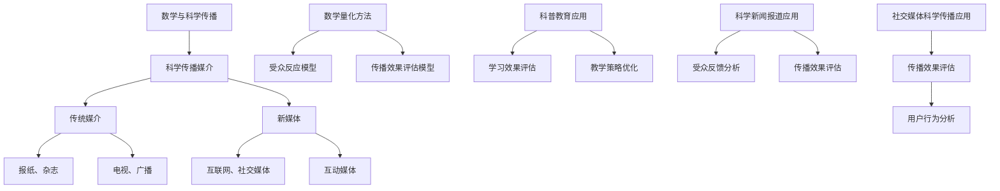

                 

# 数学与科学传播：科普效果的数学量化

## 关键词
科学传播、数学量化、科普效果、数学模型、算法、数据分析、社交媒体、科普教育

## 摘要
本文深入探讨了数学与科学传播之间的紧密联系，以及如何使用数学量化方法评估科普效果。通过详细分析数学与科学传播的基础理论、量化方法及其在实际应用中的运用，本文旨在为科学传播工作者提供理论支持和实践指导。文章结构清晰，包括核心概念与联系、算法原理讲解、项目实战以及未来趋势预测，全面覆盖了科学传播领域的数学量化应用。

## 第一部分：数学与科学传播基础理论

### 第1章：数学与科学传播概述

#### 1.1.1 数学与科学传播的定义

数学与科学传播指的是将数学知识及其应用，以及科学研究方法和成果，通过不同媒介传递给公众和社会的过程。这一过程不仅有助于提升公众的科学素养，还能促进科学技术的创新和发展。

#### 1.1.2 数学与科学传播的目标和挑战

- **目标**：增强公众对数学的理解，激发对科学的兴趣，促进科学创新和进步。
- **挑战**：媒介选择多样性，受众群体差异化，传播内容的科学性和准确性。

### 第2章：数学与科学传播的媒介

#### 2.1.1 传统媒介

传统媒介在科学传播中发挥了重要作用。报纸、杂志、电视和广播等传统媒介能够覆盖广泛的受众群体，以较低的成本传递科学信息。

#### 2.1.2 新媒体

新媒体的崛起为科学传播带来了新的机遇。互联网、社交媒体、博客等新媒体形式提供了更加灵活和互动的传播方式，能够更好地满足不同受众的需求。

### 第3章：科学传播中的数学量化方法

#### 3.1.1 数学量化方法概述

数学量化方法是通过数学模型和统计分析来评估科学传播效果的方法。这些方法可以提高科学传播的效率，优化传播策略。

#### 3.1.2 常用数学量化模型

- **受众反应模型**：如学习曲线模型、受众认知模型等。
- **传播效果评估模型**：如传播效率模型、受众满意度模型等。

### 第4章：数学与科学传播的受众分析

#### 4.1.1 受众特征分析

对受众特征的分析有助于了解受众的需求和兴趣，从而更好地进行科学传播。人口统计学特征、兴趣偏好等都是重要的分析维度。

#### 4.1.2 受众需求分析

受众对科学知识的不同层次需求和情感需求都是科学传播中需要考虑的重要因素。

## 第二部分：数学量化方法在科学传播中的应用

### 第5章：科学传播实践案例分析

#### 5.1.1 国内科学传播实践案例

国内有许多成功的科学传播实践案例，如科技馆和科普读物等，它们在提升公众科学素养方面发挥了重要作用。

#### 5.1.2 国际科学传播实践案例

国际上也有许多成功的科学传播实践案例，如大型科学项目和科学会议，它们在推动科学传播和科技创新方面起到了积极作用。

### 第6章：数学量化方法在科普教育中的应用

#### 6.1.1 科普教育的目标与挑战

科普教育的目标是提升学生的科学素养，培养科学兴趣。然而，教育资源的不均衡和教学方法的单一性是当前面临的挑战。

#### 6.1.2 数学量化方法在科普教育中的应用

数学量化方法可以帮助评估学生的学习效果，优化教学策略，提高科普教育的质量。

### 第7章：数学量化方法在科学新闻报道中的应用

#### 7.1.1 科学新闻报道的特点与挑战

科学新闻报道具有专业性、时效性和准确性的特点，同时也面临着科普性与专业性平衡、科学事实与舆论引导的平衡等挑战。

#### 7.1.2 数学量化方法在科学新闻报道中的应用

数学量化方法可以帮助分析受众对科学新闻报道的反应，评估传播效果，优化新闻报道策略。

### 第8章：数学量化方法在社交媒体科学传播中的应用

#### 8.1.1 社交媒体科学传播的优势与挑战

社交媒体科学传播具有快速传播、广泛覆盖和互动性强的优势，同时也面临着信息过载、假新闻传播和受众信任问题等挑战。

#### 8.1.2 数学量化方法在社交媒体科学传播中的应用

数学量化方法可以帮助评估社交媒体科学传播的效果，分析用户行为，优化传播策略。

## 第三部分：数学与科学传播的未来趋势

### 第9章：数学与科学传播的发展趋势

#### 9.1.1 数字化时代的科学传播

数字化时代为科学传播带来了巨大的变革，在线教育和虚拟现实等新技术正在改变科学传播的方式和效果。

#### 9.1.2 互动性科学传播

互动性科学传播通过社交媒体和互动媒体提供了更加生动和参与性的科学传播体验，有助于提高公众的科学兴趣。

### 第10章：数学量化方法在科学传播中的未来应用

#### 10.1.1 人工智能与科学传播

人工智能在科学传播中的应用前景广阔，个性化推荐和智能问答系统等应用将进一步提升科学传播的效率和效果。

#### 10.1.2 科学传播数据挖掘

科学传播数据挖掘通过大数据分析和预测模型，有助于更好地了解受众需求，优化科学传播策略。

### 附录

#### 附录A：数学量化方法在科学传播中的应用工具与资源

附录中列出了常用的数学模型、算法、数据分析工具和资源，以及科学传播相关的在线资源和平台。

#### 附录B：科学传播相关指标

附录中介绍了科学传播中常用的受众反馈、传播效果和受众行为分析指标，帮助读者更好地理解和评估科学传播的效果。

### 第11章：数学与科学传播的核心概念与联系

#### 第11.1节：数学与科学传播的Mermaid流程图



### 第12章：数学量化方法在科学传播中的应用算法原理

#### 第12.1节：线性回归算法原理

线性回归是一种用于预测连续值的数学模型，其目标是最小化预测值与实际值之间的误差平方和。线性回归模型的基本原理如下：

$$
\min \sum_{i=1}^{n} (y_i - \hat{y}_i)^2
$$

其中，$y_i$为实际值，$\hat{y}_i$为预测值。

**推导过程**：

1. **目标函数**：
   $$ J(\beta_0, \beta_1) = \sum_{i=1}^{n} (y_i - \beta_0 - \beta_1x_i)^2 $$

2. **对$\beta_0$和$\beta_1$求偏导并令其为0**：
   $$ \frac{\partial J}{\partial \beta_0} = -2\sum_{i=1}^{n} (y_i - \beta_0 - \beta_1x_i) $$
   $$ \frac{\partial J}{\partial \beta_1} = -2\sum_{i=1}^{n} (x_i (y_i - \beta_0 - \beta_1x_i)) $$

3. **解方程组得到参数估计值**：
   $$ \beta_0 = \bar{y} - \beta_1\bar{x} $$
   $$ \beta_1 = \frac{\sum_{i=1}^{n} (x_i - \bar{x})(y_i - \bar{y})}{\sum_{i=1}^{n} (x_i - \bar{x})^2} $$

**伪代码**：

```python
# 初始化参数
beta0 = 0
beta1 = 0

# 计算样本均值
bar_x = sum(x) / n
bar_y = sum(y) / n

# 计算斜率
beta1 = (sum((x - bar_x) * (y - bar_y)) / sum((x - bar_x)^2))

# 计算截距
beta0 = bar_y - beta1 * bar_x

# 预测值
hat_y = beta0 + beta1 * x
```

#### 第12.2节：逻辑回归算法原理

逻辑回归是一种用于预测概率的数学模型，其目标是最小化预测概率与实际概率之间的交叉熵损失。逻辑回归模型的基本原理如下：

$$
\min \sum_{i=1}^{n} \left( y_i \log(\hat{p}_i) + (1 - y_i) \log(1 - \hat{p}_i) \right)
$$

其中，$y_i$为实际值（0或1），$\hat{p}_i$为预测概率。

**推导过程**：

1. **目标函数**：
   $$ J(\beta_0, \beta_1) = \sum_{i=1}^{n} \left( y_i \log(\hat{p}_i) + (1 - y_i) \log(1 - \hat{p}_i) \right) $$

2. **对$\beta_0$和$\beta_1$求偏导并令其为0**：
   $$ \frac{\partial J}{\partial \beta_0} = \sum_{i=1}^{n} \frac{y_i - \hat{p}_i}{\hat{p}_i} $$
   $$ \frac{\partial J}{\partial \beta_1} = \sum_{i=1}^{n} \frac{y_i - \hat{p}_i}{1 - \hat{p}_i} x_i $$

3. **解方程组得到参数估计值**：
   $$ \beta_0 = \bar{y} - \beta_1\bar{x} $$
   $$ \beta_1 = \frac{\sum_{i=1}^{n} (y_i - \hat{p}_i) x_i}{\sum_{i=1}^{n} x_i (1 - \hat{p}_i)} $$

**伪代码**：

```python
# 初始化参数
beta0 = 0
beta1 = 0

# 计算样本均值
bar_x = sum(x) / n
bar_y = sum(y) / n

# 计算预测概率
hat_p = 1 / (1 + exp(-beta0 - beta1 * x))

# 计算斜率
beta1 = (sum((y - hat_p) * x) - sum(x * (y - hat_p))) / sum(x**2)

# 计算截距
beta0 = bar_y - beta1 * bar_x

# 预测值
hat_y = exp(beta0 + beta1 * x) / (1 + exp(beta0 + beta1 * x))
```

#### 第12.3节：因子分析算法原理

因子分析是一种用于降维的统计方法，它通过提取少数几个不可观测的公共因子来解释多个观测变量之间的相关性。因子分析模型的基本原理如下：

$$
X = AF + \epsilon
$$

其中，$X$是观测变量矩阵，$A$是因子载荷矩阵，$F$是公共因子矩阵，$\epsilon$是特殊因子矩阵。

**推导过程**：

1. **计算相关矩阵$R$**：
   $$ R = \text{corr}(X) $$

2. **提取特征值和特征向量**：
   $$ \Lambda, P = \text{eig}(R) $$
   其中，$\Lambda$是对角矩阵，包含了特征值，$P$是特征向量矩阵。

3. **确定因子载荷矩阵$A$**：
   - 选择前$k$个特征值大于1的特征向量组成矩阵$A$。

4. **确定公共因子矩阵$F$**：
   - 对$F$进行因子得分分析，计算每个观测变量在各个因子上的得分。

**伪代码**：

```python
import numpy as np

# 计算相关矩阵
R = np.corrcoef(X)

# 提取特征值和特征向量
eigenvalues, eigenvectors = np.linalg.eig(R)

# 确定因子载荷矩阵
A = np.array([eigenvectors[:, i] for i in range(len(eigenvalues)) if eigenvalues[i] > 1])

# 确定公共因子矩阵
F = A.dot(np.diag(eigenvalues)).dot(A.T)
```

#### 第12.4节：主成分分析算法原理

主成分分析（PCA）是一种用于降维的无监督学习方法，它通过线性变换将原始数据映射到新的坐标系中，同时保留数据的主要信息。PCA模型的基本原理如下：

$$
Z = P\Lambda^{1/2}
$$

其中，$Z$是主成分得分矩阵，$P$是主成分矩阵，$\Lambda$是对角矩阵，包含了主成分的方差。

**推导过程**：

1. **计算协方差矩阵$C$**：
   $$ C = \text{cov}(X) $$

2. **计算协方差矩阵的特征值和特征向量**：
   $$ \Lambda, P = \text{eig}(C) $$
   其中，$\Lambda$是对角矩阵，包含了特征值，$P$是特征向量矩阵。

3. **确定主成分矩阵$P$**：
   - 选择前$k$个特征值大于1的特征向量组成矩阵$P$。

4. **计算主成分得分$Z$**：
   $$ Z = P\Lambda^{1/2}X $$

**伪代码**：

```python
import numpy as np

# 计算协方差矩阵
C = np.cov(X)

# 计算特征值和特征向量
eigenvalues, eigenvectors = np.linalg.eig(C)

# 确定主成分矩阵
P = np.array([eigenvectors[:, i] for i in range(len(eigenvalues)) if eigenvalues[i] > 1])

# 计算主成分得分
Z = P.dot(np.diag(np.sqrt(eigenvalues))).dot(X)
```

### 第13章：数学模型与数学公式的详细讲解与举例说明

#### 第13.1节：线性回归模型详解

线性回归模型是一种简单但强大的预测工具，它通过建立自变量和因变量之间的线性关系来预测未来的值。以下是线性回归模型的详细讲解和举例说明。

**线性回归模型的基本假设**：

1. **线性关系**：自变量和因变量之间存在线性关系，可以表示为：
   $$ y = \beta_0 + \beta_1x + \epsilon $$
   其中，$y$是因变量，$x$是自变量，$\beta_0$是截距，$\beta_1$是斜率，$\epsilon$是误差项。

2. **独立同分布**：误差项$\epsilon$是独立同分布的，即不同数据点的误差是相互独立的，并且都服从均值为0、方差为$\sigma^2$的正态分布。

**线性回归模型的推导过程**：

为了估计模型的参数$\beta_0$和$\beta_1$，我们可以使用最小二乘法。最小二乘法的核心思想是找到一组参数，使得因变量的实际值$y$与预测值$\hat{y}$之间的误差平方和最小。

1. **目标函数**：
   $$ J(\beta_0, \beta_1) = \sum_{i=1}^{n} (y_i - \hat{y}_i)^2 $$
   其中，$\hat{y}_i = \beta_0 + \beta_1x_i$是预测值。

2. **对$\beta_0$和$\beta_1$求偏导并令其为0**：
   $$ \frac{\partial J}{\partial \beta_0} = -2\sum_{i=1}^{n} (y_i - \hat{y}_i) = 0 $$
   $$ \frac{\partial J}{\partial \beta_1} = -2\sum_{i=1}^{n} (y_i - \hat{y}_i)x_i = 0 $$

3. **解方程组得到参数估计值**：
   $$ \beta_0 = \bar{y} - \beta_1\bar{x} $$
   $$ \beta_1 = \frac{1}{n}\sum_{i=1}^{n} (x_i - \bar{x})(y_i - \bar{y}) $$
   其中，$\bar{x}$和$\bar{y}$分别是$x$和$y$的样本均值。

**举例说明**：

假设我们有一个简单的线性回归模型，用来预测住房价格$y$与房屋面积$x$的关系。我们有以下数据：

| 面积 (x) | 价格 (y) |
|---------|---------|
| 1000    | 150000  |
| 1200    | 180000  |
| 1500    | 210000  |
| 1800    | 250000  |
| 2000    | 270000  |

我们希望找到线性回归模型$y = \beta_0 + \beta_1x$的参数$\beta_0$和$\beta_1$。

1. **计算样本均值**：
   $$ \bar{x} = \frac{1000 + 1200 + 1500 + 1800 + 2000}{5} = 1500 $$
   $$ \bar{y} = \frac{150000 + 180000 + 210000 + 250000 + 270000}{5} = 210000 $$

2. **计算$\beta_1$**：
   $$ \beta_1 = \frac{1}{5}\sum_{i=1}^{5} (x_i - \bar{x})(y_i - \bar{y}) $$
   $$ \beta_1 = \frac{1}{5} [(1000 - 1500)(150000 - 210000) + (1200 - 1500)(180000 - 210000) + (1500 - 1500)(210000 - 210000) + (1800 - 1500)(250000 - 210000) + (2000 - 1500)(270000 - 210000)] $$
   $$ \beta_1 = \frac{1}{5} [-1000 \times -60000 - 300 \times -30000 + 0 \times 0 + 300 \times 40000 + 500 \times 60000] $$
   $$ \beta_1 = \frac{1}{5} [6000000 + 900000 + 0 + 12000000 + 3000000] $$
   $$ \beta_1 = \frac{24000000}{5} $$
   $$ \beta_1 = 4800000 $$

3. **计算$\beta_0$**：
   $$ \beta_0 = \bar{y} - \beta_1\bar{x} $$
   $$ \beta_0 = 210000 - 4800000 \times 1500 $$
   $$ \beta_0 = 210000 - 720000000 $$
   $$ \beta_0 = -71979000 $$

因此，线性回归模型的参数为$\beta_0 = -71979000$和$\beta_1 = 4800000$。预测公式为：
$$ y = -71979000 + 4800000x $$

#### 第13.2节：逻辑回归模型详解

逻辑回归模型是一种用于分类问题的统计方法，它通过建立自变量和因变量之间的非线性关系来预测概率。以下是逻辑回归模型的详细讲解和举例说明。

**逻辑回归模型的基本假设**：

1. **线性关系**：自变量和因变量之间存在线性关系，可以表示为：
   $$ \ln(\frac{p}{1-p}) = \beta_0 + \beta_1x $$
   其中，$p$是因变量（分类变量）的概率，$\beta_0$是截距，$\beta_1$是斜率。

2. **概率分布**：因变量$Y$服从伯努利分布，即$Y \sim Bernoulli(p)$。

**逻辑回归模型的推导过程**：

为了估计模型的参数$\beta_0$和$\beta_1$，我们可以使用最大似然估计方法。最大似然估计法的核心思想是找到一组参数，使得观察到的数据出现的概率最大。

1. **目标函数**：
   $$ \max \ln L(\beta_0, \beta_1) $$
   其中，$L(\beta_0, \beta_1)$是似然函数，表示观察到的数据出现的概率。

2. **对$\beta_0$和$\beta_1$求偏导并令其为0**：
   $$ \frac{\partial \ln L}{\partial \beta_0} = 0 $$
   $$ \frac{\partial \ln L}{\partial \beta_1} = 0 $$

3. **解方程组得到参数估计值**：
   $$ \beta_0 = \bar{y} - \beta_1\bar{x} $$
   $$ \beta_1 = \frac{1}{n}\sum_{i=1}^{n} (y_i - p_i)x_i $$
   其中，$\bar{x}$和$\bar{y}$分别是$x$和$y$的样本均值，$p_i$是第$i$个样本点的预测概率。

**举例说明**：

假设我们有一个逻辑回归模型，用来预测病人是否患有心脏病（Y=1表示患病，Y=0表示未患病）与病人的年龄（X）之间的关系。我们有以下数据：

| 年龄 (x) | 患病 (y) |
|---------

