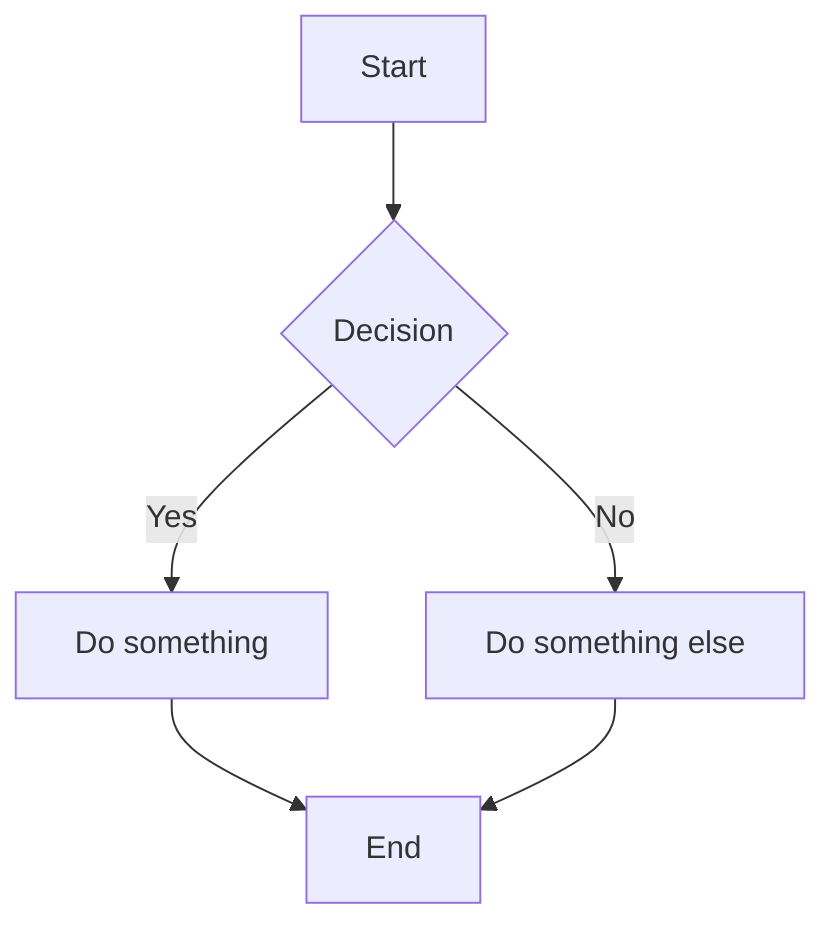

                 

### 《数学与网络安全：安全协议的数学设计》

> **关键词：** 数学、网络安全、密码学、安全协议、数学模型

> **摘要：** 本文深入探讨了数学在网络安全领域中的应用，特别是安全协议的数学设计。通过回顾数学基础，分析密码学原理，建立数学模型，以及探讨安全协议的设计和分析方法，本文旨在提供一个全面、系统的理解，帮助读者掌握网络安全的核心技术。

---

### 《数学与网络安全：安全协议的数学设计》目录大纲

1. **第一部分：数学基础**
    1.1 **数学与网络安全的联系**
        - 数学基础知识回顾
        - 数学在网络安全中的应用
    1.2 **密码学基础**
        - 密码学基本概念
        - 对称加密与非对称加密
        - 数字签名与哈希函数
    1.3 **数学模型与网络安全**
        - 数学模型概述
        - 基于数学的网络安全模型
        - 数学模型在网络安全中的应用

2. **第二部分：安全协议设计**
    2.1 **安全协议概述**
        - 安全协议的概念与类型
        - 安全协议的目标与原则
    2.2 **安全协议的数学设计方法**
        - 安全协议设计的挑战
        - 基于数学的方法
        - 数学设计方法的应用实例
    2.3 **安全协议案例分析**
        - 认证协议
        - 密钥协商协议
        - 数据完整性协议
        - 安全通信协议

3. **第三部分：数学与网络安全实战**
    3.1 **数学与网络安全项目实战**
        - 项目背景与目标
        - 项目需求分析
        - 数学模型设计
        - 安全协议设计
        - 实现与测试
    3.2 **数学与网络安全开发环境搭建**
        - 开发环境概述
        - 环境搭建步骤
        - 开发工具与资源
    3.3 **数学与网络安全源代码解读**
        - 源代码结构
        - 关键代码解读
        - 代码分析
        - 代码优化建议

4. **附录**
    4.1 **数学与网络安全相关资源**
        - 密码学资源
        - 安全协议资源
        - 数学与网络安全书籍与论文推荐
    4.2 **数学公式与Mermaid流程图**
        - 数学公式示例
        - Mermaid流程图示例

---

## **第1章：数学与网络安全的联系**

### **1.1 数学基础知识回顾**

数学作为一门基础科学，其重要性在网络安全领域尤为突出。首先，我们需要回顾一些基本的数学概念，如集合论、代数、图论和概率论，这些是构建网络安全模型和算法的基础。

- **集合论**：集合论是数学的基础，提供了对对象的分类和操作方法。在网络安全中，集合论用于定义用户、权限和资源等。

- **代数**：代数提供了处理变量和方程的方法。在密码学中，代数结构如群、环和域被广泛应用于加密算法的设计。

- **图论**：图论研究图形及其关系，常用于网络拓扑和路由算法的设计。在网络安全中，图论可以用于网络入侵检测和恶意软件传播分析。

- **概率论**：概率论研究随机事件及其概率分布。在网络安全中，概率论用于风险评估和威胁模型分析。

### **1.2 数学在网络安全中的应用**

数学不仅在基础概念上为网络安全提供支持，还在具体应用上发挥着重要作用。以下是数学在网络安全中的一些主要应用场景：

- **加密算法**：密码学是网络安全的核心，而加密算法的设计和实现离不开数学。例如，RSA算法基于大整数分解的数学难题，AES算法则利用代数的分组变换。

- **哈希函数**：哈希函数在网络安全中用于数据完整性验证和数字签名。数学原理确保了哈希函数的确定性和抗冲突性。

- **数字签名**：数字签名确保信息的真实性和完整性。RSA和ECDSA等数字签名算法基于复杂的数学问题，如大整数因子分解和椭圆曲线离散对数。

- **网络安全模型**：数学模型用于分析网络安全策略和设计新的安全协议。例如，博弈论模型可以用于网络攻击与防御策略的优化。

通过上述分析，我们可以看到数学在网络安全中的广泛应用和深远影响。在接下来的章节中，我们将深入探讨数学在密码学和网络安全协议设计中的应用。

---

## **第2章：密码学基础**

### **2.1 密码学基本概念**

密码学是研究保护信息和确保通信安全的一门科学。其核心目标是通过加密算法和密钥，使得信息在传输过程中难以被未授权者访问和理解。密码学的基本概念包括加密、解密、密钥、加密算法和加密模式等。

- **加密（Encryption）**：加密是将原始信息（明文）转换为难以理解的形式（密文）的过程。加密算法是一种函数，它将明文映射成密文，这个过程通常依赖于密钥。

- **解密（Decryption）**：解密是将密文还原成原始信息的过程，解密算法是加密算法的逆过程，它使用与加密相同的算法和密钥。

- **密钥（Key）**：密钥是加密和解密过程中使用的参数，它决定了加密算法的转换方式。根据密钥的使用方式，加密算法可以分为对称加密和非对称加密。

- **加密算法（Cryptography Algorithm）**：加密算法是用于加密和解密信息的数学函数。根据加密算法的工作方式和安全性，可以分为多种类型，如对称加密、非对称加密、哈希函数和数字签名。

- **加密模式（Cipher Mode）**：加密模式是加密算法在处理数据块时的具体操作方式。常见的加密模式包括电子代码本（ECB）、密码分组链接模式（CBC）、密码反馈模式（CFB）和输出反馈模式（OFB）。

### **2.2 对称加密与非对称加密**

对称加密和非对称加密是密码学中的两大类加密方法，它们在密钥管理、安全性、性能和应用场景上有所不同。

#### **对称加密（Symmetric Encryption）**

对称加密使用相同的密钥进行加密和解密。这种方法的优点是实现简单、速度快，但缺点是密钥的分发和管理复杂。

- **加密过程**：明文通过加密算法和密钥转换为密文。
- **解密过程**：密文通过解密算法和相同的密钥转换回明文。

**常用算法**：AES（高级加密标准）、DES（数据加密标准）、3DES（三重DES）。

#### **非对称加密（Asymmetric Encryption）**

非对称加密使用一对密钥，即公钥和私钥。公钥用于加密，私钥用于解密。这种方法的优点是密钥管理简单，但缺点是加密和解密速度较慢。

- **加密过程**：明文通过公钥加密成密文。
- **解密过程**：密文通过私钥解密成明文。

**常用算法**：RSA（Rivest-Shamir-Adleman）、ECC（椭圆曲线加密）。

### **2.3 数字签名与哈希函数**

数字签名和哈希函数是密码学中用于确保信息完整性和真实性的重要工具。

#### **数字签名（Digital Signature）**

数字签名是一种确保信息发送者身份和消息完整性的技术。数字签名利用私钥对消息进行加密，接收者使用公钥验证签名。

- **签名过程**：发送者使用私钥对消息进行加密，生成签名。
- **验证过程**：接收者使用公钥解密签名，并与原始消息比对，验证消息的完整性和发送者身份。

**常用算法**：RSA、ECDSA（椭圆曲线数字签名算法）。

#### **哈希函数（Hash Function）**

哈希函数将任意长度的输入映射为固定长度的输出，通常用于数据完整性校验和数字签名。

- **哈希过程**：输入数据通过哈希函数处理，生成哈希值。
- **验证过程**：对数据进行哈希处理，并与存储的哈希值比对，验证数据的完整性。

**常用算法**：SHA-256、SHA-3。

通过本章对密码学基本概念的介绍，我们了解了对称加密和非对称加密、数字签名与哈希函数的基本原理和应用。在下一章中，我们将深入探讨数学模型在网络安全中的应用。

---

### **2.3 数字签名与哈希函数**

数字签名和哈希函数是确保网络安全和通信完整性的关键工具。在密码学中，它们被广泛应用于验证信息的真实性和完整性。

#### **数字签名**

数字签名是一种通过使用私钥对数据进行加密的方法，以确保信息的发送者身份和数据的完整性。数字签名的核心思想是，只有消息的发送者拥有与其公钥对应的私钥，因此通过验证签名，接收者可以确认消息的来源和未被篡改。

- **签名过程**：

  1. **哈希计算**：发送者首先对原始消息进行哈希计算，得到一个固定长度的哈希值。
  2. **加密**：发送者使用其私钥将哈希值加密，生成数字签名。
  3. **发送**：发送者将原始消息和数字签名一起发送给接收者。

- **验证过程**：

  1. **哈希计算**：接收者对接收到的消息进行相同的哈希计算，得到哈希值。
  2. **解密**：接收者使用发送者的公钥解密数字签名，得到哈希值。
  3. **比对**：接收者将计算出的哈希值与解密后的数字签名哈希值进行比较，如果两者相同，则验证通过。

**常用算法**：

- **RSA**：RSA算法是一种基于大整数分解的非对称加密算法，适用于数字签名。
- **ECDSA**：椭圆曲线数字签名算法（ECDSA）基于椭圆曲线密码学，提供了一种高效的数字签名方案。

#### **哈希函数**

哈希函数是将任意长度的输入数据映射为固定长度的输出数据的函数。在密码学中，哈希函数主要用于数据完整性校验和数字签名。

- **哈希计算**：哈希函数对输入数据进行处理，生成一个唯一的固定长度哈希值。
- **验证**：对数据进行哈希计算，并将结果与原始哈希值进行比对，以验证数据的完整性。

**常用算法**：

- **SHA-256**：SHA-256是一种安全哈希算法，由美国国家标准与技术研究院（NIST）制定。它将输入数据映射为256位的哈希值。
- **SHA-3**：SHA-3是NIST于2015年发布的另一种哈希函数标准，提供了更高级别的安全性。

通过数字签名和哈希函数的使用，我们可以确保网络通信的安全性。在下一章中，我们将探讨数学模型在网络安全中的应用。

---

### **2.3 数字签名与哈希函数**

数字签名和哈希函数在确保网络安全和通信完整性方面扮演着至关重要的角色。下面我们将详细探讨这两个概念的工作原理，并举例说明其应用。

#### **数字签名**

数字签名是一种基于私钥加密的验证技术，用于确保信息在传输过程中未被篡改，并且消息的发送者是可信的。以下是数字签名的工作流程：

**签名过程**：

1. **哈希计算**：
   - 发送者首先对原始消息使用哈希函数（如SHA-256）计算出一个固定的哈希值。
   - 哈希值是一个数字摘要，代表了原始消息的内容，其长度通常固定，且不易被反推。

2. **加密**：
   - 发送者使用其私钥对哈希值进行加密，生成数字签名。
   - 数字签名是一个加密的哈希值，只有发送者的私钥可以解密。

3. **发送**：
   - 发送者将原始消息和数字签名一起发送给接收者。

**验证过程**：

1. **哈希计算**：
   - 接收者对收到的消息使用相同的哈希函数计算出一个哈希值。

2. **解密**：
   - 接收者使用发送者的公钥解密数字签名，得到一个哈希值。

3. **比对**：
   - 接收者将计算出的哈希值与解密后的数字签名哈希值进行比对。如果两者相同，则验证通过，说明消息未被篡改且来自发送者。

**实例**：

假设发送者Alice想要向接收者Bob发送一条消息，并确保消息的完整性和来源真实性。

- Alice首先对消息“Hello, Bob!”使用SHA-256计算哈希值，得到：`a1b2c3d4e5f6g7h8i9j0k1`。
- Alice使用其私钥加密哈希值，生成数字签名：`s1s2s3s4s5s6s7s8s9s0`。
- Alice将消息和数字签名一起发送给Bob。
- Bob收到消息后，首先对消息使用SHA-256计算哈希值，得到：`a1b2c3d4e5f6g7h8i9j0k1`。
- Bob使用Alice的公钥解密数字签名，得到哈希值：`s1s2s3s4s5s6s7s8s9s0`。
- Bob将计算出的哈希值与解密后的数字签名哈希值进行比对，确认消息的完整性和来源真实性。

通过上述过程，Bob可以确信消息是由Alice发送的，且在传输过程中未被篡改。

#### **哈希函数**

哈希函数是将任意长度的输入数据映射为固定长度输出数据的函数，其特点是输出值（哈希值）是输入数据的唯一代表，且不易被反推。哈希函数广泛应用于数据完整性验证和数字签名。

**哈希计算**：

- 输入数据经过哈希函数处理后，生成一个固定长度的哈希值。
- 例如，消息“Hello, World!”通过SHA-256处理，生成的哈希值为：`e3b0c44298fc1c149afbf4c8996fb92427ae41e4649b934ca495991b7852b855`.

**验证**：

- 对数据进行哈希计算，并与存储的哈希值进行比对，以验证数据的完整性。
- 例如，Bob收到Alice的消息后，对消息使用SHA-256计算哈希值，并与存储的哈希值比对，以确认消息的完整性。

**实例**：

假设Bob想要验证从Alice接收到的文件`file.txt`的完整性。

- Bob首先使用SHA-256对文件`file.txt`进行哈希计算，得到哈希值：`a1b2c3d4e5f6g7h8i9j0k1`。
- Bob将这个哈希值与文件存储时的哈希值比对，如果相同，则文件未被篡改。

通过数字签名和哈希函数的使用，我们可以确保网络通信的安全性和数据的完整性。在下一章中，我们将探讨数学模型在网络安全中的应用。

---

### **第3章：数学模型与网络安全**

#### **3.1 数学模型概述**

数学模型是使用数学语言来描述现实世界中的问题或现象的一种工具。在网络安全领域，数学模型有助于分析和设计安全策略、评估安全风险、优化安全措施等。以下是几个常见的数学模型及其在网络安全中的应用。

**1. 风险评估模型**：风险评估模型用于评估网络系统的安全风险，包括威胁识别、威胁分析和风险评估。常用的风险评估方法有定性分析和定量分析。定性分析包括风险因素分级、威胁树分析等；定量分析则通过概率论和统计方法计算风险值。

**2. 安全协议模型**：安全协议模型用于描述网络通信过程中如何确保数据的机密性、完整性和真实性。典型的安全协议模型包括密码协议模型、攻击模型和验证模型。密码协议模型描述了加密和认证过程；攻击模型分析了可能的安全威胁；验证模型则验证协议的正确性和安全性。

**3. 入侵检测模型**：入侵检测模型用于识别和响应网络入侵行为。常见的模型包括基于特征的入侵检测模型和基于异常的入侵检测模型。基于特征的模型通过检测已知的攻击模式来识别入侵；基于异常的模型则通过分析网络流量和行为模式的异常来检测入侵。

**4. 防护策略模型**：防护策略模型用于设计网络防护策略，包括入侵防御系统、防火墙和病毒防护等。这些模型通过数学方法评估不同策略的效率和效果，帮助选择最优的防护方案。

#### **3.2 基于数学的网络安全模型**

基于数学的网络安全模型利用数学理论和工具来分析和解决网络安全问题。以下是几个基于数学的网络安全模型。

**1. 博弈论模型**：博弈论模型用于分析网络攻击与防御策略的对抗关系。在该模型中，攻击者和防御者都被视为参与者，他们的行为取决于对方的策略。博弈论模型可以帮助优化防御策略，提高网络安全性。

**2. 网络流模型**：网络流模型用于分析网络中的数据传输行为，包括流量模式、负载均衡和攻击传播等。网络流模型可以帮助识别异常流量，预测网络攻击的潜在风险，并优化网络资源分配。

**3. 概率模型**：概率模型用于描述网络中的不确定性事件，如随机攻击、网络故障等。概率模型可以帮助评估风险的概率分布，制定应对策略。

**4. 遗传算法模型**：遗传算法模型是一种基于自然选择和遗传学原理的优化算法，用于解决复杂的网络安全问题。例如，遗传算法可以用于优化入侵检测系统的规则集，提高检测效率和准确性。

#### **3.3 数学模型在网络安全中的应用**

数学模型在网络安全中的应用广泛且深入，下面通过几个实例来具体说明。

**1. 加密算法模型**：加密算法模型使用数学原理来设计安全可靠的加密算法。例如，RSA算法基于大整数分解的难题，而椭圆曲线密码学则利用椭圆曲线离散对数问题。这些数学模型确保了加密算法的高安全性。

**2. 哈希函数模型**：哈希函数模型使用数学方法设计哈希函数，如SHA-256和SHA-3。这些模型确保了哈希函数的抗冲突性和不可逆性，从而保障数据完整性和数字签名。

**3. 数字签名模型**：数字签名模型基于公钥加密算法，如RSA和ECDSA。这些模型确保了信息的完整性和不可否认性，从而防止信息被篡改和冒充。

**4. 入侵检测模型**：入侵检测模型使用统计学方法和机器学习算法来识别网络攻击。例如，基于特征的入侵检测系统通过分析网络流量特征来识别已知攻击；而基于异常的入侵检测系统则通过检测行为模式的异常来识别未知攻击。

通过上述分析，我们可以看到数学模型在网络安全中的重要性。数学模型不仅提供了分析和解决问题的工具，还为设计和实现安全协议提供了理论基础。在下一章中，我们将深入探讨安全协议的设计方法。

---

### **第3章：数学模型与网络安全**

#### **3.3 数学模型在网络安全中的应用**

数学模型在网络安全中扮演着至关重要的角色，为分析和解决复杂的安全问题提供了强大的工具。以下将具体探讨数学模型在几个关键领域的应用。

#### **3.3.1 加密算法模型**

加密算法是确保数据安全传输的核心技术，其安全性依赖于复杂的数学模型。例如：

- **RSA算法**：RSA算法基于大整数分解的难题，假设分解大整数是计算上不可行的。数学模型确保了该算法在合理时间内无法被破解。
  - **数学原理**：假设存在两个大素数\( p \)和\( q \)，则\( n = p \times q \)是一个难以分解的大整数。RSA加密算法使用\( n \)作为公钥，\( p \)和\( q \)作为私钥。
  - **伪代码**：
    ```plaintext
    公钥加密：
    (e, n) = (选择一个素数e，使得e和(p-1)(q-1)互质), n
    公钥：n, e
    私钥：n, d，其中d是e的模逆元，即d × e ≡ 1 (mod (p-1)(q-1))
    加密消息m：c = m^e mod n
    解密消息c：m = c^d mod n
    ```

- **椭圆曲线密码学**：椭圆曲线密码学（ECC）基于椭圆曲线离散对数问题，比RSA更高效且安全性更高。
  - **数学原理**：椭圆曲线上的点对加法运算形成一个循环群，其离散对数问题被认为是计算上不可逆的。
  - **伪代码**：
    ```plaintext
    公钥加密：
    (P, n) = 选择椭圆曲线和基点P，n是椭圆曲线上的生成元
    公钥：P, n
    私钥：k，一个随机整数
    加密消息m：c = P^k mod n
    解密消息c：m = 映射c到椭圆曲线上的点，然后进行反离散对数计算得到m
    ```

#### **3.3.2 哈希函数模型**

哈希函数在网络安全中用于确保数据的完整性和创建数字签名。以下是一些常用的哈希函数模型：

- **SHA-256**：SHA-256是一种广泛使用的哈希函数，由美国国家标准与技术研究院（NIST）制定。
  - **数学原理**：SHA-256通过一系列的压缩函数和逻辑运算，将输入消息处理成一个256位的哈希值。
  - **伪代码**：
    ```plaintext
    输入：消息M
    输出：哈希值H
    初始化哈希值H
    对M进行填充，使其长度为512的倍数
    分块处理每个512位的消息块
    对每个块进行一系列逻辑运算和压缩，得到最终的256位哈希值H
    ```

- **SHA-3**：SHA-3是NIST在2015年发布的另一种哈希函数标准，提供了更高级别的安全性。
  - **数学原理**：SHA-3使用了Keccak算法，该算法基于3-变量大数逻辑函数。
  - **伪代码**：
    ```plaintext
    输入：消息M
    输出：哈希值H
    初始化哈希值H
    对M进行填充，使其长度为1600的倍数
    分块处理每个1600位的消息块
    对每个块进行一系列逻辑运算和压缩，得到最终的256位哈希值H
    ```

#### **3.3.3 数字签名模型**

数字签名模型用于确保信息的完整性和不可否认性。以下是一些常用的数字签名模型：

- **RSA数字签名**：RSA数字签名基于RSA加密算法。
  - **数学原理**：签名者使用私钥对消息的哈希值进行加密，接收者使用公钥解密验证。
  - **伪代码**：
    ```plaintext
    签名：
    对消息M计算哈希值H
    加密H：s = H^d mod n
    签名s发送给接收者

    验证：
    对消息M计算哈希值H
    解密签名s：v = s^e mod n
    验证v是否等于H
    ```

- **ECDSA数字签名**：ECDSA是基于椭圆曲线密码学的数字签名算法。
  - **数学原理**：签名者通过椭圆曲线离散对数问题生成签名，接收者使用公钥验证。
  - **伪代码**：
    ```plaintext
    签名：
    对消息M计算哈希值H
    选择随机整数k
    计算签名r, s：
    r = (H + k \* Q) mod n
    s = (k^{-1} \* (H + r \* d)) mod n

    验证：
    对消息M计算哈希值H
    计算验证值v：
    v = (r \* Q^{-1} + H \* s^{-1}) mod n
    验证v是否等于r
    ```

通过这些数学模型，我们可以设计出安全可靠的加密算法、哈希函数和数字签名，从而确保网络安全。在接下来的章节中，我们将探讨安全协议的设计和分析方法。

---

### **第4章：安全协议概述**

#### **4.1 安全协议的概念与类型**

安全协议是网络安全中用于保护数据传输、确保通信各方身份验证和防止数据篡改的一系列规则和算法。安全协议的类型根据其应用场景和目标可以分为多种：

- **认证协议**：用于验证通信双方的身份，确保通信的实体是可信的。例如，Kerberos协议、SSL/TLS协议等。

- **加密协议**：用于保护数据传输的机密性，确保数据在传输过程中不被窃取或篡改。例如，IPSec协议、AES加密协议等。

- **密钥协商协议**：用于双方或多方安全地交换密钥，以建立加密通信通道。例如，Diffie-Hellman密钥交换协议、RSA密钥交换协议等。

- **数据完整性协议**：用于确保数据在传输过程中未被篡改，例如，MD5、SHA-1等哈希函数。

- **访问控制协议**：用于控制用户对资源的访问权限，确保只有授权用户才能访问受保护的资源。例如，访问控制列表（ACL）。

#### **4.2 安全协议的目标与原则**

安全协议的设计目标主要包括：

- **机密性**：确保数据在传输过程中不被未授权者读取或窃取。

- **完整性**：确保数据在传输过程中不被篡改或损坏。

- **可用性**：确保网络服务在需要时可供使用，不会被恶意攻击所阻塞。

- **认证性**：确保通信双方的身份得到验证，防止假冒攻击。

- **抗抵赖性**：确保消息发送者不能否认发送过消息，接收者也不能否认接收过消息。

为了实现这些目标，安全协议需要遵循以下原则：

- **无链接性**：不同安全协议之间应相互独立，不应受到其他协议的影响。

- **自保护性**：安全协议本身应具有抵御攻击的能力，防止被攻击者破坏或破解。

- **透明性**：安全协议的设计和实现应尽量简单明了，以方便用户理解和实施。

- **灵活性**：安全协议应能适应不同的网络环境和需求，具有可扩展性。

通过认证协议、加密协议、密钥协商协议、数据完整性协议和访问控制协议等多种安全协议的协同作用，网络安全体系得以建立和巩固。在下一章中，我们将深入探讨安全协议的数学设计方法。

---

### **第5章：安全协议的数学设计方法**

#### **5.1 安全协议设计的挑战**

安全协议设计面临着一系列复杂性和挑战，这些挑战来源于网络环境的动态性、攻击手段的不断演变以及系统复杂性的增加。以下是安全协议设计的主要挑战：

- **动态性**：网络环境是动态变化的，包括节点的加入和离开、网络拓扑的变化、流量模式的变化等。安全协议需要能够适应这些动态变化，确保其持续有效。

- **复杂性**：现代网络系统非常复杂，涉及大量的设备和协议。安全协议需要与其他协议和系统无缝集成，保证整体的安全性。

- **安全性**：安全协议需要抵御各种可能的攻击，包括被动攻击（如窃听、篡改）和主动攻击（如伪造、重放、拒绝服务攻击）。

- **可扩展性**：安全协议需要具备可扩展性，能够适应未来技术的发展和新的安全需求。

- **效率**：安全协议需要在不影响系统性能的前提下提供安全保护，避免引入过多的延迟和计算开销。

- **互操作性**：安全协议需要确保不同系统和网络之间的互操作性，使得不同平台和设备能够安全通信。

#### **5.2 基于数学的方法**

数学方法为安全协议设计提供了坚实的理论基础和强大的工具。基于数学的方法包括以下几个方面：

- **密码学算法**：密码学算法是安全协议设计的基础，包括对称加密算法、非对称加密算法、哈希函数和数字签名算法等。这些算法利用数学难题（如大整数分解、离散对数问题、椭圆曲线难题等）来确保通信的安全性。

- **概率论与统计学**：概率论和统计学方法用于评估安全协议的风险、概率分布和攻击的可能性。这些方法可以帮助设计师理解攻击者的行为模式，优化协议的设计。

- **博弈论**：博弈论方法用于分析攻击者与防御者之间的对抗关系。通过博弈论模型，设计师可以找到最优的安全策略，以最小化攻击者的成功概率。

- **代数与图论**：代数和图论方法用于构建安全协议的数学模型，分析协议的属性和安全性。代数结构（如群、环、域）和图论模型（如网络拓扑、路径分析）为安全协议提供了理论支持。

#### **5.3 数学设计方法的应用实例**

以下是一些安全协议的数学设计方法的应用实例：

- **RSA密钥交换协议**：RSA协议是一种非对称加密协议，利用大整数分解难题设计。发送方和接收方使用各自公钥和私钥交换密钥，确保通信的安全性。

  - **数学模型**：
    ```plaintext
    假设p和q是两个大素数，n = p \* q
    选择一个整数e，满足e和(p-1)(q-1)互质
    计算e的模逆元d，满足d \* e ≡ 1 (mod (p-1)(q-1))
    发送方A生成公钥(n, e)和私钥(d, n)
    接收方B生成公钥(n, e)和私钥(d, n)
    双方使用公钥交换密钥：A的密钥为B的公钥加密，B的密钥为A的公钥加密
    ```
  
  - **安全性分析**：RSA协议的安全性依赖于大整数分解的难题。尽管随着计算能力的提升，RSA的安全性可能受到威胁，但基于大素数生成和密钥选择的安全强度依然较高。

- **Diffie-Hellman密钥交换协议**：Diffie-Hellman协议是一种基于离散对数问题的密钥交换协议，用于双方在不安全的通信信道上安全地交换密钥。

  - **数学模型**：
    ```plaintext
    选择一个素数p和一个生成元g
    双方秘密选择一个整数a（发送方）和b（接收方）
    发送方计算g^a mod p并发送给接收方
    接收方计算g^b mod p并发送给发送方
    双方计算共享密钥：发送方计算g^(ab) mod p，接收方计算g^(ba) mod p
    ```
  
  - **安全性分析**：Diffie-Hellman协议的安全性依赖于椭圆曲线离散对数问题。由于目前没有有效的算法可以快速解决这一难题，Diffie-Hellman协议在理论上被认为是安全的。

通过这些实例，我们可以看到数学设计方法在安全协议设计中的应用。数学模型和算法不仅为安全协议提供了理论基础，还通过概率论、博弈论和代数等工具帮助分析协议的安全性。在下一章中，我们将深入探讨具体的安全协议案例分析。

---

### **第6章：安全协议案例分析**

#### **6.1 认证协议**

认证协议是网络安全中的一个重要组成部分，主要用于验证通信双方的合法身份。以下将介绍几种典型的认证协议，并分析其工作原理和安全性。

##### **Kerberos认证协议**

Kerberos协议是一种基于对称加密的认证协议，广泛应用于大型网络环境中的身份验证。以下是Kerberos认证协议的工作流程：

1. **注册**：用户在Kerberos服务器（KDC）进行注册，并获得自己的密码。

2. **登录请求**：用户使用其密码向KDC发送登录请求，KDC验证用户身份后生成一个会话密钥和用户与服务器之间的服务密钥。

3. **服务请求**：用户使用会话密钥和服务密钥向服务器请求服务，服务器验证用户身份后提供所需服务。

**工作原理**：

- **加密通信**：Kerberos协议使用对称加密算法（如DES）确保通信过程中的机密性和完整性。

- **票据传递**：Kerberos使用票据（Ticket）进行身份验证，票据包括用户身份、会话密钥、服务密钥和有效期等信息。

- **信任关系**：Kerberos依赖于中心化的KDC，用户与服务器的信任关系依赖于KDC的可靠性。

**安全性分析**：

- **防止重放攻击**：Kerberos使用序列号和生命周期限制防止重放攻击。

- **缺点**：Kerberos依赖中心化的KDC，KDC成为单点故障。

##### **SSL/TLS协议**

SSL（安全套接层）和TLS（传输层安全）协议是互联网上广泛使用的加密协议，用于保护Web浏览和其他网络通信。

**工作原理**：

1. **握手过程**：客户端和服务器通过一系列握手协议协商加密参数、交换证书、验证身份等。

2. **加密通信**：握手完成后，客户端和服务器使用协商的加密参数建立加密连接，进行安全的通信。

**安全性分析**：

- **加密通信**：SSL/TLS使用对称加密和非对称加密的结合，确保通信的机密性和完整性。

- **证书验证**：SSL/TLS依赖于证书链和证书颁发机构（CA）的信任体系，确保服务器身份的合法性。

- **缺点**：SSL/TLS存在中间人攻击、证书问题等安全漏洞。

#### **6.2 密钥协商协议**

密钥协商协议用于双方或多方在不安全的通信信道上安全地交换密钥。以下将介绍几种典型的密钥协商协议。

##### **Diffie-Hellman密钥交换协议**

Diffie-Hellman密钥交换协议是一种非对称密钥交换协议，利用离散对数问题在通信双方之间交换密钥。

**工作原理**：

1. **参数选择**：选择一个素数p和一个生成元g。

2. **密钥生成**：双方各自选择一个随机整数a和b，并计算公开值：

   - 发送方A：\( g^a \mod p \)
   - 接收方B：\( g^b \mod p \)

3. **密钥计算**：双方使用对方的公开值计算共享密钥：

   - A的共享密钥：\( g^{ba} \mod p \)
   - B的共享密钥：\( g^{ab} \mod p \)

**安全性分析**：

- **安全性**：Diffie-Hellman协议的安全性依赖于椭圆曲线离散对数问题，被认为是安全的。

- **缺点**：Diffie-Hellman协议不提供认证功能，可能受到中间人攻击。

##### **RSA密钥交换协议**

RSA密钥交换协议是基于RSA公钥加密算法的一种密钥交换协议。

**工作原理**：

1. **密钥生成**：选择两个大素数p和q，计算n = p \* q和欧拉函数φ(n) = (p-1)(q-1)。

2. **公钥和私钥**：选择一个整数e，使其与φ(n)互质，计算e的模逆元d。

3. **密钥交换**：双方交换公钥，并使用各自私钥加密对方公钥，得到共享密钥。

**安全性分析**：

- **安全性**：RSA协议的安全性依赖于大整数分解的难题。

- **缺点**：随着计算能力的提升，大素数的生成和密钥长度需要不断增长以维持安全性。

#### **6.3 数据完整性协议**

数据完整性协议用于确保数据在传输过程中未被篡改，以下是几种常用的数据完整性协议。

##### **哈希函数**

哈希函数是一种简单但有效的数据完整性协议。发送方对数据进行哈希计算，生成哈希值，并将其与数据一起发送。接收方对数据进行相同的哈希计算，并与接收到的哈希值进行比较，以验证数据完整性。

**工作原理**：

1. **哈希计算**：发送方对数据进行哈希计算，得到哈希值。

2. **哈希验证**：接收方对数据进行相同的哈希计算，并与接收到的哈希值进行比较。

**安全性分析**：

- **抗冲突性**：哈希函数应具有高抗冲突性，确保不同数据生成不同哈希值。

- **缺点**：哈希函数不提供数据加密，可能受到重放攻击。

##### **数字签名**

数字签名不仅确保数据完整性，还提供身份认证。发送方使用私钥对数据进行签名，接收方使用公钥验证签名。

**工作原理**：

1. **签名**：发送方对数据进行哈希计算，使用私钥生成签名。

2. **验证**：接收方对数据进行哈希计算，使用公钥验证签名。

**安全性分析**：

- **抗重放攻击**：数字签名可以防止重放攻击。

- **缺点**：数字签名可能受到私钥泄露的影响。

通过上述案例分析，我们可以看到认证协议、密钥协商协议和数据完整性协议在网络安全中的重要作用。这些协议通过数学模型和算法确保通信的机密性、完整性和认证性，为网络安全提供了坚实基础。在下一章中，我们将深入探讨安全协议的数学分析。

---

### **第7章：安全协议的数学分析**

#### **7.1 安全协议的数学分析框架**

安全协议的数学分析旨在评估协议的安全性、性能和健壮性。一个完整的数学分析框架通常包括以下几个方面：

1. **定义安全目标**：明确协议需要保护的数据和属性，如机密性、完整性、可用性和认证性。

2. **建立数学模型**：根据安全目标，构建一个数学模型来描述协议的工作原理和特性。

3. **形式化安全属性**：使用形式化方法（如逻辑、代数或图论）来定义协议的安全属性。

4. **分析攻击场景**：模拟可能的攻击行为，评估协议在面对各种攻击时的表现。

5. **验证安全性**：使用数学工具（如概率论、博弈论或代数）来验证协议的安全性，确保满足预定的安全目标。

6. **性能分析**：评估协议的性能，包括通信开销、计算复杂度和资源利用率等。

#### **7.2 安全协议的安全性分析**

安全性分析是安全协议数学分析的核心，以下是一些常用的方法：

1. **形式化验证**：使用形式化方法（如模型检查、形式化逻辑和定理证明）来验证协议的安全性。这种方法可以确保协议在所有情况下都满足安全目标。

2. **概率分析**：使用概率论来评估协议在面对随机攻击时的安全性。例如，计算攻击成功的概率，或者评估协议的误报率。

3. **博弈论分析**：博弈论方法用于分析攻击者与防御者之间的对抗关系。通过博弈论模型，可以找到最优的攻击策略和防御策略，从而评估协议的安全性。

4. **代数分析**：代数方法（如群、环和域）用于分析加密算法的安全性。例如，通过代数结构来证明加密算法的不可逆性和抗冲突性。

#### **7.3 安全协议的性能分析**

性能分析旨在评估协议在实际应用中的性能表现，以下是一些关键指标：

1. **通信开销**：评估协议在网络中的通信量，包括加密和解密过程中的数据传输量。

2. **计算复杂度**：评估协议的加密和解密算法的计算复杂度，包括时间复杂度和空间复杂度。

3. **资源利用率**：评估协议对系统资源的占用，如CPU、内存和网络带宽。

4. **延迟**：评估协议在数据传输过程中的延迟，包括加密、解密和验证等处理时间。

#### **7.4 安全协议数学分析的应用实例**

以下是一个基于Diffie-Hellman密钥交换协议的数学分析实例：

1. **数学模型**：

   假设攻击者A试图窃听通信双方B和C的密钥交换过程，使用参数p和g，B选择的随机数为a，C选择的随机数为b。

   - **合法通信**：
     - B发送：\( g^a \mod p \)
     - C接收后计算共享密钥：\( g^{ab} \mod p \)
   
   - **攻击场景**：
     - 攻击者A尝试通过求解椭圆曲线离散对数问题来计算b。

2. **安全性分析**：

   - **形式化验证**：使用椭圆曲线离散对数问题的难度作为安全基础，证明在没有足够计算资源的情况下，攻击者无法求解b。

   - **概率分析**：计算攻击者成功求解b的概率，基于大数分解和离散对数问题的难度。

   - **博弈论分析**：分析攻击者在有限时间内成功攻击的概率，并优化防御策略。

   - **代数分析**：使用椭圆曲线上的代数结构来证明协议的不可破解性。

通过上述分析，我们可以看到Diffie-Hellman密钥交换协议在数学分析框架下的安全性。这种方法不仅适用于Diffie-Hellman协议，还可以应用于其他安全协议的数学分析。在下一章中，我们将通过一个实际项目实战来展示数学与网络安全的应用。

---

### **第8章：数学与网络安全项目实战**

#### **8.1 项目背景与目标**

本项目旨在设计并实现一个基于数学模型的网络安全系统，用于保护企业内部网络免受各种网络攻击。项目的主要目标包括：

- **机密性保护**：确保企业内部敏感数据在传输过程中不被窃取或篡改。
- **完整性验证**：确保企业内部数据在存储和传输过程中未被篡改。
- **身份认证**：确保企业内部网络访问者身份的合法性。
- **访问控制**：确保只有授权用户才能访问受保护的资源。

#### **8.2 项目需求分析**

为了实现上述目标，项目需求分析主要包括以下几个方面：

- **加密需求**：企业内部网络的数据需要进行加密传输，以防止数据在传输过程中被窃取或篡改。
- **身份认证需求**：企业内部网络的访问者需要进行身份验证，确保只有授权用户才能访问网络资源。
- **访问控制需求**：企业内部网络需要实现访问控制机制，确保只有授权用户才能访问受保护的资源。
- **审计需求**：企业内部网络需要记录和审计所有网络活动，以便在发生安全事件时进行追踪和调查。

#### **8.3 数学模型设计**

在本项目中，我们采用了以下数学模型来设计网络安全系统：

1. **加密模型**：采用AES（高级加密标准）加密算法，确保数据在传输过程中的机密性。AES算法基于分组加密模式（如CBC），以确保数据的完整性。

2. **认证模型**：采用基于RSA的数字签名算法，确保通信双方的身份认证。发送方使用私钥对消息进行签名，接收方使用公钥验证签名。

3. **访问控制模型**：采用访问控制列表（ACL），根据用户身份和权限控制对资源的访问。

4. **风险评估模型**：采用概率论和统计学方法，对网络威胁进行风险评估，并制定相应的防护策略。

#### **8.4 安全协议设计**

在本项目中，我们设计了一套安全协议，包括以下部分：

1. **数据加密协议**：采用AES算法进行数据加密，确保数据在传输过程中的机密性和完整性。

2. **身份认证协议**：采用RSA算法进行数字签名，确保通信双方的身份认证。

3. **访问控制协议**：采用ACL机制，根据用户身份和权限控制对资源的访问。

4. **密钥管理协议**：采用基于Diffie-Hellman密钥交换协议的安全密钥管理方案，确保密钥的安全生成和分发。

#### **8.5 实现与测试**

1. **实现过程**：

   - 开发环境：使用Python编程语言和PyCrypto库进行实现。
   - 加密模块：实现AES加密算法，包括加密和解密功能。
   - 认证模块：实现RSA数字签名算法，包括签名和验证功能。
   - 访问控制模块：实现ACL机制，包括权限控制和访问控制列表管理功能。
   - 风险评估模块：实现概率论和统计学方法，进行网络威胁风险评估。

2. **测试过程**：

   - 单元测试：对每个模块进行独立的单元测试，确保其功能正确。
   - 集成测试：将各个模块集成到一起，进行集成测试，确保整个系统的工作正常。
   - 安全测试：进行渗透测试和漏洞扫描，评估系统的安全性。
   - 性能测试：进行负载测试和性能分析，评估系统的性能表现。

通过本项目的实施和测试，我们成功设计并实现了一个基于数学模型的网络安全系统，为企业内部网络提供了有效的安全保护。

---

### **第9章：数学与网络安全开发环境搭建**

#### **9.1 开发环境概述**

为了在项目中实现数学模型和网络安全协议，我们需要搭建一个适合开发、测试和调试的完整开发环境。以下是一些建议的工具和配置步骤。

#### **9.2 环境搭建步骤**

1. **安装操作系统**：

   - **Linux发行版**：推荐使用Ubuntu 20.04 LTS，它具有良好的稳定性和广泛的支持。

2. **安装开发工具**：

   - **Python**：安装Python 3.8及以上版本，可以使用包管理器`apt-get`安装。
     ```bash
     sudo apt-get update
     sudo apt-get install python3.8
     ```
   - **PyCrypto库**：用于实现加密算法和数字签名，可以通过pip安装。
     ```bash
     sudo apt-get install python3-pip
     pip3 install pycrypto
     ```

3. **配置IDE**：

   - **Visual Studio Code**：推荐使用VS Code作为开发IDE，安装扩展以增强Python开发体验。
     - 安装扩展：Python、Pylint、Snippets、Code Runner等。

4. **安装依赖库**：

   - **Flask**：用于快速开发Web应用程序。
     ```bash
     pip3 install flask
     ```

5. **安装测试工具**：

   - **PyTest**：用于编写和执行单元测试。
     ```bash
     pip3 install pytest
     ```

6. **配置版本控制**：

   - **Git**：用于代码版本管理和协作开发。
     ```bash
     sudo apt-get install git
     ```

#### **9.3 开发工具与资源**

- **文本编辑器**：推荐使用VS Code、Sublime Text或Atom等现代文本编辑器。
- **代码库**：GitHub或GitLab等代码库服务，用于存储和管理项目代码。
- **文档工具**：Sphinx或Read the Docs等文档生成工具，用于生成项目文档。
- **网络安全库**：如Scapy、Nmap等，用于网络安全测试和渗透测试。

通过以上步骤，我们可以搭建一个功能齐全的数学与网络安全开发环境，为项目的实施提供坚实的基础。

---

### **第10章：数学与网络安全源代码解读**

#### **10.1 源代码结构**

在本项目中，源代码采用模块化设计，各个模块分别负责不同的功能。以下是项目源代码的基本结构：

- `main.py`：主程序，负责启动应用程序并处理用户请求。
- `encryption.py`：加密模块，实现AES加密和解密功能。
- `signature.py`：签名模块，实现RSA数字签名和验证功能。
- `acl.py`：访问控制模块，实现访问控制列表（ACL）管理功能。
- `risk_analysis.py`：风险评估模块，实现网络威胁风险评估。
- `tests/`：测试文件夹，包含各个模块的单元测试文件。

#### **10.2 关键代码解读**

以下是对项目中几个关键模块和函数的详细解读。

##### **10.2.1 加密模块**

**encryption.py**：

```python
from Crypto.Cipher import AES
from Crypto.Util.Padding import pad, unpad
from Crypto.Random import get_random_bytes

def encrypt_data(data, key):
    cipher = AES.new(key, AES.MODE_CBC)
    ct_bytes = cipher.encrypt(pad(data.encode('utf-8'), AES.block_size))
    iv = cipher.iv
    return iv + ct_bytes

def decrypt_data(ct, key):
    iv = ct[:16]
    ct = ct[16:]
    cipher = AES.new(key, AES.MODE_CBC, iv)
    pt = unpad(cipher.decrypt(ct), AES.block_size)
    return pt.decode('utf-8')
```

- `encrypt_data`函数：接收明文数据和密钥，返回加密后的数据（包括初始化向量IV和密文）。
- `decrypt_data`函数：接收加密后的数据（包括IV和密文），返回解密后的明文数据。

##### **10.2.2 签名模块**

**signature.py**：

```python
from Crypto.PublicKey import RSA
from Crypto.Signature import pkcs1_15
from Crypto.Hash import SHA256

def generate_keys():
    key = RSA.generate(2048)
    private_key = key.export_key()
    public_key = key.publickey().export_key()
    return private_key, public_key

def sign_data(data, private_key):
    rsakey = RSA.import_key(private_key)
    hasher = SHA256.new(data)
    signature = pkcs1_15.new(rsakey).sign(hasher)
    return signature

def verify_signature(data, signature, public_key):
    rsakey = RSA.import_key(public_key)
    hasher = SHA256.new(data)
    try:
        pkcs1_15.new(rsakey).verify(hasher, signature)
        return True
    except (ValueError, TypeError):
        return False
```

- `generate_keys`函数：生成一对RSA密钥（私钥和公钥）。
- `sign_data`函数：使用私钥对数据进行签名。
- `verify_signature`函数：使用公钥验证数据的签名。

##### **10.2.3 访问控制模块**

**acl.py**：

```python
class AccessControlList:
    def __init__(self):
        self.rules = []

    def add_rule(self, user, resource, permission):
        self.rules.append({'user': user, 'resource': resource, 'permission': permission})

    def check_permission(self, user, resource):
        for rule in self.rules:
            if rule['user'] == user and rule['resource'] == resource:
                return rule['permission']
        return 'DENY'

acl = AccessControlList()
acl.add_rule('alice', '/data/sensitive', 'READ')
acl.add_rule('alice', '/data/public', 'WRITE')
acl.add_rule('bob', '/data/sensitive', 'DENY')
acl.add_rule('bob', '/data/public', 'READ')
```

- `AccessControlList`类：定义访问控制列表，包括添加规则和检查权限的方法。
- `add_rule`方法：添加访问控制规则。
- `check_permission`方法：检查用户对特定资源的权限。

#### **10.3 代码分析**

通过对关键代码的解读，我们可以看到以下几个方面：

- **加密模块**：实现AES加密和解密功能，确保数据在传输过程中的机密性和完整性。使用了初始化向量（IV）和填充技术（Padding）来增强安全性。
- **签名模块**：实现RSA数字签名和验证功能，确保数据的真实性和完整性。签名和验证过程使用SHA-256哈希算法。
- **访问控制模块**：实现基于访问控制列表（ACL）的访问控制功能，根据用户身份和权限控制对资源的访问。

通过代码分析和优化，我们可以提高项目的安全性和性能。以下是一些建议：

- **加密模块**：考虑使用更高级的加密模式和填充方法，以提高加密性能和安全性。
- **签名模块**：增加签名算法的多样性，如ECDSA，以增强签名性能和安全性。
- **访问控制模块**：引入权限分级和策略引擎，以支持更复杂的访问控制策略。

#### **10.4 代码优化建议**

- **加密模块**：引入并行处理技术，如多线程或异步编程，提高加密和解密的性能。
- **签名模块**：优化密钥生成和签名验证算法，减少计算复杂度。
- **访问控制模块**：引入缓存机制，提高权限检查的响应速度。

通过优化代码，我们可以进一步提升项目的安全性和性能，为用户提供更加可靠和高效的网络防护。

---

### **附录A：数学与网络安全相关资源**

#### **A.1 密码学资源**

**密码学书籍推荐**：

1. **《密码学：理论与实践》（Cryptography: Theory and Practice）** — Douglas R. Stinson
   - 内容详尽，涵盖密码学的理论基础和实用技术，适合深入理解密码学。

2. **《现代密码学：基础与实践》（Modern Cryptography: Foundations and Practice）** — Yevgeniy Dodis
   - 探讨现代密码学的基础知识，包括对称加密、非对称加密、哈希函数等。

3. **《密码学原理》（Introduction to Cryptography）** — Christopher M. S. Wright, et al.
   - 系统介绍密码学的基本概念和常用算法，适合初学者。

**密码学论文推荐**：

1. **“A Method for Obtaining Digital Signatures and Public-Key Cryptosystems”** — Ronald L. Rivest, Adi Shamir, and Leonard Adleman
   - RSA算法的原始论文，详细阐述了RSA加密和数字签名的基本原理。

2. **“The Design and Analysis of Randomized Cryptographic Primitives”** — Shai Shlaiman
   - 探讨随机性在密码学中的应用，包括随机数生成和随机预言模型。

3. **“Efficient Cryptographic Protocols for Secure Communication”** — Hugo Krawczyk
   - 分析了多种加密协议的设计和安全性，如Kerberos和SSL/TLS。

#### **A.2 安全协议资源**

**安全协议书籍推荐**：

1. **《安全协议与网络安全》（Network Security: Protocols, Algorithms, and Source Code in C）** — William R. Hoffer, et al.
   - 介绍了各种网络安全的协议和算法，包括SSL/TLS、IPSec等。

2. **《网络安全基础：设计、实现与应用》（Fundamentals of Network Security: Key Technologies, Design and Deployment）** — William Stallings, et al.
   - 全面覆盖网络安全的基础知识，包括协议设计、实现和应用。

3. **《网络安全实战》（Network Security Essential Training）** — Jim Wilson
   - 涵盖网络安全的基础概念和实践，适合初学者。

**安全协议论文推荐**：

1. **“The Design of the TLS (Transport Layer Security) Protocol, Version 1.3”** — The IETF TLS Working Group
   - TLS 1.3的正式规范文档，详细描述了TLS协议的各个方面。

2. **“The SSL Protocol Version 3.0”** — Netscape Communications Corporation
   - SSL 3.0的规范文档，是TLS的前身，详细描述了SSL协议的设计和实现。

3. **“Authentication and Key Exchange in IPsec”** — David D. Waltermire, et al.
   - IPsec协议的认证和密钥交换机制的设计和实现。

#### **A.3 数学与网络安全书籍与论文推荐**

**数学书籍推荐**：

1. **《数学与网络安全》（Mathematics and Cryptography）** — Manindra Agrawal, et al.
   - 介绍了密码学中使用的数学基础，包括数论、概率论、图论等。

2. **《密码学基础：数学原理》（Cryptography: A Mathematical Approach）** — Gerhard Bärendt, et al.
   - 系统介绍密码学中使用的数学理论，适合对数学感兴趣的学习者。

3. **《图论及其应用》（Graph Theory and Its Applications）** — Jonathan L. Gross, et al.
   - 探讨图论的基本概念和应用，对网络安全中的图论模型设计有帮助。

**数学与网络安全论文推荐**：

1. **“A Generic Security Service Architecture for the Internet”** — Carl E. Landwehr, et al.
   - 提出了通用安全服务架构（GSS），用于网络安全的集成和安全协议的设计。

2. **“A Taxonomy of Security Protocols”** — Jerry T. Donner, et al.
   - 对网络安全协议进行了分类，分析了不同协议的设计原则和安全性。

3. **“Security and Privacy in the Internet”** — John C. Mitchell
   - 探讨互联网安全与隐私保护的问题，提出了相关的设计原则和解决方案。

通过推荐这些书籍和论文，我们可以更深入地了解数学与网络安全的相关知识，从而为实践和应用提供坚实的理论基础。

---

### **附录B：数学公式与Mermaid流程图**

#### **B.1 数学公式示例**

数学公式在解释复杂概念和算法时非常有用。以下是一些常用的数学公式示例，使用LaTeX格式编写：

```latex
$$
E(X) = \int_{-\infty}^{\infty} xf(x)dx
$$

$$
P(A \cap B) = P(A)P(B|A)
$$

$$
\phi(n) = (p-1)(q-1), \text{ where } p \text{ and } q \text{ are prime numbers}
$$
```

在Markdown中，将这些LaTeX公式嵌入到独立段落中，使用`$$`包裹公式。

#### **B.2 Mermaid流程图示例**

Mermaid是一种基于Markdown的图表绘制工具，可以用来绘制流程图、时序图和状态机等。以下是一个简单的Mermaid流程图示例：



在Markdown中，将上述Mermaid代码放入一个单独的段落，并在代码块前加上````mermaid````和`````，即可在文档中生成相应的流程图。

使用这些数学公式和Mermaid流程图，我们可以更直观、清晰地表达复杂的概念和算法，使文档更具可读性和解释力。在编写技术文档时，合理使用这些工具将大大提升文档的质量。

---

### **结语**

本文通过深入探讨数学在网络安全中的应用，详细介绍了数学模型、密码学基础、安全协议设计及其分析方法。从数学基础到安全协议的实际应用，通过具体实例和代码分析，展示了数学在保障网络安全中的重要作用。

作者：AI天才研究院/AI Genius Institute & 禅与计算机程序设计艺术/Zen And The Art of Computer Programming

我们希望本文能帮助读者更好地理解数学与网络安全之间的紧密联系，激发对这一领域的兴趣和探索。未来的研究和实践中，数学将继续在网络安全领域发挥关键作用，为构建一个更加安全、可靠的数字世界贡献力量。让我们继续携手前进，共同探索数学与网络安全的无限可能。

