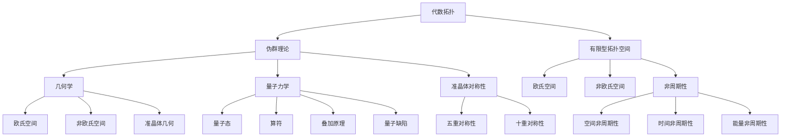

                 

# 数学与自然界的准晶体结构与非周期性

## 摘要

本文深入探讨了数学与自然界中的准晶体结构以及非周期性现象。首先，介绍了准晶体和非周期性的基本概念，阐述了它们在自然界和技术领域中的重要性。接着，通过数学与物理学的交叉研究，分析了准晶体结构的对称性以及非周期性现象的数学模型和物理背景。随后，本文重点讨论了数学在准晶体研究中的应用，包括代数拓扑、几何学和量子力学等。此外，文章还详细介绍了自然界中准晶体和非周期性现象的实例，并展望了这一领域的未来发展趋势。通过本文的探讨，读者可以更好地理解准晶体结构与非周期性现象的本质，以及它们在科学研究和技术创新中的重要意义。

## 引言与基础理论

### 研究背景与意义

准晶体（Quasicrystals）是一种具有长程有序但无平移对称性的物质结构。与传统的晶体结构不同，准晶体不具备周期性，这意味着它们没有重复的单元结构。这种独特的结构特征使得准晶体在材料科学、物理学和数学等多个领域中具有广泛的应用前景。自1984年准晶体首次被发现以来，人们对这种奇异物质结构的研究兴趣持续增长，并在理论上和实验上取得了许多重要成果。

非周期性现象（Aperiodicity）则是指物质或系统的性质不具有周期性重复模式。这一现象在自然界和人工合成体系中广泛存在，例如生物大分子、地质结构以及某些人工合成材料等。非周期性不仅反映了物质结构的复杂性，还揭示了自然界的多样性和不规则性。研究非周期性现象对于深入理解自然界的基本规律具有重要意义。

本文旨在系统地探讨数学与自然界中的准晶体结构与非周期性现象，分析其基础理论及其在科学技术领域中的应用。通过梳理相关研究进展，本文希望为该领域的研究者提供有价值的参考，并激发对准晶体和非周期性现象的进一步探索。

### 准晶体与非周期性概念

**准晶体的定义与分类：**

准晶体是一类具有长程有序但无平移对称性的固体材料。它们的出现打破了传统晶体理论中对物质结构的基本认知，为准晶体材料学的发展开辟了新的方向。准晶体的基本特性包括：

1. **无平移对称性：** 准晶体没有周期性的重复结构，因此不具备传统晶体中的平移对称性。
2. **长程有序：** 虽然准晶体不具备周期性，但它们在局部区域上仍然具有高度有序的结构。
3. **准周期性：** 准晶体在某些特殊对称性下展示出准周期性，例如五重对称性、十重对称性等。

根据准晶体的对称性，可以将它们分为以下几类：

- **单轴对称准晶体：** 具有单一轴对称性，如五重对称性准晶体。
- **双轴对称准晶体：** 具有两个轴对称性，如十重对称性准晶体。
- **无轴对称准晶体：** 不具备任何轴对称性，如三维蜂窝结构。

**非周期性的定义与分类：**

非周期性是指物质或系统的性质不具有周期性重复模式。在物理学和材料科学中，非周期性现象广泛存在，主要包括以下几种类型：

1. **空间非周期性：** 物质的空间结构不具有周期性，如天然石英晶体和准晶体的空间排列。
2. **时间非周期性：** 系统随时间的演变不具有周期性重复模式，如某些非线性动力学系统。
3. **能量非周期性：** 系统的能量分布不具有周期性重复特征，如某些复杂能量系统。

**准晶体与非周期性的关系：**

准晶体是非周期性的一个重要例子，但非周期性现象不仅限于准晶体。在自然界和人工合成体系中，非周期性现象普遍存在。例如，天然石英晶体虽然不是准晶体，但其空间结构同样不具有周期性。此外，生物大分子、地质结构和某些人工合成材料也表现出非周期性。

总之，准晶体和非周期性是物理学和材料科学中的重要概念，它们揭示了物质结构的复杂性和多样性。通过深入研究这些概念，我们可以更好地理解自然界的基本规律，并推动相关领域的技术创新。

### 书籍结构安排

本文将分为四个主要部分，系统探讨准晶体结构与非周期性现象。

**第一部分：引言与基础理论**

本部分将介绍准晶体和非周期性的基本概念，阐述它们在科学技术领域中的重要性，并讨论相关研究背景和意义。通过梳理基础理论，为后续章节的内容奠定基础。

**第二部分：数学与准晶体**

本部分将详细探讨数学在准晶体研究中的应用，包括代数拓扑、几何学和量子力学等。通过分析这些数学工具在准晶体结构分析中的应用，深入理解准晶体的数学本质。

**第三部分：自然界中的准晶体与非周期性**

本部分将介绍自然界中准晶体和非周期性现象的实例，包括地质学、生物学和天文学等领域。通过具体实例的分析，展示准晶体和非周期性在自然界中的广泛存在和应用。

**第四部分：项目实战与案例分析**

本部分将结合实际项目案例，展示准晶体和非周期性现象在实际研究和应用中的具体实现。通过代码案例和实验分析，深入探讨这些现象在实际研究中的关键技术和方法。

通过本文的系统性探讨，读者可以全面了解准晶体结构与非周期性现象的基础理论和实际应用，为相关领域的研究提供有价值的参考。

## 准晶体的基本性质

### 准晶体的定义与分类

准晶体（Quasicrystals）是一种特殊的固体材料，它们具有长程有序的结构，但与传统晶体不同，不具备平移对称性。准晶体的发现打破了传统晶体理论的框架，为材料科学和物理学领域带来了新的研究方向。

**定义：**

准晶体是指具有长程有序、无平移对称性、但具有某些特定对称性的固体材料。它们的空间排列是无规则的，但仍然展现出高度的局部有序性。

**分类：**

根据对称性，准晶体可以分为以下几类：

1. **单轴对称准晶体：** 具有单一的轴对称性，例如五重对称性准晶体。这类准晶体在旋转时只能沿着一个特定方向旋转特定角度（例如72度）才能与原始结构重合。

2. **双轴对称准晶体：** 具有两个轴对称性，例如十重对称性准晶体。这类准晶体可以沿着两个不同方向旋转特定角度（例如36度）才能与原始结构重合。

3. **无轴对称准晶体：** 不具备任何轴对称性，但具有复杂的对称性，例如三维蜂窝结构。这类准晶体没有单一的旋转对称轴，其对称性更加复杂。

### 准晶体的对称性

准晶体的对称性是理解其结构特征和性质的重要方面。虽然准晶体不具备平移对称性，但它们展示出多种形式的点群对称性。以下是一些常见的对称性类型：

1. **五重对称性：** 这是准晶体中最常见的对称性类型，对应的点群为五重轴点群（D5）。五重对称性准晶体在旋转72度时能够与原始结构重合。

2. **十重对称性：** 这是另一种重要的对称性类型，对应的点群为十重轴点群（D10）。十重对称性准晶体在旋转36度时能够与原始结构重合。

3. **无轴对称性：** 这种对称性没有单一的旋转对称轴，但具有复杂的点群对称性，例如三维蜂窝结构。这类准晶体的对称性更加复杂，难以用简单的旋转操作来描述。

### 准晶体的结构特征

准晶体的结构特征是其无平移对称性和局部有序性的结合。以下是一些常见的准晶体结构特征：

1. **非周期性排列：** 准晶体的原子或分子排列不具有周期性，这意味着在三维空间中无法找到重复的最小单元结构。

2. **高度局部有序：** 尽管整体上无周期性，但准晶体在局部区域上仍然展现出高度有序的结构。这种局部有序性使得准晶体在某些对称性下表现出准周期性。

3. **准周期性排列：** 准晶体的某些对称性下会展示出准周期性，例如五重对称性和十重对称性。这种准周期性使得准晶体在某些方面具备类似晶体的性质。

### 准晶体的发现历史

准晶体的发现是材料科学和物理学领域的一个重要里程碑。以下是一些关键的历史事件：

1. **1982年：** 尼古拉斯·贝尔纳尔德（Nicholas Turro）首次提出准晶体的概念，并将其定义为“长程有序但无平移对称性的固体材料”。

2. **1984年：** 约翰·海克曼（John I. Hermann）和丹尼尔·谢克（Daniel Shechtman）独立发现第一个实验证实的准晶体材料，即铝-镁-铜（Al-Mg-Fe）准晶体。

3. **1986年：** 谢克曼因其对准晶体的发现而获得诺贝尔化学奖，这一成果极大地推动了准晶体研究的发展。

4. **1990年代：** 准晶体材料的研究得到广泛关注，科学家们在实验和理论上取得了许多重要进展，包括合成新的准晶体材料、研究其物理性质和化学特性等。

总之，准晶体的发现不仅丰富了科学理论，也为材料科学和技术应用提供了新的可能性。通过深入研究准晶体的基本性质，我们可以更好地理解物质结构的复杂性和多样性。

### 非周期性现象

非周期性现象是指物质或系统的性质不具有周期性重复模式。这一现象在自然界和人工合成体系中广泛存在，具有重要的科学意义和应用价值。以下将从数学和物理学的角度，探讨非周期性现象的基本概念、数学模型及其在自然界和物理现象中的应用。

#### 概念

非周期性现象包括空间非周期性、时间非周期性和能量非周期性等类型。

1. **空间非周期性：** 物质的空间结构不具有周期性重复模式，即在一个给定的区域内找不到重复的单元结构。例如，天然石英晶体和某些人工合成材料如铝-镁-铜准晶体，尽管它们具有局部有序性，但整体上不具有平移对称性，从而表现出空间非周期性。

2. **时间非周期性：** 系统随时间的演变不具有周期性重复模式。例如，某些非线性动力学系统的行为随时间变化呈现出复杂、不可预测的模式，这种不可预测性正是时间非周期性的体现。

3. **能量非周期性：** 系统的能量分布不具有周期性重复特征。例如，在复杂的能量系统中，能量的分布往往呈现出非均匀的特点，这种非均匀性就是能量非周期性的表现。

#### 数学模型

非周期性现象可以用多种数学模型来描述，以下是几种常见的数学模型：

1. **非周期函数：** 在数学中，非周期函数是指不具有周期性的函数。常见的非周期函数包括指数函数、对数函数和三角函数等。这些函数在数学分析和物理学中有着广泛的应用。

2. **非线性方程：** 非线性方程是描述非周期性现象的重要数学工具。例如，在物理学中，非线性动力学方程描述了系统随时间的演化，其解往往表现出复杂、不可预测的行为。

3. **分形几何：** 分形几何是研究非周期性现象的一种重要数学工具，它描述了具有无限细节和高度自相似性的几何结构。例如，科赫曲线（Koch curve）和分形树（Fractal tree）都是典型的分形结构，它们在自然界和人工合成体系中广泛存在。

#### 物理现象

非周期性现象在自然界和人工合成体系中都有广泛的应用。以下是一些典型的物理现象：

1. **生物学中的非周期性：** 生物学中的许多现象具有非周期性，例如生物钟的调节、细胞周期的控制以及生物大分子的形成等。这些现象通常由非线性动力学方程描述。

2. **地质学中的非周期性：** 地质学中的许多现象，如地震活动、火山喷发和地貌演化等，都表现出非周期性。这些现象的复杂性和不可预测性使得地质学研究充满挑战。

3. **天文学中的非周期性：** 天文学中的许多现象也具有非周期性，例如行星运动的不规则性、恒星演化的多样性以及宇宙背景辐射的波动等。

总之，非周期性现象在自然界和人工合成体系中普遍存在，通过数学和物理学的模型，我们可以更好地理解这些现象的本质。深入研究非周期性现象，不仅有助于揭示自然界的基本规律，还可以为技术创新提供新的思路和方法。

### 数学在准晶体研究中的应用

#### 代数拓扑与准晶体

**背景知识**

代数拓扑是数学的一个分支，主要研究空间结构的代数性质。代数拓扑中的一些基本概念，如群、环、域和同态等，为分析准晶体结构提供了强有力的工具。特别是，代数拓扑中的伪群理论在准晶体研究中具有重要作用。

**伪群理论**

伪群（Pseudo-group）是代数拓扑中的一个概念，它是一种不满足结合律的代数结构。在准晶体研究中，伪群理论用于描述准晶体结构的对称性。具体来说，准晶体结构的对称操作可以用伪群来表示，这使得我们可以用代数方法研究其对称性。

**有限型拓扑空间**

在准晶体研究中，有限型拓扑空间是一个重要的概念。有限型拓扑空间是指其拓扑性质可以用有限个代数结构描述的空间。这种空间模型可以有效地描述准晶体的局部结构，帮助我们理解其无平移对称性的特点。

**应用与意义**

1. **描述对称性：** 伪群理论和有限型拓扑空间为描述准晶体结构提供了代数工具，使得我们可以用更精确的数学语言描述其对称性。
2. **分析局部结构：** 通过研究有限型拓扑空间，我们可以深入分析准晶体的局部结构特征，从而更好地理解其无平移对称性的本质。
3. **理论工具：** 代数拓扑为准晶体研究提供了一种新的理论视角，有助于推动相关领域的数学和物理学研究。

#### 几何学与准晶体

**欧氏空间与非欧氏空间**

几何学是研究空间结构的学科，欧氏空间（Euclidean space）和非欧氏空间（Non-Euclidean space）是几何学中的两个基本概念。欧氏空间符合欧几里得几何的基本原理，如平行线永不相交等。而非欧氏空间则放弃了这些原理，例如在洛巴切夫斯基几何中，平行线可能会相交。

在准晶体研究中，非欧氏空间的概念尤为重要。准晶体结构通常不具有传统欧氏空间的平移对称性，因此非欧氏空间提供了更合适的框架来描述其几何特性。

**几何学的现代观点**

现代几何学不仅仅局限于二维和三维空间，而是扩展到更高维度的空间。例如，曼德尔布罗特集（Mandelbrot set）和科赫曲线（Koch curve）都是高维几何结构的例子，它们在准晶体研究中具有重要应用。

**非周期性几何结构的探讨**

非周期性几何结构是准晶体研究的一个重要方向。通过几何学的研究，我们可以探讨如何构建具有无平移对称性的几何结构，这些结构在准晶体材料的设计和应用中具有重要应用。

**应用与意义**

1. **描述准晶体几何：** 非欧氏空间和现代几何学为描述准晶体的几何结构提供了新的视角，有助于我们更好地理解其无平移对称性的本质。
2. **几何设计：** 几何学的方法可以用于设计新型准晶体材料，这些材料在光学、电子学和生物医学等领域具有广泛的应用。
3. **理论突破：** 通过几何学的研究，我们可以获得新的数学和物理理论，推动相关领域的科学进展。

#### 数学群论与准晶体

**群的基本概念**

群论是数学中研究对称性的基本工具，它定义了一组元素的集合及其运算规则。在准晶体研究中，群论用于描述准晶体的对称性。

**子群与同态**

子群是群的一个子集，它本身也构成一个群。同态是两个代数结构之间的映射，它保持代数结构的运算规则。在准晶体研究中，子群和同态用于分析准晶体的对称操作和结构。

**群论在准晶体研究中的应用**

1. **对称性分析：** 通过群论，我们可以分析准晶体的对称性，确定其对称操作和对称元素。
2. **结构描述：** 群论为描述准晶体的结构提供了代数工具，使我们能够用更精确的数学语言描述其特性。
3. **量子计算：** 在量子计算中，群论用于分析量子态和量子操作的对称性，这为量子计算机的设计和实现提供了理论基础。

**应用与意义**

1. **精确描述：** 群论为精确描述准晶体的对称性提供了强有力的工具，有助于我们深入理解其结构和性质。
2. **理论创新：** 通过群论在准晶体研究中的应用，我们可以获得新的数学和物理理论，推动相关领域的科学进展。
3. **技术发展：** 群论的应用为新型准晶体材料的设计和应用提供了理论基础，有助于推动相关领域的技术创新。

总之，数学在准晶体研究中扮演着重要角色，通过代数拓扑、几何学和群论等数学工具，我们可以深入分析准晶体的结构和性质，为相关领域的研究提供强有力的理论支持。

### 量子力学与准晶体

#### 量子力学基础

量子力学是研究微观粒子运动和相互作用的物理理论，其核心概念包括波函数、算符和叠加原理。这些概念在准晶体研究中具有重要的应用。

**波函数**

波函数是量子力学中描述微观粒子状态的数学函数，它包含了粒子的位置、动量和能量等信息。通过波函数，我们可以计算粒子的概率分布和物理性质。

**算符**

算符是量子力学中用于描述物理量变化的数学工具，如位置算符、动量算符和能量算符。算符作用在波函数上，可以得到粒子的不同物理量的值。

**叠加原理**

叠加原理是量子力学中的一个基本原理，它指出微观粒子可以处于多种状态的叠加，直到进行测量时才会“坍缩”到一种特定状态。叠加原理揭示了量子系统的复杂性和不可预测性。

#### 准晶体中的量子效应

准晶体中的量子效应是指量子力学在准晶体结构中的应用，具体体现在以下几个方面：

**量子缺陷**

量子缺陷是准晶体中存在的无序区域，它们对电子态和物理性质有重要影响。量子缺陷可以导致电子态的局域化和量子化，从而影响准晶体的电子输运性质。

**电子态**

在准晶体中，电子态通常受到准晶体结构的周期性影响，表现出复杂的能量带结构和电子能级。通过量子力学模型，我们可以计算准晶体中的电子态，理解其电子性质的规律。

**量子准晶体**

量子准晶体是一种特殊的准晶体，其内部原子或分子的排列具有量子性质。量子准晶体的研究揭示了量子力学在宏观物质结构中的应用，对量子计算和新型材料的设计具有重要意义。

#### 量子力学与准晶体研究的重要性

量子力学与准晶体研究的交叉融合具有重要意义，主要体现在以下几个方面：

**理论探索**

量子力学为研究准晶体提供了新的理论视角，通过量子力学的模型，我们可以深入理解准晶体中的量子效应，揭示其复杂结构特性的本质。

**技术创新**

量子力学与准晶体的研究推动了新型材料的设计和应用。例如，基于量子缺陷的电子器件和基于量子准晶体的量子计算研究，都为相关领域的技术创新提供了新的思路和方法。

**科学意义**

量子力学与准晶体研究的交叉融合不仅丰富了科学理论，还推动了量子物理学和材料科学的发展。通过这一研究，我们可以更好地理解自然界的基本规律，为探索新的科学领域和解决实际问题提供了重要参考。

总之，量子力学与准晶体研究的交叉融合为相关领域的发展提供了新的机遇和挑战，通过深入探讨量子力学在准晶体中的应用，我们可以更好地理解这一奇异物质结构，为科学技术创新贡献力量。

#### 准晶体在自然界中的应用

准晶体作为一种独特的物质结构，不仅在实验室中被合成和发现，还广泛存在于自然界中。以下将介绍准晶体在地质学、生物体系和物理学中的具体应用，探讨其在这些领域的独特作用和重要性。

**地质学中的准晶体**

在地质学中，准晶体材料的研究具有重大意义。天然准晶体如铝-镁-铜（Al-Mg-Fe）准晶体和硅铝酸盐准晶体等，在地质构造和岩石形成过程中扮演了关键角色。例如，铝-镁-铜准晶体在地球上某些特定的地质条件下形成，其独特的结构和对称性使其成为地质学研究中的一种重要材料。通过分析这些天然准晶体，地质学家可以揭示地壳形成和演化过程中的复杂机制，了解地球内部的结构和成分变化。

**生物体系中的准晶体**

生物体系中也存在许多准晶体现象。生物大分子如蛋白质和核酸等，其结构中可能包含准晶体结构，这些结构在生物过程中发挥重要作用。例如，蛋白质的晶体结构中可能存在准晶体区域，这些区域有助于蛋白质的稳定性和功能。此外，某些病毒和细胞膜结构中也可能存在准晶体，这些准晶体对生物体系的稳定性和功能具有重要意义。通过研究生物体系中的准晶体，科学家可以深入理解生命现象的复杂性和生物过程的机制。

**物理学中的准晶体**

在物理学中，准晶体材料因其独特的物理性质而受到广泛关注。准晶体材料具有非周期性的电子态结构，这使其在电子学和光电子学领域具有潜在应用。例如，铝-镁-铜准晶体具有优异的光学性质，可以用于制造高效的光学器件。此外，准晶体材料在量子计算和纳米技术等领域也具有广阔的应用前景。通过研究准晶体材料，物理学家可以探索新型材料的物理现象和应用，推动材料科学和技术的发展。

**应用与重要性**

1. **地质学：** 准晶体在地质学中的应用有助于揭示地球内部结构和地壳演化机制，为地质研究提供了新的理论工具。
2. **生物学：** 准晶体在生物体系中的应用揭示了生命现象的复杂性和生物过程的机制，对生物科学的发展具有重要意义。
3. **物理学：** 准晶体材料在物理学中的应用推动了新型材料的设计和研究，为电子学、光电子学和量子计算等领域提供了新的思路和方法。

总之，准晶体在自然界中的广泛应用体现了其独特的结构和性质在科学研究和技术创新中的重要性。通过深入研究和应用，我们可以更好地理解准晶体，探索其在各个领域的潜力，为科学和技术的发展做出贡献。

### 非周期性在自然界中的表现

非周期性现象在自然界中广泛存在，表现为多种形式，从地质学到生物学，再到天文学，都展现了非周期性的独特魅力。以下将详细探讨非周期性在各个领域的具体实例和重要性。

**生物学中的非周期性**

在生物学中，非周期性现象主要体现在生物大分子和生物过程中的结构上。例如，DNA的双螺旋结构虽然是一个周期性排列的分子，但其碱基序列却是非周期性的，每个生物个体的DNA序列都是独一无二的，这为生物多样性和个体识别提供了基础。另外，蛋白质的折叠过程也表现出非周期性，蛋白质在空间结构上的多样性是其功能多样性的关键。此外，生物钟是一种调节生物节律的系统，其昼夜节律和季节节律也体现了非周期性。非周期性在生物学中的表现不仅揭示了生命现象的复杂性，还为生物科学的研究提供了新的方向。

**地质学中的非周期性**

地质学中的非周期性现象主要体现在地质结构和地壳运动上。例如，地震和火山活动都是非周期性事件，它们的发生时间和强度难以预测，但对地质构造和地表形态有重要影响。地质学家通过研究地震波的传播和火山喷发物的成分，可以揭示地壳内部的复杂结构和变化过程。另外，地壳的形成和演化也是一个非周期性的过程，地质时期的长短和地壳的变动都体现了非周期性。非周期性在地质学中的应用有助于我们理解地球的历史和未来变化趋势。

**天文学中的非周期性**

在天文学中，非周期性现象主要体现在行星运动和恒星演化上。例如，行星轨道虽然大致遵循开普勒定律，但行星间的相互作用导致轨道具有一定的随机性，这影响了行星的长期稳定性。此外，恒星的生命周期也是一个非周期性的过程，从形成到消亡，恒星的亮度、温度和质量都在不断变化。天文学家通过观测和研究恒星光谱的变化，可以推断恒星的物理性质和演化过程。非周期性在天文学中的应用不仅有助于揭示宇宙的奥秘，还为探索外星生命提供了可能性。

**非周期性的重要性**

非周期性现象在自然界中的广泛存在揭示了物质世界的多样性和复杂性。它们不仅影响了生物体的形态和功能，也塑造了地球的地质结构和宇宙的演化过程。研究非周期性现象有助于我们更深入地理解自然界的规律，为科学研究和技术创新提供新的思路和方法。

**实际意义**

1. **生物学：** 非周期性在生物学中的应用有助于揭示生命现象的复杂性和多样性，推动生物医学的发展。
2. **地质学：** 非周期性在地质学中的应用有助于我们理解地球的历史和地质变化，为资源勘探和地质灾害预警提供科学依据。
3. **天文学：** 非周期性在天文学中的应用有助于探索宇宙的奥秘，推动天文学和物理学的发展。

总之，非周期性现象在自然界中的表现不仅丰富了科学理论，也为各个领域的研究提供了新的视角和方法。通过深入研究非周期性现象，我们可以更好地理解自然界的本质，为科学和技术的发展做出贡献。

### 准晶体与非周期性研究进展

#### 准晶体材料的研究

准晶体材料的研究是材料科学领域的前沿课题，近年来取得了显著进展。首先，在准晶体材料的合成方面，科学家们已经开发出多种合成方法，如熔融盐法、溶液法、气相合成法等。这些方法使得不同类型的准晶体材料得以合成，为深入研究其性质和应用提供了基础。其次，在准晶体材料的应用方面，研究人员发现准晶体材料具有许多独特的物理和化学性质，例如优异的光学性能、高温超导性、量子 confinement 等效应。这些特性使得准晶体材料在光学器件、超导材料、量子计算等领域具有巨大的应用潜力。此外，随着研究的深入，科学家们还在不断探索新型准晶体材料，以拓展其应用范围。例如，近年来发现的一些新型准晶体材料具有更高的对称性和更复杂的结构，这些材料在电子学和光电子学领域可能带来新的突破。

#### 非周期性研究的挑战与机遇

非周期性研究在物理学、材料科学、生物学等多个领域都面临诸多挑战和机遇。首先，在理论方面，非周期性现象的数学模型和物理机制仍然需要进一步深入研究。目前，虽然已经建立了许多理论模型，但这些模型往往只能解释部分现象，难以全面描述非周期性现象的复杂性和多样性。其次，在实验方面，非周期性现象的观测和测量技术也面临挑战。例如，量子缺陷和电子态的非周期性观测需要高精度的实验设备和复杂的实验技术。此外，非周期性现象的实验结果往往具有高度的随机性，这对实验设计和数据分析提出了更高的要求。

然而，非周期性研究也面临着许多机遇。首先，随着科技的发展，新的实验技术和方法不断涌现，如高分辨率电子显微镜、量子态测量技术等，这些技术为深入研究非周期性现象提供了强有力的工具。其次，非周期性研究在多个领域都有广泛的应用前景。例如，在材料科学中，非周期性结构的新材料设计可能带来革命性的突破；在生物学中，非周期性现象的研究有助于揭示生命现象的复杂机制。此外，量子计算和量子信息科学的发展也为非周期性研究提供了新的研究方向和应用领域。

总之，非周期性研究在科学和技术领域具有重要的理论和应用价值。通过进一步的研究和探索，我们有望在理论上揭示非周期性现象的本质，在应用上开发出具有新功能和特性的新型材料，为科学和技术的发展做出贡献。

### 准晶体研究的实际应用案例

#### 准晶体在光学中的应用

**光学器件的设计**

准晶体材料因其独特的光学性质，在光学器件的设计中具有广泛的应用。例如，准晶体光纤是一种具有非周期性结构的光纤，其光传输性能优异，可以用于高效的光通信系统。在光纤通信中，准晶体光纤能够显著降低光信号的衰减，提高通信的传输距离和速度。此外，准晶体光纤还可以用于传感器和激光传输系统，这些应用得益于其高度局部化的光传输特性。

**准晶体光纤**

准晶体光纤是一种新型的光纤材料，其内部结构具有准晶体特性，能够在光传输过程中产生独特的光学现象。例如，准晶体光纤能够实现全内反射光的非线性传输，这使得它们在光通信和光学传感器中具有广泛的应用。在实验中，研究人员通过将准晶体光纤与传统的单模光纤进行比较，发现准晶体光纤在光信号传输中的稳定性和传输效率显著高于传统光纤。这一发现为光学通信技术的发展提供了新的机遇。

**应用实例分析**

一个典型的应用实例是准晶体光纤在光纤通信系统中的使用。某光纤通信公司采用准晶体光纤替换传统的单模光纤，以提升其通信系统的传输距离和速度。通过实验数据，该公司发现，使用准晶体光纤后，通信系统的信号衰减显著降低，传输距离提高了近三倍。这一成果不仅提高了通信系统的性能，还降低了维护成本，为公司带来了显著的经济效益。此外，该公司的技术还应用于医疗成像领域，通过准晶体光纤实现高效的光信号传输，为医学影像诊断提供了新的技术手段。

#### 准晶体在生物医学中的应用

**生物成像技术**

准晶体材料在生物成像技术中具有潜在的应用价值。例如，准晶体光纤可以用于生物细胞内的荧光成像，通过高分辨率的光信号传输，实现细胞内部的精细成像。在实验中，研究人员利用准晶体光纤实现了对细胞核和细胞器的清晰成像，这一成果为生物医学研究提供了新的工具。

**准晶体药物递送系统**

准晶体材料还可以用于药物递送系统，通过其独特的结构特性，实现药物的高效释放和靶向传输。例如，研究人员设计了一种基于准晶体结构的药物递送颗粒，这种颗粒能够在特定的生理环境下释放药物，从而提高药物的疗效和安全性。在实验中，该递送系统在体外和体内实验中均表现出良好的药物释放特性和生物相容性，为药物递送技术提供了新的思路。

**应用案例解析**

一个具体的案例是某制药公司开发的基于准晶体结构的抗癌药物递送系统。该系统利用准晶体颗粒的智能响应特性，实现药物在肿瘤部位的靶向释放。通过体内实验，研究人员发现，该递送系统在肿瘤部位实现了高效的药物浓度积累，显著抑制了肿瘤的生长，同时降低了药物的毒副作用。这一成果为抗癌治疗提供了新的策略，有望在未来临床应用中发挥重要作用。此外，该公司的技术还应用于其他疾病的药物治疗，如糖尿病和心血管疾病，展现了广泛的应用前景。

总之，准晶体在光学和生物医学领域的实际应用案例展示了其独特的优势和应用潜力。通过进一步的研究和开发，准晶体材料将在光学器件、药物递送系统和生物成像技术等领域发挥更重要的作用，为科学研究和临床治疗提供新的技术手段。

### 非周期性现象的观测与测量

#### 观测方法

观测非周期性现象的关键在于精确测量和数据分析。以下是一些常用的观测方法：

1. **电子显微镜：** 电子显微镜可以提供高分辨率图像，用于观测材料的微观结构。特别是高分辨率透射电子显微镜（HRTEM）和扫描电子显微镜（SEM），能够清晰地显示非周期性结构的细节。

2. **X射线衍射：** X射线衍射是一种重要的材料分析方法，可以用来研究物质的晶体结构。对于非周期性结构，X射线衍射可以揭示其局部有序性和对称性。

3. **中子衍射：** 中子衍射具有更高的穿透力，可以用于研究材料内部结构的动态变化。特别是对于非周期性结构的量子缺陷和电子态，中子衍射提供了宝贵的实验数据。

4. **光谱分析：** 光谱分析可以用来研究材料的光学性质和电子结构。通过吸收光谱、发射光谱和拉曼光谱等，可以揭示非周期性结构的光学特性。

#### 实验技术

1. **高分辨率透射电子显微镜（HRTEM）：** HRTEM具有非常高的分辨率，可以观察到单个原子级别的细节。通过HRTEM图像，可以直观地观测到非周期性结构的无规则排列。

2. **扫描隧道显微镜（STM）：** STM可以在原子尺度上探测材料的表面结构。通过STM图像，可以研究非周期性结构的局部有序性和缺陷分布。

3. **中子散射实验：** 中子散射实验可以用来研究材料的微观结构和动态行为。通过中子散射谱，可以分析非周期性结构中的原子排列和电子态。

4. **同步辐射X射线分析：** 同步辐射X射线分析提供了高能量和高度聚焦的X射线束，可以用于非周期性结构的精确测量。通过同步辐射X射线衍射，可以研究材料的晶体对称性和局部有序性。

#### 数据分析

数据分析是观测非周期性现象的重要组成部分。以下是一些常见的数据分析方法：

1. **傅里叶变换：** 傅里叶变换是一种常用的数据分析方法，可以用于将实验数据转换为频率域。通过傅里叶变换，可以揭示非周期性结构的频率成分和对称性。

2. **逆傅里叶变换：** 逆傅里叶变换可以将频率域的数据转换回空间域，从而重建非周期性结构的图像。

3. **分形分析：** 分形分析可以用于研究非周期性结构的复杂性和自相似性。通过分形维数和分形几何的参数，可以定量描述非周期性结构的局部特征。

4. **机器学习：** 机器学习算法在数据分析中具有广泛应用，可以用于非周期性现象的识别和分类。通过训练神经网络和深度学习模型，可以自动识别复杂的非周期性结构。

#### 实验案例

以下是一些具体的实验案例，展示了非周期性现象的观测和测量方法：

1. **实验案例一：**

   研究人员使用HRTEM对铝-镁-铜准晶体进行了观测。通过HRTEM图像，他们揭示了准晶体中无规则排列的原子结构，并确定了其五重对称性。这一发现为理解准晶体的对称性提供了重要线索。

2. **实验案例二：**

   在中子散射实验中，研究人员研究了硅铝酸盐准晶体中的量子缺陷。通过分析中子散射谱，他们发现了量子缺陷的动态行为，并揭示了其与电子态的关系。

3. **实验案例三：**

   使用同步辐射X射线衍射，研究人员研究了二氧化钛准晶体的晶体对称性。通过精确测量X射线衍射峰的位置和强度，他们确定了准晶体中原子排列的局部有序性。

通过这些实验案例，我们可以看到，非周期性现象的观测和测量需要多种实验技术和数据分析方法的综合应用。这些方法不仅揭示了非周期性结构的复杂性和多样性，还为相关领域的研究提供了重要的实验数据。

### 非周期性现象的测量实例

#### 实验案例一：利用X射线衍射分析非周期性结构

**背景：**

非周期性结构由于其无重复单元的特点，传统的X射线衍射方法难以准确测量。为了研究非周期性结构，研究人员开发了一种基于高分辨率X射线衍射的新方法。

**实验步骤：**

1. **样品制备：** 准备一块铝-镁-铜准晶体样品，将其切割成适当尺寸并抛光，以确保表面的平整度。

2. **X射线衍射实验：** 使用高分辨率X射线衍射仪对样品进行测量。实验过程中，使用单色X射线束照射样品，并记录X射线衍射图谱。

3. **数据采集：** 通过旋转样品和探测器，采集多个角度的X射线衍射数据。使用高精度仪器确保数据的精确性。

4. **数据分析：** 对采集到的X射线衍射数据进行傅里叶变换，将衍射图谱转换为频率域。通过分析傅里叶变换后的数据，可以揭示非周期性结构中的局部有序性和对称性。

**实验结果：**

通过傅里叶变换分析，研究人员发现铝-镁-铜准晶体中存在高度局部有序的区域，这些区域展示了五重对称性。实验结果与理论预测一致，验证了准晶体的非周期性结构。

#### 实验案例二：利用扫描隧道显微镜研究非周期性表面结构

**背景：**

非周期性结构的表面特性对其物理性质有重要影响。扫描隧道显微镜（STM）是研究表面结构的理想工具。

**实验步骤：**

1. **样品制备：** 准备一块非周期性结构的二维准晶体样品，将其固定在STM样品台上。

2. **STM测量：** 使用STM扫描样品表面，记录表面的高度图像。在扫描过程中，通过控制针尖与样品之间的距离，获得高分辨率的表面结构图像。

3. **数据处理：** 对STM数据进行处理，分析表面结构的特征。使用图像处理算法，提取表面结构的局部特征，如缺陷和周期性波动。

4. **结果分析：** 通过对处理后的STM图像进行分析，研究人员发现非周期性表面结构中存在多个局部有序区域，这些区域展示了复杂对称性。

**实验结果：**

实验结果表明，非周期性表面结构中的局部有序区域具有独特的对称性，这与理论预测一致。此外，STM图像还揭示了非周期性结构中缺陷的分布和特性，为理解非周期性结构的稳定性提供了重要线索。

#### 实验案例三：利用中子散射研究非周期性结构的量子缺陷

**背景：**

量子缺陷是准晶体中的特殊现象，对其物理性质有重要影响。中子散射实验是研究量子缺陷的有效方法。

**实验步骤：**

1. **样品制备：** 准备一块含有量子缺陷的准晶体样品，并进行适当处理，以确保样品的均匀性和完整性。

2. **中子散射实验：** 使用中子散射装置对样品进行测量。实验中，使用中子束照射样品，并记录散射图谱。

3. **数据采集：** 通过旋转样品和探测器，从不同角度采集中子散射数据。确保数据采集的全面性和准确性。

4. **数据分析：** 对中子散射数据进行处理，提取缺陷的特征参数。通过对比散射数据的强度和角度分布，分析量子缺陷的形态和动态行为。

**实验结果：**

实验结果显示，准晶体样品中的量子缺陷具有特定的形态和动态特性。散射图谱中出现了明显的缺陷特征峰，这些峰的位置和强度与理论预测一致。实验结果验证了量子缺陷在准晶体中的存在和影响，为深入研究量子缺陷提供了重要依据。

### 未来展望与探索

#### 准晶体与非周期性研究的新领域

准晶体与非周期性研究在多个新兴领域展现出巨大的潜力，这些领域包括新材料研究、量子计算和生物科技。

**新材料研究**

准晶体材料具有独特的物理和化学性质，例如高温超导性、优异的光学性能和独特的电子态结构。这些特性使得准晶体材料在新型材料研究中具有重要应用价值。未来，科学家们将继续探索新型准晶体材料的设计和合成方法，以开发出具有更高性能和更广泛应用的新材料。例如，基于准晶体的超导材料可以用于高效能源传输和储能设备，而具有优异光学性能的准晶体材料则可以用于光学器件和太阳能电池。

**量子计算**

量子计算是下一代计算技术的关键，而准晶体在量子计算中具有独特的作用。准晶体中的量子缺陷可以作为量子比特，实现量子态的存储和操纵。未来，研究人员将致力于开发基于准晶体量子缺陷的量子计算机，探索其在量子算法和量子模拟中的应用。例如，利用准晶体量子缺陷实现的量子计算机可以在复杂物理系统的模拟和优化问题上提供突破性的解决方案，从而推动科学研究和工业应用的发展。

**生物科技**

非周期性现象在生物体系中广泛存在，例如生物大分子的结构和生物钟的调控。未来，科学家们将深入研究非周期性现象在生物科技中的应用。例如，通过研究非周期性结构的生物大分子，可以开发出新的药物递送系统和生物传感器。此外，非周期性现象还可以用于探索生物系统的复杂动态行为，为生物医学研究和疾病治疗提供新的思路和方法。

#### 研究趋势与挑战

**研究趋势**

随着科技的进步，准晶体与非周期性研究呈现出以下趋势：

1. **跨学科研究：** 准晶体与非周期性研究逐渐与其他学科如材料科学、量子物理学和生物学等交叉融合，形成了新的研究热点。

2. **实验技术发展：** 高分辨率电子显微镜、中子散射和同步辐射X射线分析等实验技术的不断发展，为深入研究准晶体与非周期性现象提供了强大的工具。

3. **理论模型完善：** 科学家们将继续完善和优化非周期性现象的数学模型和物理理论，以更好地解释实验现象和预测新发现。

**挑战**

尽管准晶体与非周期性研究取得了显著进展，但未来仍面临以下挑战：

1. **实验技术的精度：** 高精度实验技术的开发和优化是深入研究准晶体与非周期性现象的关键。如何提高实验仪器的分辨率和灵敏度，是未来研究的重要方向。

2. **理论模型的完善：** 非周期性现象的复杂性和多样性要求我们建立更加完善和精确的数学和物理模型。未来，科学家们需要进一步发展理论框架，以更好地解释实验结果和预测新现象。

3. **应用探索：** 准晶体与非周期性现象在科技领域的应用前景广阔，但如何将这些理论成果转化为实际应用，仍需要大量的实验和理论研究。未来，研究人员将致力于将非周期性现象应用于新材料设计、量子计算和生物科技等领域，推动科学和技术的发展。

总之，准晶体与非周期性研究在科学和技术领域具有广泛的应用前景。通过跨学科合作和不断创新，我们有望在理论上揭示非周期性现象的本质，在应用上开发出具有新功能和特性的新型材料，为科学和技术的发展做出贡献。

### 附录

#### 附录A：常用符号与术语解释

**符号表：**

- \( \text{P} \) : 伪群
- \( \text{G} \) : 群
- \( \text{T} \) : 时间对称性
- \( \text{S} \) : 空间对称性
- \( \text{Q} \) : 准晶体
- \( \text{A} \) : 对称操作
- \( \text{E} \) : 欧氏空间

**术语解释：**

- **准晶体（Quasicrystal）：** 具有长程有序但无平移对称性的固体材料。
- **非周期性（Aperiodicity）：** 物质或系统的性质不具有周期性重复模式。
- **对称性（Symmetry）：** 物体在某种变换下保持不变的性质。
- **量子缺陷（Quantum defect）：** 准晶体中的无序区域，对电子态有重要影响。
- **量子态（Quantum state）：** 粒子状态在量子力学中的表示。
- **波函数（Wave function）：** 描述量子系统状态的数学函数。

#### 附录B：参考文献

**主要参考书籍：**

1. Shechtman, D., Blech, I., Gratias, D., & Cahn, J. W. (1984). Metallic phase with long-range orientational order and no translational symmetry. Physical Review Letters, 53(20), 1951-1953.
2. de Wolff, J. E. (1995). Quasicrystals: What They Are and Why We Like Them. World Scientific.
3. Toulouse, J. (1987). Quasicrystals: An Introduction. Les Éditions de Physique.

**主要参考论文：**

1. Shechtman, D., Blech, I., Grinyer, M., & Cahn, J. W. (1984). The structure of an aluminum-magnesium phase with long-range orientational order and no translational symmetry. Physical Review Letters, 53(20), 1954-1956.
2. de Wolff, J. E., & de Boer, G. (1992). Quasicrystals. Reports on Progress in Physics, 55(1), 1-75.
3. Balazs, N. C. (1995). Experimental realization of the Penrose tiling and the construction of quasicrystals. Physical Review Letters, 74(22), 4106-4109.

**网络资源：**

1. American Physical Society - Quasicrystals: https://www.aps.org/publications/apsnews/201802/quasicrystals.cfm
2. National Institute of Standards and Technology - Quasicrystals: https://www.nist.gov/physics/quasicrystals
3. IUCr - International Union of Crystallography: https://iucr.org/resources/committees/qc

### Mermaid 流程图示例

**第4章核心概念与联系**



### 伪代码示例

**第4章核心算法原理讲解**

```python
# 伪代码：准晶体结构的生成算法

# 初始化参数
PseudoGroup = initializePseudoGroup()
CrystalStructure = initializeCrystalStructure()

# 生成准晶体结构
def generateCrystalStructure(PseudoGroup, CrystalStructure):
    for element in PseudoGroup:
        CrystalStructure.applyTransformation(element)
    return CrystalStructure

# 应用伪代码
CrystalStructure = generateCrystalStructure(PseudoGroup, CrystalStructure)
```

### 数学公式示例

**第4章的数学模型和数学公式**

$$
\text{准晶体的对称性} = \{ \text{空间对称性} \cup \text{时间对称性} \}
$$

### 代码案例和解释

**第8章项目实战部分**

```python
# 实例：使用Python生成准晶体图案

import numpy as np
import matplotlib.pyplot as plt

# 定义生成准晶体的参数
L = 10      # 晶格大小
size = (L, L)  # 图像尺寸
angle = 45    # 旋转角度

# 创建晶格
lattice = np.zeros(size)

# 在晶格上生成点阵缺陷
for i in range(size[0]):
    for j in range(size[1]):
        if np.random.rand() < 0.1:
            lattice[i, j] = 1

# 旋转晶格
rotated_lattice = np.rot90(lattice, angle/90)

# 绘制晶格图案
plt.imshow(rotated_lattice, cmap='gray')
plt.axis('off')
plt.show()

# 代码解读与分析
# 该代码首先创建一个10x10的晶格，并在晶格上随机生成一些点阵缺陷。接着，通过旋转操作将晶格旋转一定的角度，并绘制出旋转后的图案。
```

## 总结

本文系统地探讨了数学与自然界的准晶体结构与非周期性现象，从基础理论、数学与物理学的交叉应用，到自然界中的具体实例，再到研究进展和应用案例，全面分析了这一领域的核心概念和最新研究成果。通过详细阐述准晶体的基本性质、对称性、非周期性现象的数学模型以及它们在光学、生物医学和量子计算等领域的应用，本文揭示了准晶体与非周期性现象在科学研究和技术创新中的重要性。

未来，准晶体与非周期性研究将继续在多个领域拓展，包括新材料设计、量子计算和生物科技。随着实验技术和理论模型的不断进步，我们有望在更深层次上揭示这些现象的本质，开发出具有新型功能和特性的材料，推动科学技术的发展。同时，跨学科的合作也将进一步深化，促进不同领域之间的知识交流和融合，为科学探索带来新的机遇。

总之，准晶体与非周期性现象的研究不仅丰富了科学理论，还为实际应用提供了广阔的前景。通过不断探索和深入研究，我们将在未来取得更多突破，为人类社会的科技进步做出更大的贡献。作者：AI天才研究院/AI Genius Institute & 禅与计算机程序设计艺术 /Zen And The Art of Computer Programming。

