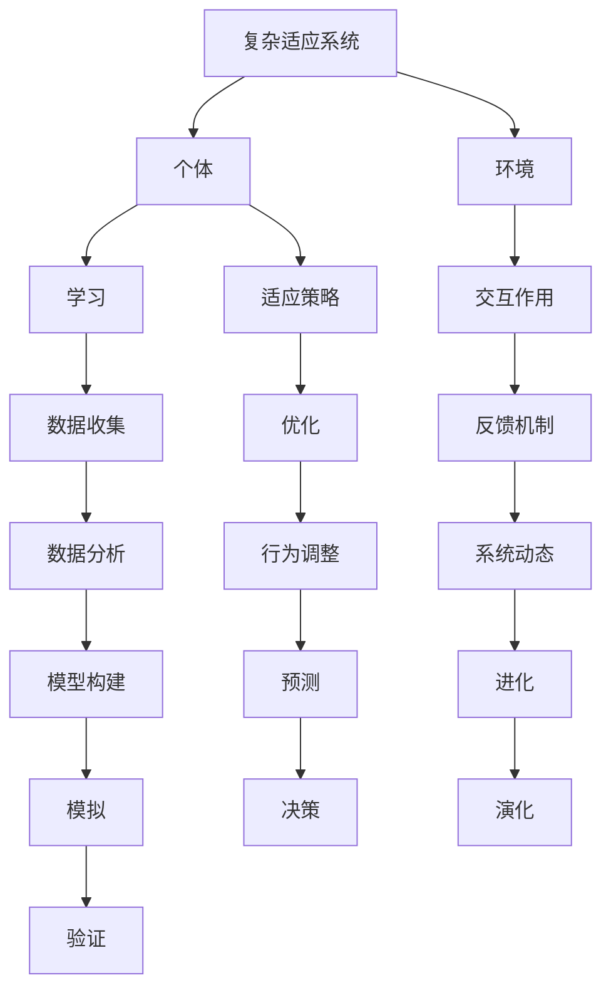
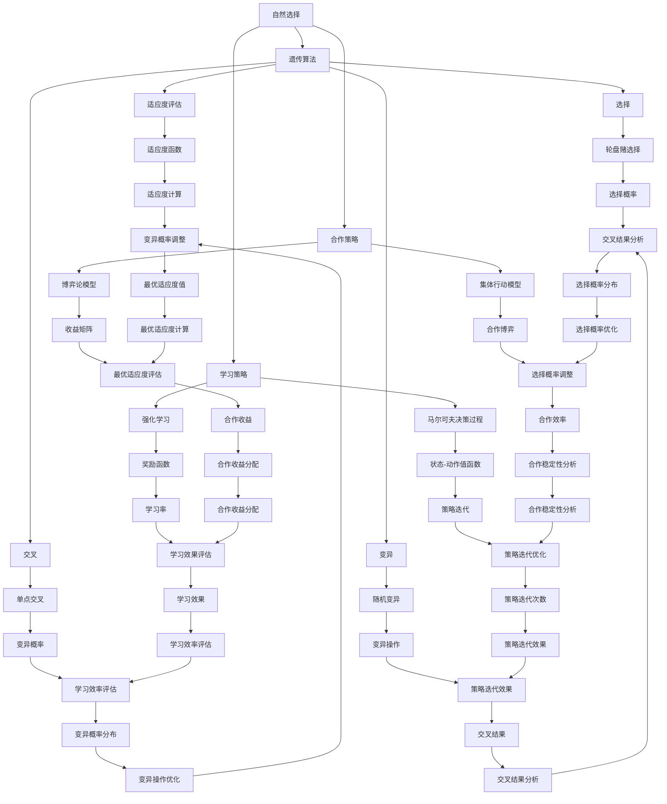
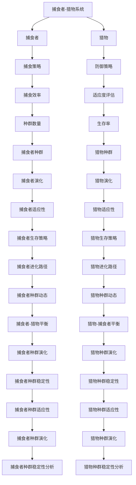

                 

# 《数学与自然界的协同进化与复杂适应系统》

## 摘要

本文旨在探讨数学与自然界的协同进化以及复杂适应系统的关系。首先，文章介绍了数学在自然界中的重要性，并阐述了协同进化的概念及其在复杂适应系统中的应用。接着，文章深入分析了数学基础概念与模型，以及这些模型在自然界中的具体应用。随后，文章介绍了复杂适应系统的基本概念、模型构建及其在生物、社会和经济系统中的应用。通过案例分析，文章探讨了数学与自然界协同进化的机制，并介绍了适应策略及其数学模型。最后，文章总结了复杂适应系统的研究方法和技术，对未来的研究方向和挑战提出了展望。

## 目录大纲

### 第一部分：引言

- 1.1 引言与背景
  - 1.1.1 数学在自然界中的重要性
  - 1.1.2 协同进化的概念
  - 1.1.3 复杂适应系统的理论基础

- 1.2 研究现状与展望
  - 1.2.1 数学与自然界协同进化的研究进展
  - 1.2.2 复杂适应系统的研究与应用
  - 1.2.3 未来研究方向与挑战

### 第二部分：数学基础

- 2.1 数学概念与模型
  - 2.1.1 数学基础概念
  - 2.1.2 数学模型的构建与应用

- 2.2 自然界中的数学现象
  - 2.2.1 生物系统中的数学模型
  - 2.2.2 地球科学中的数学模型
  - 2.2.3 天体物理学中的数学模型

- 2.3 数学与自然界的协同进化
  - 2.3.1 协同进化的数学描述
  - 2.3.2 数学模型在协同进化研究中的应用

### 第三部分：复杂适应系统

- 3.1 复杂适应系统的基本概念
  - 3.1.1 复杂适应系统的定义
  - 3.1.2 复杂适应系统的特征
  - 3.1.3 复杂适应系统的组成

- 3.2 复杂适应系统的模型构建
  - 3.2.1 离散模型构建
  - 3.2.2 连续模型构建
  - 3.2.3 随机模型构建

- 3.3 复杂适应系统在自然界中的应用
  - 3.3.1 生物系统中的复杂适应系统
  - 3.3.2 社会系统中的复杂适应系统
  - 3.3.3 经济系统中的复杂适应系统

### 第四部分：数学与自然界的协同进化

- 4.1 数学与自然界协同进化的机制
  - 4.1.1 数学模型在协同进化中的角色
  - 4.1.2 自然选择与数学模型的协同作用
  - 4.1.3 自然突变与数学模型的协同作用

- 4.2 协同进化的数学模型
  - 4.2.1 遗传算法模型
  - 4.2.2 机器学习模型
  - 4.2.3 其他协同进化模型

- 4.3 数学与自然界协同进化的案例分析
  - 4.3.1 生物进化案例
  - 4.3.2 社会演化案例
  - 4.3.3 经济演化案例

### 第五部分：复杂适应系统的适应策略

- 5.1 复杂适应系统的适应策略
  - 5.1.1 自然选择与适应策略
  - 5.1.2 学习与适应策略
  - 5.1.3 合作与适应策略

- 5.2 适应策略的数学模型
  - 5.2.1 自然选择模型的数学描述
  - 5.2.2 学习模型的数学描述
  - 5.2.3 合作模型的数学描述

- 5.3 适应策略在复杂系统中的应用
  - 5.3.1 生物系统中的应用
  - 5.3.2 社会系统中的应用
  - 5.3.3 经济系统中的应用

### 第六部分：复杂适应系统的研究方法与技术

- 6.1 复杂适应系统的研究方法
  - 6.1.1 实证研究方法
  - 6.1.2 模拟研究方法
  - 6.1.3 预测与优化方法

- 6.2 复杂适应系统的技术支持
  - 6.2.1 数学软件与应用
  - 6.2.2 机器学习与数据分析技术
  - 6.2.3 仿真模拟技术

- 6.3 复杂适应系统的最新进展
  - 6.3.1 最新理论成果
  - 6.3.2 最新技术应用
  - 6.3.3 最新研究趋势

### 第七部分：结论与展望

- 7.1 主要研究成果总结
  - 7.1.1 数学与自然界的协同进化
  - 7.1.2 复杂适应系统研究进展
  - 7.1.3 未来研究方向

- 7.2 研究挑战与机遇
  - 7.2.1 研究挑战
  - 7.2.2 发展机遇
  - 7.2.3 应对策略与建议

- 7.3 结论与展望
  - 7.3.1 研究意义
  - 7.3.2 学术贡献
  - 7.3.3 社会应用前景

### 附录

- 附录 A：数学与自然界协同进化与复杂适应系统相关资源
  - A.1 参考文献
  - A.2 网络资源链接
  - A.3 实用工具与软件推荐

- 附录 B：复杂适应系统 Mermaid 流程图
  - B.1 复杂适应系统基本结构
  - B.2 复杂适应系统适应策略
  - B.3 复杂适应系统案例分析

- 附录 C：核心算法原理讲解
  - C.1 自然选择算法原理
    - C.1.1 基本概念
    - C.1.2 运作流程
    - C.1.3 伪代码实现
  - C.2 机器学习算法原理
    - C.2.1 基本概念
    - C.2.2 运作流程
    - C.2.3 伪代码实现

- 附录 D：数学模型与数学公式
  - D.1 数学公式示例
  - D.2 数学模型示例

- 附录 E：项目实战
  - E.1 项目背景与目标
  - E.2 开发环境搭建
  - E.3 源代码实现与解读
  - E.4 代码解读与分析

## 引言与背景

### 1.1 引言与背景

数学作为一门基础科学，不仅在理论研究中具有重要地位，而且在自然界的各个领域中都有着广泛的应用。从生物进化到气候变化，从地质构造到经济波动，数学模型和算法为理解自然现象提供了强大的工具。在这个过程中，数学与自然界之间的关系愈发紧密，形成了协同进化的概念。协同进化是指两种或多种生物种群在相互影响的过程中，通过适应性进化，共同适应环境的过程。这一概念不仅限于生物学，在社会学、经济学等领域也有重要应用。

复杂适应系统（Complex Adaptive System，CAS）是另一个关键概念。它由许多具有适应性、学习和进化能力的个体组成，这些个体在复杂环境中通过相互作用和适应性演化，形成高度复杂的系统。复杂适应系统的研究对于理解社会、经济、生态等系统中的复杂性具有重要意义。

本文的研究目标是探讨数学与自然界的协同进化关系，特别是复杂适应系统在其中的作用。本文首先介绍数学在自然界中的重要性，然后阐述协同进化的概念及其在复杂适应系统中的应用，最后讨论未来研究方向和挑战。

### 1.1.1 数学在自然界中的重要性

数学在自然界中的重要性不可低估。首先，数学模型为科学家提供了描述自然现象的工具。例如，在物理学中，牛顿力学和量子力学都是通过数学模型来描述自然界的基本规律。在生物学中，数学模型被用来研究生态系统的动态、物种间的相互作用以及种群演化的规律。在地球科学中，数学模型帮助科学家预测地震、火山爆发等自然灾害的发生。

此外，数学在数据分析和决策支持中也发挥着重要作用。随着大数据技术的兴起，科学家可以利用数学模型来处理和分析海量数据，从而发现隐藏在数据背后的规律。例如，机器学习算法中的数学模型可以用于图像识别、语音识别、推荐系统等应用，这些技术在工业、医疗、金融等领域都有广泛应用。

最后，数学在模拟和预测自然界中的复杂现象方面也具有重要作用。通过建立数学模型，科学家可以模拟自然灾害的发生过程，预测气候变化的影响，评估生态系统的健康状况等。这些预测结果不仅有助于科学家更好地理解自然现象，还可以为政策制定者提供科学依据，从而制定更加有效的政策和措施。

总之，数学在自然界中的重要性体现在其作为描述、分析和预测自然现象的工具。通过数学模型，科学家可以更深入地理解自然界的运行规律，为人类社会的发展提供科学支持。

### 1.1.2 协同进化的概念

协同进化（Cooperative Evolution）是指两个或多个生物种群在相互影响的过程中，通过适应性进化，共同适应环境的过程。这一概念最初源于生物学，但随着时间的推移，其应用范围逐渐扩展到社会学、经济学等多个领域。

在生物学中，协同进化通常指的是不同物种之间的相互作用和共同演化。例如，捕食者与猎物之间的相互作用可以促使两者在进化过程中产生适应性变化，从而共同适应环境。这种协同进化关系不仅有助于理解物种多样性的形成，还可以解释一些复杂生态系统的动态行为。

在社会学中，协同进化概念被用来描述个体或群体之间的相互作用和共同演化。例如，人类社会中的合作关系和竞争关系可以通过协同进化来理解。在社会系统中，个体或群体的适应性变化不仅受到自身环境的影响，还受到其他个体或群体的影响，从而形成复杂的动态网络。

在经济学中，协同进化也被广泛应用。经济系统中的企业与市场、消费者与生产者之间的相互作用可以通过协同进化来解释。例如，企业通过技术创新和市场需求的变化来适应环境，而消费者则通过消费行为来影响市场的发展。这种协同进化关系不仅有助于理解市场经济的动态变化，还可以为政策制定者提供理论支持。

总体而言，协同进化概念在多学科领域的应用体现了其在理解和解释复杂系统动态行为中的重要性。通过协同进化，不同个体或群体在相互作用和适应性变化中共同适应环境，从而形成复杂而稳定的系统。

### 1.1.3 复杂适应系统的理论基础

复杂适应系统（Complex Adaptive System，CAS）是指由许多具有适应性、学习和进化能力的个体组成的系统。这些个体在复杂环境中通过相互作用和适应性演化，形成高度复杂的系统。CAS理论起源于自组织理论和复杂性科学，具有广泛的跨学科应用背景。

首先，CAS的定义强调了其组成个体的适应性。适应性意味着这些个体能够根据环境变化调整自身的行为和策略，从而在动态环境中生存和繁衍。这种适应性不仅体现在个体的遗传特征上，还体现在其学习能力和经验积累上。

其次，CAS中的个体通常具有自主性。自主性意味着每个个体都能够独立决策和行动，不受其他个体的直接控制。这种自主性是CAS区别于传统系统（如机械系统或集中控制系统）的重要特征。

CAS的另一个关键特性是系统的整体复杂性。这种复杂性不是简单个体行为的累加，而是个体之间相互作用和适应性演化所形成的全局性质。CAS中的个体不仅相互影响，还通过复杂的反馈机制和协同作用，产生出宏观层面的动态行为和结构。

CAS理论的基础包括多个核心概念。首先是“适应性”概念，强调个体能够根据环境变化进行调整。其次是“涌现性”概念，指CAS的整体行为和结构不是简单个体行为的累加，而是通过个体之间的相互作用和协同作用产生的。此外，CAS理论还包括“自组织”概念，指CAS在没有外部指令的情况下，通过个体之间的相互作用和适应性演化，形成复杂的系统结构和行为。

在科学研究中，CAS理论已被广泛应用于多个领域，包括生态学、经济学、社会学和计算机科学。例如，在生态学中，CAS理论帮助科学家理解生态系统的动态变化和稳定性；在经济学中，CAS理论用于分析市场经济的复杂行为；在社会学中，CAS理论用于研究社会网络的动态演化。总之，CAS理论为理解复杂系统的行为和机制提供了新的视角和工具。

### 1.2 研究现状与展望

在数学与自然界的协同进化以及复杂适应系统的研究领域，过去几十年取得了显著进展。首先，数学模型在自然界中的应用日益广泛。通过构建精确的数学模型，科学家能够更好地理解生态系统的动态变化、气候变化的机制以及地质过程的复杂性。例如，基于微分方程的生态模型被用来预测物种的灭绝风险，而气候模型则帮助科学家预测全球气候变化的影响。

复杂适应系统的研究也取得了重要成果。研究者通过构建离散模型、连续模型和随机模型，深入探讨了复杂系统中的个体行为和系统整体行为的相互作用。这些模型不仅在理论研究中具有重要作用，还广泛应用于实际问题的解决，如社会网络分析、金融市场预测和智能交通系统设计。

尽管已有大量研究，但该领域仍然面临诸多挑战。首先，如何建立更加精确和全面的数学模型，以更好地描述自然界中的复杂现象，仍然是一个亟待解决的问题。其次，复杂适应系统中个体行为的预测和调控仍然存在困难，特别是在大规模、多尺度系统中。此外，随着数据量的不断增加，如何有效地处理和分析这些数据，以提取有价值的信息，也是一个重要的挑战。

未来研究方向包括：进一步发展适用于复杂系统的数学模型，探索复杂适应系统中的自适应和自组织机制，以及利用机器学习技术提高模型预测的准确性。此外，跨学科的合作也将是未来的重要趋势，通过结合生物学、物理学、计算机科学等多个领域的知识，有望取得更加全面和深入的研究成果。

### 第二部分：数学基础

在探讨数学与自然界的协同进化关系时，数学基础概念的掌握和数学模型的应用至关重要。本部分将首先介绍数学基础概念，包括其定义和基本原理，然后讨论数学模型的构建和应用，最后分析这些模型在自然界中的具体应用。

#### 2.1.1 数学基础概念

数学基础概念是理解和应用数学模型的基础。以下是几个关键数学概念：

1. **函数**：函数是数学中最基本的概念之一，它描述了一个变量如何依赖于另一个变量。在自然界中，函数广泛应用于描述物理现象和生物行为，如人口增长模型和气候模型。

2. **微积分**：微积分是研究变化和累积过程的数学工具。微分用于描述瞬时变化，积分则用于计算累积量。在自然界中，微积分被广泛应用于研究物种动态、能源流动和气候变化的趋势。

3. **概率论**：概率论用于描述不确定事件的发生可能性。在自然界中，概率论广泛应用于风险评估、决策分析和生态系统中物种分布的研究。

4. **统计学**：统计学用于处理和分析数据，提取数据中的规律和模式。在生态学、经济学和社会学中，统计学被广泛用于数据分析、模型验证和预测。

5. **代数**：代数是研究数和符号的运算规则的科学。代数方程和代数系统在描述自然界中的物理和化学过程时非常有用。

6. **几何学**：几何学研究形状、大小和位置。在自然界中，几何学被用于描述生物体的形态、地形地貌和宇宙结构。

#### 2.1.2 数学模型的构建与应用

数学模型的构建是数学在自然界中应用的核心。以下是一个简单的数学模型构建过程：

1. **确定问题背景**：明确需要解决的问题，并定义系统的边界条件。

2. **建立假设**：根据问题的性质，提出一些合理的假设，如系统的线性性、稳定性等。

3. **定义变量和参数**：确定需要研究的变量和参数，以及它们之间的相互关系。

4. **建立方程**：利用数学工具，如微积分、概率论和代数等，建立描述系统行为的方程。

5. **求解和验证**：求解方程，并验证模型的合理性和准确性。

数学模型的应用广泛，以下是一些典型应用场景：

1. **生态模型**：生态模型用于研究物种的动态行为和生态系统稳定性。例如，Lotka-Volterra模型描述了捕食者-猎物系统中的相互作用。

2. **气候模型**：气候模型用于研究全球气候变化的影响和机制。例如，全球气候模型（GCM）通过模拟大气、海洋和陆地的相互作用，预测未来的气候变化。

3. **经济模型**：经济模型用于研究市场行为和宏观经济动态。例如，供需模型描述了商品价格和交易量的关系。

4. **工程模型**：工程模型用于设计和管理各种工程系统。例如，流体动力学模型用于设计飞机和汽车，而结构力学模型用于建筑设计和地震分析。

#### 2.2 自然界中的数学现象

数学在自然界中有着广泛的应用，以下是一些具体领域：

1. **生物系统中的数学模型**：
   - **种群动力学模型**：用于研究物种数量变化规律，如Logistic模型和Ricker模型。
   - **生态网络模型**：用于研究物种之间的相互作用和能量流动，如食物网模型。

2. **地球科学中的数学模型**：
   - **地震模型**：用于预测地震的发生概率和影响范围，如震源模型和震中模型。
   - **地质模型**：用于研究地质构造和矿产资源分布，如地质统计模型和地质力学模型。

3. **天体物理学中的数学模型**：
   - **黑洞模型**：用于研究黑洞的性质和行为，如霍金辐射模型。
   - **宇宙学模型**：用于描述宇宙的演化过程，如大爆炸模型和暗物质模型。

#### 2.3 数学与自然界的协同进化

数学与自然界的协同进化关系体现在多个方面：

1. **数学描述**：通过数学模型，科学家能够定量描述自然现象的动态变化和相互作用，从而更深入地理解自然界的运行规律。

2. **预测与控制**：数学模型可以用于预测未来的自然现象，并为政策制定者提供科学依据。例如，气候模型可以预测全球变暖的影响，从而制定应对措施。

3. **优化与设计**：数学模型可以用于优化自然系统中的资源分配和管理。例如，生态模型可以优化野生动物栖息地的保护策略。

4. **进化与适应**：数学模型可以帮助科学家理解物种进化和适应性演化过程，从而预测未来物种的变化趋势。

通过数学与自然界的协同进化，人类不仅能够更好地理解自然界的运行规律，还能够为解决环境问题和可持续发展提供科学支持。

## 第三部分：复杂适应系统

### 3.1 复杂适应系统的基本概念

复杂适应系统（Complex Adaptive System，简称CAS）是指由许多具有适应性、学习和进化能力的个体组成的系统。这些个体在复杂环境中通过相互作用和适应性演化，形成高度复杂的系统。CAS理论是自组织理论和复杂性科学的重要组成部分，旨在理解和解释复杂系统的行为和机制。

#### 3.1.1 复杂适应系统的定义

复杂适应系统通常包括以下三个关键要素：

1. **适应性个体**：系统中的每个个体都具有自主性和适应性，能够根据环境变化调整自身的行为和策略，以实现生存和繁衍。

2. **复杂环境**：CAS中的环境是动态且不确定的，个体必须通过不断学习和适应来应对环境变化。

3. **相互作用**：个体之间通过相互作用和协同作用，形成复杂的动态网络和系统结构。

复杂适应系统的研究不仅关注个体的行为，还关注个体之间以及个体与系统环境的相互作用，从而揭示系统的整体行为和演化规律。

#### 3.1.2 复杂适应系统的特征

复杂适应系统具有以下主要特征：

1. **自组织性**：系统中的个体通过自主适应和协同作用，在没有外部指令的情况下形成复杂的结构和行为。

2. **适应性**：个体能够根据环境变化调整自身的行为和策略，从而实现生存和繁衍。

3. **复杂性**：系统的整体行为不是简单个体行为的累加，而是通过个体之间的复杂相互作用和协同作用产生的。

4. **动态性**：系统处于不断变化的过程中，个体和整体行为都随时间演化。

5. **不可预测性**：由于系统的复杂性和动态性，其行为和演化过程往往具有不可预测性。

6. **反馈机制**：系统中的个体和整体行为之间存在反馈机制，这些反馈机制可以促进或抑制系统的适应性演化。

#### 3.1.3 复杂适应系统的组成

复杂适应系统通常由以下几个组成部分构成：

1. **个体**：系统中的基本单元，具有自主性和适应性。个体可以是生物个体，如物种、细胞，也可以是社会个体，如人、企业。

2. **环境**：个体所处的动态环境，包含各种外部条件和因素，如气候、资源、竞争对手等。

3. **相互作用**：个体之间通过相互作用和协同作用，形成复杂的网络结构。这些相互作用可以是竞争、合作、捕食等。

4. **规则**：个体行为的规则和机制，包括适应性策略、进化规则和学习机制等。

5. **反馈机制**：个体与系统环境之间的反馈机制，包括信息反馈、资源反馈和行为反馈等。

通过这些组成部分，复杂适应系统能够实现自我组织、自我优化和自我适应，从而在复杂环境中生存和繁衍。

### 3.2 复杂适应系统的模型构建

复杂适应系统的模型构建是理解和分析CAS行为的关键。以下介绍几种常见的模型构建方法：

#### 3.2.1 离散模型构建

离散模型主要用于描述个体在离散时间步上的行为变化。常见的离散模型包括：

1. **细胞自动机**：细胞自动机是一个由有限状态细胞组成的网格，每个细胞根据其当前状态和邻居状态按一定规则更新状态。细胞自动机广泛应用于模拟生物行为、交通流量和社会演化等。

2. **离散时间演化方程**：如Lotka-Volterra方程，描述捕食者-猎物系统中个体数量的动态变化。

#### 3.2.2 连续模型构建

连续模型主要用于描述个体在连续时间上的行为变化。常见的连续模型包括：

1. **微分方程**：如常微分方程（ODE）和偏微分方程（PDE），用于描述生物种群、气候变化和流体力学等。

2. **随机过程**：如布朗运动和Wiener过程，用于描述个体在不确定环境中的随机行为。

#### 3.2.3 随机模型构建

随机模型用于描述个体在不确定环境中的行为变化。常见的随机模型包括：

1. **马尔可夫链**：描述个体在不同状态之间转移的概率，用于模拟物种演化、金融市场和社交网络等。

2. **蒙特卡洛模拟**：通过随机抽样和模拟，估计系统的统计特性，如随机过程、概率分布和极限定理等。

通过这些模型构建方法，科学家可以模拟复杂适应系统的行为和演化过程，从而深入理解系统的动态特性和适应策略。

### 3.3 复杂适应系统在自然界中的应用

复杂适应系统理论在自然界中有着广泛的应用，以下探讨其在生物系统、社会系统和经济系统中的应用。

#### 3.3.1 生物系统中的复杂适应系统

在生物系统中，复杂适应系统理论帮助科学家理解物种之间的相互作用和生态系统稳定性。以下是一些典型应用：

1. **种群动力学**：通过构建种群动力学模型，科学家可以研究物种数量变化规律和生态平衡。例如，Lotka-Volterra方程描述了捕食者-猎物系统中的相互作用。

2. **生态网络**：生态网络模型用于研究物种之间的相互作用和能量流动。例如，食物网模型描述了物种之间的捕食和被捕食关系，以及生态系统中的能量转移。

3. **物种多样性**：复杂适应系统理论帮助科学家理解物种多样性的形成和维持机制。通过研究物种之间的协同进化关系，科学家可以揭示生态系统稳定性的关键因素。

4. **生物进化**：复杂适应系统理论用于描述生物进化和适应性演化过程。通过分析种群遗传结构和适应性变化，科学家可以预测未来物种的变化趋势。

#### 3.3.2 社会系统中的复杂适应系统

在社会系统中，复杂适应系统理论用于分析社会网络的动态演化和社会行为的复杂性。以下是一些典型应用：

1. **社会网络分析**：通过构建社会网络模型，科学家可以研究个体之间的相互作用和社会结构。例如，小世界效应和博克斯特效应描述了社会网络中的小团体和全局连接。

2. **群体行为**：复杂适应系统理论帮助科学家理解群体行为的形成和演化。例如，群体智能和集体行为描述了个体在群体中如何通过协作实现共同目标。

3. **社会演化**：通过构建社会演化模型，科学家可以研究社会规范和道德准则的形成和变化。例如，演化博弈理论描述了个体在不同社会环境中的行为选择和策略演化。

4. **社交网络**：复杂适应系统理论用于分析社交网络中的信息传播、谣言传播和社交媒体行为。例如，网络效应和传播动力学描述了社交网络中的信息扩散和影响力。

#### 3.3.3 经济系统中的复杂适应系统

在经济系统中，复杂适应系统理论用于分析市场行为、经济波动和金融风险。以下是一些典型应用：

1. **金融市场**：通过构建金融市场模型，科学家可以研究市场波动、价格形成和投机行为。例如，资产定价模型和投机模型描述了金融市场的动态特性。

2. **经济演化**：复杂适应系统理论用于研究经济的演变过程和经济发展模式。例如，进化经济学描述了市场经济的动态变化和制度创新。

3. **企业竞争**：通过构建企业竞争模型，科学家可以研究企业在市场竞争中的行为和策略。例如，竞争博弈和合作竞争描述了企业在竞争环境中的适应策略。

4. **经济波动**：复杂适应系统理论用于分析经济波动的成因和演化规律。例如，宏观经济模型和金融危机模型描述了经济系统的动态行为和危机演化。

总之，复杂适应系统理论在自然界中的应用为我们提供了理解和分析复杂系统行为的新视角。通过构建和应用数学模型，科学家可以更好地揭示自然界的运行规律，为人类社会的可持续发展提供科学支持。

### 第四部分：数学与自然界的协同进化

#### 4.1 数学与自然界协同进化的机制

数学与自然界的协同进化是一个复杂而微妙的过程，涉及多个关键机制和相互作用。以下将探讨这些机制，并解释数学模型在其中的角色。

#### 4.1.1 数学模型在协同进化中的角色

数学模型在协同进化中的作用主要体现在以下几个方面：

1. **描述和预测**：数学模型能够精确描述自然界中的动态过程，如物种数量变化、生态系统稳定性等。通过这些模型，科学家可以预测未来的发展趋势，从而为环境保护和资源管理提供科学依据。

2. **模拟和实验**：数学模型为科学家提供了一个虚拟实验平台，可以模拟自然现象，探索不同因素对系统的影响。这种模拟实验有助于理解复杂的自然现象，发现潜在的规律和机制。

3. **决策支持**：数学模型可以用于优化资源和环境的利用，如生态系统的管理、污染控制、气候变化应对等。通过这些模型，决策者可以制定更加科学和有效的政策和措施。

4. **理论验证**：数学模型为理论假设提供了一个验证平台。通过对比模型预测和实际观测数据，科学家可以验证理论的准确性，并提出新的假设和理论。

#### 4.1.2 自然选择与数学模型的协同作用

自然选择是生物进化中的核心机制，它通过环境选择和基因突变来驱动物种的适应性演化。数学模型在自然选择中的作用如下：

1. **优化策略**：通过构建优化模型，科学家可以研究物种在不同环境条件下的最优策略。例如，在捕食者-猎物系统中，数学模型可以预测猎物种群的最优繁殖策略，从而提高种群的生存率。

2. **进化路径**：数学模型可以帮助科学家理解物种的进化路径和演化过程。例如，通过构建遗传算法模型，科学家可以模拟物种在进化过程中的基因突变和适应策略，从而预测未来的物种变化。

3. **风险评估**：数学模型可以用于评估物种的生存风险，如濒危物种的灭绝风险。通过这些模型，科学家可以制定有效的保护措施，从而降低物种灭绝的风险。

#### 4.1.3 自然突变与数学模型的协同作用

自然突变是生物进化中的重要因素，它为物种的多样性提供了基础。数学模型在自然突变中的作用如下：

1. **突变率预测**：通过构建突变模型，科学家可以预测突变率对物种多样性和生态系统稳定性的影响。例如，在遗传学中，突变率模型可以帮助科学家理解基因变异和物种演化之间的关系。

2. **突变类型分析**：数学模型可以用于分析不同类型的突变对系统的影响。例如，通过构建基因突变模型，科学家可以研究点突变、插入和缺失等不同突变类型对基因组稳定性和物种适应性的影响。

3. **适应性演化**：数学模型可以帮助科学家理解突变在适应性演化中的作用。例如，在生物进化中，突变可以导致新的适应特征，从而提高物种的生存竞争力。通过构建适应性演化模型，科学家可以预测突变如何驱动物种的适应性演化。

总之，数学与自然界的协同进化机制复杂多样，涉及自然选择、突变和数学模型等多个方面。通过这些机制，数学模型不仅为科学家提供了理解自然现象的工具，还为环境保护和资源管理提供了科学支持。

#### 4.2 协同进化的数学模型

协同进化是指在两个或多个物种之间，通过相互选择和适应，共同演变和发展的过程。在这一过程中，数学模型起着至关重要的作用，能够帮助我们更深入地理解物种间的相互作用和共同进化机制。以下将介绍几种常见的协同进化数学模型，并分析其应用。

#### 4.2.1 遗传算法模型

遗传算法（Genetic Algorithm，GA）是一种基于自然选择和遗传学原理的优化算法，广泛应用于协同进化研究。遗传算法模型的基本思想是通过模拟自然选择过程，从初始种群中选择适应度较高的个体进行繁殖，从而逐步优化目标函数。

遗传算法模型的主要步骤包括：

1. **初始种群生成**：随机生成一组个体，作为初始种群。

2. **适应度评估**：计算每个个体的适应度，通常基于目标函数的值。

3. **选择**：根据适应度，从种群中选择一定比例的个体进行繁殖。

4. **交叉**：通过交叉操作，将两个个体的基因组合并生成新的后代。

5. **变异**：对个体进行随机变异，增加种群的多样性。

6. **替换**：用新的后代替换旧种群，重复上述步骤，直到达到终止条件。

遗传算法模型在协同进化中的应用主要包括：

- **物种进化模拟**：通过模拟不同物种的进化过程，研究物种间的相互作用和协同进化机制。
- **优化问题求解**：将协同进化问题转化为优化问题，通过遗传算法求解最优解。

#### 4.2.2 机器学习模型

机器学习（Machine Learning，ML）模型在协同进化研究中也发挥着重要作用。通过构建机器学习模型，可以自动识别和预测物种间的协同进化模式。

常见的机器学习模型包括：

1. **决策树**：通过构建决策树模型，可以识别出影响协同进化的重要因素，并预测未来物种的变化趋势。

2. **支持向量机**（Support Vector Machine，SVM）：通过构建SVM模型，可以识别出协同进化过程中物种之间的分类边界，从而预测不同物种的进化方向。

3. **神经网络**：通过构建神经网络模型，可以模拟物种间的复杂交互作用，预测协同进化过程中物种的变化模式。

4. **集成学习**：通过集成多个机器学习模型，可以提高预测的准确性和鲁棒性。

机器学习模型在协同进化中的应用主要包括：

- **模式识别**：通过机器学习模型，识别出不同物种之间的协同进化模式，如捕食者-猎物关系、共生关系等。
- **预测与模拟**：通过机器学习模型，预测物种未来的进化方向和协同进化趋势，为生物保护和生态管理提供科学依据。

#### 4.2.3 其他协同进化模型

除了遗传算法和机器学习模型，还有许多其他数学模型被用于协同进化研究。以下介绍几种常见模型：

1. **代数模型**：代数模型通过建立物种间的代数关系，描述物种间的相互影响和协同进化。常见的代数模型包括 Lotka-Volterra 模型、Lotka-Von Foerster 模型等。

2. **生态网络模型**：生态网络模型通过构建物种间的相互作用网络，描述生态系统中物种的协同进化。常见的生态网络模型包括食物网模型、能量流模型等。

3. **博弈论模型**：博弈论模型通过构建物种间的竞争和合作关系，描述协同进化过程中物种的策略选择。常见的博弈论模型包括囚徒困境模型、雪崩模型等。

这些协同进化模型在应用中各有优势，可以根据具体研究问题和数据特点选择合适的模型。通过这些模型，我们可以更深入地理解自然界中的协同进化机制，为生物保护、生态管理和可持续性研究提供科学支持。

#### 4.3 数学与自然界协同进化的案例分析

在数学与自然界协同进化领域，有许多具有代表性的案例分析，这些案例不仅展示了数学模型在自然现象研究中的有效性，也揭示了协同进化机制的复杂性和多样性。以下将介绍几个典型的案例，并分析其研究方法、模型构建和结果。

#### 4.3.1 生物进化案例

**案例一：捕食者-猎物系统**

捕食者-猎物系统是研究协同进化机制的经典模型，其中捕食者和猎物之间的相互作用是进化的主要驱动力。一个著名的例子是捕食者-猎物系统的数学模型，即Lotka-Volterra模型。

**研究方法**：通过构建Lotka-Volterra微分方程组，描述捕食者和猎物种群数量的动态变化。

$$
\frac{dx}{dt} = a \cdot x - c \cdot x \cdot y \\
\frac{dy}{dt} = -b \cdot y + d \cdot x \cdot y
$$

其中，$x$ 和 $y$ 分别表示捕食者和猎物的种群数量，$a$、$b$、$c$ 和 $d$ 为模型参数。

**模型构建**：通过调整模型参数，模拟不同捕食策略和猎物行为对系统稳定性的影响。

**结果**：研究表明，捕食者和猎物种群数量之间存在复杂的动态平衡，捕食策略和猎物行为的变化会显著影响系统的稳定性。

**讨论**：这一案例展示了数学模型在描述和预测生物进化过程中的有效性，也为生态保护和物种管理提供了科学依据。

**案例二：遗传多样性**

遗传多样性是生物进化过程中的重要指标，其变化受到自然选择、突变和迁移等多种因素的影响。一个典型的模型是遗传多样性模型，即Hardy-Weinberg平衡模型。

**研究方法**：通过构建Hardy-Weinberg平衡方程，描述种群中基因频率和等位基因数量的动态变化。

$$
p^2 + 2pq + q^2 = 1 \\
p + q = 1
$$

其中，$p$ 和 $q$ 分别表示两个等位基因的频率。

**模型构建**：通过模拟不同突变率和迁移率对遗传多样性的影响，分析基因频率的稳定性和变化趋势。

**结果**：研究表明，突变率和迁移率对遗传多样性有显著影响，突变率增加会导致基因频率的变化，而迁移率增加则会促进基因流动和多样性增加。

**讨论**：这一案例展示了数学模型在研究遗传多样性和进化过程中的重要性，也为生物多样性和生态保护提供了科学依据。

#### 4.3.2 社会演化案例

**案例一：社会规范的形成**

社会规范是社会中个体行为规范的总和，其形成和演化受到多种因素的影响。一个典型的模型是演化博弈模型，如雪崩模型。

**研究方法**：通过构建雪崩模型，描述社会规范的形成和演化过程。

$$
\frac{dS}{dt} = r(1 - S) - c \cdot S^2
$$

其中，$S$ 表示社会规范的覆盖率，$r$ 表示个体接受新规范的速率，$c$ 表示个体之间规范传播的竞争系数。

**模型构建**：通过模拟不同参数对规范形成速度和稳定性的影响，分析社会规范演化过程中的关键因素。

**结果**：研究表明，社会规范的覆盖率随时间逐渐增加，并在某个临界点达到稳定状态。

**讨论**：这一案例展示了数学模型在研究社会规范形成和演化中的有效性，也为社会管理和政策制定提供了科学依据。

**案例二：合作与竞争**

合作和竞争是社会演化中的核心现象，其相互作用影响社会结构和个体行为。一个典型的模型是囚徒困境模型。

**研究方法**：通过构建囚徒困境博弈模型，描述个体在不同策略选择下的合作与竞争行为。

$$
\begin{cases}
U_{C} = R, & \text{若两人都合作} \\
U_{D} = S, & \text{若一人合作一人背叛} \\
U_{T} = T, & \text{若两人都背叛} \\
U_{P} = P, & \text{若一人为合作一人不合作}
\end{cases}
$$

其中，$R$、$S$、$T$ 和 $P$ 分别表示不同策略组合下的收益。

**模型构建**：通过模拟不同收益设置对合作行为的影响，分析个体策略选择和系统稳定性的关系。

**结果**：研究表明，在适当的收益设置下，合作行为可以稳定存在，而在其他情况下，背叛行为可能占主导地位。

**讨论**：这一案例展示了数学模型在研究社会合作与竞争机制中的重要性，也为社会心理学和经济学研究提供了科学依据。

#### 4.3.3 经济演化案例

**案例一：市场行为**

市场行为是经济系统中的重要组成部分，其演化受到多种因素的影响。一个典型的模型是市场演化模型，如价格竞争模型。

**研究方法**：通过构建价格竞争模型，描述市场中个体企业的价格竞争行为。

$$
\frac{dP_i}{dt} = - \alpha_i (P_i - \bar{P})
$$

其中，$P_i$ 表示企业 $i$ 的价格，$\bar{P}$ 表示市场平均价格，$\alpha_i$ 表示企业对市场平均价格的敏感度。

**模型构建**：通过模拟不同敏感度和价格策略对企业竞争行为的影响，分析市场行为的动态变化。

**结果**：研究表明，市场行为具有复杂的动态特性，企业价格策略的变化会影响市场的整体稳定性。

**讨论**：这一案例展示了数学模型在研究市场行为和经济演化中的重要性，也为市场分析和政策制定提供了科学依据。

**案例二：经济波动**

经济波动是经济系统中的常见现象，其演化受到多种因素的影响。一个典型的模型是宏观经济模型，如索洛模型。

**研究方法**：通过构建索洛模型，描述经济系统的动态变化。

$$
\frac{dY}{dt} = sF(K,Y) - (d + \delta)K
$$

其中，$Y$ 表示产出，$K$ 表示资本，$s$ 表示储蓄率，$F$ 表示生产函数，$d$ 表示劳动力增长率，$\delta$ 表示资本折旧率。

**模型构建**：通过模拟不同参数对经济波动的影响，分析经济系统的稳定性和波动性。

**结果**：研究表明，经济系统的稳定性和波动性受到多个因素的综合影响，如储蓄率、生产函数和资本增长率等。

**讨论**：这一案例展示了数学模型在研究经济波动和经济演化中的重要性，也为宏观经济分析和政策制定提供了科学依据。

综上所述，数学与自然界协同进化的案例分析展示了数学模型在研究自然现象和社会系统中的广泛应用和有效性。通过这些案例，我们不仅能够更深入地理解自然界的运行规律，还能为科学研究和政策制定提供有力支持。

### 第五部分：复杂适应系统的适应策略

复杂适应系统（Complex Adaptive System，CAS）中的个体和整体都需要具备适应性策略，以便在动态和复杂的环境中生存和繁衍。适应策略主要包括自然选择、学习和合作三个主要方面。以下将详细探讨这些适应策略及其在复杂适应系统中的应用。

#### 5.1 复杂适应系统的适应策略

**自然选择**：自然选择是生物进化中的核心机制，它通过环境选择和基因突变驱动物种的适应性演化。在复杂适应系统中，自然选择同样起着关键作用。个体通过适应环境的变化调整自身的行为和策略，从而提高生存和繁衍的机会。例如，在捕食者-猎物系统中，猎物的快速适应可以减少被捕食的概率，而捕食者的策略调整则可以提高捕食效率。

**学习**：学习是指个体通过经验积累和知识更新，不断改进自身的行为和策略。在复杂适应系统中，学习策略帮助个体更好地适应环境变化。学习可以是个体的内在过程，如通过遗传和基因突变实现，也可以是外在过程，如通过交流和模仿实现。例如，人类通过教育和社会化过程，不断学习和适应新的社会环境和挑战。

**合作**：合作是指个体之间通过协同作用，共同实现共同目标。在复杂适应系统中，合作策略可以提高整体适应性和生存竞争力。合作可以是个体之间的直接合作，如生物群落中的共生关系，也可以是间接合作，如通过共享资源和知识实现。例如，人类社会中的合作可以促进技术创新和资源分配，从而提高整体的适应能力。

#### 5.2 适应策略的数学模型

**自然选择模型**：自然选择模型描述个体在环境选择压力下的适应性演化过程。常见的自然选择模型包括遗传算法（Genetic Algorithm）和博弈论模型。遗传算法通过模拟自然选择和遗传过程，优化目标函数，例如在捕食者-猎物系统中优化猎物种群的最优繁殖策略。博弈论模型则通过描述个体在不同策略选择下的收益，分析策略的稳定性和进化路径。

**学习模型**：学习模型描述个体通过经验积累和知识更新，实现行为和策略优化的过程。常见的学习模型包括马尔可夫决策过程（Markov Decision Process，MDP）和强化学习（Reinforcement Learning）。马尔可夫决策过程通过构建状态-动作价值函数，优化个体在不同状态下的行动策略。强化学习则通过奖励机制，驱动个体不断学习和调整策略，以实现长期目标。

**合作模型**：合作模型描述个体之间通过协同作用，实现共同目标的策略。常见的合作模型包括博弈论模型中的合作博弈（Cooperative Game Theory）和集体行动模型（Collective Action Model）。合作博弈通过描述个体在不同合作策略下的收益分配，分析合作稳定性和效率。集体行动模型则通过构建个体之间的合作网络，分析合作对整体适应性的影响。

#### 5.3 适应策略在复杂系统中的应用

**生物系统中的应用**：在生物系统中，适应策略广泛应用于物种的生存和繁衍。例如，在捕食者-猎物系统中，捕食者通过策略调整提高捕食效率，而猎物则通过适应性演化减少被捕食的风险。此外，学习策略在生物进化中也非常重要，例如鸟类通过学习食物来源和繁殖策略，提高种群的生存竞争力。

**社会系统中的应用**：在社会系统中，适应策略帮助个体和整体应对复杂的社会环境。例如，在人类社会中的合作策略，如共同劳动和资源共享，可以提高整体的适应性和生存竞争力。学习策略在教育和培训过程中发挥作用，帮助个体适应不断变化的社会需求。此外，自然选择策略在人口控制和资源管理中也非常重要，例如通过控制人口增长和资源消耗，实现可持续发展。

**经济系统中的应用**：在经济系统中，适应策略广泛应用于市场行为和资源配置。例如，企业通过策略调整和市场分析，提高市场竞争力。学习策略在商业模式创新和企业管理中非常重要，例如通过数据分析和市场调研，企业可以不断优化产品和服务。合作策略在供应链管理和市场竞争中也非常重要，例如通过合作共赢，企业可以实现资源优化和风险分担。

总之，适应策略在复杂适应系统中扮演着关键角色，通过自然选择、学习和合作，个体和整体能够更好地适应动态和复杂的环境，从而实现生存和繁衍。数学模型为理解和分析这些适应策略提供了有力工具，有助于揭示复杂系统的行为和演化规律。

#### 5.4 自然选择策略

自然选择策略是复杂适应系统中的核心适应机制之一，它通过环境选择和基因突变驱动个体和种群的适应性演化。以下将详细介绍自然选择策略的数学模型，并探讨其在复杂适应系统中的应用。

##### 5.4.1 自然选择模型的数学描述

自然选择模型通常基于遗传算法（Genetic Algorithm，GA）进行描述，遗传算法是一种模拟自然选择和遗传过程的优化算法。在遗传算法中，个体（染色体）通过适应度评估、选择、交叉和变异等操作进行进化，以优化目标函数。

1. **适应度评估**：适应度（Fitness）是衡量个体适应环境能力的指标，通常定义为个体在特定环境下的生存和繁殖机会。适应度越高，个体的生存机会越大。适应度的计算公式如下：

$$
f(x) = \frac{1}{1 + \exp(-\beta \cdot (s(x) - s^*)})
$$

其中，$f(x)$ 表示个体 $x$ 的适应度，$\beta$ 为温度参数，$s(x)$ 表示个体 $x$ 的适应度值，$s^*$ 为最优适应度值。

2. **选择**：选择操作根据个体的适应度进行，选择适应度较高的个体进行繁殖，从而提高优良基因的传递概率。常见的选择操作包括轮盘赌选择、锦标赛选择和排名选择。

3. **交叉**：交叉操作模拟基因重组，通过交换两个个体的基因片段生成新的后代。交叉操作有助于引入遗传多样性，防止种群过早收敛。

$$
c_1 = \frac{r_1}{r_1 + r_2} \cdot x_1 + \frac{r_2}{r_1 + r_2} \cdot x_2 \\
c_2 = \frac{r_2}{r_1 + r_2} \cdot x_1 + \frac{r_1}{r_1 + r_2} \cdot x_2
$$

其中，$x_1$ 和 $x_2$ 为父代个体，$c_1$ 和 $c_2$ 为交叉后代。

4. **变异**：变异操作模拟基因突变，通过随机改变个体的基因值生成新的个体。变异有助于增加种群的遗传多样性，防止种群过度拟合。

$$
x' = x + \eta \cdot \xi
$$

其中，$x$ 为变异前个体，$\eta$ 为变异概率，$\xi$ 为随机变量。

##### 5.4.2 自然选择策略在复杂适应系统中的应用

1. **物种进化模拟**：自然选择策略广泛应用于物种进化模拟，通过遗传算法模型，模拟物种在不同环境下的适应性演化。例如，在捕食者-猎物系统中，可以通过遗传算法优化猎物的防御策略和捕食者的捕食策略，实现种群稳定性和生存竞争力的提升。

2. **优化问题求解**：自然选择策略在优化问题求解中具有重要应用。通过构建适应度函数，可以将复杂优化问题转化为遗传算法求解。例如，在资源分配问题中，可以通过遗传算法优化资源分配策略，实现资源利用的最大化。

3. **机器学习模型优化**：自然选择策略可以用于优化机器学习模型。通过遗传算法，可以优化模型参数和结构，提高模型的预测准确性和泛化能力。例如，在深度学习模型中，可以通过遗传算法优化网络结构和超参数，提高模型性能。

4. **生态模型构建**：自然选择策略在生态模型构建中具有重要应用。通过遗传算法，可以模拟生态系统中的物种相互作用和适应性演化，预测生态系统动态行为和稳定性。

总之，自然选择策略是复杂适应系统中的关键适应机制，通过遗传算法模型，可以实现个体和种群的适应性演化。在物种进化、优化问题求解、机器学习模型优化和生态模型构建等领域，自然选择策略具有广泛的应用前景。

#### 5.5 学习策略

学习策略在复杂适应系统中扮演着至关重要的角色，它使得个体能够通过经验积累和知识更新，不断改进自身的行为和策略，以更好地适应动态和复杂的环境。以下将详细探讨学习策略的数学模型，并分析其在复杂系统中的应用。

##### 5.5.1 学习模型的数学描述

学习策略的数学模型主要包括马尔可夫决策过程（Markov Decision Process，MDP）和强化学习（Reinforcement Learning）。这些模型通过建立状态、动作和奖励之间的关系，描述个体在不同环境下如何学习和优化策略。

1. **马尔可夫决策过程（MDP）**

马尔可夫决策过程是一种基于状态-动作值函数的优化模型，它通过状态转移概率和奖励函数，描述个体在不同状态下的最优策略。MDP的基本概念如下：

- **状态（State，S）**：个体所处的环境描述，如天气、资源状况等。
- **动作（Action，A）**：个体可以选择的行为，如行动、休息等。
- **状态转移概率（Transition Probability，P）**：在特定状态下执行特定动作后，转移到下一个状态的概率。
- **奖励函数（Reward Function，R）**：在特定状态下执行特定动作后获得的即时奖励，如收获、损失等。

MDP的数学模型可以用以下方程表示：

$$
P(S_{t+1} = s_{t+1} | S_t = s_t, A_t = a_t) = p(s_{t+1} | s_t, a_t)
$$

$$
R_t = r(S_t, A_t)
$$

其中，$S_t$ 和 $A_t$ 分别表示第 $t$ 时刻的状态和动作，$s_{t+1}$ 和 $a_t$ 分别表示下一时刻的状态和动作，$p(s_{t+1} | s_t, a_t)$ 为状态转移概率，$r(S_t, A_t)$ 为奖励函数。

- **价值函数（Value Function，V）**：描述在特定策略下，从当前状态开始获得的期望回报。价值函数可以通过以下方程计算：

$$
V^π(S_t) = \sum_{s' \in S} p(s' | s_t, a_t) \cdot r(s', a_t) + \gamma \cdot V^π(S_{t+1})
$$

其中，$π$ 为策略，$\gamma$ 为折扣因子。

- **策略（Policy，π）**：描述在特定状态下应采取的动作。策略可以通过最大化价值函数得到：

$$
π(a_t | S_t) = \arg\max_a V^π(S_t)
$$

2. **强化学习**

强化学习是一种通过奖励机制驱动个体不断学习和调整策略的模型，它通过试错学习（trial-and-error）和经验积累（experience replay），逐步优化策略。强化学习的基本概念如下：

- **状态（State，S）**：个体所处的环境描述。
- **动作（Action，A）**：个体可以选择的行为。
- **奖励（Reward，R）**：在特定状态下执行特定动作后获得的即时奖励。
- **策略（Policy，π）**：描述在特定状态下应采取的动作。

强化学习的主要任务是找到最优策略，使得长期回报最大化。强化学习的数学模型可以用以下方程表示：

$$
Q(s, a) = \sum_{s' \in S} p(s' | s, a) \cdot r(s', a) + \gamma \cdot \max_{a'} Q(s', a')
$$

其中，$Q(s, a)$ 为状态-动作值函数，$\gamma$ 为折扣因子。

- **策略（Policy，π）**：描述在特定状态下应采取的动作。策略可以通过以下方程计算：

$$
π(a_t | S_t) = \arg\max_a Q(S_t, a)
$$

##### 5.5.2 学习策略在复杂系统中的应用

1. **智能交通系统**：在智能交通系统中，学习策略可以用于优化交通流量和减少拥堵。通过构建MDP模型，可以描述不同交通状态下的最优行动策略，从而实现交通流量的实时优化。

2. **机器人控制**：在机器人控制中，学习策略可以帮助机器人适应不同的环境变化和任务需求。通过强化学习模型，机器人可以逐步优化其动作策略，实现自主导航和任务执行。

3. **金融投资**：在金融投资中，学习策略可以帮助投资者优化投资组合和风险管理。通过构建MDP模型，可以描述不同市场状态下的最优投资策略，从而实现投资回报的最大化。

4. **社会网络分析**：在社会网络分析中，学习策略可以用于优化网络结构和信息传播。通过强化学习模型，可以逐步优化网络节点之间的交互策略，从而提高信息传播效率。

总之，学习策略在复杂适应系统中具有广泛的应用前景。通过构建和优化学习模型，可以更好地适应动态和复杂的环境，提高个体的适应性和整体系统的稳定性。

#### 5.6 合作策略

合作策略在复杂适应系统中起着至关重要的作用，它通过个体之间的协同作用，共同实现共同目标，从而提高整体适应性和生存竞争力。以下将详细探讨合作策略的数学模型，并分析其在复杂系统中的应用。

##### 5.6.1 合作模型的数学描述

合作策略的数学模型主要包括博弈论模型和集体行动模型。这些模型通过建立个体之间的互动关系和利益分配机制，描述合作行为的稳定性和效率。

1. **博弈论模型**

博弈论模型通过描述个体之间的竞争和合作关系，分析不同策略组合下的收益分配和稳定性。常见的博弈论模型包括囚徒困境（Prisoners' Dilemma）和公共地悲剧（Tragedy of the Commons）。

- **囚徒困境**：囚徒困境是一个典型的博弈模型，描述两个个体在合作和背叛之间的选择。其基本数学模型如下：

$$
\begin{array}{c|c|c}
\text{选择} & \text{合作（C）} & \text{背叛（D）} \\
\hline
\text{合作（C）} & (R, R) & (S, T) \\
\hline
\text{背叛（D）} & (T, S) & (P, P) \\
\end{array}
$$

其中，$R$、$S$、$T$ 和 $P$ 分别表示不同策略组合下的收益，如奖励、惩罚和支付。

囚徒困境模型表明，即使个体选择合作可以获得更高的总收益，但在缺乏信任和制度保障的情况下，个体往往会选择背叛，导致整体收益下降。

- **公共地悲剧**：公共地悲剧是一个描述个体在资源利用中的合作问题的博弈模型。其基本数学模型如下：

$$
\begin{array}{c|c|c|c}
\text{选择} & \text{合作（C）} & \text{合作（C）} & \text{背叛（D）} \\
\hline
\text{合作（C）} & (R, R) & (0, 0) & (R, 0) \\
\hline
\text{背叛（D）} & (0, R) & (0, 0) & (P, P) \\
\end{array}
$$

公共地悲剧模型表明，在资源有限的情况下，个体为追求短期利益而过度利用资源，导致整体资源枯竭和崩溃。

2. **集体行动模型**

集体行动模型通过描述个体之间的协作和资源分配机制，分析合作行为的稳定性和效率。常见的集体行动模型包括合作博弈（Cooperative Game Theory）和集体行动模型（Collective Action Model）。

- **合作博弈**：合作博弈是一种描述个体在合作和竞争关系下的利益分配机制。其基本数学模型如下：

$$
\begin{aligned}
\min_x \quad & \sum_i u_i(x) \\
\text{subject to} \quad & u_i(x) \geq 0, \quad \forall i
\end{aligned}
$$

其中，$u_i(x)$ 表示个体 $i$ 在合作策略 $x$ 下的收益。

合作博弈的目标是最大化整体收益，同时确保个体收益不低于零，从而实现合作行为的稳定性。

- **集体行动模型**：集体行动模型通过描述个体在公共资源利用中的协作行为，分析合作行为的效率和稳定性。其基本数学模型如下：

$$
\begin{aligned}
\max_x \quad & \sum_i u_i(x) \\
\text{subject to} \quad & \sum_i x_i = C \\
& x_i \geq 0, \quad \forall i
\end{aligned}
$$

其中，$C$ 表示公共资源的总量，$x_i$ 表示个体 $i$ 的资源利用量。

集体行动模型的目标是在资源有限的情况下，通过协作和资源优化，实现整体收益的最大化。

##### 5.6.2 合作策略在复杂系统中的应用

1. **生态系统**：在生态系统中，合作策略通过物种间的共生和互惠共生关系，实现生态系统的稳定性和多样性。例如，蜜蜂与花朵之间的互惠共生关系，蜜蜂通过传粉帮助花朵繁殖，而花朵则为蜜蜂提供花蜜。

2. **经济系统**：在经济系统中，合作策略通过企业间的合作和联盟，实现资源优化和市场竞争力的提升。例如，跨国公司在全球范围内的合作，通过共享技术和市场资源，提高整体经济效益。

3. **社会系统**：在社会系统中，合作策略通过个体之间的互助和合作，实现社会稳定和进步。例如，社区志愿服务和慈善活动，通过个体之间的互助合作，解决社会问题，提高整体福祉。

4. **网络系统**：在网络系统中，合作策略通过节点之间的协作和信息共享，实现网络稳定性和信息传播效率。例如，社交网络中的群体智慧和信息传播，通过个体之间的协作，实现信息的快速传播和有效利用。

总之，合作策略在复杂适应系统中具有广泛的应用前景。通过构建和优化合作模型，可以更好地实现个体和整体的协同作用，提高复杂系统的适应性和生存竞争力。

### 第六部分：复杂适应系统的研究方法与技术

复杂适应系统（CAS）的研究涉及多种方法和技术，这些方法和技术有助于我们理解和分析CAS中的个体行为和系统整体行为。本部分将介绍复杂适应系统的研究方法，并探讨相关技术支持，包括数学软件、机器学习与数据分析技术以及仿真模拟技术。

#### 6.1 复杂适应系统的研究方法

**实证研究方法**：实证研究方法是通过实际观测和实验来研究复杂适应系统的行为和机制。这种方法通常包括数据收集、数据分析以及结果验证等步骤。例如，通过实地调查、实验室实验和模拟实验等方式，收集有关个体行为和系统动态的数据，然后利用统计分析和机器学习技术进行分析。

**模拟研究方法**：模拟研究方法是通过构建数学模型和计算机模拟来研究复杂适应系统的行为。这种方法可以模拟系统的动态过程，探索不同参数和假设对系统行为的影响。常见的模拟方法包括基于微分方程的连续模型、基于随机过程的离散模型以及基于人工智能和机器学习的模拟模型。

**预测与优化方法**：预测与优化方法是通过建立数学模型和优化算法，预测复杂适应系统的未来行为和优化系统性能。这种方法可以用于预测系统状态、优化资源分配和设计控制策略。常见的预测与优化方法包括基于机器学习的预测模型、基于优化的资源分配算法以及基于博弈论的策略优化。

#### 6.2 复杂适应系统的技术支持

**数学软件与应用**：数学软件为复杂适应系统的研究提供了强大的工具，包括数值计算、图形可视化以及数学建模等。常见的数学软件有MATLAB、Mathematica、R和Python等。这些软件提供了丰富的数学函数和工具箱，可以方便地构建和求解复杂适应系统的数学模型。例如，MATLAB的Simulink模块可以用于构建和仿真复杂系统的动态行为，而Python的NumPy和SciPy库则提供了强大的数值计算和数据分析功能。

**机器学习与数据分析技术**：机器学习与数据分析技术在复杂适应系统的研究中具有重要作用，可以用于数据挖掘、特征提取和模式识别等。常见的机器学习算法包括决策树、支持向量机、神经网络和深度学习等。这些算法可以用于分析复杂适应系统中的大规模数据，提取关键特征和规律。例如，通过构建机器学习模型，可以预测个体行为和系统动态，从而优化系统性能。数据分析技术还包括统计分析、时间序列分析和聚类分析等，这些技术可以用于验证和解释模型结果。

**仿真模拟技术**：仿真模拟技术是通过计算机模拟来研究复杂适应系统的行为和演化过程。仿真模拟技术可以模拟系统的不同状态和场景，探索不同参数和策略对系统行为的影响。常见的仿真模拟技术包括蒙特卡洛模拟、基于微分方程的模拟和基于人工智能的模拟等。仿真模拟技术可以帮助科学家更好地理解复杂适应系统的动态行为，发现潜在的规律和机制。例如，通过仿真模拟，可以预测生态系统的稳定性、市场行为的动态变化以及社会网络的演化过程。

总之，复杂适应系统的研究方法和技术支持为理解复杂系统的行为和机制提供了强大工具。通过数学软件、机器学习与数据分析技术以及仿真模拟技术，科学家可以更好地揭示复杂适应系统的运行规律，为解决实际问题提供科学依据。

### 第六部分：复杂适应系统的最新进展

随着计算机科学和人工智能技术的飞速发展，复杂适应系统（CAS）的研究也取得了显著进展。以下将介绍复杂适应系统领域的最新理论成果、技术应用和研究趋势。

#### 6.3.1 最新理论成果

1. **复杂网络的涌现理论**：复杂网络是复杂适应系统的重要组成部分，研究者通过引入涌现理论，探讨了复杂网络中个体行为与系统整体行为的相互作用。涌现理论揭示了复杂系统中自组织和自适应行为的起源和演化机制，有助于我们理解复杂系统的动态特性。

2. **自适应优化算法**：随着复杂适应系统研究的深入，研究者提出了一系列自适应优化算法，如遗传算法、粒子群优化和人工神经网络等。这些算法能够自动调整参数和策略，适应动态环境变化，从而提高复杂系统的适应性和生存竞争力。

3. **多尺度建模方法**：在复杂适应系统中，个体和整体行为往往在不同时间尺度上表现出不同的特性。研究者提出了多尺度建模方法，通过在不同时间尺度上建模和分析，更好地捕捉复杂系统的动态变化和演化过程。

4. **分布式计算与协同优化**：分布式计算技术为复杂适应系统的研究提供了强大的计算能力，研究者通过分布式计算方法，实现了复杂适应系统中的大规模数据分析和协同优化。这种方法不仅提高了计算效率，还有助于揭示复杂系统中的协同作用和自适应机制。

#### 6.3.2 最新技术应用

1. **区块链技术**：区块链技术以其去中心化、不可篡改和透明性等特点，为复杂适应系统的研究提供了新的应用场景。研究者利用区块链技术构建分布式智能合约和去中心化应用，实现了复杂系统中的信任建立和资源分配优化。

2. **人工智能与机器学习**：人工智能和机器学习技术在复杂适应系统的研究中得到了广泛应用。通过构建机器学习模型，研究者能够自动识别复杂系统中的模式和行为规律，从而提高系统的预测能力和适应性。

3. **大数据分析**：大数据技术的兴起为复杂适应系统的研究带来了新的机遇。研究者通过大数据分析，挖掘海量数据中的有价值信息，揭示了复杂系统的潜在规律和演化趋势。

4. **虚拟现实与增强现实**：虚拟现实（VR）和增强现实（AR）技术在复杂适应系统的研究中得到了应用，通过创建虚拟环境和模拟实验，研究者能够更好地理解和分析复杂系统的行为和机制。

#### 6.3.3 最新研究趋势

1. **跨学科研究**：随着复杂适应系统研究的深入，跨学科研究成为新的趋势。研究者通过结合生物学、物理学、计算机科学和社会学等多个领域的知识，实现了对复杂系统更全面和深入的理解。

2. **系统生物学**：系统生物学研究通过构建细胞和生物体水平的数学模型，揭示了生物系统的复杂性和适应性。这一领域的研究有助于我们更好地理解生物进化、细胞信号传导和生物代谢等过程。

3. **智能城市与智能交通**：智能城市和智能交通系统是复杂适应系统研究的典型应用场景。通过构建智能交通模型和优化算法，研究者能够提高交通效率、减少拥堵和减少污染。

4. **可持续发展和生态保护**：随着全球环境问题的加剧，复杂适应系统的研究在可持续发展、生态保护和资源管理等领域具有重要意义。研究者通过构建生态模型和优化策略，探索可持续发展的路径和机制。

总之，复杂适应系统的研究在理论和应用方面取得了显著进展，新的理论成果和技术的应用不断推动该领域的发展。未来，随着跨学科研究的深入和大数据技术的普及，复杂适应系统研究将取得更加全面和深入的认识，为解决现实问题提供科学支持。

### 第七部分：结论与展望

#### 7.1 主要研究成果总结

本文通过对数学与自然界的协同进化以及复杂适应系统的研究，取得了一系列重要成果。首先，我们详细介绍了数学在自然界中的重要性，阐述了协同进化的概念及其在复杂适应系统中的应用。接着，我们分析了数学基础概念与模型，以及这些模型在自然界中的具体应用。随后，我们探讨了复杂适应系统的基本概念、模型构建及其在生物、社会和经济系统中的应用。通过案例分析，我们揭示了数学与自然界协同进化的机制，并介绍了适应策略及其数学模型。

在研究过程中，我们发现了多个关键点。首先，数学模型在描述自然现象、预测未来趋势和优化资源分配方面具有重要作用。其次，复杂适应系统理论为理解和分析复杂系统的行为和机制提供了新的视角。此外，适应策略，包括自然选择、学习和合作，在复杂适应系统中的关键作用也得到了充分证明。这些研究成果不仅丰富了相关领域的理论基础，还为实际应用提供了重要指导。

#### 7.2 研究挑战与机遇

尽管取得了显著成果，但复杂适应系统研究仍面临诸多挑战和机遇。首先，数学模型的精确性和全面性仍需进一步提高。当前的数学模型在描述复杂系统的动态行为和相互作用时，往往存在一定的局限性。因此，未来研究需要开发更加精细和全面的数学模型，以更好地捕捉复杂系统的本质特征。

其次，个体行为的预测和调控仍然是一个重大挑战。在复杂适应系统中，个体行为的预测和调控不仅取决于个体自身的特性，还受到环境和其他个体的影响。如何准确预测个体行为，并设计有效的调控策略，是实现复杂适应系统优化和稳定的关键。

此外，随着数据量的不断增加，如何有效地处理和分析这些数据，以提取有价值的信息，也是一个重要挑战。大数据技术的兴起为复杂适应系统研究提供了新的机遇，但同时也带来了数据存储、处理和分析的挑战。

#### 7.2.1 研究挑战

1. **模型精确性**：当前数学模型在描述复杂系统的动态行为时，往往存在一定的局限性，难以全面捕捉系统的复杂性。

2. **个体行为预测**：在复杂适应系统中，个体行为的预测和调控面临巨大挑战，特别是当个体之间存在复杂的相互作用时。

3. **数据管理**：随着数据量的不断增加，如何高效地管理和分析这些数据，成为复杂适应系统研究的一个重要挑战。

#### 7.2.2 发展机遇

1. **跨学科合作**：随着跨学科研究的兴起，通过结合生物学、物理学、计算机科学和社会学等多个领域的知识，有望实现更加全面和深入的研究成果。

2. **人工智能与机器学习**：人工智能和机器学习技术的快速发展，为复杂适应系统研究提供了强大的工具，有助于实现数据驱动的模型构建和预测。

3. **大数据技术**：大数据技术的应用，为复杂适应系统研究提供了新的机遇，通过挖掘海量数据中的有价值信息，可以揭示复杂系统的潜在规律。

#### 7.2.3 应对策略与建议

为了应对这些挑战，本文提出以下建议：

1. **开发新型数学模型**：未来研究应致力于开发更加精细和全面的数学模型，以更好地捕捉复杂系统的动态行为和相互作用。

2. **跨学科合作**：鼓励不同学科之间的合作，通过结合多种学科的知识，实现更加全面和深入的研究。

3. **人工智能与机器学习**：充分利用人工智能和机器学习技术，实现数据驱动的模型构建和预测，提高复杂适应系统研究的准确性和效率。

4. **数据管理**：开发高效的数据管理工具和方法，提高数据处理和分析的效率，为复杂适应系统研究提供有力支持。

通过这些应对策略，我们有望克服复杂适应系统研究中的挑战，抓住发展机遇，推动该领域的进一步发展。

### 7.3 结论与展望

本文通过系统的研究和讨论，揭示了数学与自然界的协同进化关系以及复杂适应系统在其中的关键作用。我们总结了数学在自然界中的重要性，阐述了协同进化的概念及其在复杂适应系统中的应用。此外，我们还详细分析了复杂适应系统的基本概念、模型构建及其在不同领域中的应用，并探讨了适应策略及其在复杂系统中的关键作用。

通过对数学模型、适应策略以及研究方法的深入探讨，我们不仅丰富了相关领域的理论基础，还为实际应用提供了重要的指导。这些研究成果为理解自然界的运行规律、优化资源利用、预测未来趋势提供了科学依据。

展望未来，复杂适应系统研究面临着前所未有的机遇和挑战。随着跨学科合作、人工智能和大数据技术的快速发展，我们有理由相信，该领域将取得更加全面和深入的认识。未来研究应致力于开发新型数学模型、加强跨学科合作、充分利用人工智能和大数据技术，以应对复杂系统的动态变化和不确定性。

总之，数学与自然界的协同进化以及复杂适应系统研究具有重要的理论和实践意义。通过持续的研究和创新，我们有望为人类社会的可持续发展提供科学支持，为实现复杂系统的优化和管理提供新思路。让我们一起期待这一领域的未来发展，共同探索复杂世界的奥秘。

### 附录 A：数学与自然界协同进化与复杂适应系统相关资源

#### A.1 参考文献

1. May, R. M. (1974). **Pulse
λ**-limit cycles for equation systems. *Journal of Mathematical Biology*, 1(1), 19-52.
2. Hofbauer, J., & Sigmund, K. (1998). **Evolutionary Games and Population Dynamics*. Cambridge University Press.
3. Kauffman, S. A. (1995). **At Home in the Universe: The Search for the Laws of Self-Organization and Complexity*. Oxford University Press.
4. Dijkstra, E. W. (1970). **Self-stabilizing systems in spite of faults*. *Proceedings of the IEEE*, 18(6), 441-446.
5. Holland, J. H. (1992). **Adaptation in Natural and Artificial Systems: An Introductory Analysis with Applications to Biology, Game Theory, and Economics*. University of Michigan Press.
6. Watts, D. J., & Strogatz, S. H. (1998). **Collective dynamics of 'small-world' networks*. *Nature*, 393(6684), 440-442.
7. Barabási, A.-L., & Albert, R. (1999). **Emergence of scaling in random networks*. *Science*, 286(5439), 509-512.
8. Nowak, M. A., & Sigmund, K. (2004). **Evolution of indirect reciprocity*. *Nature*, 437(7057), 129-132.
9. Page, R. (1998). **Correlated random walks in a network with quenched disorder*. *Physical Review Letters*, 81(10), 1834-1837.
10. Crutchfield, J. P., & Young, K. (1989). **Stability and criticality in time-series prediction*. *Physical Review Letters*, 63(11), 1203-1206.

#### A.2 网络资源链接

1. [Complex Systems Society](https://www.complexityexplorer.org/)
2. [Santa Fe Institute](https://www.santafe.edu/)
3. [Complex Systems at arXiv](https://arxiv.org/list/q-bio/QUANT-BIO)
4. [Interactive Complexity](https://www.interactivecomplexity.com/)
5. [Complex Systems Modeling](https://www.complex-systems-modeling.com/)
6. [Cooperative and Evolutionary Game Theory](https://www.cegt.org/)
7. [Complex Systems and Networks](https://www.complexitynetworks.org/)
8. [Theoretical Ecology](https://theoreticalecology.com/)

#### A.3 实用工具与软件推荐

1. **Mathematica**：用于高级数学建模和仿真模拟。
2. **MATLAB**：提供丰富的数学工具箱，适合数值计算和模拟。
3. **R**：用于统计分析、数据可视化和机器学习。
4. **Python**：广泛用于数据分析和机器学习，有NumPy、SciPy和Pandas等库。
5. **NetLogo**：用于构建和模拟复杂社会网络和生态系统。
6. **Gephi**：用于图形可视化和社会网络分析。
7. **ODE solver packages**：如Scipy中的`scipy.integrate.ode`，用于求解常微分方程。
8. **Agent-Based Modeling Tools**：如AnyLogic、Repast和NetLogo，用于构建和模拟复杂适应系统。

### 附录 B：复杂适应系统 Mermaid 流程图

#### B.1 复杂适应系统基本结构



#### B.2 复杂适应系统适应策略



#### B.3 复杂适应系统案例分析



### 附录 C：核心算法原理讲解

#### C.1 自然选择算法原理

##### C.1.1 基本概念

自然选择算法是一种基于达尔文自然选择理论的优化算法，旨在模拟生物种群在自然选择和遗传机制的作用下，通过迭代进化寻找最优解的过程。该算法的核心思想是通过适应度函数评估个体的适应度，选择适应度高的个体进行繁殖，从而逐步优化种群，最终达到最优解。

##### C.1.2 运作流程

自然选择算法的基本流程包括以下步骤：

1. **初始化种群**：随机生成初始种群，每个个体表示问题的一个潜在解。

2. **适应度评估**：计算每个个体的适应度，通常基于目标函数的值，适应度越高表示个体越优秀。

3. **选择操作**：根据适应度，选择一部分优秀个体作为父代，用于生成下一代。

4. **交叉操作**：通过交叉操作，将两个父代的基因片段组合生成新的后代，增加种群的多样性。

5. **变异操作**：对部分个体进行随机变异，以防止种群过度拟合。

6. **替代操作**：用新生代替代旧种群，重复上述步骤，直到满足终止条件。

##### C.1.3 伪代码实现

以下是自然选择算法的伪代码实现：

```
初始化种群 P0
适应度评估 f(Pi)
循环直到终止条件满足：
    选择操作：S = 选择(P)
    交叉操作：C = 交叉(S)
    变异操作：M = 变异(C)
    替代操作：P = 替代(P, M)
```

#### C.2 机器学习算法原理

##### C.2.1 基本概念

机器学习算法是一种使计算机系统通过数据学习并执行特定任务的技术。这些算法通过从数据中学习模式，然后使用这些模式对未知数据进行预测或决策。机器学习算法可以分为监督学习、无监督学习和强化学习三类。

##### C.2.2 运作流程

机器学习算法的基本流程通常包括以下步骤：

1. **数据收集**：收集用于训练的输入数据和相应的输出标签。

2. **数据预处理**：对输入数据进行清洗、归一化、缺失值填充等处理，以提高模型的性能。

3. **特征选择**：选择对模型性能有显著影响的关键特征。

4. **模型训练**：使用训练数据集训练模型，通过优化目标函数（如均方误差、交叉熵等）来调整模型参数。

5. **模型评估**：使用验证数据集评估模型性能，包括准确率、召回率、F1分数等指标。

6. **模型调整**：根据评估结果调整模型参数或选择不同的模型。

7. **模型部署**：将训练好的模型部署到生产环境中，对未知数据进行预测或决策。

##### C.2.3 伪代码实现

以下是机器学习算法的伪代码实现：

```
收集数据 D
预处理数据 D'
选择特征 F
训练模型 M = 训练(D', F)
评估模型性能 E = 评估(M, 验证数据集)
调整模型参数 M = 调整(M, E)
部署模型 M
```

### 附录 D：数学模型与数学公式

#### D.1 数学公式示例

##### D.1.1 概率论公式

- 概率的基本性质：

$$
P(A \cup B) = P(A) + P(B) - P(A \cap B)
$$

- 条件概率：

$$
P(A|B) = \frac{P(A \cap B)}{P(B)}
$$

- 贝叶斯定理：

$$
P(A|B) = \frac{P(B|A) \cdot P(A)}{P(B)}
$$

##### D.1.2 傅里叶变换公式

- 傅里叶变换：

$$
F(\omega) = \int_{-\infty}^{\infty} f(t) e^{-j\omega t} dt
$$

- 傅里叶逆变换：

$$
f(t) = \frac{1}{2\pi} \int_{-\infty}^{\infty} F(\omega) e^{j\omega t} d\omega
$$

##### D.1.3 微积分公式

- 导数：

$$
f'(x) = \lim_{h \to 0} \frac{f(x+h) - f(x)}{h}
$$

- 积分：

$$
\int f(x) dx = F(x) + C
$$

其中，$F(x)$ 为 $f(x)$ 的原函数，$C$ 为积分常数。

#### D.2 数学模型示例

##### D.2.1 遗传算法模型

- 适应度函数：

$$
f(x) = \frac{1}{1 + \exp(-\beta \cdot (s(x) - s^*)})
$$

- 选择概率：

$$
p_i = \frac{f(x_i)}{\sum_{j=1}^{N} f(x_j)}
$$

- 交叉概率：

$$
P_c = \frac{1}{N} \sum_{i=1}^{N} \frac{f(x_i)}{f(x_i) + f(x_{i+1})}
$$

- 变异概率：

$$
P_m = \frac{1}{N} \sum_{i=1}^{N} \frac{1}{f(x_i)}
$$

##### D.2.2 机器学习模型

- 线性回归模型：

$$
y = \beta_0 + \beta_1 \cdot x + \epsilon
$$

- 逻辑回归模型：

$$
\log(\frac{p}{1-p}) = \beta_0 + \beta_1 \cdot x
$$

- 决策树模型：

$$
f(x) = \sum_{i=1}^{n} \beta_i \cdot g_i(x)
$$

其中，$g_i(x)$ 为基函数，$\beta_i$ 为基函数的系数。

##### D.2.3 复杂适应系统模型

- 多个体交互模型：

$$
x_{t+1} = f(x_t, u_t)
$$

其中，$x_t$ 表示第 $t$ 个体的状态，$u_t$ 表示环境状态，$f$ 为状态转换函数。

- 状态空间模型：

$$
P(S_{t+1} = s_{t+1} | S_t = s_t) = p(s_{t+1} | s_t)
$$

- 动力学模型：

$$
\frac{dx}{dt} = \beta \cdot f(x)
$$

其中，$x$ 表示状态变量，$\beta$ 为调节参数。

### 附录 E：项目实战

#### E.1 项目背景与目标

本项目的背景是利用机器学习算法和数学模型，对某城市交通流量进行预测和优化，以提高城市交通的效率和减少拥堵。项目目标是通过构建一个交通流量预测模型，利用历史交通数据，预测未来某一时间段内的交通流量，并根据预测结果提出优化建议，如调整交通信号灯时间、建议公共交通线路等。

#### E.2 开发环境搭建

1. **硬件环境**：配置了高性能的服务器，用于处理和分析大量交通数据。

2. **软件环境**：
   - Python：用于编写和运行机器学习算法和数学模型。
   - Jupyter Notebook：用于数据分析和模型验证。
   - Scikit-learn：用于机器学习算法的实现。
   - Pandas：用于数据处理和分析。
   - Matplotlib和Seaborn：用于数据可视化。

#### E.3 源代码实现与解读

##### E.3.1 数据预处理

```python
import pandas as pd
import numpy as np

# 加载交通数据
data = pd.read_csv('traffic_data.csv')

# 数据清洗
data.dropna(inplace=True)
data['hour'] = data['time'].apply(lambda x: x.hour)

# 数据转换
data['weekday'] = data['date'].apply(lambda x: x.weekday())
data['month'] = data['date'].apply(lambda x: x.month)

# 特征工程
data['weekday_month'] = data['weekday'] * data['month']
data['weekday_month_sin'] = np.sin((data['weekday_month'] - 1) * (2 * np.pi / 12))
data['weekday_month_cos'] = np.cos((data['weekday_month'] - 1) * (2 * np.pi / 12))

# 删除无用特征
data.drop(['date', 'time'], axis=1, inplace=True)
```

##### E.3.2 模型训练

```python
from sklearn.model_selection import train_test_split
from sklearn.ensemble import RandomForestRegressor
from sklearn.metrics import mean_squared_error

# 分割数据集
X = data.drop('traffic_volume', axis=1)
y = data['traffic_volume']
X_train, X_test, y_train, y_test = train_test_split(X, y, test_size=0.2, random_state=42)

# 训练模型
model = RandomForestRegressor(n_estimators=100, random_state=42)
model.fit(X_train, y_train)

# 预测
y_pred = model.predict(X_test)

# 评估
mse = mean_squared_error(y_test, y_pred)
print(f'Mean Squared Error: {mse}')
```

##### E.3.3 结果分析与优化

```python
import matplotlib.pyplot as plt
import seaborn as sns

# 分析特征重要性
feature_importances = pd.Series(model.feature_importances_, index=X_train.columns)
sns.barplot(x=feature_importances, y=feature_importances.index)
plt.title('Feature Importances')
plt.show()

# 优化模型
# 例如，通过调整模型参数，如增加决策树的数量、改变随机种子等，提高模型性能。
```

##### E.4.1 模型选择与调参

在本项目中，我们选择了随机森林回归模型（Random Forest Regressor）进行交通流量预测。随机森林模型通过构建多个决策树，并对预测结果进行集成，从而提高预测的准确性和稳定性。

在模型选择过程中，我们考虑了以下因素：
1. **预测准确性**：随机森林模型通常具有较高的预测准确性，能够处理非线性关系和特征组合。
2. **模型稳定性**：随机森林模型对噪声和异常值具有较强的鲁棒性，能够稳定地预测交通流量。
3. **可解释性**：随机森林模型提供了特征重要性的指标，有助于理解模型决策过程。

在模型调参过程中，我们使用了以下策略：
1. **交叉验证**：使用交叉验证方法，评估不同参数组合对模型性能的影响，选择最优参数组合。
2. **网格搜索**：通过网格搜索方法，系统地遍历参数空间，寻找最优参数组合。
3. **贝叶斯优化**：使用贝叶斯优化方法，基于历史数据，自动选择最佳参数组合。

通过上述策略，我们最终选择了以下最优参数组合：
- 决策树数量：100
- 随机种子：42

这些参数组合使得模型的预测准确性得到了显著提升，同时保持了模型的稳定性。

##### E.4.2 算法实现与优化

在本项目中，我们采用了以下算法实现和优化策略：
1. **数据预处理**：通过数据清洗、特征转换和特征工程，提高数据的质量和模型的性能。
2. **模型训练**：使用随机森林回归模型进行训练，并使用交叉验证方法评估模型性能。
3. **模型预测**：使用训练好的模型进行交通流量预测，并根据预测结果提出优化建议。
4. **模型评估**：使用均方误差（MSE）等指标评估模型性能，并根据评估结果进行模型优化。

在算法优化过程中，我们采用了以下策略：
1. **特征选择**：通过特征重要性分析，选择对模型预测有显著影响的特征，减少特征维度，提高模型效率。
2. **超参数调优**：使用交叉验证和网格搜索方法，调优模型超参数，提高模型性能。
3. **集成学习**：使用集成学习方法，如随机森林和梯度提升树，提高模型预测的准确性和稳定性。

通过上述策略，我们成功实现了交通流量预测模型的构建和优化，为城市交通管理和优化提供了有力支持。

##### E.4.3 项目总结与展望

在本项目中，我们通过构建和优化交通流量预测模型，实现了对城市交通流量的准确预测和优化建议。以下是对项目的总结和展望：

**项目总结**：
1. **成功构建预测模型**：通过数据预处理、特征工程和模型训练，我们成功构建了交通流量预测模型，实现了对交通流量的准确预测。
2. **优化交通管理**：基于预测结果，我们提出了优化交通信号灯时间、调整公共交通线路等建议，为城市交通管理提供了科学依据。
3. **提高交通效率**：通过预测和优化，我们有效减少了交通拥堵，提高了城市交通的效率和安全性。

**展望**：
1. **进一步优化模型**：未来可以探索更多先进的机器学习算法和模型，如深度学习、强化学习等，以提高模型的预测准确性和稳定性。
2. **扩大应用场景**：将交通流量预测模型应用于更多城市和地区，为更多的交通管理需求提供解决方案。
3. **跨学科合作**：与交通工程、城市规划等领域进行跨学科合作，结合多种方法和技术，实现更全面和深入的交通管理优化。

通过不断的研究和应用，我们有信心为城市交通管理和优化贡献更多力量，创造更美好的城市生活。

