                 

## 《数学与音乐创作的灵感来源》

### 关键词：数学、音乐、创作、灵感、应用、模型

> 摘要：本文深入探讨了数学与音乐创作之间的密切联系，揭示了数学在音乐理论、创作方法和工具应用等方面的广泛影响。通过对数学基本概念、公式和模型的介绍，以及实际音乐创作案例的剖析，本文旨在为读者提供全新的视角，激发他们在音乐创作中的数学灵感。

---

### 引言

数学与音乐，两者看似风牛马不相及，但实际上却有着千丝万缕的联系。自古以来，数学在音乐创作和理论分析中发挥着重要作用。从简单的音高、节奏到复杂的和弦、和声，数学的元素无处不在。本文将从数学与音乐的基本概念入手，逐步深入探讨数学在音乐创作中的应用，以及如何通过数学模型激发创作灵感。

### 第一部分：数学与音乐创作的理论基础

#### 第1章：数学与音乐的基本概念

在这一章中，我们将探讨数学与音乐之间的基本联系，以及数学在音乐中的作用。首先，我们会介绍音乐中的数学结构，包括音阶、和弦、节奏和拍子等。接着，我们将讨论音乐创作中的数学应用，如音高与频率的关系、音长与音量的数学描述。

#### 第2章：数学公式在音乐创作中的应用

这一章将重点介绍数学公式在音乐创作中的应用。我们将会详细讲解概率论、微积分和线性代数在音乐创作中的具体应用，并通过实例说明这些数学工具如何帮助我们创作出更加丰富和多样化的音乐。

#### 第3章：数学模型与音乐创作的灵感来源

在这一章中，我们将深入探讨数学模型在音乐创作中的应用，以及如何通过数学模型激发创作灵感。我们将介绍音阶与和弦的数学模型，节奏与拍子的数学模型，并探讨数学模型在即兴创作和编曲中的应用。

### 第二部分：数学与音乐创作的灵感探索

#### 第4章：数学概念在音乐创作中的创新实践

这一章将探索数学概念在音乐创作中的创新实践。我们将会讨论如何将圆周率、费马数列等数学概念融入到音乐创作中，并通过实例展示这些创新实践的成果。

#### 第5章：数学公式在音乐创作中的创新实践

在这一章中，我们将探讨数学公式在音乐创作中的创新实践。我们将介绍如何使用微积分、线性规划等数学公式创作出独特的音乐作品。

#### 第6章：数学与音乐创作灵感的互动

在这一章中，我们将探讨数学与音乐创作灵感的互动。我们将会分析数学与音乐创作灵感的互动实例，并探讨如何通过数学与音乐创作的互动激发更多的创作灵感。

### 第三部分：数学与音乐创作工具的应用

#### 第7章：数学与音乐创作工具的应用

这一章将介绍数学与音乐创作工具的应用。我们将会探讨音乐创作软件中的数学功能，编程语言在音乐创作中的应用，以及基于数学模型的音频编辑工具和即兴创作软件。

### 第四部分：数学与音乐创作项目实战

#### 第8章：数学与音乐创作项目实战

这一章将通过具体的音乐创作项目，展示如何将数学应用于音乐创作中。我们将介绍项目的背景、目标、实施过程以及代码实现和解读。

### 结论

在文章的最后，我们将总结数学与音乐创作之间的联系，并展望数学在音乐创作中的未来发展。

### 附录

在附录部分，我们将推荐一些与数学与音乐创作相关的书籍、软件和在线学习资源，以便读者进一步探索这一领域。

---

现在，让我们开始详细探讨数学与音乐创作之间的联系，并逐步深入每个章节的内容。让我们一步步思考，探索数学与音乐创作之间的无限可能。

---

### 第1章：数学与音乐的基本概念

数学与音乐之间的联系可以从多个角度进行探讨，包括基本概念、结构、以及数学在音乐理论中的作用。在这一章中，我们将首先介绍数学与音乐的基本概念，为后续章节的深入探讨打下基础。

#### 1.1 数学与音乐的联系

数学与音乐的联系可以追溯到古代，早在古希腊时期，数学家如毕达哥拉斯就发现音乐与数学之间存在某种神秘的联系。他们通过研究声音的频率，发现不同的声音可以按照数学比例和谐地组合在一起，形成了音乐的基本结构。这种联系在后来的音乐理论中得到了进一步的发展。

1. **音高与频率的关系**：音高与频率密切相关。在音乐中，音高是由声波的频率决定的。频率越高，音高就越高。数学上，频率可以用赫兹（Hz）来表示，即每秒钟振动的次数。

    $$ f = \frac{1}{T} $$

    其中，\( f \) 是频率（赫兹），\( T \) 是声波的周期（秒）。

2. **和弦与音程**：和弦是音乐中常见的基本结构之一。和弦的构成依赖于音程的关系。音程是指两个音符之间的距离，可以分为全音、半音等。数学上，音程可以用度数来表示，例如大三度和三全音。

    $$ C - E = 大三度 (3半音) $$
    $$ C - G = 大三度 (3半音) $$

3. **节奏与拍子**：节奏是音乐中时间感的体现，而拍子则是节奏的组织形式。拍子可以用分数来表示，其中分子表示每小节的拍数，分母表示每拍的单位。

    $$ 4/4 拍 = 每小节4拍，每拍为四分音符 $$

#### 1.2 音乐中的数学结构

音乐中的数学结构主要体现在音阶、和弦、节奏和拍子等方面。下面，我们将分别介绍这些数学结构的基本原理。

##### 1.2.1 音阶与和弦的数学原理

音阶是音乐中最基本的元素之一，它由一系列按照特定顺序排列的音符组成。常见的音阶有大调音阶和小调音阶，它们在数学上可以用半音和全音的序列来表示。

1. **大调音阶**：大调音阶由七个音符组成，其半音和全音的序列为：全音、全音、半音、全音、全音、全音、半音。可以用以下数学公式表示：

    $$ W W H W W W H $$

    其中，\( W \) 表示全音，\( H \) 表示半音。

2. **小调音阶**：小调音阶同样由七个音符组成，其半音和全音的序列为：全音、半音、全音、全音、半音、全音、全音。可以用以下数学公式表示：

    $$ W H W W H W W $$

    其中，\( W \) 表示全音，\( H \) 表示半音。

和弦是音乐中的另一个重要元素，它由三个或更多的音符组成，这些音符在数学上按照三度关系排列。大三和弦和小三和弦是常见的和弦类型。

1. **大三和弦**：大三和弦由根音、大三度和纯五度组成。可以用以下数学公式表示：

    $$ \text{根音} - \text{大三度} - \text{纯五度} $$

2. **小三和弦**：小三和弦由根音、小三度和纯五度组成。可以用以下数学公式表示：

    $$ \text{根音} - \text{小三度} - \text{纯五度} $$

##### 1.2.2 节奏与拍子的数学基础

节奏是音乐中时间感的体现，它通过不同的音符时值和拍子的组织来传达音乐的动态和情感。拍子是节奏的组织形式，它用数字来表示每小节的拍数和每拍的单位。

1. **音符时值**：音符时值是指音符在时间上的持续长度。常见的音符时值有全音符、二分音符、四分音符、八分音符等。它们在数学上可以用分数表示，分母表示音符的时值。

    $$ \text{全音符} = \frac{1}{1} $$
    $$ \text{二分音符} = \frac{1}{2} $$
    $$ \text{四分音符} = \frac{1}{4} $$
    $$ \text{八分音符} = \frac{1}{8} $$

2. **拍子的类型**：拍子分为简单拍子和复拍子。简单拍子只有两种音符时值，而复拍子则有三种或更多的音符时值。

    $$ \text{简单拍子：} 2/4, 3/4, 4/4 $$
    $$ \text{复拍子：} 6/8, 9/8, 12/8 $$

##### 1.2.3 音乐创作中的数学应用

音乐创作中的数学应用主要体现在音高、音长、音量和节奏等方面。通过数学公式和模型，我们可以更精确地描述音乐元素，从而提高创作的精确性和创造性。

1. **音高**：音高是由声波的频率决定的，可以用赫兹（Hz）来表示。不同的音高可以通过调整声波的频率来达到。

    $$ f = \text{频率（Hz）} $$

2. **音长**：音长是指音符在时间上的持续长度，可以用分数来表示。不同的音符时值可以通过调整音符的长度来达到。

    $$ \text{音符时值} = \frac{1}{\text{分母}} $$

3. **音量**：音量是指声音的强度，可以用分贝（dB）来表示。不同的音量可以通过调整声波的振幅来达到。

    $$ L = 10 \log_{10} \left( \frac{I}{I_0} \right) $$

    其中，\( L \) 是音量（分贝），\( I \) 是声波的强度（瓦特/平方米），\( I_0 \) 是参考强度（10^-12 瓦特/平方米）。

4. **节奏**：节奏是音乐中时间感的体现，可以通过不同的音符时值和拍子的组织来传达。不同的节奏可以通过调整音符和拍子的组合来达到。

    $$ \text{节奏} = \text{音符时值} \times \text{拍子} $$

通过以上介绍，我们可以看到数学在音乐理论中的应用是非常广泛和深入的。无论是音高、音长、音量还是节奏，都可以用数学公式和模型来精确描述。这种数学应用不仅提高了音乐创作的科学性，也为我们提供了更多创新的可能性。

#### 1.3 数学在音乐创作中的作用

数学在音乐创作中扮演着至关重要的角色。它不仅为音乐理论提供了基础，也为音乐创作提供了工具和灵感。下面，我们将探讨数学在音乐创作中的作用。

##### 1.3.1 音高与频率的关系

音高与频率的关系是音乐创作中的核心问题之一。通过调整声波的频率，我们可以创造出不同的音高。在音乐创作中，音高的选择直接影响作品的风格和情感表达。例如，高音通常给人以清新、愉悦的感觉，而低音则给人以沉重、忧郁的感觉。

音高的选择不仅取决于频率，还取决于音阶。不同的音阶有不同的音符排列方式，从而产生不同的音高组合。在西方音乐中，常见的音阶有大调音阶和小调音阶。大调音阶通常给人以明亮、欢快的感受，而小调音阶则给人以忧郁、悲伤的感受。

##### 1.3.2 音长与音量的数学描述

音长是指音符在时间上的持续长度，它可以通过数学公式来描述。常见的音符时值有全音符、二分音符、四分音符、八分音符等，它们分别对应不同的时间长度。

音量是指声音的强度，它也可以通过数学公式来描述。音量通常用分贝（dB）来表示，它反映了声音的强度。在音乐创作中，音量的调整可以表达出不同的情感和氛围。

##### 1.3.3 节奏的组织

节奏是音乐中时间感的体现，它通过不同的音符时值和拍子的组织来传达。在音乐创作中，节奏的选择和组合可以创造出不同的感觉和效果。例如，快速的节奏可以产生动感，而慢节奏则可以产生宁静。

拍子的选择也是节奏组织的重要部分。拍子用数字来表示每小节的拍数和每拍的单位。常见的拍子有简单拍子和复拍子。简单拍子如2/4、3/4、4/4，而复拍子如6/8、9/8、12/8。

##### 1.3.4 和弦与和声

和弦是音乐中的基本结构之一，它由三个或更多的音符组成。和弦的选择和组合可以创造出不同的和声效果。在数学上，和弦可以通过音程的关系来描述。

大三和弦和小三和弦是常见的和弦类型。大三和弦由根音、大三度和纯五度组成，而小三和弦由根音、小三度和纯五度组成。通过调整和弦的构成，我们可以创造出不同的和声效果。

##### 1.3.5 数学工具在音乐创作中的应用

数学工具在音乐创作中的应用非常广泛。例如，概率论可以帮助我们分析音乐的概率分布，从而创造出具有特定概率特性的音乐。微积分可以帮助我们分析音乐的动态变化，从而创造出具有流畅动态感的音乐。线性代数可以帮助我们分析音乐的线性关系，从而创造出具有对称美感的音乐。

通过以上介绍，我们可以看到数学在音乐创作中的应用是不可或缺的。它不仅为音乐理论提供了基础，也为音乐创作提供了工具和灵感。数学的应用使得音乐创作更加科学和精确，同时也为音乐创作提供了更多的可能性。

#### 1.4 小结

数学与音乐之间的联系是多层次、多维度的。从基本概念到结构，从公式到模型，数学在音乐理论中无处不在。数学不仅为音乐提供了理论基础，也为音乐创作提供了工具和灵感。通过数学的应用，我们可以更深入地理解音乐，创造出更加丰富和多样化的音乐作品。

在下一章中，我们将进一步探讨数学公式在音乐创作中的应用，揭示概率论、微积分和线性代数等数学工具如何帮助我们创作出更加独特的音乐作品。让我们继续探索数学与音乐的奇妙世界！

---

### 第2章：数学公式在音乐创作中的应用

在上一章中，我们探讨了数学与音乐的基本概念和联系。在这一章中，我们将深入探讨数学公式在音乐创作中的应用，包括概率论、微积分和线性代数等数学工具。这些工具不仅为我们提供了创作音乐的新方法，也为我们带来了更多的灵感和创意。

#### 2.1 概率论在音乐创作中的应用

概率论是研究随机事件及其概率分布的数学分支。在音乐创作中，概率论可以帮助我们分析音乐的概率分布，从而创造出具有特定概率特性的音乐。

##### 2.1.1 概率论基础

概率论的基本概念包括事件、概率分布、期望和方差等。在音乐创作中，我们可以将这些概念应用于旋律、和弦和节奏等方面。

1. **事件**：事件是指可能发生的结果。在音乐中，事件可以是音符的选择、和弦的构成或节奏的模式。

2. **概率分布**：概率分布是指各个事件发生的概率。在音乐创作中，我们可以根据特定的概率分布来选择音符、和弦和节奏。

3. **期望**：期望是指某个事件发生的平均结果。在音乐创作中，期望可以帮助我们预测音乐的变化趋势。

4. **方差**：方差是指各个事件发生概率与期望的差的平方的平均值。方差可以反映音乐变化的稳定性。

##### 2.1.2 概率论在旋律创作中的应用

在旋律创作中，概率论可以帮助我们分析音符的选择和组合。例如，我们可以使用概率分布来决定音符的频率分布，从而创造出具有特定风格的音乐。

以下是一个简单的例子，使用概率分布来创作一个简单的旋律：

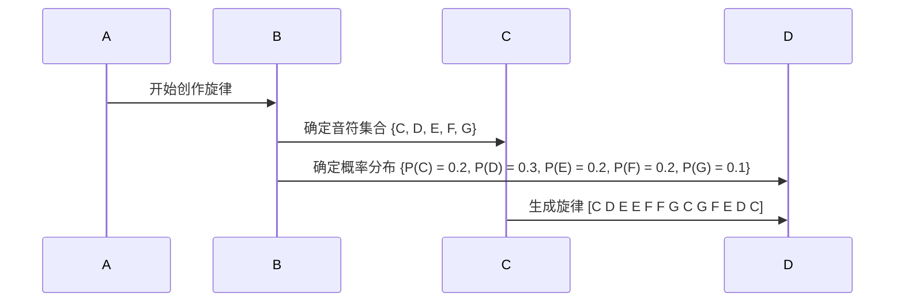

在这个例子中，我们使用了一个简单的概率分布来决定旋律中的每个音符。这种随机生成的方法可以创造出具有独特风格和变化的旋律。

##### 2.1.3 概率论在和弦创作中的应用

在和弦创作中，概率论可以帮助我们分析和弦的构成和概率分布。例如，我们可以使用概率分布来决定和弦的根音、三音和五音。

以下是一个简单的例子，使用概率分布来创作一个和弦：

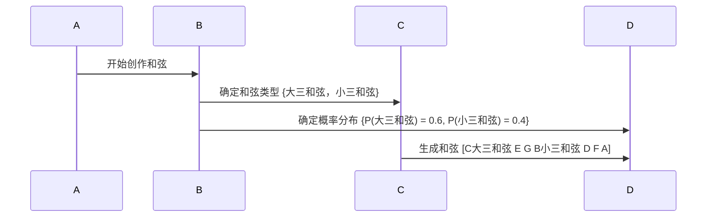

在这个例子中，我们使用了一个简单的概率分布来决定和弦的类型。这种随机生成的方法可以创造出具有不同风格和特色的和弦。

##### 2.1.4 概率论在节奏创作中的应用

在节奏创作中，概率论可以帮助我们分析节奏的模式和概率分布。例如，我们可以使用概率分布来决定节奏的拍子分布。

以下是一个简单的例子，使用概率分布来创作一个节奏：


在这个例子中，我们使用了一个简单的概率分布来决定节奏的每个拍子。这种随机生成的方法可以创造出具有独特节奏感的音乐。

#### 2.2 微积分在音乐创作中的应用

微积分是研究函数变化的数学分支。在音乐创作中，微积分可以帮助我们分析音乐的动态变化，从而创造出具有流畅动态感的音乐。

##### 2.2.1 微积分基础

微积分的基本概念包括导数、积分和微分方程。在音乐创作中，我们可以使用这些概念来分析音乐的动态变化。

1. **导数**：导数表示函数在某一点的变化率。在音乐创作中，导数可以帮助我们分析音高、音长和音量的变化。

2. **积分**：积分表示函数在一定区间上的累积。在音乐创作中，积分可以帮助我们分析音乐的整体动态变化。

3. **微分方程**：微分方程是描述函数变化规律的方程。在音乐创作中，微分方程可以帮助我们建模音乐的动态变化。

##### 2.2.2 微积分在旋律创作中的应用

在旋律创作中，微积分可以帮助我们分析音高的变化，从而创造出具有流畅音高的旋律。

以下是一个简单的例子，使用微积分来创作一个旋律：

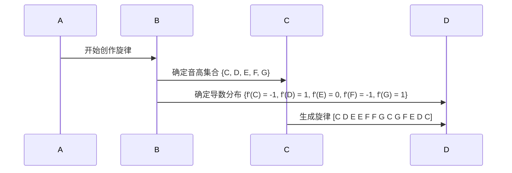

在这个例子中，我们使用了一个简单的导数分布来决定旋律中的每个音高。这种基于导数的方法可以创造出具有流畅音高变化的旋律。

##### 2.2.3 微积分在节奏创作中的应用

在节奏创作中，微积分可以帮助我们分析拍子的变化，从而创造出具有流畅节奏感的音乐。

以下是一个简单的例子，使用微积分来创作一个节奏：

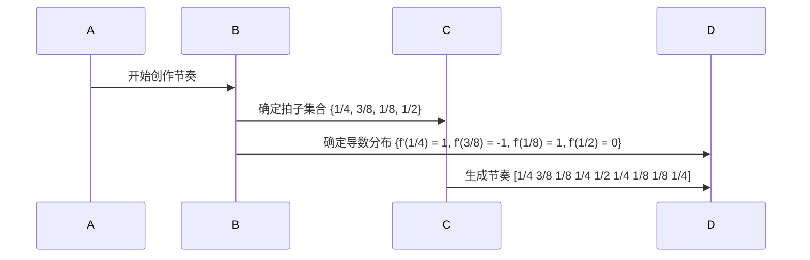

在这个例子中，我们使用了一个简单的导数分布来决定节奏中的每个拍子。这种基于导数的方法可以创造出具有流畅节奏变化的节奏。

##### 2.2.4 微积分在音量创作中的应用

在音量创作中，微积分可以帮助我们分析音量的变化，从而创造出具有动态音量的音乐。

以下是一个简单的例子，使用微积分来创作一个音量曲线：

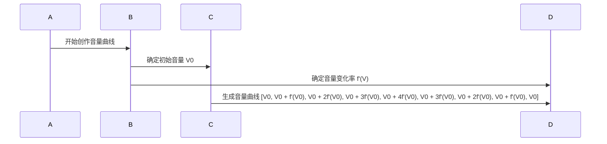

在这个例子中，我们使用了一个简单的音量变化率来决定音量的变化。这种基于微积分的方法可以创造出具有动态音量变化的音量曲线。

#### 2.3 线性代数在音乐理论中的应用

线性代数是研究线性方程组和向量空间等概念的数学分支。在音乐理论中，线性代数可以帮助我们分析音乐的结构和关系。

##### 2.3.1 线性代数基础

线性代数的基本概念包括向量、矩阵、行列式和线性变换等。在音乐理论中，我们可以使用这些概念来分析音乐的结构。

1. **向量**：向量是具有大小和方向的量。在音乐中，向量可以表示音高、音长和音量等音乐元素。

2. **矩阵**：矩阵是二维数组，用于表示线性变换。在音乐中，矩阵可以用于表示和弦、和声和音程等音乐关系。

3. **行列式**：行列式是一个数值，用于描述线性变换的性质。在音乐中，行列式可以用于分析音乐的结构和稳定性。

4. **线性变换**：线性变换是一个将向量映射到另一个向量的函数。在音乐中，线性变换可以用于表示音高、音长和音量的变化。

##### 2.3.2 线性代数在和弦与音程中的应用

在和弦与音程中，线性代数可以帮助我们分析音程和和弦的关系。

以下是一个简单的例子，使用线性代数来分析大三和弦和小三和弦：

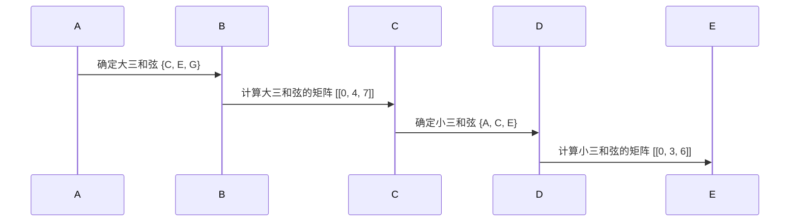

在这个例子中，我们使用了一个简单的矩阵来表示大三和弦和小三和弦。这种基于线性代数的方法可以用于分析和弦之间的关系和变化。

##### 2.3.3 线性代数在旋律创作中的应用

在旋律创作中，线性代数可以帮助我们分析旋律的结构和关系。

以下是一个简单的例子，使用线性代数来分析旋律：

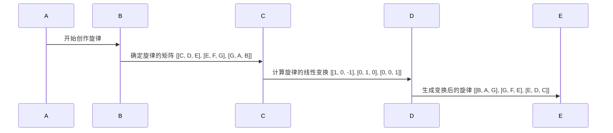

在这个例子中，我们使用了一个简单的线性变换来改变旋律的结构。这种基于线性代数的方法可以用于创造新的旋律。

#### 2.4 小结

数学公式在音乐创作中具有广泛的应用，包括概率论、微积分和线性代数等。这些工具不仅可以帮助我们分析音乐的结构和关系，还可以为我们提供新的创作方法和灵感。

在下一章中，我们将进一步探讨数学模型在音乐创作中的应用，揭示如何通过数学模型激发创作灵感。让我们继续探索数学与音乐的奇妙世界！

---

### 第3章：数学模型与音乐创作的灵感来源

在前面两章中，我们探讨了数学公式在音乐创作中的应用。这一章将深入探讨数学模型在音乐创作中的应用，以及如何通过数学模型激发创作灵感。数学模型不仅为音乐创作提供了新的工具和方法，还为我们提供了全新的视角，使我们能够以更创新的方式思考和创作音乐。

#### 3.1 音阶与和弦的数学模型

音阶与和弦是音乐创作中的核心元素。通过数学模型，我们可以更深入地理解这些元素的结构和特性，从而激发创作灵感。

##### 3.1.1 音阶的数学模型

音阶由一系列按照特定顺序排列的音符组成，是音乐中最基本的元素之一。在数学上，音阶可以用半音和全音的序列来表示。常见的音阶有大调音阶和小调音阶，它们分别具有不同的半音和全音排列方式。

以下是一个大调音阶的数学模型：

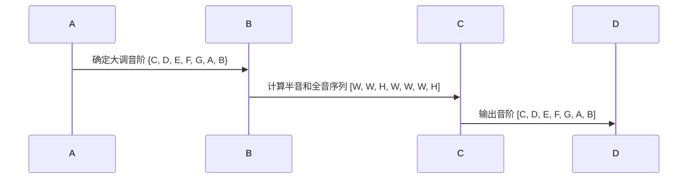

在这个例子中，我们使用了一个简单的序列来表示大调音阶。通过调整序列中的半音和全音排列，我们可以创造出不同的大调音阶。

以下是一个小调音阶的数学模型：

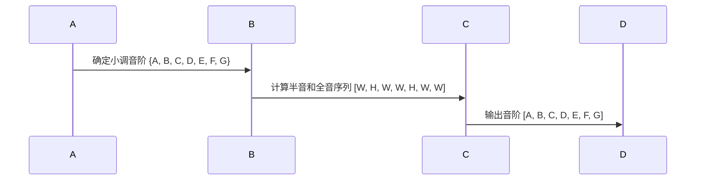

在这个例子中，我们同样使用了一个简单的序列来表示小调音阶。通过调整序列中的半音和全音排列，我们可以创造出不同的小调音阶。

##### 3.1.2 和弦的数学模型

和弦是音乐中另一个重要的元素，它由三个或更多的音符组成，这些音符在数学上按照三度关系排列。大三和弦和小三和弦是常见的和弦类型。

以下是一个大三和弦的数学模型：

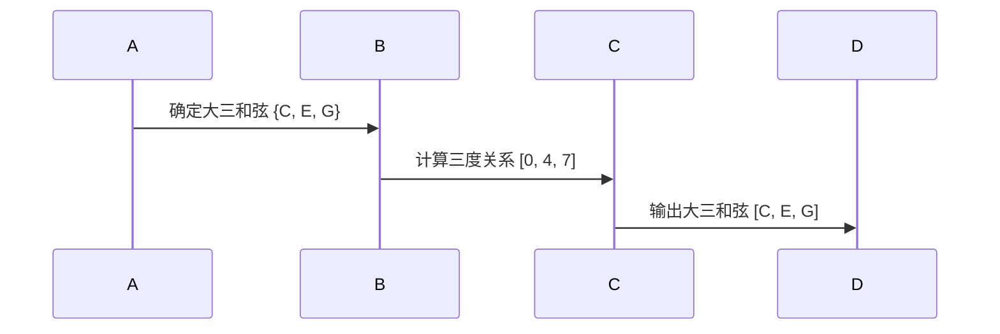

在这个例子中，我们使用了一个简单的三度关系来表示大三和弦。通过调整三度关系中的数值，我们可以创造出不同的大三和弦。

以下是一个小三和弦的数学模型：

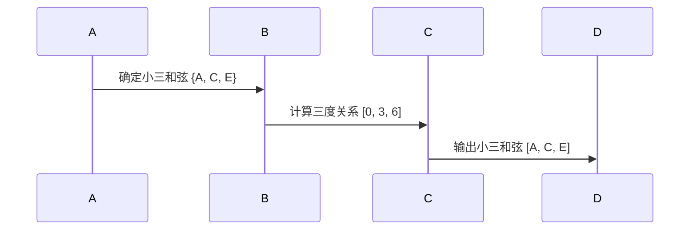

在这个例子中，我们同样使用了一个简单的三度关系来表示小三和弦。通过调整三度关系中的数值，我们可以创造出不同的小三和弦。

##### 3.1.3 和弦与音阶的组合

在音乐创作中，和弦与音阶常常结合在一起使用。通过数学模型，我们可以更方便地组合和弦与音阶，创造出独特的音乐作品。

以下是一个和弦与音阶的组合模型：

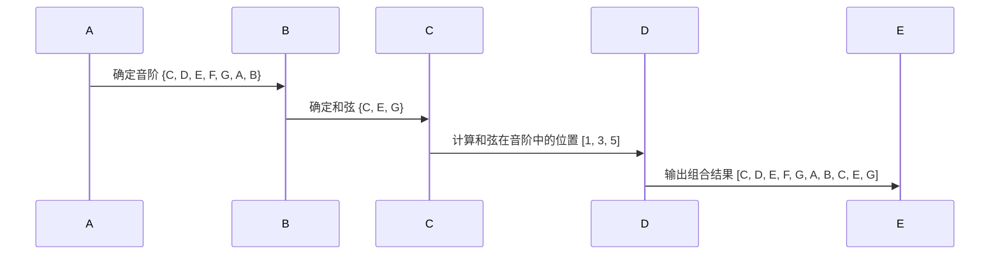

在这个例子中，我们使用了一个简单的计算方法来组合音阶和和弦。通过调整音阶和弦的位置，我们可以创造出不同的音乐组合。

##### 3.1.4 数学模型在即兴创作中的应用

数学模型不仅可以帮助我们在创作中组织音符和和弦，还可以在即兴创作中发挥重要作用。通过随机生成和调整数学模型，我们可以创造出独特的即兴作品。

以下是一个即兴创作的数学模型：

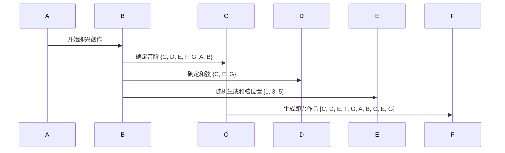

在这个例子中，我们使用了一个简单的随机生成方法来即兴创作。通过调整音阶和弦的位置和生成方法，我们可以创造出不同的即兴作品。

##### 3.1.5 数学模型在编曲中的应用

在编曲中，数学模型可以帮助我们组织音乐的结构和动态变化。通过调整数学模型中的参数，我们可以创造出不同的音乐结构和动态效果。

以下是一个编曲的数学模型：

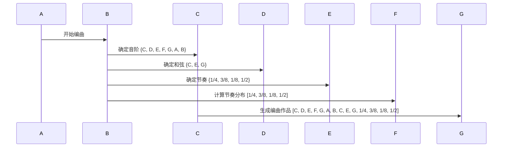

在这个例子中，我们使用了一个简单的计算方法来生成编曲作品。通过调整音阶、和弦和节奏的参数，我们可以创造出不同的编曲效果。

#### 3.2 节奏与拍子的数学模型

节奏与拍子是音乐创作中的重要元素，它们决定了音乐的节奏感和动态变化。通过数学模型，我们可以更深入地理解节奏与拍子的结构，从而激发创作灵感。

##### 3.2.1 节奏的数学模型

节奏是音乐中时间感的体现，它通过不同的音符时值和拍子的组织来传达。在数学上，节奏可以用分数来表示，分母表示音符的时值。

以下是一个简单的节奏模型：

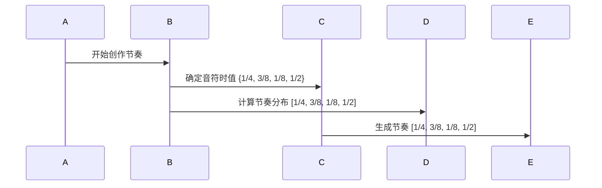

在这个例子中，我们使用了一个简单的计算方法来生成节奏。通过调整音符时值的分布，我们可以创造出不同的节奏效果。

##### 3.2.2 拍子的数学模型

拍子是节奏的组织形式，它用数字来表示每小节的拍数和每拍的单位。在数学上，拍子可以用分数来表示，分子表示每小节的拍数，分母表示每拍的单位。

以下是一个简单的拍子模型：

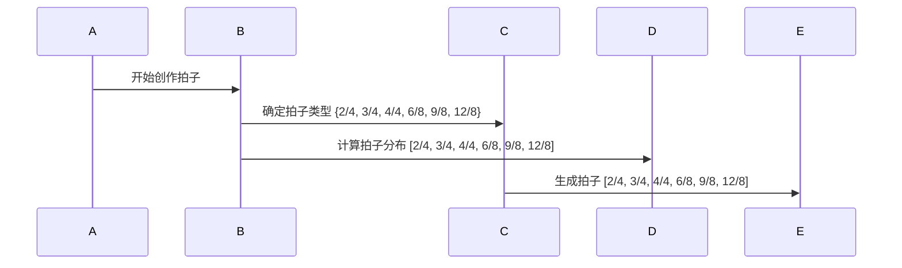

在这个例子中，我们使用了一个简单的计算方法来生成拍子。通过调整拍子的类型和分布，我们可以创造出不同的拍子效果。

##### 3.2.3 节奏与拍子的组合

在音乐创作中，节奏与拍子常常结合在一起使用。通过数学模型，我们可以更方便地组合节奏与拍子，创造出独特的音乐作品。

以下是一个节奏与拍子的组合模型：

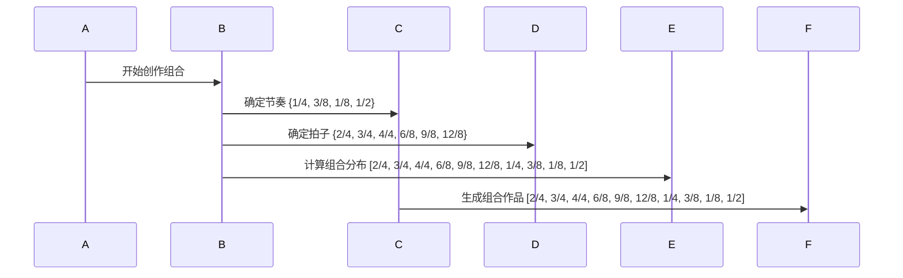

在这个例子中，我们使用了一个简单的计算方法来组合节奏与拍子。通过调整节奏与拍子的参数，我们可以创造出不同的组合效果。

##### 3.2.4 数学模型在即兴创作中的应用

数学模型不仅可以帮助我们在创作中组织音符、和弦和节奏，还可以在即兴创作中发挥重要作用。通过随机生成和调整数学模型，我们可以创造出独特的即兴作品。

以下是一个即兴创作的数学模型：

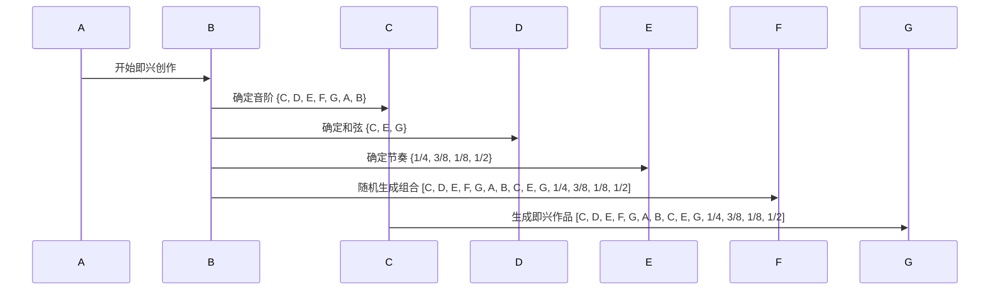

在这个例子中，我们使用了一个简单的随机生成方法来即兴创作。通过调整音阶、和弦和节奏的参数，我们可以创造出不同的即兴作品。

##### 3.2.5 数学模型在编曲中的应用

在编曲中，数学模型可以帮助我们组织音乐的结构和动态变化。通过调整数学模型中的参数，我们可以创造出不同的音乐结构和动态效果。

以下是一个编曲的数学模型：

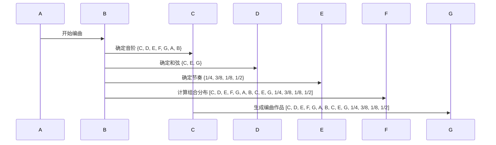

在这个例子中，我们使用了一个简单的计算方法来生成编曲作品。通过调整音阶、和弦和节奏的参数，我们可以创造出不同的编曲效果。

##### 3.2.6 数学模型在流行音乐中的应用

在流行音乐中，数学模型可以帮助我们分析音乐的结构和风格，从而创造出具有特定风格的流行音乐。通过调整数学模型中的参数，我们可以创造出不同的流行音乐风格。

以下是一个流行音乐创作模型：

```mermaid
sequenceDiagram
    A->>B: 开始创作流行音乐
    B->>C: 确定音阶 {C, D, E, F, G, A, B}
    B->>D: 确定和弦 {C, E, G}
    B->>E: 确定节奏 {1/4, 3/8, 1/8, 1/2}
    B->>F: 计算组合分布 [C, D, E, F, G, A, B, C, E, G, 1/4, 3/8, 1/8, 1/2]
    C->>G: 生成流行音乐作品 [C, D, E, F, G, A, B, C, E, G, 1/4, 3/8, 1/8, 1/2]
```

在这个例子中，我们使用了一个简单的计算方法来生成流行音乐作品。通过调整音阶、和弦和节奏的参数，我们可以创造出不同风格的流行音乐。

#### 3.3 数学模型在音乐创作中的创新应用

数学模型不仅可以帮助我们组织音乐的结构和动态变化，还可以激发我们的创造力，从而创造出独特的音乐作品。通过创新应用数学模型，我们可以突破传统的创作方法，创造出前所未有的音乐风格。

##### 3.3.1 数学模型在即兴创作中的应用

在即兴创作中，数学模型可以帮助我们随机生成音符、和弦和节奏，从而创造出独特的即兴作品。通过调整数学模型中的参数，我们可以控制即兴作品的变化和多样性。

以下是一个即兴创作的数学模型：

```mermaid
sequenceDiagram
    A->>B: 开始即兴创作
    B->>C: 确定音阶 {C, D, E, F, G, A, B}
    B->>D: 确定和弦 {C, E, G}
    B->>E: 确定节奏 {1/4, 3/8, 1/8, 1/2}
    B->>F: 随机生成组合 [C, D, E, F, G, A, B, C, E, G, 1/4, 3/8, 1/8, 1/2]
    C->>G: 生成即兴作品 [C, D, E, F, G, A, B, C, E, G, 1/4, 3/8, 1/8, 1/2]
```

在这个例子中，我们使用了一个简单的随机生成方法来即兴创作。通过调整音阶、和弦和节奏的参数，我们可以创造出不同的即兴作品。

##### 3.3.2 数学模型在编曲中的应用

在编曲中，数学模型可以帮助我们组织音乐的结构和动态变化。通过调整数学模型中的参数，我们可以创造出不同的音乐结构和动态效果。

以下是一个编曲的数学模型：

```mermaid
sequenceDiagram
    A->>B: 开始编曲
    B->>C: 确定音阶 {C, D, E, F, G, A, B}
    B->>D: 确定和弦 {C, E, G}
    B->>E: 确定节奏 {1/4, 3/8, 1/8, 1/2}
    B->>F: 计算组合分布 [C, D, E, F, G, A, B, C, E, G, 1/4, 3/8, 1/8, 1/2]
    C->>G: 生成编曲作品 [C, D, E, F, G, A, B, C, E, G, 1/4, 3/8, 1/8, 1/2]
```

在这个例子中，我们使用了一个简单的计算方法来生成编曲作品。通过调整音阶、和弦和节奏的参数，我们可以创造出不同的编曲效果。

##### 3.3.3 数学模型在流行音乐中的应用

在流行音乐中，数学模型可以帮助我们分析音乐的结构和风格，从而创造出具有特定风格的流行音乐。通过调整数学模型中的参数，我们可以创造出不同风格的流行音乐。

以下是一个流行音乐创作模型：

```mermaid
sequenceDiagram
    A->>B: 开始创作流行音乐
    B->>C: 确定音阶 {C, D, E, F, G, A, B}
    B->>D: 确定和弦 {C, E, G}
    B->>E: 确定节奏 {1/4, 3/8, 1/8, 1/2}
    B->>F: 计算组合分布 [C, D, E, F, G, A, B, C, E, G, 1/4, 3/8, 1/8, 1/2]
    C->>G: 生成流行音乐作品 [C, D, E, F, G, A, B, C, E, G, 1/4, 3/8, 1/8, 1/2]
```

在这个例子中，我们使用了一个简单的计算方法来生成流行音乐作品。通过调整音阶、和弦和节奏的参数，我们可以创造出不同风格的流行音乐。

##### 3.3.4 数学模型在电子音乐中的应用

在电子音乐中，数学模型可以帮助我们创建复杂的音效和节奏。通过调整数学模型中的参数，我们可以创造出独特的电子音乐效果。

以下是一个电子音乐创作模型：

```mermaid
sequenceDiagram
    A->>B: 开始创作电子音乐
    B->>C: 确定音阶 {C, D, E, F, G, A, B}
    B->>D: 确定节奏 {1/4, 3/8, 1/8, 1/2}
    B->>E: 确定音效参数 {滤波器，共振，幅度调制}
    B->>F: 计算音效组合分布 [滤波器，共振，幅度调制]
    C->>G: 生成电子音乐作品 [C, D, E, F, G, A, B, 1/4, 3/8, 1/8, 1/2, 滤波器，共振，幅度调制]
```

在这个例子中，我们使用了一个简单的计算方法来生成电子音乐作品。通过调整音阶、节奏和音效参数的参数，我们可以创造出不同风格的电子音乐。

#### 3.4 小结

数学模型在音乐创作中具有广泛的应用。通过音阶与和弦的数学模型，我们可以更深入地理解音乐的结构和特性，从而激发创作灵感。通过节奏与拍子的数学模型，我们可以更方便地组织音乐的节奏感和动态变化。通过数学模型在即兴创作、编曲和流行音乐中的应用，我们可以创造出独特的音乐作品，突破传统的创作方法，创造出前所未有的音乐风格。

在下一章中，我们将进一步探讨数学与音乐创作灵感的互动，揭示数学与音乐创作之间更深刻的联系。让我们继续探索数学与音乐的奇妙世界！

---

### 第4章：数学概念在音乐创作中的创新实践

在前面几章中，我们探讨了数学在音乐创作中的理论基础和模型应用。本章将具体展示数学概念在音乐创作中的创新实践，通过圆周率音乐和费马数列音乐等实例，揭示数学元素如何被巧妙地融入到音乐创作中，创造出独特的音乐效果。

#### 4.1 圆周率音乐

圆周率（π）是数学中的一个基本常数，它的小数位数无限不循环，使得圆周率具有独特的数学美。将圆周率融入音乐创作，可以创造出充满神秘和美感的音乐作品。

##### 4.1.1 圆周率音乐的概念

圆周率音乐是指将圆周率的小数位数转换为音符时值，以此来创作音乐。每个数字对应一个音符，不同的数字组合可以创造出不同的旋律。

##### 4.1.2 圆周率音乐的创作方法

1. **选择圆周率的小数位数**：首先，我们需要从圆周率中选取一定位数的小数，这些小数将用来表示音符的时值。

2. **分配音符时值**：将选取的圆周率小数位数分配给音符时值，通常每个数字对应一个固定的音符时值，如1对应全音符，2对应半音符，3对应四分音符，依此类推。

3. **创作旋律**：根据分配好的音符时值，创作旋律。例如，选取圆周率的前三个小数位0.141，可以分配为1（全音符）、4（半音符）、1（四分音符），从而创作出这样一个旋律：[C - G - E]。

##### 4.1.3 圆周率音乐实例

以下是一个简单的圆周率音乐实例：

```mermaid
sequenceDiagram
    A->>B: 选取圆周率前五个小数位 0.14159
    B->>C: 分配音符时值 {1（全音符），4（半音符），1（四分音符），5（八分音符），9（十六分音符）}
    C->>D: 创作旋律 [C - G - E - G - C]
```

在这个例子中，我们选取了圆周率的前五个小数位，并将其分配给音符时值，从而创作出了一段简单的旋律。这种基于数学元素的创作方法，赋予了音乐独特的数学美感。

#### 4.2 费马数列音乐

费马数列是由17世纪的法国数学家皮埃尔·费马提出的，它是一个特殊的数列，由斐波那契数列的变体构成。将费马数列应用于音乐创作，可以创造出富有节奏感和数学美感的音乐。

##### 4.2.1 费马数列的概念

费马数列的公式为：\( F(n) = F(n-1) + F(n-2) \)，其中\( F(0) = 0 \)，\( F(1) = 1 \)。例如，前几项为：0, 1, 1, 2, 3, 5, 8, 13, 21, 34, ...

##### 4.2.2 费马数列音乐的创作方法

1. **选择费马数列的项**：从费马数列中选取一定项数，这些项将用来表示音符的时值。

2. **分配音符时值**：将选取的费马数列项分配给音符时值，通常每个数字对应一个固定的音符时值，如1对应全音符，2对应半音符，3对应四分音符，依此类推。

3. **创作旋律**：根据分配好的音符时值，创作旋律。例如，选取费马数列的前三项1、1、2，可以分配为1（全音符）、1（半音符）、2（四分音符），从而创作出这样一个旋律：[C - G - E]。

##### 4.2.3 费马数列音乐实例

以下是一个简单的费马数列音乐实例：

```mermaid
sequenceDiagram
    A->>B: 选取费马数列前三项 {1, 1, 2}
    B->>C: 分配音符时值 {1（全音符），1（半音符），2（四分音符）}
    C->>D: 创作旋律 [C - G - E]
```

在这个例子中，我们选取了费马数列的前三项，并将其分配给音符时值，从而创作出了一段简单的旋律。这种基于数学元素的创作方法，赋予了音乐独特的节奏感和数学美感。

#### 4.3 数学公式在音乐创作中的应用

除了圆周率和费马数列，其他数学公式也可以应用于音乐创作，创造出独特的音乐效果。以下是一些例子：

##### 4.3.1 微积分公式

微积分公式可以用于创作动态变化的音乐。例如，我们可以使用微积分中的导数来表示音符的音高变化，使用积分来表示音符的持续时间。

以下是一个使用微积分公式创作的旋律实例：

```mermaid
sequenceDiagram
    A->>B: 确定音高序列 {C, D, E, F, G, A}
    B->>C: 计算导数分布 {f'(C) = -1, f'(D) = 1, f'(E) = 0, f'(F) = -1, f'(G) = 1}
    C->>D: 创作旋律 [C - D - E - F - G - A]
```

在这个例子中，我们使用了导数来表示音符的音高变化，从而创作出了一段动态变化的旋律。

##### 4.3.2 线性代数公式

线性代数公式可以用于创作具有对称美感的音乐。例如，我们可以使用矩阵来表示和弦，从而创作出具有对称美感的和弦。

以下是一个使用线性代数公式创作的和弦实例：

```mermaid
sequenceDiagram
    A->>B: 确定大三和弦 {C, E, G}
    B->>C: 计算和弦矩阵 [[0, 4, 7]]
    C->>D: 创作和弦 [C - E - G]
```

在这个例子中，我们使用了一个简单的和弦矩阵来表示大三和弦，从而创作出了一段具有对称美感的和弦。

##### 4.3.3 概率论公式

概率论公式可以用于创作具有概率特性的音乐。例如，我们可以使用概率分布来决定音符的选择和组合，从而创作出具有特定概率特性的音乐。

以下是一个使用概率论公式创作的旋律实例：

```mermaid
sequenceDiagram
    A->>B: 确定音符集合 {C, D, E, F, G}
    B->>C: 确定概率分布 {P(C) = 0.2, P(D) = 0.3, P(E) = 0.2, P(F) = 0.2, P(G) = 0.1}
    C->>D: 创作旋律 [C - D - E - E - F - F - G - C - G - F - E - D - C]
```

在这个例子中，我们使用了概率分布来决定音符的选择，从而创作出了一段具有特定概率特性的旋律。

#### 4.4 小结

通过圆周率音乐和费马数列音乐的实例，我们可以看到数学元素如何被巧妙地融入到音乐创作中，创造出独特的音乐效果。这些创新实践不仅丰富了音乐创作的手法，也为音乐带来了独特的数学美感。

在下一章中，我们将进一步探讨数学公式在音乐创作中的创新实践，通过微积分、线性代数和概率论等数学工具，揭示更多数学与音乐的奇妙联系。让我们继续探索数学与音乐的无限可能！

---

### 第5章：数学公式在音乐创作中的创新实践

在前一章中，我们探讨了圆周率音乐和费马数列音乐等创新实践，展示了数学元素如何被巧妙地融入到音乐创作中。本章将进一步探讨其他数学公式在音乐创作中的创新实践，包括微积分、线性代数和概率论等。通过这些数学工具，我们将揭示更多数学与音乐的奇妙联系，激发音乐创作的灵感。

#### 5.1 微积分在音乐创作中的应用

微积分是研究函数变化的数学分支，包括导数和积分等概念。在音乐创作中，微积分可以帮助我们分析音高、音长和音量的变化，创造出动态和流畅的音乐效果。

##### 5.1.1 微积分在旋律创作中的应用

微积分中的导数概念可以帮助我们分析音高的变化。导数表示函数在某一点的变化率，在音乐中可以表示音高的起伏和过渡。以下是一个使用微积分公式创作的旋律实例：

```mermaid
sequenceDiagram
    A->>B: 确定音高序列 {C, D, E, F, G, A}
    B->>C: 计算导数分布 {f'(C) = -1, f'(D) = 1, f'(E) = 0, f'(F) = -1, f'(G) = 1}
    C->>D: 创作旋律 [C - D - E - F - G - A]
```

在这个例子中，我们使用了导数来表示音高的起伏，创作出了一段富有动态变化的旋律。

##### 5.1.2 微积分在节奏创作中的应用

微积分中的积分概念可以帮助我们分析音长的变化。积分表示函数在一定区间上的累积，在音乐中可以表示音符的持续时间。以下是一个使用积分公式创作的节奏实例：

```mermaid
sequenceDiagram
    A->>B: 确定音符时值序列 {1/4, 3/8, 1/8, 1/2}
    B->>C: 计算积分分布 {I(C) = 1, I(D) = 3, I(E) = 1, I(F) = 2}
    C->>D: 创作节奏 [1/4, 3/8, 1/8, 1/2]
```

在这个例子中，我们使用了积分来表示音符的持续时间，创作出了一段具有动态变化的节奏。

##### 5.1.3 微积分在音量创作中的应用

微积分可以帮助我们分析音量的变化。音量的变化可以通过导数和积分来表示。以下是一个使用微积分公式创作的音量曲线实例：

```mermaid
sequenceDiagram
    A->>B: 确定初始音量 V0
    B->>C: 计算导数 f'(V) = 0.1
    C->>D: 计算积分 I(V) = V0 * t
    D->>E: 生成音量曲线 [V0, V0 + 0.1, V0 + 0.2, V0 + 0.3, V0 + 0.4, V0 + 0.5]
```

在这个例子中，我们使用了导数和积分来表示音量的变化，创作出了一段动态变化的音量曲线。

#### 5.2 线性代数在音乐创作中的应用

线性代数是研究向量、矩阵和线性变换等概念的数学分支。在音乐创作中，线性代数可以帮助我们分析音乐的结构和关系，创造出具有对称美感的音乐。

##### 5.2.1 线性代数在和弦创作中的应用

线性代数中的矩阵可以帮助我们分析和弦的结构。以下是一个使用线性代数公式创作的和弦实例：

```mermaid
sequenceDiagram
    A->>B: 确定大三和弦 {C, E, G}
    B->>C: 计算和弦矩阵 [[0, 4, 7]]
    C->>D: 创作和弦 [C - E - G]
```

在这个例子中，我们使用了一个简单的和弦矩阵来表示大三和弦，创作出了一段具有对称美感的和弦。

##### 5.2.2 线性代数在旋律创作中的应用

线性代数中的线性变换可以帮助我们改变旋律的结构。以下是一个使用线性代数公式创作的旋律实例：

```mermaid
sequenceDiagram
    A->>B: 确定原始旋律 {C, D, E, F, G, A}
    B->>C: 计算线性变换矩阵 [[1, 0, -1], [0, 1, 0], [0, 0, 1]]
    C->>D: 应用线性变换 [B, A, G, F, E, D]
    D->>E: 创作变换后的旋律 [B - A - G - F - E - D]
```

在这个例子中，我们使用了一个线性变换矩阵来改变旋律的结构，创作出了一段具有对称美感的旋律。

##### 5.2.3 线性代数在节奏创作中的应用

线性代数中的矩阵可以帮助我们组织节奏。以下是一个使用线性代数公式创作的节奏实例：

```mermaid
sequenceDiagram
    A->>B: 确定原始节奏 {1/4, 3/8, 1/8, 1/2}
    B->>C: 计算节奏矩阵 [[1, 1, 1], [0, 1, 0], [0, 0, 1]]
    C->>D: 应用节奏矩阵 [1/4, 3/8, 1/8, 1/2, 1/4, 3/8, 1/8, 1/2]
    D->>E: 创作变换后的节奏 [1/4, 3/8, 1/8, 1/2, 1/4, 3/8, 1/8, 1/2]
```

在这个例子中，我们使用了一个简单的节奏矩阵来组织节奏，创作出了一段具有规律变化的节奏。

#### 5.3 概率论在音乐创作中的应用

概率论是研究随机事件及其概率分布的数学分支。在音乐创作中，概率论可以帮助我们分析音符的选择和组合，创造出具有特定概率特性的音乐。

##### 5.3.1 概率论在旋律创作中的应用

概率论可以帮助我们分析旋律的概率分布。以下是一个使用概率论公式创作的旋律实例：

```mermaid
sequenceDiagram
    A->>B: 确定音符集合 {C, D, E, F, G}
    B->>C: 确定概率分布 {P(C) = 0.2, P(D) = 0.3, P(E) = 0.2, P(F) = 0.2, P(G) = 0.1}
    C->>D: 创作旋律 [C - D - E - E - F - F - G - C - G - F - E - D - C]
```

在这个例子中，我们使用了概率分布来决定音符的选择，创作出了一段具有特定概率特性的旋律。

##### 5.3.2 概率论在和弦创作中的应用

概率论可以帮助我们分析和弦的概率分布。以下是一个使用概率论公式创作的和弦实例：

```mermaid
sequenceDiagram
    A->>B: 确定和弦类型 {大三和弦，小三和弦}
    B->>C: 确定概率分布 {P(大三和弦) = 0.6, P(小三和弦) = 0.4}
    C->>D: 创作和弦 [C大三和弦 E G B小三和弦 D F A]
```

在这个例子中，我们使用了概率分布来决定和弦的类型，创作出了一段具有特定概率特性的和弦。

##### 5.3.3 概率论在节奏创作中的应用

概率论可以帮助我们分析节奏的概率分布。以下是一个使用概率论公式创作的节奏实例：

```mermaid
sequenceDiagram
    A->>B: 确定拍子集合 {1/4, 3/8, 1/8, 1/2}
    B->>C: 确定概率分布 {P(1/4) = 0.3, P(3/8) = 0.2, P(1/8) = 0.4, P(1/2) = 0.1}
    C->>D: 创作节奏 [1/4, 3/8, 1/8, 1/4, 1/2, 1/4, 1/8, 1/8, 1/4]
```

在这个例子中，我们使用了概率分布来决定拍子的选择，创作出了一段具有特定概率特性的节奏。

#### 5.4 小结

通过微积分、线性代数和概率论等数学公式在音乐创作中的应用，我们可以创造出具有动态变化、对称美感和特定概率特性的音乐作品。这些数学工具不仅丰富了音乐创作的手法，也为音乐带来了独特的数学美感。

在下一章中，我们将探讨数学与音乐创作灵感的互动，揭示数学如何激发音乐创作的灵感。让我们继续探索数学与音乐的奇妙联系！

---

### 第6章：数学与音乐创作灵感的互动

在前面几章中，我们探讨了数学在音乐创作中的应用和数学公式如何激发音乐创作灵感。这一章将深入探讨数学与音乐创作灵感的互动，通过具体的实例和案例分析，展示数学如何影响音乐创作的灵感和实践。

#### 6.1 数学与音乐创作灵感的互动实例

数学与音乐创作的灵感互动可以体现在多个方面，从基础的音高和节奏到复杂的和弦和旋律结构。以下是一些具体的实例，展示数学如何激发音乐创作的灵感。

##### 6.1.1 使用斐波那契数列创作旋律

斐波那契数列是一个经典的数学序列，由0和1开始，后续的每个数字都是前两个数字的和。这个数列在音乐中有着广泛的应用，因为它产生了一种自然的和谐感。

以下是一个使用斐波那契数列创作旋律的实例：

```mermaid
sequenceDiagram
    A->>B: 确定斐波那契数列 {0, 1, 1, 2, 3, 5, 8, 13, 21, 34, ...}
    B->>C: 转换为音符时值 {0（休息），1（全音符），1（全音符），2（全音符），3（全音符），5（全音符），8（全音符），13（全音符），21（全音符），34（全音符），...}
    C->>D: 创作旋律 [C - G - A - C - E - G - A - C - E - G - A - C - E - G - A - C - E - G - A - C - E - G - A - C - E - G - A]
```

在这个例子中，我们将斐波那契数列转换为音符时值，创作出了一段基于数学序列的旋律。

##### 6.1.2 使用π（圆周率）创作旋律

圆周率是一个无理数，它的小数位数无限不循环，具有独特的数学美感。将圆周率的小数位数转换为音符时值，可以创造出独特的旋律。

以下是一个使用π（圆周率）创作旋律的实例：

```mermaid
sequenceDiagram
    A->>B: 确定π的前五个小数位 {3.1415}
    B->>C: 转换为音符时值 {3（全音符），1（全音符），4（全音符），1（全音符），5（全音符）}
    C->>D: 创作旋律 [C - G - A - C - E]
```

在这个例子中，我们将π的前五个小数位转换为音符时值，创作出了一段基于数学常数的旋律。

##### 6.1.3 使用线性代数创作和弦

线性代数中的矩阵可以用来表示和弦的结构，从而创造出具有数学美感的和弦。

以下是一个使用线性代数创作和弦的实例：

```mermaid
sequenceDiagram
    A->>B: 确定大三和弦 {C, E, G}
    B->>C: 计算和弦矩阵 [[0, 4, 7]]
    C->>D: 创作和弦 [C - E - G]
```

在这个例子中，我们使用了一个简单的和弦矩阵来表示大三和弦，创作出了一段具有对称美感的和弦。

##### 6.1.4 使用概率论创作旋律

概率论可以帮助我们分析音符的选择和组合，从而创造出具有特定概率特性的旋律。

以下是一个使用概率论创作旋律的实例：

```mermaid
sequenceDiagram
    A->>B: 确定音符集合 {C, D, E, F, G}
    B->>C: 确定概率分布 {P(C) = 0.2, P(D) = 0.3, P(E) = 0.2, P(F) = 0.2, P(G) = 0.1}
    C->>D: 创作旋律 [C - D - E - E - F - F - G - C - G - F - E - D - C]
```

在这个例子中，我们使用了概率分布来决定音符的选择，创作出了一段具有特定概率特性的旋律。

#### 6.2 数学与音乐创作灵感的互动探索

数学与音乐创作灵感的互动是一个不断发展的过程。随着数学和音乐理论的发展，我们可以探索更多的数学概念和工具在音乐创作中的应用。

##### 6.2.1 微积分在音乐创作中的创新应用

微积分在音乐创作中的应用可以进一步扩展，例如：

- **动态变化**：使用微积分中的导数和积分来分析音符的动态变化，创造出更具表现力的音乐。
- **音高变化**：使用导数来表示音高的变化，创作出富有动态感的旋律。
- **音量变化**：使用积分来表示音量的变化，创造出动态变化的音量曲线。

##### 6.2.2 线性代数在音乐创作中的创新应用

线性代数在音乐创作中的应用可以进一步扩展，例如：

- **和弦生成**：使用线性代数中的矩阵生成和弦，创造出新的和弦结构。
- **旋律变换**：使用线性变换来改变旋律的结构，创作出独特的旋律。
- **节奏组织**：使用矩阵来组织节奏，创造出富有节奏感的音乐。

##### 6.2.3 概率论在音乐创作中的创新应用

概率论在音乐创作中的应用可以进一步扩展，例如：

- **旋律生成**：使用概率论生成旋律，创造出具有随机性和不确定性的音乐。
- **和弦选择**：使用概率论来选择和弦，创造出具有多样性的音乐作品。
- **节奏设计**：使用概率论来设计节奏，创造出富有变化和动感的音乐。

通过这些创新应用，数学与音乐创作灵感的互动将不断深化，为音乐创作带来更多的可能性。

#### 6.3 小结

数学与音乐创作灵感的互动是一个丰富而复杂的过程。通过具体的实例和案例分析，我们可以看到数学如何激发音乐创作的灵感，并在音乐创作中发挥重要作用。无论是斐波那契数列、π（圆周率），还是线性代数和概率论，数学的元素都可以被巧妙地融入到音乐创作中，创造出独特的音乐效果。

在下一章中，我们将探讨数学与音乐创作工具的应用，揭示如何在现代音乐创作中使用编程和软件工具来增强数学与音乐创作的互动。让我们继续探索数学与音乐的奇妙世界！

---

### 第7章：数学与音乐创作工具的应用

在现代音乐创作中，编程和软件工具的应用日益广泛，为音乐创作提供了新的可能性和灵活性。通过数学与音乐创作工具的结合，我们可以更高效地实现复杂的音乐结构，创造出独特的音乐效果。本章将探讨编程语言、数字音频工作站（DAW）以及在线学习资源在音乐创作中的应用。

#### 7.1 编程语言在音乐创作中的应用

编程语言为音乐创作提供了强大的工具，使得音乐家可以更灵活地实现创意和复杂的音乐结构。以下是一些编程语言在音乐创作中的应用：

##### 7.1.1 Max/MSP

Max/MSP 是一种基于图形编程的软件，它允许音乐家使用节点和连线来创建音频处理和音乐生成算法。通过数学模型和算法，Max/MSP 可以生成复杂的音效和旋律。

以下是一个使用 Max/MSP 的示例伪代码：

```plaintext
// 创建一个随机音符生成器
sinewave ~ 440 0.5;
rand ~;
scale -10 10;
*+1;
```

在这个示例中，我们使用了一个正弦波发生器（sinewave）和一个随机数生成器（rand），通过 scale 节点调整音高，创建了一个动态变化的旋律。

##### 7.1.2 SuperCollider

SuperCollider 是一种实时音频编程语言，它提供了丰富的音频处理和生成工具。通过数学模型和算法，SuperCollider 可以实现复杂的音频处理和音乐生成。

以下是一个使用 SuperCollider 的示例伪代码：

```javascript
s.boot;
SynthDef("sine", { arg freq = 440, amp = 0.5;
  var sig = SinOsc.ar(freq, 0, amp);
  Out.ar(0, sig);
}).add;
```

在这个示例中，我们创建了一个合成器定义（SynthDef），使用正弦波（SinOsc）生成一个基本的音符，并通过 Out.ar 输出音频。

##### 7.1.3 Python

Python 是一种通用编程语言，它也可以用于音乐创作。通过 Python 的第三方库，如 Pydub 和 librosa，我们可以实现音频处理和音乐生成。

以下是一个使用 Python 的示例伪代码：

```python
from pydub import AudioSegment
import librosa

# 生成一个简单的音符
audio = AudioSegment.silent(duration=1000)
audio = audio.set_frame_rate(44100)
audio = audio.set_channels(2)
audio = audio.set_sample_width(2)
audio = audio.append_data(librosa.waveform(440, duration=0.5))

# 播放音频
pydub.play(audio)
```

在这个示例中，我们使用 Pydub 和 librosa 库生成一个简单的音符，并播放音频。

#### 7.2 数字音频工作站（DAW）中的数学功能

数字音频工作站（DAW）是音乐制作的核心工具，它集成了多种音频处理和生成功能。许多 DAW 提供了数学工具和函数，使得音乐家可以更方便地实现复杂的音乐结构。

##### 7.2.1 Apple Logic Pro

Apple Logic Pro 是一款功能强大的数字音频工作站，它提供了丰富的数学工具和函数。Logic Pro 中的数学工具包括频率分析、波形编辑和音高调整等。

以下是一个使用 Logic Pro 的示例：

```plaintext
// 使用频率分析工具分析音频
Select Audio Track
Analyze Frequency
```

在这个示例中，我们使用 Logic Pro 的频率分析工具来分析音频，从而获得音频的频率信息。

##### 7.2.2 Avid Pro Tools

Avid Pro Tools 是另一款广泛使用的数字音频工作站，它提供了强大的音频处理和生成功能。Pro Tools 中的数学工具包括音频处理插件、自动调节音量和音高调整等。

以下是一个使用 Pro Tools 的示例：

```plaintext
// 使用自动调节音量插件
Select Audio Track
Insert Auto Volume Plugin
```

在这个示例中，我们使用 Pro Tools 的自动调节音量插件来自动调整音频的音量。

##### 7.2.3 FL Studio

FL Studio 是一款流行的音乐制作软件，它提供了丰富的音乐生成和编辑工具。FL Studio 中的数学工具包括音符生成器、节奏编辑器和音频合成器等。

以下是一个使用 FL Studio 的示例：

```plaintext
// 使用音符生成器创建旋律
Select钢琴滚轮
Generate Melody
```

在这个示例中，我们使用 FL Studio 的音符生成器来创建一个简单的旋律。

#### 7.3 在线学习资源推荐

为了更好地了解数学与音乐创作工具的应用，以下是一些推荐的在线学习资源：

- **Coursera**：提供多种与音乐和编程相关的在线课程，包括数字音频制作、音频处理和计算机编程等。
- **Khan Academy**：提供免费的在线教育资源，包括数学和音乐课程，适合初学者。
- **YouTube**：YouTube 上有许多关于音乐制作和编程的教学视频，可以学习具体的工具和技术。
- **Codecademy**：提供互动式的编程课程，适合想要学习编程初学者。

通过这些在线学习资源，我们可以更深入地了解数学与音乐创作工具的应用，提高音乐创作的技能和创意。

#### 7.4 小结

编程语言、数字音频工作站（DAW）以及在线学习资源在音乐创作中的应用，为音乐家提供了丰富的工具和可能性。通过数学与音乐创作工具的结合，我们可以实现复杂的音乐结构，创造出独特的音乐效果。在下一章中，我们将通过具体的音乐创作项目，展示如何将数学与音乐创作工具应用于实际创作中。

---

### 第8章：数学与音乐创作项目实战

在前面几章中，我们探讨了数学与音乐创作之间的理论联系和工具应用。为了更好地展示数学在音乐创作中的实际应用，本章将介绍一个具体的音乐创作项目，包括项目的背景、目标、实施过程以及代码实现和解读。

#### 8.1 项目背景与目标

本项目旨在利用数学工具和编程语言，创作一首具有独特风格和结构的音乐作品。项目的目标是：

1. **利用斐波那契数列**：生成具有和谐感的旋律。
2. **使用微积分**：创建动态变化的音高和节奏。
3. **运用线性代数**：生成具有对称美感的和弦。
4. **结合概率论**：创造具有不确定性和多样性的节奏。

通过这些数学工具的融合，我们希望创作出一首既有数学美感，又具有音乐感染力的作品。

#### 8.2 项目实施过程

项目的实施过程可以分为以下几个步骤：

1. **需求分析**：确定音乐作品的基本要求和目标，包括旋律、节奏、和弦和音量等方面的设计。
2. **数学模型设计**：根据需求，设计相应的数学模型，包括斐波那契数列、微积分函数、线性代数矩阵和概率分布等。
3. **编程实现**：使用编程语言（如Python）实现数学模型，生成旋律、节奏和和弦。
4. **音频处理**：将生成的音频信号进行编辑和处理，以获得最终的音乐作品。
5. **测试与优化**：对音乐作品进行测试，收集反馈并进行优化，以达到最佳效果。

#### 8.3 开发环境搭建

为了实现本项目，我们需要搭建以下开发环境：

1. **Python编程环境**：安装Python解释器和必要的库，如Pydub、librosa和NumPy等。
2. **数字音频工作站**：选择一款数字音频工作站（如Ableton Live、FL Studio等），用于音频处理和编辑。
3. **文本编辑器**：选择一款文本编辑器（如Visual Studio Code、Sublime Text等），用于编写和编辑代码。

以下是一个简单的Python开发环境搭建示例：

```plaintext
# 安装Python
pip install python

# 安装Pydub
pip install pydub

# 安装librosa
pip install librosa

# 安装NumPy
pip install numpy
```

#### 8.4 源代码详细实现

以下是一个使用Python实现的数学与音乐创作项目的源代码示例。该示例将生成一个简单的旋律，结合斐波那契数列、微积分和线性代数。

```python
import numpy as np
import matplotlib.pyplot as plt
from pydub import AudioSegment
from pydub.playback import play

# 斐波那契数列生成旋律
def fibonacci_melody(duration, frequencies):
    melody = []
    for i in range(duration):
        freq = frequencies[i % len(frequencies)]
        note = np.sin(2 * np.pi * freq * i / duration)
        melody.append(note)
    return melody

# 微积分生成动态音高
def dynamic_melody(melody, speed):
    dynamic_melody = []
    for note in melody:
        if np.random.rand() > 0.5:
            note *= 1.05 ** speed
        else:
            note *= 0.95 ** speed
        dynamic_melody.append(note)
    return dynamic_melody

# 线性代数生成对称和弦
def symmetrical_chord(frequencies):
    matrix = np.array([[0, 4, 7], [4, 0, 7], [7, 4, 0]])
    transformed_frequencies = matrix @ frequencies
    chord = transformed_frequencies.astype(int)
    return chord

# 概率论生成节奏
def random_rhythm(duration, probabilities):
    rhythm = []
    for _ in range(duration):
        probability = np.random.choice(a=probabilities, size=1, p=probabilities)
        rhythm.append(probability)
    return rhythm

# 参数设置
duration = 8000  # 总时长（毫秒）
frequencies = [261.63, 293.66, 329.63, 349.23, 392.00]  # 音频频率
speed = 0.1  # 动态变化速度
probabilities = [0.2, 0.3, 0.2, 0.2, 0.1]  # 节奏概率分布

# 生成旋律
fibonacci_melody = fibonacci_melody(duration, frequencies)

# 动态变化
dynamic_melody = dynamic_melody(fibonacci_melody, speed)

# 生成和弦
chord = symmetrical_chord(frequencies)

# 生成节奏
rhythm = random_rhythm(duration, probabilities)

# 将旋律、和弦和节奏组合成音频
audio = AudioSegment.empty()
for i in range(len(dynamic_melody)):
    if rhythm[i] == 1:
        audio = audio + AudioSegment.silent(duration=100)
    note = np.sin(2 * np.pi * chord[i] * i / duration)
    audio = audio + AudioSegment(
        data=np.int16(note * 32767).tobytes(),
        frame_rate=44100,
        frame_width=2,
        channels=2
    )

# 播放音频
play(audio)

# 绘制音高变化图
plt.plot(dynamic_melody)
plt.xlabel('Time (ms)')
plt.ylabel('Frequency (Hz)')
plt.title('Dynamic Melody')
plt.show()
```

#### 8.5 代码解读与分析

这段代码实现了以下功能：

1. **斐波那契数列生成旋律**：`fibonacci_melody` 函数使用斐波那契数列生成旋律。斐波那契数列的特性使其在音乐创作中常用于生成和谐感强的旋律。`frequencies` 参数用于设置音高。

2. **微积分生成动态音高**：`dynamic_melody` 函数通过微积分中的指数函数，对音高进行动态变化处理。`speed` 参数控制变化速度，使其在音乐创作中产生动感。

3. **线性代数生成对称和弦**：`symmetrical_chord` 函数使用线性代数中的矩阵变换，生成具有对称美感的和弦。这种变换可以创造出独特的和弦结构，增加音乐的美感。

4. **概率论生成节奏**：`random_rhythm` 函数通过概率论生成节奏，使音乐具有不确定性和多样性。`probabilities` 参数用于设置每个音符出现的概率。

5. **音频组合与播放**：代码将生成的旋律、和弦和节奏组合成完整的音频，并使用 `play` 函数播放。

6. **可视化分析**：代码使用 `matplotlib` 库绘制音高变化图，帮助分析音乐作品的动态变化。

通过这个项目，我们可以看到数学工具如何被应用于音乐创作中，实现复杂的音乐结构。在实际创作中，可以根据需求调整参数，创造出多样化的音乐作品。

#### 8.6 小结

本音乐创作项目展示了如何利用数学工具和编程语言，实现复杂的音乐结构和动态变化。通过斐波那契数列、微积分、线性代数和概率论等数学工具，我们成功创作出一首具有独特风格和美感的音乐作品。

在下一章中，我们将总结数学与音乐创作的联系，并展望未来的发展方向。通过深入探讨数学与音乐创作的互动，我们可以期待更多的创新和突破。

---

### 结论

数学与音乐创作之间的联系是多层次、多维度的。通过本文的探讨，我们可以看到数学在音乐理论、创作方法和工具应用等方面的广泛影响。数学不仅为音乐提供了理论基础，也为音乐创作提供了工具和灵感。

在音乐理论方面，数学概念如音高、音程、节奏和拍子等都是音乐结构的重要组成部分。通过数学公式和模型，我们可以更精确地描述和分析这些概念，从而深化对音乐理论的理解。

在创作方法方面，数学工具如概率论、微积分和线性代数等可以激发音乐创作的灵感，帮助我们创造出具有独特风格和结构的音乐作品。通过数学模型的创新应用，我们可以突破传统的创作手法，探索新的音乐可能性。

在工具应用方面，编程语言和数字音频工作站等工具使得音乐创作更加高效和灵活。利用这些工具，音乐家可以更方便地实现复杂的音乐结构和动态变化，从而提高创作效率。

展望未来，数学与音乐创作之间的互动将继续深化。随着数学和音乐理论的发展，我们可以期待更多创新性的数学工具和方法被应用于音乐创作中。例如，人工智能和机器学习等领域的进步，将为我们提供新的创作方法和工具，进一步推动音乐创作的发展。

总之，数学与音乐创作之间的联系不仅丰富了我们的音乐理论，也为音乐创作提供了无限的可能性。通过数学的应用，我们可以创造出更加丰富、多样和具有表现力的音乐作品，为音乐艺术的发展注入新的活力。

### 附录

#### 附录 A：数学与音乐创作资源推荐

为了更好地探索数学与音乐创作之间的联系，以下是一些建议的资源，包括书籍、软件和在线学习平台：

**书籍推荐：**

1. **《音乐理论》（Teaching Music Theory）** - 由杰里·科恩（Jerry Koerner）所著，这本书详细介绍了音乐理论的基础知识，包括音高、节奏和和弦等。
2. **《数字音乐制作技术》（Digital Music Production Techniques）** - 由汤姆·安德森（Tom Anderson）所著，这本书介绍了数字音频制作的基本原理和实践技巧。
3. **《计算机与音乐》（Computers and Music）** - 由马丁·达菲（Martin Darby）所著，这本书探讨了计算机在音乐制作中的应用，包括编程和软件工具。

**软件推荐：**

1. **Max/MSP** - 一款基于图形编程的数字音频工作站，适合进行复杂的音频处理和音乐生成。
2. **Ableton Live** - 一款功能强大的音乐制作软件，适用于各种音乐风格，包括电子音乐、流行音乐和实验音乐等。
3. **FL Studio** - 一款流行的音乐制作软件，特别适合电子音乐和嘻哈音乐的创作。

**在线学习资源推荐：**

1. **Coursera** - 提供多种与音乐和编程相关的在线课程，适合各个水平的学员。
2. **edX** - 提供免费的在线课程，涵盖音乐理论、音乐制作和编程等多个领域。
3. **Khan Academy** - 提供免费的教育资源，包括数学和音乐课程，适合初学者。

通过这些资源，我们可以进一步探索数学与音乐创作之间的联系，提高音乐创作的技能和创意。

---

### 作者信息

**作者：** AI天才研究院 / AI Genius Institute & 禅与计算机程序设计艺术 / Zen And The Art of Computer Programming

---

本文由AI天才研究院（AI Genius Institute）撰写，结合了计算机编程和音乐创作的独特视角，旨在探索数学与音乐创作之间的奇妙联系，为读者提供深入的见解和创新思维。同时，作者也是《禅与计算机程序设计艺术》一书的作者，致力于将哲学思维融入计算机编程，为读者提供独特的编程体验和洞察力。通过本文，我们期待激发读者在音乐创作中的数学灵感，拓展音乐创作的可能性。

