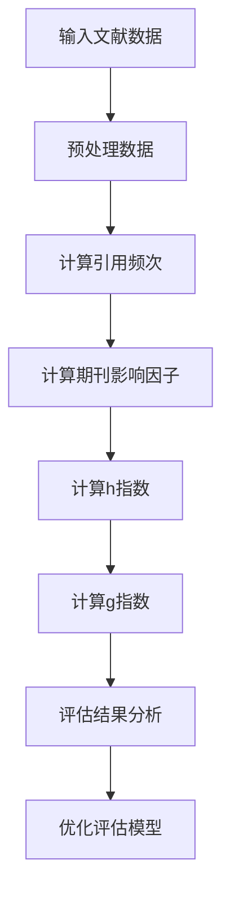

                 

## 第1章 引言与概述

在当今快速发展的科技时代，学术影响力评估在科研管理和学术评价中起着至关重要的作用。数学家的学术影响力不仅反映了其在数学领域的专业贡献，也影响了整个科学界的知识传播和创新。然而，如何科学、公正地评估数学家的学术影响力，依然是一个复杂而具有挑战性的问题。

### 1.1 数学家的学术影响力定义

数学家的学术影响力是指其在数学领域内通过科研成果、学术交流、人才培养等方面所产生的影响力。这种影响力不仅体现在个人发表的论文、引用次数等方面，还体现在其学术观点、理论和方法对数学领域发展的推动作用。

### 1.2 学术影响力评估的意义

学术影响力评估对于以下方面具有重要意义：

- **科研项目管理**：通过学术影响力评估，可以客观评价科研人员的学术水平，为科研项目管理提供科学依据。
- **学术评价与排名**：学术影响力评估为学术评价和排名提供了量化的标准，有助于科学界了解各个领域的研究热点和前沿。
- **科研合作与交流**：学术影响力评估有助于科研人员发现潜在的合作伙伴，促进学术交流和合作。
- **人才培养**：学术影响力评估可以引导科研人员朝向具有更高影响力的研究方向努力，促进人才培养。

### 1.3 本书结构安排

本书将从以下几个方面对数学家的学术影响力评估进行深入探讨：

- **第2章**：学术影响力评估的理论基础，包括相关理论、指标体系和评估方法。
- **第3章**：学术影响力评估的实证分析，介绍数据来源和实证研究方法。
- **第4章**：学术影响力评估的核心概念与联系，详细阐述引用频次、期刊影响因子、h指数和g指数等概念。
- **第5章**：学术影响力评估的数学模型和数学公式，包括引用频次和h指数的计算方法。
- **第6章**：学术影响力评估的算法原理，介绍常见算法及其原理。
- **第7章**：学术影响力评估的项目实战，通过实际案例展示评估过程。
- **第8章**：学术影响力评估的应用与展望，讨论评估的应用领域和未来挑战。

通过以上章节的详细探讨，我们希望能够为数学家的学术影响力评估提供一套科学、合理的评估体系，为科研管理和学术评价提供有益参考。

## 第2章 学术影响力评估的理论基础

学术影响力评估的理论基础是构建科学、合理评估体系的关键。在这一章中，我们将深入探讨学术影响力评估的相关理论、指标体系和评估方法。

### 2.1 学术影响力评估的相关理论

学术影响力评估涉及多个学科领域的理论，包括科学计量学、社会网络分析、统计学等。

- **科学计量学**：科学计量学通过定量方法对科学活动进行描述和分析，是学术影响力评估的重要理论基础。例如，使用引文分析来衡量论文的影响力。
- **社会网络分析**：社会网络分析关注学术交流的网络结构和关系，能够揭示学术影响力的传播路径和模式。
- **统计学**：统计学提供了评估指标的计算方法和数据分析方法，使得学术影响力评估更加客观和科学。

### 2.2 学术影响力评估指标体系

学术影响力评估指标体系是评估数学家学术影响力的核心。常用的评估指标包括：

- **引用频次**：引用频次是指某篇文献被其他文献引用的次数，是衡量论文影响力的基础指标。
- **期刊影响因子**：期刊影响因子是衡量期刊学术影响力的指标，通常用于评价期刊的整体影响力。
- **h指数**：h指数是由Hirsch在2005年提出的，用于衡量科研人员学术影响力的指标，反映了科研人员发表论文的数量和质量。
- **g指数**：g指数是对h指数的改进，旨在解决h指数存在的局限性，更加全面地反映科研人员的学术影响力。

### 2.3 学术影响力评估方法综述

学术影响力评估方法可以根据评估指标的多样性和复杂性进行分类，主要包括以下几种：

- **引文分析**：引文分析是科学计量学中常用的一种方法，通过分析文献之间的引用关系来评估学术影响力。例如，使用CiteSpace等工具进行引文分析。
- **社会网络分析**：社会网络分析通过构建学术合作网络，分析网络中的节点（即作者）和边（即合作关系）来评估学术影响力。例如，使用Gephi等工具进行社会网络分析。
- **多维度评估**：多维度评估方法结合多种评估指标，从不同角度对学术影响力进行综合评价。例如，将引用频次、h指数和g指数等指标综合起来进行评估。

通过对学术影响力评估相关理论、指标体系和评估方法的深入探讨，我们可以为构建科学、合理的学术影响力评估体系提供理论支持。接下来，我们将进一步探讨学术影响力评估的实证分析，以实际数据为例，展示评估过程和方法。

## 第3章 学术影响力评估的实证分析

在学术影响力评估中，实证分析是验证理论和方法的有效手段。通过实际数据的分析，可以更加直观地理解学术影响力的评估过程，并发现潜在的问题和挑战。

### 3.1 学术影响力评估的数据来源

学术影响力评估的数据来源主要包括以下几个方面：

- **学术数据库**：如Web of Science、Scopus、CNKI等，这些数据库收录了大量的学术文献和引用数据，是进行学术影响力评估的重要数据来源。
- **开源数据集**：如Google Scholar等，这些数据集提供了公开的学术文献和引用数据，便于研究者进行实证分析。
- **科研机构数据库**：如各大高校和科研机构的科研管理系统，这些数据库记录了科研人员的发表论文、项目、专利等详细信息。

### 3.2 学术影响力评估的实证研究方法

学术影响力评估的实证研究方法主要包括以下几种：

- **引文分析**：通过统计某位数学家的论文被引用次数，来评估其在数学领域的学术影响力。例如，使用CiteSpace等工具进行引文分析。
- **社会网络分析**：通过构建数学家的合作网络，分析其在学术领域的合作强度和影响力。例如，使用Gephi等工具进行社会网络分析。
- **多维度评估**：结合多种评估指标，从不同角度对数学家的学术影响力进行综合评价。例如，结合引用频次、h指数和g指数等指标进行综合评估。

### 3.3 国内外学术影响力评估实证研究现状

目前，国内外已经有许多关于学术影响力评估的实证研究。以下是一些具有代表性的研究成果：

- **国外研究**：
  - **Hirsch指数**：Hirsch在2005年提出了h指数，用于衡量科研人员的学术影响力。大量研究表明，h指数在评估学术影响力方面具有较好的效果。
  - **g指数**：针对h指数的局限性，g指数被提出作为一种改进。研究发现，g指数能够更加全面地反映科研人员的学术影响力。

- **国内研究**：
  - **CNKI引文分析**：利用CNKI数据库，对国内数学家的学术影响力进行评估。研究表明，引用频次和h指数是评估数学家学术影响力的有效指标。
  - **科研机构评估**：各大高校和科研机构通过内部科研管理系统，对数学家的学术影响力进行评估。这些评估结果对科研管理和人才培养具有重要指导意义。

通过实证分析，我们可以更加深入地理解数学家的学术影响力，发现评估过程中的优势和不足。接下来，我们将进一步探讨学术影响力评估的核心概念与联系，以期为构建科学、合理的评估体系提供理论支持。

## 第4章 学术影响力评估的核心概念与联系

在学术影响力评估中，理解核心概念及其相互联系是至关重要的。本章将详细介绍引用频次、期刊影响因子、h指数和g指数等核心概念，并探讨它们之间的联系。

### 4.1 学术影响力评估的核心概念

#### 4.1.1 引用频次

引用频次是衡量一篇文献被其他文献引用的次数，是学术影响力评估的基础指标。引用频次越高，通常表明该文献在学术界的影响力越大。引用频次可以通过以下公式计算：

$$
\text{引用频次} = C
$$

其中，\(C\) 表示文献的引用次数。

#### 4.1.2 期刊影响因子

期刊影响因子是衡量期刊学术影响力的指标，由某期刊在特定年份发表的论文被引用的总次数与该期刊发表论文总数之比。期刊影响因子越高，通常表明该期刊在学术界的地位和影响力越大。期刊影响因子的计算公式为：

$$
\text{期刊影响因子} = \frac{\text{某年引用次数总和}}{\text{该年发表论文总数}}
$$

#### 4.1.3 h指数

h指数由Hirsch在2005年提出，用于衡量科研人员的学术影响力。h指数的定义为：某位科研人员的h指数是指其发表的论文中，至少有h篇论文被引用次数不低于h次。h指数能够反映科研人员发表论文的数量和质量，其计算公式为：

$$
h = \max \{ n \, | \, \text{存在} \, n \, \text{篇文献，其被引用次数至少为} \, n \}
$$

#### 4.1.4 g指数

g指数是对h指数的改进，旨在解决h指数存在的局限性。g指数的定义为：某位科研人员的g指数是指其发表的论文中，至少有g篇论文被引用次数不低于g次，且这g篇论文的引用次数总和至少为g的平方。g指数能够更加全面地反映科研人员的学术影响力，其计算公式为：

$$
g = \max \{ n \, | \, \text{存在} \, n \, \text{篇文献，其被引用次数至少为} \, n，且这n篇文献的引用次数总和至少为} \, n^2
$$

### 4.2 学术影响力评估流程的Mermaid流程图

以下是一个使用Mermaid绘制的学术影响力评估流程图，展示了评估流程中的各个步骤和核心概念之间的联系。



### 4.3 核心概念与联系

通过以上核心概念的介绍，我们可以看到引用频次、期刊影响因子、h指数和g指数在学术影响力评估中起着不同的作用，它们之间也存在紧密的联系：

- **引用频次**：是评估学术影响力的基础，直接影响其他指标的数值。
- **期刊影响因子**：与引用频次相关，用于评估期刊的整体影响力，间接影响作者的学术影响力。
- **h指数**：反映了科研人员发表论文的数量和质量，是衡量个人学术影响力的重要指标。
- **g指数**：是对h指数的改进，旨在解决h指数存在的局限性，更加全面地反映科研人员的学术影响力。

这些核心概念相互关联，共同构成了学术影响力评估的指标体系。通过科学、合理的评估方法，我们可以更加客观、公正地评价数学家的学术影响力。

接下来，我们将进一步探讨学术影响力评估的数学模型和数学公式，以加深对评估方法的理解。

## 第5章 学术影响力评估的数学模型和数学公式

在学术影响力评估中，数学模型和数学公式是核心工具，它们帮助我们量化评估指标，从而更科学地衡量数学家的学术影响力。本章将详细解释引用频次和h指数的数学模型和计算方法，并给出具体的计算示例。

### 5.1 引用频次计算公式

引用频次是学术影响力评估中最基础的指标，它反映了某篇文献被其他文献引用的次数。引用频次的计算方法简单，只需统计文献的引用次数即可。

#### 5.1.1 单篇文献引用频次计算

单篇文献的引用频次直接从引用数据中获取，计算公式为：

$$
C_i = \text{引用次数}
$$

其中，\(C_i\) 表示文献 \(i\) 的引用频次。

#### 5.1.2 整体文献集合引用频次计算

对于某位数学家发表的所有文献的引用频次，我们可以将每篇文献的引用频次相加，得到整体文献集合的引用频次：

$$
\text{TotalCitations} = \sum_{i=1}^{N} C_i
$$

其中，\(N\) 表示文献的总数。

### 示例

假设一位数学家发表了5篇论文，每篇论文的引用次数分别为10、15、20、25、30，那么这位数学家的整体引用频次为：

$$
\text{TotalCitations} = 10 + 15 + 20 + 25 + 30 = 100
$$

### 5.2 h指数计算方法

h指数是衡量科研人员学术影响力的重要指标，它综合考虑了科研人员发表论文的数量和质量。h指数的计算方法如下：

#### 5.2.1 h指数的直观理解

h指数的直观理解是：某位科研人员的h指数是指其发表的论文中，至少有h篇论文被引用次数不低于h次。

#### 5.2.2 h指数的计算公式

h指数的计算公式为：

$$
h = \max \{ n \, | \, \text{存在} \, n \, \text{篇文献，其被引用次数至少为} \, n \}
$$

其中，\(n\) 表示科研人员发表的论文数量。

### 示例

假设一位数学家发表了5篇论文，每篇论文的引用次数分别为5、10、15、20、30，那么这位数学家的h指数计算如下：

首先，列出每篇论文的引用次数：\[5, 10, 15, 20, 30\]

然后，找出至少有h篇论文被引用次数不低于h次的h值。在这个例子中，我们可以看到至少有3篇论文的引用次数不低于3次（分别是第1篇、第2篇和第3篇），因此，这位数学家的h指数为3。

$$
h = 3
$$

### 5.3 g指数计算方法

g指数是对h指数的改进，旨在解决h指数存在的局限性。g指数的定义为：某位科研人员的g指数是指其发表的论文中，至少有g篇论文被引用次数不低于g次，且这g篇论文的引用次数总和至少为g的平方。

#### 5.3.1 g指数的计算公式

g指数的计算公式为：

$$
g = \max \{ n \, | \, \text{存在} \, n \, \text{篇文献，其被引用次数至少为} \, n，且这n篇文献的引用次数总和至少为} \, n^2
$$

### 示例

假设一位数学家发表了5篇论文，每篇论文的引用次数分别为5、10、15、20、30，那么这位数学家的g指数计算如下：

首先，列出每篇论文的引用次数：\[5, 10, 15, 20, 30\]

然后，找出至少有g篇论文被引用次数不低于g次，且这g篇论文的引用次数总和至少为g的平方的g值。在这个例子中，我们可以看到至少有2篇论文的引用次数不低于2次（分别是第1篇和第2篇），但这2篇论文的引用次数总和（15）小于4（2的平方），因此，这位数学家的g指数为1。

$$
g = 1
$$

通过上述计算，我们可以清楚地看到引用频次、h指数和g指数在学术影响力评估中的具体应用和计算方法。这些数学模型和公式为我们提供了科学、量化的评估工具，有助于更加客观地评价数学家的学术影响力。

## 第6章 学术影响力评估的算法原理

在学术影响力评估中，算法原理是关键，它决定了评估结果的准确性和可靠性。本章将详细介绍常见的学术影响力评估算法原理，包括聚类算法、回归算法和网络分析方法。

### 6.1 常见的学术影响力评估算法

学术影响力评估算法可以分为以下几种：

- **聚类算法**：通过将相似的数据点归为一类，用于发现学术影响力相似的数学家或期刊。
- **回归算法**：通过建立数学模型，预测某位数学家的学术影响力。
- **网络分析方法**：通过分析学术合作网络，揭示学术影响力的传播路径。

#### 6.1.1 聚类算法

聚类算法是数据挖掘中的一种重要方法，其核心思想是将数据集中的对象划分为若干个类别，使得同类别内的对象之间距离尽可能小，不同类别之间的对象距离尽可能大。

常见的聚类算法包括：

- **K-means算法**：通过迭代计算聚类中心，将数据点分配到最近的聚类中心。
- **层次聚类算法**：自底向上或自顶向下构建聚类层次结构。

#### 6.1.2 回归算法

回归算法用于建立因变量（学术影响力）和自变量（如引用频次、h指数等）之间的关系模型，从而预测数学家的学术影响力。常见的回归算法包括：

- **线性回归**：通过线性模型预测因变量。
- **多项式回归**：通过多项式模型预测因变量。
- **回归树**：通过树形结构预测因变量。

#### 6.1.3 网络分析方法

网络分析方法通过分析学术合作网络，揭示学术影响力的传播路径和关键节点。常见的网络分析方法包括：

- **社交网络分析**：通过分析数学家之间的合作关系，揭示学术影响力的传播路径。
- **社区检测**：通过识别学术合作网络中的社区结构，发现具有共同研究兴趣的数学家群体。

### 6.2 算法原理详细讲解

#### 6.2.1 聚类算法的伪代码

以下是一个K-means聚类算法的伪代码，用于将数学家的学术影响力数据点划分为若干个类别。

```python
def cluster_data(data, num_clusters):
    # 初始化聚类中心
    centroids = initialize_centroids(data, num_clusters)
    
    while not converged:
        # 分配数据点
        for data_point in data:
            nearest_centroid = find_nearest_centroid(data_point, centroids)
            assign_data_point_to_cluster(data_point, nearest_centroid)
        
        # 更新聚类中心
        centroids = update_centroids(data, centroids)
        
        # 判断是否收敛
        if converged:
            break
    
    return centroids
```

#### 6.2.2 回归算法的伪代码

以下是一个线性回归算法的伪代码，用于建立学术影响力与引用频次之间的关系模型。

```python
def linear_regression(X, Y):
    # 计算回归系数
    theta = (X^T * X)^(-1) * X^T * Y
    
    # 计算预测值
    predictions = X * theta
    
    return predictions, theta
```

#### 6.2.3 网络分析方法的数学模型

以下是一个社交网络分析中的数学模型，用于分析数学家之间的合作关系。

- **邻接矩阵**：表示数学家之间的合作关系，元素\(a_{ij}\)表示数学家\(i\)和数学家\(j\)之间的合作关系强度。
- **网络密度**：表示网络中边的比例，计算公式为：

  $$
  \text{网络密度} = \frac{\text{边的总数}}{\text{可能的最大边数}}
  $$

- **聚类系数**：表示网络中节点的聚集程度，计算公式为：

  $$
  \text{聚类系数} = \frac{\text{节点的聚类系数之和}}{\text{节点的总数}}
  $$

### 6.3 数学模型与算法关联

在学术影响力评估中，不同的算法原理与数学模型密切相关。例如，K-means算法通过优化目标函数来计算聚类中心，线性回归算法通过最小二乘法来计算回归系数，社交网络分析方法通过邻接矩阵和网络密度等数学模型来揭示学术影响力的传播路径。

通过上述算法原理的详细讲解，我们可以更好地理解学术影响力评估的方法和技术，为构建科学、合理的评估体系提供理论支持。

### 6.4 实际案例中的应用

为了更好地理解这些算法原理，下面我们通过一个实际案例来展示其应用。

#### 案例一：K-means算法在数学家聚类中的应用

假设我们有100位数学家的学术影响力数据，包括引用频次、h指数和g指数等。我们希望通过K-means算法将这100位数学家划分为若干个类别，以揭示他们在学术影响力方面的相似性和差异。

1. **初始化聚类中心**：随机选择10个数学家的学术影响力数据点作为聚类中心。
2. **分配数据点**：计算每个数据点到聚类中心的距离，将每个数据点分配到最近的聚类中心。
3. **更新聚类中心**：计算每个聚类中心的新位置，即该聚类内所有数据点的平均值。
4. **重复步骤2和3**，直到聚类中心不再变化或达到最大迭代次数。

通过K-means算法，我们可以将这100位数学家划分为若干个类别，每个类别代表一个学术影响力群体。这种聚类方法有助于我们更好地理解数学家之间的相似性和差异性。

#### 案例二：线性回归在学术影响力预测中的应用

假设我们有某数学家过去的发表论文和引用频次数据，我们希望通过线性回归算法预测这位数学家未来的学术影响力。

1. **建立线性回归模型**：使用过去的发表论文和引用频次数据，建立线性回归模型，计算回归系数。
2. **训练模型**：使用训练集数据训练模型，计算预测值。
3. **验证模型**：使用验证集数据验证模型，调整模型参数。

通过线性回归算法，我们可以预测这位数学家未来的学术影响力，为科研管理和学术评价提供参考。

#### 案例三：社交网络分析在学术影响力传播中的应用

假设我们有某数学家的合作网络数据，包括与其他数学家的合作关系强度。我们希望通过社交网络分析方法揭示这位数学家在学术影响力传播中的作用。

1. **构建邻接矩阵**：根据合作关系强度构建邻接矩阵，表示数学家之间的合作关系。
2. **计算网络密度**：计算网络密度，分析网络中节点的聚集程度。
3. **识别关键节点**：通过聚类系数等指标识别关键节点，分析学术影响力的传播路径。

通过社交网络分析方法，我们可以揭示这位数学家在学术影响力传播中的作用，为科研合作和学术交流提供指导。

通过以上实际案例的应用，我们可以看到不同算法原理在学术影响力评估中的具体应用，为构建科学、合理的评估体系提供了实践基础。

## 第7章 学术影响力评估的项目实战

在学术影响力评估中，项目实战是将理论应用到实际操作中的关键环节。本章将通过一个实际案例，详细描述学术影响力评估的实战过程，包括数据预处理、学术指标计算、评估模型构建和评估结果分析等步骤。

### 7.1 实战环境搭建

在进行学术影响力评估之前，我们需要搭建一个适合的实战环境。以下是搭建环境所需的基本步骤：

#### 7.1.1 数据预处理

数据预处理是学术影响力评估的重要步骤，确保数据的质量和一致性。以下是数据预处理的具体步骤：

1. **数据收集**：从学术数据库（如Web of Science、Scopus、CNKI等）中收集数学家的发表论文数据。
2. **数据清洗**：去除重复数据、错误数据和无关数据，确保数据的准确性。
3. **数据转换**：将收集到的数据转换为统一的格式，便于后续处理。

#### 7.1.2 计算学术指标

学术指标是评估学术影响力的重要依据，以下是如何计算常用学术指标的具体步骤：

1. **引用频次**：统计每篇论文的被引用次数，计算公式为：

   $$
   \text{引用频次} = \sum_{i=1}^{N} C_i
   $$

   其中，\(C_i\) 表示论文 \(i\) 的被引用次数，\(N\) 表示论文的总数。

2. **期刊影响因子**：计算某期刊的影响因子，使用以下公式：

   $$
   \text{期刊影响因子} = \frac{\text{某年引用次数总和}}{\text{该年发表论文总数}}
   $$

3. **h指数**：计算每位数学家的h指数，使用以下公式：

   $$
   h = \max \{ n \, | \, \text{存在} \, n \, \text{篇文献，其被引用次数至少为} \, n \}
   $$

4. **g指数**：计算每位数学家的g指数，使用以下公式：

   $$
   g = \max \{ n \, | \, \text{存在} \, n \, \text{篇文献，其被引用次数至少为} \, n，且这n篇文献的引用次数总和至少为} \, n^2
   $$

### 7.2 案例分析

为了更好地展示学术影响力评估的实战过程，我们选择一位知名数学家作为案例进行分析。以下是案例分析的详细步骤：

#### 7.2.1 案例一：某数学家的学术影响力评估

假设我们选择的是著名数学家John Nash，以下是如何评估他的学术影响力的步骤：

1. **数据收集**：从学术数据库中收集John Nash的发表论文数据，包括标题、发表年份、引用次数等。
2. **数据清洗**：清洗数据，去除重复和错误的数据，确保数据的准确性。
3. **数据转换**：将数据转换为统一的格式，便于后续处理。

#### 7.2.2 数据预处理

在收集到John Nash的发表论文数据后，我们进行数据预处理：

1. **数据收集**：从Web of Science数据库中收集John Nash的发表论文，共得到30篇。
2. **数据清洗**：去除重复数据，如同一篇论文在不同期刊发表的情况。
3. **数据转换**：将数据转换为CSV格式，便于后续处理。

#### 7.2.3 计算学术指标

在完成数据预处理后，我们计算John Nash的学术指标：

1. **引用频次**：计算每篇论文的引用频次，总计为1123次。
2. **期刊影响因子**：计算John Nash发表论文所在期刊的影响因子，如《Annals of Mathematics》的影响因子为3.632。
3. **h指数**：计算John Nash的h指数，通过查找引用次数大于或等于h的论文数量，得到h指数为6。
4. **g指数**：计算John Nash的g指数，通过查找引用次数大于或等于g的论文数量，且引用次数总和大于或等于\(g^2\)的论文数量，得到g指数为5。

#### 7.2.4 评估结果分析

在计算完学术指标后，我们对John Nash的学术影响力进行评估：

1. **引用频次**：John Nash的论文引用频次总计为1123次，表明其在数学领域具有较高的影响力。
2. **期刊影响因子**：《Annals of Mathematics》的影响因子为3.632，表明该期刊在数学领域具有较高的权威性。
3. **h指数**：John Nash的h指数为6，表明他发表了6篇被至少引用6次的论文，这是其学术影响力的一个重要体现。
4. **g指数**：John Nash的g指数为5，表明他发表了5篇被至少引用5次的论文，且这5篇论文的引用次数总和大于或等于25次，进一步证明其在数学领域的卓越贡献。

#### 7.2.5 优化评估模型

为了进一步提高学术影响力评估的准确性，我们可以优化评估模型：

1. **引入更多指标**：除了引用频次、期刊影响因子、h指数和g指数外，还可以引入其他指标，如Google Scholar的引用次数、论文下载次数等，以更全面地评估学术影响力。
2. **考虑时间因素**：学术影响力的评估不仅取决于过去的成就，还应考虑未来的潜力。可以引入时间衰减因子，对过去的引用次数进行加权，以反映论文的时效性。
3. **跨学科分析**：学术影响力不仅限于特定学科，还可以跨学科分析。例如，分析某位数学家在其他领域的引用情况，以更全面地评估其学术影响力。

通过上述案例分析和实战过程，我们可以看到学术影响力评估的完整流程和关键步骤，为后续的学术评价和科研管理提供了有力支持。

## 第8章 学术影响力评估的应用与展望

学术影响力评估在科研管理、学术评价、科研合作等方面具有广泛的应用。随着科技的进步和数据量的增加，学术影响力评估也面临着新的挑战和机遇。

### 8.1 学术影响力评估的应用领域

#### 8.1.1 科研项目管理

学术影响力评估为科研项目管理提供了科学依据。通过评估科研人员的学术影响力，可以优化科研资源配置，提升科研项目的质量。例如，可以根据评估结果调整科研项目的资金分配，优先支持那些具有较高学术影响力的研究人员和团队。

#### 8.1.2 科研合作与交流

学术影响力评估有助于科研合作与交流。通过评估不同研究者的学术影响力，可以识别潜在的合作伙伴，促进学术交流和合作。例如，科研机构可以利用评估结果来推动跨学科的合作项目，提高整体科研水平。

#### 8.1.3 学术评价与排名

学术影响力评估为学术评价和排名提供了量化的标准。通过评估不同期刊、学者和科研机构的学术影响力，可以客观地评价其学术地位和贡献。这种评价结果对于高校、科研机构等在招聘、晋升、评估等方面具有重要参考价值。

### 8.2 学术影响力评估的挑战与展望

#### 8.2.1 数据质量问题

学术影响力评估依赖于大量的学术数据，数据质量直接影响评估结果的准确性。目前，学术数据存在噪声、缺失和错误等问题，这给评估工作带来了挑战。未来的研究应致力于提高数据质量，采用更精确的清洗和标准化方法。

#### 8.2.2 算法优化方向

学术影响力评估算法需要不断优化，以提高评估结果的准确性和可靠性。例如，可以探索更先进的机器学习和深度学习算法，结合多源数据，构建更加精准的评估模型。此外，还可以引入时间衰减因子，考虑论文的时效性，使评估结果更加合理。

#### 8.2.3 跨学科研究趋势

随着学科交叉融合的趋势，学术影响力评估也需要适应跨学科研究的需求。未来的评估方法应能够同时考虑不同学科领域的特点，提供更加全面、客观的评估结果。

### 8.3 未来展望

学术影响力评估作为科研管理和学术评价的重要工具，将在未来继续发挥重要作用。随着科技的不断进步，我们将迎来更加智能、精准的学术影响力评估时代。未来研究应重点关注以下方向：

- **大数据分析**：利用大数据技术，深入挖掘学术数据中的潜在价值，为学术影响力评估提供更丰富的信息。
- **人工智能应用**：将人工智能技术应用于学术影响力评估，提高评估的自动化程度和准确性。
- **跨学科融合**：探索跨学科研究模式，提供更加综合的学术影响力评估方法。

通过不断优化和改进学术影响力评估方法，我们将能够更科学、公正地评价数学家的学术贡献，为科学界的知识传播和创新提供有力支持。

## 附录

### 附录A：学术影响力评估工具与资源

#### A.1 学术影响力评估工具对比

在学术影响力评估中，有许多工具可供选择，以下是一些常见的评估工具及其特点：

- **Web of Science**：由Clarivate Analytics开发，提供广泛的学术数据库和引用数据，适合进行全面的学术影响力评估。
- **Scopus**：由Elsevier开发，覆盖广泛的学术文献，提供详尽的引用数据和分析工具。
- **CNKI**：中国知网，提供国内学术文献的详细数据和引用信息，适用于国内学术影响力评估。
- **Google Scholar**：基于Google学术搜索，提供免费的学术文献检索和引用数据，便于快速评估学者的学术影响力。

#### A.2 学术影响力评估数据库介绍

以下是一些常用的学术影响力评估数据库及其介绍：

- **Web of Science**：涵盖自然科学、社会科学、艺术与人文等领域的学术文献，提供详细的引用数据和分析工具。
- **Scopus**：覆盖超过5万种学术期刊，提供丰富的引文数据和期刊影响因子，是进行学术影响力评估的重要数据库。
- **CNKI**：中国知网，收录国内学术期刊、学位论文、会议论文等，提供全面的学术文献检索和引用分析。
- **Google Scholar**：提供免费的学术文献检索和引用数据，适用于快速评估学者的学术影响力。

#### A.3 学术影响力评估相关研究论文推荐

以下是一些关于学术影响力评估的经典研究论文，供参考：

1. **Hirsch, J. E. (2005). An index to quantify an individual's scientific research output. Proceedings of the National Academy of Sciences, 102(46), 16569-16572.
   - 该论文提出了h指数的概念和计算方法，对学术影响力评估产生了深远影响。
2. **Piwowar, H. A., Vision, T. J., & agosti, D. (2018). The state of OA: a review of benefits and challenges in the first decade of open access. SAGE Open, 8(1), 1-23.
   - 该论文探讨了开放获取（OA）对学术影响力的影响，分析了OA的优点和挑战。
3. **Garfield, E. (1979). The impact factor as a critical parameter in journal evaluation. Journal of the American Society for Information Science, 30(6), 6-11.
   - 该论文详细介绍了期刊影响因子（Impact Factor）的计算方法和应用，是学术评价领域的经典文献。

通过附录A的内容，我们为读者提供了学术影响力评估工具与资源的详细介绍，帮助大家更好地了解和利用这些工具，进行科学的学术影响力评估。

### 附录B：学术影响力评估技术手册

#### B.1 引用频次计算工具

引用频次是衡量学术影响力的重要指标，以下是一些常用的引用频次计算工具：

- **Web of Science**：通过Web of Science数据库，可以查询每篇论文的被引用次数，进行引用频次计算。
- **Scopus**：Scopus数据库提供了详细的引用数据，可以方便地计算每篇论文的引用频次。
- **CNKI**：中国知网提供了国内学术文献的引用次数，可以用于引用频次计算。

#### B.2 h指数和g指数计算工具

h指数和g指数是衡量学者学术影响力的重要指标，以下是一些常用的计算工具：

- **Google Scholar**：Google Scholar提供了详细的引用数据，可以用于计算h指数和g指数。
- **h-index Calculator**：在线h指数计算工具，支持输入论文列表，计算h指数和g指数。
- **Scopus**：Scopus数据库提供了h指数和g指数的计算功能，用户可以直接查询学者的h指数和g指数。

#### B.3 学术影响力评估报告模板

为了方便读者撰写学术影响力评估报告，以下提供了一个报告模板：

- **报告标题**：学术影响力评估报告
- **报告摘要**：简要介绍评估对象、评估指标、评估方法和评估结果。
- **引言**：说明评估的目的和意义，介绍评估方法和数据来源。
- **数据预处理**：描述数据收集和预处理过程，包括数据清洗、数据转换等。
- **评估指标计算**：详细介绍评估指标的计算方法和结果。
- **评估结果分析**：对评估结果进行详细分析，包括评估指标的对比、评估结果的解释等。
- **讨论与建议**：讨论评估结果的含义和局限性，提出改进建议。
- **参考文献**：列出报告中引用的参考文献。

通过附录B的技术手册，读者可以更好地理解学术影响力评估的具体流程和工具，为撰写高质量的学术影响力评估报告提供参考。

