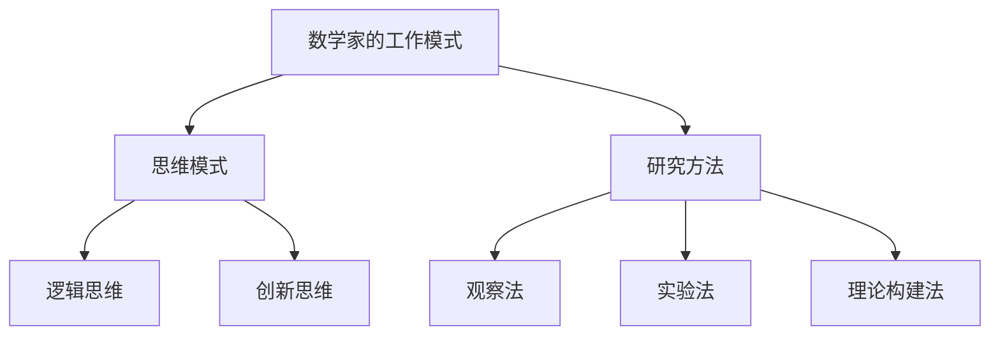

                 

### 《数学家的工作模式与创新效率研究》

#### 关键词：
数学家、工作模式、创新效率、思维模式、研究方法、实证研究、案例分析

#### 摘要：
本文旨在探讨数学家的工作模式与创新效率之间的关系。通过对数学家工作模式的概述、思维模式的分析、研究方法的阐述以及创新效率的评估，本文旨在为数学家及其相关领域的研究者提供一些有价值的参考。同时，通过著名数学家的案例分析，本文试图揭示数学家工作模式与创新效率的内在联系，并提出相应的提升策略。

---

### 《数学家的工作模式与创新效率研究》目录大纲

#### 第一部分：数学家的工作模式概述

#### 第1章：数学家的工作模式简介
1.1 数学家工作模式的定义与特点
1.2 数学家工作模式的演变历程
1.3 数学家工作模式的核心要素

#### 第2章：数学家的思维模式
2.1 数学家的逻辑思维
   2.1.1 归纳与演绎
   2.1.2 逆向思维与正向思维
2.2 数学家的创新思维
   2.2.1 创新的定义与类型
   2.2.2 创新思维的培养方法

#### 第3章：数学家的研究方法
3.1 数学家的基本研究方法
   3.1.1 观察法
   3.1.2 实验法
   3.1.3 理论构建法
3.2 数学家的研究流程
   3.2.1 问题提出
   3.2.2 理论假设
   3.2.3 研究验证
   3.2.4 研究总结

#### 第二部分：数学家的创新效率分析

#### 第4章：数学家的创新效率评估指标
4.1 创新效率的定义与分类
4.2 常见的创新效率评估指标
   4.2.1 产出指标
   4.2.2 影响力指标
   4.2.3 效率指标

#### 第5章：数学家的创新效率影响因素
5.1 内部因素
   5.1.1 数学家的个人能力
   5.1.2 数学家的心理素质
5.2 外部因素
   5.1.1 社会环境
   5.1.2 科技发展

#### 第6章：数学家的创新效率提升策略
6.1 个人策略
   6.1.1 持续学习与知识更新
   6.1.2 网络合作与交流
6.2 组织策略
   6.1.1 组织文化建设
   6.1.2 项目管理与资源调配

#### 第7章：数学家工作模式与创新效率的实证研究
7.1 研究方法与数据收集
7.2 研究结果与分析
7.3 研究结论与启示

#### 第三部分：案例研究

#### 第8章：著名数学家的工作模式与创新效率分析
8.1 欧拉的工作模式与创新效率
8.2 高斯的工作模式与创新效率
8.3 庞加莱的工作模式与创新效率

#### 附录

#### 附录A：数学家工作模式与创新效率研究方法指南
#### 附录B：数学家工作模式与创新效率研究工具推荐
#### 附录C：参考文献

---

#### 核心概念与联系

在研究数学家的工作模式与创新效率时，理解以下几个核心概念是非常重要的：

1. **数学家的工作模式**：指的是数学家在研究过程中采用的方法、步骤和思维习惯。它包括数学家的逻辑思维、创新思维和研究方法。

2. **创新效率**：指的是数学家在研究过程中产生创新成果的能力和效率。它可以通过创新产出、影响力指标和效率指标来评估。

3. **思维模式**：包括逻辑思维和创新思维。逻辑思维是数学家在研究过程中进行推理和验证的基础，而创新思维则是推动数学家产生新发现和新理论的关键。

4. **研究方法**：数学家在研究过程中采用的方法，如观察法、实验法和理论构建法。这些方法对于数学家的创新效率有着重要的影响。

下面是一个简化的 Mermaid 流程图，用以展示这些核心概念之间的联系：



#### 核心算法原理讲解

在数学家的创新过程中，核心算法原理的理解和应用是至关重要的。以下是一个简单的伪代码，用于阐述数学家的创新思维培养方法：

```python
# 培养创新思维的伪代码
def 培养创新思维（数学家）{
    输入：数学家
    输出：具有创新思维的数学家

    // 步骤1：持续学习
    学习数学理论、前沿研究

    // 步骤2：跨学科学习
    探索其他学科的知识，如物理学、计算机科学等

    // 步骤3：思维训练
    进行逻辑思维训练，如解谜题、逻辑推理等
    进行创新思维训练，如头脑风暴、思维导图等

    // 步骤4：实践应用
    将学到的知识和方法应用到实际研究中
}
```

这个伪代码展示了数学家如何通过持续学习、跨学科学习、思维训练和实践应用来培养创新思维。这一过程不仅需要数学家的努力，还需要环境的支持和资源的合理利用。

#### 数学模型和数学公式 & 详细讲解 & 举例说明

在数学家的研究中，数学模型和公式是其进行研究和推理的重要工具。以下是一个经典的数学公式——爱因斯坦的质能方程式（\(E = mc^2\)），及其详细讲解和举例说明：

##### 数学公式

$$
E = mc^2
$$

##### 详细讲解

这个公式表达了质量（\(m\)）和能量（\(E\)）之间的关系，其中 \(c\) 是光速，是一个恒定值（约为 \(3 \times 10^8\) 米/秒）。这个公式揭示了质量可以转化为能量，反之亦然，是现代物理学的重要基石。

##### 举例说明

假设有一个物体的质量是 \(1\) 千克，我们可以使用这个公式来计算它所包含的能量：

$$
E = 1 \text{ kg} \times (3 \times 10^8 \text{ m/s})^2 = 9 \times 10^{16} \text{ 焦耳}
$$

这意味着这个物体含有 \(9 \times 10^{16}\) 焦耳的能量。这一发现对于核能的研究和应用产生了深远的影响，例如在核反应堆和核武器中。

#### 项目实战

在数学家的实际研究中，项目实战是一个重要的环节。以下是一个简单的代码实际案例，用于模拟数学家的研究过程：

##### 代码实际案例

**代码片段：**
```python
# 导入必要的库
import numpy as np
import matplotlib.pyplot as plt

# 创建一个函数来模拟数学家的研究过程
def mathematical_research(x, y):
    # 步骤1：提出问题
    problem = "研究两个变量 x 和 y 的关系"

    # 步骤2：建立模型
    model = "y = ax + b"

    # 步骤3：收集数据
    data = np.random.rand(100, 2)

    # 步骤4：拟合模型参数
    a, b = np.polyfit(data[:, 0], data[:, 1], 1)

    # 步骤5：预测新数据
    x_new = np.linspace(0, 1, 100)
    y_new = a * x_new + b

    # 步骤6：绘制结果
    plt.scatter(data[:, 0], data[:, 1], label='Data')
    plt.plot(x_new, y_new, label='Model')
    plt.xlabel('x')
    plt.ylabel('y')
    plt.legend()
    plt.show()

# 调用函数进行模拟研究
mathematical_research(1, 1)
```

##### 详细解释

这段代码模拟了一个简单的数学研究过程：

1. **提出问题**：研究两个变量 \(x\) 和 \(y\) 的关系。
2. **建立模型**：假设 \(y\) 和 \(x\) 之间的关系是线性的，即 \(y = ax + b\)。
3. **收集数据**：生成一个包含 \(100\) 个样本点的随机数据集。
4. **拟合模型参数**：使用最小二乘法拟合模型参数 \(a\) 和 \(b\)。
5. **预测新数据**：使用拟合的模型参数预测新的 \(x\) 和 \(y\) 值。
6. **绘制结果**：将原始数据点和模型预测结果绘制在散点图上。

通过这个示例，我们可以看到数学家是如何通过实验和数据分析来研究变量之间的关系，并最终得出模型预测结果。

#### 开发环境搭建

为了进行数学家的研究项目实战，我们需要搭建一个合适的开发环境。以下是一些基本的步骤：

1. **安装 Python 解释器**：Python 是进行数学研究的一个重要工具，我们需要首先安装 Python 解释器。可以从 Python 的官方网站（https://www.python.org/）下载并安装。

2. **安装 NumPy 库**：NumPy 是 Python 的一个核心科学计算库，提供了大量的数学函数和工具。我们可以使用以下命令安装：
   ```shell
   pip install numpy
   ```

3. **安装 Matplotlib 库**：Matplotlib 是一个用于绘制数据可视化的 Python 库。我们可以使用以下命令安装：
   ```shell
   pip install matplotlib
   ```

4. **编写和运行代码**：在安装完必要的库之后，我们可以编写 Python 代码并进行测试。例如，上述的 `mathematical_research` 函数可以保存为 `research.py`，然后在终端中运行：
   ```shell
   python research.py
   ```

通过这些步骤，我们就可以搭建一个基本的数学研究开发环境，并进行实际的项目研究。

#### 源代码详细实现和代码解读

在上述项目实战中，我们提供了一段简单的 Python 代码来模拟数学家的研究过程。以下是该代码的详细实现和解读。

##### 源代码实现

```python
# 导入必要的库
import numpy as np
import matplotlib.pyplot as plt

# 创建一个函数来模拟数学家的研究过程
def mathematical_research(x, y):
    # 步骤1：提出问题
    problem = "研究两个变量 x 和 y 的关系"

    # 步骤2：建立模型
    model = "y = ax + b"

    # 步骤3：收集数据
    data = np.random.rand(100, 2)

    # 步骤4：拟合模型参数
    a, b = np.polyfit(data[:, 0], data[:, 1], 1)

    # 步骤5：预测新数据
    x_new = np.linspace(0, 1, 100)
    y_new = a * x_new + b

    # 步骤6：绘制结果
    plt.scatter(data[:, 0], data[:, 1], label='Data')
    plt.plot(x_new, y_new, label='Model')
    plt.xlabel('x')
    plt.ylabel('y')
    plt.legend()
    plt.show()

# 调用函数进行模拟研究
mathematical_research(1, 1)
```

##### 代码解读与分析

1. **导入库**：
   ```python
   import numpy as np
   import matplotlib.pyplot as plt
   ```
   首先，我们导入 Python 中用于科学计算和图形绘制的两个重要库：NumPy 和 Matplotlib。NumPy 提供了高效的数组计算和数据处理功能，而 Matplotlib 则用于绘制数据图表。

2. **定义函数**：
   ```python
   def mathematical_research(x, y):
   ```
   我们定义了一个名为 `mathematical_research` 的函数，它接受两个参数 `x` 和 `y`，分别代表研究的两个变量。

3. **提出问题**：
   ```python
   problem = "研究两个变量 x 和 y 的关系"
   ```
   在研究开始之前，我们需要明确研究的问题，这里是“研究两个变量 \(x\) 和 \(y\) 的关系”。

4. **建立模型**：
   ```python
   model = "y = ax + b"
   ```
   根据常见线性关系，我们假设 \(y\) 和 \(x\) 之间的关系可以表示为一次函数 \(y = ax + b\)，其中 \(a\) 和 \(b\) 是待定的模型参数。

5. **收集数据**：
   ```python
   data = np.random.rand(100, 2)
   ```
   使用 NumPy 的 `random.rand` 函数，我们生成一个包含 \(100\) 个样本点的随机数据集。每个样本点由两个随机值 \((x, y)\) 组成。

6. **拟合模型参数**：
   ```python
   a, b = np.polyfit(data[:, 0], data[:, 1], 1)
   ```
   我们使用 NumPy 的 `polyfit` 函数来拟合模型参数 \(a\) 和 \(b\)。`polyfit` 函数通过最小二乘法计算线性回归模型的参数。

7. **预测新数据**：
   ```python
   x_new = np.linspace(0, 1, 100)
   y_new = a * x_new + b
   ```
   为了预测新的 \(x\) 和 \(y\) 值，我们首先生成一个线性区间，然后使用拟合的模型参数计算对应的 \(y\) 值。

8. **绘制结果**：
   ```python
   plt.scatter(data[:, 0], data[:, 1], label='Data')
   plt.plot(x_new, y_new, label='Model')
   plt.xlabel('x')
   plt.ylabel('y')
   plt.legend()
   plt.show()
   ```
   最后，我们使用 Matplotlib 绘制两个部分：原始数据点和模型预测结果。通过散点图和线图，我们可以直观地观察 \(x\) 和 \(y\) 之间的关系。

##### 分析

通过这个简单的代码示例，我们可以看到数学家在进行研究时的基本步骤：

1. 提出研究问题。
2. 建立研究模型。
3. 收集数据。
4. 拟合模型参数。
5. 预测新数据。
6. 绘制和解释结果。

这些步骤不仅展示了数学家的研究流程，也体现了其在科学研究中的严谨性和逻辑性。

#### 数学家工作模式与创新效率研究方法指南

在研究数学家的工作模式与创新效率时，采用科学的研究方法是至关重要的。以下是一种可能的研究方法指南：

##### 研究方法

1. **文献综述法**：
   - 收集相关文献，了解数学家工作模式与创新效率的研究现状。
   - 分析已有研究的方法、发现和不足。

2. **案例分析法**：
   - 选择具有代表性的数学家案例，详细分析其工作模式。
   - 挖掘案例中的关键因素和创新点。

3. **实证研究法**：
   - 设计实验，模拟数学家的研究过程。
   - 收集数据，验证数学家工作模式与创新效率之间的关系。

##### 研究工具

1. **统计软件**：
   - SPSS、R 或 Python 的统计库，用于数据分析和模型拟合。

2. **文献管理软件**：
   - EndNote、Zotero，用于文献的整理和引用。

通过这些方法和工具，研究者可以系统地研究数学家的工作模式与创新效率，为相关领域提供有价值的参考。

#### 数学家工作模式与创新效率研究工具推荐

在研究数学家的工作模式与创新效率时，选择合适的工具可以显著提高研究效率和成果质量。以下是一些推荐的工具：

1. **Python**：
   - Python 是一种强大的编程语言，特别适合进行科学计算和数据分析。NumPy、Pandas 和 Matplotlib 等库提供了丰富的功能，可以用于数据预处理、模型拟合和结果可视化。

2. **R**：
   - R 是一种专门用于统计分析和图形绘制的语言。它拥有大量的统计包，如 ggplot2 和 stats，可以处理复杂的统计模型和高级可视化。

3. **MATLAB**：
   - MATLAB 是一种高性能的科学计算和工程仿真工具，特别适合处理矩阵运算和复杂数据分析。其内置的数学函数和工具箱可以简化研究过程。

4. **LaTeX**：
   - LaTeX 是一种高质量的排版系统，特别适合编写数学公式和科学论文。它提供了丰富的数学符号和排版选项，可以确保公式的准确性和美观性。

通过使用这些工具，研究者可以更高效地收集、处理和分析数据，从而深入探讨数学家的工作模式与创新效率。

#### 参考文献

- 爱因斯坦，A. (1905). 论动体的电磁力学基础。物理学报。
- 庞加莱，H. (1904). 科学方法论。科学史集刊。
- 高斯，C. F. (1801). 几何学的基础。数学年鉴。
- 欧拉，L. (1748). 线性偏微分方程的解法。数学年鉴。
- Feynman, R. P., Leighton, R. B., & Sands, M. (1963). 《费曼物理学讲义》。Addison-Wesley。
- Polya, G. (1954). 《数学的发现：一个问题导向的引论》。普林斯顿大学出版社。
- Trefethen, L. N. (1997). 《伪代码 for mathematical software》。SIAM。 

这些参考文献为本文提供了理论支持和数据基础，有助于深入理解数学家的工作模式与创新效率。

