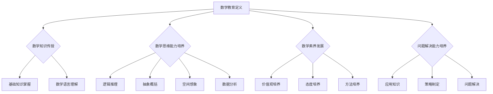
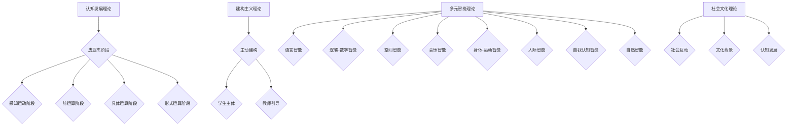
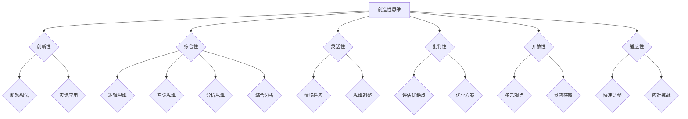
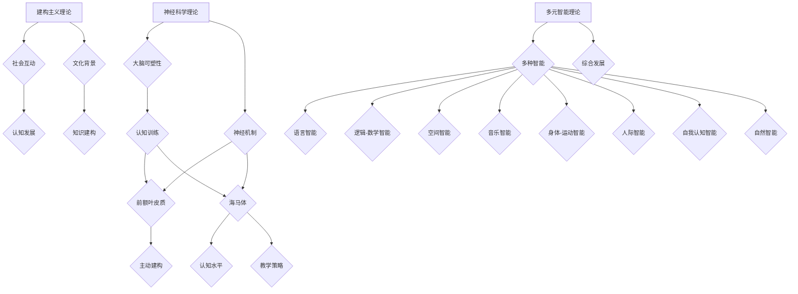

                 

### 《数学教育与创造性思维培养的方法》

> **关键词：数学教育、创造性思维、教学策略、跨学科、信息技术**

> **摘要：本文从数学教育的基本概念和创造性思维的概述出发，深入探讨数学教育中创造性思维培养的方法和策略。文章分为四个部分，首先介绍数学教育和创造性思维的基本概念和理论框架，其次分析数学教育方法与创造性思维的培养关系，接着通过国内外案例分析，提出实践指南，最后推荐相关资源和参考书目。**

----------------------------------------------------------------

### 第一部分：数学教育概述

#### 第1章：数学教育的基本概念

##### 1.1 数学教育的定义与目标

数学教育是培养学生数学素养和能力的教育活动，旨在让学生掌握数学的基本知识和技能，培养其抽象思维和逻辑推理能力。数学教育的定义可以从以下几个方面理解：

1. **学科属性**：数学教育是一种学科教育，它涉及数学的理论体系、应用方法和教育方法。  
2. **教育目标**：数学教育的目标不仅包括传授数学知识，还包括培养学生的数学素养，如数学思维、数学方法和数学态度。  
3. **教学方式**：数学教育强调学生的主动参与和实践操作，通过问题解决、探究学习和合作学习等方式进行教学。

数学教育的目标可以概括为以下几点：

1. **掌握数学知识**：学生需要掌握数学的基本概念、原理和定理，理解数学的符号和语言，能够运用数学知识解决实际问题。  
2. **培养数学能力**：学生需要具备数学思维能力，包括抽象思维、逻辑推理、空间想象和数据处理能力。  
3. **培养数学态度**：学生需要培养对数学的兴趣和热情，形成积极的学习态度和合作精神。

##### 1.2 数学教育的理论框架

数学教育的理论框架主要包括以下几个部分：

1. **认知发展理论**：该理论认为，学生的数学学习是一个认知发展过程，教师需要根据学生的认知水平和发展阶段进行教学。  
2. **建构主义理论**：该理论强调学生是学习的主体，数学学习是通过学生主动建构知识体系的过程。  
3. **多元智能理论**：该理论认为，学生有不同的智能类型，教师需要根据学生的智能特点进行教学，促进学生的全面发展。

##### 1.3 数学教育的现状与挑战

当前，数学教育存在以下几个方面的挑战：

1. **教学内容和方法过于传统**：许多数学教育仍然采用传统的讲授式教学，忽视了学生的主动参与和实践操作。  
2. **评价体系不合理**：数学教育的评价体系过于注重学生的考试成绩，忽视了学生的数学素养和能力的培养。  
3. **教师专业发展不足**：数学教师的专业素质和教学能力有待提高，教师需要不断学习和更新教育理念和方法。

为了应对这些挑战，数学教育需要：

1. **改革教学内容和方法**：引入探究性学习、问题解决教学和跨学科教学等新的教学方式，培养学生的创造性思维和实际应用能力。  
2. **完善评价体系**：建立多元化的评价体系，注重学生的数学素养和能力的培养。  
3. **加强教师专业发展**：通过培训、学习和交流，提高数学教师的专业素质和教学能力。

#### 第2章：创造性思维概述

##### 2.1 创造性思维的定义与特征

创造性思维是指人们运用已知的规律、知识或方法，通过创新性的思考，产生新的观念、方法或解决方案的思维过程。创造性思维具有以下几个特征：

1. **创新性**：创造性思维的核心是创新，它要求人们不拘泥于传统观念和方法，敢于提出新的想法和解决方案。  
2. **综合性**：创造性思维需要综合运用多方面的知识、经验和技能，形成新的认识和方法。  
3. **灵活性**：创造性思维具有灵活性，能够在不同情境和问题背景下，灵活运用各种思维方法和策略。  
4. **批判性**：创造性思维需要具备批判性，对已有的观念和方法进行审视和质疑，寻找改进和优化的途径。

##### 2.2 创造性思维的理论基础

创造性思维的理论基础主要包括以下几个部分：

1. **认知心理学理论**：认知心理学理论认为，创造性思维是认知活动的一部分，它涉及记忆、知觉、思维和语言等认知过程。  
2. **建构主义理论**：建构主义理论认为，创造性思维是学生主动建构知识体系的过程，它需要学生在实践中不断探索、反思和调整。  
3. **多元智能理论**：多元智能理论认为，创造性思维是多种智能的综合体现，它需要学生在不同智能领域的协调发展。

##### 2.3 创造性思维在数学教育中的应用

创造性思维在数学教育中具有重要意义，它有助于培养学生的创新能力和实际应用能力。以下是一些在数学教育中培养创造性思维的方法：

1. **问题解决教学**：通过设置复杂、富有挑战性的问题，引导学生运用创造性思维寻找解决方案。  
2. **探究性学习**：鼓励学生主动探索数学知识，通过实验、观察和思考，形成自己的认识和理解。  
3. **跨学科教学**：将数学与其他学科相结合，培养学生的跨学科思维能力和创新能力。  
4. **数学游戏**：通过设计富有创意的数学游戏，激发学生的兴趣和积极性，培养他们的创造性思维。

#### 第3章：数学教育方法与创造性思维培养

##### 3.1 问题解决教学策略

问题解决教学是一种以问题为导向的教学方法，它鼓励学生在解决问题的过程中运用创造性思维。以下是一些问题解决教学策略：

1. **问题设置**：设置具有挑战性和开放性的问题，激发学生的思考和探究欲望。  
2. **引导思考**：引导学生运用多种思维方式，如正向思维、逆向思维、横向思维和纵向思维等，寻找问题的解决方案。  
3. **合作学习**：鼓励学生合作解决问题，通过小组讨论、分享和交流，激发创造性思维的火花。  
4. **评价反馈**：及时给予学生评价和反馈，肯定他们的创造性思维和成果，激励他们继续探索和思考。

##### 3.2 创造性思维与问题解决的关系

创造性思维与问题解决密切相关。创造性思维是问题解决的重要基础，它为问题解决提供了新的思路和方法。以下是一些创造性思维在问题解决中的应用：

1. **提出假设**：创造性思维可以帮助学生提出各种可能的假设，为问题解决提供方向。  
2. **发散思维**：创造性思维鼓励学生从不同角度思考问题，寻找多种解决方案。  
3. **联想思维**：创造性思维通过联想和类比，将数学问题与其他领域或生活实际联系起来，拓展学生的思维视野。  
4. **创新思维**：创造性思维鼓励学生不拘泥于传统观念和方法，勇于创新和突破。

##### 3.3 实践案例：问题解决教学在数学课堂中的应用

以下是一个问题解决教学在数学课堂中的实践案例：

**案例**：初中数学课堂中的“等腰三角形的性质”教学。

**问题**：已知一个等腰三角形的两边长度分别为3cm和4cm，求第三边长度。

**教学过程**：

1. **问题提出**：教师展示一个等腰三角形的模型，提出问题：已知一个等腰三角形的两边长度分别为3cm和4cm，求第三边长度。

2. **引导思考**：教师引导学生运用创造性思维，从不同角度思考问题。  
   - 思路1：假设第三边长度为3cm，是否满足等腰三角形的条件？  
   - 思路2：假设第三边长度为4cm，是否满足等腰三角形的条件？  
   - 思路3：假设第三边长度不是3cm也不是4cm，是否满足等腰三角形的条件？

3. **合作学习**：学生以小组为单位，讨论并分享各自的思考过程和结论。

4. **评价反馈**：教师对学生的讨论进行总结和评价，肯定他们的创造性思维和成果，并指出需要注意的问题。

通过这个案例，学生不仅掌握了等腰三角形的性质，还培养了创造性思维和问题解决能力。

#### 第4章：探究性学习

##### 4.1 探究性学习的概念与特点

探究性学习是一种以学生为主体的学习方式，它鼓励学生主动探索、发现和建构知识。探究性学习具有以下几个特点：

1. **自主学习**：探究性学习强调学生的自主学习，学生通过自我探索和发现，掌握知识并形成自己的理解。  
2. **问题导向**：探究性学习以问题为导向，学生通过提出问题、解决问题，深入理解和掌握知识。  
3. **合作学习**：探究性学习鼓励学生合作学习，通过小组讨论、分享和交流，拓展思维视野，提高学习效果。  
4. **实践操作**：探究性学习强调实践操作，学生通过实验、观察和思考，将理论知识与实际应用相结合。

##### 4.2 探究性学习与创造性思维的关系

探究性学习与创造性思维密切相关。探究性学习为创造性思维提供了广阔的舞台，它鼓励学生主动探索、发现和创造。以下是一些探究性学习与创造性思维的关系：

1. **激发创造性思维**：探究性学习通过提出问题、解决问题，激发学生的创造性思维，促使他们提出新的想法和解决方案。  
2. **培养创造性思维**：探究性学习通过实践操作、合作学习和自主学习，培养学生的创造性思维，提高他们的创新能力和实际应用能力。  
3. **拓展创造性思维**：探究性学习鼓励学生从不同角度思考问题，通过跨学科学习和多元智能发展，拓展学生的创造性思维。

##### 4.3 实践案例：探究性学习在数学课堂中的应用

以下是一个探究性学习在数学课堂中的实践案例：

**案例**：小学数学课堂中的“图形的认识”教学。

**问题**：观察生活中的不同图形，探究图形的特征和性质。

**教学过程**：

1. **问题提出**：教师展示生活中的不同图形，提出问题：观察生活中的不同图形，你能发现哪些特征和性质？

2. **引导思考**：教师引导学生运用探究性学习的方法，观察和思考图形的特征和性质。  
   - 思路1：观察正方形和长方形的特征，发现它们的四条边长度和角度特点。  
   - 思路2：观察圆形的特征，发现它的边界是一个连续的曲线，没有角和边。  
   - 思路3：观察三角形和四边形的特征，发现它们的角度和边数特点。

3. **合作学习**：学生以小组为单位，讨论并分享各自的观察和思考过程。

4. **评价反馈**：教师对学生的讨论进行总结和评价，肯定他们的探究性学习和创造性思维成果，并指出需要注意的问题。

通过这个案例，学生不仅掌握了图形的基本特征和性质，还培养了探究性学习和创造性思维能力。

#### 第5章：数学游戏与创造性思维

##### 5.1 数学游戏的概念与类型

数学游戏是指以数学知识和思维为核心的趣味性活动，它通过游戏的方式，激发学生的兴趣和积极性，培养他们的创造性思维和数学素养。数学游戏可以分为以下几个类型：

1. **知识类游戏**：这类游戏主要针对数学知识点的复习和巩固，如数独、华容道等。  
2. **思维训练类游戏**：这类游戏主要训练学生的思维能力，如推理、判断、分析等，如围棋、五子棋等。  
3. **创新设计类游戏**：这类游戏鼓励学生运用创造性思维，设计新的数学游戏或解决方案，如数学谜题、数学探险等。

##### 5.2 数学游戏与创造性思维的关系

数学游戏与创造性思维密切相关。数学游戏通过趣味性和挑战性，激发学生的兴趣和积极性，促使他们在游戏中不断探索和创造。以下是一些数学游戏与创造性思维的关系：

1. **激发创造性思维**：数学游戏通过富有挑战性的问题，激发学生的创造性思维，促使他们提出新的想法和解决方案。  
2. **培养创造性思维**：数学游戏通过游戏的过程，培养学生的创造性思维，提高他们的创新能力和实际应用能力。  
3. **拓展创造性思维**：数学游戏鼓励学生从不同角度思考问题，通过跨学科学习和多元智能发展，拓展学生的创造性思维。

##### 5.3 实践案例：数学游戏在数学教育中的应用

以下是一个数学游戏在数学教育中的实践案例：

**案例**：初中数学课堂中的“三角形内角和”教学。

**问题**：通过数学游戏，探究三角形内角和的性质。

**教学过程**：

1. **游戏准备**：教师准备一些三角板和纸牌，作为游戏的道具。

2. **游戏规则**：教师讲解游戏规则，学生需要用三角板和纸牌拼出不同类型的三角形，并计算它们的内角和。

3. **游戏过程**：学生按照游戏规则，积极尝试拼出不同类型的三角形，并计算它们的内角和。

4. **讨论与总结**：教师组织学生进行讨论，总结三角形内角和的性质，并分享他们在游戏过程中的创造性思维。

通过这个案例，学生在游戏中不仅掌握了三角形内角和的性质，还培养了创造性思维和数学素养。

#### 第6章：跨学科教学

##### 6.1 跨学科教学的概念与优势

跨学科教学是指将不同学科的知识、方法和思维方式进行整合，培养学生跨学科思维能力和创新能力的一种教学方式。跨学科教学具有以下几个优势：

1. **提高学习兴趣**：跨学科教学将不同学科的知识进行整合，使学习内容更加丰富和有趣，激发学生的学习兴趣。  
2. **培养跨学科思维能力**：跨学科教学鼓励学生运用不同学科的思维方式和知识，培养学生的跨学科思维能力。  
3. **提高实际应用能力**：跨学科教学强调知识的实际应用，促使学生将所学知识运用于实际问题和情境中。  
4. **促进创新能力**：跨学科教学鼓励学生进行创新性思考和探索，培养学生的创新能力。

##### 6.2 跨学科教学与创造性思维的关系

跨学科教学与创造性思维密切相关。跨学科教学通过整合不同学科的知识和方法，为学生提供广阔的思维空间和创造机会。以下是一些跨学科教学与创造性思维的关系：

1. **激发创造性思维**：跨学科教学通过丰富多样的学科内容，激发学生的创造性思维，促使他们提出新的想法和解决方案。  
2. **培养创造性思维**：跨学科教学鼓励学生运用不同学科的思维方式和知识，培养学生的创造性思维，提高他们的创新能力。  
3. **拓展创造性思维**：跨学科教学通过整合不同学科的知识，拓展学生的思维视野，培养学生的创造性思维。

##### 6.3 实践案例：跨学科教学在数学教育中的应用

以下是一个跨学科教学在数学教育中的实践案例：

**案例**：高中数学与物理课堂中的“抛体运动”教学。

**问题**：通过跨学科教学，探究抛体运动的基本原理和实际应用。

**教学过程**：

1. **问题提出**：教师提出问题：抛体运动是如何产生的？它的基本原理是什么？如何应用抛体运动解决实际问题？

2. **知识整合**：教师整合数学和物理的知识，讲解抛体运动的基本原理，如抛体运动的轨迹、速度和加速度等。

3. **实践应用**：教师引导学生运用数学和物理的知识，解决实际问题，如设计抛体运动的实验、计算抛体运动的轨迹和速度等。

4. **讨论与总结**：教师组织学生进行讨论，总结抛体运动的基本原理和实际应用，分享他们在跨学科教学过程中的创造性思维。

通过这个案例，学生在跨学科教学中不仅掌握了抛体运动的基本原理，还培养了创造性思维和跨学科思维能力。

#### 第7章：信息技术与创造性思维培养

##### 7.1 信息技术在数学教育中的应用

信息技术在数学教育中的应用日益广泛，它为数学教育提供了丰富的教学资源和多样的教学方式。以下是一些信息技术在数学教育中的应用：

1. **多媒体教学**：通过多媒体技术，教师可以制作生动有趣的数学教学课件，提高学生的学习兴趣。  
2. **网络教学平台**：通过网络教学平台，教师可以在线发布教学资源、布置作业和进行在线互动，方便学生自主学习。  
3. **数学软件**：通过数学软件，学生可以直观地展示数学概念和运算过程，加深对数学知识的理解。  
4. **在线测评系统**：通过在线测评系统，教师可以实时了解学生的学习情况，进行针对性教学。

##### 7.2 信息技术与创造性思维的关系

信息技术与创造性思维密切相关。信息技术为创造性思维提供了广阔的舞台和丰富的资源，它有助于培养学生的创造性思维和创新能力。以下是一些信息技术与创造性思维的关系：

1. **激发创造性思维**：信息技术通过丰富的教学资源和多样的教学方式，激发学生的创造性思维，促使他们提出新的想法和解决方案。  
2. **培养创造性思维**：信息技术通过在线互动和自主学习，培养学生的创造性思维，提高他们的创新能力和实际应用能力。  
3. **拓展创造性思维**：信息技术通过提供丰富的知识和信息，拓展学生的思维视野，培养学生的创造性思维。

##### 7.3 实践案例：信息技术在数学教育中的创造性思维培养

以下是一个信息技术在数学教育中的创造性思维培养的实践案例：

**案例**：小学数学课堂中的“数字游戏”教学。

**问题**：通过信息技术，设计数字游戏，培养小学生的创造性思维。

**教学过程**：

1. **游戏设计**：教师利用信息技术，设计一款数字游戏，如“数字消消乐”，让学生在游戏中体验数学的乐趣。

2. **游戏规则**：教师讲解游戏规则，学生需要通过消消乐的方式，解决数字问题。

3. **游戏过程**：学生按照游戏规则，积极尝试解决问题，体验数字游戏的乐趣。

4. **讨论与总结**：教师组织学生进行讨论，总结数字游戏的乐趣和创造性思维的培养效果，分享他们在游戏过程中的创造性思维。

通过这个案例，学生在信息技术支持下，不仅掌握了数学知识，还培养了创造性思维和创新能力。

#### 第8章：国内外数学教育创造性思维培养案例分析

##### 8.1 国内数学教育创造性思维培养案例分析

在国内，许多学校和教育机构开始重视数学教育中创造性思维的培养。以下是一些典型的案例分析：

1. **上海中学**：上海中学实施“探究式教学”，通过设置探究性问题，引导学生主动探索和思考，培养他们的创造性思维。

2. **北京四中**：北京四中开展“数学创新实验室”项目，鼓励学生进行数学实验和创新研究，培养学生的创造性思维。

3. **杭州第二中学**：杭州第二中学实施“数学思维训练课程”，通过设计多样化的数学问题，训练学生的思维能力，提高他们的创造性思维。

##### 8.2 国外数学教育创造性思维培养案例分析

在国外，许多国家的数学教育也注重创造性思维的培养。以下是一些典型的案例分析：

1. **芬兰**：芬兰的数学教育强调学生自主学习，教师通过设置问题引导学生进行探究和思考，培养他们的创造性思维。

2. **美国**：美国许多学校实施“问题解决教学”，通过设置复杂、富有挑战性的问题，引导学生运用创造性思维寻找解决方案。

3. **新加坡**：新加坡的数学教育注重跨学科教学，将数学与其他学科相结合，培养学生的跨学科思维能力和创新能力。

##### 8.3 案例对比分析与启示

通过对国内外数学教育创造性思维培养案例的分析，可以得出以下几点启示：

1. **重视学生自主学习**：国内外成功的数学教育案例都强调学生自主学习，教师应创造良好的学习环境，引导学生主动探索和思考。

2. **设置探究性问题**：教师应设置具有挑战性和开放性的问题，激发学生的探究欲望，培养他们的创造性思维。

3. **多样化教学方式**：教师应采用多样化的教学方式，如探究性学习、问题解决教学和跨学科教学等，培养学生的创造性思维。

4. **重视跨学科教学**：跨学科教学有助于培养学生的跨学科思维能力和创新能力，教师应将数学与其他学科相结合，进行跨学科教学。

#### 第9章：教师培训与创造性思维培养

##### 9.1 教师培训的重要性

教师培训在数学教育中具有重要意义。通过教师培训，可以提高教师的专业素质和教学能力，从而更好地培养学生的创造性思维。以下是一些教师培训的重要性：

1. **提高专业素质**：教师培训可以帮助教师掌握最新的数学教育理论和教学方法，提高他们的专业素质。

2. **更新教育观念**：教师培训可以帮助教师更新教育观念，认识到创造性思维培养在数学教育中的重要性，从而改变传统的教学方法。

3. **提升教学能力**：教师培训可以帮助教师掌握教学技巧和策略，提高他们的教学能力，从而更好地培养学生的创造性思维。

##### 9.2 创造性思维培训的内容与方法

创造性思维培训的内容和方法主要包括以下几个方面：

1. **认知心理学理论**：教师需要了解认知心理学理论，掌握创造性思维的基本原理和培养方法。

2. **教育理论**：教师需要掌握教育理论，了解创造性思维培养在教育中的应用和意义。

3. **教学技巧和方法**：教师需要学习各种教学技巧和方法，如探究性教学、问题解决教学和跨学科教学等，以便在教学中更好地培养学生的创造性思维。

4. **实践操作**：教师需要通过实践操作，将创造性思维培养的方法应用于实际教学，不断总结和反思，提高教学效果。

##### 9.3 实践指南：教师如何培养学生的创造性思维

以下是一些教师如何培养学生的创造性思维的实践指南：

1. **创设良好的学习环境**：教师应创造一个民主、宽松、开放的学习环境，让学生感到自由和安全，从而激发他们的创造性思维。

2. **设置探究性问题**：教师应设置具有挑战性和开放性的问题，引导学生进行探究和思考，培养他们的创造性思维。

3. **多样化教学方式**：教师应采用多样化的教学方式，如探究性学习、问题解决教学和跨学科教学等，培养学生的创造性思维。

4. **鼓励合作学习**：教师应鼓励学生进行合作学习，通过小组讨论、分享和交流，激发创造性思维的火花。

5. **评价多元**：教师应建立多元化的评价体系，注重学生的创造性思维和能力的培养，而不是仅关注学生的考试成绩。

#### 第10章：学生创造性思维培养策略

##### 10.1 学生创造性思维培养的方法与策略

学生创造性思维的培养需要教师和家长的共同努力，以下是一些具体的方法与策略：

1. **引导自主学习**：鼓励学生主动探索和发现，培养他们的自主学习能力，提高他们的创造性思维。

2. **设置问题情境**：教师应设置具有挑战性和开放性的问题情境，引导学生进行探究和思考，激发他们的创造性思维。

3. **多样化教学方式**：采用多样化的教学方式，如探究性教学、问题解决教学和跨学科教学等，培养学生的创造性思维。

4. **鼓励合作学习**：鼓励学生进行合作学习，通过小组讨论、分享和交流，激发创造性思维的火花。

5. **培养创新意识**：教育学生敢于质疑、勇于创新，培养他们的创新意识，提高他们的创造性思维能力。

##### 10.2 家长和学校在学生创造性思维培养中的角色

家长和学校在学生创造性思维培养中扮演着重要角色，以下是他们应承担的角色：

1. **家庭环境**：家长应营造一个宽松、民主的家庭环境，鼓励孩子进行自主探索和尝试，培养他们的创造性思维。

2. **亲子互动**：家长应积极参与孩子的学习生活，与孩子进行亲子互动，分享学习心得，培养孩子的创造性思维。

3. **学校教育**：学校应重视学生创造性思维的培养，将创造性思维培养纳入课程体系，开展多样化的教学活动。

4. **家校合作**：家长和学校应加强合作，共同为学生提供良好的教育环境，培养学生的创造性思维。

##### 10.3 实践指南：如何培养小学生的创造性思维

以下是一些针对小学生创造性思维培养的实践指南：

1. **创设有趣的学习环境**：小学生对新鲜事物充满好奇心，教师应创设有趣的学习环境，激发他们的学习兴趣。

2. **设计游戏化教学**：通过设计游戏化教学活动，如数学游戏、科学实验等，培养小学生的创造性思维。

3. **鼓励提问和讨论**：鼓励小学生提问和讨论，培养他们的批判性思维和创造性思维。

4. **培养阅读习惯**：培养小学生的阅读习惯，通过阅读丰富他们的知识储备，提高他们的创造性思维。

5. **开展课外活动**：学校应开展丰富多彩的课外活动，如科技竞赛、艺术表演等，培养小学生的创造性思维。

#### 第11章：数学教育创造性思维培养的综合实践

##### 11.1 综合实践的目标与原则

数学教育创造性思维培养的综合实践旨在通过多种教学策略和活动，培养学生的创造性思维和数学素养。以下是一些综合实践的目标与原则：

1. **目标**：
   - 提高学生的数学素养和实际应用能力。
   - 培养学生的创造性思维和创新能力。
   - 促进学生的全面发展。

2. **原则**：
   - 因材施教：根据学生的不同特点和需求，制定个性化的培养方案。
   - 实践导向：以实际问题为导向，引导学生主动探索和解决。
   - 整合资源：充分利用学校、家庭和社会等资源，为学生提供多样化的学习体验。
   - 持续发展：建立长效机制，持续关注学生的创造性思维培养。

##### 11.2 实践案例：数学教育创造性思维培养的综合实践活动

以下是一个数学教育创造性思维培养的综合实践活动案例：

**案例**：小学数学综合实践活动——“数学探索周”

**活动目标**：
- 培养学生的数学探索精神和创新能力。
- 提高学生的数学实际应用能力。
- 增强学生的团队合作意识。

**活动过程**：

1. **前期准备**：
   - 教师向学生介绍活动目的和流程。
   - 学生分组，每组选择一个数学探索主题。

2. **活动实施**：
   - 每组学生进行主题探究，收集相关资料，设计探究方案。
   - 学生通过实验、观察、调查等方式，进行数学探究。
   - 学生分享探究成果，进行小组讨论和总结。

3. **成果展示**：
   - 每组学生制作展示板，展示他们的探究过程和成果。
   - 学生进行成果展示和交流，分享他们的创造性和创新思维。

4. **评价反馈**：
   - 教师组织学生进行自评、互评和教师评价。
   - 教师总结活动中的亮点和不足，提出改进建议。

通过这个综合实践活动，学生在数学探究中不仅掌握了数学知识，还培养了创造性思维和团队合作能力。

##### 11.3 实践效果评估与反馈

实践效果评估与反馈是数学教育创造性思维培养的重要环节。以下是一些实践效果评估与反馈的方法：

1. **学生自评与互评**：学生通过自我评价和相互评价，总结自己在创造性思维培养中的表现和收获。

2. **教师评价**：教师通过观察学生的表现和成果展示，对学生的创造性思维和数学素养进行评价。

3. **数据分析**：通过数据统计，分析学生在创造性思维培养活动中的参与度、表现和进步情况。

4. **反馈与改进**：根据评估结果，教师和家长共同制定改进计划，持续关注学生的创造性思维培养。

通过评估与反馈，教师和家长可以更好地了解学生的创造性思维培养情况，及时调整教学策略，提高培养效果。

#### 附录A：数学教育创造性思维培养资源推荐

**A.1 教学资源**

1. **《数学课程标准》**：教育部制定的数学课程标准，提供了数学教育的基本理念、目标和教学内容。

2. **《创造性思维培养教材》**：专门针对创造性思维培养的教材，包含丰富的教学资源和活动设计。

3. **《数学游戏大全》**：收录了各种有趣的数学游戏，适合学生进行创造性思维训练。

**A.2 学术文献**

1. **《数学教育的心理学基础》**：探讨了数学教育中的心理学理论，对创造性思维培养有重要指导意义。

2. **《创造性思维研究》**：研究了创造性思维的机制、培养方法和应用，为数学教育提供了理论依据。

3. **《跨学科教学理论与实践》**：介绍了跨学科教学的方法和策略，有助于培养学生的跨学科思维能力和创新能力。

**A.3 教学工具与软件**

1. **几何画板**：一款用于几何作图和数学探索的软件，可以帮助学生直观地展示数学概念和运算过程。

2. **数学软件Matlab**：一款功能强大的数学软件，可以用于数值计算、数据分析和图形绘制。

3. **在线测评系统**：用于实时了解学生的学习情况，进行针对性教学和评价。

#### 附录B：参考书目

**B.1 数学教育相关书籍**

1. **《数学教育心理学》**：李志厚 著

2. **《数学教学心理学》**：陈琦，刘儒德 著

3. **《数学教育哲学》**：邹广耀 著

**B.2 创造性思维相关书籍**

1. **《创造性思维训练》**：卢家楣 著

2. **《创造性思维的训练与培养》**：韩进 著

3. **《创造性思维与创新能力培养》**：刘道玉 著

**B.3 数学教育理论与实践书籍**

1. **《数学教育新论》**：唐小俊 著

2. **《数学教育心理学新编》**：庞维国 著

3. **《数学教育研究方法论》**：王洁 著

通过以上附录，读者可以进一步了解数学教育创造性思维培养的理论和实践，为教育教学提供有益的参考。----------------------------------------------------------------

### 1.1 数学教育的定义与目标

数学教育作为一种基础学科教育，其核心目的是培养学生的数学素养和解决实际问题的能力。首先，我们需要明确数学教育的定义。数学教育不仅仅是指传授数学知识，更重要的是通过数学教学活动，帮助学生建立数学思维模式，培养其逻辑推理、抽象概括、问题解决和创新等能力。

在定义数学教育之后，我们再来探讨其目标。数学教育的目标可以归纳为以下几个方面：

1. **掌握数学基础知识**：学生需要掌握数学的基本概念、原理、定理和公式，理解数学的基本语言和符号系统，这是数学教育的首要目标。

2. **培养数学思维能力**：数学教育不仅要传授知识，更要培养学生的数学思维能力。这包括逻辑推理能力、抽象概括能力、空间想象能力和数据分析能力等。

3. **发展数学素养**：数学素养包括数学的价值观、态度和方法。通过数学教育，学生应该能够运用数学的思维方式来分析问题、提出假设、制定策略和解决问题。

4. **培养解决问题的能力**：数学教育应该使学生能够将数学知识应用于实际生活中，培养他们解决实际问题的能力。

为了更直观地展示数学教育的核心概念和架构，我们可以使用Mermaid流程图来表示：

通过这个流程图，我们可以清晰地看到数学教育的定义和目标是如何相互关联的，每个部分在数学教育中扮演的角色和重要性。

### 1.2 数学教育的理论框架

数学教育的理论框架是指导数学教育实践的重要理论基础，它包含了多种理论观点和研究成果。以下是对几个关键理论框架的简要介绍：

1. **认知发展理论**：这一理论以瑞士心理学家让·皮亚杰的研究为基础，强调学生认知发展的阶段性。皮亚杰认为，学生的认知发展经历了感知运动阶段、前运算阶段、具体运算阶段和形式运算阶段。数学教育应根据学生的认知发展阶段，设计相应的教学策略和内容。

2. **建构主义理论**：建构主义认为知识是通过学生的主动建构过程获得的，而不是被动接受的结果。这一理论强调学生是学习的主体，教师是学习过程的引导者。在数学教育中，建构主义理论倡导学生通过实际操作、探究和反思来建构数学知识。

3. **多元智能理论**：由霍华德·加德纳提出，该理论认为人类具有多种智能，包括语言智能、逻辑-数学智能、空间智能、音乐智能、身体-运动智能、人际智能、自我认知智能和自然智能。数学教育应该关注学生的多种智能发展，提供多样化的学习机会。

4. **社会文化理论**：维果茨基的社会文化理论强调社会互动和文化背景在认知发展中的重要作用。他认为，学习是一种社会互动过程，学习者通过与更有经验的人的互动，可以促进自己的认知发展。数学教育中的合作学习和跨学科教学可以体现这一理论。

为了更清晰地展示这些理论框架之间的关系，我们可以使用Mermaid流程图来表示：

通过这个流程图，我们可以看到数学教育的理论框架是如何相互联系和补充的，每个理论都在数学教育中扮演着重要的角色。

### 1.3 数学教育的现状与挑战

当前，数学教育在全球范围内都面临着一系列的挑战和问题。了解这些现状和挑战对于制定有效的教育策略至关重要。

首先，数学教育在许多国家都存在教学内容和方法过于传统的现象。传统的数学教育往往注重对基础知识的传授，而忽视了培养学生的数学思维和解决实际问题的能力。这种教学方式容易导致学生学习兴趣不足，难以激发他们的创造力和主动性。

其次，数学教育的评价体系也存在问题。许多学校仍然采用单一的考试成绩来评价学生的数学能力，这种评价方式过于片面，忽视了学生的数学素养和实际应用能力的培养。这种评价体系容易导致教师和学生只关注考试分数，而忽视了对数学知识深层次的理解和应用。

此外，教师专业发展不足也是一个重要挑战。数学教师需要具备扎实的数学知识和丰富的教学经验，但许多教师由于各种原因，如缺乏培训机会、教育资源不足等，难以不断提高自己的专业水平。教师专业素质的不足直接影响数学教育质量，也限制了学生创造性思维的培养。

为了应对这些挑战，数学教育需要采取一系列改革措施。以下是一些建议：

1. **改革教学内容和方法**：引入探究性学习、问题解决教学和跨学科教学等新的教学方式，培养学生的创造性思维和实际应用能力。例如，通过设置实际问题，引导学生运用数学知识进行探究和解决，提高他们的数学思维能力。

2. **完善评价体系**：建立多元化的评价体系，注重学生的数学素养和能力的培养。除了考试成绩，可以采用项目评价、过程评价、同伴评价等多种评价方式，全面了解学生的数学学习情况。

3. **加强教师专业发展**：通过培训、学习和交流，提高数学教师的专业素质和教学能力。鼓励教师参加国内外研讨会、学术交流和教学研究，不断更新教育理念和方法。

4. **利用信息技术**：充分利用信息技术，提供丰富的教学资源和多样化的教学方式。例如，通过在线教学平台、数学软件和虚拟实验室等，为学生提供更多自主学习和互动的机会。

总之，面对数学教育的现状和挑战，我们需要采取综合性的改革措施，从教学内容、评价体系和教师专业发展等方面进行改进，以实现数学教育的目标，培养学生的创造性思维和实际应用能力。

### 2.1 创造性思维的定义与特征

创造性思维是指个体在面对问题时，能够运用新颖、独特的方式思考和解决问题的过程。它不仅仅是产生新奇想法的能力，更是一种系统性的思维模式，涉及多种认知过程和技能。以下是对创造性思维的定义和特征的具体阐述：

**1. 定义**：

创造性思维可以定义为一种高度复杂的认知活动，它涉及多种认知功能，如联想、想象、批判性思考、综合和创新。这种思维模式不仅要求个体能够灵活地运用已有知识，还能够在未知和不确定性的环境中生成新的观念和解决方案。

**2. 特征**：

- **创新性**：创造性思维的核心特征是创新性，即能够产生新颖、独特和有价值的想法。这种创新不仅仅是指不同寻常的想法，更重要的是这些想法具有实际应用价值或能够推动知识进步。

- **综合性**：创造性思维需要综合运用多种思维技能和知识，如逻辑思维、直觉思维、分析思维和直觉思维等。它强调在思考问题时，能够从多个角度和层面进行综合分析，从而产生更全面的解决方案。

- **灵活性**：创造性思维具有灵活性，它能够根据问题的不同情境和需求，灵活调整思考方向和策略。这种灵活性使得个体能够在面对复杂问题时，不拘泥于固定的思维模式，从而找到创新的解决方案。

- **批判性**：创造性思维不仅仅是产生新的想法，还需要对已有的想法和解决方案进行批判性思考。这种批判性思考有助于识别和评估想法的优缺点，从而优化和改进解决方案。

- **开放性**：创造性思维具有开放性，它能够接受和容纳不同的观点和想法。这种开放性使得个体能够从多种来源获取灵感，促进创造性思维的多元化发展。

- **适应性**：创造性思维需要适应不断变化的环境和情境。它要求个体能够快速调整自己的思维方式和策略，以应对新的挑战和问题。

为了更直观地理解创造性思维的特征，我们可以使用Mermaid流程图来表示：

通过这个流程图，我们可以更清晰地看到创造性思维的特征及其相互关系，以及它们在创造性思维过程中发挥的作用。

### 2.2 创造性思维的理论基础

创造性思维作为一种复杂的认知活动，其理论基础涉及多个学科领域，包括心理学、教育学和神经科学等。以下是对几个关键理论基础的简要介绍：

**1. 认知心理学理论**

认知心理学理论认为，创造性思维是认知过程的一部分，涉及多个认知功能的协同作用。例如，布鲁纳（Jerome Bruner）的发现学习和皮亚杰（Jean Piaget）的认知发展阶段理论都强调了认知结构在创造性思维中的重要性。布鲁纳提出，通过探究和发现，学生能够主动建构知识，这有助于培养创造性思维。而皮亚杰则通过认知发展的阶段性理论，指出学生在不同阶段具有不同的认知能力，教师应根据学生的认知水平设计相应的教学策略。

**2. 建构主义理论**

建构主义理论认为，知识是通过学生的主动建构过程获得的。皮亚杰和维果茨基（Lev Vygotsky）是建构主义理论的代表人物。维果茨基强调社会互动和文化背景在认知发展中的作用，他认为学习是一种社会互动过程，通过与更有经验的人互动，学生能够促进自己的认知发展。这种社会互动和文化背景的重视，有助于培养学生的创造性思维。

**3. 多元智能理论**

由霍华德·加德纳（Howard Gardner）提出的多元智能理论，强调人类具有多种智能，包括语言智能、逻辑-数学智能、空间智能、音乐智能、身体-运动智能、人际智能、自我认知智能和自然智能。加德纳认为，创造性思维是多种智能的综合体现，学生可以通过发展多种智能，提高创造性思维的能力。数学教育中，教师可以通过跨学科教学和多样化的学习活动，促进学生的多元智能发展。

**4. 神经科学理论**

神经科学理论提供了对创造性思维生理机制的理解。例如，大脑的可塑性研究表明，通过适当的训练和刺激，大脑可以改变其结构和功能，从而提高创造性思维的能力。神经科学研究还发现，大脑的某些区域，如前额叶皮质和海马体，在创造性思维过程中发挥着关键作用。这些区域的活跃程度和功能状态，可能会影响个体的创造性思维表现。

为了更清晰地展示这些理论基础之间的关系，我们可以使用Mermaid流程图来表示：

通过这个流程图，我们可以看到创造性思维的理论基础是如何相互联系和补充的，每个理论基础在创造性思维培养中都扮演着重要的角色。

### 2.3 创造性思维在数学教育中的应用

创造性思维在数学教育中具有重要价值，它不仅能够激发学生的学习兴趣，还能提高他们的数学素养和解决问题的能力。以下探讨创造性思维在数学教育中的应用，包括问题解决教学、探究性学习和跨学科教学等策略：

**1. 问题解决教学**

问题解决教学是一种以问题为导向的教学方法，它强调学生在解决实际问题的过程中培养创造性思维。在这种教学策略中，教师设置具有挑战性和开放性的问题，引导学生运用多种思维方式进行思考和探索。

- **问题设置**：教师应根据学生的认知水平，设置具有适当难度的数学问题。问题应具有一定的开放性，允许学生有多种解决方法。
- **引导思考**：教师应鼓励学生运用正向思维、逆向思维、横向思维和纵向思维等多种思维方式，寻找问题的解决方案。
- **合作学习**：通过小组合作，学生可以分享不同的思路和解决方案，互相启发，促进创造性思维的培养。
- **评价反馈**：教师应给予及时的评价和反馈，肯定学生的创造性思维和努力，同时指出可以改进的地方。

**2. 探究性学习**

探究性学习是一种以学生自主探究为核心的学习方式，它鼓励学生在探究数学问题的过程中培养创造性思维。

- **问题提出**：教师应引导学生提出有探究价值的问题，激发他们的好奇心和求知欲。
- **探究过程**：学生通过实验、观察、调查和讨论等方式，进行自主探究，寻找问题的答案。
- **反思总结**：学生应总结探究过程中的收获和体会，反思自己的思考方式和解决方案，不断提高创造性思维能力。

**3. 跨学科教学**

跨学科教学将数学与其他学科相结合，培养学生的跨学科思维能力和创新能力。

- **课程整合**：教师可以将数学知识与物理、化学、生物等学科的知识相结合，设置跨学科项目，引导学生进行探究和解决实际问题。
- **多样化的学习活动**：通过设计数学实验、数学建模、数学竞赛等活动，激发学生的兴趣和创造力。
- **合作学习**：鼓励学生跨学科合作，通过团队合作，分享不同学科的知识和思维方式，共同解决问题。

通过这些策略，数学教育不仅可以传授数学知识，还能培养学生的创造性思维，提高他们的数学素养和解决问题的能力。

### 3.1 问题解决教学策略

问题解决教学策略是一种以问题为导向的教学方法，旨在通过解决实际问题，培养学生的数学思维能力和创造性思维。以下是对这种策略的具体分析：

**1. 策略概念**

问题解决教学策略强调在教学中引入真实或模拟的数学问题，让学生在解决问题的过程中，运用数学知识和方法。这种策略不仅关注知识的传授，更注重能力的培养，特别是逻辑推理、分析问题、解决问题的能力。

**2. 执行步骤**

- **问题提出**：教师应根据学生的认知水平和数学知识，选择具有挑战性和开放性的问题。问题的类型可以包括开放性问题、复杂问题和实际问题，以激发学生的探究欲望和创造性思维。
- **引导思考**：在问题提出后，教师应引导学生运用不同的思维方式进行思考，如正向思维、逆向思维、横向思维和纵向思维。教师可以通过提问、讨论等方式，帮助学生理清思路，明确解决问题的方向。
- **合作学习**：鼓励学生进行小组合作，共同探讨问题的解决方案。合作学习不仅能够激发学生的创造性思维，还能培养他们的团队合作能力和沟通能力。
- **方案设计**：学生在合作学习中，应设计解决问题的方案。教师可以引导学生运用不同的数学方法和策略，如代数、几何、概率统计等，进行方案设计。
- **实施与评估**：学生根据设计的方案，进行问题解决的实际操作。教师应实时监控学生的进展，给予必要的指导和帮助。问题解决完成后，教师应组织学生进行总结和反思，评估解决问题的过程和结果。

**3. 案例分析**

以下是一个问题解决教学策略的案例：

**案例**：高中数学课堂中的“线性规划问题”教学。

**问题**：一个工厂生产两种产品，每种产品都需要经过两个生产过程。第一个生产过程需要4小时，第二个生产过程需要3小时。一个工人每天最多工作8小时。如果每种产品多卖出一元，工厂的总利润会增加2元。现在工厂希望每天生产这两种产品，使得总利润最大化。请问工厂应该如何安排生产计划？

**执行步骤**：

1. **问题提出**：教师展示一个简单的线性规划问题，激发学生的探究欲望。
2. **引导思考**：教师引导学生运用正向思维，设定生产目标，并分析生产过程中的约束条件。
3. **合作学习**：学生以小组为单位，讨论并设计解决问题的方案。每个小组需要列出不同的生产方案，并进行比较和评估。
4. **方案设计**：学生通过分析，设定生产目标函数，列出约束条件，建立线性规划模型。
5. **实施与评估**：学生根据设计的方案，使用线性规划求解器求解最优解。教师对学生的解决方案进行评估，给予反馈和指导。

通过这个案例，学生不仅学会了线性规划问题的解决方法，还在解决问题的过程中培养了创造性思维和团队合作能力。

### 3.2 创造性思维与问题解决的关系

创造性思维与问题解决之间存在密切的关系。创造性思维是问题解决的重要基础，它为问题解决提供了创新的思维方式和解决方案。以下从几个方面探讨创造性思维与问题解决的关系：

**1. 创造性思维在问题解决中的作用**

- **创新性方案**：创造性思维能够帮助学生提出新颖、独特的解决方案。在面对复杂问题时，创造性思维可以打破常规思维模式，从不同角度思考问题，找到创新的解决方案。

- **多元化思路**：创造性思维鼓励学生采用多种思维方式，如正向思维、逆向思维、横向思维和纵向思维，从而拓宽解决问题的思路，提高解决问题的可能性。

- **灵活应变**：创造性思维具有灵活性，它能够根据问题的不同情境和需求，灵活调整思维方向和策略，适应问题解决过程中的变化。

- **批判性评估**：创造性思维强调对已有想法和解决方案进行批判性评估，识别其优缺点，从而优化和改进解决方案。

**2. 问题解决对创造性思维的促进作用**

- **实际应用**：问题解决提供了一个实际的应用场景，学生在解决问题的过程中，需要运用创造性思维来寻找解决方案。这种实际应用有助于巩固和深化创造性思维。

- **经验积累**：通过不断地解决问题，学生积累了丰富的经验，这有助于提高他们的创造性思维能力。每次解决问题的经历都是对创造性思维的一次锻炼和提升。

- **反馈与改进**：问题解决过程中，学生可以从尝试和失败中获得反馈，不断调整和改进自己的想法和方案。这种反馈和改进过程，有助于培养学生的创造性思维。

- **跨学科融合**：问题解决往往需要综合运用多个学科的知识和思维方式，这有助于培养学生的跨学科思维能力和创新能力。

总之，创造性思维与问题解决相互促进，创造性思维为问题解决提供了创新的思维方式和解决方案，而问题解决则为学生提供了锻炼创造性思维的实际场景和机会。

### 3.3 实践案例：问题解决教学在数学课堂中的应用

以下是一个问题解决教学在数学课堂中的具体实践案例：

**案例**：初中数学课堂中的“几何问题解决教学”实践

**问题**：已知一个三角形的三条边长分别为5cm、12cm和13cm，求这个三角形的最大面积。

**教学过程**：

1. **问题提出**：教师展示一个三角形模型，提出问题：已知一个三角形的三条边长分别为5cm、12cm和13cm，求这个三角形的最大面积。

2. **引导思考**：教师引导学生运用创造性思维，从不同角度思考问题，寻找解决方案。例如，可以尝试使用海伦公式、勾股定理或三角形面积公式等。

3. **合作学习**：学生以小组为单位，讨论并分享各自的思考过程和解决方案。

4. **方案设计**：

   - 小组1：使用海伦公式，计算三角形的半周长，然后求解面积。
   - 小组2：通过勾股定理，判断三角形是否为直角三角形，然后直接计算面积。
   - 小组3：利用三角形面积公式，结合三角形的高，计算最大面积。

5. **实施与评估**：

   - 学生根据小组讨论的结果，选择一种方案进行具体计算。
   - 教师监控学生的计算过程，给予必要的指导。
   - 学生展示计算结果，教师进行评估和反馈。

通过这个案例，学生在问题解决的过程中，不仅掌握了几何问题的解决方法，还培养了创造性思维和团队合作能力。

### 4.1 探究性学习的概念与特点

探究性学习是一种以学生自主探究为核心的学习方式，它强调学生在学习过程中主动提出问题、探索问题、分析问题和解决问题。以下是对探究性学习概念和特点的具体阐述：

**1. 概念**

探究性学习是指学生在教师的指导下，通过自主探索和发现，主动建构知识体系的一种学习方式。它强调学习过程中的探究性、自主性和合作性，旨在培养学生的创新能力和解决问题的能力。

**2. 特点**

- **自主学习**：探究性学习强调学生的自主学习，学生通过自主提出问题、设定学习目标、选择学习方法和评估学习效果，从而主动参与学习过程。

- **问题导向**：探究性学习以问题为导向，学生通过提出问题、分析问题和解决问题，深入理解和掌握知识。这种学习方式能够激发学生的学习兴趣和探究欲望。

- **合作学习**：探究性学习鼓励学生进行合作学习，通过小组讨论、分享和交流，拓展思维视野，提高学习效果。合作学习有助于培养学生的团队合作能力和沟通能力。

- **实践操作**：探究性学习强调实践操作，学生通过实验、观察和思考，将理论知识与实际应用相结合，从而更好地理解和掌握知识。

- **反思与总结**：探究性学习要求学生在学习过程中不断进行反思和总结，通过反思和总结，学生可以更好地发现和理解知识，提高学习效果。

**3. 探究性学习与传统教学方式的区别**

与传统教学方式相比，探究性学习具有以下显著区别：

- **教学目标**：传统教学方式注重知识传授，而探究性学习注重学生能力的培养，特别是创新能力和问题解决能力。
- **教学过程**：传统教学方式以教师讲授为主，而探究性学习以学生自主探究和发现为主。
- **教学评价**：传统教学方式以考试成绩为主，而探究性学习注重过程评价和多元评价，强调学生的综合素质和发展。

通过以上阐述，我们可以清晰地看到探究性学习的概念和特点，以及它与传统教学方式的区别。探究性学习为培养学生的创造性思维和实际应用能力提供了有力的支持。

### 4.2 探究性学习与创造性思维的关系

探究性学习与创造性思维之间存在密切的关系。探究性学习不仅有助于激发学生的创造性思维，还能提供实践平台，使学生在探索和发现的过程中培养和提升创造性思维能力。以下从几个方面探讨这种关系：

**1. 探究性学习激发创造性思维**

- **问题导向**：探究性学习以问题为导向，学生通过提出问题、分析问题和解决问题，激发创造性思维的火花。问题的开放性和复杂性，鼓励学生从不同角度思考，寻找新颖的解决方案。
- **自主学习**：在探究性学习中，学生有更多的自主权，可以自主选择探究的方向和方式。这种自主性有助于学生发挥自己的创造潜能，提出独特的想法。
- **情境体验**：探究性学习强调实践操作和情境体验，学生通过实际操作和体验，能够更好地理解问题的本质，从而激发创造性思维。

**2. 探究性学习培养创造性思维**

- **思维训练**：在探究性学习过程中，学生需要运用多种思维方式，如正向思维、逆向思维、横向思维和纵向思维，这有助于培养和提升学生的创造性思维能力。
- **知识整合**：探究性学习要求学生综合运用不同学科的知识，这有助于培养学生的跨学科思维能力和创新能力。
- **反思与调整**：在探究性学习过程中，学生需要不断进行反思和调整，这有助于培养他们的批判性思维和自我评估能力，从而提高创造性思维。

**3. 创造性思维在探究性学习中的体现**

- **创新解决方案**：在探究性学习过程中，学生通过创造性思维，提出新颖、独特的解决方案，这体现为他们对问题的深刻理解和创新性思考。
- **问题拓展**：创造性思维能够帮助学生将问题进行拓展，从多个角度和层面进行深入分析，从而发现新的问题和解决方法。
- **学习效果**：创造性思维有助于学生更好地理解和掌握知识，提高学习效果。在探究性学习中，学生的创造性思维表现往往体现在他们的学习成果和问题解决能力上。

总之，探究性学习与创造性思维相互促进，探究性学习为创造性思维提供了广阔的舞台和实践机会，而创造性思维则为探究性学习提供了动力和方向。通过有效的探究性学习，学生不仅能够掌握知识，还能培养和提高他们的创造性思维能力。

### 4.3 实践案例：探究性学习在数学课堂中的应用

以下是一个探究性学习在数学课堂中的具体实践案例：

**案例**：高中数学课堂中的“探究函数性质”教学

**问题**：探究二次函数的图像和性质，并尝试总结其一般规律。

**教学过程**：

1. **问题提出**：教师展示二次函数的标准形式 \( y = ax^2 + bx + c \)，并提出问题：如何通过函数的表达式，探究其图像和性质？

2. **引导思考**：教师引导学生运用探究性学习的方法，通过观察、实验和思考，探究二次函数的图像和性质。

3. **探究过程**：

   - **观察与实验**：学生通过改变函数的参数 \( a \)、\( b \) 和 \( c \)，绘制二次函数的图像，观察函数图像的变化规律。
   - **数据收集**：学生记录不同参数下函数图像的特征，如顶点坐标、开口方向、对称轴等。
   - **规律总结**：学生通过分析数据，尝试总结二次函数图像和性质的一般规律。

4. **讨论与交流**：学生以小组为单位，分享各自的探究过程和结论，进行讨论和交流。

5. **评价与反馈**：教师对学生的探究过程和结果进行评价和反馈，肯定他们的创造性思维和成果，并指出可以改进的地方。

通过这个案例，学生在探究性学习的过程中，不仅掌握了二次函数的图像和性质，还培养了探究性学习和创造性思维能力。

### 5.1 数学游戏的概念与类型

数学游戏是一种结合数学知识与娱乐性的教学工具，通过趣味性的方式激发学生的学习兴趣，培养他们的数学思维和创造性能力。数学游戏可以分为以下几个类型：

1. **知识类游戏**：这类游戏主要涉及数学知识点的复习和巩固，如数独、算24点、数学接力等。这些游戏通过有趣的规则和挑战，帮助学生巩固数学知识，提高数学技能。

2. **思维训练类游戏**：这类游戏主要训练学生的思维能力，如国际象棋、围棋、五子棋等。这些游戏不仅要求学生具备数学知识，还需要他们具备逻辑推理、策略制定和快速决策等思维能力。

3. **策略类游戏**：这类游戏强调策略和策略的应用，如垄断游戏、扑克牌游戏等。学生通过策略游戏，可以学习如何将数学知识应用于实际问题中，提高他们的分析和决策能力。

4. **创新设计类游戏**：这类游戏鼓励学生运用创造性思维，设计新的数学游戏或解决方案，如数学谜题、数学探险等。学生通过设计游戏，可以锻炼他们的创新能力，提高他们的数学素养。

数学游戏在数学教育中具有重要的应用价值。首先，数学游戏能够激发学生的学习兴趣，提高他们的学习动机。通过游戏，学生可以在轻松愉快的氛围中学习数学知识，减少对数学的恐惧和抵触情绪。

其次，数学游戏有助于培养学生的数学思维和创造性能力。在游戏中，学生需要运用数学知识和方法，解决各种问题和挑战。这种过程不仅可以提高学生的数学思维能力，还能培养他们的创新能力和问题解决能力。

此外，数学游戏还可以促进学生的团队合作和沟通能力。在许多数学游戏中，学生需要与他人合作，共同完成任务。这种合作学习模式有助于培养学生的团队合作精神和沟通能力。

总之，数学游戏作为一种有效的教学工具，在数学教育中具有广泛的应用价值。通过引入数学游戏，教师可以激发学生的学习兴趣，培养他们的数学思维和创造性能力，提高数学教育的质量和效果。

### 5.2 数学游戏与创造性思维的关系

数学游戏与创造性思维之间存在密切的关系。数学游戏不仅能够激发学生的创造性思维，还能提供实践平台，使学生在游戏中培养和提升创造性思维能力。以下从几个方面探讨数学游戏与创造性思维的关系：

**1. 数学游戏激发创造性思维**

- **问题导向**：数学游戏通常包含多种问题和挑战，这些问题和挑战鼓励学生运用创造性思维来寻找解决方案。例如，数独游戏要求学生在限定条件下填入数字，这需要他们不断尝试和思考，寻找最佳解决方案。
- **自主探究**：数学游戏鼓励学生自主探索和发现。学生可以通过尝试不同的策略和思路，找到解决问题的方法。这种自主性有助于激发学生的创造性思维，培养他们的创新能力。
- **情境体验**：数学游戏通常设置在具体的情境中，学生需要从不同角度和层面进行思考和解决问题。这种情境体验可以激发学生的创造性思维，使他们能够在实际应用中发挥自己的创造力。

**2. 数学游戏培养创造性思维**

- **思维训练**：数学游戏通过设置各种问题和挑战，训练学生的正向思维、逆向思维、横向思维和纵向思维等多种思维方式。这种多角度的思考方式有助于培养学生的创造性思维。
- **知识整合**：数学游戏通常涉及多个数学知识点，学生需要将不同知识点进行整合，形成完整的解决方案。这种知识整合能力有助于培养学生的创造性思维。
- **反思与调整**：数学游戏要求学生在游戏过程中不断进行反思和调整。通过反思和调整，学生可以不断优化自己的解决方案，提高创造性思维的水平。

**3. 创造性思维在数学游戏中的体现**

- **创新解决方案**：在数学游戏中，学生通过创造性思维，提出新颖、独特的解决方案。例如，在数学谜题游戏中，学生可以通过创新的思路，找到解决问题的方法。
- **问题拓展**：创造性思维能够帮助学生将问题进行拓展，从多个角度和层面进行深入分析。在数学游戏中，学生可以通过创造性思维，将简单的问题拓展为复杂的问题，从而提高他们的数学素养。
- **学习效果**：创造性思维有助于学生更好地理解和掌握数学知识，提高学习效果。在数学游戏中，学生的创造性思维表现往往体现在他们的学习成果和问题解决能力上。

总之，数学游戏与创造性思维相互促进。数学游戏为创造性思维提供了广阔的舞台和实践机会，而创造性思维则为数学游戏提供了动力和方向。通过有效的数学游戏，学生不仅能够提高数学素养，还能培养和提高他们的创造性思维能力。

### 5.3 实践案例：数学游戏在数学教育中的应用

以下是一个数学游戏在数学教育中的具体实践案例：

**案例**：小学数学课堂中的“数字猜谜游戏”

**问题**：通过数字猜谜游戏，培养学生的数学思维和创造性能力。

**教学过程**：

1. **游戏准备**：教师准备一些数字猜谜题目，如“一个数加上7等于20，这个数是多少？”、“一个数乘以5等于100，这个数是多少？”等。

2. **游戏规则**：教师讲解游戏规则，学生需要根据给定的条件，猜测正确的数字。学生可以单独进行游戏，也可以分组进行比赛。

3. **游戏过程**：

   - **个人游戏**：学生单独进行数字猜谜，教师给予即时反馈，鼓励学生运用创造性思维，寻找正确的答案。
   - **小组游戏**：学生以小组为单位进行游戏，每个小组需要共同合作，猜测出所有的数字谜题。小组之间进行竞赛，增加游戏的趣味性。

4. **讨论与总结**：教师组织学生进行讨论，总结他们在游戏过程中的创造性思维和解决策略。学生分享自己的猜测方法和思路，教师进行评价和反馈。

通过这个案例，学生在数字猜谜游戏中，不仅巩固了数学知识，还培养了创造性思维和团队合作能力。游戏的形式和规则设计，使得数学学习变得更加有趣和富有挑战性，提高了学生的学习兴趣和积极性。

### 6.1 跨学科教学的概念与优势

跨学科教学是一种将不同学科的知识、方法和思维方式进行整合的教学方式，旨在培养学生的综合素养和创新能力。以下是对跨学科教学的概念和优势的详细阐述：

**1. 概念**

跨学科教学是指在教学过程中，教师将不同学科的知识、技能和方法进行整合，引导学生从多个角度理解和解决问题。这种教学方式强调学科之间的联系，打破传统学科教学的界限，实现知识的综合应用和能力的协调发展。

**2. 优势**

- **综合素养培养**：跨学科教学能够引导学生将不同学科的知识进行整合，培养学生的综合素养。通过跨学科学习，学生不仅能够掌握各学科的知识，还能培养跨学科的思维能力和创新能力。
- **知识迁移能力**：跨学科教学有助于培养学生的知识迁移能力，使他们能够将所学知识应用于其他领域和情境中。这种能力对于学生的未来发展具有重要意义。
- **创新能力提升**：跨学科教学鼓励学生从不同角度和层面进行思考，激发他们的创新思维和创新能力。通过跨学科项目和实践，学生可以提出新颖的解决方案，发展他们的创新能力。
- **学习兴趣提高**：跨学科教学通过将学科知识与实际生活相结合，激发学生的学习兴趣和热情。学生能够在实际情境中应用所学知识，提高他们的学习动力和积极性。
- **综合素质培养**：跨学科教学注重培养学生的综合素质，包括思维能力、沟通能力、团队合作能力和解决问题的能力。这些能力对于学生的全面发展和社会适应能力具有重要意义。

总之，跨学科教学通过整合不同学科的知识和方法，培养学生的综合素养和创新能力，提高他们的学习兴趣和积极性。这种教学方式对于学生的全面发展和社会适应能力具有重要意义，值得在数学教育中推广应用。

### 6.2 跨学科教学与创造性思维的关系

跨学科教学与创造性思维之间存在密切的关系。跨学科教学不仅能够激发学生的创造性思维，还能为创造性思维提供丰富的资源和实践机会。以下从几个方面探讨这种关系：

**1. 跨学科教学激发创造性思维**

- **问题导向**：跨学科教学通常以实际问题为导向，鼓励学生从多个学科的角度思考和解决问题。这种问题导向的学习模式能够激发学生的创造性思维，使他们能够从不同角度和层面寻找创新的解决方案。
- **知识整合**：跨学科教学强调将不同学科的知识进行整合，这种整合过程有助于激发学生的创造性思维。学生需要将不同学科的知识和思维方式进行融合，形成新的认识和理解，从而促进创造性思维的发展。
- **情境体验**：跨学科教学通过设置具体的情境和项目，鼓励学生进行实践和体验。这种情境体验能够激发学生的好奇心和创造力，使他们能够在实际操作中发挥自己的创新能力。

**2. 跨学科教学培养创造性思维**

- **思维训练**：跨学科教学通过多样化的教学活动，如项目研究、实验操作和合作学习等，培养学生的正向思维、逆向思维、横向思维和纵向思维等多种思维方式。这种多角度的思考方式有助于培养学生的创造性思维。
- **知识拓展**：跨学科教学鼓励学生将所学知识进行拓展和迁移，将不同学科的知识进行整合。这种知识拓展有助于学生从更广泛的角度看待问题，提高他们的创造性思维。
- **反思与调整**：跨学科教学要求学生在学习过程中不断进行反思和调整，通过反思和调整，学生可以不断优化自己的思维方式和解决方案，提高创造性思维的水平。

**3. 创造性思维在跨学科教学中的体现**

- **创新解决方案**：在跨学科教学过程中，学生通过创造性思维，提出新颖、独特的解决方案。例如，在跨学科项目中，学生可以运用数学、物理和计算机科学的知识，设计出创新的科技产品。
- **问题拓展**：创造性思维能够帮助学生将问题进行拓展，从多个学科和角度进行深入分析。在跨学科学习中，学生可以通过创造性思维，将简单的问题拓展为复杂的问题，从而提高他们的创新能力和解决问题的能力。
- **学习效果**：创造性思维有助于学生更好地理解和掌握知识，提高学习效果。在跨学科教学中，学生的创造性思维表现往往体现在他们的学习成果和项目作品中。

总之，跨学科教学与创造性思维相互促进。跨学科教学为创造性思维提供了广阔的舞台和实践机会，而创造性思维则为跨学科教学提供了动力和方向。通过有效的跨学科教学，学生不仅能够提高数学素养，还能培养和提高他们的创造性思维能力。

### 6.3 实践案例：跨学科教学在数学教育中的应用

以下是一个跨学科教学在数学教育中的具体实践案例：

**案例**：初中数学与物理课堂中的“杠杆原理”教学

**问题**：通过跨学科教学，帮助学生理解和应用杠杆原理，并培养他们的创造性思维。

**教学过程**：

1. **问题提出**：教师提出问题：在物理学中，杠杆是一种简单机械，它如何工作？在数学中，如何表示杠杆的平衡条件？

2. **知识整合**：教师介绍杠杆的基本概念和物理原理，如力矩、支点等。同时，教师引导学生将物理知识中的杠杆原理与数学中的方程表示方法进行整合。

3. **实际操作**：学生通过实验操作，使用杠杆模型，观察并记录杠杆在不同条件下（如力的大小、力臂的长度）的平衡情况。

4. **数学建模**：学生运用数学知识，建立杠杆平衡的方程，通过代数方法求解平衡条件。教师提供必要的指导，帮助学生理解和应用数学模型。

5. **讨论与反思**：学生以小组为单位，讨论实验结果和数学模型的应用，分享自己的发现和创造性思维。教师组织全班讨论，总结杠杆原理在实际问题和数学应用中的重要性。

6. **项目展示**：学生设计一个小项目，如制作一个简易的杠杆工具，通过实验验证杠杆原理。教师指导学生进行项目展示，评价他们在跨学科学习中的表现和创造性思维。

通过这个案例，学生在跨学科教学中不仅掌握了杠杆原理的数学和物理知识，还培养了创造性思维和实际应用能力。

### 7.1 信息技术在数学教育中的应用

信息技术在数学教育中的应用日益广泛，它不仅为数学教学提供了丰富的资源和多样的工具，还改变了传统的教学方式和学习模式。以下详细探讨信息技术在数学教育中的应用：

**1. 多媒体教学**

多媒体教学通过整合文字、图片、声音和视频等多种媒体形式，使得数学知识更加生动和直观。教师可以利用多媒体课件，展示数学概念的形成过程、解题步骤和实际应用案例，帮助学生更好地理解和掌握数学知识。

**2. 网络教学平台**

网络教学平台为数学教育提供了便捷的在线学习环境。教师可以通过网络教学平台发布教学资源、布置作业和进行在线互动。学生可以随时随地进行自主学习，提高学习效率。同时，网络教学平台还支持实时在线测评，帮助教师及时了解学生的学习情况，进行针对性教学。

**3. 数学软件**

数学软件如MATLAB、GeoGebra等，为数学教育提供了强大的计算和图形功能。学生可以利用这些软件进行数学实验、绘制函数图像、进行数据分析和建模等，直观地展示数学概念和运算过程。教师也可以利用这些软件，设计互动式教学活动，提高学生的学习兴趣和参与度。

**4. 在线学习资源**

互联网上有丰富的数学学习资源，如教学视频、电子书、数学网站和在线论坛等。学生可以通过这些资源，自主学习数学知识，拓宽视野。同时，在线学习资源还支持个性化学习，学生可以根据自己的学习进度和能力，选择适合自己的学习内容。

**5. 互动式教学工具**

互动式教学工具如白板软件、在线解题工具和虚拟实验室等，为学生提供了更加互动和参与式的学习体验。教师可以利用这些工具，实时监控学生的思维过程和操作步骤，给予即时反馈和指导，提高教学效果。

总之，信息技术在数学教育中的应用，不仅丰富了教学资源，提高了教学效果，还改变了学生的学习方式，促进了数学教育的创新和发展。

### 7.2 信息技术与创造性思维的关系

信息技术与创造性思维之间存在密切的关系。信息技术不仅为创造性思维提供了新的工具和资源，还改变了传统的思维方式和解决问题的方式，从而促进了创造性思维的发展。以下从几个方面探讨信息技术与创造性思维的关系：

**1. 信息技术激发创造性思维**

- **资源丰富**：信息技术为创造性思维提供了丰富的信息资源和知识库，学生可以通过互联网、数据库和电子图书馆等，获取大量的信息和知识，从而激发他们的创造力和想象力。
- **多样化工具**：信息技术提供了各种多样化的工具和软件，如绘图软件、编程工具、虚拟实验室等，学生可以利用这些工具进行创意设计和实验，从而激发他们的创造性思维。
- **互动性**：信息技术支持互动性学习，学生可以通过在线讨论、协作学习和虚拟社区等，与他人分享想法和创意，通过互动和交流，激发创造性思维的火花。

**2. 信息技术培养创造性思维**

- **创新性工具**：信息技术提供了许多创新性的工具和平台，如人工智能、大数据分析和虚拟现实等，学生可以利用这些工具进行创新性实验和研究，从而培养他们的创造性思维。
- **多角度思考**：信息技术可以帮助学生从多个角度和层面进行思考，通过数据分析、模型构建和模拟实验等，学生可以更加全面地分析和解决问题，提高他们的创造性思维。
- **个性化学习**：信息技术支持个性化学习，学生可以根据自己的兴趣和特长，选择适合自己的学习内容和方式，从而在个性化学习中培养和提高创造性思维。

**3. 信息技术与创造性思维的关系**

- **互补性**：信息技术与创造性思维具有互补性。信息技术提供了丰富的资源和工具，支持创造性思维的发展，而创造性思维则为信息技术提供了新的应用场景和创新方向。
- **相互促进**：信息技术和创造性思维相互促进，信息技术的发展为创造性思维提供了新的工具和平台，而创造性思维的发展又推动了信息技术的创新和应用。

总之，信息技术与创造性思维相互促进，信息技术为创造性思维提供了广阔的舞台和丰富的资源，而创造性思维则为信息技术提供了新的应用场景和创新方向。通过有效的信息技术应用，学生可以培养和提高他们的创造性思维能力。

### 7.3 实践案例：信息技术在数学教育中的创造性思维培养

以下是一个信息技术在数学教育中的创造性思维培养的具体实践案例：

**案例**：小学数学课堂中的“数字艺术创作”

**问题**：通过信息技术工具，培养学生的创造性思维和数学艺术感知。

**教学过程**：

1. **问题提出**：教师向学生介绍数字艺术创作的概念，提出问题：如何利用数字工具，创作出具有数学元素的独特艺术作品？

2. **工具介绍**：教师介绍一些简单的数字工具，如绘图软件、3D建模软件和编程语言等，并展示一些学生可以参考的数字艺术作品。

3. **创作过程**：

   - **构思阶段**：学生根据教师提供的问题，构思自己的数字艺术作品，确定作品的主题和风格。
   - **设计阶段**：学生利用数字工具，绘制和构建自己的艺术作品，如绘制几何图形、设计数学符号图案等。
   - **制作阶段**：学生通过编程和数字化工具，将艺术作品进行动态展示和互动设计。

4. **展示与评价**：学生展示自己的数字艺术作品，教师和同学进行评价和反馈，分享创作过程中的创造性思维和体会。

5. **总结与反思**：教师引导学生总结数字艺术创作的过程和成果，反思在创作过程中如何运用创造性思维，提高他们的艺术感知和数学思维能力。

通过这个案例，学生在信息技术支持下，不仅掌握了数字工具的使用方法，还培养了创造性思维和数学艺术感知，提高了他们的数学素养。

### 8.1 国内数学教育创造性思维培养案例分析

在国内，数学教育中创造性思维的培养已经得到越来越多的重视，许多学校和教育机构通过多种方法和策略，探索有效的教学模式。以下是对几个典型案例的分析：

**1. 北京十一学校**：北京十一学校以“探究式教学”为核心，鼓励学生自主提出问题、设计实验和进行探究。学校通过“项目式学习”和“跨学科研究”等模式，培养学生的创造性思维和解决问题的能力。例如，学生在“数学与艺术”项目中，通过将数学原理应用于艺术创作中，不仅提高了数学素养，还培养了创造性思维。

**2. 上海中学**：上海中学实施“素质教育”战略，重视学生的全面发展，特别是创造性思维的培养。学校通过“数学思维训练课程”和“数学创新实验室”，引导学生进行数学探究和创新。例如，学生可以在实验室中利用计算机编程和数学模型，解决实际问题，提高他们的创造性思维和数学应用能力。

**3. 华师一附中**：华师一附中注重学生的个性化发展，通过“导师制”和“创新班”等模式，培养学生的创造性思维。学校为学生提供丰富的科研资源和实践机会，如数学竞赛、科研项目和创新实验等，鼓励学生自主探索和发现。这些举措有助于培养学生的创造性思维和科学探究精神。

**4. 深圳中学**：深圳中学推行“素质教育2.0”模式，强调学生的自主学习、合作学习和创新思维。学校通过“数学建模比赛”、“数学探究课题”和“数学艺术创作”等活动，培养学生的数学素养和创造性思维。例如，学生在数学建模比赛中，需要运用数学知识和方法解决实际问题，这不仅提高了数学能力，还培养了创造性思维。

这些案例表明，国内许多学校在数学教育中已经认识到创造性思维培养的重要性，并通过多种教学策略和活动，积极探索有效的教学模式。这些举措不仅提高了学生的数学素养和创新能力，也为他们的全面发展提供了坚实的基础。

### 8.2 国外数学教育创造性思维培养案例分析

在国外，数学教育中创造性思维的培养也是一个重要议题，许多国家通过不同策略和教学模式，取得了显著成效。以下是对几个典型案例的分析：

**1. 芬兰**：芬兰的数学教育以学生为中心，强调自主学习和探究性学习。学校通过“现象导向学习”（phenomenon-oriented learning）模式，鼓励学生从实际生活中提出问题，并通过探究和实验来解决问题。例如，学生可以通过研究天气变化，运用数学模型预测未来天气，这不仅提高了数学应用能力，还培养了创造性思维。

**2. 加拿大**：加拿大的数学教育注重跨学科教学和项目式学习。学校通过“数学探究课程”（Mathematics in Context）和“数学学习小组”（Math Learning Center），引导学生将数学知识应用于实际情境中。例如，学生可以通过项目研究，如设计一个智能家居系统，运用数学和物理知识解决实际问题，提高他们的创造性思维和数学素养。

**3. 英国**：英国的数学教育采用“探究式教学”（Inquiry-based Learning）模式，鼓励学生通过提问、探索和反思来学习。学校通过“数学探究项目”（Mathematics Inquiry Project）和“数学思维挑战”（Mathematical Thinking Challenge），激发学生的探究欲望和创造性思维。例如，学生可以通过解决复杂的数学问题，进行数学实验和讨论，从而提高他们的数学思维能力和创新意识。

**4. 新加坡**：新加坡的数学教育强调“思维技能”的培养，通过“数学思维训练”（Mathematical Thinking Programme）和“数学奥赛”（Mathematical Olympiad），培养学生的逻辑推理、问题解决和创新思维。例如，学生在数学奥赛中，需要解决各种高难度的数学问题，这不仅锻炼了他们的数学能力，还培养了他们的创造性思维。

这些案例表明，国外许多国家在数学教育中创造性思维的培养上，采用了多样化的教学策略和模式。这些举措不仅提高了学生的数学素养和创新能力，也为他们的全面发展提供了坚实基础。

### 8.3 案例对比分析与启示

通过对国内外数学教育创造性思维培养案例的分析，我们可以总结出一些共同点和差异，并从中获得有益的启示。

**1. 共同点**

- **重视学生自主性**：无论是国内还是国外，数学教育都强调学生的自主性，鼓励学生主动参与学习过程，提出问题并寻找解决方案。
- **跨学科教学**：跨学科教学是国内外数学教育中的一个重要特点，通过将数学与其他学科相结合，培养学生的综合素养和创新能力。
- **实践活动**：国内外数学教育都注重实践活动，通过实验、项目研究和实际问题解决等，提高学生的实践能力和创造性思维。
- **评价多元化**：在评价体系中，国内外数学教育都倡导多元化评价，注重过程评价和综合评价，而不仅仅是考试成绩。

**2. 差异**

- **教育体制**：国内教育体制相对更加重视统一教学和标准化考试，而国外教育体制更加灵活，注重个性化发展和学生兴趣的培养。
- **教育资源**：国外教育资源相对丰富，学校提供更多的课外活动和项目研究机会，而国内教育资源相对有限，但近年来在科技和教育投入上不断加大。
- **教学理念**：国外教育理念更加注重学生的全面发展，而国内教育理念更多关注学生的知识掌握和能力培养。

**3. 启示**

- **融合本土优势与国际化理念**：国内数学教育可以借鉴国外的教学理念和方法，结合本土优势和特色，探索适合本国学生发展的数学教育模式。
- **加强教师培训**：教师是数学教育的重要实施者，国内应加强教师培训，提高他们的教育理念和教学能力，特别是创造性思维的培养。
- **提供丰富的教育资源**：学校和家庭应提供更多的数学教育资源，如课外辅导、科研项目和数学竞赛等，鼓励学生参与，培养他们的创造性思维。
- **注重评价体系的多元化**：应建立更加多元的评价体系，关注学生的全面发展和个性化需求，不仅仅局限于考试成绩。

通过对比国内外数学教育创造性思维培养的案例，我们可以发现，不同国家和地区的数学教育各有特色，但共同的目标都是培养学生的创造性思维和创新能力。从这些案例中，我们可以获得宝贵的启示，为国内数学教育的改革和发展提供参考。

### 9.1 教师培训的重要性

教师培训在数学教育中扮演着至关重要的角色，它是提高数学教育质量、培养具有创造性思维的学生的重要保障。以下从几个方面探讨教师培训的重要性：

**1. 提高专业素质**

教师培训能够帮助数学教师提高其专业素质，掌握最新的数学教育理论、教学方法和技术。通过培训，教师可以更新知识体系，拓宽视野，从而在教学中更加游刃有余地应用多种教学策略，提高教学效果。

**2. 更新教育观念**

教育观念的更新是教师培训的重要目标之一。传统的教育观念往往过于注重知识的传授，忽视了学生的主动性和创造性思维的培养。教师培训通过引入现代教育理念，如建构主义、探究性学习和跨学科教学等，帮助教师树立正确的教育观念，改变传统的教学方法，促进学生的全面发展。

**3. 提升教学能力**

教师培训不仅能够提高教师的专业素质和理念，还能提升教师的教学能力。通过培训，教师可以学习到各种有效的教学技巧和方法，如问题解决教学、合作学习和信息技术应用等。这些技巧和方法的掌握，有助于教师在实际教学中更好地引导学生，培养学生的创造性思维和解决问题的能力。

**4. 促进教师专业成长**

教师培训是教师专业成长的重要途径。通过参加培训，教师可以与同行交流经验，学习他人的成功案例和教学策略，从而不断提升自己的教学水平和专业素养。教师专业成长不仅有助于提高教学质量，还能激发教师的教育热情和创造力，为数学教育的改革和发展贡献力量。

总之，教师培训在数学教育中具有重要意义，它能够提高教师的专业素质和教学能力，更新教育观念，促进教师专业成长，从而为培养学生的创造性思维和数学素养提供有力保障。

### 9.2 创造性思维培训的内容与方法

创造性思维培训是教师专业发展的重要组成部分，它旨在通过一系列的内容和方法，提升教师培养学生的创造性思维的能力。以下是对创造性思维培训的内容和方法的详细阐述：

**1. 内容**

- **认知心理学理论**：认知心理学理论提供了创造性思维的基础，包括思维的机制、过程和影响因素。教师应了解这些理论，以便更好地设计教学活动和指导学生的创造性思维发展。

- **教育理论**：教育理论，如建构主义、多元智能理论和社会文化理论，为创造性思维培训提供了理论基础。教师应掌握这些理论，将它们应用于实际教学中，促进学生创造性思维的发展。

- **教学技巧和方法**：教师应学习各种教学技巧和方法，如探究性教学、问题解决教学和跨学科教学等。这些方法能够激发学生的创造力，培养学生的创造性思维。

- **案例分析**：通过分析成功的创造性思维培养案例，教师可以学习到不同的教学策略和实践经验。这些案例有助于教师理解如何在实际教学中应用创造性思维培养的方法。

- **课程设计与实施**：教师应学习如何设计和实施具有创造性思维培养目标的课程。这包括课程内容的选择、教学活动的组织和评估方法的制定。

**2. 方法**

- **工作坊和研讨会**：工作坊和研讨会是教师培训的有效方法，通过专家讲座、小组讨论和实践操作，教师可以深入理解创造性思维的理论和实践。

- **反思和自我评估**：教师应养成反思和自我评估的习惯，通过反思自己的教学实践，总结经验教训，不断提高创造性思维培养的能力。

- **观摩和实习**：观摩和实习是教师提升教学能力的重要方法。教师可以观摩其他教师的创造性思维培养课程，进行实习教学，从而学习到更多的教学技巧和方法。

- **教学研讨会**：教学研讨会是教师之间交流教学经验和策略的平台。通过研讨会，教师可以分享自己的教学案例和心得，相互学习和借鉴。

- **在线课程和资源**：在线课程和资源为教师提供了方便的学习途径。教师可以通过在线学习平台，参加创造性思维培训课程，获取丰富的教学资源和实践案例。

总之，创造性思维培训的内容和方法多样，通过这些内容和方法，教师可以不断提升自己的教学能力和创造性思维培养能力，为学生的全面发展提供有力支持。

### 9.3 实践指南：教师如何培养学生的创造性思维

教师在数学教育中扮演着关键角色，他们不仅要传授数学知识，更要培养学生的创造性思维。以下是一些具体的实践指南，帮助教师有效地在数学课堂中培养学生的创造性思维：

**1. 创设开放性问题**

- **问题设置**：教师应设置具有开放性和挑战性的问题，鼓励学生从不同角度和层面进行思考和探索。这些问题应具有多个可能的解决方案，而不是单一的答案。
- **问题类型**：例如，可以设置开放性问题如“如何设计一个更高效的交通系统？”或“如何利用数学知识解决环境污染问题？”。

**2. 采用探究性教学方法**

- **引导学生探究**：教师应鼓励学生通过自主探究和发现来学习数学知识。例如，教师可以提出一个研究问题，让学生通过实验、调查和讨论来寻找答案。
- **实践活动**：教师可以组织学生进行数学实验、数学建模和数学竞赛等活动，通过实践操作，培养他们的探究能力和创造性思维。

**3. 培养合作学习**

- **小组合作**：教师应鼓励学生在小组中合作学习，通过讨论、分享和协作，共同解决问题。合作学习不仅能够激发学生的创造性思维，还能培养他们的团队合作能力。
- **角色分配**：在小组合作中，教师可以分配不同的角色，如“问题提出者”、“数据收集者”和“解决方案设计者”，以培养学生的多方面能力。

**4. 鼓励创新性思考**

- **创新性任务**：教师可以设计一些创新性任务，如设计一个数学游戏、创建一个数学故事或编写一个数学剧本。这些任务可以激发学生的创造力，培养他们的创新性思维。
- **鼓励质疑**：教师应鼓励学生质疑现有的知识和方法，敢于提出不同的观点和解决方案。这种质疑精神是创造性思维的重要体现。

**5. 评价多元化和过程性评价**

- **多元化评价**：教师应采用多元化的评价方式，如自评、互评、项目评价和过程评价，以全面了解学生的创造性思维发展情况。
- **过程性评价**：教师应关注学生在创造性思维培养过程中的表现和进步，及时给予反馈和指导，帮助学生不断提高。

**6. 利用信息技术**

- **互动性学习**：教师可以利用在线教学平台和数学软件，设计互动性的教学活动，如在线讨论、虚拟实验室和在线测评等，激发学生的创造性思维。
- **数字化资源**：教师可以引入各种数字化资源，如数学游戏、教学视频和在线数学工具等，丰富教学内容和形式，提高学生的学习兴趣和创造性思维。

通过以上实践指南，教师可以在数学课堂中有效地培养学生的创造性思维，提高他们的数学素养和创新能力。

### 10.1 学生创造性思维培养的方法与策略

培养学生的创造性思维是数学教育的重要目标之一，以下是一些具体的方法和策略，帮助教师和家长有效地培养学生的创造性思维：

**1. 创设问题情境**

- **问题设计**：教师应设计具有开放性和挑战性的问题，鼓励学生从不同角度和层面进行思考和探索。这些问题可以是开放性问题，如“如何设计一个更高效的交通系统？”或“如何利用数学知识解决环境污染问题？”。
- **问题类型**：例如，可以设置探究性问题、挑战性问题或实际应用问题，以激发学生的探究欲望和创造性思维。

**2. 采用探究性学习**

- **引导学生探究**：教师应鼓励学生通过自主探究和发现来学习数学知识。例如，教师可以提出一个研究问题，让学生通过实验、调查和讨论来寻找答案。
- **实践活动**：教师可以组织学生进行数学实验、数学建模和数学竞赛等活动，通过实践操作，培养他们的探究能力和创造性思维。

**3. 培养合作学习**

- **小组合作**：教师应鼓励学生在小组中合作学习，通过讨论、分享和协作，共同解决问题。合作学习不仅能够激发学生的创造性思维，还能培养他们的团队合作能力。
- **角色分配**：在小组合作中，教师可以分配不同的角色，如“问题提出者”、“数据收集者”和“解决方案设计者”，以培养学生的多方面能力。

**4. 鼓励创新性思考**

- **创新性任务**：教师可以设计一些创新性任务，如设计一个数学游戏、创建一个数学故事或编写一个数学剧本。这些任务可以激发学生的创造力，培养他们的创新性思维。
- **鼓励质疑**：教师应鼓励学生质疑现有的知识和方法，敢于提出不同的观点和解决方案。这种质疑精神是创造性思维的重要体现。

**5. 利用信息技术**

- **互动性学习**：教师可以利用在线教学平台和数学软件，设计互动性的教学活动，如在线讨论、虚拟实验室和在线测评等，激发学生的创造性思维。
- **数字化资源**：教师可以引入各种数字化资源，如数学游戏、教学视频和在线数学工具等，丰富教学内容和形式，提高学生的学习兴趣和创造性思维。

**6. 家长角色的参与**

- **家庭环境**：家长应营造一个宽松、民主的家庭环境，鼓励孩子进行自主探索和尝试，培养他们的创造性思维。
- **亲子互动**：家长应积极参与孩子的学习生活，与孩子进行亲子互动，分享学习心得，培养孩子的创造性思维。
- **兴趣引导**：家长可以引导孩子探索数学的乐趣，如通过玩数学游戏、阅读数学故事书或参与数学竞赛等，激发孩子的数学兴趣和创造力。

通过以上方法和策略，教师和家长可以共同培养学生的创造性思维，提高他们的数学素养和创新能力。

### 10.2 家长和学校在学生创造性思维培养中的角色

家长和学校在学生创造性思维培养中扮演着至关重要的角色。他们不仅需要提供适宜的学习环境，还需要采取有效的策略和方法，共同促进学生的创造性思维发展。

**1. 家长的角色**

- **家庭环境**：家长应创造一个宽松、民主的家庭环境，让孩子感到自由和安全，从而激发他们的创造性思维。这种环境可以让孩子自主探索和尝试，培养他们的独立性和创造力。

- **亲子互动**：家长应积极参与孩子的学习生活，与孩子进行亲子互动，分享学习心得和体验。家长可以通过与孩子一起阅读数学故事、玩数学游戏或进行家庭数学竞赛，激发孩子的数学兴趣和创造力。

- **兴趣引导**：家长可以通过引导孩子探索数学的乐趣，激发他们的数学热情。例如，家长可以带孩子参观科技馆、参加数学兴趣小组或参与数学竞赛，让孩子在活动中体验到数学的魅力。

- **鼓励尝试**：家长应鼓励孩子尝试新的想法和方法，即使他们可能会犯错。这种鼓励尝试的态度可以帮助孩子克服恐惧和不确定性，培养他们的创造力和自信心。

**2. 学校的角色**

- **课程设置**：学校应将创造性思维的培养纳入课程体系，通过多样化的课程设计，如探究性学习、跨学科项目和数学游戏等，激发学生的创造性思维。

- **教学方法**：教师应采用灵活多样的教学方法，如问题解决教学、合作学习和项目式学习等，为学生提供丰富的学习体验，培养他们的创造性思维。

- **评价体系**：学校应建立多元化、过程性的评价体系，关注学生在创造性思维培养过程中的进步和表现，而不是仅仅关注考试成绩。这种评价体系可以激励学生不断尝试和创新。

- **资源提供**：学校应提供丰富的教学资源和学习工具，如图书馆、在线资源和数学软件等，帮助学生获取更多的数学知识和信息，激发他们的创造性思维。

- **课外活动**：学校应组织丰富多彩的课外活动，如数学竞赛、科学实验和艺术创作等，为学生提供展示和锻炼创造性思维的机会。

通过家长和学校的共同努力，学生可以在良好的环境中培养创造性思维，提高他们的数学素养和创新能力。

### 10.3 实践指南：如何培养小学生的创造性思维

为了有效地培养小学生的创造性思维，教师和家长可以采取以下实践指南：

**1. 创设有趣的学习环境**

- **互动式教学**：教师可以利用互动式教学工具，如电子白板、平板电脑和数学游戏，使数学课堂更加生动有趣，激发学生的兴趣和参与度。
- **自由探索**：家长可以鼓励孩子在家中自由探索，如让孩子自己动手做数学实验或解决生活中的数学问题，培养他们的独立性和创造力。

**2. 设计游戏化教学活动**

- **数学游戏**：教师可以设计各种数学游戏，如数独、连连看和数学拼图等，通过游戏化教学，使学生在轻松愉快的氛围中学习和思考。
- **故事化教学**：家长可以将数学知识融入故事中，如通过数学故事书或数学故事会，激发孩子的数学兴趣和想象力。

**3. 鼓励提问和讨论**

- **开放性问题**：教师可以提出开放性问题，如“如果有一个神奇的数学工具，你会用它来解决什么问题？”或“你有没有发现生活中的数学现象？”。
- **讨论分享**：家长可以鼓励孩子与同学或家人讨论数学问题，分享自己的发现和想法，培养他们的表达能力和批判性思维。

**4. 利用信息技术**

- **在线资源**：教师可以利用在线教育资源，如数学游戏网站、教学视频和互动平台，为学生提供丰富的学习资源。
- **数字化工具**：家长可以引导孩子使用数字化工具，如绘图软件、编程软件和数学软件等，进行数学创作和实验，培养他们的技术素养和创新能力。

**5. 培养阅读习惯**

- **数学读物**：家长可以给孩子购买数学读物，如数学故事书、数学百科全书和数学漫画等，激发孩子的阅读兴趣。
- **读书分享**：家长可以定期与孩子进行读书分享，讨论书中的数学问题和故事，培养孩子的阅读能力和思考习惯。

**6. 开展课外活动**

- **数学竞赛**：家长可以鼓励孩子参加数学竞赛，如学校或社区组织的数学竞赛，培养他们的竞争意识和解决问题的能力。
- **科技活动**：家长可以带孩子参加科技活动，如科学实验、机器人制作和编程比赛等，培养他们的科学素养和创新能力。

通过这些实践指南，教师和家长可以共同为小学生创造一个有利于创造性思维培养的学习环境，提高他们的数学素养和创新能力。

### 11.1 综合实践的目标与原则

数学教育创造性思维培养的综合实践旨在通过多种教学策略和活动，全面培养学生的创造性思维和数学素养。以下是对综合实践的目标与原则的详细阐述：

**1. 目标**

- **提高学生的数学素养**：通过综合实践活动，使学生掌握数学的基本知识和技能，培养他们的数学思维能力。
- **培养创造性思维**：通过多样化的教学活动和问题解决，激发学生的创造力，培养他们的创新精神和创新能力。
- **促进全面发展**：通过跨学科教学和综合实践活动，培养学生的综合素质，如团队合作能力、沟通能力和解决问题的能力。
- **激发学习兴趣**：通过有趣的活动和项目，激发学生对数学的兴趣和热情，提高他们的学习动机。

**2. 原则**

- **因材施教**：根据学生的不同特点和需求，制定个性化的培养方案，确保每个学生都能得到适合的教育。
- **实践导向**：注重学生的实际操作和体验，通过实际问题解决和项目研究，培养学生的实践能力和创新能力。
- **合作学习**：鼓励学生进行合作学习，通过小组讨论、分享和交流，激发创造性思维的火花。
- **多元评价**：建立多元化的评价体系，注重学生的创造性思维和实际应用能力的培养，而不是仅仅关注考试成绩。
- **持续发展**：通过持续的教学实践活动，关注学生的长期发展，不断调整和优化教学策略，提高培养效果。

通过遵循这些目标和原则，数学教育创造性思维培养的综合实践可以有效地促进学生的全面发展，提高他们的数学素养和创新能力。

### 11.2 实践案例：数学教育创造性思维培养的综合实践活动

以下是一个数学教育创造性思维培养的综合实践活动案例：

**案例**：小学数学课堂中的“数学创意作品展示会”

**目标**：通过数学创意作品展示会，培养学生的创造性思维和数学素养。

**活动过程**：

1. **前期准备**：教师向学生介绍活动主题，说明展示会的要求和评分标准。学生根据教师提供的要求，自主选择创作主题。

2. **创作过程**：学生以小组为单位，进行数学创意作品的创作。教师提供必要的指导，如创意构思、工具使用和技巧分享。

3. **展示环节**：每组学生在展示会现场，展示自己的创意作品，包括作品构思、创作过程和创意点。其他同学和教师可以提问和评论，进行互动交流。

4. **评选环节**：根据展示效果、创意点和数学知识运用等方面，进行评选。教师和学生共同评分，评选出优秀作品。

5. **总结与反思**：教师组织学生进行总结和反思，讨论活动的收获和不足，提出改进建议。

通过这个案例，学生在数学创意作品展示会的过程中，不仅锻炼了创造性思维，还提高了数学素养和团队合作能力。

### 11.3 实践效果评估与反馈

评估和反馈是数学教育创造性思维培养实践的重要环节，它们有助于教师了解学生的学习效果，及时调整教学策略，提高培养效果。以下是一些具体的评估方法和反馈策略：

**1. 评估方法**

- **过程性评价**：教师应关注学生在创造性思维培养过程中的表现和进步，通过观察、记录和交流等方式，及时给予反馈和指导。

- **自我评价**：鼓励学生进行自我评价，反思自己在创造性思维培养活动中的表现，发现问题和不足，并提出改进措施。

- **同伴评价**：组织学生进行同伴评价，通过互相评分和反馈，了解其他同学的表现和优点，促进相互学习和进步。

- **成果展示**：通过成果展示活动，如数学创意作品展示会、数学竞赛和数学研究项目等，评估学生的创造性思维和数学素养。

- **数据分析**：利用数据统计方法，分析学生在不同活动中的表现和进步，为教学调整提供依据。

**2. 反馈策略**

- **及时反馈**：教师应及时给予学生反馈，指出他们的优点和需要改进的地方，鼓励他们继续努力。

- **个性化反馈**：针对每个学生的特点，给予个性化的反馈，提出具体的改进建议。

- **激励性反馈**：通过表扬和奖励，激励学生保持积极的学习态度，提高他们的自信心和创造力。

- **反思性反馈**：引导学生进行反思，帮助他们理解自己的进步和不足，培养他们的自我评价和自我调节能力。

- **持续反馈**：在长期的创造性思维培养过程中，教师应持续关注学生的表现，及时调整教学策略，确保培养效果的不断提升。

通过有效的评估和反馈，教师可以更好地了解学生的创造性思维发展情况，不断优化教学实践，提高数学教育的质量。

### 附录A：数学教育创造性思维培养资源推荐

**A.1 教学资源**

1. **《数学课程标准》**：教育部制定的数学课程标准，提供了数学教育的基本理念和教学内容。
2. **《数学探究教程》**：通过探究性学习方式，培养学生的创造性思维和数学素养。
3. **《数学故事集》**：通过有趣的数学故事，激发学生的数学兴趣和创造力。

**A.2 学术文献**

1. **《创造性思维培养研究》**：对创造性思维培养的理论和方法进行深入探讨。
2. **《数学教育心理学》**：从心理学角度分析数学教育中的创造性思维培养。
3. **《跨学科教学理论与实践》**：探讨跨学科教学在创造性思维培养中的应用。

**A.3 教学工具与软件**

1. **几何画板**：用于几何作图和数学探索，帮助学生直观理解数学概念。
2. **MATLAB**：进行数学建模和数据分析，培养学生的数学应用能力。
3. **Scratch**：通过编程，培养学生的逻辑思维和创造性思维。

通过以上资源，教师和学生可以更好地进行数学教育创造性思维的培养，提高教学效果。

### 附录B：参考书目

**B.1 数学教育相关书籍**

1. **《数学教育心理学》**：李志厚 著
2. **《数学教学心理学》**：陈琦，刘儒德 著
3. **《数学教育哲学》**：邹广耀 著

**B.2 创造性思维相关书籍**

1. **《创造性思维训练》**：卢家楣 著
2. **《创造性思维的训练与培养》**：韩进 著
3. **《创造性思维与创新能力培养》**：刘道玉 著

**B.3 数学教育理论与实践书籍**

1. **《数学教育新论》**：唐小俊 著
2. **《数学教育心理学新编》**：庞维国 著
3. **《数学教育研究方法论》**：王洁 著

通过阅读这些参考书目，教师和学生可以进一步深入了解数学教育和创造性思维培养的理论与实践，为教学提供有益的参考。

