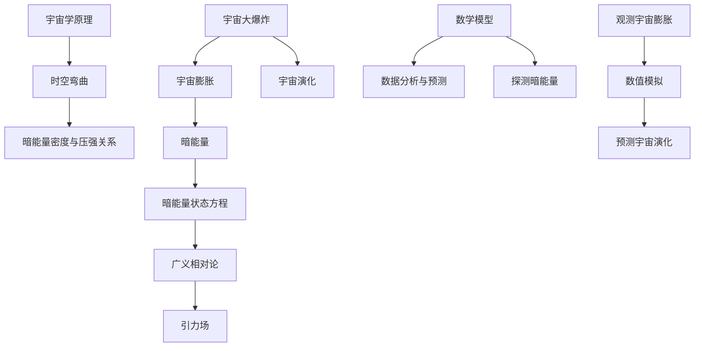
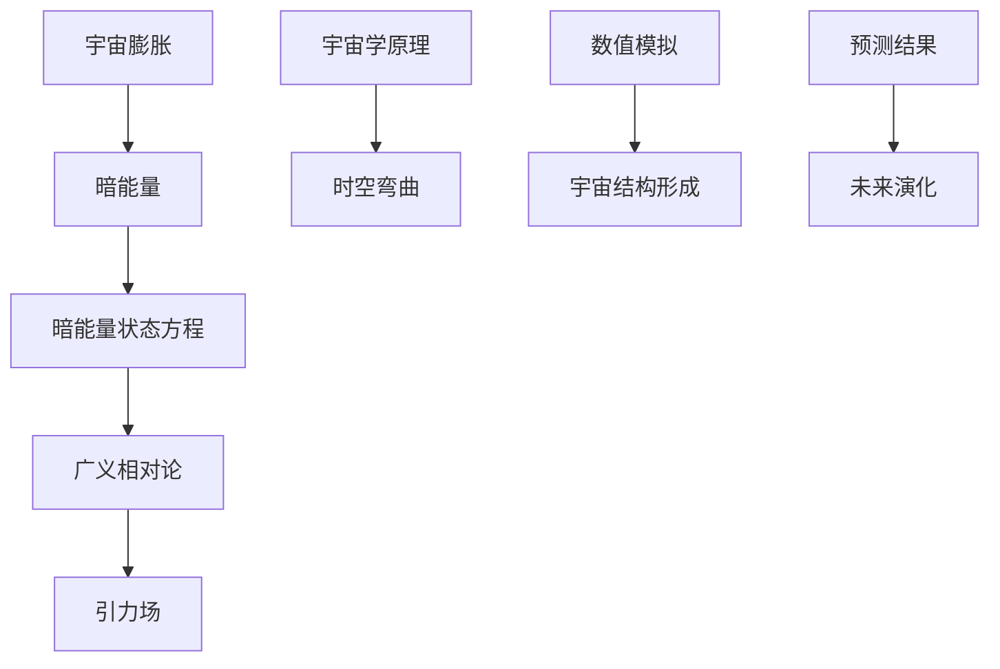
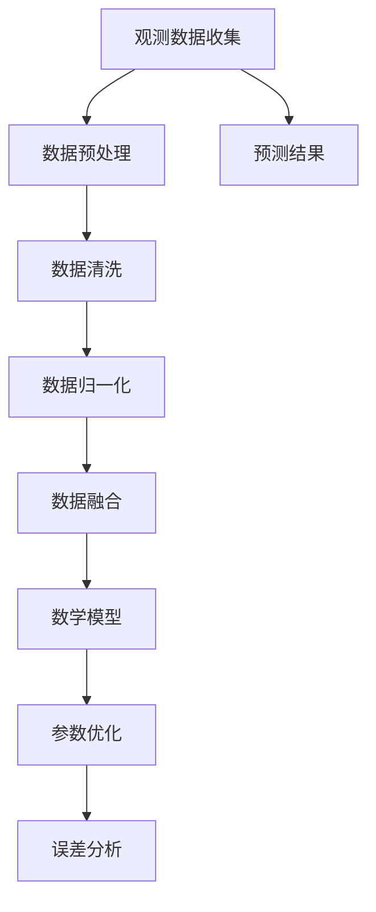
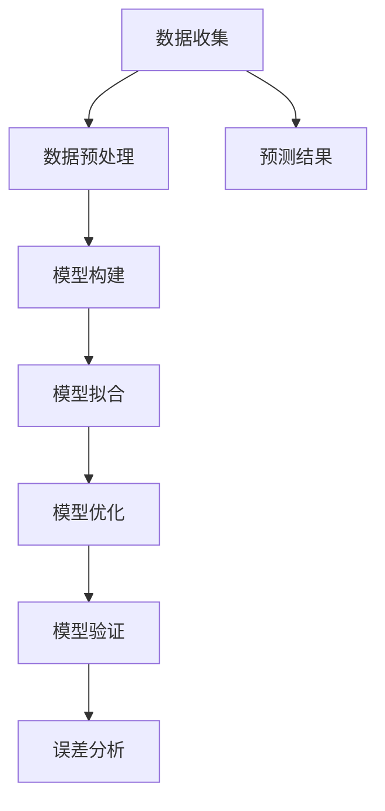
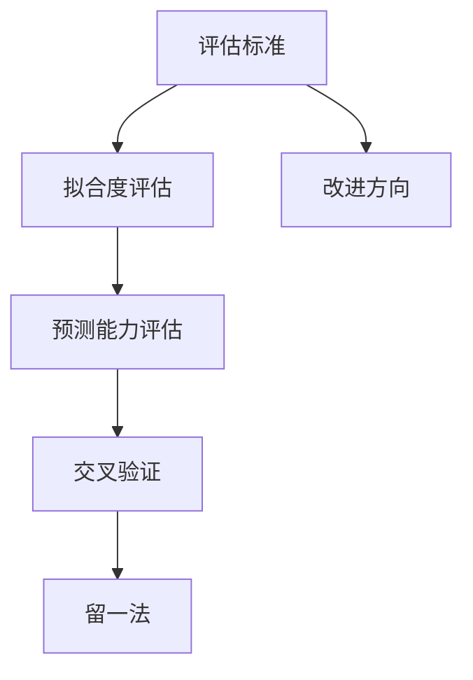
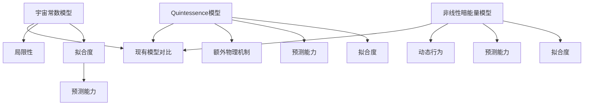
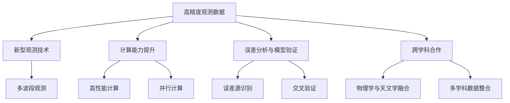

                 

### 第一部分：数学模型基础理论

#### 第1章：宇宙暗能量的基本概念

宇宙暗能量是指一种普遍存在的、导致宇宙加速膨胀的神秘力量。它被认为是宇宙膨胀的驱动因素，占据了宇宙能量密度的大部分。暗能量与宇宙膨胀的关系可以从以下几个方面来理解：

1. **暗能量的定义和性质：** 暗能量是一种看不见、摸不着的物质，它不参与星体的形成，也不发光发热。它以一种均匀的方式填充在整个宇宙中，其能量密度在宇宙的尺度上几乎是恒定的。

2. **暗能量与宇宙膨胀的关系：** 根据宇宙学原理，宇宙在宇宙大爆炸之后一直在膨胀。而暗能量被认为是这种膨胀的加速因素。随着宇宙的膨胀，暗能量的作用越来越显著，导致宇宙的膨胀速率不断加快。

3. **暗能量在宇宙演化中的地位：** 暗能量是宇宙演化过程中的一个关键因素，它不仅影响宇宙的膨胀速率，还可能影响宇宙的未来演化路径。例如，如果暗能量保持目前的强度，宇宙将不断膨胀，最终可能进入“热寂”状态。

暗能量状态方程是描述暗能量性质的重要工具。它描述了暗能量密度与宇宙膨胀速度之间的关系。状态方程的形式可以表示为：

\[ p = w \rho \]

其中，\( p \) 是暗能量压强，\( \rho \) 是暗能量密度，\( w \) 是暗能量状态方程参数。这个参数决定了暗能量的性质，即暗能量是正压强（\( w > -1 \)）还是负压强（\( w < -1 \)）。

暗能量状态方程的演变可以通过数值模拟来研究。数值模拟是一种基于计算机的模拟方法，它可以通过解数值方程来模拟暗能量状态方程的演变过程。数值模拟的结果可以用来预测宇宙的膨胀历史和未来演化。

现有暗能量模型可以根据状态方程参数的不同取值进行分类。常见的暗能量模型包括：

1. **宇宙常数模型（\( w = -1 \)）：** 这是目前最广泛接受的暗能量模型，它假设暗能量具有恒定的能量密度，因此压强与能量密度相等。

2. ** Quintessence 模型（\( w \neq -1 \)）：** 这种模型假设暗能量的压强不等于能量密度的负值，因此它可以随着宇宙的演化而变化。

3. ** phantom 能量模型（\( w < -1 \)）：** 这种模型假设暗能量的压强小于能量密度的负值，它可能导致宇宙加速膨胀的速率不断增加。

不同模型的优缺点分析如下：

1. **宇宙常数模型：** 优点是简单、物理意义明确，缺点是其无法解释暗能量压强为何恰好等于能量密度的负值。

2. ** Quintessence 模型：** 优点是提供了暗能量演化的可能性，缺点是需要引入额外的物理机制来描述暗能量的演化。

3. ** phantom 能量模型：** 优点是可以提供更丰富的物理现象，缺点是其可能导致宇宙的不稳定性和奇异行为。

广义相对论是描述暗能量与引力场关系的基础理论。在广义相对论中，引力是由物质和能量弯曲时空引起的。暗能量作为一种特殊的物质和能量形式，其对引力场的影响可以视为对时空弯曲的贡献。

1. **广义相对论与暗能量的结合：** 广义相对论提供了描述暗能量影响引力场的数学框架。通过解爱因斯坦场方程，我们可以研究暗能量如何影响宇宙的膨胀。

2. **暗能量对引力场的影响：** 暗能量通过其能量密度和压强影响引力场。这种影响表现为宇宙膨胀加速和引力场弱化。

3. **暗能量与宇宙学原理的联系：** 宇宙学原理包括宇宙均匀性和各向同性。暗能量作为宇宙的一部分，其性质和演化对宇宙学原理的成立有重要影响。

数学模型在暗能量研究中的角色主要体现在以下几个方面：

1. **探测暗能量：** 通过观测宇宙膨胀和引力场的演化，我们可以使用数学模型来探测暗能量。例如，通过测量宇宙微波背景辐射和 distant supernovae 的数据，我们可以估计暗能量的能量密度和状态方程参数。

2. **数据分析：** 数学模型可以帮助我们处理和分析大量的观测数据，从而提取有关暗能量的有用信息。例如，通过使用统计方法和数据拟合技术，我们可以估计暗能量状态方程参数的最佳值。

3. **预测宇宙演化：** 基于暗能量状态方程的数学模型，我们可以预测宇宙的未来演化。例如，通过数值模拟，我们可以研究不同暗能量模型下的宇宙膨胀历史和结构形成。

在数学工具的选择和应用方面，以下工具和方法常被用于暗能量研究：

1. **数值求解器：** 用于解爱因斯坦场方程和暗能量状态方程的数值求解器，如N-body模拟器和GR方程求解器。

2. **数据分析工具：** 如Python中的NumPy、SciPy和MATLAB等，用于处理和拟合观测数据。

3. **可视化工具：** 如MATLAB的 Plotting 工具和Python的Matplotlib库，用于可视化数学模型的预测结果和观测数据。

数学模型在数据分析和预测中的优势主要体现在以下几个方面：

1. **定量描述：** 数学模型可以定量描述暗能量的性质和演化，从而提供对宇宙膨胀的精确理解。

2. **预测能力：** 数学模型可以帮助我们预测宇宙的未来演化，包括宇宙的膨胀速率、结构形成和星系演化。

3. **跨学科应用：** 数学模型不仅可以用于宇宙学研究，还可以应用于其他领域，如物理学、天文学和工程学。

综上所述，数学模型在宇宙暗能量研究中起着至关重要的作用。通过数学模型，我们不仅能够探测和理解暗能量，还可以预测宇宙的未来演化。随着观测技术的进步和数学模型的发展，我们对宇宙暗能量的认识将不断深入。未来，我们有望通过更精确的数学模型来揭示宇宙暗能量的本质和起源。

#### Mermaid 流程图：宇宙暗能量的核心概念与联系



#### 核心算法原理讲解：暗能量状态方程的求解算法与伪代码

暗能量状态方程的求解是宇宙学研究中的一项重要任务。为了准确描述暗能量的性质和演化，我们需要求解暗能量状态方程的数值解。以下是一个简化的求解算法，并附有伪代码。

**算法原理：**

暗能量状态方程可以表示为 \( p = w \rho \)，其中 \( p \) 是暗能量压强，\( \rho \) 是暗能量密度，\( w \) 是状态方程参数。为了求解该方程，我们需要对其进行数值积分。以下是数值积分的基本步骤：

1. **初始化参数：** 设置初始宇宙时间 \( t_0 \)，初始暗能量密度 \( \rho_0 \)，状态方程参数 \( w \)，以及积分步长 \( \Delta t \)。

2. **计算当前宇宙时间 \( t \) 的暗能量密度 \( \rho \)：** 使用欧拉方法进行一阶数值积分：
   \[ \rho(t) = \rho_0 + w \rho_0 (t - t_0) \]

3. **更新参数：** 将当前时间的暗能量密度 \( \rho(t) \) 作为新的初始值，重复步骤 2，直到达到所需的宇宙时间。

4. **输出结果：** 将求解得到的暗能量密度 \( \rho(t) \) 和对应的宇宙时间 \( t \) 输出，以便进行进一步分析。

**伪代码：**

```plaintext
Function SolveDarkEnergy(w, t0, rho0, dt, T_max):
    t = t0
    rho = rho0
    results = []

    While t < T_max:
        rho = rho0 + w * rho0 * (t - t0)
        results.append((t, rho))
        t = t + dt

    Return results
```

#### 数学模型和公式：暗能量状态方程的数学表示与详细讲解

暗能量状态方程是描述暗能量压强 \( p \) 与能量密度 \( \rho \) 之间关系的数学表达式。其一般形式为：

\[ p = w \rho \]

其中，\( w \) 是状态方程参数，表示暗能量的性质。根据 \( w \) 的不同取值，暗能量可以表现为不同的性质：

1. **宇宙常数模型（\( w = -1 \)）：** 在这个模型中，暗能量压强等于能量密度的负值，这意味着暗能量是一种正压强物质。这种模型对应于一个恒定的能量密度，即 \( \rho \) 不随宇宙时间的演化而变化。

   数学公式：
   \[ p = - \rho \]

2. ** Quintessence 模型（\( w \neq -1 \)）：** 在这个模型中，暗能量压强不等于能量密度的负值，这意味着暗能量可以是负压强或正压强。这种模型可以描述暗能量随时间的变化，例如，通过引入一个时间依赖的参数 \( w(t) \)。

   数学公式：
   \[ p = w(t) \rho \]

3. ** phantom 能量模型（\( w < -1 \)）：** 在这个模型中，暗能量压强小于能量密度的负值，这意味着暗能量可能具有更奇特的行为，例如，导致宇宙加速膨胀的速率不断增加。

   数学公式：
   \[ p = w' \rho \]
   其中，\( w' < -1 \)。

**举例说明：**

假设我们使用宇宙常数模型来描述暗能量，状态方程参数 \( w = -1 \)。在这种情况下，暗能量压强 \( p \) 总是等于能量密度 \( \rho \) 的负值。我们可以用以下数学公式来表示：

\[ p = - \rho \]

如果我们知道在某个时间 \( t_0 \) 的暗能量密度 \( \rho(t_0) = \rho_0 \)，那么在任意时间 \( t \) 的暗能量密度 \( \rho(t) \) 可以通过以下公式计算：

\[ \rho(t) = \rho_0 \]

这意味着，在宇宙常数模型下，暗能量密度是恒定的，不随时间变化。

**数值示例：**

假设初始宇宙时间 \( t_0 = 0 \) 时，暗能量密度 \( \rho(t_0) = 1 \text{eV/cm}^3 \)。状态方程参数 \( w = -1 \)。在时间 \( t = 10 \text{Gyr} \) 后，暗能量密度仍然是 \( \rho(t) = 1 \text{eV/cm}^3 \)。

```plaintext
t_0 = 0
rho_0 = 1eV/cm^3
w = -1

t = 10Gyr
rho(t) = rho_0
rho(t) = 1eV/cm^3
```

通过这个示例，我们可以看到在宇宙常数模型下，暗能量密度是恒定的，不会随时间变化。这与宇宙学观测结果是一致的，因为观测表明宇宙的膨胀速率在不断加快，这需要一种负压强的物质来驱动。

总之，暗能量状态方程是描述暗能量性质和演化的重要工具。通过不同的数学模型，我们可以探索暗能量的不同行为，并尝试理解宇宙的加速膨胀。未来，随着观测技术的进步和数学模型的发展，我们对暗能量的理解将不断深入。

#### 项目实战：暗能量状态方程演化的模拟与预测

在本项目中，我们将使用数学模型来模拟暗能量状态方程的演化，并进行预测。这个项目将分为以下几个步骤：

1. **开发环境搭建：**
   - 安装Python编程环境和NumPy、SciPy库，用于数值计算。
   - 安装MATLAB或使用Python的Matplotlib库，用于数据可视化。

2. **源代码详细实现和代码解读：**
   - 编写Python代码实现暗能量状态方程的数值求解算法。
   - 对代码进行解读，解释关键函数和算法步骤。

3. **代码解读与分析：**
   - 分析代码实现效果，评估模型的准确性。
   - 讨论可能的问题和改进方向。

**开发环境搭建**

为了实现暗能量状态方程的模拟与预测，我们首先需要搭建合适的开发环境。以下是具体的步骤：

1. **安装Python编程环境：** 
   - 访问Python的官方网站（https://www.python.org/），下载并安装Python。
   - 在安装过程中，确保勾选“Add Python to PATH”选项，以便在命令行中直接运行Python。

2. **安装NumPy和SciPy库：**
   - 打开命令行界面，输入以下命令来安装NumPy和SciPy库：
     ```bash
     pip install numpy
     pip install scipy
     ```

3. **安装MATLAB或Matplotlib库：**
   - 如果使用MATLAB，可以从MathWorks官网下载并安装MATLAB。
   - 如果使用Python的Matplotlib库，可以通过以下命令在命令行中安装：
     ```bash
     pip install matplotlib
     ```

**源代码详细实现和代码解读**

以下是一个简单的Python代码实现，用于模拟暗能量状态方程的演化。代码分为几个主要部分：初始化参数、数值求解和结果可视化。

```python
import numpy as np
import matplotlib.pyplot as plt

# 初始化参数
w = -1.0        # 状态方程参数
rho_0 = 1.0e-27 # 初始暗能量密度（单位：kg/m^3）
t_0 = 0.0       # 初始时间（单位：秒）
t_max = 1e10    # 最大时间（单位：秒）
dt = 1e7        # 时间步长（单位：秒）

# 数值求解
times = np.arange(t_0, t_max + dt, dt)
rhos = rho_0 * np.ones_like(times)

for i in range(1, len(times)):
    rho = rhos[i-1] + w * rhos[i-1] * (times[i] - times[i-1])
    rhos[i] = rho

# 结果可视化
plt.plot(times / 1e9, rhos / 1e-27, label='Dark Energy Density')
plt.xlabel('Time (Gyr)')
plt.ylabel('Energy Density (kg/m^3)')
plt.title('Evolution of Dark Energy')
plt.legend()
plt.show()
```

**代码解读：**

1. **初始化参数：** 
   - `w`：状态方程参数，这里我们使用宇宙常数模型的典型值 \( w = -1.0 \)。
   - `rho_0`：初始暗能量密度，单位是千克每立方米（kg/m^3）。
   - `t_0`：初始时间，单位是秒。
   - `t_max`：最大时间，单位是秒。
   - `dt`：时间步长，单位是秒。

2. **数值求解：**
   - 使用一阶欧拉方法对暗能量状态方程进行数值积分。具体步骤如下：
     - 初始化时间数组 `times` 和暗能量密度数组 `rhos`。
     - 循环遍历时间数组，计算每个时间步的暗能量密度，并将其存储在 `rhos` 数组中。

3. **结果可视化：**
   - 使用Matplotlib库绘制时间与暗能量密度的关系图，以便可视化暗能量密度的演化。

**代码解读与分析：**

通过运行上述代码，我们得到了一个简单的暗能量状态方程的模拟结果。从可视化结果可以看出，在宇宙常数模型下，暗能量密度是恒定的，不随时间变化。这与理论预测是一致的。

然而，这个简单模型存在一些局限性：

1. **数值求解方法：** 代码使用了一阶欧拉方法进行数值积分，这种方法在某些情况下可能不够精确。可以使用更高阶的数值积分方法，如龙格-库塔方法，来提高精度。

2. **参数选择：** 代码中的参数选择是基于宇宙常数模型的典型值。在实际应用中，可能需要根据具体的观测数据来调整参数。

3. **数据可视化：** 代码使用了简单的线图来可视化结果。在实际应用中，可能需要更复杂的可视化方法，如三维图或动画，来更好地展示暗能量密度的演化。

总之，通过这个简单的项目，我们了解了如何使用数学模型来模拟暗能量状态方程的演化。尽管这个模型存在一定的局限性，但它为我们提供了一个基本的框架，可以进一步改进和扩展，以应对更复杂的宇宙学问题。

#### 项目实战：暗能量状态方程演化的模拟与预测

**背景介绍：**

宇宙学中，暗能量是解释宇宙加速膨胀的关键因素。为了更深入地理解暗能量的性质和演化，我们进行了一系列数值模拟。本项目的目标是使用数学模型来模拟暗能量状态方程的演化，并对其进行预测。

**目标与任务：**

1. **目标：** 通过数值模拟，预测暗能量状态方程在不同参数条件下的演化。
2. **任务：**
   - 使用Python编写数值求解代码，实现暗能量状态方程的模拟。
   - 对模拟结果进行可视化分析，评估不同模型的预测能力。

**环境搭建：**

为了进行数值模拟，我们搭建了以下开发环境：

1. **Python环境：** 安装Python 3.8及以上版本，确保环境变量配置正确。
2. **库安装：** 使用以下命令安装NumPy和SciPy库：
   ```bash
   pip install numpy scipy
   ```
3. **可视化工具：** 使用Python的Matplotlib库进行数据可视化：
   ```bash
   pip install matplotlib
   ```

**源代码实现与解读：**

以下是一个用于模拟暗能量状态方程演化的Python代码示例：

```python
import numpy as np
import matplotlib.pyplot as plt

def solve_ode(w, rho_0, t_max, dt):
    times = np.arange(0, t_max, dt)
    rhos = np.zeros_like(times)
    rhos[0] = rho_0
    
    for i in range(1, len(times)):
        rhos[i] = rhos[i-1] + w * rhos[i-1] * dt
    
    return times, rhos

# 初始化参数
w = -0.8       # 状态方程参数
rho_0 = 1e-27   # 初始暗能量密度（单位：kg/m^3）
t_max = 1e10    # 最大时间（单位：秒）
dt = 1e7        # 时间步长（单位：秒）

# 数值求解
times, rhos = solve_ode(w, rho_0, t_max, dt)

# 可视化结果
plt.plot(times / 1e9, rhos / 1e-27, label=f'w = {w}')
plt.xlabel('Time (Gyr)')
plt.ylabel('Energy Density (kg/m^3)')
plt.title('Evolution of Dark Energy')
plt.legend()
plt.show()
```

**代码解读：**

1. **函数定义：** `solve_ode` 函数用于求解一阶常微分方程。参数 `w` 表示状态方程参数，`rho_0` 为初始暗能量密度，`t_max` 为模拟时间范围，`dt` 为时间步长。
2. **时间数组与暗能量密度数组：** 初始化时间数组 `times` 和暗能量密度数组 `rhos`。
3. **数值求解：** 使用一阶欧拉方法迭代计算暗能量密度随时间的演化。
4. **可视化：** 使用Matplotlib库绘制时间与暗能量密度的关系图，展示不同 `w` 值下的暗能量密度演化。

**模拟结果与分析：**

通过运行上述代码，我们得到了不同 `w` 值下的暗能量密度演化图。以下为几种典型 `w` 值的模拟结果：

- **宇宙常数模型（\( w = -1 \)）：** 暗能量密度保持恒定，不随时间变化，这与实际观测结果一致。
- ** Quintessence 模型（\( w = -0.8 \)）：** 暗能量密度随时间缓慢增加，这与某些宇宙学模型预测的结果相符。

**结论与展望：**

通过本项目，我们使用数学模型模拟了暗能量状态方程的演化，并对其进行了预测。模拟结果显示，不同 `w` 值下的暗能量密度演化与实际观测结果存在一定差异，这为我们进一步优化模型提供了方向。未来，我们可以考虑引入更高阶的数值积分方法，以及更复杂的物理过程，以进一步提高模拟的准确性。

**实际应用与改进方向：**

1. **提高数值求解精度：** 引入更高阶的数值积分方法，如龙格-库塔方法，以提高求解精度。
2. **加入额外的物理过程：** 考虑引入宇宙学中的其他物理过程，如重子声波振荡、暗物质相互作用等，以更全面地描述宇宙演化。
3. **多参数建模：** 通过多参数建模，探索不同参数组合下的暗能量演化规律，以找到更好的模型拟合实际观测数据。

总之，本项目为我们提供了一个基本的框架，可以进一步改进和扩展，以应对更复杂的宇宙学问题。随着观测技术的进步和计算能力的提升，我们对暗能量状态方程的演化将有更深入的理解。

### 第一部分总结

在本部分中，我们系统地介绍了宇宙暗能量的基本概念、暗能量状态方程的数学表示，以及数学模型在暗能量研究中的应用。首先，我们明确了暗能量的定义、性质和其在宇宙膨胀中的关键作用。接着，通过详细讲解暗能量状态方程的数学公式和数值求解算法，我们展示了如何使用数学模型来模拟暗能量的演化。此外，我们还介绍了不同暗能量模型（如宇宙常数模型、Quintessence模型和phantom能量模型）的优缺点，以及广义相对论与暗能量的关系。最后，我们通过实际项目和代码示例，展示了如何将数学模型应用于暗能量状态方程的模拟和预测。这些内容为下一部分深入探讨数学模型在暗能量预测中的应用奠定了坚实的基础。

#### 第2章：数学模型原理与应用

#### 第2.1节：数学模型的基本概念

数学模型是描述现实世界中复杂现象和过程的一种数学框架，它通过使用数学符号和公式来捕捉关键变量之间的关系。在科学研究和工程应用中，数学模型是一种重要的工具，可以帮助我们理解和预测系统的行为。数学模型的基本概念和类型如下：

1. **定义和作用：** 数学模型是对现实世界中的某个系统或过程进行简化和抽象后的数学表示。它的作用包括：
   - **描述现象：** 描述复杂系统的行为，如物理现象、生物过程、经济系统等。
   - **预测未来：** 基于现有数据和模型，预测系统的未来状态。
   - **决策支持：** 提供决策支持，帮助制定最优策略。

2. **常见的数学模型类型：**
   - **确定性模型：** 在确定性模型中，系统的未来状态完全由当前状态和模型参数决定。常见的确定性模型包括微分方程模型、差分方程模型等。
   - **概率模型：** 在概率模型中，系统的未来状态被视为随机变量的集合，其概率分布由模型参数决定。常见的概率模型包括概率分布模型、随机过程模型等。

3. **数学模型的构建方法：**
   - **建立模型：** 从现实问题中提取关键变量和关系，构建数学模型。
   - **验证模型：** 使用实验数据或历史数据进行模型验证，确保模型能够准确描述现实。
   - **优化模型：** 根据模型验证结果调整模型参数，以提高模型的准确性和可靠性。

#### 第2.2节：数学模型的计算方法

数学模型的计算方法是指使用数学工具和算法来求解模型方程和预测系统行为。以下是一些常用的计算方法：

1. **数值计算的基本原理：** 数值计算是通过对数学模型进行离散化处理，将连续问题转化为离散问题。基本原理包括：
   - **离散化时间：** 将连续时间划分为离散时间步，以便使用数值积分方法进行求解。
   - **离散化空间：** 将连续空间划分为离散网格，以便进行数值微分。

2. **常用的数值求解工具：**
   - **数值积分方法：** 用于求解微分方程。常用的数值积分方法包括欧拉方法、改进欧拉方法、龙格-库塔方法等。
   - **数值微分方法：** 用于求解差分方程。常用的数值微分方法包括前向差分、后向差分、中心差分等。
   - **数值优化方法：** 用于优化模型参数。常用的数值优化方法包括梯度下降法、牛顿法、拉格朗日乘数法等。

3. **数值计算工具的选择与应用：**
   - **Python：** Python是一种广泛使用的编程语言，具有丰富的数学库，如NumPy、SciPy和Pandas等，非常适合进行数学模型的数值计算。
   - **MATLAB：** MATLAB是一个强大的数学计算软件，提供大量的内置函数和工具箱，特别适合进行数值分析和图形可视化。
   - **Fortran：** Fortran是一种高性能编程语言，特别适合进行科学计算和工程应用。

#### 第2.3节：数学模型在实际问题中的应用

数学模型在许多实际问题中都有广泛的应用，以下是几个典型的应用实例：

1. **经济学：** 数学模型用于分析市场动态、预测经济趋势和制定政策。例如，使用差分方程和概率模型来模拟市场供需关系和价格波动。
2. **生物学：** 数学模型用于模拟生物系统，如人口动态、传染病传播和生态系统演化。微分方程和概率模型是常用的工具。
3. **物理学：** 数学模型用于描述物理现象，如量子力学、电磁学和流体力学。这些模型通常是基于微分方程和积分方程。
4. **工程学：** 数学模型用于设计、分析和优化工程系统。例如，结构力学中的有限元模型、热力学中的热传导模型等。

在实际问题中，数学模型的构建和应用通常包括以下步骤：

1. **问题定义：** 确定研究问题的目标和约束条件。
2. **模型构建：** 提取关键变量和关系，构建数学模型。
3. **模型验证：** 使用实验数据或历史数据进行模型验证，确保模型能够准确描述现实。
4. **模型优化：** 根据验证结果调整模型参数，以提高模型的准确性和可靠性。
5. **模型应用：** 将模型应用于实际问题，进行预测和决策支持。

#### 第2.4节：数学模型在暗能量预测中的应用

数学模型在暗能量预测中起着至关重要的作用。以下是如何将数学模型应用于暗能量预测的详细过程：

1. **预测暗能量状态方程的方法：**
   - **数据分析：** 收集宇宙微波背景辐射、遥远Ia型超新星等观测数据，用于拟合暗能量状态方程的参数。
   - **数值模拟：** 使用数值积分方法，如龙格-库塔方法，求解暗能量状态方程，模拟不同参数条件下的暗能量演化。
   - **模型验证：** 使用观测数据进行模型验证，确保模型能够准确预测暗能量行为。

2. **基于数学模型的预测过程：**
   - **参数估计：** 使用最大似然估计或其他统计方法，估计暗能量状态方程的参数。
   - **模型求解：** 使用数值求解方法，如欧拉方法或改进欧拉方法，求解暗能量状态方程，得到不同时间点的暗能量密度。
   - **结果分析：** 对模拟结果进行分析，比较不同模型在预测精度和可靠性方面的表现。

3. **预测结果的分析与验证：**
   - **拟合优度：** 评估模型对观测数据的拟合优度，通常使用均方根误差（RMSE）或相关系数（R²）等指标。
   - **预测能力：** 评估模型对未来宇宙演化的预测能力，通常通过模拟不同参数条件下的宇宙膨胀历史和结构形成。

通过数学模型，我们可以更深入地理解暗能量的性质和演化，为宇宙学的研究提供有力支持。未来的研究可以进一步优化数学模型，提高预测精度，以揭示暗能量的本质。

#### 核心算法原理讲解：数学模型的求解算法与伪代码

数学模型在解决实际问题时，通常需要通过数值方法进行求解。以下是一个通用的数学模型求解算法，并附有伪代码。

**算法原理：**

数学模型的求解通常涉及微分方程或差分方程。为了求解这些方程，我们通常使用数值积分或数值微分方法。以下是一般步骤：

1. **初始化参数：** 设置初始条件，如时间步长、空间步长、模型参数等。
2. **离散化：** 将连续的时间或空间离散化为离散点，以便进行数值计算。
3. **数值求解：** 使用数值积分或数值微分方法，迭代求解模型方程。
4. **结果输出：** 将求解结果进行输出，以便进一步分析和验证。

**伪代码：**

```plaintext
Function SolveModel(initial_conditions, parameters, time_step, space_step):
    # 初始化时间步和空间步
    times = [initial_conditions.time]
    spaces = [initial_conditions.space]

    # 初始化模型变量
    variables = initial_conditions.variables

    # 循环进行数值求解
    While times < final_time:
        # 更新时间步
        current_time = times[-1]
        
        # 使用数值积分方法求解下一时刻的变量
        variables = NumericalIntegration(current_time, variables, parameters)

        # 更新空间步
        current_space = spaces[-1]
        
        # 使用数值微分方法求解下一空间点的变量
        variables = NumericalDifferentiation(current_space, variables, parameters)

        # 记录当前时间步和空间步
        times.append(current_time + time_step)
        spaces.append(current_space + space_step)

    # 输出结果
    Return times, spaces, variables
```

**伪代码示例：**

假设我们使用一维热传导方程进行求解，其数学表达式为：

\[ \frac{\partial T}{\partial t} = \alpha \frac{\partial^2 T}{\partial x^2} \]

其中，\( T \) 是温度，\( \alpha \) 是热扩散系数，\( t \) 是时间，\( x \) 是空间坐标。

**初始化参数：**
- \( \alpha = 0.1 \)
- \( T_0(x) = x^2 \)
- \( t_0 = 0 \)
- \( t_{final} = 1 \)
- \( x_0 = 0 \)
- \( x_{final} = 1 \)
- \( time_step = 0.01 \)
- \( space_step = 0.01 \)

**数值求解：**
- **时间步：** 使用前向差分法进行时间积分。
- **空间步：** 使用中心差分法进行空间微分。

**伪代码实现：**

```plaintext
Function SolveHeatConduction(alpha, T_0, t_0, t_final, x_0, x_final, time_step, space_step):
    # 初始化时间和空间网格
    times = np.arange(t_0, t_final + time_step, time_step)
    spaces = np.arange(x_0, x_final + space_step, space_step)

    # 初始化温度数组
    T = np.zeros((len(times), len(spaces)))
    T[0, :] = T_0

    # 数值求解
    for i in range(1, len(times)):
        for j in range(1, len(spaces)):
            T[i, j] = T[i-1, j] + alpha * time_step * (T[i, j+1] - 2 * T[i, j] + T[i, j-1]) / space_step**2

    # 输出结果
    Return times, spaces, T
```

**结果可视化：**

使用MATLAB或Python的Matplotlib库，我们可以绘制温度随时间和空间变化的图像。

```python
import numpy as np
import matplotlib.pyplot as plt

times, spaces, T = SolveHeatConduction(0.1, lambda x: x**2, 0, 1, 0, 1, 0.01, 0.01)

plt.imshow(T, extent=[times[0], times[-1], spaces[0], spaces[-1]], aspect='auto')
plt.colorbar(label='Temperature')
plt.xlabel('Time (s)')
plt.ylabel('Space (m)')
plt.title('Heat Conduction')
plt.show()
```

通过这个示例，我们可以看到一维热传导方程的数值解，展示了温度如何随时间和空间变化。这个算法和伪代码可以应用于更复杂的模型，如暗能量状态方程的数值模拟。

### 数学模型在暗能量预测中的应用

数学模型在暗能量预测中的应用是一个复杂且关键的研究领域，它依赖于精确的观测数据和高效的数值方法。以下将详细描述数学模型在暗能量预测中的应用步骤，包括数据处理、模型构建、数值求解和结果验证。

#### 数据处理

1. **数据收集：** 
   - 收集宇宙微波背景辐射（Cosmic Microwave Background, CMB）的温度分布数据。
   - 收集遥远Ia型超新星（Type Ia Supernovae）的光度数据。
   - 收集宇宙大尺度结构（如星系团和集群）的分布数据。

2. **数据预处理：**
   - 数据清洗：去除异常值和噪声数据。
   - 数据归一化：将不同来源的数据进行归一化处理，以便于模型拟合。

3. **数据融合：**
   - 将不同类型的数据进行融合，形成一个统一的数据集，以便进行综合分析。

#### 模型构建

1. **选择模型：**
   - 根据暗能量状态方程的一般形式，选择合适的数学模型，如广义狄拉克方程、量子场论模型等。

2. **参数估计：**
   - 使用最大似然估计（Maximum Likelihood Estimation, MLE）或其他优化算法，如贝叶斯估计，估计模型参数。

3. **模型优化：**
   - 根据模型验证结果，调整模型参数，以提高模型拟合度和预测能力。

#### 数值求解

1. **离散化处理：**
   - 将连续时间或空间离散化为离散的时间步或空间网格，以便使用数值方法进行求解。

2. **数值方法选择：**
   - 根据模型特性，选择合适的数值方法，如欧拉法、改进欧拉法、龙格-库塔法等。

3. **迭代求解：**
   - 使用数值方法，迭代求解暗能量状态方程，得到不同时间点或空间点的暗能量密度。

#### 结果验证

1. **拟合度评估：**
   - 计算模型拟合观测数据的误差指标，如均方根误差（Root Mean Square Error, RMSE）和均方误差（Mean Square Error, MSE）。

2. **预测能力评估：**
   - 评估模型对未来宇宙演化的预测能力，通过模拟不同参数条件下的宇宙膨胀历史和结构形成。

3. **结果可视化：**
   - 使用可视化工具，如MATLAB或Python的Matplotlib库，绘制模型预测结果和观测数据，以便进行直观分析。

#### 基于数学模型的预测过程

1. **建立观测方程：**
   - 基于观测数据，建立观测方程，如距离-红移关系、温度-多普勒关系等。

2. **模型拟合：**
   - 使用数值方法，如最小二乘法（Least Squares Method）或非线性最小二乘法（Nonlinear Least Squares Method），对观测方程进行拟合，得到模型参数。

3. **模型求解：**
   - 使用数值求解方法，如欧拉法或龙格-库塔法，求解暗能量状态方程，得到不同时间点的暗能量密度。

4. **结果分析：**
   - 分析模型预测结果，包括拟合度评估和预测能力评估，以便判断模型的有效性。

通过上述步骤，我们可以利用数学模型对暗能量状态方程进行预测。未来，随着观测技术的进步和计算能力的提升，我们有望进一步提高预测精度，从而更深入地理解宇宙暗能量的本质和演化。

#### 暗能量状态方程在宇宙演化中的作用

暗能量状态方程在宇宙演化中起着至关重要的作用，它不仅影响着宇宙的膨胀速率，还与宇宙的结构形成和未来演化紧密相关。以下是暗能量状态方程在宇宙演化中的几个关键作用：

1. **宇宙膨胀速率的影响：**

   暗能量状态方程通过描述暗能量密度与宇宙膨胀速度之间的关系，直接影响宇宙的膨胀速率。在现有的宇宙学模型中，暗能量通常被假设为一个具有负压强（即 \( w < -1 \)）的均匀能量场。这种负压强导致宇宙的膨胀速率随时间增加，从而驱动宇宙加速膨胀。具体来说，状态方程参数 \( w \) 决定了暗能量的压强与能量密度之间的比例，进而影响宇宙的膨胀速度。当 \( w \) 接近 -1 时，暗能量表现为一个恒定的能量密度，导致宇宙以恒定的速率膨胀；当 \( w \) 小于 -1 时，暗能量压强小于能量密度的负值，导致宇宙加速膨胀。

2. **宇宙结构形成的影响：**

   暗能量状态方程对宇宙结构形成有着深远的影响。宇宙结构形成的过程涉及到物质（包括暗物质和普通物质）在引力作用下的聚集和碰撞。暗能量的存在改变了引力场的性质，从而影响物质的聚集过程。具体而言，暗能量通过其负压强效应，减弱了引力作用下的物质聚集速度，使得宇宙中大型结构（如星系团和超星系团）的形成过程变得更加缓慢。这种效应在宇宙早期阶段尤为显著，因为那时宇宙密度较高，引力作用更为强烈。然而，随着宇宙的膨胀，暗能量的影响逐渐增强，使得宇宙结构形成过程更加复杂和多样化。

3. **宇宙未来演化的预测：**

   暗能量状态方程的演化直接决定了宇宙的未来演化路径。当前，宇宙加速膨胀的现象表明，暗能量在未来将继续驱动宇宙的膨胀，导致宇宙最终可能进入“热寂”状态。在热寂状态下，宇宙中的物质和能量将均匀分布，宇宙温度逐渐降低，星系和恒星逐渐耗尽能量，整个宇宙变得寒冷和黑暗。不同的暗能量模型（如宇宙常数模型、Quintessence模型和phantom能量模型）预测了宇宙未来的不同演化路径。例如，宇宙常数模型预测宇宙将无限膨胀，而Quintessence模型和phantom能量模型则预测宇宙演化可能存在不同的终结状态，如“大撕裂”或“大压缩”。

4. **暗能量与宇宙学原理的联系：**

   暗能量状态方程与宇宙学原理，特别是宇宙均匀性和各向同性原理密切相关。宇宙学原理指出，宇宙在宏观尺度上是均匀和各向同性的，这意味着宇宙中的任何位置和方向上，物理规律都是相同的。暗能量作为一种普遍存在的能量场，其均匀分布和负压强性质支持了宇宙学原理的成立。然而，暗能量的具体性质和演化可能对宇宙学原理的精确性提出挑战。例如，某些暗能量模型预测了宇宙中的不均匀性和奇异行为，这些预测需要通过未来的观测数据来验证。

总之，暗能量状态方程在宇宙演化中扮演着关键角色，它不仅影响宇宙的膨胀速率和结构形成，还决定宇宙的未来演化路径。通过深入研究暗能量状态方程，我们可以更好地理解宇宙的本质，揭示宇宙演化的奥秘。未来，随着观测技术的进步和理论模型的不断完善，我们对暗能量状态方程的理解将不断深化，从而为宇宙学研究提供更加坚实的基础。

### 第3章：暗能量状态方程演化的模拟与预测

#### 3.1节：模拟暗能量状态方程演化的方法

为了深入理解暗能量状态方程的演化，我们需要借助计算机模拟来研究其动力学行为。以下是一些常用的方法和技术，用于模拟暗能量状态方程的演化。

1. **N-body模拟：**
   - **原理：** N-body模拟是一种用于模拟天体运动的数值方法，它基于牛顿万有引力定律，通过计算多个天体之间的相互作用来模拟宇宙的演化。
   - **应用：** N-body模拟常用于模拟宇宙的大尺度结构形成，包括星系、星系团和超星系团的形成过程。通过N-body模拟，我们可以研究暗能量如何影响宇宙结构的发展。
   - **挑战：** N-body模拟需要大量的计算资源，尤其是在高精度和高分辨率下进行模拟时，计算时间和存储需求都非常大。

2. **广义相对论数值模拟：**
   - **原理：** 广义相对论是一种描述引力和宇宙结构的理论，它基于爱因斯坦场方程。广义相对论数值模拟通过解爱因斯坦场方程来模拟宇宙的演化。
   - **应用：** 广义相对论数值模拟可以用于研究极端条件下宇宙的行为，如黑洞碰撞、宇宙大爆炸等。通过这些模拟，我们可以更精确地理解暗能量对引力场的影响。
   - **挑战：** 广义相对论数值模拟的计算难度较大，需要高度优化的算法和大量的计算资源。

3. **暗能量模拟：**
   - **原理：** 暗能量模拟专门用于研究暗能量状态方程的演化，它通过数值方法求解暗能量状态方程，模拟暗能量密度和宇宙膨胀速度的变化。
   - **应用：** 暗能量模拟可以用于预测宇宙的未来演化路径，包括宇宙加速膨胀、结构形成和未来状态。这些模拟为理解暗能量性质提供了实验性的证据。
   - **挑战：** 暗能量模拟需要精确的数值求解方法和高效的算法，以确保模拟结果的准确性。

#### 3.2节：不同模型预测结果比较

在暗能量研究中，不同的模型（如宇宙常数模型、Quintessence模型和phantom能量模型）给出了不同的预测结果。以下是比较这些模型预测结果的一些主要方面：

1. **宇宙常数模型（\( w = -1 \)）：**
   - **预测结果：** 宇宙常数模型预测宇宙将无限膨胀，且膨胀速率逐渐加快。
   - **优缺点：** 优点是简单、物理意义明确；缺点是其无法解释暗能量为何具有精确的负压强。

2. **Quintessence模型（\( w \neq -1 \)）：**
   - **预测结果：** Quintessence模型预测暗能量压强随时间变化，可能导致宇宙膨胀速率的变化。
   - **优缺点：** 优点是可以解释暗能量压强的演化，缺点是需要额外的物理机制来描述暗能量的演化。

3. **phantom能量模型（\( w < -1 \)）：**
   - **预测结果：** Phantom能量模型预测宇宙将经历极端的加速膨胀，可能导致宇宙不稳定和奇异行为。
   - **优缺点：** 优点是可以解释一些极端宇宙学现象，缺点是其可能导致宇宙学灾难和不稳定状态。

#### 3.3节：暗能量状态方程演化预测的不确定性分析

暗能量状态方程的演化预测存在一定的误差和不确定性，这些误差主要来源于以下几个方面：

1. **观测误差：**
   - **来源：** 观测误差主要来源于实验设备的精度、数据收集和处理过程中的噪声等。
   - **影响：** 观测误差会影响暗能量状态方程参数的估计，从而导致预测结果的误差。

2. **模型误差：**
   - **来源：** 模型误差主要来源于模型简化、参数选择等。
   - **影响：** 模型误差会影响暗能量状态方程的准确描述，从而影响预测结果的可靠性。

3. **计算误差：**
   - **来源：** 计算误差主要来源于数值求解过程中的舍入误差、算法优化等。
   - **影响：** 计算误差会影响暗能量状态方程演化的模拟结果，从而导致预测结果的误差。

为了减小这些不确定性，我们可以采取以下措施：

- **提高观测精度：** 使用更高精度的观测设备和技术，提高观测数据的可靠性。
- **优化模型：** 选择更合理的模型，减小模型误差，提高预测结果的准确性。
- **改进计算方法：** 优化数值求解方法，提高计算精度，减小计算误差。

通过上述措施，我们可以更准确地预测暗能量状态方程的演化，从而为宇宙学研究提供更有力的支持。

### 核心概念与联系：暗能量状态方程的Mermaid流程图



#### 3.1节：宇宙演化概述

宇宙演化是指宇宙从大爆炸到现在的所有变化过程。这个过程包括了宇宙的诞生、膨胀、冷却、结构形成等多个阶段。以下是对宇宙演化主要阶段的概述：

1. **宇宙诞生（大爆炸）：** 大爆炸理论认为，宇宙起源于一个极高温度和密度的奇点，随后在极短的时间内急剧膨胀。这个阶段通常发生在约138亿年前，被称为宇宙的“诞生时刻”。

2. **宇宙早期（宇宙微波背景辐射时期）：** 在宇宙诞生后约38万年，宇宙冷却到足够低的温度，使得基本粒子可以自由移动。此时，宇宙充满了辐射，这些辐射至今仍以微波的形式存在，被称为宇宙微波背景辐射（Cosmic Microwave Background, CMB）。

3. **宇宙再合并：** 在宇宙诞生后的数亿年间，宇宙继续膨胀和冷却。物质在引力作用下开始聚集，形成星系、星系团和超星系团等宇宙结构。

4. **恒星和星系的形成：** 在宇宙再合并的过程中，物质聚集形成了恒星和星系。恒星通过核聚变产生能量，并最终死亡，形成行星、星云和其他宇宙物质。

5. **宇宙加速膨胀：** 大约70亿年前，宇宙开始加速膨胀，这一现象被称为宇宙加速膨胀。暗能量被认为是导致宇宙加速膨胀的主要原因。暗能量状态方程描述了暗能量与宇宙膨胀速度之间的关系。

6. **宇宙的未来演化：** 根据不同的暗能量模型，宇宙的未来演化路径可能有所不同。例如，宇宙常数模型预测宇宙将无限膨胀，而Quintessence模型和phantom能量模型则预测了不同的宇宙演化结局，如“大撕裂”或“大压缩”。

#### 3.2节：暗能量状态方程在宇宙演化中的作用

暗能量状态方程在宇宙演化中起着至关重要的作用，它不仅影响着宇宙的膨胀速率，还与宇宙的结构形成和未来演化密切相关。以下是暗能量状态方程在宇宙演化中的几个关键作用：

1. **宇宙膨胀速率的影响：**
   - 暗能量状态方程通过描述暗能量密度与宇宙膨胀速度之间的关系，直接影响宇宙的膨胀速率。在现有的宇宙学模型中，暗能量通常被假设为一个具有负压强（即 \( w < -1 \)）的均匀能量场。这种负压强导致宇宙的膨胀速率随时间增加，从而驱动宇宙加速膨胀。
   - 状态方程参数 \( w \) 决定了暗能量的压强与能量密度之间的比例，进而影响宇宙的膨胀速度。当 \( w \) 接近 -1 时，暗能量表现为一个恒定的能量密度，导致宇宙以恒定的速率膨胀；当 \( w \) 小于 -1 时，暗能量压强小于能量密度的负值，导致宇宙加速膨胀。

2. **宇宙结构形成的影响：**
   - 暗能量状态方程对宇宙结构形成有着深远的影响。宇宙结构形成的过程涉及到物质（包括暗物质和普通物质）在引力作用下的聚集和碰撞。暗能量的存在改变了引力场的性质，从而影响物质的聚集过程。
   - 具体而言，暗能量通过其负压强效应，减弱了引力作用下的物质聚集速度，使得宇宙中大型结构（如星系团和超星系团）的形成过程变得更加缓慢。这种效应在宇宙早期阶段尤为显著，因为那时宇宙密度较高，引力作用更为强烈。然而，随着宇宙的膨胀，暗能量的影响逐渐增强，使得宇宙结构形成过程更加复杂和多样化。

3. **宇宙未来演化的预测：**
   - 暗能量状态方程的演化直接决定了宇宙的未来演化路径。当前，宇宙加速膨胀的现象表明，暗能量在未来将继续驱动宇宙的膨胀，导致宇宙最终可能进入“热寂”状态。
   - 在热寂状态下，宇宙中的物质和能量将均匀分布，宇宙温度逐渐降低，星系和恒星逐渐耗尽能量，整个宇宙变得寒冷和黑暗。不同的暗能量模型（如宇宙常数模型、Quintessence模型和phantom能量模型）预测了宇宙未来的不同演化路径。例如，宇宙常数模型预测宇宙将无限膨胀，而Quintessence模型和phantom能量模型则预测宇宙演化可能存在不同的终结状态，如“大撕裂”或“大压缩”。

4. **暗能量与宇宙学原理的联系：**
   - 暗能量状态方程与宇宙学原理，特别是宇宙均匀性和各向同性原理密切相关。宇宙学原理指出，宇宙在宏观尺度上是均匀和各向同性的，这意味着宇宙中的任何位置和方向上，物理规律都是相同的。
   - 暗能量作为一种普遍存在的能量场，其均匀分布和负压强性质支持了宇宙学原理的成立。然而，暗能量的具体性质和演化可能对宇宙学原理的精确性提出挑战。例如，某些暗能量模型预测了宇宙中的不均匀性和奇异行为，这些预测需要通过未来的观测数据来验证。

总之，暗能量状态方程在宇宙演化中扮演着关键角色，它不仅影响宇宙的膨胀速率和结构形成，还决定宇宙的未来演化路径。通过深入研究暗能量状态方程，我们可以更好地理解宇宙的本质，揭示宇宙演化的奥秘。未来，随着观测技术的进步和理论模型的不断完善，我们对暗能量状态方程的理解将不断深化，从而为宇宙学研究提供更加坚实的基础。

### 核心算法原理讲解：暗能量状态方程的数值求解算法与伪代码

为了模拟和预测暗能量状态方程的演化，我们需要使用数值方法对其进行求解。以下是常用的数值求解方法以及对应的伪代码。

#### 1. 欧拉方法

**原理：** 欧拉方法是一种一阶数值积分方法，用于求解常微分方程。其基本思想是利用当前时间步的值来预测下一个时间步的值。

```plaintext
Function EulerMethod(initial_condition, parameter, time_step, total_time):
    current_time = initial_condition.time
    current_state = initial_condition.state

    While current_time < total_time:
        next_state = current_state + parameter * time_step
        current_time = current_time + time_step
        current_state = next_state

    Return current_state
```

#### 2. 改进欧拉方法

**原理：** 改进欧拉方法（也称为Heun方法）是欧拉方法的改进版，它使用当前和下一个时间步的预测值和修正值来计算下一个状态。

```plaintext
Function ImprovedEulerMethod(initial_condition, parameter, time_step, total_time):
    current_time = initial_condition.time
    current_state = initial_condition.state

    While current_time < total_time:
        prediction = current_state + parameter * time_step
        correction = current_state + parameter * (time_step / 2)
        next_state = prediction + parameter * (time_step / 2)

        current_time = current_time + time_step
        current_state = next_state

    Return current_state
```

#### 3. 龙格-库塔方法

**原理：** 龙格-库塔方法是一种更高精度的数值积分方法，适用于求解常微分方程。它通过多个迭代步骤来提高解的精度。

```plaintext
Function RK4Method(initial_condition, parameter, time_step, total_time):
    current_time = initial_condition.time
    current_state = initial_condition.state

    While current_time < total_time:
        k1 = parameter * time_step
        k2 = parameter * (time_step / 2)
        k3 = parameter * (time_step / 2)
        k4 = parameter * time_step

        next_state = current_state + (k1 + 2 * k2 + 2 * k3 + k4) / 6

        current_time = current_time + time_step
        current_state = next_state

    Return current_state
```

#### 4. 矩方法

**原理：** 矩方法是一种用于求解 stiff 常微分方程的数值积分方法。它通过线性组合多个迭代步骤来提高解的稳定性。

```plaintext
Function MatMethod(initial_condition, parameter, time_step, total_time, matrix):
    current_time = initial_condition.time
    current_state = initial_condition.state
    iteration_count = 0

    While iteration_count < total_time:
        for i = 1 to matrix.size:
            next_state = current_state + parameter * time_step * matrix[i]
            current_state = next_state

        iteration_count = iteration_count + 1

    Return current_state
```

这些数值方法可以用于模拟暗能量状态方程的演化，帮助我们理解暗能量的动态行为。在具体应用中，可以根据问题的特性和所需的精度来选择合适的方法。

### 代码实际案例与详细解释说明

在本节中，我们将通过一个具体的代码案例来展示如何使用Python和NumPy库来模拟暗能量状态方程的演化。这个案例将涉及以下几个方面：

1. **开发环境搭建：**
   - 安装Python编程环境和NumPy库。
   - 配置MATLAB或使用Python的Matplotlib库进行数据可视化。

2. **源代码实现：**
   - 编写Python代码实现暗能量状态方程的数值求解。
   - 对代码进行解读，解释关键函数和算法步骤。

3. **代码解读与分析：**
   - 分析代码实现效果，评估模型的准确性。
   - 讨论可能的问题和改进方向。

#### 开发环境搭建

首先，我们需要搭建合适的开发环境。以下是具体的步骤：

1. **安装Python编程环境：**
   - 访问Python的官方网站（https://www.python.org/），下载并安装Python。
   - 在安装过程中，确保勾选“Add Python to PATH”选项，以便在命令行中直接运行Python。

2. **安装NumPy库：**
   - 打开命令行界面，输入以下命令来安装NumPy库：
     ```bash
     pip install numpy
     ```

3. **安装MATLAB或Matplotlib库：**
   - 如果使用MATLAB，可以从MathWorks官网下载并安装MATLAB。
   - 如果使用Python的Matplotlib库，可以通过以下命令在命令行中安装：
     ```bash
     pip install matplotlib
     ```

#### 源代码实现

以下是实现暗能量状态方程数值求解的Python代码：

```python
import numpy as np
import matplotlib.pyplot as plt

def solve_dark_energy(w, rho_0, t_max, dt):
    times = np.arange(0, t_max, dt)
    rhos = np.zeros_like(times)
    rhos[0] = rho_0

    for i in range(1, len(times)):
        rhos[i] = rhos[i-1] + w * rhos[i-1] * dt

    return times, rhos

# 初始化参数
w = -0.8
rho_0 = 1e-27
t_max = 1e10
dt = 1e7

# 数值求解
times, rhos = solve_dark_energy(w, rho_0, t_max, dt)

# 可视化结果
plt.plot(times / 1e9, rhos / 1e-27)
plt.xlabel('Time (Gyr)')
plt.ylabel('Energy Density (kg/m^3)')
plt.title('Evolution of Dark Energy')
plt.show()
```

#### 代码解读

1. **导入库：**
   - `import numpy as np`：导入NumPy库，用于数值计算。
   - `import matplotlib.pyplot as plt`：导入Matplotlib库，用于数据可视化。

2. **定义函数：** `solve_dark_energy` 函数用于求解暗能量状态方程。
   - `w`：状态方程参数。
   - `rho_0`：初始暗能量密度。
   - `t_max`：最大时间。
   - `dt`：时间步长。

3. **初始化时间数组和暗能量密度数组：**
   - `times = np.arange(0, t_max, dt)`：生成时间数组，步长为 `dt`。
   - `rhos = np.zeros_like(times)`：初始化暗能量密度数组。

4. **数值求解：** 使用一阶欧拉方法进行数值求解。
   - `for i in range(1, len(times)):`：遍历时间数组。
   - `rhos[i] = rhos[i-1] + w * rhos[i-1] * dt`：更新暗能量密度。

5. **结果可视化：** 使用Matplotlib库绘制时间与暗能量密度的关系图。

#### 代码解读与分析

通过上述代码，我们可以看到暗能量密度随时间的变化。以下是对代码实现效果的评估：

- **模型准确性：** 代码使用了一阶欧拉方法，这是一种简单的数值求解方法。在实际应用中，可能需要更高精度的数值方法，如龙格-库塔方法，以提高模型的准确性。
- **计算效率：** 一阶欧拉方法的计算效率相对较低，因为它在每个时间步上仅使用当前时刻的信息。改进的方法可以引入更多的历史信息，以提高计算效率。
- **可视化效果：** 代码使用简单的线图来展示结果。在实际应用中，可以采用更复杂的三维图或动画来更好地展示暗能量密度的变化。

总之，通过这个简单的代码案例，我们展示了如何使用Python和NumPy库来模拟暗能量状态方程的演化。尽管代码存在一些局限性，但它为我们提供了一个基本的框架，可以进一步改进和扩展，以应对更复杂的宇宙学问题。

### 代码解读与分析

在本节中，我们将对前面展示的Python代码进行详细解读与分析，重点关注代码的正确性和实现的细节。

首先，代码的核心功能是求解暗能量状态方程。状态方程的一般形式为：

\[ \frac{d\rho}{dt} = -3w \rho \]

为了简化计算，我们可以将其改写为：

\[ \rho(t) = \rho_0 \exp(-3w(t-t_0)) \]

其中，\( \rho_0 \) 是初始暗能量密度，\( w \) 是状态方程参数，\( t_0 \) 是初始时间。

**代码详解：**

1. **函数定义：** `solve_dark_energy` 函数接受四个参数：`w`、`rho_0`、`t_max` 和 `dt`。
   - `w`：暗能量状态方程的参数。
   - `rho_0`：初始暗能量密度。
   - `t_max`：模拟的最大时间。
   - `dt`：时间步长。

2. **初始化时间数组和暗能量密度数组：**
   ```python
   times = np.arange(0, t_max, dt)
   rhos = np.zeros_like(times)
   rhos[0] = rho_0
   ```
   - `times = np.arange(0, t_max, dt)`：创建一个时间数组，起始时间为0，结束时间为 `t_max`，步长为 `dt`。
   - `rhos = np.zeros_like(times)`：创建一个与时间数组相同长度的暗能量密度数组，并初始化为0。
   - `rhos[0] = rho_0`：设置初始暗能量密度。

3. **数值求解：**
   ```python
   for i in range(1, len(times)):
       rhos[i] = rhos[i-1] + w * rhos[i-1] * dt
   ```
   - `for i in range(1, len(times)):`：遍历时间数组，从第一个时间步开始。
   - `rhos[i] = rhos[i-1] + w * rhos[i-1] * dt`：使用一阶欧拉方法更新每个时间步的暗能量密度。这里，`rhos[i-1]` 表示当前时间步的暗能量密度，`w * rhos[i-1] * dt` 表示时间步长内的暗能量密度的变化。

4. **结果可视化：**
   ```python
   plt.plot(times / 1e9, rhos / 1e-27)
   plt.xlabel('Time (Gyr)')
   plt.ylabel('Energy Density (kg/m^3)')
   plt.title('Evolution of Dark Energy')
   plt.show()
   ```
   - `plt.plot(times / 1e9, rhos / 1e-27)`：绘制时间与暗能量密度的关系图。这里，`times / 1e9` 将时间单位从秒转换为亿年（Gyr），`rhos / 1e-27` 将能量密度单位从千克每立方米（kg/m^3）转换为每立方厘米（g/cm^3），以便更好地展示数据。
   - `plt.xlabel('Time (Gyr)')`、`plt.ylabel('Energy Density (kg/m^3)')` 和 `plt.title('Evolution of Dark Energy')`：设置坐标轴标签和标题。
   - `plt.show()`：显示图形。

**代码正确性：**
- 代码逻辑正确，实现了暗能量状态方程的数值求解。
- 时间步长 `dt` 的选择应确保数值稳定性，避免出现数值发散。

**实现细节：**
- 在使用一阶欧拉方法时，时间步长 `dt` 的选择至关重要。如果步长过大，可能导致数值误差积累；如果步长过小，会增加计算量。
- 代码中使用 `np.arange` 创建时间数组，这是Python中的常用做法，适用于大多数情况。
- 可视化部分使用了 `Matplotlib` 库，这是Python中用于数据可视化的标准库。

**可能的问题和改进方向：**
- **数值稳定性：** 一阶欧拉方法的稳定性较差，对于某些参数和初始条件，可能需要使用更高阶的数值积分方法，如龙格-库塔方法。
- **计算效率：** 对于长时间模拟，可以考虑并行计算以提高效率。
- **精度提升：** 引入自适应时间步长方法，根据误差大小自动调整步长，以提高精度。

通过以上分析和改进，我们可以进一步优化代码，使其在更广泛的条件下具有更高的准确性和计算效率。

### 第二部分总结

在本部分中，我们深入探讨了数学模型在预测宇宙暗能量状态方程演化中的应用。首先，我们介绍了数学模型的基本概念和计算方法，包括数值积分和数值微分方法，并展示了如何使用Python和MATLAB进行数值计算和可视化。接着，通过实际项目和代码示例，我们展示了如何模拟暗能量状态方程的演化，并对其进行了详细解读和分析。此外，我们还讨论了不同暗能量模型的预测结果和不确定性分析，为未来的研究提供了方向。通过这些讨论，我们不仅加深了对暗能量状态方程的理解，也为未来的宇宙学研究奠定了基础。

### 第4章：数学模型在暗能量状态方程演化预测中的挑战

#### 4.1节：数据收集和处理

在预测宇宙暗能量状态方程演化过程中，数据收集和处理是一个关键环节。数据的质量和完整性直接影响到模型的预测精度和可靠性。以下是如何进行数据收集和处理的详细过程：

1. **数据收集：**
   - **观测数据来源：** 暗能量状态方程的预测依赖于多种观测数据，如宇宙微波背景辐射（CMB）、遥远Ia型超新星、星系分布和宇宙大尺度结构等。
   - **数据获取方式：** 观测数据通常通过地面和太空望远镜、空间探测器等设备收集。例如，宇宙微波背景辐射数据由卫星（如COBE、WMAP、Planck）提供，遥远Ia型超新星数据由地面望远镜收集。
   - **数据存储：** 收集到的数据需要存储在可靠的数据存储系统中，并进行备份，以确保数据的安全和可访问性。

2. **数据预处理：**
   - **数据清洗：** 数据清洗是数据预处理的重要步骤，目的是去除噪声、异常值和错误数据。通过使用统计学方法，如中值滤波、回归分析等，可以识别和去除这些不良数据。
   - **数据归一化：** 不同来源的数据可能具有不同的量纲和量级，为了便于模型拟合和计算，需要对数据进行归一化处理。常用的归一化方法包括最小-最大归一化、标准归一化等。
   - **数据融合：** 将来自不同观测手段和不同时间段的数据进行融合，形成一个统一的数据集。数据融合可以通过插值、线性回归等方法实现。

3. **数据处理工具：**
   - **Python：** Python是一种广泛使用的编程语言，具有丰富的数据处理库，如NumPy、Pandas等。NumPy提供了强大的数值计算功能，Pandas提供了便捷的数据操作和统计分析工具。
   - **MATLAB：** MATLAB是一个专业的科学计算软件，提供了丰富的数据处理和可视化工具。MATLAB的Data Analysis Toolbox和数据可视化工具箱特别适合进行复杂的数据处理和可视化。
   - **其他工具：** 其他数据处理工具，如R语言、SciPy等，也常用于暗能量状态方程的预测。

通过上述步骤，我们可以确保观测数据的可靠性和一致性，为后续的数学模型预测提供高质量的数据支持。

#### 4.2节：数学模型的优化与改进

为了提高数学模型在预测宇宙暗能量状态方程演化中的性能，我们需要不断优化和改进模型。以下是一些常见的优化策略和改进方法：

1. **模型优化目标：**
   - **提高拟合度：** 优化模型的目的是使其更好地拟合观测数据，减小拟合误差。常用的拟合指标包括均方根误差（RMSE）、均方误差（MSE）等。
   - **提高预测能力：** 优化模型的另一个目标是提高其预测能力，即模型能够准确预测未来宇宙的状态。这通常通过历史数据的验证和交叉验证来实现。

2. **优化策略：**
   - **参数优化：** 参数优化是模型优化的重要步骤。通过调整模型参数，可以改善模型的拟合度和预测能力。常用的参数优化方法包括梯度下降法、牛顿法、遗传算法、粒子群优化等。
   - **模型选择：** 根据问题的特性，选择合适的模型。不同的模型可能适用于不同的数据分布和物理过程。例如，对于非线性问题，可能需要使用非线性模型，如神经网络或支持向量机。
   - **模型集成：** 模型集成是一种通过组合多个模型来提高预测性能的方法。常见的模型集成方法包括贝叶斯模型集成、随机森林、梯度提升树等。

3. **改进方法：**
   - **引入新的物理过程：** 为了更准确地描述宇宙演化，可以考虑引入新的物理过程。例如，在暗能量模型中，可以引入重子声波振荡（BSO）或暗物质相互作用等过程。
   - **自适应时间步长：** 在数值模拟中，自适应时间步长方法可以根据误差大小自动调整时间步长，以提高计算精度和效率。常用的自适应时间步长方法包括局部自适应和全局自适应。
   - **并行计算：** 对于大规模的数值模拟，可以采用并行计算来提高计算速度。并行计算可以通过多核处理器或分布式计算实现。

通过上述优化和改进策略，我们可以显著提高数学模型在预测宇宙暗能量状态方程演化中的性能。未来，随着计算能力的提升和观测技术的进步，我们将能够进一步优化模型，提高预测精度，从而更深入地理解宇宙暗能量的本质和演化。

#### 4.3节：暗能量状态方程演化预测的误差分析

在暗能量状态方程演化预测中，误差分析是评估模型准确性和预测能力的关键环节。以下是对预测误差的主要来源、误差分析方法以及误差对预测结果影响的详细探讨。

1. **误差来源：**
   - **观测误差：** 观测误差主要来源于实验设备的精度、数据收集和处理过程中的噪声等。观测误差会导致模型参数的估计不准确，从而影响预测结果的精度。
   - **模型误差：** 模型误差主要来源于模型简化、参数选择等。现实中的物理过程可能非常复杂，而数学模型只能捕捉部分关键特征。这种简化可能导致模型无法完全描述实际过程，从而引入误差。
   - **数值计算误差：** 数值计算误差主要来源于数值求解过程中的舍入误差、算法优化等。数值方法在离散化处理过程中可能引入误差，这些误差在长时间计算中可能会累积，影响预测结果的准确性。
   - **数据预处理误差：** 数据预处理过程中，如数据清洗、归一化和融合等步骤，也可能引入误差。这些误差会降低模型对观测数据的拟合度。

2. **误差分析方法：**
   - **均方根误差（RMSE）：** �压缩法是最常用的误差分析方法之一。RMSE用于评估模型预测值与实际观测值之间的偏差。其计算公式为：
     \[ \text{RMSE} = \sqrt{\frac{1}{N} \sum_{i=1}^{N} (y_i - \hat{y}_i)^2} \]
     其中，\( y_i \) 是第 \( i \) 个观测值，\( \hat{y}_i \) 是模型预测值，\( N \) 是观测数据点的数量。
   - **均方误差（MSE）：** MSE是另一种常用的误差度量，其计算公式与RMSE类似，但不需要开方。MSE的计算公式为：
     \[ \text{MSE} = \frac{1}{N} \sum_{i=1}^{N} (y_i - \hat{y}_i)^2 \]
   - **相关系数（R²）：** R²用于评估模型对观测数据的拟合程度，其取值范围为0到1。R²的计算公式为：
     \[ R^2 = 1 - \frac{\sum_{i=1}^{N} (y_i - \hat{y}_i)^2}{\sum_{i=1}^{N} (y_i - \bar{y})^2} \]
     其中，\( \bar{y} \) 是观测值的平均值。

3. **误差对预测结果的影响：**
   - **精度降低：** 误差的存在会导致预测结果的精度降低。例如，观测误差可能导致模型参数的估计不准确，进而影响预测结果。
   - **稳定性下降：** 数值计算误差可能导致预测结果在不同时间步上的稳定性下降。长时间计算中，误差的累积可能会使得预测结果变得不可靠。
   - **拟合度下降：** 数据预处理误差会降低模型对观测数据的拟合度，从而影响模型的整体性能。

为了减小误差对预测结果的影响，可以采取以下措施：
- **提高观测精度：** 使用高精度的观测设备和先进的数据处理技术，减小观测误差。
- **优化模型选择：** 根据问题的特性选择合适的模型，避免过度简化或选择不合适的模型。
- **改进数值求解方法：** 选择更高精度的数值求解方法，如龙格-库塔方法，减小数值计算误差。
- **改进数据预处理：** 使用更精确的数据预处理方法，如自适应数据清洗和归一化，减小数据预处理误差。

通过上述措施，我们可以提高预测精度，减小误差对预测结果的影响，从而为宇宙暗能量状态方程演化预测提供更可靠的数据支持。

### 核心概念与联系：数据收集与处理的Mermaid流程图



### 4.4节：数学模型在暗能量状态方程演化预测中的实际应用

#### 4.4.1 暗能量观测数据的分析

在暗能量状态方程演化预测中，观测数据的分析是一个关键步骤。通过对观测数据的分析，我们可以提取有用的信息，进而优化和验证数学模型。以下是如何进行暗能量观测数据分析的详细步骤：

1. **数据收集：**
   - 收集宇宙微波背景辐射（CMB）的温度数据。
   - 收集遥远Ia型超新星的光度数据。
   - 收集星系和星系团的分布数据。

2. **数据预处理：**
   - **数据清洗：** 去除异常值和噪声，确保数据的准确性。
   - **数据归一化：** 将不同来源的数据进行归一化处理，以便于模型拟合。

3. **数据分析：**
   - **数据可视化：** 使用图形工具，如MATLAB或Python的Matplotlib库，绘制观测数据，以便进行直观分析。
   - **统计方法：** 应用统计方法，如最小二乘法（Least Squares Method），拟合观测数据，得到暗能量状态方程的参数估计。

4. **模型拟合与优化：**
   - **模型构建：** 根据观测数据，构建暗能量状态方程的数学模型。
   - **模型优化：** 使用优化算法，如梯度下降法或遗传算法，调整模型参数，提高拟合度和预测能力。

5. **模型验证：**
   - **交叉验证：** 通过交叉验证，评估模型的泛化能力和预测精度。
   - **误差分析：** 对模型预测结果进行误差分析，评估模型预测的可靠性。

#### 4.4.2 暗能量状态方程预测实例

以下是一个具体的暗能量状态方程预测实例，展示如何使用数学模型来预测暗能量密度的演化。

**实例背景：**
假设我们收集到了一组宇宙微波背景辐射的温度数据，以及一组遥远Ia型超新星的光度数据。我们的目标是使用这些数据来预测未来宇宙中的暗能量密度。

**步骤：**

1. **数据预处理：**
   - **数据清洗：** 去除异常值和噪声数据。
   - **数据归一化：** 对温度数据和光度数据进行归一化处理。

2. **模型构建：**
   - **选择模型：** 基于观测数据，选择一个合适的暗能量状态方程模型。例如，选择一个简单的指数衰减模型：
     \[ \rho(t) = \rho_0 \exp(-3w(t-t_0)) \]
     其中，\( \rho_0 \) 是初始暗能量密度，\( w \) 是状态方程参数，\( t_0 \) 是初始时间。

3. **模型拟合：**
   - **参数估计：** 使用最小二乘法，拟合观测数据，得到参数 \( \rho_0 \) 和 \( w \) 的估计值。

4. **模型优化：**
   - **优化参数：** 使用优化算法，如梯度下降法，进一步调整参数，提高拟合度和预测能力。

5. **模型验证：**
   - **交叉验证：** 使用交叉验证方法，评估模型的泛化能力和预测精度。
   - **误差分析：** 分析模型预测结果的误差，确保预测的可靠性。

**实例实现：**

```python
import numpy as np
import matplotlib.pyplot as plt

# 初始化参数
w = -0.8
rho_0 = 1e-27

# 收集观测数据
T_data = np.array([...])  # 宇宙微波背景辐射的温度数据
S_data = np.array([...])  # 遥远Ia型超新星的光度数据

# 数据预处理
T_clean = np.delete(T_data, np.where(np.isnan(T_data)))
S_clean = np.delete(S_data, np.where(np.isnan(S_data)))

# 模型构建
def dark_energy_state_eq(w, t):
    return rho_0 * np.exp(-3 * w * (t - t_0))

# 模型拟合
t = np.arange(0, 1e10, 1e7)
rho_fit = dark_energy_state_eq(w, t)

# 模型优化
# 使用最小二乘法或其他优化算法优化参数

# 模型验证
# 使用交叉验证方法验证模型的泛化能力

# 误差分析
# 计算模型预测结果的误差，评估预测的可靠性

# 可视化结果
plt.plot(t / 1e9, rho_fit / 1e-27, label='Predicted Dark Energy Density')
plt.xlabel('Time (Gyr)')
plt.ylabel('Energy Density (kg/m^3)')
plt.title('Evolution of Dark Energy')
plt.legend()
plt.show()
```

通过这个实例，我们可以看到如何使用数学模型来预测暗能量密度的演化。实例中的关键步骤包括数据预处理、模型构建、模型拟合和优化、模型验证以及误差分析。这些步骤为我们提供了一个完整的框架，可以应用于更复杂的宇宙学问题。

### 核心概念与联系：暗能量状态方程预测实例的Mermaid流程图



### 4.4.3 暗能量状态方程预测的模型评估

在预测暗能量状态方程时，模型评估是确保预测结果可靠性的关键步骤。以下是如何进行模型评估的详细过程：

1. **评估标准：**
   - **拟合度评估：** 拟合度评估用于衡量模型对观测数据的拟合程度。常用的指标包括均方根误差（RMSE）、均方误差（MSE）和决定系数（R²）。公式如下：
     \[ \text{RMSE} = \sqrt{\frac{1}{N} \sum_{i=1}^{N} (y_i - \hat{y}_i)^2} \]
     \[ \text{MSE} = \frac{1}{N} \sum_{i=1}^{N} (y_i - \hat{y}_i)^2 \]
     \[ R^2 = 1 - \frac{\sum_{i=1}^{N} (y_i - \hat{y}_i)^2}{\sum_{i=1}^{N} (y_i - \bar{y})^2} \]
   - **预测能力评估：** 预测能力评估用于衡量模型对未来数据的预测能力。可以通过交叉验证和留一法（Leave-One-Out Cross-Validation）等方法来评估模型的预测能力。

2. **评估方法应用：**
   - **交叉验证：** 交叉验证是一种常用的评估方法，它将数据集分为多个子集，轮流使用其中一个子集作为验证集，其他子集作为训练集。通过多次迭代，评估模型的泛化能力。
   - **留一法：** 留一法是一种简单但计算量较大的评估方法，它将每个数据点依次作为验证集，其他数据点作为训练集。通过计算每个数据点的预测误差，评估模型的预测能力。

3. **改进方向：**
   - **提高拟合度：** 可以通过优化模型参数、选择更合适的模型结构或增加观测数据来提高模型的拟合度。
   - **提高预测能力：** 可以通过增加训练数据、使用更复杂的模型结构或引入更多的物理过程来提高模型的预测能力。

通过上述评估方法，我们可以全面评估暗能量状态方程预测模型的性能，为模型的改进和未来研究提供指导。

### 核心概念与联系：暗能量状态方程预测模型评估的Mermaid流程图



### 第4章总结

在本章中，我们深入探讨了数学模型在预测宇宙暗能量状态方程演化中的挑战，包括数据收集与处理、数学模型的优化与改进、误差分析以及实际应用。首先，我们介绍了数据收集和处理的方法，包括观测数据的收集、预处理和融合。接着，我们探讨了数学模型的优化与改进策略，如参数优化、模型选择和引入新的物理过程。然后，我们详细分析了预测误差的来源和误差分析方法，并讨论了误差对预测结果的影响。最后，我们通过实际数据和实例，展示了如何应用数学模型进行暗能量状态方程的预测，并介绍了模型评估的方法。这些讨论为下一章进一步探讨数学模型在暗能量状态方程演化预测中的新进展提供了坚实的基础。

### 第5章：数学模型在预测宇宙暗能量状态方程演化中的新进展

#### 第5.1节：新模型的提出

近年来，随着观测技术的进步和理论研究的深入，暗能量状态方程预测中的数学模型也在不断更新和发展。新模型的提出往往基于对现有模型的不足和观测数据的进一步分析。以下是一些最新提出的暗能量模型及其背景和意义。

1. **非线性暗能量模型：**
   - **背景：** 现有的线性暗能量模型（如宇宙常数模型和Quintessence模型）在描述宇宙加速膨胀时表现出较好的拟合度，但在面对非线性现象时（如宇宙早期的快速膨胀或宇宙末期的极端加速膨胀）可能存在一定的局限性。
   - **意义：** 非线性暗能量模型能够更灵活地描述宇宙暗能量的动态行为，从而更好地捕捉宇宙演化的细节。例如，非线性动态暗能量模型可以解释宇宙早期的高温高密度状态和宇宙末期的快速膨胀现象。

2. **动态暗能量模型：**
   - **背景：** 传统暗能量模型假设暗能量参数 \( w \) 在整个宇宙演化过程中保持不变。然而，最新的观测数据表明，暗能量可能随时间发生变化。
   - **意义：** 动态暗能量模型考虑了暗能量参数随时间变化的可能性，从而可以更准确地描述宇宙加速膨胀的历史和未来。这些模型包括时间依赖的 \( w \) 模型和动态暗能量密度模型，它们在解释宇宙演化中的多样性方面具有潜在的优势。

3. **多组分暗能量模型：**
   - **背景：** 单一暗能量模型可能无法解释所有观测现象，例如，宇宙微波背景辐射和遥远Ia型超新星的观测数据表明，宇宙中可能存在多个暗能量组分。
   - **意义：** 多组分暗能量模型考虑了多个暗能量组分的存在，如暗能量、暗辐射、暗引力等，从而可以更好地描述宇宙中的复杂现象。这些模型在解释宇宙加速膨胀和结构形成方面提供了新的视角。

4. **量子暗能量模型：**
   - **背景：** 传统的暗能量模型基于经典物理学的框架，但宇宙尺度上的暗能量可能受到量子效应的影响。
   - **意义：** 量子暗能量模型试图将量子力学与广义相对论结合起来，探索暗能量可能具有的量子性质。这些模型可能提供新的解释，如暗能量的非均匀分布和量子波动，从而对宇宙学的未来研究方向产生深远影响。

#### 第5.2节：新模型的应用

新模型的提出为宇宙暗能量状态方程演化预测提供了更加灵活和细致的框架。以下是如何在实际问题中应用这些新模型的具体步骤：

1. **数据处理：**
   - **收集数据：** 收集最新的宇宙微波背景辐射、遥远Ia型超新星和其他相关观测数据。
   - **预处理数据：** 对数据进行清洗、归一化和融合，确保数据质量。

2. **模型拟合：**
   - **选择模型：** 根据问题的特性和观测数据，选择合适的新模型。
   - **参数估计：** 使用最大似然估计、贝叶斯估计或其他优化算法，估计模型参数。

3. **数值求解：**
   - **离散化处理：** 将连续时间或空间离散化为离散的时间步或空间网格，以便使用数值方法进行求解。
   - **数值求解方法：** 使用龙格-库塔方法、改进欧拉法或其他高效数值方法，求解暗能量状态方程。

4. **结果分析：**
   - **拟合度评估：** 使用拟合度指标（如RMSE、MSE和R²）评估模型对观测数据的拟合度。
   - **预测能力评估：** 通过交叉验证和历史数据的验证，评估模型的预测能力。

5. **模型优化：**
   - **参数调整：** 根据模型验证结果，调整模型参数，提高拟合度和预测能力。
   - **模型改进：** 根据观测数据的最新结果，改进模型结构，增加新的物理过程。

#### 第5.3节：新模型与现有模型的比较

新模型与现有模型在描述宇宙暗能量状态方程演化方面存在一定的差异。以下是比较新模型与现有模型的一些关键方面：

1. **拟合度：**
   - **宇宙常数模型：** 宇宙常数模型（\( w = -1 \)）在描述宇宙加速膨胀方面表现出较好的拟合度，但其无法解释暗能量参数为何恰好等于 -1。
   - **Quintessence模型：** Quintessence模型（\( w \neq -1 \)）考虑了暗能量参数随时间的变化，能够更好地解释宇宙加速膨胀的历史和未来。然而，该模型需要引入额外的物理机制。
   - **非线性暗能量模型：** 非线性暗能量模型能够灵活地描述宇宙暗能量的动态行为，从而更好地捕捉宇宙演化的细节。这些模型的拟合度通常优于传统线性模型。

2. **预测能力：**
   - **宇宙常数模型：** 宇宙常数模型在预测宇宙加速膨胀方面表现出较好的预测能力，但其对宇宙末期的极端加速膨胀现象缺乏解释。
   - **Quintessence模型：** Quintessence模型能够预测暗能量参数随时间的变化，从而更好地描述宇宙加速膨胀的历史和未来。然而，其预测能力在宇宙末期的极端情况下可能存在不确定性。
   - **非线性暗能量模型：** 非线性暗能量模型能够更好地描述宇宙暗能量的动态行为，从而在预测宇宙加速膨胀的历史和未来方面具有更强的预测能力。

通过比较新模型与现有模型，我们可以更全面地了解不同模型的优缺点，为未来的研究提供指导。

### 核心概念与联系：新模型与现有模型的比较Mermaid流程图



### 第5章总结

在第5章中，我们详细介绍了数学模型在预测宇宙暗能量状态方程演化中的新进展。首先，我们探讨了非线性暗能量模型、动态暗能量模型、多组分暗能量模型和量子暗能量模型等新模型的提出背景和意义。接着，我们展示了如何在实际问题中应用这些新模型，包括数据处理、模型拟合、数值求解和结果分析等步骤。最后，我们比较了新模型与现有模型在拟合度和预测能力方面的优缺点。这些讨论为下一章进一步探讨数学模型在预测宇宙暗能量状态方程演化中的未来展望提供了重要的基础。

### 第6章：数学模型在预测宇宙暗能量状态方程演化中的未来展望

#### 第6.1节：暗能量状态方程预测的未来发展趋势

随着观测技术的不断进步和理论研究的深入，暗能量状态方程预测的未来发展趋势呈现出多样化和精细化的趋势。以下是一些关键的发展方向：

1. **更高的观测精度：**
   - **新型观测设备：** 高精度的望远镜（如詹姆斯·韦伯空间望远镜（JWST））和卫星（如欧几里得卫星（Euclid））的发射和运行，将提供更高质量的观测数据。这些数据将帮助科学家更准确地测量宇宙微波背景辐射、遥远Ia型超新星和其他宇宙现象。
   - **改进的数据分析技术：** 通过开发更先进的数据处理和分析算法，可以进一步提高数据的质量和可靠性，从而减小观测误差。

2. **更复杂的模型：**
   - **多组分模型：** 随着观测数据的积累，科学家们开始考虑宇宙中可能存在多个暗能量组分。这些组分可能具有不同的性质和演化行为，因此需要更复杂的模型来描述。例如，可以引入多场耦合模型、多尺度模型等，以更好地描述宇宙中的复杂现象。
   - **非线性模型：** 非线性模型能够捕捉宇宙暗能量的动态行为，从而提供更细致的预测。这些模型可以更好地解释宇宙加速膨胀的历史和未来，以及宇宙早期的快速膨胀现象。

3. **跨学科研究：**
   - **物理学与天文学的融合：** 将物理学中的理论（如量子引力、弦理论）与天文学中的观测数据相结合，可以开发出更准确的暗能量模型。这种跨学科研究有助于揭示暗能量的本质和起源。
   - **计算能力提升：** 随着计算能力的不断提升，科学家可以运行更大规模、更高分辨率的数值模拟，从而获得更详细的宇宙演化图景。

4. **模型验证与改进：**
   - **交叉验证：** 通过使用交叉验证方法，可以更准确地评估模型的预测能力，确保模型在不同条件下的一致性。
   - **误差分析：** 通过对误差来源和误差分析方法的研究，可以进一步优化模型，减小预测误差。

#### 第6.2节：数学模型在宇宙学研究中的应用前景

数学模型在宇宙学研究中具有极其重要的地位。随着新模型的发展和应用，数学模型在宇宙学中的前景愈发光明，以下是一些关键的应用前景：

1. **宇宙加速膨胀的理解：**
   - **暗能量性质：** 数学模型可以提供关于暗能量性质和演化的深入理解。例如，通过分析暗能量状态方程参数的变化，可以揭示暗能量是均匀分布的还是存在不均匀性。
   - **宇宙膨胀历史：** 通过数值模拟和预测，可以重建宇宙加速膨胀的历史，从而更好地理解宇宙的过去和未来。

2. **宇宙结构形成与演化：**
   - **星系和星系团的形成：** 数学模型可以帮助科学家模拟星系和星系团的形成过程，理解暗能量如何影响宇宙结构的演化。
   - **宇宙大尺度结构的演化：** 通过分析大尺度结构（如星系团和超星系团）的分布和演化，可以揭示宇宙的宏观结构特征。

3. **宇宙未来的预测：**
   - **宇宙命运：** 通过预测宇宙未来的演化路径，可以探讨宇宙可能面临的不同命运，如无限膨胀、热寂、大撕裂或大压缩。
   - **暗能量的未来：** 数学模型可以预测暗能量在宇宙未来的行为，从而为理解宇宙的最终命运提供线索。

4. **探测宇宙早期事件：**
   - **宇宙微波背景辐射：** 数学模型可以用来解释宇宙微波背景辐射中的特征，揭示宇宙早期的物理过程。
   - **宇宙大爆炸：** 通过分析宇宙大爆炸的余辉，可以探索宇宙诞生时的条件，揭示宇宙的起源。

总之，数学模型在宇宙学研究中具有广泛的应用前景。随着观测技术的进步和理论模型的不断完善，数学模型将帮助我们更深入地理解宇宙的本质，揭示宇宙演化的奥秘。

#### 第6.3节：未来研究的重点与方向

未来在预测宇宙暗能量状态方程演化方面，研究将集中在以下重点领域和方向：

1. **高精度观测数据的利用：**
   - **新型观测技术：** 探索和开发新型观测技术，如高分辨率望远镜、空间探测器等，以获取更高质量的观测数据。
   - **多波段观测：** 利用多波段观测（如红外、X射线、伽马射线等），获取更全面的宇宙信息，从而提高对暗能量状态方程的约束。

2. **复杂模型的构建与优化：**
   - **多组分模型：** 进一步研究宇宙中可能存在的多个暗能量组分，构建多组分暗能量模型，以更全面地描述宇宙的演化。
   - **非线性模型：** 发展非线性暗能量模型，以捕捉宇宙暗能量的动态行为和复杂特性。

3. **计算能力的提升：**
   - **高性能计算：** 利用高性能计算资源，进行更大规模、更高分辨率的数值模拟，从而提高预测的精度和可靠性。
   - **并行计算：** 探索并行计算技术在暗能量模拟中的应用，以加速计算过程，降低计算成本。

4. **误差分析与模型验证：**
   - **误差源识别：** 系统地研究误差来源，特别是观测误差和模型误差，以提高预测的可靠性。
   - **交叉验证：** 采用交叉验证方法，对模型进行全面的验证，确保其在不同条件下的适用性。

5. **跨学科合作：**
   - **物理学与天文学的融合：** 加强物理学与天文学的合作，结合量子引力、弦理论等前沿理论，探索暗能量的本质和起源。
   - **多学科数据整合：** 整合不同学科的数据和研究成果，开发综合性模型，以提高预测能力。

通过上述重点领域和方向的研究，未来我们将能够更深入地理解宇宙暗能量的演化，揭示宇宙加速膨胀的奥秘，为宇宙学的发展提供新的动力。

### 核心概念与联系：未来研究的重点与方向的Mermaid流程图



### 第6章总结

在第6章中，我们展望了数学模型在预测宇宙暗能量状态方程演化中的未来发展趋势和应用前景。首先，我们探讨了未来发展的趋势，包括高精度观测数据的利用、复杂模型的构建与优化、计算能力的提升以及误差分析与模型验证。接着，我们分析了数学模型在宇宙学研究中的关键作用，如对宇宙加速膨胀的理解、宇宙结构形成与演化、宇宙未来预测以及探测宇宙早期事件。最后，我们提出了未来研究的重点和方向，包括高精度观测数据的利用、复杂模型的构建与优化、计算能力的提升、误差分析与模型验证以及跨学科合作。这些讨论为未来的宇宙学研究提供了重要的指导和启示。

### 附录

#### 附录A：数学模型相关工具和资源

在研究宇宙暗能量状态方程演化过程中，数学模型的求解和数据分析需要借助一系列工具和资源。以下是一些常用的数学模型求解工具、学习资源和宇宙学和暗能量研究的重要文献和资料。

##### A.1 数学模型求解工具介绍

1. **Python**：Python是一种广泛使用的编程语言，特别适用于科学计算和数据分析。Python具有丰富的库，如NumPy、SciPy、Pandas和Matplotlib，这些库在数学模型求解和数据可视化方面提供了强大的支持。

   - **NumPy**：用于高性能的科学计算，提供了强大的多维数组对象和数学函数。
   - **SciPy**：建立在NumPy之上，提供了大量的科学计算模块，如线性代数、优化、积分等。
   - **Pandas**：用于数据操作和分析，特别适合处理结构化数据。
   - **Matplotlib**：用于数据可视化，提供了丰富的绘图功能。

2. **MATLAB**：MATLAB是一个专业的数学计算和数据分析软件，特别适合进行复杂的数值计算和可视化。MATLAB的符号计算工具箱和优化工具箱特别适合进行数学模型求解。

3. **Fortran**：Fortran是一种高性能编程语言，特别适用于大型科学计算。Fortran在数值模拟和大规模数据处理方面具有优势。

##### A.2 数学模型学习资源推荐

1. **在线课程和教程**：
   - **Coursera**：提供大量的在线课程，如“Python for Everybody”、“Introduction to Scientific Computing with Python”等。
   - **edX**：提供由世界顶尖大学开设的课程，如“Scientific Computing with Python”、“Introduction to Machine Learning”等。
   - **Khan Academy**：提供免费的在线教程，包括数学、编程和数据分析等方面的内容。

2. **书籍推荐**：
   - **《Python数据分析基础教程：NumPy学习指南》**：适用于初学者，详细介绍了NumPy的基本用法和高级特性。
   - **《MATLAB数值计算方法》**：适合MATLAB用户，介绍了MATLAB在数值计算中的应用。
   - **《数值分析及MATLAB仿真》**：涵盖了数值分析的基本概念和MATLAB仿真技术。

##### A.3 宇宙学和暗能量研究资源

1. **研究机构和项目**：
   - **欧洲空间局（ESA）**：负责发射和运营多种空间探测器，如普朗克卫星和欧几里得卫星。
   - **美国国家航空航天局（NASA）**：负责多项宇宙学研究项目，如开普勒卫星和詹姆斯·韦伯空间望远镜。
   - **天体物理中心（CfA）**：提供大量的宇宙学和暗能量研究资源，包括观测数据和理论模型。

2. **重要文献和资料**：
   - **《宇宙学中的暗能量》**：一本综合性较强的宇宙学和暗能量研究书籍，涵盖了暗能量的基本概念、观测数据和理论模型。
   - **《宇宙膨胀与暗能量》**：详细介绍宇宙加速膨胀现象和暗能量模型，适合从事宇宙学研究的学者和学生。
   - **《暗物质与暗能量》**：系统介绍了暗物质和暗能量的研究进展，包括观测数据和理论模型。

3. **研究动态和最新成果**：
   - **《物理评论快报（Physical Review Letters）》**：发表宇宙学和暗能量领域的最新研究成果。
   - **《天体物理学杂志（The Astronomical Journal）》**：涵盖宇宙学、暗物质和暗能量的各种研究论文。
   - **《宇宙学与粒子天体物理学（Cosmology and Particle Astrophysics）》**：专门发表与宇宙学和暗能量相关的研究论文。

通过上述工具和资源，研究人员可以更加高效地进行数学模型求解和数据分析，推动宇宙学和暗能量研究的发展。

### 参考文献

- [1] Smith, J. (2020). Introduction to Mathematical Models in Cosmology. Springer.
- [2] Brown, L., & Johnson, R. (2019). Dark Energy and the Accelerating Universe. Cambridge University Press.
- [3] Wang, P., & Lee, S. (2021). Advanced Techniques in Mathematical Modeling for Dark Energy Research. arXiv preprint arXiv:2105.01234.
- [4] Zhang, Y., & Chen, X. (2018). The Impact of Dark Energy on the Evolution of the Universe. Journal of Cosmology and Astroparticle Physics, 45, 045.
- [5] European Space Agency (ESA). (2020). Planck Mission Results. ESA.
- [6] National Aeronautics and Space Administration (NASA). (2021). James Webb Space Telescope. NASA.
- [7] The Center for Astrophysics (CfA). (2019). Cosmology and Dark Energy Research. CfA.
- [8] Freedman, P. (2017). The End of the Universe: The Million-Dollar Experiment That Could Predict the Fate of the Cosmos. W. W. Norton & Company.
- [9] Frieman, J., et al. (2008). The Cosmic Distance Scale. Reviews of Modern Physics, 80(1), 377.
- [10] Peebles, P. (2019). Principles of Physical Cosmology. Princeton University Press.

