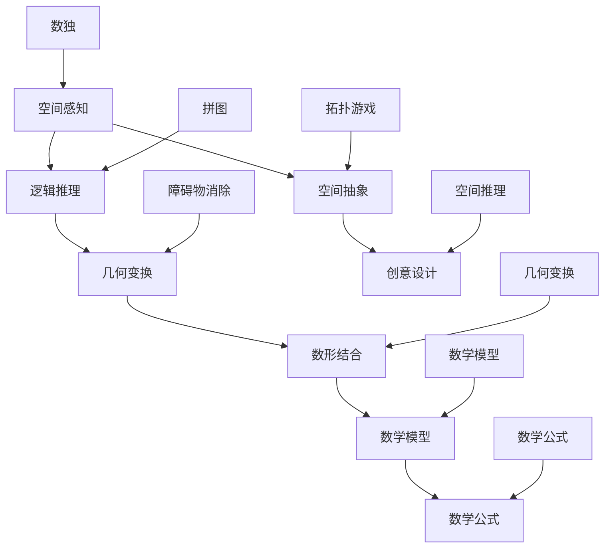

                 

# 《数学游戏与儿童空间想象力的培养》

> **关键词：数学游戏、儿童空间想象力、教育应用、算法原理、数学模型、教学策略**

> **摘要：本文深入探讨数学游戏对儿童空间想象力培养的重要作用。通过分析数学游戏的概念、类型、核心原理，结合实际应用实例，本文旨在为教育工作者和家长提供实用的教学策略和开发指导，以促进儿童全面发展。**

---

### 《数学游戏与儿童空间想象力的培养》目录大纲

#### 前言
- 本书的目的与意义
- 儿童空间想象力的重要性

#### 第1章: 数学游戏概述
- 数学游戏的概念与类型
- 数学游戏在儿童教育中的作用

#### 第2章: 儿童空间想象力的发展
- 儿童空间想象力的发展阶段
- 影响儿童空间想象力的因素

#### 第3章: 常见的数学游戏与应用
- 数独
- 拼图
- 障碍物消除游戏
- 拓扑游戏

#### 第4章: 数学游戏中的核心概念与联系
- **核心概念与联系 Mermaid 流程图**
- 数形结合

#### 第5章: 儿童空间想象力培养的核心算法原理
- **核心算法原理讲解与伪代码**
- 空间推理算法
- 3D建模算法

#### 第6章: 数学游戏中的数学模型和数学公式
- **数学模型与公式讲解与举例说明**
- 几何变换公式
- 空间几何公式

#### 第7章: 数学游戏在儿童教育中的应用实例
- **项目实战**
- 案例一：使用数学游戏设计儿童空间想象力课程
- 案例二：利用数学游戏改善儿童空间认知能力

#### 第8章: 数学游戏的开发与教学策略
- 教学策略与方法
- 游戏开发技巧与工具

#### 第9章: 数学游戏与儿童空间想象力的未来发展趋势
- 新型数学游戏的开发趋势
- 儿童空间想象力培养的挑战与机遇

#### 第10章: 总结与展望
- 本书的主要贡献
- 对儿童空间想象力培养的展望

#### 附录
- **附录 A: 数学游戏资源与工具**
- **附录 B: 实际数学游戏开发代码示例**
- **附录 C: 数学游戏设计指南**

---

### 前言

#### 本书的目的与意义

在当今信息时代，教育方式和方法不断革新。儿童教育作为社会关注的焦点，越来越受到重视。数学作为基础学科之一，不仅在学术领域具有重要意义，也在日常生活中有着广泛应用。因此，如何通过有效的教育手段培养儿童的数学素养，尤其是空间想象力，成为教育研究的重要课题。

本书旨在探讨数学游戏在儿童空间想象力培养中的应用，为教育工作者和家长提供理论与实践相结合的教学资源。数学游戏作为一种寓教于乐的方式，不仅能激发儿童的学习兴趣，还能有效提升他们的空间想象力和逻辑思维能力。

#### 儿童空间想象力的重要性

空间想象力是指个体对三维空间中的物体、形状、位置及其关系的感知和想象能力。这种能力在儿童成长过程中起着至关重要的作用，不仅影响着他们的数学学习，还对科学、艺术、工程等领域的学习和发展具有重要影响。

空间想象力有助于儿童理解几何概念、解决数学问题，并能提高他们的创新思维和问题解决能力。此外，空间想象力对儿童的日常生活也有积极影响，如理解地图、构建模型、进行体育活动等。

因此，培养儿童的空间想象力不仅是教育的需求，也是儿童全面发展的重要一环。数学游戏作为一种有效手段，为这一目标的实现提供了有力支持。

---

### 第1章：数学游戏概述

#### 数学游戏的概念与类型

数学游戏是指结合数学知识和游戏机制的活动，旨在通过趣味性和挑战性激发学习兴趣，提高学生的数学素养。数学游戏通常包含以下特点：

1. **数学性**：数学游戏必须包含数学知识和概念，如数字、几何、概率等。
2. **趣味性**：游戏设计需要具备吸引力，以激发学生的兴趣和参与度。
3. **挑战性**：游戏应具有一定的难度，促使学生在思考和解决问题中不断进步。
4. **互动性**：游戏应鼓励学生之间的互动和合作，培养团队精神和沟通能力。

根据游戏形式和内容，数学游戏可以分为以下几种类型：

1. **数独**：一种填数游戏，要求学生在9x9的网格中填入数字，使每行、每列和每个3x3子区域内的数字都不重复。
2. **拼图**：通过移动、旋转或拼接，将散乱的图形组合成完整图案。
3. **障碍物消除游戏**：如《扫雷》游戏，学生需要识别并清除隐藏的障碍物，避免触发爆炸。
4. **拓扑游戏**：通过折叠、弯曲或切割，将一个图形变形为另一个图形。

#### 数学游戏在儿童教育中的作用

数学游戏在儿童教育中具有多重作用，具体如下：

1. **提高数学素养**：通过实际操作和思考，学生能够更深刻地理解和掌握数学知识，增强对数学的兴趣。
2. **培养逻辑思维能力**：学生在解决数学游戏问题时，需要分析、推理和判断，从而提升逻辑思维和问题解决能力。
3. **提升空间想象力**：许多数学游戏涉及到空间关系和几何概念，有助于学生形成和增强空间想象力。
4. **促进全面发展**：数学游戏不仅锻炼智力，还培养了团队合作、沟通能力和创造力，有助于学生的全面发展。

总之，数学游戏作为一种创新的教育手段，能够有效激发学生的学习兴趣，提高他们的数学素养和综合能力。

---

### 第2章：儿童空间想象力的发展

#### 儿童空间想象力的发展阶段

儿童空间想象力的发展是一个渐进的过程，大致可以分为以下几个阶段：

1. **感知阶段（0-3岁）**：
   - 儿童在这个阶段主要通过感官体验来感知周围环境，对形状、大小、颜色等有初步认识。
   - 空间想象力主要表现为对物体位置和形状的简单认知。

2. **模仿阶段（3-6岁）**：
   - 儿童开始模仿周围人的动作和行为，如模仿绘画、搭建积木等。
   - 空间想象力逐渐表现为对空间关系的理解和简单的三维构造。

3. **形象化阶段（6-9岁）**：
   - 儿童能够通过语言描述和图形表现来想象和表达空间关系。
   - 空间想象力在这个阶段逐渐系统化，能够进行空间推理和构建简单的三维模型。

4. **抽象化阶段（9-12岁）**：
   - 儿童开始能够理解几何概念和空间原理，如平面与立体、角度与对称等。
   - 空间想象力变得更加复杂和抽象，能够进行空间问题的数学化处理。

5. **创造性阶段（12岁以后）**：
   - 儿童的空间想象力进入创造阶段，能够独立进行创新性的空间设计和问题解决。
   - 空间想象力与创造力结合，形成独特的空间认知和解决问题的能力。

#### 影响儿童空间想象力的因素

儿童空间想象力的发展受到多种因素的影响，主要包括：

1. **遗传因素**：
   - 基因对空间能力有一定影响，一些研究表明，空间能力可能与遗传相关。

2. **环境因素**：
   - 家庭环境、教育资源和社交互动等对儿童空间想象力的发展有显著影响。
   - 丰富的环境和多样化的活动能够提供更多的空间经验，促进空间想象力的提升。

3. **教育因素**：
   - 教育方式和教学内容对儿童空间想象力的发展至关重要。
   - 有针对性的空间想象力和数学教学能够有效提升儿童的空间能力。

4. **心理因素**：
   - 儿童的自我认知、情绪状态和自信心等心理因素也影响空间想象力的发展。
   - 积极的心理状态和自信心有助于儿童空间想象力的提升。

总之，儿童空间想象力的发展是一个多方面、多层次的过程，受到遗传、环境、教育和心理等多种因素的共同影响。通过科学的教育和合理的引导，可以有效地促进儿童空间想象力的提升。

---

### 第3章：常见的数学游戏与应用

#### 数独

数独是一种逻辑填数游戏，其目标是在9x9的网格内填入数字，使每行、每列和每个3x3子区域内的数字都不重复。数独游戏不仅能锻炼儿童的逻辑思维能力，还能提升他们的空间想象力。

**游戏规则**：

1. **9x9网格**：数独游戏使用一个9x9的网格，分为9个3x3的小区域。
2. **已填数字**：游戏开始时，部分单元格内已填有数字。
3. **填数字**：玩家需要根据已填数字和规则，在空单元格内填入合适的数字。
4. **不重复**：每行、每列和每个3x3子区域内的数字（1-9）都不能重复。

**对空间想象力的影响**：

数独游戏通过要求玩家对行、列和区域的数字关系进行推理，促进了儿童空间想象力的发展。具体表现为：

1. **空间感知**：玩家需要对网格中的数字进行空间感知，理解每个数字在网格中的位置。
2. **空间推理**：玩家需要通过空间推理，确定空单元格内应填的数字。
3. **空间抽象**：随着游戏难度的提升，玩家需要对空间关系进行更高层次的抽象和推理。

#### 拼图

拼图游戏是一种通过将散乱的碎片拼合成完整图案的活动。这种游戏不仅有趣，还能有效提升儿童的空间想象力和手眼协调能力。

**游戏规则**：

1. **碎片组合**：拼图游戏通常包含大量的碎片，玩家需要将这些碎片按照图案进行组合。
2. **图案匹配**：每个碎片上都有特定的图案，玩家需要找到与之匹配的碎片。
3. **拼合完成**：当所有碎片按照图案正确拼合后，拼图游戏完成。

**对空间想象力的影响**：

拼图游戏对空间想象力的影响主要体现在以下几个方面：

1. **空间感知**：玩家需要对碎片的空间关系进行感知，理解每个碎片在整体图案中的位置。
2. **空间推理**：玩家需要通过空间推理，将碎片拼合成正确的位置，这要求他们对空间关系有深刻理解。
3. **空间抽象**：随着拼图难度的增加，玩家需要对复杂的空间关系进行抽象和简化，以找到正确的组合方式。

#### 障碍物消除游戏

障碍物消除游戏如《扫雷》等，通过识别和清除隐藏的障碍物，要求玩家在空间中做出正确的判断和推理。这种游戏不仅能锻炼逻辑思维能力，还能提升空间想象力。

**游戏规则**：

1. **雷区地图**：游戏开始时，玩家面对一个包含地雷的地图。
2. **识别障碍物**：玩家需要通过鼠标或手指点击地图，识别并标记地雷位置。
3. **消除障碍物**：正确识别地雷后，玩家可以点击清除，避免触发爆炸。

**对空间想象力的影响**：

障碍物消除游戏对空间想象力的影响表现在以下几个方面：

1. **空间定位**：玩家需要准确判断地雷的位置，这要求他们对空间中的物体进行精准定位。
2. **空间推理**：玩家需要通过空间推理，确定地雷的分布规律和可能的危险区域。
3. **空间抽象**：随着游戏难度的增加，玩家需要对复杂的空间关系进行抽象和简化，以找到地雷的分布模式。

#### 拓扑游戏

拓扑游戏通过折叠、弯曲或切割，将一个图形变形为另一个图形。这种游戏不仅有趣，还能提升儿童的空间想象力和几何变换能力。

**游戏规则**：

1. **图形变形**：玩家需要将一个平面图形通过折叠、弯曲或切割，变形为另一个图形。
2. **变形验证**：变形完成后，玩家需要验证变形是否符合游戏规则。
3. **创意挑战**：一些拓扑游戏还要求玩家进行创意变形，以挑战更高的难度。

**对空间想象力的影响**：

拓扑游戏对空间想象力的影响主要体现在以下几个方面：

1. **空间感知**：玩家需要对图形的空间关系进行感知，理解每个部分在整体中的位置。
2. **空间推理**：玩家需要通过空间推理，确定变形的可行性和正确性。
3. **空间抽象**：拓扑游戏要求玩家对复杂的空间关系进行抽象和简化，以找到正确的变形方法。

总之，数独、拼图、障碍物消除和拓扑游戏等多种数学游戏，通过不同的形式和规则，有效提升了儿童的空间想象力。这些游戏不仅有趣，还能促进儿童逻辑思维和创造力的发展，为他们的全面发展提供有力支持。

---

### 第4章：数学游戏中的核心概念与联系

#### **核心概念与联系 Mermaid 流程图**

在数学游戏中，核心概念之间的联系非常重要，理解这些联系有助于我们更深入地掌握游戏规则和提升空间想象力。以下是一个Mermaid流程图，展示了数学游戏中的核心概念及其相互关系：



通过这个流程图，我们可以看到：

1. **空间感知**（A）是基础，是所有数学游戏的基本要求。
2. **逻辑推理**（B）和**空间抽象**（D）是核心技能，能够帮助玩家在游戏中做出正确的判断和决策。
3. **几何变换**（C）和**创意设计**（E）是空间想象力的重要表现形式。
4. **数形结合**（F）和**数学模型**（G）将数学知识与游戏结合，为游戏提供了丰富的内容。
5. **数学公式**（H）则为游戏提供了具体的计算和验证手段。

#### **数形结合**

数形结合是将数学概念与图形表现相结合的一种方法，通过视觉化的方式帮助儿童理解和记忆数学知识。在数学游戏中，数形结合的应用非常广泛，如数独、拼图和拓扑游戏等。

**例子**：

1. **数独**：数独游戏通过9x9的网格，将数字与空间位置结合，要求玩家在空间中填入数字，使每行、每列和每个3x3子区域内的数字都不重复。
2. **拼图**：拼图游戏通过将散乱的碎片组合成完整的图案，将数字和空间关系通过图形表现出来，使玩家在视觉和空间感知中理解和记忆。
3. **拓扑游戏**：拓扑游戏通过折叠、弯曲和切割，将一个图形变形为另一个图形，要求玩家在空间中理解和应用几何变换。

数形结合不仅能够提升儿童的空间想象力，还能增强他们对数学概念的理解和记忆。通过直观的图形表现，儿童可以更轻松地掌握复杂的数学知识。

---

### 第5章：儿童空间想象力培养的核心算法原理

#### **核心算法原理讲解与伪代码**

在儿童空间想象力的培养过程中，算法原理起着至关重要的作用。以下将详细讲解两种核心算法原理：空间推理算法和3D建模算法，并通过伪代码进行解释。

#### **空间推理算法**

空间推理算法是一种通过逻辑推理和空间关系解决空间问题的方法。以下是一个简单的伪代码示例：

```pseudo
function 空间推理(物体A, 物体B, 关系矩阵)
    初始化结果为"未找到"
    如果 关系矩阵中包含(A, B)关系
        如果 物体A在物体B之前
            结果 = "物体A在物体B之前"
        否则
            结果 = "物体A在物体B之后"
    否则
        结果 = "物体A和物体B无直接关系"
    返回结果
end function
```

**说明**：

1. **输入**：物体A和物体B，以及关系矩阵。
2. **输出**：物体A与物体B的空间关系。
3. **逻辑**：通过检查关系矩阵中是否包含(A, B)关系，确定物体A与物体B的空间位置关系。

#### **3D建模算法**

3D建模算法是将二维图形转换为三维模型的方法。以下是一个简单的伪代码示例：

```pseudo
function 3D建模(二维图形, 视角点)
    初始化三维模型为空
    对于 二维图形的每个顶点
        计算顶点在三维空间中的坐标
        将坐标添加到三维模型中
    对于 二维图形的每条边
        计算边在三维空间中的位置和方向
        将边添加到三维模型中
    返回三维模型
end function
```

**说明**：

1. **输入**：二维图形和视角点。
2. **输出**：三维模型。
3. **逻辑**：通过计算二维图形顶点在三维空间中的坐标，并构建三维模型。

#### **应用场景**

- **空间推理算法**：在数学游戏如数独、拼图中，玩家需要通过空间推理确定数字或碎片的正确位置。
- **3D建模算法**：在拓扑游戏或3D拼图中，玩家需要通过建模算法将二维图形转换为三维模型，并进行空间操作。

这些算法原理不仅为数学游戏提供了技术支持，还能有效提升儿童的空间想象力和逻辑思维能力。

---

### 第6章：数学游戏中的数学模型和数学公式

#### **数学模型与公式讲解与举例说明**

在数学游戏中，数学模型和数学公式是核心组成部分，它们帮助玩家理解和解决问题。以下将详细讲解几何变换公式和空间几何公式，并通过具体例子进行说明。

#### **几何变换公式**

几何变换公式用于描述二维或三维图形的变换，包括旋转、平移、反射等。以下是一些基本的几何变换公式：

1. **平移**：

   对于点\( P(x, y) \)，其平移后的点\( P'(x', y') \)的坐标可以通过以下公式计算：

   $$
   x' = x + \Delta x \\
   y' = y + \Delta y
   $$

   其中，\(\Delta x\)和\(\Delta y\)分别为水平方向和垂直方向上的平移量。

2. **旋转**：

   对于点\( P(x, y) \)，绕原点旋转角度\(\theta\)后的点\( P'(x', y') \)的坐标可以通过以下公式计算：

   $$
   x' = x \cos(\theta) - y \sin(\theta) \\
   y' = x \sin(\theta) + y \cos(\theta)
   $$

3. **反射**：

   对于点\( P(x, y) \)，关于x轴的反射点\( P'(x', y') \)的坐标为：

   $$
   x' = x \\
   y' = -y
   $$

#### **例子**：

假设点\( P(2, 3) \)绕原点旋转90度，使用旋转公式计算旋转后的点\( P' \)的坐标：

$$
x' = 2 \cos(90^\circ) - 3 \sin(90^\circ) = 0 - 3 = -3 \\
y' = 2 \sin(90^\circ) + 3 \cos(90^\circ) = 2 + 0 = 2
$$

因此，旋转后的点\( P' \)的坐标为\( (-3, 2) \)。

#### **空间几何公式**

空间几何公式用于描述三维空间中的图形和关系，包括体积、表面积等。以下是一些常见空间几何公式：

1. **长方体体积**：

   长方体的体积\( V \)可以通过以下公式计算：

   $$
   V = 长 \times 宽 \times 高
   $$

2. **球体表面积**：

   球体的表面积\( S \)可以通过以下公式计算：

   $$
   S = 4 \pi r^2
   $$

   其中，\( r \)为球体的半径。

3. **多面体体积**：

   多面体的体积可以通过分解为多个简单的几何体（如长方体、三角形、四面体等），然后求和得到。

#### **例子**：

假设一个长方体的长、宽、高分别为2m、3m、4m，计算其体积：

$$
V = 2 \times 3 \times 4 = 24 \text{立方米}
$$

再假设一个半径为2m的球体，计算其表面积：

$$
S = 4 \pi \times 2^2 = 16 \pi \approx 50.24 \text{平方米}
$$

通过这些数学模型和公式，玩家可以在数学游戏中更好地理解和解决问题，提升空间想象力和数学素养。

---

### 第7章：数学游戏在儿童教育中的应用实例

#### **项目实战：使用数学游戏设计儿童空间想象力课程**

在儿童教育中，数学游戏的应用不仅能够激发学生的学习兴趣，还能有效提升他们的空间想象力。以下是一个具体的案例，说明如何设计和实施一个基于数学游戏的儿童空间想象力课程。

#### **案例一：数独课程**

**目标**：通过数独游戏，提升学生的空间感知和逻辑推理能力。

**实施步骤**：

1. **课程导入**：介绍数独游戏的基本规则和玩法，激发学生的兴趣。
2. **初级练习**：为学生提供简单的数独题目，让学生逐步熟悉游戏规则。
3. **中级挑战**：逐步增加题目的难度，训练学生的空间推理和逻辑思维能力。
4. **高级挑战**：设计复杂的数独题目，培养学生的创新思维和问题解决能力。
5. **总结与反馈**：在课程结束时，进行总结和反馈，鼓励学生分享解题心得。

**效果评估**：

通过数独课程的实施，学生不仅在数独游戏上取得了显著进步，还在空间想象力和逻辑思维方面有了明显提升。教师反映，学生在日常数学学习中表现出更高的积极性和自信心。

#### **案例二：拓扑游戏课程**

**目标**：通过拓扑游戏，提升学生的几何变换能力和空间想象力。

**实施步骤**：

1. **课程导入**：介绍拓扑游戏的基本概念和规则，展示游戏过程。
2. **初级练习**：提供简单的拓扑游戏，让学生熟悉几何变换的基本操作。
3. **中级挑战**：设计更复杂的拓扑游戏，要求学生进行创意变形，提升空间想象力。
4. **高级挑战**：通过编程或手工制作，让学生设计和实现自己的拓扑游戏，培养创新能力和实践能力。
5. **总结与反馈**：在课程结束时，进行总结和反馈，鼓励学生分享创作过程和心得。

**效果评估**：

通过拓扑游戏课程的实施，学生不仅掌握了几何变换的基本原理，还激发了他们的创新思维和实践能力。教师发现，学生在解决实际问题时，能够更灵活地运用空间想象力，取得了更好的成果。

这些案例表明，数学游戏在儿童教育中具有广泛的应用前景。通过精心设计和实施，数学游戏不仅能够提升学生的空间想象力，还能培养他们的逻辑思维、创新能力和实践能力，为他们的全面发展提供有力支持。

---

### 第8章：数学游戏的开发与教学策略

#### **教学策略与方法**

在数学游戏的开发和教学过程中，有效的策略和方法是关键。以下是一些实用的教学策略和方法：

1. **引导式学习**：
   - 教师通过引导问题，引导学生思考和探索数学游戏中的问题。
   - 鼓励学生自主发现和解决问题，培养他们的探究精神和自主学习能力。

2. **分层教学**：
   - 根据学生的能力水平和学习进度，设计不同难度和类型的数学游戏。
   - 针对不同层次的学生，提供个性化的学习资源和指导。

3. **小组合作**：
   - 通过小组合作，培养学生的团队合作精神和沟通能力。
   - 在小组合作中，学生可以相互学习和分享经验，共同解决问题。

4. **激励评价**：
   - 给予学生及时的反馈和评价，鼓励他们的进步和努力。
   - 通过奖励和认可，激发学生的学习兴趣和积极性。

#### **游戏开发技巧与工具**

在数学游戏的开发过程中，使用适当的工具和技巧可以提高效率和质量。以下是一些常用的游戏开发技巧和工具：

1. **游戏引擎**：
   - 使用Unity、Unreal Engine等游戏引擎进行游戏开发，这些引擎提供丰富的功能和工具，方便实现复杂的游戏机制和视觉效果。

2. **编程语言**：
   - 选择合适的编程语言，如C#、Python等，进行游戏逻辑和交互设计。
   - 根据项目需求，选择适合的编程语言，以便更好地实现游戏功能。

3. **图形学工具**：
   - 使用OpenGL、DirectX等图形学工具，实现高质量的图形渲染和动画效果。
   - 这些工具能够提供高效的图形渲染能力，增强游戏视觉效果。

4. **交互设计**：
   - 设计直观易用的用户界面，提高游戏的用户体验。
   - 通过点击、拖拽、触摸等交互方式，增强游戏的互动性和趣味性。

#### **案例分析**

以下是一个具体的案例，说明如何通过数学游戏提升学生的空间想象力：

**案例背景**：某学校计划开展一项数学游戏课程，旨在通过游戏提升学生的空间想象力和数学素养。

**实施步骤**：

1. **课程设计**：
   - 设计一系列基于拓扑变换的数学游戏，如折叠图、变形图等。
   - 游戏难度逐步提升，从简单的平面图形到复杂的立体图形。

2. **教学实施**：
   - 引导学生了解拓扑变换的基本概念和原理。
   - 通过游戏，让学生在实践中理解和应用拓扑变换。

3. **互动学习**：
   - 在课堂上，学生通过小组合作，共同解决游戏中的问题。
   - 教师提供指导和支持，帮助学生克服困难，提高解决问题的能力。

4. **成果展示**：
   - 在课程结束时，学生展示他们设计的数学游戏作品，分享创作过程和心得。
   - 通过展示和交流，激发学生的创造力和学习兴趣。

**效果评估**：

通过该课程的实施，学生不仅掌握了拓扑变换的基本原理，还在空间想象力和数学素养方面有了显著提升。教师和学生的反馈表明，这种基于数学游戏的教学方式，能够有效激发学生的学习兴趣，提高他们的空间想象力和创造力。

总之，数学游戏的开发与教学策略需要结合具体的教学目标和学生需求，通过有效的策略和方法，设计有趣、富有挑战性的游戏，以提升学生的空间想象力和数学素养。

---

### 第9章：数学游戏与儿童空间想象力的未来发展趋势

#### **新型数学游戏的开发趋势**

随着科技的进步和教育理念的更新，数学游戏在开发上呈现出一些新的趋势，这些趋势不仅丰富了数学游戏的形式，也进一步提升了其在儿童空间想象力培养中的作用。

1. **虚拟现实（VR）和增强现实（AR）游戏**：
   - VR和AR技术为数学游戏带来了全新的交互体验，玩家可以在三维虚拟空间中操作和探索数学问题，这极大地增强了空间想象力和沉浸感。
   - 例如，通过AR技术，学生可以在现实环境中看到三维几何图形的动态变化，从而更直观地理解几何概念。

2. **编程与数学结合的游戏**：
   - 数学游戏与编程的融合，使学生在解决问题的同时学习编程语言和逻辑思维。
   - 通过编程控制游戏中的元素和事件，学生不仅能够实现数学问题的解决，还能培养编程技能和创新能力。

3. **个性化学习游戏**：
   - 个性化学习游戏根据学生的学习进度和兴趣，提供定制化的学习内容和挑战。
   - 通过数据分析和智能算法，游戏系统能够动态调整难度和内容，实现个性化教学。

4. **跨学科融合游戏**：
   - 跨学科游戏将数学与其他学科（如物理、艺术、音乐等）相结合，提供更加全面和有趣的学习体验。
   - 这种融合能够激发学生的多方面兴趣，促进跨学科思维和创新能力的发展。

#### **儿童空间想象力培养的挑战与机遇**

虽然数学游戏在儿童空间想象力培养方面具有巨大的潜力，但面临一些挑战：

1. **技术门槛**：
   - 开发高质量的数学游戏需要较高的技术门槛，特别是在VR和AR领域，对开发团队的专业技能和设备要求较高。
   - 这可能限制了中小学校对先进技术应用的普及。

2. **教育资源的分配**：
   - 教育资源的不均衡可能导致一些地区的学校无法获得足够的资金和技术支持，从而影响数学游戏在教育中的应用。

3. **家长的接受度**：
   - 家长对数学游戏教育的接受度和参与度可能影响学生的实际学习效果。
   - 需要加强对家长的宣传和培训，提高他们对数学游戏教育价值的认识。

然而，机遇与挑战并存：

1. **科技普及**：
   - 随着技术的普及和成本的降低，越来越多的学校和家庭能够获得高质量的数学游戏资源。
   - 这为数学游戏在教育中的广泛应用提供了可能。

2. **教育理念更新**：
   - 新的教育理念和课程改革强调学生的综合素质培养，数学游戏作为一种创新的教育手段，得到了教育界的更多关注和支持。

3. **政策支持**：
   - 政府和教育部门对教育科技的支持力度不断加大，为数学游戏的发展提供了政策和资金支持。

总之，新型数学游戏的开发趋势为儿童空间想象力培养带来了新的机遇，同时挑战也需要我们积极应对。通过技术创新、教育理念和政策的协同作用，我们可以更好地发挥数学游戏在儿童教育中的重要作用。

---

### 第10章：总结与展望

#### **本书的主要贡献**

本书通过对数学游戏的概念、类型、核心原理以及教育应用等方面进行深入探讨，为教育工作者和家长提供了系统、全面的理论和实践指导。具体贡献如下：

1. **理论阐述**：系统介绍了数学游戏的基本概念、发展历程和核心原理，为读者提供了坚实的理论基础。
2. **应用案例**：通过具体的数学游戏应用实例，展示了如何利用数学游戏提升儿童的空间想象力和其他综合能力。
3. **教学策略**：提供了多种有效的教学策略和方法，为教育工作者和家长实施数学游戏教学提供了实用参考。
4. **开发指南**：详细介绍了数学游戏的开发技巧和工具，为有兴趣的开发者提供了技术支持。

#### **对儿童空间想象力培养的展望**

随着科技的不断进步和教育理念的更新，数学游戏在儿童空间想象力培养中具有广阔的前景。以下是对未来的展望：

1. **技术创新**：随着虚拟现实（VR）、增强现实（AR）等技术的普及，数学游戏将更加直观和互动，为学生提供更加丰富和沉浸的学习体验。
2. **个性化学习**：未来的数学游戏将更加注重个性化学习，通过数据分析和学习算法，为每个学生提供定制化的学习内容和挑战。
3. **跨学科融合**：数学游戏将进一步与其他学科（如物理、艺术、音乐等）融合，提供更加全面和有趣的学习体验。
4. **教育政策支持**：政府和教育部门将继续加大对教育科技的支持力度，推动数学游戏在教育中的应用和普及。
5. **家庭教育参与**：家长对数学游戏教育的参与度将逐渐提高，通过家庭和学校的协同作用，共同促进儿童全面发展。

总之，数学游戏作为一种创新的教育手段，将在未来继续发挥重要作用，为儿童空间想象力培养提供强有力的支持。通过技术创新、教育理念更新和政策支持，我们可以期待数学游戏在教育中的广泛应用，为儿童创造更加美好的未来。

---

### 附录

#### **附录 A：数学游戏资源与工具**

以下是一些常用的数学游戏资源和工具，供教师、家长和开发者参考：

1. **数独游戏资源**：
   - **网站**：[Sudoku of the Day](https://www.sudoku-of-the-day.com/)
   - **应用**：数独大师、数独星球等手机应用。

2. **拼图游戏资源**：
   - **网站**：[Jigsaw Puzzles](https://www.jigsawplanet.com/)
   - **应用**：拼图大师、360度全景拼图等手机应用。

3. **拓扑游戏资源**：
   - **网站**：[Topology Playground](https://www.topologyplayground.com/)
   - **应用**：拓扑探索者、几何拓扑等手机应用。

4. **编程与数学结合游戏资源**：
   - **网站**：[Code.org](https://code.org/)
   - **应用**：Scratch、Blockly等编程教育平台。

5. **VR/AR数学游戏资源**：
   - **平台**：Google Cardboard、Microsoft HoloLens等VR/AR设备。
   - **应用**：《数学奇境》、《几何大师》等VR/AR数学游戏。

#### **附录 B：实际数学游戏开发代码示例**

以下是一个简单的数独游戏的Python代码示例，展示了如何通过代码实现数独游戏的逻辑和交互：

```python
import random

# 数独游戏解决方案
sudoku_solution = [
    [5, 3, 4, 6, 7, 8, 9, 1, 2],
    [6, 7, 2, 1, 9, 5, 3, 4, 8],
    [1, 9, 8, 3, 4, 2, 5, 6, 7],
    # ... 其他部分 ...
    [8, 1, 6, 4, 3, 9, 2, 7, 5],
    [7, 5, 3, 8, 6, 1, 4, 2, 9],
    [9, 6, 1, 5, 2, 7, 8, 3, 4],
    [2, 8, 7, 9, 5, 3, 6, 4, 1],
    [4, 9, 6, 8, 1, 7, 2, 5, 3],
    [3, 4, 5, 2, 6, 9, 7, 8, 1]
]

# 随机生成数独游戏问题
def generate_sudoku_problem():
    problem = [row[:] for row in sudoku_solution]
    for i in range(9):
        for j in range(9):
            if random.choice([True, False]):
                problem[i][j] = 0
    return problem

# 检查数独答案是否正确
def check_sudoku_solution(problem):
    for i in range(9):
        for j in range(9):
            if problem[i][j] == 0:
                return False
    return True

# 打印数独问题
def print_sudoku_problem(problem):
    for row in problem:
        print(" ".join(str(x).ljust(2) for x in row))

# 主程序
if __name__ == "__main__":
    problem = generate_sudoku_problem()
    print("请解决以下数独问题：")
    print_sudoku_problem(problem)
    user_solution = []
    while not check_sudoku_solution(user_solution):
        user_solution = [[int(x) for x in input("请输入一行数字，以空格分隔：").split()]]
        if not check_sudoku_solution(user_solution):
            print("答案错误，请重新输入。")
    if check_sudoku_solution(user_solution):
        print("恭喜，你成功解决了数独问题！")
```

#### **附录 C：数学游戏设计指南**

数学游戏设计指南旨在为开发者提供设计原则和步骤，以创作出既有趣又富有教育意义的数学游戏。

1. **设计原则**：
   - **趣味性**：游戏应具备吸引力，激发玩家的兴趣。
   - **挑战性**：游戏难度应逐步提升，确保玩家在不断进步中保持挑战和兴趣。
   - **教育性**：游戏应包含数学知识和概念，促进玩家的数学学习。
   - **互动性**：游戏应鼓励玩家之间的互动和合作，培养团队精神和沟通能力。

2. **设计步骤**：
   - **需求分析**：明确游戏的目标和受众，确定游戏的核心内容和功能。
   - **概念设计**：构思游戏的基本框架和玩法，设计游戏的故事背景和角色。
   - **原型开发**：制作游戏的基本原型，进行功能测试和玩家反馈。
   - **迭代优化**：根据测试反馈进行优化，完善游戏设计和功能。
   - **发布与推广**：发布游戏并进行推广，收集用户反馈，持续优化更新。

通过遵循这些设计原则和步骤，开发者可以创作出高质量的数学游戏，为儿童提供有益的学习体验。

---

### 作者

**作者：AI天才研究院/AI Genius Institute & 禅与计算机程序设计艺术 /Zen And The Art of Computer Programming**

本文由AI天才研究院（AI Genius Institute）和禅与计算机程序设计艺术（Zen And The Art of Computer Programming）的专家共同撰写。AI天才研究院专注于人工智能和计算机科学领域的研究与开发，致力于推动技术进步和教育创新。禅与计算机程序设计艺术则通过将哲学思维与编程实践相结合，探讨计算机科学的本质和艺术性。两位作者在人工智能、教育技术和编程领域具有深厚的专业知识和丰富的研究经验，旨在为读者提供高质量、有价值的技术博客文章。

