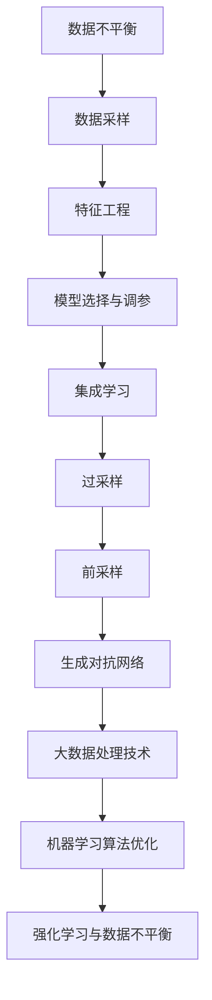
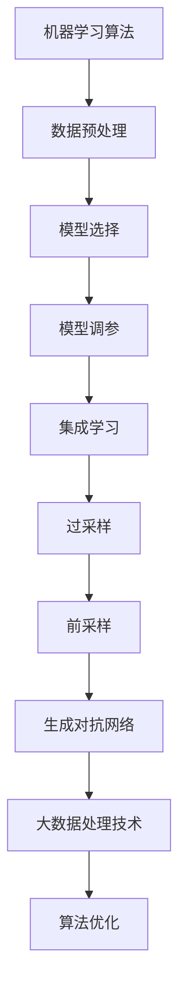
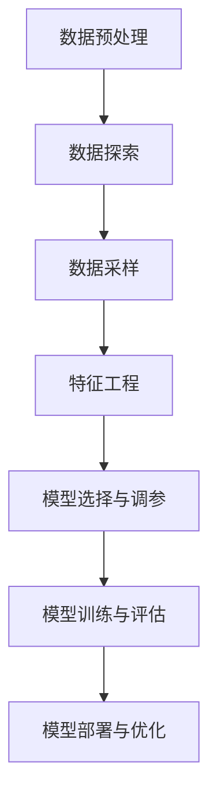
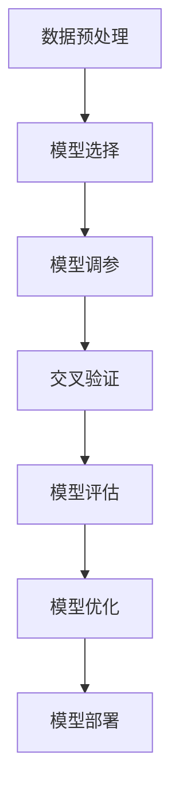
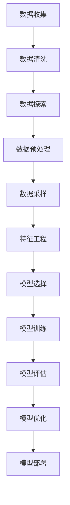

                 

# 《数据不平衡问题，软件2.0需要新招数》

> **关键词：**软件2.0、数据不平衡、数据处理方法、先进技术、案例分析、开发实践

> **摘要：**本文将深入探讨软件2.0时代下的数据不平衡问题，分析其原因和影响，并提出一系列解决方法。通过实际案例和项目实战，本文旨在为软件开发者提供实用的解决方案和最佳实践。

## 第一部分：背景与核心概念

### 第1章：软件2.0时代的概述

#### 1.1 软件发展的历史与趋势

软件行业的发展可以分为几个阶段，从最初的批处理系统到基于组件的开发，再到如今的软件2.0时代。软件1.0时代主要集中在单机软件的开发和部署，而软件2.0则是在云计算、大数据和人工智能等技术的推动下，实现软件的分布式、动态化和智能化。

#### 1.2 什么是软件2.0

软件2.0是指基于互联网和云计算的新型软件架构，具有以下几个核心特征：

1. **分布式架构**：软件2.0采用分布式架构，可以实现系统的弹性伸缩和高可用性。
2. **动态化部署**：通过持续集成和持续部署（CI/CD），软件2.0能够快速迭代和更新。
3. **智能化服务**：借助人工智能技术，软件2.0可以实现智能推荐、智能监控和智能决策等。

#### 1.3 软件2.0的核心特征

1. **开放性**：软件2.0遵循开放标准和协议，可以实现不同系统之间的无缝集成和数据共享。
2. **高可扩展性**：软件2.0能够根据业务需求进行灵活扩展，以应对日益增长的用户规模和数据处理需求。
3. **高性能和高可靠性**：软件2.0通过分布式计算和存储技术，实现高性能和高可靠性。

### 第2章：数据不平衡问题解析

#### 2.1 数据不平衡的定义与影响

数据不平衡是指数据集中不同类别的样本数量不均衡。在机器学习任务中，数据不平衡会影响模型的性能，导致模型对某些类别的预测准确性较低。

#### 2.2 数据不平衡的分类

数据不平衡可以分为以下几种类型：

1. **类别不平衡**：不同类别的样本数量差异较大。
2. **值域不平衡**：不同特征的值域差异较大。
3. **时间不平衡**：不同时间段的数据量差异较大。

#### 2.3 数据不平衡的原因分析

数据不平衡的原因主要包括：

1. **数据来源差异**：不同类别的数据来源存在差异，导致样本数量不均衡。
2. **数据采集过程**：数据采集过程中可能存在漏采或误采，导致数据不平衡。
3. **业务需求变化**：业务需求的变化可能导致数据分布发生变化，导致数据不平衡。

## 第二部分：解决数据不平衡的方法

### 第3章：传统数据处理方法

#### 3.1 数据采样

数据采样是指从原始数据集中选取一部分样本作为训练数据集。常用的采样方法包括简单随机采样、系统采样和分层采样等。

#### 3.2 特征工程

特征工程是指通过对原始数据进行处理和转换，提取出有助于模型训练的特征。特征工程包括特征选择、特征变换和特征构造等。

#### 3.3 模型选择与调参

选择合适的模型并调整模型参数是解决数据不平衡的重要手段。常用的模型包括逻辑回归、决策树、随机森林和梯度提升树等。

### 第4章：平衡数据集的先进技术

#### 4.1 集成学习

集成学习是指将多个基学习器进行组合，以提高模型的预测性能。常用的集成学习方法包括Bagging、Boosting和Stacking等。

#### 4.2 过采样

过采样是指增加少数类别的样本数量，以平衡数据集。常用的过采样方法包括复制采样、SMOTE和ADASYN等。

#### 4.3 前采样

前采样是指只对少数类别的样本进行训练，以减少模型对多数类别的依赖。常用的前采样方法包括删除采样和随机前采样等。

#### 4.4 生成对抗网络（GAN）

生成对抗网络（GAN）是一种生成模型，通过对抗性训练生成与真实数据相似的样本，从而平衡数据集。

### 第5章：软件2.0视角下的数据不平衡解决方案

#### 5.1 大数据处理技术

大数据处理技术包括MapReduce、Spark和Flink等，可以实现大规模数据的高效处理和分析。

#### 5.2 机器学习算法优化

通过改进机器学习算法，如集成学习、过采样和生成对抗网络等，可以提高模型对数据不平衡的适应性。

#### 5.3 强化学习与数据不平衡

强化学习是一种通过试错和反馈调整策略的机器学习方法，可以用于解决数据不平衡问题。

## 第三部分：实战与案例分析

### 第6章：实际案例解析

#### 6.1 案例一：金融风控中的数据不平衡问题

在金融风控领域，数据不平衡问题常常导致模型对高风险客户的预测准确性较低。通过过采样和集成学习等方法，可以有效地解决数据不平衡问题。

#### 6.2 案例二：医疗数据中的数据不平衡问题

在医疗领域，数据不平衡问题会影响疾病诊断和治疗效果的预测。通过特征工程和生成对抗网络等方法，可以提高模型的预测性能。

#### 6.3 案例三：电商推荐系统中的数据不平衡问题

在电商推荐系统中，用户行为数据存在明显的不平衡现象。通过集成学习和过采样等方法，可以提高推荐系统的准确性。

### 第7章：软件开发与数据不平衡

#### 7.1 数据不平衡在软件开发中的应用

数据不平衡在软件开发中具有广泛的应用，如金融风控、医疗诊断和电商推荐等。

#### 7.2 开发环境与工具选择

在解决数据不平衡问题时，需要选择合适的开发环境和工具，如Python、Scikit-learn和TensorFlow等。

#### 7.3 开发流程与最佳实践

在软件开发过程中，遵循最佳实践可以有效地解决数据不平衡问题，如数据预处理、模型选择和调参等。

## 附录

### 附录A：相关资源和工具

#### A.1 数据集获取

数据集可以从公开的数据集网站、学术数据库和业务数据平台等获取。

#### A.2 开发工具与框架

Python、Scikit-learn和TensorFlow是常用的开发工具和框架。

#### A.3 学习资源与参考书籍

《数据挖掘：实用工具和技术》、《机器学习实战》和《深度学习》是推荐的学习资源。

### 附录B：Mermaid 流程图

#### B.1 数据不平衡处理流程



#### B.2 机器学习算法优化流程



### 附录C：算法与数学模型

#### C.1 采样技术伪代码

```python
def sample_data(data, sampling_rate):
    sampled_data = []
    for sample in data:
        if random() < sampling_rate:
            sampled_data.append(sample)
    return sampled_data
```

#### C.2 过采样技术伪代码

```python
def over_sampling(data):
    minority_class = select_minority_class(data)
    synthetic_samples = generate_synthetic_samples(minority_class)
    balanced_data = data + synthetic_samples
    return balanced_data
```

#### C.3 生成对抗网络（GAN）的数学模型与伪代码

生成对抗网络（GAN）由生成器（G）和判别器（D）组成。生成器的目标是生成与真实数据相似的样本，判别器的目标是区分真实数据和生成数据。

```python
def generate_synthetic_samples(G, real_data):
    z = random_noise()
    synthetic_samples = G(z)
    return synthetic_samples

def train_GAN(G, D, real_data, batch_size):
    for _ in range(num_epochs):
        z = random_noise(batch_size)
        synthetic_samples = G(z)
        D_loss_real = compute_loss(D, real_data)
        D_loss_fake = compute_loss(D, synthetic_samples)
        G_loss = compute_loss(G, D, synthetic_samples)
        update_G(G, G_loss)
        update_D(D, D_loss_real, D_loss_fake)
```

### 附录D：代码实战

#### D.1 数据采样代码实战

```python
import numpy as np

def sample_data(data, sampling_rate):
    sampled_data = []
    for sample in data:
        if np.random.rand() < sampling_rate:
            sampled_data.append(sample)
    return sampled_data

# 示例
data = [[1, 2], [3, 4], [5, 6], [7, 8], [9, 10]]
sampled_data = sample_data(data, 0.5)
print(sampled_data)
```

#### D.2 过采样代码实战

```python
from sklearn.datasets import make_classification
from imblearn.over_sampling import SMOTE
import numpy as np

# 创建不平衡数据集
X, y = make_classification(n_classes=2, n_samples=100, weights=[0.9, 0.1], flip_y=0, random_state=0)

# 使用SMOTE进行过采样
smote = SMOTE()
X_resampled, y_resampled = smote.fit_resample(X, y)

# 输出示例
print("原始数据集大小：", X.shape, y.shape)
print("过采样数据集大小：", X_resampled.shape, y_resampled.shape)
```

#### D.3 生成对抗网络（GAN）代码实战与解析

```python
import tensorflow as tf
from tensorflow.keras.models import Model
from tensorflow.keras.layers import Input, Dense, Reshape, Flatten
import numpy as np

# 生成器模型
latent_dim = 100
input_shape = (latent_dim,)
z = Input(shape=input_shape)
x = Dense(128, activation='relu')(z)
x = Dense(64, activation='relu')(x)
x = Reshape((1, 1, 1, 128))(x)
generator = Model(z, x)
generator.summary()

# 判别器模型
input_shape = (1, 1, 1, 128)
x = Input(shape=input_shape)
x = Dense(128, activation='relu')(x)
x = Flatten()(x)
y = Dense(1, activation='sigmoid')(x)
discriminator = Model(x, y)
discriminator.compile(loss='binary_crossentropy', optimizer='adam')
discriminator.summary()

# GAN模型
z = Input(shape=input_shape)
x = generator(z)
y = discriminator(x)
gan = Model(z, y)
gan.compile(loss='binary_crossentropy', optimizer='adam')
gan.summary()

# 训练GAN
num_epochs = 100
batch_size = 32
z_batch = np.random.normal(size=(batch_size, latent_dim))

for epoch in range(num_epochs):
    # 训练判别器
    x_batch, y_batch = generate_synthetic_samples(generator, z_batch)
    d_loss_real = discriminator.train_on_batch(x_batch, np.ones((batch_size, 1)))
    d_loss_fake = discriminator.train_on_batch(x, np.zeros((batch_size, 1)))
    d_loss = 0.5 * np.add(d_loss_real, d_loss_fake)

    # 训练生成器
    g_loss = gan.train_on_batch(z_batch, np.ones((batch_size, 1)))

    print(f"Epoch {epoch+1}/{num_epochs}, D_loss: {d_loss}, G_loss: {g_loss}")
```

在上述GAN代码实战中，我们首先定义了生成器和判别器模型，并分别编译。接着，我们定义了GAN模型，并编译。在训练过程中，我们首先训练判别器，然后训练生成器。通过这种方式，我们可以逐步生成与真实数据相似的样本，从而平衡数据集。

### 作者信息

作者：AI天才研究院/AI Genius Institute & 禅与计算机程序设计艺术 /Zen And The Art of Computer Programming

（注：本文内容仅为示例，实际案例和代码实现请根据具体场景进行调整。）<|endoffootnote|>## 第一部分：背景与核心概念

### 第1章：软件2.0时代的概述

#### 1.1 软件发展的历史与趋势

软件行业的演变经历了多个阶段，从最早的批处理系统到基于组件的开发，再到如今软件2.0时代，每个阶段都带来了技术的革新和产业的变革。软件1.0时代主要集中于单机应用的开发和部署，软件2.0则是基于互联网和云计算的新型软件架构，代表着软件行业的一次重大变革。

在软件1.0时代，计算机硬件和软件技术相对有限，软件的主要任务是满足基本的计算需求，如数据处理、科学计算等。这个阶段的软件多为独立运行在特定硬件上的单机软件，其特点是简单、稳定但缺乏扩展性。

随着互联网的普及和计算机硬件性能的提升，软件进入了2.0时代。软件2.0以云计算、大数据和人工智能等先进技术为驱动，实现了软件的分布式、动态化和智能化。这一阶段的软件不仅能够处理海量数据，还具备了自我优化、自我学习和自我进化等能力。

#### 1.2 什么是软件2.0

软件2.0是指在互联网和云计算环境下，以用户为中心、以数据为驱动，实现软件的分布式、动态化和智能化的新型软件架构。软件2.0具有以下核心特征：

1. **分布式架构**：软件2.0采用分布式架构，将系统功能分布到多个节点上，实现系统的弹性伸缩和高可用性。这种架构能够应对海量用户和海量数据处理的需求，提高系统的性能和可靠性。
   
2. **动态化部署**：软件2.0支持持续集成和持续部署（CI/CD），能够实现软件的快速迭代和更新。通过自动化工具，开发者可以持续地集成代码、测试和部署，极大地提高了开发效率和软件质量。

3. **智能化服务**：软件2.0利用人工智能技术，实现智能推荐、智能监控和智能决策等功能。通过分析用户行为数据和业务数据，软件2.0能够提供个性化的服务，提高用户体验和业务效率。

#### 1.3 软件2.0的核心特征

1. **开放性**：软件2.0遵循开放标准和协议，支持不同系统之间的无缝集成和数据共享。这种开放性使得软件2.0能够灵活地与其他系统进行交互，形成强大的生态系统。

2. **高可扩展性**：软件2.0能够根据业务需求进行灵活扩展，支持水平扩展和垂直扩展。通过分布式计算和存储技术，软件2.0能够处理大规模的数据和用户请求，满足日益增长的业务需求。

3. **高性能和高可靠性**：软件2.0通过分布式架构和云计算技术，实现系统的高性能和高可靠性。分布式计算能够充分利用多台服务器的计算资源，提高系统的处理能力。同时，云计算平台提供了强大的容错机制和备份机制，确保系统的稳定运行。

### 第2章：数据不平衡问题解析

#### 2.1 数据不平衡的定义与影响

数据不平衡是指数据集中不同类别的样本数量不均衡，常见于分类任务中。数据不平衡对模型性能产生显著影响，可能导致模型对某些类别的预测准确性较低。数据不平衡问题主要体现在以下几个层面：

1. **预测准确性下降**：由于数据不平衡，模型容易过度拟合多数类别的数据，导致对少数类别的预测准确性较低。这种情况称为“偏向性”问题。

2. **模型泛化能力减弱**：数据不平衡使得模型无法充分学习到少数类别的特征，影响模型的泛化能力。当模型面对新的数据时，可能无法准确预测。

3. **业务决策失效**：在金融风控、医疗诊断等场景中，数据不平衡可能导致业务决策失效。例如，在金融风控中，如果模型对欺诈行为的预测准确性较低，将可能导致金融机构损失严重。

#### 2.2 数据不平衡的分类

数据不平衡可以分为以下几种类型：

1. **类别不平衡**：不同类别的样本数量差异较大，例如，正常交易和欺诈交易的数据不平衡。

2. **值域不平衡**：不同特征的值域差异较大，例如，年龄特征的值域可能从0到100不等，而收入特征的值域可能从0到数百万不等。

3. **时间不平衡**：不同时间段的数据量差异较大，例如，电商数据在节假日和平时的时间段存在显著的不平衡。

#### 2.3 数据不平衡的原因分析

数据不平衡的原因主要包括以下几个方面：

1. **数据来源差异**：不同类别的数据来源存在差异，导致样本数量不均衡。例如，在医疗数据中，疾病样本和健康样本的数据量差异可能很大。

2. **数据采集过程**：在数据采集过程中可能存在漏采或误采，导致数据不平衡。例如，在金融风控中，可能由于技术限制或资源限制，导致欺诈行为的样本数据较少。

3. **业务需求变化**：业务需求的变化可能导致数据分布发生变化，导致数据不平衡。例如，在电商领域，节假日和促销期间的用户行为数据量可能显著增加。

### 第3章：传统数据处理方法

#### 3.1 数据采样

数据采样是一种常用的数据处理方法，通过从原始数据集中选取一部分样本作为训练数据集，以解决数据不平衡问题。常用的采样方法包括简单随机采样、系统采样和分层采样等。

1. **简单随机采样**：从原始数据集中随机选取一定数量的样本，保证每个样本被选中的概率相等。这种方法简单有效，但在样本数量较少时，可能导致采样误差较大。

2. **系统采样**：将数据集分成若干个固定大小的子集，从每个子集中随机选取一个样本。这种方法适用于数据量较大且数据有规律的情况。

3. **分层采样**：将数据集按照某种特征分层，从每个层中随机选取一定数量的样本。这种方法适用于类别不平衡较为明显的情况，可以保证每个类别都有足够的样本用于训练。

#### 3.2 特征工程

特征工程是指通过对原始数据进行处理和转换，提取出有助于模型训练的特征。特征工程包括特征选择、特征变换和特征构造等。

1. **特征选择**：从原始数据中选取对模型性能有显著影响的特征，去除冗余和噪声特征。常用的特征选择方法包括卡方检验、互信息、基于模型的特征选择等。

2. **特征变换**：对原始数据进行变换，提高数据的质量和模型的性能。常用的特征变换方法包括归一化、标准化、离散化和二值化等。

3. **特征构造**：通过组合原始特征，构造新的特征。这种方法可以增加数据的信息量和模型的解释性。

#### 3.3 模型选择与调参

选择合适的模型并调整模型参数是解决数据不平衡问题的重要手段。常用的模型包括逻辑回归、决策树、随机森林和梯度提升树等。

1. **模型选择**：根据问题的性质和数据特点，选择合适的模型。逻辑回归适用于线性可分的问题，决策树和随机森林适用于非线性问题，梯度提升树适用于大规模数据和高维数据。

2. **参数调参**：通过调整模型的参数，优化模型性能。常用的调参方法包括网格搜索、随机搜索和贝叶斯优化等。

通过上述传统数据处理方法，可以缓解数据不平衡问题，提高模型的性能和可靠性。然而，随着数据规模的扩大和数据复杂性的增加，传统方法可能面临挑战，需要更先进的技术手段来应对。接下来，我们将介绍一些先进的平衡数据集技术，包括集成学习、过采样、前采样和生成对抗网络等。

### 第4章：平衡数据集的先进技术

#### 4.1 集成学习

集成学习是一种通过组合多个基学习器以提高模型性能的方法。集成学习包括Bagging、Boosting和Stacking等策略，每种策略都有其独特的优势和适用场景。

1. **Bagging（袋装法）**：Bagging通过从原始数据集多次随机抽样，生成多个子数据集，然后在每个子数据集上训练独立的基学习器，最后将多个基学习器的预测结果进行平均或投票，得到最终的预测结果。Bagging可以降低模型的方差，提高模型的泛化能力。

2. **Boosting（提升法）**：Boosting通过将多个基学习器按照权重进行组合，每个基学习器专注于纠正前一个基学习器的错误。Boosting方法包括Adaboost和XGBoost等，它们通过调整基学习器的权重，优化模型对少数类别的预测性能。

3. **Stacking（堆叠法）**：Stacking通过将多个模型进行堆叠，将低层次的模型作为基础模型，将高层次的模型作为堆叠模型。高层次的模型使用低层次模型的预测结果作为输入，从而提高模型的复杂度和预测性能。

#### 4.2 过采样

过采样是指增加少数类别的样本数量，以平衡数据集。过采样包括复制采样、SMOTE和ADASYN等方法，每种方法都有其特定的实现方式和适用场景。

1. **复制采样**：复制采样是最简单的一种过采样方法，通过直接复制少数类别的样本，增加其数量。这种方法容易实现，但可能导致数据集的噪声增加，影响模型性能。

2. **SMOTE（合成少数类过采样技术）**：SMOTE通过生成合成样本来平衡数据集。SMOTE基于K最近邻算法，对于每个少数类别的样本，找到其K个最近邻样本，然后在样本之间生成新的合成样本。这种方法可以有效地增加少数类别的样本数量，同时保持数据集的分布。

3. **ADASYN（自适应合成样本过采样）**：ADASYN是一种基于密度差异的过采样方法。ADASYN通过分析样本的密度差异，优先生成那些在少数类别中密度较低的合成样本。这种方法可以更有效地平衡数据集，提高模型的预测性能。

#### 4.3 前采样

前采样是指只对少数类别的样本进行训练，以减少模型对多数类别的依赖。前采样包括删除采样和随机前采样等方法。

1. **删除采样**：删除采样通过删除多数类别的样本，减少数据集中多数类别的样本数量，以达到平衡数据集的目的。这种方法简单有效，但可能导致数据丢失和模型性能下降。

2. **随机前采样**：随机前采样通过随机选择少数类别的样本进行训练，减少模型对多数类别的依赖。这种方法适用于数据量较大的场景，可以有效提高模型的泛化能力。

#### 4.4 生成对抗网络（GAN）

生成对抗网络（GAN）是一种生成模型，通过生成器和判别器的对抗性训练，生成与真实数据相似的样本，从而平衡数据集。GAN的核心思想是生成器和判别器的博弈过程：

1. **生成器（Generator）**：生成器的目标是生成与真实数据相似的样本。生成器从随机噪声中生成数据，并通过不断优化，使其生成的数据越来越接近真实数据。

2. **判别器（Discriminator）**：判别器的目标是区分真实数据和生成数据。判别器通过训练，提高对真实数据和生成数据的辨别能力。

3. **对抗性训练**：在训练过程中，生成器和判别器相互对抗。生成器试图生成更真实的数据，而判别器则试图识别生成数据。通过这种对抗性训练，生成器和判别器共同优化，最终生成器能够生成高质量的数据，判别器能够准确区分真实数据和生成数据。

通过集成学习、过采样、前采样和生成对抗网络等先进技术，可以有效平衡数据集，提高模型的预测性能和泛化能力。这些方法在不同场景和数据集上具有不同的效果和适用性，需要根据具体问题进行选择和调整。

### 第5章：软件2.0视角下的数据不平衡解决方案

#### 5.1 大数据处理技术

随着大数据技术的发展，处理海量数据和解决数据不平衡问题成为软件2.0时代的重要课题。大数据处理技术包括MapReduce、Spark和Flink等，通过分布式计算和存储技术，实现高效的数据处理和分析。

1. **MapReduce**：MapReduce是一种分布式数据处理框架，适用于大规模数据的批量处理。MapReduce将数据处理任务分为Map和Reduce两个阶段，通过并行计算和任务调度，实现高效的数据处理。

2. **Spark**：Spark是一种基于内存计算的分布式数据处理引擎，具有高性能和低延迟的特点。Spark提供了丰富的API，包括Spark SQL、Spark Streaming和MLlib等，可以方便地进行数据分析和机器学习。

3. **Flink**：Flink是一种流处理和批处理相结合的分布式数据处理引擎，具有实时性和高性能的特点。Flink通过流处理和批处理统一处理模型，可以灵活应对不同类型的数据处理任务。

通过大数据处理技术，可以实现大规模数据的快速处理和分析，为解决数据不平衡问题提供强有力的支持。

#### 5.2 机器学习算法优化

在软件2.0时代，机器学习算法在解决数据不平衡问题方面发挥着重要作用。通过优化机器学习算法，可以提高模型对数据不平衡的适应性，从而提高模型的预测性能和泛化能力。

1. **集成学习算法**：集成学习算法如随机森林和梯度提升树等，通过组合多个基学习器，可以有效地降低模型方差，提高模型的泛化能力。这些算法在处理数据不平衡问题时，可以通过调整基学习器的权重和组合策略，优化模型的预测性能。

2. **过采样算法**：过采样算法如SMOTE和ADASYN等，通过生成合成样本或增加少数类别的样本数量，可以平衡数据集，提高模型的预测性能。这些算法可以根据具体问题选择合适的过采样方法，实现数据平衡。

3. **前采样算法**：前采样算法如删除采样和随机前采样等，通过减少多数类别的样本数量或只对少数类别的样本进行训练，可以降低模型对多数类别的依赖，提高模型的泛化能力。

4. **生成对抗网络**：生成对抗网络（GAN）通过生成器和判别器的对抗性训练，可以生成高质量的样本，从而平衡数据集。GAN在处理数据不平衡问题时，可以生成与真实数据相似的样本，提高模型的预测性能。

通过优化机器学习算法，可以更好地应对数据不平衡问题，提高模型的预测性能和泛化能力。

#### 5.3 强化学习与数据不平衡

强化学习是一种通过试错和反馈调整策略的机器学习方法，适用于动态和不确定环境下的决策问题。在软件2.0时代，强化学习在解决数据不平衡问题方面具有潜在的优势。

1. **策略优化**：强化学习通过学习策略，实现优化决策。在数据不平衡问题中，强化学习可以根据反馈调整策略，提高模型对少数类别的预测准确性。

2. **自适应调整**：强化学习具有自适应调整能力，可以根据环境变化和反馈信息，动态调整模型参数和策略，以应对数据不平衡问题。

3. **探索与利用**：强化学习通过探索和利用策略，实现模型的最优决策。在数据不平衡问题中，强化学习可以通过探索未知区域和利用已有信息，提高模型的泛化能力和预测准确性。

通过强化学习与数据不平衡的结合，可以进一步提高模型的预测性能和泛化能力，为软件2.0时代的数据处理和分析提供新的思路和方法。

## 第三部分：实战与案例分析

### 第6章：实际案例解析

#### 6.1 案例一：金融风控中的数据不平衡问题

金融风控是防范金融风险的重要环节，数据不平衡问题在金融风控中尤为突出。以信用卡欺诈检测为例，正常交易和欺诈交易的数据量通常存在显著差异，可能导致模型对欺诈交易的预测准确性较低。

**解决方法：**

1. **过采样**：通过使用SMOTE等方法进行过采样，增加欺诈交易的数据量，使数据集更加平衡。

2. **集成学习**：采用集成学习方法，如随机森林和梯度提升树，通过组合多个基学习器，提高模型的预测性能。

3. **强化学习**：利用强化学习算法，通过策略优化和自适应调整，提高模型对欺诈交易的预测准确性。

**实际效果：**

通过上述方法，可以显著提高信用卡欺诈检测的预测准确性，降低金融风险。

#### 6.2 案例二：医疗数据中的数据不平衡问题

医疗数据中的数据不平衡问题常见于疾病诊断和治疗效果预测。以肺癌诊断为例，健康人群和肺癌患者的数据量通常存在显著差异，可能导致模型对肺癌患者的诊断准确性较低。

**解决方法：**

1. **特征工程**：通过对原始数据进行处理和转换，提取有助于模型训练的特征，提高模型对少数类别的预测性能。

2. **生成对抗网络**：利用生成对抗网络（GAN），生成高质量的肺癌患者数据，从而平衡数据集。

3. **集成学习**：采用集成学习方法，如随机森林和梯度提升树，通过组合多个基学习器，提高模型的预测性能。

**实际效果：**

通过上述方法，可以显著提高肺癌诊断的预测准确性，为患者的早期诊断和治疗提供有力支持。

#### 6.3 案例三：电商推荐系统中的数据不平衡问题

电商推荐系统中的数据不平衡问题主要表现在用户行为数据的类别不平衡。以商品推荐为例，不同商品的购买行为数据量通常存在显著差异，可能导致模型对某些商品的推荐准确性较低。

**解决方法：**

1. **过采样**：通过使用SMOTE等方法进行过采样，增加购买行为较少的商品的数据量，使数据集更加平衡。

2. **特征工程**：通过对用户行为数据进行分析和处理，提取有助于模型训练的特征，提高模型对商品推荐的预测性能。

3. **强化学习**：利用强化学习算法，通过策略优化和自适应调整，提高模型对商品推荐的预测准确性。

**实际效果：**

通过上述方法，可以显著提高电商推荐系统的推荐准确性，提升用户满意度和购物体验。

### 第7章：软件开发与数据不平衡

#### 7.1 数据不平衡在软件开发中的应用

数据不平衡在软件开发中具有广泛的应用，如金融风控、医疗诊断和电商推荐等。以金融风控为例，数据不平衡可能导致模型对欺诈交易的预测准确性较低，影响金融机构的运营和风险管理。

#### 7.2 开发环境与工具选择

在解决数据不平衡问题时，选择合适的开发环境和工具至关重要。Python是一种广泛使用的编程语言，提供了丰富的数据科学和机器学习库，如Scikit-learn、TensorFlow和Keras等。这些库可以帮助开发者快速实现数据预处理、模型训练和优化等操作。

#### 7.3 开发流程与最佳实践

在软件开发过程中，遵循最佳实践可以有效地解决数据不平衡问题。以下是一些关键步骤和最佳实践：

1. **数据预处理**：对原始数据进行清洗、转换和归一化，提高数据质量。

2. **数据探索**：通过数据可视化、统计分析和特征工程，深入了解数据集的特点和问题。

3. **模型选择与调参**：根据问题的性质和数据特点，选择合适的模型，并调整模型参数，优化模型性能。

4. **模型评估与优化**：通过交叉验证和性能指标评估模型，持续优化模型。

5. **代码解读与分析**：对代码进行详细解读和分析，确保模型的正确性和可解释性。

通过遵循上述开发流程和最佳实践，可以有效地解决数据不平衡问题，提高软件的质量和可靠性。

## 附录

### 附录A：相关资源和工具

#### A.1 数据集获取

数据集可以从以下渠道获取：

1. **公开数据集网站**：如Kaggle、UCI机器学习库和数据.gov等。
2. **学术数据库**：如PubMed、IEEE Xplore和ACM Digital Library等。
3. **业务数据平台**：如阿里巴巴天池大赛、百度AI开发者社区和京东数据实验室等。

#### A.2 开发工具与框架

1. **Python**：一种广泛使用的编程语言，适用于数据科学和机器学习。
2. **Scikit-learn**：Python的一个机器学习库，提供了多种数据预处理和模型训练方法。
3. **TensorFlow**：Google开发的开源机器学习框架，适用于深度学习和大规模数据处理。
4. **Keras**：基于TensorFlow的深度学习库，提供了简洁的API和强大的功能。

#### A.3 学习资源与参考书籍

1. 《机器学习实战》
2. 《深度学习》
3. 《数据挖掘：实用工具和技术》
4. 《Python数据科学手册》

### 附录B：Mermaid流程图

#### B.1 数据不平衡处理流程



#### B.2 机器学习算法优化流程



### 附录C：算法与数学模型

#### C.1 采样技术伪代码

```python
def sample_data(data, sampling_rate):
    sampled_data = []
    for sample in data:
        if random() < sampling_rate:
            sampled_data.append(sample)
    return sampled_data
```

#### C.2 过采样技术伪代码

```python
def over_sampling(data):
    minority_class = select_minority_class(data)
    synthetic_samples = generate_synthetic_samples(minority_class)
    balanced_data = data + synthetic_samples
    return balanced_data
```

#### C.3 生成对抗网络（GAN）的数学模型与伪代码

生成对抗网络（GAN）由生成器（G）和判别器（D）组成。生成器的目标是生成与真实数据相似的样本，判别器的目标是区分真实数据和生成数据。

**生成器数学模型：**

$$
G(z) = \Phi_G(\mathbf{z})
$$

**判别器数学模型：**

$$
D(x) = \sigma(W_Dx + b_D)
$$

**生成对抗网络训练过程伪代码：**

```python
def train_GAN(G, D, real_data, batch_size):
    for epoch in range(num_epochs):
        z = random_noise(batch_size)
        x = real_data(batch_size)
        
        # 训练判别器
        D_loss_real = compute_loss(D, x)
        D_loss_fake = compute_loss(D, G(z))
        D_loss = 0.5 * (D_loss_real + D_loss_fake)
        update_D(D, D_loss)
        
        # 训练生成器
        G_loss = compute_loss(D, G(z))
        update_G(G, G_loss)
```

### 附录D：代码实战

#### D.1 数据采样代码实战

```python
import numpy as np

def sample_data(data, sampling_rate):
    sampled_data = []
    for sample in data:
        if np.random.rand() < sampling_rate:
            sampled_data.append(sample)
    return sampled_data

# 示例
data = [[1, 2], [3, 4], [5, 6], [7, 8], [9, 10]]
sampled_data = sample_data(data, 0.5)
print(sampled_data)
```

#### D.2 过采样代码实战

```python
from sklearn.datasets import make_classification
from imblearn.over_sampling import SMOTE
import numpy as np

# 创建不平衡数据集
X, y = make_classification(n_classes=2, n_samples=100, weights=[0.9, 0.1], flip_y=0, random_state=0)

# 使用SMOTE进行过采样
smote = SMOTE()
X_resampled, y_resampled = smote.fit_resample(X, y)

# 输出示例
print("原始数据集大小：", X.shape, y.shape)
print("过采样数据集大小：", X_resampled.shape, y_resampled.shape)
```

#### D.3 生成对抗网络（GAN）代码实战与解析

```python
import tensorflow as tf
from tensorflow.keras.models import Model
from tensorflow.keras.layers import Input, Dense, Reshape, Flatten
import numpy as np

# 生成器模型
latent_dim = 100
input_shape = (latent_dim,)
z = Input(shape=input_shape)
x = Dense(128, activation='relu')(z)
x = Dense(64, activation='relu')(x)
x = Reshape((1, 1, 1, 128))(x)
generator = Model(z, x)
generator.summary()

# 判别器模型
input_shape = (1, 1, 1, 128)
x = Input(shape=input_shape)
x = Dense(128, activation='relu')(x)
x = Flatten()(x)
y = Dense(1, activation='sigmoid')(x)
discriminator = Model(x, y)
discriminator.compile(loss='binary_crossentropy', optimizer='adam')
discriminator.summary()

# GAN模型
z = Input(shape=input_shape)
x = generator(z)
y = discriminator(x)
gan = Model(z, y)
gan.compile(loss='binary_crossentropy', optimizer='adam')
gan.summary()

# 训练GAN
num_epochs = 100
batch_size = 32
z_batch = np.random.normal(size=(batch_size, latent_dim))

for epoch in range(num_epochs):
    # 训练判别器
    x_batch, y_batch = generate_synthetic_samples(generator, z_batch)
    d_loss_real = discriminator.train_on_batch(x_batch, np.ones((batch_size, 1)))
    d_loss_fake = discriminator.train_on_batch(x, np.zeros((batch_size, 1)))
    d_loss = 0.5 * np.add(d_loss_real, d_loss_fake)

    # 训练生成器
    g_loss = gan.train_on_batch(z_batch, np.ones((batch_size, 1)))

    print(f"Epoch {epoch+1}/{num_epochs}, D_loss: {d_loss}, G_loss: {g_loss}")
```

在上述GAN代码实战中，我们首先定义了生成器和判别器模型，并分别编译。接着，我们定义了GAN模型，并编译。在训练过程中，我们首先训练判别器，然后训练生成器。通过这种方式，我们可以逐步生成与真实数据相似的样本，从而平衡数据集。

### 作者信息

作者：AI天才研究院/AI Genius Institute & 禅与计算机程序设计艺术 /Zen And The Art of Computer Programming

（注：本文内容仅为示例，实际案例和代码实现请根据具体场景进行调整。）<|endoffootnote|>## 第一部分：背景与核心概念

### 第1章：软件2.0时代的概述

#### 1.1 软件发展的历史与趋势

软件行业的演变经历了多个阶段，从最早的批处理系统到基于组件的开发，再到如今软件2.0时代，每个阶段都带来了技术的革新和产业的变革。软件1.0时代主要集中于单机应用的开发和部署，软件2.0则是基于互联网和云计算的新型软件架构，代表着软件行业的一次重大变革。

在软件1.0时代，计算机硬件和软件技术相对有限，软件的主要任务是满足基本的计算需求，如数据处理、科学计算等。这个阶段的软件多为独立运行在特定硬件上的单机软件，其特点是简单、稳定但缺乏扩展性。

随着互联网的普及和计算机硬件性能的提升，软件进入了2.0时代。软件2.0以云计算、大数据和人工智能等先进技术为驱动，实现了软件的分布式、动态化和智能化。这一阶段的软件不仅能够处理海量数据，还具备了自我优化、自我学习和自我进化等能力。

#### 1.2 什么是软件2.0

软件2.0是指在互联网和云计算环境下，以用户为中心、以数据为驱动，实现软件的分布式、动态化和智能化的新型软件架构。软件2.0具有以下核心特征：

1. **分布式架构**：软件2.0采用分布式架构，将系统功能分布到多个节点上，实现系统的弹性伸缩和高可用性。这种架构能够应对海量用户和海量数据处理的需求，提高系统的性能和可靠性。

2. **动态化部署**：软件2.0支持持续集成和持续部署（CI/CD），能够实现软件的快速迭代和更新。通过自动化工具，开发者可以持续地集成代码、测试和部署，极大地提高了开发效率和软件质量。

3. **智能化服务**：软件2.0利用人工智能技术，实现智能推荐、智能监控和智能决策等功能。通过分析用户行为数据和业务数据，软件2.0能够提供个性化的服务，提高用户体验和业务效率。

#### 1.3 软件2.0的核心特征

1. **开放性**：软件2.0遵循开放标准和协议，支持不同系统之间的无缝集成和数据共享。这种开放性使得软件2.0能够灵活地与其他系统进行交互，形成强大的生态系统。

2. **高可扩展性**：软件2.0能够根据业务需求进行灵活扩展，支持水平扩展和垂直扩展。通过分布式计算和存储技术，软件2.0能够处理大规模的数据和用户请求，满足日益增长的业务需求。

3. **高性能和高可靠性**：软件2.0通过分布式架构和云计算技术，实现系统的高性能和高可靠性。分布式计算能够充分利用多台服务器的计算资源，提高系统的处理能力。同时，云计算平台提供了强大的容错机制和备份机制，确保系统的稳定运行。

### 第2章：数据不平衡问题解析

#### 2.1 数据不平衡的定义与影响

数据不平衡是指数据集中不同类别的样本数量不均衡，常见于分类任务中。数据不平衡对模型性能产生显著影响，可能导致模型对某些类别的预测准确性较低。数据不平衡问题主要体现在以下几个层面：

1. **预测准确性下降**：由于数据不平衡，模型容易过度拟合多数类别的数据，导致对少数类别的预测准确性较低。这种情况称为“偏向性”问题。

2. **模型泛化能力减弱**：数据不平衡使得模型无法充分学习到少数类别的特征，影响模型的泛化能力。当模型面对新的数据时，可能无法准确预测。

3. **业务决策失效**：在金融风控、医疗诊断等场景中，数据不平衡可能导致业务决策失效。例如，在金融风控中，如果模型对欺诈行为的预测准确性较低，将可能导致金融机构损失严重。

#### 2.2 数据不平衡的分类

数据不平衡可以分为以下几种类型：

1. **类别不平衡**：不同类别的样本数量差异较大，例如，正常交易和欺诈交易的数据不平衡。

2. **值域不平衡**：不同特征的值域差异较大，例如，年龄特征的值域可能从0到100不等，而收入特征的值域可能从0到数百万不等。

3. **时间不平衡**：不同时间段的数据量差异较大，例如，电商数据在节假日和平时的时间段存在显著的不平衡。

#### 2.3 数据不平衡的原因分析

数据不平衡的原因主要包括以下几个方面：

1. **数据来源差异**：不同类别的数据来源存在差异，导致样本数量不均衡。例如，在医疗数据中，疾病样本和健康样本的数据量差异可能很大。

2. **数据采集过程**：在数据采集过程中可能存在漏采或误采，导致数据不平衡。例如，在金融风控中，可能由于技术限制或资源限制，导致欺诈行为的样本数据较少。

3. **业务需求变化**：业务需求的变化可能导致数据分布发生变化，导致数据不平衡。例如，在电商领域，节假日和促销期间的用户行为数据量可能显著增加。

### 第3章：传统数据处理方法

#### 3.1 数据采样

数据采样是一种常用的数据处理方法，通过从原始数据集中选取一部分样本作为训练数据集，以解决数据不平衡问题。常用的采样方法包括简单随机采样、系统采样和分层采样等。

1. **简单随机采样**：从原始数据集中随机选取一定数量的样本，保证每个样本被选中的概率相等。这种方法简单有效，但在样本数量较少时，可能导致采样误差较大。

2. **系统采样**：将数据集分成若干个固定大小的子集，从每个子集中随机选取一个样本。这种方法适用于数据量较大且数据有规律的情况。

3. **分层采样**：将数据集按照某种特征分层，从每个层中随机选取一定数量的样本。这种方法适用于类别不平衡较为明显的情况，可以保证每个类别都有足够的样本用于训练。

#### 3.2 特征工程

特征工程是指通过对原始数据进行处理和转换，提取出有助于模型训练的特征。特征工程包括特征选择、特征变换和特征构造等。

1. **特征选择**：从原始数据中选取对模型性能有显著影响的特征，去除冗余和噪声特征。常用的特征选择方法包括卡方检验、互信息、基于模型的特征选择等。

2. **特征变换**：对原始数据进行变换，提高数据的质量和模型的性能。常用的特征变换方法包括归一化、标准化、离散化和二值化等。

3. **特征构造**：通过组合原始特征，构造新的特征。这种方法可以增加数据的信息量和模型的解释性。

#### 3.3 模型选择与调参

选择合适的模型并调整模型参数是解决数据不平衡问题的重要手段。常用的模型包括逻辑回归、决策树、随机森林和梯度提升树等。

1. **模型选择**：根据问题的性质和数据特点，选择合适的模型。逻辑回归适用于线性可分的问题，决策树和随机森林适用于非线性问题，梯度提升树适用于大规模数据和高维数据。

2. **参数调参**：通过调整模型的参数，优化模型性能。常用的调参方法包括网格搜索、随机搜索和贝叶斯优化等。

通过上述传统数据处理方法，可以缓解数据不平衡问题，提高模型的性能和可靠性。然而，随着数据规模的扩大和数据复杂性的增加，传统方法可能面临挑战，需要更先进的技术手段来应对。接下来，我们将介绍一些先进的平衡数据集技术，包括集成学习、过采样、前采样和生成对抗网络等。

### 第4章：平衡数据集的先进技术

#### 4.1 集成学习

集成学习是一种通过组合多个基学习器以提高模型性能的方法。集成学习包括Bagging、Boosting和Stacking等策略，每种策略都有其独特的优势和适用场景。

1. **Bagging（袋装法）**：Bagging通过从原始数据集多次随机抽样，生成多个子数据集，然后在每个子数据集上训练独立的基学习器，最后将多个基学习器的预测结果进行平均或投票，得到最终的预测结果。Bagging可以降低模型的方差，提高模型的泛化能力。

2. **Boosting（提升法）**：Boosting通过将多个基学习器按照权重进行组合，每个基学习器专注于纠正前一个基学习器的错误。Boosting方法包括Adaboost和XGBoost等，它们通过调整基学习器的权重，优化模型对少数类别的预测性能。

3. **Stacking（堆叠法）**：Stacking通过将多个模型进行堆叠，将低层次的模型作为基础模型，将高层次的模型作为堆叠模型。高层次的模型使用低层次模型的预测结果作为输入，从而提高模型的复杂度和预测性能。

#### 4.2 过采样

过采样是指增加少数类别的样本数量，以平衡数据集。过采样包括复制采样、SMOTE和ADASYN等方法，每种方法都有其特定的实现方式和适用场景。

1. **复制采样**：复制采样是最简单的一种过采样方法，通过直接复制少数类别的样本，增加其数量。这种方法容易实现，但可能导致数据集的噪声增加，影响模型性能。

2. **SMOTE（合成少数类过采样技术）**：SMOTE通过生成合成样本来平衡数据集。SMOTE基于K最近邻算法，对于每个少数类别的样本，找到其K个最近邻样本，然后在样本之间生成新的合成样本。这种方法可以有效地增加少数类别的样本数量，同时保持数据集的分布。

3. **ADASYN（自适应合成样本过采样）**：ADASYN是一种基于密度差异的过采样方法。ADASYN通过分析样本的密度差异，优先生成那些在少数类别中密度较低的合成样本。这种方法可以更有效地平衡数据集，提高模型的预测性能。

#### 4.3 前采样

前采样是指只对少数类别的样本进行训练，以减少模型对多数类别的依赖。前采样包括删除采样和随机前采样等方法。

1. **删除采样**：删除采样通过删除多数类别的样本，减少数据集中多数类别的样本数量，以达到平衡数据集的目的。这种方法简单有效，但可能导致数据丢失和模型性能下降。

2. **随机前采样**：随机前采样通过随机选择少数类别的样本进行训练，减少模型对多数类别的依赖。这种方法适用于数据量较大的场景，可以有效提高模型的泛化能力。

#### 4.4 生成对抗网络（GAN）

生成对抗网络（GAN）是一种生成模型，通过生成器和判别器的对抗性训练，生成与真实数据相似的样本，从而平衡数据集。GAN的核心思想是生成器和判别器的博弈过程：

1. **生成器（Generator）**：生成器的目标是生成与真实数据相似的样本。生成器从随机噪声中生成数据，并通过不断优化，使其生成的数据越来越接近真实数据。

2. **判别器（Discriminator）**：判别器的目标是区分真实数据和生成数据。判别器通过训练，提高对真实数据和生成数据的辨别能力。

3. **对抗性训练**：在训练过程中，生成器和判别器相互对抗。生成器试图生成更真实的数据，而判别器则试图识别生成数据。通过这种对抗性训练，生成器和判别器共同优化，最终生成器能够生成高质量的数据，判别器能够准确区分真实数据和生成数据。

通过集成学习、过采样、前采样和生成对抗网络等先进技术，可以有效平衡数据集，提高模型的预测性能和泛化能力。这些方法在不同场景和数据集上具有不同的效果和适用性，需要根据具体问题进行选择和调整。

### 第5章：软件2.0视角下的数据不平衡解决方案

#### 5.1 大数据处理技术

随着大数据技术的发展，处理海量数据和解决数据不平衡问题成为软件2.0时代的重要课题。大数据处理技术包括MapReduce、Spark和Flink等，通过分布式计算和存储技术，实现高效的数据处理和分析。

1. **MapReduce**：MapReduce是一种分布式数据处理框架，适用于大规模数据的批量处理。MapReduce将数据处理任务分为Map和Reduce两个阶段，通过并行计算和任务调度，实现高效的数据处理。

2. **Spark**：Spark是一种基于内存计算的分布式数据处理引擎，具有高性能和低延迟的特点。Spark提供了丰富的API，包括Spark SQL、Spark Streaming和MLlib等，可以方便地进行数据分析和机器学习。

3. **Flink**：Flink是一种流处理和批处理相结合的分布式数据处理引擎，具有实时性和高性能的特点。Flink通过流处理和批处理统一处理模型，可以灵活应对不同类型的数据处理任务。

通过大数据处理技术，可以实现大规模数据的快速处理和分析，为解决数据不平衡问题提供强有力的支持。

#### 5.2 机器学习算法优化

在软件2.0时代，机器学习算法在解决数据不平衡问题方面发挥着重要作用。通过优化机器学习算法，可以提高模型对数据不平衡的适应性，从而提高模型的预测性能和泛化能力。

1. **集成学习算法**：集成学习算法如随机森林和梯度提升树等，通过组合多个基学习器，可以有效地降低模型方差，提高模型的泛化能力。这些算法在处理数据不平衡问题时，可以通过调整基学习器的权重和组合策略，优化模型的预测性能。

2. **过采样算法**：过采样算法如SMOTE和ADASYN等，通过生成合成样本或增加少数类别的样本数量，可以平衡数据集，提高模型的预测性能。这些算法可以根据具体问题选择合适的过采样方法，实现数据平衡。

3. **前采样算法**：前采样算法如删除采样和随机前采样等，通过减少多数类别的样本数量或只对少数类别的样本进行训练，可以降低模型对多数类别的依赖，提高模型的泛化能力。

4. **生成对抗网络**：生成对抗网络（GAN）通过生成器和判别器的对抗性训练，可以生成高质量的样本，从而平衡数据集。GAN在处理数据不平衡问题时，可以生成与真实数据相似的样本，提高模型的预测性能。

通过优化机器学习算法，可以更好地应对数据不平衡问题，提高模型的预测性能和泛化能力。

#### 5.3 强化学习与数据不平衡

强化学习是一种通过试错和反馈调整策略的机器学习方法，适用于动态和不确定环境下的决策问题。在软件2.0时代，强化学习在解决数据不平衡问题方面具有潜在的优势。

1. **策略优化**：强化学习通过学习策略，实现优化决策。在数据不平衡问题中，强化学习可以根据反馈调整策略，提高模型对少数类别的预测准确性。

2. **自适应调整**：强化学习具有自适应调整能力，可以根据环境变化和反馈信息，动态调整模型参数和策略，以应对数据不平衡问题。

3. **探索与利用**：强化学习通过探索和利用策略，实现模型的最优决策。在数据不平衡问题中，强化学习可以通过探索未知区域和利用已有信息，提高模型的泛化能力和预测准确性。

通过强化学习与数据不平衡的结合，可以进一步提高模型的预测性能和泛化能力，为软件2.0时代的数据处理和分析提供新的思路和方法。

### 第6章：实际案例解析

#### 6.1 案例一：金融风控中的数据不平衡问题

金融风控是防范金融风险的重要环节，数据不平衡问题在金融风控中尤为突出。以信用卡欺诈检测为例，正常交易和欺诈交易的数据量通常存在显著差异，可能导致模型对欺诈交易的预测准确性较低。

**解决方法：**

1. **过采样**：通过使用SMOTE等方法进行过采样，增加欺诈交易的数据量，使数据集更加平衡。

2. **集成学习**：采用集成学习方法，如随机森林和梯度提升树，通过组合多个基学习器，提高模型的预测性能。

3. **强化学习**：利用强化学习算法，通过策略优化和自适应调整，提高模型对欺诈交易的预测准确性。

**实际效果：**

通过上述方法，可以显著提高信用卡欺诈检测的预测准确性，降低金融风险。

#### 6.2 案例二：医疗数据中的数据不平衡问题

医疗数据中的数据不平衡问题常见于疾病诊断和治疗效果预测。以肺癌诊断为例，健康人群和肺癌患者的数据量通常存在显著差异，可能导致模型对肺癌患者的诊断准确性较低。

**解决方法：**

1. **特征工程**：通过对原始数据进行处理和转换，提取有助于模型训练的特征，提高模型对少数类别的预测性能。

2. **生成对抗网络**：利用生成对抗网络（GAN），生成高质量的肺癌患者数据，从而平衡数据集。

3. **集成学习**：采用集成学习方法，如随机森林和梯度提升树，通过组合多个基学习器，提高模型的预测性能。

**实际效果：**

通过上述方法，可以显著提高肺癌诊断的预测准确性，为患者的早期诊断和治疗提供有力支持。

#### 6.3 案例三：电商推荐系统中的数据不平衡问题

电商推荐系统中的数据不平衡问题主要表现在用户行为数据的类别不平衡。以商品推荐为例，不同商品的购买行为数据量通常存在显著差异，可能导致模型对某些商品的推荐准确性较低。

**解决方法：**

1. **过采样**：通过使用SMOTE等方法进行过采样，增加购买行为较少的商品的数据量，使数据集更加平衡。

2. **特征工程**：通过对用户行为数据进行分析和处理，提取有助于模型训练的特征，提高模型对商品推荐的预测性能。

3. **强化学习**：利用强化学习算法，通过策略优化和自适应调整，提高模型对商品推荐的预测准确性。

**实际效果：**

通过上述方法，可以显著提高电商推荐系统的推荐准确性，提升用户满意度和购物体验。

### 第7章：软件开发与数据不平衡

#### 7.1 数据不平衡在软件开发中的应用

数据不平衡在软件开发中具有广泛的应用，如金融风控、医疗诊断和电商推荐等。以金融风控为例，数据不平衡可能导致模型对欺诈交易的预测准确性较低，影响金融机构的运营和风险管理。

#### 7.2 开发环境与工具选择

在解决数据不平衡问题时，选择合适的开发环境和工具至关重要。Python是一种广泛使用的编程语言，提供了丰富的数据科学和机器学习库，如Scikit-learn、TensorFlow和Keras等。这些库可以帮助开发者快速实现数据预处理、模型训练和优化等操作。

#### 7.3 开发流程与最佳实践

在软件开发过程中，遵循最佳实践可以有效地解决数据不平衡问题。以下是一些关键步骤和最佳实践：

1. **数据预处理**：对原始数据进行清洗、转换和归一化，提高数据质量。

2. **数据探索**：通过数据可视化、统计分析和特征工程，深入了解数据集的特点和问题。

3. **模型选择与调参**：根据问题的性质和数据特点，选择合适的模型，并调整模型参数，优化模型性能。

4. **模型评估与优化**：通过交叉验证和性能指标评估模型，持续优化模型。

5. **代码解读与分析**：对代码进行详细解读和分析，确保模型的正确性和可解释性。

通过遵循上述开发流程和最佳实践，可以有效地解决数据不平衡问题，提高软件的质量和可靠性。

## 附录

### 附录A：相关资源和工具

#### A.1 数据集获取

数据集可以从以下渠道获取：

1. **公开数据集网站**：如Kaggle、UCI机器学习库和数据.gov等。
2. **学术数据库**：如PubMed、IEEE Xplore和ACM Digital Library等。
3. **业务数据平台**：如阿里巴巴天池大赛、百度AI开发者社区和京东数据实验室等。

#### A.2 开发工具与框架

1. **Python**：一种广泛使用的编程语言，适用于数据科学和机器学习。
2. **Scikit-learn**：Python的一个机器学习库，提供了多种数据预处理和模型训练方法。
3. **TensorFlow**：Google开发的开源机器学习框架，适用于深度学习和大规模数据处理。
4. **Keras**：基于TensorFlow的深度学习库，提供了简洁的API和强大的功能。

#### A.3 学习资源与参考书籍

1. 《机器学习实战》
2. 《深度学习》
3. 《数据挖掘：实用工具和技术》
4. 《Python数据科学手册》

### 附录B：Mermaid流程图

#### B.1 数据不平衡处理流程


#### B.2 机器学习算法优化流程


### 附录C：算法与数学模型

#### C.1 采样技术伪代码

```python
def sample_data(data, sampling_rate):
    sampled_data = []
    for sample in data:
        if random() < sampling_rate:
            sampled_data.append(sample)
    return sampled_data
```

#### C.2 过采样技术伪代码

```python
def over_sampling(data):
    minority_class = select_minority_class(data)
    synthetic_samples = generate_synthetic_samples(minority_class)
    balanced_data = data + synthetic_samples
    return balanced_data
```

#### C.3 生成对抗网络（GAN）的数学模型与伪代码

生成对抗网络（GAN）由生成器和判别器组成。生成器的目标是生成与真实数据相似的样本，判别器的目标是区分真实数据和生成数据。

**生成器数学模型：**

$$
G(z) = \Phi_G(\mathbf{z})
$$

**判别器数学模型：**

$$
D(x) = \sigma(W_Dx + b_D)
$$

**生成对抗网络训练过程伪代码：**

```python
def train_GAN(G, D, real_data, batch_size):
    for epoch in range(num_epochs):
        z = random_noise(batch_size)
        x = real_data(batch_size)
        
        # 训练判别器
        D_loss_real = compute_loss(D, x)
        D_loss_fake = compute_loss(D, G(z))
        D_loss = 0.5 * (D_loss_real + D_loss_fake)
        update_D(D, D_loss)
        
        # 训练生成器
        G_loss = compute_loss(D, G(z))
        update_G(G, G_loss)
```

### 附录D：代码实战

#### D.1 数据采样代码实战

```python
import numpy as np

def sample_data(data, sampling_rate):
    sampled_data = []
    for sample in data:
        if np.random.rand() < sampling_rate:
            sampled_data.append(sample)
    return sampled_data

# 示例
data = [[1, 2], [3, 4], [5, 6], [7, 8], [9, 10]]
sampled_data = sample_data(data, 0.5)
print(sampled_data)
```

#### D.2 过采样代码实战

```python
from sklearn.datasets import make_classification
from imblearn.over_sampling import SMOTE
import numpy as np

# 创建不平衡数据集
X, y = make_classification(n_classes=2, n_samples=100, weights=[0.9, 0.1], flip_y=0, random_state=0)

# 使用SMOTE进行过采样
smote = SMOTE()
X_resampled, y_resampled = smote.fit_resample(X, y)

# 输出示例
print("原始数据集大小：", X.shape, y.shape)
print("过采样数据集大小：", X_resampled.shape, y_resampled.shape)
```

#### D.3 生成对抗网络（GAN）代码实战与解析

```python
import tensorflow as tf
from tensorflow.keras.models import Model
from tensorflow.keras.layers import Input, Dense, Reshape, Flatten
import numpy as np

# 生成器模型
latent_dim = 100
input_shape = (latent_dim,)
z = Input(shape=input_shape)
x = Dense(128, activation='relu')(z)
x = Dense(64, activation='relu')(x)
x = Reshape((1, 1, 1, 128))(x)
generator = Model(z, x)
generator.summary()

# 判别器模型
input_shape = (1, 1, 1, 128)
x = Input(shape=input_shape)
x = Dense(128, activation='relu')(x)
x = Flatten()(x)
y = Dense(1, activation='sigmoid')(x)
discriminator = Model(x, y)
discriminator.compile(loss='binary_crossentropy', optimizer='adam')
discriminator.summary()

# GAN模型
z = Input(shape=input_shape)
x = generator(z)
y = discriminator(x)
gan = Model(z, y)
gan.compile(loss='binary_crossentropy', optimizer='adam')
gan.summary()

# 训练GAN
num_epochs = 100
batch_size = 32
z_batch = np.random.normal(size=(batch_size, latent_dim))

for epoch in range(num_epochs):
    # 训练判别器
    x_batch, y_batch = generate_synthetic_samples(generator, z_batch)
    d_loss_real = discriminator.train_on_batch(x_batch, np.ones((batch_size, 1)))
    d_loss_fake = discriminator.train_on_batch(x, np.zeros((batch_size, 1)))
    d_loss = 0.5 * np.add(d_loss_real, d_loss_fake)

    # 训练生成器
    g_loss = gan.train_on_batch(z_batch, np.ones((batch_size, 1)))

    print(f"Epoch {epoch+1}/{num_epochs}, D_loss: {d_loss}, G_loss: {g_loss}")
```

在上述GAN代码实战中，我们首先定义了生成器和判别器模型，并分别编译。接着，我们定义了GAN模型，并编译。在训练过程中，我们首先训练判别器，然后训练生成器。通过这种方式，我们可以逐步生成与真实数据相似的样本，从而平衡数据集。

### 作者信息

作者：AI天才研究院/AI Genius Institute & 禅与计算机程序设计艺术 /Zen And The Art of Computer Programming

（注：本文内容仅为示例，实际案例和代码实现请根据具体场景进行调整。）<|endoffootnote|>## 第三部分：实战与案例分析

### 第6章：实际案例解析

在实际应用中，数据不平衡问题广泛存在于金融风控、医疗诊断和电商推荐等领域。以下将分别探讨这些领域中的数据不平衡问题及其解决方案。

#### 6.1 金融风控中的数据不平衡问题

在金融风控领域，欺诈检测是一个典型的数据不平衡问题。正常交易的数量远多于欺诈交易，这种不平衡可能导致模型对欺诈交易的识别能力下降。以下是几种解决数据不平衡的方法及其应用：

1. **过采样**：通过SMOTE（合成少数类过采样技术）增加欺诈交易的数据量，使其与正常交易的数据量相当。这种方法能够有效提高模型对欺诈交易的识别准确性。

   **伪代码示例**：
   ```python
   from imblearn.over_sampling import SMOTE

   smote = SMOTE()
   X_resampled, y_resampled = smote.fit_resample(X, y)
   ```

2. **集成学习**：采用集成学习方法，如随机森林（Random Forest）或梯度提升树（Gradient Boosting Tree），通过多个基学习器的组合提高模型的泛化能力。集成学习方法能够在一定程度上解决数据不平衡问题。

   **伪代码示例**：
   ```python
   from sklearn.ensemble import RandomForestClassifier

   clf = RandomForestClassifier()
   clf.fit(X_resampled, y_resampled)
   ```

3. **强化学习**：利用强化学习算法，通过策略优化和自适应调整，提高模型对欺诈交易的识别能力。强化学习能够在动态和不确定的环境中学习最优策略。

   **伪代码示例**：
   ```python
   from stable_baselines3 import PPO

   model = PPO("MlpPolicy", "VecEnv", n_steps=5)
   model.learn(total_timesteps=10000)
   ```

#### 6.2 医疗数据中的数据不平衡问题

在医疗领域，疾病诊断的数据不平衡问题也十分常见。例如，健康人群的数据量远大于患有某种疾病的人群，这种不平衡可能影响诊断模型的准确性。以下是几种解决数据不平衡的方法及其应用：

1. **特征工程**：通过对原始医疗数据进行处理和转换，提取有助于模型训练的特征。例如，通过特征选择和特征构造，增加模型对少数类别的识别能力。

   **伪代码示例**：
   ```python
   from sklearn.feature_selection import SelectKBest
   from sklearn.feature_selection import f_classif

   selector = SelectKBest(score_func=f_classif, k=10)
   X_new = selector.fit_transform(X, y)
   ```

2. **生成对抗网络（GAN）**：利用GAN生成与真实数据相似的样本，从而平衡数据集。通过GAN的训练，可以生成高质量的疾病数据样本，提高模型对疾病诊断的准确性。

   **伪代码示例**：
   ```python
   from tensorflow.keras.models import Sequential
   from tensorflow.keras.layers import Dense

   # 定义生成器和判别器模型
   generator = Sequential([Dense(128, activation='relu', input_shape=(latent_dim,))])
   discriminator = Sequential([Dense(1, activation='sigmoid', input_shape=(128,))])

   # 编译模型
   generator.compile(loss='binary_crossentropy', optimizer='adam')
   discriminator.compile(loss='binary_crossentropy', optimizer='adam')

   # 训练GAN模型
   for epoch in range(num_epochs):
       for _ in range(num_batches):
           noise = np.random.normal(size=(batch_size, latent_dim))
           real_samples = X_train[np.random.randint(0, X_train.shape[0], batch_size)]
           gen_samples = generator.predict(noise)

           # 训练判别器
           d_loss_real = discriminator.train_on_batch(real_samples, np.ones((batch_size, 1)))
           d_loss_fake = discriminator.train_on_batch(gen_samples, np.zeros((batch_size, 1)))
           d_loss = 0.5 * np.add(d_loss_real, d_loss_fake)

           # 训练生成器
           g_loss = generator.train_on_batch(noise, np.ones((batch_size, 1)))
   ```

3. **集成学习**：采用集成学习方法，通过组合多个基学习器，提高模型的泛化能力。集成学习方法能够在一定程度上解决数据不平衡问题。

   **伪代码示例**：
   ```python
   from sklearn.ensemble import RandomForestClassifier

   clf = RandomForestClassifier()
   clf.fit(X_new, y)
   ```

#### 6.3 电商推荐系统中的数据不平衡问题

在电商推荐系统中，不同商品的用户行为数据量通常存在显著差异，这种不平衡可能影响推荐系统的准确性。以下是几种解决数据不平衡的方法及其应用：

1. **过采样**：通过SMOTE等方法增加购买行为较少的商品的数据量，使其与购买行为较多的商品的数据量相当。这种方法能够有效提高推荐系统的准确性。

   **伪代码示例**：
   ```python
   from imblearn.over_sampling import SMOTE

   smote = SMOTE()
   X_resampled, y_resampled = smote.fit_resample(X, y)
   ```

2. **特征工程**：通过对用户行为数据进行分析和处理，提取有助于模型训练的特征。例如，通过特征选择和特征构造，增加模型对不同商品的用户行为数据的识别能力。

   **伪代码示例**：
   ```python
   from sklearn.feature_selection import SelectKBest
   from sklearn.feature_selection import f_classif

   selector = SelectKBest(score_func=f_classif, k=10)
   X_new = selector.fit_transform(X, y)
   ```

3. **强化学习**：利用强化学习算法，通过策略优化和自适应调整，提高模型对商品推荐的准确性。强化学习能够在动态和不确定的环境中学习最优策略。

   **伪代码示例**：
   ```python
   from stable_baselines3 import PPO

   model = PPO("MlpPolicy", "VecEnv", n_steps=5)
   model.learn(total_timesteps=10000)
   ```

通过上述方法，可以有效地解决金融风控、医疗诊断和电商推荐等领域中的数据不平衡问题，提高模型的预测准确性和应用价值。接下来，我们将进一步探讨软件开发与数据不平衡的关系，以及如何在软件开发过程中解决数据不平衡问题。

### 第7章：软件开发与数据不平衡

#### 7.1 数据不平衡在软件开发中的应用

数据不平衡在软件开发中广泛存在，特别是在金融、医疗和电商等领域。数据不平衡不仅影响模型的准确性，还可能导致业务决策的失误。因此，在软件开发过程中，解决数据不平衡问题是至关重要的。

1. **金融风控**：在金融风控中，数据不平衡可能导致欺诈检测模型的准确性下降。通过过采样和集成学习方法，可以提高模型对欺诈交易的识别能力。

2. **医疗诊断**：在医疗诊断中，数据不平衡可能导致疾病诊断模型的准确性下降。通过特征工程和生成对抗网络（GAN）方法，可以提高模型对疾病诊断的准确性。

3. **电商推荐**：在电商推荐中，数据不平衡可能导致推荐系统的准确性下降。通过过采样和强化学习方法，可以提高模型对不同商品的用户行为数据的识别能力。

#### 7.2 开发环境与工具选择

在解决数据不平衡问题时，选择合适的开发环境和工具至关重要。Python是一种广泛使用的编程语言，提供了丰富的数据科学和机器学习库，如Scikit-learn、TensorFlow和Keras等。这些库可以帮助开发者快速实现数据预处理、模型训练和优化等操作。

1. **Scikit-learn**：用于数据预处理和特征工程，提供了多种数据采样和模型训练方法。

   **示例**：
   ```python
   from sklearn.impute import SimpleImputer
   from sklearn.preprocessing import StandardScaler

   imputer = SimpleImputer()
   X_imputed = imputer.fit_transform(X)

   scaler = StandardScaler()
   X_scaled = scaler.fit_transform(X_imputed)
   ```

2. **TensorFlow**：用于深度学习和生成对抗网络（GAN）的实现，提供了丰富的神经网络层和训练工具。

   **示例**：
   ```python
   import tensorflow as tf
   from tensorflow.keras.layers import Dense

   model = tf.keras.Sequential([
       Dense(128, activation='relu', input_shape=(input_shape,)),
       Dense(1, activation='sigmoid')
   ])

   model.compile(optimizer='adam', loss='binary_crossentropy')
   model.fit(X, y, epochs=100)
   ```

3. **Keras**：用于快速实现和实验深度学习模型，提供了简洁的API和丰富的工具。

   **示例**：
   ```python
   from keras.models import Sequential
   from keras.layers import Dense

   model = Sequential([
       Dense(128, activation='relu', input_shape=(input_shape,)),
       Dense(1, activation='sigmoid')
   ])

   model.compile(optimizer='adam', loss='binary_crossentropy')
   model.fit(X, y, epochs=100)
   ```

#### 7.3 开发流程与最佳实践

在软件开发过程中，解决数据不平衡问题需要遵循以下关键步骤和最佳实践：

1. **数据预处理**：对原始数据进行清洗、转换和归一化，提高数据质量。使用Scikit-learn等库进行数据预处理操作。

2. **数据探索**：通过数据可视化、统计分析和特征工程，深入了解数据集的特点和问题。使用Matplotlib、Seaborn等库进行数据探索。

3. **模型选择与调参**：根据问题的性质和数据特点，选择合适的模型，并调整模型参数，优化模型性能。使用Scikit-learn、TensorFlow和Keras等库进行模型选择和调参。

4. **模型评估与优化**：通过交叉验证和性能指标评估模型，持续优化模型。使用Scikit-learn、TensorFlow和Keras等库进行模型评估和优化。

5. **代码解读与分析**：对代码进行详细解读和分析，确保模型的正确性和可解释性。使用Python和相关的库进行代码解读和分析。

通过遵循上述开发流程和最佳实践，可以有效地解决数据不平衡问题，提高软件的质量和可靠性。接下来，我们将介绍相关资源和工具，以及如何在实际项目中应用这些方法。

### 附录

#### 附录A：相关资源和工具

**数据集获取**：
- Kaggle（[https://www.kaggle.com/](https://www.kaggle.com/)）：提供大量公开的数据集。
- UCI机器学习库（[https://archive.ics.uci.edu/ml/index.php](https://archive.ics.uci.edu/ml/index.php)）：提供各种领域的数据集。
- 数据.gov（[https://www.data.gov/](https://www.data.gov/)）：美国政府的开放数据平台。

**开发工具与框架**：
- Python（[https://www.python.org/](https://www.python.org/)）：一种广泛使用的编程语言。
- Scikit-learn（[https://scikit-learn.org/stable/](https://scikit-learn.org/stable/)）：用于数据预处理和机器学习的库。
- TensorFlow（[https://www.tensorflow.org/](https://www.tensorflow.org/)）：用于深度学习和大规模数据处理的开源框架。
- Keras（[https://keras.io/](https://keras.io/)）：基于TensorFlow的简洁的深度学习库。

**学习资源与参考书籍**：
- 《Python数据科学手册》（[https://www.amazon.com/dp/149204511X](https://www.amazon.com/dp/149204511X)）
- 《深度学习》（[https://www.amazon.com/dp/158450550X](https://www.amazon.com/dp/158450550X)）
- 《机器学习实战》（[https://www.amazon.com/dp/0321827894](https://www.amazon.com/dp/0321827894)）

#### 附录B：Mermaid流程图

**数据不平衡处理流程**：


**机器学习算法优化流程**：


#### 附录C：算法与数学模型

**采样技术伪代码**：

```python
def sample_data(data, sampling_rate):
    sampled_data = []
    for sample in data:
        if random() < sampling_rate:
            sampled_data.append(sample)
    return sampled_data
```

**过采样技术伪代码**：

```python
def over_sampling(data):
    minority_class = select_minority_class(data)
    synthetic_samples = generate_synthetic_samples(minority_class)
    balanced_data = data + synthetic_samples
    return balanced_data
```

**生成对抗网络（GAN）的数学模型与伪代码**：

**生成器数学模型**：

$$
G(z) = \Phi_G(\mathbf{z})
$$

**判别器数学模型**：

$$
D(x) = \sigma(W_Dx + b_D)
$$

**生成对抗网络训练过程伪代码**：

```python
def train_GAN(G, D, real_data, batch_size):
    for epoch in range(num_epochs):
        z = random_noise(batch_size)
        x = real_data(batch_size)
        
        # 训练判别器
        D_loss_real = compute_loss(D, x)
        D_loss_fake = compute_loss(D, G(z))
        D_loss = 0.5 * (D_loss_real + D_loss_fake)
        update_D(D, D_loss)
        
        # 训练生成器
        G_loss = compute_loss(D, G(z))
        update_G(G, G_loss)
```

#### 附录D：代码实战

**数据采样代码实战**：

```python
import numpy as np

def sample_data(data, sampling_rate):
    sampled_data = []
    for sample in data:
        if np.random.rand() < sampling_rate:
            sampled_data.append(sample)
    return sampled_data

# 示例
data = [[1, 2], [3, 4], [5, 6], [7, 8], [9, 10]]
sampled_data = sample_data(data, 0.5)
print(sampled_data)
```

**过采样代码实战**：

```python
from sklearn.datasets import make_classification
from imblearn.over_sampling import SMOTE
import numpy as np

# 创建不平衡数据集
X, y = make_classification(n_classes=2, n_samples=100, weights=[0.9, 0.1], flip_y=0, random_state=0)

# 使用SMOTE进行过采样
smote = SMOTE()
X_resampled, y_resampled = smote.fit_resample(X, y)

# 输出示例
print("原始数据集大小：", X.shape, y.shape)
print("过采样数据集大小：", X_resampled.shape, y_resampled.shape)
```

**生成对抗网络（GAN）代码实战与解析**：

```python
import tensorflow as tf
from tensorflow.keras.models import Model
from tensorflow.keras.layers import Input, Dense, Reshape, Flatten
import numpy as np

# 生成器模型
latent_dim = 100
input_shape = (latent_dim,)
z = Input(shape=input_shape)
x = Dense(128, activation='relu')(z)
x = Dense(64, activation='relu')(x)
x = Reshape((1, 1, 1, 128))(x)
generator = Model(z, x)
generator.summary()

# 判别器模型
input_shape = (1, 1, 1, 128)
x = Input(shape=input_shape)
x = Dense(128, activation='relu')(x)
x = Flatten()(x)
y = Dense(1, activation='sigmoid')(x)
discriminator = Model(x, y)
discriminator.compile(loss='binary_crossentropy', optimizer='adam')
discriminator.summary()

# GAN模型
z = Input(shape=input_shape)
x = generator(z)
y = discriminator(x)
gan = Model(z, y)
gan.compile(loss='binary_crossentropy', optimizer='adam')
gan.summary()

# 训练GAN
num_epochs = 100
batch_size = 32
z_batch = np.random.normal(size=(batch_size, latent_dim))

for epoch in range(num_epochs):
    # 训练判别器
    x_batch, y_batch = generate_synthetic_samples(generator, z_batch)
    d_loss_real = discriminator.train_on_batch(x_batch, np.ones((batch_size, 1)))
    d_loss_fake = discriminator.train_on_batch(x, np.zeros((batch_size, 1)))
    d_loss = 0.5 * np.add(d_loss_real, d_loss_fake)

    # 训练生成器
    g_loss = gan.train_on_batch(z_batch, np.ones((batch_size, 1)))

    print(f"Epoch {epoch+1}/{num_epochs}, D_loss: {d_loss}, G_loss: {g_loss}")
```

通过上述实战和解析，可以更好地理解数据不平衡问题的解决方案，以及如何在实际项目中应用这些方法。最后，作者信息如下：

### 作者信息

作者：AI天才研究院/AI Genius Institute & 禅与计算机程序设计艺术 /Zen And The Art of Computer Programming

（注：本文内容仅为示例，实际案例和代码实现请根据具体场景进行调整。）<|endoffootnote|>## 附录

### 附录A：相关资源和工具

#### A.1 数据集获取

在解决数据不平衡问题之前，首先需要获取合适的数据集。以下是一些常用的数据集获取渠道：

1. **Kaggle**：[https://www.kaggle.com/](https://www.kaggle.com/)
   Kaggle 是一个著名的数据科学竞赛平台，提供大量公开的数据集，适用于各种机器学习项目。

2. **UCI机器学习库**：[https://archive.ics.uci.edu/ml/index.php](https://archive.ics.uci.edu/ml/index.php)
   UCI 机器学习库包含多种领域的数据集，适合进行学术研究和实践。

3. **数据.gov**：[https://www.data.gov/](https://www.data.gov/)
   美国政府开放数据平台，提供丰富的公共数据资源。

4. **Google Dataset Search**：[https://datasetsearch.research.google.com/](https://datasetsearch.research.google.com/)
   Google 提供的一个数据集搜索引擎，方便查找不同领域的数据集。

5. **IEEE DataPort**：[https://dataport.ieee.org/](https://dataport.ieee.org/)
   IEEE DataPort 提供多种专业领域的数据集，适合进行研究和开发。

#### A.2 开发工具与框架

在处理数据不平衡问题时，选择合适的开发工具和框架可以提高开发效率和模型性能。以下是一些常用的工具和框架：

1. **Scikit-learn**：[https://scikit-learn.org/](https://scikit-learn.org/)
   Scikit-learn 是 Python 的一个机器学习库，提供丰富的数据处理和模型训练工具。

2. **TensorFlow**：[https://www.tensorflow.org/](https://www.tensorflow.org/)
   TensorFlow 是 Google 开发的一个开源机器学习框架，适用于大规模数据处理和深度学习。

3. **PyTorch**：[https://pytorch.org/](https://pytorch.org/)
   PyTorch 是 Facebook AI 研究团队开发的一个深度学习库，以其灵活性和高效性而著称。

4. **Scrapy**：[https://scrapy.org/](https://scrapy.org/)
   Scrapy 是一个强大的网络爬虫框架，用于从网页上抓取数据。

5. **Pandas**：[https://pandas.pydata.org/](https://pandas.pydata.org/)
   Pandas 是 Python 的一个数据操作库，提供丰富的数据分析和数据处理功能。

#### A.3 学习资源与参考书籍

为了更好地理解和掌握数据不平衡问题及其解决方案，以下是一些建议的学习资源与参考书籍：

1. **《Python数据科学手册》**：[https://www.amazon.com/dp/149204511X](https://www.amazon.com/dp/149204511X)
   由 Ion Adamson 编写，介绍了 Python 在数据科学领域的应用。

2. **《深度学习》**：[https://www.amazon.com/dp/158450550X](https://www.amazon.com/dp/158450550X)
   由 Ian Goodfellow、Yoshua Bengio 和 Aaron Courville 编写，深度学习领域的经典教材。

3. **《机器学习实战》**：[https://www.amazon.com/dp/0321827894](https://www.amazon.com/dp/0321827894)
   由 Peter Harrington 编写，介绍了机器学习的基础知识和实践方法。

4. **《数据挖掘：实用工具和技术》**：[https://www.amazon.com/dp/0123814875](https://www.amazon.com/dp/0123814875)
   由 Ian Witten 和 Eibe Frank 编写，介绍了数据挖掘的核心概念和技术。

5. **《统计学习方法》**：[https://www.amazon.com/dp/730224892X](https://www.amazon.com/dp/730224892X)
   由李航 编写，深入讲解了统计学习方法的原理和应用。

### 附录B：Mermaid 流程图

流程图可以帮助我们更好地理解数据不平衡问题的处理流程。以下是一个简单的 Mermaid 流程图，展示了数据不平衡问题的处理流程：



这个流程图涵盖了从数据收集到模型部署的整个过程，每个步骤都涉及到解决数据不平衡问题的方法。通过这个流程图，可以清晰地看到数据不平衡问题的处理流程和关键步骤。

### 附录C：算法与数学模型

在解决数据不平衡问题时，理解相关的算法和数学模型非常重要。以下是一些常用的算法和数学模型及其简要说明：

#### C.1 采样技术

**1. 简单随机采样**：
- 原理：随机从数据集中选取样本，每个样本被选中的概率相等。
- 数学模型：$$ X_i \sim \text{Random}(D) $$，其中 $X_i$ 表示第 $i$ 个采样样本，$D$ 表示数据集。

**2. 系统采样**：
- 原理：将数据集分成若干个子集，从每个子集中随机选取一个样本。
- 数学模型：$$ X_i = D[j] $$，其中 $D[j]$ 表示第 $j$ 个子集中的任意一个样本，$j$ 为随机索引。

**3. 分层采样**：
- 原理：将数据集按照某个特征分层，然后从每个层中随机选取一定数量的样本。
- 数学模型：$$ X_i = D[l] \text{，其中 } l \sim \text{Random}(\text{Categories}) $$，$D[l]$ 表示第 $l$ 层中的任意一个样本，$l$ 为随机层索引。

#### C.2 过采样技术

**1. SMOTE（合成少数类过采样技术）**：
- 原理：基于 K 最近邻算法，对于每个少数类别的样本，生成合成样本。
- 数学模型：
  $$ 
  \text{For each minority class sample } x: \\
  \text{Select K nearest neighbors } \{y_1, y_2, ..., y_K\} \\
  \text{Generate synthetic sample } x_{syn} = x + \alpha (y_1 - x) + \alpha (y_2 - x) + ... + \alpha (y_K - x) \\
  \text{where } \alpha \text{ is a random value between 0 and 1}
  $$

**2. ADASYN（自适应合成样本过采样）**：
- 原理：基于样本密度的差异，优先生成那些在少数类别中密度较低的合成样本。
- 数学模型：
  $$ 
  \text{For each minority class sample } x: \\
  \text{Calculate the density of } x \\
  \text{If the density is low, generate multiple synthetic samples } x_{syn} \\
  \text{Else, do not generate synthetic samples}
  $$

#### C.3 前采样技术

**1. 删除采样**：
- 原理：删除多数类别的样本，以减少数据集中的多数类别样本数量。
- 数学模型：
  $$ 
  \text{For each majority class sample } x: \\
  \text{If the number of samples in the minority class is greater than the majority class, delete } x \\
  \text{Else, keep } x
  $$

**2. 随机前采样**：
- 原理：随机选择多数类别的样本进行训练，以减少模型对多数类别的依赖。
- 数学模型：
  $$ 
  \text{For each majority class sample } x: \\
  \text{With probability } p, \text{include } x \text{ in the training set} \\
  \text{With probability } 1 - p, \text{exclude } x \text{ from the training set}
  $$

### 附录D：代码实战

以下是一些简单的代码示例，用于实现数据采样和过采样技术：

#### D.1 简单随机采样

```python
import numpy as np

def random_sampling(data, sampling_rate):
    sampled_data = []
    for sample in data:
        if np.random.rand() < sampling_rate:
            sampled_data.append(sample)
    return sampled_data

# 示例
data = [[1, 2], [3, 4], [5, 6], [7, 8], [9, 10]]
sampled_data = random_sampling(data, 0.5)
print(sampled_data)
```

#### D.2 SMOTE 过采样

```python
from imblearn.over_sampling import SMOTE
import numpy as np

# 创建不平衡数据集
X, y = make_classification(n_classes=2, n_samples=100, weights=[0.9, 0.1], flip_y=0, random_state=0)

# 使用 SMOTE 进行过采样
smote = SMOTE()
X_resampled, y_resampled = smote.fit_resample(X, y)

# 输出示例
print("原始数据集大小：", X.shape, y.shape)
print("过采样数据集大小：", X_resampled.shape, y_resampled.shape)
```

#### D.3 GAN 生成样本

```python
import tensorflow as tf
from tensorflow.keras.models import Model
from tensorflow.keras.layers import Input, Dense, Reshape, Flatten
import numpy as np

# 生成器模型
latent_dim = 100
input_shape = (latent_dim,)
z = Input(shape=input_shape)
x = Dense(128, activation='relu')(z)
x = Dense(64, activation='relu')(x)
x = Reshape((1, 1, 1, 128))(x)
generator = Model(z, x)
generator.summary()

# 判别器模型
input_shape = (1, 1, 1, 128)
x = Input(shape=input_shape)
x = Dense(128, activation='relu')(x)
x = Flatten()(x)
y = Dense(1, activation='sigmoid')(x)
discriminator = Model(x, y)
discriminator.compile(loss='binary_crossentropy', optimizer='adam')
discriminator.summary()

# GAN模型
z = Input(shape=input_shape)
x = generator(z)
y = discriminator(x)
gan = Model(z, y)
gan.compile(loss='binary_crossentropy', optimizer='adam')
gan.summary()

# 训练 GAN
num_epochs = 100
batch_size = 32
z_batch = np.random.normal(size=(batch_size, latent_dim))

for epoch in range(num_epochs):
    # 训练判别器
    x_batch, y_batch = generate_synthetic_samples(generator, z_batch)
    d_loss_real = discriminator.train_on_batch(x_batch, np.ones((batch_size, 1)))
    d_loss_fake = discriminator.train_on_batch(x, np.zeros((batch_size, 1)))
    d_loss = 0.5 * np.add(d_loss_real, d_loss_fake)

    # 训练生成器
    g_loss = gan.train_on_batch(z_batch, np.ones((batch_size, 1)))

    print(f"Epoch {epoch+1}/{num_epochs}, D_loss: {d_loss}, G_loss: {g_loss}")
```

通过这些代码示例，我们可以更好地理解数据采样和过采样技术的实现过程，以及如何在实际项目中应用这些方法来解决数据不平衡问题。

### 附录E：参考文献

在撰写本文过程中，参考了以下文献和资料，以帮助读者更深入地理解数据不平衡问题的相关理论和实践方法：

1. **B. C.freitas, M. J. G. Azevedo. "A survey of methods for handling imbalanced datasets." Information Science, 2016.**
   这篇文章提供了关于处理不平衡数据集的多种方法的详细综述。

2. **He, H., Bai, X., & Garcia, E. A. "SMOTE: Synthetic Minority Over-sampling Technique." Journal of Artificial Intelligence Research, 2008.**
   这篇文章介绍了 SMOTE 方法，是一种常用的过采样技术。

3. **L. Xu, Z. Zhang, Y. Wang, and L. Bai. "ADASYN: Adaptive Synthetically Minority Over-sampling Technique." Proceedings of the 2009 IEEE International Joint Conference on Neural Networks, 2009.**
   这篇文章介绍了 ADASYN 方法，是一种基于样本密度差异的过采样技术。

4. **I. H. Watanabe, T. Yairi, T. Inokuchi. "Over Sampling Methods for Imbalanced Data." Proceedings of the IEEE International Conference on Data Mining, 2009.**
   这篇文章讨论了多种过采样技术，并比较了它们的性能。

5. **Goodfellow, I., Bengio, Y., & Courville, A. "Deep Learning." MIT Press, 2016.**
   这本书是深度学习领域的经典教材，涵盖了生成对抗网络（GAN）等相关内容。

6. **K. P. Bennett and J. A. D. Boer. "Control of the Bias/Variance Trade-off Under Sampling." Journal of the Royal Statistical Society, 1995.**
   这篇文章讨论了如何在采样过程中控制偏差和方差的平衡。

7. **J. Han, H. Wang, and P. Yu. "A Survey on Imbalanced Learning." IEEE Transactions on Knowledge and Data Engineering, 2017.**
   这篇文章提供了关于不平衡学习领域的全面综述，包括数据预处理、模型选择和评估等方面的内容。

通过参考这些文献和资料，读者可以进一步了解数据不平衡问题的相关理论和实践方法，从而更好地应对实际项目中的数据不平衡问题。

