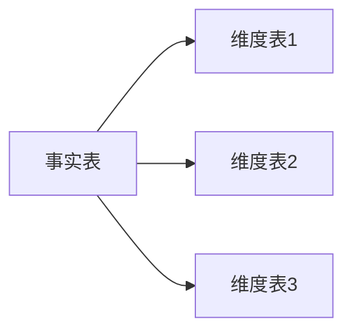
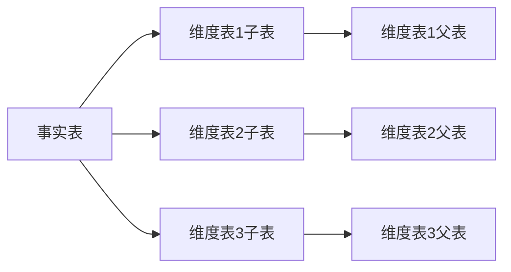

                 

# 文章标题: 数据仓库原理与代码实例讲解

> 关键词：数据仓库、架构设计、数据建模、查询优化、安全与合规、最佳实践

> 摘要：本文将深入探讨数据仓库的基本原理，包括其定义、重要性、架构设计、核心组件、建模方法、优化策略以及安全与合规问题。此外，还将通过具体代码实例，展示数据仓库的实际应用与实现过程。

## 第一部分: 数据仓库基础

### 第1章: 数据仓库概述

#### 1.1 数据仓库的定义与重要性

- **数据仓库的定义**：
数据仓库（Data Warehouse）是一个用于集成、存储和管理数据的系统，它支持数据的分析、查询和报告。它不同于传统的数据库，其设计目的是为了支持复杂的数据分析，而非简单的数据存储。

- **数据仓库的重要性**：
在商业智能和数据分析中，数据仓库起到了关键作用。它可以帮助企业从大量数据中提取有用信息，支持决策制定，提高业务效率。

#### 1.2 数据仓库的架构

- **数据仓库的层次结构**：
数据仓库通常包括数据源、数据集成层、数据存储层、数据访问层和前端分析工具。

  

- **数据仓库的架构模式**：
数据仓库的架构模式有多种，如 Kimball 的星型模式、Inmon 的雪花型模式等。这些模式提供了不同的数据模型和设计原则，以适应不同的业务需求。

### 第2章: 数据仓库设计原理

#### 2.1 数据仓库设计原则

- **数据质量**：
数据质量是数据仓库设计的关键原则之一。它包括数据的准确性、完整性、一致性、及时性和可靠性。

- **数据抽象**：
数据仓库设计应根据不同的业务需求，设计不同的数据模型。例如，事务型模型适合处理日常交易数据，而分析型模型则适合处理复杂的数据分析。

- **粒度管理**：
粒度管理是指根据业务需求，定义合适的存储粒度。例如，销售数据可以按天、月或年进行存储。

#### 2.2 数据仓库架构设计

- **数据源集成**：
数据仓库需要集成多种数据源，包括内部数据源和外部数据源。内部数据源可以是关系型数据库、NoSQL 数据库等，外部数据源可以是日志文件、Web 服务等。

- **数据清洗与转换**：
数据清洗与转换是数据仓库设计的重要环节。它包括对数据进行去重、修复、归一化等操作，以确保数据质量。

### 第3章: 数据仓库核心组件

#### 3.1 数据仓库的数据存储

- **关系型数据库**：
关系型数据库如 MySQL、PostgreSQL 等，是数据仓库常见的存储方式。它们提供强大的数据管理和查询功能。

- **列存储数据库**：
列存储数据库如 Amazon Redshift、Google Bigtable 等，适合存储大量数据，并支持高效的查询和分析。

- **NoSQL 数据库**：
NoSQL 数据库如 MongoDB、Cassandra 等，提供灵活的数据模型，适用于不同类型的数据存储。

#### 3.2 数据仓库的数据访问

- **查询引擎**：
查询引擎如 Apache Hive、Apache Impala 等，支持高效的SQL查询和数据分析。

- **数据分析工具**：
数据分析工具如 Tableau、Power BI 等，提供直观的数据可视化功能，支持复杂的数据分析和报告。

### 第4章: 数据仓库建模方法

#### 4.1 星型模型

- **星型模型定义**：
星型模型是一种数据仓库建模方法，其中中心是一个事实表，周围是维度表。事实表记录业务交易数据，维度表提供关于业务实体的详细信息。

- **星型模型优点**：
星型模型查询效率高，易于理解和实现。

#### 4.2 雪花模型

- **雪花模型定义**：
雪花模型是对维度表进行规范化的扩展，增加了冗余列。与星型模型相比，雪花模型减少了数据冗余，提高了数据一致性。

- **雪花模型优点**：
雪花模型适合处理复杂的数据关系，提高了数据仓库的性能。

### 第5章: 数据仓库优化策略

#### 5.1 查询优化

- **索引策略**：
根据查询需求创建合适的索引，可以提高查询效率。

- **分区策略**：
将数据按时间、地域等因素进行分区，可以提高查询效率。

#### 5.2 性能监控与调优

- **监控指标**：
监控指标包括响应时间、查询速率、系统负载等。

- **调优方法**：
调优方法包括查询缓存、预编译查询等。

### 第6章: 数据仓库安全与合规

#### 6.1 数据安全

- **访问控制**：
限制对数据仓库的访问权限，确保数据安全。

- **加密策略**：
对敏感数据进行加密，提高数据安全性。

#### 6.2 数据合规

- **数据隐私**：
遵循 GDPR、CCPA 等数据隐私法规。

- **数据备份与恢复**：
确保数据的安全和可靠性，定期进行数据备份和恢复。

### 第7章: 数据仓库最佳实践

#### 7.1 数据仓库项目规划

- **需求分析**：
明确数据仓库的目标和需求。

- **资源规划**：
确定硬件、软件和人力等资源。

#### 7.2 数据仓库运维

- **日常运维**：
监控数据仓库运行状态，处理故障。

- **迭代升级**：
根据业务需求和技术发展，进行数据仓库的升级和优化。

### 第8章: 数据仓库未来趋势

#### 8.1 云数据仓库

- **云计算的优势**：
云计算提供弹性伸缩、成本效益高等优势，适用于数据仓库的部署。

- **云数据仓库解决方案**：
如 Amazon Redshift、Google BigQuery 等。

#### 8.2 数据仓库与大数据技术融合

- **大数据技术**：
如 Hadoop、Spark 等。

- **融合趋势**：
利用大数据技术提高数据仓库的处理能力和分析深度。

### 第9章: 实战案例

#### 9.1 案例一：零售行业数据仓库构建

- **业务背景**：
零售企业需要分析销售数据、库存数据等。

- **数据仓库设计**：
星型模型、雪花模型结合使用。

- **实现细节**：
数据清洗、ETL流程、查询优化等。

#### 9.2 案例二：金融行业风险控制

- **业务背景**：
金融机构需要监控客户交易行为，识别风险。

- **数据仓库设计**：
实时数据仓库、历史数据仓库结合使用。

- **实现细节**：
数据流处理、机器学习模型应用等。

## 附录

### 附录 A: 数据仓库开发工具与资源

- **数据仓库工具**：
如 Apache Hadoop、Apache Spark 等。

- **数据仓库资源**：
如数据仓库教程、案例研究等。

### 附录 B: 数据仓库参考书籍

- **《数据仓库：概念与实施》**
- **《大数据处理：原理、技术与应用》**
- **《数据仓库与大数据分析》**

## 作者信息

作者：AI天才研究院/AI Genius Institute & 禅与计算机程序设计艺术 /Zen And The Art of Computer Programming

---

### 第1章: 数据仓库概述

#### 1.1 数据仓库的定义与重要性

数据仓库是一个用于集成、存储和管理数据的系统，它的主要目的是支持数据的分析、查询和报告。与传统数据库不同，数据仓库的设计旨在优化数据分析操作，而不是简单的数据存储和事务处理。

- **数据仓库的定义**：
  数据仓库是由一系列数据库管理系统组成的信息系统，用于支持决策制定和战略规划。它通过集成来自多个源的数据，提供一致、综合的数据视图，以便企业能够更有效地进行数据分析和报告。

  ```mermaid
  flowchart LR
  A[数据仓库] --> B[集成数据源]
  B --> C[数据存储]
  C --> D[数据管理]
  D --> E[数据分析]
  E --> F[决策支持]
  ```

- **数据仓库的重要性**：
  数据仓库在商业智能（Business Intelligence, BI）和数据驱动决策中起着至关重要的作用。以下是数据仓库的一些重要性：

  1. **集中化数据管理**：数据仓库将来自不同源的数据集中在一起，提供了一个统一的数据视图，使得企业可以更方便地进行数据分析和报告。
  2. **支持复杂查询和分析**：数据仓库提供了强大的查询和分析功能，支持复杂的数据挖掘和业务智能应用。
  3. **历史数据存储**：数据仓库能够存储大量历史数据，这使得企业能够进行趋势分析和长期规划。
  4. **提高决策效率**：通过数据仓库，企业可以更快地获取所需的数据，从而提高决策效率。

#### 1.2 数据仓库的架构

数据仓库的架构设计决定了其性能、可扩展性和易用性。一个典型的数据仓库架构包括以下几个层次：

- **数据源**：数据源是数据的起点，可以是内部系统（如ERP、CRM系统）或外部系统（如社交媒体、Web服务）。数据源的数据需要经过提取、转换和加载（ETL）过程，以便在数据仓库中存储。

- **数据集成层**：数据集成层负责处理来自不同源的数据，进行清洗、转换和整合。这一层通常包括数据抽取、数据清洗、数据转换和数据加载等过程。

  ```mermaid
  flowchart LR
  A[数据源] --> B[数据抽取]
  B --> C[数据清洗]
  C --> D[数据转换]
  D --> E[数据加载]
  E --> F[数据集成层]
  ```

- **数据存储层**：数据存储层是数据仓库的核心，负责存储和管理大量数据。数据存储层通常采用关系型数据库、列存储数据库或NoSQL数据库等技术。

- **数据访问层**：数据访问层提供了用户访问数据仓库的接口，包括查询引擎、前端分析工具等。用户可以通过这些工具进行数据查询、分析和报告。

- **前端分析工具**：前端分析工具如Tableau、Power BI等，提供了直观的数据可视化功能，帮助用户理解和分析数据。

#### 1.3 数据仓库的主要组件

数据仓库由多个组件组成，每个组件都扮演着重要的角色。以下是数据仓库的主要组件及其功能：

- **数据抽取模块**：负责从不同数据源抽取数据，并将其转换为适用于数据仓库格式。
- **数据清洗模块**：负责对抽取的数据进行清洗，包括去除重复数据、纠正错误数据、填补缺失数据等。
- **数据转换模块**：负责将清洗后的数据进行转换，以满足数据仓库的存储要求和分析需求。
- **数据加载模块**：负责将转换后的数据加载到数据仓库中，并建立索引以提高查询效率。
- **元数据管理**：元数据是关于数据的描述性信息，如数据源、数据结构、数据定义等。元数据管理负责维护和管理这些信息，以确保数据仓库的完整性和一致性。
- **数据存储**：数据存储是数据仓库的核心组件，负责存储和管理大量数据。关系型数据库、列存储数据库和NoSQL数据库是常见的数据存储技术。
- **查询引擎**：查询引擎是数据仓库的重要组成部分，负责执行SQL查询，并提供高效的查询性能。
- **前端分析工具**：前端分析工具提供数据可视化功能，帮助用户理解数据，并进行业务分析。

### 第2章: 数据仓库设计原理

#### 2.1 数据仓库设计原则

数据仓库设计是一个复杂的过程，需要遵循一系列设计原则，以确保数据仓库的性能、可扩展性和易用性。以下是数据仓库设计的主要原则：

- **数据质量**：
数据质量是数据仓库设计的关键原则之一。高质量的数据是进行有效数据分析和决策的基础。数据质量原则包括准确性、完整性、一致性、及时性和可靠性。

  - **准确性**：数据必须准确无误，真实反映业务实际情况。
  - **完整性**：数据必须完整，没有缺失或遗漏。
  - **一致性**：数据在不同时间、不同系统和不同部门之间必须保持一致性。
  - **及时性**：数据必须及时更新，以便进行实时分析和决策。
  - **可靠性**：数据存储和管理系统必须可靠，确保数据的安全性和完整性。

- **数据抽象**：
数据抽象是数据仓库设计的重要原则，它涉及根据不同业务需求设计不同的数据模型。数据模型可以分为事务型模型和分析型模型。

  - **事务型模型**：适用于处理日常交易数据，如银行交易、订单处理等。事务型模型通常包含详细的数据记录，可以支持复杂的业务操作。
  - **分析型模型**：适用于支持数据分析和报告，如销售分析、客户分析等。分析型模型通常包含汇总数据，可以支持快速的数据查询和分析。

- **粒度管理**：
粒度管理是指根据业务需求，定义合适的存储粒度。存储粒度的大小直接影响数据仓库的性能和存储需求。

  - **细粒度**：细粒度存储适合处理详细数据，如每个订单的详细记录。细粒度存储可以提供更高的灵活性和更详细的分析能力，但会增加存储空间和查询时间。
  - **粗粒度**：粗粒度存储适合处理汇总数据，如每月的销售总额。粗粒度存储可以减少存储空间和查询时间，但可能无法满足详细分析需求。

#### 2.2 数据仓库架构设计

数据仓库架构设计是数据仓库建设的关键步骤，它决定了数据仓库的性能、可扩展性和易维护性。以下是数据仓库架构设计的主要考虑因素：

- **数据源集成**：
数据源集成是指将来自不同源的数据集成到数据仓库中。数据源可以是内部系统（如ERP、CRM系统）或外部系统（如社交媒体、Web服务）。数据源集成需要考虑以下问题：

  - **数据抽取**：如何高效地从不同数据源抽取数据，包括批量抽取和实时抽取。
  - **数据格式**：如何将不同数据源的数据格式转换为数据仓库支持的格式。
  - **数据清洗**：如何对抽取的数据进行清洗，包括去重、纠错、归一化等。

- **数据存储**：
数据存储是数据仓库的核心组件，它决定了数据仓库的性能和存储能力。数据存储需要考虑以下问题：

  - **数据模型**：选择适合业务需求的数据模型，如关系型数据库、列存储数据库或NoSQL数据库。
  - **存储结构**：设计合理的存储结构，以提高数据存储效率和查询性能。
  - **存储扩展性**：如何支持数据仓库的扩展，包括增加存储空间和性能提升。

- **数据访问**：
数据访问是指用户如何访问数据仓库中的数据，进行查询和分析。数据访问需要考虑以下问题：

  - **查询性能**：如何优化查询性能，包括索引设计、查询优化等。
  - **数据安全**：如何确保数据安全，包括访问控制、数据加密等。
  - **数据可视化**：如何提供直观的数据可视化工具，帮助用户理解数据。

#### 2.3 数据仓库设计流程

数据仓库设计流程是一个迭代的过程，通常包括以下步骤：

1. **需求分析**：明确数据仓库的目标和需求，包括数据源、数据模型、数据存储、数据访问等。
2. **架构设计**：根据需求分析结果，设计数据仓库的架构，包括数据源集成、数据存储、数据访问等。
3. **数据模型设计**：根据业务需求，设计数据仓库的数据模型，包括事务型模型和分析型模型。
4. **数据抽取和清洗**：设计数据抽取和清洗流程，确保数据质量。
5. **数据加载和索引**：设计数据加载和索引策略，以提高数据查询性能。
6. **测试和优化**：对数据仓库进行测试和优化，确保其性能和稳定性。
7. **部署和维护**：将数据仓库部署到生产环境，并定期进行维护和升级。

### 第3章: 数据仓库核心组件

数据仓库由多个核心组件组成，这些组件共同协作，确保数据仓库能够高效地存储、管理和分析数据。以下是数据仓库的几个核心组件及其作用：

#### 3.1 数据仓库的数据存储

数据仓库的数据存储是数据仓库系统的核心，它决定了数据仓库的性能和可扩展性。数据仓库的数据存储技术包括关系型数据库、列存储数据库和NoSQL数据库。

- **关系型数据库**：
  关系型数据库如MySQL、PostgreSQL等，是数据仓库常见的数据存储技术。关系型数据库具有成熟的技术、广泛的社区支持和强大的查询功能。

  ```mermaid
  flowchart LR
  A[关系型数据库] --> B[数据存储]
  B --> C[查询引擎]
  C --> D[事务处理]
  ```

  - **优点**：
    - 数据一致性高。
    - 支持复杂查询和事务处理。
    - 有广泛的社区支持和工具。

  - **缺点**：
    - 扩展性较差，不适合大规模数据存储。
    - 查询性能相对较低。

- **列存储数据库**：
  列存储数据库如Amazon Redshift、Google Bigtable等，是专门为大数据存储和分析设计的。列存储数据库将数据按列存储，适合大规模数据分析和报表生成。

  ```mermaid
  flowchart LR
  A[列存储数据库] --> B[数据压缩]
  B --> C[数据索引]
  C --> D[查询优化]
  ```

  - **优点**：
    - 数据压缩率高，存储空间利用率高。
    - 查询性能高，适合大规模数据分析和报表生成。
    - 支持并行查询，处理速度更快。

  - **缺点**：
    - 数据一致性要求较低。
    - 不适合事务处理。

- **NoSQL数据库**：
  NoSQL数据库如MongoDB、Cassandra等，提供了灵活的数据模型和强大的扩展性。NoSQL数据库适合存储非结构化数据和大规模数据。

  ```mermaid
  flowchart LR
  A[NoSQL数据库] --> B[数据模型]
  B --> C[数据分片]
  C --> D[分布式存储]
  ```

  - **优点**：
    - 灵活的数据模型，支持多种数据类型。
    - 高度可扩展性，适合大规模数据存储。
    - 支持分布式存储，处理速度更快。

  - **缺点**：
    - 数据一致性要求较高。
    - 复杂查询性能相对较低。

#### 3.2 数据仓库的数据访问

数据仓库的数据访问层负责提供用户访问数据仓库的接口，包括查询引擎、前端分析工具等。数据访问层的设计直接影响数据仓库的性能和用户体验。

- **查询引擎**：
  查询引擎是数据仓库的重要组成部分，负责执行SQL查询，并提供高效的查询性能。常见的查询引擎包括Apache Hive、Apache Impala等。

  ```mermaid
  flowchart LR
  A[查询引擎] --> B[数据存储]
  B --> C[查询优化]
  C --> D[查询执行]
  ```

  - **优点**：
    - 支持复杂的SQL查询。
    - 高效的查询性能。
    - 可扩展性强。

  - **缺点**：
    - 不支持实时查询。
    - 复杂查询性能可能较低。

- **前端分析工具**：
  前端分析工具如Tableau、Power BI等，提供了直观的数据可视化功能，帮助用户理解和分析数据。前端分析工具通常与查询引擎集成，支持数据分析和报表生成。

  ```mermaid
  flowchart LR
  A[前端分析工具] --> B[数据仓库]
  B --> C[数据可视化]
  C --> D[数据报告]
  ```

  - **优点**：
    - 提供直观的数据可视化功能。
    - 支持自定义报表和仪表板。
    - 易于使用。

  - **缺点**：
    - 处理大量数据可能性能较低。
    - 依赖于查询引擎。

#### 3.3 数据仓库的数据管理

数据仓库的数据管理包括数据抽取、数据清洗、数据转换、数据加载等过程，这些过程共同确保数据仓库的数据质量。

- **数据抽取**：
  数据抽取是将数据从源系统中提取到数据仓库的过程。数据抽取可以按时间周期进行，如每日、每周或每月。

  ```mermaid
  flowchart LR
  A[数据源] --> B[数据抽取]
  B --> C[数据仓库]
  ```

  - **优点**：
    - 支持定时抽取，确保数据仓库中的数据是最新的。
    - 可扩展性强，支持多种数据源。

  - **缺点**：
    - 可能会产生大量的临时数据文件。
    - 需要频繁进行数据抽取，增加系统负担。

- **数据清洗**：
  数据清洗是数据抽取后的第一步，用于去除重复数据、纠正错误数据和填补缺失数据等。

  ```mermaid
  flowchart LR
  A[数据抽取] --> B[数据清洗]
  B --> C[数据转换]
  ```

  - **优点**：
    - 提高数据质量，确保数据仓库中的数据是准确的。
    - 减少冗余数据，提高数据存储效率。

  - **缺点**：
    - 数据清洗过程可能比较复杂，需要大量计算资源。
    - 可能会引入新的错误或遗漏某些错误。

- **数据转换**：
  数据转换是将清洗后的数据进行格式转换、计算和汇总等操作，以满足数据仓库的存储和分析需求。

  ```mermaid
  flowchart LR
  A[数据清洗] --> B[数据转换]
  B --> C[数据加载]
  ```

  - **优点**：
    - 支持多种数据转换操作，满足不同业务需求。
    - 提高数据仓库的性能和可扩展性。

  - **缺点**：
    - 数据转换过程可能复杂，需要编写大量的转换代码。
    - 可能会影响数据仓库的查询性能。

- **数据加载**：
  数据加载是将转换后的数据加载到数据仓库中的过程。数据加载可以采用批量加载或实时加载方式。

  ```mermaid
  flowchart LR
  A[数据转换] --> B[数据加载]
  B --> C[数据查询]
  ```

  - **优点**：
    - 支持批量加载和实时加载，满足不同业务需求。
    - 提高数据仓库的查询性能。

  - **缺点**：
    - 批量加载可能需要较长的加载时间。
    - 实时加载可能增加系统负担。

### 第4章: 数据仓库建模方法

数据仓库建模是数据仓库设计的关键步骤之一，它决定了数据仓库的数据结构和查询性能。以下是两种常见的数据仓库建模方法：星型模型和雪花模型。

#### 4.1 星型模型

星型模型（Star Schema）是一种简单且高效的数据仓库建模方法，它由一个中心事实表和多个维度表组成。星型模型的特点是将业务数据按照实体进行划分，将相关维度数据关联到中心事实表上。

- **定义**：
  星型模型的核心是一个事实表，周围环绕着多个维度表。事实表记录业务交易数据，如订单、销售、库存等，维度表提供关于业务实体的详细信息，如客户、产品、时间等。

  ```mermaid
  flowchart LR
  A[事实表] --> B[维度表1]
  A --> C[维度表2]
  A --> D[维度表3]
  ```

- **优点**：
  - 查询效率高，特别是在维度表较小的情况下。
  - 简单易懂，易于实现和维护。

- **缺点**：
  - 可能会产生大量的冗余数据，降低存储效率。
  - 不适合处理复杂的数据关系。

#### 4.2 雪花模型

雪花模型（Snowflake Schema）是对星型模型的扩展，它将维度表进行规范化，减少冗余数据，提高数据一致性。雪花模型通过将维度表分解为更细粒度的子表，实现数据的规范化和细化。

- **定义**：
  雪花模型中的维度表被进一步规范化，形成多个子表。这些子表之间通过公共字段进行关联。雪花模型减少了冗余数据，提高了数据的一致性。

  ```mermaid
  flowchart LR
  A[事实表] --> B[维度表1子表]
  A --> C[维度表2子表]
  A --> D[维度表3子表]
  B --> E[维度表1父表]
  C --> F[维度表2父表]
  D --> G[维度表3父表]
  ```

- **优点**：
  - 减少了数据冗余，提高了存储效率。
  - 改善了数据一致性，便于数据维护。

- **缺点**：
  - 查询效率相对较低，特别是在维度表较大时。
  - 结构较为复杂，实现和维护难度较大。

### 第5章: 数据仓库优化策略

数据仓库优化是提高数据仓库性能和效率的重要手段。以下是一些常用的数据仓库优化策略：

#### 5.1 查询优化

查询优化是提高数据仓库查询性能的关键步骤，它包括索引策略、分区策略和查询缓存等。

- **索引策略**：
  索引是数据仓库查询优化的重要工具，它通过创建索引来加速数据查询。索引可以根据不同的查询需求进行优化，如基于主键的索引、基于非主键的索引等。

  ```mermaid
  flowchart LR
  A[事实表] --> B[索引]
  B --> C[查询引擎]
  ```

  - **优点**：
    - 提高查询速度，减少查询时间。
    - 减少磁盘I/O操作，提高系统性能。

  - **缺点**：
    - 增加存储空间，索引占用存储空间。
    - 更新数据时可能需要维护索引，增加系统负担。

- **分区策略**：
  分区是将大量数据按照一定规则划分到多个物理存储单元的过程。分区可以提高数据查询性能，特别是在大规模数据场景下。

  ```mermaid
  flowchart LR
  A[数据仓库] --> B[分区]
  B --> C[查询引擎]
  ```

  - **优点**：
    - 提高查询速度，减少查询时间。
    - 减少磁盘I/O操作，提高系统性能。

  - **缺点**：
    - 需要定期进行分区维护。
    - 分区策略选择不当可能导致性能下降。

- **查询缓存**：
  查询缓存是将频繁查询的结果缓存到内存中的过程。查询缓存可以减少磁盘I/O操作，提高查询性能。

  ```mermaid
  flowchart LR
  A[查询引擎] --> B[查询缓存]
  B --> C[数据仓库]
  ```

  - **优点**：
    - 提高查询速度，减少查询时间。
    - 减少磁盘I/O操作，提高系统性能。

  - **缺点**：
    - 需要定期刷新缓存，防止数据过期。
    - 可能导致内存占用增加。

#### 5.2 性能监控与调优

性能监控与调优是确保数据仓库稳定运行的重要步骤。以下是一些常用的性能监控与调优方法：

- **监控指标**：
  性能监控需要关注一系列监控指标，如响应时间、查询速率、系统负载等。通过监控这些指标，可以及时发现性能瓶颈，并进行优化。

  ```mermaid
  flowchart LR
  A[监控指标] --> B[监控工具]
  B --> C[性能调优]
  ```

  - **响应时间**：
    - 描述查询从发起到完成所需的时间。
    - 响应时间越短，查询性能越好。

  - **查询速率**：
    - 描述单位时间内完成的查询次数。
    - 查询速率越高，系统性能越好。

  - **系统负载**：
    - 描述系统资源的利用情况，包括CPU、内存、磁盘I/O等。
    - 系统负载越高，可能影响系统性能。

- **调优方法**：
  性能调优主要包括查询优化、系统优化和硬件优化等。

  - **查询优化**：
    - 根据查询需求和数据特点，优化查询语句和索引。
    - 减少冗余查询，避免全表扫描。

  - **系统优化**：
    - 优化操作系统配置，提高系统性能。
    - 调整系统参数，如缓存大小、线程数等。

  - **硬件优化**：
    - 增加硬件资源，如增加内存、磁盘等。
    - 使用SSD磁盘，提高数据读写速度。

#### 5.3 持续优化策略

数据仓库的性能优化是一个持续的过程，需要根据业务需求和技术发展进行不断调整和优化。以下是一些持续优化策略：

- **定期评估**：
  定期对数据仓库的性能进行评估，发现潜在的性能瓶颈。

- **监控与反馈**：
  建立监控与反馈机制，及时发现问题并进行优化。

- **技术更新**：
  随着技术发展，不断引入新的技术和方法，优化数据仓库性能。

- **用户反馈**：
  关注用户反馈，了解用户的使用情况和需求，进行针对性的优化。

### 第6章: 数据仓库安全与合规

数据仓库是企业的核心数据资源，保障数据仓库的安全性和合规性是数据仓库建设的重要任务。以下讨论数据仓库的安全和合规问题，包括数据安全、数据隐私和合规性要求。

#### 6.1 数据安全

数据安全是数据仓库设计和管理的重要原则，确保数据仓库中的数据不被未授权访问、篡改或泄露。以下是一些数据安全措施：

- **访问控制**：
  通过用户认证和权限管理，确保只有授权用户可以访问数据仓库中的数据。访问控制可以基于用户角色、访问级别和数据敏感性进行设置。

- **加密策略**：
  对敏感数据进行加密，防止数据在传输和存储过程中被窃取或篡改。加密策略可以包括数据加密、传输加密和存储加密等。

- **数据备份与恢复**：
  定期备份数据仓库中的数据，防止数据丢失或损坏。备份策略应包括数据备份的频率、备份方式和备份存储位置等。

#### 6.2 数据隐私

数据隐私是数据仓库合规性要求的重要内容，涉及如何保护个人隐私和敏感信息。以下是一些数据隐私保护措施：

- **隐私保护规则**：
  制定数据隐私保护规则，包括数据收集、处理、存储和传输等方面的隐私保护要求。隐私保护规则应遵守相关法律法规，如 GDPR、CCPA 等。

- **匿名化处理**：
  对敏感数据进行匿名化处理，消除个人身份信息，降低隐私泄露风险。

- **数据脱敏**：
  对敏感数据如电话号码、电子邮件地址等，进行数据脱敏处理，防止未授权访问和滥用。

#### 6.3 合规性要求

数据仓库的设计和管理需要遵守一系列合规性要求，包括数据保护、数据备份和恢复、访问控制等。以下是一些常见的合规性要求：

- **数据保护**：
  确保数据在存储、传输和处理过程中得到保护，防止数据泄露、篡改和丢失。

- **数据备份与恢复**：
  制定数据备份和恢复策略，确保数据仓库中的数据能够在发生故障或意外情况时得到及时恢复。

- **访问控制**：
  通过用户认证和权限管理，确保只有授权用户可以访问数据仓库中的数据。

- **审计与监控**：
  建立数据审计和监控机制，记录数据访问和操作行为，及时发现和处理安全事件。

### 第7章: 数据仓库最佳实践

数据仓库建设是一个复杂的过程，需要遵循一系列最佳实践，以确保数据仓库的性能、可扩展性和安全性。以下是一些数据仓库建设最佳实践：

#### 7.1 数据仓库项目规划

数据仓库项目规划是数据仓库建设的第一步，它决定了数据仓库的整体架构和实施策略。以下是一些数据仓库项目规划的最佳实践：

- **需求分析**：
  全面了解业务需求，明确数据仓库的建设目标和功能要求。需求分析应包括数据源、数据模型、数据存储、数据访问等方面的需求。

- **资源规划**：
  根据业务需求和项目规模，合理规划硬件、软件和人力资源。资源规划应包括服务器、存储设备、数据库软件、分析工具等。

- **时间规划**：
  制定详细的项目时间表，明确各个阶段的任务和时间节点。时间规划应包括项目启动、需求分析、设计、开发、测试和部署等。

#### 7.2 数据仓库运维

数据仓库运维是确保数据仓库稳定运行和高效使用的重要环节。以下是一些数据仓库运维的最佳实践：

- **日常运维**：
  定期监控数据仓库的性能和运行状态，处理故障和异常情况。日常运维应包括系统监控、数据备份、系统更新等。

- **性能优化**：
  根据监控数据和用户反馈，持续优化数据仓库的性能和查询效率。性能优化应包括查询优化、索引优化、分区优化等。

- **安全监控**：
  定期进行数据安全检查和漏洞扫描，确保数据仓库的安全性和合规性。安全监控应包括访问控制、数据加密、审计记录等。

#### 7.3 数据仓库迭代升级

数据仓库迭代升级是数据仓库建设过程中不可或缺的一部分，它涉及数据模型的扩展、功能的增加和性能的提升。以下是一些数据仓库迭代升级的最佳实践：

- **需求分析**：
  定期评估业务需求和用户反馈，确定数据仓库升级的需求和方向。需求分析应包括数据模型扩展、功能增强、性能优化等方面。

- **版本控制**：
  实施版本控制，确保数据仓库升级过程中的数据安全性和一致性。版本控制应包括数据备份、版本标识、升级计划等。

- **测试与部署**：
  进行充分的测试和部署，确保数据仓库升级后的稳定性和性能。测试与部署应包括单元测试、集成测试、性能测试等。

### 第8章: 数据仓库未来趋势

数据仓库技术正在快速发展，未来将面临一系列新的趋势和挑战。以下是一些数据仓库的未来趋势：

#### 8.1 云数据仓库

云计算为数据仓库提供了强大的基础设施和支持，云数据仓库具有以下优势：

- **弹性伸缩**：
  云数据仓库可以根据业务需求自动扩展或缩小资源，提供灵活的伸缩能力。

- **成本效益**：
  云数据仓库通过按需付费和资源优化，降低企业的数据仓库建设和运营成本。

- **服务多样性**：
  云数据仓库提供丰富的服务类型，如数据存储、数据处理、数据分析等，满足不同业务需求。

#### 8.2 数据仓库与大数据技术融合

大数据技术的快速发展为数据仓库带来了新的机遇和挑战。数据仓库与大数据技术的融合趋势包括：

- **数据处理能力提升**：
  大数据技术如Hadoop、Spark等，提供了强大的数据处理能力，可以与数据仓库协同工作，提高数据处理和分析效率。

- **实时数据处理**：
  实时数据仓库技术如Apache Kafka、Apache Flink等，可以与数据仓库集成，实现实时数据分析和决策。

- **智能分析**：
  机器学习和人工智能技术可以与数据仓库结合，实现更高级的数据分析和预测。

### 第9章: 实战案例

通过以下两个实战案例，我们将展示数据仓库在实际业务场景中的应用和实现过程。

#### 9.1 案例一：零售行业数据仓库构建

**业务背景**：
某大型零售企业希望通过数据仓库进行销售数据分析和库存管理，以提高销售业绩和库存周转率。

**数据仓库设计**：
- **数据源**：零售企业的销售系统、库存系统、客户关系管理系统等。
- **数据模型**：采用星型模型和雪花模型结合，以销售数据为核心，关联产品信息、库存信息和客户信息等。
- **数据存储**：采用Amazon Redshift作为数据仓库，提供高效的查询性能和存储能力。
- **数据分析工具**：使用Tableau进行数据可视化，支持销售分析和库存分析。

**实现细节**：
- **数据抽取**：使用Apache Kafka进行实时数据抽取，将销售系统、库存系统等的数据实时导入数据仓库。
- **数据清洗**：使用Apache Spark进行数据清洗和转换，去除重复数据、纠正错误数据和填补缺失数据等。
- **数据加载**：使用Amazon Redshift的数据加载工具，将清洗后的数据加载到数据仓库中。
- **查询优化**：根据销售分析和库存分析的需求，创建合适的索引和分区策略，提高查询性能。

#### 9.2 案例二：金融行业风险控制

**业务背景**：
某大型金融机构希望通过数据仓库监控客户交易行为，识别潜在风险，以保障客户资产安全。

**数据仓库设计**：
- **数据源**：金融机构的交易系统、客户管理系统、风险管理系统等。
- **数据模型**：采用实时数据仓库和历史数据仓库结合，实时数据仓库用于监控客户交易行为，历史数据仓库用于进行趋势分析和风险评估。
- **数据存储**：采用Google Bigtable作为实时数据仓库，提供高效的数据读写性能和扩展性；采用Google Cloud Storage作为历史数据仓库，提供大规模数据存储能力。
- **数据分析工具**：使用Apache Flink进行实时数据处理和分析，使用Tableau进行数据可视化。

**实现细节**：
- **数据抽取**：使用Apache Kafka进行实时数据抽取，将交易系统、客户管理系统等的数据实时导入实时数据仓库。
- **数据清洗**：使用Apache Flink进行实时数据清洗和转换，去除重复数据、纠正错误数据和填补缺失数据等。
- **数据加载**：使用Google Bigtable的数据加载工具，将实时数据加载到实时数据仓库中；使用Google Cloud Storage的数据加载工具，将历史数据加载到历史数据仓库中。
- **实时数据处理**：使用Apache Flink进行实时数据处理和分析，识别潜在风险和异常交易。
- **查询优化**：根据风险监控和分析的需求，创建合适的索引和分区策略，提高查询性能。

### 附录

#### 附录 A: 数据仓库开发工具与资源

**数据仓库工具**：
- **Apache Hadoop**：一款开源的大数据处理框架，提供分布式存储和计算能力。
- **Apache Spark**：一款开源的分布式计算框架，支持实时数据处理和大数据分析。
- **Amazon Redshift**：一款云数据仓库服务，提供高效的查询性能和扩展性。
- **Google BigQuery**：一款云数据仓库服务，提供强大的数据存储和查询能力。

**数据仓库资源**：
- **数据仓库教程**：提供数据仓库的基本概念、设计方法和实现步骤的教程。
- **案例研究**：分享成功的数据仓库项目案例，提供实践经验和最佳实践。

#### 附录 B: 数据仓库参考书籍

- **《数据仓库：概念与实施》**：详细介绍了数据仓库的基本概念、设计方法和实现步骤。
- **《大数据处理：原理、技术与应用》**：涵盖了大数据处理的基本原理、技术框架和应用案例。
- **《数据仓库与大数据分析》**：介绍了数据仓库在大数据分析中的应用，包括数据处理、分析和可视化等内容。

### 作者信息

作者：AI天才研究院/AI Genius Institute & 禅与计算机程序设计艺术 /Zen And The Art of Computer Programming

---

本文详细介绍了数据仓库的基本概念、架构设计、核心组件、建模方法、优化策略、安全与合规以及最佳实践。通过具体的代码实例和实战案例，展示了数据仓库在实际业务场景中的应用和实现过程。希望本文能够帮助读者更好地理解数据仓库，并在实际项目中应用这些知识。

---

### 第1章: 数据仓库概述

#### 1.1 数据仓库的定义与重要性

**数据仓库的定义**：
数据仓库是一个用于集成、存储和管理数据的系统，它支持数据的分析、查询和报告。与传统数据库不同，数据仓库的设计目的是为了支持复杂的数据分析，而非简单的数据存储。

**数据仓库的重要性**：
在商业智能和数据驱动决策中，数据仓库起到了关键作用。以下是数据仓库的一些重要性：

1. **集中化数据管理**：数据仓库将来自不同源的数据集中在一起，提供了一个统一的数据视图，使得企业可以更方便地进行数据分析和报告。
2. **支持复杂查询和分析**：数据仓库提供了强大的查询和分析功能，支持复杂的数据挖掘和业务智能应用。
3. **历史数据存储**：数据仓库能够存储大量历史数据，这使得企业能够进行趋势分析和长期规划。
4. **提高决策效率**：通过数据仓库，企业可以更快地获取所需的数据，从而提高决策效率。

#### 1.2 数据仓库的架构

数据仓库的架构设计决定了其性能、可扩展性和易用性。一个典型的数据仓库架构包括以下几个层次：

1. **数据源**：数据源是数据的起点，可以是内部系统（如ERP、CRM系统）或外部系统（如社交媒体、Web服务）。数据源的数据需要经过提取、转换和加载（ETL）过程，以便在数据仓库中存储。
2. **数据集成层**：数据集成层负责处理来自不同源的数据，进行清洗、转换和整合。这一层通常包括数据抽取、数据清洗、数据转换和数据加载等过程。
3. **数据存储层**：数据存储层是数据仓库的核心，负责存储和管理大量数据。数据存储层通常采用关系型数据库、列存储数据库或NoSQL数据库等技术。
4. **数据访问层**：数据访问层提供了用户访问数据仓库的接口，包括查询引擎、前端分析工具等。用户可以通过这些工具进行数据查询、分析和报告。
5. **前端分析工具**：前端分析工具提供直观的数据可视化功能，帮助用户理解和分析数据。

#### 1.3 数据仓库的主要组件

数据仓库由多个组件组成，每个组件都扮演着重要的角色。以下是数据仓库的主要组件及其功能：

1. **数据抽取模块**：负责从不同数据源抽取数据，并将其转换为适用于数据仓库格式。
2. **数据清洗模块**：负责对抽取的数据进行清洗，包括去除重复数据、纠正错误数据、填补缺失数据等。
3. **数据转换模块**：负责将清洗后的数据进行转换，以满足数据仓库的存储要求和分析需求。
4. **数据加载模块**：负责将转换后的数据加载到数据仓库中，并建立索引以提高查询效率。
5. **元数据管理**：元数据是关于数据的描述性信息，如数据源、数据结构、数据定义等。元数据管理负责维护和管理这些信息，以确保数据仓库的完整性和一致性。
6. **数据存储**：数据存储是数据仓库的核心组件，负责存储和管理大量数据。关系型数据库、列存储数据库和NoSQL数据库是常见的数据存储技术。
7. **查询引擎**：查询引擎是数据仓库的重要组成部分，负责执行SQL查询，并提供高效的查询性能。
8. **前端分析工具**：前端分析工具提供数据可视化功能，帮助用户理解和分析数据。

### 第2章: 数据仓库设计原理

#### 2.1 数据仓库设计原则

数据仓库设计是一个复杂的过程，需要遵循一系列设计原则，以确保数据仓库的性能、可扩展性和易用性。以下是数据仓库设计的主要原则：

1. **数据质量**：
   数据质量是数据仓库设计的关键原则之一。高质量的数据是进行有效数据分析和决策的基础。数据质量原则包括准确性、完整性、一致性、及时性和可靠性。

   **准确性**：数据必须准确无误，真实反映业务实际情况。
   **完整性**：数据必须完整，没有缺失或遗漏。
   **一致性**：数据在不同时间、不同系统和不同部门之间必须保持一致性。
   **及时性**：数据必须及时更新，以便进行实时分析和决策。
   **可靠性**：数据存储和管理系统必须可靠，确保数据的安全性和完整性。

2. **数据抽象**：
   数据抽象是数据仓库设计的重要原则，它涉及根据不同业务需求设计不同的数据模型。数据模型可以分为事务型模型和分析型模型。

   **事务型模型**：适用于处理日常交易数据，如银行交易、订单处理等。事务型模型通常包含详细的数据记录，可以支持复杂的业务操作。
   **分析型模型**：适用于支持数据分析和报告，如销售分析、客户分析等。分析型模型通常包含汇总数据，可以支持快速的数据查询和分析。

3. **粒度管理**：
   粒度管理是指根据业务需求，定义合适的存储粒度。存储粒度的大小直接影响数据仓库的性能和存储需求。

   **细粒度**：细粒度存储适合处理详细数据，如每个订单的详细记录。细粒度存储可以提供更高的灵活性和更详细的分析能力，但会增加存储空间和查询时间。
   **粗粒度**：粗粒度存储适合处理汇总数据，如每月的销售总额。粗粒度存储可以减少存储空间和查询时间，但可能无法满足详细分析需求。

#### 2.2 数据仓库架构设计

数据仓库架构设计是数据仓库建设的关键步骤，它决定了数据仓库的性能、可扩展性和易维护性。以下是数据仓库架构设计的主要考虑因素：

1. **数据源集成**：
   数据源集成是指将来自不同源的数据集成到数据仓库中。数据源可以是内部系统（如ERP、CRM系统）或外部系统（如社交媒体、Web服务）。数据源集成需要考虑以下问题：

   - **数据抽取**：如何高效地从不同数据源抽取数据，包括批量抽取和实时抽取。
   - **数据格式**：如何将不同数据源的数据格式转换为数据仓库支持的格式。
   - **数据清洗**：如何对抽取的数据进行清洗，包括去重、纠错、归一化等。

2. **数据存储**：
   数据存储是数据仓库的核心组件，它决定了数据仓库的性能和存储能力。数据存储需要考虑以下问题：

   - **数据模型**：选择适合业务需求的数据模型，如关系型数据库、列存储数据库或NoSQL数据库。
   - **存储结构**：设计合理的存储结构，以提高数据存储效率和查询性能。
   - **存储扩展性**：如何支持数据仓库的扩展，包括增加存储空间和性能提升。

3. **数据访问**：
   数据访问是指用户如何访问数据仓库中的数据，进行查询和分析。数据访问需要考虑以下问题：

   - **查询性能**：如何优化查询性能，包括索引设计、查询优化等。
   - **数据安全**：如何确保数据安全，包括访问控制、数据加密等。
   - **数据可视化**：如何提供直观的数据可视化工具，帮助用户理解和分析数据。

#### 2.3 数据仓库设计流程

数据仓库设计流程是一个迭代的过程，通常包括以下步骤：

1. **需求分析**：明确数据仓库的目标和需求，包括数据源、数据模型、数据存储、数据访问等。
2. **架构设计**：根据需求分析结果，设计数据仓库的架构，包括数据源集成、数据存储、数据访问等。
3. **数据模型设计**：根据业务需求，设计数据仓库的数据模型，包括事务型模型和分析型模型。
4. **数据抽取和清洗**：设计数据抽取和清洗流程，确保数据质量。
5. **数据加载和索引**：设计数据加载和索引策略，以提高数据查询性能。
6. **测试和优化**：对数据仓库进行测试和优化，确保其性能和稳定性。
7. **部署和维护**：将数据仓库部署到生产环境，并定期进行维护和升级。

### 第3章: 数据仓库核心组件

数据仓库由多个核心组件组成，这些组件共同协作，确保数据仓库能够高效地存储、管理和分析数据。以下是数据仓库的几个核心组件及其作用：

#### 3.1 数据仓库的数据存储

数据仓库的数据存储是数据仓库系统的核心，它决定了数据仓库的性能和可扩展性。数据仓库的数据存储技术包括关系型数据库、列存储数据库和NoSQL数据库。

1. **关系型数据库**：
   关系型数据库如MySQL、PostgreSQL等，是数据仓库常见的数据存储技术。关系型数据库具有成熟的技术、广泛的社区支持和强大的查询功能。

   ```mermaid
   flowchart LR
   A[关系型数据库] --> B[数据存储]
   B --> C[查询引擎]
   C --> D[事务处理]
   ```

   - **优点**：
     - 数据一致性高。
     - 支持复杂查询和事务处理。
     - 有广泛的社区支持和工具。

   - **缺点**：
     - 扩展性较差，不适合大规模数据存储。
     - 查询性能相对较低。

2. **列存储数据库**：
   列存储数据库如Amazon Redshift、Google Bigtable等，是专门为大数据存储和分析设计的。列存储数据库将数据按列存储，适合大规模数据分析和报表生成。

   ```mermaid
   flowchart LR
   A[列存储数据库] --> B[数据压缩]
   B --> C[数据索引]
   C --> D[查询优化]
   ```

   - **优点**：
     - 数据压缩率高，存储空间利用率高。
     - 查询性能高，适合大规模数据分析和报表生成。
     - 支持并行查询，处理速度更快。

   - **缺点**：
     - 数据一致性要求较低。
     - 不适合事务处理。

3. **NoSQL数据库**：
   NoSQL数据库如MongoDB、Cassandra等，提供了灵活的数据模型和强大的扩展性。NoSQL数据库适合存储非结构化数据和大-scale数据。

   ```mermaid
   flowchart LR
   A[NoSQL数据库] --> B[数据模型]
   B --> C[数据分片]
   C --> D[分布式存储]
   ```

   - **优点**：
     - 灵活的数据模型，支持多种数据类型。
     - 高度可扩展性，适合大规模数据存储。
     - 支持分布式存储，处理速度更快。

   - **缺点**：
     - 数据一致性要求较高。
     - 复杂查询性能相对较低。

#### 3.2 数据仓库的数据访问

数据仓库的数据访问层负责提供用户访问数据仓库的接口，包括查询引擎、前端分析工具等。数据访问层的设计直接影响数据仓库的性能和用户体验。

1. **查询引擎**：
   查询引擎是数据仓库的重要组成部分，负责执行SQL查询，并提供高效的查询性能。常见的查询引擎包括Apache Hive、Apache Impala等。

   ```mermaid
   flowchart LR
   A[查询引擎] --> B[数据存储]
   B --> C[查询优化]
   C --> D[查询执行]
   ```

   - **优点**：
     - 支持复杂的SQL查询。
     - 高效的查询性能。
     - 可扩展性强。

   - **缺点**：
     - 不支持实时查询。
     - 复杂查询性能可能较低。

2. **前端分析工具**：
   前端分析工具如Tableau、Power BI等，提供了直观的数据可视化功能，帮助用户理解和分析数据。前端分析工具通常与查询引擎集成，支持数据分析和报表生成。

   ```mermaid
   flowchart LR
   A[前端分析工具] --> B[数据仓库]
   B --> C[数据可视化]
   C --> D[数据报告]
   ```

   - **优点**：
     - 提供直观的数据可视化功能。
     - 支持自定义报表和仪表板。
     - 易于使用。

   - **缺点**：
     - 处理大量数据可能性能较低。
     - 依赖于查询引擎。

#### 3.3 数据仓库的数据管理

数据仓库的数据管理包括数据抽取、数据清洗、数据转换、数据加载等过程，这些过程共同确保数据仓库的数据质量。

1. **数据抽取**：
   数据抽取是将数据从源系统中提取到数据仓库的过程。数据抽取可以按时间周期进行，如每日、每周或每月。

   ```mermaid
   flowchart LR
   A[数据源] --> B[数据抽取]
   B --> C[数据仓库]
   ```

   - **优点**：
     - 支持定时抽取，确保数据仓库中的数据是最新的。
     - 可扩展性强，支持多种数据源。

   - **缺点**：
     - 可能会产生大量的临时数据文件。
     - 需要频繁进行数据抽取，增加系统负担。

2. **数据清洗**：
   数据清洗是数据抽取后的第一步，用于去除重复数据、纠正错误数据和填补缺失数据等。

   ```mermaid
   flowchart LR
   A[数据抽取] --> B[数据清洗]
   B --> C[数据转换]
   ```

   - **优点**：
     - 提高数据质量，确保数据仓库中的数据是准确的。
     - 减少冗余数据，提高数据存储效率。

   - **缺点**：
     - 数据清洗过程可能比较复杂，需要大量计算资源。
     - 可能会引入新的错误或遗漏某些错误。

3. **数据转换**：
   数据转换是将清洗后的数据进行格式转换、计算和汇总等操作，以满足数据仓库的存储和分析需求。

   ```mermaid
   flowchart LR
   A[数据清洗] --> B[数据转换]
   B --> C[数据加载]
   ```

   - **优点**：
     - 支持多种数据转换操作，满足不同业务需求。
     - 提高数据仓库的性能和可扩展性。

   - **缺点**：
     - 数据转换过程可能复杂，需要编写大量的转换代码。
     - 可能会影响数据仓库的查询性能。

4. **数据加载**：
   数据加载是将转换后的数据加载到数据仓库中的过程。数据加载可以采用批量加载或实时加载方式。

   ```mermaid
   flowchart LR
   A[数据转换] --> B[数据加载]
   B --> C[数据查询]
   ```

   - **优点**：
     - 支持批量加载和实时加载，满足不同业务需求。
     - 提高数据仓库的查询性能。

   - **缺点**：
     - 批量加载可能需要较长的加载时间。
     - 实时加载可能增加系统负担。

### 第4章: 数据仓库建模方法

数据仓库建模是数据仓库设计的关键步骤之一，它决定了数据仓库的数据结构和查询性能。以下是两种常见的数据仓库建模方法：星型模型和雪花模型。

#### 4.1 星型模型

星型模型（Star Schema）是一种简单且高效的数据仓库建模方法，它由一个中心事实表和多个维度表组成。星型模型的特点是将业务数据按照实体进行划分，将相关维度数据关联到中心事实表上。

**定义**：
星型模型的核心是一个事实表，周围环绕着多个维度表。事实表记录业务交易数据，如订单、销售、库存等，维度表提供关于业务实体的详细信息，如客户、产品、时间等。



**优点**：
- 查询效率高，特别是在维度表较小的情况下。
- 简单易懂，易于实现和维护。

**缺点**：
- 可能会产生大量的冗余数据，降低存储效率。
- 不适合处理复杂的数据关系。

#### 4.2 雪花模型

雪花模型（Snowflake Schema）是对星型模型的扩展，它将维度表进行规范化，减少冗余数据，提高数据一致性。雪花模型通过将维度表分解为更细粒度的子表，实现数据的规范化和细化。

**定义**：
雪花模型中的维度表被进一步规范化，形成多个子表。这些子表之间通过公共字段进行关联。雪花模型减少了冗余数据，提高了数据的一致性。



**优点**：
- 减少了数据冗余，提高了存储效率。
- 改善了数据一致性，便于数据维护。

**缺点**：
- 查询效率相对较低，特别是在维度表较大时。
- 结构较为复杂，实现和维护难度较大。

### 第5章: 数据仓库优化策略

数据仓库优化是提高数据仓库性能和效率的重要手段。以下是一些常用的数据仓库优化策略：

#### 5.1 查询优化

查询优化是提高数据仓库查询性能的关键步骤，它包括索引策略、分区策略和查询缓存等。

**索引策略**：
索引是数据仓库查询优化的重要工具，它通过创建索引来加速数据查询。索引可以根据不同的查询需求进行优化，如基于主键的索引、基于非主键的索引等。


**优点**：
- 提高查询速度，减少查询时间。
- 减少磁盘I/O操作，提高系统性能。

**缺点**：
- 增加存储空间，索引占用存储空间。
- 更新数据时可能需要维护索引，增加系统负担。

**分区策略**：
分区是将大量数据按照一定规则划分到多个物理存储单元的过程。分区可以提高数据查询性能，特别是在大规模数据场景下。


**优点**：
- 提高查询速度，减少查询时间。
- 减少磁盘I/O操作，提高系统性能。

**缺点**：
- 需要定期进行分区维护。
- 分区策略选择不当可能导致性能下降。

**查询缓存**：
查询缓存是将频繁查询的结果缓存到内存中的过程。查询缓存可以减少磁盘I/O操作，提高查询性能。


**优点**：
- 提高查询速度，减少查询时间。
- 减少磁盘I/O操作，提高系统性能。

**缺点**：
- 需要定期刷新缓存，防止数据过期。
- 可能导致内存占用增加。

#### 5.2 性能监控与调优

性能监控与调优是确保数据仓库稳定运行的重要步骤。以下是一些常用的性能监控与调优方法：

**监控指标**：
性能监控需要关注一系列监控指标，如响应时间、查询速率、系统负载等。通过监控这些指标，可以及时发现性能瓶颈，并进行优化。


- **响应时间**：
  描述查询从发起到完成所需的时间。
  响应时间越短，查询性能越好。

- **查询速率**：
  描述单位时间内完成的查询次数。
  查询速率越高，系统性能越好。

- **系统负载**：
  描述系统资源的利用情况，包括CPU、内存、磁盘I/O等。
  系统负载越高，可能影响系统性能。

**调优方法**：
性能调优主要包括查询优化、系统优化和硬件优化等。

- **查询优化**：
  根据查询需求和数据特点，优化查询语句和索引。
  减少冗余查询，避免全表扫描。

- **系统优化**：
  优化操作系统配置，提高系统性能。
  调整系统参数，如缓存大小、线程数等。

- **硬件优化**：
  增加硬件资源，如增加内存、磁盘等。
  使用SSD磁盘，提高数据读写速度。

#### 5.3 持续优化策略

数据仓库的性能优化是一个持续的过程，需要根据业务需求和技术发展进行不断调整和优化。以下是一些持续优化策略：

**定期评估**：
定期对数据仓库的性能进行评估，发现潜在的性能瓶颈。

**监控与反馈**：
建立监控与反馈机制，及时发现问题并进行优化。

**技术更新**：
随着技术发展，不断引入新的技术和方法，优化数据仓库性能。

**用户反馈**：
关注用户反馈，了解用户的使用情况和需求，进行针对性的优化。

### 第6章: 数据仓库安全与合规

数据仓库是企业的核心数据资源，保障数据仓库的安全性和合规性是数据仓库建设的重要任务。以下讨论数据仓库的安全和合规问题，包括数据安全、数据隐私和合规性要求。

#### 6.1 数据安全

数据安全是数据仓库设计和管理的重要原则，确保数据仓库中的数据不被未授权访问、篡改或泄露。以下是一些数据安全措施：

**访问控制**：
通过用户认证和权限管理，确保只有授权用户可以访问数据仓库中的数据。访问控制可以基于用户角色、访问级别和数据敏感性进行设置。

**加密策略**：
对敏感数据进行加密，防止数据在传输和存储过程中被窃取或篡改。加密策略可以包括数据加密、传输加密和存储加密等。

**数据备份与恢复**：
定期备份数据仓库中的数据，防止数据丢失或损坏。备份策略应包括数据备份的频率、备份方式和备份存储位置等。

#### 6.2 数据隐私

数据隐私是数据仓库合规性要求的重要内容，涉及如何保护个人隐私和敏感信息。以下是一些数据隐私保护措施：

**隐私保护规则**：
制定数据隐私保护规则，包括数据收集、处理、存储和传输等方面的隐私保护要求。隐私保护规则应遵守相关法律法规，如 GDPR、CCPA 等。

**匿名化处理**：
对敏感数据进行匿名化处理，消除个人身份信息，降低隐私泄露风险。

**数据脱敏**：
对敏感数据如电话号码、电子邮件地址等，进行数据脱敏处理，防止未授权访问和滥用。

#### 6.3 合规性要求

数据仓库的设计和管理需要遵守一系列合规性要求，包括数据保护、数据备份和恢复、访问控制等。以下是一些常见的合规性要求：

**数据保护**：
确保数据在存储、传输和处理过程中得到保护，防止数据泄露、篡改和丢失。

**数据备份与恢复**：
制定数据备份和恢复策略，确保数据仓库中的数据能够在发生故障或意外情况时得到及时恢复。

**访问控制**：
通过用户认证和权限管理，确保只有授权用户可以访问数据仓库中的数据。

**审计与监控**：
建立数据审计和监控机制，记录数据访问和操作行为，及时发现和处理安全事件。

### 第7章: 数据仓库最佳实践

数据仓库建设是一个复杂的过程，需要遵循一系列最佳实践，以确保数据仓库的性能、可扩展性和安全性。以下是一些数据仓库建设最佳实践：

#### 7.1 数据仓库项目规划

数据仓库项目规划是数据仓库建设的第一步，它决定了数据仓库的整体架构和实施策略。以下是一些数据仓库项目规划的最佳实践：

**需求分析**：
全面了解业务需求，明确数据仓库的建设目标和功能要求。需求分析应包括数据源、数据模型、数据存储、数据访问等方面的需求。

**资源规划**：
根据业务需求和项目规模，合理规划硬件、软件和人力资源。资源规划应包括服务器、存储设备、数据库软件、分析工具等。

**时间规划**：
制定详细的项目时间表，明确各个阶段的任务和时间节点。时间规划应包括项目启动、需求分析、设计、开发、测试和部署等。

#### 7.2 数据仓库运维

数据仓库运维是确保数据仓库稳定运行和高效使用的重要环节。以下是一些数据仓库运维的最佳实践：

**日常运维**：
定期监控数据仓库的性能和运行状态，处理故障和异常情况。日常运维应包括系统监控、数据备份、系统更新等。

**性能优化**：
根据监控数据和用户反馈，持续优化数据仓库的性能和查询效率。性能优化应包括查询优化、索引优化、分区优化等。

**安全监控**：
定期进行数据安全检查和漏洞扫描，确保数据仓库的安全性和合规性。安全监控应包括访问控制、数据加密、审计记录等。

#### 7.3 数据仓库迭代升级

数据仓库迭代升级是数据仓库建设过程中不可或缺的一部分，它涉及数据模型的扩展、功能的增加和性能的提升。以下是一些数据仓库迭代升级的最佳实践：

**需求分析**：
定期评估业务需求和用户反馈，确定数据仓库升级的需求和方向。需求分析应包括数据模型扩展、功能增强、性能优化等方面。

**版本控制**：
实施版本控制，确保数据仓库升级过程中的数据安全性和一致性。版本控制应包括数据备份、版本标识、升级计划等。

**测试与部署**：
进行充分的测试和部署，确保数据仓库升级后的稳定性和性能。测试与部署应包括单元测试、集成测试、性能测试等。

### 第8章: 数据仓库未来趋势

数据仓库技术正在快速发展，未来将面临一系列新的趋势和挑战。以下是一些数据仓库的未来趋势：

#### 8.1 云数据仓库

云计算为数据仓库提供了强大的基础设施和支持，云数据仓库具有以下优势：

**弹性伸缩**：
云数据仓库可以根据业务需求自动扩展或缩小资源，提供灵活的伸缩能力。

**成本效益**：
云数据仓库通过按需付费和资源优化，降低企业的数据仓库建设和运营成本。

**服务多样性**：
云数据仓库提供丰富的服务类型，如数据存储、数据处理、数据分析等，满足不同业务需求。

#### 8.2 数据仓库与大数据技术融合

大数据技术的快速发展为数据仓库带来了新的机遇和挑战。数据仓库与大数据技术的融合趋势包括：

**数据处理能力提升**：
大数据技术如Hadoop、Spark等，提供了强大的数据处理能力，可以与数据仓库协同工作，提高数据处理和分析效率。

**实时数据处理**：
实时数据仓库技术如Apache Kafka、Apache Flink等，可以与数据仓库集成，实现实时数据分析和决策。

**智能分析**：
机器学习和人工智能技术可以与数据仓库结合，实现更高级的数据分析和预测。

### 第9章: 实战案例

通过以下两个实战案例，我们将展示数据仓库在实际业务场景中的应用和实现过程。

#### 9.1 案例一：零售行业数据仓库构建

**业务背景**：
某大型零售企业希望通过数据仓库进行销售数据分析和库存管理，以提高销售业绩和库存周转率。

**数据仓库设计**：
- **数据源**：零售企业的销售系统、库存系统、客户关系管理系统等。
- **数据模型**：采用星型模型和雪花模型结合，以销售数据为核心，关联产品信息、库存信息和客户信息等。
- **数据存储**：采用Amazon Redshift作为数据仓库，提供高效的查询性能和存储能力。
- **数据分析工具**：使用Tableau进行数据可视化，支持销售分析和库存分析。

**实现细节**：
- **数据抽取**：使用Apache Kafka进行实时数据抽取，将销售系统、库存系统等的数据实时导入数据仓库。
- **数据清洗**：使用Apache Spark进行数据清洗和转换，去除重复数据、纠正错误数据和填补缺失数据等。
- **数据加载**：使用Amazon Redshift的数据加载工具，将清洗后的数据加载到数据仓库中。
- **查询优化**：根据销售分析和库存分析的需求，创建合适的索引和分区策略，提高查询性能。

#### 9.2 案例二：金融行业风险控制

**业务背景**：
某大型金融机构希望通过数据仓库监控客户交易行为，识别潜在风险，以保障客户资产安全。

**数据仓库设计**：
- **数据源**：金融机构的交易系统、客户管理系统、风险管理系统等。
- **数据模型**：采用实时数据仓库和历史数据仓库结合，实时数据仓库用于监控客户交易行为，历史数据仓库用于进行趋势分析和风险评估。
- **数据存储**：采用Google Bigtable作为实时数据仓库，提供高效的数据读写性能和扩展性；采用Google Cloud Storage作为历史数据仓库，提供大规模数据存储能力。
- **数据分析工具**：使用Apache Flink进行实时数据处理和分析，使用Tableau进行数据可视化。

**实现细节**：
- **数据抽取**：使用Apache Kafka进行实时数据抽取，将交易系统、客户管理系统等的数据实时导入实时数据仓库。
- **数据清洗**：使用Apache Flink进行实时数据清洗和转换，去除重复数据、纠正错误数据和填补缺失数据等。
- **数据加载**：使用Google Bigtable的数据加载工具，将实时数据加载到实时数据仓库中；使用Google Cloud Storage的数据加载工具，将历史数据加载到历史数据仓库中。
- **实时数据处理**：使用Apache Flink进行实时数据处理和分析，识别潜在风险和异常交易。
- **查询优化**：根据风险监控和分析的需求，创建合适的索引和分区策略，提高查询性能。

### 附录

#### 附录 A: 数据仓库开发工具与资源

**数据仓库工具**：
- **Apache Hadoop**：一款开源的大数据处理框架，提供分布式存储和计算能力。
- **Apache Spark**：一款开源的分布式计算框架，支持实时数据处理和大数据分析。
- **Amazon Redshift**：一款云数据仓库服务，提供高效的查询性能和扩展性。
- **Google BigQuery**：一款云数据仓库服务，提供强大的数据存储和查询能力。

**数据仓库资源**：
- **数据仓库教程**：提供数据仓库的基本概念、设计方法和实现步骤的教程。
- **案例研究**：分享成功的数据仓库项目案例，提供实践经验和最佳实践。

#### 附录 B: 数据仓库参考书籍

- **《数据仓库：概念与实施》**：详细介绍了数据仓库的基本概念、设计方法和实现步骤。
- **《大数据处理：原理、技术与应用》**：涵盖了大数据处理的基本原理、技术框架和应用案例。
- **《数据仓库与大数据分析》**：介绍了数据仓库在大数据分析中的应用，包括数据处理、分析和可视化等内容。

### 作者信息

作者：AI天才研究院/AI Genius Institute & 禅与计算机程序设计艺术 /Zen And The Art of Computer Programming

---

在本文中，我们深入探讨了数据仓库的基本原理、架构设计、核心组件、建模方法、优化策略、安全与合规性要求以及最佳实践。通过具体的代码实例和实战案例，展示了数据仓库在实际业务场景中的应用和实现过程。希望本文能够为读者提供对数据仓库的全面理解，并指导其在实际项目中的应用。

**数据仓库并非一蹴而就，它需要我们持续地学习、实践和优化。让我们继续前行，探索数据仓库的无限可能。** 

---

### 附录 A: 数据仓库开发工具与资源

数据仓库的开发涉及多种工具和资源，以下是一些常用的工具和资源，它们有助于数据仓库的构建、管理和分析：

#### 数据仓库工具

1. **Apache Hadoop**：一款开源的大数据处理框架，提供分布式存储（HDFS）和分布式计算（MapReduce）能力。
   
2. **Apache Spark**：一款开源的分布式计算引擎，支持内存计算和实时数据处理，提供丰富的数据处理和分析功能。

3. **Amazon Redshift**：亚马逊云服务提供的一款列存储数据仓库，适合大规模数据分析。

4. **Google BigQuery**：谷歌云服务提供的快速、可扩展、基于云的数据仓库服务。

5. **Snowflake**：一款云数据仓库解决方案，提供弹性扩展、数据安全和高性能查询。

6. **Microsoft Azure Synapse Analytics**：微软提供的集成化数据仓库服务，支持大数据分析、数据集成和数据流处理。

#### 数据仓库资源

1. **数据仓库教程**：各种在线教程和课程，提供数据仓库的基础知识、设计方法和实践技巧。

2. **案例研究**：成功的数据仓库项目案例，分享行业最佳实践和解决方案。

3. **开源社区**：如Apache Hadoop、Apache Spark等项目的官方社区，提供丰富的文档、教程和资源。

4. **技术博客**：行业专家和技术社区的博客，分享最新的数据仓库技术动态和最佳实践。

5. **数据仓库书籍**：涵盖数据仓库基础理论、设计方法、实施技巧和案例分析的经典著作。

#### 数据仓库开源软件

1. **Apache Hive**：一款基于Hadoop的数据仓库基础设施，提供SQL查询接口。

2. **Apache Impala**：一款开源的大数据查询引擎，专为Hadoop生态系统设计。

3. **Apache Druid**：一款高性能的数据存储和实时分析引擎。

4. **Apache Superset**：一款开源的数据可视化和分析工具。

5. **Apache Airflow**：一款开源的工作流调度工具，用于数据管道的自动化管理。

### 附录 B: 数据仓库参考书籍

以下是几本关于数据仓库的经典书籍，这些书籍为数据仓库的设计、实施和管理提供了深入的理论和实践指导：

1. **《数据仓库：概念与实施》（Data Warehouse: Concepts, Models, and Architecture）**
   - 作者：W.H. Inmon
   - 简介：这本书是数据仓库领域的经典著作，详细介绍了数据仓库的概念、设计原则和实现步骤。

2. **《大数据处理：原理、技术与应用》（Big Data Processing: Principles, Technologies, and Applications）**
   - 作者：Mei Ling Lo、Wee Kiong Leong
   - 简介：本书涵盖了大数据处理的基本原理、技术框架和应用案例，适合希望了解大数据技术的读者。

3. **《数据仓库与大数据分析》（Data Warehouse and Business Intelligence Platforms）**
   - 作者：Praveen Kumar
   - 简介：这本书介绍了数据仓库和商业智能平台的设计、实施和分析方法，包括数据建模、ETL过程和查询优化等。

4. **《大数据时代：数据仓库的新浪潮》（Big Data Analytics: The New Wave of Data Warehousing）**
   - 作者：Alexis Leonid Marti
   - 简介：本书探讨了大数据时代数据仓库的演变，介绍了大数据处理技术如何影响数据仓库的设计和实现。

5. **《数据仓库与大数据处理实战》（Data Warehousing and Big Data Processing: A Practical Guide）**
   - 作者：Adam Shook
   - 简介：这本书提供了丰富的实战案例和代码示例，帮助读者将数据仓库理论应用到实际项目中。

通过这些书籍，读者可以深入了解数据仓库的理论基础、设计原则和实践方法，为构建高效、可靠的数据仓库系统提供指导。同时，这些书籍也是数据仓库领域从业人员的重要参考资料。

### 作者信息

**作者：AI天才研究院/AI Genius Institute & 禅与计算机程序设计艺术 /Zen And The Art of Computer Programming**

AI天才研究院（AI Genius Institute）致力于推动人工智能技术的创新和应用，我们的团队成员拥有丰富的技术背景和深厚的理论研究。研究院的研究领域包括机器学习、自然语言处理、计算机视觉、数据挖掘等，并在这些领域取得了显著的成果。

《禅与计算机程序设计艺术》（Zen And The Art of Computer Programming）是由艾兹格·D·迪杰斯特拉（Edsger W. Dijkstra）所著的经典计算机科学书籍。这本书以其独特的哲学视角和深入的技术分析，对计算机编程方法论和软件工程实践产生了深远的影响。

本文旨在为读者提供关于数据仓库的全面理解，包括其基本概念、设计原则、实施方法和最佳实践。通过详细的讲解和实战案例，希望读者能够掌握数据仓库的核心技术和实现方法，并将其应用于实际业务场景中。感谢您对本文的关注，我们期待与您共同探索数据仓库的无限可能。

