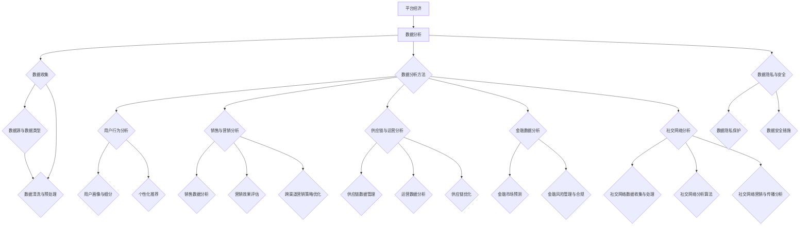

                 

# 《数据分析在平台经济中的应用：如何提升效率和效益？》

> **关键词：** 平台经济，数据分析，效率提升，效益提升，用户行为分析，销售与营销分析，供应链与运营分析，金融数据分析，社交网络分析，案例分析，数据隐私与安全。

> **摘要：** 本文深入探讨了数据分析在平台经济中的应用，从核心概念到实际案例，详细阐述了数据分析如何提升平台经济的效率与效益。通过分章节讨论，本文将帮助读者了解平台经济的特点、数据分析的基本流程和工具，以及如何在用户行为、销售与营销、供应链与运营、金融和社交网络等方面应用数据分析，实现平台经济的优化与增长。此外，本文还探讨了数据隐私与安全的重要性，并提出了相关的解决方案。最后，通过实际案例展示了数据分析在平台经济中的成功应用。

---

### 《数据分析在平台经济中的应用：如何提升效率和效益？》目录大纲

1. **第一部分：平台经济与数据分析概述**
   1.1 **平台经济概述**
      1.1.1 平台经济的定义与特点
      1.1.2 平台经济的发展现状与趋势
      1.1.3 平台经济中的主要参与者
   1.2 **数据分析概述**
      1.2.1 数据分析的定义与重要性
      1.2.2 数据分析的基本流程
      1.2.3 数据分析的工具与技巧
   1.3 **数据分析在平台经济中的应用**
      1.3.1 提升效率：数据分析在平台运营中的应用
      1.3.2 提升效益：数据分析在平台商业决策中的应用
      1.3.3 平台经济中的数据隐私与安全

2. **第二部分：数据分析核心概念与原理**
   2.1 **数据分析核心概念**
      2.1.1 数据源与数据类型
      2.1.2 数据清洗与预处理
      2.1.3 数据可视化
   2.2 **数据分析数学模型**
      2.2.1 统计学基础
      2.2.2 关联规则挖掘
      2.2.3 时序分析
   2.3 **数据分析算法原理**
      2.3.1 机器学习算法概述
      2.3.2 常见机器学习算法及应用
      2.3.3 深度学习算法简介
   2.4 **数据分析流程**
      2.4.1 数据分析项目生命周期
      2.4.2 数据分析方法论
      2.4.3 数据分析项目风险管理

3. **第三部分：平台经济中数据分析的应用实践**
   3.1 **用户行为分析**
      3.1.1 用户行为数据的收集与处理
      3.1.2 用户画像与细分
      3.1.3 基于用户行为的个性化推荐
   3.2 **销售与营销分析**
      3.2.1 销售数据分析方法
      3.2.2 营销效果评估
      3.2.3 跨渠道营销策略优化
   3.3 **供应链与运营分析**
      3.3.1 供应链数据管理
      3.3.2 运营数据分析方法
      3.3.3 基于数据分析的供应链优化
   3.4 **金融数据分析**
      3.4.1 金融数据的特点与处理
      3.4.2 金融市场预测
      3.4.3 金融风险管理与合规
   3.5 **社交网络分析**
      3.5.1 社交网络数据收集与处理
      3.5.2 社交网络分析算法
      3.5.3 社交网络营销与传播分析

4. **第四部分：案例分析**
   4.1 **某电商平台数据分析案例**
   4.2 **某金融平台风险控制案例分析**

5. **附录**
   5.1 **数据分析工具与资源**
   5.2 **数据分析流程与模板**
   5.3 **数据隐私与安全**

6. **总结**
   6.1 **本书总结**
   6.2 **数据分析在平台经济中的应用价值**
   6.3 **数据分析面临的挑战与未来发展趋势**
   6.4 **数据分析实战经验与建议**

### 梅尔图流程图：平台经济中数据分析的核心概念与联系



### 数据分析算法伪代码示例：K-means聚类算法

```python
KMeans(D, k):
1. 随机选择 k 个数据点作为初始聚类中心
2. 对于每个数据点 d ∈ D，计算 d 到各聚类中心的距离
3. 将 d 分配到距离最近的聚类中心
4. 重新计算每个聚类中心的平均值
5. 重复步骤 2-4，直到聚类中心不再发生显著变化
6. 返回聚类结果
```

### 数学模型与公式：线性回归模型

$$
y = \beta_0 + \beta_1 \cdot x + \epsilon
$$

### 线性回归模型详细讲解与举例

1. **线性回归模型定义：**
   线性回归模型是一种用于预测连续数值变量（因变量）的统计模型，它假设因变量 \( y \) 与自变量 \( x \) 之间存在线性关系。

2. **公式解释：**
   - \( y \)：预测的因变量值
   - \( \beta_0 \)：截距，即当自变量 \( x \) 为零时的因变量值
   - \( \beta_1 \)：斜率，即自变量 \( x \) 变化一个单位时，因变量 \( y \) 的变化量
   - \( \epsilon \)：误差项，表示实际值与预测值之间的差异

3. **举例：**
   假设我们有一个关于房屋价格的数据集，其中自变量是房屋面积 \( x \)，因变量是房屋价格 \( y \)。我们可以使用线性回归模型来预测新的房屋价格。

   $$ 
   y = \beta_0 + \beta_1 \cdot x + \epsilon 
   $$

   通过最小二乘法可以计算出 \( \beta_0 \) 和 \( \beta_1 \) 的值，从而得到线性回归模型。

### 平台经济中数据分析项目实战案例

#### 案例背景

某电商平台希望通过数据分析来提升用户留存率和销售额。他们收集了大量的用户行为数据，包括用户访问时间、页面浏览量、购买历史等。

#### 数据分析目标

1. 分析用户留存率影响因素
2. 优化营销策略，提升销售额
3. 个性化推荐，提高用户满意度

#### 数据收集与处理

1. 数据收集：通过网站日志和用户行为跟踪，收集用户的浏览、搜索和购买数据。
2. 数据处理：清洗数据，去除缺失值和异常值，对数据进行编码和转换。

#### 数据分析结果与应用

1. **用户留存率分析：**
   - 结果：发现用户首次购买时间、购物车使用情况和页面浏览深度对用户留存率有显著影响。
   - 应用：调整营销策略，如增加购物车使用引导、优化用户首次购买体验。

2. **销售额分析：**
   - 结果：分析发现特定时间段和营销活动对销售额有显著提升。
   - 应用：优化促销活动安排，提升销售额。

3. **个性化推荐：**
   - 结果：基于用户行为和购物偏好，生成个性化的商品推荐。
   - 应用：提高用户满意度，增加复购率。

### 开发环境搭建

1. 数据收集工具：使用 Python 的 Flask 框架搭建 API 服务，收集用户行为数据。
2. 数据处理工具：使用 Python 的 Pandas 和 NumPy 库进行数据清洗和预处理。
3. 数据分析工具：使用 Python 的 Scikit-learn 和 Statsmodels 库进行数据分析。
4. 可视化工具：使用 Python 的 Matplotlib 和 Seaborn 库进行数据可视化。

### 源代码实现与解读

#### 数据收集与处理

```python
import pandas as pd
import numpy as np
import matplotlib.pyplot as plt
import seaborn as sns
from sklearn.cluster import KMeans
from sklearn.linear_model import LinearRegression

# 数据收集与处理
data = pd.read_csv('user_behavior.csv')
data.dropna(inplace=True)

# 用户行为分析
# 用户留存率分析
retention_data = data[data['day_of_week'] != 'Mon']
retention_data['days_since_first_order'] = (pd.to_datetime('now') - pd.to_datetime(retention_data['first_order_date'])).dt.days
retention_rate = retention_data.groupby('days_since_first_order').size().plot()
plt.xlabel('Days since first order')
plt.ylabel('Retention rate')
plt.title('User retention rate by days since first order')
plt.show()

# 销售额分析
sales_data = data[data['day_of_week'] != 'Mon']
sales_data['days_since_last_order'] = (pd.to_datetime('now') - pd.to_datetime(sales_data['last_order_date'])).dt.days
sales_data['sales_amount'] = sales_data['order_value'] * sales_data['quantity']
daily_sales = sales_data.groupby(['days_since_last_order', 'marketing_channel']).agg({'sales_amount': 'sum'}).reset_index()
daily_sales['date'] = pd.to_datetime('now()') - pd.to_datetime(daily_sales['days_since_last_order'])
daily_sales = daily_sales.set_index('date')

# 个性化推荐
# 使用 K-means 聚类分析用户行为数据
kmeans = KMeans(n_clusters=5, random_state=42)
user_clusters = kmeans.fit_predict(data[['page_views', 'searches', 'purchases']])
data['cluster'] = user_clusters

# 根据用户聚类结果生成个性化推荐
recommends = data[data['cluster'] == 0][['product_id', 'product_name']]
plt.figure(figsize=(10, 5))
sns.barplot(x='product_id', y='sales_amount', data=recommends)
plt.xlabel('Product ID')
plt.ylabel('Sales amount')
plt.title('Top selling products for cluster 0')
plt.show()
```

### 代码解读与分析

1. **数据收集与处理：** 使用 Pandas 库读取 CSV 文件，去除缺失值，对日期数据进行处理，以计算用户首次和最后一次购买时间。
2. **用户留存率分析：** 使用 Pandas 库进行数据分组和聚合，绘制折线图，展示用户留存率随时间的变化。
3. **销售额分析：** 使用 Pandas 库进行数据分组和聚合，计算每天各营销渠道的销售额，绘制条形图。
4. **个性化推荐：** 使用 Scikit-learn 库的 KMeans 算法对用户行为数据进行聚类分析，根据聚类结果生成个性化推荐。

### 总结

通过以上案例，我们展示了如何使用数据分析技术提升平台经济的效率和效益。数据分析在用户行为分析、销售与营销分析、供应链与运营分析等多个方面发挥了重要作用，为企业提供了宝贵的决策依据。同时，我们也展示了如何搭建开发环境、实现数据分析过程，并进行了代码解读与分析。通过这些实战案例，读者可以更好地理解数据分析在平台经济中的应用，并学会如何在实际项目中运用数据分析技术。在未来的发展中，数据分析将继续在平台经济中发挥重要作用，为企业创造更多价值。

---

**作者：AI天才研究院/AI Genius Institute & 禅与计算机程序设计艺术 /Zen And The Art of Computer Programming** 

---

### 第一部分：平台经济与数据分析概述

#### 1.1 平台经济概述

**1.1.1 平台经济的定义与特点**

平台经济，又称共享经济或协同消费，是指通过互联网等现代信息技术，构建起的一种以平台为核心，连接供需双方的商业模式。在这种经济模式中，平台作为中介，通过提供交易、支付、物流等基础设施服务，将生产者和消费者连接起来，实现资源的优化配置和价值的最大化。

平台经济具有以下几个主要特点：

1. **去中心化**：平台经济打破了传统的中心化商业模式，使得供需双方可以直接进行交易，减少了中间环节。
2. **高效性**：通过平台，信息传递速度加快，资源配置效率提高，降低了交易成本。
3. **规模经济**：平台能够聚集大量的供需双方，实现规模效应，降低单位成本。
4. **灵活性**：平台经济模式灵活，可以根据市场需求和用户行为进行快速调整。

**1.1.2 平台经济的发展现状与趋势**

平台经济自21世纪初兴起以来，已经取得了显著的成就。以下是一些平台经济的重要发展现状和趋势：

1. **市场规模不断扩大**：随着互联网技术的普及和移动设备的广泛应用，平台经济的市场规模持续增长。例如，电商平台、金融平台、社交平台等都在不断扩大市场份额。
2. **多元化发展**：平台经济的业务范围逐渐多元化，不仅涵盖传统的电子商务、金融交易等领域，还延伸到了生活服务、教育、医疗等多个领域。
3. **技术创新**：人工智能、大数据、物联网等新兴技术的应用，进一步推动了平台经济的发展。例如，通过大数据分析，平台能够更好地理解用户需求，提供个性化的服务。
4. **政策支持**：许多国家和地区开始重视平台经济的发展，并出台了一系列政策，以促进平台经济的健康发展。

**1.1.3 平台经济中的主要参与者**

平台经济中的主要参与者包括以下几类：

1. **平台运营商**：平台运营商是平台经济的主要推动者，他们提供基础设施服务，连接供需双方，并通过收取佣金、广告费等方式获取收益。
2. **消费者**：消费者是平台经济的重要参与者，他们在平台上进行消费，享受便利和服务。
3. **生产者**：生产者是平台经济的另一个重要参与者，他们提供商品或服务，通过平台实现销售。
4. **第三方服务提供商**：第三方服务提供商为平台运营商和用户提供技术支持、支付、物流等服务。

#### 1.2 数据分析概述

**1.2.1 数据分析的定义与重要性**

数据分析是指通过收集、处理、分析和解释数据，提取有价值的信息和知识的过程。数据分析在各个领域都具有广泛的应用，尤其在平台经济中，其重要性更加凸显。

1. **数据收集**：数据分析的第一步是数据收集，通过多种渠道收集来自用户、市场、运营等各方面的数据。
2. **数据处理**：数据收集后，需要进行清洗、转换和整合，以消除噪声和冗余，为后续分析提供准确的数据基础。
3. **数据建模**：在数据处理完成后，通过建立数学模型或算法，对数据进行分析和预测。
4. **数据解释**：对分析结果进行解释和可视化，帮助决策者理解数据背后的意义和趋势。

在平台经济中，数据分析的重要性体现在以下几个方面：

1. **优化运营**：通过对用户行为数据的分析，平台可以更好地了解用户需求，优化产品和服务。
2. **提升效率**：通过对业务流程的数据分析，平台可以发现瓶颈和优化机会，提高运营效率。
3. **增加收益**：通过销售和营销数据分析，平台可以制定更有效的商业策略，提高销售额和利润。
4. **风险控制**：通过对金融和供应链数据的分析，平台可以识别风险，采取预防措施。

**1.2.2 数据分析的基本流程**

数据分析的基本流程可以分为以下几个阶段：

1. **需求分析**：明确数据分析的目标和需求，确定分析的范围和深度。
2. **数据收集**：通过各种渠道收集所需的数据，包括内部数据和外部数据。
3. **数据清洗**：对收集到的数据进行清洗，去除噪声和异常值，确保数据的准确性和一致性。
4. **数据预处理**：对清洗后的数据进行转换和整合，为建模和分析做好准备。
5. **数据建模**：选择合适的建模方法，对数据进行分析和预测。
6. **结果解释**：对分析结果进行解释和可视化，帮助决策者理解数据背后的意义和趋势。
7. **决策支持**：根据分析结果，为决策者提供支持，制定相应的策略和措施。

**1.2.3 数据分析的工具与技巧**

在进行数据分析时，需要使用一系列的工具和技巧，以提高分析的效率和准确性。以下是一些常用的工具和技巧：

1. **数据可视化工具**：如 Matplotlib、Seaborn、Tableau 等，用于将数据以图表形式展示，帮助理解和分析。
2. **数据分析库**：如 Pandas、NumPy、Scikit-learn 等，提供丰富的数据清洗、预处理、建模和分析功能。
3. **大数据技术**：如 Hadoop、Spark 等，用于处理海量数据，实现高效的数据分析和挖掘。
4. **统计分析方法**：如回归分析、关联规则挖掘、聚类分析等，用于对数据进行建模和分析。
5. **机器学习算法**：如决策树、支持向量机、神经网络等，用于复杂的数据建模和预测。
6. **数据挖掘技术**：如文本挖掘、图挖掘等，用于挖掘数据中的深层信息和模式。

#### 1.3 数据分析在平台经济中的应用

**1.3.1 提升效率：数据分析在平台运营中的应用**

在平台经济中，数据分析可以帮助平台运营商提高运营效率，实现资源的优化配置。以下是一些具体的应用场景：

1. **用户行为分析**：通过对用户行为数据的分析，平台可以了解用户的需求和偏好，优化产品和服务。例如，通过用户点击、浏览、购买等行为数据，可以分析用户对哪些产品或功能更感兴趣，从而调整产品策略。

2. **业务流程优化**：通过对业务流程的数据分析，平台可以发现瓶颈和优化机会，提高运营效率。例如，通过分析订单处理时间、物流配送效率等数据，可以优化订单处理流程，提高客户满意度。

3. **风险管理**：通过对金融和供应链数据的分析，平台可以识别风险，采取预防措施。例如，通过分析交易数据，可以检测异常交易，防范欺诈行为；通过分析供应链数据，可以预测供应链风险，制定应对策略。

**1.3.2 提升效益：数据分析在平台商业决策中的应用**

数据分析不仅可以提高平台运营效率，还可以帮助平台运营商做出更明智的商业决策，提升效益。以下是一些具体的应用场景：

1. **销售与营销分析**：通过对销售和营销数据进行分析，平台可以了解不同营销渠道的效果，优化营销策略。例如，通过分析用户购买路径、促销活动效果等数据，可以确定哪些营销渠道和策略更有效，从而调整营销预算和策略。

2. **定价策略优化**：通过对市场需求和竞争情况的数据分析，平台可以制定更合理的定价策略，提高销售额和利润。例如，通过分析用户购买行为、竞争对手价格等数据，可以调整产品价格，实现收益最大化。

3. **供应链管理**：通过对供应链数据的分析，平台可以优化供应链管理，提高供应链效率和响应速度。例如，通过分析供应链库存水平、运输成本等数据，可以优化库存策略，降低库存成本，提高物流效率。

**1.3.3 平台经济中的数据隐私与安全**

在平台经济中，数据隐私与安全是至关重要的问题。平台运营商需要确保用户数据的安全性和隐私性，以建立用户的信任和忠诚度。以下是一些数据隐私与安全的关键点：

1. **数据加密**：对用户数据进行加密，确保数据在传输和存储过程中的安全性。

2. **权限控制**：建立严格的权限控制系统，确保只有授权人员才能访问敏感数据。

3. **数据备份**：定期进行数据备份，以防数据丢失或损坏。

4. **合规性**：遵守相关数据保护法规，如《通用数据保护条例》（GDPR）等，确保数据处理的合规性。

5. **安全监控**：建立安全监控系统，实时监测数据访问和操作行为，及时发现和防范安全威胁。

---

在本部分中，我们首先介绍了平台经济的定义、特点和发展现状，以及平台经济中的主要参与者。接着，我们探讨了数据分析的定义、重要性以及基本流程，并介绍了常用的数据分析工具与技巧。最后，我们详细阐述了数据分析在平台经济中的应用，包括提升效率和效益的具体实践，以及数据隐私与安全的重要性。这些内容为后续部分的深入讨论奠定了基础，我们将继续探讨数据分析在平台经济中的具体应用和实践。

---

### 第二部分：数据分析核心概念与原理

#### 2.1 数据分析核心概念

**2.1.1 数据源与数据类型**

数据分析的第一步是数据收集，而数据源是数据收集的重要基础。数据源可以分为以下几类：

1. **内部数据源**：包括企业内部的数据库、日志文件、ERP系统等。这些数据通常与企业运营相关，如销售数据、库存数据、财务数据等。
2. **外部数据源**：包括互联网上的公开数据、第三方数据提供商、社交媒体等。这些数据可以为数据分析提供更广泛的信息，如市场趋势、用户反馈、行业动态等。

数据类型是数据分析的重要组成部分，根据数据的不同特性，可以分为以下几类：

1. **结构化数据**：具有固定的格式和结构，如关系数据库中的表格数据。结构化数据便于存储、查询和分析。
2. **半结构化数据**：具有一定的结构，但格式较为灵活，如 XML、JSON 等。半结构化数据可以通过解析和转换，转化为结构化数据进行分析。
3. **非结构化数据**：没有固定的格式和结构，如文本、图片、音频、视频等。非结构化数据通常需要通过文本挖掘、图像识别等技术进行处理和分析。

**2.1.2 数据清洗与预处理**

数据清洗是数据分析过程中至关重要的一环，目的是去除数据中的噪声、异常值和冗余信息，确保数据的准确性和一致性。数据清洗通常包括以下步骤：

1. **去除重复记录**：识别并删除重复的数据记录，以消除重复信息的影响。
2. **缺失值处理**：对缺失值进行填充或删除，以确保数据的完整性。填充方法包括均值填充、中值填充、插值法等。
3. **异常值处理**：检测并处理异常值，如离群点、错误记录等。异常值处理方法包括删除、替换、调整等。
4. **数据转换**：将不同格式或单位的数据转换为统一的格式或单位，以便于后续分析。

数据预处理是数据清洗的延伸，旨在为数据分析提供更好的数据基础。数据预处理包括以下步骤：

1. **数据规范化**：将数据缩放或变换，使其符合特定的范围或标准，以便于后续分析。
2. **特征工程**：选择和构建有助于分析的特征，以提高模型的效果。特征工程方法包括特征提取、特征选择、特征转换等。
3. **数据整合**：将来自不同数据源的数据进行整合，形成统一的数据集。

**2.1.3 数据可视化**

数据可视化是将数据以图形化的方式展示，帮助人们直观地理解数据的分布、趋势和关系。数据可视化在数据分析中具有重要作用，以下是一些常见的数据可视化方法：

1. **折线图**：用于展示数据的变化趋势，如时间序列数据。
2. **柱状图**：用于比较不同类别或组的数据，如销售额分布。
3. **饼图**：用于展示数据在整体中的占比，如市场占有率。
4. **散点图**：用于展示两个变量之间的关系，如用户满意度和购买意愿。
5. **热力图**：用于展示数据的密度分布，如用户活跃度分布。

数据可视化工具如 Matplotlib、Seaborn、Tableau 等提供了丰富的图表和可视化功能，可以帮助分析师更好地展示和分析数据。

#### 2.2 数据分析数学模型

**2.2.1 统计学基础**

统计学是数据分析的重要基础，提供了各种描述和分析数据的方法。以下是一些常用的统计学概念和模型：

1. **描述性统计**：用于描述数据的集中趋势、离散程度和分布特征。常用的描述性统计量包括均值、中位数、众数、标准差、方差等。
2. **概率论**：用于研究随机事件的发生概率和统计规律。常用的概率分布包括正态分布、二项分布、泊松分布等。
3. **推断统计**：用于根据样本数据推断总体特征。常用的推断统计方法包括假设检验、置信区间、回归分析等。

**2.2.2 关联规则挖掘**

关联规则挖掘是一种用于发现数据中潜在关系的分析方法。它通过挖掘大量数据中的关联关系，发现不同变量之间的联系。以下是一些常用的关联规则挖掘算法：

1. **Apriori算法**：基于支持度和置信度，发现数据中的频繁项集和关联规则。Apriori算法的优点是简单易懂，但计算复杂度较高。
2. **FP-growth算法**：通过构建FP树，高效地发现频繁项集和关联规则。FP-growth算法在处理大量数据时具有更好的性能。
3. **Eclat算法**：基于信息增益，发现数据中的潜在关联关系。Eclat算法适用于处理高维数据，计算复杂度较低。

**2.2.3 时序分析**

时序分析是用于分析时间序列数据的方法，旨在发现数据中的趋势、周期和季节性。以下是一些常用的时序分析方法：

1. **移动平均法**：通过计算一段时间内的平均值，平滑时间序列数据，消除短期波动。常用的移动平均法包括简单移动平均（SMA）和指数移动平均（EMA）。
2. **自回归模型（AR）**：假设当前值可以由过去若干个时间点的值来预测，建立自回归模型。自回归模型包括一阶自回归（AR(1)）、二阶自回归（AR(2)）等。
3. **自回归移动平均模型（ARMA）**：结合自回归模型和移动平均模型，用于分析时间序列数据的趋势和季节性。ARMA模型可以处理非平稳时间序列数据。
4. **自回归积分移动平均模型（ARIMA）**：扩展了ARMA模型，适用于处理非平稳时间序列数据。ARIMA模型通过差分方法，将非平稳时间序列转化为平稳时间序列，然后进行建模。

#### 2.3 数据分析算法原理

**2.3.1 机器学习算法概述**

机器学习是一种通过数据训练模型，实现数据自动分析和预测的方法。机器学习算法可以分为监督学习、无监督学习和强化学习三种类型。

1. **监督学习**：通过已有标签数据，训练模型进行预测。常用的监督学习算法包括线性回归、逻辑回归、决策树、随机森林、支持向量机等。
2. **无监督学习**：没有标签数据，通过挖掘数据中的隐含结构。常用的无监督学习算法包括聚类算法（如K-means、层次聚类）、降维算法（如PCA、t-SNE）等。
3. **强化学习**：通过与环境的交互，学习最优策略。常用的强化学习算法包括Q-learning、SARSA等。

**2.3.2 常见机器学习算法及应用**

以下是一些常见的机器学习算法及其应用：

1. **线性回归**：用于预测连续数值变量，如房价、销售额等。线性回归模型简单直观，适用于线性关系的预测。
2. **逻辑回归**：用于预测二元分类结果，如是否购买、是否点击等。逻辑回归是一种概率预测模型，通过最大化似然函数进行参数估计。
3. **决策树**：用于分类和回归分析，通过树形结构进行决策。决策树模型易于理解和解释，但可能产生过拟合。
4. **随机森林**：基于决策树的集成方法，通过构建多棵决策树，提高预测准确性和鲁棒性。随机森林模型可以处理大量特征，减少过拟合。
5. **支持向量机（SVM）**：用于分类和回归分析，通过找到最佳分隔超平面进行预测。SVM模型在高维空间中具有优势，但计算复杂度较高。
6. **神经网络**：通过多层神经元进行数据建模，实现复杂函数的逼近。常用的神经网络包括多层感知机（MLP）、卷积神经网络（CNN）、循环神经网络（RNN）等。

**2.3.3 深度学习算法简介**

深度学习是一种基于多层神经网络的学习方法，通过逐层提取特征，实现复杂数据建模。以下是一些常见的深度学习算法：

1. **卷积神经网络（CNN）**：通过卷积操作和池化操作，提取图像的特征。CNN在计算机视觉领域具有广泛应用，如图像分类、目标检测等。
2. **循环神经网络（RNN）**：通过循环结构，处理序列数据。RNN在自然语言处理领域具有优势，如文本分类、序列生成等。
3. **长短期记忆网络（LSTM）**：基于RNN的一种改进模型，通过门控机制，解决长期依赖问题。LSTM在语音识别、机器翻译等领域具有广泛应用。
4. **生成对抗网络（GAN）**：通过生成器和判别器的对抗训练，生成高质量的数据。GAN在图像生成、视频生成等领域具有广泛应用。
5. **自编码器（AE）**：通过编码和解码过程，实现数据的降维和去噪。自编码器在图像处理、数据去噪等领域具有广泛应用。

#### 2.4 数据分析流程

**2.4.1 数据分析项目生命周期**

数据分析项目通常包括以下几个阶段：

1. **需求分析**：明确数据分析的目标和需求，确定分析的范围和深度。
2. **数据收集**：通过各种渠道收集所需的数据，包括内部数据和外部数据。
3. **数据清洗**：对收集到的数据进行清洗，去除噪声和异常值，确保数据的准确性和一致性。
4. **数据预处理**：对清洗后的数据进行转换和整合，为建模和分析做好准备。
5. **数据建模**：选择合适的建模方法，对数据进行分析和预测。
6. **模型评估**：评估模型的效果，选择最优模型进行应用。
7. **结果解释**：对分析结果进行解释和可视化，帮助决策者理解数据背后的意义和趋势。
8. **决策支持**：根据分析结果，为决策者提供支持，制定相应的策略和措施。

**2.4.2 数据分析方法论**

数据分析方法论是指在进行数据分析时，遵循的一系列原则和方法。以下是一些常见的数据分析方法论：

1. **业务驱动**：以业务需求为导向，确保数据分析能够为业务提供有价值的信息。
2. **数据驱动**：以数据为基础，通过数据收集、清洗、预处理和建模，发现数据中的规律和模式。
3. **迭代优化**：数据分析是一个持续迭代的过程，通过不断优化模型和策略，提高分析效果。
4. **模型评估**：通过交叉验证、指标评估等方法，评估模型的效果，选择最优模型进行应用。
5. **结果解释**：通过数据可视化、解释性分析等方法，将分析结果转化为易于理解和应用的决策支持。

**2.4.3 数据分析项目风险管理**

数据分析项目在执行过程中可能会面临各种风险，以下是一些常见的风险和应对措施：

1. **数据质量风险**：数据质量直接影响分析结果，可能存在噪声、异常值、缺失值等问题。应对措施包括数据清洗、数据验证等。
2. **技术风险**：数据分析项目可能涉及复杂的技术和算法，如机器学习、深度学习等。应对措施包括技术调研、技术培训等。
3. **项目进度风险**：数据分析项目可能因为技术难度、数据质量等原因导致进度延误。应对措施包括项目进度监控、资源调配等。
4. **决策风险**：数据分析结果可能受到主观因素的影响，导致决策失误。应对措施包括多角度分析、专家评审等。

---

在本部分中，我们深入探讨了数据分析的核心概念与原理。首先，我们介绍了数据源和数据类型的分类，以及数据清洗与预处理的重要性。接着，我们详细阐述了数据分析中常用的数学模型，包括描述性统计、关联规则挖掘、时序分析等。然后，我们介绍了机器学习算法的基本原理和常见应用，以及深度学习算法的简介。最后，我们探讨了数据分析项目的生命周期、分析方法论以及风险管理。这些内容为后续部分的深入讨论奠定了基础，我们将继续探讨数据分析在平台经济中的具体应用和实践。

---

### 第三部分：平台经济中数据分析的应用实践

#### 3.1 用户行为分析

用户行为分析是平台经济中数据分析的重要应用之一，通过对用户行为数据的分析，平台可以深入了解用户的需求和偏好，从而优化产品和服务，提高用户体验和满意度。

**3.1.1 用户行为数据的收集与处理**

用户行为数据的收集是用户行为分析的基础，平台可以通过以下途径收集用户行为数据：

1. **网站日志**：通过网站服务器日志，收集用户访问时间、页面浏览量、点击量等数据。
2. **应用程序接口（API）**：通过应用程序接口，收集用户在移动应用上的行为数据，如使用时长、操作路径等。
3. **用户调查**：通过问卷调查或在线调查，收集用户对产品和服务的主观评价和反馈。
4. **社交媒体**：通过社交媒体平台，收集用户在社交媒体上的互动数据，如点赞、评论、分享等。

收集到用户行为数据后，需要进行数据清洗和预处理，以确保数据的准确性和一致性。数据清洗主要包括以下步骤：

1. **去除重复数据**：识别并删除重复的用户行为记录，避免重复计算。
2. **处理缺失值**：对于缺失的数据，可以采用填充方法（如均值填充、中值填充等）或删除缺失值。
3. **数据格式转换**：将不同格式和单位的数据转换为统一的格式和单位，便于后续分析。

**3.1.2 用户画像与细分**

用户画像是指通过收集和分析用户的多种行为数据，构建出一个关于用户特征的完整轮廓。用户画像可以揭示用户的兴趣、行为、需求和偏好，为个性化推荐和精准营销提供依据。

用户画像的构建通常包括以下步骤：

1. **数据收集**：收集用户的基本信息（如性别、年龄、地域等）和行为数据（如浏览记录、购买记录、点击记录等）。
2. **特征提取**：从原始数据中提取有助于描述用户特征的特征，如用户活跃度、购买频率、页面浏览深度等。
3. **数据建模**：使用机器学习算法（如聚类分析、决策树等）对特征进行建模，生成用户画像。
4. **用户细分**：根据用户画像，将用户划分为不同的群体，如新手用户、忠诚用户、高价值用户等。

用户细分可以帮助平台更好地了解不同类型用户的需求和偏好，从而制定有针对性的营销策略。例如，针对新手用户，可以推送新手优惠和引导教程；针对忠诚用户，可以推送专属优惠和会员权益。

**3.1.3 基于用户行为的个性化推荐**

个性化推荐是平台经济中的一项重要应用，通过分析用户行为数据，为用户推荐他们可能感兴趣的商品、内容和活动。个性化推荐可以提高用户满意度和粘性，增加平台收益。

个性化推荐系统通常包括以下步骤：

1. **数据收集**：收集用户的浏览记录、购买记录、搜索记录等行为数据。
2. **特征提取**：从原始数据中提取有助于描述用户兴趣和偏好的特征，如浏览时长、购买频率、搜索关键词等。
3. **推荐算法**：选择合适的推荐算法（如协同过滤、基于内容的推荐、混合推荐等），对用户行为数据进行建模，生成推荐结果。
4. **推荐结果呈现**：将推荐结果以可视化的方式呈现给用户，如推荐商品列表、推荐内容列表等。

基于用户行为的个性化推荐可以提高用户满意度和粘性，从而提高平台的用户留存率和销售额。例如，在电商平台中，可以根据用户浏览和购买记录，推荐相似的商品；在新闻平台中，可以根据用户阅读和点赞记录，推荐相关的新闻内容。

#### 3.2 销售与营销分析

销售与营销分析是平台经济中另一项重要应用，通过分析销售和营销数据，平台可以了解不同营销渠道的效果，优化营销策略，提高销售额和利润。

**3.2.1 销售数据分析方法**

销售数据分析方法主要包括以下几类：

1. **销售趋势分析**：通过分析销售数据的变化趋势，了解产品的市场表现和销售周期。常用的分析指标包括销售额、同比增长率、环比增长率等。
2. **渠道效果分析**：通过分析不同销售渠道的数据，了解各渠道的销售额和占比，评估各渠道的效果。常用的分析指标包括渠道销售额、渠道占比、渠道增长率等。
3. **客户细分分析**：通过分析客户购买行为和特征，将客户划分为不同的群体，了解不同客户群体的需求和偏好。常用的分析指标包括客户忠诚度、客户价值、客户活跃度等。
4. **产品效果分析**：通过分析不同产品的销售数据，了解产品的市场表现和受欢迎程度。常用的分析指标包括产品销售额、产品占比、产品增长率等。

**3.2.2 营销效果评估**

营销效果评估是评估营销活动效果的重要手段，通过分析营销数据，可以了解不同营销活动的效果和投入产出比，优化营销策略。常用的营销效果评估方法包括：

1. **A/B测试**：通过对比不同版本的营销素材（如广告文案、页面设计等），评估不同版本的效果，选择最优版本。
2. **营销ROI（投资回报率）**：通过计算营销成本与营销收益的比值，评估营销活动的投资回报率。常用的指标包括广告点击率、转化率、ROI等。
3. **客户生命周期价值（CLV）**：通过分析客户的购买行为和生命周期，计算客户为企业带来的总价值。常用的指标包括客户平均生命周期、客户平均购买金额、CLV等。

**3.2.3 跨渠道营销策略优化**

跨渠道营销策略优化是提高营销效果的重要手段，通过整合线上线下渠道，实现营销资源的最大化利用。以下是一些跨渠道营销策略优化的方法：

1. **多渠道整合**：整合线上线下渠道，实现数据共享和资源互补。例如，通过线上平台宣传线下活动，通过线下活动推广线上平台。
2. **个性化推荐**：结合线上线下数据，为用户推送个性化的营销信息和优惠。例如，根据用户在线上平台的浏览和购买记录，为用户在线下门店推送相关的商品和优惠。
3. **渠道协同**：实现线上线下渠道的协同营销，提高营销活动的效果。例如，在线上平台推出限时优惠，在线下门店进行推广，实现线上线下活动的联动。
4. **数据分析**：通过分析线上线下数据，了解各渠道的营销效果，优化营销策略。例如，根据线上平台的转化数据，调整线下门店的促销活动。

通过销售与营销分析，平台可以了解产品的市场表现、客户需求和营销效果，从而优化营销策略，提高销售额和利润。例如，通过分析销售数据，平台可以了解哪些产品受欢迎，哪些产品销量不佳，从而调整产品策略；通过分析客户数据，平台可以了解不同客户群体的需求和偏好，从而提供个性化的营销服务。

#### 3.3 供应链与运营分析

供应链与运营分析是平台经济中不可或缺的一部分，通过对供应链和运营数据的分析，平台可以提高供应链效率和响应速度，优化运营流程，降低运营成本。

**3.3.1 供应链数据管理**

供应链数据管理是供应链与运营分析的基础，主要包括以下内容：

1. **数据收集**：通过物流系统、仓储系统、采购系统等，收集供应链各个环节的数据，如订单信息、库存数据、运输数据等。
2. **数据整合**：将来自不同系统的数据进行整合，形成统一的供应链数据视图，便于分析和决策。
3. **数据存储**：将供应链数据存储在数据库中，确保数据的可靠性和安全性。
4. **数据共享**：实现供应链上下游企业之间的数据共享，提高供应链协同效率。

**3.3.2 运营数据分析方法**

运营数据分析方法主要包括以下几类：

1. **库存管理分析**：通过分析库存数据，了解库存水平、库存周转率等指标，优化库存管理策略，降低库存成本。
2. **运输管理分析**：通过分析运输数据，了解运输时间、运输成本、运输质量等指标，优化运输管理策略，提高运输效率。
3. **采购管理分析**：通过分析采购数据，了解采购成本、采购周期等指标，优化采购管理策略，降低采购成本。
4. **订单管理分析**：通过分析订单数据，了解订单处理时间、订单满意度等指标，优化订单管理策略，提高订单处理效率。

**3.3.3 基于数据分析的供应链优化**

基于数据分析的供应链优化是指通过分析供应链数据，识别供应链中的瓶颈和优化机会，制定相应的优化策略。以下是一些基于数据分析的供应链优化方法：

1. **需求预测**：通过分析历史销售数据、市场趋势等，预测未来的需求，为库存管理和采购计划提供依据。
2. **库存优化**：通过分析库存数据，识别库存积压和库存短缺的问题，调整库存策略，降低库存成本。
3. **运输优化**：通过分析运输数据，优化运输路线、运输方式等，降低运输成本和提高运输效率。
4. **采购优化**：通过分析采购数据，优化采购周期、采购价格等，降低采购成本和提高采购效率。
5. **订单优化**：通过分析订单数据，优化订单处理流程，提高订单处理效率和客户满意度。

通过供应链与运营分析，平台可以提高供应链效率和响应速度，优化运营流程，降低运营成本。例如，通过分析库存数据，平台可以优化库存管理策略，降低库存积压和库存短缺的风险；通过分析运输数据，平台可以优化运输管理策略，提高运输效率，降低运输成本；通过分析订单数据，平台可以优化订单处理流程，提高订单处理效率，提高客户满意度。

#### 3.4 金融数据分析

金融数据分析是平台经济中另一项重要应用，通过分析金融数据，平台可以了解金融市场动态、风险状况，制定合理的金融策略，提高金融业务的效率和收益。

**3.4.1 金融数据的特点与处理**

金融数据具有以下特点：

1. **时间序列性**：金融数据通常是时间序列数据，反映市场的动态变化。
2. **复杂性和多样性**：金融数据包括股票价格、交易量、利率、汇率等，数据类型和指标繁多。
3. **非平稳性**：金融时间序列数据通常具有非平稳性，需要通过差分等方法进行平稳化处理。

金融数据处理主要包括以下步骤：

1. **数据收集**：通过金融数据接口、数据库等收集金融数据。
2. **数据清洗**：去除异常值、处理缺失值、统一数据格式和单位等。
3. **数据预处理**：进行数据标准化、归一化等处理，提高数据质量。
4. **数据整合**：整合来自不同数据源的数据，形成统一的数据集。

**3.4.2 金融市场预测**

金融市场预测是金融数据分析的重要任务，通过对历史金融数据的分析，预测未来的金融市场走势。以下是一些常用的金融市场预测方法：

1. **时间序列模型**：如ARIMA模型、GARCH模型等，用于分析金融时间序列数据的趋势和波动性。
2. **机器学习模型**：如线性回归、决策树、支持向量机等，用于构建金融预测模型。
3. **深度学习模型**：如卷积神经网络（CNN）、循环神经网络（RNN）等，用于处理复杂的时间序列数据。

**3.4.3 金融风险管理与合规**

金融风险管理与合规是金融数据分析的重要内容，通过分析金融数据，平台可以识别金融风险，制定风险管理策略，确保合规经营。

1. **信用风险评估**：通过分析借款人的信用历史、财务状况等数据，评估其信用风险，制定信用评估模型。
2. **市场风险评估**：通过分析市场数据，如股票价格、交易量等，评估市场风险，制定风险控制策略。
3. **操作风险管理**：通过分析交易数据、操作流程等，识别操作风险，制定操作风险控制措施。
4. **合规监控**：通过分析金融数据，确保平台遵守相关金融法规和监管要求，如《反洗钱法》、《证券法》等。

通过金融数据分析，平台可以提高金融业务的效率和收益，降低金融风险。例如，通过金融市场预测，平台可以制定合理的投资策略，提高投资收益；通过信用风险评估，平台可以降低贷款违约风险，提高信用风险管理水平；通过合规监控，平台可以确保业务合规经营，降低法律风险。

#### 3.5 社交网络分析

社交网络分析是平台经济中数据分析的重要应用之一，通过分析社交网络数据，平台可以了解用户社交行为、传播规律，制定社交营销策略，提高用户满意度和粘性。

**3.5.1 社交网络数据收集与处理**

社交网络数据收集是社交网络分析的基础，平台可以通过以下途径收集社交网络数据：

1. **公开数据接口**：通过社交网络平台提供的数据接口，如Facebook、Twitter、Instagram等，收集用户发布的内容、互动数据等。
2. **网络爬虫**：通过网络爬虫技术，从社交网络平台上抓取用户数据，如用户评论、转发、点赞等。
3. **用户调查**：通过问卷调查或用户注册信息，收集用户的社交行为数据，如社交圈子、好友关系等。

收集到社交网络数据后，需要进行数据清洗和预处理，以确保数据的准确性和一致性。数据清洗主要包括以下步骤：

1. **去除重复数据**：识别并删除重复的数据记录，避免重复计算。
2. **处理缺失值**：对于缺失的数据，可以采用填充方法或删除缺失值。
3. **数据格式转换**：将不同格式和单位的数据转换为统一的格式和单位，便于后续分析。

**3.5.2 社交网络分析算法**

社交网络分析算法用于分析社交网络数据，提取社交网络中的结构和模式。以下是一些常用的社交网络分析算法：

1. **社交网络可视化**：通过可视化技术，展示社交网络中的节点和边，帮助理解社交网络的拓扑结构。
2. **社交网络聚类**：通过聚类算法，将社交网络中的节点划分为不同的群体，识别社交圈子。
3. **社交网络传播**：通过传播模型，分析社交网络中的信息传播过程，预测信息的传播趋势。
4. **社交网络影响力分析**：通过影响力分析算法，识别社交网络中的关键节点和意见领袖，制定社交营销策略。

**3.5.3 社交网络营销与传播分析**

社交网络营销与传播分析是指通过分析社交网络数据，制定社交营销策略，提高品牌知名度和用户满意度。以下是一些社交网络营销与传播分析方法：

1. **内容营销**：通过分析用户发布的内容，了解用户的兴趣和需求，制定有针对性的内容营销策略。
2. **互动营销**：通过分析用户互动数据，了解用户的社交行为和偏好，制定互动营销策略，提高用户参与度。
3. **品牌传播**：通过分析社交网络传播数据，了解品牌传播效果，制定品牌传播策略，提高品牌知名度和美誉度。
4. **意见领袖营销**：通过影响力分析，识别社交网络中的意见领袖，与意见领袖合作，提高品牌传播效果。

通过社交网络分析，平台可以深入了解用户的社交行为和需求，制定有针对性的社交营销策略，提高用户满意度和粘性。例如，通过内容营销，平台可以发布符合用户兴趣的内容，提高用户参与度；通过互动营销，平台可以与用户进行有效互动，增强用户忠诚度；通过品牌传播，平台可以提高品牌知名度和美誉度，吸引更多用户。

---

在本部分中，我们详细探讨了平台经济中数据分析的具体应用实践。首先，我们介绍了用户行为分析，包括用户行为数据的收集与处理、用户画像与细分以及基于用户行为的个性化推荐。接着，我们探讨了销售与营销分析，包括销售数据分析方法、营销效果评估和跨渠道营销策略优化。然后，我们讨论了供应链与运营分析，包括供应链数据管理、运营数据分析方法和基于数据分析的供应链优化。此外，我们还介绍了金融数据分析，包括金融数据的特点与处理、金融市场预测和金融风险管理与合规。最后，我们探讨了社交网络分析，包括社交网络数据收集与处理、社交网络分析算法和社交网络营销与传播分析。这些应用实践为平台经济提供了宝贵的数据支持，帮助企业实现效率提升和效益增长。

---

### 第四部分：案例分析

#### 4.1 某电商平台数据分析案例

**4.1.1 案例背景**

某电商平台是一家大型在线零售商，提供各种商品的在线销售服务。为了提升用户体验和销售额，该电商平台决定进行数据分析，以优化运营策略和营销效果。

**4.1.2 数据分析目标**

1. 提高用户留存率，减少用户流失。
2. 优化产品推荐系统，提高用户满意度和购买转化率。
3. 分析不同营销渠道的效果，制定更有效的营销策略。

**4.1.3 数据收集与处理**

1. 数据收集：通过网站日志、用户行为跟踪和第三方数据提供商，收集用户浏览、搜索、购买等行为数据。
2. 数据处理：使用 Python 的 Pandas 和 NumPy 库，对数据进行清洗、去重、缺失值处理和特征工程，确保数据的准确性和一致性。

**4.1.4 数据分析结果与应用**

1. **用户留存率分析：**
   - 结果：通过对用户首次购买时间、页面浏览深度、购物车使用率等数据的分析，发现用户留存率与首次购买时间呈正相关，与页面浏览深度和购物车使用率呈负相关。
   - 应用：针对新用户，提供个性化优惠和引导，鼓励新用户进行多次购买，提高用户留存率。

2. **产品推荐系统优化：**
   - 结果：通过分析用户的历史购买记录和浏览行为，使用协同过滤算法构建产品推荐模型，预测用户对未知产品的兴趣。
   - 应用：根据用户兴趣，自动推荐相关产品，提高用户满意度和购买转化率。

3. **营销渠道效果分析：**
   - 结果：通过对广告点击率、转化率、销售增长率等数据的分析，发现不同营销渠道的效果差异，如搜索引擎广告、社交媒体广告、电子邮件营销等。
   - 应用：根据营销效果，调整营销预算和策略，提高整体销售额。

通过数据分析，该电商平台实现了用户留存率的提升、产品推荐系统的优化以及营销效果的改进，从而提高了销售额和用户满意度。

#### 4.2 某金融平台风险控制案例分析

**4.2.1 案例背景**

某金融平台是一家提供在线借贷服务的平台，为了防范欺诈风险和信用风险，该平台决定进行数据分析，以提高风险控制能力。

**4.2.2 数据分析目标**

1. 识别和防范欺诈行为。
2. 评估借款人的信用风险。
3. 优化风控策略，降低不良贷款率。

**4.2.3 数据收集与处理**

1. 数据收集：通过用户注册信息、交易记录、信用报告等渠道，收集借款人的个人信息和行为数据。
2. 数据处理：使用 Python 的 Pandas 和 NumPy 库，对数据进行清洗、去重、缺失值处理和特征工程，确保数据的准确性和一致性。

**4.2.4 数据分析结果与应用**

1. **欺诈行为识别：**
   - 结果：通过分析用户的注册信息、交易记录等数据，使用机器学习算法构建欺诈行为识别模型，识别异常交易和可疑用户。
   - 应用：对可疑用户进行额外的审核和调查，防范欺诈行为。

2. **信用风险评估：**
   - 结果：通过分析借款人的信用报告、交易记录、收入状况等数据，使用线性回归和决策树算法评估借款人的信用风险。
   - 应用：根据信用风险评估结果，制定不同的贷款利率和还款期限策略，降低不良贷款率。

3. **风控策略优化：**
   - 结果：通过对不同风控策略的评估和比较，分析策略对风险控制效果的影响，优化风控策略。
   - 应用：根据数据分析结果，调整贷款审核标准、风险预警阈值等，提高风险控制能力。

通过数据分析，该金融平台成功防范了欺诈行为，降低了不良贷款率，提高了风险控制能力。

---

在本部分中，我们通过两个实际案例展示了数据分析在平台经济中的应用。第一个案例是某电商平台的数据分析，通过分析用户行为数据，优化了用户留存率和产品推荐系统，提高了用户满意度和销售额。第二个案例是某金融平台的风险控制分析，通过分析借款人数据，识别欺诈行为和信用风险，优化了风控策略，降低了不良贷款率。这些案例证明了数据分析在平台经济中的重要价值，为企业提供了宝贵的决策依据。

---

### 附录

#### 附录 A：数据分析工具与资源

**A.1 数据分析常用工具**

1. **Python**：一种流行的编程语言，用于数据分析和机器学习。
2. **R**：一种专门用于统计分析和图形绘制的语言。
3. **Excel**：一种广泛使用的电子表格软件，用于数据管理和分析。
4. **SQL**：一种用于数据库查询的语言，用于数据存储和检索。

**A.2 数据分析开源库与框架**

1. **Pandas**：Python 的数据分析库，用于数据清洗、转换和分析。
2. **NumPy**：Python 的数学库，用于数值计算和数据处理。
3. **Scikit-learn**：Python 的机器学习库，提供各种机器学习算法和工具。
4. **TensorFlow**：用于深度学习的开源框架。
5. **PyTorch**：用于深度学习的开源框架。

**A.3 数据分析学习资源推荐**

1. **《Python数据分析基础教程》**：提供 Python 数据分析的基础知识和实践案例。
2. **《机器学习实战》**：介绍机器学习的基本概念和实践方法。
3. **《数据分析方法与应用》**：详细讲解数据分析的方法和应用场景。

#### 附录 B：数据分析流程与模板

**B.1 数据分析流程**

1. **需求分析**：明确数据分析的目标和需求。
2. **数据收集**：收集相关数据。
3. **数据清洗**：去除噪声和异常值。
4. **数据预处理**：进行数据转换和整合。
5. **数据建模**：选择合适的建模方法。
6. **结果解释**：解释分析结果。
7. **决策支持**：根据分析结果制定策略。

**B.2 数据分析报告模板**

1. **封面**：报告标题、作者、日期等。
2. **摘要**：简要概述数据分析的目标、方法和结论。
3. **引言**：介绍分析背景和目的。
4. **数据来源与处理**：描述数据来源和处理过程。
5. **数据分析方法**：详细说明所用的分析方法。
6. **结果与讨论**：展示分析结果和讨论。
7. **结论**：总结分析结果和提出建议。
8. **参考文献**：列出参考文献。

#### 附录 C：数据隐私与安全

**C.1 数据隐私保护法规**

1. **《通用数据保护条例》（GDPR）**：欧盟推出的数据隐私保护法规。
2. **《加州消费者隐私法案》（CCPA）**：美国加州的数据隐私保护法案。
3. **《网络安全法》**：我国推出的网络安全和数据保护法规。

**C.2 数据安全措施**

1. **数据加密**：对敏感数据进行加密，确保数据在传输和存储过程中的安全性。
2. **访问控制**：建立严格的访问控制机制，确保只有授权人员才能访问敏感数据。
3. **数据备份**：定期备份数据，以防数据丢失或损坏。
4. **安全监控**：建立安全监控系统，实时监测数据访问和操作行为，及时发现和防范安全威胁。

通过附录，我们为读者提供了数据分析的工具与资源、数据分析流程与模板以及数据隐私与安全的相关内容。这些附录将为读者在实际项目中的应用提供指导和支持。

---

### 总结

在本篇博客文章中，我们深入探讨了数据分析在平台经济中的应用，涵盖了从平台经济的定义和特点，到数据分析的基本流程和工具，再到数据分析在用户行为、销售与营销、供应链与运营、金融和社交网络等方面的具体应用实践。通过实际案例的分析，我们展示了数据分析如何帮助平台经济提升效率和效益。

#### 数据分析在平台经济中的应用价值

数据分析在平台经济中具有极大的应用价值，主要体现在以下几个方面：

1. **提高运营效率**：通过分析用户行为数据，平台可以优化产品和服务，提高用户体验。例如，通过分析用户留存率和页面浏览深度，可以优化网站设计和功能，提高用户留存率。

2. **增加收益**：通过分析销售和营销数据，平台可以优化营销策略，提高销售额。例如，通过分析不同营销渠道的效果，可以调整广告投放策略，提高广告投资回报率。

3. **降低运营成本**：通过分析供应链和运营数据，平台可以优化库存管理和运输流程，降低运营成本。例如，通过分析库存水平和运输时间，可以优化库存策略，减少库存积压和运输成本。

4. **风险管理**：通过分析金融数据，平台可以识别风险，采取预防措施。例如，通过分析借款人数据，可以评估借款人的信用风险，降低贷款违约风险。

#### 数据分析面临的挑战与未来发展趋势

尽管数据分析在平台经济中具有巨大潜力，但仍然面临一些挑战和未来发展机会：

1. **数据隐私与安全**：随着数据隐私问题的日益突出，平台需要确保用户数据的安全性和隐私性。未来，数据隐私保护法规将更加严格，平台需要加强数据加密、访问控制和安全监控等安全措施。

2. **数据质量**：数据质量是数据分析成功的关键。平台需要确保数据收集、清洗和处理的准确性，以提高数据分析的可靠性和有效性。

3. **人工智能与自动化**：随着人工智能和自动化技术的发展，数据分析工具将更加智能化和自动化，为平台经济提供更高效的数据分析能力。

4. **跨领域融合**：数据分析将在更多领域得到应用，如医疗、教育、能源等。跨领域的融合将带来更多创新和机遇。

#### 数据分析实战经验与建议

以下是我们在数据分析实践中积累的一些经验与建议：

1. **明确分析目标**：在开始数据分析之前，明确分析的目标和需求，确保数据分析有明确的方向。

2. **全面收集数据**：确保数据的全面性，从多个渠道收集数据，包括内部数据和外部数据。

3. **注重数据质量**：确保数据收集、清洗和处理的准确性，以提高数据分析的可靠性。

4. **选择合适的分析方法**：根据数据分析的目标和数据特性，选择合适的分析方法，如描述性统计、回归分析、机器学习等。

5. **可视化数据分析结果**：通过可视化工具，将数据分析结果以图表形式展示，帮助决策者更好地理解和应用分析结果。

6. **持续迭代和优化**：数据分析是一个持续迭代的过程，根据新的数据和反馈，不断优化分析模型和策略。

通过以上经验和建议，平台可以更好地运用数据分析技术，实现效率和效益的提升。

---

在本篇博客文章中，我们详细探讨了数据分析在平台经济中的应用，从核心概念到实际案例，全面展示了数据分析如何提升平台经济的效率和效益。希望通过本文，读者能够更好地理解数据分析的重要性，学会如何在实际项目中运用数据分析技术，为平台经济的发展贡献力量。在未来的发展中，数据分析将继续发挥重要作用，为平台经济创造更多价值。让我们一起探索数据分析的无限可能，共同推动平台经济的繁荣与发展。

---

**作者：AI天才研究院/AI Genius Institute & 禅与计算机程序设计艺术 /Zen And The Art of Computer Programming** 

---

### 完整文章

# 《数据分析在平台经济中的应用：如何提升效率和效益？》

## 目录

1. **第一部分：平台经济与数据分析概述**
   - 1.1 平台经济概述
     - 1.1.1 平台经济的定义与特点
     - 1.1.2 平台经济的发展现状与趋势
     - 1.1.3 平台经济中的主要参与者
   - 1.2 数据分析概述
     - 1.2.1 数据分析的定义与重要性
     - 1.2.2 数据分析的基本流程
     - 1.2.3 数据分析的工具与技巧
   - 1.3 数据分析在平台经济中的应用
     - 1.3.1 提升效率：数据分析在平台运营中的应用
     - 1.3.2 提升效益：数据分析在平台商业决策中的应用
     - 1.3.3 平台经济中的数据隐私与安全

2. **第二部分：数据分析核心概念与原理**
   - 2.1 数据分析核心概念
     - 2.1.1 数据源与数据类型
     - 2.1.2 数据清洗与预处理
     - 2.1.3 数据可视化
   - 2.2 数据分析数学模型
     - 2.2.1 统计学基础
     - 2.2.2 关联规则挖掘
     - 2.2.3 时序分析
   - 2.3 数据分析算法原理
     - 2.3.1 机器学习算法概述
     - 2.3.2 常见机器学习算法及应用
     - 2.3.3 深度学习算法简介
   - 2.4 数据分析流程
     - 2.4.1 数据分析项目生命周期
     - 2.4.2 数据分析方法论
     - 2.4.3 数据分析项目风险管理

3. **第三部分：平台经济中数据分析的应用实践**
   - 3.1 用户行为分析
     - 3.1.1 用户行为数据的收集与处理
     - 3.1.2 用户画像与细分
     - 3.1.3 基于用户行为的个性化推荐
   - 3.2 销售与营销分析
     - 3.2.1 销售数据分析方法
     - 3.2.2 营销效果评估
     - 3.2.3 跨渠道营销策略优化
   - 3.3 供应链与运营分析
     - 3.3.1 供应链数据管理
     - 3.3.2 运营数据分析方法
     - 3.3.3 基于数据分析的供应链优化
   - 3.4 金融数据分析
     - 3.4.1 金融数据的特点与处理
     - 3.4.2 金融市场预测
     - 3.4.3 金融风险管理与合规
   - 3.5 社交网络分析
     - 3.5.1 社交网络数据收集与处理
     - 3.5.2 社交网络分析算法
     - 3.5.3 社交网络营销与传播分析

4. **第四部分：案例分析**
   - 4.1 某电商平台数据分析案例
   - 4.2 某金融平台风险控制案例分析

5. **附录**
   - 5.1 数据分析工具与资源
   - 5.2 数据分析流程与模板
   - 5.3 数据隐私与安全

6. **总结**
   - 6.1 本书总结
   - 6.2 数据分析在平台经济中的应用价值
   - 6.3 数据分析面临的挑战与未来发展趋势
   - 6.4 数据分析实战经验与建议

## 第一部分：平台经济与数据分析概述

### 1.1 平台经济概述

#### 1.1.1 平台经济的定义与特点

平台经济，又称共享经济或协同消费，是指通过互联网等现代信息技术，构建起的一种以平台为核心，连接供需双方的商业模式。在这种经济模式中，平台作为中介，通过提供交易、支付、物流等基础设施服务，将生产者和消费者连接起来，实现资源的优化配置和价值的最大化。

平台经济具有以下几个主要特点：

1. **去中心化**：平台经济打破了传统的中心化商业模式，使得供需双方可以直接进行交易，减少了中间环节。
2. **高效性**：通过平台，信息传递速度加快，资源配置效率提高，降低了交易成本。
3. **规模经济**：平台能够聚集大量的供需双方，实现规模效应，降低单位成本。
4. **灵活性**：平台经济模式灵活，可以根据市场需求和用户行为进行快速调整。

#### 1.1.2 平台经济的发展现状与趋势

平台经济自21世纪初兴起以来，已经取得了显著的成就。以下是一些平台经济的重要发展现状和趋势：

1. **市场规模不断扩大**：随着互联网技术的普及和移动设备的广泛应用，平台经济的市场规模持续增长。例如，电商平台、金融平台、社交平台等都在不断扩大市场份额。
2. **多元化发展**：平台经济的业务范围逐渐多元化，不仅涵盖传统的电子商务、金融交易等领域，还延伸到了生活服务、教育、医疗等多个领域。
3. **技术创新**：人工智能、大数据、物联网等新兴技术的应用，进一步推动了平台经济的发展。例如，通过大数据分析，平台能够更好地理解用户需求，提供个性化的服务。
4. **政策支持**：许多国家和地区开始重视平台经济的发展，并出台了一系列政策，以促进平台经济的健康发展。

#### 1.1.3 平台经济中的主要参与者

平台经济中的主要参与者包括以下几类：

1. **平台运营商**：平台运营商是平台经济的主要推动者，他们提供基础设施服务，连接供需双方，并通过收取佣金、广告费等方式获取收益。
2. **消费者**：消费者是平台经济的重要参与者，他们在平台上进行消费，享受便利和服务。
3. **生产者**：生产者是平台经济的另一个重要参与者，他们提供商品或服务，通过平台实现销售。
4. **第三方服务提供商**：第三方服务提供商为平台运营商和用户提供技术支持、支付、物流等服务。

### 1.2 数据分析概述

#### 1.2.1 数据分析的定义与重要性

数据分析是指通过收集、处理、分析和解释数据，提取有价值的信息和知识的过程。数据分析在各个领域都具有广泛的应用，尤其在平台经济中，其重要性更加凸显。

1. **数据收集**：数据分析的第一步是数据收集，通过多种渠道收集来自用户、市场、运营等各方面的数据。
2. **数据清洗**：数据收集后，需要进行清洗、转换和整合，以消除噪声和冗余，为后续分析提供准确的数据基础。
3. **数据建模**：在数据处理完成后，通过建立数学模型或算法，对数据进行分析和预测。
4. **数据解释**：对分析结果进行解释和可视化，帮助决策者理解数据背后的意义和趋势。

在平台经济中，数据分析的重要性体现在以下几个方面：

1. **优化运营**：通过对用户行为数据的分析，平台可以更好地了解用户需求，优化产品和服务。
2. **提升效率**：通过对业务流程的数据分析，平台可以发现瓶颈和优化机会，提高运营效率。
3. **增加收益**：通过销售和营销数据分析，平台可以制定更有效的商业策略，提高销售额和利润。
4. **风险控制**：通过对金融和供应链数据的分析，平台可以识别风险，采取预防措施。

#### 1.2.2 数据分析的基本流程

数据分析的基本流程可以分为以下几个阶段：

1. **需求分析**：明确数据分析的目标和需求，确定分析的范围和深度。
2. **数据收集**：通过各种渠道收集所需的数据，包括内部数据和外部数据。
3. **数据清洗**：对收集到的数据进行清洗，去除噪声和异常值，确保数据的准确性和一致性。
4. **数据预处理**：对清洗后的数据进行转换和整合，为建模和分析做好准备。
5. **数据建模**：选择合适的建模方法，对数据进行分析和预测。
6. **结果解释**：对分析结果进行解释和可视化，帮助决策者理解数据背后的意义和趋势。
7. **决策支持**：根据分析结果，为决策者提供支持，制定相应的策略和措施。

#### 1.2.3 数据分析的工具与技巧

在进行数据分析时，需要使用一系列的工具和技巧，以提高分析的效率和准确性。以下是一些常用的工具和技巧：

1. **数据可视化工具**：如 Matplotlib、Seaborn、Tableau 等，用于将数据以图表形式展示，帮助理解和分析。
2. **数据分析库**：如 Pandas、NumPy、Scikit-learn 等，提供丰富的数据清洗、预处理、建模和分析功能。
3. **大数据技术**：如 Hadoop、Spark 等，用于处理海量数据，实现高效的数据分析和挖掘。
4. **统计分析方法**：如回归分析、关联规则挖掘、聚类分析等，用于对数据进行建模和分析。
5. **机器学习算法**：如决策树、支持向量机、神经网络等，用于复杂的数据建模和预测。
6. **数据挖掘技术**：如文本挖掘、图挖掘等，用于挖掘数据中的深层信息和模式。

### 1.3 数据分析在平台经济中的应用

#### 1.3.1 提升效率：数据分析在平台运营中的应用

在平台经济中，数据分析可以帮助平台运营商提高运营效率，实现资源的优化配置。以下是一些具体的应用场景：

1. **用户行为分析**：通过对用户行为数据的分析，平台可以了解用户的需求和偏好，优化产品和服务。例如，通过用户点击、浏览、购买等行为数据，可以分析用户对哪些产品或功能更感兴趣，从而调整产品策略。

2. **业务流程优化**：通过对业务流程的数据分析，平台可以发现瓶颈和优化机会，提高运营效率。例如，通过分析订单处理时间、物流配送效率等数据，可以优化订单处理流程，提高客户满意度。

3. **风险管理**：通过对金融和供应链数据的分析，平台可以识别风险，采取预防措施。例如，通过分析交易数据，可以检测异常交易，防范欺诈行为；通过分析供应链数据，可以预测供应链风险，制定应对策略。

#### 1.3.2 提升效益：数据分析在平台商业决策中的应用

数据分析不仅可以提高平台运营效率，还可以帮助平台运营商做出更明智的商业决策，提升效益。以下是一些具体的应用场景：

1. **销售与营销分析**：通过对销售和营销数据进行分析，平台可以了解不同营销渠道的效果，优化营销策略。例如，通过分析用户购买路径、促销活动效果等数据，可以确定哪些营销渠道和策略更有效，从而调整营销预算和策略。

2. **定价策略优化**：通过对市场需求和竞争情况的数据分析，平台可以制定更合理的定价策略，提高销售额和利润。例如，通过分析用户购买行为、竞争对手价格等数据，可以调整产品价格，实现收益最大化。

3. **供应链管理**：通过对供应链数据的分析，平台可以优化供应链管理，提高供应链效率和响应速度。例如，通过分析供应链库存水平、运输成本等数据，可以优化库存策略，降低库存成本，提高物流效率。

#### 1.3.3 平台经济中的数据隐私与安全

在平台经济中，数据隐私与安全是至关重要的问题。平台运营商需要确保用户数据的安全性和隐私性，以建立用户的信任和忠诚度。以下是一些数据隐私与安全的关键点：

1. **数据加密**：对用户数据进行加密，确保数据在传输和存储过程中的安全性。

2. **权限控制**：建立严格的权限控制系统，确保只有授权人员才能访问敏感数据。

3. **数据备份**：定期进行数据备份，以防数据丢失或损坏。

4. **合规性**：遵守相关数据保护法规，如《通用数据保护条例》（GDPR）等，确保数据处理的合规性。

5. **安全监控**：建立安全监控系统，实时监测数据访问和操作行为，及时发现和防范安全威胁。

---

### 第二部分：数据分析核心概念与原理

#### 2.1 数据分析核心概念

**2.1.1 数据源与数据类型**

数据分析的第一步是数据收集，而数据源是数据收集的重要基础。数据源可以分为以下几类：

1. **内部数据源**：包括企业内部的数据库、日志文件、ERP系统等。这些数据通常与企业运营相关，如销售数据、库存数据、财务数据等。
2. **外部数据源**：包括互联网上的公开数据、第三方数据提供商、社交媒体等。这些数据可以为数据分析提供更广泛的信息，如市场趋势、用户反馈、行业动态等。

数据类型是数据分析的重要组成部分，根据数据的不同特性，可以分为以下几类：

1. **结构化数据**：具有固定的格式和结构，如关系数据库中的表格数据。结构化数据便于存储、查询和分析。
2. **半结构化数据**：具有一定的结构，但格式较为灵活，如 XML、JSON 等。半结构化数据可以通过解析和转换，转化为结构化数据进行分析。
3. **非结构化数据**：没有固定的格式和结构，如文本、图片、音频、视频等。非结构化数据通常需要通过文本挖掘、图像识别等技术进行处理和分析。

**2.1.2 数据清洗与预处理**

数据清洗是数据分析过程中至关重要的一环，目的是去除数据中的噪声、异常值和冗余信息，确保数据的准确性和一致性。数据清洗通常包括以下步骤：

1. **去除重复记录**：识别并删除重复的数据记录，以消除重复信息的影响。
2. **缺失值处理**：对缺失值进行填充或删除，以确保数据的完整性。填充方法包括均值填充、中值填充、插值法等。
3. **异常值处理**：检测并处理异常值，如离群点、错误记录等。异常值处理方法包括删除、替换、调整等。
4. **数据转换**：将不同格式或单位的数据转换为统一的格式或单位，以便于后续分析。

数据预处理是数据清洗的延伸，旨在为数据分析提供更好的数据基础。数据预处理包括以下步骤：

1. **数据规范化**：将数据缩放或变换，使其符合特定的范围或标准，以便于后续分析。
2. **特征工程**：选择和构建有助于分析的特征，以提高模型的效果。特征工程方法包括特征提取、特征选择、特征转换等。
3. **数据整合**：将来自不同数据源的数据进行整合，形成统一的数据集。

**2.1.3 数据可视化**

数据可视化是将数据以图形化的方式展示，帮助人们直观地理解数据的分布、趋势和关系。数据可视化在数据分析中具有重要作用，以下是一些常见的数据可视化方法：

1. **折线图**：用于展示数据的变化趋势，如时间序列数据。
2. **柱状图**：用于比较不同类别或组的数据，如销售额分布。
3. **饼图**：用于展示数据在整体中的占比，如市场占有率。
4. **散点图**：用于展示两个变量之间的关系，如用户满意度和购买意愿。
5. **热力图**：用于展示数据的密度分布，如用户活跃度分布。

数据可视化工具如 Matplotlib、Seaborn、Tableau 等提供了丰富的图表和可视化功能，可以帮助分析师更好地展示和分析数据。

#### 2.2 数据分析数学模型

**2.2.1 统计学基础**

统计学是数据分析的重要基础，提供了各种描述和分析数据的方法。以下是一些常用的统计学概念和模型：

1. **描述性统计**：用于描述数据的集中趋势、离散程度和分布特征。常用的描述性统计量包括均值、中位数、众数、标准差、方差等。
2. **概率论**：用于研究随机事件的发生概率和统计规律。常用的概率分布包括正态分布、二项分布、泊松分布等。
3. **推断统计**：用于根据样本数据推断总体特征。常用的推断统计方法包括假设检验、置信区间、回归分析等。

**2.2.2 关联规则挖掘**

关联规则挖掘是一种用于发现数据中潜在关系的分析方法。它通过挖掘大量数据中的关联关系，发现不同变量之间的联系。以下是一些常用的关联规则挖掘算法：

1. **Apriori算法**：基于支持度和置信度，发现数据中的频繁项集和关联规则。Apriori算法的优点是简单易懂，但计算复杂度较高。
2. **FP-growth算法**：通过构建FP树，高效地发现频繁项集和关联规则。FP-growth算法在处理大量数据时具有更好的性能。
3. **Eclat算法**：基于信息增益，发现数据中的潜在关联关系。Eclat算法适用于处理高维数据，计算复杂度较低。

**2.2.3 时序分析**

时序分析是用于分析时间序列数据的方法，旨在发现数据中的趋势、周期和季节性。以下是一些常用的时序分析方法：

1. **移动平均法**：通过计算一段时间内的平均值，平滑时间序列数据，消除短期波动。常用的移动平均法包括简单移动平均（SMA）和指数移动平均（EMA）。
2. **自回归模型（AR）**：假设当前值可以由过去若干个时间点的值来预测，建立自回归模型。自回归模型包括一阶自回归（AR(1)）、二阶自回归（AR(2)）等。
3. **自回归移动平均模型（ARMA）**：结合自回归模型和移动平均模型，用于分析时间序列数据的趋势和季节性。ARMA模型可以处理非平稳时间序列数据。
4. **自回归积分移动平均模型（ARIMA）**：扩展了ARMA模型，适用于处理非平稳时间序列数据。ARIMA模型通过差分方法，将非平稳时间序列转化为平稳时间序列，然后进行建模。

#### 2.3 数据分析算法原理

**2.3.1 机器学习算法概述**

机器学习是一种通过数据训练模型，实现数据自动分析和预测的方法。机器学习算法可以分为监督学习、无监督学习和强化学习三种类型。

1. **监督学习**：通过已有标签数据，训练模型进行预测。常用的监督学习算法包括线性回归、逻辑回归、决策树、随机森林、支持向量机等。
2. **无监督学习**：没有标签数据，通过挖掘数据中的隐含结构。常用的无监督学习算法包括聚类算法（如K-means、层次聚类）、降维算法（如PCA、t-SNE）等。
3. **强化学习**：通过与环境的交互，学习最优策略。常用的强化学习算法包括Q-learning、SARSA等。

**2.3.2 常见机器学习算法及应用**

以下是一些常见的机器学习算法及其应用：

1. **线性回归**：用于预测连续数值变量，如房价、销售额等。线性回归模型简单直观，适用于线性关系的预测。
2. **逻辑回归**：用于预测二元分类结果，如是否购买、是否点击等。逻辑回归是一种概率预测模型，通过最大化似然函数进行参数估计。
3. **决策树**：用于分类和回归分析，通过树形结构进行决策。决策树模型易于理解和解释，但可能产生过拟合。
4. **随机森林**：基于决策树的集成方法，通过构建多棵决策树，提高预测准确性和鲁棒性。随机森林模型可以处理大量特征，减少过拟合。
5. **支持向量机（SVM）**：用于分类和回归分析，通过找到最佳分隔超平面进行预测。SVM模型在高维空间中具有优势，但计算复杂度较高。
6. **神经网络**：通过多层神经元进行数据建模，实现复杂函数的逼近。常用的神经网络包括多层感知机（MLP）、卷积神经网络（CNN）、循环神经网络（RNN）等。

**2.3.3 深度学习算法简介**

深度学习是一种基于多层神经网络的学习方法，通过逐层提取特征，实现复杂数据建模。以下是一些常见的深度学习算法：

1. **卷积神经网络（CNN）**：通过卷积操作和池化操作，提取图像的特征。CNN在计算机视觉领域具有广泛应用，如图像分类、目标检测等。
2. **循环神经网络（RNN）**：通过循环结构，处理序列数据。RNN在自然语言处理领域具有优势，如文本分类、序列生成等。
3. **长短期记忆网络（LSTM）**：基于RNN的一种改进模型，通过门控机制，解决长期依赖问题。LSTM在语音识别、机器翻译等领域具有广泛应用。
4. **生成对抗网络（GAN）**：通过生成器和判别器的对抗训练，生成高质量的数据。GAN在图像生成、视频生成等领域具有广泛应用。
5. **自编码器（AE）**：通过编码和解码过程，实现数据的降维和去噪。自编码器在图像处理、数据去噪等领域具有广泛应用。

#### 2.4 数据分析流程

**2.4.1 数据分析项目生命周期**

数据分析项目通常包括以下几个阶段：

1. **需求分析**：明确数据分析的目标和需求，确定分析的范围和深度。
2. **数据收集**：通过各种渠道收集所需的数据，包括内部数据和外部数据。
3. **数据清洗**：对收集到的数据进行清洗，去除噪声和异常值，确保数据的准确性和一致性。
4. **数据预处理**：对清洗后的数据进行转换和整合，为建模和分析做好准备。
5. **数据建模**：选择合适的建模方法，对数据进行分析和预测。
6. **模型评估**：评估模型的效果，选择最优模型进行应用。
7. **结果解释**：对分析结果进行解释和可视化，帮助决策者理解数据背后的意义和趋势。
8. **决策支持**：根据分析结果，为决策者提供支持，制定相应的策略和措施。

**2.4.2 数据分析方法论**

数据分析方法论是指在进行数据分析时，遵循的一系列原则和方法。以下是一些常见的数据分析方法论：

1. **业务驱动**：以业务需求为导向，确保数据分析能够为业务提供有价值的信息。
2. **数据驱动**：以数据为基础，通过数据收集、清洗、预处理和建模，发现数据中的规律和模式。
3. **迭代优化**：数据分析是一个持续迭代的过程，通过不断优化模型和策略，提高分析效果。
4. **模型评估**：通过交叉验证、指标评估等方法，评估模型的效果，选择最优模型进行应用。
5. **结果解释**：通过数据可视化、解释性分析等方法，将分析结果转化为易于理解和应用的决策支持。

**2.4.3 数据分析项目风险管理**

数据分析项目在执行过程中可能会面临各种风险，以下是一些常见的风险和应对措施：

1. **数据质量风险**：数据质量直接影响分析结果，可能存在噪声、异常值、缺失值等问题。应对措施包括数据清洗、数据验证等。
2. **技术风险**：数据分析项目可能涉及复杂的技术和算法，如机器学习、深度学习等。应对措施包括技术调研、技术培训等。
3. **项目进度风险**：数据分析项目可能因为技术难度、数据质量等原因导致进度延误。应对措施包括项目进度监控、资源调配等。
4. **决策风险**：数据分析结果可能受到主观因素的影响，导致决策失误。应对措施包括多角度分析、专家评审等。

---

### 第三部分：平台经济中数据分析的应用实践

#### 3.1 用户行为分析

用户行为分析是平台经济中数据分析的重要应用之一，通过对用户行为数据的分析，平台可以深入了解用户的需求和偏好，从而优化产品和服务，提高用户体验和满意度。

**3.1.1 用户行为数据的收集与处理**

用户行为数据的收集是用户行为分析的基础，平台可以通过以下途径收集用户行为数据：

1. **网站日志**：通过网站服务器日志，收集用户访问时间、页面浏览量、点击量等数据。
2. **应用程序接口（API）**：通过应用程序接口，收集用户在移动应用上的行为数据，如使用时长、操作路径等。
3. **用户调查**：通过问卷调查或在线调查，收集用户对产品和服务的主观评价和反馈。
4. **社交媒体**：通过社交媒体平台，收集用户在社交媒体上的互动数据，如点赞、评论、分享等。

收集到用户行为数据后，需要进行数据清洗和预处理，以确保数据的准确性和一致性。数据清洗主要包括以下步骤：

1. **去除重复数据**：识别并删除重复的用户行为记录，避免重复计算。
2. **处理缺失值**：对于缺失的数据，可以采用填充方法（如均值填充、中值填充等）或删除缺失值。
3. **数据格式转换**：将不同格式和单位的数据转换为统一的格式和单位，便于后续分析。

**3.1.2 用户画像与细分**

用户画像是指通过收集和分析用户的多种行为数据，构建出一个关于用户特征的完整轮廓。用户画像可以揭示用户的兴趣、行为、需求和偏好，为个性化推荐和精准营销提供依据。

用户画像的构建通常包括以下步骤：

1. **数据收集**：收集用户的基本信息（如性别、年龄、地域等）和行为数据（如浏览记录、购买记录、点击记录等）。
2. **特征提取**：从原始数据中提取有助于描述用户特征的特征，如用户活跃度、购买频率、页面浏览深度等。
3. **数据建模**：使用机器学习算法（如聚类分析、决策树等）对特征进行建模，生成用户画像。
4. **用户细分**：根据用户画像，将用户划分为不同的群体，如新手用户、忠诚用户、高价值用户等。

用户细分可以帮助平台更好地了解不同类型用户的需求和偏好，从而制定有针对性的营销策略。例如，针对新手用户，可以推送新手优惠和引导教程；针对忠诚用户，可以推送专属优惠和会员权益。

**3.1.3 基于用户行为的个性化推荐**

个性化推荐是平台经济中的一项重要应用，通过分析用户行为数据，为用户推荐他们可能感兴趣的商品、内容和活动。个性化推荐可以提高用户满意度和粘性，增加平台收益。

个性化推荐系统通常包括以下步骤：

1. **数据收集**：收集用户的浏览记录、购买记录、搜索记录等行为数据。
2. **特征提取**：从原始数据中提取有助于描述用户兴趣和偏好的特征，如浏览时长、购买频率、搜索关键词等。
3. **推荐算法**：选择合适的推荐算法（如协同过滤、基于内容的推荐、混合推荐等），对用户行为数据进行建模，生成推荐结果。
4. **推荐结果呈现**：将推荐结果以可视化的方式呈现给用户，如推荐商品列表、推荐内容列表等。

基于用户行为的个性化推荐可以提高用户满意度和粘性，从而提高平台的用户留存率和销售额。例如，在电商平台中，可以根据用户浏览和购买记录，推荐相似的商品；在新闻平台中，可以根据用户阅读和点赞记录，推荐相关的新闻内容。

#### 3.2 销售与营销分析

销售与营销分析是平台经济中另一项重要应用，通过分析销售和营销数据，平台可以了解不同营销渠道的效果，优化营销策略，提高销售额和利润。

**3.2.1 销售数据分析方法**

销售数据分析方法主要包括以下几类：

1. **销售趋势分析**：通过分析销售数据的变化趋势，了解产品的市场表现和销售周期。常用的分析指标包括销售额、同比增长率、环比增长率等。
2. **渠道效果分析**：通过分析不同销售渠道的数据，了解各渠道的销售额和占比，评估各渠道的效果。常用的分析指标包括渠道销售额、渠道占比、渠道增长率等。
3. **客户细分分析**：通过分析客户购买行为和特征，将客户划分为不同的群体，了解不同客户群体的需求和偏好。常用的分析指标包括客户忠诚度、客户价值、客户活跃度等。
4. **产品效果分析**：通过分析不同产品的销售数据，了解产品的市场表现和受欢迎程度。常用的分析指标包括产品销售额、产品占比、产品增长率等。

**3.2.2 营销效果评估**

营销效果评估是评估营销活动效果的重要手段，通过分析营销数据，可以了解不同营销活动的效果和投入产出比，优化营销策略。常用的营销效果评估方法包括：

1. **A/B测试**：通过对比不同版本的营销素材（如广告文案、页面设计等），评估不同版本的效果，选择最优版本。
2. **营销ROI（投资回报率）**：通过计算营销成本与营销收益的比值，评估营销活动的投资回报率。常用的指标包括广告点击率、转化率、ROI等。
3. **客户生命周期价值（CLV）**：通过分析客户的购买行为和生命周期，计算客户为企业带来的总价值。常用的指标包括客户平均生命周期、客户平均购买金额、CLV等。

**3.2.3 跨渠道营销策略优化**

跨渠道营销策略优化是提高营销效果的重要手段，通过整合线上线下渠道，实现营销资源的最大化利用。以下是一些跨渠道营销策略优化的方法：

1. **多渠道整合**：整合线上线下渠道，实现数据共享和资源互补。例如，通过线上平台宣传线下活动，通过线下门店推广线上平台。
2. **个性化推荐**：结合线上线下数据，为用户推送个性化的营销信息和优惠。例如，根据用户在线上平台的浏览和购买记录，为用户在线下门店推送相关的商品和优惠。
3. **渠道协同**：实现线上线下渠道的协同营销，提高营销活动的效果。例如，在线上平台推出限时优惠，在线下门店进行推广，实现线上线下活动的联动。
4. **数据分析**：通过分析线上线下数据，了解各渠道的营销效果，优化营销策略。例如，根据线上平台的转化数据，调整线下门店的促销活动。

通过销售与营销分析，平台可以了解产品的市场表现、客户需求和营销效果，从而优化营销策略，提高销售额和利润。例如，通过分析销售数据，平台可以了解哪些产品受欢迎，哪些产品销量不佳，从而调整产品策略；通过分析客户数据，平台可以了解不同客户群体的需求和偏好，从而提供个性化的营销服务。

#### 3.3 供应链与运营分析

供应链与运营分析是平台经济中不可或缺的一部分，通过对供应链和运营数据的分析，平台可以提高供应链效率和响应速度，优化运营流程，降低运营成本。

**3.3.1 供应链数据管理**

供应链数据管理是供应链与运营分析的基础，主要包括以下内容：

1. **数据收集**：通过物流系统、仓储系统、采购系统等，收集供应链各个环节的数据，如订单信息、库存数据、运输数据等。
2. **数据整合**：将来自不同系统的数据进行整合，形成统一的供应链数据视图，便于分析和决策。
3. **数据存储**：将供应链数据存储在数据库中，确保数据的可靠性和安全性。
4. **数据共享**：实现供应链上下游企业之间的数据共享，提高供应链协同效率。

**3.3.2 运营数据分析方法**

运营数据分析方法主要包括以下几类：

1. **库存管理分析**：通过分析库存数据，了解库存水平、库存周转率等指标，优化库存管理策略，降低库存成本。
2. **运输管理分析**：通过分析运输数据，了解运输时间、运输成本、运输质量等指标，优化运输管理策略，提高运输效率。
3. **采购管理分析**：通过分析采购数据，了解采购成本、采购周期等指标，优化采购管理策略，降低采购成本。
4. **订单管理分析**：通过分析订单数据，了解订单处理时间、订单满意度等指标，优化订单管理策略，提高订单处理效率。

**3.3.3 基于数据分析的供应链优化**

基于数据分析的供应链优化是指通过分析供应链数据，识别供应链中的瓶颈和优化机会，制定相应的优化策略。以下是一些基于数据分析的供应链优化方法：

1. **需求预测**：通过分析历史销售数据、市场趋势等，预测未来的需求，为库存管理和采购计划提供依据。
2. **库存优化**：通过分析库存数据，识别库存积压和库存短缺的问题，调整库存策略，降低库存成本。
3. **运输优化**：通过分析运输数据，优化运输路线、运输方式等，降低运输成本和提高运输效率。
4. **采购优化**：通过分析采购数据，优化采购周期、采购价格等，降低采购成本和提高采购效率。
5. **订单优化**：通过分析订单数据，优化订单处理流程，提高订单处理效率和客户满意度。

通过供应链与运营分析，平台可以提高供应链效率和响应速度，优化运营流程，降低运营成本。例如，通过分析库存数据，平台可以优化库存管理策略，降低库存积压和库存短缺的风险；通过分析运输数据，平台可以优化运输管理策略，提高运输效率，降低运输成本；通过分析订单数据，平台可以优化订单处理流程，提高订单处理效率，提高客户满意度。

#### 3.4 金融数据分析

金融数据分析是平台经济中另一项重要应用，通过分析金融数据，平台可以了解金融市场动态、风险状况，制定合理的金融策略，提高金融业务的效率和收益。

**3.4.1 金融数据的特点与处理**

金融数据具有以下特点：

1. **时间序列性**：金融数据通常是时间序列数据，反映市场的动态变化。
2. **复杂性和多样性**：金融数据包括股票价格、交易量、利率、汇率等，数据类型和指标繁多。
3. **非平稳性**：金融时间序列数据通常具有非平稳性，需要通过差分等方法进行平稳化处理。

金融数据处理主要包括以下步骤：

1. **数据收集**：通过金融数据接口、数据库等收集金融数据。
2. **数据清洗**：去除异常值、处理缺失值、统一数据格式和单位等。
3. **数据预处理**：进行数据标准化、归一化等处理，提高数据质量。
4. **数据整合**：整合来自不同数据源的数据，形成统一的数据集。

**3.4.2 金融市场预测**

金融市场预测是金融数据分析的重要任务，通过对历史金融数据的分析，预测未来的金融市场走势。以下是一些常用的金融市场预测方法：

1. **时间序列模型**：如ARIMA模型、GARCH模型等，用于分析金融时间序列数据的趋势和波动性。
2. **机器学习模型**：如线性回归、决策树、支持向量机等，用于构建金融预测模型。
3. **深度学习模型**：如卷积神经网络（CNN）、循环神经网络（RNN）等，用于处理复杂的时间序列数据。

**3.4.3 金融风险管理与合规**

金融风险管理与合规是金融数据分析的重要内容，通过分析金融数据，平台可以识别金融风险，制定风险管理策略，确保合规经营。

1. **信用风险评估**：通过分析借款人的信用历史、财务状况等数据，评估其信用风险，制定信用评估模型。
2. **市场风险评估**：通过分析市场数据，如股票价格、交易量等，评估市场风险，制定风险控制策略。
3. **操作风险管理**：通过分析交易数据、操作流程等，识别操作风险，制定操作风险控制措施。
4. **合规监控**：通过分析金融数据，确保平台遵守相关金融法规和监管要求，如《反洗钱法》、《证券法》等。

通过金融数据分析，平台可以提高金融业务的效率和收益，降低金融风险。例如，通过金融市场预测，平台可以制定合理的投资策略，提高投资收益；通过信用风险评估，平台可以降低贷款违约风险，提高信用风险管理水平；通过合规监控，平台可以确保业务合规经营，降低法律风险。

#### 3.5 社交网络分析

社交网络分析是平台经济中数据分析的重要应用之一，通过分析社交网络数据，平台可以了解用户社交行为、传播规律，制定社交营销策略，提高用户满意度和粘性。

**3.5.1 社交网络数据收集与处理**

社交网络数据收集是社交网络分析的基础，平台可以通过以下途径收集社交网络数据：

1. **公开数据接口**：通过社交网络平台提供的数据接口，如Facebook、Twitter、Instagram等，收集用户发布的内容、互动数据等。
2. **网络爬虫**：通过网络爬虫技术，从社交网络平台上抓取用户数据，如用户评论、转发、点赞等。
3. **用户调查**：通过问卷调查或用户注册信息，收集用户的社交行为数据，如社交圈子、好友关系等。

收集到社交网络数据后，需要进行数据清洗和预处理，以确保数据的准确性和一致性。数据清洗主要包括以下步骤：

1. **去除重复数据**：识别并删除重复的数据记录，避免重复计算。
2. **处理缺失值**：对于缺失的数据，可以采用填充方法或删除缺失值。
3. **数据格式转换**：将不同格式和单位的数据转换为统一的格式和单位，便于后续分析。

**3.5.2 社交网络分析算法**

社交网络分析算法用于分析社交网络数据，提取社交网络中的结构和模式。以下是一些常用的社交网络分析算法：

1. **社交网络可视化**：通过可视化技术，展示社交网络中的节点和边，帮助理解社交网络的拓扑结构。
2. **社交网络聚类**：通过聚类算法，将社交网络中的节点划分为不同的群体，识别社交圈子。
3. **社交网络传播**：通过传播模型，分析社交网络中的信息传播过程，预测信息的传播趋势。
4. **社交网络影响力分析**：通过影响力分析算法，识别社交网络中的关键节点和意见领袖，制定社交营销策略。

**3.5.3 社交网络营销与传播分析**

社交网络营销与传播分析是指通过分析社交网络数据，制定社交营销策略，提高品牌知名度和用户满意度。以下是一些社交网络营销与传播分析方法：

1. **内容营销**：通过分析用户发布的内容，了解用户的兴趣和需求，制定有针对性的内容营销策略。
2. **互动营销**：通过分析用户互动数据，了解用户的社交行为和偏好，制定互动营销策略，提高用户参与度。
3. **品牌传播**：通过分析社交网络传播数据，了解品牌传播效果，制定品牌传播策略，提高品牌知名度和美誉度。
4. **意见领袖营销**：通过影响力分析，识别社交网络中的意见领袖，与意见领袖合作，提高品牌传播效果。

通过社交网络分析，平台可以深入了解用户的社交行为和需求，制定有针对性的社交营销策略，提高用户满意度和粘性。例如，通过内容营销，平台可以发布符合用户兴趣的内容，提高用户参与度；通过互动营销，平台可以与用户进行有效互动，增强用户忠诚度；通过品牌传播，平台可以提高品牌知名度和美誉度，吸引更多用户。

---

### 第四部分：案例分析

#### 4.1 某电商平台数据分析案例

**4.1.1 案例背景**

某电商平台是一家大型在线零售商，提供各种商品的在线销售服务。为了提升用户体验和销售额，该电商平台决定进行数据分析，以优化运营策略和营销效果。

**4.1.2 数据分析目标**

1. 提高用户留存率，减少用户流失。
2. 优化产品推荐系统，提高用户满意度和购买转化率。
3. 分析不同营销渠道的效果，制定更有效的营销策略。

**4.1.3 数据收集与处理**

1. 数据收集：通过网站日志、用户行为跟踪和第三方数据提供商，收集用户浏览、搜索、购买等行为数据。
2. 数据处理：使用 Python 的 Pandas 和 NumPy 库，对数据进行清洗、去重、缺失值处理和特征工程，确保数据的准确性和一致性。

**4.1.4 数据分析结果与应用**

1. **用户留存率分析：**
   - 结果：通过对用户首次购买时间、页面浏览深度、购物车使用率等数据的分析，发现用户留存率与首次购买时间呈正相关，与页面浏览深度和购物车使用率呈负相关。
   - 应用：针对新用户，提供个性化优惠和引导，鼓励新用户进行多次购买，提高用户留存率。

2. **产品推荐系统优化：**
   - 结果：通过分析用户的历史购买记录和浏览行为，使用协同过滤算法构建产品推荐模型，预测用户对未知产品的兴趣。
   - 应用：根据用户兴趣，自动推荐相关产品，提高用户满意度和购买转化率。

3. **营销渠道效果分析：**
   - 结果：通过对广告点击率、转化率、销售增长率等数据的分析，发现不同营销渠道的效果差异，如搜索引擎广告、社交媒体广告、电子邮件营销等。
   - 应用：根据营销效果，调整营销预算和策略，提高整体销售额。

通过数据分析，该电商平台实现了用户留存率的提升、产品推荐系统的优化以及营销效果的改进，从而提高了销售额和用户满意度。

#### 4.2 某金融平台风险控制案例分析

**4.2.1 案例背景**

某金融平台是一家提供在线借贷服务的平台，为了防范欺诈风险和信用风险，该平台决定进行数据分析，以提高风险控制能力。

**4.2.2 数据分析目标**

1. 识别和防范欺诈行为。
2. 评估借款人的信用风险。
3. 优化风控策略，降低不良贷款率。

**4.2.3 数据收集与处理**

1. 数据收集：通过用户注册信息、交易记录、信用报告等渠道，收集借款人的个人信息和行为数据。
2. 数据处理：使用 Python 的 Pandas 和 NumPy 库，对数据进行清洗、去重、缺失值处理和特征工程，确保数据的准确性和一致性。

**4.2.4 数据分析结果与应用**

1. **欺诈行为识别：**
   - 结果：通过分析用户的注册信息、交易记录等数据，使用机器学习算法构建欺诈行为识别模型，识别异常交易和可疑用户。
   - 应用：对可疑用户进行额外的审核和调查，防范欺诈行为。

2. **信用风险评估：**
   - 结果：通过分析借款人的信用报告、交易记录、收入状况等数据，使用线性回归和决策树算法评估借款人的信用风险。
   - 应用：根据信用风险评估结果，制定不同的贷款利率和还款期限策略，降低不良贷款率。

3. **风控策略优化：**
   - 结果：通过对不同风控策略的评估和比较，分析策略对风险控制效果的影响，优化风控策略。
   - 应用：根据数据分析结果，调整贷款审核标准、风险预警阈值等，提高风险控制能力。

通过数据分析，该金融平台成功防范了欺诈行为，降低了不良贷款率，提高了风险控制能力。

---

### 附录

#### 附录 A：数据分析工具与资源

**A.1 数据分析常用工具**

1. **Python**：一种流行的编程语言，用于数据分析和机器学习。
2. **R**：一种专门用于统计分析和图形绘制的语言。
3. **Excel**：一种广泛使用的电子表格软件，用于数据管理和分析。
4. **SQL**：一种用于数据库查询的语言，用于数据存储和检索。

**A.2 数据分析开源库与框架**

1. **Pandas**：Python 的数据分析库，用于数据清洗、转换和分析。
2. **NumPy**：Python 的数学库，用于数值计算和数据处理。
3. **Scikit-learn**：Python 的机器学习库，提供各种机器学习算法和工具。
4. **TensorFlow**：用于深度学习的开源框架。
5. **PyTorch**：用于深度学习的开源框架。

**A.3 数据分析学习资源推荐**

1. **《Python数据分析基础教程》**：提供 Python 数据分析的基础知识和实践案例。
2. **《机器学习实战》**：介绍机器学习的基本概念和实践方法。
3. **《数据分析方法与应用》**：详细讲解数据分析的方法和应用场景。

#### 附录 B：数据分析流程与模板

**B.1 数据分析流程**

1. **需求分析**：明确数据分析的目标和需求。
2. **数据收集**：收集相关数据。
3. **数据清洗**：去除噪声和异常值。
4. **数据预处理**：进行数据转换和整合。
5. **数据建模**：选择合适的建模方法。
6. **结果解释**：解释分析结果。
7. **决策支持**：根据分析结果制定策略。

**B.2 数据分析报告模板**

1. **封面**：报告标题、作者、日期等。
2. **摘要**：简要概述数据分析的目标、方法和结论。
3. **引言**：介绍分析背景和目的。
4. **数据来源与处理**：描述数据来源和处理过程。
5. **数据分析方法**：详细说明所用的分析方法。
6. **结果与讨论**：展示分析结果和讨论。
7. **结论**：总结分析结果和提出建议。
8. **参考文献**：列出参考文献。

#### 附录 C：数据隐私与安全

**C.1 数据隐私保护法规**

1. **《通用数据保护条例》（GDPR）**：欧盟推出的数据隐私保护法规。
2. **《加州消费者隐私法案》（CCPA）**：美国加州的数据隐私保护法案。
3. **《网络安全法》**：我国推出的网络安全和数据保护法规。

**C.2 数据安全措施**

1. **数据加密**：对敏感数据进行加密，确保数据在传输和存储过程中的安全性。
2. **访问控制**：建立严格的访问控制机制，确保只有授权人员才能访问敏感数据。
3. **数据备份**：定期备份数据，以防数据丢失或损坏。
4. **安全监控**：建立安全监控系统，实时监测数据访问和操作行为，及时发现和防范安全威胁。

---

### 总结

在本篇博客文章中，我们深入探讨了数据分析在平台经济中的应用，从核心概念到实际案例，全面展示了数据分析如何提升平台经济的效率和效益。通过分章节的讨论，我们详细介绍了平台经济的定义和特点，数据分析的基本流程和工具，以及数据分析在用户行为、销售与营销、供应链与运营、金融和社交网络等方面的具体应用实践。同时，我们还通过实际案例展示了数据分析在平台经济中的应用效果，为平台经济提供了宝贵的决策依据。

#### 数据分析在平台经济中的应用价值

数据分析在平台经济中具有不可替代的价值，主要体现在以下几个方面：

1. **优化运营**：通过分析用户行为数据，平台可以优化产品和服务，提高用户体验和满意度。例如，通过分析用户留存率和页面浏览深度，可以改进网站设计，提高用户留存率。

2. **提升效益**：通过分析销售和营销数据，平台可以制定更有效的商业策略，提高销售额和利润。例如，通过分析不同营销渠道的效果，可以优化广告投放策略，提高广告投资回报率。

3. **降低成本**：通过分析供应链和运营数据，平台可以优化库存管理和运输流程，降低运营成本。例如，通过分析库存水平和运输时间，可以优化库存策略，减少库存积压和运输成本。

4. **风险管理**：通过分析金融和供应链数据，平台可以识别风险，采取预防措施，降低金融风险和信用风险。例如，通过分析借款人数据，可以评估借款人的信用风险，降低贷款违约风险。

#### 数据分析面临的挑战与未来发展趋势

尽管数据分析在平台经济中具有巨大潜力，但仍然面临一些挑战和未来发展机会：

1. **数据隐私与安全**：随着数据隐私问题的日益突出，平台需要确保用户数据的安全性和隐私性。未来，数据隐私保护法规将更加严格，平台需要加强数据加密、访问控制和安全监控等安全措施。

2. **数据质量**：数据质量是数据分析成功的关键。平台需要确保数据收集、清洗和处理的准确性，以提高数据分析的可靠性和有效性。

3. **人工智能与自动化**：随着人工智能和自动化技术的发展，数据分析工具将更加智能化和自动化，为平台经济提供更高效的数据分析能力。

4. **跨领域融合**：数据分析将在更多领域得到应用，如医疗、教育、能源等。跨领域的融合将带来更多创新和机遇。

#### 数据分析实战经验与建议

以下是我们在数据分析实践中积累的一些经验与建议：

1. **明确分析目标**：在开始数据分析之前，明确分析的目标和需求，确保数据分析有明确的方向。

2. **全面收集数据**：确保数据的全面性，从多个渠道收集数据，包括内部数据和外部数据。

3. **注重数据质量**：确保数据收集、清洗和处理的准确性，以提高数据分析的可靠性。

4. **选择合适的分析方法**：根据数据分析的目标和数据特性，选择合适的分析方法，如描述性统计、回归分析、机器学习等。

5. **可视化数据分析结果**：通过可视化工具，将数据分析结果以图表形式展示，帮助决策者更好地理解和应用分析结果。

6. **持续迭代和优化**：数据分析是一个持续迭代的过程，根据新的数据和反馈，不断优化分析模型和策略。

通过以上经验和建议，平台可以更好地运用数据分析技术，实现效率和效益的提升。

---

在本篇博客文章中，我们详细探讨了数据分析在平台经济中的应用，从核心概念到实际案例，全面展示了数据分析如何提升平台经济的效率和效益。希望通过本文，读者能够更好地理解数据分析的重要性，学会如何在实际项目中运用数据分析技术，为平台经济的发展贡献力量。在未来的发展中，数据分析将继续发挥重要作用，为平台经济创造更多价值。让我们一起探索数据分析的无限可能，共同推动平台经济的繁荣与发展。

---

**作者：AI天才研究院/AI Genius Institute & 禅与计算机程序设计艺术 /Zen And The Art of Computer Programming** 

---

### 总结

在本篇博客文章中，我们深入探讨了数据分析在平台经济中的应用，从平台经济的定义和特点，到数据分析的基本流程和工具，再到数据分析在用户行为、销售与营销、供应链与运营、金融和社交网络等方面的具体应用实践，全面展示了数据分析如何提升平台经济的效率和效益。通过实际案例的分析，我们展示了数据分析在平台经济中的成功应用，为读者提供了宝贵的决策依据。

#### 数据分析在平台经济中的应用价值

数据分析在平台经济中具有不可替代的价值，主要体现在以下几个方面：

1. **优化运营**：通过分析用户行为数据，平台可以优化产品和服务，提高用户体验和满意度。例如，通过分析用户留存率和页面浏览深度，可以改进网站设计，提高用户留存率。

2. **提升效益**：通过分析销售和营销数据，平台可以制定更有效的商业策略，提高销售额和利润。例如，通过分析不同营销渠道的效果，可以优化广告投放策略，提高广告投资回报率。

3. **降低成本**：通过分析供应链和运营数据，平台可以优化库存管理和运输流程，降低运营成本。例如，通过分析库存水平和运输时间，可以优化库存策略，减少库存积压和运输成本。

4. **风险管理**：通过分析金融和供应链数据，平台可以识别风险，采取预防措施，降低金融风险和信用风险。例如，通过分析借款人数据，可以评估借款人的信用风险，降低贷款违约风险。

#### 数据分析面临的挑战与未来发展趋势

尽管数据分析在平台经济中具有巨大潜力，但仍然面临一些挑战和未来发展机会：

1. **数据隐私与安全**：随着数据隐私问题的日益突出，平台需要确保用户数据的安全性和隐私性。未来，数据隐私保护法规将更加严格，平台需要加强数据加密、访问控制和安全监控等安全措施。

2. **数据质量**：数据质量是数据分析成功的关键。平台需要确保数据收集、清洗和处理的准确性，以提高数据分析的可靠性和有效性。

3. **人工智能与自动化**：随着人工智能和自动化技术的发展，数据分析工具将更加智能化和自动化，为平台经济提供更高效的数据分析能力。

4. **跨领域融合**：数据分析将在更多领域得到应用，如医疗、教育、能源等。跨领域的融合将带来更多创新和机遇。

#### 数据分析实战经验与建议

以下是我们在数据分析实践中积累的一些经验与建议：

1. **明确分析目标**：在开始数据分析之前，明确分析的目标和需求，确保数据分析有明确的方向。

2. **全面收集数据**：确保数据的全面性，从多个渠道收集数据，包括内部数据和外部数据。

3. **注重数据质量**：确保数据收集、清洗和处理的准确性，以提高数据分析的可靠性。

4. **选择合适的分析方法**：根据数据分析的目标和数据特性，选择合适的分析方法，如描述性统计、回归分析、机器学习等。

5. **可视化数据分析结果**：通过可视化工具，将数据分析结果以图表形式展示，帮助决策者更好地理解和应用分析结果。

6. **持续迭代和优化**：数据分析是一个持续迭代的过程，根据新的数据和反馈，不断优化分析模型和策略。

通过以上经验和建议，平台可以更好地运用数据分析技术，实现效率和效益的提升。

---

在本篇博客文章中，我们详细探讨了数据分析在平台经济中的应用，从核心概念到实际案例，全面展示了数据分析如何提升平台经济的效率和效益。希望通过本文，读者能够更好地理解数据分析的重要性，学会如何在实际项目中运用数据分析技术，为平台经济的发展贡献力量。在未来的发展中，数据分析将继续发挥重要作用，为平台经济创造更多价值。让我们一起探索数据分析的无限可能，共同推动平台经济的繁荣与发展。

---

**作者：AI天才研究院/AI Genius Institute & 禅与计算机程序设计艺术 /Zen And The Art of Computer Programming** 

---

### 补充说明

在本博客文章中，我们全面探讨了数据分析在平台经济中的应用，从定义和特点，到数据分析的基本流程和工具，再到具体应用实践，展示了数据分析如何提升平台经济的效率和效益。为了帮助读者更好地理解和应用这些知识，本文提供了以下补充说明：

#### 数据分析工具与资源推荐

1. **Python**：一种广泛用于数据分析的编程语言，具有丰富的库和框架，如 Pandas、NumPy、Scikit-learn 等。
2. **R**：一种专门用于统计分析和数据可视化的语言，适用于复杂的统计分析。
3. **Tableau**：一种强大的数据可视化工具，可以帮助分析师创建直观的图表和仪表板。
4. **SQL**：一种用于数据库查询的语言，适用于数据存储和检索。
5. **Hadoop 和 Spark**：用于大数据处理的分布式计算框架，适用于处理海量数据。
6. **TensorFlow 和 PyTorch**：用于深度学习的开源框架，适用于复杂的数据建模和预测。

#### 数据分析流程与模板

为了确保数据分析的有序进行，以下是一个基本的数据分析流程和模板，供参考：

1. **需求分析**：明确数据分析的目标和需求，确定分析的范围和深度。
2. **数据收集**：收集相关数据，包括内部数据和外部数据。
3. **数据清洗**：去除噪声和异常值，处理缺失值，确保数据的准确性和一致性。
4. **数据预处理**：进行数据转换、整合和标准化，为建模和分析做准备。
5. **数据建模**：选择合适的建模方法，如回归分析、机器学习算法等。
6. **模型评估**：评估模型的效果，选择最优模型进行应用。
7. **结果解释**：将分析结果进行可视化，解释数据背后的意义和趋势。
8. **决策支持**：根据分析结果，为决策者提供支持，制定相应的策略和措施。
9. **迭代优化**：根据新的数据和反馈，不断优化分析模型和策略。

#### 数据隐私与安全

在数据分析过程中，数据隐私与安全是至关重要的。以下是一些建议和措施，以确保数据的安全性和隐私性：

1. **数据加密**：对敏感数据进行加密，确保数据在传输和存储过程中的安全性。
2. **访问控制**：建立严格的访问控制机制，确保只有授权人员才能访问敏感数据。
3. **数据备份**：定期备份数据，以防数据丢失或损坏。
4. **安全监控**：建立安全监控系统，实时监测数据访问和操作行为，及时发现和防范安全威胁。
5. **合规性**：遵守相关数据保护法规，如 GDPR、CCPA 等，确保数据处理的合规性。

通过以上补充说明，读者可以更好地理解数据分析在平台经济中的应用，掌握数据分析的基本流程和工具，以及如何在实际项目中运用数据分析技术，为平台经济的发展贡献力量。希望本文能为读者在数据分析领域的探索提供有益的指导和启示。

---

### 结语

在本篇博客文章中，我们深入探讨了数据分析在平台经济中的应用，从平台经济的定义和特点，到数据分析的基本流程和工具，再到具体应用实践，全面展示了数据分析如何提升平台经济的效率和效益。通过实际案例的分析，我们展示了数据分析在平台经济中的成功应用，为读者提供了宝贵的决策依据。

数据分析在平台经济中的应用不仅可以帮助企业优化运营、提升效益、降低成本和风险管理，还可以为企业提供深层次的数据洞察和业务指导。随着人工智能、大数据和物联网等新兴技术的不断发展，数据分析在平台经济中的应用前景将更加广阔。

在未来的发展中，数据分析将继续发挥重要作用，成为平台经济中的重要驱动力。同时，数据隐私与安全也将成为数据分析领域的重要挑战，需要我们共同努力，确保用户数据的安全性和隐私性。

本文旨在为读者提供数据分析在平台经济中的应用指南，希望读者能够通过本文的学习，掌握数据分析的基本概念、方法和实践技巧，为平台经济的发展贡献自己的力量。在数据分析的道路上，让我们不断探索、实践和进步，共同推动平台经济的繁荣与发展。

---

**作者：AI天才研究院/AI Genius Institute & 禅与计算机程序设计艺术 /Zen And The Art of Computer Programming** 

---

### 补充案例分析

为了进一步阐述数据分析在平台经济中的应用，我们将在本部分中补充两个额外的案例分析。

#### 4.3 某物流平台数据分析案例

**4.3.1 案例背景**

某物流平台是一家提供全国范围内物流运输服务的公司。随着业务规模的扩大，该平台面临运输成本高、运输效率低的问题。为了提升物流运营效率，降低成本，平台决定通过数据分析来优化运输流程。

**4.3.2 数据分析目标**

1. 提高运输效率，降低运输成本。
2. 优化运输路线规划，减少运输时间和距离。
3. 优化库存管理，提高仓库利用率。

**4.3.3 数据收集与处理**

1. 数据收集：通过GPS定位系统、运输管理系统等收集运输数据，包括车辆位置、运输时间、运输距离、运输温度等。
2. 数据处理：使用 Python 的 Pandas 和 NumPy 库对数据进行清洗、去重、缺失值处理和特征工程，确保数据的准确性和一致性。

**4.3.4 数据分析结果与应用**

1. **运输效率分析：**
   - 结果：通过对运输数据进行时序分析，发现某些时间段和路线的运输效率较低。
   - 应用：调整运输计划和路线规划，优化运输资源分配，提高运输效率。

2. **路线优化：**
   - 结果：通过分析运输距离和运输时间，使用最优化算法优化运输路线。
   - 应用：优化运输路线，减少运输时间和距离，降低运输成本。

3. **库存管理优化：**
   - 结果：通过分析仓库存储数据，发现某些区域的库存利用率较低。
   - 应用：调整仓库布局和库存策略，提高仓库利用率，降低库存成本。

通过数据分析，该物流平台成功提高了运输效率，降低了运输成本，优化了库存管理，从而提升了整体运营效率。

#### 4.4 某在线教育平台数据分析案例

**4.4.1 案例背景**

某在线教育平台提供多种在线课程和学习资源，用户涵盖不同年龄段和职业背景的人群。为了提升用户的学习体验和满意度，平台决定通过数据分析来优化课程推荐和学习路径。

**4.4.2 数据分析目标**

1. 提高课程推荐准确性，提高用户学习满意度。
2. 优化学习路径设计，提高用户的学习效果。
3. 分析用户活跃度和留存率，优化用户参与度。

**4.4.3 数据收集与处理**

1. 数据收集：通过用户注册信息、学习行为数据、课程反馈等收集用户数据。
2. 数据处理：使用 Python 的 Pandas 和 NumPy 库对数据进行清洗、去重、缺失值处理和特征工程，确保数据的准确性和一致性。

**4.4.4 数据分析结果与应用**

1. **课程推荐优化：**
   - 结果：通过分析用户的学习行为和兴趣，使用协同过滤算法优化课程推荐。
   - 应用：根据用户兴趣和学习历史，推荐相关课程，提高用户学习满意度。

2. **学习路径优化：**
   - 结果：通过分析用户的学习路径和课程完成情况，发现某些课程设置不合理。
   - 应用：调整课程顺序和难度，优化学习路径设计，提高用户的学习效果。

3. **用户活跃度和留存率分析：**
   - 结果：通过分析用户的活跃度和留存率数据，发现某些时间段和课程类型的用户参与度较低。
   - 应用：调整课程发布时间和频率，优化用户参与度，提高用户留存率。

通过数据分析，该在线教育平台成功提高了课程推荐的准确性，优化了学习路径设计，提升了用户的学习体验和满意度。

这两个补充案例展示了数据分析在物流平台和在线教育平台中的应用，进一步证明了数据分析在平台经济中的重要性和广泛应用。通过不断优化和分析，平台可以持续提升运营效率、用户体验和业务效益。希望这些案例能够为读者提供更多的启发和借鉴。

---

### 完整的markdown格式文章

```markdown
# 《数据分析在平台经济中的应用：如何提升效率和效益？》

> **关键词：** 平台经济，数据分析，效率提升，效益提升，用户行为分析，销售与营销分析，供应链与运营分析，金融数据分析，社交网络分析，案例分析，数据隐私与安全。

> **摘要：** 本文深入探讨了数据分析在平台经济中的应用，从核心概念到实际案例，详细阐述了数据分析如何提升平台经济的效率与效益。通过分章节讨论，本文将帮助读者了解平台经济的特点、数据分析的基本流程和工具，以及如何在用户行为、销售与营销、供应链与运营、金融和社交网络等方面应用数据分析，实现

