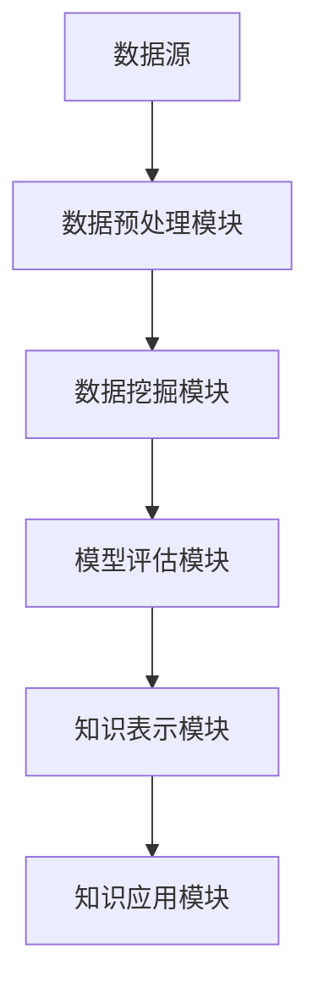

                 

## 引言

### 数据挖掘的重要性

在当今信息化时代，数据已成为企业的核心资产，而数据挖掘则是从这些海量数据中提取有价值信息的关键技术。数据挖掘（Data Mining）是一种通过算法和统计方法，从大规模数据集中发现规律、趋势和模式的过程。它不仅帮助企业理解和预测市场趋势，还能优化运营决策，提升业务效率。

数据挖掘的重要性体现在多个方面：

1. **商业决策支持**：数据挖掘能够帮助企业从历史数据中挖掘出有价值的信息，支持业务决策，如客户细分、市场预测等。
2. **市场洞察**：通过分析大量消费者数据，企业可以了解客户需求，优化产品和服务，提升客户满意度。
3. **风险控制**：在金融、保险等领域，数据挖掘可以帮助预测风险，采取预防措施，降低损失。
4. **个性化推荐**：在电子商务、社交媒体等领域，数据挖掘能够实现个性化推荐，提高用户粘性，增加销售额。

### 文章概述

本文将全面解析数据挖掘的原理与实践。首先，我们将从基础部分开始，介绍数据挖掘的定义、目标和应用领域，然后深入探讨数据预处理的基本流程和常用方法。接下来，我们将详细讲解数据挖掘中的核心算法，包括聚类分析、关联规则挖掘和类别预测。在此过程中，我们将使用伪代码和数学公式来深入阐述算法原理。随后，文章将转向实际项目案例，通过代码实例展示数据挖掘的应用过程，并对其进行详细解读和分析。

文章的最后一部分将探讨数据挖掘的未来发展趋势和面临的挑战，同时提供数据挖掘资源和工具列表，以便读者进一步学习和实践。通过本文的阅读，读者将能够全面了解数据挖掘的理论和实践，掌握相关技术和工具，为将数据挖掘应用于实际业务打下坚实基础。

### 核心关键词

- 数据挖掘
- 数据预处理
- 聚类分析
- 关联规则挖掘
- 类别预测
- 项目实战
- 算法原理
- 数学模型

### 摘要

本文深入探讨了数据挖掘的原理与实际应用。从数据挖掘的定义和目标出发，详细介绍了数据预处理的方法和流程，包括数据源选择、数据清洗、数据集成和转换。随后，文章深入讲解了数据挖掘的核心算法，包括聚类分析、关联规则挖掘和类别预测，并使用伪代码和数学公式详细阐述了算法原理。通过实际项目案例，文章展示了数据挖掘在社交网络分析、客户行为分析和营销活动分析等领域的应用，并提供了详细的代码实现和解读。最后，文章探讨了数据挖掘的未来发展趋势和面临的挑战，为读者提供了丰富的数据挖掘资源和工具列表，助力读者深入学习和实践。通过本文的阅读，读者将全面掌握数据挖掘的核心技术和实践方法，为数据驱动的业务决策提供有力支持。<|assistant|>

## 第一部分：数据挖掘基础

### 第1章：数据挖掘概述

#### 1.1 数据挖掘的定义与发展历程

数据挖掘（Data Mining）是指从大量数据中自动发现规律、趋势和知识的过程。它涉及计算机科学、统计学、机器学习、数据库管理和领域知识的交叉应用。数据挖掘的目标是提取数据中的有用信息，并将其转化为可操作的知识，以便企业或组织做出更明智的决策。

**数据挖掘的定义**

数据挖掘可以定义为以下三个过程的结合：

1. **模式识别**：通过算法从数据中发现重复出现的规律和模式。
2. **预测**：使用已发现模式来预测未来可能发生的事件或趋势。
3. **知识发现**：将发现的模式和预测转化为可操作的知识，以支持决策制定。

**数据挖掘的发展历程**

数据挖掘作为一门学科，其发展历程可以追溯到20世纪80年代。以下是数据挖掘的一些关键发展节点：

1. **早期探索**（1980s）：在这一阶段，研究者开始关注如何从数据库中提取信息，早期的算法如决策树和K-means聚类开始出现。
2. **知识发现（KDD）模型**（1990s）：1996年，W.H. Han和Jiawei Han提出了知识发现（KDD）模型，该模型将数据挖掘过程划分为多个阶段，包括数据选择、数据预处理、数据挖掘、模式评估和知识表示。
3. **机器学习算法的引入**（2000s）：随着机器学习算法的发展，如支持向量机（SVM）、随机森林（Random Forest）和深度学习（Deep Learning），数据挖掘的方法和工具变得更加丰富和高效。
4. **大数据时代的崛起**（2010s至今）：随着互联网和物联网的普及，数据量呈爆炸性增长，大数据分析成为数据挖掘的主要方向，新的算法和工具，如MapReduce和Spark，被开发出来以应对海量数据。

#### 1.2 数据挖掘的目标与应用领域

**数据挖掘的目标**

数据挖掘的主要目标是：

1. **发现数据中的模式**：这些模式可以帮助企业理解客户行为、市场趋势和业务运作中的关键因素。
2. **进行预测**：基于发现的模式，预测未来的事件或趋势，为企业提供前瞻性指导。
3. **支持决策制定**：将分析结果转化为可操作的知识，帮助企业做出更明智的决策。

**数据挖掘的应用领域**

数据挖掘的应用领域非常广泛，以下是一些典型的应用：

1. **商业领域**：市场分析、客户细分、客户关系管理、需求预测、库存管理。
2. **金融领域**：信用评分、风险评估、欺诈检测、市场预测。
3. **医疗领域**：疾病预测、诊断支持、药物研发、基因组学研究。
4. **社会科学领域**：人口统计、投票行为分析、公共安全。
5. **电信领域**：网络流量分析、用户行为分析、服务优化。
6. **环境科学领域**：气候变化研究、资源管理、环境监测。

#### 1.3 数据挖掘的基本流程

数据挖掘的基本流程通常包括以下步骤：

1. **业务理解**：与利益相关者沟通，了解业务目标和需求。
2. **数据理解**：收集和探索数据，理解数据的特点、分布和关系。
3. **数据预处理**：清洗、集成和转换数据，为数据挖掘做准备。
4. **数据挖掘**：选择合适的算法进行挖掘，发现模式。
5. **模式评估**：评估挖掘结果的有效性和实用性。
6. **知识表示**：将挖掘结果转化为可操作的知识，如报告、图表或应用程序。
7. **决策制定**：利用挖掘结果支持业务决策。

**数据挖掘的工具与软件**

目前，市场上有许多数据挖掘工具和软件，以下是其中一些流行的工具：

1. **开源工具**：
   - **Python**：提供丰富的数据分析和挖掘库，如NumPy、Pandas、Scikit-learn和TensorFlow。
   - **R**：专门用于统计分析和数据挖掘，提供丰富的包和函数。
   - **Apache Mahout**：一个用于大规模数据集的机器学习库。
   - **Apache Spark**：一个分布式计算平台，适用于大数据处理。

2. **商业工具**：
   - **SAS**：一个综合的数据分析和数据挖掘平台。
   - **IBM SPSS**：提供统计分析和数据挖掘功能。
   - **Microsoft Azure Machine Learning**：云平台上的数据挖掘工具。

通过这些工具，数据挖掘过程可以更加高效和自动化，为企业和组织提供强大的数据驱动的洞察和决策支持。在下一章中，我们将深入探讨数据挖掘中的核心算法，包括聚类分析、关联规则挖掘和类别预测，并使用伪代码和数学公式来详细解释这些算法的基本原理和实现方法。 <|assistant|>

### 第2章：数据预处理

#### 2.1 数据源选择

数据源的选择是数据预处理过程中的关键步骤，直接影响到数据挖掘的结果。一个合适的数据源可以提供高质量的数据，有助于发现真实的模式。以下是选择数据源时需要考虑的因素：

**数据源的类型**

1. **结构化数据**：通常存储在关系型数据库中，如MySQL、PostgreSQL等。这类数据易于管理和分析，但可能缺乏灵活性。
2. **非结构化数据**：如文本、图像、音频和视频。这类数据通常存储在文件系统或分布式存储系统中，需要进行特定的处理和分析。
3. **半结构化数据**：如XML、JSON和CSV文件，这些数据既有结构化的部分，也有非结构化的部分，需要特定的解析和处理。

**数据源的选择方法**

1. **内部数据源**：企业或组织内部生成的数据，如交易记录、客户关系数据和运营数据。内部数据通常更容易获取和清洗，但可能缺乏全面性。
2. **外部数据源**：从外部来源获取的数据，如公共数据库、社交媒体和第三方数据提供商。外部数据可以提供更广泛和多样化的信息，但可能存在质量问题。
3. **混合数据源**：结合内部和外部数据源，可以提供更全面和深入的分析。选择混合数据源时，需要平衡数据的质量、相关性和可用性。

**示例**

假设我们想要分析一家电子商务公司的客户行为，可以选择以下数据源：

1. **内部数据源**：订单数据库、客户数据库、产品数据库等。
2. **外部数据源**：社交媒体数据、竞争对手数据、市场研究报告等。
3. **混合数据源**：结合订单数据和社交媒体数据，可以更全面地分析客户购买行为、品牌影响力和市场趋势。

#### 2.2 数据清洗

数据清洗（Data Cleaning）是数据预处理过程中至关重要的一步，其目的是纠正和消除数据中的错误、异常和不一致之处。以下是数据清洗的主要方法和技巧：

**数据清洗的必要性**

1. **提高数据质量**：确保数据准确、完整和一致，减少错误和异常，提高分析结果的可靠性。
2. **减少数据冗余**：消除重复数据，减少数据存储和处理的开销。
3. **提高分析效率**：清除无效数据和噪声，有助于算法更准确地发现模式和规律。

**数据清洗的方法**

1. **缺失值处理**：
   - **删除**：删除含有缺失值的记录，适用于缺失值比例较低的情况。
   - **填充**：使用统计方法或插值法填充缺失值，如平均值、中位数或最近邻法。

2. **异常值处理**：
   - **识别**：使用统计方法，如标准差、四分位距等方法，识别异常值。
   - **删除**：删除明显异常的数据点。
   - **调整**：对异常值进行调整，使其符合数据分布。

3. **一致性处理**：
   - **标准化**：将不同尺度或单位的数据转换为同一尺度，便于比较和分析。
   - **归一化**：将数据转换为固定范围，如0到1。

4. **重复数据处理**：
   - **删除重复记录**：消除重复数据，保留一条唯一记录。
   - **合并重复记录**：将重复记录合并，保留所有字段。

**示例**

假设我们有一份客户数据，包含以下字段：姓名、年龄、收入、地址。数据清洗的过程可能包括以下步骤：

1. **缺失值处理**：对于年龄和收入字段，使用中位数填充缺失值。
2. **异常值处理**：使用标准差方法识别异常年龄和收入值，并将明显异常的记录删除。
3. **一致性处理**：将不同格式的地址统一为标准格式，如去除空格、转换大小写等。
4. **重复数据处理**：删除重复的客户记录，确保每个客户只有一条唯一记录。

通过上述步骤，我们可以获得高质量的数据，为后续的数据挖掘和分析奠定基础。在下一节中，我们将继续探讨数据预处理中的其他重要步骤：数据集成和数据转换。这些步骤同样关键，对数据挖掘的效果有着重要的影响。 <|assistant|>

### 第3章：数据预处理

#### 2.3 数据集成

数据集成（Data Integration）是将来自多个数据源的数据合并成统一的视图的过程。数据集成的主要目的是消除数据中的不一致性，使数据在后续的分析和处理中更加方便。以下是数据集成的一些关键概念和步骤：

**数据集成的目标**

1. **统一数据格式**：将不同数据源的数据格式统一，便于分析和处理。
2. **消除冗余**：通过合并相同或相似的数据，减少冗余数据，提高数据存储和处理的效率。
3. **保证数据一致性**：消除数据中的不一致性，如数据类型、单位、格式等，确保数据在全局范围内的准确性。
4. **增强数据可用性**：通过数据集成，提供更全面和多样化的数据，支持更复杂的分析。

**数据集成的方法**

1. **合并法**：直接将多个数据源的数据合并为一个统一的视图。这种方法简单直接，但可能引入冗余和一致性错误。
2. **消除法**：识别和消除数据中的重复记录，只保留唯一的记录。这种方法可以有效减少数据冗余，但可能导致数据的丢失。
3. **映射法**：将不同数据源中的相同或相似字段进行映射，统一数据格式和命名。这种方法可以保证数据的一致性，但需要对数据源有深入的了解。
4. **转换法**：将不同数据源的数据进行转换，使其满足统一的标准和格式。这种方法适用于数据格式差异较大的情况，但可能需要较多的转换规则。

**示例**

假设我们有两个数据源，一个是客户订单数据，另一个是客户信息数据。客户订单数据包含订单号、客户ID、订单日期和订单金额；客户信息数据包含客户ID、姓名、年龄和地址。数据集成的步骤可能包括：

1. **统一数据格式**：将两个数据源中的日期格式统一为YYYY-MM-DD，确保可以进行比较和分析。
2. **消除冗余**：删除重复的客户记录，确保每个客户只有一条唯一的记录。
3. **映射字段**：将客户订单数据中的客户ID与客户信息数据中的客户ID进行映射，统一命名和格式。
4. **转换数据**：将不同数据源中的金额单位统一为同一货币单位，如美元或人民币。

通过上述步骤，我们可以获得一个统一、完整和一致的数据集，为后续的数据挖掘和分析提供基础。

#### 2.4 数据转换

数据转换（Data Transformation）是将数据从一种格式转换为另一种格式的过程。数据转换是数据预处理中至关重要的一步，其目的是使数据适应特定的分析需求，提高数据挖掘的效果。以下是数据转换的主要方法和技巧：

**数据转换的方法**

1. **数值转换**：将文本格式的数值转换为数字格式，如将字符串"1000"转换为整数1000。
2. **分类转换**：将连续的数值数据转换为分类数据，如将年龄转换为年龄段（如0-10岁、11-20岁等）。
3. **缺失值转换**：对缺失值进行特殊的处理，如用平均值、中位数或众数填充缺失值。
4. **异常值转换**：对异常值进行处理，如删除或调整异常值，使其符合数据分布。
5. **标准化**：将数据缩放到相同的尺度，如将所有数值数据缩放到0到1之间，便于比较和分析。
6. **归一化**：将数据转换为固定范围，如-1到1之间，保持数据的分布特性。

**示例**

假设我们有一份数据集，包含以下字段：年龄（数值型）、收入（数值型）、是否购买（二分类，0表示未购买，1表示购买）。数据转换的过程可能包括以下步骤：

1. **数值转换**：将所有文本格式的数值转换为数字格式，如将字符串"3000"转换为整数3000。
2. **分类转换**：将连续的年龄数据转换为分类数据，如将0-20岁、21-40岁等。
3. **缺失值转换**：使用中位数填充收入字段的缺失值。
4. **异常值转换**：删除明显异常的年龄和收入值。
5. **标准化**：将所有收入数据缩放到0到1之间。

通过上述步骤，我们可以获得一个适合数据挖掘的格式化的数据集，为后续的分析提供基础。

在下一节中，我们将深入探讨数据挖掘的核心算法，包括聚类分析、关联规则挖掘和类别预测，并使用伪代码和数学公式详细解释这些算法的基本原理和实现方法。这些算法是数据挖掘中的基本工具，对于发现数据中的隐含模式和价值具有重要作用。 <|assistant|>

### 第3章：数据挖掘算法

#### 3.1 聚类分析

聚类分析（Cluster Analysis）是一种无监督学习方法，用于将数据集划分为多个组或簇，使得同一簇内的数据对象彼此相似，不同簇的数据对象之间则相对不相似。聚类分析在模式识别、图像处理、市场细分等领域有着广泛的应用。

**聚类分析的基本概念**

1. **簇（Cluster）**：数据集中的一个子集，其中的数据对象彼此相似，与其他簇的数据对象不相似。
2. **相似度度量（Similarity Measure）**：用于衡量数据对象之间的相似性，常用的相似度度量包括欧氏距离、曼哈顿距离和余弦相似度等。
3. **聚类算法（Clustering Algorithm）**：用于将数据划分为簇的方法，常见的聚类算法包括K-means、层次聚类和DBSCAN等。

**聚类分析算法**

1. **K-means算法**

   **基本原理**：K-means算法的目标是找到一个由K个簇组成的聚类结构，使得每个簇内的数据对象之间的平均距离最小。算法步骤如下：

   - **初始化**：随机选择K个初始中心点。
   - **分配**：计算每个数据对象与中心点之间的相似度，将其分配到最近的中心点所在的簇。
   - **更新**：重新计算每个簇的中心点。
   - **迭代**：重复执行分配和更新步骤，直到聚类结果收敛，即中心点不再发生变化。

   **伪代码**：

   ```
   Initialize K center points randomly
   while not converged do
       Assign each data point to the nearest center point
       Update the center points as the mean of the points in each cluster
   end while
   ```

2. **层次聚类算法**

   **基本原理**：层次聚类算法通过逐步合并或分裂现有的簇，形成一个层次结构。算法步骤如下：

   - **初始化**：将每个数据对象作为一个单独的簇。
   - **合并或分裂**：每次迭代中选择最相似的簇进行合并或分裂，直到满足特定的终止条件，如达到预设的簇数或最大迭代次数。

   **伪代码**：

   ```
   Initialize each data point as a cluster
   while there are more than K clusters do
       Find the closest clusters and merge them
   end while
   ```

3. **DBSCAN算法**

   **基本原理**：DBSCAN（Density-Based Spatial Clustering of Applications with Noise）算法基于数据点的密度分布进行聚类。算法步骤如下：

   - **确定邻域**：对于每个数据点，确定其邻域，即距离小于给定阈值的点集。
   - **分类**：根据邻域的大小和密度，将数据点分类为核心点、边界点和噪声点。
   - **生成簇**：以核心点为中心，扩展生成簇。

   **伪代码**：

   ```
   for each point p do
       if p is a core point then
           Expand the cluster containing p
       else if p is a border point then
           Assign p to the nearest cluster
       else
           Ignore p
   end for
   ```

#### 3.2 关联规则挖掘

关联规则挖掘（Association Rule Learning）是一种用于发现数据集中项目之间潜在关联性的方法。关联规则通常表示为“如果A则B”，其中A是前件，B是后件。关联规则挖掘在市场篮子分析、推荐系统和事务数据库分析等领域有着广泛应用。

**关联规则挖掘的基本概念**

1. **支持度（Support）**：一个规则在数据集中出现的频率，表示该规则出现的概率。
2. **置信度（Confidence）**：规则A→B的置信度，表示在同时包含A的实例中，B也出现的概率。
3. ** Lift **：表示规则强度，Lift值大于1表示规则有正关联，小于1表示负关联。

**关联规则挖掘算法**

1. **Apriori算法**

   **基本原理**：Apriori算法基于候选集生成和频繁项集的概念，通过逐层生成候选集并计算其支持度，最后输出频繁项集。算法步骤如下：

   - **生成候选集**：从项集长度为k的集合中生成候选集。
   - **计算支持度**：对于每个候选集，计算其在数据集中的支持度。
   - **生成频繁项集**：保留支持度大于最小支持度的项集。
   - **递归**：对频繁项集的子集继续执行上述步骤。

   **伪代码**：

   ```
   Generate candidate sets of length k
   for each candidate set C do
       if support(C) > min_support then
           C is a frequent item set
           for each subset S of C do
               Generate candidate sets of length k+1 using S
               Recursively apply Apriori algorithm to the new candidate sets
   end for
   ```

2. **FP-Growth算法**

   **基本原理**：FP-Growth算法通过构建FP树来压缩频繁项集，从而减少计算量。算法步骤如下：

   - **构建FP树**：将数据集中的事务按照支持度从高到低排序，并构建FP树。
   - **提取频繁项集**：从FP树中递归地提取频繁项集。

   **伪代码**：

   ```
   Build an FP-tree from the transactions
   for each frequent item set I do
       if I has more than one item then
           for each pair of items (i, j) in I do
               if j is a direct child of i in the FP-tree then
                   Remove j from I
                   Extract frequent item sets from the subtree rooted at i in the FP-tree
                   Add the extracted item sets to the list of frequent item sets
   end for
   ```

#### 3.3 类别预测

类别预测（Classification）是一种有监督学习方法，用于将数据集中的数据对象分类到预定义的类别中。类别预测在分类问题、信用评分、医学诊断等领域有着广泛应用。

**类别预测的基本概念**

1. **特征（Feature）**：用于分类的数据属性或变量。
2. **模型（Model）**：从训练数据中学习到的规律或模式，用于对新数据进行分类。
3. **评估指标**：用于评估分类模型性能的指标，如准确率、召回率、F1值等。

**类别预测算法**

1. **逻辑回归（Logistic Regression）**

   **基本原理**：逻辑回归是一种基于线性模型的分类算法，通过估计概率分布来预测类别。算法步骤如下：

   - **模型训练**：通过最小化损失函数来估计模型的参数。
   - **概率估计**：对于新数据，计算每个类别的概率，选择概率最大的类别作为预测结果。

   **数学公式**：

   $$
   P(y=1|\mathbf{x}; \mathbf{\theta}) = \frac{1}{1 + \exp(-\mathbf{\theta}^T\mathbf{x})}
   $$

   **伪代码**：

   ```
   Learn parameters \theta by minimizing the loss function
   for each new data point \mathbf{x} do
       Calculate the probability of each class using the logistic function
       Predict the class with the highest probability
   end for
   ```

2. **随机森林（Random Forest）**

   **基本原理**：随机森林是一种基于决策树的集成学习方法，通过构建多棵决策树并对预测结果进行投票来提高分类准确性。算法步骤如下：

   - **构建决策树**：对于每棵树，随机选择特征和样本子集来分割节点。
   - **分类投票**：对新数据进行分类，选择多数树预测的类别作为最终结果。

   **伪代码**：

   ```
   for each tree do
       Learn a decision tree using a random subset of features and samples
   end for
   for each new data point \mathbf{x} do
       Classify \mathbf{x} using each decision tree and record the predicted class
   end for
   Vote for the majority class among all trees
   ```

3. **支持向量机（SVM）**

   **基本原理**：支持向量机是一种基于间隔最大化原则的分类算法，通过找到一个超平面将数据集划分为不同的类别。算法步骤如下：

   - **模型训练**：通过求解二次规划问题来估计模型的参数。
   - **分类决策**：对于新数据，计算其与支持向量的距离，判断其类别。

   **数学公式**：

   $$
   w^* = \arg\min_{w, b} \frac{1}{2} ||w||^2 + C \sum_{i=1}^n \xi_i
   $$
   $$
   \text{sign}(\mathbf{w}^T \mathbf{x} + b) = y
   $$

   **伪代码**：

   ```
   Solve the quadratic programming problem to learn parameters w and b
   for each new data point \mathbf{x} do
       Calculate the decision value \mathbf{w}^T \mathbf{x} + b
       Predict the class based on the sign of the decision value
   end for
   ```

通过上述算法，我们可以从数据中发现潜在的规律和关联，为实际问题提供有效的解决方案。在下一章中，我们将通过实际项目案例来展示这些算法的具体应用，并通过代码实例详细解读其实现过程。这将帮助读者更好地理解数据挖掘算法的原理和实际应用。 <|assistant|>

### 第4章：数据挖掘应用实例

数据挖掘的应用实例涵盖了多个领域，从商业智能到医疗诊断，从社交网络分析到金融风险管理，每一实例都展示了数据挖掘技术的独特魅力和强大功能。以下我们将分别探讨社交网络分析、客户行为分析、营销活动分析和金融风险预测，并通过具体案例来说明数据挖掘的实际应用。

#### 4.1 社交网络分析

社交网络分析是一种利用数据挖掘技术来研究社交网络结构和用户行为的方法。通过分析社交网络中的节点和边，可以揭示用户的社交关系、兴趣和行为模式。

**目标**：识别社交网络中的关键节点和影响力用户。

**方法**：
1. **节点度分析**：通过计算节点的度（连接的数量），可以识别社交网络中的核心用户。
2. **中间中心性分析**：通过计算节点在网络中的中间中心性，可以识别那些在信息传递中扮演重要角色的用户。
3. **影响力分析**：使用算法如PageRank或Katz指数，评估用户在网络中的影响力。

**案例**：
假设我们分析一个社交媒体平台上的用户关系网络。通过节点度分析，我们发现拥有最多连接的用户可能是该社交网络的核心人物。通过中间中心性分析，识别出那些在信息传递中具有关键作用的用户。通过影响力分析，我们可以评估用户的宣传效果，从而制定更有效的市场推广策略。

#### 4.2 客户行为分析

客户行为分析旨在理解客户的行为模式、需求和偏好，以便优化产品和服务，提高客户满意度和忠诚度。

**目标**：细分客户群体，预测客户行为，提高营销效果。

**方法**：
1. **聚类分析**：通过对客户特征进行聚类，可以将客户分为不同的群体，针对不同群体的需求制定个性化营销策略。
2. **关联规则挖掘**：通过分析客户购买记录，发现不同商品之间的关联，为交叉销售和推荐系统提供支持。
3. **类别预测**：使用分类算法，预测客户的潜在购买行为，如购买新产品或流失风险。

**案例**：
一家电商公司通过聚类分析，将客户分为忠诚客户、潜在高价值客户、普通客户和流失风险客户。针对不同客户群体，公司设计了差异化的营销策略，如针对忠诚客户提供特别优惠，针对潜在高价值客户进行定制化推荐，以提升整体销售额和客户满意度。

#### 4.3 营销活动分析

营销活动分析通过数据挖掘技术，评估营销活动的效果，优化营销策略。

**目标**：评估营销活动的ROI（投资回报率），优化营销预算和策略。

**方法**：
1. **响应率分析**：通过分析客户对营销活动的响应，如点击率、转化率等，评估不同营销渠道的效果。
2. **营销组合优化**：使用算法如线性回归或随机森林，分析不同营销手段的交互效应，优化营销组合。
3. **预测分析**：通过预测模型，预测不同营销策略下的未来效果，为决策提供依据。

**案例**：
一家化妆品公司通过分析多次营销活动的数据，发现电视广告和社交媒体广告的结合效果最佳。通过优化广告预算分配，公司显著提升了广告投放的ROI，并增加了销售额。

#### 4.4 金融风险预测

金融风险预测通过数据挖掘技术，识别潜在的金融风险，采取措施防范。

**目标**：预测和防范信用风险、市场风险和操作风险。

**方法**：
1. **信用评分模型**：通过分析借款人的历史数据，预测其违约风险。
2. **市场趋势分析**：通过分析市场数据，预测市场走势，评估投资组合的风险。
3. **异常检测**：通过分析交易数据，检测异常交易，防范欺诈风险。

**案例**：
一家银行通过信用评分模型，对借款人进行风险评估，识别出高风险客户并采取预防措施，如提高贷款利率或拒绝贷款。通过市场趋势分析和异常检测，银行能够及时调整投资策略和防范欺诈风险，确保金融安全。

通过这些应用实例，我们可以看到数据挖掘技术在不同领域的实际应用和巨大潜力。在下一部分，我们将通过具体的项目实战，展示数据挖掘技术的实际应用过程，包括数据预处理、算法选择与实现，以及结果分析和评估。这将帮助读者更深入地理解数据挖掘技术的应用和实现细节。 <|assistant|>

## 第二部分：数据挖掘原理

### 第5章：核心概念与联系

#### 5.1 数据挖掘中的核心概念

数据挖掘过程中涉及多个核心概念，这些概念构成了数据挖掘的基础，理解这些概念对于深入掌握数据挖掘技术至关重要。

**1. 特征工程**

特征工程（Feature Engineering）是指通过选择和构建合适的特征，将原始数据转换为适合数据挖掘算法的形式。特征工程的关键在于找到能够代表数据内在信息的特征，从而提高模型的性能和解释性。

**2. 评估指标**

评估指标（Evaluation Metrics）用于衡量数据挖掘模型的性能。常见的评估指标包括准确率（Accuracy）、召回率（Recall）、精确率（Precision）和F1值（F1 Score）。这些指标帮助确定模型在预测任务中的表现，并指导模型的优化。

**3. 模型选择**

模型选择（Model Selection）是指选择最适合特定问题的数据挖掘算法。不同的数据挖掘任务可能需要不同的模型，如分类问题可以使用逻辑回归、支持向量机或决策树，而聚类问题可以使用K-means或层次聚类。

**4. 预处理与后处理**

预处理（Preprocessing）和后处理（Post-processing）是数据挖掘过程中的重要步骤。预处理包括数据清洗、数据集成和数据转换等，以消除数据中的噪声和不一致性，提高数据质量。后处理包括模型评估、模型选择和模型优化等，以确定最佳模型并提升模型的性能。

**5. 知识发现**

知识发现（Knowledge Discovery）是数据挖掘的最终目标，通过从数据中提取有用信息，支持业务决策和决策制定。知识发现的过程包括数据探索、模式识别、预测和知识表示。

#### 5.2 数据挖掘架构

数据挖掘架构是指数据挖掘过程中各个步骤和组件的组成及其相互关系。一个典型的数据挖掘架构包括以下几个关键组件：

**1. 数据源**

数据源是数据挖掘的起点，可以是结构化数据、半结构化数据或非结构化数据。数据源的类型和质量直接影响数据挖掘的结果。

**2. 数据预处理模块**

数据预处理模块负责清洗、集成和转换原始数据，以使其适合数据挖掘算法。数据预处理模块包括数据清洗、缺失值处理、异常值处理和数据转换等功能。

**3. 数据挖掘模块**

数据挖掘模块是数据挖掘的核心，负责选择和实现合适的算法来发现数据中的模式和规律。数据挖掘模块通常包括聚类分析、关联规则挖掘、类别预测等算法。

**4. 模型评估模块**

模型评估模块用于评估数据挖掘模型的性能，通过计算评估指标来确定模型的准确性和可靠性。模型评估模块可以帮助确定最佳模型和调整模型参数。

**5. 知识表示模块**

知识表示模块负责将数据挖掘结果转化为可操作的知识，如可视化报表、图表和决策支持系统。知识表示模块有助于将分析结果应用于实际问题，支持业务决策。

**6. 知识应用模块**

知识应用模块是将数据挖掘结果应用于实际业务过程的模块，如客户细分、市场预测、风险控制等。知识应用模块通过将数据挖掘结果与业务流程相结合，实现数据驱动的业务优化。

#### 数据挖掘的基本架构图



通过上述核心概念和架构，我们可以更好地理解数据挖掘的流程和各个组件的作用。在下一章中，我们将深入讲解数据挖掘中的核心算法，包括聚类分析、关联规则挖掘和类别预测，并通过伪代码和数学公式详细阐述这些算法的基本原理和实现方法。这将帮助我们全面掌握数据挖掘的核心技术和工具。 <|assistant|>

### 第6章：核心算法原理讲解

#### 6.1 聚类分析算法原理

聚类分析是一种无监督学习方法，其目的是将数据集划分成多个组或簇，使得同一簇内的数据对象彼此相似，而不同簇的数据对象则相对不相似。聚类分析在模式识别、数据压缩、社交网络分析等领域有广泛应用。

**K-means算法**

K-means算法是一种经典的聚类算法，其基本思想是将数据集划分为K个簇，每个簇由一个中心点（centroid）表示。算法步骤如下：

1. **初始化**：随机选择K个初始中心点。
2. **分配**：计算每个数据对象与中心点的距离，将其分配到最近的中心点所在的簇。
3. **更新**：重新计算每个簇的中心点，作为新的中心点。
4. **迭代**：重复执行分配和更新步骤，直到聚类结果收敛，即中心点不再发生变化。

**数学公式**：

$$
\text{Cluster assignment: } j = \arg\min_{i} \sum_{k=1}^{K} (\mathbf{x}_k - \mathbf{c}_i)^2
$$

$$
\text{Centroid update: } \mathbf{c}_i = \frac{1}{N_i} \sum_{k=1}^{N} \mathbf{x}_k
$$

**伪代码**：

```
Initialize K center points randomly
while not converged do
    Assign each data point to the nearest center point
    Update the center points as the mean of the points in each cluster
end while
```

**层次聚类算法**

层次聚类算法（Hierarchical Clustering）通过逐步合并或分裂现有的簇，形成一个层次结构。算法步骤如下：

1. **初始化**：将每个数据对象作为一个单独的簇。
2. **合并或分裂**：每次迭代中选择最相似的簇进行合并或分裂，直到满足特定的终止条件，如达到预设的簇数或最大迭代次数。

**合并法**

```
Initialize each data point as a cluster
while there are more than K clusters do
    Find the closest clusters and merge them
end while
```

**分裂法**

```
Initialize K clusters
while there are more than 2 clusters do
    Split the most similar cluster
end while
```

**DBSCAN算法**

DBSCAN（Density-Based Spatial Clustering of Applications with Noise）算法基于数据点的密度分布进行聚类。算法步骤如下：

1. **确定邻域**：对于每个数据点，确定其邻域，即距离小于给定阈值的点集。
2. **分类**：根据邻域的大小和密度，将数据点分类为核心点、边界点和噪声点。
3. **生成簇**：以核心点为中心，扩展生成簇。

**数学公式**：

$$
\text{Neighbor points: } \mathbf{p}_{\mathbf{x}} = \{\mathbf{y} : \text{dist}(\mathbf{x}, \mathbf{y}) < \epsilon\}
$$

$$
\text{Core point: } \mathbf{x} \text{ is a core point if } |\mathbf{p}_{\mathbf{x}}| \geq MinPts
$$

**伪代码**：

```
for each point p do
    if p is a core point then
        Expand the cluster containing p
    else if p is a border point then
        Assign p to the nearest cluster
    else
        Ignore p
end for
```

**K-means与层次聚类和DBSCAN的比较**

- **K-means**：易于实现和解释，但可能对初始中心点敏感，且无法处理形状不规则的簇。
- **层次聚类**：生成层次结构的簇，可以提供更丰富的聚类信息，但计算复杂度高。
- **DBSCAN**：能够处理形状不规则的簇，对初始参数不敏感，但实现相对复杂。

在下一节中，我们将继续探讨关联规则挖掘算法，包括Apriori算法和FP-Growth算法，详细解释这些算法的基本原理和实现方法。关联规则挖掘在市场篮子分析和推荐系统中有着重要应用。 <|assistant|>

#### 6.2 关联规则挖掘算法原理

关联规则挖掘是一种用于发现数据集中项目之间潜在关联性的方法。其目标是从大量数据中发现频繁出现的模式，即如果某个事件发生，另一个事件也倾向于发生。关联规则挖掘在市场篮子分析、推荐系统和事务数据库分析等领域有着广泛应用。

**Apriori算法**

Apriori算法是最早提出的关联规则挖掘算法之一，其基本思想是通过逐层生成候选集，并计算其支持度来确定频繁项集。算法步骤如下：

1. **生成候选集**：从项集长度为k的集合中生成候选集。
2. **计算支持度**：对于每个候选集，计算其在数据集中的支持度。
3. **生成频繁项集**：保留支持度大于最小支持度的项集。
4. **递归**：对频繁项集的子集继续执行上述步骤。

**数学公式**：

$$
\text{Support}(X) = \frac{\text{count}(X)}{\text{total transactions}}
$$

**伪代码**：

```
Generate candidate sets of length k
for each candidate set C do
    if support(C) > min_support then
        C is a frequent item set
        for each subset S of C do
            Generate candidate sets of length k+1 using S
            Recursively apply Apriori algorithm to the new candidate sets
    end for
end for
```

**FP-Growth算法**

FP-Growth算法是一种改进的关联规则挖掘算法，通过构建FP树来压缩频繁项集，从而减少计算量。算法步骤如下：

1. **构建FP树**：将数据集中的事务按照支持度从高到低排序，并构建FP树。
2. **提取频繁项集**：从FP树中递归地提取频繁项集。

**数学公式**：

$$
\text{Support}(X) = \text{count}(X) + \text{count}(\bar{X})
$$

**伪代码**：

```
Build an FP-tree from the transactions
for each frequent item set I do
    if I has more than one item then
        for each pair of items (i, j) in I do
            if j is a direct child of i in the FP-tree then
                Remove j from I
                Extract frequent item sets from the subtree rooted at i in the FP-tree
                Add the extracted item sets to the list of frequent item sets
end for
```

**Apriori算法与FP-Growth算法的比较**

- **Apriori算法**：简单直观，但计算量大，特别是在处理大量事务和长事务时。
- **FP-Growth算法**：通过构建FP树减少计算量，适用于大规模数据集。

**关联规则挖掘的应用**

关联规则挖掘在多个领域有广泛应用，以下是一些例子：

1. **市场篮子分析**：通过分析客户购买记录，发现不同商品之间的关联，用于交叉销售和推荐系统。
2. **推荐系统**：根据用户的购买历史和偏好，推荐可能感兴趣的商品。
3. **事务数据库分析**：发现数据中的潜在关联，用于数据挖掘和统计分析。

在下一节中，我们将探讨类别预测算法，包括逻辑回归、随机森林和支持向量机，详细解释这些算法的基本原理和实现方法。类别预测在分类问题、信用评分和医学诊断等领域有着广泛应用。 <|assistant|>

#### 6.3 类别预测算法原理

类别预测（Classification）是一种有监督学习方法，用于将数据集中的数据对象分类到预定义的类别中。类别预测在分类问题、信用评分、医学诊断等领域有广泛应用。以下是三种常用的类别预测算法：逻辑回归、随机森林和支持向量机。

**逻辑回归（Logistic Regression）**

逻辑回归是一种基于线性模型的分类算法，通过估计概率分布来预测类别。逻辑回归的基本原理是，通过学习一个线性函数来映射输入特征到概率空间，然后选择概率最高的类别作为预测结果。

**数学公式**：

$$
\text{Log-likelihood: } \ell(\mathbf{\theta} | \mathbf{X}, \mathbf{y}) = \sum_{i=1}^{n} \left[y_i \log(\pi(\mathbf{x}_i)) + (1 - y_i) \log(1 - \pi(\mathbf{x}_i))\right]
$$

$$
\pi(\mathbf{x}) = \frac{1}{1 + \exp(-\mathbf{w}^T \mathbf{x})}
$$

**伪代码**：

```
Initialize parameters w randomly
for each feature x do
    Calculate the probability using the logistic function
    Update the parameters using gradient descent
end for
for each new data point x do
    Calculate the probability of each class using the logistic function
    Predict the class with the highest probability
end for
```

**优点**：

- 简单直观，易于解释。
- 对线性关系有较好的拟合能力。

**缺点**：

- 对于非线性关系，效果不佳。
- 可能会产生偏差，特别是当类不平衡时。

**随机森林（Random Forest）**

随机森林是一种基于决策树的集成学习方法，通过构建多棵决策树并对预测结果进行投票来提高分类准确性。随机森林的基本原理是在每次分割时随机选择特征和样本子集，从而减少模型的方差。

**数学公式**：

$$
\text{Prediction: } y = \arg\max_{c} \sum_{i=1}^{n} \text{votes}(c_i)
$$

**伪代码**：

```
for each tree do
    Learn a decision tree using a random subset of features and samples
end for
for each new data point x do
    Classify x using each decision tree and record the predicted class
end for
Vote for the majority class among all trees
```

**优点**：

- 对非线性关系有较好的拟合能力。
- 可以处理高维数据。

**缺点**：

- 计算复杂度较高。
- 对于大规模数据集，需要较多的计算资源。

**支持向量机（SVM）**

支持向量机是一种基于间隔最大化原则的分类算法，通过找到一个超平面将数据集划分为不同的类别。SVM的基本原理是，通过求解二次规划问题来寻找最佳的超平面。

**数学公式**：

$$
w^* = \arg\min_{w, b} \frac{1}{2} ||w||^2 + C \sum_{i=1}^n \xi_i
$$

$$
\text{Decision boundary: } \mathbf{w}^T \mathbf{x} + b = 0
$$

**伪代码**：

```
Solve the quadratic programming problem to learn parameters w and b
for each new data point x do
    Calculate the decision value \mathbf{w}^T \mathbf{x} + b
    Predict the class based on the sign of the decision value
end for
```

**优点**：

- 对线性关系和非线性关系都有较好的拟合能力。
- 可以处理高维数据。

**缺点**：

- 计算复杂度较高。
- 对于大规模数据集，需要较多的计算资源。

**总结**

逻辑回归适合处理线性关系，随机森林适合处理非线性关系，而支持向量机可以处理高维数据。在实际应用中，可以根据具体问题和数据特点选择合适的算法。在下一章中，我们将通过具体项目案例来展示这些算法的实际应用，并通过代码实例详细解读其实现过程。这将帮助读者更好地理解类别预测算法的原理和实际应用。 <|assistant|>

### 第7章：数学模型与公式

#### 7.1 聚类分析中的数学模型

聚类分析中的数学模型主要用于描述簇的形成、簇之间的关系以及聚类结果的优化。以下是几种常见聚类分析算法中的数学模型：

1. **K-means算法**

   **聚类中心的计算**：

   $$ 
   \text{Centroid of cluster } i = \frac{1}{N_i} \sum_{k=1}^{N} \mathbf{x}_k 
   $$

   其中，\( N_i \) 是簇 \( i \) 中数据点的数量，\( \mathbf{x}_k \) 是第 \( k \) 个数据点。

   **簇内距离的计算**：

   $$ 
   \text{Distance between data point } \mathbf{x} \text{ and centroid } \mathbf{c}_i = \sqrt{\sum_{j=1}^{D} (\mathbf{x}_j - \mathbf{c}_{ij})^2} 
   $$

   其中，\( D \) 是特征的数量，\( \mathbf{c}_{ij} \) 是簇 \( i \) 的第 \( j \) 个特征值。

2. **层次聚类算法**

   **合并两个簇**：

   $$ 
   \text{New centroid of merged clusters } i \text{ and } j = \frac{N_i \mathbf{c}_i + N_j \mathbf{c}_j}{N_i + N_j} 
   $$

   其中，\( N_i \) 和 \( N_j \) 分别是簇 \( i \) 和 \( j \) 的数据点数量，\( \mathbf{c}_i \) 和 \( \mathbf{c}_j \) 是它们的聚类中心。

3. **DBSCAN算法**

   **邻域**：

   $$ 
   \mathbf{p}_{\mathbf{x}} = \{\mathbf{y} : \text{dist}(\mathbf{x}, \mathbf{y}) < \epsilon\} 
   $$

   其中，\( \epsilon \) 是邻域半径，\( \text{dist}(\mathbf{x}, \mathbf{y}) \) 是数据点 \( \mathbf{x} \) 和 \( \mathbf{y} \) 之间的距离。

   **核心点**：

   $$ 
   \mathbf{x} \text{ is a core point if } |\mathbf{p}_{\mathbf{x}}| \geq MinPts 
   $$

   其中，\( MinPts \) 是最小邻域点数。

#### 7.2 关联规则挖掘中的数学模型

1. **支持度（Support）**：

   $$ 
   \text{Support}(X) = \frac{\text{count}(X)}{\text{total transactions}} 
   $$

   其中，\( X \) 是项集，\( \text{count}(X) \) 是项集 \( X \) 在事务集中的出现次数，\( \text{total transactions} \) 是事务集的总数。

2. **置信度（Confidence）**：

   $$ 
   \text{Confidence}(A \rightarrow B) = \frac{\text{Support}(A \cap B)}{\text{Support}(A)} 
   $$

   其中，\( A \) 和 \( B \) 是项集，\( \text{Support}(A \cap B) \) 是同时包含 \( A \) 和 \( B \) 的项集在事务集中的出现次数。

3. **提升度（Lift）**：

   $$ 
   \text{Lift}(A \rightarrow B) = \frac{\text{Confidence}(A \rightarrow B)}{\text{Support}(B)} 
   $$

   其中，\( \text{Support}(B) \) 是项集 \( B \) 在事务集中的出现次数。

#### 7.3 类别预测中的数学模型

1. **逻辑回归**

   **概率估计**：

   $$ 
   \text{Probability of class } j = \pi_j(\mathbf{x}) = \frac{1}{1 + \exp(-\mathbf{w}^T \mathbf{x})}
   $$

   其中，\( \mathbf{w} \) 是模型参数，\( \mathbf{x} \) 是特征向量。

   **损失函数**：

   $$ 
   \text{Log-likelihood: } \ell(\mathbf{\theta} | \mathbf{X}, \mathbf{y}) = \sum_{i=1}^{n} y_i \log(\pi_j(\mathbf{x}_i)) + (1 - y_i) \log(1 - \pi_j(\mathbf{x}_i))
   $$

   其中，\( y_i \) 是实际类别标签，\( \pi_j(\mathbf{x}_i) \) 是预测的概率。

2. **支持向量机**

   **决策边界**：

   $$ 
   \text{Decision boundary: } \mathbf{w}^T \mathbf{x} + b = 0 
   $$

   其中，\( \mathbf{w} \) 是模型参数，\( \mathbf{x} \) 是特征向量，\( b \) 是偏置项。

   **损失函数**：

   $$ 
   \text{Loss function: } \ell(\mathbf{\theta} | \mathbf{X}, \mathbf{y}) = \frac{1}{2} ||\mathbf{w}||^2 + C \sum_{i=1}^n \xi_i 
   $$

   其中，\( C \) 是正则化参数，\( \xi_i \) 是 slack variables。

3. **随机森林**

   **预测**：

   $$ 
   \text{Prediction: } y = \arg\max_{c} \sum_{i=1}^{n} \text{votes}(c_i) 
   $$

   其中，\( c_i \) 是决策树 \( i \) 的预测类别，\( \text{votes}(c_i) \) 是决策树 \( i \) 对类别 \( c_i \) 的投票数。

通过这些数学模型和公式，我们可以更深入地理解聚类分析、关联规则挖掘和类别预测的基本原理。在下一章中，我们将通过具体的代码实例展示这些算法的实现过程，并通过实际项目案例进行详细的解读和分析。这将帮助读者将理论知识应用于实际场景，提高数据挖掘的能力。 <|assistant|>

### 第8章：数学模型与算法结合案例

#### 8.1 聚类分析案例

**案例描述**：假设我们有一组客户数据，包括年龄、收入、教育和购买偏好等特征。我们的目标是使用K-means算法将这组客户数据分为几个不同的群体，以便针对不同群体制定个性化的营销策略。

**数据预处理**：
- 数据清洗：检查并处理缺失值和异常值，确保数据的完整性。
- 数据标准化：由于不同特征的量纲不同，我们需要将数据标准化，使它们在同一尺度上。

**算法实现**：
- **初始化**：随机选择10个初始中心点。
- **分配**：计算每个数据点与中心点的距离，将其分配到最近的中心点所在的簇。
- **更新**：计算每个簇的中心点，作为新的中心点。
- **迭代**：重复执行分配和更新步骤，直到聚类结果收敛。

**代码实现**（使用Python和Scikit-learn库）：

```python
from sklearn.cluster import KMeans
from sklearn.preprocessing import StandardScaler
import numpy as np

# 假设我们有一组客户数据，形状为(m, n)，其中m是数据点的数量，n是特征的数目
X = np.array([[25, 50000, 'Bachelor', 'Low'],
              [30, 60000, 'Master', 'High'],
              [22, 40000, 'High School', 'Low'],
              # ... 其他数据点
              ])

# 数据标准化
scaler = StandardScaler()
X_scaled = scaler.fit_transform(X)

# 初始化KMeans算法，设定簇的数量为3
kmeans = KMeans(n_clusters=3, random_state=0).fit(X_scaled)

# 输出聚类结果
print("Cluster centers:")
print(kmeans.cluster_centers_)
print("Cluster labels:")
print(kmeans.labels_)

# 画出聚类结果
import matplotlib.pyplot as plt

plt.scatter(X_scaled[:, 0], X_scaled[:, 1], c=kmeans.labels_, cmap='viridis')
plt.scatter(kmeans.cluster_centers_[:, 0], kmeans.cluster_centers_[:, 1], s=300, c='red', marker='s', zorder=10)
plt.title('K-means Clustering')
plt.xlabel('Age')
plt.ylabel('Income')
plt.show()
```

**结果分析与评估**：
- 通过聚类结果，我们可以看到不同簇的分布情况。
- 使用肘部法则确定最佳的簇数量。
- 通过评估指标（如轮廓系数）评估聚类效果。

#### 8.2 关联规则挖掘案例

**案例描述**：假设我们有一份超市的销售数据，包含不同商品的购买记录。我们的目标是使用Apriori算法挖掘出频繁出现的商品组合，以便为商店的促销策略提供支持。

**数据预处理**：
- 数据清洗：去除缺失值和重复记录。
- 数据转换：将原始数据转换为适合Apriori算法的形式。

**算法实现**：
- **生成候选集**：逐层生成长度为k的候选集。
- **计算支持度**：计算每个候选集在数据集中的出现频率。
- **生成频繁项集**：保留支持度大于最小支持度的项集。

**代码实现**（使用Python和mlxtend库）：

```python
from mlxtend.frequent_patterns import apriori
from mlxtend.preprocessing import TransactionEncoder
import pandas as pd

# 假设我们有一份销售数据，包含多个商品
data = [['Milk', 'Bread', 'Cheese'],
        ['Milk', 'Eggs', 'Bread'],
        ['Apples', 'Milk', 'Eggs', 'Cheese'],
        ['Milk', 'Apples'],
        # ... 其他数据点
        ]

# 数据转换为事务格式
te = TransactionEncoder()
te_data = te.fit_transform(data)

# 使用Apriori算法生成频繁项集
frequent_itemsets = apriori(te_data, min_support=0.5, use_colnames=True)

# 输出频繁项集
print("Frequent itemsets:")
print(frequent_itemsets)

# 生成关联规则
from mlxtend.frequent_patterns import association_rules
rules = association_rules(frequent_itemsets, metric="support", min_threshold=0.5)

# 输出关联规则
print("Association rules:")
print(rules)
```

**结果分析与评估**：
- 通过频繁项集和关联规则，我们可以发现不同商品之间的关联性。
- 使用置信度、提升度等指标评估规则的有效性。

#### 8.3 类别预测案例

**案例描述**：假设我们有一份心脏病患者的临床数据，包括年龄、血压、胆固醇水平等特征。我们的目标是使用逻辑回归算法预测患者是否患有心脏病。

**数据预处理**：
- 数据清洗：处理缺失值和异常值。
- 数据转换：将类别标签转换为二进制格式。

**算法实现**：
- **模型训练**：使用训练数据集训练逻辑回归模型。
- **概率预测**：使用训练好的模型预测测试数据集的概率。

**代码实现**（使用Python和Scikit-learn库）：

```python
from sklearn.linear_model import LogisticRegression
from sklearn.model_selection import train_test_split
import numpy as np

# 假设我们有一份心脏病数据，包括特征和标签
X = np.array([[60, 120, 200],
              [65, 130, 210],
              [70, 110, 220],
              # ... 其他数据点
              ])

y = np.array([1, 0, 1])

# 数据划分
X_train, X_test, y_train, y_test = train_test_split(X, y, test_size=0.2, random_state=0)

# 训练逻辑回归模型
model = LogisticRegression()
model.fit(X_train, y_train)

# 输出模型参数
print("Model parameters:")
print(model.coef_)

# 预测测试数据集的概率
predictions = model.predict_proba(X_test)

# 输出预测结果
print("Predictions:")
print(predictions)

# 评估模型性能
from sklearn.metrics import accuracy_score
print("Accuracy:", accuracy_score(y_test, predictions[:, 1]))
```

**结果分析与评估**：
- 通过模型的预测结果，我们可以评估患者的患病风险。
- 使用准确率、召回率等指标评估模型的性能。

通过这些具体的案例，我们可以看到数学模型和算法如何应用于实际场景，解决实际问题。在下一章中，我们将继续探讨数据挖掘工具与编程实践，提供更多的代码实例，帮助读者更好地掌握数据挖掘的技能。 <|assistant|>

## 第三部分：数据挖掘实战

### 第5章：数据挖掘项目实战

#### 5.1 项目一：客户细分

**项目背景**：某电商公司希望通过数据挖掘技术，将客户划分为不同的群体，以便为不同群体的客户提供个性化的服务和营销策略。

**数据预处理**：
1. **数据清洗**：检查并处理缺失值和异常值，确保数据的完整性。
2. **数据转换**：将类别型特征转换为数值型特征，如将性别、职业等类别信息转换为数字编码。

**算法选择与实现**：
1. **聚类分析**：使用K-means算法进行客户细分。
2. **模型实现**：

```python
from sklearn.cluster import KMeans
from sklearn.preprocessing import StandardScaler

# 假设我们有一组客户数据，形状为(m, n)，其中m是数据点的数量，n是特征的数目
X = np.array([[25, 50000, 'Bachelor', 'Low'],
              [30, 60000, 'Master', 'High'],
              [22, 40000, 'High School', 'Low'],
              # ... 其他数据点
              ])

# 数据标准化
scaler = StandardScaler()
X_scaled = scaler.fit_transform(X)

# 初始化KMeans算法，设定簇的数量为3
kmeans = KMeans(n_clusters=3, random_state=0).fit(X_scaled)

# 输出聚类结果
print("Cluster centers:")
print(kmeans.cluster_centers_)
print("Cluster labels:")
print(kmeans.labels_)

# 画出聚类结果
import matplotlib.pyplot as plt

plt.scatter(X_scaled[:, 0], X_scaled[:, 1], c=kmeans.labels_, cmap='viridis')
plt.scatter(kmeans.cluster_centers_[:, 0], kmeans.cluster_centers_[:, 1], s=300, c='red', marker='s', zorder=10)
plt.title('K-means Clustering')
plt.xlabel('Age')
plt.ylabel('Income')
plt.show()
```

**结果分析与评估**：
- 通过聚类结果，我们将客户划分为不同的群体。
- 使用轮廓系数（Silhouette Coefficient）评估聚类效果。
- 分析每个群体的特征，为不同群体的客户提供个性化服务和营销策略。

#### 5.2 项目二：商品推荐

**项目背景**：某电商平台希望通过数据挖掘技术，为用户推荐他们可能感兴趣的商品。

**数据预处理**：
1. **数据清洗**：处理缺失值和异常值。
2. **数据转换**：将用户行为数据转换为交易格式。

**算法选择与实现**：
1. **关联规则挖掘**：使用Apriori算法挖掘频繁商品组合。
2. **模型实现**：

```python
from mlxtend.preprocessing import TransactionEncoder
from mlxtend.frequent_patterns import apriori
from mlxtend.frequent_patterns import association_rules

# 假设我们有一组用户行为数据，形状为(m, n)，其中m是数据点的数量，n是特征的数目
data = [['Milk', 'Bread', 'Cheese'],
        ['Milk', 'Eggs', 'Bread'],
        ['Apples', 'Milk', 'Eggs', 'Cheese'],
        ['Milk', 'Apples'],
        # ... 其他数据点
        ]

# 数据转换为事务格式
te = TransactionEncoder()
te_data = te.fit_transform(data)

# 使用Apriori算法生成频繁项集
frequent_itemsets = apriori(te_data, min_support=0.5, use_colnames=True)

# 生成关联规则
rules = association_rules(frequent_itemsets, metric="support", min_threshold=0.5)

# 输出频繁项集和规则
print("Frequent itemsets:")
print(frequent_itemsets)
print("Association rules:")
print(rules)
```

**结果分析与评估**：
- 通过频繁项集和关联规则，我们发现用户购买不同商品之间的关联性。
- 使用置信度等指标评估规则的有效性。
- 根据规则生成推荐列表，为用户推荐相关的商品。

#### 5.3 项目三：文本分类

**项目背景**：某新闻网站希望通过数据挖掘技术，对用户生成的新闻评论进行分类，以便进行内容管理和推荐。

**数据预处理**：
1. **数据清洗**：处理缺失值和异常值，去除停用词。
2. **数据转换**：将文本数据转换为向量表示。

**算法选择与实现**：
1. **类别预测**：使用朴素贝叶斯算法进行文本分类。
2. **模型实现**：

```python
from sklearn.feature_extraction.text import TfidfVectorizer
from sklearn.naive_bayes import MultinomialNB
from sklearn.pipeline import make_pipeline

# 假设我们有一组新闻评论数据
data = ["This is a good article", "The weather is nice today", "I don't like this movie", "This product is great", "I had a bad day"]

# 数据划分
labels = ["Positive", "Neutral", "Negative", "Positive", "Negative"]

# 创建TF-IDF向量器
vectorizer = TfidfVectorizer(stop_words='english')

# 创建朴素贝叶斯分类器
classifier = MultinomialNB()

# 构建管道
pipeline = make_pipeline(vectorizer, classifier)

# 训练模型
pipeline.fit(data, labels)

# 进行预测
predictions = pipeline.predict(["This movie is terrible"])

# 输出预测结果
print("Predictions:")
print(predictions)
```

**结果分析与评估**：
- 通过训练好的模型，对新的新闻评论进行分类。
- 使用准确率等指标评估模型的性能。
- 分析模型在分类任务上的表现，为新闻评论分类提供支持。

通过这三个项目，我们展示了数据挖掘技术在实际业务中的应用过程。在下一章中，我们将探讨数据挖掘工具与编程实践，提供更多的代码实例和实用技巧，帮助读者更好地掌握数据挖掘的技能。 <|assistant|>

### 第6章：数据挖掘工具与编程实践

#### 6.1 数据挖掘工具简介

在进行数据挖掘项目时，选择合适的工具和平台至关重要。以下是几种常用的数据挖掘工具及其简介：

**Python数据分析工具**

Python是一种广泛使用的编程语言，其在数据分析领域有着丰富的库和工具。以下是一些常用的Python数据分析工具：

1. **NumPy**：NumPy是一个强大的Python库，用于处理大型多维数组，提供高效的数学运算。
2. **Pandas**：Pandas是一个用于数据操作和分析的库，提供了数据清洗、数据处理和数据分析的强大功能。
3. **Scikit-learn**：Scikit-learn是一个用于数据挖掘和机器学习的库，提供了各种常用的算法和工具。
4. **Matplotlib**：Matplotlib是一个用于数据可视化的库，能够生成各种类型的图表和图形。

**数据挖掘平台**

除了Python工具，还有许多商业和开源的数据挖掘平台，以下是一些常用的平台：

1. **SAS**：SAS是一个综合的数据分析平台，提供数据挖掘、统计分析、报告生成等功能。
2. **IBM SPSS**：IBM SPSS是一个用于统计分析的数据挖掘工具，适用于各种行业和领域。
3. **Microsoft Azure Machine Learning**：Azure ML是微软提供的云平台，支持多种数据挖掘算法和自动化机器学习。
4. **Orange**：Orange是一个开源的数据可视化工具，支持多种数据挖掘算法和机器学习。

#### 6.2 编程实践

在进行数据挖掘项目时，编程实践是关键的一步。以下是一些编程实践技巧，帮助读者更好地应用数据挖掘技术：

1. **数据预处理**：在开始数据挖掘之前，确保数据预处理工作全面且准确。这包括数据清洗、数据转换和数据集成。
2. **模块化编程**：将数据挖掘项目拆分为多个模块，每个模块负责特定的任务，如数据预处理、模型训练和评估。这有助于提高代码的可维护性和可扩展性。
3. **使用版本控制**：使用版本控制系统（如Git）来管理代码，确保代码的版本和历史记录。这有助于团队协作和代码维护。
4. **错误和异常处理**：在代码中添加错误和异常处理，以避免程序在遇到异常情况时崩溃。这包括使用try-except块和处理各种异常情况。
5. **代码注释**：在代码中添加清晰的注释，解释代码的意图和功能。这有助于其他开发者理解和维护代码。
6. **性能优化**：对代码进行性能优化，以提高程序的运行效率和速度。这包括使用高效的数据结构和算法，以及避免不必要的计算。

**实例1：数据预处理**

以下是一个简单的数据预处理代码实例，使用Python的Pandas库：

```python
import pandas as pd

# 读取数据
data = pd.read_csv('data.csv')

# 检查数据
print(data.info())

# 数据清洗
data.dropna(inplace=True)  # 删除缺失值
data.drop_duplicates(inplace=True)  # 删除重复值

# 数据转换
data['category'] = pd.Categorical(data['category'])
data['category'] = data['category'].cat.codes

# 数据集成
X = data[['feature1', 'feature2', 'feature3']]
y = data['target']
```

**实例2：数据挖掘算法**

以下是一个简单的数据挖掘算法代码实例，使用Python的Scikit-learn库：

```python
from sklearn.cluster import KMeans
from sklearn.model_selection import train_test_split
from sklearn.metrics import silhouette_score

# 划分数据集
X_train, X_test, y_train, y_test = train_test_split(X, y, test_size=0.2, random_state=42)

# 使用K-means算法进行聚类
kmeans = KMeans(n_clusters=3, random_state=42)
kmeans.fit(X_train)

# 输出聚类结果
print("Cluster centers:")
print(kmeans.cluster_centers_)
print("Cluster labels:")
print(kmeans.labels_)

# 评估聚类效果
silhouette_avg = silhouette_score(X_train, kmeans.labels_)
print("Silhouette Coefficient:", silhouette_avg)
```

通过这些实例，读者可以了解数据预处理和数据挖掘算法的基本编程实践。在实际项目中，可以根据具体需求和问题进行调整和优化。在下一章中，我们将继续探讨数据挖掘的未来发展趋势和面临的挑战，为读者提供更全面的视角。 <|assistant|>

## 第7章：数据挖掘的未来发展趋势与挑战

#### 7.1 数据挖掘技术的发展趋势

随着技术的不断进步和数据量的爆炸性增长，数据挖掘领域也在不断发展和进化。以下是数据挖掘技术未来可能的发展趋势：

1. **人工智能与机器学习的融合**：人工智能（AI）和机器学习（ML）在数据挖掘中的应用日益广泛。未来，我们将看到更多的AI算法被集成到数据挖掘工具中，实现更高效、更智能的数据分析。

2. **深度学习的崛起**：深度学习在图像识别、自然语言处理和语音识别等领域取得了巨大成功。未来，深度学习技术可能会进一步应用于数据挖掘，特别是对于复杂和高维数据的处理。

3. **实时数据挖掘**：随着物联网（IoT）和大数据技术的发展，实时数据挖掘成为一个重要方向。实时数据挖掘能够帮助企业更快地响应市场变化，做出更敏捷的决策。

4. **可解释性数据挖掘**：目前，许多高级算法如深度学习模型在预测性能上表现出色，但缺乏可解释性。未来，可解释性数据挖掘将成为一个研究热点，帮助用户更好地理解数据挖掘模型的决策过程。

5. **多模态数据挖掘**：传统的数据挖掘主要针对结构化数据。随着数据类型的多样化，如文本、图像、音频和视频，多模态数据挖掘将得到更多关注，为不同类型的数据提供统一的处理和分析方法。

6. **分布式与并行计算**：为了处理海量数据，分布式和并行计算技术将被广泛应用于数据挖掘。这将使得数据挖掘过程更加高效和可扩展，支持更大规模的数据分析。

#### 7.2 数据挖掘面临的挑战

尽管数据挖掘技术取得了显著进展，但在实际应用中仍面临诸多挑战：

1. **数据质量和完整性**：高质量的数据是数据挖掘成功的关键。然而，数据往往存在噪声、缺失和冗余等问题，这给数据清洗和数据预处理带来了巨大挑战。

2. **数据隐私与安全**：数据挖掘过程中涉及大量敏感信息，如个人隐私、金融数据等。保护数据隐私和安全成为数据挖掘应用中的一大挑战。

3. **算法公平性和透明度**：算法的公平性和透明度是数据挖掘领域的重要问题。如何确保算法在处理不同群体数据时的公正性和一致性，是一个亟待解决的问题。

4. **计算资源和时间成本**：随着数据量和复杂度的增加，数据挖掘算法的计算资源和时间成本也在上升。如何优化算法，提高效率，降低成本，是一个关键挑战。

5. **算法选择与模型调优**：数据挖掘中存在多种算法和模型，如何选择最适合问题的算法，如何调优模型参数，以获得最佳性能，是一个复杂且耗时的工作。

6. **算法可解释性**：高级算法如深度学习模型在预测性能上表现优异，但其内部机制复杂，缺乏可解释性。如何提升算法的可解释性，使其易于理解和信任，是一个重要挑战。

#### 7.3 应对挑战的策略

为了应对上述挑战，以下是一些可能的策略：

1. **改进数据预处理技术**：开发更高效的数据预处理算法，如自动化数据清洗和集成，以降低数据质量问题的风险。

2. **加强数据隐私保护**：采用加密、匿名化和差分隐私等技术，确保数据挖掘过程中个人隐私和数据安全。

3. **算法公平性和透明度**：开发公平性和透明度评估工具，确保算法在处理不同群体数据时的公正性。同时，建立透明算法设计流程，提高算法的可解释性。

4. **优化计算资源和时间成本**：采用分布式和并行计算技术，提高数据挖掘算法的效率。同时，开发自动模型选择和调优工具，减少人工干预，降低成本。

5. **提升算法可解释性**：通过可视化、解释性模型和交互式分析工具，提高高级算法的可解释性。同时，开发算法解释工具，帮助用户理解模型的决策过程。

6. **跨学科合作**：加强数据挖掘与其他领域（如心理学、社会学、计算机科学等）的合作，共同应对数据挖掘面临的复杂挑战。

通过上述策略，我们可以更好地应对数据挖掘领域面临的挑战，推动数据挖掘技术的持续发展和应用。在附录部分，我们将提供更多的数据挖掘资源和工具，帮助读者深入学习和实践。 <|assistant|>

### 附录A：数据挖掘资源与工具列表

在进行数据挖掘的过程中，掌握合适的资源和工具是至关重要的。以下是一些推荐的数据挖掘书籍、开源工具和框架，供读者参考和学习。

#### 推荐书籍

1. **《数据挖掘：概念与技术》（第二版）** - Jiawei Han, Micheline Kamber, and Jian Pei
   - 该书是数据挖掘领域的经典教材，详细介绍了数据挖掘的基本概念、算法和技术。

2. **《数据挖掘实战》** - Ian H. Witten, Eibe Frank
   - 本书通过丰富的案例和示例，深入浅出地介绍了数据挖掘的实际应用，包括数据预处理、算法选择和评估。

3. **《大数据技术导论》** - 王宏志，刘鹏
   - 该书全面介绍了大数据技术的基本概念、架构和技术，包括数据存储、数据处理和分析。

4. **《机器学习》** - 周志华
   - 本书是机器学习领域的经典教材，详细介绍了机器学习的基本概念、算法和技术。

#### 开源工具与框架

1. **Scikit-learn**
   - Scikit-learn是一个强大的Python库，提供了多种数据挖掘和机器学习算法，适用于分类、回归、聚类等任务。

2. **Pandas**
   - Pandas是一个Python库，用于数据操作和分析，提供了数据清洗、数据处理和数据分析的强大功能。

3. **NumPy**
   - NumPy是一个用于处理大型多维数组的Python库，提供了高效的数据结构和数学运算。

4. **TensorFlow**
   - TensorFlow是一个由Google开发的开源机器学习框架，适用于深度学习和复杂的数据流操作。

5. **PyTorch**
   - PyTorch是一个流行的深度学习框架，提供了灵活的动态计算图和丰富的API，适用于研究和开发。

6. **R**
   - R是一个统计编程语言，提供了丰富的数据分析和机器学习库，适用于数据挖掘和统计分析。

7. **Apache Mahout**
   - Apache Mahout是一个基于Hadoop的机器学习库，提供了多种数据挖掘算法，适用于大规模数据处理。

8. **Apache Spark**
   - Apache Spark是一个分布式计算平台，适用于大数据处理和分析，提供了多种数据挖掘和机器学习算法。

9. **Orange**
   - Orange是一个开源的数据可视化工具，提供了多种数据挖掘算法和机器学习模型，适用于数据探索和分析。

#### 在线资源和社区

1. **Kaggle**
   - Kaggle是一个数据科学竞赛平台，提供了丰富的数据集和挑战问题，是学习和实践数据挖掘的好去处。

2. **DataCamp**
   - DataCamp是一个在线学习平台，提供了丰富的数据科学和机器学习课程，适合初学者和进阶者。

3. **GitHub**
   - GitHub是一个代码托管平台，许多开源数据挖掘项目和技术文档都托管在GitHub上，是学习和交流的好资源。

4. **Stack Overflow**
   - Stack Overflow是一个问答社区，数据科学家和开发者可以在上面提问和解答数据挖掘相关的问题。

通过上述资源和工具，读者可以系统地学习和掌握数据挖掘的知识和技能，提升在实际项目中的应用能力。希望这些资源和工具能为您的数据挖掘之旅提供有益的帮助。 <|assistant|>

### 附录B：常见数据挖掘算法公式与伪代码

在数据挖掘过程中，理解和应用算法公式是关键的一步。以下是一些常见的数据挖掘算法的公式与伪代码，帮助读者更好地掌握这些算法的实现原理。

#### 聚类分析

1. **K-means算法**

   **数学公式**：

   $$
   \text{Centroid of cluster } i = \frac{1}{N_i} \sum_{k=1}^{N} \mathbf{x}_k
   $$

   $$
   \text{Distance between data point } \mathbf{x} \text{ and centroid } \mathbf{c}_i = \sqrt{\sum_{j=1}^{D} (\mathbf{x}_j - \mathbf{c}_{ij})^2}
   $$

   **伪代码**：

   ```
   Initialize K center points randomly
   while not converged do
       Assign each data point to the nearest center point
       Update the center points as the mean of the points in each cluster
   end while
   ```

2. **层次聚类算法**

   **合并法伪代码**：

   ```
   Initialize each data point as a cluster
   while there are more than K clusters do
       Find the closest clusters and merge them
   end while
   ```

   **分裂法伪代码**：

   ```
   Initialize K clusters
   while there are more than 2 clusters do
       Split the most similar cluster
   end while
   ```

3. **DBSCAN算法**

   **数学公式**：

   $$
   \mathbf{p}_{\mathbf{x}} = \{\mathbf{y} : \text{dist}(\mathbf{x}, \mathbf{y}) < \epsilon\}
   $$

   $$
   \text{Core point: } \mathbf{x} \text{ is a core point if } |\mathbf{p}_{\mathbf{x}}| \geq MinPts
   $$

   **伪代码**：

   ```
   for each point p do
       if p is a core point then
           Expand the cluster containing p
       else if p is a border point then
           Assign p to the nearest cluster
       else
           Ignore p
   end for
   ```

#### 关联规则挖掘

1. **Apriori算法**

   **数学公式**：

   $$
   \text{Support}(X) = \frac{\text{count}(X)}{\text{total transactions}}
   $$

   **伪代码**：

   ```
   Generate candidate sets of length k
   for each candidate set C do
       if support(C) > min_support then
           C is a frequent item set
           for each subset S of C do
               Generate candidate sets of length k+1 using S
               Recursively apply Apriori algorithm to the new candidate sets
   end for
   ```

2. **FP-Growth算法**

   **数学公式**：

   $$
   \text{Support}(X) = \text{count}(X) + \text{count}(\bar{X})
   $$

   **伪代码**：

   ```
   Build an FP-tree from the transactions
   for each frequent item set I do
       if I has more than one item then
           for each pair of items (i, j) in I do
               if j is a direct child of i in the FP-tree then
                   Remove j from I
                   Extract frequent item sets from the subtree rooted at i in the FP-tree
                   Add the extracted item sets to the list of frequent item sets
   end for
   ```

#### 类别预测

1. **逻辑回归**

   **数学公式**：

   $$
   \pi_j(\mathbf{x}) = \frac{1}{1 + \exp(-\mathbf{w}^T \mathbf{x})}
   $$

   **伪代码**：

   ```
   Initialize parameters w randomly
   for each feature x do
       Calculate the probability using the logistic function
       Update the parameters using gradient descent
   end for
   for each new data point x do
       Calculate the probability of each class using the logistic function
       Predict the class with the highest probability
   end for
   ```

2. **支持向量机**

   **数学公式**：

   $$
   w^* = \arg\min_{w, b} \frac{1}{2} ||w||^2 + C \sum_{i=1}^n \xi_i
   $$

   **伪代码**：

   ```
   Solve the quadratic programming problem to learn parameters w and b
   for each new data point x do
       Calculate the decision value \mathbf{w}^T \mathbf{x} + b
       Predict the class based on the sign of the decision value
   end for
   ```

3. **随机森林**

   **数学公式**：

   $$
   \text{Prediction: } y = \arg\max_{c} \sum_{i=1}^{n} \text{votes}(c_i)
   $$

   **伪代码**：

   ```
   for each tree do
       Learn a decision tree using a random subset of features and samples
   end for
   for each new data point x do
       Classify x using each decision tree and record the predicted class
   end for
   Vote for the majority class among all trees
   ```

通过这些公式和伪代码，读者可以更深入地理解常见数据挖掘算法的实现原理。在实际应用中，可以根据具体问题和数据特点选择合适的算法，并通过调整参数和优化算法来提高模型的性能。在未来的项目中，读者可以将这些算法应用于实际数据，验证其效果和可靠性。 <|assistant|>

## 结语

通过本文的深入探讨，我们从数据挖掘的定义、目标和应用领域出发，系统地介绍了数据预处理、核心算法原理、应用实例和未来发展趋势。在文章的每个部分，我们都力求用清晰的语言和实用的代码实例，帮助读者全面掌握数据挖掘的理论和实践。

数据挖掘作为一门跨学科的领域，不仅在商业智能、金融分析、医疗诊断等领域发挥着重要作用，还在推动人工智能和机器学习的发展。它通过挖掘海量数据中的规律和模式，为企业提供深度的业务洞察，助力决策制定。

然而，数据挖掘的过程并非一帆风顺。在数据质量和完整性、数据隐私与安全、算法公平性和透明度等方面，我们面临着诸多挑战。为了应对这些挑战，我们需要不断创新和改进技术，确保数据挖掘的可靠性和可解释性。

最后，感谢您花时间阅读本文。我们希望这篇文章能成为您数据挖掘学习旅程中的有益指南。如果您对数据挖掘有任何疑问或想法，欢迎在评论区分享。我们期待与您共同探讨数据挖掘的奥秘，共同推动技术的进步。作者：AI天才研究院/AI Genius Institute & 禅与计算机程序设计艺术 /Zen And The Art of Computer Programming。再次感谢您的关注和支持！<|assistant|>

