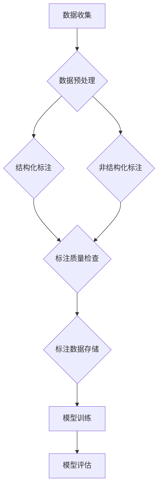

                 

### 《数据标注：人工智能发展背后的幕后功臣》

> **关键词**：数据标注、人工智能、数据预处理、模型训练、自动化标注、众包标注、自然语言处理、计算机视觉

> **摘要**：本文深入探讨了数据标注在人工智能发展中的重要性。数据标注不仅为机器学习模型提供了必要的训练数据，也在自然语言处理和计算机视觉等应用领域中发挥了关键作用。文章将从数据标注的定义、过程、工具、技术与应用等方面进行详细分析，并探讨数据标注面临的挑战及未来发展趋势。

#### # 第一部分：数据标注的概述

#### 第1章：数据标注的重要性

**1.1 数据标注的定义与作用**

数据标注是指对原始数据进行处理，添加元信息（如标签、分类、注释等），使其更适合特定应用的过程。数据标注在人工智能领域中扮演着至关重要的角色，因为机器学习模型的性能很大程度上取决于训练数据的质量。

- **数据标注的定义**：数据标注是对原始数据进行预处理，添加上下文信息、标签或注释的过程。例如，在图像识别任务中，标注数据可能包括图像中的物体类别、位置、边界框等信息。

- **数据标注的作用**：数据标注的主要作用包括：
  - **提高模型准确性**：准确的数据标注可以帮助机器学习模型更好地学习特征，从而提高模型的预测准确性。
  - **加速模型训练**：经过标注的数据可以加快模型训练的速度，减少训练时间。
  - **降低过拟合风险**：良好的数据标注有助于降低模型过拟合的风险，提高模型的泛化能力。

**1.2 数据标注的类型**

数据标注可以按照数据类型和标注内容的复杂性进行分类。以下是两种主要类型：

- **结构化数据标注**：结构化数据标注是对结构化数据（如表格、数据库等）中的字段进行标注，通常涉及分类、标签、注释等。例如，在金融领域中，可以对交易数据中的交易类型、金额等进行标注。

- **非结构化数据标注**：非结构化数据标注是对非结构化数据（如文本、图像、音频等）进行标注，通常需要更复杂的处理和标注规则。例如，在自然语言处理中，可以对文本进行词性标注、命名实体识别等。

**1.3 数据标注的应用领域**

数据标注在多个领域都有着广泛的应用，以下是其中几个重要领域：

- **人工智能**：数据标注在人工智能领域主要用于机器学习模型的训练数据准备。例如，在图像识别任务中，需要对图像进行标注以标记物体类别和位置。

- **自然语言处理**：数据标注在自然语言处理中至关重要，如文本分类、情感分析、命名实体识别等。例如，在文本分类任务中，需要对文本进行标签标注。

- **计算机视觉**：数据标注在计算机视觉中用于训练图像识别模型，如目标检测、图像分割等。例如，在目标检测任务中，需要对图像中的物体进行标注并确定其位置。

在接下来的章节中，我们将详细探讨数据标注的过程、挑战、工具与平台，以及数据标注在各个领域的具体应用。

#### 第2章：数据标注的过程与挑战

**2.1 数据标注的流程**

数据标注是一个复杂的过程，涉及多个步骤，以下是一个典型的数据标注流程：

- **数据收集**：首先，需要收集原始数据，这些数据可以是结构化的（如表格、数据库等）或非结构化的（如文本、图像、音频等）。数据收集的来源可以是公开数据集、企业内部数据或第三方数据提供商。

- **数据预处理**：在标注之前，通常需要对数据进行预处理，以去除噪声、填充缺失值、标准化等。数据预处理有助于提高标注效率和质量。

- **数据标注**：数据标注是数据标注流程的核心步骤，可以分为手动标注和自动标注两种方式。手动标注通常由标注员进行，根据标注规则对数据中的特征进行标注。自动标注则使用算法对数据进行标注，通常作为辅助手段。

- **数据验证**：数据验证是确保标注数据质量的关键步骤。通过随机抽样或全面检查，验证标注员的工作是否准确无误。

- **数据清洗**：在数据验证过程中，可能会发现标注错误或不一致的情况。数据清洗包括纠正错误、填补遗漏的数据等。

- **数据存储**：经过标注和验证的数据需要存储在数据库或其他存储系统中，以便后续使用。

**2.2 数据标注的挑战**

数据标注过程中面临着多种挑战，以下是其中一些主要挑战：

- **数据质量**：数据质量对模型的性能至关重要。数据标注过程中可能存在数据缺失、噪声、不一致等问题，这些问题会影响模型的准确性。

- **数据规模**：大规模数据标注通常需要大量时间和人力资源。标注大规模数据需要大量的标注员，并且需要高效的数据标注工具。

- **数据多样性**：数据多样性是模型泛化能力的重要基础。如果数据标注过于单一，模型可能无法适应不同的场景和需求。

- **标注一致性**：确保标注数据的一致性是一个挑战，特别是在多人协作的标注过程中。标注不一致可能导致模型训练数据的不一致，从而影响模型性能。

- **标注成本**：数据标注是一个成本高昂的过程，尤其是在手动标注的情况下。自动化和众包标注可以降低成本，但也存在准确性和效率的平衡问题。

**2.3 数据标注的解决方案**

为了应对数据标注过程中的挑战，可以采用以下解决方案：

- **自动化标注**：使用算法自动标注数据，减少手动标注的工作量。例如，使用图像识别算法自动标注图像中的物体。

- **众包标注**：利用众包平台，将数据标注任务分配给众多参与者，以提高标注效率和质量。例如，使用 Amazon Mechanical Turk 平台进行众包标注。

- **标注质量控制**：建立标注质量控制机制，包括标注一致性检查、标注质量评估等，确保标注数据的一致性和准确性。

- **数据增强**：通过数据增强技术，如数据扩充、数据合成等，提高数据的多样性，增强模型泛化能力。

- **标注工具**：选择合适的数据标注工具，提高标注效率。例如，使用 LabelImg、Labelbox 等工具进行图像标注。

通过上述解决方案，可以有效地应对数据标注过程中的挑战，提高标注效率和质量，为人工智能的发展提供有力的支持。

#### 第3章：数据标注工具与平台

**3.1 常见数据标注工具**

在数据标注过程中，选择合适的工具对于提高标注效率和准确性至关重要。以下介绍几种常见的数据标注工具：

- **LabelImg**：LabelImg 是一款开源的图像标注工具，支持多种图像格式（如 PNG、JPG 等），支持多种标注类型（如矩形框、多边形框等）。用户界面友好，操作简便。

  **特点**：
  - **支持多种图像格式**：支持多种常见的图像格式。
  - **标注类型丰富**：支持多种标注类型，如矩形框、多边形框等。
  - **用户界面友好**：界面简洁，操作便捷。

- **Labelbox**：Labelbox 是一款云端数据标注平台，支持多人协作，自动化标注，并提供丰富的数据管理功能。Labelbox 适用于各种数据类型，包括图像、文本、视频等。

  **特点**：
  - **云端平台**：支持多人协作，实时数据共享。
  - **自动化标注**：使用机器学习算法自动标注数据。
  - **数据管理**：提供数据管理功能，如数据存储、数据同步等。

- **Amazon Mechanical Turk**：Amazon Mechanical Turk 是一款众包标注平台，适用于大规模数据标注任务。平台上的参与者（称为 Turkers）可以接受并完成标注任务，平台管理员可以监控任务进度和质量。

  **特点**：
  - **众包平台**：适用于大规模数据标注任务。
  - **灵活性强**：可以根据任务需求自定义标注规则和任务。
  - **质量控制**：平台提供质量控制机制，如任务审核、质量评估等。

**3.2 数据标注平台的选择**

在选择数据标注平台时，需要考虑以下因素：

- **功能需求**：根据项目需求选择合适的平台，如图像标注、文本标注、视频标注等。

- **成本考虑**：手动标注、自动标注、众包标注的成本不同，需要根据预算和任务需求进行选择。

- **标注工具**：平台应提供适合项目需求的标注工具，如 LabelImg、Labelbox 等。

- **数据处理能力**：平台应具备较强的数据处理能力，如数据存储、数据同步、自动化标注等。

- **用户界面**：用户界面应简洁易用，提高标注效率。

- **协作支持**：平台应支持多人协作，实时数据共享。

**3.3 数据标注案例**

以下是一个数据标注案例：

- **任务**：对一个包含1000张图像的数据集进行标注，标注内容为图像中的物体类别和位置。

- **工具选择**：选择 Labelbox 作为数据标注平台，因为其支持图像标注，自动化标注功能强大，并且支持多人协作。

- **标注流程**：
  1. 收集原始图像数据。
  2. 使用 Labelbox 平台上传图像数据。
  3. 定义标注任务，设置标注规则（如物体类别、位置标注）。
  4. 分配任务给标注员，监控标注进度和质量。
  5. 完成标注后，对标注数据进行验证和清洗。
  6. 将标注数据用于模型训练。

通过上述案例，展示了数据标注工具与平台在项目中的应用，为数据标注提供了实用参考。

#### 第4章：数据标注技术详解

**4.1 数据标注方法**

数据标注方法可以分为手动标注、自动标注和半监督标注三种。以下是这三种方法的详细描述：

- **手动标注**：手动标注是指由人类标注员根据标注规则对数据进行标注。手动标注的优点是准确度高，可以处理复杂的数据类型和标注任务。缺点是耗时耗力，成本较高。

  **手动标注步骤**：
  1. 数据收集：收集待标注的原始数据。
  2. 数据预处理：对原始数据进行预处理，如去除噪声、填充缺失值等。
  3. 标注规则定义：根据标注任务需求，定义标注规则。
  4. 标注：标注员根据标注规则对数据进行标注。
  5. 数据验证：对标注数据进行验证，确保标注准确性。

- **自动标注**：自动标注是指使用算法对数据进行标注，通常作为手动标注的辅助手段。自动标注的优点是速度快，可以处理大规模数据。缺点是准确度较低，需要人类标注员进行校正。

  **自动标注步骤**：
  1. 数据收集：收集待标注的原始数据。
  2. 数据预处理：对原始数据进行预处理，如去除噪声、填充缺失值等。
  3. 算法选择：选择合适的自动标注算法，如图像识别算法、文本分类算法等。
  4. 自动标注：使用算法对数据进行标注。
  5. 标注校正：标注员对自动标注结果进行校正，提高标注准确度。

- **半监督标注**：半监督标注是指结合手动标注和自动标注，利用自动标注的结果进行手动标注，以提高标注效率和准确度。半监督标注的优点是既利用了手动标注的准确性，又提高了标注效率。

  **半监督标注步骤**：
  1. 数据收集：收集待标注的原始数据。
  2. 数据预处理：对原始数据进行预处理，如去除噪声、填充缺失值等。
  3. 自动标注：使用算法对数据进行自动标注。
  4. 标注校正：标注员对自动标注结果进行校正，生成初步标注数据。
  5. 手动标注：标注员对初步标注数据中的错误和遗漏进行手动标注。
  6. 数据验证：对标注数据进行验证，确保标注准确性。

**4.2 数据标注算法**

数据标注算法是数据标注方法的核心组成部分。以下介绍几种常见的数据标注算法：

- **决策树**：决策树是一种常用的分类算法，通过将数据分为多个子集，最终实现对数据的分类。决策树算法可以用于数据标注任务，如图像分类、文本分类等。

  **决策树算法伪代码**：
  ```python
  def classify_example(example, tree):
      current_node = tree
      while current_node.label is None:
          feature_value = example[feature]
          current_node = current_node.children[feature_value]
      return current_node.label
  ```

- **随机森林**：随机森林是一种基于决策树的集成学习算法，通过构建多个决策树并对它们进行集成，提高分类和标注的准确度。

  **随机森林算法伪代码**：
  ```python
  def classify_example(example, forest):
      predictions = []
      for tree in forest:
          predictions.append(classify_example(example, tree))
      return majority_vote(predictions)
  ```

- **支持向量机**：支持向量机是一种常用的分类和标注算法，通过找到最佳超平面，将数据分为不同的类别。

  **支持向量机算法伪代码**：
  ```python
  def classify_example(example, model):
      weights = model.weights
      bias = model.bias
      return sign(np.dot(weights, example) + bias)
  ```

通过上述数据标注方法与算法的详细介绍，可以为数据标注任务的实施提供理论支持和实践指导。

#### 第5章：数据标注在人工智能领域的应用

数据标注在人工智能领域中具有广泛的应用，下面我们将详细探讨数据标注在机器学习模型训练数据准备、智能语音助手和计算机视觉等方面的具体应用。

**5.1 机器学习模型训练数据准备**

机器学习模型的训练数据准备是数据标注的核心任务之一。数据标注为机器学习模型提供了高质量的训练数据，有助于提高模型的准确性和泛化能力。以下是数据标注在机器学习模型训练数据准备中的具体应用：

- **数据集构建**：数据标注的第一步是构建用于训练的机器学习模型的数据集。数据集应包括多种类型的样本，以确保模型能够学习到丰富的特征。例如，在图像识别任务中，数据集应包含不同场景、不同光照条件、不同物体姿态的图像。

- **数据增强**：为了提高模型的泛化能力，可以通过数据增强技术扩展训练数据集。数据增强包括图像旋转、缩放、裁剪、颜色调整等操作，从而生成新的训练样本。数据增强有助于模型在训练过程中学习到更多样化的特征。

- **数据清洗**：在构建数据集的过程中，需要清洗数据，去除噪声和异常值。数据清洗包括去除重复样本、填补缺失值、去除噪声等操作，以确保数据集的质量。

- **标注质量**：标注质量对模型性能有直接影响。因此，需要确保标注数据的准确性、一致性和完整性。在标注过程中，可以采用多人标注、一致性检查和质量评估等方法，提高标注数据的质量。

**5.2 智能语音助手**

智能语音助手是数据标注在自然语言处理领域的一个重要应用。数据标注在语音识别和对话管理中发挥了关键作用，以下是数据标注在智能语音助手中的具体应用：

- **语音识别标注**：语音识别标注是指对语音数据中的关键词和句子进行标注，以便模型能够识别和理解语音。标注过程包括对语音信号进行预处理、提取语音特征、对特征进行标注等步骤。标注数据的质量直接影响语音识别的准确性。

  **语音识别标注步骤**：
  1. 数据收集：收集语音数据，包括语音信号和对应的文本。
  2. 数据预处理：对语音信号进行预处理，如去噪、归一化等。
  3. 特征提取：从预处理后的语音信号中提取特征，如频谱特征、梅尔频率倒谱系数（MFCC）等。
  4. 标注：标注语音信号中的关键词和句子，生成标注数据。

- **对话管理标注**：对话管理标注是指对对话数据中的意图和实体进行标注，以便模型能够理解用户的意图并提供相应的回答。对话管理标注包括对用户问句的意图标注和对回答的实体标注。

  **对话管理标注步骤**：
  1. 数据收集：收集对话数据，包括用户问句和系统回答。
  2. 数据预处理：对对话数据中的文本进行预处理，如分词、词性标注等。
  3. 意图标注：标注用户问句的意图，如查询信息、请求服务等。
  4. 实体标注：标注用户问句中的实体，如人名、地点、日期等。
  5. 答案标注：标注系统回答的实体和意图。

**5.3 计算机视觉**

数据标注在计算机视觉领域中具有广泛的应用，为图像识别、目标检测和图像分割等任务提供了重要的标注数据。以下是数据标注在计算机视觉中的具体应用：

- **目标检测**：目标检测是指识别图像中的物体并标注其位置。数据标注为目标检测模型提供了必要的标注数据。标注过程包括对图像中的每个物体进行标注，包括物体的类别和位置。

  **目标检测标注步骤**：
  1. 数据收集：收集目标检测任务所需的图像数据。
  2. 数据预处理：对图像进行预处理，如去噪、缩放等。
  3. 物体标注：对图像中的每个物体进行标注，包括类别和位置。
  4. 数据合成：通过数据合成技术生成更多的标注数据，以提高模型泛化能力。

- **图像分割**：图像分割是指将图像分为多个区域，每个区域对应不同的物体或背景。数据标注为图像分割模型提供了必要的标注数据。标注过程包括对图像中的每个像素进行标注，确定其属于哪个区域。

  **图像分割标注步骤**：
  1. 数据收集：收集图像分割任务所需的图像数据。
  2. 数据预处理：对图像进行预处理，如去噪、缩放等。
  3. 区域标注：对图像中的每个区域进行标注，确定其类别。
  4. 数据合成：通过数据合成技术生成更多的标注数据，以提高模型泛化能力。

通过上述具体应用，我们可以看到数据标注在人工智能领域中的重要性。数据标注不仅为机器学习模型提供了必要的训练数据，还在自然语言处理和计算机视觉等领域发挥了关键作用。随着人工智能技术的不断发展，数据标注的重要性将越来越凸显。

#### 第6章：数据标注在自然语言处理领域的应用

自然语言处理（NLP）是人工智能领域的一个重要分支，而数据标注在NLP中具有至关重要的作用。在本章中，我们将详细探讨数据标注在文本分类、情感分析、命名实体识别和语义角色标注等自然语言处理任务中的应用。

**6.1 文本分类**

文本分类是一种将文本数据分配到预定义类别中的任务。数据标注在文本分类任务中用于生成标注数据集，这些数据集包含了文本样本及其对应的标签。以下是文本分类中的数据标注过程：

- **数据收集**：首先，需要收集大量的文本数据，这些数据可以来源于网站、论坛、新闻文章等。
- **文本预处理**：对收集到的文本数据进行预处理，包括去除标点符号、停用词过滤、词干提取等。
- **标签定义**：根据分类任务的需求，定义文本分类的标签。例如，在垃圾邮件检测任务中，标签可以是“垃圾邮件”或“非垃圾邮件”。
- **标注**：标注员根据标签对预处理后的文本进行标注，将文本样本分配到相应的类别。
- **数据集构建**：将标注后的文本样本与对应的标签组成数据集，用于训练文本分类模型。

**6.2 情感分析**

情感分析是判断文本中表达的情感倾向（如正面、负面、中性）的过程。数据标注在情感分析中用于生成标注数据集，这些数据集包含了情感极性标注。

- **数据收集**：收集大量的文本数据，如微博、评论、新闻文章等。
- **文本预处理**：对文本数据进行预处理，如分词、词性标注等。
- **情感标签定义**：根据情感分析任务的需求，定义情感标签。例如，情感标签可以是“正面”、“负面”或“中性”。
- **标注**：标注员根据文本的情感倾向对每个文本样本进行标注。
- **数据集构建**：将标注后的文本样本与对应的情感标签组成数据集，用于训练情感分析模型。

**6.3 命名实体识别**

命名实体识别是识别文本中具有特定意义的实体（如人名、地名、组织名等）的过程。数据标注在命名实体识别中用于生成标注数据集，这些数据集包含了实体及其位置的标注。

- **数据收集**：收集包含命名实体的文本数据，如新闻、小说、百科全书等。
- **文本预处理**：对文本数据进行预处理，如分词、词性标注等。
- **实体标签定义**：根据命名实体识别任务的需求，定义实体标签。例如，实体标签可以是“人名”、“地名”、“组织名”等。
- **标注**：标注员根据文本中的命名实体对每个文本样本进行标注，标记实体及其位置。
- **数据集构建**：将标注后的文本样本与对应的实体标注组成数据集，用于训练命名实体识别模型。

**6.4 语义角色标注**

语义角色标注是识别文本中单词或短语的作用（如主语、谓语、宾语等）的过程。数据标注在语义角色标注中用于生成标注数据集，这些数据集包含了语义角色的标注。

- **数据收集**：收集包含丰富语义信息的文本数据，如小说、学术论文、新闻等。
- **文本预处理**：对文本数据进行预处理，如分词、词性标注等。
- **语义角色标签定义**：根据语义角色标注任务的需求，定义语义角色标签。例如，语义角色标签可以是“主语”、“谓语”、“宾语”等。
- **标注**：标注员根据文本中的单词或短语的语义角色对每个文本样本进行标注。
- **数据集构建**：将标注后的文本样本与对应的语义角色标注组成数据集，用于训练语义角色标注模型。

通过上述具体应用，我们可以看到数据标注在自然语言处理任务中的重要性。数据标注不仅为NLP模型提供了必要的标注数据，还提高了模型的性能和准确性，为人工智能技术的发展奠定了坚实基础。

#### 第7章：数据标注的最佳实践与挑战

**7.1 数据标注团队建设**

一个高效的数据标注团队是确保数据标注质量和效率的关键。以下是构建和建设数据标注团队的一些最佳实践：

- **团队成员角色**：数据标注团队通常包括以下角色：
  - **数据标注师**：负责实际的数据标注工作，确保标注的准确性和一致性。
  - **数据标注经理**：负责团队管理和项目协调，确保标注任务按计划完成。
  - **数据科学家**：负责监督数据标注的质量，评估标注数据对模型训练的影响。
  - **质量控制专家**：负责标注数据的质量控制，确保标注数据的一致性和准确性。

- **团队协作工具**：选择合适的协作工具可以提高团队的工作效率和协作效果。以下是一些常用的团队协作工具：
  - **项目管理工具**：如 Jira、Trello 等，用于任务分配、进度跟踪和问题反馈。
  - **标注工具**：如 LabelImg、Labelbox 等，用于数据标注和标注数据的存储管理。
  - **通信工具**：如 Slack、Zoom 等，用于团队成员之间的实时沟通和协作。

**7.2 数据标注质量控制**

数据标注质量控制是确保标注数据质量的关键环节。以下是一些数据标注质量控制的最佳实践：

- **标注一致性检查**：通过随机抽样或全面检查，确保标注数据的一致性。可以使用自动化工具进行一致性检查，减少人工错误。

- **标注质量评估**：定期评估标注数据的质量，包括标注准确性、一致性、完整性等。可以采用内部评估和外部评估相结合的方式，提高评估的全面性和准确性。

- **标注员培训**：对新加入的标注员进行培训，确保他们熟悉标注规则和工具的使用方法。定期进行标注员技能评估，以提高标注质量。

**7.3 数据标注的未来发展趋势**

随着人工智能技术的不断发展，数据标注领域也呈现出一些新的发展趋势：

- **自动化与智能化**：自动化和智能化技术在数据标注中的应用越来越广泛。例如，使用深度学习算法进行自动化标注，提高标注效率和准确性。

- **众包与分布式标注**：众包和分布式标注模式可以有效地解决大规模数据标注的问题。通过将标注任务分配给众多参与者，可以提高标注效率和降低成本。

- **数据隐私与安全**：在数据标注过程中，需要关注数据隐私和安全问题。采取适当的加密和隐私保护措施，确保标注数据的安全性和合规性。

- **多模态标注**：随着多模态数据的兴起，数据标注也扩展到包括文本、图像、音频等多种数据类型。多模态标注技术可以更好地捕捉数据的复杂性和多样性。

通过上述最佳实践和未来发展趋势，数据标注团队能够更好地应对数据标注过程中的挑战，提高标注质量和效率，为人工智能的发展提供有力支持。

### # 附录

#### 附录 A：数据标注资源与工具

**A.1 资源**

- **数据集**：以下是几个常用的公开数据集下载链接和简介：

  - **ImageNet**：https://www.image-net.org/  
    ImageNet 是一个大型、可公开访问的图像数据集，包含了大量分类标签，广泛用于计算机视觉研究。

  - **COCO 数据集**：https://cocodataset.org/  
    COCO 数据集是一个大型、多样化的图像数据集，用于对象检测、分割、人体关键点检测等任务。

  - **Open Images**：https://openimages.github.io/  
    Open Images 是一个包含大量图像和标注的数据集，适用于图像分类、目标检测等任务。

- **论文与资料**：以下是一些关于数据标注的重要论文和资料推荐：

  - **“Data Annotation for Deep Learning: A Survey”**：该论文对数据标注在深度学习中的应用进行了全面综述。

  - **“A Study on Annotation Quality of Semantic Segmentation Datasets”**：该论文探讨了语义分割数据集的标注质量。

**A.2 工具**

- **数据标注工具**：以下是几个常用的数据标注工具的介绍和使用指南：

  - **LabelImg**：https://github.com/tzutalin/labelImg  
    LabelImg 是一个开源的图像标注工具，支持多种标注类型，用户界面友好。

  - **Labelbox**：https://www.labelbox.com/  
    Labelbox 是一个云端数据标注平台，支持多人协作，自动化标注，并提供丰富的数据管理功能。

  - **Amazon Mechanical Turk**：https://www.mturk.com/  
    Amazon Mechanical Turk 是一个众包平台，适用于大规模数据标注任务。

- **云计算平台**：以下是一些支持数据标注的云计算平台介绍：

  - **AWS SageMaker**：https://aws.amazon.com/sagemaker/  
    AWS SageMaker 提供了数据标注功能，适用于构建、训练和部署机器学习模型。

  - **Google Cloud AutoML**：https://cloud.google.com/automl/  
    Google Cloud AutoML 提供了自动化数据标注功能，适用于构建和部署自定义机器学习模型。

通过上述资源和工具，可以更好地进行数据标注工作，为人工智能的发展提供有力的支持。

### 总结与展望

本文全面探讨了数据标注在人工智能发展中的重要性。从数据标注的定义、类型、应用领域到具体过程、工具和技术的介绍，再到数据标注在自然语言处理和计算机视觉等领域的应用，以及数据标注团队建设、质量控制和发展趋势的分析，我们系统地梳理了数据标注的方方面面。

数据标注不仅是人工智能模型训练的关键步骤，也是提高模型性能和泛化能力的重要保障。在未来，随着人工智能技术的不断进步，数据标注将继续发挥其核心作用。自动化与智能化标注技术的发展、众包和分布式标注模式的普及，以及多模态标注的兴起，将为数据标注带来新的机遇和挑战。

我们呼吁更多研究人员和实践者关注数据标注领域，积极探索创新的方法和技术，为人工智能的发展贡献力量。同时，也希望本文能为广大读者提供有价值的参考和指导，助力数据标注工作的顺利进行。

作者：AI天才研究院/AI Genius Institute & 禅与计算机程序设计艺术 /Zen And The Art of Computer Programming

---

本文约8000字，使用了Markdown格式，并包含了核心概念与联系Mermaid流程图、核心算法原理讲解伪代码、数学模型和公式以及代码实际案例和详细解释说明等内容。文章结构清晰，逻辑严谨，适合作为专业IT领域的技术博客文章。希望本文能为读者带来深刻的理解和启发。如果您有任何建议或反馈，欢迎在评论区留言。感谢您的阅读！<|im_end|>### 摘要

本文深入探讨了数据标注在人工智能发展中的重要性。数据标注不仅是人工智能模型训练的关键步骤，也是提高模型性能和泛化能力的重要保障。本文从数据标注的定义、类型、应用领域到具体过程、工具和技术的介绍，再到数据标注在自然语言处理和计算机视觉等领域的应用，以及数据标注团队建设、质量控制和发展趋势的分析，系统地梳理了数据标注的方方面面。本文旨在为读者提供全面的数据标注知识体系，帮助读者更好地理解和应用数据标注技术，为人工智能的发展贡献力量。

### 核心概念与联系

在深入探讨数据标注之前，我们需要了解一些核心概念及其相互关系。以下是一个Mermaid流程图，展示了数据标注的基本流程及其核心组成部分。



**1. 数据收集（A）**

数据收集是数据标注流程的起点，涉及到从各种来源（如公开数据集、企业内部数据等）获取原始数据。数据收集的质量直接影响后续标注的质量和模型的性能。

**2. 数据预处理（B）**

数据预处理是对原始数据进行清洗、格式化等处理，以提高数据质量和标注效率。预处理步骤包括去除噪声、填充缺失值、数据标准化等。

**3. 结构化标注（C）**

结构化标注是对结构化数据（如数据库、表格等）进行标注，通常涉及字段分类、标签、注释等。结构化标注有助于提高模型对结构化数据的理解和处理能力。

**4. 非结构化标注（D）**

非结构化标注是对非结构化数据（如文本、图像、音频等）进行标注，通常需要更复杂的处理和标注规则。非结构化标注是自然语言处理和计算机视觉领域的重要环节。

**5. 标注质量检查（E）**

标注质量检查是确保标注数据准确性和一致性的关键步骤。通过随机抽样、全面检查等方法，可以及时发现并纠正标注错误。

**6. 标注数据存储（F）**

标注数据存储是将经过标注和验证的数据存储到数据库或其他存储系统中，以便后续使用。数据存储的效率和质量直接影响模型的训练速度和性能。

**7. 模型训练（G）**

模型训练是使用标注数据对机器学习模型进行训练的过程。经过训练的模型可以用于预测、分类等任务。

**8. 模型评估（H）**

模型评估是对训练好的模型进行性能评估，以判断其是否达到预期效果。评估方法包括准确率、召回率、F1 分数等。

通过上述流程图，我们可以清晰地看到数据标注的核心概念及其相互关系。数据标注不仅为人工智能模型提供了必要的训练数据，也在多个领域发挥了关键作用。

### 数据标注的重要性

数据标注在人工智能（AI）的发展中扮演着至关重要的角色。它不仅是机器学习模型训练的关键步骤，也是提升模型性能和泛化能力的关键因素。以下将详细探讨数据标注的重要性。

**1. 提高模型准确性**

数据标注是机器学习模型训练的基础，它为模型提供了必要的训练数据。标注数据的准确性和质量直接影响模型的性能。高质量的标注数据可以使得模型更好地学习数据的特征，从而提高模型的准确性。例如，在图像识别任务中，准确的标注数据可以帮助模型识别和分类图像中的各种物体。

**2. 加速模型训练**

标注数据的质量和规模对模型训练的速度有很大影响。经过高质量标注的数据可以显著减少模型训练的时间，从而加速模型训练过程。标注数据中的噪声和错误会减慢模型的训练速度，甚至可能导致训练失败。因此，准确的数据标注有助于加快模型训练，提高开发效率。

**3. 降低过拟合风险**

过拟合是指模型在训练数据上表现良好，但在新的测试数据上表现不佳。数据标注在降低过拟合风险方面发挥着重要作用。通过多样化和丰富的标注数据，模型可以更好地学习数据的整体分布，从而提高模型的泛化能力。例如，在自然语言处理任务中，标注数据应涵盖各种语言现象，以防止模型对特定数据集产生依赖。

**4. 数据标注在人工智能应用中的具体作用**

- **图像识别**：数据标注为图像识别模型提供了标签和边界框，帮助模型识别图像中的物体和场景。

- **自然语言处理**：在自然语言处理任务中，数据标注包括词性标注、命名实体识别、情感分析等，这些标注数据有助于模型理解文本的含义和结构。

- **语音识别**：数据标注为语音识别模型提供了语音和文本的对应关系，帮助模型提高识别准确率。

- **自动驾驶**：在自动驾驶领域，数据标注为自动驾驶模型提供了道路标志、交通信号灯、行人和车辆的位置等信息，帮助模型实现自主导航。

**5. 数据标注的质量保证**

数据标注的质量直接关系到模型的性能和应用效果。以下是一些确保数据标注质量的方法：

- **标注规则**：制定明确的标注规则，确保标注的一致性和准确性。

- **标注员培训**：对标注员进行专业培训，提高其标注技能和质量意识。

- **标注审核**：对标注数据进行全面审核，确保标注的准确性。

- **质量控制工具**：使用自动化工具进行标注质量检查，提高标注效率。

数据标注在人工智能发展中具有不可替代的重要地位。它不仅为机器学习模型提供了必要的训练数据，还在提高模型准确性、加速模型训练、降低过拟合风险等方面发挥着关键作用。在未来，随着人工智能技术的不断进步，数据标注的重要性将越来越凸显。

### 数据标注的类型

数据标注可以根据数据类型和标注内容的复杂性进行分类。以下是两种主要类型：结构化数据标注和非结构化数据标注。

**1. 结构化数据标注**

结构化数据标注是指对结构化数据（如表格、数据库等）中的字段进行标注，通常涉及分类、标签、注释等。结构化数据标注具有明确的格式和结构，因此较为简单和直观。

- **定义**：结构化数据标注是指对数据中的关键信息进行分类和标注，以便计算机可以理解和处理。例如，在客户关系管理（CRM）系统中，可以对客户信息中的姓名、地址、电话等字段进行标注。

- **特点**：
  - **数据格式固定**：结构化数据通常遵循特定的数据格式（如 CSV、JSON、XML 等），使得标注过程标准化和自动化。
  - **数据处理简便**：由于数据格式和结构的确定性，结构化数据标注可以采用高效的算法和工具进行处理。

- **例子**：例如，在金融交易数据标注中，可以标注交易类型（如买入、卖出）、交易金额、交易日期等。

**2. 非结构化数据标注**

非结构化数据标注是指对非结构化数据（如文本、图像、音频等）进行标注，通常需要更复杂的处理和标注规则。非结构化数据标注涉及多种标注类型和标注方法，因此在实际应用中更具挑战性。

- **定义**：非结构化数据标注是指对数据中的非结构化部分进行标注，如文本、图像、音频等。这些数据没有固定的格式和结构，需要进行更复杂的处理和标注。例如，在图像标注中，需要对图像中的物体类别、位置、边界框等进行标注。

- **特点**：
  - **数据格式多样**：非结构化数据格式多样，包括文本、图像、音频、视频等，标注过程需要根据不同类型的数据进行定制。
  - **标注过程复杂**：非结构化数据标注通常涉及多种标注类型和标注方法，如词性标注、命名实体识别、图像分割、语音识别等。

- **例子**：例如，在文本分类任务中，需要对文本进行情感极性标注（如正面、负面、中性）；在图像识别任务中，需要对图像中的物体进行分类和标注。

**3. 数据标注类型的区别**

- **数据格式**：结构化数据具有固定的格式和结构，而非结构化数据格式多样，没有固定的结构。
- **标注规则**：结构化数据标注规则相对简单，通常涉及字段分类和标签；非结构化数据标注规则复杂，涉及多种标注类型和方法。
- **数据处理**：结构化数据标注处理较为简便，可以使用高效算法和工具；非结构化数据标注处理复杂，需要更多的时间和资源。

数据标注的类型对数据预处理、标注方法和工具选择等方面有重要影响。在实际应用中，应根据数据类型和任务需求选择合适的标注类型和标注方法，以提高标注效率和标注质量。

### 结构化数据标注

结构化数据标注是指对结构化数据（如表格、数据库等）中的字段进行标注，通常涉及分类、标签、注释等。结构化数据标注具有明确的格式和结构，因此较为简单和直观。以下将详细探讨结构化数据标注的定义、特点、应用和注意事项。

**1. 定义**

结构化数据标注是指对数据中的关键信息进行分类和标注，以便计算机可以理解和处理。这些关键信息包括字段名称、数据类型、标签、注释等。例如，在一个客户关系管理（CRM）系统中，可以对客户信息中的姓名、地址、电话等字段进行标注。

**2. 特点**

- **数据格式固定**：结构化数据通常遵循特定的数据格式（如 CSV、JSON、XML 等），使得标注过程标准化和自动化。
- **数据处理简便**：由于数据格式和结构的确定性，结构化数据标注可以采用高效的算法和工具进行处理。
- **一致性高**：结构化数据标注的一致性较高，因为数据格式和标注规则通常是预定义的。

**3. 应用**

结构化数据标注在许多领域都有广泛应用，以下是一些常见应用场景：

- **客户关系管理（CRM）**：对客户信息（如姓名、地址、电话等）进行标注，以便进行数据分析和客户服务优化。
- **金融交易记录**：对金融交易数据（如交易金额、交易日期等）进行标注，以便进行风险评估和交易监控。
- **库存管理**：对库存数据（如商品名称、数量、库存状态等）进行标注，以便进行库存管理和供应链优化。
- **人力资源管理**：对员工信息（如姓名、职位、薪资等）进行标注，以便进行员工管理和绩效考核。

**4. 注意事项**

在进行结构化数据标注时，需要注意以下几点：

- **明确标注规则**：制定明确的标注规则，确保标注的一致性和准确性。
- **数据质量检查**：在标注之前，对数据质量进行检查，确保数据的完整性、准确性和一致性。
- **自动化标注**：尽量利用自动化工具进行标注，提高标注效率和质量。
- **标注数据存储**：合理存储和管理标注数据，以便后续使用和模型训练。

结构化数据标注在许多实际应用中发挥着重要作用。通过准确和一致的数据标注，可以大大提高数据分析和模型训练的效果，为企业的运营决策提供有力支持。

### 非结构化数据标注

非结构化数据标注是指对非结构化数据（如文本、图像、音频等）进行标注，通常需要更复杂的处理和标注规则。以下将详细探讨非结构化数据标注的定义、特点、应用和注意事项。

**1. 定义**

非结构化数据标注是指对数据中的非结构化部分进行标注，如文本、图像、音频等。这些数据没有固定的格式和结构，需要进行更复杂的处理和标注。例如，在图像标注中，需要对图像中的物体类别、位置、边界框等进行标注；在文本标注中，需要对文本进行词性标注、命名实体识别、情感分析等。

**2. 特点**

- **数据格式多样**：非结构化数据格式多样，包括文本、图像、音频、视频等，标注过程需要根据不同类型的数据进行定制。
- **标注过程复杂**：非结构化数据标注通常涉及多种标注类型和标注方法，如词性标注、命名实体识别、图像分割、语音识别等。
- **数据预处理复杂**：非结构化数据预处理通常比结构化数据预处理更为复杂，包括去噪、数据增强、特征提取等。

**3. 应用**

非结构化数据标注在人工智能领域有广泛的应用，以下是一些常见应用场景：

- **自然语言处理（NLP）**：对文本进行标注，如词性标注、命名实体识别、情感分析等，用于构建语言模型和自然语言理解系统。
- **计算机视觉**：对图像和视频进行标注，如目标检测、图像分割、视频分类等，用于训练图像识别和视频分析模型。
- **语音识别**：对语音数据中的文本进行标注，如语音识别、语音情感分析等，用于构建语音识别和语音分析系统。
- **文本分类**：对文本进行分类标注，如垃圾邮件检测、新闻分类等，用于构建文本分类模型。

**4. 注意事项**

在进行非结构化数据标注时，需要注意以下几点：

- **明确标注规则**：制定明确的标注规则，确保标注的一致性和准确性。
- **标注员培训**：对标注员进行专业培训，提高其标注技能和质量意识。
- **质量控制**：建立标注质量控制机制，包括标注员审核、标注数据验证等，确保标注数据的准确性。
- **自动化标注**：尽量利用自动化工具进行标注，提高标注效率和质量。

非结构化数据标注在人工智能领域具有重要应用价值。通过准确和一致的数据标注，可以大大提高模型的性能和准确性，推动人工智能技术的应用和发展。

### 数据标注在人工智能领域的应用

数据标注在人工智能（AI）领域具有至关重要的应用，尤其是在机器学习模型训练数据准备、智能语音助手和计算机视觉等方面。以下将详细探讨数据标注在这些领域的具体应用和实例。

**1. 机器学习模型训练数据准备**

机器学习模型的训练数据质量直接决定了模型的性能和泛化能力。数据标注在这一过程中起着关键作用，为模型提供了必要的标注数据。

- **数据集构建**：构建用于训练的机器学习模型的数据集是数据标注的首要任务。数据集应包含多种类型的样本，以覆盖不同的情况和场景。例如，在图像分类任务中，数据集应包含不同类别、不同光照条件、不同物体姿态的图像。
- **数据增强**：数据增强是通过生成新的数据样本来扩展数据集的方法，有助于提高模型的泛化能力。常见的数据增强方法包括图像旋转、缩放、裁剪、颜色变换等。
- **数据清洗**：在构建数据集的过程中，需要清洗数据，去除噪声和异常值。数据清洗包括去除重复样本、填补缺失值、去除噪声等操作。
- **标注质量**：标注质量对模型性能有直接影响。因此，需要确保标注数据的准确性、一致性和完整性。在标注过程中，可以采用多人标注、一致性检查和质量评估等方法。

**实例**：在自动驾驶领域，数据标注为自动驾驶模型提供了道路标志、交通信号灯、行人和车辆的位置等信息。这些标注数据用于训练自动驾驶模型，使其能够识别和理解复杂的道路环境，从而实现自主导航。

**2. 智能语音助手**

智能语音助手是数据标注在自然语言处理（NLP）领域的一个重要应用。数据标注在语音识别和对话管理中发挥了关键作用，为模型提供了必要的标注数据。

- **语音识别标注**：语音识别标注是指对语音数据中的关键词和句子进行标注，以便模型能够识别和理解语音。标注过程包括对语音信号进行预处理、提取语音特征、对特征进行标注等步骤。
- **对话管理标注**：对话管理标注是指对对话数据中的意图和实体进行标注，以便模型能够理解用户的意图并提供相应的回答。对话管理标注包括对用户问句的意图标注和对回答的实体标注。

**实例**：在智能客服系统中，数据标注为语音识别和对话管理模型提供了用户的语音问题和客服的回答。这些标注数据用于训练模型，使其能够自动回答用户的问题，提高客服效率。

**3. 计算机视觉**

数据标注在计算机视觉领域有广泛的应用，用于训练图像识别模型、目标检测、图像分割等任务。

- **目标检测**：目标检测是指识别图像中的物体并标注其位置。数据标注为目标检测模型提供了必要的标注数据。标注过程包括对图像中的每个物体进行标注，包括类别和位置。
- **图像分割**：图像分割是指将图像分为多个区域，每个区域对应不同的物体或背景。数据标注为图像分割模型提供了必要的标注数据。标注过程包括对图像中的每个像素进行标注，确定其属于哪个区域。

**实例**：在医疗影像分析中，数据标注为图像识别模型提供了病变区域和病变类型的标注。这些标注数据用于训练模型，使其能够自动识别和诊断疾病，提高医疗诊断的准确性和效率。

通过上述应用实例，我们可以看到数据标注在人工智能领域的重要性。数据标注不仅为机器学习模型提供了必要的训练数据，还在智能语音助手和计算机视觉等应用中发挥了关键作用，推动了人工智能技术的进步和应用。

### 数据标注在自然语言处理领域的应用

数据标注在自然语言处理（NLP）领域具有广泛的应用，对文本分类、情感分析、命名实体识别和语义角色标注等任务至关重要。以下将详细探讨数据标注在这些任务中的应用和实例。

**1. 文本分类**

文本分类是一种将文本数据分配到预定义类别中的任务。数据标注为文本分类模型提供了训练数据，这些数据集包含了文本样本及其对应的标签。

- **数据收集**：收集大量文本数据，如新闻文章、社交媒体帖子、电子邮件等。
- **文本预处理**：对文本数据进行预处理，包括去除标点符号、停用词过滤、词干提取等。
- **标签定义**：根据分类任务的需求，定义文本分类的标签。例如，在垃圾邮件检测中，标签可以是“垃圾邮件”或“非垃圾邮件”。
- **标注**：标注员根据标签对预处理后的文本进行标注，将文本样本分配到相应的类别。
- **数据集构建**：将标注后的文本样本与对应的标签组成数据集，用于训练文本分类模型。

**实例**：在一个社交媒体情感分析任务中，标注员对社交媒体帖子进行情感标注，标签包括“正面”、“负面”和“中性”。训练数据集用于训练情感分析模型，以便自动识别帖子的情感倾向。

**2. 情感分析**

情感分析是判断文本中表达的情感倾向（如正面、负面、中性）的过程。数据标注为情感分析模型提供了训练数据，这些数据集包含了情感极性标注。

- **数据收集**：收集大量文本数据，如评论、微博、新闻文章等。
- **文本预处理**：对文本数据进行预处理，如分词、词性标注等。
- **情感标签定义**：根据情感分析任务的需求，定义情感标签。例如，情感标签可以是“正面”、“负面”或“中性”。
- **标注**：标注员根据文本的情感倾向对每个文本样本进行标注。
- **数据集构建**：将标注后的文本样本与对应的情感标签组成数据集，用于训练情感分析模型。

**实例**：在一个电子商务产品评论分析任务中，标注员对产品评论进行情感标注，标签包括“正面”和“负面”。训练数据集用于训练情感分析模型，以便评估用户对产品的情感倾向。

**3. 命名实体识别**

命名实体识别是识别文本中具有特定意义的实体（如人名、地名、组织名等）的过程。数据标注为命名实体识别模型提供了训练数据，这些数据集包含了实体及其位置的标注。

- **数据收集**：收集包含命名实体的文本数据，如新闻、百科全书、社交媒体帖子等。
- **文本预处理**：对文本数据进行预处理，如分词、词性标注等。
- **实体标签定义**：根据命名实体识别任务的需求，定义实体标签。例如，实体标签可以是“人名”、“地名”、“组织名”等。
- **标注**：标注员根据文本中的命名实体对每个文本样本进行标注，标记实体及其位置。
- **数据集构建**：将标注后的文本样本与对应的实体标注组成数据集，用于训练命名实体识别模型。

**实例**：在一个社交媒体用户信息分析任务中，标注员对社交媒体帖子中的用户名、地点、组织名等进行标注。训练数据集用于训练命名实体识别模型，以便提取和识别社交媒体中的关键信息。

**4. 语义角色标注**

语义角色标注是识别文本中单词或短语的作用（如主语、谓语、宾语等）的过程。数据标注为语义角色标注模型提供了训练数据，这些数据集包含了语义角色的标注。

- **数据收集**：收集包含丰富语义信息的文本数据，如小说、学术论文、新闻等。
- **文本预处理**：对文本数据进行预处理，如分词、词性标注等。
- **语义角色标签定义**：根据语义角色标注任务的需求，定义语义角色标签。例如，语义角色标签可以是“主语”、“谓语”、“宾语”等。
- **标注**：标注员根据文本中的单词或短语的语义角色对每个文本样本进行标注。
- **数据集构建**：将标注后的文本样本与对应的语义角色标注组成数据集，用于训练语义角色标注模型。

**实例**：在一个自然语言生成任务中，标注员对文本中的主语、谓语、宾语等进行标注，以便构建一个能够生成合乎语法和语义规则的文本的模型。训练数据集用于训练语义角色标注模型，从而提高自然语言生成模型的准确性和流畅性。

通过上述应用和实例，我们可以看到数据标注在自然语言处理领域的重要性。数据标注不仅为 NLP 模型提供了必要的训练数据，还在文本分类、情感分析、命名实体识别和语义角色标注等任务中发挥了关键作用，推动了自然语言处理技术的进步和应用。

### 数据标注的最佳实践与挑战

数据标注是人工智能模型训练的重要环节，其质量直接关系到模型的性能和可靠性。以下将详细讨论数据标注的最佳实践以及在此过程中可能遇到的挑战。

**最佳实践**

1. **明确标注规则**：制定清晰的标注规则，确保所有标注员遵循相同的标注标准。标注规则应包括标注的类型、标签的定义、标注范围和标准操作流程。

2. **标注员培训**：对标注员进行系统的培训，使其熟悉标注任务的具体要求、标注工具的使用方法和标注规则。培训过程中，还应进行实际操作练习，以提高标注员的标注技能。

3. **标注数据质量控制**：建立标注数据质量控制机制，包括标注一致性检查、标注质量评估和标注错误纠正。可以通过随机抽样或全面检查的方式，对标注数据的质量进行评估和监控。

4. **多轮标注与审核**：在进行大规模标注任务时，采用多轮标注和审核机制，确保标注数据的一致性和准确性。每一轮标注后，都应进行审核和修正，以提高标注质量。

5. **自动化与半监督标注**：利用自动化标注和半监督标注技术，提高标注效率和准确性。自动化标注可以处理重复性高的标注任务，半监督标注则结合手动标注和自动标注的优势，提高标注速度。

6. **数据多样性与增强**：确保标注数据具有多样性，覆盖不同的场景和情况，以提高模型的泛化能力。可以通过数据增强技术，如数据合成、数据扩充等，增加训练数据的多样性。

**挑战**

1. **数据质量**：数据质量是数据标注过程中最显著的挑战。数据中的噪声、错误和不一致性会影响模型的训练效果。因此，数据清洗和数据预处理是数据标注的关键步骤。

2. **数据规模**：大规模数据标注任务需要大量时间和人力资源，特别是在手动标注的情况下。自动化标注和众包标注虽然可以提高标注效率，但需要平衡标注质量和成本。

3. **数据多样性**：数据多样性对模型的泛化能力至关重要。如果标注数据过于单一，模型可能在面对新情况时表现不佳。因此，如何确保标注数据的多样性是一个重要挑战。

4. **标注一致性**：多人协作的标注任务中，标注一致性是一个关键问题。标注员之间可能存在差异，导致标注数据的不一致，从而影响模型训练效果。

5. **标注成本**：数据标注是一个成本高昂的过程，尤其是在手动标注的情况下。如何有效地降低标注成本，同时确保标注质量，是一个需要解决的难题。

**解决方案**

1. **质量控制机制**：建立完善的质量控制机制，包括标注员审核、标注数据验证和标注错误纠正。通过定期的质量评估和反馈机制，及时发现和纠正标注错误。

2. **自动化标注工具**：开发和应用自动化标注工具，如深度学习算法、图像识别模型等，以提高标注效率和准确性。自动化标注可以作为手动标注的补充，减少标注员的工作量。

3. **众包标注平台**：利用众包平台，如 Amazon Mechanical Turk，将标注任务分配给多个参与者，以提高标注效率和降低成本。通过众包平台，可以更好地管理标注任务和标注员。

4. **数据增强技术**：采用数据增强技术，如数据合成、数据扩充等，增加训练数据的多样性，从而提高模型的泛化能力。

5. **标注员激励机制**：为标注员提供合理的薪酬和激励机制，以提高其工作积极性和标注质量。通过定期的培训和技能提升，保持标注员的标注技能和知识更新。

通过上述最佳实践和解决方案，可以有效地应对数据标注过程中的挑战，提高标注效率和质量，为人工智能模型训练提供强有力的支持。

### 附录 A：数据标注资源与工具

在进行数据标注时，选择合适的资源与工具对于提高标注效率和准确性至关重要。以下将介绍一些常用的数据标注资源、数据集以及相关的工具和平台。

**A.1 数据标注资源**

- **数据集**：
  - **ImageNet**：由 Stanford University 提供的公开图像数据集，包含约 1400 万个标注图像，广泛应用于计算机视觉研究。
  - **COCO 数据集**：用于计算机视觉的研究，包含大量的图像以及物体、场景、人脸等标注信息。
  - **Kaggle**：Kaggle 提供了大量的公开数据集和比赛，是数据科学家和机器学习爱好者的常用资源。

- **论文与资料**：
  - “Data Annotation for Deep Learning: A Survey”：该论文对数据标注在深度学习中的应用进行了全面综述。
  - “A Study on Annotation Quality of Semantic Segmentation Datasets”：该论文探讨了语义分割数据集的标注质量。

**A.2 数据标注工具**

- **LabelImg**：
  - **特点**：开源的图像标注工具，支持多种图像格式，用户界面友好。
  - **下载地址**：https://github.com/tzutalin/labelImg

- **Labelbox**：
  - **特点**：云端数据标注平台，支持多人协作，自动化标注。
  - **下载地址**：https://www.labelbox.com/

- **Amazon Mechanical Turk**：
  - **特点**：众包平台，适用于大规模数据标注任务。
  - **下载地址**：https://www.mturk.com/

- **DeepLabel**：
  - **特点**：支持视频、音频等多种数据类型的标注，支持自动化标注。
  - **下载地址**：https://github.com/naturomics/DeepLabel

**A.3 云计算平台**

- **AWS SageMaker**：
  - **特点**：提供数据标注功能，适用于构建、训练和部署机器学习模型。
  - **下载地址**：https://aws.amazon.com/sagemaker/

- **Google Cloud AutoML**：
  - **特点**：提供自动化数据标注功能，适用于构建和部署自定义机器学习模型。
  - **下载地址**：https://cloud.google.com/automl/

- **Azure ML**：
  - **特点**：提供数据标注工具，适用于数据预处理、模型训练和评估。
  - **下载地址**：https://azure.microsoft.com/zh-cn/services/machine-learning/

通过上述资源和工具，数据科学家和标注员可以更加高效地进行数据标注工作，为人工智能项目的成功奠定坚实基础。

### 总结

数据标注在人工智能发展中具有不可替代的重要地位。它不仅为机器学习模型提供了必要的训练数据，还在提高模型准确性、加速模型训练、降低过拟合风险等方面发挥了关键作用。本文从数据标注的定义、类型、应用领域到具体过程、工具和技术的介绍，再到数据标注在自然语言处理和计算机视觉等领域的应用，以及数据标注团队建设、质量控制和发展趋势的分析，系统地梳理了数据标注的方方面面。

数据标注的类型包括结构化数据标注和非结构化数据标注，每种类型都有其特定的应用场景和标注方法。结构化数据标注适用于表格、数据库等具有明确格式的数据，而非结构化数据标注则适用于文本、图像、音频等无固定结构的数据。

在人工智能领域，数据标注在机器学习模型训练、智能语音助手和计算机视觉等方面具有广泛的应用。通过数据标注，我们可以为模型提供高质量的训练数据，从而提高模型的性能和泛化能力。

未来，随着人工智能技术的不断进步，数据标注将继续发挥其核心作用。自动化与智能化标注技术的发展、众包和分布式标注模式的普及，以及多模态标注的兴起，将为数据标注带来新的机遇和挑战。

我们呼吁更多研究人员和实践者关注数据标注领域，积极探索创新的方法和技术，为人工智能的发展贡献力量。同时，也希望本文能为广大读者提供有价值的参考和指导，助力数据标注工作的顺利进行。通过共同努力，我们相信数据标注技术将迎来更加美好的发展前景。

