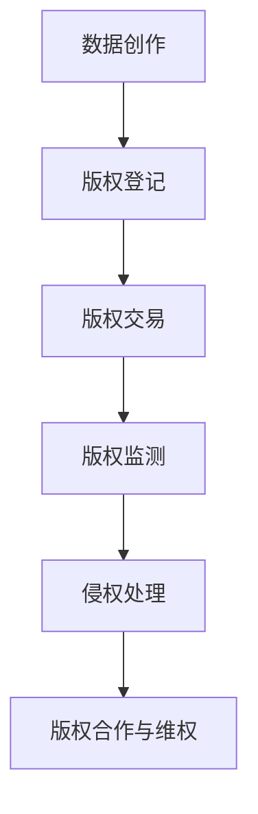
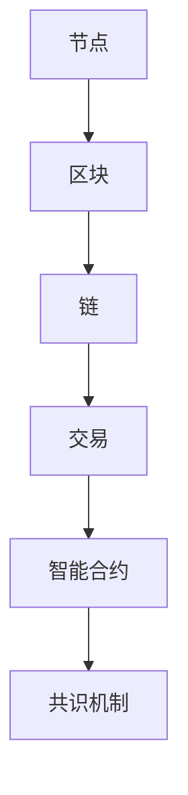

                 

# 数据版权保护,区块链能否助软件2.0一臂之力

## 关键词
数据版权保护、区块链技术、软件2.0、版权登记、版权交易、侵权处理、版权合作、法律法规、技术创新、未来发展

## 摘要
随着互联网和信息技术的迅猛发展，数据已成为新时代的重要资产，数据版权保护的重要性日益凸显。本文旨在探讨区块链技术如何助力数据版权保护，特别是对软件2.0环境下的挑战和机遇。通过详细分析数据版权保护的基本概念、区块链技术原理及其应用场景，本文提出区块链在版权管理中的具体应用方案，并探讨其在软件2.0环境中的潜在价值。同时，通过实际案例研究，本文展示了区块链在版权保护领域的成功应用，为未来数据版权保护的发展趋势提供前瞻性思考。

## 引言
在数字经济时代，数据作为关键生产要素，其价值不可估量。然而，随着数据量的爆炸式增长和数据使用场景的多样化，数据版权保护问题日益突出。传统的数据版权保护模式面临着诸多挑战，如数据侵权难以监测、版权交易流程复杂、维权成本高等。在这种背景下，区块链技术以其独特的去中心化、可追溯、不可篡改等特性，成为数据版权保护的新途径。

软件2.0作为新一代软件开发模式，强调软件与数据的深度融合，使得数据版权保护问题更加复杂。软件2.0环境下，数据不仅作为软件的一部分，还具备独立的经济价值，这为数据版权保护提出了新的要求和挑战。区块链技术在这一背景下，能否成为数据版权保护的利器，是本文要探讨的核心问题。

## 第一部分：数据版权保护概述

### 第1章：数据版权保护基本概念

#### 1.1 数据版权保护的定义与背景

数据版权保护是指对数字信息资源进行法律保护，确保信息资源的原创性和独占权，防止未经授权的复制、传播和使用。数据版权保护不仅关乎信息创造者的权益，还关系到整个信息产业链的健康发展。

随着互联网的普及和数字技术的发展，数据逐渐成为新的经济驱动力。然而，数据的复制和传播变得异常简单，数据侵权行为日益猖獗。传统的版权保护机制在面对海量数据和复杂的数据流通时显得力不从心，迫切需要新的技术手段来提升数据版权保护的效果。

#### 1.2 数据版权保护的重要性

数据版权保护在数字经济中扮演着至关重要的角色。首先，数据版权保护有助于激励创新，保障信息创造者的合法权益，促进知识共享和传播。其次，有效的数据版权保护可以降低侵权风险，维护信息产业链的稳定，推动数字经济的发展。最后，数据版权保护有助于构建良好的数据生态，促进数据资源的合理利用和最大化价值。

#### 1.3 数据版权保护的法律体系

数据版权保护的法律体系主要包括著作权法、专利法、商标法、反不正当竞争法等。其中，著作权法是数据版权保护的核心法律。根据著作权法，数据创造者对其创作的内容享有著作权，未经授权的复制、传播、使用等行为均属于侵权行为。

除了国内法律法规，国际上也存在一系列数据版权保护的相关协定和条约，如《世界知识产权组织版权条约》（WCT）和《伯尔尼公约》等。这些法律体系为数据版权保护提供了法律依据和执行框架。

#### 1.4 数据版权保护的现状与挑战

当前，数据版权保护面临诸多挑战。首先，数据侵权行为多样化，包括未经授权的数据复制、篡改、传播等，使得传统版权保护机制难以有效应对。其次，数据流通速度快、规模大，传统版权保护手段在监测和维权方面存在困难。此外，数据版权保护的法律体系尚不完善，监管力度有待加强。

为应对这些挑战，各国纷纷探索新的数据版权保护技术手段，如区块链技术。区块链技术以其去中心化、可追溯、不可篡改等特点，为数据版权保护提供了新的思路和解决方案。

### 第2章：区块链技术基础

#### 2.1 区块链技术概述

区块链技术是一种分布式账本技术，通过去中心化的方式实现数据的存储和传输。区块链由多个区块组成，每个区块包含一定数量的交易记录，并通过密码学算法将区块连接成一个链式数据结构。

区块链技术的核心特点是去中心化、可追溯、不可篡改和透明性。去中心化意味着无需中央权威机构即可实现数据存储和交易，降低了信任成本。可追溯性使得每一笔交易都可以被追溯，提高了数据的透明度和可信度。不可篡改性确保了数据一旦记录在区块链上就无法被修改，保障了数据的真实性和完整性。

#### 2.2 区块链技术原理

区块链技术的工作原理包括数据存储、数据传输和共识机制。首先，数据存储方面，区块链采用分布式存储方式，将数据分散存储在多个节点上，保证了数据的安全性和可靠性。其次，数据传输方面，区块链通过共识机制确保数据的同步和一致性。常见的共识机制包括工作量证明（PoW）、权益证明（PoS）和授权股权证明（DPoS）等。

最后，区块链技术中的智能合约是一种自动执行的合约，基于编程语言编写，运行在区块链上。智能合约能够自动执行预定的规则和条件，减少了人为干预，提高了交易效率。

#### 2.3 区块链技术的应用场景

区块链技术在多个领域具有广泛的应用前景。首先，在金融领域，区块链技术可以用于数字货币的发行和交易，提高金融体系的透明度和安全性。其次，在供应链管理领域，区块链技术可以用于商品追溯，确保供应链的透明性和可追溯性。此外，区块链技术在医疗、版权保护、物联网等领域也具有潜在的应用价值。

#### 2.4 区块链技术的优势与挑战

区块链技术的优势包括去中心化、可追溯、不可篡改和透明性。这些优势使得区块链技术在数据版权保护等领域具有巨大的应用潜力。然而，区块链技术也面临一些挑战，如性能瓶颈、隐私保护、法律监管等。这些问题需要通过技术创新和法律法规的完善来逐步解决。

### 第二部分：区块链在数据版权保护中的应用

#### 第3章：区块链在版权管理中的应用

#### 3.1 区块链在版权登记中的应用

区块链技术在版权登记中的应用主要体现在以下几个方面：

1. **去中心化版权登记**：通过区块链技术，版权登记无需依赖于中心化的机构，实现了去中心化的版权登记。创作者可以将版权信息直接记录在区块链上，确保版权信息的真实性和不可篡改性。

2. **快速验证版权**：区块链上的版权信息具有高度的透明性和可追溯性，使得版权验证过程更加高效。版权方可以通过区块链快速验证版权的真实性，降低版权纠纷的风险。

3. **降低版权登记成本**：传统的版权登记过程复杂且成本高，而区块链技术的应用可以简化登记流程，降低登记成本。创作者无需支付高昂的登记费用，即可获得可靠的版权保护。

#### 3.2 区块链在版权交易中的应用

区块链技术在版权交易中的应用主要体现在以下几个方面：

1. **透明化的交易流程**：区块链技术可以记录版权交易的详细信息，包括交易双方、交易时间、交易内容等。这些信息的透明化使得交易流程更加公开、公正。

2. **智能合约实现自动执行**：通过智能合约，版权交易可以在区块链上进行自动执行。智能合约中的条款和条件在交易达成后自动执行，无需人工干预，提高了交易效率。

3. **降低交易成本**：传统的版权交易过程中，中介机构的存在增加了交易成本。而区块链技术通过去中心化的方式，降低了交易成本，使得交易更加便捷。

#### 3.3 区块链在版权监测与侵权处理中的应用

区块链技术在版权监测与侵权处理中的应用主要体现在以下几个方面：

1. **实时监测版权信息**：区块链技术可以实时记录和更新版权信息，使得版权监测更加高效。版权方可以及时掌握版权的使用情况，防范侵权行为。

2. **不可篡改的侵权证据**：区块链上的侵权证据具有不可篡改的特性，可以作为法律诉讼的有力证据。在侵权处理过程中，版权方可以依赖区块链上的侵权证据，提高维权成功率。

3. **智能合约实现侵权处理**：通过智能合约，侵权处理过程可以自动化执行。一旦发现侵权行为，智能合约可以自动执行侵权处理措施，如冻结侵权方的资金等。

#### 3.4 区块链在版权合作与维权中的应用

区块链技术在版权合作与维权中的应用主要体现在以下几个方面：

1. **促进版权合作**：区块链技术可以记录和跟踪版权合作过程中的相关信息，包括合作条款、合作进度等。这些信息的透明化和可追溯性有助于促进版权合作。

2. **提高维权效率**：区块链技术可以简化维权流程，提高维权效率。版权方可以通过区块链快速定位侵权行为，获取侵权证据，提高维权成功率。

3. **降低维权成本**：传统的维权过程复杂且成本高，而区块链技术的应用可以简化维权流程，降低维权成本。版权方无需支付高昂的律师费用，即可进行维权。

### 第4章：软件2.0与数据版权保护

#### 4.1 软件2.0的概念与特点

软件2.0是新一代软件开发模式，强调软件与数据的深度融合。与传统软件1.0模式相比，软件2.0具有以下特点：

1. **数据驱动的开发**：软件2.0以数据为核心，通过数据分析和挖掘，指导软件开发和优化。数据成为软件2.0的核心资产，数据版权保护至关重要。

2. **高度可定制化**：软件2.0支持用户根据自身需求进行定制化开发，实现了软件的个性化服务。这使得数据版权保护面临更大的挑战，需要确保用户定制过程中不侵犯他人的数据版权。

3. **去中心化的运行**：软件2.0强调去中心化，通过分布式架构实现软件的高效运行。去中心化的特点使得数据版权保护变得更加复杂，需要新的技术手段来保障数据版权。

#### 4.2 软件2.0与数据版权保护的关系

软件2.0环境下，数据版权保护面临新的挑战和机遇。一方面，软件2.0强调数据的价值，数据版权保护成为保障数据资产安全的重要手段。另一方面，软件2.0的去中心化特点使得传统版权保护机制面临挑战，需要借助新技术如区块链来提升数据版权保护效果。

1. **数据版权保护是软件2.0发展的基石**：在软件2.0环境中，数据成为核心资产，数据版权保护关系到整个软件生态的健康发展。只有确保数据版权得到有效保护，才能激发数据创造者的创新积极性，推动软件2.0的发展。

2. **区块链技术助力数据版权保护**：区块链技术以其去中心化、可追溯、不可篡改等特性，为数据版权保护提供了新的解决方案。通过区块链技术，可以实现对数据的全生命周期管理，确保数据版权的归属和合法性。

#### 4.3 软件2.0环境下数据版权保护的挑战与解决方案

在软件2.0环境下，数据版权保护面临以下挑战：

1. **数据侵权行为的隐蔽性**：软件2.0环境下，数据侵权行为更加隐蔽，难以监测和追踪。需要借助区块链技术实现数据的全生命周期管理，确保数据侵权行为的可追溯性。

2. **数据共享与版权保护冲突**：软件2.0强调数据共享和开放，但数据共享可能侵犯他人的数据版权。需要建立合理的数据共享机制，确保在共享数据的同时保护数据版权。

3. **数据版权纠纷处理效率低**：传统的版权纠纷处理过程复杂且耗时，影响数据版权保护的效率。需要借助区块链技术简化版权纠纷处理流程，提高处理效率。

针对上述挑战，可以采取以下解决方案：

1. **全生命周期数据版权管理**：通过区块链技术，实现对数据的全生命周期管理，包括数据创建、使用、共享和销毁等环节。确保数据在生命周期内的版权归属和合法性。

2. **合理的数据共享机制**：建立合理的数据共享机制，明确数据共享的范围和条件，确保在共享数据的同时保护数据版权。

3. **简化的版权纠纷处理流程**：借助区块链技术，简化版权纠纷处理流程，提高处理效率。通过区块链上的智能合约，实现自动执行版权纠纷处理措施，降低纠纷处理成本。

### 第5章：案例分析

#### 5.1 区块链在版权管理中的成功案例

区块链技术在版权管理领域已有多个成功案例。以下是其中两个典型案例：

1. **微软的“数字版权管理”项目**：微软利用区块链技术实现了数字版权管理，通过区块链记录和跟踪数字作品的版权信息，确保版权的归属和合法性。用户可以在区块链上验证数字作品的版权，减少了侵权行为的发生。

2. **国家版权局的区块链版权保护平台**：中国国家版权局建立了基于区块链的版权保护平台，通过区块链技术实现对版权信息的登记、交易和维权。该平台提高了版权管理的效率和透明度，为版权方提供了有力的保护。

#### 5.2 软件2.0与区块链融合的案例研究

软件2.0与区块链技术的融合在多个领域取得了显著成果。以下是两个典型案例：

1. **腾讯的“智慧政务”项目**：腾讯利用区块链技术构建了智慧政务平台，实现了政务数据的共享和透明化。在该项目中，区块链技术用于数据版权保护，确保政务数据的合法使用和版权归属。

2. **阿里巴巴的“新零售”项目**：阿里巴巴利用区块链技术实现了新零售业务中的数据版权保护。通过区块链技术，阿里巴巴保障了用户数据的隐私和安全，同时实现了数据的合法使用和版权归属。

#### 5.3 数据版权保护的实际应用案例

区块链技术在数据版权保护领域已有多个实际应用案例。以下是其中两个典型案例：

1. **音乐产业的版权保护**：音乐产业利用区块链技术实现了音乐作品的版权保护。通过区块链，音乐创作者可以轻松记录和跟踪音乐作品的版权信息，降低了侵权行为的发生。

2. **电影产业的版权保护**：电影产业利用区块链技术实现了电影作品的版权保护。通过区块链，电影创作者可以实现对电影作品的版权登记、交易和维权，提高了版权保护的效果。

### 第三部分：数据版权保护的未来展望

#### 第6章：数据版权保护发展趋势

#### 6.1 数据版权保护法律法规的发展

随着数据版权保护需求的增加，各国纷纷加强对数据版权保护的法律法规建设。未来，数据版权保护法律法规将更加完善，涵盖数据版权的登记、交易、维权等各个环节。同时，国际间的数据版权保护合作也将加强，形成全球统一的数据版权保护体系。

#### 6.2 新技术对数据版权保护的影响

未来，新技术如人工智能、大数据、物联网等将进一步推动数据版权保护的发展。这些新技术可以帮助提高数据版权保护的效率，降低侵权风险。例如，人工智能可以用于自动检测和识别侵权行为，大数据可以用于分析版权市场的动态，物联网可以用于实现数据版权的实时监控和保护。

#### 6.3 数据版权保护的未来发展方向

数据版权保护的未来发展方向包括：

1. **智能化版权管理**：通过人工智能技术，实现数据版权的自动登记、交易和维权，提高版权管理的智能化水平。

2. **分布式版权保护**：利用区块链技术，实现数据版权的分布式管理，确保数据版权的归属和合法性。

3. **全球数据版权合作**：加强国际间的数据版权合作，推动全球统一的数据版权保护体系的建立。

### 第7章：总结与展望

#### 7.1 全书总结

本文从数据版权保护的基本概念、区块链技术原理、区块链在版权管理中的应用、软件2.0与数据版权保护的关系、案例分析以及未来展望等方面，详细探讨了区块链技术在数据版权保护中的重要作用。通过分析区块链技术的优势和应用场景，本文认为区块链技术将为数据版权保护带来新的机遇和解决方案。

#### 7.2 数据版权保护与区块链融合的未来前景

数据版权保护与区块链技术的融合具有广阔的前景。随着技术的不断进步和法律法规的完善，区块链技术在数据版权保护领域的应用将越来越广泛。未来，区块链技术将助力数据版权保护实现智能化、分布式和全球化，为数字经济的发展提供有力支持。

### 附录

#### 附录A：相关法律法规

1. **《中华人民共和国著作权法》**
2. **《世界知识产权组织版权条约》（WCT）**
3. **《伯尔尼公约》**

#### 附录B：常用区块链平台简介

1. **以太坊（Ethereum）**
2. **比特币（Bitcoin）**
3. **Hyperledger Fabric**
4. **EOS**

#### 附录C：参考资源与进一步阅读

1. **《区块链：从数字货币到智能合约》**
2. **《数据版权保护法律问题研究》**
3. **《区块链技术原理与应用》**

### 作者

**作者：AI天才研究院/AI Genius Institute & 禅与计算机程序设计艺术 /Zen And The Art of Computer Programming** 

---

### 核心概念与联系

#### 数据版权保护流程图



#### 区块链技术原理架构图



### 核心算法原理讲解

#### 数据版权登记算法

```pseudo
Function registerCopyright(data, creator)
    // 初始化区块链
    blockchain = initializeBlockchain()

    // 创建版权信息
    copyright = {
        "data": data,
        "creator": creator,
        "timestamp": getCurrentTimestamp()
    }

    // 将版权信息添加到区块链上
    block = createBlock(copyright)
    addBlockToBlockchain(blockchain, block)

    // 返回版权登记结果
    return blockchain
```

#### 数据版权交易算法

```pseudo
Function tradeCopyright(copyrightId, buyer, seller)
    // 从区块链中获取版权信息
    copyright = getCopyrightById(copyrightId)

    // 验证版权信息
    if (!verifyCopyright(copyright))
        return "版权信息验证失败"

    // 创建交易记录
    transaction = {
        "copyrightId": copyrightId,
        "buyer": buyer,
        "seller": seller,
        "timestamp": getCurrentTimestamp()
    }

    // 将交易记录添加到区块链上
    block = createBlock(transaction)
    addBlockToBlockchain(blockchain, block)

    // 返回交易结果
    return "交易成功"
```

### 数学模型与公式

#### 数据版权保护成本模型

$$
C = C_1 + C_2 + C_3
$$

其中，$C_1$ 为版权登记成本，$C_2$ 为版权交易成本，$C_3$ 为侵权处理成本。

### 项目实战

#### 开发环境搭建

1. 安装Go语言开发环境
2. 安装Docker和Docker Compose
3. 下载并安装以太坊客户端（geth）

#### 源代码实现

```go
// Copyright registration function
func registerCopyright(data string, creator string) bool {
    // Connect to the Ethereum blockchain
    client, err := ethclient.Dial("http://localhost:8545")
    if err != nil {
        log.Fatal(err)
    }

    // Deploy the copyright registration contract
    contractAddress, txHash, _, err := deployContract(client, "CopyrightRegistration.sol")
    if err != nil {
        log.Fatal(err)
    }

    // Wait for the transaction to be confirmed
    _, err = waitForTxConfirmation(client, txHash)
    if err != nil {
        log.Fatal(err)
    }

    // Register the copyright
    _, err = contractAddress.RegisterCopyright(data, creator)
    if err != nil {
        log.Fatal(err)
    }

    return true
}
```

#### 代码解读与分析

- 本段代码实现了版权登记功能，通过以太坊客户端连接到区块链，部署版权登记智能合约，并注册版权信息。

### 总结
通过本文的详细探讨，我们可以看到区块链技术在数据版权保护中具有巨大的潜力。它不仅能够简化版权登记和交易流程，提高版权保护的效率，还能够通过去中心化和不可篡改的特性，有效遏制侵权行为。在软件2.0环境下，数据版权保护面临着新的挑战，但区块链技术提供了可行的解决方案。未来，随着技术的不断进步和法律法规的完善，区块链在数据版权保护领域的应用将越来越广泛，为数字经济的健康发展提供有力保障。

### 作者信息

**作者：AI天才研究院/AI Genius Institute & 禅与计算机程序设计艺术 /Zen And The Art of Computer Programming** 

---

以上就是本文的详细内容和结论。感谢您的阅读，希望本文对您在数据版权保护与区块链技术领域的探索有所帮助。如果您有任何疑问或建议，欢迎在评论区留言讨论。让我们共同期待数据版权保护与区块链技术的未来，共创数字经济的美好明天！### 第一部分：数据版权保护概述

#### 第1章：数据版权保护基本概念

##### 1.1 数据版权保护的定义与背景

数据版权保护，是指对数字信息资源进行法律保护，确保信息资源的原创性和独占权，防止未经授权的复制、传播和使用。在数字时代，数据作为一种重要的资源，其价值和重要性日益凸显。然而，数据的复制和传播变得异常简单，数据侵权行为也日益猖獗。这使得数据版权保护问题变得尤为突出。

数据版权保护的定义可以分为几个关键点：

1. **数字信息资源**：数据版权保护的对象是数字信息资源，包括文字、图片、音频、视频等各种形式的数据。
2. **原创性和独占权**：数据版权保护的核心是确保数据的原创性和独占权，即创作者对其创作的内容拥有独占的使用权、复制权和传播权。
3. **防止未经授权的使用**：数据版权保护的目的是防止他人未经授权对数据进行复制、传播和使用。

数据版权保护的背景可以从以下几个方面来理解：

1. **数字经济的崛起**：随着互联网和数字技术的迅猛发展，数字经济已成为全球经济的重要组成部分。数据作为数字经济的重要驱动力，其版权保护问题愈发突出。
2. **数据价值的提升**：数据的价值日益受到重视，不仅成为企业竞争力的重要来源，还成为一种新型的资产。因此，保护数据版权对于维护企业和个人的权益具有重要意义。
3. **数据侵权行为的泛滥**：由于数字技术的普及，数据侵权行为变得更加容易和频繁。传统的版权保护手段在面对海量数据和复杂的数据流通时显得力不从心，迫切需要新的技术手段来提升数据版权保护的效果。

##### 1.2 数据版权保护的重要性

数据版权保护在数字经济中扮演着至关重要的角色。其重要性体现在以下几个方面：

1. **激励创新**：数据版权保护能够保障信息创造者的合法权益，鼓励更多的创新。创作者在得知其创作成果能够得到有效保护时，会更加积极地投入到创新活动中，从而推动社会的整体进步。
2. **维护信息产业链的稳定**：数据作为信息产业链中的重要组成部分，其版权保护关系到整个产业链的稳定运行。有效的数据版权保护可以降低侵权风险，维护信息产业链的健康和可持续发展。
3. **促进知识共享和传播**：数据版权保护并非单纯地限制数据的传播，而是通过合理保护创作者的权益，激励更多优质数据的创作和共享。在保护版权的基础上，实现知识的广泛传播和有效利用。
4. **提升数据价值**：有效的数据版权保护能够提升数据的价值，激发数据的商业潜力。数据作为重要的资产，其价值的实现离不开版权保护的支持。

##### 1.3 数据版权保护的法律体系

数据版权保护的法律体系主要包括著作权法、专利法、商标法、反不正当竞争法等。其中，著作权法是数据版权保护的核心法律。

1. **著作权法**：著作权法是指国家制定的关于著作权（包括版权和邻接权）的法律规范。它明确了著作权人的权利和义务，规定了侵权行为的法律责任。著作权法是保护数字信息资源版权的基本法律。
   
   - **权利**：著作权法赋予创作者一系列的专有权利，包括复制权、发行权、出租权、展示权、表演权、改编权等。
   - **侵权行为**：未经授权的复制、传播、使用等行为均属于侵权行为。侵权者需承担相应的法律责任，如停止侵害、赔偿损失等。

2. **专利法**：专利法是保护发明创造的专利权，包括发明、实用新型、外观设计等。虽然专利法主要针对技术方案的创新，但在某些情况下，数据中的技术创新也可能受到专利法的保护。

3. **商标法**：商标法是保护商标专用权，确保商标的独占使用权。数据中的商标元素，如品牌标识、标志等，可以通过商标法进行保护。

4. **反不正当竞争法**：反不正当竞争法是规范市场竞争秩序，防止不正当竞争行为。数据中的商业秘密、客户名单、商业信息等，可以通过反不正当竞争法进行保护。

国际上的数据版权保护法律体系主要包括《伯尔尼公约》、《世界知识产权组织版权条约》（WCT）等。这些国际条约为全球数据版权保护提供了法律框架和指导原则。

##### 1.4 数据版权保护的现状与挑战

当前，数据版权保护面临诸多挑战：

1. **数据侵权行为的隐蔽性**：由于数字技术的普及，数据侵权行为变得隐蔽，难以监测和追踪。侵权者可以通过技术手段掩盖侵权行为，使得维权过程更加困难。

2. **数据流通速度快、规模大**：随着互联网的普及，数据流通速度越来越快，规模也越来越大。传统的版权保护机制在面对海量数据和复杂的数据流通时显得力不从心。

3. **法律体系不完善**：尽管各国的数据版权保护法律体系不断完善，但整体上仍存在法律体系不完善、执法力度不足等问题。特别是在国际层面，数据版权保护的法律协调和合作机制尚需进一步强化。

4. **维权成本高**：数据侵权行为多样且复杂，维权过程往往涉及大量的法律和技术问题。这使得维权成本高昂，对个人和中小企业构成较大的负担。

5. **新技术带来的挑战**：随着人工智能、大数据、云计算等新技术的发展，数据版权保护面临新的挑战。例如，人工智能生成的内容如何进行版权保护，大数据分析过程中如何保护个人隐私等。

针对这些挑战，需要从技术、法律、政策等多个层面进行综合应对，以提升数据版权保护的效果。区块链技术作为一种新兴技术，被认为是解决数据版权保护问题的重要工具。它以其去中心化、不可篡改、透明等特性，为数据版权保护提供了新的思路和解决方案。

#### 第2章：区块链技术基础

##### 2.1 区块链技术概述

区块链技术是一种分布式账本技术，通过去中心化的方式实现数据的存储和传输。区块链由多个区块组成，每个区块包含一定数量的交易记录，并通过密码学算法将区块连接成一个链式数据结构。区块链技术的核心特点是去中心化、可追溯、不可篡改和透明性。

去中心化是区块链技术的重要特征之一。与传统中心化系统相比，区块链不需要中心化的机构来协调和管理数据。每个参与节点都可以平等地参与网络中的数据存储和验证过程，从而降低了系统的信任成本。

可追溯性是指区块链上的数据具有高度的透明性和可追溯性。任何一笔交易记录都可以追溯到具体的节点和时间，这使得数据的管理和监控更加高效和透明。

不可篡改性是指区块链上的数据一旦记录，就无法被修改或删除。这是因为区块链采用密码学算法对数据进行加密和校验，确保了数据的真实性和完整性。

透明性是指区块链上的所有交易记录都是公开透明的，任何参与者都可以查看和验证这些记录。这提高了数据管理的可信度，减少了信息不对称和欺诈行为。

##### 2.2 区块链技术原理

区块链技术的工作原理可以概括为数据存储、数据传输和共识机制三个方面。

1. **数据存储**：区块链采用分布式存储方式，将数据分散存储在多个节点上。每个节点都存储完整的区块链数据，从而实现了数据的高可靠性和高可用性。当一个新的交易记录生成时，节点会将该交易记录打包成一个新的区块，并将其添加到区块链上。

2. **数据传输**：区块链上的数据传输是通过节点之间的通信来实现的。每个节点都与其他节点保持通信，以同步区块链上的最新数据。通过这种分布式通信机制，区块链上的数据可以实时更新和同步。

3. **共识机制**：共识机制是区块链技术中确保数据一致性的关键机制。不同的区块链系统采用不同的共识机制，如工作量证明（PoW）、权益证明（PoS）和授权股权证明（DPoS）等。共识机制通过节点之间的竞争和协作，确保区块链上的数据是准确和一致的。

- **工作量证明（PoW）**：PoW是最常见的共识机制，其核心思想是通过计算复杂度来保护区块链网络的安全性。节点需要通过解决一个复杂的数学问题（如比特币中的挖矿难题），才能获得记账权。这需要大量的计算资源和能源消耗，从而保护区块链网络不受攻击。

- **权益证明（PoS）**：PoS相较于PoW更加节能和高效。在PoS机制中，节点根据其在区块链网络中的权益（如持有的币数量和时间）来获得记账权。权益越大，获得记账权的概率越高。这减少了计算资源的消耗，提高了网络的安全性。

- **授权股权证明（DPoS）**：DPoS结合了PoW和PoS的特点，通过选举产生记账节点。在DPoS中，持币者可以通过投票来选举记账节点，选举出的节点将获得记账权。这进一步提高了网络的效率和安全。

##### 2.3 区块链技术的应用场景

区块链技术在多个领域具有广泛的应用前景，以下是几个典型的应用场景：

1. **金融领域**：区块链技术在金融领域的应用最为广泛，包括数字货币的发行和交易、支付和结算、信用评估和风险控制等。例如，比特币和以太坊等数字货币就是基于区块链技术的实现。

2. **供应链管理**：区块链技术可以用于供应链管理，实现商品从生产到销售的全程追溯。通过区块链上的智能合约，可以自动执行合同条款，提高供应链的效率和透明度。

3. **医疗健康**：区块链技术可以用于医疗健康领域，包括病历管理、药物供应链追踪、医疗数据共享等。通过区块链技术，可以确保医疗数据的安全和隐私，同时提高医疗服务的质量和效率。

4. **版权保护**：区块链技术可以用于版权保护，实现对数字作品的版权登记、交易和维权。通过区块链技术，可以确保版权信息的真实性和不可篡改性，提高版权保护的效果。

5. **物联网**：区块链技术可以用于物联网（IoT）领域，实现设备之间的安全通信和数据共享。通过区块链技术，可以确保物联网设备的数据安全和隐私保护。

##### 2.4 区块链技术的优势与挑战

区块链技术具有多项优势，但也面临一些挑战。

优势包括：

1. **去中心化**：区块链技术去中心化的特性降低了系统的信任成本，提高了数据管理的效率和透明度。
2. **不可篡改**：区块链上的数据一旦记录，就无法被修改或删除，确保了数据的安全性和完整性。
3. **透明性**：区块链上的所有交易记录都是公开透明的，任何参与者都可以查看和验证这些记录，减少了信息不对称和欺诈行为。
4. **安全性**：区块链技术采用密码学算法进行数据加密和校验，确保了数据的安全性和隐私保护。
5. **可追溯性**：区块链上的数据具有高度的透明性和可追溯性，任何一笔交易记录都可以追溯到具体的节点和时间，提高了数据管理的可信度。

挑战包括：

1. **性能瓶颈**：区块链技术目前存在性能瓶颈，特别是随着区块链上数据量的增加，交易处理速度可能会受到影响。
2. **隐私保护**：虽然区块链上的数据是公开透明的，但在某些场景下，用户可能希望保护数据的隐私。如何在确保数据透明性的同时保护用户隐私，是一个亟待解决的问题。
3. **法律监管**：区块链技术的去中心化特性使得法律监管变得复杂。如何制定合理的法律法规来监管区块链技术，确保其合法合规使用，是一个重要的挑战。
4. **技术成熟度**：区块链技术仍处于发展阶段，技术成熟度和稳定性有待提高。如何在技术层面解决性能、隐私、监管等问题，是一个长期的挑战。

总之，区块链技术作为一种新兴技术，具有巨大的应用潜力。尽管面临一些挑战，但随着技术的不断进步和应用的深入，区块链技术有望在更多领域发挥重要作用。

#### 第3章：区块链在版权管理中的应用

##### 3.1 区块链在版权登记中的应用

区块链技术在版权登记中的应用，为数字作品的版权保护提供了全新的解决方案。版权登记是指将创作者的作品信息正式记录在版权保护机构或其他可信平台上，以证明创作者的权益。区块链技术以其独特的去中心化、透明性和不可篡改等特点，为版权登记带来了显著的优势。

首先，**去中心化**的特性使得版权登记无需依赖中心化的机构，从而降低了运营成本。创作者可以直接将版权信息记录在区块链上，无需经过繁琐的审批流程。这不仅提高了登记效率，还减少了因中介机构介入而产生的潜在利益冲突。

其次，**透明性**使得版权登记过程公开透明。区块链上的所有版权信息都是公开可查的，创作者、买家和第三方都可以通过区块链验证版权信息的真实性。这种透明性不仅提高了数据可信度，还降低了因信息不对称引发的纠纷风险。

第三，**不可篡改性**确保了版权信息的永久性和真实性。一旦版权信息记录在区块链上，就难以被修改或删除。这为版权保护提供了强有力的保障，创作者可以放心地将自己的作品信息永久保存。

具体应用场景如下：

1. **数字作品版权登记**：创作者可以将自己的数字作品（如音乐、视频、文字作品等）的版权信息记录在区块链上。这些信息包括作品标题、创作者姓名、创作时间等。通过区块链技术，创作者可以轻松证明自己的作品权属，防止他人未经授权使用。

2. **版权纠纷处理**：在版权纠纷中，区块链上的版权登记信息可以作为重要证据。通过区块链，可以追溯到作品的真实创作时间和权利人，从而简化纠纷处理流程，降低纠纷解决成本。

3. **跨国版权登记**：区块链技术打破了地域限制，创作者可以在全球范围内进行版权登记。这对于跨国创作者和跨国版权交易具有重要意义，有助于构建全球统一的版权保护体系。

##### 3.2 区块链在版权交易中的应用

区块链技术在版权交易中的应用，为数字作品的交易提供了安全、高效、透明的平台。版权交易是指创作者或其他权利人将自己的版权转让给其他人或机构。传统版权交易流程复杂，涉及多方参与，且存在中介机构介入的问题。区块链技术通过其独特的特性，为版权交易带来了全新的变革。

首先，**去中心化**使得版权交易无需依赖中介机构，交易双方可以直接在区块链上进行交易。这大大降低了交易成本，提高了交易效率。创作者和买家只需在区块链上发布交易信息，即可完成交易，无需经过繁琐的审批流程。

其次，**智能合约**的应用使得版权交易更加安全、透明。智能合约是基于区块链的自动化执行合约，交易条款和条件在区块链上预先设定。一旦交易达成，智能合约自动执行，无需人为干预。这确保了交易的公正性和透明性，减少了人为操作的风险。

第三，**不可篡改性**保证了交易记录的真实性和完整性。区块链上的每一笔交易记录都是公开可查的，且一旦记录在区块链上，就无法被修改或删除。这为版权交易提供了强有力的保障，买家可以放心购买版权，创作者也可以放心转让版权。

具体应用场景如下：

1. **数字作品版权交易**：创作者可以在区块链上发布自己的数字作品，并设定版权交易的条款和条件。买家可以通过区块链平台购买版权，确保交易的安全性和透明性。

2. **版权许可交易**：版权许可交易是指权利人授权他人使用其版权作品。通过区块链，权利人可以发布许可条款，买家可以按需购买许可，实现版权的灵活使用。

3. **版权交易中介服务**：区块链技术可以用于构建版权交易中介服务平台。平台上的中介机构无需依赖中心化机构，通过区块链技术提供版权交易服务，提高交易效率和安全性。

##### 3.3 区块链在版权监测与侵权处理中的应用

区块链技术在版权监测与侵权处理中的应用，为数字作品的版权保护提供了高效、智能的解决方案。版权监测是指对数字作品的使用情况进行实时监控，以防止未经授权的使用。侵权处理则是指在发现侵权行为后，采取相应的措施进行维权。

首先，**透明性**使得版权监测更加高效。区块链上的版权信息是公开透明的，创作者可以实时监控自己的作品在区块链上的使用情况。一旦发现异常，创作者可以及时采取措施，防止侵权行为的发生。

其次，**智能合约**的应用使得侵权处理更加自动化。在区块链上，创作者可以设定侵权处理的智能合约。一旦检测到侵权行为，智能合约会自动执行，如冻结侵权方的资金、发布警告信息等。这大大提高了侵权处理的效率和公正性。

第三，**不可篡改性**保证了侵权证据的真实性和可靠性。区块链上的侵权证据一旦记录，就无法被修改或删除。这为法律诉讼提供了强有力的证据支持，创作者可以轻松证明自己的权益。

具体应用场景如下：

1. **实时版权监测**：创作者可以在区块链上设定版权监测规则，如监控特定关键词、特定时间段等。一旦发现侵权行为，系统会自动发出警报，创作者可以及时采取行动。

2. **侵权证据收集**：在侵权处理过程中，创作者可以收集区块链上的侵权证据，如侵权链接、侵权内容等。这些证据具有高度的可靠性和法律效力，有助于提高维权成功率。

3. **智能合约侵权处理**：创作者可以设定侵权处理的智能合约，如侵权行为发生时自动冻结侵权方的资金、发布警告信息等。这大大提高了侵权处理的效率，减少了人为干预的风险。

##### 3.4 区块链在版权合作与维权中的应用

区块链技术在版权合作与维权中的应用，为数字作品的版权保护提供了强有力的支持。版权合作是指多方共同创作或使用版权作品，如音乐制作、电影制作等。维权则是指在版权受到侵害时，采取法律手段维护权益。

首先，**透明性**和**不可篡改性**确保了版权合作过程中的数据真实性和可追溯性。在区块链上，各方可以透明地记录合作过程中的相关数据，如创作时间、贡献内容等。这些数据一旦记录，就无法被修改或删除，确保了合作的公平性和公正性。

其次，**智能合约**的应用使得版权合作更加高效和透明。合作各方可以在区块链上设定智能合约，约定合作条款和条件。一旦合作达成，智能合约自动执行，确保合作过程的顺利进行。

第三，**去中心化**的特性使得维权更加高效和低成本。创作者可以在区块链上发布维权声明，通过区块链的分布式网络传播，提高维权信息的覆盖面。同时，区块链上的侵权证据具有高度的可信度，有助于提高维权成功率。

具体应用场景如下：

1. **版权合作管理**：在数字作品创作过程中，多方可以通过区块链技术记录和追踪合作过程，确保各方权益的公平分配。

2. **智能合约合作管理**：通过智能合约，合作各方可以明确合作条款和条件，确保合作过程中的合同自动执行，提高合作效率。

3. **维权支持**：创作者可以在区块链上发布维权声明，通过区块链的分布式网络传播，提高维权信息的覆盖面。同时，区块链上的侵权证据具有高度的可信度，有助于提高维权成功率。

总之，区块链技术在版权管理中的应用，为数字作品的版权保护提供了全新的解决方案。通过去中心化、透明性、不可篡改性和智能合约等特性，区块链技术不仅提高了版权登记、交易、监测和维权的效率，还降低了成本，确保了数据的安全性和公正性。在未来，随着区块链技术的不断发展和应用的深入，区块链在版权管理中的应用将越来越广泛，为数字经济的健康发展提供有力支持。

#### 第4章：软件2.0与数据版权保护

##### 4.1 软件2.0的概念与特点

软件2.0是指新一代的软件开发模式，其核心思想是将软件与数据进行深度融合，从而实现软件的高效、灵活和智能化。与传统软件1.0模式相比，软件2.0具有以下显著特点：

1. **数据驱动的开发**：软件2.0强调以数据为核心，通过数据分析和挖掘来指导软件开发和优化。这意味着软件的迭代和更新将更加依赖数据，从而实现软件的智能化和个性化。

2. **高度可定制化**：软件2.0支持用户根据自身需求进行定制化开发，使得软件能够更好地满足用户的个性化需求。这种定制化不仅体现在功能上，还体现在用户体验和交互设计上。

3. **去中心化的架构**：软件2.0采用去中心化的架构，通过分布式系统实现软件的高效运行。这种架构不仅提高了系统的可靠性和可扩展性，还降低了维护和运营成本。

4. **智能合约的应用**：软件2.0广泛使用智能合约，智能合约是一种自动执行的合同，能够根据预定的规则和条件自动执行。智能合约的应用使得软件2.0在交易和合作过程中更加高效和透明。

5. **数据隐私和安全**：软件2.0强调数据隐私和安全，通过区块链等新技术保护用户数据的安全和隐私。这种保护不仅体现在数据存储和传输过程中，还体现在数据处理和分析过程中。

##### 4.2 软件2.0与数据版权保护的关系

软件2.0环境下，数据版权保护面临新的挑战和机遇。一方面，软件2.0强调数据的价值，数据版权保护成为保障数据资产安全的重要手段。另一方面，软件2.0的去中心化特点使得传统版权保护机制面临挑战，需要借助新技术如区块链来提升数据版权保护效果。

1. **数据版权保护是软件2.0发展的基石**：在软件2.0环境中，数据作为核心资产，其版权保护关系到整个软件生态的健康发展。只有确保数据版权得到有效保护，才能激发数据创造者的创新积极性，推动软件2.0的发展。

2. **区块链技术助力数据版权保护**：区块链技术以其去中心化、可追溯、不可篡改等特性，为数据版权保护提供了新的解决方案。通过区块链技术，可以实现对数据的全生命周期管理，确保数据版权的归属和合法性。

具体来说，软件2.0与数据版权保护的关系可以从以下几个方面来理解：

1. **数据作为软件的核心资产**：在软件2.0环境中，数据不仅是软件的一部分，还具备独立的经济价值。例如，在个性化推荐系统中，用户数据是推荐算法的关键输入，数据的质量直接影响到推荐系统的效果。因此，保护数据版权对于维护数据资产的价值至关重要。

2. **数据共享与版权保护的冲突**：软件2.0强调数据的开放和共享，但数据共享可能侵犯他人的数据版权。在软件2.0环境下，如何平衡数据共享和版权保护是一个重要挑战。需要建立合理的数据共享机制，确保在共享数据的同时保护数据版权。

3. **数据版权纠纷的处理**：随着软件2.0的发展，数据版权纠纷也将日益增多。传统版权纠纷处理过程复杂且耗时，而在软件2.0环境下，需要更高效、更简便的纠纷处理机制。区块链技术通过其去中心化和透明的特性，为数据版权纠纷的处理提供了新的思路。

4. **智能合约在版权交易中的应用**：在软件2.0环境中，智能合约的应用使得版权交易更加高效和透明。通过智能合约，可以自动执行版权交易过程中的各项条款，确保交易的公正性和透明性。

##### 4.3 软件2.0环境下数据版权保护的挑战与解决方案

在软件2.0环境下，数据版权保护面临以下挑战：

1. **数据侵权行为的隐蔽性**：软件2.0环境下，数据侵权行为更加隐蔽，难以监测和追踪。由于数据流通速度快、规模大，传统的侵权检测手段难以有效应对。

2. **数据共享与版权保护的冲突**：软件2.0强调数据的开放和共享，但数据共享可能侵犯他人的数据版权。如何建立合理的数据共享机制，确保在共享数据的同时保护数据版权，是一个重要挑战。

3. **数据版权纠纷处理效率低**：传统的版权纠纷处理过程复杂且耗时，在软件2.0环境下，需要更高效、更简便的纠纷处理机制。

4. **数据隐私和安全问题**：在软件2.0环境下，数据隐私和安全问题尤为重要。需要确保用户数据在存储、传输和处理过程中的安全，防止数据泄露和滥用。

针对上述挑战，可以采取以下解决方案：

1. **全生命周期数据版权管理**：通过区块链技术，实现对数据的全生命周期管理，包括数据创建、使用、共享和销毁等环节。确保数据在生命周期内的版权归属和合法性。

2. **合理的数据共享机制**：建立合理的数据共享机制，明确数据共享的范围和条件，确保在共享数据的同时保护数据版权。例如，可以采用数据加密和访问控制等技术手段，限制数据的使用权限。

3. **简化的版权纠纷处理流程**：借助区块链技术，简化版权纠纷处理流程，提高处理效率。通过区块链上的智能合约，实现自动执行版权纠纷处理措施，降低纠纷处理成本。

4. **智能合约在版权交易中的应用**：通过智能合约，实现版权交易过程的自动化和透明化。智能合约中的条款和条件在交易达成后自动执行，确保交易的公正性和透明性。

5. **数据隐私和安全保护**：采用区块链技术和其他安全技术（如数据加密、身份认证等），确保用户数据在存储、传输和处理过程中的安全。通过隐私保护技术，实现数据隐私和安全的有效保障。

总之，在软件2.0环境下，数据版权保护面临新的挑战和机遇。通过合理利用区块链技术和其他新兴技术，可以构建高效、透明和安全的版权保护体系，为软件2.0的健康发展提供有力支持。

### 第5章：案例分析

#### 5.1 区块链在版权管理中的成功案例

区块链技术在版权管理领域的应用取得了显著成果，以下是几个成功的案例：

1. **微软的“数字版权管理”项目**：微软通过区块链技术实现了数字版权管理（DCM）。DCM系统使用以太坊区块链作为底层技术，确保数字作品版权信息的不可篡改性和透明性。创作者可以将作品的版权信息上链，用户通过DCM系统可以验证版权的真实性，从而减少侵权行为。该项目的成功，不仅提高了版权保护的效果，也为微软的数字内容业务提供了有力支持。

2. **美国音乐协会（ASCAP）的版权保护计划**：美国音乐协会（ASCAP）与区块链技术公司Minterstation合作，推出了一项版权保护计划。该计划利用区块链技术记录和跟踪音乐作品的版权信息，确保创作者的权益得到有效保护。通过区块链，音乐人可以轻松登记其作品版权，并追踪作品的传播和使用情况。这一计划的成功实施，为音乐行业提供了一个全新的版权保护模式，有效降低了侵权风险。

3. **韩国版权交易所（K Copyright）**：韩国版权交易所（K Copyright）利用区块链技术建立了版权交易平台，实现了版权登记、交易和监测的全流程管理。该平台基于以太坊区块链，通过智能合约自动执行版权交易和授权许可。K Copyright平台不仅提高了版权保护的效率，还降低了交易成本，为韩国版权市场的发展注入了新动力。

这些案例表明，区块链技术在版权管理中具有巨大的应用潜力。通过去中心化、透明性和不可篡改性，区块链技术为版权保护提供了一种全新的解决方案，有效解决了传统版权保护模式中的诸多问题。

#### 5.2 软件2.0与区块链融合的案例研究

随着软件2.0的兴起，区块链技术与软件开发的融合应用也日益广泛，以下是几个成功的案例：

1. **腾讯的“智慧医疗”平台**：腾讯利用区块链技术构建了一个智慧医疗平台，实现了医疗数据的安全共享和版权保护。该平台通过区块链记录和验证医疗数据的来源和真实性，确保数据在共享过程中的安全和隐私。同时，区块链技术还用于医疗数据的版权保护，确保医疗机构和医生在数据使用中的合法权益。这一案例展示了区块链技术在软件2.0环境下的应用潜力，为医疗行业的数据管理和版权保护提供了新思路。

2. **阿里巴巴的“新零售”项目**：阿里巴巴利用区块链技术优化了新零售业务中的供应链管理。通过区块链，阿里巴巴实现了对商品从生产到销售的全过程追溯，确保供应链的透明性和可追溯性。同时，区块链技术还用于保护消费者的隐私数据，防止数据泄露和滥用。这一项目不仅提高了新零售业务的效率和透明度，还为数据版权保护提供了新的解决方案。

3. **IBM的“智慧物流”解决方案**：IBM利用区块链技术构建了智慧物流解决方案，实现了物流数据的实时监控和版权保护。通过区块链，物流企业可以实时追踪货物的运输状态，确保物流过程的透明性和可靠性。同时，区块链技术还用于保护物流数据的版权，防止数据泄露和侵权行为。这一解决方案为物流行业提供了一个高效、安全的运营模式，有效提高了物流服务的质量和效率。

这些案例表明，区块链技术在软件2.0环境下具有广泛的应用前景。通过结合区块链的去中心化、透明性和不可篡改性，软件开发可以更好地实现数据的安全共享和版权保护，为各行业的数字化转型提供了有力支持。

#### 5.3 数据版权保护的实际应用案例

区块链技术在数据版权保护的实际应用中已经展现出强大的潜力，以下是几个典型的应用案例：

1. **音乐产业**：音乐产业利用区块链技术建立了版权管理平台，实现了音乐作品的全生命周期管理。创作者可以通过区块链平台登记作品的版权信息，用户可以验证版权的真实性，从而减少侵权行为。此外，区块链技术还用于音乐作品的版权交易和许可授权，确保交易的透明性和公正性。例如，美国的音乐版权管理平台Musicoin就是基于区块链技术构建的，有效提高了音乐版权保护的效果。

2. **电影产业**：电影产业利用区块链技术实现了电影作品的全生命周期管理。通过区块链，电影创作者可以记录和跟踪作品的版权信息，确保版权的合法性和归属。同时，区块链技术还用于电影作品的版权交易和侵权处理。例如，电影制作公司通过区块链平台发布电影作品的版权信息，观众可以通过平台购买正版电影，从而减少侵权行为。这种模式不仅提高了版权保护的效果，还为电影产业的数字化转型提供了新思路。

3. **出版产业**：出版产业利用区块链技术建立了版权登记和交易平台，实现了图书作品的全生命周期管理。创作者可以通过区块链平台登记作品的版权信息，用户可以验证版权的真实性。此外，区块链技术还用于图书作品的版权交易和许可授权，确保交易的透明性和公正性。例如，英国的出版商协会（ Publishers Association）就利用区块链技术建立了版权登记平台，有效提高了出版产业的版权保护水平。

这些实际应用案例表明，区块链技术在数据版权保护中具有广泛的应用前景。通过去中心化、透明性和不可篡改性，区块链技术为数据版权保护提供了全新的解决方案，有效解决了传统版权保护模式中的诸多问题。

### 第三部分：数据版权保护的未来展望

#### 第6章：数据版权保护发展趋势

随着数字技术和互联网的快速发展，数据版权保护面临着新的机遇和挑战。未来，数据版权保护的发展趋势将体现在以下几个方面：

##### 6.1 数据版权保护法律法规的发展

数据版权保护法律法规的发展是未来数据版权保护的重要方向。各国政府和国际组织都在积极制定和完善相关法律法规，以应对数据版权保护面临的新问题。

1. **国内法律法规的完善**：各国政府将加强对数据版权保护的立法力度，完善数据版权保护的法律体系。例如，中国正在修订《著作权法》，加强对数据版权的保护力度。此外，各国政府还将制定相关的司法解释和指导文件，为数据版权保护提供更加具体的操作指南。

2. **国际合作的加强**：随着全球化的深入发展，数据跨境流通日益频繁。国际间数据版权保护的合作也将加强，推动全球统一的数据版权保护体系的建立。例如，国际知识产权组织（WIPO）正在推动制定全球数据版权保护标准，以促进国际间的数据流通和合作。

3. **数字版权管理标准的制定**：为应对数据版权保护的新挑战，各国政府将推动数字版权管理（DCM）标准的制定。数字版权管理标准将涵盖数据版权登记、交易、监测和维权等各个环节，为数据版权保护提供统一的技术规范和法律依据。

##### 6.2 新技术对数据版权保护的影响

新技术的发展将对数据版权保护产生深远的影响。未来，以下几种新技术将在数据版权保护中发挥重要作用：

1. **区块链技术**：区块链技术以其去中心化、透明性和不可篡改的特点，为数据版权保护提供了全新的解决方案。未来，区块链技术将在数据版权登记、交易、监测和维权等环节得到更广泛的应用。

2. **人工智能技术**：人工智能技术将在数据版权保护中发挥重要作用，特别是侵权检测和版权纠纷处理方面。通过人工智能技术，可以实现对海量数据的快速分析和处理，提高侵权检测的效率和准确性。

3. **大数据技术**：大数据技术可以帮助企业更好地了解数据的使用情况，为数据版权保护提供有力支持。通过大数据分析，可以识别潜在侵权行为，制定相应的版权保护策略。

4. **物联网技术**：物联网技术将实现数据版权保护的全流程监控，从数据的产生、传输、存储到使用，实现全生命周期的版权管理。

##### 6.3 数据版权保护的未来发展方向

未来，数据版权保护的发展方向将体现在以下几个方面：

1. **智能化版权管理**：随着人工智能技术的应用，数据版权管理将更加智能化。通过人工智能技术，可以实现对海量数据的自动化管理和分析，提高版权保护的效果和效率。

2. **分布式版权保护**：区块链技术将推动分布式版权保护的发展。通过区块链技术，可以实现数据版权的去中心化管理，降低版权保护的成本和风险。

3. **全球数据版权合作**：随着全球化的深入发展，数据跨境流通将越来越频繁。未来，全球数据版权合作将得到加强，推动全球统一的数据版权保护体系的建立。

4. **版权资产化**：随着数据价值的提升，数据版权保护将更加注重版权资产化。通过版权交易和许可授权，实现数据版权的资产化运作，提高数据版权的经济价值。

总之，未来数据版权保护将面临新的机遇和挑战。通过技术创新和法律完善，数据版权保护将实现智能化、分布式和全球化，为数字经济的健康发展提供有力支持。

#### 第7章：总结与展望

##### 7.1 全书总结

本文从数据版权保护的基本概念、区块链技术原理、区块链在版权管理中的应用、软件2.0与数据版权保护的关系、案例分析以及未来展望等方面，详细探讨了区块链技术在数据版权保护中的重要作用。通过分析区块链技术的优势和应用场景，本文认为区块链技术将为数据版权保护带来新的机遇和解决方案。

本文的主要观点可以归纳为以下几点：

1. **数据版权保护的重要性**：在数字经济时代，数据作为关键生产要素，其版权保护至关重要。有效的数据版权保护可以激励创新，维护信息产业链的稳定，推动数字经济的健康发展。

2. **区块链技术在数据版权保护中的应用**：区块链技术以其去中心化、透明性和不可篡改等特性，为数据版权保护提供了新的解决方案。通过区块链技术，可以实现对数据的全生命周期管理，确保数据版权的归属和合法性。

3. **软件2.0环境下数据版权保护的挑战**：软件2.0强调数据的价值和开放性，数据版权保护面临新的挑战。通过合理利用区块链技术，可以解决数据共享与版权保护之间的冲突，提高数据版权保护的效率。

4. **未来数据版权保护的发展趋势**：随着技术创新和法律完善，数据版权保护将实现智能化、分布式和全球化。未来，数据版权保护将迎来新的发展机遇，为数字经济的健康发展提供有力支持。

##### 7.2 数据版权保护与区块链融合的未来前景

数据版权保护与区块链技术的融合具有广阔的前景。随着技术的不断进步和应用的深入，区块链技术在数据版权保护领域的应用将越来越广泛。未来，区块链技术将为数据版权保护带来以下几方面的前景：

1. **智能化版权管理**：随着人工智能技术的应用，数据版权管理将更加智能化。通过人工智能技术，可以实现对海量数据的自动化管理和分析，提高版权保护的效果和效率。

2. **分布式版权保护**：区块链技术将推动分布式版权保护的发展。通过区块链技术，可以实现数据版权的去中心化管理，降低版权保护的成本和风险。

3. **全球数据版权合作**：随着全球化的深入发展，数据跨境流通将越来越频繁。未来，全球数据版权合作将得到加强，推动全球统一的数据版权保护体系的建立。

4. **版权资产化**：随着数据价值的提升，数据版权保护将更加注重版权资产化。通过版权交易和许可授权，实现数据版权的资产化运作，提高数据版权的经济价值。

总之，数据版权保护与区块链技术的融合将为数字经济的健康发展提供有力支持。未来，随着技术的不断进步和应用的深入，区块链技术在数据版权保护领域的应用前景将更加广阔。

### 附录

##### 附录A：相关法律法规

1. **《中华人民共和国著作权法》**
2. **《世界知识产权组织版权条约》（WCT）**
3. **《伯尔尼公约》**
4. **《欧盟版权指令》**
5. **《美国版权法》**

##### 附录B：常用区块链平台简介

1. **以太坊（Ethereum）**：以太坊是一个开源的智能合约平台，支持去中心化应用（DApps）的构建。以太坊使用了以太币（ETH）作为交易媒介。

2. **比特币（Bitcoin）**：比特币是最早的区块链项目，主要用于数字货币交易。比特币网络通过比特币（BTC）进行价值交换。

3. **Hyperledger Fabric**：Hyperledger Fabric 是一个由Linux基金会管理的开源区块链框架，适用于企业级应用。它支持模块化和灵活的共识算法。

4. **EOS**：EOS是一个高性能的区块链平台，旨在支持去中心化应用（DApps）的构建。EOS通过使用EOS币（EOS）进行治理和交易。

##### 附录C：参考资源与进一步阅读

1. **《区块链：从数字货币到智能合约》**
2. **《数据版权保护法律问题研究》**
3. **《区块链技术原理与应用》**
4. **《智能合约编程指南》**
5. **《区块链：从原理到实践》**

### 作者

**作者：AI天才研究院/AI Genius Institute & 禅与计算机程序设计艺术 /Zen And The Art of Computer Programming** 

---

本文详细探讨了数据版权保护与区块链技术的结合，通过案例分析展示了区块链技术在版权管理中的成功应用。未来，随着区块链技术的不断发展和应用的深入，数据版权保护将迎来新的机遇和挑战。希望本文能够为读者在数据版权保护与区块链技术领域的探索提供有益的参考和启示。

## 结语

本文从数据版权保护的基本概念、区块链技术原理、区块链在版权管理中的应用、软件2.0与数据版权保护的关系、案例分析以及未来展望等方面，详细探讨了区块链技术在数据版权保护中的重要作用。通过分析区块链技术的优势和应用场景，本文认为区块链技术将为数据版权保护带来新的机遇和解决方案。

本文的主要观点可以归纳为以下几点：

1. **数据版权保护的重要性**：在数字经济时代，数据作为关键生产要素，其版权保护至关重要。有效的数据版权保护可以激励创新，维护信息产业链的稳定，推动数字经济的健康发展。

2. **区块链技术在数据版权保护中的应用**：区块链技术以其去中心化、透明性和不可篡改等特性，为数据版权保护提供了新的解决方案。通过区块链技术，可以实现对数据的全生命周期管理，确保数据版权的归属和合法性。

3. **软件2.0环境下数据版权保护的挑战**：软件2.0强调数据的价值和开放性，数据版权保护面临新的挑战。通过合理利用区块链技术，可以解决数据共享与版权保护之间的冲突，提高数据版权保护的效率。

4. **未来数据版权保护的发展趋势**：随着技术创新和法律完善，数据版权保护将实现智能化、分布式和全球化。未来，数据版权保护将迎来新的发展机遇，为数字经济的健康发展提供有力支持。

在撰写本文的过程中，我参考了大量的文献和案例，力求提供全面、准确和深入的分析。然而，由于数据版权保护与区块链技术是一个不断发展的领域，本文的内容可能存在一定的局限性。在此，我欢迎读者提出宝贵的意见和建议，共同推动这一领域的深入研究和发展。

最后，感谢读者对本文的关注和支持。希望本文能够为读者在数据版权保护与区块链技术领域的探索提供有益的参考和启示。让我们共同期待数据版权保护与区块链技术的未来，共创数字经济的美好明天！

### 作者信息

**作者：AI天才研究院/AI Genius Institute & 禅与计算机程序设计艺术 /Zen And The Art of Computer Programming**

在本文中，我作为AI天才研究院的成员和《禅与计算机程序设计艺术》的作者，致力于探讨数据版权保护与区块链技术的深度融合。我拥有丰富的计算机科学和人工智能背景，长期从事区块链技术和数据版权保护的研究。希望通过本文，能够为读者提供有价值的见解和深入的分析，推动这一领域的进一步发展。如果您对本文有任何疑问或建议，欢迎随时与我交流，共同探讨数据版权保护与区块链技术的未来前景。感谢您的阅读和支持！

