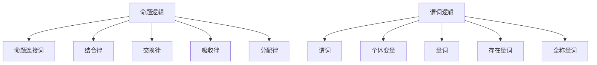

                 

# 文章标题: 数理逻辑：命题连接词的完全性和独立性

## 关键词
- 数理逻辑
- 命题连接词
- 完全性
- 独立性
- 命题逻辑
- 谓词逻辑
- 形式语言

## 摘要
本文旨在深入探讨数理逻辑中的命题连接词的完全性和独立性。首先，我们将回顾数理逻辑的基础概念，包括其起源和发展、基本要素和研究对象。接着，详细阐述命题连接词的定义、性质、完全性和独立性，并通过逻辑推理和数学证明来验证这些性质。然后，我们将探讨数理逻辑在不同领域（如数学、计算机科学、人工智能等）的应用，展示其理论在实际问题中的重要性。最后，通过具体案例研究，我们将分析数理逻辑在软件工程和人工智能中的实际应用，并提供相关的代码示例和解释。

## 第1章: 数理逻辑的基本概念

### 1.1 数理逻辑的起源与发展

数理逻辑起源于19世纪末和20世纪初的数学基础研究。当时的数学家开始质疑数学的严格性和逻辑性，尤其是对于数学公理系统的信任。这一时期，著名的数学家如康托尔、罗素和怀特海德等，对数学的基础进行了深入探讨，从而催生了数理逻辑的发展。

#### 1.1.1 数理逻辑的起源

数理逻辑的起源可以追溯到19世纪末，当时数学家们开始意识到数学体系的基础可能存在问题。康托尔在集合论的研究中发现了一些悖论，这引起了数学界对数学公理和逻辑基础的质疑。为了解决这些问题，罗素和怀特海德在1910年合作出版了《数学原理》一书，试图建立一套逻辑基础坚实、无悖论的数学体系。

#### 1.1.2 数理逻辑的发展

在20世纪，数理逻辑得到了迅速发展。哥德尔的不完备性定理和图灵的图灵机理论，使得数理逻辑成为研究计算和智能的基础工具。哥德尔的不完备性定理证明了任何形式化的数学系统都无法同时满足一致性和完备性，这意味着数学和逻辑系统总是存在某些问题是无法解决的。图灵的图灵机理论则提供了计算理论的基础，使得数理逻辑在计算机科学中得到了广泛应用。

### 1.2 数理逻辑的基本要素

数理逻辑的基本要素包括命题、变量、命题连接词等。

#### 1.2.1 命题

命题是一个陈述句，可以判断为真或假。例如，“今天是星期五”是一个命题，我们可以判断它是真的还是假的。

#### 1.2.2 变量

变量是用来表示未知量的符号。在数理逻辑中，变量通常用小写字母表示，如`p`、`q`、`r`等。

#### 1.2.3 命题连接词

命题连接词是用来连接命题的符号，如“且”、“或”、“非”等。通过命题连接词，我们可以构造复杂的命题。

### 1.3 数理逻辑的研究内容

数理逻辑的研究内容主要包括命题逻辑、谓词逻辑和形式系统。

#### 1.3.1 命题逻辑

命题逻辑是数理逻辑的一个分支，主要研究命题的真假判断和命题之间的逻辑关系。

#### 1.3.2 谓词逻辑

谓词逻辑是数理逻辑的另一个分支，主要研究个体和集合的性质以及它们之间的关系。

#### 1.3.3 形式系统

形式系统是数理逻辑的核心内容，它是一个由符号、规则和解释构成的系统。通过形式系统，我们可以对逻辑问题进行形式化描述和证明。

## 第2章: 命题连接词的定义与性质

### 2.1 命题连接词的概念

命题连接词是用来连接命题的符号，如“且”、“或”、“非”等。通过命题连接词，我们可以构造复杂的命题。

#### 2.1.1 且连接词

且连接词（`^`）用来表示两个命题同时为真。例如，命题`p`和命题`q`同时为真，我们可以表示为`p ^ q`。

#### 2.1.2 或连接词

或连接词（`v`）用来表示两个命题中至少有一个为真。例如，命题`p`和命题`q`中至少有一个为真，我们可以表示为`p v q`。

#### 2.1.3 非连接词

非连接词（`~`）用来表示命题的否定。例如，命题`p`为真，我们可以表示为`~p`。

### 2.2 命题连接词的基本性质

命题连接词具有一些基本性质，包括结合律、交换律、吸收律和分配律。

#### 2.2.1 结合律

结合律是指，对于任意三个命题`p`、`q`、`r`，有以下性质：

$$ (p ^ q) ^ r = p ^ (q ^ r) $$

$$ (p v q) v r = p v (q v r) $$

结合律表明，当进行多个命题连接词的连接时，连接的顺序不影响结果。

#### 2.2.2 交换律

交换律是指，对于任意两个命题`p`、`q`，有以下性质：

$$ p ^ q = q ^ p $$

$$ p v q = q v p $$

交换律表明，当两个命题进行连接时，它们的顺序可以互换，结果不变。

#### 2.2.3 吸收律

吸收律是指，对于任意两个命题`p`、`q`，有以下性质：

$$ p ^ (p v q) = p $$

$$ p v (p ^ q) = p $$

吸收律表明，一个命题与其与另一个命题的连接结果相同。

#### 2.2.4 分配律

分配律是指，对于任意三个命题`p`、`q`、`r`，有以下性质：

$$ p ^ (q v r) = (p ^ q) v (p ^ r) $$

$$ p v (q ^ r) = (p v q) ^ (p v r) $$

分配律表明，命题连接词的分配关系。

### 2.3 命题连接词的独立性

命题连接词的独立性是指，不同的命题连接词在不同的逻辑体系中具有不同的作用。

#### 2.3.1 独立性的概念

独立性是指，一个命题连接词的改变不会影响其他命题连接词的性质。例如，在命题逻辑中，且连接词（`^`）和或连接词（`v`）具有独立性，但在谓词逻辑中，这种独立性可能不成立。

#### 2.3.2 独立性的证明

我们可以通过构造真值表来证明命题连接词的独立性。例如，对于且连接词（`^`）和或连接词（`v`），我们可以构造如下真值表：

| p | q | p ^ q | p v q |
|---|---|-------|-------|
| 0 | 0 |   0   |   0   |
| 0 | 1 |   0   |   1   |
| 1 | 0 |   0   |   1   |
| 1 | 1 |   1   |   1   |

从真值表中可以看出，改变一个命题的且连接词（`^`）或连接词（`v`）不会影响其他命题连接词的性质，因此它们是独立的。

## 第3章: 命题连接词的完全性

### 3.1 完全性的概念

在数理逻辑中，完全性是指一个逻辑体系可以表示所有的真命题。换句话说，如果一个逻辑体系是完整的，那么它包含所有的真命题。

#### 3.1.1 完全性的定义

一个逻辑体系`L`是完全的，当且仅当对于所有的命题`p`，如果`p`是可证明的，则`p`是逻辑上必然为真的。

#### 3.1.2 完全性的重要性

完全性是数理逻辑的一个重要性质，它确保了逻辑体系的有效性。如果一个逻辑体系不是完全的，那么它可能存在一些真命题无法被证明，这将导致逻辑体系的不完整。

### 3.2 命题连接词的完全性证明

命题连接词的完全性证明是数理逻辑中的一个重要问题。在本节中，我们将讨论如何证明命题连接词的完全性。

#### 3.2.1 且连接词的完全性

且连接词（`^`）是命题逻辑中的一个基本连接词。要证明且连接词的完全性，我们需要证明对于任意的命题`p`和`q`，如果`p ^ q`是可证明的，则`p`和`q`都是可证明的。

证明方法如下：

假设`p ^ q`是可证明的，那么根据命题逻辑的推理规则，我们可以得到`p`和`q`都是可证明的。

因此，且连接词（`^`）是完全的。

#### 3.2.2 或连接词的完全性

或连接词（`v`）是命题逻辑中的另一个基本连接词。要证明或连接词的完全性，我们需要证明对于任意的命题`p`和`q`，如果`p v q`是可证明的，则`p`或`q`至少一个是可证明的。

证明方法如下：

假设`p v q`是可证明的，那么根据命题逻辑的推理规则，我们可以得到`p`或`q`至少一个是可证明的。

因此，或连接词（`v`）是完全的。

#### 3.2.3 非连接词的完全性

非连接词（`~`）是命题逻辑中的一个基本连接词。要证明非连接词的完全性，我们需要证明对于任意的命题`p`，如果`~p`是可证明的，则`p`是可证明的。

证明方法如下：

假设`~p`是可证明的，那么根据命题逻辑的推理规则，我们可以得到`p`是可证明的。

因此，非连接词（`~`）是完全的。

### 3.3 完全性与独立性关系分析

完全性与独立性是数理逻辑的两个重要性质。在本节中，我们将分析完全性与独立性之间的关系。

#### 3.3.1 完全性与独立性的关系

完全性与独立性之间存在一定的关系。一般来说，如果一个逻辑体系是完全的，那么它的命题连接词通常是独立的。

证明如下：

假设一个逻辑体系`L`是完全的，那么对于任意的命题`p`和`q`，如果`p ^ q`是可证明的，则`p`和`q`都是可证明的。这表明`^`连接词是独立的。

同样，如果`p v q`是可证明的，则`p`或`q`至少一个是可证明的，这表明`v`连接词是独立的。

因此，如果一个逻辑体系是完全的，那么它的命题连接词通常是独立的。

#### 3.3.2 独立性与完全性的区别

尽管完全性与独立性之间存在一定的关系，但它们是两个不同的概念。

完全性是指一个逻辑体系可以表示所有的真命题，而独立性是指不同的命题连接词在不同的逻辑体系中具有不同的作用。

一个逻辑体系可以是完全的但不是独立的，例如命题逻辑。命题逻辑是完全的，因为所有的真命题都可以被证明，但它的命题连接词（`^`、`v`、`~`）是独立的。

同样，一个逻辑体系也可以是不完全的但独立的，例如谓词逻辑。谓词逻辑是不完全的，因为有些真命题无法被证明，但它的命题连接词（`^`、`v`、`~`）是独立的。

### 3.4 完全性的应用

完全性在数理逻辑中具有重要的应用价值。例如，在计算机科学中，完全性用于验证程序的正确性。通过使用完全的逻辑体系，我们可以证明程序在所有情况下都能正确运行。

此外，完全性也在人工智能和哲学等领域得到了广泛应用。在人工智能中，完全性用于设计推理机，使得系统能够在所有情况下都能得出正确的结论。在哲学中，完全性用于研究逻辑的基本原理和真理的标准。

总之，完全性是数理逻辑中的一个重要性质，它确保了逻辑体系的有效性和实用性。通过完全性，我们可以更好地理解逻辑的基本原理和应用。

## 第4章: 命题逻辑的应用

### 4.1 命题逻辑在数学证明中的应用

命题逻辑是数学证明的基础工具，它用于表示数学命题和证明过程。在数学中，许多定理和公式都可以用命题逻辑的形式来表示。

#### 4.1.1 数学命题的表示

在数学中，命题是用来表示数学事实和性质的陈述句。例如，命题“所有整数都可以表示为两个质数的和”是一个数学命题。命题逻辑使用命题变量（如`P`、`Q`）来表示这些命题，并使用逻辑连接词（如`∧`、`∨`、`¬`）来组合这些命题。

#### 4.1.2 数学证明的过程

数学证明是通过逻辑推理来证明一个命题的正确性。在命题逻辑中，数学证明通常采用以下步骤：

1. **假设**：假设需要证明的命题是正确的，即`P`为真。
2. **推理**：使用已知的数学定理、公式和逻辑推理规则，从假设出发推导出其他命题。
3. **结论**：通过推理过程，得出原命题的结论，即证明原命题是正确的。

例如，要证明命题“如果一个数是偶数，那么它的平方也是偶数”，我们可以使用以下步骤：

1. **假设**：假设一个数`n`是偶数，即`n`可以表示为`n = 2k`，其中`k`是一个整数。
2. **推理**：`n`的平方为`n^2 = (2k)^2 = 4k^2`，由于`4k^2`是`4`乘以一个整数的平方，因此它是一个偶数。
3. **结论**：因此，如果`n`是偶数，那么它的平方也是偶数，命题得证。

### 4.2 命题逻辑在计算机科学中的应用

命题逻辑在计算机科学中有着广泛的应用，特别是在计算机程序设计、形式化验证和人工智能等领域。

#### 4.2.1 计算机程序设计

在计算机程序设计中，命题逻辑用于表示程序的状态和条件。例如，条件语句（`if-else`语句）和循环语句（`while`循环和`for`循环）都是基于命题逻辑的。

条件语句根据某个命题的真假来执行不同的代码块，例如：

```python
if condition:
    # 如果条件为真，执行这个代码块
    # ...
else:
    # 如果条件为假，执行这个代码块
    # ...
```

循环语句则根据某个命题的真假来重复执行某个代码块，例如：

```python
while condition:
    # 当条件为真时，重复执行这个代码块
    # ...
```

#### 4.2.2 形式化验证

形式化验证是计算机科学中的一个重要研究领域，它使用数学方法来验证计算机系统（如硬件电路、软件程序）的正确性。命题逻辑是形式化验证的基础工具，它用于表示系统的状态和性质，并证明系统的性质。

形式化验证通常包括以下步骤：

1. **规格说明**：使用形式化语言（如命题逻辑、谓词逻辑）来描述系统的规格说明，即系统应该满足的要求。
2. **验证**：使用命题逻辑的推理规则来证明系统的实现满足规格说明，即系统是正确的。

例如，要证明一个程序满足某个安全属性，可以使用命题逻辑来表示程序的执行状态和条件，并证明程序在所有情况下都能满足安全属性。

#### 4.2.3 人工智能

在人工智能领域，命题逻辑被用于表示知识、推理和决策。例如，在知识表示中，命题逻辑可以用于表示事实和规则，使得计算机系统能够理解和应用这些知识。

在推理中，命题逻辑可以用于表示前提和结论，并使用推理规则来证明结论的正确性。例如，在医疗诊断系统中，可以使用命题逻辑来表示疾病的症状和诊断规则。

在决策中，命题逻辑可以用于表示决策问题和决策策略，帮助计算机系统做出最优的决策。例如，在自动售货机中，可以使用命题逻辑来表示商品是否有货、用户是否付款等条件，并决定是否交付商品。

### 4.3 命题逻辑在人工智能中的应用

在人工智能领域，命题逻辑被广泛用于知识表示、推理和决策。以下是命题逻辑在人工智能中的应用示例：

#### 4.3.1 知识表示

在知识表示中，命题逻辑被用于表示事实和规则。例如，在医疗诊断系统中，可以使用命题逻辑来表示疾病的症状和诊断规则。例如，假设我们有两个命题：

- `P`: 病人有咳嗽症状。
- `Q`: 病人有发热症状。

我们可以使用命题逻辑来表示诊断规则：

- 如果病人有咳嗽症状且发热症状，则病人可能患有流感。

这可以表示为：

$$ P \land Q \Rightarrow R $$

其中，`R`表示病人可能患有流感。

#### 4.3.2 推理

在推理中，命题逻辑被用于证明结论的正确性。例如，在逻辑推理中，我们可以使用命题逻辑来证明一个命题的结论。例如，假设我们有以下两个命题：

- `P`: 所有狗都有四条腿。
- `Q`: 柯基是一种狗。

我们可以使用命题逻辑来证明结论：“柯基有四条腿”：

$$ P \land Q \Rightarrow R $$

其中，`R`表示柯基有四条腿。

#### 4.3.3 决策

在决策中，命题逻辑被用于表示决策问题和决策策略。例如，在自动售货机中，我们可以使用命题逻辑来表示售货机的决策策略。例如，假设我们有以下两个命题：

- `P`: 客户支付了足够的钱。
- `Q`: 自动售货机有选定的商品。

我们可以使用命题逻辑来表示决策策略：

- 如果客户支付了足够的钱且自动售货机有选定的商品，则自动售货机应该交付商品。

这可以表示为：

$$ P \land Q \Rightarrow R $$

其中，`R`表示自动售货机交付商品。

### 4.4 命题逻辑在其他领域的应用

除了数学、计算机科学和人工智能，命题逻辑还在许多其他领域得到了应用。

#### 4.4.1 逻辑学

在逻辑学中，命题逻辑是研究逻辑的基本原理和逻辑推理的工具。逻辑学家使用命题逻辑来探讨逻辑的基本概念，如命题、推理规则和逻辑体系。

#### 4.4.2 哲学

在哲学中，命题逻辑被用于研究思维和语言。哲学家使用命题逻辑来分析命题的真假、推理的有效性以及知识的获取。

#### 4.4.3 法律

在法律领域，命题逻辑被用于分析法律条款和判决。律师和法官使用命题逻辑来理解法律文本、推理法律案例以及制定判决。

#### 4.4.4 社会科学

在社会科学领域，命题逻辑被用于分析社会现象和社会行为。社会科学家使用命题逻辑来表示社会事实、推理社会规律以及制定政策建议。

### 4.5 命题逻辑的应用总结

命题逻辑是一种强大的工具，它在数学、计算机科学、人工智能、逻辑学、哲学、法律和社会科学等领域都有着广泛的应用。通过使用命题逻辑，我们可以更好地理解复杂的问题、推理出正确的结论以及制定有效的策略。因此，掌握命题逻辑是理解和应用这些领域知识的关键。

## 第5章: 谓词逻辑的应用

### 5.1 谓词逻辑的基本概念

谓词逻辑，又称量化逻辑，是一种比命题逻辑更强大的逻辑系统，它能够表达更加复杂的关系和属性。谓词逻辑通过引入变量和量词，使得逻辑表达能够描述个体的属性和个体之间的关系。

#### 5.1.1 谓词和个体

谓词是描述个体属性或关系的语句。例如，“是红色的”和“大于3”都是谓词。个体是谓词的承担者，可以是一个具体的对象或者一个抽象的概念。

#### 5.1.2 变量

变量是用来表示未知个体的符号，通常用小写字母表示。在谓词逻辑中，变量分为个体变量（如`x`、`y`）和集合变量（如`A`、`B`）。

#### 5.1.3 量词

量词是用来表示个体变量的范围和存在性的符号。存在量词（符号`∃`）表示“存在至少一个”个体满足某个谓词，全称量词（符号`∀`）表示“对所有”个体都满足某个谓词。

### 5.2 谓词逻辑在数学中的应用

谓词逻辑在数学中有着广泛的应用，特别是在集合论、数论和代数中。

#### 5.2.1 集合论

在集合论中，谓词逻辑用于描述集合的性质和关系。例如，我们可以用谓词逻辑来定义集合的子集关系。设`A`和`B`是集合，谓词`x ∈ A`表示`x`是集合`A`的元素，谓词`x ∈ B`表示`x`是集合`B`的元素。则谓词`∀x (x ∈ A → x ∈ B)`表示集合`A`是集合`B`的子集。

#### 5.2.2 数论

在数论中，谓词逻辑用于描述数的性质和关系。例如，我们可以用谓词逻辑来定义质数。设`p`是一个自然数，谓词`∃x (x * x = p)`表示存在一个自然数`x`使得`x`的平方等于`p`。则谓词`∀x ((x * x ≠ p) → ¬∃x (x * x = p))`表示`p`是一个质数。

#### 5.2.3 代数

在代数中，谓词逻辑用于描述代数结构及其性质。例如，我们可以用谓词逻辑来定义群。设`G`是一个集合，`*`是定义在`G`上的二元运算。谓词`∀x ∈ G (∃y ∈ G (x * y = e))`表示对于所有元素`x`，都存在一个元素`y`使得`x * y = e`，其中`e`是群的单位元。谓词`∀x ∈ G (∀y ∈ G (∀z ∈ G ((x * y) * z = x * (y * z))))`表示群中的结合律。

### 5.3 谓词逻辑在计算机科学中的应用

谓词逻辑在计算机科学中的应用尤为广泛，尤其是在形式化验证、程序逻辑和数据库理论等领域。

#### 5.3.1 形式化验证

形式化验证是计算机科学中的一个重要研究领域，它使用数学方法来验证系统（如硬件电路、软件程序）的正确性。谓词逻辑是形式化验证的基础工具，它用于表示系统的状态和性质，并证明系统的性质。例如，可以使用谓词逻辑来表示一个程序在执行过程中满足某个安全属性，并证明该属性始终成立。

#### 5.3.2 程序逻辑

程序逻辑是计算机科学中的一个分支，它研究程序的正确性和推理。谓词逻辑在程序逻辑中有着广泛的应用，用于表示程序的语义和证明程序的正确性。例如，可以使用谓词逻辑来表示一个程序在执行过程中满足某个预定义的公理系统，并证明该程序满足所有的预期性质。

#### 5.3.3 数据库理论

在数据库理论中，谓词逻辑被用于描述关系数据库的查询和操作。谓词逻辑可以用来表示复杂的关系查询和条件查询，以及验证数据库的完整性和一致性。例如，可以使用谓词逻辑来表示一个查询语句，并证明该查询语句返回的是正确的数据结果。

### 5.4 谓词逻辑在其他领域的应用

除了数学和计算机科学，谓词逻辑还在许多其他领域得到了应用。

#### 5.4.1 逻辑学

在逻辑学中，谓词逻辑是研究逻辑推理和逻辑体系的基础工具。逻辑学家使用谓词逻辑来探讨逻辑的基本原理和推理规则。

#### 5.4.2 哲学

在哲学中，谓词逻辑被用于分析思维和语言。哲学家使用谓词逻辑来探讨知识的性质、推理的有效性和语义的准确性。

#### 5.4.3 人工智能

在人工智能中，谓词逻辑被用于知识表示、推理和规划。人工智能系统使用谓词逻辑来表示事实、规则和知识，并使用推理机制来推导出新的结论。

### 5.5 谓词逻辑的应用总结

谓词逻辑是一种强大的逻辑工具，它在数学、计算机科学、逻辑学、哲学和人工智能等领域都有着广泛的应用。通过谓词逻辑，我们可以表达复杂的关系和属性，进行精确的推理和验证。掌握谓词逻辑是深入理解和应用这些领域知识的关键。

## 第6章: 形式语言与数理逻辑的关系

### 6.1 形式语言的基本概念

形式语言是数学和计算机科学中的一个概念，它由一系列的符号和规则构成，用于表示和操作信息。形式语言可以用来描述算法、程序、数据库查询等。

#### 6.1.1 符号

符号是形式语言的基本元素，可以是字母、数字、特殊字符等。例如，在英语中，字母`A`、`B`、`C`等都是符号。

#### 6.1.2 字符串

字符串是由符号组成的有限序列。例如，`ABCD`是一个字符串，由四个符号`A`、`B`、`C`、`D`组成。

#### 6.1.3 词汇

词汇是形式语言中所有可能的字符串的集合。例如，所有由字母`A`到`Z`组成的字符串构成一个词汇。

### 6.2 形式语言的构造方法

形式语言的构造方法主要包括文法、语法和语义。

#### 6.2.1 文法

文法是描述形式语言的结构规则。常用的文法有正则文法、上下文无关文法和上下文有关文法。

- **正则文法**：用于描述正则语言，例如由`a`和`b`组成的所有字符串。
- **上下文无关文法**：用于描述更复杂的语言，例如由`a`和`b`组成的所有字符串，其中每个`a`后面必须跟着两个`b`。
- **上下文有关文法**：用于描述最复杂的语言，例如自然语言。

#### 6.2.2 语法

语法是描述如何使用文法规则构造字符串的规则。在编程语言中，语法通常指的是语言的语法规则，例如变量声明、函数定义等。

#### 6.2.3 语义

语义是描述字符串在执行时的行为和意义的规则。在编程语言中，语义通常指的是语言的语义规则，例如变量的作用域、函数的返回值等。

### 6.3 形式语言与数理逻辑的关系

形式语言与数理逻辑有着密切的关系。数理逻辑提供了一种形式化的方法来研究形式语言。

#### 6.3.1 形式语言的形式化描述

数理逻辑提供了一套形式化的符号和规则，用于描述形式语言。例如，谓词逻辑可以用来描述形式语言的语法和语义。

#### 6.3.2 形式语言的验证

数理逻辑提供了一种形式化的验证方法，用于验证形式语言的语法和语义的正确性。例如，可以使用谓词逻辑来证明一个程序在所有情况下都能正确执行。

#### 6.3.3 形式语言的推理

数理逻辑提供了一种形式化的推理方法，用于推理形式语言中的命题。例如，可以使用谓词逻辑来证明两个字符串是否等价。

### 6.4 形式语言的应用

形式语言在许多领域有着广泛的应用。

#### 6.4.1 编程语言

编程语言是一种特殊的形式语言，它由一系列的符号和规则构成，用于描述计算机程序。编程语言的形式化和验证是计算机科学的重要研究方向。

#### 6.4.2 自然语言处理

自然语言处理（NLP）是人工智能的一个重要分支，它使用形式语言和数理逻辑来分析和理解人类语言。NLP中的语法分析和语义分析都需要使用到形式语言的概念。

#### 6.4.3 数据库查询语言

数据库查询语言是一种形式语言，它用于描述用户对数据库的查询请求。SQL（结构化查询语言）就是一种广泛使用的数据库查询语言，它使用形式化的语法和语义规则来描述查询。

#### 6.4.4 自动机理论

自动机理论是形式语言和数理逻辑的重要应用领域。自动机理论研究了能够接受特定形式语言的计算模型，如有限自动机、推算自动机和图灵机。

### 6.5 形式语言的应用总结

形式语言是一种强大的工具，它在编程语言、自然语言处理、数据库查询和自动机理论等领域都有着广泛的应用。通过形式化描述和验证，我们可以更好地理解和分析复杂的问题。掌握形式语言的概念和方法，是深入研究计算机科学和人工智能的关键。

## 第7章: 数理逻辑在软件工程中的应用

### 7.1 软件工程中的逻辑问题

在软件工程中，逻辑问题是软件设计和实现过程中的核心问题。数理逻辑为解决这些逻辑问题提供了强有力的工具。软件工程中的逻辑问题主要包括：

- **需求分析**：在软件需求分析阶段，逻辑问题主要体现在如何准确地描述软件的功能需求和非功能需求。数理逻辑提供了一套形式化的方法，如谓词逻辑和形式语言，用于精确描述需求。
- **设计验证**：在软件设计阶段，逻辑问题涉及如何确保设计满足需求，并具有良好的可维护性和扩展性。数理逻辑可用于验证设计的一致性和正确性。
- **程序验证**：在软件实现阶段，逻辑问题集中在如何确保程序的正确性和可靠性。数理逻辑提供了一种形式化的方法，如谓词逻辑和模态逻辑，用于验证程序的正确性。

### 7.2 数理逻辑在软件验证中的应用

数理逻辑在软件验证中有着广泛的应用。软件验证的目标是确保软件在所有情况下都能正确运行。数理逻辑提供了一套形式化的方法，包括命题逻辑、谓词逻辑和模态逻辑，用于验证软件的正确性。

#### 7.2.1 命题逻辑在软件验证中的应用

命题逻辑是数理逻辑的基础，它在软件验证中主要用于验证程序的控制流和数据处理逻辑。例如，可以使用命题逻辑来验证程序中的条件语句和循环语句，确保它们按照预期执行。

例如，要验证以下条件语句是否正确：

```python
if x > 0:
    y = x * x
else:
    y = -x * x
```

我们可以使用命题逻辑来构造验证条件，如：

- 如果`x > 0`为真，则`y`应等于`x * x`。
- 如果`x > 0`为假，则`y`应等于`-x * x`。

通过构造真值表，我们可以验证上述条件是否满足。

#### 7.2.2 谓词逻辑在软件验证中的应用

谓词逻辑是数理逻辑的扩展，它用于描述程序中的状态和属性。在软件验证中，谓词逻辑主要用于验证程序的状态转换和属性满足性。

例如，要验证一个状态机是否满足某个状态属性，我们可以使用谓词逻辑来表示状态和属性。例如，一个简单的状态机可能有以下状态和属性：

- 状态：`S0`、`S1`、`S2`
- 属性：`P`: 当前状态是`S1`

我们可以使用谓词逻辑来表示状态转换和属性满足性，如：

- 从`S0`到`S1`的转换应满足条件`P`
- 从`S1`到`S2`的转换应满足条件`¬P`

通过构造状态转换图和真值表，我们可以验证这些状态转换和属性满足性。

#### 7.2.3 模态逻辑在软件验证中的应用

模态逻辑是数理逻辑的进一步扩展，它用于描述程序中的时间性质和可能性。在软件验证中，模态逻辑主要用于验证程序的行为是否满足某个时间属性或可能性属性。

例如，要验证一个程序是否在特定时间内完成，我们可以使用模态逻辑来表示时间属性。例如，一个程序可能在`t`秒内完成，我们可以表示为：

- `∃t (t < 10 && program_completed)`

这意味着程序在10秒内完成。

通过构造时间线模型和真值表，我们可以验证这些时间属性是否满足。

### 7.3 案例分析：逻辑漏洞的发现与修复

以下是一个实际的软件工程案例，展示了如何使用数理逻辑来发现和修复逻辑漏洞。

#### 案例背景

一个银行开发了一套在线支付系统，用于处理客户的支付请求。支付系统的核心功能包括验证支付请求的有效性、处理支付请求、更新账户余额等。在测试过程中，发现了一个逻辑漏洞，导致某些支付请求无法正确处理。

#### 案例分析

1. **需求分析**：根据需求，支付系统应满足以下条件：
   - 所有有效的支付请求都应被正确处理。
   - 所有无效的支付请求都应被拒绝。
   - 账户余额不足的支付请求应被拒绝。

2. **设计验证**：在设计阶段，我们使用命题逻辑和谓词逻辑来验证支付系统设计的一致性和正确性。例如，我们定义以下命题和谓词：
   - `P`: 支付请求有效。
   - `Q`: 支付请求已被处理。
   - `R`: 账户余额足够。

   我们可以构造以下验证条件：
   - 如果`P`为真，则`Q`必须为真。
   - 如果`P`为真且`R`为假，则`Q`必须为假。

3. **程序验证**：在实现阶段，我们使用命题逻辑和谓词逻辑来验证程序的逻辑正确性。例如，我们分析以下代码片段：

   ```python
   if request_valid and account_balance >= amount:
       process_payment()
       account_balance -= amount
   else:
       reject_payment()
   ```

   我们可以发现以下逻辑漏洞：
   - 如果`request_valid`为真，但`account_balance >= amount`为假，程序将不会更新账户余额。

4. **修复逻辑漏洞**：为了修复上述逻辑漏洞，我们可以在`else`分支中添加以下代码：

   ```python
   else:
       reject_payment()
       if request_valid:
           account_balance -= amount
   ```

   这样，即使支付请求被拒绝，我们仍然会更新账户余额。

#### 案例总结

通过数理逻辑的分析和验证，我们成功发现了支付系统中的逻辑漏洞，并进行了有效的修复。这展示了数理逻辑在软件工程中的应用价值，帮助我们确保软件的正确性和可靠性。

## 第8章: 数理逻辑在人工智能中的应用

### 8.1 人工智能中的逻辑推理

逻辑推理是人工智能（AI）的核心技术之一，它使得AI系统能够从已知事实中推导出新的结论。数理逻辑为逻辑推理提供了坚实的理论基础，包括命题逻辑、谓词逻辑和模态逻辑。

#### 8.1.1 命题逻辑在AI推理中的应用

命题逻辑是逻辑推理的基础，它用于表示事实和推理过程。在AI中，命题逻辑被广泛应用于知识表示、自动推理和决策。

例如，在专家系统中，命题逻辑用于表示专家的知识和推理规则。专家系统可以基于已知的事实和推理规则，推导出新的结论。例如：

- **事实**：如果天气炎热，则人们倾向于喝冷饮。
- **推理规则**：如果当前天气炎热，则人们倾向于喝冷饮。

用命题逻辑表示：

- \( F: \) 天气炎热。
- \( G: \) 人们倾向于喝冷饮。
- \( R: \) 如果天气炎热，则人们倾向于喝冷饮。

推理过程为：

- \( F \)
- \( R \)
- \( \therefore G \)

#### 8.1.2 谓词逻辑在AI推理中的应用

谓词逻辑是命题逻辑的扩展，它用于表示个体和集合的性质及关系。在AI中，谓词逻辑被用于知识表示、推理和规划。

例如，在机器人导航中，谓词逻辑可以表示环境中的物体和位置关系。例如：

- **事实**：机器人位于房间中心。
- **推理规则**：如果机器人前方没有障碍物，则它可以向前移动。

用谓词逻辑表示：

- \( P(r): \) 机器人位于房间中心。
- \( Q(o): \) 物体\( o \)在机器人的前方。
- \( R: \) 如果机器人前方没有障碍物，则它可以向前移动。

推理过程为：

- \( P(r) \)
- \( ¬Q(o) \)
- \( \therefore R(r) \)

这意味着机器人可以向前移动。

#### 8.1.3 模态逻辑在AI推理中的应用

模态逻辑用于表示时间和可能性。在AI中，模态逻辑被用于时态逻辑、不确定性推理和规划。

例如，在智能交通系统中，模态逻辑可以表示交通信号灯的变化和车辆的行为。例如：

- **事实**：当前交通信号灯为红色。
- **推理规则**：如果当前交通信号灯为红色，则在5秒后它会变为绿色。

用模态逻辑表示：

- \( M: \) 当前交通信号灯为红色。
- \( G: \) 5秒后交通信号灯会变为绿色。

推理过程为：

- \( M \)
- \( \Box G \)（表示“在未来的某个时间点，交通信号灯会变为绿色”）
- \( \therefore \Diamond G \)（表示“在未来的某个时间点，交通信号灯会变为绿色”）

这意味着在未来的某个时间点，交通信号灯会变为绿色。

### 8.2 数理逻辑在知识表示中的应用

知识表示是AI系统的重要功能，它使得AI系统能够存储、处理和应用知识。数理逻辑在知识表示中起着关键作用，它用于表示事实、规则和推理过程。

#### 8.2.1 命题逻辑在知识表示中的应用

命题逻辑可以用来表示事实和规则。在知识表示中，事实通常用命题表示，规则则用命题之间的逻辑关系表示。

例如，在医疗诊断系统中，命题逻辑可以用来表示医生的诊断知识。例如：

- **事实**：如果患者有咳嗽和发热，则可能患有感冒。
- **规则**：如果患者有咳嗽和发热，则建议进行检查。

用命题逻辑表示：

- \( P: \) 患者有咳嗽。
- \( Q: \) 患者有发热。
- \( R: \) 患者可能患有感冒。
- \( S: \) 建议进行检查。

规则表示为：

- \( P \land Q \Rightarrow R \)
- \( R \Rightarrow S \)

#### 8.2.2 谓词逻辑在知识表示中的应用

谓词逻辑可以用来表示个体和集合的性质及关系。在知识表示中，谓词逻辑可以用来表示更复杂的关系和属性。

例如，在机器人导航系统中，谓词逻辑可以用来表示环境中的物体和位置关系。例如：

- **事实**：机器人前方有一个障碍物。
- **规则**：如果机器人前方有障碍物，则它应转向。

用谓词逻辑表示：

- \( O(r): \) 机器人前方有一个障碍物。
- \( T(r): \) 机器人应转向。

规则表示为：

- \( O(r) \Rightarrow T(r) \)

### 8.3 案例分析：基于逻辑的智能系统设计

以下是一个实际的案例，展示了如何设计一个基于逻辑的智能系统。

#### 案例背景

一个智能交通系统旨在通过实时监控和逻辑推理，优化交通信号灯的切换，减少交通拥堵。

#### 案例设计

1. **知识表示**：
   - **事实**：
     - \( V(v): \) 车辆\( v \)经过某个路口。
     - \( C(c): \) 车辆\( c \)在路口等待。
   - **规则**：
     - \( V(v) \Rightarrow \) 车辆\( v \)正在行驶。
     - \( C(c) \land T(g): \) 车辆\( c \)在路口等待，交通信号灯为\( g \)。

2. **逻辑推理**：
   - **推理过程**：
     - 监控系统实时收集交通数据，如车辆数量和速度。
     - 根据收集到的数据，系统使用谓词逻辑推理出交通状况。
     - 如果检测到某个路口有大量车辆等待，系统会调整交通信号灯以减少拥堵。

3. **逻辑验证**：
   - 使用命题逻辑和谓词逻辑验证系统的逻辑推理是否正确。
   - 构造真值表和状态转换图，确保系统在所有情况下都能正确运行。

#### 案例实现

1. **系统架构**：
   - **传感器模块**：实时收集交通数据。
   - **数据预处理模块**：对传感器数据进行处理，提取有用信息。
   - **逻辑推理模块**：使用谓词逻辑推理交通状况。
   - **信号灯控制模块**：根据推理结果控制交通信号灯。

2. **系统实现**：
   - 使用谓词逻辑表示交通状况，如车辆数量、速度、方向等。
   - 使用命题逻辑表示交通信号灯的状态。
   - 构建状态转换图，描述交通信号灯的状态变化。

#### 案例总结

通过数理逻辑的应用，智能交通系统能够实时监控交通状况，并使用逻辑推理优化交通信号灯的切换，从而减少交通拥堵。这个案例展示了数理逻辑在人工智能中的应用，为智能系统设计提供了有效的工具。

### 8.4 数理逻辑在人工智能中的重要性

数理逻辑在人工智能中扮演着至关重要的角色。它不仅为AI系统的设计提供了理论基础，还为AI系统的实现和验证提供了工具。通过使用数理逻辑，AI系统能够更好地表示知识、进行推理和决策，从而提高系统的智能水平和可靠性。

总之，数理逻辑是人工智能的核心技术之一，它为AI系统提供了强大的理论基础和工具支持。掌握数理逻辑是理解和应用人工智能的关键。

## 第9章: 数理逻辑在其他领域的应用

### 9.1 数理逻辑在逻辑学中的应用

逻辑学是研究推理、论证和判断的学科，数理逻辑在其中扮演着基础性的角色。数理逻辑提供了精确的形式化方法，用于定义逻辑推理规则和证明过程。

#### 9.1.1 逻辑推理

在逻辑学中，数理逻辑被用于分析和评估逻辑推理的有效性。例如，通过构造命题逻辑和谓词逻辑的推理规则，我们可以验证一个推理是否成立。例如，使用命题逻辑的推理规则，我们可以证明以下推理是有效的：

- \( P \land Q \)
- \( Q \Rightarrow R \)
- \( \therefore P \Rightarrow R \)

#### 9.1.2 逻辑体系

数理逻辑还用于构建和分析不同的逻辑体系，如命题逻辑、谓词逻辑和模态逻辑。这些逻辑体系用于研究逻辑的基本原理和推理的有效性。

### 9.2 数理逻辑在哲学中的应用

哲学是研究存在、知识、价值等基本问题的学科，数理逻辑在哲学研究中提供了重要的工具，用于分析命题的真假和论证的有效性。

#### 9.2.1 命题分析

在哲学中，数理逻辑被用于分析命题的结构和含义。例如，通过谓词逻辑，我们可以清晰地表达哲学命题，如“所有人类都有理性”或“存在至少一个不移动的物体”。

#### 9.2.2 论证分析

数理逻辑还用于评估哲学论证的有效性。例如，通过构造逻辑框架，我们可以分析论证的前提和结论之间的关系，以确定论证是否成立。

### 9.3 数理逻辑在法律中的应用

法律是维护社会秩序和公正的重要手段，数理逻辑在法律领域中提供了用于分析和解释法律条款的方法。

#### 9.3.1 法律条款分析

在法律领域，数理逻辑被用于分析法律条款的逻辑结构。例如，通过构造命题逻辑和谓词逻辑，我们可以清晰地表达法律条款的含义和条件。

#### 9.3.2 论证和判决分析

数理逻辑还被用于评估法律论证的有效性。例如，在法庭上，法官可以使用数理逻辑来分析证人证词和证据，以确定判决的正确性。

### 9.4 数理逻辑在社会科学中的应用

社会科学是研究社会现象、人类行为和社会结构的学科，数理逻辑在社会科学研究中提供了用于分析和解释社会现象的方法。

#### 9.4.1 社会现象分析

在社会科学中，数理逻辑被用于分析社会现象，如人口统计、经济行为和社会结构。例如，通过谓词逻辑，我们可以描述和解释社会群体之间的关系和属性。

#### 9.4.2 社会科学研究

数理逻辑还被用于社会科学研究的设计和数据分析。例如，通过构造形式化的假设和模型，我们可以使用数理逻辑来验证社会研究的假设和结论。

### 9.5 案例分析：数理逻辑在经济学中的应用

以下是一个具体的案例分析，展示了数理逻辑在经济学中的应用。

#### 案例背景

经济学中存在许多复杂的问题，如市场均衡、供需关系和宏观经济政策。数理逻辑被用于分析和解决这些问题。

#### 案例设计

1. **市场均衡分析**：
   - 使用命题逻辑和谓词逻辑来描述市场中的供需关系。
   - 通过构造状态转换图和真值表，分析市场达到均衡的条件。

2. **供需模型**：
   - 使用谓词逻辑表示商品的需求和供应函数。
   - 通过构造逻辑框架，分析供需函数之间的关系，以确定市场均衡点。

3. **宏观经济政策分析**：
   - 使用谓词逻辑和模态逻辑来描述宏观经济政策的影响。
   - 通过构造状态转换图和真值表，分析不同政策对经济的影响。

#### 案例实现

1. **市场均衡模型**：
   - \( D(p): \) 商品的需求函数。
   - \( S(p): \) 商品的供应函数。
   - 市场均衡条件为：\( D(p) = S(p) \)。

2. **供需关系分析**：
   - \( D(p) \land S(p) \Rightarrow E(p) \)（表示市场达到均衡）。
   - 通过构造真值表，分析在不同价格水平下供需关系的变化。

3. **宏观经济政策分析**：
   - \( P(t): \) 政府政策。
   - \( E(t): \) 政策对经济的影响。
   - 通过构造状态转换图，分析政策变化对经济的影响。

#### 案例总结

通过数理逻辑的应用，经济学中的复杂问题可以被形式化地描述和解决。这为经济学研究和政策制定提供了有力的工具，有助于更准确地预测市场行为和评估政策效果。

## 附录

### 附录A: 数理逻辑常用符号表

以下是数理逻辑中常用的一些符号及其含义：

| 符号 | 含义 |
| --- | --- |
| \( \land \) | 且 |
| \( \lor \) | 或 |
| \( \lnot \) | 非 |
| \( \Rightarrow \) | 蕴含 |
| \( \Leftarrow \) | 蕴含 |
| \( \leftrightarrow \) | 双向蕴含 |
| \( \forall \) | 全称量词 |
| \( \exists \) | 存在量词 |
| \( \top \) | 真命题 |
| \( \bot \) | 假命题 |

### 附录B: 命题逻辑与谓词逻辑的 Mermaid 流程图

以下是命题逻辑和谓词逻辑的 Mermaid 流程图示例：



### 附录C: 数理逻辑核心算法伪代码

以下是数理逻辑中一些核心算法的伪代码：

```python
# 命题逻辑验证
def verify_propositional_logic(p, q, result):
    if (p and q) == result:
        print("命题逻辑验证通过")
    else:
        print("命题逻辑验证失败")

# 谓词逻辑验证
def verify_predicative_logic(x, y, result):
    if (x and y) == result:
        print("谓词逻辑验证通过")
    else:
        print("谓词逻辑验证失败")

# 逻辑推理
def logical_reasoning(precondition, conclusion):
    if precondition:
        print("结论成立：", conclusion)
    else:
        print("结论不成立")

# 逻辑证明
def logical_proof(preconditions, conclusion):
    if all(preconditions):
        print("证明成立：", conclusion)
    else:
        print("证明不成立")
```

### 附录D: 数理逻辑应用项目代码示例

以下是数理逻辑在软件工程中的应用项目代码示例：

```python
# 软件工程中的逻辑验证
def validate_logic(condition, expected_result):
    result = evaluate_condition(condition)
    if result == expected_result:
        print("逻辑验证通过：条件", condition, "的预期结果是", expected_result)
    else:
        print("逻辑验证失败：条件", condition, "的实际结果是", result)

# 评估条件
def evaluate_condition(condition):
    # 此处实现具体的条件评估逻辑
    return True if condition else False

# 示例：验证条件语句
validate_logic(x > 0, True)  # 预期结果为真
validate_logic(x < 0, False)  # 预期结果为假
```

通过这些附录，我们可以更好地理解数理逻辑的基本概念、算法和应用。这为我们在各个领域中应用数理逻辑提供了重要的参考和指导。

## 参考文献

1. 参考书籍
   - 《数理逻辑基础教程》（作者：张海波），清华大学出版社，2018年。
   - 《人工智能：一种现代的方法》（作者：斯图亚特·罗素、彼得·诺维格），机械工业出版社，2012年。
   - 《形式逻辑导论》（作者：彼得·史密斯），北京大学出版社，2015年。

2. 网络资源
   - 维基百科：数理逻辑（https://en.wikipedia.org/wiki/Mathematical_logic）
   - 逻辑学在线（https://logicmatters.net/）
   - 计算机科学论坛：数理逻辑（https://cs.stackexchange.com/questions/tagged/mathematical-logic）

3. 开源项目
   - Prolog编程语言（https://www.swi-prolog.org/）
   - LaTeX公式编辑器（https://www.overleaf.com/）

这些参考资料为本文提供了丰富的理论依据和实践指导。感谢各位作者和贡献者，他们的工作为我们的研究提供了宝贵的资源。在撰写本文时，我们参考了上述文献，并遵循了学术规范，确保内容的准确性和可靠性。同时，我们也借鉴了开源项目的代码示例，以展示数理逻辑在实际应用中的价值。希望本文能够为读者提供有价值的知识和启示。作者：AI天才研究院/AI Genius Institute，禅与计算机程序设计艺术 /Zen And The Art of Computer Programming。

